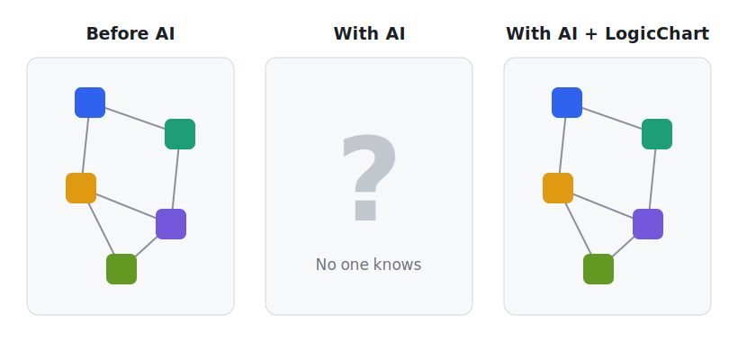

# LogicChart

**Local-first static analyzer that turns code into navigable decision flowcharts for humans and coding agents. Deterministic, 10 languages, no API key.**



In the AI era it is easy to lose track of what your own code does. You ship fast, then end up
unsure how it works or fits together, until no one really knows. LogicChart turns the code
back into a navigable map of its decisions, so you can see it, reason about it, and spot what
to change or where the gaps are.

It reads your source (never running it) and turns the branching logic into clear, clickable flowcharts: the `if` / `switch` / `match`
paths, the error handling, and the calls that link one piece to the next. Deterministic and offline: the same code always gives the same result.

One model covers **a single function, one part of the system (`backend/`, `frontend/`,
`edge/`), or the whole codebase**, and you can zoom between them. It is committed to git as a
machine-readable model, reviewable flowcharts, and an interactive viewer, for people and
coding agents alike. Every finding is tagged by confidence (`VERIFIED`, `INFERRED`, or
`POTENTIAL_GAP`), so a fact is never dressed up as a guess.

> **Status:** early alpha. The logical model is versioned, but its schema may still evolve
> before 1.0.
>
> **Latest release:** [v0.4.1](https://github.com/ferdinandobons/LogicChart/releases/tag/v0.4.1) ·
> [Changelog](CHANGELOG.md)

## See it in 30 seconds

This Next.js route handler switches on `user.status` but forgets a case the `UserStatus`
enum declares:

```ts
switch (user.status) {            // user.status: UserStatus { ACTIVE, SUSPENDED, DELETED }
  case UserStatus.ACTIVE:    return Response.json(user);
  case UserStatus.SUSPENDED: return new Response("Blocked", { status: 403 });
  // no default, and DELETED is never handled
}
```

`logicchart analyze` writes this line to the committed report, names the exact missing
member, and labels how it knows:

```text
- **WARNING · INFERRED · enum_exhaustiveness** Declared UserStatus members not handled for user.status: UserStatus.DELETED
```

`INFERRED` means a deterministic heuristic over the declared enum, not a guess. That is the
**only** finding across the bundled demo's 10-language, 3-scope codebase. The model stays
precise as it scales. Run it yourself on [`examples/demo`](examples/demo).

## What it's good for

In review and refactoring, at any scope from one function to the whole repo:

- **Catch missing cases** before code review: a `switch` / `match` / `if`-chain with no fallback.
- **Check state handling is consistent** across sibling flows: a status one route handles
  but another silently drops, even across files and languages.
- **See change impact**: which entry points are reachable from the service you're about to edit.
- **Reason about a whole codebase or one macro-part** (backend, frontend, or edge) from a single model.
- **Give coding agents a deterministic control-flow map** they can query instead of re-reading files.

## Install

LogicChart is not on PyPI yet. Install it from source with [uv](https://docs.astral.sh/uv/):

```bash
git clone https://github.com/ferdinandobons/LogicChart.git logicchart
cd logicchart
uv tool install .            # the `logicchart` command, available everywhere
# uv tool install '.[mcp]'   # include the optional MCP server
```

For development (run without installing globally):

```bash
uv sync --extra dev --extra mcp
uv run logicchart --help     # prefix commands with `uv run`
```

## Quick Start

From the project you want to analyze:

```bash
logicchart analyze --full
logicchart view
```

No `init` step is required. LogicChart has useful defaults and analyzes the current
directory (`.`) unless you pass another path. Add configuration only when you need custom
roots, excludes, scopes, entrypoints, output directories, or gated detectors.

You get three files under `logicchart-out/`:

| File | Purpose |
|---|---|
| `logic-flow.json` | canonical model, consumed by the CLI and MCP; **commit it** |
| `logic-flow.md` | reviewable Mermaid flowcharts + a findings list; **commit it** |
| `logic-flow.html` | navigable local viewer (tree + expand-in-place canvas + source/findings); regenerated, git-ignored |

In the Markdown report, `VERIFIED` / `INFERRED` findings sit in the main section and
`POTENTIAL_GAP` review candidates are folded under a collapsible block (`--include-gaps`
expands it). A file that can't be parsed is skipped and reported, never aborting the run.

## Commands

Every command takes the project path as a positional argument (default `.`). Examples below
run against the bundled [`examples/demo`](examples/demo).

### `analyze`: build the model

```bash
logicchart analyze examples/demo --full
```
```text
Analyzed 14 files: 25 flows, 1 finding.
Incremental cache: 0 hits, 14 changed, 0 deleted.
Wrote .../logic-flow.json
Wrote .../logic-flow.md
Wrote .../logic-flow.html
```
`--full` ignores the incremental cache; `--no-html` skips the viewer; `--include-gaps`
expands the review-only findings in the Markdown. Use `--profile demo`, `--profile self`, or
`--profile project` when you want the public example artifact, a dogfood map of LogicChart's
own internals, or a whole-checkout map written to separate output directories.

### `update`: incrementally refresh

```bash
logicchart update examples/demo
```
Re-analyzes only the files whose contents changed (content-hash cache), then rewrites the
JSON and Markdown. Commit those two files after a substantial change.

### `query`: ask the model a question

```bash
logicchart query "where is suspended user status handled?" --path examples/demo
```
```text
1. POST [route] frontend/app/api/users/route.ts:4
   score=19 · `user` appears in a decision or action; `user` appears in a review finding; `status` appears in a decision or action
2. statusLabel [function] frontend/lib/status.js:3
   score=13 · `suspended` appears in a decision or action; `status` matches the flow identity; `status` appears in a decision or action
```
Ranks the flows most relevant to a behavior, state, or decision. Add `--json` for
machine-readable output. Query ranking uses flow identity, path/scope/language structure,
decision metadata, and finding text, so agent-style questions can target more than just
labels. Restrict with `--scope`, `--language`, or `--finding-kind`:

```bash
logicchart query "order status" --path examples/demo --scope backend
logicchart query "enum exhaustiveness" --path examples/demo --finding-kind enum_exhaustiveness
```

### `impact`: what does a change touch?

```bash
logicchart impact backend/users.py --path examples/demo
```
```text
Changed files: 1
Directly impacted flows: 3
Transitively impacted flows: 0
Related review findings: 0

Direct impact:
- Repository.fetch (backend/users.py:9)
- get_user (backend/users.py:23)
- load_user (backend/users.py:32)
```
With no file arguments it uses `git diff` to infer what changed. `--scope <name>` limits the
impact set to one macro-part.

### `view`: navigable codebase viewer

```bash
logicchart view examples/demo
```
Renders `logic-flow.html` and serves it at `http://127.0.0.1:8765/logic-flow.html`: one navigable model of the
whole codebase. The left rail is the directory tree; the center is an **expand-in-place
canvas** (scope super-nodes unfold into a scope's flows, and a flow unfolds into its decision
chart, in place); the right column shows the selected flow's **source** and its **logical
errors**. The left rail includes flow search and language filtering; the errors panel includes
a prioritized review queue. Selecting a block, a source line, a tree file, or a finding
highlights the others, and a full-screen toggle maximizes the canvas. Add `--render-only` to
write the HTML without serving.


### `validate`: check the artifact contract

```bash
logicchart validate
logicchart validate --check-sync
```

Validates `logic-flow.json` against the bundled schema and the current analyzer registry.
`--check-sync` re-analyzes sources and fails if the committed model is stale.

### `init` / `install` / `mcp`

These commands are optional. Use them after the first successful analysis when you want
project configuration, persistent agent instructions, or MCP integration.

```bash
logicchart init
logicchart install
logicchart mcp .
```

## Whole codebase and scopes

One model can hold an entire polyglot repo. Declare the macro-parts once, and every command
(and the viewer) can be restricted to one of them:

```toml
[logicchart.scopes]
backend  = ["backend/**", "services/**"]
frontend = ["frontend/**", "web/**"]
edge     = ["edge/**", "workers/**"]
```

With no `[logicchart.scopes]` block, the top-level directory is the inferred scope, so a
codebase splits into backend/frontend/edge-style parts out of the box. Pass `--scope
<name>` to `query` and `impact`, and use the scope and language filters in the viewer, to
reason about one part at a time or the whole system at once. Every flow records the scope(s)
it belongs to, and the Markdown header summarizes the breakdown (e.g. `backend (16) · edge
(3) · frontend (6)`).

## Supported Code

**Languages: 10 for control flow.** Control flow (functions,
methods, `if` / `else`, `switch` / `match`, exceptions, returns, and the internal calls that
link flows) is extracted from:

| | |
|---|---|
| **Python** (`.py`) | full AST analyzer |
| **TypeScript / TSX** (`.ts`, `.tsx`) and **JavaScript** (`.js`, `.jsx`, `.mjs`, `.cjs`) | tree-sitter analyzer |
| **Go** (`.go`), **Java** (`.java`), **C#** (`.cs`), **PHP** (`.php`), **C** (`.c`, `.h`), **Rust** (`.rs`), **Ruby** (`.rb`) | profile-driven tree-sitter engine |

A new control-flow language is a small *profile* (grammar vocabulary + a few extractors), not
a bespoke analyzer, so coverage grows without forking the pipeline. Language-specific
correctness is respected: e.g. a Rust `match` is compiler-exhaustive, so it is never flagged
for a missing `default`.

**Framework-aware entry points:**

- FastAPI routes
- Next.js route handlers, middleware, server actions, pages, and layouts
- Shallow React components, hooks, and event handlers
- Public/exported functions, package-level functions and methods, CLI commands, and tests

**Limitations (by design):** LogicChart does not run your code, trace runtime behavior, do
full symbolic execution, or reconstruct deep React state. "Shallow" React means it reads the
structure of a component and its hooks, not what they render across re-renders; treat those
findings as review candidates. It maps each entry point's own control flow plus the internal
calls that connect flows, not arbitrarily deep call chains.

## Evidence Levels

- `VERIFIED`: directly extracted from syntax or framework conventions.
- `INFERRED`: produced by an explainable deterministic heuristic.
- `POTENTIAL_GAP`: a review candidate, never automatically treated as a bug.

## Finding Kinds

Single-flow (reason about one flow):

- `missing_branch`: a `match` / `switch` or `if` / `elif` chain on a state-like subject with no explicit `else` / `default`.
- `dead_code`: code after a point where every path already returned or raised.
- `broad_except_swallow`: an exception handler that silently discards the error: an empty body or one that only logs it, with no re-raise or error return.
- `no_op_branch`: an explicit `if` branch with an empty body.
- `asymmetric_return`: a dispatch where most cases return/raise but one falls through (a likely missing return).
- `dead_guard`: a truthiness guard on a module-level boolean constant, so one branch is always dead.

Cross-flow (compare sibling flows):

- `inconsistent_case_handling`: a value a strict majority of sibling flows branching on the same subject and enum/union handle, but which this flow omits with no explicit default.
- `enum_exhaustiveness`: a flow dispatches on a declared enum (handling several members) but omits other declared members, with no explicit default.
- `outcome_inconsistency`: the same `subject == value` condition resolves to a different outcome here (e.g. raise 404) than the majority of sibling flows (e.g. raise 410).
- `logging_asymmetry`: a guard that a sibling flow logs/alerts on while rejecting (raising) is handled silently here.
- `auth_divergence` (gated, opt-in via `gated_detectors`): an entry point that skips the authorization check its file-mates perform. Middleware/DI can authorize invisibly, so it is a review candidate.

## Configuration

LogicChart works without a config file. Run `logicchart init` only when the defaults are not
enough; it creates:

```toml
[logicchart]
source_roots = ["."]
exclude = []
include_public_functions = true
max_call_depth = 4
output_dir = "logicchart-out"
self_exclude = true
gated_detectors = false

[logicchart.entrypoints]
include = []
exclude = []

# Named macro-parts of the codebase (otherwise the top-level directory is the scope):
# [logicchart.scopes]
# backend = ["backend/**", "services/**"]
# frontend = ["frontend/**", "web/**"]
# edge = ["edge/**", "workers/**"]
```

`gated_detectors` (default `false`) enables opt-in, review-tier detectors such as
`auth_divergence` that are more prone to false positives (middleware/DI can authorize
invisibly), so they are off unless you turn them on.

`self_exclude` (default `true`) keeps LogicChart's own installed package (and, when you
analyze its source checkout, its `tests/`) out of the generated model, so the artifact is
never polluted by the tool scanning its own internals.

Use `.logicchartignore` for generated files or directories that should not be analyzed.

Built-in profiles are shortcuts layered on top of config and ignore rules:

| Profile | Source roots | Output directory | Use |
|---|---|---|---|
| `demo` | `examples` | `logicchart-out/` | public demo artifact |
| `self` | `src/logicchart` | `logicchart-out/self/` | dogfood map for LogicChart internals |
| `project` | `src`, `tests`, `examples` | `logicchart-out/project/` | whole-checkout map for agents |

## Advanced: agents and MCP

> Optional: start with Quick Start above. These wire LogicChart into coding agents and tooling.
> The recommended architecture is CLI-first, MCP-enhanced: use commands for the explicit
> artifact lifecycle and MCP for agent-native, token-bounded context retrieval.

### Agent instructions

Install persistent instructions that tell coding agents to consult and refresh LogicChart:

```bash
logicchart install
logicchart install --mcp-config codex  # optional: also write project-scoped MCP config
```

This updates supported project-level files:

- `AGENTS.md` for Codex
- `CLAUDE.md` for Claude Code
- `GEMINI.md` for Gemini CLI
- `.cursor/rules/logicchart.mdc` for Cursor

Use `--platform codex`, `claude`, `gemini`, or `cursor` to install one target only.
Use `--mcp-config codex`, `claude`, `cursor`, or `all` when you also want project-scoped
MCP configuration generated for clients that support it.

### MCP server

Install the optional MCP dependency (from the source checkout, since LogicChart is not on
PyPI yet):

```bash
uv tool install '.[mcp]'   # or, for development: uv sync --extra mcp
```

Start the stdio server in the analyzed project:

```bash
logicchart mcp .
```

`logicchart install --mcp-config ...` can generate this for supported clients. The underlying
stdio shape is:

```json
{
  "mcpServers": {
    "logicchart": {
      "command": "logicchart",
      "args": ["mcp", "/absolute/path/to/project"]
    }
  }
}
```

Available tools:

- `logicchart_summary`: flow/entrypoint counts and findings by kind/severity/evidence
- `list_flows`
- `get_flow`
- `query_logic`
- `get_findings`
- `explain_finding_chain`: the deterministic evidence chain behind one finding
- `where_state_handled`: every flow branching on a domain/value-namespace and the values it covers
- `find_decision_nodes`: structured search over decision nodes (domain/subject/missing-fallback)
- `analyze_impact`
- `review_queue`: prioritized findings for the current scope or whole model
- `context_pack`: compact summary + query + impact + review context for an agent turn
- `validate_artifacts`
- `update_logicchart`

Every query/list tool accepts a `token_budget` cap so an agent can bound how much context a
single call returns.

## Roadmap

Planned future evolutions, premature for an early, solo-maintained project but a natural fit
once a team is using LogicChart in earnest:

- **CI diff gate**: compare two `logic-flow.json` snapshots and fail a pull request when a
  finding is newly introduced (with SARIF output for code scanning).
- **Git auto-sync hooks**: managed post-commit and post-checkout hooks (plus a union merge
  driver for `logic-flow.json`) that keep the committed model fresh automatically.

## Development

```bash
uv run ruff check .
uv run ruff format --check .
uv run mypy
uv run pytest --cov
```

The canonical artifact format is documented by
[schema/logic-flow.schema.json](schema/logic-flow.schema.json).

## License

Apache License 2.0. See [LICENSE](LICENSE).

LogicChart was created by Ferdinando Bonsegna. If you use, fork, or build on it,
please keep the [`NOTICE`](NOTICE) file intact and credit the project with a link
back to this repository.
