# CodeDebrief Decision Flows

> Generated from source code. Do not edit this file manually.

- **Generated:** `2026-06-22T15:45:50.249053+00:00`
- **Source root:** `.`
- **Flows:** 768
- **Entry points:** 98
- **Scopes:** src (768)

## Project Map

```mermaid
flowchart TD
  mflow_e2ace1187b00c406["annotate_reachability"]
  mflow_015cbb9dba10bc38["attach_qualified_calls"]
  mflow_5c698aad616a3f74["branch"]
  mflow_096aba45031d1581["call_is_boundary"]
  mflow_7079be3cc694ab07["decision_identity"]
  mflow_4da6708cd24ae652["decision_metadata"]
  mflow_583b079f636a5c5c["dependency_paths_from_import_map"]
  mflow_1312062618000804["domain_from_subject"]
  mflow_0a938ac22c3d4a0f["effect_tags"]
  mflow_0374b35a83f10ed3["is_functional_condition"]
  mflow_ef0ccad6a42706c1["parse_subject_operator"]
  mflow_4397f1ecaf5babfe["require_tree_sitter_parse_ok"]
  mflow_9d83fef91e82ee3e["resolve_qualified"]
  mflow_e1f4f60322e6c9cd["tag_call_effects"]
  mflow_b59fd756a5e92663["tree_sitter_parse_error"]
  mflow_f86136d536b3b0e3["value_namespace"]
  mflow_59dc94f2dc874f78["discover_source_files"]
  mflow_62494c07444429a5["container_definitions"]
  mflow_70d4c0764c5a4a2b["module_name"]
  mflow_55c99c11e3b00de2["named"]
  mflow_bddba54a0bd0e8e3["text"]
  mflow_51a471d96c0a366a["build_analyzer"]
  mflow_1e1a30b0272b3a62["build_analyzer"]
  mflow_b488f945011401ba["build_analyzer"]
  mflow_caefe91b63c4c911["build_analyzer"]
  mflow_1799ef39fd2881dd["build_analyzer"]
  mflow_9f1dc0fd76dcbd1c["build_analyzer"]
  mflow_7c734a4d207716a9["build_analyzer"]
  mflow_67d35c04fbb5db76["build_analyzer"]
  mflow_eefe5b3ad61fd370["language_capability_matrix"]
  mflow_4cda4da54add37a4["language_for"]
  mflow_90116d716276b40b["spec_for_language"]
  mflow_2f599ed46ede62b6["spec_for_path"]
  mflow_54d5b78789eff3d4["supported_language_ids"]
  mflow_6f03fa6c1740379b["supported_suffixes"]
  mflow_f031af6d79145abb["artifact_model_hash"]
  mflow_e54d5bf7e8f9431c["load_model"]
  mflow_0a9a79456485739e["load_model_with_hash"]
  mflow_5830f690e9b7ee88["model_hash_path"]
  mflow_ea178bb69574e1cf["output_paths"]
  mflow_60369a6990d8c14b["write_artifacts"]
  mflow_d6452309de1ab682["build_parser"]
  mflow_1792b68cca289a2d["main"]
  mflow_9cfaad5a36dcf3db["config_path_candidates"]
  mflow_091432e7fa64215b["default_config_path"]
  mflow_3d4a815f46778983["find_config_path"]
  mflow_1126daa8b250254d["legacy_config_path"]
  mflow_36092a2ab749d529["doctor_report"]
  mflow_d691287530df41c7["render_doctor"]
  mflow_5c933b42f79a0549["render_doctor_json"]
  mflow_834ec2a66ca14e5b["append_error_event"]
  mflow_6fcd8ee97d96f890["clear_error_events"]
  mflow_e33fc83c60f2f224["error_log_path"]
  mflow_d4ec84fd8e7a8acd["error_report"]
  mflow_19ec09e3bad05fc3["read_error_events"]
  mflow_31fface104e956b4["render_error_report"]
  mflow_305189dc932cc872["render_error_report_json"]
  mflow_9c6b73e81123f77a["install_agent_instructions"]
  mflow_97b1d566532a3dc3["install_agent_skill"]
  mflow_44dc5c734dd784e6["install_all"]
  mflow_bdde402d2caf86a0["install_mcp_config"]
  mflow_e0d0c0d1be37564f["flow_in_agent_scope"]
  mflow_1636f828012f92a5["model_hash"]
  mflow_66a9c0f0a5f9ccdf["run_mcp"]
  mflow_dc395fad87adcb30["model_quality"]
  mflow_3b2e9d5a4dc70470["render_quality"]
  mflow_ee8b848518ad09c1["flow_in_scope"]
  mflow_f0e9f1febb371f27["flow_navigation"]
  mflow_0abd6e704506391c["flow_summary"]
  mflow_55f5f0d5392b7280["git_changed_files"]
  mflow_5e1e3176d3fe33cf["impact_model"]
  mflow_f4c2517abe35c26f["query_model"]
  mflow_9b792940c0671f1f["warm_query_index"]
  mflow_8d5c3cd9b979b878["onSelection"]
  mflow_b159a9342157d3ee["onKeydown"]
  mflow_14e5847056f575cd["render_html"]
  mflow_e6e3d9b87ded95cd["render_markdown"]
  mflow_078b00e177fdc299["attach_source_snippets"]
  mflow_b7bf469fe28139f6["build_language_index"]
  mflow_e2ea868e1d43beb1["build_payload"]
  mflow_ba9e5c682aa3df05["build_scope_edges"]
  mflow_bfc0d6ca78fa769d["build_scope_index"]
  mflow_80875cd0d9b3e393["build_tree"]
  mflow_4afaa7d9f48f292f["render_subgraph_snapshot"]
  mflow_eeaa662f08f655f3["unsupported_snapshot_format"]
  mflow_ab7aeeaa564a101f["atomic_write_text"]
  mflow_3c9f3faba152857b["atomic_write_text_batch"]
  mflow_d0a808add4efb9a6["compact_text"]
  mflow_86b5b892f6dc3f19["file_sha256"]
  mflow_0fa92d39b4af0c14["metadata_scope_names"]
  mflow_448029bb28a76201["project_update_lock"]
  mflow_b9a15cd083dca324["read_json"]
  mflow_415458e3baa7c9d5["relpath"]
  mflow_99cd1813fa5a7162["stable_id"]
  mflow_d7d07c3a9ba0ab57["write_json"]
  mflow_27c538869a2abf8e["schema_file_language_ids"]
  mflow_537e9f294eb47c5e["schema_language_ids"]
  mflow_5fc813f14bd7cf2c["validate_codedebrief"]
  mflow_08538b215f1413f0["_reach"]
  mflow_e2ace1187b00c406 --> mflow_08538b215f1413f0
  mflow_015cbb9dba10bc38 --> mflow_9d83fef91e82ee3e
  mflow_7079be3cc694ab07 --> mflow_f86136d536b3b0e3
  mflow_4da6708cd24ae652 --> mflow_d0a808add4efb9a6
  mflow_4da6708cd24ae652 --> mflow_ef0ccad6a42706c1
  mflow_4da6708cd24ae652 --> mflow_7079be3cc694ab07
  mflow_1b2a40837a390446["_McpModelStore.replace"]
  mflow_583b079f636a5c5c --> mflow_1b2a40837a390446
  mflow_583b079f636a5c5c --> mflow_415458e3baa7c9d5
  mflow_edc80874a9f77860["_to_snake"]
  mflow_0a938ac22c3d4a0f --> mflow_edc80874a9f77860
  mflow_4397f1ecaf5babfe --> mflow_b59fd756a5e92663
  mflow_e1f4f60322e6c9cd --> mflow_0a938ac22c3d4a0f
  mflow_a6357d533c01ecae["_first_tree_sitter_error"]
  mflow_b59fd756a5e92663 --> mflow_a6357d533c01ecae
  mflow_9dc3100fee7e00c6["_self_exclude_roots"]
  mflow_59dc94f2dc874f78 --> mflow_9dc3100fee7e00c6
  mflow_59dc94f2dc874f78 --> mflow_6f03fa6c1740379b
  mflow_adcefdc1fae2c19e["_resolved_relpath"]
  mflow_59dc94f2dc874f78 --> mflow_adcefdc1fae2c19e
  mflow_70d4c0764c5a4a2b --> mflow_1b2a40837a390446
  mflow_5af9d73548e0f520["_suffixes_for_language"]
  mflow_eefe5b3ad61fd370 --> mflow_5af9d73548e0f520
  mflow_f315eed4e8576c8a["_capability_limitations"]
  mflow_eefe5b3ad61fd370 --> mflow_f315eed4e8576c8a
  mflow_4cda4da54add37a4 --> mflow_2f599ed46ede62b6
  mflow_53b7cef923991c32["ProjectModel.from_dict"]
  mflow_e54d5bf7e8f9431c --> mflow_53b7cef923991c32
  mflow_df789d38cf4c0fd2["_read_model_payload"]
  mflow_e54d5bf7e8f9431c --> mflow_df789d38cf4c0fd2
  mflow_0a9a79456485739e --> mflow_ea178bb69574e1cf
  mflow_0704096a448c5e5f["_read_model_payload_from_path"]
  mflow_0a9a79456485739e --> mflow_0704096a448c5e5f
  mflow_0a9a79456485739e --> mflow_53b7cef923991c32
  mflow_537831eefbbd961a["_model_hash_for_payload"]
  mflow_0a9a79456485739e --> mflow_537831eefbbd961a
  mflow_5830f690e9b7ee88 --> mflow_ea178bb69574e1cf
  mflow_1f428161c28782e7["_model_hash_path_for_json"]
  mflow_5830f690e9b7ee88 --> mflow_1f428161c28782e7
  mflow_a08d201d6385dacb["CodeDebriefConfig.load"]
  mflow_ea178bb69574e1cf --> mflow_a08d201d6385dacb
  mflow_60369a6990d8c14b --> mflow_ea178bb69574e1cf
  mflow_60369a6990d8c14b --> mflow_e6e3d9b87ded95cd
  mflow_60369a6990d8c14b --> mflow_3c9f3faba152857b
  mflow_9d69349d28c36444["_write_model_hash_sidecar"]
  mflow_60369a6990d8c14b --> mflow_9d69349d28c36444
  mflow_060df2e21e33c06a["_add_setup_parser"]
  mflow_d6452309de1ab682 --> mflow_060df2e21e33c06a
  mflow_d8d818d78a502d90["_add_profile_argument"]
  mflow_d6452309de1ab682 --> mflow_d8d818d78a502d90
  mflow_1792b68cca289a2d --> mflow_d6452309de1ab682
  mflow_d19c8d6812b63cee["_setup_agent"]
  mflow_1792b68cca289a2d --> mflow_d19c8d6812b63cee
  mflow_93b8ffd0932c7a23["_analyze"]
  mflow_1792b68cca289a2d --> mflow_93b8ffd0932c7a23
  mflow_e13db08e33a1b491["_view"]
  mflow_1792b68cca289a2d --> mflow_e13db08e33a1b491
  mflow_0addea45cb59634b["_validate"]
  mflow_1792b68cca289a2d --> mflow_0addea45cb59634b
  mflow_7b948333c4fb55c6["_quality_thresholds"]
  mflow_1792b68cca289a2d --> mflow_7b948333c4fb55c6
  mflow_b33f6fd787427aa4["_doctor"]
  mflow_1792b68cca289a2d --> mflow_b33f6fd787427aa4
  mflow_9cd1bbaca29434ae["_clear"]
  mflow_1792b68cca289a2d --> mflow_9cd1bbaca29434ae
  mflow_1792b68cca289a2d --> mflow_a08d201d6385dacb
  mflow_1792b68cca289a2d --> mflow_66a9c0f0a5f9ccdf
  mflow_1792b68cca289a2d --> mflow_834ec2a66ca14e5b
  mflow_699a5fba113ff0b9["_args_root"]
  mflow_1792b68cca289a2d --> mflow_699a5fba113ff0b9
  mflow_9cfaad5a36dcf3db --> mflow_1126daa8b250254d
  mflow_9cfaad5a36dcf3db --> mflow_091432e7fa64215b
  mflow_886f301a355256de["_legacy_mcp_configs"]
  mflow_36092a2ab749d529 --> mflow_886f301a355256de
  mflow_ebab940cb18e5532["_package_version"]
  mflow_36092a2ab749d529 --> mflow_ebab940cb18e5532
  mflow_3851267ae01e5fb4["_package_location"]
  mflow_36092a2ab749d529 --> mflow_3851267ae01e5fb4
  mflow_aa856748e89529cc["_repair_command"]
  mflow_36092a2ab749d529 --> mflow_aa856748e89529cc
  mflow_d642203c5d78bf99["_language_capability_summary"]
  mflow_36092a2ab749d529 --> mflow_d642203c5d78bf99
  mflow_834ec2a66ca14e5b --> mflow_e33fc83c60f2f224
  mflow_6fcd8ee97d96f890 --> mflow_e33fc83c60f2f224
  mflow_e33fc83c60f2f224 --> mflow_a08d201d6385dacb
  mflow_e33fc83c60f2f224 --> mflow_ea178bb69574e1cf
  mflow_d4ec84fd8e7a8acd --> mflow_e33fc83c60f2f224
  mflow_d4ec84fd8e7a8acd --> mflow_19ec09e3bad05fc3
  mflow_19ec09e3bad05fc3 --> mflow_e33fc83c60f2f224
  mflow_950fc78b52ebaf5a["_upsert"]
  mflow_9c6b73e81123f77a --> mflow_950fc78b52ebaf5a
  mflow_9c6b73e81123f77a --> mflow_ab7aeeaa564a101f
  mflow_97b1d566532a3dc3 --> mflow_ab7aeeaa564a101f
  mflow_44dc5c734dd784e6 --> mflow_9c6b73e81123f77a
  mflow_44dc5c734dd784e6 --> mflow_97b1d566532a3dc3
  mflow_44dc5c734dd784e6 --> mflow_bdde402d2caf86a0
  mflow_e0d0c0d1be37564f --> mflow_0fa92d39b4af0c14
  mflow_27c96d12852e1300["_compute_model_hash"]
  mflow_1636f828012f92a5 --> mflow_27c96d12852e1300
  mflow_66a9c0f0a5f9ccdf --> mflow_a08d201d6385dacb
  mflow_2421205fbe607134["_project_modules"]
  mflow_dc395fad87adcb30 --> mflow_2421205fbe607134
  mflow_17f010a744859e07["_project_call_names"]
  mflow_dc395fad87adcb30 --> mflow_17f010a744859e07
  mflow_aef37cc5c849d0bf["_target_flow_ids"]
  mflow_dc395fad87adcb30 --> mflow_aef37cc5c849d0bf
  mflow_4987ce2291f35fa7["_runtime_or_dynamic_call"]
  mflow_dc395fad87adcb30 --> mflow_4987ce2291f35fa7
  mflow_c7fabf8f769ee295["_generic_label_nodes"]
  mflow_dc395fad87adcb30 --> mflow_c7fabf8f769ee295
  mflow_6785e72fce02129e["_source_location_nodes"]
  mflow_dc395fad87adcb30 --> mflow_6785e72fce02129e
  mflow_736ef7565a081f4b["_skipped_files"]
  mflow_dc395fad87adcb30 --> mflow_736ef7565a081f4b
  mflow_31f3f33f28108f22["_parse_error_files"]
  mflow_dc395fad87adcb30 --> mflow_31f3f33f28108f22
  mflow_2aec9a1cb860b831["_flow_distribution"]
  mflow_dc395fad87adcb30 --> mflow_2aec9a1cb860b831
  mflow_d6e53cde0159b500["_ratio"]
  mflow_dc395fad87adcb30 --> mflow_d6e53cde0159b500
  mflow_50b57275a3780e1e["_language_depth"]
  mflow_dc395fad87adcb30 --> mflow_50b57275a3780e1e
  mflow_e37edd994cbfe62f["_format_counts"]
  mflow_3b2e9d5a4dc70470 --> mflow_e37edd994cbfe62f
  mflow_ee8b848518ad09c1 --> mflow_0fa92d39b4af0c14
  mflow_b7f147fd9ac406bf["_resolve_flow_target"]
  mflow_f0e9f1febb371f27 --> mflow_b7f147fd9ac406bf
  mflow_f8aeed5b3b9775cc["_query_index"]
  mflow_f0e9f1febb371f27 --> mflow_f8aeed5b3b9775cc
  mflow_f0e9f1febb371f27 --> mflow_0fa92d39b4af0c14
  mflow_f0e9f1febb371f27 --> mflow_0abd6e704506391c
  mflow_e5555c4c94de85a8["_navigation_cap"]
  mflow_f0e9f1febb371f27 --> mflow_e5555c4c94de85a8
  mflow_6d7db55e5f37a930["_related_flow_summaries"]
  mflow_f0e9f1febb371f27 --> mflow_6d7db55e5f37a930
  mflow_29680288d8a2594c["_decision_navigation"]
  mflow_f0e9f1febb371f27 --> mflow_29680288d8a2594c
  mflow_0abd6e704506391c --> mflow_0fa92d39b4af0c14
  mflow_3d8fd8bcf1660e3f["_normalize_path"]
  mflow_5e1e3176d3fe33cf --> mflow_3d8fd8bcf1660e3f
  mflow_bdebf4dc27930c21["_unique"]
  mflow_5e1e3176d3fe33cf --> mflow_bdebf4dc27930c21
  mflow_5e1e3176d3fe33cf --> mflow_f8aeed5b3b9775cc
  mflow_d82da3fad6c2ee1e["_target_flow_impact"]
  mflow_5e1e3176d3fe33cf --> mflow_d82da3fad6c2ee1e
  mflow_340cdd4e2a597275["_target_symbol_impact"]
  mflow_5e1e3176d3fe33cf --> mflow_340cdd4e2a597275
  mflow_79711bab963c11a3["_record_in_scope"]
  mflow_5e1e3176d3fe33cf --> mflow_79711bab963c11a3
  mflow_c95ce8409a19845a["_unique_flows"]
  mflow_5e1e3176d3fe33cf --> mflow_c95ce8409a19845a
  mflow_c7d18c917abf7ead["_path_matches_dependency"]
  mflow_5e1e3176d3fe33cf --> mflow_c7d18c917abf7ead
  mflow_5e1e3176d3fe33cf --> mflow_ee8b848518ad09c1
  mflow_f3359c49658140bd["_terms"]
  mflow_f4c2517abe35c26f --> mflow_f3359c49658140bd
  mflow_f4c2517abe35c26f --> mflow_f8aeed5b3b9775cc
  mflow_3349a8dd4c4452d7["_copy_query_matches"]
  mflow_f4c2517abe35c26f --> mflow_3349a8dd4c4452d7
  mflow_cfd241dbad13f1eb["_structured_record_filter_reasons"]
  mflow_f4c2517abe35c26f --> mflow_cfd241dbad13f1eb
  mflow_74b9c4bdc7e0c3f5["_cache_query_matches"]
  mflow_f4c2517abe35c26f --> mflow_74b9c4bdc7e0c3f5
  mflow_9b792940c0671f1f --> mflow_f8aeed5b3b9775cc
  mflow_d6e1e9d19c257cb1["renderSource"]
  mflow_8d5c3cd9b979b878 --> mflow_d6e1e9d19c257cb1
  mflow_6285a59fc2648bd2["flushAnnounce"]
  mflow_8d5c3cd9b979b878 --> mflow_6285a59fc2648bd2
  mflow_a036f2851d64996b["moveFocus"]
  mflow_b159a9342157d3ee --> mflow_a036f2851d64996b
  mflow_04cd4b3395bf21ed["isExpandable"]
  mflow_b159a9342157d3ee --> mflow_04cd4b3395bf21ed
  mflow_3b7d5430ab0d4064["isExpanded"]
  mflow_b159a9342157d3ee --> mflow_3b7d5430ab0d4064
  mflow_d3446e91e8397682["rowChildren"]
  mflow_b159a9342157d3ee --> mflow_d3446e91e8397682
  mflow_502461a2dc889de2["focusRow"]
  mflow_b159a9342157d3ee --> mflow_502461a2dc889de2
  mflow_17356bbc7f70041e["parentRow"]
  mflow_b159a9342157d3ee --> mflow_17356bbc7f70041e
  mflow_830c641f266d8db6["visibleRows"]
  mflow_b159a9342157d3ee --> mflow_830c641f266d8db6
  mflow_14e5847056f575cd --> mflow_e2ea868e1d43beb1
  mflow_14e5847056f575cd --> mflow_1b2a40837a390446
  mflow_580bd57a934b379b["_asset"]
  mflow_14e5847056f575cd --> mflow_580bd57a934b379b
  mflow_1a50887a69b79e8c["_inline_js"]
  mflow_14e5847056f575cd --> mflow_1a50887a69b79e8c
  mflow_1baeca2bdf56712c["_optional_inline_js"]
  mflow_14e5847056f575cd --> mflow_1baeca2bdf56712c
  mflow_3341e2b628e835e8["_code_span"]
  mflow_e6e3d9b87ded95cd --> mflow_3341e2b628e835e8
  mflow_4e64fa247d7f1f23["_project_map"]
  mflow_e6e3d9b87ded95cd --> mflow_4e64fa247d7f1f23
  mflow_6a1aa1267b2e6fae["_flow_section"]
  mflow_e6e3d9b87ded95cd --> mflow_6a1aa1267b2e6fae
  mflow_2105351d4bf5e4b7["_merge_line_ranges"]
  mflow_078b00e177fdc299 --> mflow_2105351d4bf5e4b7
  mflow_8ba3bffac157644e["_is_test_flow"]
  mflow_b7bf469fe28139f6 --> mflow_8ba3bffac157644e
  mflow_e2ea868e1d43beb1 --> mflow_80875cd0d9b3e393
  mflow_e2ea868e1d43beb1 --> mflow_bfc0d6ca78fa769d
  mflow_e2ea868e1d43beb1 --> mflow_b7bf469fe28139f6
  mflow_e2ea868e1d43beb1 --> mflow_ba9e5c682aa3df05
  mflow_e2ea868e1d43beb1 --> mflow_078b00e177fdc299
  mflow_bfc0d6ca78fa769d --> mflow_0fa92d39b4af0c14
  mflow_80875cd0d9b3e393 --> mflow_8ba3bffac157644e
  mflow_d346e32f531eea02["_new_node"]
  mflow_80875cd0d9b3e393 --> mflow_d346e32f531eea02
  mflow_e1a5ef1efcdfba58["_insert_path"]
  mflow_80875cd0d9b3e393 --> mflow_e1a5ef1efcdfba58
  mflow_3b30d23af3ce4032["_prune_empty"]
  mflow_80875cd0d9b3e393 --> mflow_3b30d23af3ce4032
  mflow_a7ad82a8d0ae3774["_sort_children"]
  mflow_80875cd0d9b3e393 --> mflow_a7ad82a8d0ae3774
  mflow_da7b3468f1c29584["_unique"]
  mflow_4afaa7d9f48f292f --> mflow_da7b3468f1c29584
  mflow_b28ad80d40ee21d0["_subgraph_empty_error"]
  mflow_4afaa7d9f48f292f --> mflow_b28ad80d40ee21d0
  mflow_8f2bcd206e761c29["_effective_limit"]
  mflow_4afaa7d9f48f292f --> mflow_8f2bcd206e761c29
  mflow_e7610c4e39346838["_select_flow_nodes"]
  mflow_4afaa7d9f48f292f --> mflow_e7610c4e39346838
  mflow_688478abbaa0fa0c["_subgraph_layout"]
  mflow_4afaa7d9f48f292f --> mflow_688478abbaa0fa0c
  mflow_53d116f85e3c6302["_subgraph_svg"]
  mflow_4afaa7d9f48f292f --> mflow_53d116f85e3c6302
  mflow_a091604f0e40bea6["_subgraph_layout_payload"]
  mflow_4afaa7d9f48f292f --> mflow_a091604f0e40bea6
  mflow_ee08b26b0981b078["_subgraph_layout_quality"]
  mflow_4afaa7d9f48f292f --> mflow_ee08b26b0981b078
  mflow_ab7aeeaa564a101f --> mflow_1b2a40837a390446
  mflow_48c8fd10ec8c7ccd["_sibling_temp_path"]
  mflow_3c9f3faba152857b --> mflow_48c8fd10ec8c7ccd
  mflow_3c9f3faba152857b --> mflow_1b2a40837a390446
  mflow_03655a4567162a44["_rollback_batch_write"]
  mflow_3c9f3faba152857b --> mflow_03655a4567162a44
  mflow_91b034a3ee9b6f90["_clear_stale_lock"]
  mflow_448029bb28a76201 --> mflow_91b034a3ee9b6f90
  mflow_415458e3baa7c9d5 --> mflow_1b2a40837a390446
  mflow_d7d07c3a9ba0ab57 --> mflow_ab7aeeaa564a101f
  mflow_8cacf2d38696d03d["_schema_language_ids"]
  mflow_27c538869a2abf8e --> mflow_8cacf2d38696d03d
  mflow_537e9f294eb47c5e --> mflow_8cacf2d38696d03d
  mflow_5fc813f14bd7cf2c --> mflow_a08d201d6385dacb
  mflow_5fc813f14bd7cf2c --> mflow_ea178bb69574e1cf
  mflow_5fc813f14bd7cf2c --> mflow_b9a15cd083dca324
  mflow_923913d651abd41c["ValidationReport.add_error"]
  mflow_5fc813f14bd7cf2c --> mflow_923913d651abd41c
  mflow_5fc813f14bd7cf2c --> mflow_53b7cef923991c32
  mflow_8b163923ebaa56b3["_validate_languages"]
  mflow_5fc813f14bd7cf2c --> mflow_8b163923ebaa56b3
  mflow_49817651e539bb25["_validate_json_schema"]
  mflow_5fc813f14bd7cf2c --> mflow_49817651e539bb25
  mflow_c8bff39a679a25ff["_validate_quality_thresholds"]
  mflow_5fc813f14bd7cf2c --> mflow_c8bff39a679a25ff
  mflow_5fc813f14bd7cf2c --> mflow_448029bb28a76201
  mflow_a621bac584ea566f["_validate_markdown_sync"]
  mflow_5fc813f14bd7cf2c --> mflow_a621bac584ea566f
```

## Entry Point Flows

### annotate\_reachability

`function` · `python` · `generic` · [`src/codedebrief/analysis/common.py:431`](../src/codedebrief/analysis/common.py#L431)

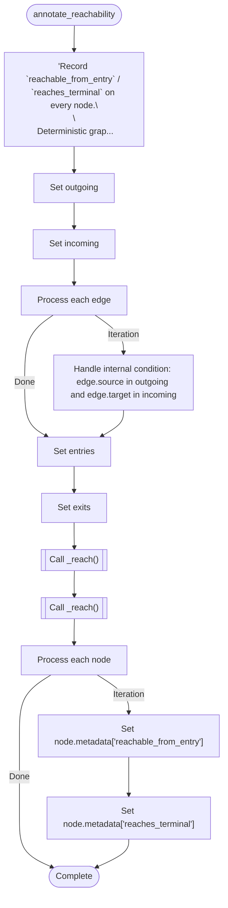

### attach\_qualified\_calls

`function` · `python` · `generic` · [`src/codedebrief/analysis/common.py:351`](../src/codedebrief/analysis/common.py#L351)

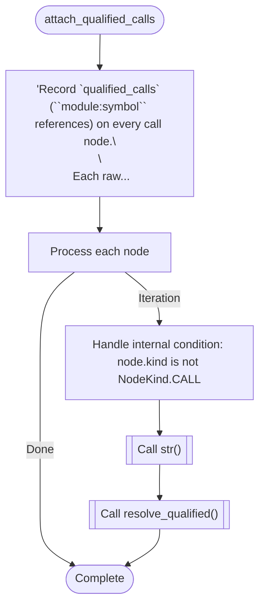

### branch

`function` · `python` · `generic` · [`src/codedebrief/analysis/common.py:220`](../src/codedebrief/analysis/common.py#L220)

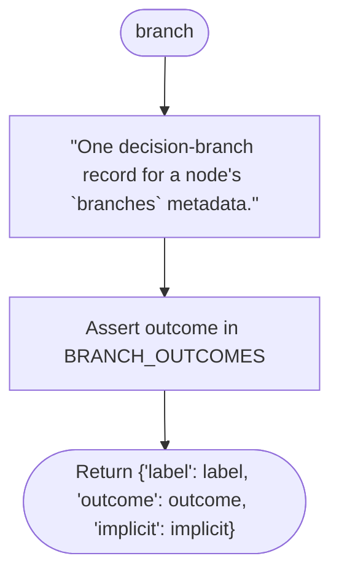

### call\_is\_boundary

`function` · `python` · `generic` · [`src/codedebrief/analysis/common.py:465`](../src/codedebrief/analysis/common.py#L465)


### decision\_identity

`function` · `python` · `generic` · [`src/codedebrief/analysis/common.py:226`](../src/codedebrief/analysis/common.py#L226)


### decision\_metadata

`function` · `python` · `generic` · [`src/codedebrief/analysis/common.py:262`](../src/codedebrief/analysis/common.py#L262)

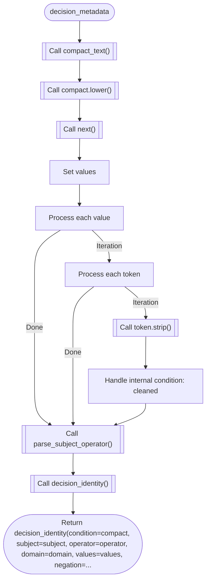

### dependency\_paths\_from\_import\_map

`function` · `python` · `generic` · [`src/codedebrief/analysis/common.py:366`](../src/codedebrief/analysis/common.py#L366)

```mermaid
flowchart TD
  mflow_583b079f636a5c5c_n1(["dependency_paths_from_import_map"])
  mflow_583b079f636a5c5c_n2["'Resolve import-map modules to first-party source paths under ``root``.\\n\\n Import maps m..."]
  mflow_583b079f636a5c5c_n3["Set dependencies"]
  mflow_583b079f636a5c5c_n4[["Call set()"]]
  mflow_583b079f636a5c5c_n5["Process each module"]
  mflow_583b079f636a5c5c_n6[["Call module.replace()"]]
  mflow_583b079f636a5c5c_n7["Set candidates"]
  mflow_583b079f636a5c5c_n8["Process each candidate"]
  mflow_583b079f636a5c5c_n9["Set path"]
  mflow_583b079f636a5c5c_n10["Handle internal condition: not path.is_file()"]
  mflow_583b079f636a5c5c_n11[["Call relpath()"]]
  mflow_583b079f636a5c5c_n12["Handle internal condition: not include_path(relative)"]
  mflow_583b079f636a5c5c_n13["Handle internal condition: relative not in seen"]
  mflow_583b079f636a5c5c_n14["Break loop"]
  mflow_583b079f636a5c5c_n15["Handle internal condition: not package_directories"]
  mflow_583b079f636a5c5c_n16["Set package_dir"]
  mflow_583b079f636a5c5c_n17["Handle internal condition: not package_dir.is_dir()"]
  mflow_583b079f636a5c5c_n18["Process each suffix"]
  mflow_583b079f636a5c5c_n19["Process each path"]
  mflow_583b079f636a5c5c_n20["Handle internal condition: not path.is_file()"]
  mflow_583b079f636a5c5c_n21[["Call relpath()"]]
  mflow_583b079f636a5c5c_n22["Handle internal condition: not include_path(relative)"]
  mflow_583b079f636a5c5c_n23["Handle internal condition: relative not in seen"]
  mflow_583b079f636a5c5c_n24(["Return dependencies"])
  mflow_583b079f636a5c5c_n1 --> mflow_583b079f636a5c5c_n2
  mflow_583b079f636a5c5c_n2 --> mflow_583b079f636a5c5c_n3
  mflow_583b079f636a5c5c_n3 --> mflow_583b079f636a5c5c_n4
  mflow_583b079f636a5c5c_n4 --> mflow_583b079f636a5c5c_n5
  mflow_583b079f636a5c5c_n5 -->|"Iteration"| mflow_583b079f636a5c5c_n6
  mflow_583b079f636a5c5c_n6 --> mflow_583b079f636a5c5c_n7
  mflow_583b079f636a5c5c_n7 --> mflow_583b079f636a5c5c_n8
  mflow_583b079f636a5c5c_n8 -->|"Iteration"| mflow_583b079f636a5c5c_n9
  mflow_583b079f636a5c5c_n9 --> mflow_583b079f636a5c5c_n10
  mflow_583b079f636a5c5c_n10 --> mflow_583b079f636a5c5c_n11
  mflow_583b079f636a5c5c_n11 --> mflow_583b079f636a5c5c_n12
  mflow_583b079f636a5c5c_n12 --> mflow_583b079f636a5c5c_n13
  mflow_583b079f636a5c5c_n13 --> mflow_583b079f636a5c5c_n14
  mflow_583b079f636a5c5c_n8 -->|"Done"| mflow_583b079f636a5c5c_n15
  mflow_583b079f636a5c5c_n14 --> mflow_583b079f636a5c5c_n15
  mflow_583b079f636a5c5c_n15 --> mflow_583b079f636a5c5c_n16
  mflow_583b079f636a5c5c_n16 --> mflow_583b079f636a5c5c_n17
  mflow_583b079f636a5c5c_n17 --> mflow_583b079f636a5c5c_n18
  mflow_583b079f636a5c5c_n18 -->|"Iteration"| mflow_583b079f636a5c5c_n19
  mflow_583b079f636a5c5c_n19 -->|"Iteration"| mflow_583b079f636a5c5c_n20
  mflow_583b079f636a5c5c_n20 --> mflow_583b079f636a5c5c_n21
  mflow_583b079f636a5c5c_n21 --> mflow_583b079f636a5c5c_n22
  mflow_583b079f636a5c5c_n22 --> mflow_583b079f636a5c5c_n23
  mflow_583b079f636a5c5c_n5 -->|"Done"| mflow_583b079f636a5c5c_n24
  mflow_583b079f636a5c5c_n18 -->|"Done"| mflow_583b079f636a5c5c_n24
  mflow_583b079f636a5c5c_n19 -->|"Done"| mflow_583b079f636a5c5c_n24
  mflow_583b079f636a5c5c_n23 --> mflow_583b079f636a5c5c_n24
```

### domain\_from\_subject

`function` · `python` · `generic` · [`src/codedebrief/analysis/common.py:214`](../src/codedebrief/analysis/common.py#L214)


### effect\_tags

`function` · `python` · `generic` · [`src/codedebrief/analysis/common.py:503`](../src/codedebrief/analysis/common.py#L503)


### is\_functional\_condition

`function` · `python` · `generic` · [`src/codedebrief/analysis/common.py:168`](../src/codedebrief/analysis/common.py#L168)

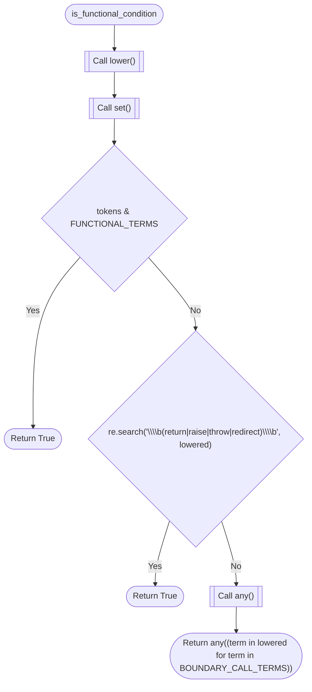

### parse\_subject\_operator

`function` · `python` · `generic` · [`src/codedebrief/analysis/common.py:284`](../src/codedebrief/analysis/common.py#L284)


### require\_tree\_sitter\_parse\_ok

`function` · `python` · `generic` · [`src/codedebrief/analysis/common.py:128`](../src/codedebrief/analysis/common.py#L128)

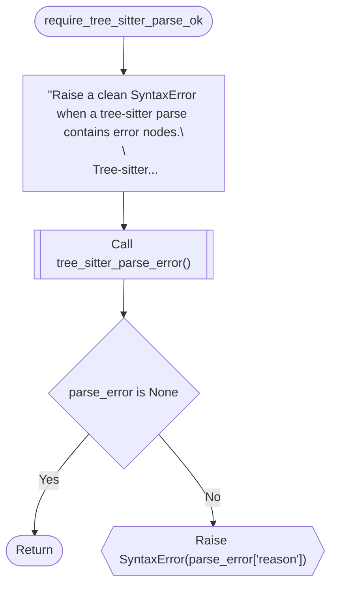

### resolve\_qualified

`function` · `python` · `generic` · [`src/codedebrief/analysis/common.py:327`](../src/codedebrief/analysis/common.py#L327)


### tag\_call\_effects

`function` · `python` · `generic` · [`src/codedebrief/analysis/common.py:517`](../src/codedebrief/analysis/common.py#L517)

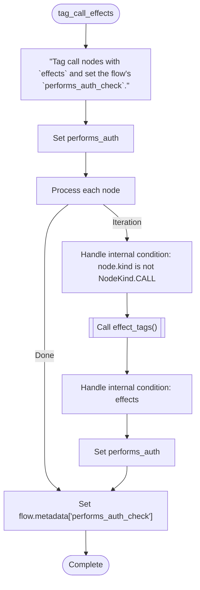

### tree\_sitter\_parse\_error

`function` · `python` · `generic` · [`src/codedebrief/analysis/common.py:142`](../src/codedebrief/analysis/common.py#L142)


### value\_namespace

`function` · `python` · `generic` · [`src/codedebrief/analysis/common.py:305`](../src/codedebrief/analysis/common.py#L305)


### discover\_source\_files

`function` · `python` · `generic` · [`src/codedebrief/analysis/discovery.py:16`](../src/codedebrief/analysis/discovery.py#L16)

```mermaid
flowchart TD
  mflow_59dc94f2dc874f78_n1(["discover_source_files"])
  mflow_59dc94f2dc874f78_n2[["Call root.resolve()"]]
  mflow_59dc94f2dc874f78_n3[["Call _self_exclude_roots()"]]
  mflow_59dc94f2dc874f78_n4[["Call supported_suffixes()"]]
  mflow_59dc94f2dc874f78_n5[["Call set()"]]
  mflow_59dc94f2dc874f78_n6["Process each source_root"]
  mflow_59dc94f2dc874f78_n7[["Call Path()"]]
  mflow_59dc94f2dc874f78_n8[["Call resolve()"]]
  mflow_59dc94f2dc874f78_n9{"not base.exists()"}
  mflow_59dc94f2dc874f78_n10["Continue loop"]
  mflow_59dc94f2dc874f78_n11["Process each candidate"]
  mflow_59dc94f2dc874f78_n12["Handle internal condition: not candidate.is_file() or candidate.suffix.lower() not in suffixes"]
  mflow_59dc94f2dc874f78_n13[["Call candidate.resolve()"]]
  mflow_59dc94f2dc874f78_n14["Handle internal condition: any((resolved.is_relative_to(item) for item in excluded_roots))"]
  mflow_59dc94f2dc874f78_n15["Handle internal condition: not resolved.is_relative_to(base)"]
  mflow_59dc94f2dc874f78_n16[["Call _resolved_relpath()"]]
  mflow_59dc94f2dc874f78_n17["Handle internal condition: not config.is_excluded(relative) and (not config.is_excluded_dir(relative))"]
  mflow_59dc94f2dc874f78_n18[["Call sorted()"]]
  mflow_59dc94f2dc874f78_n19(["Return sorted(files, key=lambda item: _resolved_relpath(item.resolve(), root_resolved))"])
  mflow_59dc94f2dc874f78_n1 --> mflow_59dc94f2dc874f78_n2
  mflow_59dc94f2dc874f78_n2 --> mflow_59dc94f2dc874f78_n3
  mflow_59dc94f2dc874f78_n3 --> mflow_59dc94f2dc874f78_n4
  mflow_59dc94f2dc874f78_n4 --> mflow_59dc94f2dc874f78_n5
  mflow_59dc94f2dc874f78_n5 --> mflow_59dc94f2dc874f78_n6
  mflow_59dc94f2dc874f78_n6 -->|"Iteration"| mflow_59dc94f2dc874f78_n7
  mflow_59dc94f2dc874f78_n7 --> mflow_59dc94f2dc874f78_n8
  mflow_59dc94f2dc874f78_n8 --> mflow_59dc94f2dc874f78_n9
  mflow_59dc94f2dc874f78_n9 -->|"Yes"| mflow_59dc94f2dc874f78_n10
  mflow_59dc94f2dc874f78_n9 -->|"No"| mflow_59dc94f2dc874f78_n11
  mflow_59dc94f2dc874f78_n11 -->|"Iteration"| mflow_59dc94f2dc874f78_n12
  mflow_59dc94f2dc874f78_n12 --> mflow_59dc94f2dc874f78_n13
  mflow_59dc94f2dc874f78_n13 --> mflow_59dc94f2dc874f78_n14
  mflow_59dc94f2dc874f78_n14 --> mflow_59dc94f2dc874f78_n15
  mflow_59dc94f2dc874f78_n15 --> mflow_59dc94f2dc874f78_n16
  mflow_59dc94f2dc874f78_n16 --> mflow_59dc94f2dc874f78_n17
  mflow_59dc94f2dc874f78_n6 -->|"Done"| mflow_59dc94f2dc874f78_n18
  mflow_59dc94f2dc874f78_n11 -->|"Done"| mflow_59dc94f2dc874f78_n18
  mflow_59dc94f2dc874f78_n17 --> mflow_59dc94f2dc874f78_n18
  mflow_59dc94f2dc874f78_n18 --> mflow_59dc94f2dc874f78_n19
```

### container\_definitions

`function` · `python` · `generic` · [`src/codedebrief/analysis/languages/_common.py:32`](../src/codedebrief/analysis/languages/_common.py#L32)


### module\_name

`function` · `python` · `generic` · [`src/codedebrief/analysis/languages/_common.py:27`](../src/codedebrief/analysis/languages/_common.py#L27)

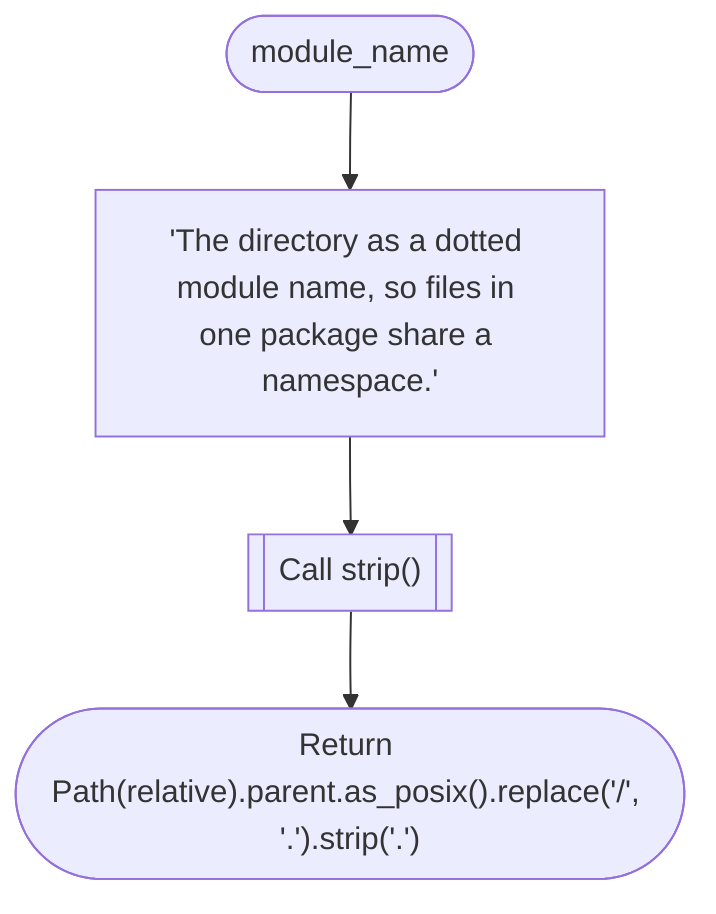

### named

`function` · `python` · `generic` · [`src/codedebrief/analysis/languages/_common.py:23`](../src/codedebrief/analysis/languages/_common.py#L23)

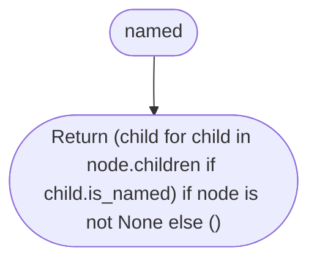

### text

`function` · `python` · `generic` · [`src/codedebrief/analysis/languages/_common.py:17`](../src/codedebrief/analysis/languages/_common.py#L17)

```mermaid
flowchart TD
  mflow_bddba54a0bd0e8e3_n1(["text"])
  mflow_bddba54a0bd0e8e3_n2{"node is None"}
  mflow_bddba54a0bd0e8e3_n3(["Return ''"])
  mflow_bddba54a0bd0e8e3_n4[["Call decode()"]]
  mflow_bddba54a0bd0e8e3_n5(["Return source[node.start_byte:node.end_byte].decode('utf-8', 'replace')"])
  mflow_bddba54a0bd0e8e3_n1 --> mflow_bddba54a0bd0e8e3_n2
  mflow_bddba54a0bd0e8e3_n2 -->|"Yes"| mflow_bddba54a0bd0e8e3_n3
  mflow_bddba54a0bd0e8e3_n2 -->|"No"| mflow_bddba54a0bd0e8e3_n4
  mflow_bddba54a0bd0e8e3_n4 --> mflow_bddba54a0bd0e8e3_n5
```

### build\_analyzer

`function` · `python` · `generic` · [`src/codedebrief/analysis/languages/c.py:95`](../src/codedebrief/analysis/languages/c.py#L95)

```mermaid
flowchart TD
  mflow_51a471d96c0a366a_n1(["build_analyzer"])
  mflow_51a471d96c0a366a_n2[["Call TreeSitterAnalyzer()"]]
  mflow_51a471d96c0a366a_n3(["Return TreeSitterAnalyzer(root, config, C_PROFILE)"])
  mflow_51a471d96c0a366a_n1 --> mflow_51a471d96c0a366a_n2
  mflow_51a471d96c0a366a_n2 --> mflow_51a471d96c0a366a_n3
```

### build\_analyzer

`function` · `python` · `generic` · [`src/codedebrief/analysis/languages/cpp.py:145`](../src/codedebrief/analysis/languages/cpp.py#L145)

```mermaid
flowchart TD
  mflow_1e1a30b0272b3a62_n1(["build_analyzer"])
  mflow_1e1a30b0272b3a62_n2[["Call TreeSitterAnalyzer()"]]
  mflow_1e1a30b0272b3a62_n3(["Return TreeSitterAnalyzer(root, config, CPP_PROFILE)"])
  mflow_1e1a30b0272b3a62_n1 --> mflow_1e1a30b0272b3a62_n2
  mflow_1e1a30b0272b3a62_n2 --> mflow_1e1a30b0272b3a62_n3
```

### build\_analyzer

`function` · `python` · `generic` · [`src/codedebrief/analysis/languages/csharp.py:136`](../src/codedebrief/analysis/languages/csharp.py#L136)

```mermaid
flowchart TD
  mflow_b488f945011401ba_n1(["build_analyzer"])
  mflow_b488f945011401ba_n2[["Call TreeSitterAnalyzer()"]]
  mflow_b488f945011401ba_n3(["Return TreeSitterAnalyzer(root, config, CSHARP_PROFILE)"])
  mflow_b488f945011401ba_n1 --> mflow_b488f945011401ba_n2
  mflow_b488f945011401ba_n2 --> mflow_b488f945011401ba_n3
```

### build\_analyzer

`function` · `python` · `generic` · [`src/codedebrief/analysis/languages/go.py:156`](../src/codedebrief/analysis/languages/go.py#L156)

```mermaid
flowchart TD
  mflow_caefe91b63c4c911_n1(["build_analyzer"])
  mflow_caefe91b63c4c911_n2[["Call TreeSitterAnalyzer()"]]
  mflow_caefe91b63c4c911_n3(["Return TreeSitterAnalyzer(root, config, GO_PROFILE)"])
  mflow_caefe91b63c4c911_n1 --> mflow_caefe91b63c4c911_n2
  mflow_caefe91b63c4c911_n2 --> mflow_caefe91b63c4c911_n3
```

### build\_analyzer

`function` · `python` · `generic` · [`src/codedebrief/analysis/languages/java.py:157`](../src/codedebrief/analysis/languages/java.py#L157)

```mermaid
flowchart TD
  mflow_1799ef39fd2881dd_n1(["build_analyzer"])
  mflow_1799ef39fd2881dd_n2[["Call TreeSitterAnalyzer()"]]
  mflow_1799ef39fd2881dd_n3(["Return TreeSitterAnalyzer(root, config, JAVA_PROFILE)"])
  mflow_1799ef39fd2881dd_n1 --> mflow_1799ef39fd2881dd_n2
  mflow_1799ef39fd2881dd_n2 --> mflow_1799ef39fd2881dd_n3
```

### build\_analyzer

`function` · `python` · `generic` · [`src/codedebrief/analysis/languages/php.py:82`](../src/codedebrief/analysis/languages/php.py#L82)

```mermaid
flowchart TD
  mflow_9f1dc0fd76dcbd1c_n1(["build_analyzer"])
  mflow_9f1dc0fd76dcbd1c_n2[["Call TreeSitterAnalyzer()"]]
  mflow_9f1dc0fd76dcbd1c_n3(["Return TreeSitterAnalyzer(root, config, PHP_PROFILE)"])
  mflow_9f1dc0fd76dcbd1c_n1 --> mflow_9f1dc0fd76dcbd1c_n2
  mflow_9f1dc0fd76dcbd1c_n2 --> mflow_9f1dc0fd76dcbd1c_n3
```

### build\_analyzer

`function` · `python` · `generic` · [`src/codedebrief/analysis/languages/ruby.py:74`](../src/codedebrief/analysis/languages/ruby.py#L74)

```mermaid
flowchart TD
  mflow_7c734a4d207716a9_n1(["build_analyzer"])
  mflow_7c734a4d207716a9_n2[["Call TreeSitterAnalyzer()"]]
  mflow_7c734a4d207716a9_n3(["Return TreeSitterAnalyzer(root, config, RUBY_PROFILE)"])
  mflow_7c734a4d207716a9_n1 --> mflow_7c734a4d207716a9_n2
  mflow_7c734a4d207716a9_n2 --> mflow_7c734a4d207716a9_n3
```

### build\_analyzer

`function` · `python` · `generic` · [`src/codedebrief/analysis/languages/rust.py:95`](../src/codedebrief/analysis/languages/rust.py#L95)

```mermaid
flowchart TD
  mflow_67d35c04fbb5db76_n1(["build_analyzer"])
  mflow_67d35c04fbb5db76_n2[["Call TreeSitterAnalyzer()"]]
  mflow_67d35c04fbb5db76_n3(["Return TreeSitterAnalyzer(root, config, RUST_PROFILE)"])
  mflow_67d35c04fbb5db76_n1 --> mflow_67d35c04fbb5db76_n2
  mflow_67d35c04fbb5db76_n2 --> mflow_67d35c04fbb5db76_n3
```

### language\_capability\_matrix

`function` · `python` · `generic` · [`src/codedebrief/analysis/registry.py:271`](../src/codedebrief/analysis/registry.py#L271)

```mermaid
flowchart TD
  mflow_eefe5b3ad61fd370_n1(["language_capability_matrix"])
  mflow_eefe5b3ad61fd370_n2["'Return a coarse, deterministic analyzer support matrix for agents and UI.'"]
  mflow_eefe5b3ad61fd370_n3["Set matrix"]
  mflow_eefe5b3ad61fd370_n4["Process each language"]
  mflow_eefe5b3ad61fd370_n5[["Call dict()"]]
  mflow_eefe5b3ad61fd370_n6[["Call features.update()"]]
  mflow_eefe5b3ad61fd370_n7[["Call list()"]]
  mflow_eefe5b3ad61fd370_n8(["Return matrix"])
  mflow_eefe5b3ad61fd370_n1 --> mflow_eefe5b3ad61fd370_n2
  mflow_eefe5b3ad61fd370_n2 --> mflow_eefe5b3ad61fd370_n3
  mflow_eefe5b3ad61fd370_n3 --> mflow_eefe5b3ad61fd370_n4
  mflow_eefe5b3ad61fd370_n4 -->|"Iteration"| mflow_eefe5b3ad61fd370_n5
  mflow_eefe5b3ad61fd370_n5 --> mflow_eefe5b3ad61fd370_n6
  mflow_eefe5b3ad61fd370_n6 --> mflow_eefe5b3ad61fd370_n7
  mflow_eefe5b3ad61fd370_n4 -->|"Done"| mflow_eefe5b3ad61fd370_n8
  mflow_eefe5b3ad61fd370_n7 --> mflow_eefe5b3ad61fd370_n8
```

### language\_for

`function` · `python` · `generic` · [`src/codedebrief/analysis/registry.py:301`](../src/codedebrief/analysis/registry.py#L301)

```mermaid
flowchart TD
  mflow_4cda4da54add37a4_n1(["language_for"])
  mflow_4cda4da54add37a4_n2[["Call spec_for_path()"]]
  mflow_4cda4da54add37a4_n3{"spec is None"}
  mflow_4cda4da54add37a4_n4{{"Raise ValueError(f'Unsupported source file: {path}')"}}
  mflow_4cda4da54add37a4_n5(["Return spec.id"])
  mflow_4cda4da54add37a4_n1 --> mflow_4cda4da54add37a4_n2
  mflow_4cda4da54add37a4_n2 --> mflow_4cda4da54add37a4_n3
  mflow_4cda4da54add37a4_n3 -->|"Yes"| mflow_4cda4da54add37a4_n4
  mflow_4cda4da54add37a4_n3 -->|"No"| mflow_4cda4da54add37a4_n5
```

### spec\_for\_language

`function` · `python` · `generic` · [`src/codedebrief/analysis/registry.py:316`](../src/codedebrief/analysis/registry.py#L316)

```mermaid
flowchart TD
  mflow_90116d716276b40b_n1(["spec_for_language"])
  mflow_90116d716276b40b_n2[["Call _BY_ID.get()"]]
  mflow_90116d716276b40b_n3{"spec is None"}
  mflow_90116d716276b40b_n4{{"Raise ValueError(f'Unknown language: {language}')"}}
  mflow_90116d716276b40b_n5(["Return spec"])
  mflow_90116d716276b40b_n1 --> mflow_90116d716276b40b_n2
  mflow_90116d716276b40b_n2 --> mflow_90116d716276b40b_n3
  mflow_90116d716276b40b_n3 -->|"Yes"| mflow_90116d716276b40b_n4
  mflow_90116d716276b40b_n3 -->|"No"| mflow_90116d716276b40b_n5
```

### spec\_for\_path

`function` · `python` · `generic` · [`src/codedebrief/analysis/registry.py:297`](../src/codedebrief/analysis/registry.py#L297)

```mermaid
flowchart TD
  mflow_2f599ed46ede62b6_n1(["spec_for_path"])
  mflow_2f599ed46ede62b6_n2[["Call _BY_SUFFIX.get()"]]
  mflow_2f599ed46ede62b6_n3(["Return _BY_SUFFIX.get(path.suffix.lower())"])
  mflow_2f599ed46ede62b6_n1 --> mflow_2f599ed46ede62b6_n2
  mflow_2f599ed46ede62b6_n2 --> mflow_2f599ed46ede62b6_n3
```

### supported\_language\_ids

`function` · `python` · `generic` · [`src/codedebrief/analysis/registry.py:260`](../src/codedebrief/analysis/registry.py#L260)

```mermaid
flowchart TD
  mflow_54d5b78789eff3d4_n1(["supported_language_ids"])
  mflow_54d5b78789eff3d4_n2["Set ids"]
  mflow_54d5b78789eff3d4_n3["Process each spec"]
  mflow_54d5b78789eff3d4_n4[["Call ids.append()"]]
  mflow_54d5b78789eff3d4_n5["Handle internal condition: spec.id == 'typescript'"]
  mflow_54d5b78789eff3d4_n6[["Call tuple()"]]
  mflow_54d5b78789eff3d4_n7(["Return tuple(ids)"])
  mflow_54d5b78789eff3d4_n1 --> mflow_54d5b78789eff3d4_n2
  mflow_54d5b78789eff3d4_n2 --> mflow_54d5b78789eff3d4_n3
  mflow_54d5b78789eff3d4_n3 -->|"Iteration"| mflow_54d5b78789eff3d4_n4
  mflow_54d5b78789eff3d4_n4 --> mflow_54d5b78789eff3d4_n5
  mflow_54d5b78789eff3d4_n3 -->|"Done"| mflow_54d5b78789eff3d4_n6
  mflow_54d5b78789eff3d4_n5 --> mflow_54d5b78789eff3d4_n6
  mflow_54d5b78789eff3d4_n6 --> mflow_54d5b78789eff3d4_n7
```

### supported\_suffixes

`function` · `python` · `generic` · [`src/codedebrief/analysis/registry.py:256`](../src/codedebrief/analysis/registry.py#L256)

```mermaid
flowchart TD
  mflow_6f03fa6c1740379b_n1(["supported_suffixes"])
  mflow_6f03fa6c1740379b_n2[["Call frozenset()"]]
  mflow_6f03fa6c1740379b_n3(["Return frozenset(_BY_SUFFIX)"])
  mflow_6f03fa6c1740379b_n1 --> mflow_6f03fa6c1740379b_n2
  mflow_6f03fa6c1740379b_n2 --> mflow_6f03fa6c1740379b_n3
```

### artifact\_model\_hash

`function` · `python` · `generic` · [`src/codedebrief/artifacts.py:83`](../src/codedebrief/artifacts.py#L83)

```mermaid
flowchart TD
  mflow_f031af6d79145abb_n1(["artifact_model_hash"])
  mflow_f031af6d79145abb_n2[["Call dict()"]]
  mflow_f031af6d79145abb_n3[["Call normalized.pop()"]]
  mflow_f031af6d79145abb_n4[["Call json.dumps()"]]
  mflow_f031af6d79145abb_n5[["Call hexdigest()"]]
  mflow_f031af6d79145abb_n6(["Return hashlib.sha256(raw.encode('utf-8')).hexdigest()"])
  mflow_f031af6d79145abb_n1 --> mflow_f031af6d79145abb_n2
  mflow_f031af6d79145abb_n2 --> mflow_f031af6d79145abb_n3
  mflow_f031af6d79145abb_n3 --> mflow_f031af6d79145abb_n4
  mflow_f031af6d79145abb_n4 --> mflow_f031af6d79145abb_n5
  mflow_f031af6d79145abb_n5 --> mflow_f031af6d79145abb_n6
```

### load\_model

`function` · `python` · `generic` · [`src/codedebrief/artifacts.py:58`](../src/codedebrief/artifacts.py#L58)

```mermaid
flowchart TD
  mflow_e54d5bf7e8f9431c_n1(["load_model"])
  mflow_e54d5bf7e8f9431c_n2[["Call ProjectModel.from_dict()"]]
  mflow_e54d5bf7e8f9431c_n3(["Return ProjectModel.from_dict(_read_model_payload(root, config))"])
  mflow_e54d5bf7e8f9431c_n1 --> mflow_e54d5bf7e8f9431c_n2
  mflow_e54d5bf7e8f9431c_n2 --> mflow_e54d5bf7e8f9431c_n3
```

### load\_model\_with\_hash

`function` · `python` · `generic` · [`src/codedebrief/artifacts.py:62`](../src/codedebrief/artifacts.py#L62)

```mermaid
flowchart TD
  mflow_0a9a79456485739e_n1(["load_model_with_hash"])
  mflow_0a9a79456485739e_n2[["Call output_paths()"]]
  mflow_0a9a79456485739e_n3[["Call _read_model_payload_from_path()"]]
  mflow_0a9a79456485739e_n4[["Call ProjectModel.from_dict()"]]
  mflow_0a9a79456485739e_n5(["Return (ProjectModel.from_dict(payload), _model_hash_for_payload(json_path, payload))"])
  mflow_0a9a79456485739e_n1 --> mflow_0a9a79456485739e_n2
  mflow_0a9a79456485739e_n2 --> mflow_0a9a79456485739e_n3
  mflow_0a9a79456485739e_n3 --> mflow_0a9a79456485739e_n4
  mflow_0a9a79456485739e_n4 --> mflow_0a9a79456485739e_n5
```

### model\_hash\_path

`function` · `python` · `generic` · [`src/codedebrief/artifacts.py:31`](../src/codedebrief/artifacts.py#L31)

```mermaid
flowchart TD
  mflow_5830f690e9b7ee88_n1(["model_hash_path"])
  mflow_5830f690e9b7ee88_n2[["Call output_paths()"]]
  mflow_5830f690e9b7ee88_n3[["Call _model_hash_path_for_json()"]]
  mflow_5830f690e9b7ee88_n4(["Return _model_hash_path_for_json(json_path)"])
  mflow_5830f690e9b7ee88_n1 --> mflow_5830f690e9b7ee88_n2
  mflow_5830f690e9b7ee88_n2 --> mflow_5830f690e9b7ee88_n3
  mflow_5830f690e9b7ee88_n3 --> mflow_5830f690e9b7ee88_n4
```

### output\_paths

`function` · `python` · `generic` · [`src/codedebrief/artifacts.py:16`](../src/codedebrief/artifacts.py#L16)

```mermaid
flowchart TD
  mflow_ea178bb69574e1cf_n1(["output_paths"])
  mflow_ea178bb69574e1cf_n2[["Call CodeDebriefConfig.load()"]]
  mflow_ea178bb69574e1cf_n3[["Call root.resolve()"]]
  mflow_ea178bb69574e1cf_n4[["Call resolve()"]]
  mflow_ea178bb69574e1cf_n5{"Operation succeeds?"}
  mflow_ea178bb69574e1cf_n6[["Call output.relative_to()"]]
  mflow_ea178bb69574e1cf_n7{{"Raise ValueError('CodeDebrief output_dir must stay inside the analyzed project')"}}
  mflow_ea178bb69574e1cf_n8(["Return (output / 'codedebrief.json', output / 'codedebrief.md', output / 'codedebrief.html')"])
  mflow_ea178bb69574e1cf_n1 --> mflow_ea178bb69574e1cf_n2
  mflow_ea178bb69574e1cf_n2 --> mflow_ea178bb69574e1cf_n3
  mflow_ea178bb69574e1cf_n3 --> mflow_ea178bb69574e1cf_n4
  mflow_ea178bb69574e1cf_n4 --> mflow_ea178bb69574e1cf_n5
  mflow_ea178bb69574e1cf_n5 -->|"Success"| mflow_ea178bb69574e1cf_n6
  mflow_ea178bb69574e1cf_n5 -->|"ValueError"| mflow_ea178bb69574e1cf_n7
  mflow_ea178bb69574e1cf_n6 --> mflow_ea178bb69574e1cf_n8
```

### write\_artifacts

`function` · `python` · `generic` · [`src/codedebrief/artifacts.py:36`](../src/codedebrief/artifacts.py#L36)

```mermaid
flowchart TD
  mflow_60369a6990d8c14b_n1(["write_artifacts"])
  mflow_60369a6990d8c14b_n2[["Call output_paths()"]]
  mflow_60369a6990d8c14b_n3[["Call model.to_dict()"]]
  mflow_60369a6990d8c14b_n4[["Call json.dumps()"]]
  mflow_60369a6990d8c14b_n5["Handle internal condition: include_html"]
  mflow_60369a6990d8c14b_n6[["Call atomic_write_text_batch()"]]
  mflow_60369a6990d8c14b_n7[["Call _write_model_hash_sidecar()"]]
  mflow_60369a6990d8c14b_n8{"include_html"}
  mflow_60369a6990d8c14b_n9(["Return (json_path, markdown_path, html_path)"])
  mflow_60369a6990d8c14b_n10(["Return (json_path, markdown_path, None)"])
  mflow_60369a6990d8c14b_n1 --> mflow_60369a6990d8c14b_n2
  mflow_60369a6990d8c14b_n2 --> mflow_60369a6990d8c14b_n3
  mflow_60369a6990d8c14b_n3 --> mflow_60369a6990d8c14b_n4
  mflow_60369a6990d8c14b_n4 --> mflow_60369a6990d8c14b_n5
  mflow_60369a6990d8c14b_n5 --> mflow_60369a6990d8c14b_n6
  mflow_60369a6990d8c14b_n6 --> mflow_60369a6990d8c14b_n7
  mflow_60369a6990d8c14b_n7 --> mflow_60369a6990d8c14b_n8
  mflow_60369a6990d8c14b_n8 -->|"Yes"| mflow_60369a6990d8c14b_n9
  mflow_60369a6990d8c14b_n8 -->|"No"| mflow_60369a6990d8c14b_n10
```

### build\_parser

`function` · `python` · `generic` · [`src/codedebrief/cli.py:67`](../src/codedebrief/cli.py#L67)

```mermaid
flowchart TD
  mflow_d6452309de1ab682_n1(["build_parser"])
  mflow_d6452309de1ab682_n2[["Call CodeDebriefArgumentParser()"]]
  mflow_d6452309de1ab682_n3[["Call parser.add_argument()"]]
  mflow_d6452309de1ab682_n4[["Call parser.add_subparsers()"]]
  mflow_d6452309de1ab682_n5[["Call _add_setup_parser()"]]
  mflow_d6452309de1ab682_n6[["Call subparsers.add_parser()"]]
  mflow_d6452309de1ab682_n7[["Call update.add_argument()"]]
  mflow_d6452309de1ab682_n8[["Call update.add_argument()"]]
  mflow_d6452309de1ab682_n9[["Call update.add_argument()"]]
  mflow_d6452309de1ab682_n10[["Call update.add_argument()"]]
  mflow_d6452309de1ab682_n11[["Call _add_profile_argument()"]]
  mflow_d6452309de1ab682_n12[["Call subparsers.add_parser()"]]
  mflow_d6452309de1ab682_n13[["Call view.add_argument()"]]
  mflow_d6452309de1ab682_n14[["Call view.add_argument()"]]
  mflow_d6452309de1ab682_n15[["Call view.add_argument()"]]
  mflow_d6452309de1ab682_n16[["Call view.add_argument()"]]
  mflow_d6452309de1ab682_n17[["Call _add_profile_argument()"]]
  mflow_d6452309de1ab682_n18[["Call subparsers.add_parser()"]]
  mflow_d6452309de1ab682_n19[["Call validate.add_argument()"]]
  mflow_d6452309de1ab682_n20[["Call validate.add_argument()"]]
  mflow_d6452309de1ab682_n21[["Call validate.add_argument()"]]
  mflow_d6452309de1ab682_n22[["Call validate.add_argument()"]]
  mflow_d6452309de1ab682_n23[["Call validate.add_argument()"]]
  mflow_d6452309de1ab682_n24[["Call validate.add_argument()"]]
  mflow_d6452309de1ab682_n25[["Call validate.add_argument()"]]
  mflow_d6452309de1ab682_n26[["Call validate.add_argument()"]]
  mflow_d6452309de1ab682_n27[["Call validate.add_argument()"]]
  mflow_d6452309de1ab682_n28[["Call _add_profile_argument()"]]
  mflow_d6452309de1ab682_n29[["Call subparsers.add_parser()"]]
  mflow_d6452309de1ab682_n30[["Call doctor.add_argument()"]]
  mflow_d6452309de1ab682_n31[["Call doctor.add_argument()"]]
  mflow_d6452309de1ab682_n32[["Call doctor.add_argument()"]]
  mflow_d6452309de1ab682_n33[["Call doctor.add_argument()"]]
  mflow_d6452309de1ab682_n34[["Call doctor.add_argument()"]]
  mflow_d6452309de1ab682_n35[["Call subparsers.add_parser()"]]
  mflow_d6452309de1ab682_n36[["Call clear.add_argument()"]]
  mflow_d6452309de1ab682_n37[["Call clear.add_argument()"]]
  mflow_d6452309de1ab682_n38[["Call subparsers.add_parser()"]]
  mflow_d6452309de1ab682_n39[["Call mcp.add_argument()"]]
  mflow_d6452309de1ab682_n40[["Call _add_profile_argument()"]]
  mflow_d6452309de1ab682_n41(["Return parser"])
  mflow_d6452309de1ab682_n1 --> mflow_d6452309de1ab682_n2
  mflow_d6452309de1ab682_n2 --> mflow_d6452309de1ab682_n3
  mflow_d6452309de1ab682_n3 --> mflow_d6452309de1ab682_n4
  mflow_d6452309de1ab682_n4 --> mflow_d6452309de1ab682_n5
  mflow_d6452309de1ab682_n5 --> mflow_d6452309de1ab682_n6
  mflow_d6452309de1ab682_n6 --> mflow_d6452309de1ab682_n7
  mflow_d6452309de1ab682_n7 --> mflow_d6452309de1ab682_n8
  mflow_d6452309de1ab682_n8 --> mflow_d6452309de1ab682_n9
  mflow_d6452309de1ab682_n9 --> mflow_d6452309de1ab682_n10
  mflow_d6452309de1ab682_n10 --> mflow_d6452309de1ab682_n11
  mflow_d6452309de1ab682_n11 --> mflow_d6452309de1ab682_n12
  mflow_d6452309de1ab682_n12 --> mflow_d6452309de1ab682_n13
  mflow_d6452309de1ab682_n13 --> mflow_d6452309de1ab682_n14
  mflow_d6452309de1ab682_n14 --> mflow_d6452309de1ab682_n15
  mflow_d6452309de1ab682_n15 --> mflow_d6452309de1ab682_n16
  mflow_d6452309de1ab682_n16 --> mflow_d6452309de1ab682_n17
  mflow_d6452309de1ab682_n17 --> mflow_d6452309de1ab682_n18
  mflow_d6452309de1ab682_n18 --> mflow_d6452309de1ab682_n19
  mflow_d6452309de1ab682_n19 --> mflow_d6452309de1ab682_n20
  mflow_d6452309de1ab682_n20 --> mflow_d6452309de1ab682_n21
  mflow_d6452309de1ab682_n21 --> mflow_d6452309de1ab682_n22
  mflow_d6452309de1ab682_n22 --> mflow_d6452309de1ab682_n23
  mflow_d6452309de1ab682_n23 --> mflow_d6452309de1ab682_n24
  mflow_d6452309de1ab682_n24 --> mflow_d6452309de1ab682_n25
  mflow_d6452309de1ab682_n25 --> mflow_d6452309de1ab682_n26
  mflow_d6452309de1ab682_n26 --> mflow_d6452309de1ab682_n27
  mflow_d6452309de1ab682_n27 --> mflow_d6452309de1ab682_n28
  mflow_d6452309de1ab682_n28 --> mflow_d6452309de1ab682_n29
  mflow_d6452309de1ab682_n29 --> mflow_d6452309de1ab682_n30
  mflow_d6452309de1ab682_n30 --> mflow_d6452309de1ab682_n31
  mflow_d6452309de1ab682_n31 --> mflow_d6452309de1ab682_n32
  mflow_d6452309de1ab682_n32 --> mflow_d6452309de1ab682_n33
  mflow_d6452309de1ab682_n33 --> mflow_d6452309de1ab682_n34
  mflow_d6452309de1ab682_n34 --> mflow_d6452309de1ab682_n35
  mflow_d6452309de1ab682_n35 --> mflow_d6452309de1ab682_n36
  mflow_d6452309de1ab682_n36 --> mflow_d6452309de1ab682_n37
  mflow_d6452309de1ab682_n37 --> mflow_d6452309de1ab682_n38
  mflow_d6452309de1ab682_n38 --> mflow_d6452309de1ab682_n39
  mflow_d6452309de1ab682_n39 --> mflow_d6452309de1ab682_n40
  mflow_d6452309de1ab682_n40 --> mflow_d6452309de1ab682_n41
```

### main

`function` · `python` · `generic` · [`src/codedebrief/cli.py:323`](../src/codedebrief/cli.py#L323)

```mermaid
flowchart TD
  mflow_1792b68cca289a2d_n1(["main"])
  mflow_1792b68cca289a2d_n2[["Call parse_args()"]]
  mflow_1792b68cca289a2d_n3{"Operation succeeds?"}
  mflow_1792b68cca289a2d_n4{"args.command == 'setup'"}
  mflow_1792b68cca289a2d_n5[["Call _setup_agent()"]]
  mflow_1792b68cca289a2d_n6(["Return _setup_agent(Path(args.path), args.agent, full=args.full, include_html=not args.no_html, profile=args.profile, s..."])
  mflow_1792b68cca289a2d_n7{"args.command == 'update'"}
  mflow_1792b68cca289a2d_n8[["Call _analyze()"]]
  mflow_1792b68cca289a2d_n9(["Return _analyze(Path(args.path), full=args.full, include_html=not args.no_html, profile=args.profile, verbose=args.verb..."])
  mflow_1792b68cca289a2d_n10{"args.command == 'view'"}
  mflow_1792b68cca289a2d_n11[["Call _view()"]]
  mflow_1792b68cca289a2d_n12(["Return _view(Path(args.path), args.port, not args.no_open, args.render_only, args.profile)"])
  mflow_1792b68cca289a2d_n13{"args.command == 'validate'"}
  mflow_1792b68cca289a2d_n14[["Call _validate()"]]
  mflow_1792b68cca289a2d_n15(["Return _validate(Path(args.path), args.check_sync, args.json_output, args.quality, _quality_thresholds(args), args.prof..."])
  mflow_1792b68cca289a2d_n16{"args.command == 'doctor'"}
  mflow_1792b68cca289a2d_n17[["Call _doctor()"]]
  mflow_1792b68cca289a2d_n18(["Return _doctor(Path(args.path), args.json_output, errors=args.errors, clear_errors=args.clear_errors, verbose=args.verb..."])
  mflow_1792b68cca289a2d_n19{"args.command == 'clear'"}
  mflow_1792b68cca289a2d_n20[["Call _clear()"]]
  mflow_1792b68cca289a2d_n21(["Return _clear(Path(args.path), assume_yes=args.yes)"])
  mflow_1792b68cca289a2d_n22{"args.command == 'mcp'"}
  mflow_1792b68cca289a2d_n23["Load dependencies"]
  mflow_1792b68cca289a2d_n24[["Call CodeDebriefConfig.load()"]]
  mflow_1792b68cca289a2d_n25[["Call run_mcp()"]]
  mflow_1792b68cca289a2d_n26(["Return 0"])
  mflow_1792b68cca289a2d_n27[["Call str()"]]
  mflow_1792b68cca289a2d_n28[["Call append_error_event()"]]
  mflow_1792b68cca289a2d_n29[["Call print()"]]
  mflow_1792b68cca289a2d_n30[["Call print()"]]
  mflow_1792b68cca289a2d_n31{"saved_error_path is not None"}
  mflow_1792b68cca289a2d_n32[["Call print()"]]
  mflow_1792b68cca289a2d_n33[["Call print()"]]
  mflow_1792b68cca289a2d_n34[["Call print()"]]
  mflow_1792b68cca289a2d_n35[["Call print()"]]
  mflow_1792b68cca289a2d_n36(["Return 1"])
  mflow_1792b68cca289a2d_n37(["Return 0"])
  mflow_1792b68cca289a2d_n1 --> mflow_1792b68cca289a2d_n2
  mflow_1792b68cca289a2d_n2 --> mflow_1792b68cca289a2d_n3
  mflow_1792b68cca289a2d_n3 -->|"Success"| mflow_1792b68cca289a2d_n4
  mflow_1792b68cca289a2d_n4 -->|"Yes"| mflow_1792b68cca289a2d_n5
  mflow_1792b68cca289a2d_n5 --> mflow_1792b68cca289a2d_n6
  mflow_1792b68cca289a2d_n4 -->|"No"| mflow_1792b68cca289a2d_n7
  mflow_1792b68cca289a2d_n7 -->|"Yes"| mflow_1792b68cca289a2d_n8
  mflow_1792b68cca289a2d_n8 --> mflow_1792b68cca289a2d_n9
  mflow_1792b68cca289a2d_n7 -->|"No"| mflow_1792b68cca289a2d_n10
  mflow_1792b68cca289a2d_n10 -->|"Yes"| mflow_1792b68cca289a2d_n11
  mflow_1792b68cca289a2d_n11 --> mflow_1792b68cca289a2d_n12
  mflow_1792b68cca289a2d_n10 -->|"No"| mflow_1792b68cca289a2d_n13
  mflow_1792b68cca289a2d_n13 -->|"Yes"| mflow_1792b68cca289a2d_n14
  mflow_1792b68cca289a2d_n14 --> mflow_1792b68cca289a2d_n15
  mflow_1792b68cca289a2d_n13 -->|"No"| mflow_1792b68cca289a2d_n16
  mflow_1792b68cca289a2d_n16 -->|"Yes"| mflow_1792b68cca289a2d_n17
  mflow_1792b68cca289a2d_n17 --> mflow_1792b68cca289a2d_n18
  mflow_1792b68cca289a2d_n16 -->|"No"| mflow_1792b68cca289a2d_n19
  mflow_1792b68cca289a2d_n19 -->|"Yes"| mflow_1792b68cca289a2d_n20
  mflow_1792b68cca289a2d_n20 --> mflow_1792b68cca289a2d_n21
  mflow_1792b68cca289a2d_n19 -->|"No"| mflow_1792b68cca289a2d_n22
  mflow_1792b68cca289a2d_n22 -->|"Yes"| mflow_1792b68cca289a2d_n23
  mflow_1792b68cca289a2d_n23 --> mflow_1792b68cca289a2d_n24
  mflow_1792b68cca289a2d_n24 --> mflow_1792b68cca289a2d_n25
  mflow_1792b68cca289a2d_n25 --> mflow_1792b68cca289a2d_n26
  mflow_1792b68cca289a2d_n3 -->|"(OSError, RuntimeError, TimeoutError, ValueError, SyntaxError)"| mflow_1792b68cca289a2d_n27
  mflow_1792b68cca289a2d_n27 --> mflow_1792b68cca289a2d_n28
  mflow_1792b68cca289a2d_n28 --> mflow_1792b68cca289a2d_n29
  mflow_1792b68cca289a2d_n29 --> mflow_1792b68cca289a2d_n30
  mflow_1792b68cca289a2d_n30 --> mflow_1792b68cca289a2d_n31
  mflow_1792b68cca289a2d_n31 -->|"Yes"| mflow_1792b68cca289a2d_n32
  mflow_1792b68cca289a2d_n32 --> mflow_1792b68cca289a2d_n33
  mflow_1792b68cca289a2d_n31 -->|"No"| mflow_1792b68cca289a2d_n33
  mflow_1792b68cca289a2d_n33 --> mflow_1792b68cca289a2d_n34
  mflow_1792b68cca289a2d_n34 --> mflow_1792b68cca289a2d_n35
  mflow_1792b68cca289a2d_n35 --> mflow_1792b68cca289a2d_n36
  mflow_1792b68cca289a2d_n22 -->|"No"| mflow_1792b68cca289a2d_n37
```

### config\_path\_candidates

`function` · `python` · `generic` · [`src/codedebrief/config.py:251`](../src/codedebrief/config.py#L251)

```mermaid
flowchart TD
  mflow_9cfaad5a36dcf3db_n1(["config_path_candidates"])
  mflow_9cfaad5a36dcf3db_n2[["Call legacy_config_path()"]]
  mflow_9cfaad5a36dcf3db_n3(["Return (legacy_config_path(root), default_config_path(root))"])
  mflow_9cfaad5a36dcf3db_n1 --> mflow_9cfaad5a36dcf3db_n2
  mflow_9cfaad5a36dcf3db_n2 --> mflow_9cfaad5a36dcf3db_n3
```

### default\_config\_path

`function` · `python` · `generic` · [`src/codedebrief/config.py:247`](../src/codedebrief/config.py#L247)

```mermaid
flowchart TD
  mflow_091432e7fa64215b_n1(["default_config_path"])
  mflow_091432e7fa64215b_n2(["Return root / DEFAULT_OUTPUT_DIR / CONFIG_FILENAME"])
  mflow_091432e7fa64215b_n1 --> mflow_091432e7fa64215b_n2
```

### find\_config\_path

`function` · `python` · `generic` · [`src/codedebrief/config.py:255`](../src/codedebrief/config.py#L255)

```mermaid
flowchart TD
  mflow_3d4a815f46778983_n1(["find_config_path"])
  mflow_3d4a815f46778983_n2["Process each candidate"]
  mflow_3d4a815f46778983_n3{"candidate.exists()"}
  mflow_3d4a815f46778983_n4(["Return candidate"])
  mflow_3d4a815f46778983_n5(["Return None"])
  mflow_3d4a815f46778983_n1 --> mflow_3d4a815f46778983_n2
  mflow_3d4a815f46778983_n2 -->|"Iteration"| mflow_3d4a815f46778983_n3
  mflow_3d4a815f46778983_n3 -->|"Yes"| mflow_3d4a815f46778983_n4
  mflow_3d4a815f46778983_n2 -->|"Done"| mflow_3d4a815f46778983_n5
  mflow_3d4a815f46778983_n3 -->|"No"| mflow_3d4a815f46778983_n5
```

### legacy\_config\_path

`function` · `python` · `generic` · [`src/codedebrief/config.py:243`](../src/codedebrief/config.py#L243)

```mermaid
flowchart TD
  mflow_1126daa8b250254d_n1(["legacy_config_path"])
  mflow_1126daa8b250254d_n2(["Return root / CONFIG_FILENAME"])
  mflow_1126daa8b250254d_n1 --> mflow_1126daa8b250254d_n2
```

### doctor\_report

`function` · `python` · `generic` · [`src/codedebrief/doctor.py:75`](../src/codedebrief/doctor.py#L75)

```mermaid
flowchart TD
  mflow_36092a2ab749d529_n1(["doctor_report"])
  mflow_36092a2ab749d529_n2[["Call MissingDependency()"]]
  mflow_36092a2ab749d529_n3[["Call _legacy_mcp_configs()"]]
  mflow_36092a2ab749d529_n4[["Call DoctorReport()"]]
  mflow_36092a2ab749d529_n5(["Return DoctorReport(ok=not missing and (not legacy_mcp_configs), executable=sys.executable, package_version=_package_ve..."])
  mflow_36092a2ab749d529_n1 --> mflow_36092a2ab749d529_n2
  mflow_36092a2ab749d529_n2 --> mflow_36092a2ab749d529_n3
  mflow_36092a2ab749d529_n3 --> mflow_36092a2ab749d529_n4
  mflow_36092a2ab749d529_n4 --> mflow_36092a2ab749d529_n5
```

### render\_doctor

`function` · `python` · `generic` · [`src/codedebrief/doctor.py:94`](../src/codedebrief/doctor.py#L94)

```mermaid
flowchart TD
  mflow_d691287530df41c7_n1(["render_doctor"])
  mflow_d691287530df41c7_n2["Set capabilities"]
  mflow_d691287530df41c7_n3["Set lines"]
  mflow_d691287530df41c7_n4["Handle internal condition: report.package_location"]
  mflow_d691287530df41c7_n5[["Call lines.append()"]]
  mflow_d691287530df41c7_n6[["Call lines.append()"]]
  mflow_d691287530df41c7_n7{"report.missing_dependencies"}
  mflow_d691287530df41c7_n8[["Call lines.append()"]]
  mflow_d691287530df41c7_n9[["Call lines.append()"]]
  mflow_d691287530df41c7_n10[["Call lines.extend()"]]
  mflow_d691287530df41c7_n11[["Call lines.append()"]]
  mflow_d691287530df41c7_n12[["Call lines.append()"]]
  mflow_d691287530df41c7_n13[["Call lines.append()"]]
  mflow_d691287530df41c7_n14[["Call lines.append()"]]
  mflow_d691287530df41c7_n15["Handle internal condition: report.legacy_mcp_configs"]
  mflow_d691287530df41c7_n16[["Call join()"]]
  mflow_d691287530df41c7_n17(["Return '\\n'.join(lines)"])
  mflow_d691287530df41c7_n1 --> mflow_d691287530df41c7_n2
  mflow_d691287530df41c7_n2 --> mflow_d691287530df41c7_n3
  mflow_d691287530df41c7_n3 --> mflow_d691287530df41c7_n4
  mflow_d691287530df41c7_n4 --> mflow_d691287530df41c7_n5
  mflow_d691287530df41c7_n5 --> mflow_d691287530df41c7_n6
  mflow_d691287530df41c7_n6 --> mflow_d691287530df41c7_n7
  mflow_d691287530df41c7_n7 -->|"Yes"| mflow_d691287530df41c7_n8
  mflow_d691287530df41c7_n8 --> mflow_d691287530df41c7_n9
  mflow_d691287530df41c7_n9 --> mflow_d691287530df41c7_n10
  mflow_d691287530df41c7_n10 --> mflow_d691287530df41c7_n11
  mflow_d691287530df41c7_n11 --> mflow_d691287530df41c7_n12
  mflow_d691287530df41c7_n12 --> mflow_d691287530df41c7_n13
  mflow_d691287530df41c7_n7 -->|"No"| mflow_d691287530df41c7_n14
  mflow_d691287530df41c7_n13 --> mflow_d691287530df41c7_n15
  mflow_d691287530df41c7_n14 --> mflow_d691287530df41c7_n15
  mflow_d691287530df41c7_n15 --> mflow_d691287530df41c7_n16
  mflow_d691287530df41c7_n16 --> mflow_d691287530df41c7_n17
```

### render\_doctor\_json

`function` · `python` · `generic` · [`src/codedebrief/doctor.py:134`](../src/codedebrief/doctor.py#L134)

```mermaid
flowchart TD
  mflow_5c933b42f79a0549_n1(["render_doctor_json"])
  mflow_5c933b42f79a0549_n2[["Call json.dumps()"]]
  mflow_5c933b42f79a0549_n3(["Return json.dumps(report.to_dict(), indent=2)"])
  mflow_5c933b42f79a0549_n1 --> mflow_5c933b42f79a0549_n2
  mflow_5c933b42f79a0549_n2 --> mflow_5c933b42f79a0549_n3
```

### append\_error\_event

`function` · `python` · `generic` · [`src/codedebrief/errors.py:29`](../src/codedebrief/errors.py#L29)

```mermaid
flowchart TD
  mflow_834ec2a66ca14e5b_n1(["append_error_event"])
  mflow_834ec2a66ca14e5b_n2{"Operation succeeds?"}
  mflow_834ec2a66ca14e5b_n3{"not root.resolve().exists()"}
  mflow_834ec2a66ca14e5b_n4(["Return None"])
  mflow_834ec2a66ca14e5b_n5[["Call error_log_path()"]]
  mflow_834ec2a66ca14e5b_n6[["Call path.parent.mkdir()"]]
  mflow_834ec2a66ca14e5b_n7[["Call isoformat()"]]
  mflow_834ec2a66ca14e5b_n8[["Call handle.write()"]]
  mflow_834ec2a66ca14e5b_n9(["Return path"])
  mflow_834ec2a66ca14e5b_n10(["Return None"])
  mflow_834ec2a66ca14e5b_n1 --> mflow_834ec2a66ca14e5b_n2
  mflow_834ec2a66ca14e5b_n2 -->|"Success"| mflow_834ec2a66ca14e5b_n3
  mflow_834ec2a66ca14e5b_n3 -->|"Yes"| mflow_834ec2a66ca14e5b_n4
  mflow_834ec2a66ca14e5b_n3 -->|"No"| mflow_834ec2a66ca14e5b_n5
  mflow_834ec2a66ca14e5b_n5 --> mflow_834ec2a66ca14e5b_n6
  mflow_834ec2a66ca14e5b_n6 --> mflow_834ec2a66ca14e5b_n7
  mflow_834ec2a66ca14e5b_n7 --> mflow_834ec2a66ca14e5b_n8
  mflow_834ec2a66ca14e5b_n8 --> mflow_834ec2a66ca14e5b_n9
  mflow_834ec2a66ca14e5b_n2 -->|"(OSError, RuntimeError, TypeError, ValueError)"| mflow_834ec2a66ca14e5b_n10
```

### clear\_error\_events

`function` · `python` · `generic` · [`src/codedebrief/errors.py:99`](../src/codedebrief/errors.py#L99)

```mermaid
flowchart TD
  mflow_6fcd8ee97d96f890_n1(["clear_error_events"])
  mflow_6fcd8ee97d96f890_n2[["Call error_log_path()"]]
  mflow_6fcd8ee97d96f890_n3[["Call path.unlink()"]]
  mflow_6fcd8ee97d96f890_n4(["Return path"])
  mflow_6fcd8ee97d96f890_n1 --> mflow_6fcd8ee97d96f890_n2
  mflow_6fcd8ee97d96f890_n2 --> mflow_6fcd8ee97d96f890_n3
  mflow_6fcd8ee97d96f890_n3 --> mflow_6fcd8ee97d96f890_n4
```

### error\_log\_path

`function` · `python` · `generic` · [`src/codedebrief/errors.py:19`](../src/codedebrief/errors.py#L19)

```mermaid
flowchart TD
  mflow_e33fc83c60f2f224_n1(["error_log_path"])
  mflow_e33fc83c60f2f224_n2[["Call root.resolve()"]]
  mflow_e33fc83c60f2f224_n3{"Operation succeeds?"}
  mflow_e33fc83c60f2f224_n4[["Call CodeDebriefConfig.load()"]]
  mflow_e33fc83c60f2f224_n5[["Call output_paths()"]]
  mflow_e33fc83c60f2f224_n6[["Call json_path.with_name()"]]
  mflow_e33fc83c60f2f224_n7(["Return json_path.with_name(ERROR_LOG_FILENAME)"])
  mflow_e33fc83c60f2f224_n8(["Return project_root / DEFAULT_OUTPUT_DIR / ERROR_LOG_FILENAME"])
  mflow_e33fc83c60f2f224_n1 --> mflow_e33fc83c60f2f224_n2
  mflow_e33fc83c60f2f224_n2 --> mflow_e33fc83c60f2f224_n3
  mflow_e33fc83c60f2f224_n3 -->|"Success"| mflow_e33fc83c60f2f224_n4
  mflow_e33fc83c60f2f224_n4 --> mflow_e33fc83c60f2f224_n5
  mflow_e33fc83c60f2f224_n5 --> mflow_e33fc83c60f2f224_n6
  mflow_e33fc83c60f2f224_n6 --> mflow_e33fc83c60f2f224_n7
  mflow_e33fc83c60f2f224_n3 -->|"(OSError, RuntimeError, ValueError, SyntaxError)"| mflow_e33fc83c60f2f224_n8
```

### error\_report

`function` · `python` · `generic` · [`src/codedebrief/errors.py:105`](../src/codedebrief/errors.py#L105)

```mermaid
flowchart TD
  mflow_d4ec84fd8e7a8acd_n1(["error_report"])
  mflow_d4ec84fd8e7a8acd_n2[["Call error_log_path()"]]
  mflow_d4ec84fd8e7a8acd_n3[["Call read_error_events()"]]
  mflow_d4ec84fd8e7a8acd_n4[["Call Counter()"]]
  mflow_d4ec84fd8e7a8acd_n5[["Call str()"]]
  mflow_d4ec84fd8e7a8acd_n6(["Return {'schema_version': ERROR_REPORT_SCHEMA_VERSION, 'project': str(root.resolve()), 'path': str(path), 'count': len(..."])
  mflow_d4ec84fd8e7a8acd_n1 --> mflow_d4ec84fd8e7a8acd_n2
  mflow_d4ec84fd8e7a8acd_n2 --> mflow_d4ec84fd8e7a8acd_n3
  mflow_d4ec84fd8e7a8acd_n3 --> mflow_d4ec84fd8e7a8acd_n4
  mflow_d4ec84fd8e7a8acd_n4 --> mflow_d4ec84fd8e7a8acd_n5
  mflow_d4ec84fd8e7a8acd_n5 --> mflow_d4ec84fd8e7a8acd_n6
```

### read\_error\_events

`function` · `python` · `generic` · [`src/codedebrief/errors.py:72`](../src/codedebrief/errors.py#L72)

```mermaid
flowchart TD
  mflow_19ec09e3bad05fc3_n1(["read_error_events"])
  mflow_19ec09e3bad05fc3_n2[["Call error_log_path()"]]
  mflow_19ec09e3bad05fc3_n3{"not path.exists()"}
  mflow_19ec09e3bad05fc3_n4(["Return []"])
  mflow_19ec09e3bad05fc3_n5["Set events"]
  mflow_19ec09e3bad05fc3_n6{"Operation succeeds?"}
  mflow_19ec09e3bad05fc3_n7["Process each line"]
  mflow_19ec09e3bad05fc3_n8["Handle internal condition: not line.strip()"]
  mflow_19ec09e3bad05fc3_n9{"Operation succeeds?"}
  mflow_19ec09e3bad05fc3_n10[["Call json.loads()"]]
  mflow_19ec09e3bad05fc3_n11["Continue loop"]
  mflow_19ec09e3bad05fc3_n12["Handle internal condition: isinstance(payload, dict)"]
  mflow_19ec09e3bad05fc3_n13(["Return []"])
  mflow_19ec09e3bad05fc3_n14{"limit is not None and limit &gt;= 0"}
  mflow_19ec09e3bad05fc3_n15(["Return events[-limit:]"])
  mflow_19ec09e3bad05fc3_n16(["Return events"])
  mflow_19ec09e3bad05fc3_n1 --> mflow_19ec09e3bad05fc3_n2
  mflow_19ec09e3bad05fc3_n2 --> mflow_19ec09e3bad05fc3_n3
  mflow_19ec09e3bad05fc3_n3 -->|"Yes"| mflow_19ec09e3bad05fc3_n4
  mflow_19ec09e3bad05fc3_n3 -->|"No"| mflow_19ec09e3bad05fc3_n5
  mflow_19ec09e3bad05fc3_n5 --> mflow_19ec09e3bad05fc3_n6
  mflow_19ec09e3bad05fc3_n6 -->|"Success"| mflow_19ec09e3bad05fc3_n7
  mflow_19ec09e3bad05fc3_n7 -->|"Iteration"| mflow_19ec09e3bad05fc3_n8
  mflow_19ec09e3bad05fc3_n8 --> mflow_19ec09e3bad05fc3_n9
  mflow_19ec09e3bad05fc3_n9 -->|"Success"| mflow_19ec09e3bad05fc3_n10
  mflow_19ec09e3bad05fc3_n9 -->|"json.JSONDecodeError"| mflow_19ec09e3bad05fc3_n11
  mflow_19ec09e3bad05fc3_n10 --> mflow_19ec09e3bad05fc3_n12
  mflow_19ec09e3bad05fc3_n6 -->|"OSError"| mflow_19ec09e3bad05fc3_n13
  mflow_19ec09e3bad05fc3_n7 -->|"Done"| mflow_19ec09e3bad05fc3_n14
  mflow_19ec09e3bad05fc3_n12 --> mflow_19ec09e3bad05fc3_n14
  mflow_19ec09e3bad05fc3_n14 -->|"Yes"| mflow_19ec09e3bad05fc3_n15
  mflow_19ec09e3bad05fc3_n14 -->|"No"| mflow_19ec09e3bad05fc3_n16
```

### render\_error\_report

`function` · `python` · `generic` · [`src/codedebrief/errors.py:124`](../src/codedebrief/errors.py#L124)

```mermaid
flowchart TD
  mflow_31fface104e956b4_n1(["render_error_report"])
  mflow_31fface104e956b4_n2[["Call report.get()"]]
  mflow_31fface104e956b4_n3[["Call report.get()"]]
  mflow_31fface104e956b4_n4{"not report.get('count')"}
  mflow_31fface104e956b4_n5[["Call lines.append()"]]
  mflow_31fface104e956b4_n6[["Call join()"]]
  mflow_31fface104e956b4_n7(["Return '\\n'.join(lines)"])
  mflow_31fface104e956b4_n8[["Call report.get()"]]
  mflow_31fface104e956b4_n9[["Call join()"]]
  mflow_31fface104e956b4_n10[["Call lines.append()"]]
  mflow_31fface104e956b4_n11[["Call lines.append()"]]
  mflow_31fface104e956b4_n12["Process each event"]
  mflow_31fface104e956b4_n13[["Call str()"]]
  mflow_31fface104e956b4_n14[["Call str()"]]
  mflow_31fface104e956b4_n15[["Call str()"]]
  mflow_31fface104e956b4_n16[["Call strip()"]]
  mflow_31fface104e956b4_n17[["Call strip()"]]
  mflow_31fface104e956b4_n18["Set heading"]
  mflow_31fface104e956b4_n19["Handle internal condition: timestamp"]
  mflow_31fface104e956b4_n20[["Call lines.append()"]]
  mflow_31fface104e956b4_n21["Handle internal condition: message"]
  mflow_31fface104e956b4_n22[["Call strip()"]]
  mflow_31fface104e956b4_n23["Handle internal condition: detail"]
  mflow_31fface104e956b4_n24[["Call event.get()"]]
  mflow_31fface104e956b4_n25["Handle internal condition: isinstance(next_steps, list) and next_steps"]
  mflow_31fface104e956b4_n26[["Call join()"]]
  mflow_31fface104e956b4_n27(["Return '\\n'.join(lines)"])
  mflow_31fface104e956b4_n1 --> mflow_31fface104e956b4_n2
  mflow_31fface104e956b4_n2 --> mflow_31fface104e956b4_n3
  mflow_31fface104e956b4_n3 --> mflow_31fface104e956b4_n4
  mflow_31fface104e956b4_n4 -->|"Yes"| mflow_31fface104e956b4_n5
  mflow_31fface104e956b4_n5 --> mflow_31fface104e956b4_n6
  mflow_31fface104e956b4_n6 --> mflow_31fface104e956b4_n7
  mflow_31fface104e956b4_n4 -->|"No"| mflow_31fface104e956b4_n8
  mflow_31fface104e956b4_n8 --> mflow_31fface104e956b4_n9
  mflow_31fface104e956b4_n9 --> mflow_31fface104e956b4_n10
  mflow_31fface104e956b4_n10 --> mflow_31fface104e956b4_n11
  mflow_31fface104e956b4_n11 --> mflow_31fface104e956b4_n12
  mflow_31fface104e956b4_n12 -->|"Iteration"| mflow_31fface104e956b4_n13
  mflow_31fface104e956b4_n13 --> mflow_31fface104e956b4_n14
  mflow_31fface104e956b4_n14 --> mflow_31fface104e956b4_n15
  mflow_31fface104e956b4_n15 --> mflow_31fface104e956b4_n16
  mflow_31fface104e956b4_n16 --> mflow_31fface104e956b4_n17
  mflow_31fface104e956b4_n17 --> mflow_31fface104e956b4_n18
  mflow_31fface104e956b4_n18 --> mflow_31fface104e956b4_n19
  mflow_31fface104e956b4_n19 --> mflow_31fface104e956b4_n20
  mflow_31fface104e956b4_n20 --> mflow_31fface104e956b4_n21
  mflow_31fface104e956b4_n21 --> mflow_31fface104e956b4_n22
  mflow_31fface104e956b4_n22 --> mflow_31fface104e956b4_n23
  mflow_31fface104e956b4_n23 --> mflow_31fface104e956b4_n24
  mflow_31fface104e956b4_n24 --> mflow_31fface104e956b4_n25
  mflow_31fface104e956b4_n12 -->|"Done"| mflow_31fface104e956b4_n26
  mflow_31fface104e956b4_n25 --> mflow_31fface104e956b4_n26
  mflow_31fface104e956b4_n26 --> mflow_31fface104e956b4_n27
```

### render\_error\_report\_json

`function` · `python` · `generic` · [`src/codedebrief/errors.py:160`](../src/codedebrief/errors.py#L160)

```mermaid
flowchart TD
  mflow_305189dc932cc872_n1(["render_error_report_json"])
  mflow_305189dc932cc872_n2[["Call json.dumps()"]]
  mflow_305189dc932cc872_n3(["Return json.dumps(report, indent=2)"])
  mflow_305189dc932cc872_n1 --> mflow_305189dc932cc872_n2
  mflow_305189dc932cc872_n2 --> mflow_305189dc932cc872_n3
```

### install\_agent\_instructions

`function` · `python` · `generic` · [`src/codedebrief/install.py:260`](../src/codedebrief/install.py#L260)

```mermaid
flowchart TD
  mflow_9c6b73e81123f77a_n1(["install_agent_instructions"])
  mflow_9c6b73e81123f77a_n2[["Call tuple()"]]
  mflow_9c6b73e81123f77a_n3[["Call set()"]]
  mflow_9c6b73e81123f77a_n4{"unknown"}
  mflow_9c6b73e81123f77a_n5[["Call join()"]]
  mflow_9c6b73e81123f77a_n6{{"Raise ValueError(f'unknown agent instruction target {platform!r}; known targets: {known}')"}}
  mflow_9c6b73e81123f77a_n7["Set targets"]
  mflow_9c6b73e81123f77a_n8["Set changed"]
  mflow_9c6b73e81123f77a_n9["Process each target"]
  mflow_9c6b73e81123f77a_n10[["Call target.parent.mkdir()"]]
  mflow_9c6b73e81123f77a_n11[["Call target.exists()"]]
  mflow_9c6b73e81123f77a_n12[["Call _upsert()"]]
  mflow_9c6b73e81123f77a_n13{"target.suffix == '.mdc' and (not updated.startswith('---'))"}
  mflow_9c6b73e81123f77a_n14["Set frontmatter"]
  mflow_9c6b73e81123f77a_n15["Set updated"]
  mflow_9c6b73e81123f77a_n16{"updated != existing"}
  mflow_9c6b73e81123f77a_n17[["Call atomic_write_text()"]]
  mflow_9c6b73e81123f77a_n18[["Call changed.append()"]]
  mflow_9c6b73e81123f77a_n19(["Return changed"])
  mflow_9c6b73e81123f77a_n1 --> mflow_9c6b73e81123f77a_n2
  mflow_9c6b73e81123f77a_n2 --> mflow_9c6b73e81123f77a_n3
  mflow_9c6b73e81123f77a_n3 --> mflow_9c6b73e81123f77a_n4
  mflow_9c6b73e81123f77a_n4 -->|"Yes"| mflow_9c6b73e81123f77a_n5
  mflow_9c6b73e81123f77a_n5 --> mflow_9c6b73e81123f77a_n6
  mflow_9c6b73e81123f77a_n4 -->|"No"| mflow_9c6b73e81123f77a_n7
  mflow_9c6b73e81123f77a_n7 --> mflow_9c6b73e81123f77a_n8
  mflow_9c6b73e81123f77a_n8 --> mflow_9c6b73e81123f77a_n9
  mflow_9c6b73e81123f77a_n9 -->|"Iteration"| mflow_9c6b73e81123f77a_n10
  mflow_9c6b73e81123f77a_n10 --> mflow_9c6b73e81123f77a_n11
  mflow_9c6b73e81123f77a_n11 --> mflow_9c6b73e81123f77a_n12
  mflow_9c6b73e81123f77a_n12 --> mflow_9c6b73e81123f77a_n13
  mflow_9c6b73e81123f77a_n13 -->|"Yes"| mflow_9c6b73e81123f77a_n14
  mflow_9c6b73e81123f77a_n14 --> mflow_9c6b73e81123f77a_n15
  mflow_9c6b73e81123f77a_n15 --> mflow_9c6b73e81123f77a_n16
  mflow_9c6b73e81123f77a_n13 -->|"No"| mflow_9c6b73e81123f77a_n16
  mflow_9c6b73e81123f77a_n16 -->|"Yes"| mflow_9c6b73e81123f77a_n17
  mflow_9c6b73e81123f77a_n17 --> mflow_9c6b73e81123f77a_n18
  mflow_9c6b73e81123f77a_n9 -->|"Done"| mflow_9c6b73e81123f77a_n19
  mflow_9c6b73e81123f77a_n18 --> mflow_9c6b73e81123f77a_n19
  mflow_9c6b73e81123f77a_n16 -->|"No"| mflow_9c6b73e81123f77a_n19
```

### install\_agent\_skill

`function` · `python` · `generic` · [`src/codedebrief/install.py:284`](../src/codedebrief/install.py#L284)

```mermaid
flowchart TD
  mflow_97b1d566532a3dc3_n1(["install_agent_skill"])
  mflow_97b1d566532a3dc3_n2[["Call tuple()"]]
  mflow_97b1d566532a3dc3_n3[["Call set()"]]
  mflow_97b1d566532a3dc3_n4{"unknown"}
  mflow_97b1d566532a3dc3_n5[["Call join()"]]
  mflow_97b1d566532a3dc3_n6{{"Raise ValueError(f'unknown agent skill target {platform!r}; known targets: {known}')"}}
  mflow_97b1d566532a3dc3_n7["Set changed"]
  mflow_97b1d566532a3dc3_n8["Process each name"]
  mflow_97b1d566532a3dc3_n9[["Call AGENT_SKILL_TARGETS.get()"]]
  mflow_97b1d566532a3dc3_n10{"target_path is None"}
  mflow_97b1d566532a3dc3_n11["Continue loop"]
  mflow_97b1d566532a3dc3_n12["Set target"]
  mflow_97b1d566532a3dc3_n13[["Call target.parent.mkdir()"]]
  mflow_97b1d566532a3dc3_n14[["Call target.exists()"]]
  mflow_97b1d566532a3dc3_n15{"existing != SKILL_TEMPLATE"}
  mflow_97b1d566532a3dc3_n16[["Call atomic_write_text()"]]
  mflow_97b1d566532a3dc3_n17[["Call changed.append()"]]
  mflow_97b1d566532a3dc3_n18(["Return changed"])
  mflow_97b1d566532a3dc3_n1 --> mflow_97b1d566532a3dc3_n2
  mflow_97b1d566532a3dc3_n2 --> mflow_97b1d566532a3dc3_n3
  mflow_97b1d566532a3dc3_n3 --> mflow_97b1d566532a3dc3_n4
  mflow_97b1d566532a3dc3_n4 -->|"Yes"| mflow_97b1d566532a3dc3_n5
  mflow_97b1d566532a3dc3_n5 --> mflow_97b1d566532a3dc3_n6
  mflow_97b1d566532a3dc3_n4 -->|"No"| mflow_97b1d566532a3dc3_n7
  mflow_97b1d566532a3dc3_n7 --> mflow_97b1d566532a3dc3_n8
  mflow_97b1d566532a3dc3_n8 -->|"Iteration"| mflow_97b1d566532a3dc3_n9
  mflow_97b1d566532a3dc3_n9 --> mflow_97b1d566532a3dc3_n10
  mflow_97b1d566532a3dc3_n10 -->|"Yes"| mflow_97b1d566532a3dc3_n11
  mflow_97b1d566532a3dc3_n10 -->|"No"| mflow_97b1d566532a3dc3_n12
  mflow_97b1d566532a3dc3_n12 --> mflow_97b1d566532a3dc3_n13
  mflow_97b1d566532a3dc3_n13 --> mflow_97b1d566532a3dc3_n14
  mflow_97b1d566532a3dc3_n14 --> mflow_97b1d566532a3dc3_n15
  mflow_97b1d566532a3dc3_n15 -->|"Yes"| mflow_97b1d566532a3dc3_n16
  mflow_97b1d566532a3dc3_n16 --> mflow_97b1d566532a3dc3_n17
  mflow_97b1d566532a3dc3_n8 -->|"Done"| mflow_97b1d566532a3dc3_n18
  mflow_97b1d566532a3dc3_n17 --> mflow_97b1d566532a3dc3_n18
  mflow_97b1d566532a3dc3_n15 -->|"No"| mflow_97b1d566532a3dc3_n18
```

### install\_all

`function` · `python` · `generic` · [`src/codedebrief/install.py:252`](../src/codedebrief/install.py#L252)

```mermaid
flowchart TD
  mflow_44dc5c734dd784e6_n1(["install_all"])
  mflow_44dc5c734dd784e6_n2[["Call install_agent_instructions()"]]
  mflow_44dc5c734dd784e6_n3[["Call changed.extend()"]]
  mflow_44dc5c734dd784e6_n4{"mcp_config != 'none'"}
  mflow_44dc5c734dd784e6_n5[["Call changed.extend()"]]
  mflow_44dc5c734dd784e6_n6(["Return changed"])
  mflow_44dc5c734dd784e6_n1 --> mflow_44dc5c734dd784e6_n2
  mflow_44dc5c734dd784e6_n2 --> mflow_44dc5c734dd784e6_n3
  mflow_44dc5c734dd784e6_n3 --> mflow_44dc5c734dd784e6_n4
  mflow_44dc5c734dd784e6_n4 -->|"Yes"| mflow_44dc5c734dd784e6_n5
  mflow_44dc5c734dd784e6_n5 --> mflow_44dc5c734dd784e6_n6
  mflow_44dc5c734dd784e6_n4 -->|"No"| mflow_44dc5c734dd784e6_n6
```

### install\_mcp\_config

`function` · `python` · `generic` · [`src/codedebrief/install.py:305`](../src/codedebrief/install.py#L305)

```mermaid
flowchart TD
  mflow_bdde402d2caf86a0_n1(["install_mcp_config"])
  mflow_bdde402d2caf86a0_n2[["Call root.resolve()"]]
  mflow_bdde402d2caf86a0_n3["Set targets"]
  mflow_bdde402d2caf86a0_n4[["Call set()"]]
  mflow_bdde402d2caf86a0_n5{"unknown"}
  mflow_bdde402d2caf86a0_n6[["Call join()"]]
  mflow_bdde402d2caf86a0_n7{{"Raise ValueError(f'unknown MCP config target {target!r}; known targets: {known}')"}}
  mflow_bdde402d2caf86a0_n8["Set changed"]
  mflow_bdde402d2caf86a0_n9["Process each item"]
  mflow_bdde402d2caf86a0_n10["Handle internal condition: item == 'codex'"]
  mflow_bdde402d2caf86a0_n11{"path is not None"}
  mflow_bdde402d2caf86a0_n12[["Call changed.append()"]]
  mflow_bdde402d2caf86a0_n13(["Return changed"])
  mflow_bdde402d2caf86a0_n1 --> mflow_bdde402d2caf86a0_n2
  mflow_bdde402d2caf86a0_n2 --> mflow_bdde402d2caf86a0_n3
  mflow_bdde402d2caf86a0_n3 --> mflow_bdde402d2caf86a0_n4
  mflow_bdde402d2caf86a0_n4 --> mflow_bdde402d2caf86a0_n5
  mflow_bdde402d2caf86a0_n5 -->|"Yes"| mflow_bdde402d2caf86a0_n6
  mflow_bdde402d2caf86a0_n6 --> mflow_bdde402d2caf86a0_n7
  mflow_bdde402d2caf86a0_n5 -->|"No"| mflow_bdde402d2caf86a0_n8
  mflow_bdde402d2caf86a0_n8 --> mflow_bdde402d2caf86a0_n9
  mflow_bdde402d2caf86a0_n9 -->|"Iteration"| mflow_bdde402d2caf86a0_n10
  mflow_bdde402d2caf86a0_n10 --> mflow_bdde402d2caf86a0_n11
  mflow_bdde402d2caf86a0_n11 -->|"Yes"| mflow_bdde402d2caf86a0_n12
  mflow_bdde402d2caf86a0_n9 -->|"Done"| mflow_bdde402d2caf86a0_n13
  mflow_bdde402d2caf86a0_n12 --> mflow_bdde402d2caf86a0_n13
  mflow_bdde402d2caf86a0_n11 -->|"No"| mflow_bdde402d2caf86a0_n13
```

### flow\_in\_agent\_scope

`function` · `python` · `generic` · [`src/codedebrief/mcp_server.py:3125`](../src/codedebrief/mcp_server.py#L3125)

```mermaid
flowchart TD
  mflow_e0d0c0d1be37564f_n1(["flow_in_agent_scope"])
  mflow_e0d0c0d1be37564f_n2[["Call metadata_scope_names()"]]
  mflow_e0d0c0d1be37564f_n3(["Return scope is None or scope in metadata_scope_names(flow.metadata)"])
  mflow_e0d0c0d1be37564f_n1 --> mflow_e0d0c0d1be37564f_n2
  mflow_e0d0c0d1be37564f_n2 --> mflow_e0d0c0d1be37564f_n3
```

### model\_hash

`function` · `python` · `generic` · [`src/codedebrief/mcp_server.py:71`](../src/codedebrief/mcp_server.py#L71)

```mermaid
flowchart TD
  mflow_1636f828012f92a5_n1(["model_hash"])
  mflow_1636f828012f92a5_n2[["Call _MODEL_INDEX_CACHE.get()"]]
  mflow_1636f828012f92a5_n3{"cached is not None and cached.model is model"}
  mflow_1636f828012f92a5_n4{"cached.model_hash is None"}
  mflow_1636f828012f92a5_n5[["Call _compute_model_hash()"]]
  mflow_1636f828012f92a5_n6(["Return cached.model_hash"])
  mflow_1636f828012f92a5_n7[["Call _compute_model_hash()"]]
  mflow_1636f828012f92a5_n8(["Return _compute_model_hash(model)"])
  mflow_1636f828012f92a5_n1 --> mflow_1636f828012f92a5_n2
  mflow_1636f828012f92a5_n2 --> mflow_1636f828012f92a5_n3
  mflow_1636f828012f92a5_n3 -->|"Yes"| mflow_1636f828012f92a5_n4
  mflow_1636f828012f92a5_n4 -->|"Yes"| mflow_1636f828012f92a5_n5
  mflow_1636f828012f92a5_n5 --> mflow_1636f828012f92a5_n6
  mflow_1636f828012f92a5_n4 -->|"No"| mflow_1636f828012f92a5_n6
  mflow_1636f828012f92a5_n3 -->|"No"| mflow_1636f828012f92a5_n7
  mflow_1636f828012f92a5_n7 --> mflow_1636f828012f92a5_n8
```

### run\_mcp

`function` · `python` · `generic` · [`src/codedebrief/mcp_server.py:112`](../src/codedebrief/mcp_server.py#L112)

```mermaid
flowchart TD
  mflow_66a9c0f0a5f9ccdf_n1(["run_mcp"])
  mflow_66a9c0f0a5f9ccdf_n2{"Operation succeeds?"}
  mflow_66a9c0f0a5f9ccdf_n3["Load dependencies"]
  mflow_66a9c0f0a5f9ccdf_n4{{"Raise RuntimeError('MCP support is not importable. Reinstall CodeDebrief with `uv tool install .` or run `uv sync --ext..."}}
  mflow_66a9c0f0a5f9ccdf_n5[["Call root.resolve()"]]
  mflow_66a9c0f0a5f9ccdf_n6[["Call CodeDebriefConfig.load()"]]
  mflow_66a9c0f0a5f9ccdf_n7[["Call _McpModelStore()"]]
  mflow_66a9c0f0a5f9ccdf_n8[["Call FastMCP()"]]
  mflow_66a9c0f0a5f9ccdf_n9["Define local function agent_context"]
  mflow_66a9c0f0a5f9ccdf_n10["Define local function expand_slice"]
  mflow_66a9c0f0a5f9ccdf_n11["Define local function workflow_path"]
  mflow_66a9c0f0a5f9ccdf_n12["Define local function snapshot_slice"]
  mflow_66a9c0f0a5f9ccdf_n13["Define local function explain_flow"]
  mflow_66a9c0f0a5f9ccdf_n14["Define local function explain_node"]
  mflow_66a9c0f0a5f9ccdf_n15["Define local function explain_edge"]
  mflow_66a9c0f0a5f9ccdf_n16["Define local function validate_artifacts"]
  mflow_66a9c0f0a5f9ccdf_n17["Define local function update_codedebrief"]
  mflow_66a9c0f0a5f9ccdf_n18[["Call server.run()"]]
  mflow_66a9c0f0a5f9ccdf_n19(["Complete"])
  mflow_66a9c0f0a5f9ccdf_n1 --> mflow_66a9c0f0a5f9ccdf_n2
  mflow_66a9c0f0a5f9ccdf_n2 -->|"Success"| mflow_66a9c0f0a5f9ccdf_n3
  mflow_66a9c0f0a5f9ccdf_n2 -->|"ImportError"| mflow_66a9c0f0a5f9ccdf_n4
  mflow_66a9c0f0a5f9ccdf_n3 --> mflow_66a9c0f0a5f9ccdf_n5
  mflow_66a9c0f0a5f9ccdf_n5 --> mflow_66a9c0f0a5f9ccdf_n6
  mflow_66a9c0f0a5f9ccdf_n6 --> mflow_66a9c0f0a5f9ccdf_n7
  mflow_66a9c0f0a5f9ccdf_n7 --> mflow_66a9c0f0a5f9ccdf_n8
  mflow_66a9c0f0a5f9ccdf_n8 --> mflow_66a9c0f0a5f9ccdf_n9
  mflow_66a9c0f0a5f9ccdf_n9 --> mflow_66a9c0f0a5f9ccdf_n10
  mflow_66a9c0f0a5f9ccdf_n10 --> mflow_66a9c0f0a5f9ccdf_n11
  mflow_66a9c0f0a5f9ccdf_n11 --> mflow_66a9c0f0a5f9ccdf_n12
  mflow_66a9c0f0a5f9ccdf_n12 --> mflow_66a9c0f0a5f9ccdf_n13
  mflow_66a9c0f0a5f9ccdf_n13 --> mflow_66a9c0f0a5f9ccdf_n14
  mflow_66a9c0f0a5f9ccdf_n14 --> mflow_66a9c0f0a5f9ccdf_n15
  mflow_66a9c0f0a5f9ccdf_n15 --> mflow_66a9c0f0a5f9ccdf_n16
  mflow_66a9c0f0a5f9ccdf_n16 --> mflow_66a9c0f0a5f9ccdf_n17
  mflow_66a9c0f0a5f9ccdf_n17 --> mflow_66a9c0f0a5f9ccdf_n18
  mflow_66a9c0f0a5f9ccdf_n18 --> mflow_66a9c0f0a5f9ccdf_n19
```

### model\_quality

`function` · `python` · `generic` · [`src/codedebrief/quality.py:77`](../src/codedebrief/quality.py#L77)

```mermaid
flowchart TD
  mflow_dc395fad87adcb30_n1(["model_quality"])
  mflow_dc395fad87adcb30_n2["'Deterministic analyzer-quality metrics derived from one persisted model.'"]
  mflow_dc395fad87adcb30_n3[["Call flow.metadata.get()"]]
  mflow_dc395fad87adcb30_n4[["Call _project_modules()"]]
  mflow_dc395fad87adcb30_n5[["Call _project_call_names()"]]
  mflow_dc395fad87adcb30_n6["Set call_nodes"]
  mflow_dc395fad87adcb30_n7[["Call _target_flow_ids()"]]
  mflow_dc395fad87adcb30_n8[["Call len()"]]
  mflow_dc395fad87adcb30_n9[["Call _target_flow_ids()"]]
  mflow_dc395fad87adcb30_n10[["Call _runtime_or_dynamic_call()"]]
  mflow_dc395fad87adcb30_n11[["Call id()"]]
  mflow_dc395fad87adcb30_n12[["Call id()"]]
  mflow_dc395fad87adcb30_n13[["Call lower()"]]
  mflow_dc395fad87adcb30_n14[["Call sum()"]]
  mflow_dc395fad87adcb30_n15[["Call sum()"]]
  mflow_dc395fad87adcb30_n16[["Call _generic_label_nodes()"]]
  mflow_dc395fad87adcb30_n17[["Call _source_location_nodes()"]]
  mflow_dc395fad87adcb30_n18[["Call _skipped_files()"]]
  mflow_dc395fad87adcb30_n19[["Call _parse_error_files()"]]
  mflow_dc395fad87adcb30_n20[["Call len()"]]
  mflow_dc395fad87adcb30_n21[["Call len()"]]
  mflow_dc395fad87adcb30_n22[["Call round()"]]
  mflow_dc395fad87adcb30_n23[["Call len()"]]
  mflow_dc395fad87adcb30_n24(["Return {'files': {'total': len(model.files), 'by_language': dict(Counter((record.language for record in model.files))),..."])
  mflow_dc395fad87adcb30_n1 --> mflow_dc395fad87adcb30_n2
  mflow_dc395fad87adcb30_n2 --> mflow_dc395fad87adcb30_n3
  mflow_dc395fad87adcb30_n3 --> mflow_dc395fad87adcb30_n4
  mflow_dc395fad87adcb30_n4 --> mflow_dc395fad87adcb30_n5
  mflow_dc395fad87adcb30_n5 --> mflow_dc395fad87adcb30_n6
  mflow_dc395fad87adcb30_n6 --> mflow_dc395fad87adcb30_n7
  mflow_dc395fad87adcb30_n7 --> mflow_dc395fad87adcb30_n8
  mflow_dc395fad87adcb30_n8 --> mflow_dc395fad87adcb30_n9
  mflow_dc395fad87adcb30_n9 --> mflow_dc395fad87adcb30_n10
  mflow_dc395fad87adcb30_n10 --> mflow_dc395fad87adcb30_n11
  mflow_dc395fad87adcb30_n11 --> mflow_dc395fad87adcb30_n12
  mflow_dc395fad87adcb30_n12 --> mflow_dc395fad87adcb30_n13
  mflow_dc395fad87adcb30_n13 --> mflow_dc395fad87adcb30_n14
  mflow_dc395fad87adcb30_n14 --> mflow_dc395fad87adcb30_n15
  mflow_dc395fad87adcb30_n15 --> mflow_dc395fad87adcb30_n16
  mflow_dc395fad87adcb30_n16 --> mflow_dc395fad87adcb30_n17
  mflow_dc395fad87adcb30_n17 --> mflow_dc395fad87adcb30_n18
  mflow_dc395fad87adcb30_n18 --> mflow_dc395fad87adcb30_n19
  mflow_dc395fad87adcb30_n19 --> mflow_dc395fad87adcb30_n20
  mflow_dc395fad87adcb30_n20 --> mflow_dc395fad87adcb30_n21
  mflow_dc395fad87adcb30_n21 --> mflow_dc395fad87adcb30_n22
  mflow_dc395fad87adcb30_n22 --> mflow_dc395fad87adcb30_n23
  mflow_dc395fad87adcb30_n23 --> mflow_dc395fad87adcb30_n24
```

### render\_quality

`function` · `python` · `generic` · [`src/codedebrief/quality.py:188`](../src/codedebrief/quality.py#L188)

```mermaid
flowchart TD
  mflow_3b2e9d5a4dc70470_n1(["render_quality"])
  mflow_3b2e9d5a4dc70470_n2["Set files"]
  mflow_3b2e9d5a4dc70470_n3["Set flows"]
  mflow_3b2e9d5a4dc70470_n4["Set calls"]
  mflow_3b2e9d5a4dc70470_n5["Set labels"]
  mflow_3b2e9d5a4dc70470_n6["Set source"]
  mflow_3b2e9d5a4dc70470_n7["Set graph"]
  mflow_3b2e9d5a4dc70470_n8[["Call quality.get()"]]
  mflow_3b2e9d5a4dc70470_n9[["Call isinstance()"]]
  mflow_3b2e9d5a4dc70470_n10[["Call isinstance()"]]
  mflow_3b2e9d5a4dc70470_n11[["Call _format_counts()"]]
  mflow_3b2e9d5a4dc70470_n12["Handle internal condition: language_depth"]
  mflow_3b2e9d5a4dc70470_n13["Handle internal condition: attention"]
  mflow_3b2e9d5a4dc70470_n14["Handle internal condition: flows['huge']"]
  mflow_3b2e9d5a4dc70470_n15["Handle internal condition: files['skipped']['sample']"]
  mflow_3b2e9d5a4dc70470_n16[["Call files.get()"]]
  mflow_3b2e9d5a4dc70470_n17["Handle internal condition: isinstance(parse_errors, dict) and parse_errors.get('sample')"]
  mflow_3b2e9d5a4dc70470_n18["Handle internal condition: labels['sample']"]
  mflow_3b2e9d5a4dc70470_n19["Handle internal condition: graph['dense_graph_warning']"]
  mflow_3b2e9d5a4dc70470_n20[["Call join()"]]
  mflow_3b2e9d5a4dc70470_n21(["Return '\\n'.join(lines)"])
  mflow_3b2e9d5a4dc70470_n1 --> mflow_3b2e9d5a4dc70470_n2
  mflow_3b2e9d5a4dc70470_n2 --> mflow_3b2e9d5a4dc70470_n3
  mflow_3b2e9d5a4dc70470_n3 --> mflow_3b2e9d5a4dc70470_n4
  mflow_3b2e9d5a4dc70470_n4 --> mflow_3b2e9d5a4dc70470_n5
  mflow_3b2e9d5a4dc70470_n5 --> mflow_3b2e9d5a4dc70470_n6
  mflow_3b2e9d5a4dc70470_n6 --> mflow_3b2e9d5a4dc70470_n7
  mflow_3b2e9d5a4dc70470_n7 --> mflow_3b2e9d5a4dc70470_n8
  mflow_3b2e9d5a4dc70470_n8 --> mflow_3b2e9d5a4dc70470_n9
  mflow_3b2e9d5a4dc70470_n9 --> mflow_3b2e9d5a4dc70470_n10
  mflow_3b2e9d5a4dc70470_n10 --> mflow_3b2e9d5a4dc70470_n11
  mflow_3b2e9d5a4dc70470_n11 --> mflow_3b2e9d5a4dc70470_n12
  mflow_3b2e9d5a4dc70470_n12 --> mflow_3b2e9d5a4dc70470_n13
  mflow_3b2e9d5a4dc70470_n13 --> mflow_3b2e9d5a4dc70470_n14
  mflow_3b2e9d5a4dc70470_n14 --> mflow_3b2e9d5a4dc70470_n15
  mflow_3b2e9d5a4dc70470_n15 --> mflow_3b2e9d5a4dc70470_n16
  mflow_3b2e9d5a4dc70470_n16 --> mflow_3b2e9d5a4dc70470_n17
  mflow_3b2e9d5a4dc70470_n17 --> mflow_3b2e9d5a4dc70470_n18
  mflow_3b2e9d5a4dc70470_n18 --> mflow_3b2e9d5a4dc70470_n19
  mflow_3b2e9d5a4dc70470_n19 --> mflow_3b2e9d5a4dc70470_n20
  mflow_3b2e9d5a4dc70470_n20 --> mflow_3b2e9d5a4dc70470_n21
```

### flow\_in\_scope

`function` · `python` · `generic` · [`src/codedebrief/query.py:712`](../src/codedebrief/query.py#L712)

```mermaid
flowchart TD
  mflow_ee8b848518ad09c1_n1(["flow_in_scope"])
  mflow_ee8b848518ad09c1_n2["'Whether a flow belongs to the requested macro-part (None = no filter).'"]
  mflow_ee8b848518ad09c1_n3[["Call metadata_scope_names()"]]
  mflow_ee8b848518ad09c1_n4(["Return scope is None or scope in metadata_scope_names(flow.metadata)"])
  mflow_ee8b848518ad09c1_n1 --> mflow_ee8b848518ad09c1_n2
  mflow_ee8b848518ad09c1_n2 --> mflow_ee8b848518ad09c1_n3
  mflow_ee8b848518ad09c1_n3 --> mflow_ee8b848518ad09c1_n4
```

### flow\_navigation

`function` · `python` · `generic` · [`src/codedebrief/query.py:564`](../src/codedebrief/query.py#L564)

```mermaid
flowchart TD
  mflow_f0e9f1febb371f27_n1(["flow_navigation"])
  mflow_f0e9f1febb371f27_n2["'A bounded navigation pack for one flow, shared by CLI and MCP.'"]
  mflow_f0e9f1febb371f27_n3[["Call _resolve_flow_target()"]]
  mflow_f0e9f1febb371f27_n4{"error is not None"}
  mflow_f0e9f1febb371f27_n5(["Return error"])
  mflow_f0e9f1febb371f27_n6["Assert flow is not None"]
  mflow_f0e9f1febb371f27_n7[["Call _query_index()"]]
  mflow_f0e9f1febb371f27_n8[["Call metadata_scope_names()"]]
  mflow_f0e9f1febb371f27_n9["Set primary_scope"]
  mflow_f0e9f1febb371f27_n10[["Call flow_summary()"]]
  mflow_f0e9f1febb371f27_n11(["Return {'flow': {**flow_summary(flow), 'symbol': flow.symbol, 'is_entrypoint': flow.is_entrypoint, 'nodes': len(flow.no..."])
  mflow_f0e9f1febb371f27_n1 --> mflow_f0e9f1febb371f27_n2
  mflow_f0e9f1febb371f27_n2 --> mflow_f0e9f1febb371f27_n3
  mflow_f0e9f1febb371f27_n3 --> mflow_f0e9f1febb371f27_n4
  mflow_f0e9f1febb371f27_n4 -->|"Yes"| mflow_f0e9f1febb371f27_n5
  mflow_f0e9f1febb371f27_n4 -->|"No"| mflow_f0e9f1febb371f27_n6
  mflow_f0e9f1febb371f27_n6 --> mflow_f0e9f1febb371f27_n7
  mflow_f0e9f1febb371f27_n7 --> mflow_f0e9f1febb371f27_n8
  mflow_f0e9f1febb371f27_n8 --> mflow_f0e9f1febb371f27_n9
  mflow_f0e9f1febb371f27_n9 --> mflow_f0e9f1febb371f27_n10
  mflow_f0e9f1febb371f27_n10 --> mflow_f0e9f1febb371f27_n11
```

### flow\_summary

`function` · `python` · `generic` · [`src/codedebrief/query.py:680`](../src/codedebrief/query.py#L680)

```mermaid
flowchart TD
  mflow_0abd6e704506391c_n1(["flow_summary"])
  mflow_0abd6e704506391c_n2[["Call metadata_scope_names()"]]
  mflow_0abd6e704506391c_n3(["Return {'id': flow.id, 'name': flow.name, 'source': f'{flow.location.path}:{flow.location.start_line}', 'entry_kind': f..."])
  mflow_0abd6e704506391c_n1 --> mflow_0abd6e704506391c_n2
  mflow_0abd6e704506391c_n2 --> mflow_0abd6e704506391c_n3
```

### git\_changed\_files

`function` · `python` · `generic` · [`src/codedebrief/query.py:912`](../src/codedebrief/query.py#L912)

```mermaid
flowchart TD
  mflow_55f5f0d5392b7280_n1(["git_changed_files"])
  mflow_55f5f0d5392b7280_n2["Load dependencies"]
  mflow_55f5f0d5392b7280_n3["Set commands"]
  mflow_55f5f0d5392b7280_n4[["Call set()"]]
  mflow_55f5f0d5392b7280_n5["Process each command"]
  mflow_55f5f0d5392b7280_n6[["Call subprocess.run()"]]
  mflow_55f5f0d5392b7280_n7{"result.returncode == 0"}
  mflow_55f5f0d5392b7280_n8[["Call files.update()"]]
  mflow_55f5f0d5392b7280_n9[["Call sorted()"]]
  mflow_55f5f0d5392b7280_n10(["Return sorted(files)"])
  mflow_55f5f0d5392b7280_n1 --> mflow_55f5f0d5392b7280_n2
  mflow_55f5f0d5392b7280_n2 --> mflow_55f5f0d5392b7280_n3
  mflow_55f5f0d5392b7280_n3 --> mflow_55f5f0d5392b7280_n4
  mflow_55f5f0d5392b7280_n4 --> mflow_55f5f0d5392b7280_n5
  mflow_55f5f0d5392b7280_n5 -->|"Iteration"| mflow_55f5f0d5392b7280_n6
  mflow_55f5f0d5392b7280_n6 --> mflow_55f5f0d5392b7280_n7
  mflow_55f5f0d5392b7280_n7 -->|"Yes"| mflow_55f5f0d5392b7280_n8
  mflow_55f5f0d5392b7280_n5 -->|"Done"| mflow_55f5f0d5392b7280_n9
  mflow_55f5f0d5392b7280_n8 --> mflow_55f5f0d5392b7280_n9
  mflow_55f5f0d5392b7280_n7 -->|"No"| mflow_55f5f0d5392b7280_n9
  mflow_55f5f0d5392b7280_n9 --> mflow_55f5f0d5392b7280_n10
```

### impact\_model

`function` · `python` · `generic` · [`src/codedebrief/query.py:306`](../src/codedebrief/query.py#L306)

```mermaid
flowchart TD
  mflow_5e1e3176d3fe33cf_n1(["impact_model"])
  mflow_5e1e3176d3fe33cf_n2[["Call _normalize_path()"]]
  mflow_5e1e3176d3fe33cf_n3[["Call _unique()"]]
  mflow_5e1e3176d3fe33cf_n4[["Call _unique()"]]
  mflow_5e1e3176d3fe33cf_n5[["Call _unique()"]]
  mflow_5e1e3176d3fe33cf_n6["Set unresolved_targets"]
  mflow_5e1e3176d3fe33cf_n7["Set direct_by_id"]
  mflow_5e1e3176d3fe33cf_n8["Set impact_reasons"]
  mflow_5e1e3176d3fe33cf_n9{"not normalized and (not target_flow_ids) and (not target_symbols) and (not target_dependency_paths)"}
  mflow_5e1e3176d3fe33cf_n10[["Call ImpactResult()"]]
  mflow_5e1e3176d3fe33cf_n11(["Return ImpactResult(changed_files=[], directly_impacted=[], transitively_impacted=[], target_flow_ids=target_flow_ids,..."])
  mflow_5e1e3176d3fe33cf_n12[["Call _query_index()"]]
  mflow_5e1e3176d3fe33cf_n13{"not normalized and target_flow_ids and (not target_symbols) and (not target_dependency_paths) and (scope is None)"}
  mflow_5e1e3176d3fe33cf_n14[["Call _target_flow_impact()"]]
  mflow_5e1e3176d3fe33cf_n15(["Return _target_flow_impact(index, target_flow_ids)"])
  mflow_5e1e3176d3fe33cf_n16{"not normalized and (not target_flow_ids) and target_symbols and (not target_dependency_paths) and (scope is None)"}
  mflow_5e1e3176d3fe33cf_n17[["Call _target_symbol_impact()"]]
  mflow_5e1e3176d3fe33cf_n18(["Return _target_symbol_impact(index, target_symbols)"])
  mflow_5e1e3176d3fe33cf_n19[["Call _record_in_scope()"]]
  mflow_5e1e3176d3fe33cf_n20["Set flows"]
  mflow_5e1e3176d3fe33cf_n21["Set direct"]
  mflow_5e1e3176d3fe33cf_n22["Set by_id"]
  mflow_5e1e3176d3fe33cf_n23["Set scoped_ids"]
  mflow_5e1e3176d3fe33cf_n24["Define local function add_reason"]
  mflow_5e1e3176d3fe33cf_n25["Process each flow"]
  mflow_5e1e3176d3fe33cf_n26["Set direct_by_id[flow.id]"]
  mflow_5e1e3176d3fe33cf_n27[["Call add_reason()"]]
  mflow_5e1e3176d3fe33cf_n28{"normalized"}
  mflow_5e1e3176d3fe33cf_n29["Process each (flow_ids_for_file, dependencies)"]
  mflow_5e1e3176d3fe33cf_n30[["Call sorted()"]]
  mflow_5e1e3176d3fe33cf_n31["Handle internal condition: not dependency_matches"]
  mflow_5e1e3176d3fe33cf_n32["Process each flow_id"]
  mflow_5e1e3176d3fe33cf_n33[["Call by_id.get()"]]
  mflow_5e1e3176d3fe33cf_n34{"dependent_flow is None or dependent_flow.id not in scoped_ids"}
  mflow_5e1e3176d3fe33cf_n35["Continue loop"]
  mflow_5e1e3176d3fe33cf_n36["Set direct_by_id[dependent_flow.id]"]
  mflow_5e1e3176d3fe33cf_n37["Process each dependency"]
  mflow_5e1e3176d3fe33cf_n38[["Call add_reason()"]]
  mflow_5e1e3176d3fe33cf_n39["Define local function add_flow"]
  mflow_5e1e3176d3fe33cf_n40["Process each flow_id"]
  mflow_5e1e3176d3fe33cf_n41[["Call by_id.get()"]]
  mflow_5e1e3176d3fe33cf_n42{"target_flow is None"}
  mflow_5e1e3176d3fe33cf_n43[["Call unresolved_targets.append()"]]
  mflow_5e1e3176d3fe33cf_n44["Continue loop"]
  mflow_5e1e3176d3fe33cf_n45[["Call add_flow()"]]
  mflow_5e1e3176d3fe33cf_n46["Process each symbol"]
  mflow_5e1e3176d3fe33cf_n47[["Call _unique_flows()"]]
  mflow_5e1e3176d3fe33cf_n48{"not matches"}
  mflow_5e1e3176d3fe33cf_n49[["Call unresolved_targets.append()"]]
  mflow_5e1e3176d3fe33cf_n50["Continue loop"]
  mflow_5e1e3176d3fe33cf_n51["Process each flow"]
  mflow_5e1e3176d3fe33cf_n52[["Call add_flow()"]]
  mflow_5e1e3176d3fe33cf_n53["Process each dependency_path"]
  mflow_5e1e3176d3fe33cf_n54[["Call _path_matches_dependency()"]]
  mflow_5e1e3176d3fe33cf_n55{"not matches"}
  mflow_5e1e3176d3fe33cf_n56[["Call unresolved_targets.append()"]]
  mflow_5e1e3176d3fe33cf_n57["Continue loop"]
  mflow_5e1e3176d3fe33cf_n58["Set scoped_matches"]
  mflow_5e1e3176d3fe33cf_n59{"not scoped_matches"}
  mflow_5e1e3176d3fe33cf_n60[["Call unresolved_targets.append()"]]
  mflow_5e1e3176d3fe33cf_n61["Continue loop"]
  mflow_5e1e3176d3fe33cf_n62["Process each flow"]
  mflow_5e1e3176d3fe33cf_n63["Set direct_by_id[flow.id]"]
  mflow_5e1e3176d3fe33cf_n64[["Call add_reason()"]]
  mflow_5e1e3176d3fe33cf_n65[["Call list()"]]
  mflow_5e1e3176d3fe33cf_n66[["Call set()"]]
  mflow_5e1e3176d3fe33cf_n67[["Call deque()"]]
  mflow_5e1e3176d3fe33cf_n68["Set transitive"]
  mflow_5e1e3176d3fe33cf_n69["Repeat while queue"]
  mflow_5e1e3176d3fe33cf_n70[["Call by_id.get()"]]
  mflow_5e1e3176d3fe33cf_n71{"current is None"}
  mflow_5e1e3176d3fe33cf_n72["Continue loop"]
  mflow_5e1e3176d3fe33cf_n73["Process each caller_id"]
  mflow_5e1e3176d3fe33cf_n74["Handle internal condition: caller_id in impacted_ids"]
  mflow_5e1e3176d3fe33cf_n75[["Call impacted_ids.add()"]]
  mflow_5e1e3176d3fe33cf_n76[["Call queue.append()"]]
  mflow_5e1e3176d3fe33cf_n77[["Call by_id.get()"]]
  mflow_5e1e3176d3fe33cf_n78["Handle internal condition: caller"]
  mflow_5e1e3176d3fe33cf_n79[["Call flow_in_scope()"]]
  mflow_5e1e3176d3fe33cf_n80["Set impacted_ids"]
  mflow_5e1e3176d3fe33cf_n81[["Call sorted()"]]
  mflow_5e1e3176d3fe33cf_n82[["Call ImpactResult()"]]
  mflow_5e1e3176d3fe33cf_n83(["Return ImpactResult(changed_files=sorted(normalized), directly_impacted=sorted(direct, key=lambda item: item.name), tra..."])
  mflow_5e1e3176d3fe33cf_n1 --> mflow_5e1e3176d3fe33cf_n2
  mflow_5e1e3176d3fe33cf_n2 --> mflow_5e1e3176d3fe33cf_n3
  mflow_5e1e3176d3fe33cf_n3 --> mflow_5e1e3176d3fe33cf_n4
  mflow_5e1e3176d3fe33cf_n4 --> mflow_5e1e3176d3fe33cf_n5
  mflow_5e1e3176d3fe33cf_n5 --> mflow_5e1e3176d3fe33cf_n6
  mflow_5e1e3176d3fe33cf_n6 --> mflow_5e1e3176d3fe33cf_n7
  mflow_5e1e3176d3fe33cf_n7 --> mflow_5e1e3176d3fe33cf_n8
  mflow_5e1e3176d3fe33cf_n8 --> mflow_5e1e3176d3fe33cf_n9
  mflow_5e1e3176d3fe33cf_n9 -->|"Yes"| mflow_5e1e3176d3fe33cf_n10
  mflow_5e1e3176d3fe33cf_n10 --> mflow_5e1e3176d3fe33cf_n11
  mflow_5e1e3176d3fe33cf_n9 -->|"No"| mflow_5e1e3176d3fe33cf_n12
  mflow_5e1e3176d3fe33cf_n12 --> mflow_5e1e3176d3fe33cf_n13
  mflow_5e1e3176d3fe33cf_n13 -->|"Yes"| mflow_5e1e3176d3fe33cf_n14
  mflow_5e1e3176d3fe33cf_n14 --> mflow_5e1e3176d3fe33cf_n15
  mflow_5e1e3176d3fe33cf_n13 -->|"No"| mflow_5e1e3176d3fe33cf_n16
  mflow_5e1e3176d3fe33cf_n16 -->|"Yes"| mflow_5e1e3176d3fe33cf_n17
  mflow_5e1e3176d3fe33cf_n17 --> mflow_5e1e3176d3fe33cf_n18
  mflow_5e1e3176d3fe33cf_n16 -->|"No"| mflow_5e1e3176d3fe33cf_n19
  mflow_5e1e3176d3fe33cf_n19 --> mflow_5e1e3176d3fe33cf_n20
  mflow_5e1e3176d3fe33cf_n20 --> mflow_5e1e3176d3fe33cf_n21
  mflow_5e1e3176d3fe33cf_n21 --> mflow_5e1e3176d3fe33cf_n22
  mflow_5e1e3176d3fe33cf_n22 --> mflow_5e1e3176d3fe33cf_n23
  mflow_5e1e3176d3fe33cf_n23 --> mflow_5e1e3176d3fe33cf_n24
  mflow_5e1e3176d3fe33cf_n24 --> mflow_5e1e3176d3fe33cf_n25
  mflow_5e1e3176d3fe33cf_n25 -->|"Iteration"| mflow_5e1e3176d3fe33cf_n26
  mflow_5e1e3176d3fe33cf_n26 --> mflow_5e1e3176d3fe33cf_n27
  mflow_5e1e3176d3fe33cf_n25 -->|"Done"| mflow_5e1e3176d3fe33cf_n28
  mflow_5e1e3176d3fe33cf_n27 --> mflow_5e1e3176d3fe33cf_n28
  mflow_5e1e3176d3fe33cf_n28 -->|"Yes"| mflow_5e1e3176d3fe33cf_n29
  mflow_5e1e3176d3fe33cf_n29 -->|"Iteration"| mflow_5e1e3176d3fe33cf_n30
  mflow_5e1e3176d3fe33cf_n30 --> mflow_5e1e3176d3fe33cf_n31
  mflow_5e1e3176d3fe33cf_n31 --> mflow_5e1e3176d3fe33cf_n32
  mflow_5e1e3176d3fe33cf_n32 -->|"Iteration"| mflow_5e1e3176d3fe33cf_n33
  mflow_5e1e3176d3fe33cf_n33 --> mflow_5e1e3176d3fe33cf_n34
  mflow_5e1e3176d3fe33cf_n34 -->|"Yes"| mflow_5e1e3176d3fe33cf_n35
  mflow_5e1e3176d3fe33cf_n34 -->|"No"| mflow_5e1e3176d3fe33cf_n36
  mflow_5e1e3176d3fe33cf_n36 --> mflow_5e1e3176d3fe33cf_n37
  mflow_5e1e3176d3fe33cf_n37 -->|"Iteration"| mflow_5e1e3176d3fe33cf_n38
  mflow_5e1e3176d3fe33cf_n29 -->|"Done"| mflow_5e1e3176d3fe33cf_n39
  mflow_5e1e3176d3fe33cf_n32 -->|"Done"| mflow_5e1e3176d3fe33cf_n39
  mflow_5e1e3176d3fe33cf_n37 -->|"Done"| mflow_5e1e3176d3fe33cf_n39
  mflow_5e1e3176d3fe33cf_n38 --> mflow_5e1e3176d3fe33cf_n39
  mflow_5e1e3176d3fe33cf_n28 -->|"No"| mflow_5e1e3176d3fe33cf_n39
  mflow_5e1e3176d3fe33cf_n39 --> mflow_5e1e3176d3fe33cf_n40
  mflow_5e1e3176d3fe33cf_n40 -->|"Iteration"| mflow_5e1e3176d3fe33cf_n41
  mflow_5e1e3176d3fe33cf_n41 --> mflow_5e1e3176d3fe33cf_n42
  mflow_5e1e3176d3fe33cf_n42 -->|"Yes"| mflow_5e1e3176d3fe33cf_n43
  mflow_5e1e3176d3fe33cf_n43 --> mflow_5e1e3176d3fe33cf_n44
  mflow_5e1e3176d3fe33cf_n42 -->|"No"| mflow_5e1e3176d3fe33cf_n45
  mflow_5e1e3176d3fe33cf_n40 -->|"Done"| mflow_5e1e3176d3fe33cf_n46
  mflow_5e1e3176d3fe33cf_n45 --> mflow_5e1e3176d3fe33cf_n46
  mflow_5e1e3176d3fe33cf_n46 -->|"Iteration"| mflow_5e1e3176d3fe33cf_n47
  mflow_5e1e3176d3fe33cf_n47 --> mflow_5e1e3176d3fe33cf_n48
  mflow_5e1e3176d3fe33cf_n48 -->|"Yes"| mflow_5e1e3176d3fe33cf_n49
  mflow_5e1e3176d3fe33cf_n49 --> mflow_5e1e3176d3fe33cf_n50
  mflow_5e1e3176d3fe33cf_n48 -->|"No"| mflow_5e1e3176d3fe33cf_n51
  mflow_5e1e3176d3fe33cf_n51 -->|"Iteration"| mflow_5e1e3176d3fe33cf_n52
  mflow_5e1e3176d3fe33cf_n46 -->|"Done"| mflow_5e1e3176d3fe33cf_n53
  mflow_5e1e3176d3fe33cf_n51 -->|"Done"| mflow_5e1e3176d3fe33cf_n53
  mflow_5e1e3176d3fe33cf_n52 --> mflow_5e1e3176d3fe33cf_n53
  mflow_5e1e3176d3fe33cf_n53 -->|"Iteration"| mflow_5e1e3176d3fe33cf_n54
  mflow_5e1e3176d3fe33cf_n54 --> mflow_5e1e3176d3fe33cf_n55
  mflow_5e1e3176d3fe33cf_n55 -->|"Yes"| mflow_5e1e3176d3fe33cf_n56
  mflow_5e1e3176d3fe33cf_n56 --> mflow_5e1e3176d3fe33cf_n57
  mflow_5e1e3176d3fe33cf_n55 -->|"No"| mflow_5e1e3176d3fe33cf_n58
  mflow_5e1e3176d3fe33cf_n58 --> mflow_5e1e3176d3fe33cf_n59
  mflow_5e1e3176d3fe33cf_n59 -->|"Yes"| mflow_5e1e3176d3fe33cf_n60
  mflow_5e1e3176d3fe33cf_n60 --> mflow_5e1e3176d3fe33cf_n61
  mflow_5e1e3176d3fe33cf_n59 -->|"No"| mflow_5e1e3176d3fe33cf_n62
  mflow_5e1e3176d3fe33cf_n62 -->|"Iteration"| mflow_5e1e3176d3fe33cf_n63
  mflow_5e1e3176d3fe33cf_n63 --> mflow_5e1e3176d3fe33cf_n64
  mflow_5e1e3176d3fe33cf_n53 -->|"Done"| mflow_5e1e3176d3fe33cf_n65
  mflow_5e1e3176d3fe33cf_n62 -->|"Done"| mflow_5e1e3176d3fe33cf_n65
  mflow_5e1e3176d3fe33cf_n64 --> mflow_5e1e3176d3fe33cf_n65
  mflow_5e1e3176d3fe33cf_n65 --> mflow_5e1e3176d3fe33cf_n66
  mflow_5e1e3176d3fe33cf_n66 --> mflow_5e1e3176d3fe33cf_n67
  mflow_5e1e3176d3fe33cf_n67 --> mflow_5e1e3176d3fe33cf_n68
  mflow_5e1e3176d3fe33cf_n68 --> mflow_5e1e3176d3fe33cf_n69
  mflow_5e1e3176d3fe33cf_n69 -->|"Iteration"| mflow_5e1e3176d3fe33cf_n70
  mflow_5e1e3176d3fe33cf_n70 --> mflow_5e1e3176d3fe33cf_n71
  mflow_5e1e3176d3fe33cf_n71 -->|"Yes"| mflow_5e1e3176d3fe33cf_n72
  mflow_5e1e3176d3fe33cf_n71 -->|"No"| mflow_5e1e3176d3fe33cf_n73
  mflow_5e1e3176d3fe33cf_n73 -->|"Iteration"| mflow_5e1e3176d3fe33cf_n74
  mflow_5e1e3176d3fe33cf_n74 --> mflow_5e1e3176d3fe33cf_n75
  mflow_5e1e3176d3fe33cf_n75 --> mflow_5e1e3176d3fe33cf_n76
  mflow_5e1e3176d3fe33cf_n76 --> mflow_5e1e3176d3fe33cf_n77
  mflow_5e1e3176d3fe33cf_n77 --> mflow_5e1e3176d3fe33cf_n78
  mflow_5e1e3176d3fe33cf_n69 -->|"Done"| mflow_5e1e3176d3fe33cf_n79
  mflow_5e1e3176d3fe33cf_n73 -->|"Done"| mflow_5e1e3176d3fe33cf_n79
  mflow_5e1e3176d3fe33cf_n78 --> mflow_5e1e3176d3fe33cf_n79
  mflow_5e1e3176d3fe33cf_n79 --> mflow_5e1e3176d3fe33cf_n80
  mflow_5e1e3176d3fe33cf_n80 --> mflow_5e1e3176d3fe33cf_n81
  mflow_5e1e3176d3fe33cf_n81 --> mflow_5e1e3176d3fe33cf_n82
  mflow_5e1e3176d3fe33cf_n82 --> mflow_5e1e3176d3fe33cf_n83
```

### query\_model

`function` · `python` · `generic` · [`src/codedebrief/query.py:171`](../src/codedebrief/query.py#L171)

```mermaid
flowchart TD
  mflow_f4c2517abe35c26f_n1(["query_model"])
  mflow_f4c2517abe35c26f_n2[["Call _terms()"]]
  mflow_f4c2517abe35c26f_n3[["Call any()"]]
  mflow_f4c2517abe35c26f_n4{"not terms and (not has_structured_filter)"}
  mflow_f4c2517abe35c26f_n5(["Return []"])
  mflow_f4c2517abe35c26f_n6[["Call list()"]]
  mflow_f4c2517abe35c26f_n7[["Call _query_index()"]]
  mflow_f4c2517abe35c26f_n8["Set cache_key"]
  mflow_f4c2517abe35c26f_n9[["Call index.query_result_cache.get()"]]
  mflow_f4c2517abe35c26f_n10{"cached is not None"}
  mflow_f4c2517abe35c26f_n11[["Call _copy_query_matches()"]]
  mflow_f4c2517abe35c26f_n12(["Return _copy_query_matches(cached)"])
  mflow_f4c2517abe35c26f_n13["Set matches"]
  mflow_f4c2517abe35c26f_n14["Process each record"]
  mflow_f4c2517abe35c26f_n15["Set flow"]
  mflow_f4c2517abe35c26f_n16["Handle internal condition: not _record_in_scope(record, scope)"]
  mflow_f4c2517abe35c26f_n17{"language is not None and flow.language != language"}
  mflow_f4c2517abe35c26f_n18["Continue loop"]
  mflow_f4c2517abe35c26f_n19[["Call _structured_record_filter_reasons()"]]
  mflow_f4c2517abe35c26f_n20{"filter_reasons is None"}
  mflow_f4c2517abe35c26f_n21["Continue loop"]
  mflow_f4c2517abe35c26f_n22["Set score"]
  mflow_f4c2517abe35c26f_n23["Set reasons"]
  mflow_f4c2517abe35c26f_n24["Handle internal condition: unique_terms"]
  mflow_f4c2517abe35c26f_n25["Handle internal condition: filter_reasons"]
  mflow_f4c2517abe35c26f_n26["Handle internal condition: score"]
  mflow_f4c2517abe35c26f_n27[["Call matches.sort()"]]
  mflow_f4c2517abe35c26f_n28["Handle internal condition: limit and limit &gt; 0"]
  mflow_f4c2517abe35c26f_n29[["Call _cache_query_matches()"]]
  mflow_f4c2517abe35c26f_n30(["Return matches"])
  mflow_f4c2517abe35c26f_n1 --> mflow_f4c2517abe35c26f_n2
  mflow_f4c2517abe35c26f_n2 --> mflow_f4c2517abe35c26f_n3
  mflow_f4c2517abe35c26f_n3 --> mflow_f4c2517abe35c26f_n4
  mflow_f4c2517abe35c26f_n4 -->|"Yes"| mflow_f4c2517abe35c26f_n5
  mflow_f4c2517abe35c26f_n4 -->|"No"| mflow_f4c2517abe35c26f_n6
  mflow_f4c2517abe35c26f_n6 --> mflow_f4c2517abe35c26f_n7
  mflow_f4c2517abe35c26f_n7 --> mflow_f4c2517abe35c26f_n8
  mflow_f4c2517abe35c26f_n8 --> mflow_f4c2517abe35c26f_n9
  mflow_f4c2517abe35c26f_n9 --> mflow_f4c2517abe35c26f_n10
  mflow_f4c2517abe35c26f_n10 -->|"Yes"| mflow_f4c2517abe35c26f_n11
  mflow_f4c2517abe35c26f_n11 --> mflow_f4c2517abe35c26f_n12
  mflow_f4c2517abe35c26f_n10 -->|"No"| mflow_f4c2517abe35c26f_n13
  mflow_f4c2517abe35c26f_n13 --> mflow_f4c2517abe35c26f_n14
  mflow_f4c2517abe35c26f_n14 -->|"Iteration"| mflow_f4c2517abe35c26f_n15
  mflow_f4c2517abe35c26f_n15 --> mflow_f4c2517abe35c26f_n16
  mflow_f4c2517abe35c26f_n16 --> mflow_f4c2517abe35c26f_n17
  mflow_f4c2517abe35c26f_n17 -->|"Yes"| mflow_f4c2517abe35c26f_n18
  mflow_f4c2517abe35c26f_n17 -->|"No"| mflow_f4c2517abe35c26f_n19
  mflow_f4c2517abe35c26f_n19 --> mflow_f4c2517abe35c26f_n20
  mflow_f4c2517abe35c26f_n20 -->|"Yes"| mflow_f4c2517abe35c26f_n21
  mflow_f4c2517abe35c26f_n20 -->|"No"| mflow_f4c2517abe35c26f_n22
  mflow_f4c2517abe35c26f_n22 --> mflow_f4c2517abe35c26f_n23
  mflow_f4c2517abe35c26f_n23 --> mflow_f4c2517abe35c26f_n24
  mflow_f4c2517abe35c26f_n24 --> mflow_f4c2517abe35c26f_n25
  mflow_f4c2517abe35c26f_n25 --> mflow_f4c2517abe35c26f_n26
  mflow_f4c2517abe35c26f_n14 -->|"Done"| mflow_f4c2517abe35c26f_n27
  mflow_f4c2517abe35c26f_n26 --> mflow_f4c2517abe35c26f_n27
  mflow_f4c2517abe35c26f_n27 --> mflow_f4c2517abe35c26f_n28
  mflow_f4c2517abe35c26f_n28 --> mflow_f4c2517abe35c26f_n29
  mflow_f4c2517abe35c26f_n29 --> mflow_f4c2517abe35c26f_n30
```

### warm\_query\_index

`function` · `python` · `generic` · [`src/codedebrief/query.py:295`](../src/codedebrief/query.py#L295)

```mermaid
flowchart TD
  mflow_9b792940c0671f1f_n1(["warm_query_index"])
  mflow_9b792940c0671f1f_n2["'Build the deterministic query/impact lookup shell for a loaded model.\\n\\n Callers may us..."]
  mflow_9b792940c0671f1f_n3[["Call _query_index()"]]
  mflow_9b792940c0671f1f_n4(["Complete"])
  mflow_9b792940c0671f1f_n1 --> mflow_9b792940c0671f1f_n2
  mflow_9b792940c0671f1f_n2 --> mflow_9b792940c0671f1f_n3
  mflow_9b792940c0671f1f_n3 --> mflow_9b792940c0671f1f_n4
```

### onSelection

`event_handler` · `javascript` · `react` · [`src/codedebrief/render/assets/panels.js:382`](../src/codedebrief/render/assets/panels.js#L382)

```mermaid
flowchart TD
  mflow_8d5c3cd9b979b878_n1(["Event: onSelection"])
  mflow_8d5c3cd9b979b878_n2[["Call renderSource()"]]
  mflow_8d5c3cd9b979b878_n3[["Call flushAnnounce()"]]
  mflow_8d5c3cd9b979b878_n4["Handle internal condition: pendingFocus"]
  mflow_8d5c3cd9b979b878_n5(["Complete"])
  mflow_8d5c3cd9b979b878_n1 --> mflow_8d5c3cd9b979b878_n2
  mflow_8d5c3cd9b979b878_n2 --> mflow_8d5c3cd9b979b878_n3
  mflow_8d5c3cd9b979b878_n3 --> mflow_8d5c3cd9b979b878_n4
  mflow_8d5c3cd9b979b878_n4 --> mflow_8d5c3cd9b979b878_n5
```

### onKeydown

`event_handler` · `javascript` · `react` · [`src/codedebrief/render/assets/tree.js:442`](../src/codedebrief/render/assets/tree.js#L442)

```mermaid
flowchart TD
  mflow_b159a9342157d3ee_n1(["Event: onKeydown"])
  mflow_b159a9342157d3ee_n2[["Call event.target.closest()"]]
  mflow_b159a9342157d3ee_n3{"!row || !treeEl.contains(row)"}
  mflow_b159a9342157d3ee_n4(["Return"])
  mflow_b159a9342157d3ee_n5{"Switch on event.key"}
  mflow_b159a9342157d3ee_n6[["Call event.preventDefault()"]]
  mflow_b159a9342157d3ee_n7[["Call moveFocus()"]]
  mflow_b159a9342157d3ee_n8["Break loop"]
  mflow_b159a9342157d3ee_n9[["Call event.preventDefault()"]]
  mflow_b159a9342157d3ee_n10[["Call moveFocus()"]]
  mflow_b159a9342157d3ee_n11["Break loop"]
  mflow_b159a9342157d3ee_n12[["Call event.preventDefault()"]]
  mflow_b159a9342157d3ee_n13[["Call event.preventDefault()"]]
  mflow_b159a9342157d3ee_n14[["Call event.preventDefault()"]]
  mflow_b159a9342157d3ee_n15[["Call event.preventDefault()"]]
  mflow_b159a9342157d3ee_n16[["Call event.preventDefault()"]]
  mflow_b159a9342157d3ee_n17[["Call row.click()"]]
  mflow_b159a9342157d3ee_n18["Break loop"]
  mflow_b159a9342157d3ee_n19(["Return"])
  mflow_b159a9342157d3ee_n20(["Complete"])
  mflow_b159a9342157d3ee_n1 --> mflow_b159a9342157d3ee_n2
  mflow_b159a9342157d3ee_n2 --> mflow_b159a9342157d3ee_n3
  mflow_b159a9342157d3ee_n3 -->|"Yes"| mflow_b159a9342157d3ee_n4
  mflow_b159a9342157d3ee_n3 -->|"No"| mflow_b159a9342157d3ee_n5
  mflow_b159a9342157d3ee_n5 -->|"&quot;ArrowDown&quot;"| mflow_b159a9342157d3ee_n6
  mflow_b159a9342157d3ee_n6 --> mflow_b159a9342157d3ee_n7
  mflow_b159a9342157d3ee_n7 --> mflow_b159a9342157d3ee_n8
  mflow_b159a9342157d3ee_n5 -->|"&quot;ArrowUp&quot;"| mflow_b159a9342157d3ee_n9
  mflow_b159a9342157d3ee_n9 --> mflow_b159a9342157d3ee_n10
  mflow_b159a9342157d3ee_n10 --> mflow_b159a9342157d3ee_n11
  mflow_b159a9342157d3ee_n5 -->|"&quot;ArrowRight&quot;"| mflow_b159a9342157d3ee_n12
  mflow_b159a9342157d3ee_n5 -->|"&quot;ArrowLeft&quot;"| mflow_b159a9342157d3ee_n13
  mflow_b159a9342157d3ee_n12 --> mflow_b159a9342157d3ee_n13
  mflow_b159a9342157d3ee_n5 -->|"&quot;Home&quot;"| mflow_b159a9342157d3ee_n14
  mflow_b159a9342157d3ee_n13 --> mflow_b159a9342157d3ee_n14
  mflow_b159a9342157d3ee_n5 -->|"&quot;End&quot;"| mflow_b159a9342157d3ee_n15
  mflow_b159a9342157d3ee_n14 --> mflow_b159a9342157d3ee_n15
  mflow_b159a9342157d3ee_n5 -->|"&quot; &quot;"| mflow_b159a9342157d3ee_n16
  mflow_b159a9342157d3ee_n5 -->|"&quot;Enter&quot;"| mflow_b159a9342157d3ee_n16
  mflow_b159a9342157d3ee_n15 --> mflow_b159a9342157d3ee_n16
  mflow_b159a9342157d3ee_n16 --> mflow_b159a9342157d3ee_n17
  mflow_b159a9342157d3ee_n17 --> mflow_b159a9342157d3ee_n18
  mflow_b159a9342157d3ee_n5 -->|"default"| mflow_b159a9342157d3ee_n19
  mflow_b159a9342157d3ee_n8 --> mflow_b159a9342157d3ee_n20
  mflow_b159a9342157d3ee_n11 --> mflow_b159a9342157d3ee_n20
  mflow_b159a9342157d3ee_n18 --> mflow_b159a9342157d3ee_n20
```

### render\_html

`function` · `python` · `generic` · [`src/codedebrief/render/html.py:33`](../src/codedebrief/render/html.py#L33)

```mermaid
flowchart TD
  mflow_14e5847056f575cd_n1(["render_html"])
  mflow_14e5847056f575cd_n2[["Call build_payload()"]]
  mflow_14e5847056f575cd_n3[["Call replace()"]]
  mflow_14e5847056f575cd_n4[["Call _asset()"]]
  mflow_14e5847056f575cd_n5[["Call _inline_js()"]]
  mflow_14e5847056f575cd_n6[["Call _inline_js()"]]
  mflow_14e5847056f575cd_n7[["Call _inline_js()"]]
  mflow_14e5847056f575cd_n8[["Call _optional_inline_js()"]]
  mflow_14e5847056f575cd_n9[["Call replace()"]]
  mflow_14e5847056f575cd_n10(["Return _HTML_TEMPLATE.replace('__STYLES__', css).replace('__SHELL_JS__', js).replace('__TREE_JS__', tree_js).replace('_..."])
  mflow_14e5847056f575cd_n1 --> mflow_14e5847056f575cd_n2
  mflow_14e5847056f575cd_n2 --> mflow_14e5847056f575cd_n3
  mflow_14e5847056f575cd_n3 --> mflow_14e5847056f575cd_n4
  mflow_14e5847056f575cd_n4 --> mflow_14e5847056f575cd_n5
  mflow_14e5847056f575cd_n5 --> mflow_14e5847056f575cd_n6
  mflow_14e5847056f575cd_n6 --> mflow_14e5847056f575cd_n7
  mflow_14e5847056f575cd_n7 --> mflow_14e5847056f575cd_n8
  mflow_14e5847056f575cd_n8 --> mflow_14e5847056f575cd_n9
  mflow_14e5847056f575cd_n9 --> mflow_14e5847056f575cd_n10
```

### render\_markdown

`function` · `python` · `generic` · [`src/codedebrief/render/markdown.py:10`](../src/codedebrief/render/markdown.py#L10)

```mermaid
flowchart TD
  mflow_e6e3d9b87ded95cd_n1(["render_markdown"])
  mflow_e6e3d9b87ded95cd_n2["Set entrypoints"]
  mflow_e6e3d9b87ded95cd_n3[["Call _code_span()"]]
  mflow_e6e3d9b87ded95cd_n4[["Call model.metadata.get()"]]
  mflow_e6e3d9b87ded95cd_n5["Handle internal condition: scopes"]
  mflow_e6e3d9b87ded95cd_n6[["Call lines.extend()"]]
  mflow_e6e3d9b87ded95cd_n7[["Call lines.extend()"]]
  mflow_e6e3d9b87ded95cd_n8[["Call lines.extend()"]]
  mflow_e6e3d9b87ded95cd_n9["Process each flow"]
  mflow_e6e3d9b87ded95cd_n10[["Call lines.extend()"]]
  mflow_e6e3d9b87ded95cd_n11[["Call flow.metadata.get()"]]
  mflow_e6e3d9b87ded95cd_n12["Handle internal condition: subflows"]
  mflow_e6e3d9b87ded95cd_n13[["Call rstrip()"]]
  mflow_e6e3d9b87ded95cd_n14(["Return '\\n'.join(lines).rstrip() + '\\n'"])
  mflow_e6e3d9b87ded95cd_n1 --> mflow_e6e3d9b87ded95cd_n2
  mflow_e6e3d9b87ded95cd_n2 --> mflow_e6e3d9b87ded95cd_n3
  mflow_e6e3d9b87ded95cd_n3 --> mflow_e6e3d9b87ded95cd_n4
  mflow_e6e3d9b87ded95cd_n4 --> mflow_e6e3d9b87ded95cd_n5
  mflow_e6e3d9b87ded95cd_n5 --> mflow_e6e3d9b87ded95cd_n6
  mflow_e6e3d9b87ded95cd_n6 --> mflow_e6e3d9b87ded95cd_n7
  mflow_e6e3d9b87ded95cd_n7 --> mflow_e6e3d9b87ded95cd_n8
  mflow_e6e3d9b87ded95cd_n8 --> mflow_e6e3d9b87ded95cd_n9
  mflow_e6e3d9b87ded95cd_n9 -->|"Iteration"| mflow_e6e3d9b87ded95cd_n10
  mflow_e6e3d9b87ded95cd_n9 -->|"Done"| mflow_e6e3d9b87ded95cd_n11
  mflow_e6e3d9b87ded95cd_n10 --> mflow_e6e3d9b87ded95cd_n11
  mflow_e6e3d9b87ded95cd_n11 --> mflow_e6e3d9b87ded95cd_n12
  mflow_e6e3d9b87ded95cd_n12 --> mflow_e6e3d9b87ded95cd_n13
  mflow_e6e3d9b87ded95cd_n13 --> mflow_e6e3d9b87ded95cd_n14
```

### attach\_source\_snippets

`function` · `python` · `generic` · [`src/codedebrief/render/payload.py:33`](../src/codedebrief/render/payload.py#L33)

```mermaid
flowchart TD
  mflow_078b00e177fdc299_n1(["attach_source_snippets"])
  mflow_078b00e177fdc299_n2["'Attach a lightweight source reference to each flow and return the shared file store.\\n\\n..."]
  mflow_078b00e177fdc299_n3{"source_root is None"}
  mflow_078b00e177fdc299_n4["Process each flow"]
  mflow_078b00e177fdc299_n5["Set flow['source']"]
  mflow_078b00e177fdc299_n6(["Return {}"])
  mflow_078b00e177fdc299_n7["Set root"]
  mflow_078b00e177fdc299_n8[["Call root.resolve()"]]
  mflow_078b00e177fdc299_n9["Set file_cache"]
  mflow_078b00e177fdc299_n10["Define local function lines_for"]
  mflow_078b00e177fdc299_n11["Set needed"]
  mflow_078b00e177fdc299_n12["Process each flow"]
  mflow_078b00e177fdc299_n13[["Call flow.get()"]]
  mflow_078b00e177fdc299_n14[["Call location.get()"]]
  mflow_078b00e177fdc299_n15[["Call location.get()"]]
  mflow_078b00e177fdc299_n16[["Call location.get()"]]
  mflow_078b00e177fdc299_n17{"not path or not isinstance(start, int) or (not isinstance(end, int))"}
  mflow_078b00e177fdc299_n18["Set flow['source']"]
  mflow_078b00e177fdc299_n19["Continue loop"]
  mflow_078b00e177fdc299_n20[["Call lines_for()"]]
  mflow_078b00e177fdc299_n21{"file_lines is None"}
  mflow_078b00e177fdc299_n22["Set flow['source']"]
  mflow_078b00e177fdc299_n23["Continue loop"]
  mflow_078b00e177fdc299_n24[["Call max()"]]
  mflow_078b00e177fdc299_n25[["Call min()"]]
  mflow_078b00e177fdc299_n26{"hi &lt; lo"}
  mflow_078b00e177fdc299_n27["Set flow['source']"]
  mflow_078b00e177fdc299_n28["Continue loop"]
  mflow_078b00e177fdc299_n29[["Call min()"]]
  mflow_078b00e177fdc299_n30["Set elided"]
  mflow_078b00e177fdc299_n31["Set ref"]
  mflow_078b00e177fdc299_n32["Handle internal condition: elided"]
  mflow_078b00e177fdc299_n33["Set flow['source']"]
  mflow_078b00e177fdc299_n34[["Call append()"]]
  mflow_078b00e177fdc299_n35["Set source_files"]
  mflow_078b00e177fdc299_n36["Process each (path, ranges)"]
  mflow_078b00e177fdc299_n37[["Call lines_for()"]]
  mflow_078b00e177fdc299_n38{"file_lines is None"}
  mflow_078b00e177fdc299_n39["Continue loop"]
  mflow_078b00e177fdc299_n40[["Call _merge_line_ranges()"]]
  mflow_078b00e177fdc299_n41(["Return source_files"])
  mflow_078b00e177fdc299_n1 --> mflow_078b00e177fdc299_n2
  mflow_078b00e177fdc299_n2 --> mflow_078b00e177fdc299_n3
  mflow_078b00e177fdc299_n3 -->|"Yes"| mflow_078b00e177fdc299_n4
  mflow_078b00e177fdc299_n4 -->|"Iteration"| mflow_078b00e177fdc299_n5
  mflow_078b00e177fdc299_n4 -->|"Done"| mflow_078b00e177fdc299_n6
  mflow_078b00e177fdc299_n5 --> mflow_078b00e177fdc299_n6
  mflow_078b00e177fdc299_n3 -->|"No"| mflow_078b00e177fdc299_n7
  mflow_078b00e177fdc299_n7 --> mflow_078b00e177fdc299_n8
  mflow_078b00e177fdc299_n8 --> mflow_078b00e177fdc299_n9
  mflow_078b00e177fdc299_n9 --> mflow_078b00e177fdc299_n10
  mflow_078b00e177fdc299_n10 --> mflow_078b00e177fdc299_n11
  mflow_078b00e177fdc299_n11 --> mflow_078b00e177fdc299_n12
  mflow_078b00e177fdc299_n12 -->|"Iteration"| mflow_078b00e177fdc299_n13
  mflow_078b00e177fdc299_n13 --> mflow_078b00e177fdc299_n14
  mflow_078b00e177fdc299_n14 --> mflow_078b00e177fdc299_n15
  mflow_078b00e177fdc299_n15 --> mflow_078b00e177fdc299_n16
  mflow_078b00e177fdc299_n16 --> mflow_078b00e177fdc299_n17
  mflow_078b00e177fdc299_n17 -->|"Yes"| mflow_078b00e177fdc299_n18
  mflow_078b00e177fdc299_n18 --> mflow_078b00e177fdc299_n19
  mflow_078b00e177fdc299_n17 -->|"No"| mflow_078b00e177fdc299_n20
  mflow_078b00e177fdc299_n20 --> mflow_078b00e177fdc299_n21
  mflow_078b00e177fdc299_n21 -->|"Yes"| mflow_078b00e177fdc299_n22
  mflow_078b00e177fdc299_n22 --> mflow_078b00e177fdc299_n23
  mflow_078b00e177fdc299_n21 -->|"No"| mflow_078b00e177fdc299_n24
  mflow_078b00e177fdc299_n24 --> mflow_078b00e177fdc299_n25
  mflow_078b00e177fdc299_n25 --> mflow_078b00e177fdc299_n26
  mflow_078b00e177fdc299_n26 -->|"Yes"| mflow_078b00e177fdc299_n27
  mflow_078b00e177fdc299_n27 --> mflow_078b00e177fdc299_n28
  mflow_078b00e177fdc299_n26 -->|"No"| mflow_078b00e177fdc299_n29
  mflow_078b00e177fdc299_n29 --> mflow_078b00e177fdc299_n30
  mflow_078b00e177fdc299_n30 --> mflow_078b00e177fdc299_n31
  mflow_078b00e177fdc299_n31 --> mflow_078b00e177fdc299_n32
  mflow_078b00e177fdc299_n32 --> mflow_078b00e177fdc299_n33
  mflow_078b00e177fdc299_n33 --> mflow_078b00e177fdc299_n34
  mflow_078b00e177fdc299_n12 -->|"Done"| mflow_078b00e177fdc299_n35
  mflow_078b00e177fdc299_n34 --> mflow_078b00e177fdc299_n35
  mflow_078b00e177fdc299_n35 --> mflow_078b00e177fdc299_n36
  mflow_078b00e177fdc299_n36 -->|"Iteration"| mflow_078b00e177fdc299_n37
  mflow_078b00e177fdc299_n37 --> mflow_078b00e177fdc299_n38
  mflow_078b00e177fdc299_n38 -->|"Yes"| mflow_078b00e177fdc299_n39
  mflow_078b00e177fdc299_n38 -->|"No"| mflow_078b00e177fdc299_n40
  mflow_078b00e177fdc299_n36 -->|"Done"| mflow_078b00e177fdc299_n41
  mflow_078b00e177fdc299_n40 --> mflow_078b00e177fdc299_n41
```

### build\_language\_index

`function` · `python` · `generic` · [`src/codedebrief/render/payload.py:200`](../src/codedebrief/render/payload.py#L200)

```mermaid
flowchart TD
  mflow_b7bf469fe28139f6_n1(["build_language_index"])
  mflow_b7bf469fe28139f6_n2["&quot;Sorted list of distinct ``flow.language`` across non-test flows.\\n\\n Powers the viewer's..."]
  mflow_b7bf469fe28139f6_n3[["Call _is_test_flow()"]]
  mflow_b7bf469fe28139f6_n4[["Call sorted()"]]
  mflow_b7bf469fe28139f6_n5(["Return sorted(languages)"])
  mflow_b7bf469fe28139f6_n1 --> mflow_b7bf469fe28139f6_n2
  mflow_b7bf469fe28139f6_n2 --> mflow_b7bf469fe28139f6_n3
  mflow_b7bf469fe28139f6_n3 --> mflow_b7bf469fe28139f6_n4
  mflow_b7bf469fe28139f6_n4 --> mflow_b7bf469fe28139f6_n5
```

### build\_payload

`function` · `python` · `generic` · [`src/codedebrief/render/payload.py:10`](../src/codedebrief/render/payload.py#L10)

```mermaid
flowchart TD
  mflow_e2ea868e1d43beb1_n1(["build_payload"])
  mflow_e2ea868e1d43beb1_n2[["Call model.to_dict()"]]
  mflow_e2ea868e1d43beb1_n3{"source_root is not None"}
  mflow_e2ea868e1d43beb1_n4[["Call str()"]]
  mflow_e2ea868e1d43beb1_n5[["Call build_tree()"]]
  mflow_e2ea868e1d43beb1_n6[["Call build_scope_index()"]]
  mflow_e2ea868e1d43beb1_n7["Set data['scopes']"]
  mflow_e2ea868e1d43beb1_n8[["Call build_language_index()"]]
  mflow_e2ea868e1d43beb1_n9[["Call build_scope_edges()"]]
  mflow_e2ea868e1d43beb1_n10[["Call attach_source_snippets()"]]
  mflow_e2ea868e1d43beb1_n11(["Return data"])
  mflow_e2ea868e1d43beb1_n1 --> mflow_e2ea868e1d43beb1_n2
  mflow_e2ea868e1d43beb1_n2 --> mflow_e2ea868e1d43beb1_n3
  mflow_e2ea868e1d43beb1_n3 -->|"Yes"| mflow_e2ea868e1d43beb1_n4
  mflow_e2ea868e1d43beb1_n4 --> mflow_e2ea868e1d43beb1_n5
  mflow_e2ea868e1d43beb1_n3 -->|"No"| mflow_e2ea868e1d43beb1_n5
  mflow_e2ea868e1d43beb1_n5 --> mflow_e2ea868e1d43beb1_n6
  mflow_e2ea868e1d43beb1_n6 --> mflow_e2ea868e1d43beb1_n7
  mflow_e2ea868e1d43beb1_n7 --> mflow_e2ea868e1d43beb1_n8
  mflow_e2ea868e1d43beb1_n8 --> mflow_e2ea868e1d43beb1_n9
  mflow_e2ea868e1d43beb1_n9 --> mflow_e2ea868e1d43beb1_n10
  mflow_e2ea868e1d43beb1_n10 --> mflow_e2ea868e1d43beb1_n11
```

### build\_scope\_edges

`function` · `python` · `generic` · [`src/codedebrief/render/payload.py:235`](../src/codedebrief/render/payload.py#L235)

```mermaid
flowchart TD
  mflow_ba9e5c682aa3df05_n1(["build_scope_edges"])
  mflow_ba9e5c682aa3df05_n2["'Aggregate cross-scope calls into ``[{from, to, count}]`` edges.\\n\\n For each non-test fl..."]
  mflow_ba9e5c682aa3df05_n3["Set by_id"]
  mflow_ba9e5c682aa3df05_n4["Set flow_scopes"]
  mflow_ba9e5c682aa3df05_n5["Process each (scope, ids)"]
  mflow_ba9e5c682aa3df05_n6["Process each flow_id"]
  mflow_ba9e5c682aa3df05_n7[["Call append()"]]
  mflow_ba9e5c682aa3df05_n8["Set counts"]
  mflow_ba9e5c682aa3df05_n9["Process each flow"]
  mflow_ba9e5c682aa3df05_n10["Handle internal condition: _is_test_flow(flow)"]
  mflow_ba9e5c682aa3df05_n11[["Call flow_scopes.get()"]]
  mflow_ba9e5c682aa3df05_n12["Handle internal condition: not src_scopes"]
  mflow_ba9e5c682aa3df05_n13["Process each target"]
  mflow_ba9e5c682aa3df05_n14[["Call by_id.get()"]]
  mflow_ba9e5c682aa3df05_n15{"target_flow is None or _is_test_flow(target_flow)"}
  mflow_ba9e5c682aa3df05_n16["Continue loop"]
  mflow_ba9e5c682aa3df05_n17[["Call flow_scopes.get()"]]
  mflow_ba9e5c682aa3df05_n18["Process each src"]
  mflow_ba9e5c682aa3df05_n19["Process each dst"]
  mflow_ba9e5c682aa3df05_n20["Handle internal condition: src != dst"]
  mflow_ba9e5c682aa3df05_n21[["Call sorted()"]]
  mflow_ba9e5c682aa3df05_n22(["Return [{'from': src, 'to': dst, 'count': count} for (src, dst), count in sorted(counts.items())]"])
  mflow_ba9e5c682aa3df05_n1 --> mflow_ba9e5c682aa3df05_n2
  mflow_ba9e5c682aa3df05_n2 --> mflow_ba9e5c682aa3df05_n3
  mflow_ba9e5c682aa3df05_n3 --> mflow_ba9e5c682aa3df05_n4
  mflow_ba9e5c682aa3df05_n4 --> mflow_ba9e5c682aa3df05_n5
  mflow_ba9e5c682aa3df05_n5 -->|"Iteration"| mflow_ba9e5c682aa3df05_n6
  mflow_ba9e5c682aa3df05_n6 -->|"Iteration"| mflow_ba9e5c682aa3df05_n7
  mflow_ba9e5c682aa3df05_n5 -->|"Done"| mflow_ba9e5c682aa3df05_n8
  mflow_ba9e5c682aa3df05_n6 -->|"Done"| mflow_ba9e5c682aa3df05_n8
  mflow_ba9e5c682aa3df05_n7 --> mflow_ba9e5c682aa3df05_n8
  mflow_ba9e5c682aa3df05_n8 --> mflow_ba9e5c682aa3df05_n9
  mflow_ba9e5c682aa3df05_n9 -->|"Iteration"| mflow_ba9e5c682aa3df05_n10
  mflow_ba9e5c682aa3df05_n10 --> mflow_ba9e5c682aa3df05_n11
  mflow_ba9e5c682aa3df05_n11 --> mflow_ba9e5c682aa3df05_n12
  mflow_ba9e5c682aa3df05_n12 --> mflow_ba9e5c682aa3df05_n13
  mflow_ba9e5c682aa3df05_n13 -->|"Iteration"| mflow_ba9e5c682aa3df05_n14
  mflow_ba9e5c682aa3df05_n14 --> mflow_ba9e5c682aa3df05_n15
  mflow_ba9e5c682aa3df05_n15 -->|"Yes"| mflow_ba9e5c682aa3df05_n16
  mflow_ba9e5c682aa3df05_n15 -->|"No"| mflow_ba9e5c682aa3df05_n17
  mflow_ba9e5c682aa3df05_n17 --> mflow_ba9e5c682aa3df05_n18
  mflow_ba9e5c682aa3df05_n18 -->|"Iteration"| mflow_ba9e5c682aa3df05_n19
  mflow_ba9e5c682aa3df05_n19 -->|"Iteration"| mflow_ba9e5c682aa3df05_n20
  mflow_ba9e5c682aa3df05_n9 -->|"Done"| mflow_ba9e5c682aa3df05_n21
  mflow_ba9e5c682aa3df05_n13 -->|"Done"| mflow_ba9e5c682aa3df05_n21
  mflow_ba9e5c682aa3df05_n18 -->|"Done"| mflow_ba9e5c682aa3df05_n21
  mflow_ba9e5c682aa3df05_n19 -->|"Done"| mflow_ba9e5c682aa3df05_n21
  mflow_ba9e5c682aa3df05_n20 --> mflow_ba9e5c682aa3df05_n21
  mflow_ba9e5c682aa3df05_n21 --> mflow_ba9e5c682aa3df05_n22
```

### build\_scope\_index

`function` · `python` · `generic` · [`src/codedebrief/render/payload.py:210`](../src/codedebrief/render/payload.py#L210)

```mermaid
flowchart TD
  mflow_bfc0d6ca78fa769d_n1(["build_scope_index"])
  mflow_bfc0d6ca78fa769d_n2["'Group flow ids by scope.\\n\\n Uses ``flow.metadata[&quot;scope&quot;]`` (a list) when present; othe..."]
  mflow_bfc0d6ca78fa769d_n3["Set index"]
  mflow_bfc0d6ca78fa769d_n4["Process each flow"]
  mflow_bfc0d6ca78fa769d_n5["Handle internal condition: _is_test_flow(flow)"]
  mflow_bfc0d6ca78fa769d_n6[["Call metadata_scope_names()"]]
  mflow_bfc0d6ca78fa769d_n7["Handle internal condition: not scopes"]
  mflow_bfc0d6ca78fa769d_n8["Process each scope"]
  mflow_bfc0d6ca78fa769d_n9[["Call append()"]]
  mflow_bfc0d6ca78fa769d_n10(["Return index"])
  mflow_bfc0d6ca78fa769d_n1 --> mflow_bfc0d6ca78fa769d_n2
  mflow_bfc0d6ca78fa769d_n2 --> mflow_bfc0d6ca78fa769d_n3
  mflow_bfc0d6ca78fa769d_n3 --> mflow_bfc0d6ca78fa769d_n4
  mflow_bfc0d6ca78fa769d_n4 -->|"Iteration"| mflow_bfc0d6ca78fa769d_n5
  mflow_bfc0d6ca78fa769d_n5 --> mflow_bfc0d6ca78fa769d_n6
  mflow_bfc0d6ca78fa769d_n6 --> mflow_bfc0d6ca78fa769d_n7
  mflow_bfc0d6ca78fa769d_n7 --> mflow_bfc0d6ca78fa769d_n8
  mflow_bfc0d6ca78fa769d_n8 -->|"Iteration"| mflow_bfc0d6ca78fa769d_n9
  mflow_bfc0d6ca78fa769d_n4 -->|"Done"| mflow_bfc0d6ca78fa769d_n10
  mflow_bfc0d6ca78fa769d_n8 -->|"Done"| mflow_bfc0d6ca78fa769d_n10
  mflow_bfc0d6ca78fa769d_n9 --> mflow_bfc0d6ca78fa769d_n10
```

### build\_tree

`function` · `python` · `generic` · [`src/codedebrief/render/payload.py:154`](../src/codedebrief/render/payload.py#L154)

```mermaid
flowchart TD
  mflow_80875cd0d9b3e393_n1(["build_tree"])
  mflow_80875cd0d9b3e393_n2["'Fold file paths into a nested dir/file tree.\\n\\n Each node has the shape ``{name, path,..."]
  mflow_80875cd0d9b3e393_n3[["Call _is_test_flow()"]]
  mflow_80875cd0d9b3e393_n4["Set by_id"]
  mflow_80875cd0d9b3e393_n5["Set flows_for_path"]
  mflow_80875cd0d9b3e393_n6["Set seen_for_path"]
  mflow_80875cd0d9b3e393_n7["Process each record"]
  mflow_80875cd0d9b3e393_n8[["Call seen_for_path.setdefault()"]]
  mflow_80875cd0d9b3e393_n9["Set kept"]
  mflow_80875cd0d9b3e393_n10["Process each flow_id"]
  mflow_80875cd0d9b3e393_n11["Handle internal condition: flow_id in by_id and flow_id not in seen"]
  mflow_80875cd0d9b3e393_n12["Handle internal condition: kept"]
  mflow_80875cd0d9b3e393_n13["Process each flow"]
  mflow_80875cd0d9b3e393_n14["Set path"]
  mflow_80875cd0d9b3e393_n15[["Call flows_for_path.setdefault()"]]
  mflow_80875cd0d9b3e393_n16[["Call seen_for_path.setdefault()"]]
  mflow_80875cd0d9b3e393_n17["Handle internal condition: flow.id not in seen"]
  mflow_80875cd0d9b3e393_n18[["Call _new_node()"]]
  mflow_80875cd0d9b3e393_n19["Set children_index"]
  mflow_80875cd0d9b3e393_n20["Process each path"]
  mflow_80875cd0d9b3e393_n21[["Call _insert_path()"]]
  mflow_80875cd0d9b3e393_n22[["Call _prune_empty()"]]
  mflow_80875cd0d9b3e393_n23[["Call _sort_children()"]]
  mflow_80875cd0d9b3e393_n24(["Return root"])
  mflow_80875cd0d9b3e393_n1 --> mflow_80875cd0d9b3e393_n2
  mflow_80875cd0d9b3e393_n2 --> mflow_80875cd0d9b3e393_n3
  mflow_80875cd0d9b3e393_n3 --> mflow_80875cd0d9b3e393_n4
  mflow_80875cd0d9b3e393_n4 --> mflow_80875cd0d9b3e393_n5
  mflow_80875cd0d9b3e393_n5 --> mflow_80875cd0d9b3e393_n6
  mflow_80875cd0d9b3e393_n6 --> mflow_80875cd0d9b3e393_n7
  mflow_80875cd0d9b3e393_n7 -->|"Iteration"| mflow_80875cd0d9b3e393_n8
  mflow_80875cd0d9b3e393_n8 --> mflow_80875cd0d9b3e393_n9
  mflow_80875cd0d9b3e393_n9 --> mflow_80875cd0d9b3e393_n10
  mflow_80875cd0d9b3e393_n10 -->|"Iteration"| mflow_80875cd0d9b3e393_n11
  mflow_80875cd0d9b3e393_n10 -->|"Done"| mflow_80875cd0d9b3e393_n12
  mflow_80875cd0d9b3e393_n11 --> mflow_80875cd0d9b3e393_n12
  mflow_80875cd0d9b3e393_n7 -->|"Done"| mflow_80875cd0d9b3e393_n13
  mflow_80875cd0d9b3e393_n12 --> mflow_80875cd0d9b3e393_n13
  mflow_80875cd0d9b3e393_n13 -->|"Iteration"| mflow_80875cd0d9b3e393_n14
  mflow_80875cd0d9b3e393_n14 --> mflow_80875cd0d9b3e393_n15
  mflow_80875cd0d9b3e393_n15 --> mflow_80875cd0d9b3e393_n16
  mflow_80875cd0d9b3e393_n16 --> mflow_80875cd0d9b3e393_n17
  mflow_80875cd0d9b3e393_n13 -->|"Done"| mflow_80875cd0d9b3e393_n18
  mflow_80875cd0d9b3e393_n17 --> mflow_80875cd0d9b3e393_n18
  mflow_80875cd0d9b3e393_n18 --> mflow_80875cd0d9b3e393_n19
  mflow_80875cd0d9b3e393_n19 --> mflow_80875cd0d9b3e393_n20
  mflow_80875cd0d9b3e393_n20 -->|"Iteration"| mflow_80875cd0d9b3e393_n21
  mflow_80875cd0d9b3e393_n20 -->|"Done"| mflow_80875cd0d9b3e393_n22
  mflow_80875cd0d9b3e393_n21 --> mflow_80875cd0d9b3e393_n22
  mflow_80875cd0d9b3e393_n22 --> mflow_80875cd0d9b3e393_n23
  mflow_80875cd0d9b3e393_n23 --> mflow_80875cd0d9b3e393_n24
```

### render\_subgraph\_snapshot

`function` · `python` · `generic` · [`src/codedebrief/render/snapshot.py:85`](../src/codedebrief/render/snapshot.py#L85)

```mermaid
flowchart TD
  mflow_4afaa7d9f48f292f_n1(["render_subgraph_snapshot"])
  mflow_4afaa7d9f48f292f_n2["'Render a deterministic SVG for an explicit flow subgraph.'"]
  mflow_4afaa7d9f48f292f_n3[["Call _unique()"]]
  mflow_4afaa7d9f48f292f_n4{"not requested_flow_ids"}
  mflow_4afaa7d9f48f292f_n5[["Call _subgraph_empty_error()"]]
  mflow_4afaa7d9f48f292f_n6(["Return _subgraph_empty_error()"])
  mflow_4afaa7d9f48f292f_n7["Set flows_by_id"]
  mflow_4afaa7d9f48f292f_n8["Set unresolved_targets"]
  mflow_4afaa7d9f48f292f_n9["Set selected_flow_ids"]
  mflow_4afaa7d9f48f292f_n10[["Call set()"]]
  mflow_4afaa7d9f48f292f_n11["Process each flow_id"]
  mflow_4afaa7d9f48f292f_n12["Handle internal condition: flow_id in flows_by_id"]
  mflow_4afaa7d9f48f292f_n13["Set selected_flows"]
  mflow_4afaa7d9f48f292f_n14[["Call _effective_limit()"]]
  mflow_4afaa7d9f48f292f_n15["Set rendered_flows"]
  mflow_4afaa7d9f48f292f_n16["Set rendered"]
  mflow_4afaa7d9f48f292f_n17["Process each flow"]
  mflow_4afaa7d9f48f292f_n18[["Call rendered.append()"]]
  mflow_4afaa7d9f48f292f_n19[["Call _subgraph_layout()"]]
  mflow_4afaa7d9f48f292f_n20[["Call _subgraph_svg()"]]
  mflow_4afaa7d9f48f292f_n21[["Call sum()"]]
  mflow_4afaa7d9f48f292f_n22[["Call sum()"]]
  mflow_4afaa7d9f48f292f_n23[["Call max()"]]
  mflow_4afaa7d9f48f292f_n24(["Return {'format': 'svg', 'title': 'Subgraph snapshot', 'requested_flow_ids': requested_flow_ids, 'unresolved_targets':..."])
  mflow_4afaa7d9f48f292f_n1 --> mflow_4afaa7d9f48f292f_n2
  mflow_4afaa7d9f48f292f_n2 --> mflow_4afaa7d9f48f292f_n3
  mflow_4afaa7d9f48f292f_n3 --> mflow_4afaa7d9f48f292f_n4
  mflow_4afaa7d9f48f292f_n4 -->|"Yes"| mflow_4afaa7d9f48f292f_n5
  mflow_4afaa7d9f48f292f_n5 --> mflow_4afaa7d9f48f292f_n6
  mflow_4afaa7d9f48f292f_n4 -->|"No"| mflow_4afaa7d9f48f292f_n7
  mflow_4afaa7d9f48f292f_n7 --> mflow_4afaa7d9f48f292f_n8
  mflow_4afaa7d9f48f292f_n8 --> mflow_4afaa7d9f48f292f_n9
  mflow_4afaa7d9f48f292f_n9 --> mflow_4afaa7d9f48f292f_n10
  mflow_4afaa7d9f48f292f_n10 --> mflow_4afaa7d9f48f292f_n11
  mflow_4afaa7d9f48f292f_n11 -->|"Iteration"| mflow_4afaa7d9f48f292f_n12
  mflow_4afaa7d9f48f292f_n11 -->|"Done"| mflow_4afaa7d9f48f292f_n13
  mflow_4afaa7d9f48f292f_n12 --> mflow_4afaa7d9f48f292f_n13
  mflow_4afaa7d9f48f292f_n13 --> mflow_4afaa7d9f48f292f_n14
  mflow_4afaa7d9f48f292f_n14 --> mflow_4afaa7d9f48f292f_n15
  mflow_4afaa7d9f48f292f_n15 --> mflow_4afaa7d9f48f292f_n16
  mflow_4afaa7d9f48f292f_n16 --> mflow_4afaa7d9f48f292f_n17
  mflow_4afaa7d9f48f292f_n17 -->|"Iteration"| mflow_4afaa7d9f48f292f_n18
  mflow_4afaa7d9f48f292f_n17 -->|"Done"| mflow_4afaa7d9f48f292f_n19
  mflow_4afaa7d9f48f292f_n18 --> mflow_4afaa7d9f48f292f_n19
  mflow_4afaa7d9f48f292f_n19 --> mflow_4afaa7d9f48f292f_n20
  mflow_4afaa7d9f48f292f_n20 --> mflow_4afaa7d9f48f292f_n21
  mflow_4afaa7d9f48f292f_n21 --> mflow_4afaa7d9f48f292f_n22
  mflow_4afaa7d9f48f292f_n22 --> mflow_4afaa7d9f48f292f_n23
  mflow_4afaa7d9f48f292f_n23 --> mflow_4afaa7d9f48f292f_n24
```

### unsupported\_snapshot\_format

`function` · `python` · `generic` · [`src/codedebrief/render/snapshot.py:51`](../src/codedebrief/render/snapshot.py#L51)

```mermaid
flowchart TD
  mflow_eeaa662f08f655f3_n1(["unsupported_snapshot_format"])
  mflow_eeaa662f08f655f3_n2[["Call list()"]]
  mflow_eeaa662f08f655f3_n3(["Return {'error': f'Unsupported snapshot format: {requested}', 'error_code': 'unsupported_snapshot_format', 'requested_f..."])
  mflow_eeaa662f08f655f3_n1 --> mflow_eeaa662f08f655f3_n2
  mflow_eeaa662f08f655f3_n2 --> mflow_eeaa662f08f655f3_n3
```

### atomic\_write\_text

`function` · `python` · `generic` · [`src/codedebrief/util.py:48`](../src/codedebrief/util.py#L48)

```mermaid
flowchart TD
  mflow_ab7aeeaa564a101f_n1(["atomic_write_text"])
  mflow_ab7aeeaa564a101f_n2[["Call path.parent.mkdir()"]]
  mflow_ab7aeeaa564a101f_n3["Set temp_path"]
  mflow_ab7aeeaa564a101f_n4{"Operation succeeds?"}
  mflow_ab7aeeaa564a101f_n5[["Call handle.write()"]]
  mflow_ab7aeeaa564a101f_n6[["Call temp_path.replace()"]]
  mflow_ab7aeeaa564a101f_n7{"temp_path is not None"}
  mflow_ab7aeeaa564a101f_n8[["Call suppress()"]]
  mflow_ab7aeeaa564a101f_n9{{"Raise error"}}
  mflow_ab7aeeaa564a101f_n10(["Complete"])
  mflow_ab7aeeaa564a101f_n1 --> mflow_ab7aeeaa564a101f_n2
  mflow_ab7aeeaa564a101f_n2 --> mflow_ab7aeeaa564a101f_n3
  mflow_ab7aeeaa564a101f_n3 --> mflow_ab7aeeaa564a101f_n4
  mflow_ab7aeeaa564a101f_n4 -->|"Success"| mflow_ab7aeeaa564a101f_n5
  mflow_ab7aeeaa564a101f_n5 --> mflow_ab7aeeaa564a101f_n6
  mflow_ab7aeeaa564a101f_n4 -->|"Exception"| mflow_ab7aeeaa564a101f_n7
  mflow_ab7aeeaa564a101f_n7 -->|"Yes"| mflow_ab7aeeaa564a101f_n8
  mflow_ab7aeeaa564a101f_n8 --> mflow_ab7aeeaa564a101f_n9
  mflow_ab7aeeaa564a101f_n7 -->|"No"| mflow_ab7aeeaa564a101f_n9
  mflow_ab7aeeaa564a101f_n6 --> mflow_ab7aeeaa564a101f_n10
```

### atomic\_write\_text\_batch

`function` · `python` · `generic` · [`src/codedebrief/util.py:72`](../src/codedebrief/util.py#L72)

```mermaid
flowchart TD
  mflow_3c9f3faba152857b_n1(["atomic_write_text_batch"])
  mflow_3c9f3faba152857b_n2["'Write multiple text files with best-effort rollback on replace failures.\\n\\n Each temp f..."]
  mflow_3c9f3faba152857b_n3{"not items"}
  mflow_3c9f3faba152857b_n4(["Return"])
  mflow_3c9f3faba152857b_n5["Set temp_paths"]
  mflow_3c9f3faba152857b_n6["Set backup_paths"]
  mflow_3c9f3faba152857b_n7["Set replaced"]
  mflow_3c9f3faba152857b_n8{"Operation succeeds?"}
  mflow_3c9f3faba152857b_n9["Process each (target, text)"]
  mflow_3c9f3faba152857b_n10[["Call target.parent.mkdir()"]]
  mflow_3c9f3faba152857b_n11[["Call handle.write()"]]
  mflow_3c9f3faba152857b_n12["Process each target"]
  mflow_3c9f3faba152857b_n13{"target.exists()"}
  mflow_3c9f3faba152857b_n14[["Call _sibling_temp_path()"]]
  mflow_3c9f3faba152857b_n15[["Call target.replace()"]]
  mflow_3c9f3faba152857b_n16["Set backup_paths[target]"]
  mflow_3c9f3faba152857b_n17["Set backup_paths[target]"]
  mflow_3c9f3faba152857b_n18["Process each (target, temp_path)"]
  mflow_3c9f3faba152857b_n19[["Call temp_path.replace()"]]
  mflow_3c9f3faba152857b_n20[["Call replaced.append()"]]
  mflow_3c9f3faba152857b_n21[["Call _rollback_batch_write()"]]
  mflow_3c9f3faba152857b_n22{{"Raise error"}}
  mflow_3c9f3faba152857b_n23["Process each temp_path"]
  mflow_3c9f3faba152857b_n24[["Call suppress()"]]
  mflow_3c9f3faba152857b_n25["Process each backup_path"]
  mflow_3c9f3faba152857b_n26{"backup_path is not None"}
  mflow_3c9f3faba152857b_n27[["Call suppress()"]]
  mflow_3c9f3faba152857b_n28(["Complete"])
  mflow_3c9f3faba152857b_n1 --> mflow_3c9f3faba152857b_n2
  mflow_3c9f3faba152857b_n2 --> mflow_3c9f3faba152857b_n3
  mflow_3c9f3faba152857b_n3 -->|"Yes"| mflow_3c9f3faba152857b_n4
  mflow_3c9f3faba152857b_n3 -->|"No"| mflow_3c9f3faba152857b_n5
  mflow_3c9f3faba152857b_n5 --> mflow_3c9f3faba152857b_n6
  mflow_3c9f3faba152857b_n6 --> mflow_3c9f3faba152857b_n7
  mflow_3c9f3faba152857b_n7 --> mflow_3c9f3faba152857b_n8
  mflow_3c9f3faba152857b_n8 -->|"Success"| mflow_3c9f3faba152857b_n9
  mflow_3c9f3faba152857b_n9 -->|"Iteration"| mflow_3c9f3faba152857b_n10
  mflow_3c9f3faba152857b_n10 --> mflow_3c9f3faba152857b_n11
  mflow_3c9f3faba152857b_n9 -->|"Done"| mflow_3c9f3faba152857b_n12
  mflow_3c9f3faba152857b_n11 --> mflow_3c9f3faba152857b_n12
  mflow_3c9f3faba152857b_n12 -->|"Iteration"| mflow_3c9f3faba152857b_n13
  mflow_3c9f3faba152857b_n13 -->|"Yes"| mflow_3c9f3faba152857b_n14
  mflow_3c9f3faba152857b_n14 --> mflow_3c9f3faba152857b_n15
  mflow_3c9f3faba152857b_n15 --> mflow_3c9f3faba152857b_n16
  mflow_3c9f3faba152857b_n13 -->|"No"| mflow_3c9f3faba152857b_n17
  mflow_3c9f3faba152857b_n12 -->|"Done"| mflow_3c9f3faba152857b_n18
  mflow_3c9f3faba152857b_n16 --> mflow_3c9f3faba152857b_n18
  mflow_3c9f3faba152857b_n17 --> mflow_3c9f3faba152857b_n18
  mflow_3c9f3faba152857b_n18 -->|"Iteration"| mflow_3c9f3faba152857b_n19
  mflow_3c9f3faba152857b_n19 --> mflow_3c9f3faba152857b_n20
  mflow_3c9f3faba152857b_n8 -->|"Exception"| mflow_3c9f3faba152857b_n21
  mflow_3c9f3faba152857b_n21 --> mflow_3c9f3faba152857b_n22
  mflow_3c9f3faba152857b_n18 -->|"Done"| mflow_3c9f3faba152857b_n23
  mflow_3c9f3faba152857b_n20 --> mflow_3c9f3faba152857b_n23
  mflow_3c9f3faba152857b_n23 -->|"Iteration"| mflow_3c9f3faba152857b_n24
  mflow_3c9f3faba152857b_n23 -->|"Done"| mflow_3c9f3faba152857b_n25
  mflow_3c9f3faba152857b_n24 --> mflow_3c9f3faba152857b_n25
  mflow_3c9f3faba152857b_n25 -->|"Iteration"| mflow_3c9f3faba152857b_n26
  mflow_3c9f3faba152857b_n26 -->|"Yes"| mflow_3c9f3faba152857b_n27
  mflow_3c9f3faba152857b_n25 -->|"Done"| mflow_3c9f3faba152857b_n28
  mflow_3c9f3faba152857b_n27 --> mflow_3c9f3faba152857b_n28
  mflow_3c9f3faba152857b_n26 -->|"No"| mflow_3c9f3faba152857b_n28
```

### compact\_text

`function` · `python` · `generic` · [`src/codedebrief/util.py:194`](../src/codedebrief/util.py#L194)

```mermaid
flowchart TD
  mflow_d0a808add4efb9a6_n1(["compact_text"])
  mflow_d0a808add4efb9a6_n2[["Call strip()"]]
  mflow_d0a808add4efb9a6_n3{"len(value) &lt;= limit"}
  mflow_d0a808add4efb9a6_n4(["Return value"])
  mflow_d0a808add4efb9a6_n5[["Call rstrip()"]]
  mflow_d0a808add4efb9a6_n6(["Return value[:limit - 1].rstrip() + '...'"])
  mflow_d0a808add4efb9a6_n1 --> mflow_d0a808add4efb9a6_n2
  mflow_d0a808add4efb9a6_n2 --> mflow_d0a808add4efb9a6_n3
  mflow_d0a808add4efb9a6_n3 -->|"Yes"| mflow_d0a808add4efb9a6_n4
  mflow_d0a808add4efb9a6_n3 -->|"No"| mflow_d0a808add4efb9a6_n5
  mflow_d0a808add4efb9a6_n5 --> mflow_d0a808add4efb9a6_n6
```

### file\_sha256

`function` · `python` · `generic` · [`src/codedebrief/util.py:22`](../src/codedebrief/util.py#L22)

```mermaid
flowchart TD
  mflow_86b5b892f6dc3f19_n1(["file_sha256"])
  mflow_86b5b892f6dc3f19_n2[["Call hashlib.sha256()"]]
  mflow_86b5b892f6dc3f19_n3[["Call digest.update()"]]
  mflow_86b5b892f6dc3f19_n4[["Call digest.hexdigest()"]]
  mflow_86b5b892f6dc3f19_n5(["Return digest.hexdigest()"])
  mflow_86b5b892f6dc3f19_n1 --> mflow_86b5b892f6dc3f19_n2
  mflow_86b5b892f6dc3f19_n2 --> mflow_86b5b892f6dc3f19_n3
  mflow_86b5b892f6dc3f19_n3 --> mflow_86b5b892f6dc3f19_n4
  mflow_86b5b892f6dc3f19_n4 --> mflow_86b5b892f6dc3f19_n5
```

### metadata\_scope\_names

`function` · `python` · `generic` · [`src/codedebrief/util.py:201`](../src/codedebrief/util.py#L201)

```mermaid
flowchart TD
  mflow_0fa92d39b4af0c14_n1(["metadata_scope_names"])
  mflow_0fa92d39b4af0c14_n2[["Call metadata.get()"]]
  mflow_0fa92d39b4af0c14_n3{"isinstance(scopes, str)"}
  mflow_0fa92d39b4af0c14_n4(["Return [scopes] if scopes else []"])
  mflow_0fa92d39b4af0c14_n5{"not isinstance(scopes, (list, tuple, set))"}
  mflow_0fa92d39b4af0c14_n6(["Return []"])
  mflow_0fa92d39b4af0c14_n7["Set names"]
  mflow_0fa92d39b4af0c14_n8["Process each scope"]
  mflow_0fa92d39b4af0c14_n9{"scope is None"}
  mflow_0fa92d39b4af0c14_n10["Continue loop"]
  mflow_0fa92d39b4af0c14_n11[["Call isinstance()"]]
  mflow_0fa92d39b4af0c14_n12["Handle internal condition: name"]
  mflow_0fa92d39b4af0c14_n13(["Return names"])
  mflow_0fa92d39b4af0c14_n1 --> mflow_0fa92d39b4af0c14_n2
  mflow_0fa92d39b4af0c14_n2 --> mflow_0fa92d39b4af0c14_n3
  mflow_0fa92d39b4af0c14_n3 -->|"Yes"| mflow_0fa92d39b4af0c14_n4
  mflow_0fa92d39b4af0c14_n3 -->|"No"| mflow_0fa92d39b4af0c14_n5
  mflow_0fa92d39b4af0c14_n5 -->|"Yes"| mflow_0fa92d39b4af0c14_n6
  mflow_0fa92d39b4af0c14_n5 -->|"No"| mflow_0fa92d39b4af0c14_n7
  mflow_0fa92d39b4af0c14_n7 --> mflow_0fa92d39b4af0c14_n8
  mflow_0fa92d39b4af0c14_n8 -->|"Iteration"| mflow_0fa92d39b4af0c14_n9
  mflow_0fa92d39b4af0c14_n9 -->|"Yes"| mflow_0fa92d39b4af0c14_n10
  mflow_0fa92d39b4af0c14_n9 -->|"No"| mflow_0fa92d39b4af0c14_n11
  mflow_0fa92d39b4af0c14_n11 --> mflow_0fa92d39b4af0c14_n12
  mflow_0fa92d39b4af0c14_n8 -->|"Done"| mflow_0fa92d39b4af0c14_n13
  mflow_0fa92d39b4af0c14_n12 --> mflow_0fa92d39b4af0c14_n13
```

### project\_update\_lock

`function` · `python` · `generic` · [`src/codedebrief/util.py:129`](../src/codedebrief/util.py#L129)

```mermaid
flowchart TD
  mflow_448029bb28a76201_n1(["project_update_lock"])
  mflow_448029bb28a76201_n2[["Call root.resolve()"]]
  mflow_448029bb28a76201_n3[["Call lock_dir.mkdir()"]]
  mflow_448029bb28a76201_n4["Set lock_path"]
  mflow_448029bb28a76201_n5[["Call time.monotonic()"]]
  mflow_448029bb28a76201_n6["Set fd"]
  mflow_448029bb28a76201_n7{"Operation succeeds?"}
  mflow_448029bb28a76201_n8["Repeat while True"]
  mflow_448029bb28a76201_n9{"Operation succeeds?"}
  mflow_448029bb28a76201_n10[["Call os.open()"]]
  mflow_448029bb28a76201_n11[["Call os.getpid()"]]
  mflow_448029bb28a76201_n12[["Call os.write()"]]
  mflow_448029bb28a76201_n13[["Call os.fsync()"]]
  mflow_448029bb28a76201_n14["Break loop"]
  mflow_448029bb28a76201_n15[["Call _clear_stale_lock()"]]
  mflow_448029bb28a76201_n16{"time.monotonic() &gt;= deadline"}
  mflow_448029bb28a76201_n17{{"Raise TimeoutError(f'Timed out waiting for CodeDebrief update lock at {lock_path}')"}}
  mflow_448029bb28a76201_n18[["Call time.sleep()"]]
  mflow_448029bb28a76201_n19["yield"]
  mflow_448029bb28a76201_n20{"fd is not None"}
  mflow_448029bb28a76201_n21[["Call suppress()"]]
  mflow_448029bb28a76201_n22[["Call suppress()"]]
  mflow_448029bb28a76201_n23(["Complete"])
  mflow_448029bb28a76201_n1 --> mflow_448029bb28a76201_n2
  mflow_448029bb28a76201_n2 --> mflow_448029bb28a76201_n3
  mflow_448029bb28a76201_n3 --> mflow_448029bb28a76201_n4
  mflow_448029bb28a76201_n4 --> mflow_448029bb28a76201_n5
  mflow_448029bb28a76201_n5 --> mflow_448029bb28a76201_n6
  mflow_448029bb28a76201_n6 --> mflow_448029bb28a76201_n7
  mflow_448029bb28a76201_n7 -->|"Success"| mflow_448029bb28a76201_n8
  mflow_448029bb28a76201_n8 -->|"Iteration"| mflow_448029bb28a76201_n9
  mflow_448029bb28a76201_n9 -->|"Success"| mflow_448029bb28a76201_n10
  mflow_448029bb28a76201_n10 --> mflow_448029bb28a76201_n11
  mflow_448029bb28a76201_n11 --> mflow_448029bb28a76201_n12
  mflow_448029bb28a76201_n12 --> mflow_448029bb28a76201_n13
  mflow_448029bb28a76201_n13 --> mflow_448029bb28a76201_n14
  mflow_448029bb28a76201_n9 -->|"FileExistsError"| mflow_448029bb28a76201_n15
  mflow_448029bb28a76201_n15 --> mflow_448029bb28a76201_n16
  mflow_448029bb28a76201_n16 -->|"Yes"| mflow_448029bb28a76201_n17
  mflow_448029bb28a76201_n16 -->|"No"| mflow_448029bb28a76201_n18
  mflow_448029bb28a76201_n8 -->|"Done"| mflow_448029bb28a76201_n19
  mflow_448029bb28a76201_n14 --> mflow_448029bb28a76201_n19
  mflow_448029bb28a76201_n18 --> mflow_448029bb28a76201_n19
  mflow_448029bb28a76201_n19 --> mflow_448029bb28a76201_n20
  mflow_448029bb28a76201_n20 -->|"Yes"| mflow_448029bb28a76201_n21
  mflow_448029bb28a76201_n21 --> mflow_448029bb28a76201_n22
  mflow_448029bb28a76201_n22 --> mflow_448029bb28a76201_n23
  mflow_448029bb28a76201_n20 -->|"No"| mflow_448029bb28a76201_n23
```

### read\_json

`function` · `python` · `generic` · [`src/codedebrief/util.py:30`](../src/codedebrief/util.py#L30)

```mermaid
flowchart TD
  mflow_b9a15cd083dca324_n1(["read_json"])
  mflow_b9a15cd083dca324_n2[["Call path.read_text()"]]
  mflow_b9a15cd083dca324_n3{"Operation succeeds?"}
  mflow_b9a15cd083dca324_n4[["Call cast()"]]
  mflow_b9a15cd083dca324_n5(["Return cast(dict[str, Any], json.loads(text))"])
  mflow_b9a15cd083dca324_n6{{"Raise ValueError(f'invalid JSON in {path}: {error}')"}}
  mflow_b9a15cd083dca324_n1 --> mflow_b9a15cd083dca324_n2
  mflow_b9a15cd083dca324_n2 --> mflow_b9a15cd083dca324_n3
  mflow_b9a15cd083dca324_n3 -->|"Success"| mflow_b9a15cd083dca324_n4
  mflow_b9a15cd083dca324_n4 --> mflow_b9a15cd083dca324_n5
  mflow_b9a15cd083dca324_n3 -->|"json.JSONDecodeError"| mflow_b9a15cd083dca324_n6
```

### relpath

`function` · `python` · `generic` · [`src/codedebrief/util.py:217`](../src/codedebrief/util.py#L217)

```mermaid
flowchart TD
  mflow_415458e3baa7c9d5_n1(["relpath"])
  mflow_415458e3baa7c9d5_n2[["Call path.resolve()"]]
  mflow_415458e3baa7c9d5_n3{"Operation succeeds?"}
  mflow_415458e3baa7c9d5_n4[["Call replace()"]]
  mflow_415458e3baa7c9d5_n5(["Return os.path.relpath(resolved, root.resolve()).replace(os.sep, '/')"])
  mflow_415458e3baa7c9d5_n6[["Call resolved.as_posix()"]]
  mflow_415458e3baa7c9d5_n7(["Return resolved.as_posix()"])
  mflow_415458e3baa7c9d5_n1 --> mflow_415458e3baa7c9d5_n2
  mflow_415458e3baa7c9d5_n2 --> mflow_415458e3baa7c9d5_n3
  mflow_415458e3baa7c9d5_n3 -->|"Success"| mflow_415458e3baa7c9d5_n4
  mflow_415458e3baa7c9d5_n4 --> mflow_415458e3baa7c9d5_n5
  mflow_415458e3baa7c9d5_n3 -->|"ValueError"| mflow_415458e3baa7c9d5_n6
  mflow_415458e3baa7c9d5_n6 --> mflow_415458e3baa7c9d5_n7
```

### stable\_id

`function` · `python` · `generic` · [`src/codedebrief/util.py:17`](../src/codedebrief/util.py#L17)

```mermaid
flowchart TD
  mflow_99cd1813fa5a7162_n1(["stable_id"])
  mflow_99cd1813fa5a7162_n2[["Call encode()"]]
  mflow_99cd1813fa5a7162_n3[["Call hexdigest()"]]
  mflow_99cd1813fa5a7162_n4(["Return hashlib.sha256(payload).hexdigest()[:length]"])
  mflow_99cd1813fa5a7162_n1 --> mflow_99cd1813fa5a7162_n2
  mflow_99cd1813fa5a7162_n2 --> mflow_99cd1813fa5a7162_n3
  mflow_99cd1813fa5a7162_n3 --> mflow_99cd1813fa5a7162_n4
```

### write\_json

`function` · `python` · `generic` · [`src/codedebrief/util.py:40`](../src/codedebrief/util.py#L40)

```mermaid
flowchart TD
  mflow_d7d07c3a9ba0ab57_n1(["write_json"])
  mflow_d7d07c3a9ba0ab57_n2[["Call atomic_write_text()"]]
  mflow_d7d07c3a9ba0ab57_n3(["Complete"])
  mflow_d7d07c3a9ba0ab57_n1 --> mflow_d7d07c3a9ba0ab57_n2
  mflow_d7d07c3a9ba0ab57_n2 --> mflow_d7d07c3a9ba0ab57_n3
```

### schema\_file\_language\_ids

`function` · `python` · `generic` · [`src/codedebrief/validation.py:117`](../src/codedebrief/validation.py#L117)

```mermaid
flowchart TD
  mflow_27c538869a2abf8e_n1(["schema_file_language_ids"])
  mflow_27c538869a2abf8e_n2[["Call _schema_language_ids()"]]
  mflow_27c538869a2abf8e_n3(["Return _schema_language_ids(schema, 'file')"])
  mflow_27c538869a2abf8e_n1 --> mflow_27c538869a2abf8e_n2
  mflow_27c538869a2abf8e_n2 --> mflow_27c538869a2abf8e_n3
```

### schema\_language\_ids

`function` · `python` · `generic` · [`src/codedebrief/validation.py:113`](../src/codedebrief/validation.py#L113)

```mermaid
flowchart TD
  mflow_537e9f294eb47c5e_n1(["schema_language_ids"])
  mflow_537e9f294eb47c5e_n2[["Call _schema_language_ids()"]]
  mflow_537e9f294eb47c5e_n3(["Return _schema_language_ids(schema, 'flow')"])
  mflow_537e9f294eb47c5e_n1 --> mflow_537e9f294eb47c5e_n2
  mflow_537e9f294eb47c5e_n2 --> mflow_537e9f294eb47c5e_n3
```

### validate\_codedebrief

`function` · `python` · `generic` · [`src/codedebrief/validation.py:44`](../src/codedebrief/validation.py#L44)

```mermaid
flowchart TD
  mflow_5fc813f14bd7cf2c_n1(["validate_codedebrief"])
  mflow_5fc813f14bd7cf2c_n2["'Validate the persisted CodeDebrief artifact and optional source sync.\\n\\n The baseline v..."]
  mflow_5fc813f14bd7cf2c_n3[["Call CodeDebriefConfig.load()"]]
  mflow_5fc813f14bd7cf2c_n4[["Call output_paths()"]]
  mflow_5fc813f14bd7cf2c_n5[["Call ValidationReport()"]]
  mflow_5fc813f14bd7cf2c_n6{"Operation succeeds?"}
  mflow_5fc813f14bd7cf2c_n7[["Call read_json()"]]
  mflow_5fc813f14bd7cf2c_n8[["Call report.add_error()"]]
  mflow_5fc813f14bd7cf2c_n9(["Return report"])
  mflow_5fc813f14bd7cf2c_n10[["Call report.add_error()"]]
  mflow_5fc813f14bd7cf2c_n11(["Return report"])
  mflow_5fc813f14bd7cf2c_n12{"Operation succeeds?"}
  mflow_5fc813f14bd7cf2c_n13[["Call ProjectModel.from_dict()"]]
  mflow_5fc813f14bd7cf2c_n14[["Call report.add_error()"]]
  mflow_5fc813f14bd7cf2c_n15(["Return report"])
  mflow_5fc813f14bd7cf2c_n16[["Call _validate_languages()"]]
  mflow_5fc813f14bd7cf2c_n17[["Call _validate_json_schema()"]]
  mflow_5fc813f14bd7cf2c_n18["Set active_thresholds"]
  mflow_5fc813f14bd7cf2c_n19["Handle internal condition: include_quality or active_thresholds"]
  mflow_5fc813f14bd7cf2c_n20{"active_thresholds and report.quality is not None"}
  mflow_5fc813f14bd7cf2c_n21[["Call _validate_quality_thresholds()"]]
  mflow_5fc813f14bd7cf2c_n22{"check_sync"}
  mflow_5fc813f14bd7cf2c_n23{"Operation succeeds?"}
  mflow_5fc813f14bd7cf2c_n24[["Call project_update_lock()"]]
  mflow_5fc813f14bd7cf2c_n25{"_without_generated_at(fresh.to_dict()) != _without_generated_at(model.to_dict())"}
  mflow_5fc813f14bd7cf2c_n26[["Call report.add_error()"]]
  mflow_5fc813f14bd7cf2c_n27[["Call report.add_error()"]]
  mflow_5fc813f14bd7cf2c_n28[["Call _validate_markdown_sync()"]]
  mflow_5fc813f14bd7cf2c_n29(["Return report"])
  mflow_5fc813f14bd7cf2c_n1 --> mflow_5fc813f14bd7cf2c_n2
  mflow_5fc813f14bd7cf2c_n2 --> mflow_5fc813f14bd7cf2c_n3
  mflow_5fc813f14bd7cf2c_n3 --> mflow_5fc813f14bd7cf2c_n4
  mflow_5fc813f14bd7cf2c_n4 --> mflow_5fc813f14bd7cf2c_n5
  mflow_5fc813f14bd7cf2c_n5 --> mflow_5fc813f14bd7cf2c_n6
  mflow_5fc813f14bd7cf2c_n6 -->|"Success"| mflow_5fc813f14bd7cf2c_n7
  mflow_5fc813f14bd7cf2c_n6 -->|"OSError"| mflow_5fc813f14bd7cf2c_n8
  mflow_5fc813f14bd7cf2c_n8 --> mflow_5fc813f14bd7cf2c_n9
  mflow_5fc813f14bd7cf2c_n6 -->|"ValueError"| mflow_5fc813f14bd7cf2c_n10
  mflow_5fc813f14bd7cf2c_n10 --> mflow_5fc813f14bd7cf2c_n11
  mflow_5fc813f14bd7cf2c_n7 --> mflow_5fc813f14bd7cf2c_n12
  mflow_5fc813f14bd7cf2c_n12 -->|"Success"| mflow_5fc813f14bd7cf2c_n13
  mflow_5fc813f14bd7cf2c_n12 -->|"ValueError"| mflow_5fc813f14bd7cf2c_n14
  mflow_5fc813f14bd7cf2c_n14 --> mflow_5fc813f14bd7cf2c_n15
  mflow_5fc813f14bd7cf2c_n13 --> mflow_5fc813f14bd7cf2c_n16
  mflow_5fc813f14bd7cf2c_n16 --> mflow_5fc813f14bd7cf2c_n17
  mflow_5fc813f14bd7cf2c_n17 --> mflow_5fc813f14bd7cf2c_n18
  mflow_5fc813f14bd7cf2c_n18 --> mflow_5fc813f14bd7cf2c_n19
  mflow_5fc813f14bd7cf2c_n19 --> mflow_5fc813f14bd7cf2c_n20
  mflow_5fc813f14bd7cf2c_n20 -->|"Yes"| mflow_5fc813f14bd7cf2c_n21
  mflow_5fc813f14bd7cf2c_n21 --> mflow_5fc813f14bd7cf2c_n22
  mflow_5fc813f14bd7cf2c_n20 -->|"No"| mflow_5fc813f14bd7cf2c_n22
  mflow_5fc813f14bd7cf2c_n22 -->|"Yes"| mflow_5fc813f14bd7cf2c_n23
  mflow_5fc813f14bd7cf2c_n23 -->|"Success"| mflow_5fc813f14bd7cf2c_n24
  mflow_5fc813f14bd7cf2c_n24 --> mflow_5fc813f14bd7cf2c_n25
  mflow_5fc813f14bd7cf2c_n25 -->|"Yes"| mflow_5fc813f14bd7cf2c_n26
  mflow_5fc813f14bd7cf2c_n23 -->|"(OSError, TimeoutError, ValueError, SyntaxError)"| mflow_5fc813f14bd7cf2c_n27
  mflow_5fc813f14bd7cf2c_n26 --> mflow_5fc813f14bd7cf2c_n28
  mflow_5fc813f14bd7cf2c_n25 -->|"No"| mflow_5fc813f14bd7cf2c_n28
  mflow_5fc813f14bd7cf2c_n27 --> mflow_5fc813f14bd7cf2c_n28
  mflow_5fc813f14bd7cf2c_n28 --> mflow_5fc813f14bd7cf2c_n29
  mflow_5fc813f14bd7cf2c_n22 -->|"No"| mflow_5fc813f14bd7cf2c_n29
```


## Referenced Subflows

### FlowBuilder.add\_edge

`method` · `python` · `generic` · [`src/codedebrief/analysis/common.py:109`](../src/codedebrief/analysis/common.py#L109)

```mermaid
flowchart TD
  mflow_e260272ef5189ae1_n1(["FlowBuilder.add_edge"])
  mflow_e260272ef5189ae1_n2["Set self._edge_number"]
  mflow_e260272ef5189ae1_n3[["Call FlowEdge()"]]
  mflow_e260272ef5189ae1_n4[["Call self.flow.edges.append()"]]
  mflow_e260272ef5189ae1_n5(["Return edge"])
  mflow_e260272ef5189ae1_n1 --> mflow_e260272ef5189ae1_n2
  mflow_e260272ef5189ae1_n2 --> mflow_e260272ef5189ae1_n3
  mflow_e260272ef5189ae1_n3 --> mflow_e260272ef5189ae1_n4
  mflow_e260272ef5189ae1_n4 --> mflow_e260272ef5189ae1_n5
```

### FlowBuilder.add\_node

`method` · `python` · `generic` · [`src/codedebrief/analysis/common.py:83`](../src/codedebrief/analysis/common.py#L83)

```mermaid
flowchart TD
  mflow_6c981ea234ff2d22_n1(["FlowBuilder.add_node"])
  mflow_6c981ea234ff2d22_n2["Set self._node_number"]
  mflow_6c981ea234ff2d22_n3[["Call FlowNode()"]]
  mflow_6c981ea234ff2d22_n4[["Call self.flow.nodes.append()"]]
  mflow_6c981ea234ff2d22_n5["Process each endpoint"]
  mflow_6c981ea234ff2d22_n6[["Call self.add_edge()"]]
  mflow_6c981ea234ff2d22_n7(["Return node"])
  mflow_6c981ea234ff2d22_n1 --> mflow_6c981ea234ff2d22_n2
  mflow_6c981ea234ff2d22_n2 --> mflow_6c981ea234ff2d22_n3
  mflow_6c981ea234ff2d22_n3 --> mflow_6c981ea234ff2d22_n4
  mflow_6c981ea234ff2d22_n4 --> mflow_6c981ea234ff2d22_n5
  mflow_6c981ea234ff2d22_n5 -->|"Iteration"| mflow_6c981ea234ff2d22_n6
  mflow_6c981ea234ff2d22_n5 -->|"Done"| mflow_6c981ea234ff2d22_n7
  mflow_6c981ea234ff2d22_n6 --> mflow_6c981ea234ff2d22_n7
```

### \_first\_tree\_sitter\_error

`function` · `python` · `generic` · [`src/codedebrief/analysis/common.py:158`](../src/codedebrief/analysis/common.py#L158)

```mermaid
flowchart TD
  mflow_a6357d533c01ecae_n1(["_first_tree_sitter_error"])
  mflow_a6357d533c01ecae_n2{"str(getattr(node, 'type', '')) == 'ERROR'"}
  mflow_a6357d533c01ecae_n3(["Return node"])
  mflow_a6357d533c01ecae_n4["Process each child"]
  mflow_a6357d533c01ecae_n5{"bool(getattr(child, 'has_error', False))"}
  mflow_a6357d533c01ecae_n6[["Call _first_tree_sitter_error()"]]
  mflow_a6357d533c01ecae_n7(["Return found or child"])
  mflow_a6357d533c01ecae_n8(["Return None"])
  mflow_a6357d533c01ecae_n1 --> mflow_a6357d533c01ecae_n2
  mflow_a6357d533c01ecae_n2 -->|"Yes"| mflow_a6357d533c01ecae_n3
  mflow_a6357d533c01ecae_n2 -->|"No"| mflow_a6357d533c01ecae_n4
  mflow_a6357d533c01ecae_n4 -->|"Iteration"| mflow_a6357d533c01ecae_n5
  mflow_a6357d533c01ecae_n5 -->|"Yes"| mflow_a6357d533c01ecae_n6
  mflow_a6357d533c01ecae_n6 --> mflow_a6357d533c01ecae_n7
  mflow_a6357d533c01ecae_n4 -->|"Done"| mflow_a6357d533c01ecae_n8
  mflow_a6357d533c01ecae_n5 -->|"No"| mflow_a6357d533c01ecae_n8
```

### \_reach

`function` · `python` · `generic` · [`src/codedebrief/analysis/common.py:453`](../src/codedebrief/analysis/common.py#L453)

```mermaid
flowchart TD
  mflow_08538b215f1413f0_n1(["_reach"])
  mflow_08538b215f1413f0_n2[["Call set()"]]
  mflow_08538b215f1413f0_n3[["Call list()"]]
  mflow_08538b215f1413f0_n4["Repeat while stack"]
  mflow_08538b215f1413f0_n5[["Call stack.pop()"]]
  mflow_08538b215f1413f0_n6["Process each neighbor"]
  mflow_08538b215f1413f0_n7["Handle internal condition: neighbor not in seen"]
  mflow_08538b215f1413f0_n8(["Return seen"])
  mflow_08538b215f1413f0_n1 --> mflow_08538b215f1413f0_n2
  mflow_08538b215f1413f0_n2 --> mflow_08538b215f1413f0_n3
  mflow_08538b215f1413f0_n3 --> mflow_08538b215f1413f0_n4
  mflow_08538b215f1413f0_n4 -->|"Iteration"| mflow_08538b215f1413f0_n5
  mflow_08538b215f1413f0_n5 --> mflow_08538b215f1413f0_n6
  mflow_08538b215f1413f0_n6 -->|"Iteration"| mflow_08538b215f1413f0_n7
  mflow_08538b215f1413f0_n4 -->|"Done"| mflow_08538b215f1413f0_n8
  mflow_08538b215f1413f0_n6 -->|"Done"| mflow_08538b215f1413f0_n8
  mflow_08538b215f1413f0_n7 --> mflow_08538b215f1413f0_n8
```

### \_to\_snake

`function` · `python` · `generic` · [`src/codedebrief/analysis/common.py:499`](../src/codedebrief/analysis/common.py#L499)

```mermaid
flowchart TD
  mflow_edc80874a9f77860_n1(["_to_snake"])
  mflow_edc80874a9f77860_n2[["Call lower()"]]
  mflow_edc80874a9f77860_n3(["Return re.sub('(?&lt;!^)(?=[A-Z])', '_', name).lower()"])
  mflow_edc80874a9f77860_n1 --> mflow_edc80874a9f77860_n2
  mflow_edc80874a9f77860_n2 --> mflow_edc80874a9f77860_n3
```

### \_resolved\_relpath

`function` · `python` · `generic` · [`src/codedebrief/analysis/discovery.py:87`](../src/codedebrief/analysis/discovery.py#L87)

```mermaid
flowchart TD
  mflow_adcefdc1fae2c19e_n1(["_resolved_relpath"])
  mflow_adcefdc1fae2c19e_n2[["Call relpath()"]]
  mflow_adcefdc1fae2c19e_n3(["Return relpath(path, root_resolved)"])
  mflow_adcefdc1fae2c19e_n1 --> mflow_adcefdc1fae2c19e_n2
  mflow_adcefdc1fae2c19e_n2 --> mflow_adcefdc1fae2c19e_n3
```

### \_self\_exclude\_roots

`function` · `python` · `generic` · [`src/codedebrief/analysis/discovery.py:91`](../src/codedebrief/analysis/discovery.py#L91)

```mermaid
flowchart TD
  mflow_9dc3100fee7e00c6_n1(["_self_exclude_roots"])
  mflow_9dc3100fee7e00c6_n2["&quot;Return CodeDebrief's own directories, to keep the tool's parser internals out\\n of the p..."]
  mflow_9dc3100fee7e00c6_n3["Set roots"]
  mflow_9dc3100fee7e00c6_n4["Handle internal condition: (root / 'src' / 'codedebrief').resolve() == _SELF_PACKAGE_DIR"]
  mflow_9dc3100fee7e00c6_n5(["Return roots"])
  mflow_9dc3100fee7e00c6_n1 --> mflow_9dc3100fee7e00c6_n2
  mflow_9dc3100fee7e00c6_n2 --> mflow_9dc3100fee7e00c6_n3
  mflow_9dc3100fee7e00c6_n3 --> mflow_9dc3100fee7e00c6_n4
  mflow_9dc3100fee7e00c6_n4 --> mflow_9dc3100fee7e00c6_n5
```

### \_function\_name

`function` · `python` · `generic` · [`src/codedebrief/analysis/languages/c.py:32`](../src/codedebrief/analysis/languages/c.py#L32)

```mermaid
flowchart TD
  mflow_deaf334f7c12b767_n1(["_function_name"])
  mflow_deaf334f7c12b767_n2["'The identifier inside a (possibly pointer-wrapped) function_declarator.'"]
  mflow_deaf334f7c12b767_n3["Set node"]
  mflow_deaf334f7c12b767_n4["Repeat while node is not None"]
  mflow_deaf334f7c12b767_n5{"node.type == 'identifier'"}
  mflow_deaf334f7c12b767_n6[["Call text()"]]
  mflow_deaf334f7c12b767_n7(["Return text(node, source)"])
  mflow_deaf334f7c12b767_n8[["Call node.child_by_field_name()"]]
  mflow_deaf334f7c12b767_n9{"inner is None"}
  mflow_deaf334f7c12b767_n10["Break loop"]
  mflow_deaf334f7c12b767_n11["Set node"]
  mflow_deaf334f7c12b767_n12{"node is not None"}
  mflow_deaf334f7c12b767_n13[["Call next()"]]
  mflow_deaf334f7c12b767_n14[["Call text()"]]
  mflow_deaf334f7c12b767_n15(["Return text(ident, source)"])
  mflow_deaf334f7c12b767_n16(["Return ''"])
  mflow_deaf334f7c12b767_n1 --> mflow_deaf334f7c12b767_n2
  mflow_deaf334f7c12b767_n2 --> mflow_deaf334f7c12b767_n3
  mflow_deaf334f7c12b767_n3 --> mflow_deaf334f7c12b767_n4
  mflow_deaf334f7c12b767_n4 -->|"Iteration"| mflow_deaf334f7c12b767_n5
  mflow_deaf334f7c12b767_n5 -->|"Yes"| mflow_deaf334f7c12b767_n6
  mflow_deaf334f7c12b767_n6 --> mflow_deaf334f7c12b767_n7
  mflow_deaf334f7c12b767_n5 -->|"No"| mflow_deaf334f7c12b767_n8
  mflow_deaf334f7c12b767_n8 --> mflow_deaf334f7c12b767_n9
  mflow_deaf334f7c12b767_n9 -->|"Yes"| mflow_deaf334f7c12b767_n10
  mflow_deaf334f7c12b767_n10 --> mflow_deaf334f7c12b767_n11
  mflow_deaf334f7c12b767_n9 -->|"No"| mflow_deaf334f7c12b767_n11
  mflow_deaf334f7c12b767_n4 -->|"Done"| mflow_deaf334f7c12b767_n12
  mflow_deaf334f7c12b767_n11 --> mflow_deaf334f7c12b767_n12
  mflow_deaf334f7c12b767_n12 -->|"Yes"| mflow_deaf334f7c12b767_n13
  mflow_deaf334f7c12b767_n13 --> mflow_deaf334f7c12b767_n14
  mflow_deaf334f7c12b767_n14 --> mflow_deaf334f7c12b767_n15
  mflow_deaf334f7c12b767_n12 -->|"No"| mflow_deaf334f7c12b767_n16
```

### \_has\_static\_storage

`function` · `python` · `generic` · [`src/codedebrief/analysis/languages/cpp.py:93`](../src/codedebrief/analysis/languages/cpp.py#L93)

```mermaid
flowchart TD
  mflow_67ab35c0aae63bf3_n1(["_has_static_storage"])
  mflow_67ab35c0aae63bf3_n2[["Call any()"]]
  mflow_67ab35c0aae63bf3_n3(["Return any((child.type == 'storage_class_specifier' and child.text.decode() == 'static' for child in node.children))"])
  mflow_67ab35c0aae63bf3_n1 --> mflow_67ab35c0aae63bf3_n2
  mflow_67ab35c0aae63bf3_n2 --> mflow_67ab35c0aae63bf3_n3
```

### \_identifier\_texts

`function` · `python` · `generic` · [`src/codedebrief/analysis/languages/cpp.py:64`](../src/codedebrief/analysis/languages/cpp.py#L64)

```mermaid
flowchart TD
  mflow_b38aacefdc673cb1_n1(["_identifier_texts"])
  mflow_b38aacefdc673cb1_n2{"node is None"}
  mflow_b38aacefdc673cb1_n3(["Return []"])
  mflow_b38aacefdc673cb1_n4["Set values"]
  mflow_b38aacefdc673cb1_n5["Set stack"]
  mflow_b38aacefdc673cb1_n6["Repeat while stack"]
  mflow_b38aacefdc673cb1_n7[["Call stack.pop()"]]
  mflow_b38aacefdc673cb1_n8{"current.type in {'identifier', 'field_identifier', 'type_identifier', 'destructor_name'}"}
  mflow_b38aacefdc673cb1_n9[["Call values.append()"]]
  mflow_b38aacefdc673cb1_n10["Continue loop"]
  mflow_b38aacefdc673cb1_n11[["Call stack.extend()"]]
  mflow_b38aacefdc673cb1_n12(["Return [value for value in values if value]"])
  mflow_b38aacefdc673cb1_n1 --> mflow_b38aacefdc673cb1_n2
  mflow_b38aacefdc673cb1_n2 -->|"Yes"| mflow_b38aacefdc673cb1_n3
  mflow_b38aacefdc673cb1_n2 -->|"No"| mflow_b38aacefdc673cb1_n4
  mflow_b38aacefdc673cb1_n4 --> mflow_b38aacefdc673cb1_n5
  mflow_b38aacefdc673cb1_n5 --> mflow_b38aacefdc673cb1_n6
  mflow_b38aacefdc673cb1_n6 -->|"Iteration"| mflow_b38aacefdc673cb1_n7
  mflow_b38aacefdc673cb1_n7 --> mflow_b38aacefdc673cb1_n8
  mflow_b38aacefdc673cb1_n8 -->|"Yes"| mflow_b38aacefdc673cb1_n9
  mflow_b38aacefdc673cb1_n9 --> mflow_b38aacefdc673cb1_n10
  mflow_b38aacefdc673cb1_n8 -->|"No"| mflow_b38aacefdc673cb1_n11
  mflow_b38aacefdc673cb1_n6 -->|"Done"| mflow_b38aacefdc673cb1_n12
  mflow_b38aacefdc673cb1_n11 --> mflow_b38aacefdc673cb1_n12
```

### \_qualified\_function\_name

`function` · `python` · `generic` · [`src/codedebrief/analysis/languages/cpp.py:48`](../src/codedebrief/analysis/languages/cpp.py#L48)

```mermaid
flowchart TD
  mflow_74e98fbc0c5ccf56_n1(["_qualified_function_name"])
  mflow_74e98fbc0c5ccf56_n2["'Return (name, owner) from a possibly nested/qualified function declarator.'"]
  mflow_74e98fbc0c5ccf56_n3["Set target"]
  mflow_74e98fbc0c5ccf56_n4["Repeat while target is not None"]
  mflow_74e98fbc0c5ccf56_n5[["Call target.child_by_field_name()"]]
  mflow_74e98fbc0c5ccf56_n6{"inner is None"}
  mflow_74e98fbc0c5ccf56_n7["Break loop"]
  mflow_74e98fbc0c5ccf56_n8["Set target"]
  mflow_74e98fbc0c5ccf56_n9[["Call _identifier_texts()"]]
  mflow_74e98fbc0c5ccf56_n10["Handle internal condition: not identifiers"]
  mflow_74e98fbc0c5ccf56_n11{"not identifiers"}
  mflow_74e98fbc0c5ccf56_n12(["Return ('', '')"])
  mflow_74e98fbc0c5ccf56_n13[["Call join()"]]
  mflow_74e98fbc0c5ccf56_n14(["Return (identifiers[-1], '.'.join(identifiers[:-1]))"])
  mflow_74e98fbc0c5ccf56_n1 --> mflow_74e98fbc0c5ccf56_n2
  mflow_74e98fbc0c5ccf56_n2 --> mflow_74e98fbc0c5ccf56_n3
  mflow_74e98fbc0c5ccf56_n3 --> mflow_74e98fbc0c5ccf56_n4
  mflow_74e98fbc0c5ccf56_n4 -->|"Iteration"| mflow_74e98fbc0c5ccf56_n5
  mflow_74e98fbc0c5ccf56_n5 --> mflow_74e98fbc0c5ccf56_n6
  mflow_74e98fbc0c5ccf56_n6 -->|"Yes"| mflow_74e98fbc0c5ccf56_n7
  mflow_74e98fbc0c5ccf56_n7 --> mflow_74e98fbc0c5ccf56_n8
  mflow_74e98fbc0c5ccf56_n6 -->|"No"| mflow_74e98fbc0c5ccf56_n8
  mflow_74e98fbc0c5ccf56_n4 -->|"Done"| mflow_74e98fbc0c5ccf56_n9
  mflow_74e98fbc0c5ccf56_n8 --> mflow_74e98fbc0c5ccf56_n9
  mflow_74e98fbc0c5ccf56_n9 --> mflow_74e98fbc0c5ccf56_n10
  mflow_74e98fbc0c5ccf56_n10 --> mflow_74e98fbc0c5ccf56_n11
  mflow_74e98fbc0c5ccf56_n11 -->|"Yes"| mflow_74e98fbc0c5ccf56_n12
  mflow_74e98fbc0c5ccf56_n11 -->|"No"| mflow_74e98fbc0c5ccf56_n13
  mflow_74e98fbc0c5ccf56_n13 --> mflow_74e98fbc0c5ccf56_n14
```

### \_walk

`function` · `python` · `generic` · [`src/codedebrief/analysis/languages/cpp.py:26`](../src/codedebrief/analysis/languages/cpp.py#L26)

```mermaid
flowchart TD
  mflow_c8a179f2c92b2e18_n1(["_walk"])
  mflow_c8a179f2c92b2e18_n2{"node.type in {'class_specifier', 'struct_specifier', 'namespace_definition'}"}
  mflow_c8a179f2c92b2e18_n3[["Call text()"]]
  mflow_c8a179f2c92b2e18_n4[["Call join()"]]
  mflow_c8a179f2c92b2e18_n5[["Call node.child_by_field_name()"]]
  mflow_c8a179f2c92b2e18_n6["Process each child"]
  mflow_c8a179f2c92b2e18_n7["Handle internal condition: child.is_named"]
  mflow_c8a179f2c92b2e18_n8(["Return"])
  mflow_c8a179f2c92b2e18_n9{"node.type == 'function_definition'"}
  mflow_c8a179f2c92b2e18_n10[["Call _qualified_function_name()"]]
  mflow_c8a179f2c92b2e18_n11[["Call node.child_by_field_name()"]]
  mflow_c8a179f2c92b2e18_n12{"name and body is not None"}
  mflow_c8a179f2c92b2e18_n13[["Call TSDefinition()"]]
  mflow_c8a179f2c92b2e18_n14(["Return"])
  mflow_c8a179f2c92b2e18_n15["Process each child"]
  mflow_c8a179f2c92b2e18_n16{"child.is_named"}
  mflow_c8a179f2c92b2e18_n17[["Call _walk()"]]
  mflow_c8a179f2c92b2e18_n18(["Complete"])
  mflow_c8a179f2c92b2e18_n1 --> mflow_c8a179f2c92b2e18_n2
  mflow_c8a179f2c92b2e18_n2 -->|"Yes"| mflow_c8a179f2c92b2e18_n3
  mflow_c8a179f2c92b2e18_n3 --> mflow_c8a179f2c92b2e18_n4
  mflow_c8a179f2c92b2e18_n4 --> mflow_c8a179f2c92b2e18_n5
  mflow_c8a179f2c92b2e18_n5 --> mflow_c8a179f2c92b2e18_n6
  mflow_c8a179f2c92b2e18_n6 -->|"Iteration"| mflow_c8a179f2c92b2e18_n7
  mflow_c8a179f2c92b2e18_n6 -->|"Done"| mflow_c8a179f2c92b2e18_n8
  mflow_c8a179f2c92b2e18_n7 --> mflow_c8a179f2c92b2e18_n8
  mflow_c8a179f2c92b2e18_n2 -->|"No"| mflow_c8a179f2c92b2e18_n9
  mflow_c8a179f2c92b2e18_n9 -->|"Yes"| mflow_c8a179f2c92b2e18_n10
  mflow_c8a179f2c92b2e18_n10 --> mflow_c8a179f2c92b2e18_n11
  mflow_c8a179f2c92b2e18_n11 --> mflow_c8a179f2c92b2e18_n12
  mflow_c8a179f2c92b2e18_n12 -->|"Yes"| mflow_c8a179f2c92b2e18_n13
  mflow_c8a179f2c92b2e18_n13 --> mflow_c8a179f2c92b2e18_n14
  mflow_c8a179f2c92b2e18_n12 -->|"No"| mflow_c8a179f2c92b2e18_n14
  mflow_c8a179f2c92b2e18_n9 -->|"No"| mflow_c8a179f2c92b2e18_n15
  mflow_c8a179f2c92b2e18_n15 -->|"Iteration"| mflow_c8a179f2c92b2e18_n16
  mflow_c8a179f2c92b2e18_n16 -->|"Yes"| mflow_c8a179f2c92b2e18_n17
  mflow_c8a179f2c92b2e18_n15 -->|"Done"| mflow_c8a179f2c92b2e18_n18
  mflow_c8a179f2c92b2e18_n17 --> mflow_c8a179f2c92b2e18_n18
  mflow_c8a179f2c92b2e18_n16 -->|"No"| mflow_c8a179f2c92b2e18_n18
```

### \_modifiers

`function` · `python` · `generic` · [`src/codedebrief/analysis/languages/csharp.py:34`](../src/codedebrief/analysis/languages/csharp.py#L34)

```mermaid
flowchart TD
  mflow_e392e48aa900868d_n1(["_modifiers"])
  mflow_e392e48aa900868d_n2["Set kinds"]
  mflow_e392e48aa900868d_n3[["Call join()"]]
  mflow_e392e48aa900868d_n4(["Return ' '.join((text(c, source) for c in node.children if c.type in kinds))"])
  mflow_e392e48aa900868d_n1 --> mflow_e392e48aa900868d_n2
  mflow_e392e48aa900868d_n2 --> mflow_e392e48aa900868d_n3
  mflow_e392e48aa900868d_n3 --> mflow_e392e48aa900868d_n4
```

### \_using\_specifier

`function` · `python` · `generic` · [`src/codedebrief/analysis/languages/csharp.py:82`](../src/codedebrief/analysis/languages/csharp.py#L82)

```mermaid
flowchart TD
  mflow_77646518da679d8f_n1(["_using_specifier"])
  mflow_77646518da679d8f_n2["Process each child"]
  mflow_77646518da679d8f_n3{"child.type in {'qualified_name', 'alias_qualified_name'}"}
  mflow_77646518da679d8f_n4[["Call text()"]]
  mflow_77646518da679d8f_n5(["Return text(child, source)"])
  mflow_77646518da679d8f_n6[["Call directive.child_by_field_name()"]]
  mflow_77646518da679d8f_n7["Process each child"]
  mflow_77646518da679d8f_n8{"child.type == 'identifier' and child is not alias"}
  mflow_77646518da679d8f_n9[["Call text()"]]
  mflow_77646518da679d8f_n10{"value != 'static'"}
  mflow_77646518da679d8f_n11(["Return value"])
  mflow_77646518da679d8f_n12(["Return ''"])
  mflow_77646518da679d8f_n1 --> mflow_77646518da679d8f_n2
  mflow_77646518da679d8f_n2 -->|"Iteration"| mflow_77646518da679d8f_n3
  mflow_77646518da679d8f_n3 -->|"Yes"| mflow_77646518da679d8f_n4
  mflow_77646518da679d8f_n4 --> mflow_77646518da679d8f_n5
  mflow_77646518da679d8f_n2 -->|"Done"| mflow_77646518da679d8f_n6
  mflow_77646518da679d8f_n3 -->|"No"| mflow_77646518da679d8f_n6
  mflow_77646518da679d8f_n6 --> mflow_77646518da679d8f_n7
  mflow_77646518da679d8f_n7 -->|"Iteration"| mflow_77646518da679d8f_n8
  mflow_77646518da679d8f_n8 -->|"Yes"| mflow_77646518da679d8f_n9
  mflow_77646518da679d8f_n9 --> mflow_77646518da679d8f_n10
  mflow_77646518da679d8f_n10 -->|"Yes"| mflow_77646518da679d8f_n11
  mflow_77646518da679d8f_n7 -->|"Done"| mflow_77646518da679d8f_n12
  mflow_77646518da679d8f_n10 -->|"No"| mflow_77646518da679d8f_n12
  mflow_77646518da679d8f_n8 -->|"No"| mflow_77646518da679d8f_n12
```

### \_import\_alias

`function` · `python` · `generic` · [`src/codedebrief/analysis/languages/go.py:97`](../src/codedebrief/analysis/languages/go.py#L97)

```mermaid
flowchart TD
  mflow_c8670e0f75f1bd98_n1(["_import_alias"])
  mflow_c8670e0f75f1bd98_n2["Process each child"]
  mflow_c8670e0f75f1bd98_n3{"child.type in {'package_identifier', 'blank_identifier', 'dot'}"}
  mflow_c8670e0f75f1bd98_n4[["Call text()"]]
  mflow_c8670e0f75f1bd98_n5(["Return text(child, source)"])
  mflow_c8670e0f75f1bd98_n6(["Return ''"])
  mflow_c8670e0f75f1bd98_n1 --> mflow_c8670e0f75f1bd98_n2
  mflow_c8670e0f75f1bd98_n2 -->|"Iteration"| mflow_c8670e0f75f1bd98_n3
  mflow_c8670e0f75f1bd98_n3 -->|"Yes"| mflow_c8670e0f75f1bd98_n4
  mflow_c8670e0f75f1bd98_n4 --> mflow_c8670e0f75f1bd98_n5
  mflow_c8670e0f75f1bd98_n2 -->|"Done"| mflow_c8670e0f75f1bd98_n6
  mflow_c8670e0f75f1bd98_n3 -->|"No"| mflow_c8670e0f75f1bd98_n6
```

### \_import\_path

`function` · `python` · `generic` · [`src/codedebrief/analysis/languages/go.py:85`](../src/codedebrief/analysis/languages/go.py#L85)

```mermaid
flowchart TD
  mflow_6858b784b24f53ca_n1(["_import_path"])
  mflow_6858b784b24f53ca_n2[["Call next()"]]
  mflow_6858b784b24f53ca_n3[["Call strip()"]]
  mflow_6858b784b24f53ca_n4(["Return text(literal, source).strip('&quot;`')"])
  mflow_6858b784b24f53ca_n1 --> mflow_6858b784b24f53ca_n2
  mflow_6858b784b24f53ca_n2 --> mflow_6858b784b24f53ca_n3
  mflow_6858b784b24f53ca_n3 --> mflow_6858b784b24f53ca_n4
```

### \_receiver\_type

`function` · `python` · `generic` · [`src/codedebrief/analysis/languages/go.py:41`](../src/codedebrief/analysis/languages/go.py#L41)

```mermaid
flowchart TD
  mflow_a9eabf534b21a3d6_n1(["_receiver_type"])
  mflow_a9eabf534b21a3d6_n2{"receiver is None"}
  mflow_a9eabf534b21a3d6_n3(["Return ''"])
  mflow_a9eabf534b21a3d6_n4["Set stack"]
  mflow_a9eabf534b21a3d6_n5["Repeat while stack"]
  mflow_a9eabf534b21a3d6_n6[["Call stack.pop()"]]
  mflow_a9eabf534b21a3d6_n7{"current.type == 'type_identifier'"}
  mflow_a9eabf534b21a3d6_n8[["Call text()"]]
  mflow_a9eabf534b21a3d6_n9(["Return text(current, source)"])
  mflow_a9eabf534b21a3d6_n10[["Call stack.extend()"]]
  mflow_a9eabf534b21a3d6_n11(["Return ''"])
  mflow_a9eabf534b21a3d6_n1 --> mflow_a9eabf534b21a3d6_n2
  mflow_a9eabf534b21a3d6_n2 -->|"Yes"| mflow_a9eabf534b21a3d6_n3
  mflow_a9eabf534b21a3d6_n2 -->|"No"| mflow_a9eabf534b21a3d6_n4
  mflow_a9eabf534b21a3d6_n4 --> mflow_a9eabf534b21a3d6_n5
  mflow_a9eabf534b21a3d6_n5 -->|"Iteration"| mflow_a9eabf534b21a3d6_n6
  mflow_a9eabf534b21a3d6_n6 --> mflow_a9eabf534b21a3d6_n7
  mflow_a9eabf534b21a3d6_n7 -->|"Yes"| mflow_a9eabf534b21a3d6_n8
  mflow_a9eabf534b21a3d6_n8 --> mflow_a9eabf534b21a3d6_n9
  mflow_a9eabf534b21a3d6_n7 -->|"No"| mflow_a9eabf534b21a3d6_n10
  mflow_a9eabf534b21a3d6_n5 -->|"Done"| mflow_a9eabf534b21a3d6_n11
  mflow_a9eabf534b21a3d6_n10 --> mflow_a9eabf534b21a3d6_n11
```

### \_import\_specifier

`function` · `python` · `generic` · [`src/codedebrief/analysis/languages/java.py:91`](../src/codedebrief/analysis/languages/java.py#L91)

```mermaid
flowchart TD
  mflow_4b3fafb7d27ee03e_n1(["_import_specifier"])
  mflow_4b3fafb7d27ee03e_n2["Process each child"]
  mflow_4b3fafb7d27ee03e_n3{"child.type in {'scoped_identifier', 'identifier'}"}
  mflow_4b3fafb7d27ee03e_n4[["Call text()"]]
  mflow_4b3fafb7d27ee03e_n5(["Return text(child, source)"])
  mflow_4b3fafb7d27ee03e_n6(["Return ''"])
  mflow_4b3fafb7d27ee03e_n1 --> mflow_4b3fafb7d27ee03e_n2
  mflow_4b3fafb7d27ee03e_n2 -->|"Iteration"| mflow_4b3fafb7d27ee03e_n3
  mflow_4b3fafb7d27ee03e_n3 -->|"Yes"| mflow_4b3fafb7d27ee03e_n4
  mflow_4b3fafb7d27ee03e_n4 --> mflow_4b3fafb7d27ee03e_n5
  mflow_4b3fafb7d27ee03e_n2 -->|"Done"| mflow_4b3fafb7d27ee03e_n6
  mflow_4b3fafb7d27ee03e_n3 -->|"No"| mflow_4b3fafb7d27ee03e_n6
```

### \_modifiers

`function` · `python` · `generic` · [`src/codedebrief/analysis/languages/java.py:34`](../src/codedebrief/analysis/languages/java.py#L34)

```mermaid
flowchart TD
  mflow_25a7577441c6d064_n1(["_modifiers"])
  mflow_25a7577441c6d064_n2["Process each child"]
  mflow_25a7577441c6d064_n3{"child.type == 'modifiers'"}
  mflow_25a7577441c6d064_n4[["Call text()"]]
  mflow_25a7577441c6d064_n5(["Return text(child, source)"])
  mflow_25a7577441c6d064_n6(["Return ''"])
  mflow_25a7577441c6d064_n1 --> mflow_25a7577441c6d064_n2
  mflow_25a7577441c6d064_n2 -->|"Iteration"| mflow_25a7577441c6d064_n3
  mflow_25a7577441c6d064_n3 -->|"Yes"| mflow_25a7577441c6d064_n4
  mflow_25a7577441c6d064_n4 --> mflow_25a7577441c6d064_n5
  mflow_25a7577441c6d064_n2 -->|"Done"| mflow_25a7577441c6d064_n6
  mflow_25a7577441c6d064_n3 -->|"No"| mflow_25a7577441c6d064_n6
```

### \_walk

`function` · `python` · `generic` · [`src/codedebrief/analysis/languages/rust.py:26`](../src/codedebrief/analysis/languages/rust.py#L26)

```mermaid
flowchart TD
  mflow_57947092cfa7fc42_n1(["_walk"])
  mflow_57947092cfa7fc42_n2{"node.type == 'impl_item'"}
  mflow_57947092cfa7fc42_n3[["Call text()"]]
  mflow_57947092cfa7fc42_n4["Process each child"]
  mflow_57947092cfa7fc42_n5[["Call _walk()"]]
  mflow_57947092cfa7fc42_n6(["Return"])
  mflow_57947092cfa7fc42_n7{"node.type in {'mod_item', 'trait_item'}"}
  mflow_57947092cfa7fc42_n8[["Call node.child_by_field_name()"]]
  mflow_57947092cfa7fc42_n9["Process each child"]
  mflow_57947092cfa7fc42_n10[["Call _walk()"]]
  mflow_57947092cfa7fc42_n11(["Return"])
  mflow_57947092cfa7fc42_n12{"node.type == 'function_item'"}
  mflow_57947092cfa7fc42_n13[["Call text()"]]
  mflow_57947092cfa7fc42_n14[["Call node.child_by_field_name()"]]
  mflow_57947092cfa7fc42_n15{"name and body is not None"}
  mflow_57947092cfa7fc42_n16[["Call TSDefinition()"]]
  mflow_57947092cfa7fc42_n17(["Return"])
  mflow_57947092cfa7fc42_n18["Process each child"]
  mflow_57947092cfa7fc42_n19[["Call _walk()"]]
  mflow_57947092cfa7fc42_n20(["Complete"])
  mflow_57947092cfa7fc42_n1 --> mflow_57947092cfa7fc42_n2
  mflow_57947092cfa7fc42_n2 -->|"Yes"| mflow_57947092cfa7fc42_n3
  mflow_57947092cfa7fc42_n3 --> mflow_57947092cfa7fc42_n4
  mflow_57947092cfa7fc42_n4 -->|"Iteration"| mflow_57947092cfa7fc42_n5
  mflow_57947092cfa7fc42_n4 -->|"Done"| mflow_57947092cfa7fc42_n6
  mflow_57947092cfa7fc42_n5 --> mflow_57947092cfa7fc42_n6
  mflow_57947092cfa7fc42_n2 -->|"No"| mflow_57947092cfa7fc42_n7
  mflow_57947092cfa7fc42_n7 -->|"Yes"| mflow_57947092cfa7fc42_n8
  mflow_57947092cfa7fc42_n8 --> mflow_57947092cfa7fc42_n9
  mflow_57947092cfa7fc42_n9 -->|"Iteration"| mflow_57947092cfa7fc42_n10
  mflow_57947092cfa7fc42_n9 -->|"Done"| mflow_57947092cfa7fc42_n11
  mflow_57947092cfa7fc42_n10 --> mflow_57947092cfa7fc42_n11
  mflow_57947092cfa7fc42_n7 -->|"No"| mflow_57947092cfa7fc42_n12
  mflow_57947092cfa7fc42_n12 -->|"Yes"| mflow_57947092cfa7fc42_n13
  mflow_57947092cfa7fc42_n13 --> mflow_57947092cfa7fc42_n14
  mflow_57947092cfa7fc42_n14 --> mflow_57947092cfa7fc42_n15
  mflow_57947092cfa7fc42_n15 -->|"Yes"| mflow_57947092cfa7fc42_n16
  mflow_57947092cfa7fc42_n16 --> mflow_57947092cfa7fc42_n17
  mflow_57947092cfa7fc42_n15 -->|"No"| mflow_57947092cfa7fc42_n17
  mflow_57947092cfa7fc42_n12 -->|"No"| mflow_57947092cfa7fc42_n18
  mflow_57947092cfa7fc42_n18 -->|"Iteration"| mflow_57947092cfa7fc42_n19
  mflow_57947092cfa7fc42_n18 -->|"Done"| mflow_57947092cfa7fc42_n20
  mflow_57947092cfa7fc42_n19 --> mflow_57947092cfa7fc42_n20
```

### ProjectAnalyzer.\_analyze\_file

`method` · `python` · `generic` · [`src/codedebrief/analysis/project.py:195`](../src/codedebrief/analysis/project.py#L195)

```mermaid
flowchart TD
  mflow_be7070f01c40204b_n1(["ProjectAnalyzer._analyze_file"])
  mflow_be7070f01c40204b_n2[["Call analyze()"]]
  mflow_be7070f01c40204b_n3(["Return self._analyzer_for(language_for(path)).analyze(path)"])
  mflow_be7070f01c40204b_n1 --> mflow_be7070f01c40204b_n2
  mflow_be7070f01c40204b_n2 --> mflow_be7070f01c40204b_n3
```

### ProjectAnalyzer.\_analyzer\_for

`method` · `python` · `generic` · [`src/codedebrief/analysis/project.py:198`](../src/codedebrief/analysis/project.py#L198)

```mermaid
flowchart TD
  mflow_f7822ef74a63049b_n1(["ProjectAnalyzer._analyzer_for"])
  mflow_f7822ef74a63049b_n2[["Call self._analyzers.get()"]]
  mflow_f7822ef74a63049b_n3{"analyzer is None"}
  mflow_f7822ef74a63049b_n4[["Call factory()"]]
  mflow_f7822ef74a63049b_n5["Set self._analyzers[language]"]
  mflow_f7822ef74a63049b_n6(["Return analyzer"])
  mflow_f7822ef74a63049b_n1 --> mflow_f7822ef74a63049b_n2
  mflow_f7822ef74a63049b_n2 --> mflow_f7822ef74a63049b_n3
  mflow_f7822ef74a63049b_n3 -->|"Yes"| mflow_f7822ef74a63049b_n4
  mflow_f7822ef74a63049b_n4 --> mflow_f7822ef74a63049b_n5
  mflow_f7822ef74a63049b_n5 --> mflow_f7822ef74a63049b_n6
  mflow_f7822ef74a63049b_n3 -->|"No"| mflow_f7822ef74a63049b_n6
```

### ProjectAnalyzer.\_combine

`method` · `python` · `generic` · [`src/codedebrief/analysis/project.py:286`](../src/codedebrief/analysis/project.py#L286)

```mermaid
flowchart TD
  mflow_ee280d27158925d7_n1(["ProjectAnalyzer._combine"])
  mflow_ee280d27158925d7_n2["Set flows"]
  mflow_ee280d27158925d7_n3[["Call self._link_calls()"]]
  mflow_ee280d27158925d7_n4[["Call self._link_tests()"]]
  mflow_ee280d27158925d7_n5["Set enums"]
  mflow_ee280d27158925d7_n6["Process each analysis"]
  mflow_ee280d27158925d7_n7[["Call enums.setdefault()"]]
  mflow_ee280d27158925d7_n8["Process each (name, members)"]
  mflow_ee280d27158925d7_n9[["Call language_enums.setdefault()"]]
  mflow_ee280d27158925d7_n10[["Call known.extend()"]]
  mflow_ee280d27158925d7_n11[["Call Counter()"]]
  mflow_ee280d27158925d7_n12["Process each flow"]
  mflow_ee280d27158925d7_n13[["Call self.config.scopes_for()"]]
  mflow_ee280d27158925d7_n14["Set flow.metadata['scope']"]
  mflow_ee280d27158925d7_n15[["Call scope_counts.update()"]]
  mflow_ee280d27158925d7_n16[["Call FileRecord()"]]
  mflow_ee280d27158925d7_n17[["Call ProjectModel()"]]
  mflow_ee280d27158925d7_n18[["Call model_quality()"]]
  mflow_ee280d27158925d7_n19(["Return model"])
  mflow_ee280d27158925d7_n1 --> mflow_ee280d27158925d7_n2
  mflow_ee280d27158925d7_n2 --> mflow_ee280d27158925d7_n3
  mflow_ee280d27158925d7_n3 --> mflow_ee280d27158925d7_n4
  mflow_ee280d27158925d7_n4 --> mflow_ee280d27158925d7_n5
  mflow_ee280d27158925d7_n5 --> mflow_ee280d27158925d7_n6
  mflow_ee280d27158925d7_n6 -->|"Iteration"| mflow_ee280d27158925d7_n7
  mflow_ee280d27158925d7_n7 --> mflow_ee280d27158925d7_n8
  mflow_ee280d27158925d7_n8 -->|"Iteration"| mflow_ee280d27158925d7_n9
  mflow_ee280d27158925d7_n9 --> mflow_ee280d27158925d7_n10
  mflow_ee280d27158925d7_n6 -->|"Done"| mflow_ee280d27158925d7_n11
  mflow_ee280d27158925d7_n8 -->|"Done"| mflow_ee280d27158925d7_n11
  mflow_ee280d27158925d7_n10 --> mflow_ee280d27158925d7_n11
  mflow_ee280d27158925d7_n11 --> mflow_ee280d27158925d7_n12
  mflow_ee280d27158925d7_n12 -->|"Iteration"| mflow_ee280d27158925d7_n13
  mflow_ee280d27158925d7_n13 --> mflow_ee280d27158925d7_n14
  mflow_ee280d27158925d7_n14 --> mflow_ee280d27158925d7_n15
  mflow_ee280d27158925d7_n12 -->|"Done"| mflow_ee280d27158925d7_n16
  mflow_ee280d27158925d7_n15 --> mflow_ee280d27158925d7_n16
  mflow_ee280d27158925d7_n16 --> mflow_ee280d27158925d7_n17
  mflow_ee280d27158925d7_n17 --> mflow_ee280d27158925d7_n18
  mflow_ee280d27158925d7_n18 --> mflow_ee280d27158925d7_n19
```

### ProjectAnalyzer.\_degraded\_file

`method` · `python` · `generic` · [`src/codedebrief/analysis/project.py:232`](../src/codedebrief/analysis/project.py#L232)

```mermaid
flowchart TD
  mflow_9e2b5266603ed2b5_n1(["ProjectAnalyzer._degraded_file"])
  mflow_9e2b5266603ed2b5_n2[["Call FileAnalysis()"]]
  mflow_9e2b5266603ed2b5_n3(["Return FileAnalysis(path=relative, language=language_for(path), sha256=digest)"])
  mflow_9e2b5266603ed2b5_n1 --> mflow_9e2b5266603ed2b5_n2
  mflow_9e2b5266603ed2b5_n2 --> mflow_9e2b5266603ed2b5_n3
```

### ProjectAnalyzer.\_link\_calls

`method` · `python` · `generic` · [`src/codedebrief/analysis/project.py:336`](../src/codedebrief/analysis/project.py#L336)

```mermaid
flowchart TD
  mflow_95b780801d810104_n1(["ProjectAnalyzer._link_calls"])
  mflow_95b780801d810104_n2["Set by_qualified"]
  mflow_95b780801d810104_n3["Set by_name"]
  mflow_95b780801d810104_n4["Process each flow"]
  mflow_95b780801d810104_n5[["Call by_qualified.setdefault()"]]
  mflow_95b780801d810104_n6[["Call by_name.setdefault()"]]
  mflow_95b780801d810104_n7["Process each symbol"]
  mflow_95b780801d810104_n8[["Call append()"]]
  mflow_95b780801d810104_n9["Handle internal condition: flow.metadata.get('default_export')"]
  mflow_95b780801d810104_n10[["Call split()"]]
  mflow_95b780801d810104_n11[["Call append()"]]
  mflow_95b780801d810104_n12[["Call set()"]]
  mflow_95b780801d810104_n13[["Call set()"]]
  mflow_95b780801d810104_n14["Process each flow"]
  mflow_95b780801d810104_n15[["Call by_qualified.get()"]]
  mflow_95b780801d810104_n16[["Call by_name.get()"]]
  mflow_95b780801d810104_n17["Process each node"]
  mflow_95b780801d810104_n18["Handle internal condition: node.kind is not NodeKind.CALL"]
  mflow_95b780801d810104_n19[["Call self._resolve_call()"]]
  mflow_95b780801d810104_n20["Handle internal condition: not candidates"]
  mflow_95b780801d810104_n21["Set node.metadata['link_confidence']"]
  mflow_95b780801d810104_n22[["Call sorted()"]]
  mflow_95b780801d810104_n23["Handle internal condition: confidence != CONFIDENCE_LOW"]
  mflow_95b780801d810104_n24(["Complete"])
  mflow_95b780801d810104_n1 --> mflow_95b780801d810104_n2
  mflow_95b780801d810104_n2 --> mflow_95b780801d810104_n3
  mflow_95b780801d810104_n3 --> mflow_95b780801d810104_n4
  mflow_95b780801d810104_n4 -->|"Iteration"| mflow_95b780801d810104_n5
  mflow_95b780801d810104_n5 --> mflow_95b780801d810104_n6
  mflow_95b780801d810104_n6 --> mflow_95b780801d810104_n7
  mflow_95b780801d810104_n7 -->|"Iteration"| mflow_95b780801d810104_n8
  mflow_95b780801d810104_n7 -->|"Done"| mflow_95b780801d810104_n9
  mflow_95b780801d810104_n8 --> mflow_95b780801d810104_n9
  mflow_95b780801d810104_n9 --> mflow_95b780801d810104_n10
  mflow_95b780801d810104_n10 --> mflow_95b780801d810104_n11
  mflow_95b780801d810104_n4 -->|"Done"| mflow_95b780801d810104_n12
  mflow_95b780801d810104_n11 --> mflow_95b780801d810104_n12
  mflow_95b780801d810104_n12 --> mflow_95b780801d810104_n13
  mflow_95b780801d810104_n13 --> mflow_95b780801d810104_n14
  mflow_95b780801d810104_n14 -->|"Iteration"| mflow_95b780801d810104_n15
  mflow_95b780801d810104_n15 --> mflow_95b780801d810104_n16
  mflow_95b780801d810104_n16 --> mflow_95b780801d810104_n17
  mflow_95b780801d810104_n17 -->|"Iteration"| mflow_95b780801d810104_n18
  mflow_95b780801d810104_n18 --> mflow_95b780801d810104_n19
  mflow_95b780801d810104_n19 --> mflow_95b780801d810104_n20
  mflow_95b780801d810104_n20 --> mflow_95b780801d810104_n21
  mflow_95b780801d810104_n21 --> mflow_95b780801d810104_n22
  mflow_95b780801d810104_n22 --> mflow_95b780801d810104_n23
  mflow_95b780801d810104_n14 -->|"Done"| mflow_95b780801d810104_n24
  mflow_95b780801d810104_n17 -->|"Done"| mflow_95b780801d810104_n24
  mflow_95b780801d810104_n23 --> mflow_95b780801d810104_n24
```

### ProjectAnalyzer.\_link\_tests

`method` · `python` · `generic` · [`src/codedebrief/analysis/project.py:469`](../src/codedebrief/analysis/project.py#L469)

```mermaid
flowchart TD
  mflow_fde66515fa176c92_n1(["ProjectAnalyzer._link_tests"])
  mflow_fde66515fa176c92_n2["Set by_id"]
  mflow_fde66515fa176c92_n3["Process each flow"]
  mflow_fde66515fa176c92_n4["Handle internal condition: not flow.metadata.get('test')"]
  mflow_fde66515fa176c92_n5["Process each target_id"]
  mflow_fde66515fa176c92_n6[["Call by_id.get()"]]
  mflow_fde66515fa176c92_n7["Handle internal condition: target and flow.symbol not in target.tests"]
  mflow_fde66515fa176c92_n8(["Complete"])
  mflow_fde66515fa176c92_n1 --> mflow_fde66515fa176c92_n2
  mflow_fde66515fa176c92_n2 --> mflow_fde66515fa176c92_n3
  mflow_fde66515fa176c92_n3 -->|"Iteration"| mflow_fde66515fa176c92_n4
  mflow_fde66515fa176c92_n4 --> mflow_fde66515fa176c92_n5
  mflow_fde66515fa176c92_n5 -->|"Iteration"| mflow_fde66515fa176c92_n6
  mflow_fde66515fa176c92_n6 --> mflow_fde66515fa176c92_n7
  mflow_fde66515fa176c92_n3 -->|"Done"| mflow_fde66515fa176c92_n8
  mflow_fde66515fa176c92_n5 -->|"Done"| mflow_fde66515fa176c92_n8
  mflow_fde66515fa176c92_n7 --> mflow_fde66515fa176c92_n8
```

### ProjectAnalyzer.\_load\_cached\_analysis

`method` · `python` · `generic` · [`src/codedebrief/analysis/project.py:235`](../src/codedebrief/analysis/project.py#L235)

```mermaid
flowchart TD
  mflow_41d322447f8afa05_n1(["ProjectAnalyzer._load_cached_analysis"])
  mflow_41d322447f8afa05_n2{"not cache_file.exists()"}
  mflow_41d322447f8afa05_n3(["Return None"])
  mflow_41d322447f8afa05_n4{"Operation succeeds?"}
  mflow_41d322447f8afa05_n5[["Call FileAnalysis.from_dict()"]]
  mflow_41d322447f8afa05_n6(["Return FileAnalysis.from_dict(read_json(cache_file))"])
  mflow_41d322447f8afa05_n7(["Return None"])
  mflow_41d322447f8afa05_n1 --> mflow_41d322447f8afa05_n2
  mflow_41d322447f8afa05_n2 -->|"Yes"| mflow_41d322447f8afa05_n3
  mflow_41d322447f8afa05_n2 -->|"No"| mflow_41d322447f8afa05_n4
  mflow_41d322447f8afa05_n4 -->|"Success"| mflow_41d322447f8afa05_n5
  mflow_41d322447f8afa05_n5 --> mflow_41d322447f8afa05_n6
  mflow_41d322447f8afa05_n4 -->|"(ValueError, KeyError, TypeError, OSError)"| mflow_41d322447f8afa05_n7
```

### ProjectAnalyzer.\_load\_existing\_model

`method` · `python` · `generic` · [`src/codedebrief/analysis/project.py:278`](../src/codedebrief/analysis/project.py#L278)

```mermaid
flowchart TD
  mflow_5b6c4400c0743741_n1(["ProjectAnalyzer._load_existing_model"])
  mflow_5b6c4400c0743741_n2{"Operation succeeds?"}
  mflow_5b6c4400c0743741_n3["Load dependencies"]
  mflow_5b6c4400c0743741_n4[["Call load_model()"]]
  mflow_5b6c4400c0743741_n5(["Return load_model(self.root, self.config)"])
  mflow_5b6c4400c0743741_n6(["Return None"])
  mflow_5b6c4400c0743741_n1 --> mflow_5b6c4400c0743741_n2
  mflow_5b6c4400c0743741_n2 -->|"Success"| mflow_5b6c4400c0743741_n3
  mflow_5b6c4400c0743741_n3 --> mflow_5b6c4400c0743741_n4
  mflow_5b6c4400c0743741_n4 --> mflow_5b6c4400c0743741_n5
  mflow_5b6c4400c0743741_n2 -->|"(OSError, ValueError, KeyError, TypeError)"| mflow_5b6c4400c0743741_n6
```

### ProjectAnalyzer.\_load\_index

`method` · `python` · `generic` · [`src/codedebrief/analysis/project.py:244`](../src/codedebrief/analysis/project.py#L244)

```mermaid
flowchart TD
  mflow_840e9ca93728f216_n1(["ProjectAnalyzer._load_index"])
  mflow_840e9ca93728f216_n2{"not self.index_path.exists()"}
  mflow_840e9ca93728f216_n3(["Return {}"])
  mflow_840e9ca93728f216_n4{"Operation succeeds?"}
  mflow_840e9ca93728f216_n5[["Call read_json()"]]
  mflow_840e9ca93728f216_n6{"data.get('cache_version') != CACHE_VERSION"}
  mflow_840e9ca93728f216_n7(["Return {}"])
  mflow_840e9ca93728f216_n8[["Call data.get()"]]
  mflow_840e9ca93728f216_n9[["Call str()"]]
  mflow_840e9ca93728f216_n10[["Call data.get()"]]
  mflow_840e9ca93728f216_n11[["Call str()"]]
  mflow_840e9ca93728f216_n12[["Call data.get()"]]
  mflow_840e9ca93728f216_n13[["Call str()"]]
  mflow_840e9ca93728f216_n14[["Call data.get()"]]
  mflow_840e9ca93728f216_n15[["Call str()"]]
  mflow_840e9ca93728f216_n16(["Return {str(path): {'sha256': str(item['sha256']), 'cache': str(item['cache']), **({'skip_reason': str(item['skip_reaso..."])
  mflow_840e9ca93728f216_n17["Set self.previous_generated_at"]
  mflow_840e9ca93728f216_n18["Set self.previous_config_hash"]
  mflow_840e9ca93728f216_n19["Set self.previous_artifact_format_version"]
  mflow_840e9ca93728f216_n20(["Return {}"])
  mflow_840e9ca93728f216_n1 --> mflow_840e9ca93728f216_n2
  mflow_840e9ca93728f216_n2 -->|"Yes"| mflow_840e9ca93728f216_n3
  mflow_840e9ca93728f216_n2 -->|"No"| mflow_840e9ca93728f216_n4
  mflow_840e9ca93728f216_n4 -->|"Success"| mflow_840e9ca93728f216_n5
  mflow_840e9ca93728f216_n5 --> mflow_840e9ca93728f216_n6
  mflow_840e9ca93728f216_n6 -->|"Yes"| mflow_840e9ca93728f216_n7
  mflow_840e9ca93728f216_n6 -->|"No"| mflow_840e9ca93728f216_n8
  mflow_840e9ca93728f216_n8 --> mflow_840e9ca93728f216_n9
  mflow_840e9ca93728f216_n9 --> mflow_840e9ca93728f216_n10
  mflow_840e9ca93728f216_n10 --> mflow_840e9ca93728f216_n11
  mflow_840e9ca93728f216_n11 --> mflow_840e9ca93728f216_n12
  mflow_840e9ca93728f216_n12 --> mflow_840e9ca93728f216_n13
  mflow_840e9ca93728f216_n13 --> mflow_840e9ca93728f216_n14
  mflow_840e9ca93728f216_n14 --> mflow_840e9ca93728f216_n15
  mflow_840e9ca93728f216_n15 --> mflow_840e9ca93728f216_n16
  mflow_840e9ca93728f216_n4 -->|"(ValueError, KeyError, TypeError, OSError)"| mflow_840e9ca93728f216_n17
  mflow_840e9ca93728f216_n17 --> mflow_840e9ca93728f216_n18
  mflow_840e9ca93728f216_n18 --> mflow_840e9ca93728f216_n19
  mflow_840e9ca93728f216_n19 --> mflow_840e9ca93728f216_n20
```

### ProjectAnalyzer.\_receiver\_qualified\_targets

`method` · `python` · `generic` · [`src/codedebrief/analysis/project.py:437`](../src/codedebrief/analysis/project.py#L437)

```mermaid
flowchart TD
  mflow_1a5974d7e255f066_n1(["ProjectAnalyzer._receiver_qualified_targets"])
  mflow_1a5974d7e255f066_n2{"':' not in flow.symbol or '.' not in flow.name"}
  mflow_1a5974d7e255f066_n3(["Return ({}, False)"])
  mflow_1a5974d7e255f066_n4[["Call flow.symbol.split()"]]
  mflow_1a5974d7e255f066_n5[["Call flow.name.rsplit()"]]
  mflow_1a5974d7e255f066_n6["Set targets"]
  mflow_1a5974d7e255f066_n7["Set ambiguous"]
  mflow_1a5974d7e255f066_n8["Process each raw"]
  mflow_1a5974d7e255f066_n9[["Call str()"]]
  mflow_1a5974d7e255f066_n10["Process each receiver"]
  mflow_1a5974d7e255f066_n11["Handle internal condition: not raw_text.startswith(receiver)"]
  mflow_1a5974d7e255f066_n12[["Call split()"]]
  mflow_1a5974d7e255f066_n13["Handle internal condition: not method"]
  mflow_1a5974d7e255f066_n14["Set symbol"]
  mflow_1a5974d7e255f066_n15[["Call by_qualified.get()"]]
  mflow_1a5974d7e255f066_n16[["Call len()"]]
  mflow_1a5974d7e255f066_n17["Handle internal condition: len(matches) == 1"]
  mflow_1a5974d7e255f066_n18(["Return (targets, ambiguous)"])
  mflow_1a5974d7e255f066_n1 --> mflow_1a5974d7e255f066_n2
  mflow_1a5974d7e255f066_n2 -->|"Yes"| mflow_1a5974d7e255f066_n3
  mflow_1a5974d7e255f066_n2 -->|"No"| mflow_1a5974d7e255f066_n4
  mflow_1a5974d7e255f066_n4 --> mflow_1a5974d7e255f066_n5
  mflow_1a5974d7e255f066_n5 --> mflow_1a5974d7e255f066_n6
  mflow_1a5974d7e255f066_n6 --> mflow_1a5974d7e255f066_n7
  mflow_1a5974d7e255f066_n7 --> mflow_1a5974d7e255f066_n8
  mflow_1a5974d7e255f066_n8 -->|"Iteration"| mflow_1a5974d7e255f066_n9
  mflow_1a5974d7e255f066_n9 --> mflow_1a5974d7e255f066_n10
  mflow_1a5974d7e255f066_n10 -->|"Iteration"| mflow_1a5974d7e255f066_n11
  mflow_1a5974d7e255f066_n11 --> mflow_1a5974d7e255f066_n12
  mflow_1a5974d7e255f066_n12 --> mflow_1a5974d7e255f066_n13
  mflow_1a5974d7e255f066_n13 --> mflow_1a5974d7e255f066_n14
  mflow_1a5974d7e255f066_n14 --> mflow_1a5974d7e255f066_n15
  mflow_1a5974d7e255f066_n15 --> mflow_1a5974d7e255f066_n16
  mflow_1a5974d7e255f066_n16 --> mflow_1a5974d7e255f066_n17
  mflow_1a5974d7e255f066_n8 -->|"Done"| mflow_1a5974d7e255f066_n18
  mflow_1a5974d7e255f066_n10 -->|"Done"| mflow_1a5974d7e255f066_n18
  mflow_1a5974d7e255f066_n17 --> mflow_1a5974d7e255f066_n18
```

### ProjectAnalyzer.\_resolve\_call

`method` · `python` · `generic` · [`src/codedebrief/analysis/project.py:404`](../src/codedebrief/analysis/project.py#L404)

```mermaid
flowchart TD
  mflow_40b7b97cd372749c_n1(["ProjectAnalyzer._resolve_call"])
  mflow_40b7b97cd372749c_n2[["Call ProjectAnalyzer._receiver_qualified_targets()"]]
  mflow_40b7b97cd372749c_n3{"receiver_qualified"}
  mflow_40b7b97cd372749c_n4(["Return (receiver_qualified, CONFIDENCE_LOW if receiver_ambiguous else CONFIDENCE_HIGH)"])
  mflow_40b7b97cd372749c_n5[["Call _unique_targets_per_call()"]]
  mflow_40b7b97cd372749c_n6{"qualified"}
  mflow_40b7b97cd372749c_n7(["Return (qualified, CONFIDENCE_LOW if qualified_ambiguous else CONFIDENCE_HIGH)"])
  mflow_40b7b97cd372749c_n8[["Call _unique_targets_per_call()"]]
  mflow_40b7b97cd372749c_n9{"short_name"}
  mflow_40b7b97cd372749c_n10(["Return (short_name, CONFIDENCE_LOW if short_ambiguous else CONFIDENCE_MEDIUM)"])
  mflow_40b7b97cd372749c_n11(["Return ({}, CONFIDENCE_NONE)"])
  mflow_40b7b97cd372749c_n1 --> mflow_40b7b97cd372749c_n2
  mflow_40b7b97cd372749c_n2 --> mflow_40b7b97cd372749c_n3
  mflow_40b7b97cd372749c_n3 -->|"Yes"| mflow_40b7b97cd372749c_n4
  mflow_40b7b97cd372749c_n3 -->|"No"| mflow_40b7b97cd372749c_n5
  mflow_40b7b97cd372749c_n5 --> mflow_40b7b97cd372749c_n6
  mflow_40b7b97cd372749c_n6 -->|"Yes"| mflow_40b7b97cd372749c_n7
  mflow_40b7b97cd372749c_n6 -->|"No"| mflow_40b7b97cd372749c_n8
  mflow_40b7b97cd372749c_n8 --> mflow_40b7b97cd372749c_n9
  mflow_40b7b97cd372749c_n9 -->|"Yes"| mflow_40b7b97cd372749c_n10
  mflow_40b7b97cd372749c_n9 -->|"No"| mflow_40b7b97cd372749c_n11
```

### ProjectAnalyzer.\_safe\_digest

`method` · `python` · `generic` · [`src/codedebrief/analysis/project.py:205`](../src/codedebrief/analysis/project.py#L205)

```mermaid
flowchart TD
  mflow_7ce760fad925a23b_n1(["ProjectAnalyzer._safe_digest"])
  mflow_7ce760fad925a23b_n2["'Hash one file, degrading to a sentinel digest instead of aborting the run.\\n\\n A file de..."]
  mflow_7ce760fad925a23b_n3{"Operation succeeds?"}
  mflow_7ce760fad925a23b_n4[["Call file_sha256()"]]
  mflow_7ce760fad925a23b_n5(["Return (file_sha256(path), None)"])
  mflow_7ce760fad925a23b_n6[["Call stable_id()"]]
  mflow_7ce760fad925a23b_n7(["Return (f'unreadable:{stable_id(str(path), length=24)}', _skip_reason(error))"])
  mflow_7ce760fad925a23b_n1 --> mflow_7ce760fad925a23b_n2
  mflow_7ce760fad925a23b_n2 --> mflow_7ce760fad925a23b_n3
  mflow_7ce760fad925a23b_n3 -->|"Success"| mflow_7ce760fad925a23b_n4
  mflow_7ce760fad925a23b_n4 --> mflow_7ce760fad925a23b_n5
  mflow_7ce760fad925a23b_n3 -->|"OSError"| mflow_7ce760fad925a23b_n6
  mflow_7ce760fad925a23b_n6 --> mflow_7ce760fad925a23b_n7
```

### \_config\_fingerprint

`function` · `python` · `generic` · [`src/codedebrief/analysis/project.py:532`](../src/codedebrief/analysis/project.py#L532)

```mermaid
flowchart TD
  mflow_da482f5359d2068e_n1(["_config_fingerprint"])
  mflow_da482f5359d2068e_n2[["Call json.dumps()"]]
  mflow_da482f5359d2068e_n3[["Call stable_id()"]]
  mflow_da482f5359d2068e_n4(["Return stable_id(payload, length=32)"])
  mflow_da482f5359d2068e_n1 --> mflow_da482f5359d2068e_n2
  mflow_da482f5359d2068e_n2 --> mflow_da482f5359d2068e_n3
  mflow_da482f5359d2068e_n3 --> mflow_da482f5359d2068e_n4
```

### \_index\_entry

`function` · `python` · `generic` · [`src/codedebrief/analysis/project.py:486`](../src/codedebrief/analysis/project.py#L486)

```mermaid
flowchart TD
  mflow_4325a46649cd1998_n1(["_index_entry"])
  mflow_4325a46649cd1998_n2["Set entry"]
  mflow_4325a46649cd1998_n3["Handle internal condition: reason"]
  mflow_4325a46649cd1998_n4(["Return entry"])
  mflow_4325a46649cd1998_n1 --> mflow_4325a46649cd1998_n2
  mflow_4325a46649cd1998_n2 --> mflow_4325a46649cd1998_n3
  mflow_4325a46649cd1998_n3 --> mflow_4325a46649cd1998_n4
```

### \_skip\_reason

`function` · `python` · `generic` · [`src/codedebrief/analysis/project.py:480`](../src/codedebrief/analysis/project.py#L480)

```mermaid
flowchart TD
  mflow_3a39c1d4cbd508c5_n1(["_skip_reason"])
  mflow_3a39c1d4cbd508c5_n2["'A one-line, human-readable reason a file was skipped.'"]
  mflow_3a39c1d4cbd508c5_n3[["Call strip()"]]
  mflow_3a39c1d4cbd508c5_n4[["Call compact_text()"]]
  mflow_3a39c1d4cbd508c5_n5(["Return compact_text(text, 200)"])
  mflow_3a39c1d4cbd508c5_n1 --> mflow_3a39c1d4cbd508c5_n2
  mflow_3a39c1d4cbd508c5_n2 --> mflow_3a39c1d4cbd508c5_n3
  mflow_3a39c1d4cbd508c5_n3 --> mflow_3a39c1d4cbd508c5_n4
  mflow_3a39c1d4cbd508c5_n4 --> mflow_3a39c1d4cbd508c5_n5
```

### \_skipped\_file\_records

`function` · `python` · `generic` · [`src/codedebrief/analysis/project.py:521`](../src/codedebrief/analysis/project.py#L521)

```mermaid
flowchart TD
  mflow_a9426785fdd219e7_n1(["_skipped_file_records"])
  mflow_a9426785fdd219e7_n2[["Call language_for()"]]
  mflow_a9426785fdd219e7_n3(["Return [{'path': path, 'language': language_for(Path(path)), 'reason': reason} for path, reason in sorted(skipped_files..."])
  mflow_a9426785fdd219e7_n1 --> mflow_a9426785fdd219e7_n2
  mflow_a9426785fdd219e7_n2 --> mflow_a9426785fdd219e7_n3
```

### \_unique\_targets\_per\_call

`function` · `python` · `generic` · [`src/codedebrief/analysis/project.py:503`](../src/codedebrief/analysis/project.py#L503)

```mermaid
flowchart TD
  mflow_12561e38aea5e84c_n1(["_unique_targets_per_call"])
  mflow_12561e38aea5e84c_n2["Set targets"]
  mflow_12561e38aea5e84c_n3["Set ambiguous"]
  mflow_12561e38aea5e84c_n4["Process each name"]
  mflow_12561e38aea5e84c_n5[["Call target_index.get()"]]
  mflow_12561e38aea5e84c_n6["Handle internal condition: len(matches) == 1"]
  mflow_12561e38aea5e84c_n7(["Return (targets, ambiguous)"])
  mflow_12561e38aea5e84c_n1 --> mflow_12561e38aea5e84c_n2
  mflow_12561e38aea5e84c_n2 --> mflow_12561e38aea5e84c_n3
  mflow_12561e38aea5e84c_n3 --> mflow_12561e38aea5e84c_n4
  mflow_12561e38aea5e84c_n4 -->|"Iteration"| mflow_12561e38aea5e84c_n5
  mflow_12561e38aea5e84c_n5 --> mflow_12561e38aea5e84c_n6
  mflow_12561e38aea5e84c_n4 -->|"Done"| mflow_12561e38aea5e84c_n7
  mflow_12561e38aea5e84c_n6 --> mflow_12561e38aea5e84c_n7
```

### PythonAnalyzer.\_analyze\_definition

`method` · `python` · `generic` · [`src/codedebrief/analysis/python.py:159`](../src/codedebrief/analysis/python.py#L159)

```mermaid
flowchart TD
  mflow_f063f076bb45451f_n1(["PythonAnalyzer._analyze_definition"])
  mflow_f063f076bb45451f_n2["Set qualified_name"]
  mflow_f063f076bb45451f_n3["Set symbol"]
  mflow_f063f076bb45451f_n4[["Call _classify_entrypoint()"]]
  mflow_f063f076bb45451f_n5[["Call _is_test()"]]
  mflow_f063f076bb45451f_n6["Handle internal condition: is_test"]
  mflow_f063f076bb45451f_n7[["Call _location()"]]
  mflow_f063f076bb45451f_n8[["Call Flow()"]]
  mflow_f063f076bb45451f_n9[["Call FlowBuilder()"]]
  mflow_f063f076bb45451f_n10[["Call builder.add_node()"]]
  mflow_f063f076bb45451f_n11[["Call self._walk_statements()"]]
  mflow_f063f076bb45451f_n12{"outgoing"}
  mflow_f063f076bb45451f_n13[["Call builder.add_node()"]]
  mflow_f063f076bb45451f_n14[["Call annotate_reachability()"]]
  mflow_f063f076bb45451f_n15[["Call tag_call_effects()"]]
  mflow_f063f076bb45451f_n16(["Return flow"])
  mflow_f063f076bb45451f_n1 --> mflow_f063f076bb45451f_n2
  mflow_f063f076bb45451f_n2 --> mflow_f063f076bb45451f_n3
  mflow_f063f076bb45451f_n3 --> mflow_f063f076bb45451f_n4
  mflow_f063f076bb45451f_n4 --> mflow_f063f076bb45451f_n5
  mflow_f063f076bb45451f_n5 --> mflow_f063f076bb45451f_n6
  mflow_f063f076bb45451f_n6 --> mflow_f063f076bb45451f_n7
  mflow_f063f076bb45451f_n7 --> mflow_f063f076bb45451f_n8
  mflow_f063f076bb45451f_n8 --> mflow_f063f076bb45451f_n9
  mflow_f063f076bb45451f_n9 --> mflow_f063f076bb45451f_n10
  mflow_f063f076bb45451f_n10 --> mflow_f063f076bb45451f_n11
  mflow_f063f076bb45451f_n11 --> mflow_f063f076bb45451f_n12
  mflow_f063f076bb45451f_n12 -->|"Yes"| mflow_f063f076bb45451f_n13
  mflow_f063f076bb45451f_n13 --> mflow_f063f076bb45451f_n14
  mflow_f063f076bb45451f_n12 -->|"No"| mflow_f063f076bb45451f_n14
  mflow_f063f076bb45451f_n14 --> mflow_f063f076bb45451f_n15
  mflow_f063f076bb45451f_n15 --> mflow_f063f076bb45451f_n16
```

### PythonAnalyzer.\_python\_module\_paths

`method` · `python` · `generic` · [`src/codedebrief/analysis/python.py:147`](../src/codedebrief/analysis/python.py#L147)

```mermaid
flowchart TD
  mflow_78407a0cab8a1447_n1(["PythonAnalyzer._python_module_paths"])
  mflow_78407a0cab8a1447_n2{"self._module_paths is not None"}
  mflow_78407a0cab8a1447_n3(["Return self._module_paths"])
  mflow_78407a0cab8a1447_n4["Set module_paths"]
  mflow_78407a0cab8a1447_n5["Process each path"]
  mflow_78407a0cab8a1447_n6["Handle internal condition: path.suffix.lower() != '.py'"]
  mflow_78407a0cab8a1447_n7[["Call relpath()"]]
  mflow_78407a0cab8a1447_n8[["Call module_paths.setdefault()"]]
  mflow_78407a0cab8a1447_n9["Set self._module_paths"]
  mflow_78407a0cab8a1447_n10(["Return module_paths"])
  mflow_78407a0cab8a1447_n1 --> mflow_78407a0cab8a1447_n2
  mflow_78407a0cab8a1447_n2 -->|"Yes"| mflow_78407a0cab8a1447_n3
  mflow_78407a0cab8a1447_n2 -->|"No"| mflow_78407a0cab8a1447_n4
  mflow_78407a0cab8a1447_n4 --> mflow_78407a0cab8a1447_n5
  mflow_78407a0cab8a1447_n5 -->|"Iteration"| mflow_78407a0cab8a1447_n6
  mflow_78407a0cab8a1447_n6 --> mflow_78407a0cab8a1447_n7
  mflow_78407a0cab8a1447_n7 --> mflow_78407a0cab8a1447_n8
  mflow_78407a0cab8a1447_n5 -->|"Done"| mflow_78407a0cab8a1447_n9
  mflow_78407a0cab8a1447_n8 --> mflow_78407a0cab8a1447_n9
  mflow_78407a0cab8a1447_n9 --> mflow_78407a0cab8a1447_n10
```

### PythonAnalyzer.\_walk\_statements

`method` · `python` · `generic` · [`src/codedebrief/analysis/python.py:221`](../src/codedebrief/analysis/python.py#L221)

```mermaid
flowchart TD
  mflow_8b7e05e65349d64e_n1(["PythonAnalyzer._walk_statements"])
  mflow_8b7e05e65349d64e_n2["Set endpoints"]
  mflow_8b7e05e65349d64e_n3["Process each statement"]
  mflow_8b7e05e65349d64e_n4["Handle internal condition: not endpoints"]
  mflow_8b7e05e65349d64e_n5["Handle internal condition: isinstance(statement, ast.If)"]
  mflow_8b7e05e65349d64e_n6(["Return endpoints"])
  mflow_8b7e05e65349d64e_n1 --> mflow_8b7e05e65349d64e_n2
  mflow_8b7e05e65349d64e_n2 --> mflow_8b7e05e65349d64e_n3
  mflow_8b7e05e65349d64e_n3 -->|"Iteration"| mflow_8b7e05e65349d64e_n4
  mflow_8b7e05e65349d64e_n4 --> mflow_8b7e05e65349d64e_n5
  mflow_8b7e05e65349d64e_n3 -->|"Done"| mflow_8b7e05e65349d64e_n6
  mflow_8b7e05e65349d64e_n5 --> mflow_8b7e05e65349d64e_n6
```

### \_argument\_names

`function` · `python` · `generic` · [`src/codedebrief/analysis/python.py:716`](../src/codedebrief/analysis/python.py#L716)

```mermaid
flowchart TD
  mflow_b0e304b817cd6a1e_n1(["_argument_names"])
  mflow_b0e304b817cd6a1e_n2[["Call set()"]]
  mflow_b0e304b817cd6a1e_n3["Process each arg"]
  mflow_b0e304b817cd6a1e_n4[["Call names.add()"]]
  mflow_b0e304b817cd6a1e_n5(["Return names"])
  mflow_b0e304b817cd6a1e_n1 --> mflow_b0e304b817cd6a1e_n2
  mflow_b0e304b817cd6a1e_n2 --> mflow_b0e304b817cd6a1e_n3
  mflow_b0e304b817cd6a1e_n3 -->|"Iteration"| mflow_b0e304b817cd6a1e_n4
  mflow_b0e304b817cd6a1e_n3 -->|"Done"| mflow_b0e304b817cd6a1e_n5
  mflow_b0e304b817cd6a1e_n4 --> mflow_b0e304b817cd6a1e_n5
```

### \_assigned\_names

`function` · `python` · `generic` · [`src/codedebrief/analysis/python.py:531`](../src/codedebrief/analysis/python.py#L531)

```mermaid
flowchart TD
  mflow_6b7df7c0a506c9fe_n1(["_assigned_names"])
  mflow_6b7df7c0a506c9fe_n2["'Names bound inside a function: assignment targets, loop/with vars, and params.\\n\\n A nam..."]
  mflow_6b7df7c0a506c9fe_n3[["Call _AssignedNameVisitor()"]]
  mflow_6b7df7c0a506c9fe_n4[["Call visitor.names.update()"]]
  mflow_6b7df7c0a506c9fe_n5["Process each statement"]
  mflow_6b7df7c0a506c9fe_n6[["Call visitor.visit()"]]
  mflow_6b7df7c0a506c9fe_n7(["Return visitor.names"])
  mflow_6b7df7c0a506c9fe_n1 --> mflow_6b7df7c0a506c9fe_n2
  mflow_6b7df7c0a506c9fe_n2 --> mflow_6b7df7c0a506c9fe_n3
  mflow_6b7df7c0a506c9fe_n3 --> mflow_6b7df7c0a506c9fe_n4
  mflow_6b7df7c0a506c9fe_n4 --> mflow_6b7df7c0a506c9fe_n5
  mflow_6b7df7c0a506c9fe_n5 -->|"Iteration"| mflow_6b7df7c0a506c9fe_n6
  mflow_6b7df7c0a506c9fe_n5 -->|"Done"| mflow_6b7df7c0a506c9fe_n7
  mflow_6b7df7c0a506c9fe_n6 --> mflow_6b7df7c0a506c9fe_n7
```

### \_branch\_behavior\_source

`function` · `python` · `generic` · [`src/codedebrief/analysis/python.py:729`](../src/codedebrief/analysis/python.py#L729)

```mermaid
flowchart TD
  mflow_c691a498fdfafd57_n1(["_branch_behavior_source"])
  mflow_c691a498fdfafd57_n2[["Call join()"]]
  mflow_c691a498fdfafd57_n3(["Return ' '.join((_safe_unparse(_strip_nested_callable_bodies(statement)) for statement in stmts if not isinstance(state..."])
  mflow_c691a498fdfafd57_n1 --> mflow_c691a498fdfafd57_n2
  mflow_c691a498fdfafd57_n2 --> mflow_c691a498fdfafd57_n3
```

### \_branch\_outcome

`function` · `python` · `generic` · [`src/codedebrief/analysis/python.py:893`](../src/codedebrief/analysis/python.py#L893)

```mermaid
flowchart TD
  mflow_2463c2e749bef651_n1(["_branch_outcome"])
  mflow_2463c2e749bef651_n2["'Classify how control leaves a branch body: one of common.BRANCH_OUTCOMES.'"]
  mflow_2463c2e749bef651_n3[["Call _is_noop()"]]
  mflow_2463c2e749bef651_n4{"not meaningful"}
  mflow_2463c2e749bef651_n5(["Return EMPTY"])
  mflow_2463c2e749bef651_n6["Process each stmt"]
  mflow_2463c2e749bef651_n7{"isinstance(stmt, ast.Return)"}
  mflow_2463c2e749bef651_n8(["Return RETURNS"])
  mflow_2463c2e749bef651_n9{"isinstance(stmt, ast.Raise)"}
  mflow_2463c2e749bef651_n10(["Return RAISES"])
  mflow_2463c2e749bef651_n11{"isinstance(stmt, ast.Continue)"}
  mflow_2463c2e749bef651_n12(["Return CONTINUES"])
  mflow_2463c2e749bef651_n13{"isinstance(stmt, ast.Break)"}
  mflow_2463c2e749bef651_n14(["Return FALLS_THROUGH"])
  mflow_2463c2e749bef651_n15{"isinstance(stmt, ast.Try)"}
  mflow_2463c2e749bef651_n16[["Call _try_statement_outcome()"]]
  mflow_2463c2e749bef651_n17{"_terminates(try_outcome)"}
  mflow_2463c2e749bef651_n18(["Return try_outcome"])
  mflow_2463c2e749bef651_n19{"isinstance(stmt, ast.If) and stmt.orelse"}
  mflow_2463c2e749bef651_n20[["Call _branch_outcome()"]]
  mflow_2463c2e749bef651_n21[["Call _branch_outcome()"]]
  mflow_2463c2e749bef651_n22{"_terminates(then_outcome) and _terminates(else_outcome)"}
  mflow_2463c2e749bef651_n23(["Return then_outcome if then_outcome == else_outcome else RETURNS"])
  mflow_2463c2e749bef651_n24(["Return FALLS_THROUGH"])
  mflow_2463c2e749bef651_n1 --> mflow_2463c2e749bef651_n2
  mflow_2463c2e749bef651_n2 --> mflow_2463c2e749bef651_n3
  mflow_2463c2e749bef651_n3 --> mflow_2463c2e749bef651_n4
  mflow_2463c2e749bef651_n4 -->|"Yes"| mflow_2463c2e749bef651_n5
  mflow_2463c2e749bef651_n4 -->|"No"| mflow_2463c2e749bef651_n6
  mflow_2463c2e749bef651_n6 -->|"Iteration"| mflow_2463c2e749bef651_n7
  mflow_2463c2e749bef651_n7 -->|"Yes"| mflow_2463c2e749bef651_n8
  mflow_2463c2e749bef651_n7 -->|"No"| mflow_2463c2e749bef651_n9
  mflow_2463c2e749bef651_n9 -->|"Yes"| mflow_2463c2e749bef651_n10
  mflow_2463c2e749bef651_n9 -->|"No"| mflow_2463c2e749bef651_n11
  mflow_2463c2e749bef651_n11 -->|"Yes"| mflow_2463c2e749bef651_n12
  mflow_2463c2e749bef651_n11 -->|"No"| mflow_2463c2e749bef651_n13
  mflow_2463c2e749bef651_n13 -->|"Yes"| mflow_2463c2e749bef651_n14
  mflow_2463c2e749bef651_n13 -->|"No"| mflow_2463c2e749bef651_n15
  mflow_2463c2e749bef651_n15 -->|"Yes"| mflow_2463c2e749bef651_n16
  mflow_2463c2e749bef651_n16 --> mflow_2463c2e749bef651_n17
  mflow_2463c2e749bef651_n17 -->|"Yes"| mflow_2463c2e749bef651_n18
  mflow_2463c2e749bef651_n17 -->|"No"| mflow_2463c2e749bef651_n19
  mflow_2463c2e749bef651_n15 -->|"No"| mflow_2463c2e749bef651_n19
  mflow_2463c2e749bef651_n19 -->|"Yes"| mflow_2463c2e749bef651_n20
  mflow_2463c2e749bef651_n20 --> mflow_2463c2e749bef651_n21
  mflow_2463c2e749bef651_n21 --> mflow_2463c2e749bef651_n22
  mflow_2463c2e749bef651_n22 -->|"Yes"| mflow_2463c2e749bef651_n23
  mflow_2463c2e749bef651_n6 -->|"Done"| mflow_2463c2e749bef651_n24
  mflow_2463c2e749bef651_n22 -->|"No"| mflow_2463c2e749bef651_n24
  mflow_2463c2e749bef651_n19 -->|"No"| mflow_2463c2e749bef651_n24
```

### \_call\_name

`function` · `python` · `generic` · [`src/codedebrief/analysis/python.py:657`](../src/codedebrief/analysis/python.py#L657)

```mermaid
flowchart TD
  mflow_bca2e123065c7cd0_n1(["_call_name"])
  mflow_bca2e123065c7cd0_n2{"isinstance(node, ast.Name)"}
  mflow_bca2e123065c7cd0_n3(["Return node.id"])
  mflow_bca2e123065c7cd0_n4{"isinstance(node, ast.Attribute)"}
  mflow_bca2e123065c7cd0_n5[["Call _call_name()"]]
  mflow_bca2e123065c7cd0_n6(["Return f'{prefix}.{node.attr}' if prefix else node.attr"])
  mflow_bca2e123065c7cd0_n7(["Return ''"])
  mflow_bca2e123065c7cd0_n1 --> mflow_bca2e123065c7cd0_n2
  mflow_bca2e123065c7cd0_n2 -->|"Yes"| mflow_bca2e123065c7cd0_n3
  mflow_bca2e123065c7cd0_n2 -->|"No"| mflow_bca2e123065c7cd0_n4
  mflow_bca2e123065c7cd0_n4 -->|"Yes"| mflow_bca2e123065c7cd0_n5
  mflow_bca2e123065c7cd0_n5 --> mflow_bca2e123065c7cd0_n6
  mflow_bca2e123065c7cd0_n4 -->|"No"| mflow_bca2e123065c7cd0_n7
```

### \_call\_names

`function` · `python` · `generic` · [`src/codedebrief/analysis/python.py:666`](../src/codedebrief/analysis/python.py#L666)

```mermaid
flowchart TD
  mflow_125f882cd130172f_n1(["_call_names"])
  mflow_125f882cd130172f_n2[["Call _CallNameVisitor()"]]
  mflow_125f882cd130172f_n3[["Call visitor.visit()"]]
  mflow_125f882cd130172f_n4(["Return visitor.calls"])
  mflow_125f882cd130172f_n1 --> mflow_125f882cd130172f_n2
  mflow_125f882cd130172f_n2 --> mflow_125f882cd130172f_n3
  mflow_125f882cd130172f_n3 --> mflow_125f882cd130172f_n4
```

### \_classify\_entrypoint

`function` · `python` · `generic` · [`src/codedebrief/analysis/python.py:566`](../src/codedebrief/analysis/python.py#L566)

```mermaid
flowchart TD
  mflow_e7271e085e10f695_n1(["_classify_entrypoint"])
  mflow_e7271e085e10f695_n2[["Call _safe_unparse()"]]
  mflow_e7271e085e10f695_n3["Set symbol_hint"]
  mflow_e7271e085e10f695_n4[["Call config.entrypoint_override()"]]
  mflow_e7271e085e10f695_n5["Process each decorator"]
  mflow_e7271e085e10f695_n6[["Call split()"]]
  mflow_e7271e085e10f695_n7["Set method"]
  mflow_e7271e085e10f695_n8{"method in FASTAPI_METHODS"}
  mflow_e7271e085e10f695_n9(["Return ('fastapi', 'route', override if override is not None else True)"])
  mflow_e7271e085e10f695_n10{"method in CLI_DECORATORS"}
  mflow_e7271e085e10f695_n11(["Return ('python-cli', 'command', override if override is not None else True)"])
  mflow_e7271e085e10f695_n12{"definition.name.startswith(HANDLER_PREFIXES)"}
  mflow_e7271e085e10f695_n13(["Return ('generic', 'event_handler', override if override is not None else True)"])
  mflow_e7271e085e10f695_n14{"owner"}
  mflow_e7271e085e10f695_n15(["Return ('generic', 'method', override if override is not None else False)"])
  mflow_e7271e085e10f695_n16[["Call definition.name.startswith()"]]
  mflow_e7271e085e10f695_n17(["Return ('generic', 'function', override if override is not None else public)"])
  mflow_e7271e085e10f695_n1 --> mflow_e7271e085e10f695_n2
  mflow_e7271e085e10f695_n2 --> mflow_e7271e085e10f695_n3
  mflow_e7271e085e10f695_n3 --> mflow_e7271e085e10f695_n4
  mflow_e7271e085e10f695_n4 --> mflow_e7271e085e10f695_n5
  mflow_e7271e085e10f695_n5 -->|"Iteration"| mflow_e7271e085e10f695_n6
  mflow_e7271e085e10f695_n6 --> mflow_e7271e085e10f695_n7
  mflow_e7271e085e10f695_n7 --> mflow_e7271e085e10f695_n8
  mflow_e7271e085e10f695_n8 -->|"Yes"| mflow_e7271e085e10f695_n9
  mflow_e7271e085e10f695_n8 -->|"No"| mflow_e7271e085e10f695_n10
  mflow_e7271e085e10f695_n10 -->|"Yes"| mflow_e7271e085e10f695_n11
  mflow_e7271e085e10f695_n5 -->|"Done"| mflow_e7271e085e10f695_n12
  mflow_e7271e085e10f695_n10 -->|"No"| mflow_e7271e085e10f695_n12
  mflow_e7271e085e10f695_n12 -->|"Yes"| mflow_e7271e085e10f695_n13
  mflow_e7271e085e10f695_n12 -->|"No"| mflow_e7271e085e10f695_n14
  mflow_e7271e085e10f695_n14 -->|"Yes"| mflow_e7271e085e10f695_n15
  mflow_e7271e085e10f695_n14 -->|"No"| mflow_e7271e085e10f695_n16
  mflow_e7271e085e10f695_n16 --> mflow_e7271e085e10f695_n17
```

### \_dependency\_paths\_from\_modules

`function` · `python` · `generic` · [`src/codedebrief/analysis/python.py:860`](../src/codedebrief/analysis/python.py#L860)

```mermaid
flowchart TD
  mflow_f0f284af991d1660_n1(["_dependency_paths_from_modules"])
  mflow_f0f284af991d1660_n2["Set dependencies"]
  mflow_f0f284af991d1660_n3[["Call set()"]]
  mflow_f0f284af991d1660_n4["Process each binding"]
  mflow_f0f284af991d1660_n5[["Call binding.partition()"]]
  mflow_f0f284af991d1660_n6[["Call module_paths.get()"]]
  mflow_f0f284af991d1660_n7{"relative is None or relative in seen"}
  mflow_f0f284af991d1660_n8["Continue loop"]
  mflow_f0f284af991d1660_n9[["Call dependencies.append()"]]
  mflow_f0f284af991d1660_n10[["Call seen.add()"]]
  mflow_f0f284af991d1660_n11(["Return dependencies"])
  mflow_f0f284af991d1660_n1 --> mflow_f0f284af991d1660_n2
  mflow_f0f284af991d1660_n2 --> mflow_f0f284af991d1660_n3
  mflow_f0f284af991d1660_n3 --> mflow_f0f284af991d1660_n4
  mflow_f0f284af991d1660_n4 -->|"Iteration"| mflow_f0f284af991d1660_n5
  mflow_f0f284af991d1660_n5 --> mflow_f0f284af991d1660_n6
  mflow_f0f284af991d1660_n6 --> mflow_f0f284af991d1660_n7
  mflow_f0f284af991d1660_n7 -->|"Yes"| mflow_f0f284af991d1660_n8
  mflow_f0f284af991d1660_n7 -->|"No"| mflow_f0f284af991d1660_n9
  mflow_f0f284af991d1660_n9 --> mflow_f0f284af991d1660_n10
  mflow_f0f284af991d1660_n4 -->|"Done"| mflow_f0f284af991d1660_n11
  mflow_f0f284af991d1660_n10 --> mflow_f0f284af991d1660_n11
```

### \_entry\_label

`function` · `python` · `generic` · [`src/codedebrief/analysis/python.py:617`](../src/codedebrief/analysis/python.py#L617)

```mermaid
flowchart TD
  mflow_04ae3cac840afc33_n1(["_entry_label"])
  mflow_04ae3cac840afc33_n2{"flow.entry_kind == 'route'"}
  mflow_04ae3cac840afc33_n3(["Return f'Route: {flow.name}'"])
  mflow_04ae3cac840afc33_n4{"flow.entry_kind == 'command'"}
  mflow_04ae3cac840afc33_n5(["Return f'Command: {flow.name}'"])
  mflow_04ae3cac840afc33_n6{"flow.entry_kind == 'test'"}
  mflow_04ae3cac840afc33_n7(["Return f'Test: {flow.name}'"])
  mflow_04ae3cac840afc33_n8(["Return flow.name"])
  mflow_04ae3cac840afc33_n1 --> mflow_04ae3cac840afc33_n2
  mflow_04ae3cac840afc33_n2 -->|"Yes"| mflow_04ae3cac840afc33_n3
  mflow_04ae3cac840afc33_n2 -->|"No"| mflow_04ae3cac840afc33_n4
  mflow_04ae3cac840afc33_n4 -->|"Yes"| mflow_04ae3cac840afc33_n5
  mflow_04ae3cac840afc33_n4 -->|"No"| mflow_04ae3cac840afc33_n6
  mflow_04ae3cac840afc33_n6 -->|"Yes"| mflow_04ae3cac840afc33_n7
  mflow_04ae3cac840afc33_n6 -->|"No"| mflow_04ae3cac840afc33_n8
```

### \_harvest\_constants

`function` · `python` · `generic` · [`src/codedebrief/analysis/python.py:793`](../src/codedebrief/analysis/python.py#L793)

```mermaid
flowchart TD
  mflow_a12967b8a54fc394_n1(["_harvest_constants"])
  mflow_a12967b8a54fc394_n2["&quot;Module-level boolean constants (``FLAG = False``) - the data-flow fact a guard's\\n alway..."]
  mflow_a12967b8a54fc394_n3["Set constants"]
  mflow_a12967b8a54fc394_n4["Process each node"]
  mflow_a12967b8a54fc394_n5["Set target"]
  mflow_a12967b8a54fc394_n6["Set value"]
  mflow_a12967b8a54fc394_n7["Handle internal condition: isinstance(node, ast.Assign) and len(node.targets) == 1"]
  mflow_a12967b8a54fc394_n8["Handle internal condition: isinstance(target, ast.Name) and isinstance(value, ast.Constant) and isinstance(value.value,..."]
  mflow_a12967b8a54fc394_n9(["Return constants"])
  mflow_a12967b8a54fc394_n1 --> mflow_a12967b8a54fc394_n2
  mflow_a12967b8a54fc394_n2 --> mflow_a12967b8a54fc394_n3
  mflow_a12967b8a54fc394_n3 --> mflow_a12967b8a54fc394_n4
  mflow_a12967b8a54fc394_n4 -->|"Iteration"| mflow_a12967b8a54fc394_n5
  mflow_a12967b8a54fc394_n5 --> mflow_a12967b8a54fc394_n6
  mflow_a12967b8a54fc394_n6 --> mflow_a12967b8a54fc394_n7
  mflow_a12967b8a54fc394_n7 --> mflow_a12967b8a54fc394_n8
  mflow_a12967b8a54fc394_n4 -->|"Done"| mflow_a12967b8a54fc394_n9
  mflow_a12967b8a54fc394_n8 --> mflow_a12967b8a54fc394_n9
```

### \_harvest\_enums

`function` · `python` · `generic` · [`src/codedebrief/analysis/python.py:755`](../src/codedebrief/analysis/python.py#L755)

```mermaid
flowchart TD
  mflow_1953c6bc3442005b_n1(["_harvest_enums"])
  mflow_1953c6bc3442005b_n2["'Map each Enum class to its members (``X.MEMBER``) - the value universe.'"]
  mflow_1953c6bc3442005b_n3["Set enums"]
  mflow_1953c6bc3442005b_n4["Process each node"]
  mflow_1953c6bc3442005b_n5["Handle internal condition: not isinstance(node, ast.ClassDef) or not _is_enum_class(node)"]
  mflow_1953c6bc3442005b_n6["Set members"]
  mflow_1953c6bc3442005b_n7["Process each statement"]
  mflow_1953c6bc3442005b_n8["Handle internal condition: isinstance(statement, ast.Assign)"]
  mflow_1953c6bc3442005b_n9["Handle internal condition: members"]
  mflow_1953c6bc3442005b_n10(["Return enums"])
  mflow_1953c6bc3442005b_n1 --> mflow_1953c6bc3442005b_n2
  mflow_1953c6bc3442005b_n2 --> mflow_1953c6bc3442005b_n3
  mflow_1953c6bc3442005b_n3 --> mflow_1953c6bc3442005b_n4
  mflow_1953c6bc3442005b_n4 -->|"Iteration"| mflow_1953c6bc3442005b_n5
  mflow_1953c6bc3442005b_n5 --> mflow_1953c6bc3442005b_n6
  mflow_1953c6bc3442005b_n6 --> mflow_1953c6bc3442005b_n7
  mflow_1953c6bc3442005b_n7 -->|"Iteration"| mflow_1953c6bc3442005b_n8
  mflow_1953c6bc3442005b_n7 -->|"Done"| mflow_1953c6bc3442005b_n9
  mflow_1953c6bc3442005b_n8 --> mflow_1953c6bc3442005b_n9
  mflow_1953c6bc3442005b_n4 -->|"Done"| mflow_1953c6bc3442005b_n10
  mflow_1953c6bc3442005b_n9 --> mflow_1953c6bc3442005b_n10
```

### \_import\_map

`function` · `python` · `generic` · [`src/codedebrief/analysis/python.py:818`](../src/codedebrief/analysis/python.py#L818)

```mermaid
flowchart TD
  mflow_d2ce6dc7b66c76b5_n1(["_import_map"])
  mflow_d2ce6dc7b66c76b5_n2["&quot;Map each imported alias to a ``module:symbol`` (or ``module:``) binding.\\n\\n ``from m im..."]
  mflow_d2ce6dc7b66c76b5_n3["Set mapping"]
  mflow_d2ce6dc7b66c76b5_n4["Process each node"]
  mflow_d2ce6dc7b66c76b5_n5["Handle internal condition: isinstance(node, ast.Import)"]
  mflow_d2ce6dc7b66c76b5_n6(["Return mapping"])
  mflow_d2ce6dc7b66c76b5_n1 --> mflow_d2ce6dc7b66c76b5_n2
  mflow_d2ce6dc7b66c76b5_n2 --> mflow_d2ce6dc7b66c76b5_n3
  mflow_d2ce6dc7b66c76b5_n3 --> mflow_d2ce6dc7b66c76b5_n4
  mflow_d2ce6dc7b66c76b5_n4 -->|"Iteration"| mflow_d2ce6dc7b66c76b5_n5
  mflow_d2ce6dc7b66c76b5_n4 -->|"Done"| mflow_d2ce6dc7b66c76b5_n6
  mflow_d2ce6dc7b66c76b5_n5 --> mflow_d2ce6dc7b66c76b5_n6
```

### \_is\_noop

`function` · `python` · `generic` · [`src/codedebrief/analysis/python.py:946`](../src/codedebrief/analysis/python.py#L946)

```mermaid
flowchart TD
  mflow_807094bfb7efc352_n1(["_is_noop"])
  mflow_807094bfb7efc352_n2{"isinstance(stmt, ast.Pass)"}
  mflow_807094bfb7efc352_n3(["Return True"])
  mflow_807094bfb7efc352_n4[["Call isinstance()"]]
  mflow_807094bfb7efc352_n5(["Return isinstance(stmt, ast.Expr) and isinstance(stmt.value, ast.Constant)"])
  mflow_807094bfb7efc352_n1 --> mflow_807094bfb7efc352_n2
  mflow_807094bfb7efc352_n2 -->|"Yes"| mflow_807094bfb7efc352_n3
  mflow_807094bfb7efc352_n2 -->|"No"| mflow_807094bfb7efc352_n4
  mflow_807094bfb7efc352_n4 --> mflow_807094bfb7efc352_n5
```

### \_is\_test

`function` · `python` · `generic` · [`src/codedebrief/analysis/python.py:888`](../src/codedebrief/analysis/python.py#L888)

```mermaid
flowchart TD
  mflow_19014449979a9847_n1(["_is_test"])
  mflow_19014449979a9847_n2[["Call Path()"]]
  mflow_19014449979a9847_n3[["Call name.startswith()"]]
  mflow_19014449979a9847_n4(["Return name.startswith('test_') or 'tests' in parts or Path(relative).name.startswith('test_')"])
  mflow_19014449979a9847_n1 --> mflow_19014449979a9847_n2
  mflow_19014449979a9847_n2 --> mflow_19014449979a9847_n3
  mflow_19014449979a9847_n3 --> mflow_19014449979a9847_n4
```

### \_location

`function` · `python` · `generic` · [`src/codedebrief/analysis/python.py:627`](../src/codedebrief/analysis/python.py#L627)

```mermaid
flowchart TD
  mflow_62235e83ffb576be_n1(["_location"])
  mflow_62235e83ffb576be_n2[["Call int()"]]
  mflow_62235e83ffb576be_n3[["Call int()"]]
  mflow_62235e83ffb576be_n4[["Call SourceLocation()"]]
  mflow_62235e83ffb576be_n5(["Return SourceLocation(relative, start, end)"])
  mflow_62235e83ffb576be_n1 --> mflow_62235e83ffb576be_n2
  mflow_62235e83ffb576be_n2 --> mflow_62235e83ffb576be_n3
  mflow_62235e83ffb576be_n3 --> mflow_62235e83ffb576be_n4
  mflow_62235e83ffb576be_n4 --> mflow_62235e83ffb576be_n5
```

### \_loop\_label

`function` · `python` · `generic` · [`src/codedebrief/analysis/python.py:746`](../src/codedebrief/analysis/python.py#L746)

```mermaid
flowchart TD
  mflow_b16bfd74ea109329_n1(["_loop_label"])
  mflow_b16bfd74ea109329_n2{"isinstance(statement, ast.While)"}
  mflow_b16bfd74ea109329_n3[["Call _safe_unparse()"]]
  mflow_b16bfd74ea109329_n4(["Return f'Repeat while {_safe_unparse(statement.test)}'"])
  mflow_b16bfd74ea109329_n5[["Call _safe_unparse()"]]
  mflow_b16bfd74ea109329_n6(["Return f'Process each {_safe_unparse(statement.target)}'"])
  mflow_b16bfd74ea109329_n1 --> mflow_b16bfd74ea109329_n2
  mflow_b16bfd74ea109329_n2 -->|"Yes"| mflow_b16bfd74ea109329_n3
  mflow_b16bfd74ea109329_n3 --> mflow_b16bfd74ea109329_n4
  mflow_b16bfd74ea109329_n2 -->|"No"| mflow_b16bfd74ea109329_n5
  mflow_b16bfd74ea109329_n5 --> mflow_b16bfd74ea109329_n6
```

### \_module\_name

`function` · `python` · `generic` · [`src/codedebrief/analysis/python.py:813`](../src/codedebrief/analysis/python.py#L813)

```mermaid
flowchart TD
  mflow_aa53350b2431847c_n1(["_module_name"])
  mflow_aa53350b2431847c_n2[["Call replace()"]]
  mflow_aa53350b2431847c_n3[["Call path.removesuffix()"]]
  mflow_aa53350b2431847c_n4(["Return path.removesuffix('.__init__')"])
  mflow_aa53350b2431847c_n1 --> mflow_aa53350b2431847c_n2
  mflow_aa53350b2431847c_n2 --> mflow_aa53350b2431847c_n3
  mflow_aa53350b2431847c_n3 --> mflow_aa53350b2431847c_n4
```

### \_safe\_unparse

`function` · `python` · `generic` · [`src/codedebrief/analysis/python.py:644`](../src/codedebrief/analysis/python.py#L644)

```mermaid
flowchart TD
  mflow_6568285712a109dc_n1(["_safe_unparse"])
  mflow_6568285712a109dc_n2{"node is None"}
  mflow_6568285712a109dc_n3(["Return ''"])
  mflow_6568285712a109dc_n4{"Operation succeeds?"}
  mflow_6568285712a109dc_n5[["Call _stable_unparse()"]]
  mflow_6568285712a109dc_n6(["Return _stable_unparse(ast.unparse(node))"])
  mflow_6568285712a109dc_n7(["Return node.__class__.__name__"])
  mflow_6568285712a109dc_n1 --> mflow_6568285712a109dc_n2
  mflow_6568285712a109dc_n2 -->|"Yes"| mflow_6568285712a109dc_n3
  mflow_6568285712a109dc_n2 -->|"No"| mflow_6568285712a109dc_n4
  mflow_6568285712a109dc_n4 -->|"Success"| mflow_6568285712a109dc_n5
  mflow_6568285712a109dc_n5 --> mflow_6568285712a109dc_n6
  mflow_6568285712a109dc_n4 -->|"(ValueError, TypeError)"| mflow_6568285712a109dc_n7
```

### \_slice\_line\_utf8

`function` · `python` · `generic` · [`src/codedebrief/analysis/python.py:637`](../src/codedebrief/analysis/python.py#L637)

```mermaid
flowchart TD
  mflow_1cfef782a010a4b0_n1(["_slice_line_utf8"])
  mflow_1cfef782a010a4b0_n2[["Call line.encode()"]]
  mflow_1cfef782a010a4b0_n3[["Call max()"]]
  mflow_1cfef782a010a4b0_n4[["Call len()"]]
  mflow_1cfef782a010a4b0_n5[["Call decode()"]]
  mflow_1cfef782a010a4b0_n6(["Return data[safe_start:safe_end].decode('utf-8', 'replace')"])
  mflow_1cfef782a010a4b0_n1 --> mflow_1cfef782a010a4b0_n2
  mflow_1cfef782a010a4b0_n2 --> mflow_1cfef782a010a4b0_n3
  mflow_1cfef782a010a4b0_n3 --> mflow_1cfef782a010a4b0_n4
  mflow_1cfef782a010a4b0_n4 --> mflow_1cfef782a010a4b0_n5
  mflow_1cfef782a010a4b0_n5 --> mflow_1cfef782a010a4b0_n6
```

### \_source\_segment

`function` · `python` · `generic` · [`src/codedebrief/analysis/python.py:633`](../src/codedebrief/analysis/python.py#L633)

```mermaid
flowchart TD
  mflow_4f1663637e8ee3a1_n1(["_source_segment"])
  mflow_4f1663637e8ee3a1_n2[["Call compact_text()"]]
  mflow_4f1663637e8ee3a1_n3(["Return compact_text(source.segment(node) or _safe_unparse(node), 500)"])
  mflow_4f1663637e8ee3a1_n1 --> mflow_4f1663637e8ee3a1_n2
  mflow_4f1663637e8ee3a1_n2 --> mflow_4f1663637e8ee3a1_n3
```

### \_stable\_unparse

`function` · `python` · `generic` · [`src/codedebrief/analysis/python.py:653`](../src/codedebrief/analysis/python.py#L653)

```mermaid
flowchart TD
  mflow_af3860ea69c840e6_n1(["_stable_unparse"])
  mflow_af3860ea69c840e6_n2[["Call FOR_TUPLE_TARGET_RE.sub()"]]
  mflow_af3860ea69c840e6_n3(["Return FOR_TUPLE_TARGET_RE.sub(lambda match: f'for {match.group(1)} in', value)"])
  mflow_af3860ea69c840e6_n1 --> mflow_af3860ea69c840e6_n2
  mflow_af3860ea69c840e6_n2 --> mflow_af3860ea69c840e6_n3
```

### \_strip\_nested\_callable\_bodies

`function` · `python` · `generic` · [`src/codedebrief/analysis/python.py:737`](../src/codedebrief/analysis/python.py#L737)

```mermaid
flowchart TD
  mflow_c12cfd4eb20f1334_n1(["_strip_nested_callable_bodies"])
  mflow_c12cfd4eb20f1334_n2[["Call cast()"]]
  mflow_c12cfd4eb20f1334_n3(["Return cast(ast.stmt, _NestedCallableBodyStripper().visit(copy.deepcopy(statement)))"])
  mflow_c12cfd4eb20f1334_n1 --> mflow_c12cfd4eb20f1334_n2
  mflow_c12cfd4eb20f1334_n2 --> mflow_c12cfd4eb20f1334_n3
```

### \_try\_statement\_outcome

`function` · `python` · `generic` · [`src/codedebrief/analysis/python.py:920`](../src/codedebrief/analysis/python.py#L920)

```mermaid
flowchart TD
  mflow_45cc5ff88807ad8f_n1(["_try_statement_outcome"])
  mflow_45cc5ff88807ad8f_n2[["Call _branch_outcome()"]]
  mflow_45cc5ff88807ad8f_n3{"_terminates(final_outcome)"}
  mflow_45cc5ff88807ad8f_n4(["Return final_outcome"])
  mflow_45cc5ff88807ad8f_n5[["Call _branch_outcome()"]]
  mflow_45cc5ff88807ad8f_n6["Handle internal condition: success_outcome == FALLS_THROUGH and statement.orelse"]
  mflow_45cc5ff88807ad8f_n7[["Call _branch_outcome()"]]
  mflow_45cc5ff88807ad8f_n8{"branch_outcomes and all((_terminates(outcome) for outcome in branch_outcomes))"}
  mflow_45cc5ff88807ad8f_n9[["Call all()"]]
  mflow_45cc5ff88807ad8f_n10(["Return branch_outcomes[0] if all((outcome == branch_outcomes[0] for outcome in branch_outcomes)) else RETURNS"])
  mflow_45cc5ff88807ad8f_n11(["Return FALLS_THROUGH"])
  mflow_45cc5ff88807ad8f_n1 --> mflow_45cc5ff88807ad8f_n2
  mflow_45cc5ff88807ad8f_n2 --> mflow_45cc5ff88807ad8f_n3
  mflow_45cc5ff88807ad8f_n3 -->|"Yes"| mflow_45cc5ff88807ad8f_n4
  mflow_45cc5ff88807ad8f_n3 -->|"No"| mflow_45cc5ff88807ad8f_n5
  mflow_45cc5ff88807ad8f_n5 --> mflow_45cc5ff88807ad8f_n6
  mflow_45cc5ff88807ad8f_n6 --> mflow_45cc5ff88807ad8f_n7
  mflow_45cc5ff88807ad8f_n7 --> mflow_45cc5ff88807ad8f_n8
  mflow_45cc5ff88807ad8f_n8 -->|"Yes"| mflow_45cc5ff88807ad8f_n9
  mflow_45cc5ff88807ad8f_n9 --> mflow_45cc5ff88807ad8f_n10
  mflow_45cc5ff88807ad8f_n8 -->|"No"| mflow_45cc5ff88807ad8f_n11
```

### \_capability\_limitations

`function` · `python` · `generic` · [`src/codedebrief/analysis/registry.py:287`](../src/codedebrief/analysis/registry.py#L287)

```mermaid
flowchart TD
  mflow_f315eed4e8576c8a_n1(["_capability_limitations"])
  mflow_f315eed4e8576c8a_n2["Set limitations"]
  mflow_f315eed4e8576c8a_n3["Process each feature"]
  mflow_f315eed4e8576c8a_n4["Set status"]
  mflow_f315eed4e8576c8a_n5[["Call get()"]]
  mflow_f315eed4e8576c8a_n6{"note is not None"}
  mflow_f315eed4e8576c8a_n7["Set limitations[feature]"]
  mflow_f315eed4e8576c8a_n8(["Return limitations"])
  mflow_f315eed4e8576c8a_n1 --> mflow_f315eed4e8576c8a_n2
  mflow_f315eed4e8576c8a_n2 --> mflow_f315eed4e8576c8a_n3
  mflow_f315eed4e8576c8a_n3 -->|"Iteration"| mflow_f315eed4e8576c8a_n4
  mflow_f315eed4e8576c8a_n4 --> mflow_f315eed4e8576c8a_n5
  mflow_f315eed4e8576c8a_n5 --> mflow_f315eed4e8576c8a_n6
  mflow_f315eed4e8576c8a_n6 -->|"Yes"| mflow_f315eed4e8576c8a_n7
  mflow_f315eed4e8576c8a_n3 -->|"Done"| mflow_f315eed4e8576c8a_n8
  mflow_f315eed4e8576c8a_n7 --> mflow_f315eed4e8576c8a_n8
  mflow_f315eed4e8576c8a_n6 -->|"No"| mflow_f315eed4e8576c8a_n8
```

### \_suffixes\_for\_language

`function` · `python` · `generic` · [`src/codedebrief/analysis/registry.py:308`](../src/codedebrief/analysis/registry.py#L308)

```mermaid
flowchart TD
  mflow_5af9d73548e0f520_n1(["_suffixes_for_language"])
  mflow_5af9d73548e0f520_n2{"language == 'javascript'"}
  mflow_5af9d73548e0f520_n3(["Return ('.js', '.jsx', '.mjs', '.cjs')"])
  mflow_5af9d73548e0f520_n4{"language == 'typescript'"}
  mflow_5af9d73548e0f520_n5(["Return ('.ts', '.tsx')"])
  mflow_5af9d73548e0f520_n6[["Call spec_for_language()"]]
  mflow_5af9d73548e0f520_n7(["Return spec_for_language(language).suffixes"])
  mflow_5af9d73548e0f520_n1 --> mflow_5af9d73548e0f520_n2
  mflow_5af9d73548e0f520_n2 -->|"Yes"| mflow_5af9d73548e0f520_n3
  mflow_5af9d73548e0f520_n2 -->|"No"| mflow_5af9d73548e0f520_n4
  mflow_5af9d73548e0f520_n4 -->|"Yes"| mflow_5af9d73548e0f520_n5
  mflow_5af9d73548e0f520_n4 -->|"No"| mflow_5af9d73548e0f520_n6
  mflow_5af9d73548e0f520_n6 --> mflow_5af9d73548e0f520_n7
```

### TreeSitterAnalyzer.\_analyze\_definition

`method` · `python` · `generic` · [`src/codedebrief/analysis/treesitter.py:200`](../src/codedebrief/analysis/treesitter.py#L200)

```mermaid
flowchart TD
  mflow_5e0da9c0934ee638_n1(["TreeSitterAnalyzer._analyze_definition"])
  mflow_5e0da9c0934ee638_n2["Set owner_prefix"]
  mflow_5e0da9c0934ee638_n3["Set qualified_name"]
  mflow_5e0da9c0934ee638_n4[["Call self.profile.module_name()"]]
  mflow_5e0da9c0934ee638_n5[["Call self.profile.classify()"]]
  mflow_5e0da9c0934ee638_n6[["Call self.profile.is_test()"]]
  mflow_5e0da9c0934ee638_n7["Handle internal condition: is_test"]
  mflow_5e0da9c0934ee638_n8[["Call _location()"]]
  mflow_5e0da9c0934ee638_n9[["Call Flow()"]]
  mflow_5e0da9c0934ee638_n10[["Call FlowBuilder()"]]
  mflow_5e0da9c0934ee638_n11[["Call builder.add_node()"]]
  mflow_5e0da9c0934ee638_n12[["Call self._walk_statements()"]]
  mflow_5e0da9c0934ee638_n13{"outgoing"}
  mflow_5e0da9c0934ee638_n14[["Call builder.add_node()"]]
  mflow_5e0da9c0934ee638_n15[["Call annotate_reachability()"]]
  mflow_5e0da9c0934ee638_n16[["Call tag_call_effects()"]]
  mflow_5e0da9c0934ee638_n17(["Return flow"])
  mflow_5e0da9c0934ee638_n1 --> mflow_5e0da9c0934ee638_n2
  mflow_5e0da9c0934ee638_n2 --> mflow_5e0da9c0934ee638_n3
  mflow_5e0da9c0934ee638_n3 --> mflow_5e0da9c0934ee638_n4
  mflow_5e0da9c0934ee638_n4 --> mflow_5e0da9c0934ee638_n5
  mflow_5e0da9c0934ee638_n5 --> mflow_5e0da9c0934ee638_n6
  mflow_5e0da9c0934ee638_n6 --> mflow_5e0da9c0934ee638_n7
  mflow_5e0da9c0934ee638_n7 --> mflow_5e0da9c0934ee638_n8
  mflow_5e0da9c0934ee638_n8 --> mflow_5e0da9c0934ee638_n9
  mflow_5e0da9c0934ee638_n9 --> mflow_5e0da9c0934ee638_n10
  mflow_5e0da9c0934ee638_n10 --> mflow_5e0da9c0934ee638_n11
  mflow_5e0da9c0934ee638_n11 --> mflow_5e0da9c0934ee638_n12
  mflow_5e0da9c0934ee638_n12 --> mflow_5e0da9c0934ee638_n13
  mflow_5e0da9c0934ee638_n13 -->|"Yes"| mflow_5e0da9c0934ee638_n14
  mflow_5e0da9c0934ee638_n14 --> mflow_5e0da9c0934ee638_n15
  mflow_5e0da9c0934ee638_n13 -->|"No"| mflow_5e0da9c0934ee638_n15
  mflow_5e0da9c0934ee638_n15 --> mflow_5e0da9c0934ee638_n16
  mflow_5e0da9c0934ee638_n16 --> mflow_5e0da9c0934ee638_n17
```

### TreeSitterAnalyzer.\_block\_of

`method` · `python` · `generic` · [`src/codedebrief/analysis/treesitter.py:620`](../src/codedebrief/analysis/treesitter.py#L620)

```mermaid
flowchart TD
  mflow_10d58beaeb0601bb_n1(["TreeSitterAnalyzer._block_of"])
  mflow_10d58beaeb0601bb_n2[["Call node.child_by_field_name()"]]
  mflow_10d58beaeb0601bb_n3{"body is not None"}
  mflow_10d58beaeb0601bb_n4(["Return body"])
  mflow_10d58beaeb0601bb_n5["Process each child"]
  mflow_10d58beaeb0601bb_n6{"child.type in self.profile.block_types"}
  mflow_10d58beaeb0601bb_n7(["Return child"])
  mflow_10d58beaeb0601bb_n8(["Return node"])
  mflow_10d58beaeb0601bb_n1 --> mflow_10d58beaeb0601bb_n2
  mflow_10d58beaeb0601bb_n2 --> mflow_10d58beaeb0601bb_n3
  mflow_10d58beaeb0601bb_n3 -->|"Yes"| mflow_10d58beaeb0601bb_n4
  mflow_10d58beaeb0601bb_n3 -->|"No"| mflow_10d58beaeb0601bb_n5
  mflow_10d58beaeb0601bb_n5 -->|"Iteration"| mflow_10d58beaeb0601bb_n6
  mflow_10d58beaeb0601bb_n6 -->|"Yes"| mflow_10d58beaeb0601bb_n7
  mflow_10d58beaeb0601bb_n5 -->|"Done"| mflow_10d58beaeb0601bb_n8
  mflow_10d58beaeb0601bb_n6 -->|"No"| mflow_10d58beaeb0601bb_n8
```

### TreeSitterAnalyzer.\_branch\_outcome

`method` · `python` · `generic` · [`src/codedebrief/analysis/treesitter.py:689`](../src/codedebrief/analysis/treesitter.py#L689)

```mermaid
flowchart TD
  mflow_f3bf662bc18df0fc_n1(["TreeSitterAnalyzer._branch_outcome"])
  mflow_f3bf662bc18df0fc_n2["Set profile"]
  mflow_f3bf662bc18df0fc_n3["Set meaningful"]
  mflow_f3bf662bc18df0fc_n4{"not meaningful"}
  mflow_f3bf662bc18df0fc_n5(["Return EMPTY"])
  mflow_f3bf662bc18df0fc_n6["Process each statement"]
  mflow_f3bf662bc18df0fc_n7{"statement.type == profile.return_type"}
  mflow_f3bf662bc18df0fc_n8(["Return RETURNS"])
  mflow_f3bf662bc18df0fc_n9{"statement.type in profile.throw_types"}
  mflow_f3bf662bc18df0fc_n10(["Return RAISES"])
  mflow_f3bf662bc18df0fc_n11{"statement.type in profile.continue_types"}
  mflow_f3bf662bc18df0fc_n12(["Return CONTINUES"])
  mflow_f3bf662bc18df0fc_n13{"statement.type in profile.break_types"}
  mflow_f3bf662bc18df0fc_n14(["Return FALLS_THROUGH"])
  mflow_f3bf662bc18df0fc_n15{"profile.try_type is not None and statement.type == profile.try_type"}
  mflow_f3bf662bc18df0fc_n16[["Call self._try_statement_outcome()"]]
  mflow_f3bf662bc18df0fc_n17{"_terminates(try_outcome)"}
  mflow_f3bf662bc18df0fc_n18(["Return try_outcome"])
  mflow_f3bf662bc18df0fc_n19{"statement.type == profile.if_type"}
  mflow_f3bf662bc18df0fc_n20[["Call statement.child_by_field_name()"]]
  mflow_f3bf662bc18df0fc_n21{"alternative is not None"}
  mflow_f3bf662bc18df0fc_n22[["Call self._branch_outcome()"]]
  mflow_f3bf662bc18df0fc_n23[["Call self._branch_outcome()"]]
  mflow_f3bf662bc18df0fc_n24{"_terminates(then_outcome) and _terminates(else_outcome)"}
  mflow_f3bf662bc18df0fc_n25(["Return then_outcome if then_outcome == else_outcome else RETURNS"])
  mflow_f3bf662bc18df0fc_n26(["Return FALLS_THROUGH"])
  mflow_f3bf662bc18df0fc_n1 --> mflow_f3bf662bc18df0fc_n2
  mflow_f3bf662bc18df0fc_n2 --> mflow_f3bf662bc18df0fc_n3
  mflow_f3bf662bc18df0fc_n3 --> mflow_f3bf662bc18df0fc_n4
  mflow_f3bf662bc18df0fc_n4 -->|"Yes"| mflow_f3bf662bc18df0fc_n5
  mflow_f3bf662bc18df0fc_n4 -->|"No"| mflow_f3bf662bc18df0fc_n6
  mflow_f3bf662bc18df0fc_n6 -->|"Iteration"| mflow_f3bf662bc18df0fc_n7
  mflow_f3bf662bc18df0fc_n7 -->|"Yes"| mflow_f3bf662bc18df0fc_n8
  mflow_f3bf662bc18df0fc_n7 -->|"No"| mflow_f3bf662bc18df0fc_n9
  mflow_f3bf662bc18df0fc_n9 -->|"Yes"| mflow_f3bf662bc18df0fc_n10
  mflow_f3bf662bc18df0fc_n9 -->|"No"| mflow_f3bf662bc18df0fc_n11
  mflow_f3bf662bc18df0fc_n11 -->|"Yes"| mflow_f3bf662bc18df0fc_n12
  mflow_f3bf662bc18df0fc_n11 -->|"No"| mflow_f3bf662bc18df0fc_n13
  mflow_f3bf662bc18df0fc_n13 -->|"Yes"| mflow_f3bf662bc18df0fc_n14
  mflow_f3bf662bc18df0fc_n13 -->|"No"| mflow_f3bf662bc18df0fc_n15
  mflow_f3bf662bc18df0fc_n15 -->|"Yes"| mflow_f3bf662bc18df0fc_n16
  mflow_f3bf662bc18df0fc_n16 --> mflow_f3bf662bc18df0fc_n17
  mflow_f3bf662bc18df0fc_n17 -->|"Yes"| mflow_f3bf662bc18df0fc_n18
  mflow_f3bf662bc18df0fc_n17 -->|"No"| mflow_f3bf662bc18df0fc_n19
  mflow_f3bf662bc18df0fc_n15 -->|"No"| mflow_f3bf662bc18df0fc_n19
  mflow_f3bf662bc18df0fc_n19 -->|"Yes"| mflow_f3bf662bc18df0fc_n20
  mflow_f3bf662bc18df0fc_n20 --> mflow_f3bf662bc18df0fc_n21
  mflow_f3bf662bc18df0fc_n21 -->|"Yes"| mflow_f3bf662bc18df0fc_n22
  mflow_f3bf662bc18df0fc_n22 --> mflow_f3bf662bc18df0fc_n23
  mflow_f3bf662bc18df0fc_n23 --> mflow_f3bf662bc18df0fc_n24
  mflow_f3bf662bc18df0fc_n24 -->|"Yes"| mflow_f3bf662bc18df0fc_n25
  mflow_f3bf662bc18df0fc_n6 -->|"Done"| mflow_f3bf662bc18df0fc_n26
  mflow_f3bf662bc18df0fc_n24 -->|"No"| mflow_f3bf662bc18df0fc_n26
  mflow_f3bf662bc18df0fc_n21 -->|"No"| mflow_f3bf662bc18df0fc_n26
  mflow_f3bf662bc18df0fc_n19 -->|"No"| mflow_f3bf662bc18df0fc_n26
```

### TreeSitterAnalyzer.\_calls\_in

`method` · `python` · `generic` · [`src/codedebrief/analysis/treesitter.py:756`](../src/codedebrief/analysis/treesitter.py#L756)

```mermaid
flowchart TD
  mflow_5fb867d3bd634b84_n1(["TreeSitterAnalyzer._calls_in"])
  mflow_5fb867d3bd634b84_n2["Set field_name"]
  mflow_5fb867d3bd634b84_n3["Set extract"]
  mflow_5fb867d3bd634b84_n4[["Call extract()"]]
  mflow_5fb867d3bd634b84_n5(["Return [name for name in names if name]"])
  mflow_5fb867d3bd634b84_n1 --> mflow_5fb867d3bd634b84_n2
  mflow_5fb867d3bd634b84_n2 --> mflow_5fb867d3bd634b84_n3
  mflow_5fb867d3bd634b84_n3 --> mflow_5fb867d3bd634b84_n4
  mflow_5fb867d3bd634b84_n4 --> mflow_5fb867d3bd634b84_n5
```

### TreeSitterAnalyzer.\_case\_body

`method` · `python` · `generic` · [`src/codedebrief/analysis/treesitter.py:548`](../src/codedebrief/analysis/treesitter.py#L548)

```mermaid
flowchart TD
  mflow_3f8f3f2a5781eadb_n1(["TreeSitterAnalyzer._case_body"])
  mflow_3f8f3f2a5781eadb_n2[["Call _named_children()"]]
  mflow_3f8f3f2a5781eadb_n3["Set flattened"]
  mflow_3f8f3f2a5781eadb_n4["Process each child"]
  mflow_3f8f3f2a5781eadb_n5{"child.type in self.profile.block_types"}
  mflow_3f8f3f2a5781eadb_n6[["Call flattened.extend()"]]
  mflow_3f8f3f2a5781eadb_n7[["Call flattened.append()"]]
  mflow_3f8f3f2a5781eadb_n8(["Return flattened"])
  mflow_3f8f3f2a5781eadb_n1 --> mflow_3f8f3f2a5781eadb_n2
  mflow_3f8f3f2a5781eadb_n2 --> mflow_3f8f3f2a5781eadb_n3
  mflow_3f8f3f2a5781eadb_n3 --> mflow_3f8f3f2a5781eadb_n4
  mflow_3f8f3f2a5781eadb_n4 -->|"Iteration"| mflow_3f8f3f2a5781eadb_n5
  mflow_3f8f3f2a5781eadb_n5 -->|"Yes"| mflow_3f8f3f2a5781eadb_n6
  mflow_3f8f3f2a5781eadb_n5 -->|"No"| mflow_3f8f3f2a5781eadb_n7
  mflow_3f8f3f2a5781eadb_n4 -->|"Done"| mflow_3f8f3f2a5781eadb_n8
  mflow_3f8f3f2a5781eadb_n6 --> mflow_3f8f3f2a5781eadb_n8
  mflow_3f8f3f2a5781eadb_n7 --> mflow_3f8f3f2a5781eadb_n8
```

### TreeSitterAnalyzer.\_case\_falls\_through

`method` · `python` · `generic` · [`src/codedebrief/analysis/treesitter.py:629`](../src/codedebrief/analysis/treesitter.py#L629)

```mermaid
flowchart TD
  mflow_c3204ea8538ecdb3_n1(["TreeSitterAnalyzer._case_falls_through"])
  mflow_c3204ea8538ecdb3_n2["'Whether a C-style switch case runs on into the next case.\\n\\n A case falls through unles..."]
  mflow_c3204ea8538ecdb3_n3["Set profile"]
  mflow_c3204ea8538ecdb3_n4["Process each statement"]
  mflow_c3204ea8538ecdb3_n5{"statement.type in profile.inert_types"}
  mflow_c3204ea8538ecdb3_n6["Continue loop"]
  mflow_c3204ea8538ecdb3_n7{"statement.type == profile.return_type or statement.type in profile.throw_types or statement.type in profile.continue_ty..."}
  mflow_c3204ea8538ecdb3_n8(["Return False"])
  mflow_c3204ea8538ecdb3_n9{"profile.try_type is not None and statement.type == profile.try_type and (not self._try_case_falls_through(statement))"}
  mflow_c3204ea8538ecdb3_n10(["Return False"])
  mflow_c3204ea8538ecdb3_n11{"statement.type == profile.if_type"}
  mflow_c3204ea8538ecdb3_n12[["Call statement.child_by_field_name()"]]
  mflow_c3204ea8538ecdb3_n13{"alternative is not None"}
  mflow_c3204ea8538ecdb3_n14[["Call self._case_falls_through()"]]
  mflow_c3204ea8538ecdb3_n15[["Call self._case_falls_through()"]]
  mflow_c3204ea8538ecdb3_n16{"not then_falls_through and (not else_falls_through)"}
  mflow_c3204ea8538ecdb3_n17(["Return False"])
  mflow_c3204ea8538ecdb3_n18(["Return True"])
  mflow_c3204ea8538ecdb3_n1 --> mflow_c3204ea8538ecdb3_n2
  mflow_c3204ea8538ecdb3_n2 --> mflow_c3204ea8538ecdb3_n3
  mflow_c3204ea8538ecdb3_n3 --> mflow_c3204ea8538ecdb3_n4
  mflow_c3204ea8538ecdb3_n4 -->|"Iteration"| mflow_c3204ea8538ecdb3_n5
  mflow_c3204ea8538ecdb3_n5 -->|"Yes"| mflow_c3204ea8538ecdb3_n6
  mflow_c3204ea8538ecdb3_n5 -->|"No"| mflow_c3204ea8538ecdb3_n7
  mflow_c3204ea8538ecdb3_n7 -->|"Yes"| mflow_c3204ea8538ecdb3_n8
  mflow_c3204ea8538ecdb3_n7 -->|"No"| mflow_c3204ea8538ecdb3_n9
  mflow_c3204ea8538ecdb3_n9 -->|"Yes"| mflow_c3204ea8538ecdb3_n10
  mflow_c3204ea8538ecdb3_n9 -->|"No"| mflow_c3204ea8538ecdb3_n11
  mflow_c3204ea8538ecdb3_n11 -->|"Yes"| mflow_c3204ea8538ecdb3_n12
  mflow_c3204ea8538ecdb3_n12 --> mflow_c3204ea8538ecdb3_n13
  mflow_c3204ea8538ecdb3_n13 -->|"Yes"| mflow_c3204ea8538ecdb3_n14
  mflow_c3204ea8538ecdb3_n14 --> mflow_c3204ea8538ecdb3_n15
  mflow_c3204ea8538ecdb3_n15 --> mflow_c3204ea8538ecdb3_n16
  mflow_c3204ea8538ecdb3_n16 -->|"Yes"| mflow_c3204ea8538ecdb3_n17
  mflow_c3204ea8538ecdb3_n4 -->|"Done"| mflow_c3204ea8538ecdb3_n18
  mflow_c3204ea8538ecdb3_n16 -->|"No"| mflow_c3204ea8538ecdb3_n18
  mflow_c3204ea8538ecdb3_n13 -->|"No"| mflow_c3204ea8538ecdb3_n18
  mflow_c3204ea8538ecdb3_n11 -->|"No"| mflow_c3204ea8538ecdb3_n18
```

### TreeSitterAnalyzer.\_default\_cases

`method` · `python` · `generic` · [`src/codedebrief/analysis/treesitter.py:522`](../src/codedebrief/analysis/treesitter.py#L522)

```mermaid
flowchart TD
  mflow_3289944db4e00753_n1(["TreeSitterAnalyzer._default_cases"])
  mflow_3289944db4e00753_n2["Set profile"]
  mflow_3289944db4e00753_n3[["Call statement.child_by_field_name()"]]
  mflow_3289944db4e00753_n4["Set cases"]
  mflow_3289944db4e00753_n5["Process each case"]
  mflow_3289944db4e00753_n6[["Call case.child_by_field_name()"]]
  mflow_3289944db4e00753_n7[["Call self._case_body()"]]
  mflow_3289944db4e00753_n8[["Call _text()"]]
  mflow_3289944db4e00753_n9["Set is_default"]
  mflow_3289944db4e00753_n10["Handle internal condition: is_default"]
  mflow_3289944db4e00753_n11(["Return cases"])
  mflow_3289944db4e00753_n1 --> mflow_3289944db4e00753_n2
  mflow_3289944db4e00753_n2 --> mflow_3289944db4e00753_n3
  mflow_3289944db4e00753_n3 --> mflow_3289944db4e00753_n4
  mflow_3289944db4e00753_n4 --> mflow_3289944db4e00753_n5
  mflow_3289944db4e00753_n5 -->|"Iteration"| mflow_3289944db4e00753_n6
  mflow_3289944db4e00753_n6 --> mflow_3289944db4e00753_n7
  mflow_3289944db4e00753_n7 --> mflow_3289944db4e00753_n8
  mflow_3289944db4e00753_n8 --> mflow_3289944db4e00753_n9
  mflow_3289944db4e00753_n9 --> mflow_3289944db4e00753_n10
  mflow_3289944db4e00753_n5 -->|"Done"| mflow_3289944db4e00753_n11
  mflow_3289944db4e00753_n10 --> mflow_3289944db4e00753_n11
```

### TreeSitterAnalyzer.\_descendants

`method` · `python` · `generic` · [`src/codedebrief/analysis/treesitter.py:766`](../src/codedebrief/analysis/treesitter.py#L766)

```mermaid
flowchart TD
  mflow_f3d213f48814b3fe_n1(["TreeSitterAnalyzer._descendants"])
  mflow_f3d213f48814b3fe_n2["Set breakers"]
  mflow_f3d213f48814b3fe_n3["Set stack"]
  mflow_f3d213f48814b3fe_n4["Repeat while stack"]
  mflow_f3d213f48814b3fe_n5[["Call stack.pop()"]]
  mflow_f3d213f48814b3fe_n6["yield current"]
  mflow_f3d213f48814b3fe_n7{"current is not node and current.type in breakers"}
  mflow_f3d213f48814b3fe_n8["Continue loop"]
  mflow_f3d213f48814b3fe_n9[["Call stack.extend()"]]
  mflow_f3d213f48814b3fe_n10(["Complete"])
  mflow_f3d213f48814b3fe_n1 --> mflow_f3d213f48814b3fe_n2
  mflow_f3d213f48814b3fe_n2 --> mflow_f3d213f48814b3fe_n3
  mflow_f3d213f48814b3fe_n3 --> mflow_f3d213f48814b3fe_n4
  mflow_f3d213f48814b3fe_n4 -->|"Iteration"| mflow_f3d213f48814b3fe_n5
  mflow_f3d213f48814b3fe_n5 --> mflow_f3d213f48814b3fe_n6
  mflow_f3d213f48814b3fe_n6 --> mflow_f3d213f48814b3fe_n7
  mflow_f3d213f48814b3fe_n7 -->|"Yes"| mflow_f3d213f48814b3fe_n8
  mflow_f3d213f48814b3fe_n7 -->|"No"| mflow_f3d213f48814b3fe_n9
  mflow_f3d213f48814b3fe_n4 -->|"Done"| mflow_f3d213f48814b3fe_n10
  mflow_f3d213f48814b3fe_n9 --> mflow_f3d213f48814b3fe_n10
```

### TreeSitterAnalyzer.\_entry\_label

`method` · `python` · `generic` · [`src/codedebrief/analysis/treesitter.py:243`](../src/codedebrief/analysis/treesitter.py#L243)

```mermaid
flowchart TD
  mflow_d97e54d6bdadaecb_n1(["TreeSitterAnalyzer._entry_label"])
  mflow_d97e54d6bdadaecb_n2{"self.profile.entry_label is not None"}
  mflow_d97e54d6bdadaecb_n3[["Call self.profile.entry_label()"]]
  mflow_d97e54d6bdadaecb_n4(["Return self.profile.entry_label(flow)"])
  mflow_d97e54d6bdadaecb_n5(["Return flow.name"])
  mflow_d97e54d6bdadaecb_n1 --> mflow_d97e54d6bdadaecb_n2
  mflow_d97e54d6bdadaecb_n2 -->|"Yes"| mflow_d97e54d6bdadaecb_n3
  mflow_d97e54d6bdadaecb_n3 --> mflow_d97e54d6bdadaecb_n4
  mflow_d97e54d6bdadaecb_n2 -->|"No"| mflow_d97e54d6bdadaecb_n5
```

### TreeSitterAnalyzer.\_loop\_body

`method` · `python` · `generic` · [`src/codedebrief/analysis/treesitter.py:801`](../src/codedebrief/analysis/treesitter.py#L801)

```mermaid
flowchart TD
  mflow_37d7fe6e9908936c_n1(["TreeSitterAnalyzer._loop_body"])
  mflow_37d7fe6e9908936c_n2[["Call statement.child_by_field_name()"]]
  mflow_37d7fe6e9908936c_n3{"body is not None"}
  mflow_37d7fe6e9908936c_n4(["Return body"])
  mflow_37d7fe6e9908936c_n5[["Call _named_children()"]]
  mflow_37d7fe6e9908936c_n6{"blocks"}
  mflow_37d7fe6e9908936c_n7(["Return blocks[-1]"])
  mflow_37d7fe6e9908936c_n8[["Call list()"]]
  mflow_37d7fe6e9908936c_n9(["Return named[-1] if named else None"])
  mflow_37d7fe6e9908936c_n1 --> mflow_37d7fe6e9908936c_n2
  mflow_37d7fe6e9908936c_n2 --> mflow_37d7fe6e9908936c_n3
  mflow_37d7fe6e9908936c_n3 -->|"Yes"| mflow_37d7fe6e9908936c_n4
  mflow_37d7fe6e9908936c_n3 -->|"No"| mflow_37d7fe6e9908936c_n5
  mflow_37d7fe6e9908936c_n5 --> mflow_37d7fe6e9908936c_n6
  mflow_37d7fe6e9908936c_n6 -->|"Yes"| mflow_37d7fe6e9908936c_n7
  mflow_37d7fe6e9908936c_n6 -->|"No"| mflow_37d7fe6e9908936c_n8
  mflow_37d7fe6e9908936c_n8 --> mflow_37d7fe6e9908936c_n9
```

### TreeSitterAnalyzer.\_statement\_children

`method` · `python` · `generic` · [`src/codedebrief/analysis/treesitter.py:776`](../src/codedebrief/analysis/treesitter.py#L776)

```mermaid
flowchart TD
  mflow_1c9a637220ec3cb6_n1(["TreeSitterAnalyzer._statement_children"])
  mflow_1c9a637220ec3cb6_n2{"node is None"}
  mflow_1c9a637220ec3cb6_n3(["Return []"])
  mflow_1c9a637220ec3cb6_n4["Set profile"]
  mflow_1c9a637220ec3cb6_n5{"node.type in profile.block_types"}
  mflow_1c9a637220ec3cb6_n6[["Call list()"]]
  mflow_1c9a637220ec3cb6_n7(["Return list(_named_children(node))"])
  mflow_1c9a637220ec3cb6_n8["Set dispatchable"]
  mflow_1c9a637220ec3cb6_n9{"profile.try_type is not None"}
  mflow_1c9a637220ec3cb6_n10[["Call dispatchable.add()"]]
  mflow_1c9a637220ec3cb6_n11{"node.type in dispatchable"}
  mflow_1c9a637220ec3cb6_n12(["Return [node]"])
  mflow_1c9a637220ec3cb6_n13[["Call _named_children()"]]
  mflow_1c9a637220ec3cb6_n14{"blocks"}
  mflow_1c9a637220ec3cb6_n15[["Call list()"]]
  mflow_1c9a637220ec3cb6_n16(["Return list(_named_children(blocks[-1]))"])
  mflow_1c9a637220ec3cb6_n17(["Return [node]"])
  mflow_1c9a637220ec3cb6_n1 --> mflow_1c9a637220ec3cb6_n2
  mflow_1c9a637220ec3cb6_n2 -->|"Yes"| mflow_1c9a637220ec3cb6_n3
  mflow_1c9a637220ec3cb6_n2 -->|"No"| mflow_1c9a637220ec3cb6_n4
  mflow_1c9a637220ec3cb6_n4 --> mflow_1c9a637220ec3cb6_n5
  mflow_1c9a637220ec3cb6_n5 -->|"Yes"| mflow_1c9a637220ec3cb6_n6
  mflow_1c9a637220ec3cb6_n6 --> mflow_1c9a637220ec3cb6_n7
  mflow_1c9a637220ec3cb6_n5 -->|"No"| mflow_1c9a637220ec3cb6_n8
  mflow_1c9a637220ec3cb6_n8 --> mflow_1c9a637220ec3cb6_n9
  mflow_1c9a637220ec3cb6_n9 -->|"Yes"| mflow_1c9a637220ec3cb6_n10
  mflow_1c9a637220ec3cb6_n10 --> mflow_1c9a637220ec3cb6_n11
  mflow_1c9a637220ec3cb6_n9 -->|"No"| mflow_1c9a637220ec3cb6_n11
  mflow_1c9a637220ec3cb6_n11 -->|"Yes"| mflow_1c9a637220ec3cb6_n12
  mflow_1c9a637220ec3cb6_n11 -->|"No"| mflow_1c9a637220ec3cb6_n13
  mflow_1c9a637220ec3cb6_n13 --> mflow_1c9a637220ec3cb6_n14
  mflow_1c9a637220ec3cb6_n14 -->|"Yes"| mflow_1c9a637220ec3cb6_n15
  mflow_1c9a637220ec3cb6_n15 --> mflow_1c9a637220ec3cb6_n16
  mflow_1c9a637220ec3cb6_n14 -->|"No"| mflow_1c9a637220ec3cb6_n17
```

### TreeSitterAnalyzer.\_try\_statement\_outcome

`method` · `python` · `generic` · [`src/codedebrief/analysis/treesitter.py:720`](../src/codedebrief/analysis/treesitter.py#L720)

```mermaid
flowchart TD
  mflow_33ac28dd9395b18b_n1(["TreeSitterAnalyzer._try_statement_outcome"])
  mflow_33ac28dd9395b18b_n2["Set profile"]
  mflow_33ac28dd9395b18b_n3[["Call _named_children()"]]
  mflow_33ac28dd9395b18b_n4{"finals"}
  mflow_33ac28dd9395b18b_n5[["Call self._branch_outcome()"]]
  mflow_33ac28dd9395b18b_n6{"_terminates(final_outcome)"}
  mflow_33ac28dd9395b18b_n7(["Return final_outcome"])
  mflow_33ac28dd9395b18b_n8[["Call statement.child_by_field_name()"]]
  mflow_33ac28dd9395b18b_n9[["Call self._branch_outcome()"]]
  mflow_33ac28dd9395b18b_n10[["Call outcomes.extend()"]]
  mflow_33ac28dd9395b18b_n11{"outcomes and all((_terminates(outcome) for outcome in outcomes))"}
  mflow_33ac28dd9395b18b_n12[["Call all()"]]
  mflow_33ac28dd9395b18b_n13(["Return outcomes[0] if all((outcome == outcomes[0] for outcome in outcomes)) else RETURNS"])
  mflow_33ac28dd9395b18b_n14(["Return FALLS_THROUGH"])
  mflow_33ac28dd9395b18b_n1 --> mflow_33ac28dd9395b18b_n2
  mflow_33ac28dd9395b18b_n2 --> mflow_33ac28dd9395b18b_n3
  mflow_33ac28dd9395b18b_n3 --> mflow_33ac28dd9395b18b_n4
  mflow_33ac28dd9395b18b_n4 -->|"Yes"| mflow_33ac28dd9395b18b_n5
  mflow_33ac28dd9395b18b_n5 --> mflow_33ac28dd9395b18b_n6
  mflow_33ac28dd9395b18b_n6 -->|"Yes"| mflow_33ac28dd9395b18b_n7
  mflow_33ac28dd9395b18b_n6 -->|"No"| mflow_33ac28dd9395b18b_n8
  mflow_33ac28dd9395b18b_n4 -->|"No"| mflow_33ac28dd9395b18b_n8
  mflow_33ac28dd9395b18b_n8 --> mflow_33ac28dd9395b18b_n9
  mflow_33ac28dd9395b18b_n9 --> mflow_33ac28dd9395b18b_n10
  mflow_33ac28dd9395b18b_n10 --> mflow_33ac28dd9395b18b_n11
  mflow_33ac28dd9395b18b_n11 -->|"Yes"| mflow_33ac28dd9395b18b_n12
  mflow_33ac28dd9395b18b_n12 --> mflow_33ac28dd9395b18b_n13
  mflow_33ac28dd9395b18b_n11 -->|"No"| mflow_33ac28dd9395b18b_n14
```

### TreeSitterAnalyzer.\_walk\_statements

`method` · `python` · `generic` · [`src/codedebrief/analysis/treesitter.py:248`](../src/codedebrief/analysis/treesitter.py#L248)

```mermaid
flowchart TD
  mflow_e07e919f96b85e9d_n1(["TreeSitterAnalyzer._walk_statements"])
  mflow_e07e919f96b85e9d_n2["Set profile"]
  mflow_e07e919f96b85e9d_n3["Set endpoints"]
  mflow_e07e919f96b85e9d_n4["Process each raw"]
  mflow_e07e919f96b85e9d_n5["Handle internal condition: not endpoints"]
  mflow_e07e919f96b85e9d_n6["Set statement"]
  mflow_e07e919f96b85e9d_n7{"statement.type in profile.unwrap_types"}
  mflow_e07e919f96b85e9d_n8[["Call next()"]]
  mflow_e07e919f96b85e9d_n9{"inner is not None"}
  mflow_e07e919f96b85e9d_n10["Set statement"]
  mflow_e07e919f96b85e9d_n11["Set node_type"]
  mflow_e07e919f96b85e9d_n12["Handle internal condition: node_type == profile.if_type"]
  mflow_e07e919f96b85e9d_n13(["Return endpoints"])
  mflow_e07e919f96b85e9d_n1 --> mflow_e07e919f96b85e9d_n2
  mflow_e07e919f96b85e9d_n2 --> mflow_e07e919f96b85e9d_n3
  mflow_e07e919f96b85e9d_n3 --> mflow_e07e919f96b85e9d_n4
  mflow_e07e919f96b85e9d_n4 -->|"Iteration"| mflow_e07e919f96b85e9d_n5
  mflow_e07e919f96b85e9d_n5 --> mflow_e07e919f96b85e9d_n6
  mflow_e07e919f96b85e9d_n6 --> mflow_e07e919f96b85e9d_n7
  mflow_e07e919f96b85e9d_n7 -->|"Yes"| mflow_e07e919f96b85e9d_n8
  mflow_e07e919f96b85e9d_n8 --> mflow_e07e919f96b85e9d_n9
  mflow_e07e919f96b85e9d_n9 -->|"Yes"| mflow_e07e919f96b85e9d_n10
  mflow_e07e919f96b85e9d_n10 --> mflow_e07e919f96b85e9d_n11
  mflow_e07e919f96b85e9d_n9 -->|"No"| mflow_e07e919f96b85e9d_n11
  mflow_e07e919f96b85e9d_n7 -->|"No"| mflow_e07e919f96b85e9d_n11
  mflow_e07e919f96b85e9d_n11 --> mflow_e07e919f96b85e9d_n12
  mflow_e07e919f96b85e9d_n4 -->|"Done"| mflow_e07e919f96b85e9d_n13
  mflow_e07e919f96b85e9d_n12 --> mflow_e07e919f96b85e9d_n13
```

### \_location

`function` · `python` · `generic` · [`src/codedebrief/analysis/treesitter.py:826`](../src/codedebrief/analysis/treesitter.py#L826)

```mermaid
flowchart TD
  mflow_702fdd4d3eb8ab07_n1(["_location"])
  mflow_702fdd4d3eb8ab07_n2[["Call SourceLocation()"]]
  mflow_702fdd4d3eb8ab07_n3(["Return SourceLocation(relative, int(node.start_point.row) + 1, int(node.end_point.row) + 1)"])
  mflow_702fdd4d3eb8ab07_n1 --> mflow_702fdd4d3eb8ab07_n2
  mflow_702fdd4d3eb8ab07_n2 --> mflow_702fdd4d3eb8ab07_n3
```

### \_named\_children

`function` · `python` · `generic` · [`src/codedebrief/analysis/treesitter.py:814`](../src/codedebrief/analysis/treesitter.py#L814)

```mermaid
flowchart TD
  mflow_74267a0abeff8dfe_n1(["_named_children"])
  mflow_74267a0abeff8dfe_n2{"node is None"}
  mflow_74267a0abeff8dfe_n3(["Return []"])
  mflow_74267a0abeff8dfe_n4(["Return (child for child in node.children if child.is_named)"])
  mflow_74267a0abeff8dfe_n1 --> mflow_74267a0abeff8dfe_n2
  mflow_74267a0abeff8dfe_n2 -->|"Yes"| mflow_74267a0abeff8dfe_n3
  mflow_74267a0abeff8dfe_n2 -->|"No"| mflow_74267a0abeff8dfe_n4
```

### \_split\_top\_level

`function` · `python` · `generic` · [`src/codedebrief/analysis/treesitter.py:864`](../src/codedebrief/analysis/treesitter.py#L864)

```mermaid
flowchart TD
  mflow_786bec9c6fe67b80_n1(["_split_top_level"])
  mflow_786bec9c6fe67b80_n2["'Split on top-level commas, ignoring commas nested in (), [], or {}.'"]
  mflow_786bec9c6fe67b80_n3["Set parts"]
  mflow_786bec9c6fe67b80_n4["Set depth"]
  mflow_786bec9c6fe67b80_n5["Set current"]
  mflow_786bec9c6fe67b80_n6["Process each char"]
  mflow_786bec9c6fe67b80_n7["Handle internal condition: char in '([{'"]
  mflow_786bec9c6fe67b80_n8["Handle internal condition: char == ',' and depth == 0"]
  mflow_786bec9c6fe67b80_n9[["Call parts.append()"]]
  mflow_786bec9c6fe67b80_n10(["Return parts"])
  mflow_786bec9c6fe67b80_n1 --> mflow_786bec9c6fe67b80_n2
  mflow_786bec9c6fe67b80_n2 --> mflow_786bec9c6fe67b80_n3
  mflow_786bec9c6fe67b80_n3 --> mflow_786bec9c6fe67b80_n4
  mflow_786bec9c6fe67b80_n4 --> mflow_786bec9c6fe67b80_n5
  mflow_786bec9c6fe67b80_n5 --> mflow_786bec9c6fe67b80_n6
  mflow_786bec9c6fe67b80_n6 -->|"Iteration"| mflow_786bec9c6fe67b80_n7
  mflow_786bec9c6fe67b80_n7 --> mflow_786bec9c6fe67b80_n8
  mflow_786bec9c6fe67b80_n6 -->|"Done"| mflow_786bec9c6fe67b80_n9
  mflow_786bec9c6fe67b80_n8 --> mflow_786bec9c6fe67b80_n9
  mflow_786bec9c6fe67b80_n9 --> mflow_786bec9c6fe67b80_n10
```

### \_strip\_parentheses

`function` · `python` · `generic` · [`src/codedebrief/analysis/treesitter.py:839`](../src/codedebrief/analysis/treesitter.py#L839)

```mermaid
flowchart TD
  mflow_eae7115083dc8ceb_n1(["_strip_parentheses"])
  mflow_eae7115083dc8ceb_n2[["Call value.strip()"]]
  mflow_eae7115083dc8ceb_n3["Repeat while value.startswith('(') and value.endswith(')')"]
  mflow_eae7115083dc8ceb_n4[["Call strip()"]]
  mflow_eae7115083dc8ceb_n5(["Return value"])
  mflow_eae7115083dc8ceb_n1 --> mflow_eae7115083dc8ceb_n2
  mflow_eae7115083dc8ceb_n2 --> mflow_eae7115083dc8ceb_n3
  mflow_eae7115083dc8ceb_n3 -->|"Iteration"| mflow_eae7115083dc8ceb_n4
  mflow_eae7115083dc8ceb_n3 -->|"Done"| mflow_eae7115083dc8ceb_n5
  mflow_eae7115083dc8ceb_n4 --> mflow_eae7115083dc8ceb_n5
```

### \_text

`function` · `python` · `generic` · [`src/codedebrief/analysis/treesitter.py:820`](../src/codedebrief/analysis/treesitter.py#L820)

```mermaid
flowchart TD
  mflow_be6964a2acbf5614_n1(["_text"])
  mflow_be6964a2acbf5614_n2{"node is None"}
  mflow_be6964a2acbf5614_n3(["Return ''"])
  mflow_be6964a2acbf5614_n4[["Call compact_text()"]]
  mflow_be6964a2acbf5614_n5(["Return compact_text(source[node.start_byte:node.end_byte].decode('utf-8', 'replace'), 500)"])
  mflow_be6964a2acbf5614_n1 --> mflow_be6964a2acbf5614_n2
  mflow_be6964a2acbf5614_n2 -->|"Yes"| mflow_be6964a2acbf5614_n3
  mflow_be6964a2acbf5614_n2 -->|"No"| mflow_be6964a2acbf5614_n4
  mflow_be6964a2acbf5614_n4 --> mflow_be6964a2acbf5614_n5
```

### TypeScriptAnalyzer.\_analyze\_definition

`method` · `python` · `generic` · [`src/codedebrief/analysis/typescript.py:134`](../src/codedebrief/analysis/typescript.py#L134)

```mermaid
flowchart TD
  mflow_98a6eff8e5f053e7_n1(["TypeScriptAnalyzer._analyze_definition"])
  mflow_98a6eff8e5f053e7_n2["Set qualified_name"]
  mflow_98a6eff8e5f053e7_n3[["Call _module_name()"]]
  mflow_98a6eff8e5f053e7_n4[["Call _classify_entrypoint()"]]
  mflow_98a6eff8e5f053e7_n5[["Call _is_test()"]]
  mflow_98a6eff8e5f053e7_n6["Handle internal condition: is_test"]
  mflow_98a6eff8e5f053e7_n7[["Call _location()"]]
  mflow_98a6eff8e5f053e7_n8[["Call Flow()"]]
  mflow_98a6eff8e5f053e7_n9[["Call FlowBuilder()"]]
  mflow_98a6eff8e5f053e7_n10[["Call builder.add_node()"]]
  mflow_98a6eff8e5f053e7_n11{"definition.body.type == 'statement_block'"}
  mflow_98a6eff8e5f053e7_n12[["Call self._walk_statements()"]]
  mflow_98a6eff8e5f053e7_n13[["Call self._walk_expression_body()"]]
  mflow_98a6eff8e5f053e7_n14{"outgoing"}
  mflow_98a6eff8e5f053e7_n15[["Call builder.add_node()"]]
  mflow_98a6eff8e5f053e7_n16[["Call annotate_reachability()"]]
  mflow_98a6eff8e5f053e7_n17[["Call tag_call_effects()"]]
  mflow_98a6eff8e5f053e7_n18(["Return flow"])
  mflow_98a6eff8e5f053e7_n1 --> mflow_98a6eff8e5f053e7_n2
  mflow_98a6eff8e5f053e7_n2 --> mflow_98a6eff8e5f053e7_n3
  mflow_98a6eff8e5f053e7_n3 --> mflow_98a6eff8e5f053e7_n4
  mflow_98a6eff8e5f053e7_n4 --> mflow_98a6eff8e5f053e7_n5
  mflow_98a6eff8e5f053e7_n5 --> mflow_98a6eff8e5f053e7_n6
  mflow_98a6eff8e5f053e7_n6 --> mflow_98a6eff8e5f053e7_n7
  mflow_98a6eff8e5f053e7_n7 --> mflow_98a6eff8e5f053e7_n8
  mflow_98a6eff8e5f053e7_n8 --> mflow_98a6eff8e5f053e7_n9
  mflow_98a6eff8e5f053e7_n9 --> mflow_98a6eff8e5f053e7_n10
  mflow_98a6eff8e5f053e7_n10 --> mflow_98a6eff8e5f053e7_n11
  mflow_98a6eff8e5f053e7_n11 -->|"Yes"| mflow_98a6eff8e5f053e7_n12
  mflow_98a6eff8e5f053e7_n11 -->|"No"| mflow_98a6eff8e5f053e7_n13
  mflow_98a6eff8e5f053e7_n12 --> mflow_98a6eff8e5f053e7_n14
  mflow_98a6eff8e5f053e7_n13 --> mflow_98a6eff8e5f053e7_n14
  mflow_98a6eff8e5f053e7_n14 -->|"Yes"| mflow_98a6eff8e5f053e7_n15
  mflow_98a6eff8e5f053e7_n15 --> mflow_98a6eff8e5f053e7_n16
  mflow_98a6eff8e5f053e7_n14 -->|"No"| mflow_98a6eff8e5f053e7_n16
  mflow_98a6eff8e5f053e7_n16 --> mflow_98a6eff8e5f053e7_n17
  mflow_98a6eff8e5f053e7_n17 --> mflow_98a6eff8e5f053e7_n18
```

### TypeScriptAnalyzer.\_walk\_expression\_body

`method` · `python` · `generic` · [`src/codedebrief/analysis/typescript.py:330`](../src/codedebrief/analysis/typescript.py#L330)

```mermaid
flowchart TD
  mflow_f0eb4dd73f88a90e_n1(["TypeScriptAnalyzer._walk_expression_body"])
  mflow_f0eb4dd73f88a90e_n2{"expression.type == 'ternary_expression'"}
  mflow_f0eb4dd73f88a90e_n3[["Call expression.child_by_field_name()"]]
  mflow_f0eb4dd73f88a90e_n4[["Call expression.child_by_field_name()"]]
  mflow_f0eb4dd73f88a90e_n5[["Call expression.child_by_field_name()"]]
  mflow_f0eb4dd73f88a90e_n6[["Call _strip_parentheses()"]]
  mflow_f0eb4dd73f88a90e_n7[["Call builder.add_node()"]]
  mflow_f0eb4dd73f88a90e_n8[["Call branch()"]]
  mflow_f0eb4dd73f88a90e_n9[["Call self._walk_expression_return()"]]
  mflow_f0eb4dd73f88a90e_n10[["Call self._walk_expression_return()"]]
  mflow_f0eb4dd73f88a90e_n11(["Return []"])
  mflow_f0eb4dd73f88a90e_n12[["Call self._walk_expression_return()"]]
  mflow_f0eb4dd73f88a90e_n13(["Return self._walk_expression_return(expression, incoming, builder, source, relative)"])
  mflow_f0eb4dd73f88a90e_n1 --> mflow_f0eb4dd73f88a90e_n2
  mflow_f0eb4dd73f88a90e_n2 -->|"Yes"| mflow_f0eb4dd73f88a90e_n3
  mflow_f0eb4dd73f88a90e_n3 --> mflow_f0eb4dd73f88a90e_n4
  mflow_f0eb4dd73f88a90e_n4 --> mflow_f0eb4dd73f88a90e_n5
  mflow_f0eb4dd73f88a90e_n5 --> mflow_f0eb4dd73f88a90e_n6
  mflow_f0eb4dd73f88a90e_n6 --> mflow_f0eb4dd73f88a90e_n7
  mflow_f0eb4dd73f88a90e_n7 --> mflow_f0eb4dd73f88a90e_n8
  mflow_f0eb4dd73f88a90e_n8 --> mflow_f0eb4dd73f88a90e_n9
  mflow_f0eb4dd73f88a90e_n9 --> mflow_f0eb4dd73f88a90e_n10
  mflow_f0eb4dd73f88a90e_n10 --> mflow_f0eb4dd73f88a90e_n11
  mflow_f0eb4dd73f88a90e_n2 -->|"No"| mflow_f0eb4dd73f88a90e_n12
  mflow_f0eb4dd73f88a90e_n12 --> mflow_f0eb4dd73f88a90e_n13
```

### TypeScriptAnalyzer.\_walk\_expression\_return

`method` · `python` · `generic` · [`src/codedebrief/analysis/typescript.py:372`](../src/codedebrief/analysis/typescript.py#L372)

```mermaid
flowchart TD
  mflow_02ccf30f032e5528_n1(["TypeScriptAnalyzer._walk_expression_return"])
  mflow_02ccf30f032e5528_n2{"expression is None"}
  mflow_02ccf30f032e5528_n3(["Return incoming"])
  mflow_02ccf30f032e5528_n4[["Call _call_name()"]]
  mflow_02ccf30f032e5528_n5["Set calls"]
  mflow_02ccf30f032e5528_n6["Set endpoints"]
  mflow_02ccf30f032e5528_n7["Handle internal condition: calls"]
  mflow_02ccf30f032e5528_n8[["Call builder.add_node()"]]
  mflow_02ccf30f032e5528_n9(["Return []"])
  mflow_02ccf30f032e5528_n1 --> mflow_02ccf30f032e5528_n2
  mflow_02ccf30f032e5528_n2 -->|"Yes"| mflow_02ccf30f032e5528_n3
  mflow_02ccf30f032e5528_n2 -->|"No"| mflow_02ccf30f032e5528_n4
  mflow_02ccf30f032e5528_n4 --> mflow_02ccf30f032e5528_n5
  mflow_02ccf30f032e5528_n5 --> mflow_02ccf30f032e5528_n6
  mflow_02ccf30f032e5528_n6 --> mflow_02ccf30f032e5528_n7
  mflow_02ccf30f032e5528_n7 --> mflow_02ccf30f032e5528_n8
  mflow_02ccf30f032e5528_n8 --> mflow_02ccf30f032e5528_n9
```

### TypeScriptAnalyzer.\_walk\_statements

`method` · `python` · `generic` · [`src/codedebrief/analysis/typescript.py:207`](../src/codedebrief/analysis/typescript.py#L207)

```mermaid
flowchart TD
  mflow_4fd76e624f8f37a0_n1(["TypeScriptAnalyzer._walk_statements"])
  mflow_4fd76e624f8f37a0_n2["Set endpoints"]
  mflow_4fd76e624f8f37a0_n3["Process each statement"]
  mflow_4fd76e624f8f37a0_n4["Handle internal condition: not endpoints"]
  mflow_4fd76e624f8f37a0_n5["Set node_type"]
  mflow_4fd76e624f8f37a0_n6["Handle internal condition: node_type == 'if_statement'"]
  mflow_4fd76e624f8f37a0_n7(["Return endpoints"])
  mflow_4fd76e624f8f37a0_n1 --> mflow_4fd76e624f8f37a0_n2
  mflow_4fd76e624f8f37a0_n2 --> mflow_4fd76e624f8f37a0_n3
  mflow_4fd76e624f8f37a0_n3 -->|"Iteration"| mflow_4fd76e624f8f37a0_n4
  mflow_4fd76e624f8f37a0_n4 --> mflow_4fd76e624f8f37a0_n5
  mflow_4fd76e624f8f37a0_n5 --> mflow_4fd76e624f8f37a0_n6
  mflow_4fd76e624f8f37a0_n3 -->|"Done"| mflow_4fd76e624f8f37a0_n7
  mflow_4fd76e624f8f37a0_n6 --> mflow_4fd76e624f8f37a0_n7
```

### \_branch\_outcome

`function` · `python` · `generic` · [`src/codedebrief/analysis/typescript.py:919`](../src/codedebrief/analysis/typescript.py#L919)

```mermaid
flowchart TD
  mflow_f0734267db046dc4_n1(["_branch_outcome"])
  mflow_f0734267db046dc4_n2["'Classify how control leaves a branch body: one of common.BRANCH_OUTCOMES.'"]
  mflow_f0734267db046dc4_n3["Set meaningful"]
  mflow_f0734267db046dc4_n4{"not meaningful"}
  mflow_f0734267db046dc4_n5(["Return EMPTY"])
  mflow_f0734267db046dc4_n6["Process each stmt"]
  mflow_f0734267db046dc4_n7{"stmt.type == 'return_statement'"}
  mflow_f0734267db046dc4_n8(["Return RETURNS"])
  mflow_f0734267db046dc4_n9{"stmt.type == 'throw_statement'"}
  mflow_f0734267db046dc4_n10(["Return RAISES"])
  mflow_f0734267db046dc4_n11{"stmt.type == 'continue_statement'"}
  mflow_f0734267db046dc4_n12(["Return CONTINUES"])
  mflow_f0734267db046dc4_n13{"stmt.type == 'break_statement'"}
  mflow_f0734267db046dc4_n14(["Return FALLS_THROUGH"])
  mflow_f0734267db046dc4_n15{"stmt.type == 'try_statement'"}
  mflow_f0734267db046dc4_n16[["Call _try_statement_outcome()"]]
  mflow_f0734267db046dc4_n17{"_terminates(try_outcome)"}
  mflow_f0734267db046dc4_n18(["Return try_outcome"])
  mflow_f0734267db046dc4_n19{"stmt.type == 'if_statement'"}
  mflow_f0734267db046dc4_n20[["Call stmt.child_by_field_name()"]]
  mflow_f0734267db046dc4_n21{"alternative is not None"}
  mflow_f0734267db046dc4_n22[["Call _branch_outcome()"]]
  mflow_f0734267db046dc4_n23[["Call _branch_outcome()"]]
  mflow_f0734267db046dc4_n24{"_terminates(then_outcome) and _terminates(else_outcome)"}
  mflow_f0734267db046dc4_n25(["Return then_outcome if then_outcome == else_outcome else RETURNS"])
  mflow_f0734267db046dc4_n26(["Return FALLS_THROUGH"])
  mflow_f0734267db046dc4_n1 --> mflow_f0734267db046dc4_n2
  mflow_f0734267db046dc4_n2 --> mflow_f0734267db046dc4_n3
  mflow_f0734267db046dc4_n3 --> mflow_f0734267db046dc4_n4
  mflow_f0734267db046dc4_n4 -->|"Yes"| mflow_f0734267db046dc4_n5
  mflow_f0734267db046dc4_n4 -->|"No"| mflow_f0734267db046dc4_n6
  mflow_f0734267db046dc4_n6 -->|"Iteration"| mflow_f0734267db046dc4_n7
  mflow_f0734267db046dc4_n7 -->|"Yes"| mflow_f0734267db046dc4_n8
  mflow_f0734267db046dc4_n7 -->|"No"| mflow_f0734267db046dc4_n9
  mflow_f0734267db046dc4_n9 -->|"Yes"| mflow_f0734267db046dc4_n10
  mflow_f0734267db046dc4_n9 -->|"No"| mflow_f0734267db046dc4_n11
  mflow_f0734267db046dc4_n11 -->|"Yes"| mflow_f0734267db046dc4_n12
  mflow_f0734267db046dc4_n11 -->|"No"| mflow_f0734267db046dc4_n13
  mflow_f0734267db046dc4_n13 -->|"Yes"| mflow_f0734267db046dc4_n14
  mflow_f0734267db046dc4_n13 -->|"No"| mflow_f0734267db046dc4_n15
  mflow_f0734267db046dc4_n15 -->|"Yes"| mflow_f0734267db046dc4_n16
  mflow_f0734267db046dc4_n16 --> mflow_f0734267db046dc4_n17
  mflow_f0734267db046dc4_n17 -->|"Yes"| mflow_f0734267db046dc4_n18
  mflow_f0734267db046dc4_n17 -->|"No"| mflow_f0734267db046dc4_n19
  mflow_f0734267db046dc4_n15 -->|"No"| mflow_f0734267db046dc4_n19
  mflow_f0734267db046dc4_n19 -->|"Yes"| mflow_f0734267db046dc4_n20
  mflow_f0734267db046dc4_n20 --> mflow_f0734267db046dc4_n21
  mflow_f0734267db046dc4_n21 -->|"Yes"| mflow_f0734267db046dc4_n22
  mflow_f0734267db046dc4_n22 --> mflow_f0734267db046dc4_n23
  mflow_f0734267db046dc4_n23 --> mflow_f0734267db046dc4_n24
  mflow_f0734267db046dc4_n24 -->|"Yes"| mflow_f0734267db046dc4_n25
  mflow_f0734267db046dc4_n6 -->|"Done"| mflow_f0734267db046dc4_n26
  mflow_f0734267db046dc4_n24 -->|"No"| mflow_f0734267db046dc4_n26
  mflow_f0734267db046dc4_n21 -->|"No"| mflow_f0734267db046dc4_n26
  mflow_f0734267db046dc4_n19 -->|"No"| mflow_f0734267db046dc4_n26
```

### \_call\_name

`function` · `python` · `generic` · [`src/codedebrief/analysis/typescript.py:726`](../src/codedebrief/analysis/typescript.py#L726)

```mermaid
flowchart TD
  mflow_7640b26a3869b4c5_n1(["_call_name"])
  mflow_7640b26a3869b4c5_n2[["Call call.child_by_field_name()"]]
  mflow_7640b26a3869b4c5_n3[["Call _text()"]]
  mflow_7640b26a3869b4c5_n4(["Return _text(function, source)"])
  mflow_7640b26a3869b4c5_n1 --> mflow_7640b26a3869b4c5_n2
  mflow_7640b26a3869b4c5_n2 --> mflow_7640b26a3869b4c5_n3
  mflow_7640b26a3869b4c5_n3 --> mflow_7640b26a3869b4c5_n4
```

### \_case\_falls\_through

`function` · `python` · `generic` · [`src/codedebrief/analysis/typescript.py:965`](../src/codedebrief/analysis/typescript.py#L965)

```mermaid
flowchart TD
  mflow_5de9caf056149739_n1(["_case_falls_through"])
  mflow_5de9caf056149739_n2["'Whether a switch case runs on into the next case.\\n\\n A case leaves the switch only via..."]
  mflow_5de9caf056149739_n3["Process each stmt"]
  mflow_5de9caf056149739_n4{"stmt.type in _INERT_STATEMENTS"}
  mflow_5de9caf056149739_n5["Continue loop"]
  mflow_5de9caf056149739_n6{"stmt.type in ('return_statement', 'throw_statement', 'continue_statement', 'break_statement')"}
  mflow_5de9caf056149739_n7(["Return False"])
  mflow_5de9caf056149739_n8{"stmt.type == 'try_statement' and (not _try_case_falls_through(stmt))"}
  mflow_5de9caf056149739_n9(["Return False"])
  mflow_5de9caf056149739_n10{"stmt.type == 'if_statement'"}
  mflow_5de9caf056149739_n11[["Call stmt.child_by_field_name()"]]
  mflow_5de9caf056149739_n12{"alternative is not None"}
  mflow_5de9caf056149739_n13[["Call _case_falls_through()"]]
  mflow_5de9caf056149739_n14[["Call _case_falls_through()"]]
  mflow_5de9caf056149739_n15{"not then_falls_through and (not else_falls_through)"}
  mflow_5de9caf056149739_n16(["Return False"])
  mflow_5de9caf056149739_n17(["Return True"])
  mflow_5de9caf056149739_n1 --> mflow_5de9caf056149739_n2
  mflow_5de9caf056149739_n2 --> mflow_5de9caf056149739_n3
  mflow_5de9caf056149739_n3 -->|"Iteration"| mflow_5de9caf056149739_n4
  mflow_5de9caf056149739_n4 -->|"Yes"| mflow_5de9caf056149739_n5
  mflow_5de9caf056149739_n4 -->|"No"| mflow_5de9caf056149739_n6
  mflow_5de9caf056149739_n6 -->|"Yes"| mflow_5de9caf056149739_n7
  mflow_5de9caf056149739_n6 -->|"No"| mflow_5de9caf056149739_n8
  mflow_5de9caf056149739_n8 -->|"Yes"| mflow_5de9caf056149739_n9
  mflow_5de9caf056149739_n8 -->|"No"| mflow_5de9caf056149739_n10
  mflow_5de9caf056149739_n10 -->|"Yes"| mflow_5de9caf056149739_n11
  mflow_5de9caf056149739_n11 --> mflow_5de9caf056149739_n12
  mflow_5de9caf056149739_n12 -->|"Yes"| mflow_5de9caf056149739_n13
  mflow_5de9caf056149739_n13 --> mflow_5de9caf056149739_n14
  mflow_5de9caf056149739_n14 --> mflow_5de9caf056149739_n15
  mflow_5de9caf056149739_n15 -->|"Yes"| mflow_5de9caf056149739_n16
  mflow_5de9caf056149739_n3 -->|"Done"| mflow_5de9caf056149739_n17
  mflow_5de9caf056149739_n15 -->|"No"| mflow_5de9caf056149739_n17
  mflow_5de9caf056149739_n12 -->|"No"| mflow_5de9caf056149739_n17
  mflow_5de9caf056149739_n10 -->|"No"| mflow_5de9caf056149739_n17
```

### \_classify\_entrypoint

`function` · `python` · `generic` · [`src/codedebrief/analysis/typescript.py:667`](../src/codedebrief/analysis/typescript.py#L667)

```mermaid
flowchart TD
  mflow_e2b9d619504ce624_n1(["_classify_entrypoint"])
  mflow_e2b9d619504ce624_n2["Set owner_prefix"]
  mflow_e2b9d619504ce624_n3["Set symbol_hint"]
  mflow_e2b9d619504ce624_n4[["Call config.entrypoint_override()"]]
  mflow_e2b9d619504ce624_n5[["Call relative.replace()"]]
  mflow_e2b9d619504ce624_n6{"definition.name in HTTP_METHODS and definition.exported and normalized.endswith(_ROUTE_FILES)"}
  mflow_e2b9d619504ce624_n7(["Return ('nextjs', 'route', override if override is not None else True)"])
  mflow_e2b9d619504ce624_n8{"definition.name == 'middleware' and definition.exported"}
  mflow_e2b9d619504ce624_n9(["Return ('nextjs', 'middleware', override if override is not None else True)"])
  mflow_e2b9d619504ce624_n10{"('&quot;use server&quot;' in source or &quot;'use server'&quot; in source) and definition.exported"}
  mflow_e2b9d619504ce624_n11(["Return ('nextjs', 'server_action', override if override is not None else True)"])
  mflow_e2b9d619504ce624_n12{"relative.endswith(_PAGE_FILES) and (definition.default_export or definition.exported)"}
  mflow_e2b9d619504ce624_n13(["Return ('nextjs', 'component', override if override is not None else True)"])
  mflow_e2b9d619504ce624_n14{"re.match('^(on|handle)[A-Z_]', definition.name)"}
  mflow_e2b9d619504ce624_n15(["Return ('react', 'event_handler', override if override is not None else True)"])
  mflow_e2b9d619504ce624_n16{"definition.name.startswith('use') and len(definition.name) &gt; 3"}
  mflow_e2b9d619504ce624_n17(["Return ('react', 'hook', override if override is not None else definition.exported)"])
  mflow_e2b9d619504ce624_n18{"relative.endswith(('.tsx', '.jsx')) and definition.name[:1].isupper()"}
  mflow_e2b9d619504ce624_n19(["Return ('react', 'component', override if override is not None else definition.exported)"])
  mflow_e2b9d619504ce624_n20{"definition.owner"}
  mflow_e2b9d619504ce624_n21(["Return ('generic', 'method', override if override is not None else False)"])
  mflow_e2b9d619504ce624_n22["Set public"]
  mflow_e2b9d619504ce624_n23(["Return ('generic', 'function', override if override is not None else public)"])
  mflow_e2b9d619504ce624_n1 --> mflow_e2b9d619504ce624_n2
  mflow_e2b9d619504ce624_n2 --> mflow_e2b9d619504ce624_n3
  mflow_e2b9d619504ce624_n3 --> mflow_e2b9d619504ce624_n4
  mflow_e2b9d619504ce624_n4 --> mflow_e2b9d619504ce624_n5
  mflow_e2b9d619504ce624_n5 --> mflow_e2b9d619504ce624_n6
  mflow_e2b9d619504ce624_n6 -->|"Yes"| mflow_e2b9d619504ce624_n7
  mflow_e2b9d619504ce624_n6 -->|"No"| mflow_e2b9d619504ce624_n8
  mflow_e2b9d619504ce624_n8 -->|"Yes"| mflow_e2b9d619504ce624_n9
  mflow_e2b9d619504ce624_n8 -->|"No"| mflow_e2b9d619504ce624_n10
  mflow_e2b9d619504ce624_n10 -->|"Yes"| mflow_e2b9d619504ce624_n11
  mflow_e2b9d619504ce624_n10 -->|"No"| mflow_e2b9d619504ce624_n12
  mflow_e2b9d619504ce624_n12 -->|"Yes"| mflow_e2b9d619504ce624_n13
  mflow_e2b9d619504ce624_n12 -->|"No"| mflow_e2b9d619504ce624_n14
  mflow_e2b9d619504ce624_n14 -->|"Yes"| mflow_e2b9d619504ce624_n15
  mflow_e2b9d619504ce624_n14 -->|"No"| mflow_e2b9d619504ce624_n16
  mflow_e2b9d619504ce624_n16 -->|"Yes"| mflow_e2b9d619504ce624_n17
  mflow_e2b9d619504ce624_n16 -->|"No"| mflow_e2b9d619504ce624_n18
  mflow_e2b9d619504ce624_n18 -->|"Yes"| mflow_e2b9d619504ce624_n19
  mflow_e2b9d619504ce624_n18 -->|"No"| mflow_e2b9d619504ce624_n20
  mflow_e2b9d619504ce624_n20 -->|"Yes"| mflow_e2b9d619504ce624_n21
  mflow_e2b9d619504ce624_n20 -->|"No"| mflow_e2b9d619504ce624_n22
  mflow_e2b9d619504ce624_n22 --> mflow_e2b9d619504ce624_n23
```

### \_definitions

`function` · `python` · `generic` · [`src/codedebrief/analysis/typescript.py:610`](../src/codedebrief/analysis/typescript.py#L610)

```mermaid
flowchart TD
  mflow_36ca5a323a32b87c_n1(["_definitions"])
  mflow_36ca5a323a32b87c_n2[["Call _walk_definitions()"]]
  mflow_36ca5a323a32b87c_n3(["Complete"])
  mflow_36ca5a323a32b87c_n1 --> mflow_36ca5a323a32b87c_n2
  mflow_36ca5a323a32b87c_n2 --> mflow_36ca5a323a32b87c_n3
```

### \_descendants

`function` · `python` · `generic` · [`src/codedebrief/analysis/typescript.py:765`](../src/codedebrief/analysis/typescript.py#L765)

```mermaid
flowchart TD
  mflow_2ba1b5344d965b90_n1(["_descendants"])
  mflow_2ba1b5344d965b90_n2["Set stack"]
  mflow_2ba1b5344d965b90_n3["Repeat while stack"]
  mflow_2ba1b5344d965b90_n4[["Call stack.pop()"]]
  mflow_2ba1b5344d965b90_n5["yield current"]
  mflow_2ba1b5344d965b90_n6{"current is not node and current.type in FUNCTION_TYPES | CALLABLE_VALUE_TYPES"}
  mflow_2ba1b5344d965b90_n7["Continue loop"]
  mflow_2ba1b5344d965b90_n8[["Call stack.extend()"]]
  mflow_2ba1b5344d965b90_n9(["Complete"])
  mflow_2ba1b5344d965b90_n1 --> mflow_2ba1b5344d965b90_n2
  mflow_2ba1b5344d965b90_n2 --> mflow_2ba1b5344d965b90_n3
  mflow_2ba1b5344d965b90_n3 -->|"Iteration"| mflow_2ba1b5344d965b90_n4
  mflow_2ba1b5344d965b90_n4 --> mflow_2ba1b5344d965b90_n5
  mflow_2ba1b5344d965b90_n5 --> mflow_2ba1b5344d965b90_n6
  mflow_2ba1b5344d965b90_n6 -->|"Yes"| mflow_2ba1b5344d965b90_n7
  mflow_2ba1b5344d965b90_n6 -->|"No"| mflow_2ba1b5344d965b90_n8
  mflow_2ba1b5344d965b90_n3 -->|"Done"| mflow_2ba1b5344d965b90_n9
  mflow_2ba1b5344d965b90_n8 --> mflow_2ba1b5344d965b90_n9
```

### \_entry\_label

`function` · `python` · `generic` · [`src/codedebrief/analysis/typescript.py:795`](../src/codedebrief/analysis/typescript.py#L795)

```mermaid
flowchart TD
  mflow_8f921dc94e09c899_n1(["_entry_label"])
  mflow_8f921dc94e09c899_n2["Set labels"]
  mflow_8f921dc94e09c899_n3[["Call labels.get()"]]
  mflow_8f921dc94e09c899_n4(["Return f'{prefix}: {flow.name}' if prefix else flow.name"])
  mflow_8f921dc94e09c899_n1 --> mflow_8f921dc94e09c899_n2
  mflow_8f921dc94e09c899_n2 --> mflow_8f921dc94e09c899_n3
  mflow_8f921dc94e09c899_n3 --> mflow_8f921dc94e09c899_n4
```

### \_harvest\_enums

`function` · `python` · `generic` · [`src/codedebrief/analysis/typescript.py:869`](../src/codedebrief/analysis/typescript.py#L869)

```mermaid
flowchart TD
  mflow_df1f0f0600ae7915_n1(["_harvest_enums"])
  mflow_df1f0f0600ae7915_n2["'Map each TS enum / string-literal union to its members - the value universe.'"]
  mflow_df1f0f0600ae7915_n3["Set enums"]
  mflow_df1f0f0600ae7915_n4["Process each top"]
  mflow_df1f0f0600ae7915_n5[["Call list()"]]
  mflow_df1f0f0600ae7915_n6["Process each node"]
  mflow_df1f0f0600ae7915_n7{"node.type == 'enum_declaration'"}
  mflow_df1f0f0600ae7915_n8[["Call _text()"]]
  mflow_df1f0f0600ae7915_n9[["Call _text()"]]
  mflow_df1f0f0600ae7915_n10["Handle internal condition: name and members"]
  mflow_df1f0f0600ae7915_n11{"node.type == 'type_alias_declaration'"}
  mflow_df1f0f0600ae7915_n12[["Call _text()"]]
  mflow_df1f0f0600ae7915_n13[["Call _union_string_members()"]]
  mflow_df1f0f0600ae7915_n14["Handle internal condition: name and members"]
  mflow_df1f0f0600ae7915_n15(["Return enums"])
  mflow_df1f0f0600ae7915_n1 --> mflow_df1f0f0600ae7915_n2
  mflow_df1f0f0600ae7915_n2 --> mflow_df1f0f0600ae7915_n3
  mflow_df1f0f0600ae7915_n3 --> mflow_df1f0f0600ae7915_n4
  mflow_df1f0f0600ae7915_n4 -->|"Iteration"| mflow_df1f0f0600ae7915_n5
  mflow_df1f0f0600ae7915_n5 --> mflow_df1f0f0600ae7915_n6
  mflow_df1f0f0600ae7915_n6 -->|"Iteration"| mflow_df1f0f0600ae7915_n7
  mflow_df1f0f0600ae7915_n7 -->|"Yes"| mflow_df1f0f0600ae7915_n8
  mflow_df1f0f0600ae7915_n8 --> mflow_df1f0f0600ae7915_n9
  mflow_df1f0f0600ae7915_n9 --> mflow_df1f0f0600ae7915_n10
  mflow_df1f0f0600ae7915_n7 -->|"No"| mflow_df1f0f0600ae7915_n11
  mflow_df1f0f0600ae7915_n11 -->|"Yes"| mflow_df1f0f0600ae7915_n12
  mflow_df1f0f0600ae7915_n12 --> mflow_df1f0f0600ae7915_n13
  mflow_df1f0f0600ae7915_n13 --> mflow_df1f0f0600ae7915_n14
  mflow_df1f0f0600ae7915_n4 -->|"Done"| mflow_df1f0f0600ae7915_n15
  mflow_df1f0f0600ae7915_n6 -->|"Done"| mflow_df1f0f0600ae7915_n15
  mflow_df1f0f0600ae7915_n10 --> mflow_df1f0f0600ae7915_n15
  mflow_df1f0f0600ae7915_n14 --> mflow_df1f0f0600ae7915_n15
  mflow_df1f0f0600ae7915_n11 -->|"No"| mflow_df1f0f0600ae7915_n15
```

### \_import\_map

`function` · `python` · `generic` · [`src/codedebrief/analysis/typescript.py:822`](../src/codedebrief/analysis/typescript.py#L822)

```mermaid
flowchart TD
  mflow_320f202a12b2c9a7_n1(["_import_map"])
  mflow_320f202a12b2c9a7_n2["'Map each imported binding to a fully-qualified target module symbol.\\n\\n Relative specif..."]
  mflow_320f202a12b2c9a7_n3["Set mapping"]
  mflow_320f202a12b2c9a7_n4["Process each node"]
  mflow_320f202a12b2c9a7_n5{"node.type != 'import_statement'"}
  mflow_320f202a12b2c9a7_n6["Continue loop"]
  mflow_320f202a12b2c9a7_n7[["Call node.child_by_field_name()"]]
  mflow_320f202a12b2c9a7_n8{"source_node is None"}
  mflow_320f202a12b2c9a7_n9["Continue loop"]
  mflow_320f202a12b2c9a7_n10[["Call _resolve_module()"]]
  mflow_320f202a12b2c9a7_n11{"module is None"}
  mflow_320f202a12b2c9a7_n12["Continue loop"]
  mflow_320f202a12b2c9a7_n13[["Call next()"]]
  mflow_320f202a12b2c9a7_n14{"clause is None"}
  mflow_320f202a12b2c9a7_n15["Set mapping[f'__side_effect_import__:{module}']"]
  mflow_320f202a12b2c9a7_n16["Continue loop"]
  mflow_320f202a12b2c9a7_n17["Process each child"]
  mflow_320f202a12b2c9a7_n18{"child.type == 'identifier'"}
  mflow_320f202a12b2c9a7_n19[["Call _text()"]]
  mflow_320f202a12b2c9a7_n20{"child.type == 'namespace_import'"}
  mflow_320f202a12b2c9a7_n21[["Call next()"]]
  mflow_320f202a12b2c9a7_n22{"alias is not None"}
  mflow_320f202a12b2c9a7_n23[["Call _text()"]]
  mflow_320f202a12b2c9a7_n24{"child.type == 'named_imports'"}
  mflow_320f202a12b2c9a7_n25["Process each spec"]
  mflow_320f202a12b2c9a7_n26{"spec.type != 'import_specifier'"}
  mflow_320f202a12b2c9a7_n27["Continue loop"]
  mflow_320f202a12b2c9a7_n28[["Call _text()"]]
  mflow_320f202a12b2c9a7_n29[["Call spec.child_by_field_name()"]]
  mflow_320f202a12b2c9a7_n30[["Call _text()"]]
  mflow_320f202a12b2c9a7_n31["Handle internal condition: name"]
  mflow_320f202a12b2c9a7_n32(["Return mapping"])
  mflow_320f202a12b2c9a7_n1 --> mflow_320f202a12b2c9a7_n2
  mflow_320f202a12b2c9a7_n2 --> mflow_320f202a12b2c9a7_n3
  mflow_320f202a12b2c9a7_n3 --> mflow_320f202a12b2c9a7_n4
  mflow_320f202a12b2c9a7_n4 -->|"Iteration"| mflow_320f202a12b2c9a7_n5
  mflow_320f202a12b2c9a7_n5 -->|"Yes"| mflow_320f202a12b2c9a7_n6
  mflow_320f202a12b2c9a7_n5 -->|"No"| mflow_320f202a12b2c9a7_n7
  mflow_320f202a12b2c9a7_n7 --> mflow_320f202a12b2c9a7_n8
  mflow_320f202a12b2c9a7_n8 -->|"Yes"| mflow_320f202a12b2c9a7_n9
  mflow_320f202a12b2c9a7_n8 -->|"No"| mflow_320f202a12b2c9a7_n10
  mflow_320f202a12b2c9a7_n10 --> mflow_320f202a12b2c9a7_n11
  mflow_320f202a12b2c9a7_n11 -->|"Yes"| mflow_320f202a12b2c9a7_n12
  mflow_320f202a12b2c9a7_n11 -->|"No"| mflow_320f202a12b2c9a7_n13
  mflow_320f202a12b2c9a7_n13 --> mflow_320f202a12b2c9a7_n14
  mflow_320f202a12b2c9a7_n14 -->|"Yes"| mflow_320f202a12b2c9a7_n15
  mflow_320f202a12b2c9a7_n15 --> mflow_320f202a12b2c9a7_n16
  mflow_320f202a12b2c9a7_n14 -->|"No"| mflow_320f202a12b2c9a7_n17
  mflow_320f202a12b2c9a7_n17 -->|"Iteration"| mflow_320f202a12b2c9a7_n18
  mflow_320f202a12b2c9a7_n18 -->|"Yes"| mflow_320f202a12b2c9a7_n19
  mflow_320f202a12b2c9a7_n18 -->|"No"| mflow_320f202a12b2c9a7_n20
  mflow_320f202a12b2c9a7_n20 -->|"Yes"| mflow_320f202a12b2c9a7_n21
  mflow_320f202a12b2c9a7_n21 --> mflow_320f202a12b2c9a7_n22
  mflow_320f202a12b2c9a7_n22 -->|"Yes"| mflow_320f202a12b2c9a7_n23
  mflow_320f202a12b2c9a7_n20 -->|"No"| mflow_320f202a12b2c9a7_n24
  mflow_320f202a12b2c9a7_n24 -->|"Yes"| mflow_320f202a12b2c9a7_n25
  mflow_320f202a12b2c9a7_n25 -->|"Iteration"| mflow_320f202a12b2c9a7_n26
  mflow_320f202a12b2c9a7_n26 -->|"Yes"| mflow_320f202a12b2c9a7_n27
  mflow_320f202a12b2c9a7_n26 -->|"No"| mflow_320f202a12b2c9a7_n28
  mflow_320f202a12b2c9a7_n28 --> mflow_320f202a12b2c9a7_n29
  mflow_320f202a12b2c9a7_n29 --> mflow_320f202a12b2c9a7_n30
  mflow_320f202a12b2c9a7_n30 --> mflow_320f202a12b2c9a7_n31
  mflow_320f202a12b2c9a7_n4 -->|"Done"| mflow_320f202a12b2c9a7_n32
  mflow_320f202a12b2c9a7_n17 -->|"Done"| mflow_320f202a12b2c9a7_n32
  mflow_320f202a12b2c9a7_n19 --> mflow_320f202a12b2c9a7_n32
  mflow_320f202a12b2c9a7_n23 --> mflow_320f202a12b2c9a7_n32
  mflow_320f202a12b2c9a7_n22 -->|"No"| mflow_320f202a12b2c9a7_n32
  mflow_320f202a12b2c9a7_n25 -->|"Done"| mflow_320f202a12b2c9a7_n32
  mflow_320f202a12b2c9a7_n31 --> mflow_320f202a12b2c9a7_n32
  mflow_320f202a12b2c9a7_n24 -->|"No"| mflow_320f202a12b2c9a7_n32
```

### \_is\_test

`function` · `python` · `generic` · [`src/codedebrief/analysis/typescript.py:908`](../src/codedebrief/analysis/typescript.py#L908)

```mermaid
flowchart TD
  mflow_3b6339fc3e5a351f_n1(["_is_test"])
  mflow_3b6339fc3e5a351f_n2[["Call Path()"]]
  mflow_3b6339fc3e5a351f_n3(["Return '__tests__' in path.parts or '.test.' in path.name or '.spec.' in path.name"])
  mflow_3b6339fc3e5a351f_n1 --> mflow_3b6339fc3e5a351f_n2
  mflow_3b6339fc3e5a351f_n2 --> mflow_3b6339fc3e5a351f_n3
```

### \_location

`function` · `python` · `generic` · [`src/codedebrief/analysis/typescript.py:781`](../src/codedebrief/analysis/typescript.py#L781)

```mermaid
flowchart TD
  mflow_c12200ea7cd866b2_n1(["_location"])
  mflow_c12200ea7cd866b2_n2[["Call SourceLocation()"]]
  mflow_c12200ea7cd866b2_n3(["Return SourceLocation(relative, int(node.start_point.row) + 1, int(node.end_point.row) + 1)"])
  mflow_c12200ea7cd866b2_n1 --> mflow_c12200ea7cd866b2_n2
  mflow_c12200ea7cd866b2_n2 --> mflow_c12200ea7cd866b2_n3
```

### \_loop\_body

`function` · `python` · `generic` · [`src/codedebrief/analysis/typescript.py:748`](../src/codedebrief/analysis/typescript.py#L748)

```mermaid
flowchart TD
  mflow_140a19e1d8218c88_n1(["_loop_body"])
  mflow_140a19e1d8218c88_n2[["Call statement.child_by_field_name()"]]
  mflow_140a19e1d8218c88_n3{"body is not None"}
  mflow_140a19e1d8218c88_n4(["Return body"])
  mflow_140a19e1d8218c88_n5[["Call _named_children()"]]
  mflow_140a19e1d8218c88_n6{"blocks"}
  mflow_140a19e1d8218c88_n7(["Return blocks[-1]"])
  mflow_140a19e1d8218c88_n8[["Call list()"]]
  mflow_140a19e1d8218c88_n9(["Return named[-1] if named else None"])
  mflow_140a19e1d8218c88_n1 --> mflow_140a19e1d8218c88_n2
  mflow_140a19e1d8218c88_n2 --> mflow_140a19e1d8218c88_n3
  mflow_140a19e1d8218c88_n3 -->|"Yes"| mflow_140a19e1d8218c88_n4
  mflow_140a19e1d8218c88_n3 -->|"No"| mflow_140a19e1d8218c88_n5
  mflow_140a19e1d8218c88_n5 --> mflow_140a19e1d8218c88_n6
  mflow_140a19e1d8218c88_n6 -->|"Yes"| mflow_140a19e1d8218c88_n7
  mflow_140a19e1d8218c88_n6 -->|"No"| mflow_140a19e1d8218c88_n8
  mflow_140a19e1d8218c88_n8 --> mflow_140a19e1d8218c88_n9
```

### \_loop\_label

`function` · `python` · `generic` · [`src/codedebrief/analysis/typescript.py:789`](../src/codedebrief/analysis/typescript.py#L789)

```mermaid
flowchart TD
  mflow_1db2bed50fe51fea_n1(["_loop_label"])
  mflow_1db2bed50fe51fea_n2[["Call _text()"]]
  mflow_1db2bed50fe51fea_n3[["Call strip()"]]
  mflow_1db2bed50fe51fea_n4[["Call compact_text()"]]
  mflow_1db2bed50fe51fea_n5(["Return compact_text(f'Repeat: {header}', 100)"])
  mflow_1db2bed50fe51fea_n1 --> mflow_1db2bed50fe51fea_n2
  mflow_1db2bed50fe51fea_n2 --> mflow_1db2bed50fe51fea_n3
  mflow_1db2bed50fe51fea_n3 --> mflow_1db2bed50fe51fea_n4
  mflow_1db2bed50fe51fea_n4 --> mflow_1db2bed50fe51fea_n5
```

### \_module\_name

`function` · `python` · `generic` · [`src/codedebrief/analysis/typescript.py:809`](../src/codedebrief/analysis/typescript.py#L809)

```mermaid
flowchart TD
  mflow_e0c116cc2f9a0629_n1(["_module_name"])
  mflow_e0c116cc2f9a0629_n2["Process each suffix"]
  mflow_e0c116cc2f9a0629_n3["Handle internal condition: relative.endswith(suffix)"]
  mflow_e0c116cc2f9a0629_n4[["Call relative.replace()"]]
  mflow_e0c116cc2f9a0629_n5(["Return relative.replace('/', '.')"])
  mflow_e0c116cc2f9a0629_n1 --> mflow_e0c116cc2f9a0629_n2
  mflow_e0c116cc2f9a0629_n2 -->|"Iteration"| mflow_e0c116cc2f9a0629_n3
  mflow_e0c116cc2f9a0629_n2 -->|"Done"| mflow_e0c116cc2f9a0629_n4
  mflow_e0c116cc2f9a0629_n3 --> mflow_e0c116cc2f9a0629_n4
  mflow_e0c116cc2f9a0629_n4 --> mflow_e0c116cc2f9a0629_n5
```

### \_named\_children

`function` · `python` · `generic` · [`src/codedebrief/analysis/typescript.py:759`](../src/codedebrief/analysis/typescript.py#L759)

```mermaid
flowchart TD
  mflow_f1f001044dca913d_n1(["_named_children"])
  mflow_f1f001044dca913d_n2{"node is None"}
  mflow_f1f001044dca913d_n3(["Return []"])
  mflow_f1f001044dca913d_n4(["Return (child for child in node.children if child.is_named)"])
  mflow_f1f001044dca913d_n1 --> mflow_f1f001044dca913d_n2
  mflow_f1f001044dca913d_n2 -->|"Yes"| mflow_f1f001044dca913d_n3
  mflow_f1f001044dca913d_n2 -->|"No"| mflow_f1f001044dca913d_n4
```

### \_resolve\_module

`function` · `python` · `generic` · [`src/codedebrief/analysis/typescript.py:861`](../src/codedebrief/analysis/typescript.py#L861)

```mermaid
flowchart TD
  mflow_f1bd7148e10cf573_n1(["_resolve_module"])
  mflow_f1bd7148e10cf573_n2{"not specifier.startswith('.')"}
  mflow_f1bd7148e10cf573_n3(["Return None"])
  mflow_f1bd7148e10cf573_n4[["Call posixpath.normpath()"]]
  mflow_f1bd7148e10cf573_n5[["Call re.sub()"]]
  mflow_f1bd7148e10cf573_n6[["Call target.replace()"]]
  mflow_f1bd7148e10cf573_n7(["Return target.replace('/', '.')"])
  mflow_f1bd7148e10cf573_n1 --> mflow_f1bd7148e10cf573_n2
  mflow_f1bd7148e10cf573_n2 -->|"Yes"| mflow_f1bd7148e10cf573_n3
  mflow_f1bd7148e10cf573_n2 -->|"No"| mflow_f1bd7148e10cf573_n4
  mflow_f1bd7148e10cf573_n4 --> mflow_f1bd7148e10cf573_n5
  mflow_f1bd7148e10cf573_n5 --> mflow_f1bd7148e10cf573_n6
  mflow_f1bd7148e10cf573_n6 --> mflow_f1bd7148e10cf573_n7
```

### \_statement\_children

`function` · `python` · `generic` · [`src/codedebrief/analysis/typescript.py:731`](../src/codedebrief/analysis/typescript.py#L731)

```mermaid
flowchart TD
  mflow_7646ada914447483_n1(["_statement_children"])
  mflow_7646ada914447483_n2{"node is None"}
  mflow_7646ada914447483_n3(["Return []"])
  mflow_7646ada914447483_n4{"node.type in {'statement_block', 'switch_body'}"}
  mflow_7646ada914447483_n5[["Call list()"]]
  mflow_7646ada914447483_n6(["Return list(_named_children(node))"])
  mflow_7646ada914447483_n7{"node.type == 'else_clause'"}
  mflow_7646ada914447483_n8[["Call list()"]]
  mflow_7646ada914447483_n9[["Call _statement_children()"]]
  mflow_7646ada914447483_n10(["Return _statement_children(children[-1]) if children else []"])
  mflow_7646ada914447483_n11{"node.type == 'catch_clause'"}
  mflow_7646ada914447483_n12[["Call node.child_by_field_name()"]]
  mflow_7646ada914447483_n13[["Call _statement_children()"]]
  mflow_7646ada914447483_n14(["Return _statement_children(body)"])
  mflow_7646ada914447483_n15{"node.type == 'finally_clause'"}
  mflow_7646ada914447483_n16[["Call list()"]]
  mflow_7646ada914447483_n17[["Call _statement_children()"]]
  mflow_7646ada914447483_n18(["Return _statement_children(children[-1]) if children else []"])
  mflow_7646ada914447483_n19(["Return [node]"])
  mflow_7646ada914447483_n1 --> mflow_7646ada914447483_n2
  mflow_7646ada914447483_n2 -->|"Yes"| mflow_7646ada914447483_n3
  mflow_7646ada914447483_n2 -->|"No"| mflow_7646ada914447483_n4
  mflow_7646ada914447483_n4 -->|"Yes"| mflow_7646ada914447483_n5
  mflow_7646ada914447483_n5 --> mflow_7646ada914447483_n6
  mflow_7646ada914447483_n4 -->|"No"| mflow_7646ada914447483_n7
  mflow_7646ada914447483_n7 -->|"Yes"| mflow_7646ada914447483_n8
  mflow_7646ada914447483_n8 --> mflow_7646ada914447483_n9
  mflow_7646ada914447483_n9 --> mflow_7646ada914447483_n10
  mflow_7646ada914447483_n7 -->|"No"| mflow_7646ada914447483_n11
  mflow_7646ada914447483_n11 -->|"Yes"| mflow_7646ada914447483_n12
  mflow_7646ada914447483_n12 --> mflow_7646ada914447483_n13
  mflow_7646ada914447483_n13 --> mflow_7646ada914447483_n14
  mflow_7646ada914447483_n11 -->|"No"| mflow_7646ada914447483_n15
  mflow_7646ada914447483_n15 -->|"Yes"| mflow_7646ada914447483_n16
  mflow_7646ada914447483_n16 --> mflow_7646ada914447483_n17
  mflow_7646ada914447483_n17 --> mflow_7646ada914447483_n18
  mflow_7646ada914447483_n15 -->|"No"| mflow_7646ada914447483_n19
```

### \_strip\_parentheses

`function` · `python` · `generic` · [`src/codedebrief/analysis/typescript.py:1015`](../src/codedebrief/analysis/typescript.py#L1015)

```mermaid
flowchart TD
  mflow_76575b1b4cb1b283_n1(["_strip_parentheses"])
  mflow_76575b1b4cb1b283_n2[["Call value.strip()"]]
  mflow_76575b1b4cb1b283_n3["Repeat while value.startswith('(') and value.endswith(')')"]
  mflow_76575b1b4cb1b283_n4[["Call strip()"]]
  mflow_76575b1b4cb1b283_n5(["Return value"])
  mflow_76575b1b4cb1b283_n1 --> mflow_76575b1b4cb1b283_n2
  mflow_76575b1b4cb1b283_n2 --> mflow_76575b1b4cb1b283_n3
  mflow_76575b1b4cb1b283_n3 -->|"Iteration"| mflow_76575b1b4cb1b283_n4
  mflow_76575b1b4cb1b283_n3 -->|"Done"| mflow_76575b1b4cb1b283_n5
  mflow_76575b1b4cb1b283_n4 --> mflow_76575b1b4cb1b283_n5
```

### \_text

`function` · `python` · `generic` · [`src/codedebrief/analysis/typescript.py:775`](../src/codedebrief/analysis/typescript.py#L775)

```mermaid
flowchart TD
  mflow_a112640adf00c458_n1(["_text"])
  mflow_a112640adf00c458_n2{"node is None"}
  mflow_a112640adf00c458_n3(["Return ''"])
  mflow_a112640adf00c458_n4[["Call compact_text()"]]
  mflow_a112640adf00c458_n5(["Return compact_text(source[node.start_byte:node.end_byte].decode('utf-8'), 500)"])
  mflow_a112640adf00c458_n1 --> mflow_a112640adf00c458_n2
  mflow_a112640adf00c458_n2 -->|"Yes"| mflow_a112640adf00c458_n3
  mflow_a112640adf00c458_n2 -->|"No"| mflow_a112640adf00c458_n4
  mflow_a112640adf00c458_n4 --> mflow_a112640adf00c458_n5
```

### \_try\_statement\_outcome

`function` · `python` · `generic` · [`src/codedebrief/analysis/typescript.py:950`](../src/codedebrief/analysis/typescript.py#L950)

```mermaid
flowchart TD
  mflow_6dfa323243064c46_n1(["_try_statement_outcome"])
  mflow_6dfa323243064c46_n2[["Call statement.child_by_field_name()"]]
  mflow_6dfa323243064c46_n3[["Call _branch_outcome()"]]
  mflow_6dfa323243064c46_n4{"_terminates(final_outcome)"}
  mflow_6dfa323243064c46_n5(["Return final_outcome"])
  mflow_6dfa323243064c46_n6[["Call _branch_outcome()"]]
  mflow_6dfa323243064c46_n7[["Call statement.child_by_field_name()"]]
  mflow_6dfa323243064c46_n8{"handler is not None"}
  mflow_6dfa323243064c46_n9[["Call outcomes.append()"]]
  mflow_6dfa323243064c46_n10{"outcomes and all((_terminates(outcome) for outcome in outcomes))"}
  mflow_6dfa323243064c46_n11[["Call all()"]]
  mflow_6dfa323243064c46_n12(["Return outcomes[0] if all((outcome == outcomes[0] for outcome in outcomes)) else RETURNS"])
  mflow_6dfa323243064c46_n13(["Return FALLS_THROUGH"])
  mflow_6dfa323243064c46_n1 --> mflow_6dfa323243064c46_n2
  mflow_6dfa323243064c46_n2 --> mflow_6dfa323243064c46_n3
  mflow_6dfa323243064c46_n3 --> mflow_6dfa323243064c46_n4
  mflow_6dfa323243064c46_n4 -->|"Yes"| mflow_6dfa323243064c46_n5
  mflow_6dfa323243064c46_n4 -->|"No"| mflow_6dfa323243064c46_n6
  mflow_6dfa323243064c46_n6 --> mflow_6dfa323243064c46_n7
  mflow_6dfa323243064c46_n7 --> mflow_6dfa323243064c46_n8
  mflow_6dfa323243064c46_n8 -->|"Yes"| mflow_6dfa323243064c46_n9
  mflow_6dfa323243064c46_n9 --> mflow_6dfa323243064c46_n10
  mflow_6dfa323243064c46_n8 -->|"No"| mflow_6dfa323243064c46_n10
  mflow_6dfa323243064c46_n10 -->|"Yes"| mflow_6dfa323243064c46_n11
  mflow_6dfa323243064c46_n11 --> mflow_6dfa323243064c46_n12
  mflow_6dfa323243064c46_n10 -->|"No"| mflow_6dfa323243064c46_n13
```

### \_union\_string\_members

`function` · `python` · `generic` · [`src/codedebrief/analysis/typescript.py:892`](../src/codedebrief/analysis/typescript.py#L892)

```mermaid
flowchart TD
  mflow_6b1c1d6a266f7ea2_n1(["_union_string_members"])
  mflow_6b1c1d6a266f7ea2_n2["'String members of a union type, flattening nested and parenthesized unions.'"]
  mflow_6b1c1d6a266f7ea2_n3{"value is None"}
  mflow_6b1c1d6a266f7ea2_n4(["Return []"])
  mflow_6b1c1d6a266f7ea2_n5{"value.type in {'union_type', 'parenthesized_type'}"}
  mflow_6b1c1d6a266f7ea2_n6["Set members"]
  mflow_6b1c1d6a266f7ea2_n7["Process each child"]
  mflow_6b1c1d6a266f7ea2_n8[["Call members.extend()"]]
  mflow_6b1c1d6a266f7ea2_n9(["Return members"])
  mflow_6b1c1d6a266f7ea2_n10{"value.type == 'literal_type'"}
  mflow_6b1c1d6a266f7ea2_n11[["Call next()"]]
  mflow_6b1c1d6a266f7ea2_n12{"inner is not None and inner.type == 'string'"}
  mflow_6b1c1d6a266f7ea2_n13[["Call strip()"]]
  mflow_6b1c1d6a266f7ea2_n14(["Return [_text(inner, source).strip('\\'&quot;`')]"])
  mflow_6b1c1d6a266f7ea2_n15(["Return []"])
  mflow_6b1c1d6a266f7ea2_n1 --> mflow_6b1c1d6a266f7ea2_n2
  mflow_6b1c1d6a266f7ea2_n2 --> mflow_6b1c1d6a266f7ea2_n3
  mflow_6b1c1d6a266f7ea2_n3 -->|"Yes"| mflow_6b1c1d6a266f7ea2_n4
  mflow_6b1c1d6a266f7ea2_n3 -->|"No"| mflow_6b1c1d6a266f7ea2_n5
  mflow_6b1c1d6a266f7ea2_n5 -->|"Yes"| mflow_6b1c1d6a266f7ea2_n6
  mflow_6b1c1d6a266f7ea2_n6 --> mflow_6b1c1d6a266f7ea2_n7
  mflow_6b1c1d6a266f7ea2_n7 -->|"Iteration"| mflow_6b1c1d6a266f7ea2_n8
  mflow_6b1c1d6a266f7ea2_n7 -->|"Done"| mflow_6b1c1d6a266f7ea2_n9
  mflow_6b1c1d6a266f7ea2_n8 --> mflow_6b1c1d6a266f7ea2_n9
  mflow_6b1c1d6a266f7ea2_n5 -->|"No"| mflow_6b1c1d6a266f7ea2_n10
  mflow_6b1c1d6a266f7ea2_n10 -->|"Yes"| mflow_6b1c1d6a266f7ea2_n11
  mflow_6b1c1d6a266f7ea2_n11 --> mflow_6b1c1d6a266f7ea2_n12
  mflow_6b1c1d6a266f7ea2_n12 -->|"Yes"| mflow_6b1c1d6a266f7ea2_n13
  mflow_6b1c1d6a266f7ea2_n13 --> mflow_6b1c1d6a266f7ea2_n14
  mflow_6b1c1d6a266f7ea2_n12 -->|"No"| mflow_6b1c1d6a266f7ea2_n15
  mflow_6b1c1d6a266f7ea2_n10 -->|"No"| mflow_6b1c1d6a266f7ea2_n15
```

### \_walk\_definitions

`function` · `python` · `generic` · [`src/codedebrief/analysis/typescript.py:614`](../src/codedebrief/analysis/typescript.py#L614)

```mermaid
flowchart TD
  mflow_f8ffb97175df39e8_n1(["_walk_definitions"])
  mflow_f8ffb97175df39e8_n2[["Call _text()"]]
  mflow_f8ffb97175df39e8_n3{"node.type == 'export_statement'"}
  mflow_f8ffb97175df39e8_n4["Set exported"]
  mflow_f8ffb97175df39e8_n5[["Call bool()"]]
  mflow_f8ffb97175df39e8_n6{"node.type == 'class_declaration'"}
  mflow_f8ffb97175df39e8_n7[["Call node.child_by_field_name()"]]
  mflow_f8ffb97175df39e8_n8[["Call _text()"]]
  mflow_f8ffb97175df39e8_n9[["Call node.child_by_field_name()"]]
  mflow_f8ffb97175df39e8_n10["Process each child"]
  mflow_f8ffb97175df39e8_n11[["Call _walk_definitions()"]]
  mflow_f8ffb97175df39e8_n12(["Return"])
  mflow_f8ffb97175df39e8_n13{"node.type in FUNCTION_TYPES"}
  mflow_f8ffb97175df39e8_n14[["Call node.child_by_field_name()"]]
  mflow_f8ffb97175df39e8_n15[["Call _text()"]]
  mflow_f8ffb97175df39e8_n16["Handle internal condition: not name and default"]
  mflow_f8ffb97175df39e8_n17[["Call node.child_by_field_name()"]]
  mflow_f8ffb97175df39e8_n18{"name and body is not None"}
  mflow_f8ffb97175df39e8_n19[["Call TypeScriptDefinition()"]]
  mflow_f8ffb97175df39e8_n20(["Return"])
  mflow_f8ffb97175df39e8_n21{"node.type == 'method_definition'"}
  mflow_f8ffb97175df39e8_n22[["Call _text()"]]
  mflow_f8ffb97175df39e8_n23[["Call node.child_by_field_name()"]]
  mflow_f8ffb97175df39e8_n24{"name and body is not None"}
  mflow_f8ffb97175df39e8_n25[["Call TypeScriptDefinition()"]]
  mflow_f8ffb97175df39e8_n26(["Return"])
  mflow_f8ffb97175df39e8_n27{"node.type == 'variable_declarator'"}
  mflow_f8ffb97175df39e8_n28[["Call node.child_by_field_name()"]]
  mflow_f8ffb97175df39e8_n29[["Call _text()"]]
  mflow_f8ffb97175df39e8_n30{"value is not None and value.type in CALLABLE_VALUE_TYPES and name"}
  mflow_f8ffb97175df39e8_n31[["Call value.child_by_field_name()"]]
  mflow_f8ffb97175df39e8_n32{"body is not None"}
  mflow_f8ffb97175df39e8_n33[["Call TypeScriptDefinition()"]]
  mflow_f8ffb97175df39e8_n34(["Return"])
  mflow_f8ffb97175df39e8_n35["Process each child"]
  mflow_f8ffb97175df39e8_n36[["Call _walk_definitions()"]]
  mflow_f8ffb97175df39e8_n37(["Complete"])
  mflow_f8ffb97175df39e8_n1 --> mflow_f8ffb97175df39e8_n2
  mflow_f8ffb97175df39e8_n2 --> mflow_f8ffb97175df39e8_n3
  mflow_f8ffb97175df39e8_n3 -->|"Yes"| mflow_f8ffb97175df39e8_n4
  mflow_f8ffb97175df39e8_n4 --> mflow_f8ffb97175df39e8_n5
  mflow_f8ffb97175df39e8_n5 --> mflow_f8ffb97175df39e8_n6
  mflow_f8ffb97175df39e8_n3 -->|"No"| mflow_f8ffb97175df39e8_n6
  mflow_f8ffb97175df39e8_n6 -->|"Yes"| mflow_f8ffb97175df39e8_n7
  mflow_f8ffb97175df39e8_n7 --> mflow_f8ffb97175df39e8_n8
  mflow_f8ffb97175df39e8_n8 --> mflow_f8ffb97175df39e8_n9
  mflow_f8ffb97175df39e8_n9 --> mflow_f8ffb97175df39e8_n10
  mflow_f8ffb97175df39e8_n10 -->|"Iteration"| mflow_f8ffb97175df39e8_n11
  mflow_f8ffb97175df39e8_n10 -->|"Done"| mflow_f8ffb97175df39e8_n12
  mflow_f8ffb97175df39e8_n11 --> mflow_f8ffb97175df39e8_n12
  mflow_f8ffb97175df39e8_n6 -->|"No"| mflow_f8ffb97175df39e8_n13
  mflow_f8ffb97175df39e8_n13 -->|"Yes"| mflow_f8ffb97175df39e8_n14
  mflow_f8ffb97175df39e8_n14 --> mflow_f8ffb97175df39e8_n15
  mflow_f8ffb97175df39e8_n15 --> mflow_f8ffb97175df39e8_n16
  mflow_f8ffb97175df39e8_n16 --> mflow_f8ffb97175df39e8_n17
  mflow_f8ffb97175df39e8_n17 --> mflow_f8ffb97175df39e8_n18
  mflow_f8ffb97175df39e8_n18 -->|"Yes"| mflow_f8ffb97175df39e8_n19
  mflow_f8ffb97175df39e8_n19 --> mflow_f8ffb97175df39e8_n20
  mflow_f8ffb97175df39e8_n18 -->|"No"| mflow_f8ffb97175df39e8_n20
  mflow_f8ffb97175df39e8_n13 -->|"No"| mflow_f8ffb97175df39e8_n21
  mflow_f8ffb97175df39e8_n21 -->|"Yes"| mflow_f8ffb97175df39e8_n22
  mflow_f8ffb97175df39e8_n22 --> mflow_f8ffb97175df39e8_n23
  mflow_f8ffb97175df39e8_n23 --> mflow_f8ffb97175df39e8_n24
  mflow_f8ffb97175df39e8_n24 -->|"Yes"| mflow_f8ffb97175df39e8_n25
  mflow_f8ffb97175df39e8_n25 --> mflow_f8ffb97175df39e8_n26
  mflow_f8ffb97175df39e8_n24 -->|"No"| mflow_f8ffb97175df39e8_n26
  mflow_f8ffb97175df39e8_n21 -->|"No"| mflow_f8ffb97175df39e8_n27
  mflow_f8ffb97175df39e8_n27 -->|"Yes"| mflow_f8ffb97175df39e8_n28
  mflow_f8ffb97175df39e8_n28 --> mflow_f8ffb97175df39e8_n29
  mflow_f8ffb97175df39e8_n29 --> mflow_f8ffb97175df39e8_n30
  mflow_f8ffb97175df39e8_n30 -->|"Yes"| mflow_f8ffb97175df39e8_n31
  mflow_f8ffb97175df39e8_n31 --> mflow_f8ffb97175df39e8_n32
  mflow_f8ffb97175df39e8_n32 -->|"Yes"| mflow_f8ffb97175df39e8_n33
  mflow_f8ffb97175df39e8_n33 --> mflow_f8ffb97175df39e8_n34
  mflow_f8ffb97175df39e8_n32 -->|"No"| mflow_f8ffb97175df39e8_n34
  mflow_f8ffb97175df39e8_n30 -->|"No"| mflow_f8ffb97175df39e8_n34
  mflow_f8ffb97175df39e8_n27 -->|"No"| mflow_f8ffb97175df39e8_n35
  mflow_f8ffb97175df39e8_n35 -->|"Iteration"| mflow_f8ffb97175df39e8_n36
  mflow_f8ffb97175df39e8_n35 -->|"Done"| mflow_f8ffb97175df39e8_n37
  mflow_f8ffb97175df39e8_n36 --> mflow_f8ffb97175df39e8_n37
```

### \_model\_hash\_for\_payload

`function` · `python` · `generic` · [`src/codedebrief/artifacts.py:90`](../src/codedebrief/artifacts.py#L90)

```mermaid
flowchart TD
  mflow_537831eefbbd961a_n1(["_model_hash_for_payload"])
  mflow_537831eefbbd961a_n2[["Call _read_model_hash_sidecar()"]]
  mflow_537831eefbbd961a_n3{"sidecar_hash is not None"}
  mflow_537831eefbbd961a_n4(["Return sidecar_hash"])
  mflow_537831eefbbd961a_n5[["Call artifact_model_hash()"]]
  mflow_537831eefbbd961a_n6(["Return artifact_model_hash(payload)"])
  mflow_537831eefbbd961a_n1 --> mflow_537831eefbbd961a_n2
  mflow_537831eefbbd961a_n2 --> mflow_537831eefbbd961a_n3
  mflow_537831eefbbd961a_n3 -->|"Yes"| mflow_537831eefbbd961a_n4
  mflow_537831eefbbd961a_n3 -->|"No"| mflow_537831eefbbd961a_n5
  mflow_537831eefbbd961a_n5 --> mflow_537831eefbbd961a_n6
```

### \_model\_hash\_path\_for\_json

`function` · `python` · `generic` · [`src/codedebrief/artifacts.py:97`](../src/codedebrief/artifacts.py#L97)

```mermaid
flowchart TD
  mflow_1f428161c28782e7_n1(["_model_hash_path_for_json"])
  mflow_1f428161c28782e7_n2[["Call json_path.with_name()"]]
  mflow_1f428161c28782e7_n3(["Return json_path.with_name('codedebrief.hash.json')"])
  mflow_1f428161c28782e7_n1 --> mflow_1f428161c28782e7_n2
  mflow_1f428161c28782e7_n2 --> mflow_1f428161c28782e7_n3
```

### \_read\_model\_hash\_sidecar

`function` · `python` · `generic` · [`src/codedebrief/artifacts.py:117`](../src/codedebrief/artifacts.py#L117)

```mermaid
flowchart TD
  mflow_0c925f0635fda628_n1(["_read_model_hash_sidecar"])
  mflow_0c925f0635fda628_n2[["Call _model_hash_path_for_json()"]]
  mflow_0c925f0635fda628_n3{"not hash_path.exists()"}
  mflow_0c925f0635fda628_n4(["Return None"])
  mflow_0c925f0635fda628_n5{"Operation succeeds?"}
  mflow_0c925f0635fda628_n6[["Call read_json()"]]
  mflow_0c925f0635fda628_n7[["Call json_path.stat()"]]
  mflow_0c925f0635fda628_n8{"payload.get('schema_version') != HASH_SIDECAR_SCHEMA_VERSION"}
  mflow_0c925f0635fda628_n9(["Return None"])
  mflow_0c925f0635fda628_n10{"payload.get('artifact') != json_path.name"}
  mflow_0c925f0635fda628_n11(["Return None"])
  mflow_0c925f0635fda628_n12{"int(payload.get('artifact_mtime_ns', -1)) != stat.st_mtime_ns"}
  mflow_0c925f0635fda628_n13(["Return None"])
  mflow_0c925f0635fda628_n14{"int(payload.get('artifact_size', -1)) != stat.st_size"}
  mflow_0c925f0635fda628_n15(["Return None"])
  mflow_0c925f0635fda628_n16[["Call payload.get()"]]
  mflow_0c925f0635fda628_n17[["Call str()"]]
  mflow_0c925f0635fda628_n18(["Return str(model_hash) if model_hash else None"])
  mflow_0c925f0635fda628_n19(["Return None"])
  mflow_0c925f0635fda628_n1 --> mflow_0c925f0635fda628_n2
  mflow_0c925f0635fda628_n2 --> mflow_0c925f0635fda628_n3
  mflow_0c925f0635fda628_n3 -->|"Yes"| mflow_0c925f0635fda628_n4
  mflow_0c925f0635fda628_n3 -->|"No"| mflow_0c925f0635fda628_n5
  mflow_0c925f0635fda628_n5 -->|"Success"| mflow_0c925f0635fda628_n6
  mflow_0c925f0635fda628_n6 --> mflow_0c925f0635fda628_n7
  mflow_0c925f0635fda628_n7 --> mflow_0c925f0635fda628_n8
  mflow_0c925f0635fda628_n8 -->|"Yes"| mflow_0c925f0635fda628_n9
  mflow_0c925f0635fda628_n8 -->|"No"| mflow_0c925f0635fda628_n10
  mflow_0c925f0635fda628_n10 -->|"Yes"| mflow_0c925f0635fda628_n11
  mflow_0c925f0635fda628_n10 -->|"No"| mflow_0c925f0635fda628_n12
  mflow_0c925f0635fda628_n12 -->|"Yes"| mflow_0c925f0635fda628_n13
  mflow_0c925f0635fda628_n12 -->|"No"| mflow_0c925f0635fda628_n14
  mflow_0c925f0635fda628_n14 -->|"Yes"| mflow_0c925f0635fda628_n15
  mflow_0c925f0635fda628_n14 -->|"No"| mflow_0c925f0635fda628_n16
  mflow_0c925f0635fda628_n16 --> mflow_0c925f0635fda628_n17
  mflow_0c925f0635fda628_n17 --> mflow_0c925f0635fda628_n18
  mflow_0c925f0635fda628_n5 -->|"(OSError, TypeError, ValueError)"| mflow_0c925f0635fda628_n19
```

### \_read\_model\_payload

`function` · `python` · `generic` · [`src/codedebrief/artifacts.py:70`](../src/codedebrief/artifacts.py#L70)

```mermaid
flowchart TD
  mflow_df789d38cf4c0fd2_n1(["_read_model_payload"])
  mflow_df789d38cf4c0fd2_n2[["Call output_paths()"]]
  mflow_df789d38cf4c0fd2_n3[["Call _read_model_payload_from_path()"]]
  mflow_df789d38cf4c0fd2_n4(["Return _read_model_payload_from_path(json_path)"])
  mflow_df789d38cf4c0fd2_n1 --> mflow_df789d38cf4c0fd2_n2
  mflow_df789d38cf4c0fd2_n2 --> mflow_df789d38cf4c0fd2_n3
  mflow_df789d38cf4c0fd2_n3 --> mflow_df789d38cf4c0fd2_n4
```

### \_read\_model\_payload\_from\_path

`function` · `python` · `generic` · [`src/codedebrief/artifacts.py:75`](../src/codedebrief/artifacts.py#L75)

```mermaid
flowchart TD
  mflow_0704096a448c5e5f_n1(["_read_model_payload_from_path"])
  mflow_0704096a448c5e5f_n2{"not json_path.exists()"}
  mflow_0704096a448c5e5f_n3{{"Raise FileNotFoundError(f'No CodeDebrief model found at {json_path}. Run `codedebrief update` first.')"}}
  mflow_0704096a448c5e5f_n4[["Call read_json()"]]
  mflow_0704096a448c5e5f_n5(["Return read_json(json_path)"])
  mflow_0704096a448c5e5f_n1 --> mflow_0704096a448c5e5f_n2
  mflow_0704096a448c5e5f_n2 -->|"Yes"| mflow_0704096a448c5e5f_n3
  mflow_0704096a448c5e5f_n2 -->|"No"| mflow_0704096a448c5e5f_n4
  mflow_0704096a448c5e5f_n4 --> mflow_0704096a448c5e5f_n5
```

### \_write\_model\_hash\_sidecar

`function` · `python` · `generic` · [`src/codedebrief/artifacts.py:101`](../src/codedebrief/artifacts.py#L101)

```mermaid
flowchart TD
  mflow_9d69349d28c36444_n1(["_write_model_hash_sidecar"])
  mflow_9d69349d28c36444_n2[["Call json_path.stat()"]]
  mflow_9d69349d28c36444_n3[["Call artifact_model_hash()"]]
  mflow_9d69349d28c36444_n4[["Call atomic_write_text()"]]
  mflow_9d69349d28c36444_n5(["Complete"])
  mflow_9d69349d28c36444_n1 --> mflow_9d69349d28c36444_n2
  mflow_9d69349d28c36444_n2 --> mflow_9d69349d28c36444_n3
  mflow_9d69349d28c36444_n3 --> mflow_9d69349d28c36444_n4
  mflow_9d69349d28c36444_n4 --> mflow_9d69349d28c36444_n5
```

### \_add\_profile\_argument

`function` · `python` · `generic` · [`src/codedebrief/cli.py:311`](../src/codedebrief/cli.py#L311)

```mermaid
flowchart TD
  mflow_d8d818d78a502d90_n1(["_add_profile_argument"])
  mflow_d8d818d78a502d90_n2[["Call parser.add_argument()"]]
  mflow_d8d818d78a502d90_n3(["Complete"])
  mflow_d8d818d78a502d90_n1 --> mflow_d8d818d78a502d90_n2
  mflow_d8d818d78a502d90_n2 --> mflow_d8d818d78a502d90_n3
```

### \_add\_setup\_parser

`function` · `python` · `generic` · [`src/codedebrief/cli.py:259`](../src/codedebrief/cli.py#L259)

```mermaid
flowchart TD
  mflow_060df2e21e33c06a_n1(["_add_setup_parser"])
  mflow_060df2e21e33c06a_n2[["Call subparsers.add_parser()"]]
  mflow_060df2e21e33c06a_n3[["Call setup.add_argument()"]]
  mflow_060df2e21e33c06a_n4[["Call setup.add_argument()"]]
  mflow_060df2e21e33c06a_n5[["Call setup.add_argument()"]]
  mflow_060df2e21e33c06a_n6[["Call setup.add_argument()"]]
  mflow_060df2e21e33c06a_n7[["Call setup.add_argument()"]]
  mflow_060df2e21e33c06a_n8[["Call setup.add_argument()"]]
  mflow_060df2e21e33c06a_n9[["Call _add_profile_argument()"]]
  mflow_060df2e21e33c06a_n10[["Call cast()"]]
  mflow_060df2e21e33c06a_n11(["Return cast(argparse.ArgumentParser, setup)"])
  mflow_060df2e21e33c06a_n1 --> mflow_060df2e21e33c06a_n2
  mflow_060df2e21e33c06a_n2 --> mflow_060df2e21e33c06a_n3
  mflow_060df2e21e33c06a_n3 --> mflow_060df2e21e33c06a_n4
  mflow_060df2e21e33c06a_n4 --> mflow_060df2e21e33c06a_n5
  mflow_060df2e21e33c06a_n5 --> mflow_060df2e21e33c06a_n6
  mflow_060df2e21e33c06a_n6 --> mflow_060df2e21e33c06a_n7
  mflow_060df2e21e33c06a_n7 --> mflow_060df2e21e33c06a_n8
  mflow_060df2e21e33c06a_n8 --> mflow_060df2e21e33c06a_n9
  mflow_060df2e21e33c06a_n9 --> mflow_060df2e21e33c06a_n10
  mflow_060df2e21e33c06a_n10 --> mflow_060df2e21e33c06a_n11
```

### \_analyze

`function` · `python` · `generic` · [`src/codedebrief/cli.py:545`](../src/codedebrief/cli.py#L545)

```mermaid
flowchart TD
  mflow_93b8ffd0932c7a23_n1(["_analyze"])
  mflow_93b8ffd0932c7a23_n2{"not root.exists()"}
  mflow_93b8ffd0932c7a23_n3{{"Raise FileNotFoundError(f'path does not exist: {root}')"}}
  mflow_93b8ffd0932c7a23_n4[["Call root.resolve()"]]
  mflow_93b8ffd0932c7a23_n5[["Call CodeDebriefConfig.load()"]]
  mflow_93b8ffd0932c7a23_n6[["Call output_paths()"]]
  mflow_93b8ffd0932c7a23_n7[["Call model_hash_path()"]]
  mflow_93b8ffd0932c7a23_n8{"not quiet"}
  mflow_93b8ffd0932c7a23_n9[["Call print()"]]
  mflow_93b8ffd0932c7a23_n10[["Call print()"]]
  mflow_93b8ffd0932c7a23_n11{"verbose"}
  mflow_93b8ffd0932c7a23_n12[["Call print()"]]
  mflow_93b8ffd0932c7a23_n13[["Call print()"]]
  mflow_93b8ffd0932c7a23_n14[["Call print()"]]
  mflow_93b8ffd0932c7a23_n15[["Call print()"]]
  mflow_93b8ffd0932c7a23_n16[["Call print()"]]
  mflow_93b8ffd0932c7a23_n17[["Call _print_progress()"]]
  mflow_93b8ffd0932c7a23_n18[["Call project_update_lock()"]]
  mflow_93b8ffd0932c7a23_n19{"not quiet"}
  mflow_93b8ffd0932c7a23_n20[["Call print()"]]
  mflow_93b8ffd0932c7a23_n21{"verbose"}
  mflow_93b8ffd0932c7a23_n22[["Call print()"]]
  mflow_93b8ffd0932c7a23_n23[["Call print()"]]
  mflow_93b8ffd0932c7a23_n24[["Call print()"]]
  mflow_93b8ffd0932c7a23_n25[["Call print()"]]
  mflow_93b8ffd0932c7a23_n26{"result.skipped_files"}
  mflow_93b8ffd0932c7a23_n27[["Call append_error_event()"]]
  mflow_93b8ffd0932c7a23_n28["Handle internal condition: not quiet"]
  mflow_93b8ffd0932c7a23_n29{"not quiet"}
  mflow_93b8ffd0932c7a23_n30["Handle internal condition: verbose"]
  mflow_93b8ffd0932c7a23_n31{"show_next_steps"}
  mflow_93b8ffd0932c7a23_n32{"verbose"}
  mflow_93b8ffd0932c7a23_n33["Set steps"]
  mflow_93b8ffd0932c7a23_n34["Handle internal condition: html_path"]
  mflow_93b8ffd0932c7a23_n35[["Call _print_next_steps()"]]
  mflow_93b8ffd0932c7a23_n36[["Call print()"]]
  mflow_93b8ffd0932c7a23_n37(["Return 0"])
  mflow_93b8ffd0932c7a23_n1 --> mflow_93b8ffd0932c7a23_n2
  mflow_93b8ffd0932c7a23_n2 -->|"Yes"| mflow_93b8ffd0932c7a23_n3
  mflow_93b8ffd0932c7a23_n2 -->|"No"| mflow_93b8ffd0932c7a23_n4
  mflow_93b8ffd0932c7a23_n4 --> mflow_93b8ffd0932c7a23_n5
  mflow_93b8ffd0932c7a23_n5 --> mflow_93b8ffd0932c7a23_n6
  mflow_93b8ffd0932c7a23_n6 --> mflow_93b8ffd0932c7a23_n7
  mflow_93b8ffd0932c7a23_n7 --> mflow_93b8ffd0932c7a23_n8
  mflow_93b8ffd0932c7a23_n8 -->|"Yes"| mflow_93b8ffd0932c7a23_n9
  mflow_93b8ffd0932c7a23_n9 --> mflow_93b8ffd0932c7a23_n10
  mflow_93b8ffd0932c7a23_n10 --> mflow_93b8ffd0932c7a23_n11
  mflow_93b8ffd0932c7a23_n11 -->|"Yes"| mflow_93b8ffd0932c7a23_n12
  mflow_93b8ffd0932c7a23_n12 --> mflow_93b8ffd0932c7a23_n13
  mflow_93b8ffd0932c7a23_n13 --> mflow_93b8ffd0932c7a23_n14
  mflow_93b8ffd0932c7a23_n14 --> mflow_93b8ffd0932c7a23_n15
  mflow_93b8ffd0932c7a23_n15 --> mflow_93b8ffd0932c7a23_n16
  mflow_93b8ffd0932c7a23_n16 --> mflow_93b8ffd0932c7a23_n17
  mflow_93b8ffd0932c7a23_n17 --> mflow_93b8ffd0932c7a23_n18
  mflow_93b8ffd0932c7a23_n11 -->|"No"| mflow_93b8ffd0932c7a23_n18
  mflow_93b8ffd0932c7a23_n8 -->|"No"| mflow_93b8ffd0932c7a23_n18
  mflow_93b8ffd0932c7a23_n18 --> mflow_93b8ffd0932c7a23_n19
  mflow_93b8ffd0932c7a23_n19 -->|"Yes"| mflow_93b8ffd0932c7a23_n20
  mflow_93b8ffd0932c7a23_n20 --> mflow_93b8ffd0932c7a23_n21
  mflow_93b8ffd0932c7a23_n21 -->|"Yes"| mflow_93b8ffd0932c7a23_n22
  mflow_93b8ffd0932c7a23_n22 --> mflow_93b8ffd0932c7a23_n23
  mflow_93b8ffd0932c7a23_n21 -->|"No"| mflow_93b8ffd0932c7a23_n24
  mflow_93b8ffd0932c7a23_n23 --> mflow_93b8ffd0932c7a23_n25
  mflow_93b8ffd0932c7a23_n24 --> mflow_93b8ffd0932c7a23_n25
  mflow_93b8ffd0932c7a23_n25 --> mflow_93b8ffd0932c7a23_n26
  mflow_93b8ffd0932c7a23_n19 -->|"No"| mflow_93b8ffd0932c7a23_n26
  mflow_93b8ffd0932c7a23_n26 -->|"Yes"| mflow_93b8ffd0932c7a23_n27
  mflow_93b8ffd0932c7a23_n27 --> mflow_93b8ffd0932c7a23_n28
  mflow_93b8ffd0932c7a23_n28 --> mflow_93b8ffd0932c7a23_n29
  mflow_93b8ffd0932c7a23_n26 -->|"No"| mflow_93b8ffd0932c7a23_n29
  mflow_93b8ffd0932c7a23_n29 -->|"Yes"| mflow_93b8ffd0932c7a23_n30
  mflow_93b8ffd0932c7a23_n30 --> mflow_93b8ffd0932c7a23_n31
  mflow_93b8ffd0932c7a23_n31 -->|"Yes"| mflow_93b8ffd0932c7a23_n32
  mflow_93b8ffd0932c7a23_n32 -->|"Yes"| mflow_93b8ffd0932c7a23_n33
  mflow_93b8ffd0932c7a23_n33 --> mflow_93b8ffd0932c7a23_n34
  mflow_93b8ffd0932c7a23_n34 --> mflow_93b8ffd0932c7a23_n35
  mflow_93b8ffd0932c7a23_n32 -->|"No"| mflow_93b8ffd0932c7a23_n36
  mflow_93b8ffd0932c7a23_n35 --> mflow_93b8ffd0932c7a23_n37
  mflow_93b8ffd0932c7a23_n36 --> mflow_93b8ffd0932c7a23_n37
  mflow_93b8ffd0932c7a23_n31 -->|"No"| mflow_93b8ffd0932c7a23_n37
  mflow_93b8ffd0932c7a23_n29 -->|"No"| mflow_93b8ffd0932c7a23_n37
```

### \_append\_text\_file\_action

`function` · `python` · `generic` · [`src/codedebrief/cli.py:1071`](../src/codedebrief/cli.py#L1071)

```mermaid
flowchart TD
  mflow_db04424e63373c5d_n1(["_append_text_file_action"])
  mflow_db04424e63373c5d_n2{"replacement == path.read_text(encoding='utf-8')"}
  mflow_db04424e63373c5d_n3(["Return"])
  mflow_db04424e63373c5d_n4[["Call replacement.strip()"]]
  mflow_db04424e63373c5d_n5{"stripped"}
  mflow_db04424e63373c5d_n6[["Call actions.append()"]]
  mflow_db04424e63373c5d_n7[["Call actions.append()"]]
  mflow_db04424e63373c5d_n8(["Complete"])
  mflow_db04424e63373c5d_n1 --> mflow_db04424e63373c5d_n2
  mflow_db04424e63373c5d_n2 -->|"Yes"| mflow_db04424e63373c5d_n3
  mflow_db04424e63373c5d_n2 -->|"No"| mflow_db04424e63373c5d_n4
  mflow_db04424e63373c5d_n4 --> mflow_db04424e63373c5d_n5
  mflow_db04424e63373c5d_n5 -->|"Yes"| mflow_db04424e63373c5d_n6
  mflow_db04424e63373c5d_n5 -->|"No"| mflow_db04424e63373c5d_n7
  mflow_db04424e63373c5d_n6 --> mflow_db04424e63373c5d_n8
  mflow_db04424e63373c5d_n7 --> mflow_db04424e63373c5d_n8
```

### \_args\_root

`function` · `python` · `generic` · [`src/codedebrief/cli.py:404`](../src/codedebrief/cli.py#L404)

```mermaid
flowchart TD
  mflow_699a5fba113ff0b9_n1(["_args_root"])
  mflow_699a5fba113ff0b9_n2[["Call getattr()"]]
  mflow_699a5fba113ff0b9_n3{"Operation succeeds?"}
  mflow_699a5fba113ff0b9_n4[["Call resolve()"]]
  mflow_699a5fba113ff0b9_n5(["Return Path(value).resolve()"])
  mflow_699a5fba113ff0b9_n6[["Call resolve()"]]
  mflow_699a5fba113ff0b9_n7(["Return Path('.').resolve()"])
  mflow_699a5fba113ff0b9_n1 --> mflow_699a5fba113ff0b9_n2
  mflow_699a5fba113ff0b9_n2 --> mflow_699a5fba113ff0b9_n3
  mflow_699a5fba113ff0b9_n3 -->|"Success"| mflow_699a5fba113ff0b9_n4
  mflow_699a5fba113ff0b9_n4 --> mflow_699a5fba113ff0b9_n5
  mflow_699a5fba113ff0b9_n3 -->|"TypeError"| mflow_699a5fba113ff0b9_n6
  mflow_699a5fba113ff0b9_n6 --> mflow_699a5fba113ff0b9_n7
```

### \_artifacts\_available

`function` · `python` · `generic` · [`src/codedebrief/cli.py:1146`](../src/codedebrief/cli.py#L1146)

```mermaid
flowchart TD
  mflow_916626b7fd1c088d_n1(["_artifacts_available"])
  mflow_916626b7fd1c088d_n2[["Call json_path.exists()"]]
  mflow_916626b7fd1c088d_n3(["Return json_path.exists() and markdown_path.exists() and hash_path.exists() and (html_path is None or html_path.exists(..."])
  mflow_916626b7fd1c088d_n1 --> mflow_916626b7fd1c088d_n2
  mflow_916626b7fd1c088d_n2 --> mflow_916626b7fd1c088d_n3
```

### \_clear

`function` · `python` · `generic` · [`src/codedebrief/cli.py:921`](../src/codedebrief/cli.py#L921)

```mermaid
flowchart TD
  mflow_9cd1bbaca29434ae_n1(["_clear"])
  mflow_9cd1bbaca29434ae_n2{"not root.exists()"}
  mflow_9cd1bbaca29434ae_n3{{"Raise FileNotFoundError(f'path does not exist: {root}')"}}
  mflow_9cd1bbaca29434ae_n4[["Call root.resolve()"]]
  mflow_9cd1bbaca29434ae_n5[["Call _collect_clear_actions()"]]
  mflow_9cd1bbaca29434ae_n6[["Call print()"]]
  mflow_9cd1bbaca29434ae_n7[["Call print()"]]
  mflow_9cd1bbaca29434ae_n8{"not actions"}
  mflow_9cd1bbaca29434ae_n9[["Call print()"]]
  mflow_9cd1bbaca29434ae_n10(["Return 0"])
  mflow_9cd1bbaca29434ae_n11[["Call print()"]]
  mflow_9cd1bbaca29434ae_n12["Process each action"]
  mflow_9cd1bbaca29434ae_n13[["Call print()"]]
  mflow_9cd1bbaca29434ae_n14{"not assume_yes"}
  mflow_9cd1bbaca29434ae_n15{"Operation succeeds?"}
  mflow_9cd1bbaca29434ae_n16[["Call input()"]]
  mflow_9cd1bbaca29434ae_n17[["Call print()"]]
  mflow_9cd1bbaca29434ae_n18(["Return 1"])
  mflow_9cd1bbaca29434ae_n19{"answer.strip().lower() not in {'y', 'yes'}"}
  mflow_9cd1bbaca29434ae_n20[["Call print()"]]
  mflow_9cd1bbaca29434ae_n21(["Return 1"])
  mflow_9cd1bbaca29434ae_n22[["Call _print_progress()"]]
  mflow_9cd1bbaca29434ae_n23["Process each action"]
  mflow_9cd1bbaca29434ae_n24{"action.kind == 'delete_dir'"}
  mflow_9cd1bbaca29434ae_n25[["Call shutil.rmtree()"]]
  mflow_9cd1bbaca29434ae_n26{"action.kind == 'delete_file'"}
  mflow_9cd1bbaca29434ae_n27[["Call action.path.unlink()"]]
  mflow_9cd1bbaca29434ae_n28{"action.kind == 'write_file' and action.replacement is not None"}
  mflow_9cd1bbaca29434ae_n29[["Call atomic_write_text()"]]
  mflow_9cd1bbaca29434ae_n30{{"Raise RuntimeError(f'unknown clear action: {action.kind}')"}}
  mflow_9cd1bbaca29434ae_n31[["Call _prune_empty_dirs()"]]
  mflow_9cd1bbaca29434ae_n32[["Call print()"]]
  mflow_9cd1bbaca29434ae_n33[["Call print()"]]
  mflow_9cd1bbaca29434ae_n34[["Call _print_next_steps()"]]
  mflow_9cd1bbaca29434ae_n35(["Return 0"])
  mflow_9cd1bbaca29434ae_n1 --> mflow_9cd1bbaca29434ae_n2
  mflow_9cd1bbaca29434ae_n2 -->|"Yes"| mflow_9cd1bbaca29434ae_n3
  mflow_9cd1bbaca29434ae_n2 -->|"No"| mflow_9cd1bbaca29434ae_n4
  mflow_9cd1bbaca29434ae_n4 --> mflow_9cd1bbaca29434ae_n5
  mflow_9cd1bbaca29434ae_n5 --> mflow_9cd1bbaca29434ae_n6
  mflow_9cd1bbaca29434ae_n6 --> mflow_9cd1bbaca29434ae_n7
  mflow_9cd1bbaca29434ae_n7 --> mflow_9cd1bbaca29434ae_n8
  mflow_9cd1bbaca29434ae_n8 -->|"Yes"| mflow_9cd1bbaca29434ae_n9
  mflow_9cd1bbaca29434ae_n9 --> mflow_9cd1bbaca29434ae_n10
  mflow_9cd1bbaca29434ae_n8 -->|"No"| mflow_9cd1bbaca29434ae_n11
  mflow_9cd1bbaca29434ae_n11 --> mflow_9cd1bbaca29434ae_n12
  mflow_9cd1bbaca29434ae_n12 -->|"Iteration"| mflow_9cd1bbaca29434ae_n13
  mflow_9cd1bbaca29434ae_n12 -->|"Done"| mflow_9cd1bbaca29434ae_n14
  mflow_9cd1bbaca29434ae_n13 --> mflow_9cd1bbaca29434ae_n14
  mflow_9cd1bbaca29434ae_n14 -->|"Yes"| mflow_9cd1bbaca29434ae_n15
  mflow_9cd1bbaca29434ae_n15 -->|"Success"| mflow_9cd1bbaca29434ae_n16
  mflow_9cd1bbaca29434ae_n15 -->|"EOFError"| mflow_9cd1bbaca29434ae_n17
  mflow_9cd1bbaca29434ae_n17 --> mflow_9cd1bbaca29434ae_n18
  mflow_9cd1bbaca29434ae_n16 --> mflow_9cd1bbaca29434ae_n19
  mflow_9cd1bbaca29434ae_n19 -->|"Yes"| mflow_9cd1bbaca29434ae_n20
  mflow_9cd1bbaca29434ae_n20 --> mflow_9cd1bbaca29434ae_n21
  mflow_9cd1bbaca29434ae_n19 -->|"No"| mflow_9cd1bbaca29434ae_n22
  mflow_9cd1bbaca29434ae_n14 -->|"No"| mflow_9cd1bbaca29434ae_n22
  mflow_9cd1bbaca29434ae_n22 --> mflow_9cd1bbaca29434ae_n23
  mflow_9cd1bbaca29434ae_n23 -->|"Iteration"| mflow_9cd1bbaca29434ae_n24
  mflow_9cd1bbaca29434ae_n24 -->|"Yes"| mflow_9cd1bbaca29434ae_n25
  mflow_9cd1bbaca29434ae_n24 -->|"No"| mflow_9cd1bbaca29434ae_n26
  mflow_9cd1bbaca29434ae_n26 -->|"Yes"| mflow_9cd1bbaca29434ae_n27
  mflow_9cd1bbaca29434ae_n26 -->|"No"| mflow_9cd1bbaca29434ae_n28
  mflow_9cd1bbaca29434ae_n28 -->|"Yes"| mflow_9cd1bbaca29434ae_n29
  mflow_9cd1bbaca29434ae_n28 -->|"No"| mflow_9cd1bbaca29434ae_n30
  mflow_9cd1bbaca29434ae_n23 -->|"Done"| mflow_9cd1bbaca29434ae_n31
  mflow_9cd1bbaca29434ae_n25 --> mflow_9cd1bbaca29434ae_n31
  mflow_9cd1bbaca29434ae_n27 --> mflow_9cd1bbaca29434ae_n31
  mflow_9cd1bbaca29434ae_n29 --> mflow_9cd1bbaca29434ae_n31
  mflow_9cd1bbaca29434ae_n31 --> mflow_9cd1bbaca29434ae_n32
  mflow_9cd1bbaca29434ae_n32 --> mflow_9cd1bbaca29434ae_n33
  mflow_9cd1bbaca29434ae_n33 --> mflow_9cd1bbaca29434ae_n34
  mflow_9cd1bbaca29434ae_n34 --> mflow_9cd1bbaca29434ae_n35
```

### \_collect\_clear\_actions

`function` · `python` · `generic` · [`src/codedebrief/cli.py:967`](../src/codedebrief/cli.py#L967)

```mermaid
flowchart TD
  mflow_56deed61f702f364_n1(["_collect_clear_actions"])
  mflow_56deed61f702f364_n2["Set actions"]
  mflow_56deed61f702f364_n3[["Call _configured_output_dirs()"]]
  mflow_56deed61f702f364_n4["Process each directory"]
  mflow_56deed61f702f364_n5{"not directory.exists() or not _is_inside_root(root, directory)"}
  mflow_56deed61f702f364_n6["Continue loop"]
  mflow_56deed61f702f364_n7{"directory.resolve() == root"}
  mflow_56deed61f702f364_n8["Process each artifact_name"]
  mflow_56deed61f702f364_n9["Set artifact_path"]
  mflow_56deed61f702f364_n10{"artifact_path.exists()"}
  mflow_56deed61f702f364_n11[["Call actions.append()"]]
  mflow_56deed61f702f364_n12["Continue loop"]
  mflow_56deed61f702f364_n13[["Call actions.append()"]]
  mflow_56deed61f702f364_n14["Process each config_path"]
  mflow_56deed61f702f364_n15{"config_path.exists()"}
  mflow_56deed61f702f364_n16{"_is_deleted_by_directory_action(config_path, actions)"}
  mflow_56deed61f702f364_n17["Continue loop"]
  mflow_56deed61f702f364_n18[["Call actions.append()"]]
  mflow_56deed61f702f364_n19["Process each skill_relative"]
  mflow_56deed61f702f364_n20["Set skill_dir"]
  mflow_56deed61f702f364_n21{"skill_dir.exists()"}
  mflow_56deed61f702f364_n22[["Call actions.append()"]]
  mflow_56deed61f702f364_n23["Process each instruction_relative"]
  mflow_56deed61f702f364_n24["Set instruction_path"]
  mflow_56deed61f702f364_n25{"not instruction_path.exists()"}
  mflow_56deed61f702f364_n26["Continue loop"]
  mflow_56deed61f702f364_n27{"instruction_path == root / '.cursor' / 'rules' / 'codedebrief.mdc'"}
  mflow_56deed61f702f364_n28[["Call actions.append()"]]
  mflow_56deed61f702f364_n29["Continue loop"]
  mflow_56deed61f702f364_n30[["Call _remove_instruction_block()"]]
  mflow_56deed61f702f364_n31[["Call _append_text_file_action()"]]
  mflow_56deed61f702f364_n32["Set codex_config"]
  mflow_56deed61f702f364_n33{"codex_config.exists()"}
  mflow_56deed61f702f364_n34[["Call _remove_managed_block()"]]
  mflow_56deed61f702f364_n35[["Call _remove_managed_block()"]]
  mflow_56deed61f702f364_n36[["Call _append_text_file_action()"]]
  mflow_56deed61f702f364_n37["Process each mcp_config_path"]
  mflow_56deed61f702f364_n38{"not mcp_config_path.exists()"}
  mflow_56deed61f702f364_n39["Continue loop"]
  mflow_56deed61f702f364_n40[["Call _remove_json_mcp_server()"]]
  mflow_56deed61f702f364_n41{"json_replacement is not None"}
  mflow_56deed61f702f364_n42[["Call _append_text_file_action()"]]
  mflow_56deed61f702f364_n43[["Call _dedupe_clear_actions()"]]
  mflow_56deed61f702f364_n44(["Return _dedupe_clear_actions(actions)"])
  mflow_56deed61f702f364_n1 --> mflow_56deed61f702f364_n2
  mflow_56deed61f702f364_n2 --> mflow_56deed61f702f364_n3
  mflow_56deed61f702f364_n3 --> mflow_56deed61f702f364_n4
  mflow_56deed61f702f364_n4 -->|"Iteration"| mflow_56deed61f702f364_n5
  mflow_56deed61f702f364_n5 -->|"Yes"| mflow_56deed61f702f364_n6
  mflow_56deed61f702f364_n5 -->|"No"| mflow_56deed61f702f364_n7
  mflow_56deed61f702f364_n7 -->|"Yes"| mflow_56deed61f702f364_n8
  mflow_56deed61f702f364_n8 -->|"Iteration"| mflow_56deed61f702f364_n9
  mflow_56deed61f702f364_n9 --> mflow_56deed61f702f364_n10
  mflow_56deed61f702f364_n10 -->|"Yes"| mflow_56deed61f702f364_n11
  mflow_56deed61f702f364_n8 -->|"Done"| mflow_56deed61f702f364_n12
  mflow_56deed61f702f364_n11 --> mflow_56deed61f702f364_n12
  mflow_56deed61f702f364_n10 -->|"No"| mflow_56deed61f702f364_n12
  mflow_56deed61f702f364_n7 -->|"No"| mflow_56deed61f702f364_n13
  mflow_56deed61f702f364_n4 -->|"Done"| mflow_56deed61f702f364_n14
  mflow_56deed61f702f364_n13 --> mflow_56deed61f702f364_n14
  mflow_56deed61f702f364_n14 -->|"Iteration"| mflow_56deed61f702f364_n15
  mflow_56deed61f702f364_n15 -->|"Yes"| mflow_56deed61f702f364_n16
  mflow_56deed61f702f364_n16 -->|"Yes"| mflow_56deed61f702f364_n17
  mflow_56deed61f702f364_n16 -->|"No"| mflow_56deed61f702f364_n18
  mflow_56deed61f702f364_n14 -->|"Done"| mflow_56deed61f702f364_n19
  mflow_56deed61f702f364_n18 --> mflow_56deed61f702f364_n19
  mflow_56deed61f702f364_n15 -->|"No"| mflow_56deed61f702f364_n19
  mflow_56deed61f702f364_n19 -->|"Iteration"| mflow_56deed61f702f364_n20
  mflow_56deed61f702f364_n20 --> mflow_56deed61f702f364_n21
  mflow_56deed61f702f364_n21 -->|"Yes"| mflow_56deed61f702f364_n22
  mflow_56deed61f702f364_n19 -->|"Done"| mflow_56deed61f702f364_n23
  mflow_56deed61f702f364_n22 --> mflow_56deed61f702f364_n23
  mflow_56deed61f702f364_n21 -->|"No"| mflow_56deed61f702f364_n23
  mflow_56deed61f702f364_n23 -->|"Iteration"| mflow_56deed61f702f364_n24
  mflow_56deed61f702f364_n24 --> mflow_56deed61f702f364_n25
  mflow_56deed61f702f364_n25 -->|"Yes"| mflow_56deed61f702f364_n26
  mflow_56deed61f702f364_n25 -->|"No"| mflow_56deed61f702f364_n27
  mflow_56deed61f702f364_n27 -->|"Yes"| mflow_56deed61f702f364_n28
  mflow_56deed61f702f364_n28 --> mflow_56deed61f702f364_n29
  mflow_56deed61f702f364_n27 -->|"No"| mflow_56deed61f702f364_n30
  mflow_56deed61f702f364_n30 --> mflow_56deed61f702f364_n31
  mflow_56deed61f702f364_n23 -->|"Done"| mflow_56deed61f702f364_n32
  mflow_56deed61f702f364_n31 --> mflow_56deed61f702f364_n32
  mflow_56deed61f702f364_n32 --> mflow_56deed61f702f364_n33
  mflow_56deed61f702f364_n33 -->|"Yes"| mflow_56deed61f702f364_n34
  mflow_56deed61f702f364_n34 --> mflow_56deed61f702f364_n35
  mflow_56deed61f702f364_n35 --> mflow_56deed61f702f364_n36
  mflow_56deed61f702f364_n36 --> mflow_56deed61f702f364_n37
  mflow_56deed61f702f364_n33 -->|"No"| mflow_56deed61f702f364_n37
  mflow_56deed61f702f364_n37 -->|"Iteration"| mflow_56deed61f702f364_n38
  mflow_56deed61f702f364_n38 -->|"Yes"| mflow_56deed61f702f364_n39
  mflow_56deed61f702f364_n38 -->|"No"| mflow_56deed61f702f364_n40
  mflow_56deed61f702f364_n40 --> mflow_56deed61f702f364_n41
  mflow_56deed61f702f364_n41 -->|"Yes"| mflow_56deed61f702f364_n42
  mflow_56deed61f702f364_n37 -->|"Done"| mflow_56deed61f702f364_n43
  mflow_56deed61f702f364_n42 --> mflow_56deed61f702f364_n43
  mflow_56deed61f702f364_n41 -->|"No"| mflow_56deed61f702f364_n43
  mflow_56deed61f702f364_n43 --> mflow_56deed61f702f364_n44
```

### \_configured\_output\_dirs

`function` · `python` · `generic` · [`src/codedebrief/cli.py:1034`](../src/codedebrief/cli.py#L1034)

```mermaid
flowchart TD
  mflow_b0c28fddadcea92d_n1(["_configured_output_dirs"])
  mflow_b0c28fddadcea92d_n2["Set output_dirs"]
  mflow_b0c28fddadcea92d_n3{"Operation succeeds?"}
  mflow_b0c28fddadcea92d_n4[["Call CodeDebriefConfig.load()"]]
  mflow_b0c28fddadcea92d_n5(["Return output_dirs"])
  mflow_b0c28fddadcea92d_n6[["Call output_dirs.add()"]]
  mflow_b0c28fddadcea92d_n7(["Return output_dirs"])
  mflow_b0c28fddadcea92d_n1 --> mflow_b0c28fddadcea92d_n2
  mflow_b0c28fddadcea92d_n2 --> mflow_b0c28fddadcea92d_n3
  mflow_b0c28fddadcea92d_n3 -->|"Success"| mflow_b0c28fddadcea92d_n4
  mflow_b0c28fddadcea92d_n3 -->|"(OSError, ValueError, SyntaxError)"| mflow_b0c28fddadcea92d_n5
  mflow_b0c28fddadcea92d_n4 --> mflow_b0c28fddadcea92d_n6
  mflow_b0c28fddadcea92d_n6 --> mflow_b0c28fddadcea92d_n7
```

### \_dedupe\_clear\_actions

`function` · `python` · `generic` · [`src/codedebrief/cli.py:1086`](../src/codedebrief/cli.py#L1086)

```mermaid
flowchart TD
  mflow_b3fcc4c956e689fc_n1(["_dedupe_clear_actions"])
  mflow_b3fcc4c956e689fc_n2["Set unique"]
  mflow_b3fcc4c956e689fc_n3[["Call set()"]]
  mflow_b3fcc4c956e689fc_n4["Process each action"]
  mflow_b3fcc4c956e689fc_n5["Handle internal condition: action.path in seen"]
  mflow_b3fcc4c956e689fc_n6[["Call unique.append()"]]
  mflow_b3fcc4c956e689fc_n7[["Call seen.add()"]]
  mflow_b3fcc4c956e689fc_n8(["Return unique"])
  mflow_b3fcc4c956e689fc_n1 --> mflow_b3fcc4c956e689fc_n2
  mflow_b3fcc4c956e689fc_n2 --> mflow_b3fcc4c956e689fc_n3
  mflow_b3fcc4c956e689fc_n3 --> mflow_b3fcc4c956e689fc_n4
  mflow_b3fcc4c956e689fc_n4 -->|"Iteration"| mflow_b3fcc4c956e689fc_n5
  mflow_b3fcc4c956e689fc_n5 --> mflow_b3fcc4c956e689fc_n6
  mflow_b3fcc4c956e689fc_n6 --> mflow_b3fcc4c956e689fc_n7
  mflow_b3fcc4c956e689fc_n4 -->|"Done"| mflow_b3fcc4c956e689fc_n8
  mflow_b3fcc4c956e689fc_n7 --> mflow_b3fcc4c956e689fc_n8
```

### \_doctor

`function` · `python` · `generic` · [`src/codedebrief/cli.py:801`](../src/codedebrief/cli.py#L801)

```mermaid
flowchart TD
  mflow_b33f6fd787427aa4_n1(["_doctor"])
  mflow_b33f6fd787427aa4_n2[["Call root.resolve()"]]
  mflow_b33f6fd787427aa4_n3{"errors"}
  mflow_b33f6fd787427aa4_n4{"clear_errors"}
  mflow_b33f6fd787427aa4_n5[["Call clear_error_events()"]]
  mflow_b33f6fd787427aa4_n6[["Call str()"]]
  mflow_b33f6fd787427aa4_n7[["Call print()"]]
  mflow_b33f6fd787427aa4_n8(["Return 0"])
  mflow_b33f6fd787427aa4_n9[["Call error_report()"]]
  mflow_b33f6fd787427aa4_n10[["Call print()"]]
  mflow_b33f6fd787427aa4_n11(["Return 0"])
  mflow_b33f6fd787427aa4_n12[["Call doctor_report()"]]
  mflow_b33f6fd787427aa4_n13[["Call print()"]]
  mflow_b33f6fd787427aa4_n14{"not json_output and show_next_steps"}
  mflow_b33f6fd787427aa4_n15{"report.ok"}
  mflow_b33f6fd787427aa4_n16{"verbose"}
  mflow_b33f6fd787427aa4_n17[["Call _print_next_steps()"]]
  mflow_b33f6fd787427aa4_n18[["Call print()"]]
  mflow_b33f6fd787427aa4_n19[["Call _print_next_steps()"]]
  mflow_b33f6fd787427aa4_n20(["Return 0 if report.ok else 1"])
  mflow_b33f6fd787427aa4_n1 --> mflow_b33f6fd787427aa4_n2
  mflow_b33f6fd787427aa4_n2 --> mflow_b33f6fd787427aa4_n3
  mflow_b33f6fd787427aa4_n3 -->|"Yes"| mflow_b33f6fd787427aa4_n4
  mflow_b33f6fd787427aa4_n4 -->|"Yes"| mflow_b33f6fd787427aa4_n5
  mflow_b33f6fd787427aa4_n5 --> mflow_b33f6fd787427aa4_n6
  mflow_b33f6fd787427aa4_n6 --> mflow_b33f6fd787427aa4_n7
  mflow_b33f6fd787427aa4_n7 --> mflow_b33f6fd787427aa4_n8
  mflow_b33f6fd787427aa4_n4 -->|"No"| mflow_b33f6fd787427aa4_n9
  mflow_b33f6fd787427aa4_n9 --> mflow_b33f6fd787427aa4_n10
  mflow_b33f6fd787427aa4_n10 --> mflow_b33f6fd787427aa4_n11
  mflow_b33f6fd787427aa4_n3 -->|"No"| mflow_b33f6fd787427aa4_n12
  mflow_b33f6fd787427aa4_n12 --> mflow_b33f6fd787427aa4_n13
  mflow_b33f6fd787427aa4_n13 --> mflow_b33f6fd787427aa4_n14
  mflow_b33f6fd787427aa4_n14 -->|"Yes"| mflow_b33f6fd787427aa4_n15
  mflow_b33f6fd787427aa4_n15 -->|"Yes"| mflow_b33f6fd787427aa4_n16
  mflow_b33f6fd787427aa4_n16 -->|"Yes"| mflow_b33f6fd787427aa4_n17
  mflow_b33f6fd787427aa4_n16 -->|"No"| mflow_b33f6fd787427aa4_n18
  mflow_b33f6fd787427aa4_n15 -->|"No"| mflow_b33f6fd787427aa4_n19
  mflow_b33f6fd787427aa4_n17 --> mflow_b33f6fd787427aa4_n20
  mflow_b33f6fd787427aa4_n18 --> mflow_b33f6fd787427aa4_n20
  mflow_b33f6fd787427aa4_n19 --> mflow_b33f6fd787427aa4_n20
  mflow_b33f6fd787427aa4_n14 -->|"No"| mflow_b33f6fd787427aa4_n20
```

### \_ensure\_config

`function` · `python` · `generic` · [`src/codedebrief/cli.py:526`](../src/codedebrief/cli.py#L526)

```mermaid
flowchart TD
  mflow_d45d311a19f64292_n1(["_ensure_config"])
  mflow_d45d311a19f64292_n2[["Call find_config_path()"]]
  mflow_d45d311a19f64292_n3{"config_path is not None"}
  mflow_d45d311a19f64292_n4{"source_roots is None"}
  mflow_d45d311a19f64292_n5(["Return (config_path, False, False)"])
  mflow_d45d311a19f64292_n6[["Call config_path.read_text()"]]
  mflow_d45d311a19f64292_n7[["Call _set_source_roots()"]]
  mflow_d45d311a19f64292_n8{"updated != original"}
  mflow_d45d311a19f64292_n9[["Call atomic_write_text()"]]
  mflow_d45d311a19f64292_n10(["Return (config_path, False, True)"])
  mflow_d45d311a19f64292_n11(["Return (config_path, False, False)"])
  mflow_d45d311a19f64292_n12[["Call default_config_path()"]]
  mflow_d45d311a19f64292_n13[["Call config_path.parent.mkdir()"]]
  mflow_d45d311a19f64292_n14[["Call atomic_write_text()"]]
  mflow_d45d311a19f64292_n15[["Call bool()"]]
  mflow_d45d311a19f64292_n16(["Return (config_path, True, bool(source_roots))"])
  mflow_d45d311a19f64292_n1 --> mflow_d45d311a19f64292_n2
  mflow_d45d311a19f64292_n2 --> mflow_d45d311a19f64292_n3
  mflow_d45d311a19f64292_n3 -->|"Yes"| mflow_d45d311a19f64292_n4
  mflow_d45d311a19f64292_n4 -->|"Yes"| mflow_d45d311a19f64292_n5
  mflow_d45d311a19f64292_n4 -->|"No"| mflow_d45d311a19f64292_n6
  mflow_d45d311a19f64292_n6 --> mflow_d45d311a19f64292_n7
  mflow_d45d311a19f64292_n7 --> mflow_d45d311a19f64292_n8
  mflow_d45d311a19f64292_n8 -->|"Yes"| mflow_d45d311a19f64292_n9
  mflow_d45d311a19f64292_n9 --> mflow_d45d311a19f64292_n10
  mflow_d45d311a19f64292_n8 -->|"No"| mflow_d45d311a19f64292_n11
  mflow_d45d311a19f64292_n3 -->|"No"| mflow_d45d311a19f64292_n12
  mflow_d45d311a19f64292_n12 --> mflow_d45d311a19f64292_n13
  mflow_d45d311a19f64292_n13 --> mflow_d45d311a19f64292_n14
  mflow_d45d311a19f64292_n14 --> mflow_d45d311a19f64292_n15
  mflow_d45d311a19f64292_n15 --> mflow_d45d311a19f64292_n16
```

### \_format\_source\_roots

`function` · `python` · `generic` · [`src/codedebrief/cli.py:1142`](../src/codedebrief/cli.py#L1142)

```mermaid
flowchart TD
  mflow_64bb8c2120623a66_n1(["_format_source_roots"])
  mflow_64bb8c2120623a66_n2[["Call join()"]]
  mflow_64bb8c2120623a66_n3(["Return ', '.join(source_roots) if source_roots else '.'"])
  mflow_64bb8c2120623a66_n1 --> mflow_64bb8c2120623a66_n2
  mflow_64bb8c2120623a66_n2 --> mflow_64bb8c2120623a66_n3
```

### \_log\_validation\_report

`function` · `python` · `generic` · [`src/codedebrief/cli.py:884`](../src/codedebrief/cli.py#L884)

```mermaid
flowchart TD
  mflow_7f9fcefe7cbf3d83_n1(["_log_validation_report"])
  mflow_7f9fcefe7cbf3d83_n2["Process each error"]
  mflow_7f9fcefe7cbf3d83_n3[["Call append_error_event()"]]
  mflow_7f9fcefe7cbf3d83_n4["Process each warning"]
  mflow_7f9fcefe7cbf3d83_n5[["Call append_error_event()"]]
  mflow_7f9fcefe7cbf3d83_n6(["Complete"])
  mflow_7f9fcefe7cbf3d83_n1 --> mflow_7f9fcefe7cbf3d83_n2
  mflow_7f9fcefe7cbf3d83_n2 -->|"Iteration"| mflow_7f9fcefe7cbf3d83_n3
  mflow_7f9fcefe7cbf3d83_n2 -->|"Done"| mflow_7f9fcefe7cbf3d83_n4
  mflow_7f9fcefe7cbf3d83_n3 --> mflow_7f9fcefe7cbf3d83_n4
  mflow_7f9fcefe7cbf3d83_n4 -->|"Iteration"| mflow_7f9fcefe7cbf3d83_n5
  mflow_7f9fcefe7cbf3d83_n4 -->|"Done"| mflow_7f9fcefe7cbf3d83_n6
  mflow_7f9fcefe7cbf3d83_n5 --> mflow_7f9fcefe7cbf3d83_n6
```

### \_normalize\_source\_roots

`function` · `python` · `generic` · [`src/codedebrief/cli.py:1160`](../src/codedebrief/cli.py#L1160)

```mermaid
flowchart TD
  mflow_729bf6b2ddfb1a86_n1(["_normalize_source_roots"])
  mflow_729bf6b2ddfb1a86_n2{"not source_roots"}
  mflow_729bf6b2ddfb1a86_n3(["Return None"])
  mflow_729bf6b2ddfb1a86_n4[["Call root.resolve()"]]
  mflow_729bf6b2ddfb1a86_n5["Set normalized"]
  mflow_729bf6b2ddfb1a86_n6[["Call set()"]]
  mflow_729bf6b2ddfb1a86_n7["Process each raw_source"]
  mflow_729bf6b2ddfb1a86_n8[["Call raw_source.strip()"]]
  mflow_729bf6b2ddfb1a86_n9{"not source"}
  mflow_729bf6b2ddfb1a86_n10{{"Raise ValueError('--source values must not be empty')"}}
  mflow_729bf6b2ddfb1a86_n11[["Call Path()"]]
  mflow_729bf6b2ddfb1a86_n12[["Call resolve()"]]
  mflow_729bf6b2ddfb1a86_n13{"not resolved.exists()"}
  mflow_729bf6b2ddfb1a86_n14{{"Raise FileNotFoundError(f'source path does not exist: {source}')"}}
  mflow_729bf6b2ddfb1a86_n15[["Call _source_root_config_value()"]]
  mflow_729bf6b2ddfb1a86_n16["Handle internal condition: value not in seen"]
  mflow_729bf6b2ddfb1a86_n17(["Return normalized"])
  mflow_729bf6b2ddfb1a86_n1 --> mflow_729bf6b2ddfb1a86_n2
  mflow_729bf6b2ddfb1a86_n2 -->|"Yes"| mflow_729bf6b2ddfb1a86_n3
  mflow_729bf6b2ddfb1a86_n2 -->|"No"| mflow_729bf6b2ddfb1a86_n4
  mflow_729bf6b2ddfb1a86_n4 --> mflow_729bf6b2ddfb1a86_n5
  mflow_729bf6b2ddfb1a86_n5 --> mflow_729bf6b2ddfb1a86_n6
  mflow_729bf6b2ddfb1a86_n6 --> mflow_729bf6b2ddfb1a86_n7
  mflow_729bf6b2ddfb1a86_n7 -->|"Iteration"| mflow_729bf6b2ddfb1a86_n8
  mflow_729bf6b2ddfb1a86_n8 --> mflow_729bf6b2ddfb1a86_n9
  mflow_729bf6b2ddfb1a86_n9 -->|"Yes"| mflow_729bf6b2ddfb1a86_n10
  mflow_729bf6b2ddfb1a86_n9 -->|"No"| mflow_729bf6b2ddfb1a86_n11
  mflow_729bf6b2ddfb1a86_n11 --> mflow_729bf6b2ddfb1a86_n12
  mflow_729bf6b2ddfb1a86_n12 --> mflow_729bf6b2ddfb1a86_n13
  mflow_729bf6b2ddfb1a86_n13 -->|"Yes"| mflow_729bf6b2ddfb1a86_n14
  mflow_729bf6b2ddfb1a86_n13 -->|"No"| mflow_729bf6b2ddfb1a86_n15
  mflow_729bf6b2ddfb1a86_n15 --> mflow_729bf6b2ddfb1a86_n16
  mflow_729bf6b2ddfb1a86_n7 -->|"Done"| mflow_729bf6b2ddfb1a86_n17
  mflow_729bf6b2ddfb1a86_n16 --> mflow_729bf6b2ddfb1a86_n17
```

### \_print\_next\_steps

`function` · `python` · `generic` · [`src/codedebrief/cli.py:1132`](../src/codedebrief/cli.py#L1132)

```mermaid
flowchart TD
  mflow_f66759ab8fee80e2_n1(["_print_next_steps"])
  mflow_f66759ab8fee80e2_n2[["Call print()"]]
  mflow_f66759ab8fee80e2_n3["Process each step"]
  mflow_f66759ab8fee80e2_n4[["Call print()"]]
  mflow_f66759ab8fee80e2_n5(["Complete"])
  mflow_f66759ab8fee80e2_n1 --> mflow_f66759ab8fee80e2_n2
  mflow_f66759ab8fee80e2_n2 --> mflow_f66759ab8fee80e2_n3
  mflow_f66759ab8fee80e2_n3 -->|"Iteration"| mflow_f66759ab8fee80e2_n4
  mflow_f66759ab8fee80e2_n3 -->|"Done"| mflow_f66759ab8fee80e2_n5
  mflow_f66759ab8fee80e2_n4 --> mflow_f66759ab8fee80e2_n5
```

### \_print\_progress

`function` · `python` · `generic` · [`src/codedebrief/cli.py:1138`](../src/codedebrief/cli.py#L1138)

```mermaid
flowchart TD
  mflow_3f99f2edd4b6a2f1_n1(["_print_progress"])
  mflow_3f99f2edd4b6a2f1_n2[["Call print()"]]
  mflow_3f99f2edd4b6a2f1_n3(["Complete"])
  mflow_3f99f2edd4b6a2f1_n1 --> mflow_3f99f2edd4b6a2f1_n2
  mflow_3f99f2edd4b6a2f1_n2 --> mflow_3f99f2edd4b6a2f1_n3
```

### \_prune\_empty\_dirs

`function` · `python` · `generic` · [`src/codedebrief/cli.py:1107`](../src/codedebrief/cli.py#L1107)

```mermaid
flowchart TD
  mflow_2b4479a48cb32195_n1(["_prune_empty_dirs"])
  mflow_2b4479a48cb32195_n2["Set candidates"]
  mflow_2b4479a48cb32195_n3["Process each directory"]
  mflow_2b4479a48cb32195_n4[["Call suppress()"]]
  mflow_2b4479a48cb32195_n5(["Complete"])
  mflow_2b4479a48cb32195_n1 --> mflow_2b4479a48cb32195_n2
  mflow_2b4479a48cb32195_n2 --> mflow_2b4479a48cb32195_n3
  mflow_2b4479a48cb32195_n3 -->|"Iteration"| mflow_2b4479a48cb32195_n4
  mflow_2b4479a48cb32195_n3 -->|"Done"| mflow_2b4479a48cb32195_n5
  mflow_2b4479a48cb32195_n4 --> mflow_2b4479a48cb32195_n5
```

### \_quality\_thresholds

`function` · `python` · `generic` · [`src/codedebrief/cli.py:788`](../src/codedebrief/cli.py#L788)

```mermaid
flowchart TD
  mflow_7b948333c4fb55c6_n1(["_quality_thresholds"])
  mflow_7b948333c4fb55c6_n2["Set thresholds"]
  mflow_7b948333c4fb55c6_n3{"args.max_skipped_files is not None"}
  mflow_7b948333c4fb55c6_n4["Set thresholds['max_skipped_files']"]
  mflow_7b948333c4fb55c6_n5{"args.max_parse_warnings is not None"}
  mflow_7b948333c4fb55c6_n6["Set thresholds['max_parse_warnings']"]
  mflow_7b948333c4fb55c6_n7{"args.min_call_resolution is not None"}
  mflow_7b948333c4fb55c6_n8["Set thresholds['min_call_resolution']"]
  mflow_7b948333c4fb55c6_n9{"args.max_generic_label_ratio is not None"}
  mflow_7b948333c4fb55c6_n10["Set thresholds['max_generic_label_ratio']"]
  mflow_7b948333c4fb55c6_n11(["Return thresholds"])
  mflow_7b948333c4fb55c6_n1 --> mflow_7b948333c4fb55c6_n2
  mflow_7b948333c4fb55c6_n2 --> mflow_7b948333c4fb55c6_n3
  mflow_7b948333c4fb55c6_n3 -->|"Yes"| mflow_7b948333c4fb55c6_n4
  mflow_7b948333c4fb55c6_n4 --> mflow_7b948333c4fb55c6_n5
  mflow_7b948333c4fb55c6_n3 -->|"No"| mflow_7b948333c4fb55c6_n5
  mflow_7b948333c4fb55c6_n5 -->|"Yes"| mflow_7b948333c4fb55c6_n6
  mflow_7b948333c4fb55c6_n6 --> mflow_7b948333c4fb55c6_n7
  mflow_7b948333c4fb55c6_n5 -->|"No"| mflow_7b948333c4fb55c6_n7
  mflow_7b948333c4fb55c6_n7 -->|"Yes"| mflow_7b948333c4fb55c6_n8
  mflow_7b948333c4fb55c6_n8 --> mflow_7b948333c4fb55c6_n9
  mflow_7b948333c4fb55c6_n7 -->|"No"| mflow_7b948333c4fb55c6_n9
  mflow_7b948333c4fb55c6_n9 -->|"Yes"| mflow_7b948333c4fb55c6_n10
  mflow_7b948333c4fb55c6_n10 --> mflow_7b948333c4fb55c6_n11
  mflow_7b948333c4fb55c6_n9 -->|"No"| mflow_7b948333c4fb55c6_n11
```

### \_remove\_instruction\_block

`function` · `python` · `generic` · [`src/codedebrief/cli.py:1044`](../src/codedebrief/cli.py#L1044)

```mermaid
flowchart TD
  mflow_6b2d51f5ff63f19a_n1(["_remove_instruction_block"])
  mflow_6b2d51f5ff63f19a_n2[["Call _remove_managed_block()"]]
  mflow_6b2d51f5ff63f19a_n3(["Return _remove_managed_block(existing, START, END)"])
  mflow_6b2d51f5ff63f19a_n1 --> mflow_6b2d51f5ff63f19a_n2
  mflow_6b2d51f5ff63f19a_n2 --> mflow_6b2d51f5ff63f19a_n3
```

### \_remove\_json\_mcp\_server

`function` · `python` · `generic` · [`src/codedebrief/cli.py:1058`](../src/codedebrief/cli.py#L1058)

```mermaid
flowchart TD
  mflow_6344b9ce04a41591_n1(["_remove_json_mcp_server"])
  mflow_6344b9ce04a41591_n2[["Call json.loads()"]]
  mflow_6344b9ce04a41591_n3{"not isinstance(data, dict)"}
  mflow_6344b9ce04a41591_n4(["Return None"])
  mflow_6344b9ce04a41591_n5[["Call data.get()"]]
  mflow_6344b9ce04a41591_n6{"not isinstance(servers, dict) or 'codedebrief' not in servers"}
  mflow_6344b9ce04a41591_n7(["Return None"])
  mflow_6344b9ce04a41591_n8[["Call servers.pop()"]]
  mflow_6344b9ce04a41591_n9{"not servers"}
  mflow_6344b9ce04a41591_n10[["Call data.pop()"]]
  mflow_6344b9ce04a41591_n11[["Call json.dumps()"]]
  mflow_6344b9ce04a41591_n12(["Return json.dumps(data, indent=2) + '\\n' if data else ''"])
  mflow_6344b9ce04a41591_n1 --> mflow_6344b9ce04a41591_n2
  mflow_6344b9ce04a41591_n2 --> mflow_6344b9ce04a41591_n3
  mflow_6344b9ce04a41591_n3 -->|"Yes"| mflow_6344b9ce04a41591_n4
  mflow_6344b9ce04a41591_n3 -->|"No"| mflow_6344b9ce04a41591_n5
  mflow_6344b9ce04a41591_n5 --> mflow_6344b9ce04a41591_n6
  mflow_6344b9ce04a41591_n6 -->|"Yes"| mflow_6344b9ce04a41591_n7
  mflow_6344b9ce04a41591_n6 -->|"No"| mflow_6344b9ce04a41591_n8
  mflow_6344b9ce04a41591_n8 --> mflow_6344b9ce04a41591_n9
  mflow_6344b9ce04a41591_n9 -->|"Yes"| mflow_6344b9ce04a41591_n10
  mflow_6344b9ce04a41591_n10 --> mflow_6344b9ce04a41591_n11
  mflow_6344b9ce04a41591_n9 -->|"No"| mflow_6344b9ce04a41591_n11
  mflow_6344b9ce04a41591_n11 --> mflow_6344b9ce04a41591_n12
```

### \_remove\_managed\_block

`function` · `python` · `generic` · [`src/codedebrief/cli.py:1048`](../src/codedebrief/cli.py#L1048)

```mermaid
flowchart TD
  mflow_bc5cd8733d139e8a_n1(["_remove_managed_block"])
  mflow_bc5cd8733d139e8a_n2{"start not in existing or end not in existing"}
  mflow_bc5cd8733d139e8a_n3(["Return existing"])
  mflow_bc5cd8733d139e8a_n4[["Call existing.split()"]]
  mflow_bc5cd8733d139e8a_n5[["Call remainder.split()"]]
  mflow_bc5cd8733d139e8a_n6[["Call before.strip()"]]
  mflow_bc5cd8733d139e8a_n7[["Call before.rstrip()"]]
  mflow_bc5cd8733d139e8a_n8[["Call combined.rstrip()"]]
  mflow_bc5cd8733d139e8a_n9(["Return combined.rstrip() + ('\\n' if combined.strip() else '')"])
  mflow_bc5cd8733d139e8a_n1 --> mflow_bc5cd8733d139e8a_n2
  mflow_bc5cd8733d139e8a_n2 -->|"Yes"| mflow_bc5cd8733d139e8a_n3
  mflow_bc5cd8733d139e8a_n2 -->|"No"| mflow_bc5cd8733d139e8a_n4
  mflow_bc5cd8733d139e8a_n4 --> mflow_bc5cd8733d139e8a_n5
  mflow_bc5cd8733d139e8a_n5 --> mflow_bc5cd8733d139e8a_n6
  mflow_bc5cd8733d139e8a_n6 --> mflow_bc5cd8733d139e8a_n7
  mflow_bc5cd8733d139e8a_n7 --> mflow_bc5cd8733d139e8a_n8
  mflow_bc5cd8733d139e8a_n8 --> mflow_bc5cd8733d139e8a_n9
```

### \_render\_doctor\_compact

`function` · `python` · `generic` · [`src/codedebrief/cli.py:864`](../src/codedebrief/cli.py#L864)

```mermaid
flowchart TD
  mflow_7cc03a70fd0fe522_n1(["_render_doctor_compact"])
  mflow_7cc03a70fd0fe522_n2["Set status"]
  mflow_7cc03a70fd0fe522_n3["Set lines"]
  mflow_7cc03a70fd0fe522_n4{"report.missing_dependencies"}
  mflow_7cc03a70fd0fe522_n5[["Call lines.append()"]]
  mflow_7cc03a70fd0fe522_n6["Handle internal condition: report.legacy_mcp_configs"]
  mflow_7cc03a70fd0fe522_n7["Handle internal condition: report.ok"]
  mflow_7cc03a70fd0fe522_n8[["Call join()"]]
  mflow_7cc03a70fd0fe522_n9(["Return '\\n'.join(lines)"])
  mflow_7cc03a70fd0fe522_n1 --> mflow_7cc03a70fd0fe522_n2
  mflow_7cc03a70fd0fe522_n2 --> mflow_7cc03a70fd0fe522_n3
  mflow_7cc03a70fd0fe522_n3 --> mflow_7cc03a70fd0fe522_n4
  mflow_7cc03a70fd0fe522_n4 -->|"Yes"| mflow_7cc03a70fd0fe522_n5
  mflow_7cc03a70fd0fe522_n5 --> mflow_7cc03a70fd0fe522_n6
  mflow_7cc03a70fd0fe522_n4 -->|"No"| mflow_7cc03a70fd0fe522_n6
  mflow_7cc03a70fd0fe522_n6 --> mflow_7cc03a70fd0fe522_n7
  mflow_7cc03a70fd0fe522_n7 --> mflow_7cc03a70fd0fe522_n8
  mflow_7cc03a70fd0fe522_n8 --> mflow_7cc03a70fd0fe522_n9
```

### \_set\_source\_roots

`function` · `python` · `generic` · [`src/codedebrief/cli.py:1191`](../src/codedebrief/cli.py#L1191)

```mermaid
flowchart TD
  mflow_8ee516232b2ee4f4_n1(["_set_source_roots"])
  mflow_8ee516232b2ee4f4_n2[["Call _toml_string_array()"]]
  mflow_8ee516232b2ee4f4_n3[["Call existing.splitlines()"]]
  mflow_8ee516232b2ee4f4_n4[["Call next()"]]
  mflow_8ee516232b2ee4f4_n5{"start is None"}
  mflow_8ee516232b2ee4f4_n6["Set prefix"]
  mflow_8ee516232b2ee4f4_n7[["Call existing.strip()"]]
  mflow_8ee516232b2ee4f4_n8(["Return prefix + ('\\n' if existing.strip() else '') + existing"])
  mflow_8ee516232b2ee4f4_n9[["Call next()"]]
  mflow_8ee516232b2ee4f4_n10["Process each index"]
  mflow_8ee516232b2ee4f4_n11[["Call lstrip()"]]
  mflow_8ee516232b2ee4f4_n12{"stripped.startswith('source_roots')"}
  mflow_8ee516232b2ee4f4_n13["Set lines[index]"]
  mflow_8ee516232b2ee4f4_n14[["Call join()"]]
  mflow_8ee516232b2ee4f4_n15(["Return ''.join(lines)"])
  mflow_8ee516232b2ee4f4_n16[["Call lines.insert()"]]
  mflow_8ee516232b2ee4f4_n17[["Call join()"]]
  mflow_8ee516232b2ee4f4_n18(["Return ''.join(lines)"])
  mflow_8ee516232b2ee4f4_n1 --> mflow_8ee516232b2ee4f4_n2
  mflow_8ee516232b2ee4f4_n2 --> mflow_8ee516232b2ee4f4_n3
  mflow_8ee516232b2ee4f4_n3 --> mflow_8ee516232b2ee4f4_n4
  mflow_8ee516232b2ee4f4_n4 --> mflow_8ee516232b2ee4f4_n5
  mflow_8ee516232b2ee4f4_n5 -->|"Yes"| mflow_8ee516232b2ee4f4_n6
  mflow_8ee516232b2ee4f4_n6 --> mflow_8ee516232b2ee4f4_n7
  mflow_8ee516232b2ee4f4_n7 --> mflow_8ee516232b2ee4f4_n8
  mflow_8ee516232b2ee4f4_n5 -->|"No"| mflow_8ee516232b2ee4f4_n9
  mflow_8ee516232b2ee4f4_n9 --> mflow_8ee516232b2ee4f4_n10
  mflow_8ee516232b2ee4f4_n10 -->|"Iteration"| mflow_8ee516232b2ee4f4_n11
  mflow_8ee516232b2ee4f4_n11 --> mflow_8ee516232b2ee4f4_n12
  mflow_8ee516232b2ee4f4_n12 -->|"Yes"| mflow_8ee516232b2ee4f4_n13
  mflow_8ee516232b2ee4f4_n13 --> mflow_8ee516232b2ee4f4_n14
  mflow_8ee516232b2ee4f4_n14 --> mflow_8ee516232b2ee4f4_n15
  mflow_8ee516232b2ee4f4_n10 -->|"Done"| mflow_8ee516232b2ee4f4_n16
  mflow_8ee516232b2ee4f4_n12 -->|"No"| mflow_8ee516232b2ee4f4_n16
  mflow_8ee516232b2ee4f4_n16 --> mflow_8ee516232b2ee4f4_n17
  mflow_8ee516232b2ee4f4_n17 --> mflow_8ee516232b2ee4f4_n18
```

### \_setup\_agent

`function` · `python` · `generic` · [`src/codedebrief/cli.py:412`](../src/codedebrief/cli.py#L412)

```mermaid
flowchart TD
  mflow_d19c8d6812b63cee_n1(["_setup_agent"])
  mflow_d19c8d6812b63cee_n2{"not root.exists()"}
  mflow_d19c8d6812b63cee_n3{{"Raise FileNotFoundError(f'path does not exist: {root}')"}}
  mflow_d19c8d6812b63cee_n4[["Call root.resolve()"]]
  mflow_d19c8d6812b63cee_n5["Set display"]
  mflow_d19c8d6812b63cee_n6[["Call print()"]]
  mflow_d19c8d6812b63cee_n7[["Call print()"]]
  mflow_d19c8d6812b63cee_n8[["Call print()"]]
  mflow_d19c8d6812b63cee_n9[["Call _normalize_source_roots()"]]
  mflow_d19c8d6812b63cee_n10[["Call _ensure_config()"]]
  mflow_d19c8d6812b63cee_n11["Set config_state"]
  mflow_d19c8d6812b63cee_n12[["Call print()"]]
  mflow_d19c8d6812b63cee_n13[["Call print()"]]
  mflow_d19c8d6812b63cee_n14[["Call print()"]]
  mflow_d19c8d6812b63cee_n15[["Call print()"]]
  mflow_d19c8d6812b63cee_n16[["Call print()"]]
  mflow_d19c8d6812b63cee_n17["Handle internal condition: normalized_source_roots"]
  mflow_d19c8d6812b63cee_n18[["Call install_agent_instructions()"]]
  mflow_d19c8d6812b63cee_n19[["Call changed.extend()"]]
  mflow_d19c8d6812b63cee_n20["Handle internal condition: agent in MCP_CONFIG_TARGETS"]
  mflow_d19c8d6812b63cee_n21{"changed"}
  mflow_d19c8d6812b63cee_n22[["Call print()"]]
  mflow_d19c8d6812b63cee_n23["Handle internal condition: verbose"]
  mflow_d19c8d6812b63cee_n24[["Call print()"]]
  mflow_d19c8d6812b63cee_n25[["Call _analyze()"]]
  mflow_d19c8d6812b63cee_n26{"analyze_status != 0"}
  mflow_d19c8d6812b63cee_n27(["Return analyze_status"])
  mflow_d19c8d6812b63cee_n28[["Call CodeDebriefConfig.load()"]]
  mflow_d19c8d6812b63cee_n29[["Call load_model()"]]
  mflow_d19c8d6812b63cee_n30[["Call print()"]]
  mflow_d19c8d6812b63cee_n31[["Call model.metadata.get()"]]
  mflow_d19c8d6812b63cee_n32["Handle internal condition: isinstance(skipped_files, list) and skipped_files"]
  mflow_d19c8d6812b63cee_n33[["Call doctor_report()"]]
  mflow_d19c8d6812b63cee_n34{"not runtime.ok"}
  mflow_d19c8d6812b63cee_n35[["Call print()"]]
  mflow_d19c8d6812b63cee_n36[["Call print()"]]
  mflow_d19c8d6812b63cee_n37[["Call append_error_event()"]]
  mflow_d19c8d6812b63cee_n38(["Return 1"])
  mflow_d19c8d6812b63cee_n39[["Call print()"]]
  mflow_d19c8d6812b63cee_n40[["Call validate_codedebrief()"]]
  mflow_d19c8d6812b63cee_n41{"not validation.ok"}
  mflow_d19c8d6812b63cee_n42[["Call print()"]]
  mflow_d19c8d6812b63cee_n43[["Call _log_validation_report()"]]
  mflow_d19c8d6812b63cee_n44["Process each error"]
  mflow_d19c8d6812b63cee_n45[["Call print()"]]
  mflow_d19c8d6812b63cee_n46(["Return 1"])
  mflow_d19c8d6812b63cee_n47[["Call print()"]]
  mflow_d19c8d6812b63cee_n48[["Call print()"]]
  mflow_d19c8d6812b63cee_n49[["Call print()"]]
  mflow_d19c8d6812b63cee_n50[["Call _print_next_steps()"]]
  mflow_d19c8d6812b63cee_n51(["Return 0"])
  mflow_d19c8d6812b63cee_n1 --> mflow_d19c8d6812b63cee_n2
  mflow_d19c8d6812b63cee_n2 -->|"Yes"| mflow_d19c8d6812b63cee_n3
  mflow_d19c8d6812b63cee_n2 -->|"No"| mflow_d19c8d6812b63cee_n4
  mflow_d19c8d6812b63cee_n4 --> mflow_d19c8d6812b63cee_n5
  mflow_d19c8d6812b63cee_n5 --> mflow_d19c8d6812b63cee_n6
  mflow_d19c8d6812b63cee_n6 --> mflow_d19c8d6812b63cee_n7
  mflow_d19c8d6812b63cee_n7 --> mflow_d19c8d6812b63cee_n8
  mflow_d19c8d6812b63cee_n8 --> mflow_d19c8d6812b63cee_n9
  mflow_d19c8d6812b63cee_n9 --> mflow_d19c8d6812b63cee_n10
  mflow_d19c8d6812b63cee_n10 --> mflow_d19c8d6812b63cee_n11
  mflow_d19c8d6812b63cee_n11 --> mflow_d19c8d6812b63cee_n12
  mflow_d19c8d6812b63cee_n12 --> mflow_d19c8d6812b63cee_n13
  mflow_d19c8d6812b63cee_n13 --> mflow_d19c8d6812b63cee_n14
  mflow_d19c8d6812b63cee_n14 --> mflow_d19c8d6812b63cee_n15
  mflow_d19c8d6812b63cee_n15 --> mflow_d19c8d6812b63cee_n16
  mflow_d19c8d6812b63cee_n16 --> mflow_d19c8d6812b63cee_n17
  mflow_d19c8d6812b63cee_n17 --> mflow_d19c8d6812b63cee_n18
  mflow_d19c8d6812b63cee_n18 --> mflow_d19c8d6812b63cee_n19
  mflow_d19c8d6812b63cee_n19 --> mflow_d19c8d6812b63cee_n20
  mflow_d19c8d6812b63cee_n20 --> mflow_d19c8d6812b63cee_n21
  mflow_d19c8d6812b63cee_n21 -->|"Yes"| mflow_d19c8d6812b63cee_n22
  mflow_d19c8d6812b63cee_n22 --> mflow_d19c8d6812b63cee_n23
  mflow_d19c8d6812b63cee_n21 -->|"No"| mflow_d19c8d6812b63cee_n24
  mflow_d19c8d6812b63cee_n23 --> mflow_d19c8d6812b63cee_n25
  mflow_d19c8d6812b63cee_n24 --> mflow_d19c8d6812b63cee_n25
  mflow_d19c8d6812b63cee_n25 --> mflow_d19c8d6812b63cee_n26
  mflow_d19c8d6812b63cee_n26 -->|"Yes"| mflow_d19c8d6812b63cee_n27
  mflow_d19c8d6812b63cee_n26 -->|"No"| mflow_d19c8d6812b63cee_n28
  mflow_d19c8d6812b63cee_n28 --> mflow_d19c8d6812b63cee_n29
  mflow_d19c8d6812b63cee_n29 --> mflow_d19c8d6812b63cee_n30
  mflow_d19c8d6812b63cee_n30 --> mflow_d19c8d6812b63cee_n31
  mflow_d19c8d6812b63cee_n31 --> mflow_d19c8d6812b63cee_n32
  mflow_d19c8d6812b63cee_n32 --> mflow_d19c8d6812b63cee_n33
  mflow_d19c8d6812b63cee_n33 --> mflow_d19c8d6812b63cee_n34
  mflow_d19c8d6812b63cee_n34 -->|"Yes"| mflow_d19c8d6812b63cee_n35
  mflow_d19c8d6812b63cee_n35 --> mflow_d19c8d6812b63cee_n36
  mflow_d19c8d6812b63cee_n36 --> mflow_d19c8d6812b63cee_n37
  mflow_d19c8d6812b63cee_n37 --> mflow_d19c8d6812b63cee_n38
  mflow_d19c8d6812b63cee_n34 -->|"No"| mflow_d19c8d6812b63cee_n39
  mflow_d19c8d6812b63cee_n39 --> mflow_d19c8d6812b63cee_n40
  mflow_d19c8d6812b63cee_n40 --> mflow_d19c8d6812b63cee_n41
  mflow_d19c8d6812b63cee_n41 -->|"Yes"| mflow_d19c8d6812b63cee_n42
  mflow_d19c8d6812b63cee_n42 --> mflow_d19c8d6812b63cee_n43
  mflow_d19c8d6812b63cee_n43 --> mflow_d19c8d6812b63cee_n44
  mflow_d19c8d6812b63cee_n44 -->|"Iteration"| mflow_d19c8d6812b63cee_n45
  mflow_d19c8d6812b63cee_n44 -->|"Done"| mflow_d19c8d6812b63cee_n46
  mflow_d19c8d6812b63cee_n45 --> mflow_d19c8d6812b63cee_n46
  mflow_d19c8d6812b63cee_n41 -->|"No"| mflow_d19c8d6812b63cee_n47
  mflow_d19c8d6812b63cee_n47 --> mflow_d19c8d6812b63cee_n48
  mflow_d19c8d6812b63cee_n48 --> mflow_d19c8d6812b63cee_n49
  mflow_d19c8d6812b63cee_n49 --> mflow_d19c8d6812b63cee_n50
  mflow_d19c8d6812b63cee_n50 --> mflow_d19c8d6812b63cee_n51
```

### \_source\_root\_config\_value

`function` · `python` · `generic` · [`src/codedebrief/cli.py:1181`](../src/codedebrief/cli.py#L1181)

```mermaid
flowchart TD
  mflow_6c88d983e08c983c_n1(["_source_root_config_value"])
  mflow_6c88d983e08c983c_n2{"Operation succeeds?"}
  mflow_6c88d983e08c983c_n3[["Call replace()"]]
  mflow_6c88d983e08c983c_n4[["Call resolved.as_posix()"]]
  mflow_6c88d983e08c983c_n5(["Return '.' if value == '.' else value"])
  mflow_6c88d983e08c983c_n1 --> mflow_6c88d983e08c983c_n2
  mflow_6c88d983e08c983c_n2 -->|"Success"| mflow_6c88d983e08c983c_n3
  mflow_6c88d983e08c983c_n2 -->|"ValueError"| mflow_6c88d983e08c983c_n4
  mflow_6c88d983e08c983c_n3 --> mflow_6c88d983e08c983c_n5
  mflow_6c88d983e08c983c_n4 --> mflow_6c88d983e08c983c_n5
```

### \_starter\_config\_text

`function` · `python` · `generic` · [`src/codedebrief/cli.py:1222`](../src/codedebrief/cli.py#L1222)

```mermaid
flowchart TD
  mflow_459d9a33d427a3b9_n1(["_starter_config_text"])
  mflow_459d9a33d427a3b9_n2["Set roots"]
  mflow_459d9a33d427a3b9_n3[["Call replace()"]]
  mflow_459d9a33d427a3b9_n4(["Return '[codedebrief]\\n# Analyze only these folders or files. Paths are relative to the project root where you\\n# run C..."])
  mflow_459d9a33d427a3b9_n1 --> mflow_459d9a33d427a3b9_n2
  mflow_459d9a33d427a3b9_n2 --> mflow_459d9a33d427a3b9_n3
  mflow_459d9a33d427a3b9_n3 --> mflow_459d9a33d427a3b9_n4
```

### \_toml\_string\_array

`function` · `python` · `generic` · [`src/codedebrief/cli.py:1218`](../src/codedebrief/cli.py#L1218)

```mermaid
flowchart TD
  mflow_d1c83281b7d18bb8_n1(["_toml_string_array"])
  mflow_d1c83281b7d18bb8_n2[["Call join()"]]
  mflow_d1c83281b7d18bb8_n3(["Return '[' + ', '.join((json.dumps(value) for value in values)) + ']'"])
  mflow_d1c83281b7d18bb8_n1 --> mflow_d1c83281b7d18bb8_n2
  mflow_d1c83281b7d18bb8_n2 --> mflow_d1c83281b7d18bb8_n3
```

### \_validate

`function` · `python` · `generic` · [`src/codedebrief/cli.py:723`](../src/codedebrief/cli.py#L723)

```mermaid
flowchart TD
  mflow_0addea45cb59634b_n1(["_validate"])
  mflow_0addea45cb59634b_n2[["Call root.resolve()"]]
  mflow_0addea45cb59634b_n3[["Call CodeDebriefConfig.load()"]]
  mflow_0addea45cb59634b_n4["Handle internal condition: not json_output"]
  mflow_0addea45cb59634b_n5[["Call validate_codedebrief()"]]
  mflow_0addea45cb59634b_n6["Handle internal condition: report.errors or report.warnings"]
  mflow_0addea45cb59634b_n7["Handle internal condition: json_output"]
  mflow_0addea45cb59634b_n8(["Return 0 if report.ok else 1"])
  mflow_0addea45cb59634b_n1 --> mflow_0addea45cb59634b_n2
  mflow_0addea45cb59634b_n2 --> mflow_0addea45cb59634b_n3
  mflow_0addea45cb59634b_n3 --> mflow_0addea45cb59634b_n4
  mflow_0addea45cb59634b_n4 --> mflow_0addea45cb59634b_n5
  mflow_0addea45cb59634b_n5 --> mflow_0addea45cb59634b_n6
  mflow_0addea45cb59634b_n6 --> mflow_0addea45cb59634b_n7
  mflow_0addea45cb59634b_n7 --> mflow_0addea45cb59634b_n8
```

### \_view

`function` · `python` · `generic` · [`src/codedebrief/cli.py:678`](../src/codedebrief/cli.py#L678)

```mermaid
flowchart TD
  mflow_e13db08e33a1b491_n1(["_view"])
  mflow_e13db08e33a1b491_n2[["Call root.resolve()"]]
  mflow_e13db08e33a1b491_n3[["Call print()"]]
  mflow_e13db08e33a1b491_n4[["Call print()"]]
  mflow_e13db08e33a1b491_n5[["Call print()"]]
  mflow_e13db08e33a1b491_n6[["Call _print_progress()"]]
  mflow_e13db08e33a1b491_n7[["Call CodeDebriefConfig.load()"]]
  mflow_e13db08e33a1b491_n8[["Call output_paths()"]]
  mflow_e13db08e33a1b491_n9[["Call load_model()"]]
  mflow_e13db08e33a1b491_n10[["Call _print_progress()"]]
  mflow_e13db08e33a1b491_n11[["Call atomic_write_text()"]]
  mflow_e13db08e33a1b491_n12[["Call print()"]]
  mflow_e13db08e33a1b491_n13[["Call print()"]]
  mflow_e13db08e33a1b491_n14[["Call print()"]]
  mflow_e13db08e33a1b491_n15{"render_only"}
  mflow_e13db08e33a1b491_n16[["Call _print_next_steps()"]]
  mflow_e13db08e33a1b491_n17(["Return 0"])
  mflow_e13db08e33a1b491_n18[["Call partial()"]]
  mflow_e13db08e33a1b491_n19[["Call ThreadingHTTPServer()"]]
  mflow_e13db08e33a1b491_n20["Set url"]
  mflow_e13db08e33a1b491_n21[["Call print()"]]
  mflow_e13db08e33a1b491_n22[["Call _print_next_steps()"]]
  mflow_e13db08e33a1b491_n23["Handle internal condition: should_open"]
  mflow_e13db08e33a1b491_n24{"Operation succeeds?"}
  mflow_e13db08e33a1b491_n25[["Call server.serve_forever()"]]
  mflow_e13db08e33a1b491_n26["pass"]
  mflow_e13db08e33a1b491_n27[["Call server.server_close()"]]
  mflow_e13db08e33a1b491_n28(["Return 0"])
  mflow_e13db08e33a1b491_n1 --> mflow_e13db08e33a1b491_n2
  mflow_e13db08e33a1b491_n2 --> mflow_e13db08e33a1b491_n3
  mflow_e13db08e33a1b491_n3 --> mflow_e13db08e33a1b491_n4
  mflow_e13db08e33a1b491_n4 --> mflow_e13db08e33a1b491_n5
  mflow_e13db08e33a1b491_n5 --> mflow_e13db08e33a1b491_n6
  mflow_e13db08e33a1b491_n6 --> mflow_e13db08e33a1b491_n7
  mflow_e13db08e33a1b491_n7 --> mflow_e13db08e33a1b491_n8
  mflow_e13db08e33a1b491_n8 --> mflow_e13db08e33a1b491_n9
  mflow_e13db08e33a1b491_n9 --> mflow_e13db08e33a1b491_n10
  mflow_e13db08e33a1b491_n10 --> mflow_e13db08e33a1b491_n11
  mflow_e13db08e33a1b491_n11 --> mflow_e13db08e33a1b491_n12
  mflow_e13db08e33a1b491_n12 --> mflow_e13db08e33a1b491_n13
  mflow_e13db08e33a1b491_n13 --> mflow_e13db08e33a1b491_n14
  mflow_e13db08e33a1b491_n14 --> mflow_e13db08e33a1b491_n15
  mflow_e13db08e33a1b491_n15 -->|"Yes"| mflow_e13db08e33a1b491_n16
  mflow_e13db08e33a1b491_n16 --> mflow_e13db08e33a1b491_n17
  mflow_e13db08e33a1b491_n15 -->|"No"| mflow_e13db08e33a1b491_n18
  mflow_e13db08e33a1b491_n18 --> mflow_e13db08e33a1b491_n19
  mflow_e13db08e33a1b491_n19 --> mflow_e13db08e33a1b491_n20
  mflow_e13db08e33a1b491_n20 --> mflow_e13db08e33a1b491_n21
  mflow_e13db08e33a1b491_n21 --> mflow_e13db08e33a1b491_n22
  mflow_e13db08e33a1b491_n22 --> mflow_e13db08e33a1b491_n23
  mflow_e13db08e33a1b491_n23 --> mflow_e13db08e33a1b491_n24
  mflow_e13db08e33a1b491_n24 -->|"Success"| mflow_e13db08e33a1b491_n25
  mflow_e13db08e33a1b491_n24 -->|"KeyboardInterrupt"| mflow_e13db08e33a1b491_n26
  mflow_e13db08e33a1b491_n25 --> mflow_e13db08e33a1b491_n27
  mflow_e13db08e33a1b491_n26 --> mflow_e13db08e33a1b491_n27
  mflow_e13db08e33a1b491_n27 --> mflow_e13db08e33a1b491_n28
```

### CodeDebriefConfig.entrypoint\_override

`method` · `python` · `generic` · [`src/codedebrief/config.py:196`](../src/codedebrief/config.py#L196)

```mermaid
flowchart TD
  mflow_0c386fcf6c01c442_n1(["CodeDebriefConfig.entrypoint_override"])
  mflow_0c386fcf6c01c442_n2{"any((fnmatch.fnmatch(symbol, item) for item in self.entrypoint_exclude))"}
  mflow_0c386fcf6c01c442_n3(["Return False"])
  mflow_0c386fcf6c01c442_n4{"any((fnmatch.fnmatch(symbol, item) for item in self.entrypoint_include))"}
  mflow_0c386fcf6c01c442_n5(["Return True"])
  mflow_0c386fcf6c01c442_n6(["Return None"])
  mflow_0c386fcf6c01c442_n1 --> mflow_0c386fcf6c01c442_n2
  mflow_0c386fcf6c01c442_n2 -->|"Yes"| mflow_0c386fcf6c01c442_n3
  mflow_0c386fcf6c01c442_n2 -->|"No"| mflow_0c386fcf6c01c442_n4
  mflow_0c386fcf6c01c442_n4 -->|"Yes"| mflow_0c386fcf6c01c442_n5
  mflow_0c386fcf6c01c442_n4 -->|"No"| mflow_0c386fcf6c01c442_n6
```

### CodeDebriefConfig.load

`method` · `python` · `generic` · [`src/codedebrief/config.py:120`](../src/codedebrief/config.py#L120)

```mermaid
flowchart TD
  mflow_a08d201d6385dacb_n1(["CodeDebriefConfig.load"])
  mflow_a08d201d6385dacb_n2[["Call cls()"]]
  mflow_a08d201d6385dacb_n3[["Call find_config_path()"]]
  mflow_a08d201d6385dacb_n4{"config_path is not None"}
  mflow_a08d201d6385dacb_n5[["Call tomllib.loads()"]]
  mflow_a08d201d6385dacb_n6[["Call payload.get()"]]
  mflow_a08d201d6385dacb_n7{"not isinstance(section, dict)"}
  mflow_a08d201d6385dacb_n8{{"Raise ValueError(f'{config_path} [codedebrief] must be a table')"}}
  mflow_a08d201d6385dacb_n9[["Call _string_list()"]]
  mflow_a08d201d6385dacb_n10[["Call config.exclude.extend()"]]
  mflow_a08d201d6385dacb_n11[["Call config.exclude_dirs.extend()"]]
  mflow_a08d201d6385dacb_n12[["Call _bool_value()"]]
  mflow_a08d201d6385dacb_n13[["Call _int_value()"]]
  mflow_a08d201d6385dacb_n14[["Call _string_value()"]]
  mflow_a08d201d6385dacb_n15[["Call _bool_value()"]]
  mflow_a08d201d6385dacb_n16[["Call _table()"]]
  mflow_a08d201d6385dacb_n17[["Call _string_list()"]]
  mflow_a08d201d6385dacb_n18[["Call _string_list()"]]
  mflow_a08d201d6385dacb_n19[["Call _scope_table()"]]
  mflow_a08d201d6385dacb_n20{"profile is not None"}
  mflow_a08d201d6385dacb_n21[["Call _apply_profile()"]]
  mflow_a08d201d6385dacb_n22["Set ignore_path"]
  mflow_a08d201d6385dacb_n23{"ignore_path.exists()"}
  mflow_a08d201d6385dacb_n24["Process each raw_line"]
  mflow_a08d201d6385dacb_n25[["Call raw_line.strip()"]]
  mflow_a08d201d6385dacb_n26["Handle internal condition: line and (not line.startswith('#'))"]
  mflow_a08d201d6385dacb_n27(["Return config"])
  mflow_a08d201d6385dacb_n1 --> mflow_a08d201d6385dacb_n2
  mflow_a08d201d6385dacb_n2 --> mflow_a08d201d6385dacb_n3
  mflow_a08d201d6385dacb_n3 --> mflow_a08d201d6385dacb_n4
  mflow_a08d201d6385dacb_n4 -->|"Yes"| mflow_a08d201d6385dacb_n5
  mflow_a08d201d6385dacb_n5 --> mflow_a08d201d6385dacb_n6
  mflow_a08d201d6385dacb_n6 --> mflow_a08d201d6385dacb_n7
  mflow_a08d201d6385dacb_n7 -->|"Yes"| mflow_a08d201d6385dacb_n8
  mflow_a08d201d6385dacb_n7 -->|"No"| mflow_a08d201d6385dacb_n9
  mflow_a08d201d6385dacb_n9 --> mflow_a08d201d6385dacb_n10
  mflow_a08d201d6385dacb_n10 --> mflow_a08d201d6385dacb_n11
  mflow_a08d201d6385dacb_n11 --> mflow_a08d201d6385dacb_n12
  mflow_a08d201d6385dacb_n12 --> mflow_a08d201d6385dacb_n13
  mflow_a08d201d6385dacb_n13 --> mflow_a08d201d6385dacb_n14
  mflow_a08d201d6385dacb_n14 --> mflow_a08d201d6385dacb_n15
  mflow_a08d201d6385dacb_n15 --> mflow_a08d201d6385dacb_n16
  mflow_a08d201d6385dacb_n16 --> mflow_a08d201d6385dacb_n17
  mflow_a08d201d6385dacb_n17 --> mflow_a08d201d6385dacb_n18
  mflow_a08d201d6385dacb_n18 --> mflow_a08d201d6385dacb_n19
  mflow_a08d201d6385dacb_n19 --> mflow_a08d201d6385dacb_n20
  mflow_a08d201d6385dacb_n4 -->|"No"| mflow_a08d201d6385dacb_n20
  mflow_a08d201d6385dacb_n20 -->|"Yes"| mflow_a08d201d6385dacb_n21
  mflow_a08d201d6385dacb_n21 --> mflow_a08d201d6385dacb_n22
  mflow_a08d201d6385dacb_n20 -->|"No"| mflow_a08d201d6385dacb_n22
  mflow_a08d201d6385dacb_n22 --> mflow_a08d201d6385dacb_n23
  mflow_a08d201d6385dacb_n23 -->|"Yes"| mflow_a08d201d6385dacb_n24
  mflow_a08d201d6385dacb_n24 -->|"Iteration"| mflow_a08d201d6385dacb_n25
  mflow_a08d201d6385dacb_n25 --> mflow_a08d201d6385dacb_n26
  mflow_a08d201d6385dacb_n24 -->|"Done"| mflow_a08d201d6385dacb_n27
  mflow_a08d201d6385dacb_n26 --> mflow_a08d201d6385dacb_n27
  mflow_a08d201d6385dacb_n23 -->|"No"| mflow_a08d201d6385dacb_n27
```

### CodeDebriefConfig.scopes\_for

`method` · `python` · `generic` · [`src/codedebrief/config.py:203`](../src/codedebrief/config.py#L203)

```mermaid
flowchart TD
  mflow_8ed73bab94dac209_n1(["CodeDebriefConfig.scopes_for"])
  mflow_8ed73bab94dac209_n2["'The macro-part(s) a file belongs to.\\n\\n With declared scopes, returns every named scope..."]
  mflow_8ed73bab94dac209_n3[["Call relative_path.replace()"]]
  mflow_8ed73bab94dac209_n4{"self.scopes"}
  mflow_8ed73bab94dac209_n5[["Call sorted()"]]
  mflow_8ed73bab94dac209_n6(["Return sorted((name for name, patterns in self.scopes.items() if any((_scope_match(normalized, pattern) for pattern in..."])
  mflow_8ed73bab94dac209_n7[["Call normalized.split()"]]
  mflow_8ed73bab94dac209_n8[["Call len()"]]
  mflow_8ed73bab94dac209_n9(["Return [parts[0]] if len(parts) &gt; 1 else []"])
  mflow_8ed73bab94dac209_n1 --> mflow_8ed73bab94dac209_n2
  mflow_8ed73bab94dac209_n2 --> mflow_8ed73bab94dac209_n3
  mflow_8ed73bab94dac209_n3 --> mflow_8ed73bab94dac209_n4
  mflow_8ed73bab94dac209_n4 -->|"Yes"| mflow_8ed73bab94dac209_n5
  mflow_8ed73bab94dac209_n5 --> mflow_8ed73bab94dac209_n6
  mflow_8ed73bab94dac209_n4 -->|"No"| mflow_8ed73bab94dac209_n7
  mflow_8ed73bab94dac209_n7 --> mflow_8ed73bab94dac209_n8
  mflow_8ed73bab94dac209_n8 --> mflow_8ed73bab94dac209_n9
```

### \_apply\_profile

`function` · `python` · `generic` · [`src/codedebrief/config.py:221`](../src/codedebrief/config.py#L221)

```mermaid
flowchart TD
  mflow_6b45343326426fba_n1(["_apply_profile"])
  mflow_6b45343326426fba_n2["'Apply one built-in analysis profile on top of the project config.\\n\\n Profiles keep the..."]
  mflow_6b45343326426fba_n3{"profile not in BUILTIN_PROFILES"}
  mflow_6b45343326426fba_n4[["Call join()"]]
  mflow_6b45343326426fba_n5{{"Raise ValueError(f'unknown CodeDebrief profile {profile!r}; known profiles: {known}')"}}
  mflow_6b45343326426fba_n6["Handle internal condition: profile == 'self'"]
  mflow_6b45343326426fba_n7(["Return config"])
  mflow_6b45343326426fba_n1 --> mflow_6b45343326426fba_n2
  mflow_6b45343326426fba_n2 --> mflow_6b45343326426fba_n3
  mflow_6b45343326426fba_n3 -->|"Yes"| mflow_6b45343326426fba_n4
  mflow_6b45343326426fba_n4 --> mflow_6b45343326426fba_n5
  mflow_6b45343326426fba_n3 -->|"No"| mflow_6b45343326426fba_n6
  mflow_6b45343326426fba_n6 --> mflow_6b45343326426fba_n7
```

### \_bool\_value

`function` · `python` · `generic` · [`src/codedebrief/config.py:294`](../src/codedebrief/config.py#L294)

```mermaid
flowchart TD
  mflow_c478f3cba05dbeef_n1(["_bool_value"])
  mflow_c478f3cba05dbeef_n2{"not isinstance(value, bool)"}
  mflow_c478f3cba05dbeef_n3{{"Raise ValueError(f'{field_name} must be a boolean')"}}
  mflow_c478f3cba05dbeef_n4(["Return value"])
  mflow_c478f3cba05dbeef_n1 --> mflow_c478f3cba05dbeef_n2
  mflow_c478f3cba05dbeef_n2 -->|"Yes"| mflow_c478f3cba05dbeef_n3
  mflow_c478f3cba05dbeef_n2 -->|"No"| mflow_c478f3cba05dbeef_n4
```

### \_directory\_name\_or\_path\_matches

`function` · `python` · `generic` · [`src/codedebrief/config.py:326`](../src/codedebrief/config.py#L326)

```mermaid
flowchart TD
  mflow_739c659bd4e31a65_n1(["_directory_name_or_path_matches"])
  mflow_739c659bd4e31a65_n2[["Call strip()"]]
  mflow_739c659bd4e31a65_n3{"not normalized"}
  mflow_739c659bd4e31a65_n4(["Return False"])
  mflow_739c659bd4e31a65_n5{"'/' not in normalized"}
  mflow_739c659bd4e31a65_n6[["Call any()"]]
  mflow_739c659bd4e31a65_n7(["Return any((fnmatch.fnmatch(part, normalized) for part in path.split('/') if part))"])
  mflow_739c659bd4e31a65_n8[["Call fnmatch.fnmatch()"]]
  mflow_739c659bd4e31a65_n9(["Return fnmatch.fnmatch(path, normalized) or _directory_pattern_matches(path, normalized.rstrip('/') + '/**')"])
  mflow_739c659bd4e31a65_n1 --> mflow_739c659bd4e31a65_n2
  mflow_739c659bd4e31a65_n2 --> mflow_739c659bd4e31a65_n3
  mflow_739c659bd4e31a65_n3 -->|"Yes"| mflow_739c659bd4e31a65_n4
  mflow_739c659bd4e31a65_n3 -->|"No"| mflow_739c659bd4e31a65_n5
  mflow_739c659bd4e31a65_n5 -->|"Yes"| mflow_739c659bd4e31a65_n6
  mflow_739c659bd4e31a65_n6 --> mflow_739c659bd4e31a65_n7
  mflow_739c659bd4e31a65_n5 -->|"No"| mflow_739c659bd4e31a65_n8
  mflow_739c659bd4e31a65_n8 --> mflow_739c659bd4e31a65_n9
```

### \_directory\_pattern\_matches

`function` · `python` · `generic` · [`src/codedebrief/config.py:337`](../src/codedebrief/config.py#L337)

```mermaid
flowchart TD
  mflow_bf17080e47b38363_n1(["_directory_pattern_matches"])
  mflow_bf17080e47b38363_n2{"pattern.endswith('/**')"}
  mflow_bf17080e47b38363_n3[["Call rstrip()"]]
  mflow_bf17080e47b38363_n4[["Call path.startswith()"]]
  mflow_bf17080e47b38363_n5(["Return path == directory or path.startswith(directory + '/')"])
  mflow_bf17080e47b38363_n6(["Return False"])
  mflow_bf17080e47b38363_n1 --> mflow_bf17080e47b38363_n2
  mflow_bf17080e47b38363_n2 -->|"Yes"| mflow_bf17080e47b38363_n3
  mflow_bf17080e47b38363_n3 --> mflow_bf17080e47b38363_n4
  mflow_bf17080e47b38363_n4 --> mflow_bf17080e47b38363_n5
  mflow_bf17080e47b38363_n2 -->|"No"| mflow_bf17080e47b38363_n6
```

### \_int\_value

`function` · `python` · `generic` · [`src/codedebrief/config.py:300`](../src/codedebrief/config.py#L300)

```mermaid
flowchart TD
  mflow_16774d5b003ec478_n1(["_int_value"])
  mflow_16774d5b003ec478_n2{"not isinstance(value, int) or isinstance(value, bool)"}
  mflow_16774d5b003ec478_n3{{"Raise ValueError(f'{field_name} must be an integer')"}}
  mflow_16774d5b003ec478_n4{"minimum is not None and value &lt; minimum"}
  mflow_16774d5b003ec478_n5{{"Raise ValueError(f'{field_name} must be &gt;= {minimum}')"}}
  mflow_16774d5b003ec478_n6(["Return value"])
  mflow_16774d5b003ec478_n1 --> mflow_16774d5b003ec478_n2
  mflow_16774d5b003ec478_n2 -->|"Yes"| mflow_16774d5b003ec478_n3
  mflow_16774d5b003ec478_n2 -->|"No"| mflow_16774d5b003ec478_n4
  mflow_16774d5b003ec478_n4 -->|"Yes"| mflow_16774d5b003ec478_n5
  mflow_16774d5b003ec478_n4 -->|"No"| mflow_16774d5b003ec478_n6
```

### \_scope\_match

`function` · `python` · `generic` · [`src/codedebrief/config.py:344`](../src/codedebrief/config.py#L344)

```mermaid
flowchart TD
  mflow_3b31dc6a9ab84b20_n1(["_scope_match"])
  mflow_3b31dc6a9ab84b20_n2[["Call pattern.replace()"]]
  mflow_3b31dc6a9ab84b20_n3[["Call fnmatch.fnmatch()"]]
  mflow_3b31dc6a9ab84b20_n4(["Return fnmatch.fnmatch(path, normalized) or fnmatch.fnmatch(path, normalized.rstrip('/') + '/**') or _directory_pattern..."])
  mflow_3b31dc6a9ab84b20_n1 --> mflow_3b31dc6a9ab84b20_n2
  mflow_3b31dc6a9ab84b20_n2 --> mflow_3b31dc6a9ab84b20_n3
  mflow_3b31dc6a9ab84b20_n3 --> mflow_3b31dc6a9ab84b20_n4
```

### \_scope\_table

`function` · `python` · `generic` · [`src/codedebrief/config.py:308`](../src/codedebrief/config.py#L308)

```mermaid
flowchart TD
  mflow_661fa5b5e4c46889_n1(["_scope_table"])
  mflow_661fa5b5e4c46889_n2[["Call _table()"]]
  mflow_661fa5b5e4c46889_n3[["Call _string_value()"]]
  mflow_661fa5b5e4c46889_n4(["Return {_string_value(name, f'{field_name} key', non_empty=True): _string_list(patterns, f'{field_name}.{name}') for na..."])
  mflow_661fa5b5e4c46889_n1 --> mflow_661fa5b5e4c46889_n2
  mflow_661fa5b5e4c46889_n2 --> mflow_661fa5b5e4c46889_n3
  mflow_661fa5b5e4c46889_n3 --> mflow_661fa5b5e4c46889_n4
```

### \_string\_list

`function` · `python` · `generic` · [`src/codedebrief/config.py:276`](../src/codedebrief/config.py#L276)

```mermaid
flowchart TD
  mflow_039678845f1d00be_n1(["_string_list"])
  mflow_039678845f1d00be_n2{"not isinstance(value, list)"}
  mflow_039678845f1d00be_n3{{"Raise ValueError(f'{field_name} must be a list of strings')"}}
  mflow_039678845f1d00be_n4{"non_empty and (not value)"}
  mflow_039678845f1d00be_n5{{"Raise ValueError(f'{field_name} must not be empty')"}}
  mflow_039678845f1d00be_n6["Set result"]
  mflow_039678845f1d00be_n7["Process each (index, item)"]
  mflow_039678845f1d00be_n8{"not isinstance(item, str)"}
  mflow_039678845f1d00be_n9{{"Raise ValueError(f'{field_name}[{index}] must be a string')"}}
  mflow_039678845f1d00be_n10[["Call result.append()"]]
  mflow_039678845f1d00be_n11(["Return result"])
  mflow_039678845f1d00be_n1 --> mflow_039678845f1d00be_n2
  mflow_039678845f1d00be_n2 -->|"Yes"| mflow_039678845f1d00be_n3
  mflow_039678845f1d00be_n2 -->|"No"| mflow_039678845f1d00be_n4
  mflow_039678845f1d00be_n4 -->|"Yes"| mflow_039678845f1d00be_n5
  mflow_039678845f1d00be_n4 -->|"No"| mflow_039678845f1d00be_n6
  mflow_039678845f1d00be_n6 --> mflow_039678845f1d00be_n7
  mflow_039678845f1d00be_n7 -->|"Iteration"| mflow_039678845f1d00be_n8
  mflow_039678845f1d00be_n8 -->|"Yes"| mflow_039678845f1d00be_n9
  mflow_039678845f1d00be_n8 -->|"No"| mflow_039678845f1d00be_n10
  mflow_039678845f1d00be_n7 -->|"Done"| mflow_039678845f1d00be_n11
  mflow_039678845f1d00be_n10 --> mflow_039678845f1d00be_n11
```

### \_string\_value

`function` · `python` · `generic` · [`src/codedebrief/config.py:268`](../src/codedebrief/config.py#L268)

```mermaid
flowchart TD
  mflow_4fca888347ad6915_n1(["_string_value"])
  mflow_4fca888347ad6915_n2{"not isinstance(value, str)"}
  mflow_4fca888347ad6915_n3{{"Raise ValueError(f'{field_name} must be a string')"}}
  mflow_4fca888347ad6915_n4{"non_empty and (not value.strip())"}
  mflow_4fca888347ad6915_n5{{"Raise ValueError(f'{field_name} must not be empty')"}}
  mflow_4fca888347ad6915_n6(["Return value"])
  mflow_4fca888347ad6915_n1 --> mflow_4fca888347ad6915_n2
  mflow_4fca888347ad6915_n2 -->|"Yes"| mflow_4fca888347ad6915_n3
  mflow_4fca888347ad6915_n2 -->|"No"| mflow_4fca888347ad6915_n4
  mflow_4fca888347ad6915_n4 -->|"Yes"| mflow_4fca888347ad6915_n5
  mflow_4fca888347ad6915_n4 -->|"No"| mflow_4fca888347ad6915_n6
```

### \_table

`function` · `python` · `generic` · [`src/codedebrief/config.py:262`](../src/codedebrief/config.py#L262)

```mermaid
flowchart TD
  mflow_be2512dac74af108_n1(["_table"])
  mflow_be2512dac74af108_n2{"not isinstance(value, dict)"}
  mflow_be2512dac74af108_n3{{"Raise ValueError(f'{field_name} must be a table')"}}
  mflow_be2512dac74af108_n4(["Return value"])
  mflow_be2512dac74af108_n1 --> mflow_be2512dac74af108_n2
  mflow_be2512dac74af108_n2 -->|"Yes"| mflow_be2512dac74af108_n3
  mflow_be2512dac74af108_n2 -->|"No"| mflow_be2512dac74af108_n4
```

### \_language\_capability\_summary

`function` · `python` · `generic` · [`src/codedebrief/doctor.py:178`](../src/codedebrief/doctor.py#L178)

```mermaid
flowchart TD
  mflow_d642203c5d78bf99_n1(["_language_capability_summary"])
  mflow_d642203c5d78bf99_n2["Load dependencies"]
  mflow_d642203c5d78bf99_n3[["Call language_capability_matrix()"]]
  mflow_d642203c5d78bf99_n4[["Call set()"]]
  mflow_d642203c5d78bf99_n5["Set limitation_note_count"]
  mflow_d642203c5d78bf99_n6["Process each payload"]
  mflow_d642203c5d78bf99_n7[["Call payload.get()"]]
  mflow_d642203c5d78bf99_n8{"isinstance(features, dict)"}
  mflow_d642203c5d78bf99_n9[["Call feature_names.update()"]]
  mflow_d642203c5d78bf99_n10[["Call payload.get()"]]
  mflow_d642203c5d78bf99_n11["Handle internal condition: isinstance(limitations, dict)"]
  mflow_d642203c5d78bf99_n12[["Call LanguageCapabilitySummary()"]]
  mflow_d642203c5d78bf99_n13(["Return LanguageCapabilitySummary(supported_languages=sorted(matrix), feature_count=len(feature_names), limitation_note_..."])
  mflow_d642203c5d78bf99_n1 --> mflow_d642203c5d78bf99_n2
  mflow_d642203c5d78bf99_n2 --> mflow_d642203c5d78bf99_n3
  mflow_d642203c5d78bf99_n3 --> mflow_d642203c5d78bf99_n4
  mflow_d642203c5d78bf99_n4 --> mflow_d642203c5d78bf99_n5
  mflow_d642203c5d78bf99_n5 --> mflow_d642203c5d78bf99_n6
  mflow_d642203c5d78bf99_n6 -->|"Iteration"| mflow_d642203c5d78bf99_n7
  mflow_d642203c5d78bf99_n7 --> mflow_d642203c5d78bf99_n8
  mflow_d642203c5d78bf99_n8 -->|"Yes"| mflow_d642203c5d78bf99_n9
  mflow_d642203c5d78bf99_n9 --> mflow_d642203c5d78bf99_n10
  mflow_d642203c5d78bf99_n8 -->|"No"| mflow_d642203c5d78bf99_n10
  mflow_d642203c5d78bf99_n10 --> mflow_d642203c5d78bf99_n11
  mflow_d642203c5d78bf99_n6 -->|"Done"| mflow_d642203c5d78bf99_n12
  mflow_d642203c5d78bf99_n11 --> mflow_d642203c5d78bf99_n12
  mflow_d642203c5d78bf99_n12 --> mflow_d642203c5d78bf99_n13
```

### \_legacy\_mcp\_configs

`function` · `python` · `generic` · [`src/codedebrief/doctor.py:199`](../src/codedebrief/doctor.py#L199)

```mermaid
flowchart TD
  mflow_886f301a355256de_n1(["_legacy_mcp_configs"])
  mflow_886f301a355256de_n2["Set configs"]
  mflow_886f301a355256de_n3["Set codex_config"]
  mflow_886f301a355256de_n4{"codex_config.exists()"}
  mflow_886f301a355256de_n5{"Operation succeeds?"}
  mflow_886f301a355256de_n6[["Call codex_config.read_text()"]]
  mflow_886f301a355256de_n7["Set text"]
  mflow_886f301a355256de_n8["Handle internal condition: 'logicchart:mcp-config:start' in text or '[mcp_servers.logicchart]' in text"]
  mflow_886f301a355256de_n9["Process each path"]
  mflow_886f301a355256de_n10{"not path.exists()"}
  mflow_886f301a355256de_n11["Continue loop"]
  mflow_886f301a355256de_n12{"Operation succeeds?"}
  mflow_886f301a355256de_n13[["Call json.loads()"]]
  mflow_886f301a355256de_n14["Continue loop"]
  mflow_886f301a355256de_n15[["Call isinstance()"]]
  mflow_886f301a355256de_n16["Handle internal condition: isinstance(servers, dict) and 'logicchart' in servers"]
  mflow_886f301a355256de_n17(["Return configs"])
  mflow_886f301a355256de_n1 --> mflow_886f301a355256de_n2
  mflow_886f301a355256de_n2 --> mflow_886f301a355256de_n3
  mflow_886f301a355256de_n3 --> mflow_886f301a355256de_n4
  mflow_886f301a355256de_n4 -->|"Yes"| mflow_886f301a355256de_n5
  mflow_886f301a355256de_n5 -->|"Success"| mflow_886f301a355256de_n6
  mflow_886f301a355256de_n5 -->|"OSError"| mflow_886f301a355256de_n7
  mflow_886f301a355256de_n6 --> mflow_886f301a355256de_n8
  mflow_886f301a355256de_n7 --> mflow_886f301a355256de_n8
  mflow_886f301a355256de_n8 --> mflow_886f301a355256de_n9
  mflow_886f301a355256de_n4 -->|"No"| mflow_886f301a355256de_n9
  mflow_886f301a355256de_n9 -->|"Iteration"| mflow_886f301a355256de_n10
  mflow_886f301a355256de_n10 -->|"Yes"| mflow_886f301a355256de_n11
  mflow_886f301a355256de_n10 -->|"No"| mflow_886f301a355256de_n12
  mflow_886f301a355256de_n12 -->|"Success"| mflow_886f301a355256de_n13
  mflow_886f301a355256de_n12 -->|"(OSError, json.JSONDecodeError)"| mflow_886f301a355256de_n14
  mflow_886f301a355256de_n13 --> mflow_886f301a355256de_n15
  mflow_886f301a355256de_n15 --> mflow_886f301a355256de_n16
  mflow_886f301a355256de_n9 -->|"Done"| mflow_886f301a355256de_n17
  mflow_886f301a355256de_n16 --> mflow_886f301a355256de_n17
```

### \_package\_location

`function` · `python` · `generic` · [`src/codedebrief/doctor.py:145`](../src/codedebrief/doctor.py#L145)

```mermaid
flowchart TD
  mflow_3851267ae01e5fb4_n1(["_package_location"])
  mflow_3851267ae01e5fb4_n2{"Operation succeeds?"}
  mflow_3851267ae01e5fb4_n3[["Call metadata.distribution()"]]
  mflow_3851267ae01e5fb4_n4(["Return ''"])
  mflow_3851267ae01e5fb4_n5[["Call distribution.read_text()"]]
  mflow_3851267ae01e5fb4_n6{"direct_url"}
  mflow_3851267ae01e5fb4_n7{"Operation succeeds?"}
  mflow_3851267ae01e5fb4_n8[["Call json.loads()"]]
  mflow_3851267ae01e5fb4_n9(["Return ''"])
  mflow_3851267ae01e5fb4_n10[["Call payload.get()"]]
  mflow_3851267ae01e5fb4_n11{"isinstance(url, str) and url.startswith('file://')"}
  mflow_3851267ae01e5fb4_n12[["Call url.removeprefix()"]]
  mflow_3851267ae01e5fb4_n13(["Return url.removeprefix('file://')"])
  mflow_3851267ae01e5fb4_n14(["Return ''"])
  mflow_3851267ae01e5fb4_n1 --> mflow_3851267ae01e5fb4_n2
  mflow_3851267ae01e5fb4_n2 -->|"Success"| mflow_3851267ae01e5fb4_n3
  mflow_3851267ae01e5fb4_n2 -->|"metadata.PackageNotFoundError"| mflow_3851267ae01e5fb4_n4
  mflow_3851267ae01e5fb4_n3 --> mflow_3851267ae01e5fb4_n5
  mflow_3851267ae01e5fb4_n5 --> mflow_3851267ae01e5fb4_n6
  mflow_3851267ae01e5fb4_n6 -->|"Yes"| mflow_3851267ae01e5fb4_n7
  mflow_3851267ae01e5fb4_n7 -->|"Success"| mflow_3851267ae01e5fb4_n8
  mflow_3851267ae01e5fb4_n7 -->|"json.JSONDecodeError"| mflow_3851267ae01e5fb4_n9
  mflow_3851267ae01e5fb4_n8 --> mflow_3851267ae01e5fb4_n10
  mflow_3851267ae01e5fb4_n10 --> mflow_3851267ae01e5fb4_n11
  mflow_3851267ae01e5fb4_n11 -->|"Yes"| mflow_3851267ae01e5fb4_n12
  mflow_3851267ae01e5fb4_n12 --> mflow_3851267ae01e5fb4_n13
  mflow_3851267ae01e5fb4_n11 -->|"No"| mflow_3851267ae01e5fb4_n14
  mflow_3851267ae01e5fb4_n6 -->|"No"| mflow_3851267ae01e5fb4_n14
```

### \_package\_version

`function` · `python` · `generic` · [`src/codedebrief/doctor.py:138`](../src/codedebrief/doctor.py#L138)

```mermaid
flowchart TD
  mflow_ebab940cb18e5532_n1(["_package_version"])
  mflow_ebab940cb18e5532_n2{"Operation succeeds?"}
  mflow_ebab940cb18e5532_n3[["Call metadata.version()"]]
  mflow_ebab940cb18e5532_n4(["Return metadata.version('codedebrief')"])
  mflow_ebab940cb18e5532_n5(["Return 'not installed'"])
  mflow_ebab940cb18e5532_n1 --> mflow_ebab940cb18e5532_n2
  mflow_ebab940cb18e5532_n2 -->|"Success"| mflow_ebab940cb18e5532_n3
  mflow_ebab940cb18e5532_n3 --> mflow_ebab940cb18e5532_n4
  mflow_ebab940cb18e5532_n2 -->|"metadata.PackageNotFoundError"| mflow_ebab940cb18e5532_n5
```

### \_repair\_command

`function` · `python` · `generic` · [`src/codedebrief/doctor.py:162`](../src/codedebrief/doctor.py#L162)

```mermaid
flowchart TD
  mflow_aa856748e89529cc_n1(["_repair_command"])
  mflow_aa856748e89529cc_n2[["Call root.resolve()"]]
  mflow_aa856748e89529cc_n3{"_looks_like_codedebrief_checkout(project_root)"}
  mflow_aa856748e89529cc_n4(["Return f'{sys.executable} -m pip install -e {project_root}'"])
  mflow_aa856748e89529cc_n5{"_looks_like_codedebrief_checkout(Path.cwd())"}
  mflow_aa856748e89529cc_n6[["Call resolve()"]]
  mflow_aa856748e89529cc_n7(["Return f'{sys.executable} -m pip install -e {Path.cwd().resolve()}'"])
  mflow_aa856748e89529cc_n8(["Return f'{sys.executable} -m pip install --force-reinstall git+https://github.com/ferdinandobons/CodeDebrief.git'"])
  mflow_aa856748e89529cc_n1 --> mflow_aa856748e89529cc_n2
  mflow_aa856748e89529cc_n2 --> mflow_aa856748e89529cc_n3
  mflow_aa856748e89529cc_n3 -->|"Yes"| mflow_aa856748e89529cc_n4
  mflow_aa856748e89529cc_n3 -->|"No"| mflow_aa856748e89529cc_n5
  mflow_aa856748e89529cc_n5 -->|"Yes"| mflow_aa856748e89529cc_n6
  mflow_aa856748e89529cc_n6 --> mflow_aa856748e89529cc_n7
  mflow_aa856748e89529cc_n5 -->|"No"| mflow_aa856748e89529cc_n8
```

### \_extract\_legacy\_local\_notes

`function` · `python` · `generic` · [`src/codedebrief/install.py:354`](../src/codedebrief/install.py#L354)

```mermaid
flowchart TD
  mflow_6ba77d77d0242a51_n1(["_extract_legacy_local_notes"])
  mflow_6ba77d77d0242a51_n2["Set marker"]
  mflow_6ba77d77d0242a51_n3[["Call managed.find()"]]
  mflow_6ba77d77d0242a51_n4{"start == -1"}
  mflow_6ba77d77d0242a51_n5(["Return ''"])
  mflow_6ba77d77d0242a51_n6[["Call splitlines()"]]
  mflow_6ba77d77d0242a51_n7["Set collected"]
  mflow_6ba77d77d0242a51_n8["Set saw_list_item"]
  mflow_6ba77d77d0242a51_n9["Process each line"]
  mflow_6ba77d77d0242a51_n10[["Call line.strip()"]]
  mflow_6ba77d77d0242a51_n11["Handle internal condition: not stripped"]
  mflow_6ba77d77d0242a51_n12["Handle internal condition: not collected or stripped == marker"]
  mflow_6ba77d77d0242a51_n13["Handle internal condition: re.match('^(?:\\\\d+\\\\.|[-*])\\\\s+', stripped)"]
  mflow_6ba77d77d0242a51_n14["Handle internal condition: saw_list_item"]
  mflow_6ba77d77d0242a51_n15[["Call collected.append()"]]
  mflow_6ba77d77d0242a51_n16[["Call strip()"]]
  mflow_6ba77d77d0242a51_n17(["Return '\\n'.join(collected).strip()"])
  mflow_6ba77d77d0242a51_n1 --> mflow_6ba77d77d0242a51_n2
  mflow_6ba77d77d0242a51_n2 --> mflow_6ba77d77d0242a51_n3
  mflow_6ba77d77d0242a51_n3 --> mflow_6ba77d77d0242a51_n4
  mflow_6ba77d77d0242a51_n4 -->|"Yes"| mflow_6ba77d77d0242a51_n5
  mflow_6ba77d77d0242a51_n4 -->|"No"| mflow_6ba77d77d0242a51_n6
  mflow_6ba77d77d0242a51_n6 --> mflow_6ba77d77d0242a51_n7
  mflow_6ba77d77d0242a51_n7 --> mflow_6ba77d77d0242a51_n8
  mflow_6ba77d77d0242a51_n8 --> mflow_6ba77d77d0242a51_n9
  mflow_6ba77d77d0242a51_n9 -->|"Iteration"| mflow_6ba77d77d0242a51_n10
  mflow_6ba77d77d0242a51_n10 --> mflow_6ba77d77d0242a51_n11
  mflow_6ba77d77d0242a51_n11 --> mflow_6ba77d77d0242a51_n12
  mflow_6ba77d77d0242a51_n12 --> mflow_6ba77d77d0242a51_n13
  mflow_6ba77d77d0242a51_n13 --> mflow_6ba77d77d0242a51_n14
  mflow_6ba77d77d0242a51_n14 --> mflow_6ba77d77d0242a51_n15
  mflow_6ba77d77d0242a51_n9 -->|"Done"| mflow_6ba77d77d0242a51_n16
  mflow_6ba77d77d0242a51_n15 --> mflow_6ba77d77d0242a51_n16
  mflow_6ba77d77d0242a51_n16 --> mflow_6ba77d77d0242a51_n17
```

### \_extract\_local\_notes

`function` · `python` · `generic` · [`src/codedebrief/install.py:345`](../src/codedebrief/install.py#L345)

```mermaid
flowchart TD
  mflow_f0b4bc000e854731_n1(["_extract_local_notes"])
  mflow_f0b4bc000e854731_n2{"LOCAL_NOTES_START in managed and LOCAL_NOTES_END in managed"}
  mflow_f0b4bc000e854731_n3[["Call managed.split()"]]
  mflow_f0b4bc000e854731_n4[["Call remainder.split()"]]
  mflow_f0b4bc000e854731_n5[["Call notes.strip()"]]
  mflow_f0b4bc000e854731_n6(["Return '' if stripped == LOCAL_NOTES_HINT else stripped"])
  mflow_f0b4bc000e854731_n7[["Call _extract_legacy_local_notes()"]]
  mflow_f0b4bc000e854731_n8(["Return _extract_legacy_local_notes(managed)"])
  mflow_f0b4bc000e854731_n1 --> mflow_f0b4bc000e854731_n2
  mflow_f0b4bc000e854731_n2 -->|"Yes"| mflow_f0b4bc000e854731_n3
  mflow_f0b4bc000e854731_n3 --> mflow_f0b4bc000e854731_n4
  mflow_f0b4bc000e854731_n4 --> mflow_f0b4bc000e854731_n5
  mflow_f0b4bc000e854731_n5 --> mflow_f0b4bc000e854731_n6
  mflow_f0b4bc000e854731_n2 -->|"No"| mflow_f0b4bc000e854731_n7
  mflow_f0b4bc000e854731_n7 --> mflow_f0b4bc000e854731_n8
```

### \_instruction\_block

`function` · `python` · `generic` · [`src/codedebrief/install.py:146`](../src/codedebrief/install.py#L146)

```mermaid
flowchart TD
  mflow_d68645e13c928e98_n1(["_instruction_block"])
  mflow_d68645e13c928e98_n2[["Call local_notes.strip()"]]
  mflow_d68645e13c928e98_n3(["Return f&quot;{START}\\n## CodeDebrief\\n\\nThis project uses CodeDebrief to keep decision flows synchronized with the source c..."])
  mflow_d68645e13c928e98_n1 --> mflow_d68645e13c928e98_n2
  mflow_d68645e13c928e98_n2 --> mflow_d68645e13c928e98_n3
```

### \_is\_wsl\_windows\_mount

`function` · `python` · `generic` · [`src/codedebrief/install.py:465`](../src/codedebrief/install.py#L465)

```mermaid
flowchart TD
  mflow_ba5cf5af2e2a9c8a_n1(["_is_wsl_windows_mount"])
  mflow_ba5cf5af2e2a9c8a_n2[["Call re.match()"]]
  mflow_ba5cf5af2e2a9c8a_n3(["Return re.match('^/mnt/[a-zA-Z](?:/|$)', root.as_posix()) is not None"])
  mflow_ba5cf5af2e2a9c8a_n1 --> mflow_ba5cf5af2e2a9c8a_n2
  mflow_ba5cf5af2e2a9c8a_n2 --> mflow_ba5cf5af2e2a9c8a_n3
```

### \_json\_mcp\_server\_config

`function` · `python` · `generic` · [`src/codedebrief/install.py:443`](../src/codedebrief/install.py#L443)

```mermaid
flowchart TD
  mflow_012abdae7c902965_n1(["_json_mcp_server_config"])
  mflow_012abdae7c902965_n2{"_should_use_wsl_bridge(root)"}
  mflow_012abdae7c902965_n3[["Call str()"]]
  mflow_012abdae7c902965_n4(["Return {'command': 'wsl.exe', 'args': ['--cd', str(root), 'bash', '-lc', 'codedebrief mcp .']}"])
  mflow_012abdae7c902965_n5[["Call str()"]]
  mflow_012abdae7c902965_n6(["Return {'command': 'codedebrief', 'args': ['mcp', str(root)]}"])
  mflow_012abdae7c902965_n1 --> mflow_012abdae7c902965_n2
  mflow_012abdae7c902965_n2 -->|"Yes"| mflow_012abdae7c902965_n3
  mflow_012abdae7c902965_n3 --> mflow_012abdae7c902965_n4
  mflow_012abdae7c902965_n2 -->|"No"| mflow_012abdae7c902965_n5
  mflow_012abdae7c902965_n5 --> mflow_012abdae7c902965_n6
```

### \_running\_in\_wsl

`function` · `python` · `generic` · [`src/codedebrief/install.py:456`](../src/codedebrief/install.py#L456)

```mermaid
flowchart TD
  mflow_2f944e041284ea4d_n1(["_running_in_wsl"])
  mflow_2f944e041284ea4d_n2{"os.environ.get('WSL_DISTRO_NAME') or os.environ.get('WSL_INTEROP')"}
  mflow_2f944e041284ea4d_n3(["Return True"])
  mflow_2f944e041284ea4d_n4{"Operation succeeds?"}
  mflow_2f944e041284ea4d_n5[["Call lower()"]]
  mflow_2f944e041284ea4d_n6(["Return 'microsoft' in Path('/proc/version').read_text(encoding='utf-8').lower()"])
  mflow_2f944e041284ea4d_n7(["Return False"])
  mflow_2f944e041284ea4d_n1 --> mflow_2f944e041284ea4d_n2
  mflow_2f944e041284ea4d_n2 -->|"Yes"| mflow_2f944e041284ea4d_n3
  mflow_2f944e041284ea4d_n2 -->|"No"| mflow_2f944e041284ea4d_n4
  mflow_2f944e041284ea4d_n4 -->|"Success"| mflow_2f944e041284ea4d_n5
  mflow_2f944e041284ea4d_n5 --> mflow_2f944e041284ea4d_n6
  mflow_2f944e041284ea4d_n4 -->|"OSError"| mflow_2f944e041284ea4d_n7
```

### \_toml\_array

`function` · `python` · `generic` · [`src/codedebrief/install.py:489`](../src/codedebrief/install.py#L489)

```mermaid
flowchart TD
  mflow_1f79483faf8000a7_n1(["_toml_array"])
  mflow_1f79483faf8000a7_n2[["Call join()"]]
  mflow_1f79483faf8000a7_n3(["Return '[' + ', '.join((json.dumps(value) for value in values)) + ']'"])
  mflow_1f79483faf8000a7_n1 --> mflow_1f79483faf8000a7_n2
  mflow_1f79483faf8000a7_n2 --> mflow_1f79483faf8000a7_n3
```

### \_upsert

`function` · `python` · `generic` · [`src/codedebrief/install.py:328`](../src/codedebrief/install.py#L328)

```mermaid
flowchart TD
  mflow_950fc78b52ebaf5a_n1(["_upsert"])
  mflow_950fc78b52ebaf5a_n2{"START in existing and END in existing"}
  mflow_950fc78b52ebaf5a_n3[["Call existing.split()"]]
  mflow_950fc78b52ebaf5a_n4[["Call remainder.split()"]]
  mflow_950fc78b52ebaf5a_n5[["Call _instruction_block()"]]
  mflow_950fc78b52ebaf5a_n6[["Call before.strip()"]]
  mflow_950fc78b52ebaf5a_n7[["Call block.rstrip()"]]
  mflow_950fc78b52ebaf5a_n8(["Return prefix + block.rstrip() + '\\n' + after.lstrip()"])
  mflow_950fc78b52ebaf5a_n9{"not existing.strip()"}
  mflow_950fc78b52ebaf5a_n10[["Call block.rstrip()"]]
  mflow_950fc78b52ebaf5a_n11(["Return block.rstrip() + '\\n'"])
  mflow_950fc78b52ebaf5a_n12[["Call existing.rstrip()"]]
  mflow_950fc78b52ebaf5a_n13(["Return existing.rstrip() + '\\n\\n' + block.rstrip() + '\\n'"])
  mflow_950fc78b52ebaf5a_n1 --> mflow_950fc78b52ebaf5a_n2
  mflow_950fc78b52ebaf5a_n2 -->|"Yes"| mflow_950fc78b52ebaf5a_n3
  mflow_950fc78b52ebaf5a_n3 --> mflow_950fc78b52ebaf5a_n4
  mflow_950fc78b52ebaf5a_n4 --> mflow_950fc78b52ebaf5a_n5
  mflow_950fc78b52ebaf5a_n5 --> mflow_950fc78b52ebaf5a_n6
  mflow_950fc78b52ebaf5a_n6 --> mflow_950fc78b52ebaf5a_n7
  mflow_950fc78b52ebaf5a_n7 --> mflow_950fc78b52ebaf5a_n8
  mflow_950fc78b52ebaf5a_n2 -->|"No"| mflow_950fc78b52ebaf5a_n9
  mflow_950fc78b52ebaf5a_n9 -->|"Yes"| mflow_950fc78b52ebaf5a_n10
  mflow_950fc78b52ebaf5a_n10 --> mflow_950fc78b52ebaf5a_n11
  mflow_950fc78b52ebaf5a_n9 -->|"No"| mflow_950fc78b52ebaf5a_n12
  mflow_950fc78b52ebaf5a_n12 --> mflow_950fc78b52ebaf5a_n13
```

### \_upsert\_managed\_block

`function` · `python` · `generic` · [`src/codedebrief/install.py:477`](../src/codedebrief/install.py#L477)

```mermaid
flowchart TD
  mflow_9492b692fe8152d4_n1(["_upsert_managed_block"])
  mflow_9492b692fe8152d4_n2{"start in existing and end in existing"}
  mflow_9492b692fe8152d4_n3[["Call existing.split()"]]
  mflow_9492b692fe8152d4_n4[["Call remainder.split()"]]
  mflow_9492b692fe8152d4_n5[["Call before.strip()"]]
  mflow_9492b692fe8152d4_n6[["Call after.strip()"]]
  mflow_9492b692fe8152d4_n7[["Call block.rstrip()"]]
  mflow_9492b692fe8152d4_n8(["Return prefix + block.rstrip() + '\\n' + suffix"])
  mflow_9492b692fe8152d4_n9{"not existing.strip()"}
  mflow_9492b692fe8152d4_n10[["Call block.rstrip()"]]
  mflow_9492b692fe8152d4_n11(["Return block.rstrip() + '\\n'"])
  mflow_9492b692fe8152d4_n12[["Call existing.rstrip()"]]
  mflow_9492b692fe8152d4_n13(["Return existing.rstrip() + '\\n\\n' + block.rstrip() + '\\n'"])
  mflow_9492b692fe8152d4_n1 --> mflow_9492b692fe8152d4_n2
  mflow_9492b692fe8152d4_n2 -->|"Yes"| mflow_9492b692fe8152d4_n3
  mflow_9492b692fe8152d4_n3 --> mflow_9492b692fe8152d4_n4
  mflow_9492b692fe8152d4_n4 --> mflow_9492b692fe8152d4_n5
  mflow_9492b692fe8152d4_n5 --> mflow_9492b692fe8152d4_n6
  mflow_9492b692fe8152d4_n6 --> mflow_9492b692fe8152d4_n7
  mflow_9492b692fe8152d4_n7 --> mflow_9492b692fe8152d4_n8
  mflow_9492b692fe8152d4_n2 -->|"No"| mflow_9492b692fe8152d4_n9
  mflow_9492b692fe8152d4_n9 -->|"Yes"| mflow_9492b692fe8152d4_n10
  mflow_9492b692fe8152d4_n10 --> mflow_9492b692fe8152d4_n11
  mflow_9492b692fe8152d4_n9 -->|"No"| mflow_9492b692fe8152d4_n12
  mflow_9492b692fe8152d4_n12 --> mflow_9492b692fe8152d4_n13
```

### \_without\_managed\_block

`function` · `python` · `generic` · [`src/codedebrief/install.py:469`](../src/codedebrief/install.py#L469)

```mermaid
flowchart TD
  mflow_48232fa3236e6c47_n1(["_without_managed_block"])
  mflow_48232fa3236e6c47_n2{"start not in existing or end not in existing"}
  mflow_48232fa3236e6c47_n3(["Return existing"])
  mflow_48232fa3236e6c47_n4[["Call existing.split()"]]
  mflow_48232fa3236e6c47_n5[["Call remainder.split()"]]
  mflow_48232fa3236e6c47_n6(["Return before + after"])
  mflow_48232fa3236e6c47_n1 --> mflow_48232fa3236e6c47_n2
  mflow_48232fa3236e6c47_n2 -->|"Yes"| mflow_48232fa3236e6c47_n3
  mflow_48232fa3236e6c47_n2 -->|"No"| mflow_48232fa3236e6c47_n4
  mflow_48232fa3236e6c47_n4 --> mflow_48232fa3236e6c47_n5
  mflow_48232fa3236e6c47_n5 --> mflow_48232fa3236e6c47_n6
```

### \_McpModelStore.\_artifact\_signature

`method` · `python` · `generic` · [`src/codedebrief/mcp_server.py:2121`](../src/codedebrief/mcp_server.py#L2121)

```mermaid
flowchart TD
  mflow_5cb262155dde615e_n1(["_McpModelStore._artifact_signature"])
  mflow_5cb262155dde615e_n2[["Call output_paths()"]]
  mflow_5cb262155dde615e_n3[["Call json_path.stat()"]]
  mflow_5cb262155dde615e_n4(["Return (stat.st_mtime_ns, stat.st_size, stat.st_ino)"])
  mflow_5cb262155dde615e_n1 --> mflow_5cb262155dde615e_n2
  mflow_5cb262155dde615e_n2 --> mflow_5cb262155dde615e_n3
  mflow_5cb262155dde615e_n3 --> mflow_5cb262155dde615e_n4
```

### \_McpModelStore.replace

`method` · `python` · `generic` · [`src/codedebrief/mcp_server.py:2113`](../src/codedebrief/mcp_server.py#L2113)

```mermaid
flowchart TD
  mflow_1b2a40837a390446_n1(["_McpModelStore.replace"])
  mflow_1b2a40837a390446_n2{"Operation succeeds?"}
  mflow_1b2a40837a390446_n3[["Call self._artifact_signature()"]]
  mflow_1b2a40837a390446_n4["Set self._signature"]
  mflow_1b2a40837a390446_n5["Set self._model"]
  mflow_1b2a40837a390446_n6[["Call _model_index()"]]
  mflow_1b2a40837a390446_n7(["Complete"])
  mflow_1b2a40837a390446_n1 --> mflow_1b2a40837a390446_n2
  mflow_1b2a40837a390446_n2 -->|"Success"| mflow_1b2a40837a390446_n3
  mflow_1b2a40837a390446_n2 -->|"OSError"| mflow_1b2a40837a390446_n4
  mflow_1b2a40837a390446_n3 --> mflow_1b2a40837a390446_n5
  mflow_1b2a40837a390446_n4 --> mflow_1b2a40837a390446_n5
  mflow_1b2a40837a390446_n5 --> mflow_1b2a40837a390446_n6
  mflow_1b2a40837a390446_n6 --> mflow_1b2a40837a390446_n7
```

### \_agent\_action\_terms

`function` · `python` · `generic` · [`src/codedebrief/mcp_server.py:2401`](../src/codedebrief/mcp_server.py#L2401)

```mermaid
flowchart TD
  mflow_013e9aa88792d3e2_n1(["_agent_action_terms"])
  mflow_013e9aa88792d3e2_n2{"not question"}
  mflow_013e9aa88792d3e2_n3[["Call set()"]]
  mflow_013e9aa88792d3e2_n4(["Return set()"])
  mflow_013e9aa88792d3e2_n5["Set action_vocab"]
  mflow_013e9aa88792d3e2_n6["Set aliases"]
  mflow_013e9aa88792d3e2_n7[["Call set()"]]
  mflow_013e9aa88792d3e2_n8["Process each token"]
  mflow_013e9aa88792d3e2_n9["Handle internal condition: token in action_vocab"]
  mflow_013e9aa88792d3e2_n10["Handle internal condition: token in aliases"]
  mflow_013e9aa88792d3e2_n11(["Return terms"])
  mflow_013e9aa88792d3e2_n1 --> mflow_013e9aa88792d3e2_n2
  mflow_013e9aa88792d3e2_n2 -->|"Yes"| mflow_013e9aa88792d3e2_n3
  mflow_013e9aa88792d3e2_n3 --> mflow_013e9aa88792d3e2_n4
  mflow_013e9aa88792d3e2_n2 -->|"No"| mflow_013e9aa88792d3e2_n5
  mflow_013e9aa88792d3e2_n5 --> mflow_013e9aa88792d3e2_n6
  mflow_013e9aa88792d3e2_n6 --> mflow_013e9aa88792d3e2_n7
  mflow_013e9aa88792d3e2_n7 --> mflow_013e9aa88792d3e2_n8
  mflow_013e9aa88792d3e2_n8 -->|"Iteration"| mflow_013e9aa88792d3e2_n9
  mflow_013e9aa88792d3e2_n9 --> mflow_013e9aa88792d3e2_n10
  mflow_013e9aa88792d3e2_n8 -->|"Done"| mflow_013e9aa88792d3e2_n11
  mflow_013e9aa88792d3e2_n10 --> mflow_013e9aa88792d3e2_n11
```

### \_agent\_order\_matches

`function` · `python` · `generic` · [`src/codedebrief/mcp_server.py:2375`](../src/codedebrief/mcp_server.py#L2375)

```mermaid
flowchart TD
  mflow_2d314dc4e386422c_n1(["_agent_order_matches"])
  mflow_2d314dc4e386422c_n2["'Prefer application flows before tests in agent packs.\\n\\n Tests are valuable evidence, b..."]
  mflow_2d314dc4e386422c_n3[["Call _agent_action_terms()"]]
  mflow_2d314dc4e386422c_n4[["Call sorted()"]]
  mflow_2d314dc4e386422c_n5(["Return sorted(matches, key=lambda match: (bool(match.flow.metadata.get('test')), -_agent_action_hits(match, action_term..."])
  mflow_2d314dc4e386422c_n1 --> mflow_2d314dc4e386422c_n2
  mflow_2d314dc4e386422c_n2 --> mflow_2d314dc4e386422c_n3
  mflow_2d314dc4e386422c_n3 --> mflow_2d314dc4e386422c_n4
  mflow_2d314dc4e386422c_n4 --> mflow_2d314dc4e386422c_n5
```

### \_agent\_scope\_filter

`function` · `python` · `generic` · [`src/codedebrief/mcp_server.py:2651`](../src/codedebrief/mcp_server.py#L2651)

```mermaid
flowchart TD
  mflow_a578d7be37626634_n1(["_agent_scope_filter"])
  mflow_a578d7be37626634_n2["'Resolve agent-provided scope into (strict_scope_filter, free_text_query_hint).\\n\\n Codin..."]
  mflow_a578d7be37626634_n3{"scope is None or not scope.strip()"}
  mflow_a578d7be37626634_n4(["Return (None, None)"])
  mflow_a578d7be37626634_n5[["Call scope.strip()"]]
  mflow_a578d7be37626634_n6{"normalized in _known_scope_names(model)"}
  mflow_a578d7be37626634_n7(["Return (normalized, None)"])
  mflow_a578d7be37626634_n8(["Return (None, normalized)"])
  mflow_a578d7be37626634_n1 --> mflow_a578d7be37626634_n2
  mflow_a578d7be37626634_n2 --> mflow_a578d7be37626634_n3
  mflow_a578d7be37626634_n3 -->|"Yes"| mflow_a578d7be37626634_n4
  mflow_a578d7be37626634_n3 -->|"No"| mflow_a578d7be37626634_n5
  mflow_a578d7be37626634_n5 --> mflow_a578d7be37626634_n6
  mflow_a578d7be37626634_n6 -->|"Yes"| mflow_a578d7be37626634_n7
  mflow_a578d7be37626634_n6 -->|"No"| mflow_a578d7be37626634_n8
```

### \_build\_workflow\_call\_graph

`function` · `python` · `generic` · [`src/codedebrief/mcp_server.py:1717`](../src/codedebrief/mcp_server.py#L1717)

```mermaid
flowchart TD
  mflow_04393a64f36c7ace_n1(["_build_workflow_call_graph"])
  mflow_04393a64f36c7ace_n2[["Call set()"]]
  mflow_04393a64f36c7ace_n3[["Call set()"]]
  mflow_04393a64f36c7ace_n4["Process each flow"]
  mflow_04393a64f36c7ace_n5["Process each target"]
  mflow_04393a64f36c7ace_n6["Handle internal condition: target in known"]
  mflow_04393a64f36c7ace_n7["Process each caller"]
  mflow_04393a64f36c7ace_n8["Handle internal condition: caller in known"]
  mflow_04393a64f36c7ace_n9[["Call sorted()"]]
  mflow_04393a64f36c7ace_n10(["Return {key: sorted(value) for key, value in graph.items()}"])
  mflow_04393a64f36c7ace_n1 --> mflow_04393a64f36c7ace_n2
  mflow_04393a64f36c7ace_n2 --> mflow_04393a64f36c7ace_n3
  mflow_04393a64f36c7ace_n3 --> mflow_04393a64f36c7ace_n4
  mflow_04393a64f36c7ace_n4 -->|"Iteration"| mflow_04393a64f36c7ace_n5
  mflow_04393a64f36c7ace_n5 -->|"Iteration"| mflow_04393a64f36c7ace_n6
  mflow_04393a64f36c7ace_n5 -->|"Done"| mflow_04393a64f36c7ace_n7
  mflow_04393a64f36c7ace_n6 --> mflow_04393a64f36c7ace_n7
  mflow_04393a64f36c7ace_n7 -->|"Iteration"| mflow_04393a64f36c7ace_n8
  mflow_04393a64f36c7ace_n4 -->|"Done"| mflow_04393a64f36c7ace_n9
  mflow_04393a64f36c7ace_n7 -->|"Done"| mflow_04393a64f36c7ace_n9
  mflow_04393a64f36c7ace_n8 --> mflow_04393a64f36c7ace_n9
  mflow_04393a64f36c7ace_n9 --> mflow_04393a64f36c7ace_n10
```

### \_cap

`function` · `python` · `generic` · [`src/codedebrief/mcp_server.py:65`](../src/codedebrief/mcp_server.py#L65)

```mermaid
flowchart TD
  mflow_102c0a760542bf95_n1(["_cap"])
  mflow_102c0a760542bf95_n2{"token_budget &lt;= 0"}
  mflow_102c0a760542bf95_n3(["Return items"])
  mflow_102c0a760542bf95_n4[["Call max()"]]
  mflow_102c0a760542bf95_n5(["Return items[:max(1, token_budget // _TOKENS_PER_ITEM)]"])
  mflow_102c0a760542bf95_n1 --> mflow_102c0a760542bf95_n2
  mflow_102c0a760542bf95_n2 -->|"Yes"| mflow_102c0a760542bf95_n3
  mflow_102c0a760542bf95_n2 -->|"No"| mflow_102c0a760542bf95_n4
  mflow_102c0a760542bf95_n4 --> mflow_102c0a760542bf95_n5
```

### \_compute\_model\_hash

`function` · `python` · `generic` · [`src/codedebrief/mcp_server.py:80`](../src/codedebrief/mcp_server.py#L80)

```mermaid
flowchart TD
  mflow_27c96d12852e1300_n1(["_compute_model_hash"])
  mflow_27c96d12852e1300_n2[["Call model.to_dict()"]]
  mflow_27c96d12852e1300_n3[["Call payload.pop()"]]
  mflow_27c96d12852e1300_n4[["Call json.dumps()"]]
  mflow_27c96d12852e1300_n5[["Call hexdigest()"]]
  mflow_27c96d12852e1300_n6(["Return hashlib.sha256(raw.encode('utf-8')).hexdigest()"])
  mflow_27c96d12852e1300_n1 --> mflow_27c96d12852e1300_n2
  mflow_27c96d12852e1300_n2 --> mflow_27c96d12852e1300_n3
  mflow_27c96d12852e1300_n3 --> mflow_27c96d12852e1300_n4
  mflow_27c96d12852e1300_n4 --> mflow_27c96d12852e1300_n5
  mflow_27c96d12852e1300_n5 --> mflow_27c96d12852e1300_n6
```

### \_context\_item\_budget

`function` · `python` · `generic` · [`src/codedebrief/mcp_server.py:2946`](../src/codedebrief/mcp_server.py#L2946)

```mermaid
flowchart TD
  mflow_5af30ebceeb59eda_n1(["_context_item_budget"])
  mflow_5af30ebceeb59eda_n2{"token_budget &lt;= 0"}
  mflow_5af30ebceeb59eda_n3(["Return 2"])
  mflow_5af30ebceeb59eda_n4[["Call max()"]]
  mflow_5af30ebceeb59eda_n5(["Return max(1, min(3, token_budget // 300))"])
  mflow_5af30ebceeb59eda_n1 --> mflow_5af30ebceeb59eda_n2
  mflow_5af30ebceeb59eda_n2 -->|"Yes"| mflow_5af30ebceeb59eda_n3
  mflow_5af30ebceeb59eda_n2 -->|"No"| mflow_5af30ebceeb59eda_n4
  mflow_5af30ebceeb59eda_n4 --> mflow_5af30ebceeb59eda_n5
```

### \_context\_navigation\_item\_budget

`function` · `python` · `generic` · [`src/codedebrief/mcp_server.py:2932`](../src/codedebrief/mcp_server.py#L2932)

```mermaid
flowchart TD
  mflow_3c88f44985f06474_n1(["_context_navigation_item_budget"])
  mflow_3c88f44985f06474_n2[["Call _context_item_budget()"]]
  mflow_3c88f44985f06474_n3(["Return _context_item_budget(token_budget)"])
  mflow_3c88f44985f06474_n1 --> mflow_3c88f44985f06474_n2
  mflow_3c88f44985f06474_n2 --> mflow_3c88f44985f06474_n3
```

### \_context\_navigation\_pack

`function` · `python` · `generic` · [`src/codedebrief/mcp_server.py:2901`](../src/codedebrief/mcp_server.py#L2901)

```mermaid
flowchart TD
  mflow_7b4584a01ddab529_n1(["_context_navigation_pack"])
  mflow_7b4584a01ddab529_n2[["Call _context_visual_flows()"]]
  mflow_7b4584a01ddab529_n3[["Call _context_navigation_item_budget()"]]
  mflow_7b4584a01ddab529_n4[["Call _context_navigation_token_budget()"]]
  mflow_7b4584a01ddab529_n5["Set selected"]
  mflow_7b4584a01ddab529_n6[["Call flow_navigation()"]]
  mflow_7b4584a01ddab529_n7(["Return {'flow_budget': flow_limit, 'per_flow_token_budget': per_flow_budget, 'flows': [flow_navigation(model, flow.id,..."])
  mflow_7b4584a01ddab529_n1 --> mflow_7b4584a01ddab529_n2
  mflow_7b4584a01ddab529_n2 --> mflow_7b4584a01ddab529_n3
  mflow_7b4584a01ddab529_n3 --> mflow_7b4584a01ddab529_n4
  mflow_7b4584a01ddab529_n4 --> mflow_7b4584a01ddab529_n5
  mflow_7b4584a01ddab529_n5 --> mflow_7b4584a01ddab529_n6
  mflow_7b4584a01ddab529_n6 --> mflow_7b4584a01ddab529_n7
```

### \_context\_navigation\_token\_budget

`function` · `python` · `generic` · [`src/codedebrief/mcp_server.py:2936`](../src/codedebrief/mcp_server.py#L2936)

```mermaid
flowchart TD
  mflow_8142e7c9bc88c5bf_n1(["_context_navigation_token_budget"])
  mflow_8142e7c9bc88c5bf_n2{"token_budget &lt;= 0"}
  mflow_8142e7c9bc88c5bf_n3(["Return 0"])
  mflow_8142e7c9bc88c5bf_n4[["Call max()"]]
  mflow_8142e7c9bc88c5bf_n5(["Return max(60, token_budget // max(1, flow_limit))"])
  mflow_8142e7c9bc88c5bf_n1 --> mflow_8142e7c9bc88c5bf_n2
  mflow_8142e7c9bc88c5bf_n2 -->|"Yes"| mflow_8142e7c9bc88c5bf_n3
  mflow_8142e7c9bc88c5bf_n2 -->|"No"| mflow_8142e7c9bc88c5bf_n4
  mflow_8142e7c9bc88c5bf_n4 --> mflow_8142e7c9bc88c5bf_n5
```

### \_context\_visual\_flows

`function` · `python` · `generic` · [`src/codedebrief/mcp_server.py:2366`](../src/codedebrief/mcp_server.py#L2366)

```mermaid
flowchart TD
  mflow_21508fdef3439b38_n1(["_context_visual_flows"])
  mflow_21508fdef3439b38_n2["Set flows"]
  mflow_21508fdef3439b38_n3["Process each flow"]
  mflow_21508fdef3439b38_n4[["Call flows.setdefault()"]]
  mflow_21508fdef3439b38_n5["Process each match"]
  mflow_21508fdef3439b38_n6[["Call flows.setdefault()"]]
  mflow_21508fdef3439b38_n7[["Call list()"]]
  mflow_21508fdef3439b38_n8(["Return list(flows.values())"])
  mflow_21508fdef3439b38_n1 --> mflow_21508fdef3439b38_n2
  mflow_21508fdef3439b38_n2 --> mflow_21508fdef3439b38_n3
  mflow_21508fdef3439b38_n3 -->|"Iteration"| mflow_21508fdef3439b38_n4
  mflow_21508fdef3439b38_n3 -->|"Done"| mflow_21508fdef3439b38_n5
  mflow_21508fdef3439b38_n4 --> mflow_21508fdef3439b38_n5
  mflow_21508fdef3439b38_n5 -->|"Iteration"| mflow_21508fdef3439b38_n6
  mflow_21508fdef3439b38_n5 -->|"Done"| mflow_21508fdef3439b38_n7
  mflow_21508fdef3439b38_n6 --> mflow_21508fdef3439b38_n7
  mflow_21508fdef3439b38_n7 --> mflow_21508fdef3439b38_n8
```

### \_context\_visual\_item\_budget

`function` · `python` · `generic` · [`src/codedebrief/mcp_server.py:2942`](../src/codedebrief/mcp_server.py#L2942)

```mermaid
flowchart TD
  mflow_e423008d45acc15e_n1(["_context_visual_item_budget"])
  mflow_e423008d45acc15e_n2[["Call _context_item_budget()"]]
  mflow_e423008d45acc15e_n3(["Return _context_item_budget(token_budget)"])
  mflow_e423008d45acc15e_n1 --> mflow_e423008d45acc15e_n2
  mflow_e423008d45acc15e_n2 --> mflow_e423008d45acc15e_n3
```

### \_context\_visual\_pack

`function` · `python` · `generic` · [`src/codedebrief/mcp_server.py:2293`](../src/codedebrief/mcp_server.py#L2293)

```mermaid
flowchart TD
  mflow_1368145083ad63c2_n1(["_context_visual_pack"])
  mflow_1368145083ad63c2_n2[["Call _context_visual_flows()"]]
  mflow_1368145083ad63c2_n3[["Call _context_visual_item_budget()"]]
  mflow_1368145083ad63c2_n4[["Call max()"]]
  mflow_1368145083ad63c2_n5["Set subgraph_flow_ids"]
  mflow_1368145083ad63c2_n6[["Call _snapshot_node_budget()"]]
  mflow_1368145083ad63c2_n7{"not include_visual"}
  mflow_1368145083ad63c2_n8(["Return payload"])
  mflow_1368145083ad63c2_n9["Set used_visual_bytes"]
  mflow_1368145083ad63c2_n10["Set omitted_visual_reasons"]
  mflow_1368145083ad63c2_n11["Define local function include_snapshot"]
  mflow_1368145083ad63c2_n12["Handle internal condition: subgraph_flow_ids"]
  mflow_1368145083ad63c2_n13["Set payload['snapshot_budget']['used_visual_bytes']"]
  mflow_1368145083ad63c2_n14[["Call sum()"]]
  mflow_1368145083ad63c2_n15["Set payload['omitted_visual_snapshot_reasons']"]
  mflow_1368145083ad63c2_n16(["Return payload"])
  mflow_1368145083ad63c2_n1 --> mflow_1368145083ad63c2_n2
  mflow_1368145083ad63c2_n2 --> mflow_1368145083ad63c2_n3
  mflow_1368145083ad63c2_n3 --> mflow_1368145083ad63c2_n4
  mflow_1368145083ad63c2_n4 --> mflow_1368145083ad63c2_n5
  mflow_1368145083ad63c2_n5 --> mflow_1368145083ad63c2_n6
  mflow_1368145083ad63c2_n6 --> mflow_1368145083ad63c2_n7
  mflow_1368145083ad63c2_n7 -->|"Yes"| mflow_1368145083ad63c2_n8
  mflow_1368145083ad63c2_n7 -->|"No"| mflow_1368145083ad63c2_n9
  mflow_1368145083ad63c2_n9 --> mflow_1368145083ad63c2_n10
  mflow_1368145083ad63c2_n10 --> mflow_1368145083ad63c2_n11
  mflow_1368145083ad63c2_n11 --> mflow_1368145083ad63c2_n12
  mflow_1368145083ad63c2_n12 --> mflow_1368145083ad63c2_n13
  mflow_1368145083ad63c2_n13 --> mflow_1368145083ad63c2_n14
  mflow_1368145083ad63c2_n14 --> mflow_1368145083ad63c2_n15
  mflow_1368145083ad63c2_n15 --> mflow_1368145083ad63c2_n16
```

### \_domain\_concept\_payload

`function` · `python` · `generic` · [`src/codedebrief/mcp_server.py:2834`](../src/codedebrief/mcp_server.py#L2834)

```mermaid
flowchart TD
  mflow_241d162ee67a4e53_n1(["_domain_concept_payload"])
  mflow_241d162ee67a4e53_n2[["Call max()"]]
  mflow_241d162ee67a4e53_n3[["Call sorted()"]]
  mflow_241d162ee67a4e53_n4["Set visible_flow_ids"]
  mflow_241d162ee67a4e53_n5[["Call sorted()"]]
  mflow_241d162ee67a4e53_n6(["Return {'domain': concept['domain'], 'subjects': sorted(concept['subjects']), 'value_namespaces': sorted(concept['value..."])
  mflow_241d162ee67a4e53_n1 --> mflow_241d162ee67a4e53_n2
  mflow_241d162ee67a4e53_n2 --> mflow_241d162ee67a4e53_n3
  mflow_241d162ee67a4e53_n3 --> mflow_241d162ee67a4e53_n4
  mflow_241d162ee67a4e53_n4 --> mflow_241d162ee67a4e53_n5
  mflow_241d162ee67a4e53_n5 --> mflow_241d162ee67a4e53_n6
```

### \_domain\_decision\_records

`function` · `python` · `generic` · [`src/codedebrief/mcp_server.py:2041`](../src/codedebrief/mcp_server.py#L2041)

```mermaid
flowchart TD
  mflow_01f26b433591c93b_n1(["_domain_decision_records"])
  mflow_01f26b433591c93b_n2["Set records"]
  mflow_01f26b433591c93b_n3["Process each flow"]
  mflow_01f26b433591c93b_n4[["Call frozenset()"]]
  mflow_01f26b433591c93b_n5["Process each node"]
  mflow_01f26b433591c93b_n6["Handle internal condition: node.kind is not NodeKind.DECISION"]
  mflow_01f26b433591c93b_n7[["Call tuple()"]]
  mflow_01f26b433591c93b_n8["Handle internal condition: not keys"]
  mflow_01f26b433591c93b_n9[["Call records.append()"]]
  mflow_01f26b433591c93b_n10[["Call tuple()"]]
  mflow_01f26b433591c93b_n11(["Return tuple(records)"])
  mflow_01f26b433591c93b_n1 --> mflow_01f26b433591c93b_n2
  mflow_01f26b433591c93b_n2 --> mflow_01f26b433591c93b_n3
  mflow_01f26b433591c93b_n3 -->|"Iteration"| mflow_01f26b433591c93b_n4
  mflow_01f26b433591c93b_n4 --> mflow_01f26b433591c93b_n5
  mflow_01f26b433591c93b_n5 -->|"Iteration"| mflow_01f26b433591c93b_n6
  mflow_01f26b433591c93b_n6 --> mflow_01f26b433591c93b_n7
  mflow_01f26b433591c93b_n7 --> mflow_01f26b433591c93b_n8
  mflow_01f26b433591c93b_n8 --> mflow_01f26b433591c93b_n9
  mflow_01f26b433591c93b_n3 -->|"Done"| mflow_01f26b433591c93b_n10
  mflow_01f26b433591c93b_n5 -->|"Done"| mflow_01f26b433591c93b_n10
  mflow_01f26b433591c93b_n9 --> mflow_01f26b433591c93b_n10
  mflow_01f26b433591c93b_n10 --> mflow_01f26b433591c93b_n11
```

### \_domain\_flow\_ids\_by\_key

`function` · `python` · `generic` · [`src/codedebrief/mcp_server.py:2063`](../src/codedebrief/mcp_server.py#L2063)

```mermaid
flowchart TD
  mflow_127d552a96719c66_n1(["_domain_flow_ids_by_key"])
  mflow_127d552a96719c66_n2["Set flow_ids_by_key"]
  mflow_127d552a96719c66_n3["Process each flow"]
  mflow_127d552a96719c66_n4["Process each key"]
  mflow_127d552a96719c66_n5[["Call add()"]]
  mflow_127d552a96719c66_n6[["Call frozenset()"]]
  mflow_127d552a96719c66_n7(["Return {key: frozenset(flow_ids) for key, flow_ids in flow_ids_by_key.items()}"])
  mflow_127d552a96719c66_n1 --> mflow_127d552a96719c66_n2
  mflow_127d552a96719c66_n2 --> mflow_127d552a96719c66_n3
  mflow_127d552a96719c66_n3 -->|"Iteration"| mflow_127d552a96719c66_n4
  mflow_127d552a96719c66_n4 -->|"Iteration"| mflow_127d552a96719c66_n5
  mflow_127d552a96719c66_n3 -->|"Done"| mflow_127d552a96719c66_n6
  mflow_127d552a96719c66_n4 -->|"Done"| mflow_127d552a96719c66_n6
  mflow_127d552a96719c66_n5 --> mflow_127d552a96719c66_n6
  mflow_127d552a96719c66_n6 --> mflow_127d552a96719c66_n7
```

### \_domain\_keys

`function` · `python` · `generic` · [`src/codedebrief/mcp_server.py:2866`](../src/codedebrief/mcp_server.py#L2866)

```mermaid
flowchart TD
  mflow_71c8f8b9e5f04454_n1(["_domain_keys"])
  mflow_71c8f8b9e5f04454_n2[["Call _metadata_string_values()"]]
  mflow_71c8f8b9e5f04454_n3[["Call list()"]]
  mflow_71c8f8b9e5f04454_n4(["Return list(dict.fromkeys((key for key in keys if key)))"])
  mflow_71c8f8b9e5f04454_n1 --> mflow_71c8f8b9e5f04454_n2
  mflow_71c8f8b9e5f04454_n2 --> mflow_71c8f8b9e5f04454_n3
  mflow_71c8f8b9e5f04454_n3 --> mflow_71c8f8b9e5f04454_n4
```

### \_edge\_payload

`function` · `python` · `generic` · [`src/codedebrief/mcp_server.py:2258`](../src/codedebrief/mcp_server.py#L2258)

```mermaid
flowchart TD
  mflow_1b69ee70be206e1c_n1(["_edge_payload"])
  mflow_1b69ee70be206e1c_n2[["Call _enum_value()"]]
  mflow_1b69ee70be206e1c_n3(["Return {'id': edge.id, 'source': edge.source, 'target': edge.target, 'label': edge.label, 'evidence': _enum_value(edge...."])
  mflow_1b69ee70be206e1c_n1 --> mflow_1b69ee70be206e1c_n2
  mflow_1b69ee70be206e1c_n2 --> mflow_1b69ee70be206e1c_n3
```

### \_empty\_domain\_concept

`function` · `python` · `generic` · [`src/codedebrief/mcp_server.py:2822`](../src/codedebrief/mcp_server.py#L2822)

```mermaid
flowchart TD
  mflow_6d0a00289b5f5281_n1(["_empty_domain_concept"])
  mflow_6d0a00289b5f5281_n2[["Call set()"]]
  mflow_6d0a00289b5f5281_n3(["Return {'domain': domain, 'subjects': set(), 'value_namespaces': set(), 'handled_values': set(), 'flow_ids': set(), 'no..."])
  mflow_6d0a00289b5f5281_n1 --> mflow_6d0a00289b5f5281_n2
  mflow_6d0a00289b5f5281_n2 --> mflow_6d0a00289b5f5281_n3
```

### \_enum\_value

`function` · `python` · `generic` · [`src/codedebrief/mcp_server.py:2268`](../src/codedebrief/mcp_server.py#L2268)

```mermaid
flowchart TD
  mflow_2d69c6b5ee232cbc_n1(["_enum_value"])
  mflow_2d69c6b5ee232cbc_n2[["Call str()"]]
  mflow_2d69c6b5ee232cbc_n3(["Return str(getattr(value, 'value', value))"])
  mflow_2d69c6b5ee232cbc_n1 --> mflow_2d69c6b5ee232cbc_n2
  mflow_2d69c6b5ee232cbc_n2 --> mflow_2d69c6b5ee232cbc_n3
```

### \_flow\_by\_id

`function` · `python` · `generic` · [`src/codedebrief/mcp_server.py:2137`](../src/codedebrief/mcp_server.py#L2137)

```mermaid
flowchart TD
  mflow_c991f3d89e24914e_n1(["_flow_by_id"])
  mflow_c991f3d89e24914e_n2[["Call flows_by_id.get()"]]
  mflow_c991f3d89e24914e_n3(["Return _model_index(model).flows_by_id.get(flow_id)"])
  mflow_c991f3d89e24914e_n1 --> mflow_c991f3d89e24914e_n2
  mflow_c991f3d89e24914e_n2 --> mflow_c991f3d89e24914e_n3
```

### \_flow\_domain\_keys

`function` · `python` · `generic` · [`src/codedebrief/mcp_server.py:1623`](../src/codedebrief/mcp_server.py#L1623)

```mermaid
flowchart TD
  mflow_d3e6172f25fb338f_n1(["_flow_domain_keys"])
  mflow_d3e6172f25fb338f_n2[["Call set()"]]
  mflow_d3e6172f25fb338f_n3["Process each node"]
  mflow_d3e6172f25fb338f_n4{"node.kind is NodeKind.DECISION"}
  mflow_d3e6172f25fb338f_n5[["Call keys.update()"]]
  mflow_d3e6172f25fb338f_n6(["Return keys"])
  mflow_d3e6172f25fb338f_n1 --> mflow_d3e6172f25fb338f_n2
  mflow_d3e6172f25fb338f_n2 --> mflow_d3e6172f25fb338f_n3
  mflow_d3e6172f25fb338f_n3 -->|"Iteration"| mflow_d3e6172f25fb338f_n4
  mflow_d3e6172f25fb338f_n4 -->|"Yes"| mflow_d3e6172f25fb338f_n5
  mflow_d3e6172f25fb338f_n3 -->|"Done"| mflow_d3e6172f25fb338f_n6
  mflow_d3e6172f25fb338f_n5 --> mflow_d3e6172f25fb338f_n6
  mflow_d3e6172f25fb338f_n4 -->|"No"| mflow_d3e6172f25fb338f_n6
```

### \_flows\_by\_ids

`function` · `python` · `generic` · [`src/codedebrief/mcp_server.py:2132`](../src/codedebrief/mcp_server.py#L2132)

```mermaid
flowchart TD
  mflow_e56acd26bd9a35e4_n1(["_flows_by_ids"])
  mflow_e56acd26bd9a35e4_n2[["Call _model_index()"]]
  mflow_e56acd26bd9a35e4_n3(["Return [flows[flow_id] for flow_id in flow_ids if flow_id in flows]"])
  mflow_e56acd26bd9a35e4_n1 --> mflow_e56acd26bd9a35e4_n2
  mflow_e56acd26bd9a35e4_n2 --> mflow_e56acd26bd9a35e4_n3
```

### \_impact\_changed\_files

`function` · `python` · `generic` · [`src/codedebrief/mcp_server.py:99`](../src/codedebrief/mcp_server.py#L99)

```mermaid
flowchart TD
  mflow_79aa0447b71762f5_n1(["_impact_changed_files"])
  mflow_79aa0447b71762f5_n2[["Call bool()"]]
  mflow_79aa0447b71762f5_n3{"changed_files is not None"}
  mflow_79aa0447b71762f5_n4(["Return changed_files"])
  mflow_79aa0447b71762f5_n5[["Call git_changed_files()"]]
  mflow_79aa0447b71762f5_n6(["Return [] if has_targets else git_changed_files(project_root)"])
  mflow_79aa0447b71762f5_n1 --> mflow_79aa0447b71762f5_n2
  mflow_79aa0447b71762f5_n2 --> mflow_79aa0447b71762f5_n3
  mflow_79aa0447b71762f5_n3 -->|"Yes"| mflow_79aa0447b71762f5_n4
  mflow_79aa0447b71762f5_n3 -->|"No"| mflow_79aa0447b71762f5_n5
  mflow_79aa0447b71762f5_n5 --> mflow_79aa0447b71762f5_n6
```

### \_impact\_flow\_summary

`function` · `python` · `generic` · [`src/codedebrief/mcp_server.py:594`](../src/codedebrief/mcp_server.py#L594)

```mermaid
flowchart TD
  mflow_8edb3c176ad8be99_n1(["_impact_flow_summary"])
  mflow_8edb3c176ad8be99_n2[["Call flow_summary()"]]
  mflow_8edb3c176ad8be99_n3(["Return {**flow_summary(flow), 'reasons': impact_reasons.get(flow.id, [])}"])
  mflow_8edb3c176ad8be99_n1 --> mflow_8edb3c176ad8be99_n2
  mflow_8edb3c176ad8be99_n2 --> mflow_8edb3c176ad8be99_n3
```

### \_known\_flow\_ids

`function` · `python` · `generic` · [`src/codedebrief/mcp_server.py:2127`](../src/codedebrief/mcp_server.py#L2127)

```mermaid
flowchart TD
  mflow_1dd9b66d68080ae7_n1(["_known_flow_ids"])
  mflow_1dd9b66d68080ae7_n2[["Call _model_index()"]]
  mflow_1dd9b66d68080ae7_n3[["Call _unique_preserve_order()"]]
  mflow_1dd9b66d68080ae7_n4(["Return _unique_preserve_order((flow_id for flow_id in flow_ids or [] if flow_id in known))"])
  mflow_1dd9b66d68080ae7_n1 --> mflow_1dd9b66d68080ae7_n2
  mflow_1dd9b66d68080ae7_n2 --> mflow_1dd9b66d68080ae7_n3
  mflow_1dd9b66d68080ae7_n3 --> mflow_1dd9b66d68080ae7_n4
```

### \_list\_dicts

`function` · `python` · `generic` · [`src/codedebrief/mcp_server.py:3018`](../src/codedebrief/mcp_server.py#L3018)

```mermaid
flowchart TD
  mflow_892f2adf852a9267_n1(["_list_dicts"])
  mflow_892f2adf852a9267_n2{"not isinstance(value, list)"}
  mflow_892f2adf852a9267_n3(["Return []"])
  mflow_892f2adf852a9267_n4[["Call isinstance()"]]
  mflow_892f2adf852a9267_n5(["Return [item for item in value if isinstance(item, dict)]"])
  mflow_892f2adf852a9267_n1 --> mflow_892f2adf852a9267_n2
  mflow_892f2adf852a9267_n2 -->|"Yes"| mflow_892f2adf852a9267_n3
  mflow_892f2adf852a9267_n2 -->|"No"| mflow_892f2adf852a9267_n4
  mflow_892f2adf852a9267_n4 --> mflow_892f2adf852a9267_n5
```

### \_metadata\_string\_values

`function` · `python` · `generic` · [`src/codedebrief/mcp_server.py:2874`](../src/codedebrief/mcp_server.py#L2874)

```mermaid
flowchart TD
  mflow_d503d317ed1bddc1_n1(["_metadata_string_values"])
  mflow_d503d317ed1bddc1_n2{"value is None"}
  mflow_d503d317ed1bddc1_n3(["Return []"])
  mflow_d503d317ed1bddc1_n4{"isinstance(value, str)"}
  mflow_d503d317ed1bddc1_n5[["Call value.strip()"]]
  mflow_d503d317ed1bddc1_n6(["Return [stripped] if stripped else []"])
  mflow_d503d317ed1bddc1_n7{"isinstance(value, list | tuple | set)"}
  mflow_d503d317ed1bddc1_n8[["Call str()"]]
  mflow_d503d317ed1bddc1_n9(["Return [str(item) for item in value if str(item).strip()]"])
  mflow_d503d317ed1bddc1_n10[["Call str()"]]
  mflow_d503d317ed1bddc1_n11(["Return [str(value)]"])
  mflow_d503d317ed1bddc1_n1 --> mflow_d503d317ed1bddc1_n2
  mflow_d503d317ed1bddc1_n2 -->|"Yes"| mflow_d503d317ed1bddc1_n3
  mflow_d503d317ed1bddc1_n2 -->|"No"| mflow_d503d317ed1bddc1_n4
  mflow_d503d317ed1bddc1_n4 -->|"Yes"| mflow_d503d317ed1bddc1_n5
  mflow_d503d317ed1bddc1_n5 --> mflow_d503d317ed1bddc1_n6
  mflow_d503d317ed1bddc1_n4 -->|"No"| mflow_d503d317ed1bddc1_n7
  mflow_d503d317ed1bddc1_n7 -->|"Yes"| mflow_d503d317ed1bddc1_n8
  mflow_d503d317ed1bddc1_n8 --> mflow_d503d317ed1bddc1_n9
  mflow_d503d317ed1bddc1_n7 -->|"No"| mflow_d503d317ed1bddc1_n10
  mflow_d503d317ed1bddc1_n10 --> mflow_d503d317ed1bddc1_n11
```

### \_metadata\_value\_matches

`function` · `python` · `generic` · [`src/codedebrief/mcp_server.py:2885`](../src/codedebrief/mcp_server.py#L2885)

```mermaid
flowchart TD
  mflow_5984967949509c0e_n1(["_metadata_value_matches"])
  mflow_5984967949509c0e_n2[["Call _normalized_domain_value()"]]
  mflow_5984967949509c0e_n3["Process each value"]
  mflow_5984967949509c0e_n4[["Call _normalized_domain_value()"]]
  mflow_5984967949509c0e_n5{"normalized_value == normalized_target"}
  mflow_5984967949509c0e_n6(["Return True"])
  mflow_5984967949509c0e_n7[["Call rsplit()"]]
  mflow_5984967949509c0e_n8{"_normalized_domain_value(suffix) == normalized_target"}
  mflow_5984967949509c0e_n9(["Return True"])
  mflow_5984967949509c0e_n10(["Return False"])
  mflow_5984967949509c0e_n1 --> mflow_5984967949509c0e_n2
  mflow_5984967949509c0e_n2 --> mflow_5984967949509c0e_n3
  mflow_5984967949509c0e_n3 -->|"Iteration"| mflow_5984967949509c0e_n4
  mflow_5984967949509c0e_n4 --> mflow_5984967949509c0e_n5
  mflow_5984967949509c0e_n5 -->|"Yes"| mflow_5984967949509c0e_n6
  mflow_5984967949509c0e_n5 -->|"No"| mflow_5984967949509c0e_n7
  mflow_5984967949509c0e_n7 --> mflow_5984967949509c0e_n8
  mflow_5984967949509c0e_n8 -->|"Yes"| mflow_5984967949509c0e_n9
  mflow_5984967949509c0e_n3 -->|"Done"| mflow_5984967949509c0e_n10
  mflow_5984967949509c0e_n8 -->|"No"| mflow_5984967949509c0e_n10
```

### \_model\_index

`function` · `python` · `generic` · [`src/codedebrief/mcp_server.py:2024`](../src/codedebrief/mcp_server.py#L2024)

```mermaid
flowchart TD
  mflow_0a560639915b871d_n1(["_model_index"])
  mflow_0a560639915b871d_n2[["Call id()"]]
  mflow_0a560639915b871d_n3[["Call _MODEL_INDEX_CACHE.get()"]]
  mflow_0a560639915b871d_n4{"cached is not None and cached.model is model"}
  mflow_0a560639915b871d_n5(["Return cached"])
  mflow_0a560639915b871d_n6["Set flows_by_id"]
  mflow_0a560639915b871d_n7[["Call _RuntimeModelIndex()"]]
  mflow_0a560639915b871d_n8["Handle internal condition: len(_MODEL_INDEX_CACHE) &gt;= _MODEL_INDEX_CACHE_LIMIT"]
  mflow_0a560639915b871d_n9["Set _MODEL_INDEX_CACHE[cache_key]"]
  mflow_0a560639915b871d_n10(["Return index"])
  mflow_0a560639915b871d_n1 --> mflow_0a560639915b871d_n2
  mflow_0a560639915b871d_n2 --> mflow_0a560639915b871d_n3
  mflow_0a560639915b871d_n3 --> mflow_0a560639915b871d_n4
  mflow_0a560639915b871d_n4 -->|"Yes"| mflow_0a560639915b871d_n5
  mflow_0a560639915b871d_n4 -->|"No"| mflow_0a560639915b871d_n6
  mflow_0a560639915b871d_n6 --> mflow_0a560639915b871d_n7
  mflow_0a560639915b871d_n7 --> mflow_0a560639915b871d_n8
  mflow_0a560639915b871d_n8 --> mflow_0a560639915b871d_n9
  mflow_0a560639915b871d_n9 --> mflow_0a560639915b871d_n10
```

### \_model\_load\_error

`function` · `python` · `generic` · [`src/codedebrief/mcp_server.py:3060`](../src/codedebrief/mcp_server.py#L3060)

```mermaid
flowchart TD
  mflow_1bc184e197230aeb_n1(["_model_load_error"])
  mflow_1bc184e197230aeb_n2[["Call output_paths()"]]
  mflow_1bc184e197230aeb_n3[["Call _model_load_error_code()"]]
  mflow_1bc184e197230aeb_n4[["Call append_error_event()"]]
  mflow_1bc184e197230aeb_n5[["Call str()"]]
  mflow_1bc184e197230aeb_n6(["Return {'error': 'Could not load the CodeDebrief model.', 'error_code': error_code, 'detail': str(error), 'artifact': s..."])
  mflow_1bc184e197230aeb_n1 --> mflow_1bc184e197230aeb_n2
  mflow_1bc184e197230aeb_n2 --> mflow_1bc184e197230aeb_n3
  mflow_1bc184e197230aeb_n3 --> mflow_1bc184e197230aeb_n4
  mflow_1bc184e197230aeb_n4 --> mflow_1bc184e197230aeb_n5
  mflow_1bc184e197230aeb_n5 --> mflow_1bc184e197230aeb_n6
```

### \_model\_load\_error\_code

`function` · `python` · `generic` · [`src/codedebrief/mcp_server.py:3112`](../src/codedebrief/mcp_server.py#L3112)

```mermaid
flowchart TD
  mflow_16f2da8b3402e3fa_n1(["_model_load_error_code"])
  mflow_16f2da8b3402e3fa_n2{"isinstance(error, FileNotFoundError)"}
  mflow_16f2da8b3402e3fa_n3(["Return 'artifact_missing'"])
  mflow_16f2da8b3402e3fa_n4{"isinstance(error, PermissionError)"}
  mflow_16f2da8b3402e3fa_n5(["Return 'artifact_unreadable'"])
  mflow_16f2da8b3402e3fa_n6{"isinstance(error, OSError)"}
  mflow_16f2da8b3402e3fa_n7(["Return 'artifact_unreadable'"])
  mflow_16f2da8b3402e3fa_n8[["Call str()"]]
  mflow_16f2da8b3402e3fa_n9{"isinstance(error, ValueError) and 'invalid JSON' in detail"}
  mflow_16f2da8b3402e3fa_n10(["Return 'artifact_malformed_json'"])
  mflow_16f2da8b3402e3fa_n11(["Return 'artifact_invalid'"])
  mflow_16f2da8b3402e3fa_n1 --> mflow_16f2da8b3402e3fa_n2
  mflow_16f2da8b3402e3fa_n2 -->|"Yes"| mflow_16f2da8b3402e3fa_n3
  mflow_16f2da8b3402e3fa_n2 -->|"No"| mflow_16f2da8b3402e3fa_n4
  mflow_16f2da8b3402e3fa_n4 -->|"Yes"| mflow_16f2da8b3402e3fa_n5
  mflow_16f2da8b3402e3fa_n4 -->|"No"| mflow_16f2da8b3402e3fa_n6
  mflow_16f2da8b3402e3fa_n6 -->|"Yes"| mflow_16f2da8b3402e3fa_n7
  mflow_16f2da8b3402e3fa_n6 -->|"No"| mflow_16f2da8b3402e3fa_n8
  mflow_16f2da8b3402e3fa_n8 --> mflow_16f2da8b3402e3fa_n9
  mflow_16f2da8b3402e3fa_n9 -->|"Yes"| mflow_16f2da8b3402e3fa_n10
  mflow_16f2da8b3402e3fa_n9 -->|"No"| mflow_16f2da8b3402e3fa_n11
```

### \_node\_decision\_context

`function` · `python` · `generic` · [`src/codedebrief/mcp_server.py:1545`](../src/codedebrief/mcp_server.py#L1545)

```mermaid
flowchart TD
  mflow_32afd3c871da78f4_n1(["_node_decision_context"])
  mflow_32afd3c871da78f4_n2{"node.kind is not NodeKind.DECISION"}
  mflow_32afd3c871da78f4_n3(["Return {}"])
  mflow_32afd3c871da78f4_n4[["Call node.metadata.get()"]]
  mflow_32afd3c871da78f4_n5(["Return {'condition': node.metadata.get('condition'), 'domain': node.metadata.get('domain'), 'subject': node.metadata.ge..."])
  mflow_32afd3c871da78f4_n1 --> mflow_32afd3c871da78f4_n2
  mflow_32afd3c871da78f4_n2 -->|"Yes"| mflow_32afd3c871da78f4_n3
  mflow_32afd3c871da78f4_n2 -->|"No"| mflow_32afd3c871da78f4_n4
  mflow_32afd3c871da78f4_n4 --> mflow_32afd3c871da78f4_n5
```

### \_node\_payload

`function` · `python` · `generic` · [`src/codedebrief/mcp_server.py:2248`](../src/codedebrief/mcp_server.py#L2248)

```mermaid
flowchart TD
  mflow_4c937567fce88928_n1(["_node_payload"])
  mflow_4c937567fce88928_n2[["Call _enum_value()"]]
  mflow_4c937567fce88928_n3(["Return {'id': node.id, 'kind': _enum_value(node.kind), 'label': node.label, 'source': _source_anchor(node.location), 'e..."])
  mflow_4c937567fce88928_n1 --> mflow_4c937567fce88928_n2
  mflow_4c937567fce88928_n2 --> mflow_4c937567fce88928_n3
```

### \_normalized\_domain\_value

`function` · `python` · `generic` · [`src/codedebrief/mcp_server.py:2897`](../src/codedebrief/mcp_server.py#L2897)

```mermaid
flowchart TD
  mflow_67f8894e4049db4d_n1(["_normalized_domain_value"])
  mflow_67f8894e4049db4d_n2[["Call lower()"]]
  mflow_67f8894e4049db4d_n3(["Return value.strip().strip('&quot;\\'').lower()"])
  mflow_67f8894e4049db4d_n1 --> mflow_67f8894e4049db4d_n2
  mflow_67f8894e4049db4d_n2 --> mflow_67f8894e4049db4d_n3
```

### \_open\_file\_command

`function` · `python` · `generic` · [`src/codedebrief/mcp_server.py:2636`](../src/codedebrief/mcp_server.py#L2636)

```mermaid
flowchart TD
  mflow_844acb4a06e08a41_n1(["_open_file_command"])
  mflow_844acb4a06e08a41_n2[["Call shlex.quote()"]]
  mflow_844acb4a06e08a41_n3{"sys.platform == 'darwin'"}
  mflow_844acb4a06e08a41_n4(["Return f'open {quoted}'"])
  mflow_844acb4a06e08a41_n5{"sys.platform.startswith('win')"}
  mflow_844acb4a06e08a41_n6(["Return f'start {quoted}'"])
  mflow_844acb4a06e08a41_n7(["Return f'xdg-open {quoted}'"])
  mflow_844acb4a06e08a41_n1 --> mflow_844acb4a06e08a41_n2
  mflow_844acb4a06e08a41_n2 --> mflow_844acb4a06e08a41_n3
  mflow_844acb4a06e08a41_n3 -->|"Yes"| mflow_844acb4a06e08a41_n4
  mflow_844acb4a06e08a41_n3 -->|"No"| mflow_844acb4a06e08a41_n5
  mflow_844acb4a06e08a41_n5 -->|"Yes"| mflow_844acb4a06e08a41_n6
  mflow_844acb4a06e08a41_n5 -->|"No"| mflow_844acb4a06e08a41_n7
```

### \_order\_expanded\_flow\_ids

`function` · `python` · `generic` · [`src/codedebrief/mcp_server.py:2161`](../src/codedebrief/mcp_server.py#L2161)

```mermaid
flowchart TD
  mflow_ac45a140a2ce0576_n1(["_order_expanded_flow_ids"])
  mflow_ac45a140a2ce0576_n2[["Call _unique_preserve_order()"]]
  mflow_ac45a140a2ce0576_n3[["Call _model_index()"]]
  mflow_ac45a140a2ce0576_n4[["Call sorted()"]]
  mflow_ac45a140a2ce0576_n5(["Return [*seed, *rest]"])
  mflow_ac45a140a2ce0576_n1 --> mflow_ac45a140a2ce0576_n2
  mflow_ac45a140a2ce0576_n2 --> mflow_ac45a140a2ce0576_n3
  mflow_ac45a140a2ce0576_n3 --> mflow_ac45a140a2ce0576_n4
  mflow_ac45a140a2ce0576_n4 --> mflow_ac45a140a2ce0576_n5
```

### \_question\_with\_scope\_hint

`function` · `python` · `generic` · [`src/codedebrief/mcp_server.py:2670`](../src/codedebrief/mcp_server.py#L2670)

```mermaid
flowchart TD
  mflow_f3b5100f5bc07256_n1(["_question_with_scope_hint"])
  mflow_f3b5100f5bc07256_n2{"scope_query_hint is None"}
  mflow_f3b5100f5bc07256_n3(["Return question"])
  mflow_f3b5100f5bc07256_n4{"question and question.strip()"}
  mflow_f3b5100f5bc07256_n5[["Call question.strip()"]]
  mflow_f3b5100f5bc07256_n6(["Return f'{question.strip()} {scope_query_hint}'"])
  mflow_f3b5100f5bc07256_n7(["Return scope_query_hint"])
  mflow_f3b5100f5bc07256_n1 --> mflow_f3b5100f5bc07256_n2
  mflow_f3b5100f5bc07256_n2 -->|"Yes"| mflow_f3b5100f5bc07256_n3
  mflow_f3b5100f5bc07256_n2 -->|"No"| mflow_f3b5100f5bc07256_n4
  mflow_f3b5100f5bc07256_n4 -->|"Yes"| mflow_f3b5100f5bc07256_n5
  mflow_f3b5100f5bc07256_n5 --> mflow_f3b5100f5bc07256_n6
  mflow_f3b5100f5bc07256_n4 -->|"No"| mflow_f3b5100f5bc07256_n7
```

### \_scope\_names\_for\_model

`function` · `python` · `generic` · [`src/codedebrief/mcp_server.py:2071`](../src/codedebrief/mcp_server.py#L2071)

```mermaid
flowchart TD
  mflow_0f6d16f42ae25ff2_n1(["_scope_names_for_model"])
  mflow_0f6d16f42ae25ff2_n2[["Call set()"]]
  mflow_0f6d16f42ae25ff2_n3[["Call model.metadata.get()"]]
  mflow_0f6d16f42ae25ff2_n4{"isinstance(scopes, Mapping)"}
  mflow_0f6d16f42ae25ff2_n5[["Call names.update()"]]
  mflow_0f6d16f42ae25ff2_n6["Process each flow"]
  mflow_0f6d16f42ae25ff2_n7[["Call names.update()"]]
  mflow_0f6d16f42ae25ff2_n8[["Call frozenset()"]]
  mflow_0f6d16f42ae25ff2_n9(["Return frozenset(names)"])
  mflow_0f6d16f42ae25ff2_n1 --> mflow_0f6d16f42ae25ff2_n2
  mflow_0f6d16f42ae25ff2_n2 --> mflow_0f6d16f42ae25ff2_n3
  mflow_0f6d16f42ae25ff2_n3 --> mflow_0f6d16f42ae25ff2_n4
  mflow_0f6d16f42ae25ff2_n4 -->|"Yes"| mflow_0f6d16f42ae25ff2_n5
  mflow_0f6d16f42ae25ff2_n5 --> mflow_0f6d16f42ae25ff2_n6
  mflow_0f6d16f42ae25ff2_n4 -->|"No"| mflow_0f6d16f42ae25ff2_n6
  mflow_0f6d16f42ae25ff2_n6 -->|"Iteration"| mflow_0f6d16f42ae25ff2_n7
  mflow_0f6d16f42ae25ff2_n6 -->|"Done"| mflow_0f6d16f42ae25ff2_n8
  mflow_0f6d16f42ae25ff2_n7 --> mflow_0f6d16f42ae25ff2_n8
  mflow_0f6d16f42ae25ff2_n8 --> mflow_0f6d16f42ae25ff2_n9
```

### \_selected\_code\_excerpt

`function` · `python` · `generic` · [`src/codedebrief/mcp_server.py:2678`](../src/codedebrief/mcp_server.py#L2678)

```mermaid
flowchart TD
  mflow_f3caae5a55300574_n1(["_selected_code_excerpt"])
  mflow_f3caae5a55300574_n2{"selected_code is None"}
  mflow_f3caae5a55300574_n3(["Return None"])
  mflow_f3caae5a55300574_n4[["Call selected_code.strip()"]]
  mflow_f3caae5a55300574_n5{"not stripped"}
  mflow_f3caae5a55300574_n6(["Return None"])
  mflow_f3caae5a55300574_n7{"len(stripped) &lt;= limit"}
  mflow_f3caae5a55300574_n8(["Return stripped"])
  mflow_f3caae5a55300574_n9[["Call rstrip()"]]
  mflow_f3caae5a55300574_n10(["Return stripped[:limit].rstrip() + '...'"])
  mflow_f3caae5a55300574_n1 --> mflow_f3caae5a55300574_n2
  mflow_f3caae5a55300574_n2 -->|"Yes"| mflow_f3caae5a55300574_n3
  mflow_f3caae5a55300574_n2 -->|"No"| mflow_f3caae5a55300574_n4
  mflow_f3caae5a55300574_n4 --> mflow_f3caae5a55300574_n5
  mflow_f3caae5a55300574_n5 -->|"Yes"| mflow_f3caae5a55300574_n6
  mflow_f3caae5a55300574_n5 -->|"No"| mflow_f3caae5a55300574_n7
  mflow_f3caae5a55300574_n7 -->|"Yes"| mflow_f3caae5a55300574_n8
  mflow_f3caae5a55300574_n7 -->|"No"| mflow_f3caae5a55300574_n9
  mflow_f3caae5a55300574_n9 --> mflow_f3caae5a55300574_n10
```

### \_slice\_expansion\_directions

`function` · `python` · `generic` · [`src/codedebrief/mcp_server.py:1631`](../src/codedebrief/mcp_server.py#L1631)

```mermaid
flowchart TD
  mflow_31a0d9d8be94a31b_n1(["_slice_expansion_directions"])
  mflow_31a0d9d8be94a31b_n2(["Return {'neighbors', 'callers', 'callees', 'tests', 'domain', 'all'}"])
  mflow_31a0d9d8be94a31b_n1 --> mflow_31a0d9d8be94a31b_n2
```

### \_slice\_flow\_budget

`function` · `python` · `generic` · [`src/codedebrief/mcp_server.py:2220`](../src/codedebrief/mcp_server.py#L2220)

```mermaid
flowchart TD
  mflow_818feae57333438d_n1(["_slice_flow_budget"])
  mflow_818feae57333438d_n2{"token_budget &lt;= 0"}
  mflow_818feae57333438d_n3(["Return 20"])
  mflow_818feae57333438d_n4[["Call max()"]]
  mflow_818feae57333438d_n5(["Return max(1, min(24, token_budget // 80))"])
  mflow_818feae57333438d_n1 --> mflow_818feae57333438d_n2
  mflow_818feae57333438d_n2 -->|"Yes"| mflow_818feae57333438d_n3
  mflow_818feae57333438d_n2 -->|"No"| mflow_818feae57333438d_n4
  mflow_818feae57333438d_n4 --> mflow_818feae57333438d_n5
```

### \_slice\_item\_budget

`function` · `python` · `generic` · [`src/codedebrief/mcp_server.py:2226`](../src/codedebrief/mcp_server.py#L2226)

```mermaid
flowchart TD
  mflow_4376f6d6450469ad_n1(["_slice_item_budget"])
  mflow_4376f6d6450469ad_n2{"token_budget &lt;= 0"}
  mflow_4376f6d6450469ad_n3(["Return 40"])
  mflow_4376f6d6450469ad_n4[["Call max()"]]
  mflow_4376f6d6450469ad_n5(["Return max(4, min(40, token_budget // 40))"])
  mflow_4376f6d6450469ad_n1 --> mflow_4376f6d6450469ad_n2
  mflow_4376f6d6450469ad_n2 -->|"Yes"| mflow_4376f6d6450469ad_n3
  mflow_4376f6d6450469ad_n2 -->|"No"| mflow_4376f6d6450469ad_n4
  mflow_4376f6d6450469ad_n4 --> mflow_4376f6d6450469ad_n5
```

### \_slice\_neighbor\_flow\_ids

`function` · `python` · `generic` · [`src/codedebrief/mcp_server.py:1602`](../src/codedebrief/mcp_server.py#L1602)

```mermaid
flowchart TD
  mflow_1bfac3ae9e640588_n1(["_slice_neighbor_flow_ids"])
  mflow_1bfac3ae9e640588_n2[["Call _flow_by_id()"]]
  mflow_1bfac3ae9e640588_n3{"flow is None"}
  mflow_1bfac3ae9e640588_n4[["Call set()"]]
  mflow_1bfac3ae9e640588_n5(["Return set()"])
  mflow_1bfac3ae9e640588_n6[["Call _model_index()"]]
  mflow_1bfac3ae9e640588_n7[["Call set()"]]
  mflow_1bfac3ae9e640588_n8{"direction in {'neighbors', 'callees', 'all'}"}
  mflow_1bfac3ae9e640588_n9[["Call neighbors.update()"]]
  mflow_1bfac3ae9e640588_n10{"direction in {'neighbors', 'callers', 'all'}"}
  mflow_1bfac3ae9e640588_n11[["Call neighbors.update()"]]
  mflow_1bfac3ae9e640588_n12{"direction in {'neighbors', 'tests', 'all'}"}
  mflow_1bfac3ae9e640588_n13[["Call neighbors.update()"]]
  mflow_1bfac3ae9e640588_n14{"direction in {'domain', 'all'}"}
  mflow_1bfac3ae9e640588_n15[["Call index.domain_keys_by_flow.get()"]]
  mflow_1bfac3ae9e640588_n16{"domains"}
  mflow_1bfac3ae9e640588_n17["Process each domain"]
  mflow_1bfac3ae9e640588_n18[["Call neighbors.update()"]]
  mflow_1bfac3ae9e640588_n19[["Call neighbors.discard()"]]
  mflow_1bfac3ae9e640588_n20(["Return {item for item in neighbors if item in index.flows_by_id}"])
  mflow_1bfac3ae9e640588_n1 --> mflow_1bfac3ae9e640588_n2
  mflow_1bfac3ae9e640588_n2 --> mflow_1bfac3ae9e640588_n3
  mflow_1bfac3ae9e640588_n3 -->|"Yes"| mflow_1bfac3ae9e640588_n4
  mflow_1bfac3ae9e640588_n4 --> mflow_1bfac3ae9e640588_n5
  mflow_1bfac3ae9e640588_n3 -->|"No"| mflow_1bfac3ae9e640588_n6
  mflow_1bfac3ae9e640588_n6 --> mflow_1bfac3ae9e640588_n7
  mflow_1bfac3ae9e640588_n7 --> mflow_1bfac3ae9e640588_n8
  mflow_1bfac3ae9e640588_n8 -->|"Yes"| mflow_1bfac3ae9e640588_n9
  mflow_1bfac3ae9e640588_n9 --> mflow_1bfac3ae9e640588_n10
  mflow_1bfac3ae9e640588_n8 -->|"No"| mflow_1bfac3ae9e640588_n10
  mflow_1bfac3ae9e640588_n10 -->|"Yes"| mflow_1bfac3ae9e640588_n11
  mflow_1bfac3ae9e640588_n11 --> mflow_1bfac3ae9e640588_n12
  mflow_1bfac3ae9e640588_n10 -->|"No"| mflow_1bfac3ae9e640588_n12
  mflow_1bfac3ae9e640588_n12 -->|"Yes"| mflow_1bfac3ae9e640588_n13
  mflow_1bfac3ae9e640588_n13 --> mflow_1bfac3ae9e640588_n14
  mflow_1bfac3ae9e640588_n12 -->|"No"| mflow_1bfac3ae9e640588_n14
  mflow_1bfac3ae9e640588_n14 -->|"Yes"| mflow_1bfac3ae9e640588_n15
  mflow_1bfac3ae9e640588_n15 --> mflow_1bfac3ae9e640588_n16
  mflow_1bfac3ae9e640588_n16 -->|"Yes"| mflow_1bfac3ae9e640588_n17
  mflow_1bfac3ae9e640588_n17 -->|"Iteration"| mflow_1bfac3ae9e640588_n18
  mflow_1bfac3ae9e640588_n17 -->|"Done"| mflow_1bfac3ae9e640588_n19
  mflow_1bfac3ae9e640588_n18 --> mflow_1bfac3ae9e640588_n19
  mflow_1bfac3ae9e640588_n19 --> mflow_1bfac3ae9e640588_n20
  mflow_1bfac3ae9e640588_n16 -->|"No"| mflow_1bfac3ae9e640588_n20
  mflow_1bfac3ae9e640588_n14 -->|"No"| mflow_1bfac3ae9e640588_n20
```

### \_slice\_supporting\_budget

`function` · `python` · `generic` · [`src/codedebrief/mcp_server.py:2214`](../src/codedebrief/mcp_server.py#L2214)

```mermaid
flowchart TD
  mflow_8a99aec87f5feb31_n1(["_slice_supporting_budget"])
  mflow_8a99aec87f5feb31_n2{"token_budget &lt;= 0"}
  mflow_8a99aec87f5feb31_n3(["Return 6"])
  mflow_8a99aec87f5feb31_n4[["Call max()"]]
  mflow_8a99aec87f5feb31_n5(["Return max(1, min(8, token_budget // 180))"])
  mflow_8a99aec87f5feb31_n1 --> mflow_8a99aec87f5feb31_n2
  mflow_8a99aec87f5feb31_n2 -->|"Yes"| mflow_8a99aec87f5feb31_n3
  mflow_8a99aec87f5feb31_n2 -->|"No"| mflow_8a99aec87f5feb31_n4
  mflow_8a99aec87f5feb31_n4 --> mflow_8a99aec87f5feb31_n5
```

### \_snapshot\_artifact\_html

`function` · `python` · `generic` · [`src/codedebrief/mcp_server.py:2585`](../src/codedebrief/mcp_server.py#L2585)

```mermaid
flowchart TD
  mflow_80c200314d8fc26a_n1(["_snapshot_artifact_html"])
  mflow_80c200314d8fc26a_n2[["Call html.escape()"]]
  mflow_80c200314d8fc26a_n3[["Call join()"]]
  mflow_80c200314d8fc26a_n4(["Return '\\n'.join(['&lt;!doctype html&gt;', '&lt;html lang=&quot;en&quot;&gt;', '&lt;head&gt;', ' &lt;meta charset=&quot;utf-8&quot;&gt;', ' &lt;title&gt;CodeDebrief snap..."])
  mflow_80c200314d8fc26a_n1 --> mflow_80c200314d8fc26a_n2
  mflow_80c200314d8fc26a_n2 --> mflow_80c200314d8fc26a_n3
  mflow_80c200314d8fc26a_n3 --> mflow_80c200314d8fc26a_n4
```

### \_snapshot\_artifact\_stem

`function` · `python` · `generic` · [`src/codedebrief/mcp_server.py:2573`](../src/codedebrief/mcp_server.py#L2573)

```mermaid
flowchart TD
  mflow_607ecb3cc8483917_n1(["_snapshot_artifact_stem"])
  mflow_607ecb3cc8483917_n2[["Call join()"]]
  mflow_607ecb3cc8483917_n3[["Call strip()"]]
  mflow_607ecb3cc8483917_n4["Handle internal condition: not safe"]
  mflow_607ecb3cc8483917_n5(["Return f'snapshot-{safe[:64]}-{digest}'"])
  mflow_607ecb3cc8483917_n1 --> mflow_607ecb3cc8483917_n2
  mflow_607ecb3cc8483917_n2 --> mflow_607ecb3cc8483917_n3
  mflow_607ecb3cc8483917_n3 --> mflow_607ecb3cc8483917_n4
  mflow_607ecb3cc8483917_n4 --> mflow_607ecb3cc8483917_n5
```

### \_snapshot\_flow\_budget

`function` · `python` · `generic` · [`src/codedebrief/mcp_server.py:93`](../src/codedebrief/mcp_server.py#L93)

```mermaid
flowchart TD
  mflow_775954a8bb83177c_n1(["_snapshot_flow_budget"])
  mflow_775954a8bb83177c_n2{"token_budget &lt;= 0"}
  mflow_775954a8bb83177c_n3(["Return None"])
  mflow_775954a8bb83177c_n4[["Call max()"]]
  mflow_775954a8bb83177c_n5(["Return max(1, token_budget // 120)"])
  mflow_775954a8bb83177c_n1 --> mflow_775954a8bb83177c_n2
  mflow_775954a8bb83177c_n2 -->|"Yes"| mflow_775954a8bb83177c_n3
  mflow_775954a8bb83177c_n2 -->|"No"| mflow_775954a8bb83177c_n4
  mflow_775954a8bb83177c_n4 --> mflow_775954a8bb83177c_n5
```

### \_snapshot\_mermaid\_markdown

`function` · `python` · `generic` · [`src/codedebrief/mcp_server.py:2613`](../src/codedebrief/mcp_server.py#L2613)

```mermaid
flowchart TD
  mflow_1ae1e3bd54adefd8_n1(["_snapshot_mermaid_markdown"])
  mflow_1ae1e3bd54adefd8_n2["Set diagram_hash"]
  mflow_1ae1e3bd54adefd8_n3["Handle internal condition: isinstance(canonical_visual, dict)"]
  mflow_1ae1e3bd54adefd8_n4["Set header"]
  mflow_1ae1e3bd54adefd8_n5["Handle internal condition: diagram_hash"]
  mflow_1ae1e3bd54adefd8_n6[["Call join()"]]
  mflow_1ae1e3bd54adefd8_n7(["Return '\\n'.join([*header, '', '```mermaid', mermaid, '```', ''])"])
  mflow_1ae1e3bd54adefd8_n1 --> mflow_1ae1e3bd54adefd8_n2
  mflow_1ae1e3bd54adefd8_n2 --> mflow_1ae1e3bd54adefd8_n3
  mflow_1ae1e3bd54adefd8_n3 --> mflow_1ae1e3bd54adefd8_n4
  mflow_1ae1e3bd54adefd8_n4 --> mflow_1ae1e3bd54adefd8_n5
  mflow_1ae1e3bd54adefd8_n5 --> mflow_1ae1e3bd54adefd8_n6
  mflow_1ae1e3bd54adefd8_n6 --> mflow_1ae1e3bd54adefd8_n7
```

### \_snapshot\_node\_budget

`function` · `python` · `generic` · [`src/codedebrief/mcp_server.py:87`](../src/codedebrief/mcp_server.py#L87)

```mermaid
flowchart TD
  mflow_5ef154784386cfc8_n1(["_snapshot_node_budget"])
  mflow_5ef154784386cfc8_n2{"token_budget &lt;= 0"}
  mflow_5ef154784386cfc8_n3(["Return None"])
  mflow_5ef154784386cfc8_n4[["Call max()"]]
  mflow_5ef154784386cfc8_n5(["Return max(4, token_budget // 80)"])
  mflow_5ef154784386cfc8_n1 --> mflow_5ef154784386cfc8_n2
  mflow_5ef154784386cfc8_n2 -->|"Yes"| mflow_5ef154784386cfc8_n3
  mflow_5ef154784386cfc8_n2 -->|"No"| mflow_5ef154784386cfc8_n4
  mflow_5ef154784386cfc8_n4 --> mflow_5ef154784386cfc8_n5
```

### \_source\_anchor

`function` · `python` · `generic` · [`src/codedebrief/mcp_server.py:2232`](../src/codedebrief/mcp_server.py#L2232)

```mermaid
flowchart TD
  mflow_b57613aceb459858_n1(["_source_anchor"])
  mflow_b57613aceb459858_n2(["Return {'path': location.path, 'start_line': location.start_line, 'end_line': location.end_line}"])
  mflow_b57613aceb459858_n1 --> mflow_b57613aceb459858_n2
```

### \_source\_range\_payload

`function` · `python` · `generic` · [`src/codedebrief/mcp_server.py:2240`](../src/codedebrief/mcp_server.py#L2240)

```mermaid
flowchart TD
  mflow_89c7b99e0defdc95_n1(["_source_range_payload"])
  mflow_89c7b99e0defdc95_n2[["Call _source_anchor()"]]
  mflow_89c7b99e0defdc95_n3(["Return {**_source_anchor(location), 'flow_id': flow_id, 'node_id': node_id}"])
  mflow_89c7b99e0defdc95_n1 --> mflow_89c7b99e0defdc95_n2
  mflow_89c7b99e0defdc95_n2 --> mflow_89c7b99e0defdc95_n3
```

### \_unique\_preserve\_order

`function` · `python` · `generic` · [`src/codedebrief/mcp_server.py:2279`](../src/codedebrief/mcp_server.py#L2279)

```mermaid
flowchart TD
  mflow_5e67c0b522bf613f_n1(["_unique_preserve_order"])
  mflow_5e67c0b522bf613f_n2[["Call set()"]]
  mflow_5e67c0b522bf613f_n3["Set result"]
  mflow_5e67c0b522bf613f_n4["Process each value"]
  mflow_5e67c0b522bf613f_n5{"value is None"}
  mflow_5e67c0b522bf613f_n6["Continue loop"]
  mflow_5e67c0b522bf613f_n7[["Call str()"]]
  mflow_5e67c0b522bf613f_n8["Handle internal condition: not item or item in seen"]
  mflow_5e67c0b522bf613f_n9[["Call seen.add()"]]
  mflow_5e67c0b522bf613f_n10[["Call result.append()"]]
  mflow_5e67c0b522bf613f_n11(["Return result"])
  mflow_5e67c0b522bf613f_n1 --> mflow_5e67c0b522bf613f_n2
  mflow_5e67c0b522bf613f_n2 --> mflow_5e67c0b522bf613f_n3
  mflow_5e67c0b522bf613f_n3 --> mflow_5e67c0b522bf613f_n4
  mflow_5e67c0b522bf613f_n4 -->|"Iteration"| mflow_5e67c0b522bf613f_n5
  mflow_5e67c0b522bf613f_n5 -->|"Yes"| mflow_5e67c0b522bf613f_n6
  mflow_5e67c0b522bf613f_n5 -->|"No"| mflow_5e67c0b522bf613f_n7
  mflow_5e67c0b522bf613f_n7 --> mflow_5e67c0b522bf613f_n8
  mflow_5e67c0b522bf613f_n8 --> mflow_5e67c0b522bf613f_n9
  mflow_5e67c0b522bf613f_n9 --> mflow_5e67c0b522bf613f_n10
  mflow_5e67c0b522bf613f_n4 -->|"Done"| mflow_5e67c0b522bf613f_n11
  mflow_5e67c0b522bf613f_n10 --> mflow_5e67c0b522bf613f_n11
```

### \_validation\_next\_cli

`function` · `python` · `generic` · [`src/codedebrief/mcp_server.py:2978`](../src/codedebrief/mcp_server.py#L2978)

```mermaid
flowchart TD
  mflow_2d9c965e87049baf_n1(["_validation_next_cli"])
  mflow_2d9c965e87049baf_n2{"ok"}
  mflow_2d9c965e87049baf_n3(["Return ['codedebrief validate --quality --json', 'codedebrief view']"])
  mflow_2d9c965e87049baf_n4(["Return ['codedebrief update --full', 'codedebrief validate --check-sync --json']"])
  mflow_2d9c965e87049baf_n1 --> mflow_2d9c965e87049baf_n2
  mflow_2d9c965e87049baf_n2 -->|"Yes"| mflow_2d9c965e87049baf_n3
  mflow_2d9c965e87049baf_n2 -->|"No"| mflow_2d9c965e87049baf_n4
```

### \_viewer\_flow\_hash

`function` · `python` · `generic` · [`src/codedebrief/mcp_server.py:1441`](../src/codedebrief/mcp_server.py#L1441)

```mermaid
flowchart TD
  mflow_6eee246d4f5cc395_n1(["_viewer_flow_hash"])
  mflow_6eee246d4f5cc395_n2[["Call quote()"]]
  mflow_6eee246d4f5cc395_n3(["Return f&quot;#flow={quote(flow_id, safe='')}&quot;"])
  mflow_6eee246d4f5cc395_n1 --> mflow_6eee246d4f5cc395_n2
  mflow_6eee246d4f5cc395_n2 --> mflow_6eee246d4f5cc395_n3
```

### \_workflow\_call\_graph

`function` · `python` · `generic` · [`src/codedebrief/mcp_server.py:1713`](../src/codedebrief/mcp_server.py#L1713)

```mermaid
flowchart TD
  mflow_5898a9fd757bd87c_n1(["_workflow_call_graph"])
  mflow_5898a9fd757bd87c_n2[["Call _model_index()"]]
  mflow_5898a9fd757bd87c_n3(["Return _model_index(model).call_graph"])
  mflow_5898a9fd757bd87c_n1 --> mflow_5898a9fd757bd87c_n2
  mflow_5898a9fd757bd87c_n2 --> mflow_5898a9fd757bd87c_n3
```

### \_workflow\_calls

`function` · `python` · `generic` · [`src/codedebrief/mcp_server.py:1302`](../src/codedebrief/mcp_server.py#L1302)

```mermaid
flowchart TD
  mflow_448e7b28d89351e8_n1(["_workflow_calls"])
  mflow_448e7b28d89351e8_n2[["Call _model_index()"]]
  mflow_448e7b28d89351e8_n3["Set calls"]
  mflow_448e7b28d89351e8_n4["Process each flow"]
  mflow_448e7b28d89351e8_n5["Process each target_id"]
  mflow_448e7b28d89351e8_n6[["Call flows.get()"]]
  mflow_448e7b28d89351e8_n7[["Call calls.append()"]]
  mflow_448e7b28d89351e8_n8["Process each caller_id"]
  mflow_448e7b28d89351e8_n9[["Call flows.get()"]]
  mflow_448e7b28d89351e8_n10[["Call calls.append()"]]
  mflow_448e7b28d89351e8_n11[["Call _slice_item_budget()"]]
  mflow_448e7b28d89351e8_n12(["Return calls[:_slice_item_budget(token_budget)]"])
  mflow_448e7b28d89351e8_n1 --> mflow_448e7b28d89351e8_n2
  mflow_448e7b28d89351e8_n2 --> mflow_448e7b28d89351e8_n3
  mflow_448e7b28d89351e8_n3 --> mflow_448e7b28d89351e8_n4
  mflow_448e7b28d89351e8_n4 -->|"Iteration"| mflow_448e7b28d89351e8_n5
  mflow_448e7b28d89351e8_n5 -->|"Iteration"| mflow_448e7b28d89351e8_n6
  mflow_448e7b28d89351e8_n6 --> mflow_448e7b28d89351e8_n7
  mflow_448e7b28d89351e8_n5 -->|"Done"| mflow_448e7b28d89351e8_n8
  mflow_448e7b28d89351e8_n7 --> mflow_448e7b28d89351e8_n8
  mflow_448e7b28d89351e8_n8 -->|"Iteration"| mflow_448e7b28d89351e8_n9
  mflow_448e7b28d89351e8_n9 --> mflow_448e7b28d89351e8_n10
  mflow_448e7b28d89351e8_n4 -->|"Done"| mflow_448e7b28d89351e8_n11
  mflow_448e7b28d89351e8_n8 -->|"Done"| mflow_448e7b28d89351e8_n11
  mflow_448e7b28d89351e8_n10 --> mflow_448e7b28d89351e8_n11
  mflow_448e7b28d89351e8_n11 --> mflow_448e7b28d89351e8_n12
```

### \_workflow\_canonical\_visual

`function` · `python` · `generic` · [`src/codedebrief/mcp_server.py:1011`](../src/codedebrief/mcp_server.py#L1011)

```mermaid
flowchart TD
  mflow_d56203a5c10be17f_n1(["_workflow_canonical_visual"])
  mflow_d56203a5c10be17f_n2[["Call _model_index()"]]
  mflow_d56203a5c10be17f_n3[["Call tuple()"]]
  mflow_d56203a5c10be17f_n4[["Call index.canonical_visual_cache.get()"]]
  mflow_d56203a5c10be17f_n5{"cached is not None"}
  mflow_d56203a5c10be17f_n6(["Return cached"])
  mflow_d56203a5c10be17f_n7[["Call cast()"]]
  mflow_d56203a5c10be17f_n8[["Call max()"]]
  mflow_d56203a5c10be17f_n9["Set lines"]
  mflow_d56203a5c10be17f_n10[["Call set()"]]
  mflow_d56203a5c10be17f_n11["Set flow_node_ids"]
  mflow_d56203a5c10be17f_n12["Set rendered_flow_ids"]
  mflow_d56203a5c10be17f_n13["Set omitted_nodes"]
  mflow_d56203a5c10be17f_n14["Set omitted_edges"]
  mflow_d56203a5c10be17f_n15["Set edge_count"]
  mflow_d56203a5c10be17f_n16["Set layout_constraint_count"]
  mflow_d56203a5c10be17f_n17["Handle internal condition: not flows"]
  mflow_d56203a5c10be17f_n18["Process each flow"]
  mflow_d56203a5c10be17f_n19["Set flow_node_ids[flow.id]"]
  mflow_d56203a5c10be17f_n20["Handle internal condition: len(rendered_nodes) &gt;= node_budget"]
  mflow_d56203a5c10be17f_n21[["Call rendered_flow_ids.append()"]]
  mflow_d56203a5c10be17f_n22[["Call lines.append()"]]
  mflow_d56203a5c10be17f_n23[["Call lines.append()"]]
  mflow_d56203a5c10be17f_n24["Handle internal condition: not flow.nodes"]
  mflow_d56203a5c10be17f_n25["Process each node"]
  mflow_d56203a5c10be17f_n26["Handle internal condition: len(rendered_nodes) &gt;= node_budget"]
  mflow_d56203a5c10be17f_n27[["Call _workflow_mermaid_id()"]]
  mflow_d56203a5c10be17f_n28[["Call lines.append()"]]
  mflow_d56203a5c10be17f_n29[["Call rendered_nodes.add()"]]
  mflow_d56203a5c10be17f_n30[["Call append()"]]
  mflow_d56203a5c10be17f_n31["Process each edge"]
  mflow_d56203a5c10be17f_n32["Handle internal condition: edge.source in rendered_nodes and edge.target in rendered_nodes"]
  mflow_d56203a5c10be17f_n33[["Call lines.append()"]]
  mflow_d56203a5c10be17f_n34["Set flows_by_id"]
  mflow_d56203a5c10be17f_n35["Process each flow"]
  mflow_d56203a5c10be17f_n36[["Call flow_node_ids.get()"]]
  mflow_d56203a5c10be17f_n37["Handle internal condition: not source_nodes"]
  mflow_d56203a5c10be17f_n38["Process each target_id"]
  mflow_d56203a5c10be17f_n39[["Call flows_by_id.get()"]]
  mflow_d56203a5c10be17f_n40[["Call flow_node_ids.get()"]]
  mflow_d56203a5c10be17f_n41{"target is None or not target_nodes"}
  mflow_d56203a5c10be17f_n42["Set omitted_edges"]
  mflow_d56203a5c10be17f_n43["Continue loop"]
  mflow_d56203a5c10be17f_n44[["Call lines.append()"]]
  mflow_d56203a5c10be17f_n45["Set edge_count"]
  mflow_d56203a5c10be17f_n46["Process each (previous_flow_id, next_flow_id)"]
  mflow_d56203a5c10be17f_n47[["Call flow_node_ids.get()"]]
  mflow_d56203a5c10be17f_n48[["Call flow_node_ids.get()"]]
  mflow_d56203a5c10be17f_n49["Handle internal condition: not previous_nodes or not next_nodes"]
  mflow_d56203a5c10be17f_n50[["Call lines.append()"]]
  mflow_d56203a5c10be17f_n51["Set layout_constraint_count"]
  mflow_d56203a5c10be17f_n52[["Call lines.append()"]]
  mflow_d56203a5c10be17f_n53[["Call join()"]]
  mflow_d56203a5c10be17f_n54[["Call hexdigest()"]]
  mflow_d56203a5c10be17f_n55["Set index.canonical_visual_cache[cache_key]"]
  mflow_d56203a5c10be17f_n56(["Return payload"])
  mflow_d56203a5c10be17f_n1 --> mflow_d56203a5c10be17f_n2
  mflow_d56203a5c10be17f_n2 --> mflow_d56203a5c10be17f_n3
  mflow_d56203a5c10be17f_n3 --> mflow_d56203a5c10be17f_n4
  mflow_d56203a5c10be17f_n4 --> mflow_d56203a5c10be17f_n5
  mflow_d56203a5c10be17f_n5 -->|"Yes"| mflow_d56203a5c10be17f_n6
  mflow_d56203a5c10be17f_n5 -->|"No"| mflow_d56203a5c10be17f_n7
  mflow_d56203a5c10be17f_n7 --> mflow_d56203a5c10be17f_n8
  mflow_d56203a5c10be17f_n8 --> mflow_d56203a5c10be17f_n9
  mflow_d56203a5c10be17f_n9 --> mflow_d56203a5c10be17f_n10
  mflow_d56203a5c10be17f_n10 --> mflow_d56203a5c10be17f_n11
  mflow_d56203a5c10be17f_n11 --> mflow_d56203a5c10be17f_n12
  mflow_d56203a5c10be17f_n12 --> mflow_d56203a5c10be17f_n13
  mflow_d56203a5c10be17f_n13 --> mflow_d56203a5c10be17f_n14
  mflow_d56203a5c10be17f_n14 --> mflow_d56203a5c10be17f_n15
  mflow_d56203a5c10be17f_n15 --> mflow_d56203a5c10be17f_n16
  mflow_d56203a5c10be17f_n16 --> mflow_d56203a5c10be17f_n17
  mflow_d56203a5c10be17f_n17 --> mflow_d56203a5c10be17f_n18
  mflow_d56203a5c10be17f_n18 -->|"Iteration"| mflow_d56203a5c10be17f_n19
  mflow_d56203a5c10be17f_n19 --> mflow_d56203a5c10be17f_n20
  mflow_d56203a5c10be17f_n20 --> mflow_d56203a5c10be17f_n21
  mflow_d56203a5c10be17f_n21 --> mflow_d56203a5c10be17f_n22
  mflow_d56203a5c10be17f_n22 --> mflow_d56203a5c10be17f_n23
  mflow_d56203a5c10be17f_n23 --> mflow_d56203a5c10be17f_n24
  mflow_d56203a5c10be17f_n24 --> mflow_d56203a5c10be17f_n25
  mflow_d56203a5c10be17f_n25 -->|"Iteration"| mflow_d56203a5c10be17f_n26
  mflow_d56203a5c10be17f_n26 --> mflow_d56203a5c10be17f_n27
  mflow_d56203a5c10be17f_n27 --> mflow_d56203a5c10be17f_n28
  mflow_d56203a5c10be17f_n28 --> mflow_d56203a5c10be17f_n29
  mflow_d56203a5c10be17f_n29 --> mflow_d56203a5c10be17f_n30
  mflow_d56203a5c10be17f_n25 -->|"Done"| mflow_d56203a5c10be17f_n31
  mflow_d56203a5c10be17f_n30 --> mflow_d56203a5c10be17f_n31
  mflow_d56203a5c10be17f_n31 -->|"Iteration"| mflow_d56203a5c10be17f_n32
  mflow_d56203a5c10be17f_n31 -->|"Done"| mflow_d56203a5c10be17f_n33
  mflow_d56203a5c10be17f_n32 --> mflow_d56203a5c10be17f_n33
  mflow_d56203a5c10be17f_n18 -->|"Done"| mflow_d56203a5c10be17f_n34
  mflow_d56203a5c10be17f_n33 --> mflow_d56203a5c10be17f_n34
  mflow_d56203a5c10be17f_n34 --> mflow_d56203a5c10be17f_n35
  mflow_d56203a5c10be17f_n35 -->|"Iteration"| mflow_d56203a5c10be17f_n36
  mflow_d56203a5c10be17f_n36 --> mflow_d56203a5c10be17f_n37
  mflow_d56203a5c10be17f_n37 --> mflow_d56203a5c10be17f_n38
  mflow_d56203a5c10be17f_n38 -->|"Iteration"| mflow_d56203a5c10be17f_n39
  mflow_d56203a5c10be17f_n39 --> mflow_d56203a5c10be17f_n40
  mflow_d56203a5c10be17f_n40 --> mflow_d56203a5c10be17f_n41
  mflow_d56203a5c10be17f_n41 -->|"Yes"| mflow_d56203a5c10be17f_n42
  mflow_d56203a5c10be17f_n42 --> mflow_d56203a5c10be17f_n43
  mflow_d56203a5c10be17f_n41 -->|"No"| mflow_d56203a5c10be17f_n44
  mflow_d56203a5c10be17f_n44 --> mflow_d56203a5c10be17f_n45
  mflow_d56203a5c10be17f_n35 -->|"Done"| mflow_d56203a5c10be17f_n46
  mflow_d56203a5c10be17f_n38 -->|"Done"| mflow_d56203a5c10be17f_n46
  mflow_d56203a5c10be17f_n45 --> mflow_d56203a5c10be17f_n46
  mflow_d56203a5c10be17f_n46 -->|"Iteration"| mflow_d56203a5c10be17f_n47
  mflow_d56203a5c10be17f_n47 --> mflow_d56203a5c10be17f_n48
  mflow_d56203a5c10be17f_n48 --> mflow_d56203a5c10be17f_n49
  mflow_d56203a5c10be17f_n49 --> mflow_d56203a5c10be17f_n50
  mflow_d56203a5c10be17f_n50 --> mflow_d56203a5c10be17f_n51
  mflow_d56203a5c10be17f_n46 -->|"Done"| mflow_d56203a5c10be17f_n52
  mflow_d56203a5c10be17f_n51 --> mflow_d56203a5c10be17f_n52
  mflow_d56203a5c10be17f_n52 --> mflow_d56203a5c10be17f_n53
  mflow_d56203a5c10be17f_n53 --> mflow_d56203a5c10be17f_n54
  mflow_d56203a5c10be17f_n54 --> mflow_d56203a5c10be17f_n55
  mflow_d56203a5c10be17f_n55 --> mflow_d56203a5c10be17f_n56
```

### \_workflow\_decisions

`function` · `python` · `generic` · [`src/codedebrief/mcp_server.py:1278`](../src/codedebrief/mcp_server.py#L1278)

```mermaid
flowchart TD
  mflow_fa9bce6790a78a99_n1(["_workflow_decisions"])
  mflow_fa9bce6790a78a99_n2["Set decisions"]
  mflow_fa9bce6790a78a99_n3["Process each flow"]
  mflow_fa9bce6790a78a99_n4["Process each node"]
  mflow_fa9bce6790a78a99_n5["Handle internal condition: node.kind is not NodeKind.DECISION"]
  mflow_fa9bce6790a78a99_n6[["Call decisions.append()"]]
  mflow_fa9bce6790a78a99_n7[["Call _slice_item_budget()"]]
  mflow_fa9bce6790a78a99_n8(["Return decisions[:_slice_item_budget(token_budget)]"])
  mflow_fa9bce6790a78a99_n1 --> mflow_fa9bce6790a78a99_n2
  mflow_fa9bce6790a78a99_n2 --> mflow_fa9bce6790a78a99_n3
  mflow_fa9bce6790a78a99_n3 -->|"Iteration"| mflow_fa9bce6790a78a99_n4
  mflow_fa9bce6790a78a99_n4 -->|"Iteration"| mflow_fa9bce6790a78a99_n5
  mflow_fa9bce6790a78a99_n5 --> mflow_fa9bce6790a78a99_n6
  mflow_fa9bce6790a78a99_n3 -->|"Done"| mflow_fa9bce6790a78a99_n7
  mflow_fa9bce6790a78a99_n4 -->|"Done"| mflow_fa9bce6790a78a99_n7
  mflow_fa9bce6790a78a99_n6 --> mflow_fa9bce6790a78a99_n7
  mflow_fa9bce6790a78a99_n7 --> mflow_fa9bce6790a78a99_n8
```

### \_workflow\_domain\_logic

`function` · `python` · `generic` · [`src/codedebrief/mcp_server.py:1340`](../src/codedebrief/mcp_server.py#L1340)

```mermaid
flowchart TD
  mflow_a62309baa6a1e989_n1(["_workflow_domain_logic"])
  mflow_a62309baa6a1e989_n2[["Call _list_dicts()"]]
  mflow_a62309baa6a1e989_n3[["Call set()"]]
  mflow_a62309baa6a1e989_n4["Handle internal condition: selected"]
  mflow_a62309baa6a1e989_n5[["Call max()"]]
  mflow_a62309baa6a1e989_n6(["Return {'concepts': concepts[:max(1, min(5, _slice_item_budget(token_budget)))], 'omitted_concept_count': max(0, len(co..."])
  mflow_a62309baa6a1e989_n1 --> mflow_a62309baa6a1e989_n2
  mflow_a62309baa6a1e989_n2 --> mflow_a62309baa6a1e989_n3
  mflow_a62309baa6a1e989_n3 --> mflow_a62309baa6a1e989_n4
  mflow_a62309baa6a1e989_n4 --> mflow_a62309baa6a1e989_n5
  mflow_a62309baa6a1e989_n5 --> mflow_a62309baa6a1e989_n6
```

### \_workflow\_flow\_rows

`function` · `python` · `generic` · [`src/codedebrief/mcp_server.py:1228`](../src/codedebrief/mcp_server.py#L1228)

```mermaid
flowchart TD
  mflow_c7773f2ba9a7b9ec_n1(["_workflow_flow_rows"])
  mflow_c7773f2ba9a7b9ec_n2[["Call _model_index()"]]
  mflow_c7773f2ba9a7b9ec_n3["Set rows"]
  mflow_c7773f2ba9a7b9ec_n4["Process each flow_id"]
  mflow_c7773f2ba9a7b9ec_n5[["Call flows.get()"]]
  mflow_c7773f2ba9a7b9ec_n6{"flow is None"}
  mflow_c7773f2ba9a7b9ec_n7["Continue loop"]
  mflow_c7773f2ba9a7b9ec_n8[["Call rows.append()"]]
  mflow_c7773f2ba9a7b9ec_n9(["Return rows"])
  mflow_c7773f2ba9a7b9ec_n1 --> mflow_c7773f2ba9a7b9ec_n2
  mflow_c7773f2ba9a7b9ec_n2 --> mflow_c7773f2ba9a7b9ec_n3
  mflow_c7773f2ba9a7b9ec_n3 --> mflow_c7773f2ba9a7b9ec_n4
  mflow_c7773f2ba9a7b9ec_n4 -->|"Iteration"| mflow_c7773f2ba9a7b9ec_n5
  mflow_c7773f2ba9a7b9ec_n5 --> mflow_c7773f2ba9a7b9ec_n6
  mflow_c7773f2ba9a7b9ec_n6 -->|"Yes"| mflow_c7773f2ba9a7b9ec_n7
  mflow_c7773f2ba9a7b9ec_n6 -->|"No"| mflow_c7773f2ba9a7b9ec_n8
  mflow_c7773f2ba9a7b9ec_n4 -->|"Done"| mflow_c7773f2ba9a7b9ec_n9
  mflow_c7773f2ba9a7b9ec_n8 --> mflow_c7773f2ba9a7b9ec_n9
```

### \_workflow\_mermaid\_id

`function` · `python` · `generic` · [`src/codedebrief/mcp_server.py:1154`](../src/codedebrief/mcp_server.py#L1154)

```mermaid
flowchart TD
  mflow_4e79d19e2e7420de_n1(["_workflow_mermaid_id"])
  mflow_4e79d19e2e7420de_n2[["Call join()"]]
  mflow_4e79d19e2e7420de_n3(["Return 'm' + ''.join((character if character.isalnum() else '_' for character in value))"])
  mflow_4e79d19e2e7420de_n1 --> mflow_4e79d19e2e7420de_n2
  mflow_4e79d19e2e7420de_n2 --> mflow_4e79d19e2e7420de_n3
```

### \_workflow\_mermaid\_label

`function` · `python` · `generic` · [`src/codedebrief/mcp_server.py:1158`](../src/codedebrief/mcp_server.py#L1158)

```mermaid
flowchart TD
  mflow_60156daaab505781_n1(["_workflow_mermaid_label"])
  mflow_60156daaab505781_n2[["Call strip()"]]
  mflow_60156daaab505781_n3["Handle internal condition: len(normalized) &gt; limit"]
  mflow_60156daaab505781_n4[["Call replace()"]]
  mflow_60156daaab505781_n5(["Return normalized.replace('&', '&amp;').replace('\\\\', '\\\\\\\\').replace('&quot;', '&quot;').replace('&lt;', '&lt;').replace('&gt;',..."])
  mflow_60156daaab505781_n1 --> mflow_60156daaab505781_n2
  mflow_60156daaab505781_n2 --> mflow_60156daaab505781_n3
  mflow_60156daaab505781_n3 --> mflow_60156daaab505781_n4
  mflow_60156daaab505781_n4 --> mflow_60156daaab505781_n5
```

### \_workflow\_mermaid\_node

`function` · `python` · `generic` · [`src/codedebrief/mcp_server.py:1134`](../src/codedebrief/mcp_server.py#L1134)

```mermaid
flowchart TD
  mflow_6d6d50e3e4071bb7_n1(["_workflow_mermaid_node"])
  mflow_6d6d50e3e4071bb7_n2[["Call _workflow_mermaid_label()"]]
  mflow_6d6d50e3e4071bb7_n3{"node.kind is NodeKind.DECISION"}
  mflow_6d6d50e3e4071bb7_n4(["Return f'{node_id}{{&quot;{label}&quot;}}'"])
  mflow_6d6d50e3e4071bb7_n5{"node.kind is NodeKind.CALL"}
  mflow_6d6d50e3e4071bb7_n6(["Return f'{node_id}[[&quot;{label}&quot;]]'"])
  mflow_6d6d50e3e4071bb7_n7{"node.kind is NodeKind.ERROR"}
  mflow_6d6d50e3e4071bb7_n8(["Return f'{node_id}{{{{&quot;{label}&quot;}}}}'"])
  mflow_6d6d50e3e4071bb7_n9{"node.kind in {NodeKind.ENTRY, NodeKind.TERMINAL}"}
  mflow_6d6d50e3e4071bb7_n10(["Return f'{node_id}([&quot;{label}&quot;])'"])
  mflow_6d6d50e3e4071bb7_n11(["Return f'{node_id}[&quot;{label}&quot;]'"])
  mflow_6d6d50e3e4071bb7_n1 --> mflow_6d6d50e3e4071bb7_n2
  mflow_6d6d50e3e4071bb7_n2 --> mflow_6d6d50e3e4071bb7_n3
  mflow_6d6d50e3e4071bb7_n3 -->|"Yes"| mflow_6d6d50e3e4071bb7_n4
  mflow_6d6d50e3e4071bb7_n3 -->|"No"| mflow_6d6d50e3e4071bb7_n5
  mflow_6d6d50e3e4071bb7_n5 -->|"Yes"| mflow_6d6d50e3e4071bb7_n6
  mflow_6d6d50e3e4071bb7_n5 -->|"No"| mflow_6d6d50e3e4071bb7_n7
  mflow_6d6d50e3e4071bb7_n7 -->|"Yes"| mflow_6d6d50e3e4071bb7_n8
  mflow_6d6d50e3e4071bb7_n7 -->|"No"| mflow_6d6d50e3e4071bb7_n9
  mflow_6d6d50e3e4071bb7_n9 -->|"Yes"| mflow_6d6d50e3e4071bb7_n10
  mflow_6d6d50e3e4071bb7_n9 -->|"No"| mflow_6d6d50e3e4071bb7_n11
```

### \_workflow\_next\_actions

`function` · `python` · `generic` · [`src/codedebrief/mcp_server.py:1467`](../src/codedebrief/mcp_server.py#L1467)

```mermaid
flowchart TD
  mflow_1a9a2dbf83ecd8ce_n1(["_workflow_next_actions"])
  mflow_1a9a2dbf83ecd8ce_n2["Set actions"]
  mflow_1a9a2dbf83ecd8ce_n3["Handle internal condition: supporting_flow_ids"]
  mflow_1a9a2dbf83ecd8ce_n4["Handle internal condition: primary_flow_ids"]
  mflow_1a9a2dbf83ecd8ce_n5(["Return actions"])
  mflow_1a9a2dbf83ecd8ce_n1 --> mflow_1a9a2dbf83ecd8ce_n2
  mflow_1a9a2dbf83ecd8ce_n2 --> mflow_1a9a2dbf83ecd8ce_n3
  mflow_1a9a2dbf83ecd8ce_n3 --> mflow_1a9a2dbf83ecd8ce_n4
  mflow_1a9a2dbf83ecd8ce_n4 --> mflow_1a9a2dbf83ecd8ce_n5
```

### \_workflow\_omissions

`function` · `python` · `generic` · [`src/codedebrief/mcp_server.py:1445`](../src/codedebrief/mcp_server.py#L1445)

```mermaid
flowchart TD
  mflow_6d74a944c596fb84_n1(["_workflow_omissions"])
  mflow_6d74a944c596fb84_n2[["Call pack.get()"]]
  mflow_6d74a944c596fb84_n3[["Call isinstance()"]]
  mflow_6d74a944c596fb84_n4[["Call pack.get()"]]
  mflow_6d74a944c596fb84_n5[["Call isinstance()"]]
  mflow_6d74a944c596fb84_n6[["Call pack.get()"]]
  mflow_6d74a944c596fb84_n7[["Call isinstance()"]]
  mflow_6d74a944c596fb84_n8[["Call max()"]]
  mflow_6d74a944c596fb84_n9(["Return {'token_budget': token_budget, 'omitted_selected_flow_count': max(0, len(selected_flow_ids) - len(visible_flow_i..."])
  mflow_6d74a944c596fb84_n1 --> mflow_6d74a944c596fb84_n2
  mflow_6d74a944c596fb84_n2 --> mflow_6d74a944c596fb84_n3
  mflow_6d74a944c596fb84_n3 --> mflow_6d74a944c596fb84_n4
  mflow_6d74a944c596fb84_n4 --> mflow_6d74a944c596fb84_n5
  mflow_6d74a944c596fb84_n5 --> mflow_6d74a944c596fb84_n6
  mflow_6d74a944c596fb84_n6 --> mflow_6d74a944c596fb84_n7
  mflow_6d74a944c596fb84_n7 --> mflow_6d74a944c596fb84_n8
  mflow_6d74a944c596fb84_n8 --> mflow_6d74a944c596fb84_n9
```

### \_workflow\_ordered\_steps

`function` · `python` · `generic` · [`src/codedebrief/mcp_server.py:1251`](../src/codedebrief/mcp_server.py#L1251)

```mermaid
flowchart TD
  mflow_849c019a898dce8d_n1(["_workflow_ordered_steps"])
  mflow_849c019a898dce8d_n2[["Call _slice_item_budget()"]]
  mflow_849c019a898dce8d_n3["Set steps"]
  mflow_849c019a898dce8d_n4["Process each flow"]
  mflow_849c019a898dce8d_n5["Process each (index, node)"]
  mflow_849c019a898dce8d_n6[["Call steps.append()"]]
  mflow_849c019a898dce8d_n7{"len(steps) &gt;= limit"}
  mflow_849c019a898dce8d_n8(["Return steps"])
  mflow_849c019a898dce8d_n9(["Return steps"])
  mflow_849c019a898dce8d_n1 --> mflow_849c019a898dce8d_n2
  mflow_849c019a898dce8d_n2 --> mflow_849c019a898dce8d_n3
  mflow_849c019a898dce8d_n3 --> mflow_849c019a898dce8d_n4
  mflow_849c019a898dce8d_n4 -->|"Iteration"| mflow_849c019a898dce8d_n5
  mflow_849c019a898dce8d_n5 -->|"Iteration"| mflow_849c019a898dce8d_n6
  mflow_849c019a898dce8d_n6 --> mflow_849c019a898dce8d_n7
  mflow_849c019a898dce8d_n7 -->|"Yes"| mflow_849c019a898dce8d_n8
  mflow_849c019a898dce8d_n4 -->|"Done"| mflow_849c019a898dce8d_n9
  mflow_849c019a898dce8d_n5 -->|"Done"| mflow_849c019a898dce8d_n9
  mflow_849c019a898dce8d_n7 -->|"No"| mflow_849c019a898dce8d_n9
```

### \_workflow\_path\_edges

`function` · `python` · `generic` · [`src/codedebrief/mcp_server.py:1734`](../src/codedebrief/mcp_server.py#L1734)

```mermaid
flowchart TD
  mflow_608b1765e3e9a4e1_n1(["_workflow_path_edges"])
  mflow_608b1765e3e9a4e1_n2[["Call _model_index()"]]
  mflow_608b1765e3e9a4e1_n3["Set edges"]
  mflow_608b1765e3e9a4e1_n4["Process each (source_id, target_id)"]
  mflow_608b1765e3e9a4e1_n5[["Call flows.get()"]]
  mflow_608b1765e3e9a4e1_n6[["Call flows.get()"]]
  mflow_608b1765e3e9a4e1_n7{"source is None or target is None"}
  mflow_608b1765e3e9a4e1_n8["Continue loop"]
  mflow_608b1765e3e9a4e1_n9["Set direction"]
  mflow_608b1765e3e9a4e1_n10[["Call edges.append()"]]
  mflow_608b1765e3e9a4e1_n11(["Return edges"])
  mflow_608b1765e3e9a4e1_n1 --> mflow_608b1765e3e9a4e1_n2
  mflow_608b1765e3e9a4e1_n2 --> mflow_608b1765e3e9a4e1_n3
  mflow_608b1765e3e9a4e1_n3 --> mflow_608b1765e3e9a4e1_n4
  mflow_608b1765e3e9a4e1_n4 -->|"Iteration"| mflow_608b1765e3e9a4e1_n5
  mflow_608b1765e3e9a4e1_n5 --> mflow_608b1765e3e9a4e1_n6
  mflow_608b1765e3e9a4e1_n6 --> mflow_608b1765e3e9a4e1_n7
  mflow_608b1765e3e9a4e1_n7 -->|"Yes"| mflow_608b1765e3e9a4e1_n8
  mflow_608b1765e3e9a4e1_n7 -->|"No"| mflow_608b1765e3e9a4e1_n9
  mflow_608b1765e3e9a4e1_n9 --> mflow_608b1765e3e9a4e1_n10
  mflow_608b1765e3e9a4e1_n4 -->|"Done"| mflow_608b1765e3e9a4e1_n11
  mflow_608b1765e3e9a4e1_n10 --> mflow_608b1765e3e9a4e1_n11
```

### \_workflow\_presentation\_contract

`function` · `python` · `generic` · [`src/codedebrief/mcp_server.py:826`](../src/codedebrief/mcp_server.py#L826)

```mermaid
flowchart TD
  mflow_1a8707084db962a1_n1(["_workflow_presentation_contract"])
  mflow_1a8707084db962a1_n2[["Call str()"]]
  mflow_1a8707084db962a1_n3["Set title"]
  mflow_1a8707084db962a1_n4["Handle internal condition: primary_names"]
  mflow_1a8707084db962a1_n5[["Call len()"]]
  mflow_1a8707084db962a1_n6(["Return {'schema_version': 'workflow_slice.presentation.v1', 'title': title, 'counts': {'primary_flows': len(primary_flo..."])
  mflow_1a8707084db962a1_n1 --> mflow_1a8707084db962a1_n2
  mflow_1a8707084db962a1_n2 --> mflow_1a8707084db962a1_n3
  mflow_1a8707084db962a1_n3 --> mflow_1a8707084db962a1_n4
  mflow_1a8707084db962a1_n4 --> mflow_1a8707084db962a1_n5
  mflow_1a8707084db962a1_n5 --> mflow_1a8707084db962a1_n6
```

### \_workflow\_primary\_flow\_ids

`function` · `python` · `generic` · [`src/codedebrief/mcp_server.py:1172`](../src/codedebrief/mcp_server.py#L1172)

```mermaid
flowchart TD
  mflow_b69e4faff732edf3_n1(["_workflow_primary_flow_ids"])
  mflow_b69e4faff732edf3_n2[["Call pack.get()"]]
  mflow_b69e4faff732edf3_n3[["Call isinstance()"]]
  mflow_b69e4faff732edf3_n4{"direct"}
  mflow_b69e4faff732edf3_n5[["Call _unique_preserve_order()"]]
  mflow_b69e4faff732edf3_n6(["Return _unique_preserve_order((str(item['id']) for item in direct if item.get('id')))"])
  mflow_b69e4faff732edf3_n7[["Call _list_dicts()"]]
  mflow_b69e4faff732edf3_n8[["Call _unique_preserve_order()"]]
  mflow_b69e4faff732edf3_n9(["Return _unique_preserve_order((str(item['flow_id']) for item in query if item.get('flow_id')))[:1]"])
  mflow_b69e4faff732edf3_n1 --> mflow_b69e4faff732edf3_n2
  mflow_b69e4faff732edf3_n2 --> mflow_b69e4faff732edf3_n3
  mflow_b69e4faff732edf3_n3 --> mflow_b69e4faff732edf3_n4
  mflow_b69e4faff732edf3_n4 -->|"Yes"| mflow_b69e4faff732edf3_n5
  mflow_b69e4faff732edf3_n5 --> mflow_b69e4faff732edf3_n6
  mflow_b69e4faff732edf3_n4 -->|"No"| mflow_b69e4faff732edf3_n7
  mflow_b69e4faff732edf3_n7 --> mflow_b69e4faff732edf3_n8
  mflow_b69e4faff732edf3_n8 --> mflow_b69e4faff732edf3_n9
```

### \_workflow\_selected\_flow\_ids

`function` · `python` · `generic` · [`src/codedebrief/mcp_server.py:1181`](../src/codedebrief/mcp_server.py#L1181)

```mermaid
flowchart TD
  mflow_e5f0dfef62db8cfa_n1(["_workflow_selected_flow_ids"])
  mflow_e5f0dfef62db8cfa_n2["Set ids"]
  mflow_e5f0dfef62db8cfa_n3[["Call pack.get()"]]
  mflow_e5f0dfef62db8cfa_n4["Handle internal condition: isinstance(impact, dict)"]
  mflow_e5f0dfef62db8cfa_n5[["Call ids.extend()"]]
  mflow_e5f0dfef62db8cfa_n6[["Call pack.get()"]]
  mflow_e5f0dfef62db8cfa_n7["Handle internal condition: isinstance(navigation, dict)"]
  mflow_e5f0dfef62db8cfa_n8[["Call _unique_preserve_order()"]]
  mflow_e5f0dfef62db8cfa_n9(["Return _unique_preserve_order(ids)"])
  mflow_e5f0dfef62db8cfa_n1 --> mflow_e5f0dfef62db8cfa_n2
  mflow_e5f0dfef62db8cfa_n2 --> mflow_e5f0dfef62db8cfa_n3
  mflow_e5f0dfef62db8cfa_n3 --> mflow_e5f0dfef62db8cfa_n4
  mflow_e5f0dfef62db8cfa_n4 --> mflow_e5f0dfef62db8cfa_n5
  mflow_e5f0dfef62db8cfa_n5 --> mflow_e5f0dfef62db8cfa_n6
  mflow_e5f0dfef62db8cfa_n6 --> mflow_e5f0dfef62db8cfa_n7
  mflow_e5f0dfef62db8cfa_n7 --> mflow_e5f0dfef62db8cfa_n8
  mflow_e5f0dfef62db8cfa_n8 --> mflow_e5f0dfef62db8cfa_n9
```

### \_workflow\_selection

`function` · `python` · `generic` · [`src/codedebrief/mcp_server.py:1200`](../src/codedebrief/mcp_server.py#L1200)

```mermaid
flowchart TD
  mflow_0674b0c9f06583c8_n1(["_workflow_selection"])
  mflow_0674b0c9f06583c8_n2[["Call _list_dicts()"]]
  mflow_0674b0c9f06583c8_n3["Set reasons"]
  mflow_0674b0c9f06583c8_n4["Process each item"]
  mflow_0674b0c9f06583c8_n5[["Call reasons.append()"]]
  mflow_0674b0c9f06583c8_n6[["Call pack.get()"]]
  mflow_0674b0c9f06583c8_n7(["Return {'inputs': inputs, 'query_filters': pack.get('query_filters', {}), 'primary_flow_ids': primary_flow_ids, 'suppor..."])
  mflow_0674b0c9f06583c8_n1 --> mflow_0674b0c9f06583c8_n2
  mflow_0674b0c9f06583c8_n2 --> mflow_0674b0c9f06583c8_n3
  mflow_0674b0c9f06583c8_n3 --> mflow_0674b0c9f06583c8_n4
  mflow_0674b0c9f06583c8_n4 -->|"Iteration"| mflow_0674b0c9f06583c8_n5
  mflow_0674b0c9f06583c8_n4 -->|"Done"| mflow_0674b0c9f06583c8_n6
  mflow_0674b0c9f06583c8_n5 --> mflow_0674b0c9f06583c8_n6
  mflow_0674b0c9f06583c8_n6 --> mflow_0674b0c9f06583c8_n7
```

### \_workflow\_slice\_id

`function` · `python` · `generic` · [`src/codedebrief/mcp_server.py:812`](../src/codedebrief/mcp_server.py#L812)

```mermaid
flowchart TD
  mflow_2250716bb601225c_n1(["_workflow_slice_id"])
  mflow_2250716bb601225c_n2[["Call model_hash()"]]
  mflow_2250716bb601225c_n3[["Call json.dumps()"]]
  mflow_2250716bb601225c_n4[["Call hexdigest()"]]
  mflow_2250716bb601225c_n5(["Return f&quot;slice-{hashlib.sha256(raw.encode('utf-8')).hexdigest()[:16]}&quot;"])
  mflow_2250716bb601225c_n1 --> mflow_2250716bb601225c_n2
  mflow_2250716bb601225c_n2 --> mflow_2250716bb601225c_n3
  mflow_2250716bb601225c_n3 --> mflow_2250716bb601225c_n4
  mflow_2250716bb601225c_n4 --> mflow_2250716bb601225c_n5
```

### \_workflow\_slice\_next\_tools

`function` · `python` · `generic` · [`src/codedebrief/mcp_server.py:1485`](../src/codedebrief/mcp_server.py#L1485)

```mermaid
flowchart TD
  mflow_65808e29fd601153_n1(["_workflow_slice_next_tools"])
  mflow_65808e29fd601153_n2[["Call _unique_preserve_order()"]]
  mflow_65808e29fd601153_n3["Set tools"]
  mflow_65808e29fd601153_n4["Handle internal condition: primary_flow_ids"]
  mflow_65808e29fd601153_n5["Handle internal condition: len(flow_ids) &gt;= 2"]
  mflow_65808e29fd601153_n6(["Return tools"])
  mflow_65808e29fd601153_n1 --> mflow_65808e29fd601153_n2
  mflow_65808e29fd601153_n2 --> mflow_65808e29fd601153_n3
  mflow_65808e29fd601153_n3 --> mflow_65808e29fd601153_n4
  mflow_65808e29fd601153_n4 --> mflow_65808e29fd601153_n5
  mflow_65808e29fd601153_n5 --> mflow_65808e29fd601153_n6
```

### \_workflow\_source\_ranges

`function` · `python` · `generic` · [`src/codedebrief/mcp_server.py:1363`](../src/codedebrief/mcp_server.py#L1363)

```mermaid
flowchart TD
  mflow_ff6c56ce5f9382da_n1(["_workflow_source_ranges"])
  mflow_ff6c56ce5f9382da_n2["Set ranges"]
  mflow_ff6c56ce5f9382da_n3[["Call set()"]]
  mflow_ff6c56ce5f9382da_n4["Define local function add"]
  mflow_ff6c56ce5f9382da_n5["Process each flow"]
  mflow_ff6c56ce5f9382da_n6[["Call add()"]]
  mflow_ff6c56ce5f9382da_n7["Process each node"]
  mflow_ff6c56ce5f9382da_n8[["Call add()"]]
  mflow_ff6c56ce5f9382da_n9[["Call _slice_item_budget()"]]
  mflow_ff6c56ce5f9382da_n10(["Return ranges[:_slice_item_budget(token_budget)]"])
  mflow_ff6c56ce5f9382da_n1 --> mflow_ff6c56ce5f9382da_n2
  mflow_ff6c56ce5f9382da_n2 --> mflow_ff6c56ce5f9382da_n3
  mflow_ff6c56ce5f9382da_n3 --> mflow_ff6c56ce5f9382da_n4
  mflow_ff6c56ce5f9382da_n4 --> mflow_ff6c56ce5f9382da_n5
  mflow_ff6c56ce5f9382da_n5 -->|"Iteration"| mflow_ff6c56ce5f9382da_n6
  mflow_ff6c56ce5f9382da_n6 --> mflow_ff6c56ce5f9382da_n7
  mflow_ff6c56ce5f9382da_n7 -->|"Iteration"| mflow_ff6c56ce5f9382da_n8
  mflow_ff6c56ce5f9382da_n5 -->|"Done"| mflow_ff6c56ce5f9382da_n9
  mflow_ff6c56ce5f9382da_n7 -->|"Done"| mflow_ff6c56ce5f9382da_n9
  mflow_ff6c56ce5f9382da_n8 --> mflow_ff6c56ce5f9382da_n9
  mflow_ff6c56ce5f9382da_n9 --> mflow_ff6c56ce5f9382da_n10
```

### \_workflow\_task\_type

`function` · `python` · `generic` · [`src/codedebrief/mcp_server.py:1528`](../src/codedebrief/mcp_server.py#L1528)

```mermaid
flowchart TD
  mflow_142107f87ac3c15b_n1(["_workflow_task_type"])
  mflow_142107f87ac3c15b_n2[["Call lower()"]]
  mflow_142107f87ac3c15b_n3{"inputs.get('changed_files')"}
  mflow_142107f87ac3c15b_n4(["Return 'change_impact'"])
  mflow_142107f87ac3c15b_n5{"inputs.get('domain') or inputs.get('value')"}
  mflow_142107f87ac3c15b_n6(["Return 'inspect_domain_logic'"])
  mflow_142107f87ac3c15b_n7{"any((term in text for term in ('impact', 'break', 'affected', 'modifica', 'rompe')))"}
  mflow_142107f87ac3c15b_n8(["Return 'change_impact'"])
  mflow_142107f87ac3c15b_n9{"any((term in text for term in ('test', 'coverage', 'verifica')))"}
  mflow_142107f87ac3c15b_n10(["Return 'prepare_tests'"])
  mflow_142107f87ac3c15b_n11{"any((term in text for term in ('where', 'handled', 'status', 'state', 'role')))"}
  mflow_142107f87ac3c15b_n12(["Return 'inspect_state_handling'"])
  mflow_142107f87ac3c15b_n13{"any((term in text for term in ('path', 'trace', 'from', 'to', 'percorso')))"}
  mflow_142107f87ac3c15b_n14(["Return 'trace_behavior'"])
  mflow_142107f87ac3c15b_n15(["Return 'explain_behavior'"])
  mflow_142107f87ac3c15b_n1 --> mflow_142107f87ac3c15b_n2
  mflow_142107f87ac3c15b_n2 --> mflow_142107f87ac3c15b_n3
  mflow_142107f87ac3c15b_n3 -->|"Yes"| mflow_142107f87ac3c15b_n4
  mflow_142107f87ac3c15b_n3 -->|"No"| mflow_142107f87ac3c15b_n5
  mflow_142107f87ac3c15b_n5 -->|"Yes"| mflow_142107f87ac3c15b_n6
  mflow_142107f87ac3c15b_n5 -->|"No"| mflow_142107f87ac3c15b_n7
  mflow_142107f87ac3c15b_n7 -->|"Yes"| mflow_142107f87ac3c15b_n8
  mflow_142107f87ac3c15b_n7 -->|"No"| mflow_142107f87ac3c15b_n9
  mflow_142107f87ac3c15b_n9 -->|"Yes"| mflow_142107f87ac3c15b_n10
  mflow_142107f87ac3c15b_n9 -->|"No"| mflow_142107f87ac3c15b_n11
  mflow_142107f87ac3c15b_n11 -->|"Yes"| mflow_142107f87ac3c15b_n12
  mflow_142107f87ac3c15b_n11 -->|"No"| mflow_142107f87ac3c15b_n13
  mflow_142107f87ac3c15b_n13 -->|"Yes"| mflow_142107f87ac3c15b_n14
  mflow_142107f87ac3c15b_n13 -->|"No"| mflow_142107f87ac3c15b_n15
```

### \_workflow\_viewer\_targets

`function` · `python` · `generic` · [`src/codedebrief/mcp_server.py:1414`](../src/codedebrief/mcp_server.py#L1414)

```mermaid
flowchart TD
  mflow_f12d562128f01e46_n1(["_workflow_viewer_targets"])
  mflow_f12d562128f01e46_n2[["Call _viewer_flow_hash()"]]
  mflow_f12d562128f01e46_n3[["Call len()"]]
  mflow_f12d562128f01e46_n4(["Return {'command': 'codedebrief view', 'route': 'flow-hash', 'targets': flow_targets, 'target_count': len(flow_targets)..."])
  mflow_f12d562128f01e46_n1 --> mflow_f12d562128f01e46_n2
  mflow_f12d562128f01e46_n2 --> mflow_f12d562128f01e46_n3
  mflow_f12d562128f01e46_n3 --> mflow_f12d562128f01e46_n4
```

### \_workflow\_visuals

`function` · `python` · `generic` · [`src/codedebrief/mcp_server.py:1396`](../src/codedebrief/mcp_server.py#L1396)

```mermaid
flowchart TD
  mflow_342b1502aa7a6a3e_n1(["_workflow_visuals"])
  mflow_342b1502aa7a6a3e_n2[["Call pack.get()"]]
  mflow_342b1502aa7a6a3e_n3{"not isinstance(visual, dict)"}
  mflow_342b1502aa7a6a3e_n4(["Return {'include_visual': False, 'next_tools': {}}"])
  mflow_342b1502aa7a6a3e_n5["Set inline_keys"]
  mflow_342b1502aa7a6a3e_n6[["Call visual.get()"]]
  mflow_342b1502aa7a6a3e_n7(["Return {'include_visual': visual.get('include_visual', False), 'inline_payloads': inline_keys, 'format': visual.get('fo..."])
  mflow_342b1502aa7a6a3e_n1 --> mflow_342b1502aa7a6a3e_n2
  mflow_342b1502aa7a6a3e_n2 --> mflow_342b1502aa7a6a3e_n3
  mflow_342b1502aa7a6a3e_n3 -->|"Yes"| mflow_342b1502aa7a6a3e_n4
  mflow_342b1502aa7a6a3e_n3 -->|"No"| mflow_342b1502aa7a6a3e_n5
  mflow_342b1502aa7a6a3e_n5 --> mflow_342b1502aa7a6a3e_n6
  mflow_342b1502aa7a6a3e_n6 --> mflow_342b1502aa7a6a3e_n7
```

### FileAnalysis.from\_dict

`method` · `python` · `generic` · [`src/codedebrief/model.py:107`](../src/codedebrief/model.py#L107)

```mermaid
flowchart TD
  mflow_016eb6fd9bea38e2_n1(["FileAnalysis.from_dict"])
  mflow_016eb6fd9bea38e2_n2[["Call cls()"]]
  mflow_016eb6fd9bea38e2_n3(["Return cls(path=data['path'], language=data['language'], sha256=data['sha256'], flows=[_flow_from_dict(item) for item i..."])
  mflow_016eb6fd9bea38e2_n1 --> mflow_016eb6fd9bea38e2_n2
  mflow_016eb6fd9bea38e2_n2 --> mflow_016eb6fd9bea38e2_n3
```

### ProjectModel.from\_dict

`method` · `python` · `generic` · [`src/codedebrief/model.py:147`](../src/codedebrief/model.py#L147)

```mermaid
flowchart TD
  mflow_53b7cef923991c32_n1(["ProjectModel.from_dict"])
  mflow_53b7cef923991c32_n2{"not isinstance(data, dict)"}
  mflow_53b7cef923991c32_n3{{"Raise ValueError('malformed codedebrief.json: expected a JSON object at the top level')"}}
  mflow_53b7cef923991c32_n4{"Operation succeeds?"}
  mflow_53b7cef923991c32_n5[["Call _flow_from_dict()"]]
  mflow_53b7cef923991c32_n6[["Call _file_record_from_dict()"]]
  mflow_53b7cef923991c32_n7[["Call cls()"]]
  mflow_53b7cef923991c32_n8(["Return cls(schema_version=data['schema_version'], generated_at=data['generated_at'], root=data['root'], flows=flows, fi..."])
  mflow_53b7cef923991c32_n9{{"Raise ValueError(f'malformed codedebrief.json: {error}')"}}
  mflow_53b7cef923991c32_n1 --> mflow_53b7cef923991c32_n2
  mflow_53b7cef923991c32_n2 -->|"Yes"| mflow_53b7cef923991c32_n3
  mflow_53b7cef923991c32_n2 -->|"No"| mflow_53b7cef923991c32_n4
  mflow_53b7cef923991c32_n4 -->|"Success"| mflow_53b7cef923991c32_n5
  mflow_53b7cef923991c32_n5 --> mflow_53b7cef923991c32_n6
  mflow_53b7cef923991c32_n6 --> mflow_53b7cef923991c32_n7
  mflow_53b7cef923991c32_n7 --> mflow_53b7cef923991c32_n8
  mflow_53b7cef923991c32_n4 -->|"(KeyError, TypeError, ValueError)"| mflow_53b7cef923991c32_n9
```

### \_edge\_from\_dict

`function` · `python` · `generic` · [`src/codedebrief/model.py:188`](../src/codedebrief/model.py#L188)

```mermaid
flowchart TD
  mflow_ceadaf0f1713023a_n1(["_edge_from_dict"])
  mflow_ceadaf0f1713023a_n2[["Call FlowEdge()"]]
  mflow_ceadaf0f1713023a_n3(["Return FlowEdge(id=data['id'], source=data['source'], target=data['target'], label=data.get('label', ''), evidence=_evi..."])
  mflow_ceadaf0f1713023a_n1 --> mflow_ceadaf0f1713023a_n2
  mflow_ceadaf0f1713023a_n2 --> mflow_ceadaf0f1713023a_n3
```

### \_edge\_to\_dict

`function` · `python` · `generic` · [`src/codedebrief/model.py:261`](../src/codedebrief/model.py#L261)

```mermaid
flowchart TD
  mflow_42c115d471c53d1d_n1(["_edge_to_dict"])
  mflow_42c115d471c53d1d_n2(["Return {'id': edge.id, 'source': edge.source, 'target': edge.target, 'label': edge.label, 'evidence': edge.evidence.val..."])
  mflow_42c115d471c53d1d_n1 --> mflow_42c115d471c53d1d_n2
```

### \_evidence\_from\_value

`function` · `python` · `generic` · [`src/codedebrief/model.py:217`](../src/codedebrief/model.py#L217)

```mermaid
flowchart TD
  mflow_b3d9c3f779d97190_n1(["_evidence_from_value"])
  mflow_b3d9c3f779d97190_n2{"isinstance(value, Evidence)"}
  mflow_b3d9c3f779d97190_n3(["Return value"])
  mflow_b3d9c3f779d97190_n4{"value == LEGACY_REVIEW_GAP_EVIDENCE"}
  mflow_b3d9c3f779d97190_n5(["Return Evidence.INFERRED"])
  mflow_b3d9c3f779d97190_n6{"isinstance(value, str)"}
  mflow_b3d9c3f779d97190_n7[["Call _EVIDENCE_BY_VALUE.get()"]]
  mflow_b3d9c3f779d97190_n8{"known is not None"}
  mflow_b3d9c3f779d97190_n9(["Return known"])
  mflow_b3d9c3f779d97190_n10[["Call Evidence()"]]
  mflow_b3d9c3f779d97190_n11(["Return Evidence(value)"])
  mflow_b3d9c3f779d97190_n1 --> mflow_b3d9c3f779d97190_n2
  mflow_b3d9c3f779d97190_n2 -->|"Yes"| mflow_b3d9c3f779d97190_n3
  mflow_b3d9c3f779d97190_n2 -->|"No"| mflow_b3d9c3f779d97190_n4
  mflow_b3d9c3f779d97190_n4 -->|"Yes"| mflow_b3d9c3f779d97190_n5
  mflow_b3d9c3f779d97190_n4 -->|"No"| mflow_b3d9c3f779d97190_n6
  mflow_b3d9c3f779d97190_n6 -->|"Yes"| mflow_b3d9c3f779d97190_n7
  mflow_b3d9c3f779d97190_n7 --> mflow_b3d9c3f779d97190_n8
  mflow_b3d9c3f779d97190_n8 -->|"Yes"| mflow_b3d9c3f779d97190_n9
  mflow_b3d9c3f779d97190_n8 -->|"No"| mflow_b3d9c3f779d97190_n10
  mflow_b3d9c3f779d97190_n6 -->|"No"| mflow_b3d9c3f779d97190_n10
  mflow_b3d9c3f779d97190_n10 --> mflow_b3d9c3f779d97190_n11
```

### \_file\_record\_from\_dict

`function` · `python` · `generic` · [`src/codedebrief/model.py:300`](../src/codedebrief/model.py#L300)

```mermaid
flowchart TD
  mflow_57f7934197b8aa93_n1(["_file_record_from_dict"])
  mflow_57f7934197b8aa93_n2["Set allowed"]
  mflow_57f7934197b8aa93_n3[["Call set()"]]
  mflow_57f7934197b8aa93_n4{"unexpected"}
  mflow_57f7934197b8aa93_n5{{"Raise TypeError(f'FileRecord.__init__() got unexpected keys: {sorted(unexpected)}')"}}
  mflow_57f7934197b8aa93_n6[["Call FileRecord()"]]
  mflow_57f7934197b8aa93_n7(["Return FileRecord(path=data['path'], language=data['language'], sha256=data['sha256'], flow_ids=data.get('flow_ids', []..."])
  mflow_57f7934197b8aa93_n1 --> mflow_57f7934197b8aa93_n2
  mflow_57f7934197b8aa93_n2 --> mflow_57f7934197b8aa93_n3
  mflow_57f7934197b8aa93_n3 --> mflow_57f7934197b8aa93_n4
  mflow_57f7934197b8aa93_n4 -->|"Yes"| mflow_57f7934197b8aa93_n5
  mflow_57f7934197b8aa93_n4 -->|"No"| mflow_57f7934197b8aa93_n6
  mflow_57f7934197b8aa93_n6 --> mflow_57f7934197b8aa93_n7
```

### \_file\_record\_to\_dict

`function` · `python` · `generic` · [`src/codedebrief/model.py:290`](../src/codedebrief/model.py#L290)

```mermaid
flowchart TD
  mflow_192c6a224d23b511_n1(["_file_record_to_dict"])
  mflow_192c6a224d23b511_n2(["Return {'path': file_record.path, 'language': file_record.language, 'sha256': file_record.sha256, 'flow_ids': file_reco..."])
  mflow_192c6a224d23b511_n1 --> mflow_192c6a224d23b511_n2
```

### \_flow\_from\_dict

`function` · `python` · `generic` · [`src/codedebrief/model.py:198`](../src/codedebrief/model.py#L198)

```mermaid
flowchart TD
  mflow_d88c1e8330a65249_n1(["_flow_from_dict"])
  mflow_d88c1e8330a65249_n2[["Call Flow()"]]
  mflow_d88c1e8330a65249_n3(["Return Flow(id=data['id'], name=data['name'], symbol=data['symbol'], language=data['language'], framework=data.get('fra..."])
  mflow_d88c1e8330a65249_n1 --> mflow_d88c1e8330a65249_n2
  mflow_d88c1e8330a65249_n2 --> mflow_d88c1e8330a65249_n3
```

### \_flow\_to\_dict

`function` · `python` · `generic` · [`src/codedebrief/model.py:271`](../src/codedebrief/model.py#L271)

```mermaid
flowchart TD
  mflow_8f95ffc50b590984_n1(["_flow_to_dict"])
  mflow_8f95ffc50b590984_n2[["Call _location_to_dict()"]]
  mflow_8f95ffc50b590984_n3(["Return {'id': flow.id, 'name': flow.name, 'symbol': flow.symbol, 'language': flow.language, 'framework': flow.framework..."])
  mflow_8f95ffc50b590984_n1 --> mflow_8f95ffc50b590984_n2
  mflow_8f95ffc50b590984_n2 --> mflow_8f95ffc50b590984_n3
```

### \_location\_from\_dict

`function` · `python` · `generic` · [`src/codedebrief/model.py:168`](../src/codedebrief/model.py#L168)

```mermaid
flowchart TD
  mflow_1ffc7f45b8eeaf5b_n1(["_location_from_dict"])
  mflow_1ffc7f45b8eeaf5b_n2[["Call SourceLocation()"]]
  mflow_1ffc7f45b8eeaf5b_n3(["Return SourceLocation(path=data['path'], start_line=data['start_line'], end_line=data['end_line'])"])
  mflow_1ffc7f45b8eeaf5b_n1 --> mflow_1ffc7f45b8eeaf5b_n2
  mflow_1ffc7f45b8eeaf5b_n2 --> mflow_1ffc7f45b8eeaf5b_n3
```

### \_location\_to\_dict

`function` · `python` · `generic` · [`src/codedebrief/model.py:241`](../src/codedebrief/model.py#L241)

```mermaid
flowchart TD
  mflow_5bb7a5eb68eeb490_n1(["_location_to_dict"])
  mflow_5bb7a5eb68eeb490_n2(["Return {'path': location.path, 'start_line': location.start_line, 'end_line': location.end_line}"])
  mflow_5bb7a5eb68eeb490_n1 --> mflow_5bb7a5eb68eeb490_n2
```

### \_node\_from\_dict

`function` · `python` · `generic` · [`src/codedebrief/model.py:176`](../src/codedebrief/model.py#L176)

```mermaid
flowchart TD
  mflow_586958a66cef5508_n1(["_node_from_dict"])
  mflow_586958a66cef5508_n2[["Call FlowNode()"]]
  mflow_586958a66cef5508_n3(["Return FlowNode(id=data['id'], kind=_node_kind_from_value(data['kind']), label=data['label'], location=_location_from_d..."])
  mflow_586958a66cef5508_n1 --> mflow_586958a66cef5508_n2
  mflow_586958a66cef5508_n2 --> mflow_586958a66cef5508_n3
```

### \_node\_kind\_from\_value

`function` · `python` · `generic` · [`src/codedebrief/model.py:231`](../src/codedebrief/model.py#L231)

```mermaid
flowchart TD
  mflow_554d92183d2687f5_n1(["_node_kind_from_value"])
  mflow_554d92183d2687f5_n2{"isinstance(value, NodeKind)"}
  mflow_554d92183d2687f5_n3(["Return value"])
  mflow_554d92183d2687f5_n4{"isinstance(value, str)"}
  mflow_554d92183d2687f5_n5[["Call _NODE_KIND_BY_VALUE.get()"]]
  mflow_554d92183d2687f5_n6{"known is not None"}
  mflow_554d92183d2687f5_n7(["Return known"])
  mflow_554d92183d2687f5_n8[["Call NodeKind()"]]
  mflow_554d92183d2687f5_n9(["Return NodeKind(value)"])
  mflow_554d92183d2687f5_n1 --> mflow_554d92183d2687f5_n2
  mflow_554d92183d2687f5_n2 -->|"Yes"| mflow_554d92183d2687f5_n3
  mflow_554d92183d2687f5_n2 -->|"No"| mflow_554d92183d2687f5_n4
  mflow_554d92183d2687f5_n4 -->|"Yes"| mflow_554d92183d2687f5_n5
  mflow_554d92183d2687f5_n5 --> mflow_554d92183d2687f5_n6
  mflow_554d92183d2687f5_n6 -->|"Yes"| mflow_554d92183d2687f5_n7
  mflow_554d92183d2687f5_n6 -->|"No"| mflow_554d92183d2687f5_n8
  mflow_554d92183d2687f5_n4 -->|"No"| mflow_554d92183d2687f5_n8
  mflow_554d92183d2687f5_n8 --> mflow_554d92183d2687f5_n9
```

### \_node\_to\_dict

`function` · `python` · `generic` · [`src/codedebrief/model.py:249`](../src/codedebrief/model.py#L249)

```mermaid
flowchart TD
  mflow_b8e36e5bf17369f8_n1(["_node_to_dict"])
  mflow_b8e36e5bf17369f8_n2[["Call _location_to_dict()"]]
  mflow_b8e36e5bf17369f8_n3(["Return {'id': node.id, 'kind': node.kind.value, 'label': node.label, 'location': _location_to_dict(node.location), 'evi..."])
  mflow_b8e36e5bf17369f8_n1 --> mflow_b8e36e5bf17369f8_n2
  mflow_b8e36e5bf17369f8_n2 --> mflow_b8e36e5bf17369f8_n3
```

### \_flow\_distribution

`function` · `python` · `generic` · [`src/codedebrief/quality.py:252`](../src/codedebrief/quality.py#L252)

```mermaid
flowchart TD
  mflow_2aec9a1cb860b831_n1(["_flow_distribution"])
  mflow_2aec9a1cb860b831_n2[["Call Counter()"]]
  mflow_2aec9a1cb860b831_n3[["Call sorted()"]]
  mflow_2aec9a1cb860b831_n4{"not values"}
  mflow_2aec9a1cb860b831_n5(["Return {'min': 0, 'max': 0, 'avg': 0.0}"])
  mflow_2aec9a1cb860b831_n6[["Call round()"]]
  mflow_2aec9a1cb860b831_n7(["Return {'min': values[0], 'max': values[-1], 'avg': round(sum(values) / len(values), 2)}"])
  mflow_2aec9a1cb860b831_n1 --> mflow_2aec9a1cb860b831_n2
  mflow_2aec9a1cb860b831_n2 --> mflow_2aec9a1cb860b831_n3
  mflow_2aec9a1cb860b831_n3 --> mflow_2aec9a1cb860b831_n4
  mflow_2aec9a1cb860b831_n4 -->|"Yes"| mflow_2aec9a1cb860b831_n5
  mflow_2aec9a1cb860b831_n4 -->|"No"| mflow_2aec9a1cb860b831_n6
  mflow_2aec9a1cb860b831_n6 --> mflow_2aec9a1cb860b831_n7
```

### \_format\_counts

`function` · `python` · `generic` · [`src/codedebrief/quality.py:566`](../src/codedebrief/quality.py#L566)

```mermaid
flowchart TD
  mflow_e37edd994cbfe62f_n1(["_format_counts"])
  mflow_e37edd994cbfe62f_n2{"not counts"}
  mflow_e37edd994cbfe62f_n3(["Return 'none'"])
  mflow_e37edd994cbfe62f_n4[["Call join()"]]
  mflow_e37edd994cbfe62f_n5(["Return ', '.join((f'{key}={value}' for key, value in sorted(counts.items())))"])
  mflow_e37edd994cbfe62f_n1 --> mflow_e37edd994cbfe62f_n2
  mflow_e37edd994cbfe62f_n2 -->|"Yes"| mflow_e37edd994cbfe62f_n3
  mflow_e37edd994cbfe62f_n2 -->|"No"| mflow_e37edd994cbfe62f_n4
  mflow_e37edd994cbfe62f_n4 --> mflow_e37edd994cbfe62f_n5
```

### \_generic\_label\_nodes

`function` · `python` · `generic` · [`src/codedebrief/quality.py:388`](../src/codedebrief/quality.py#L388)

```mermaid
flowchart TD
  mflow_c7fabf8f769ee295_n1(["_generic_label_nodes"])
  mflow_c7fabf8f769ee295_n2["Set rows"]
  mflow_c7fabf8f769ee295_n3["Process each flow"]
  mflow_c7fabf8f769ee295_n4["Process each node"]
  mflow_c7fabf8f769ee295_n5["Handle internal condition: not _generic_label(node)"]
  mflow_c7fabf8f769ee295_n6[["Call rows.append()"]]
  mflow_c7fabf8f769ee295_n7(["Return rows"])
  mflow_c7fabf8f769ee295_n1 --> mflow_c7fabf8f769ee295_n2
  mflow_c7fabf8f769ee295_n2 --> mflow_c7fabf8f769ee295_n3
  mflow_c7fabf8f769ee295_n3 -->|"Iteration"| mflow_c7fabf8f769ee295_n4
  mflow_c7fabf8f769ee295_n4 -->|"Iteration"| mflow_c7fabf8f769ee295_n5
  mflow_c7fabf8f769ee295_n5 --> mflow_c7fabf8f769ee295_n6
  mflow_c7fabf8f769ee295_n3 -->|"Done"| mflow_c7fabf8f769ee295_n7
  mflow_c7fabf8f769ee295_n4 -->|"Done"| mflow_c7fabf8f769ee295_n7
  mflow_c7fabf8f769ee295_n6 --> mflow_c7fabf8f769ee295_n7
```

### \_language\_attention\_signals

`function` · `python` · `generic` · [`src/codedebrief/quality.py:359`](../src/codedebrief/quality.py#L359)

```mermaid
flowchart TD
  mflow_0867ee127ba618af_n1(["_language_attention_signals"])
  mflow_0867ee127ba618af_n2["Set signals"]
  mflow_0867ee127ba618af_n3["Handle internal condition: metrics['skipped_files']"]
  mflow_0867ee127ba618af_n4["Handle internal condition: metrics.get('parse_error_files')"]
  mflow_0867ee127ba618af_n5["Handle internal condition: metrics['files'] and (not metrics['files_with_flows'])"]
  mflow_0867ee127ba618af_n6["Handle internal condition: metrics['calls'] and metrics['call_resolution_rate'] &lt; 0.5"]
  mflow_0867ee127ba618af_n7["Handle internal condition: metrics['generic_ratio'] &gt;= 0.2"]
  mflow_0867ee127ba618af_n8["Handle internal condition: metrics['flows'] and metrics['source_coverage'] &lt; 0.9"]
  mflow_0867ee127ba618af_n9(["Return signals"])
  mflow_0867ee127ba618af_n1 --> mflow_0867ee127ba618af_n2
  mflow_0867ee127ba618af_n2 --> mflow_0867ee127ba618af_n3
  mflow_0867ee127ba618af_n3 --> mflow_0867ee127ba618af_n4
  mflow_0867ee127ba618af_n4 --> mflow_0867ee127ba618af_n5
  mflow_0867ee127ba618af_n5 --> mflow_0867ee127ba618af_n6
  mflow_0867ee127ba618af_n6 --> mflow_0867ee127ba618af_n7
  mflow_0867ee127ba618af_n7 --> mflow_0867ee127ba618af_n8
  mflow_0867ee127ba618af_n8 --> mflow_0867ee127ba618af_n9
```

### \_language\_depth

`function` · `python` · `generic` · [`src/codedebrief/quality.py:264`](../src/codedebrief/quality.py#L264)

```mermaid
flowchart TD
  mflow_50b57275a3780e1e_n1(["_language_depth"])
  mflow_50b57275a3780e1e_n2[["Call Counter()"]]
  mflow_50b57275a3780e1e_n3[["Call Counter()"]]
  mflow_50b57275a3780e1e_n4[["Call Counter()"]]
  mflow_50b57275a3780e1e_n5[["Call Counter()"]]
  mflow_50b57275a3780e1e_n6[["Call Counter()"]]
  mflow_50b57275a3780e1e_n7[["Call id()"]]
  mflow_50b57275a3780e1e_n8[["Call id()"]]
  mflow_50b57275a3780e1e_n9[["Call id()"]]
  mflow_50b57275a3780e1e_n10[["Call Counter()"]]
  mflow_50b57275a3780e1e_n11[["Call Counter()"]]
  mflow_50b57275a3780e1e_n12[["Call Counter()"]]
  mflow_50b57275a3780e1e_n13[["Call Counter()"]]
  mflow_50b57275a3780e1e_n14[["Call Counter()"]]
  mflow_50b57275a3780e1e_n15["Process each flow"]
  mflow_50b57275a3780e1e_n16["Process each node"]
  mflow_50b57275a3780e1e_n17["Handle internal condition: node.kind is NodeKind.CALL"]
  mflow_50b57275a3780e1e_n18["Handle internal condition: node.location.path and node.location.start_line &gt; 0 and (node.location.end_line &gt; 0)"]
  mflow_50b57275a3780e1e_n19[["Call Counter()"]]
  mflow_50b57275a3780e1e_n20[["Call Counter()"]]
  mflow_50b57275a3780e1e_n21[["Call Counter()"]]
  mflow_50b57275a3780e1e_n22[["Call Counter()"]]
  mflow_50b57275a3780e1e_n23[["Call model.metadata.get()"]]
  mflow_50b57275a3780e1e_n24[["Call sorted()"]]
  mflow_50b57275a3780e1e_n25["Set depth"]
  mflow_50b57275a3780e1e_n26["Set attention"]
  mflow_50b57275a3780e1e_n27["Process each language"]
  mflow_50b57275a3780e1e_n28["Set files"]
  mflow_50b57275a3780e1e_n29["Set flows"]
  mflow_50b57275a3780e1e_n30["Set calls"]
  mflow_50b57275a3780e1e_n31["Set project_calls"]
  mflow_50b57275a3780e1e_n32["Set resolved"]
  mflow_50b57275a3780e1e_n33["Set skipped"]
  mflow_50b57275a3780e1e_n34["Set parse_errors"]
  mflow_50b57275a3780e1e_n35["Set nodes"]
  mflow_50b57275a3780e1e_n36[["Call _ratio()"]]
  mflow_50b57275a3780e1e_n37[["Call _language_attention_signals()"]]
  mflow_50b57275a3780e1e_n38["Handle internal condition: signals"]
  mflow_50b57275a3780e1e_n39["Set depth[language]"]
  mflow_50b57275a3780e1e_n40(["Return {'depth': depth, 'attention': attention}"])
  mflow_50b57275a3780e1e_n1 --> mflow_50b57275a3780e1e_n2
  mflow_50b57275a3780e1e_n2 --> mflow_50b57275a3780e1e_n3
  mflow_50b57275a3780e1e_n3 --> mflow_50b57275a3780e1e_n4
  mflow_50b57275a3780e1e_n4 --> mflow_50b57275a3780e1e_n5
  mflow_50b57275a3780e1e_n5 --> mflow_50b57275a3780e1e_n6
  mflow_50b57275a3780e1e_n6 --> mflow_50b57275a3780e1e_n7
  mflow_50b57275a3780e1e_n7 --> mflow_50b57275a3780e1e_n8
  mflow_50b57275a3780e1e_n8 --> mflow_50b57275a3780e1e_n9
  mflow_50b57275a3780e1e_n9 --> mflow_50b57275a3780e1e_n10
  mflow_50b57275a3780e1e_n10 --> mflow_50b57275a3780e1e_n11
  mflow_50b57275a3780e1e_n11 --> mflow_50b57275a3780e1e_n12
  mflow_50b57275a3780e1e_n12 --> mflow_50b57275a3780e1e_n13
  mflow_50b57275a3780e1e_n13 --> mflow_50b57275a3780e1e_n14
  mflow_50b57275a3780e1e_n14 --> mflow_50b57275a3780e1e_n15
  mflow_50b57275a3780e1e_n15 -->|"Iteration"| mflow_50b57275a3780e1e_n16
  mflow_50b57275a3780e1e_n16 -->|"Iteration"| mflow_50b57275a3780e1e_n17
  mflow_50b57275a3780e1e_n17 --> mflow_50b57275a3780e1e_n18
  mflow_50b57275a3780e1e_n15 -->|"Done"| mflow_50b57275a3780e1e_n19
  mflow_50b57275a3780e1e_n16 -->|"Done"| mflow_50b57275a3780e1e_n19
  mflow_50b57275a3780e1e_n18 --> mflow_50b57275a3780e1e_n19
  mflow_50b57275a3780e1e_n19 --> mflow_50b57275a3780e1e_n20
  mflow_50b57275a3780e1e_n20 --> mflow_50b57275a3780e1e_n21
  mflow_50b57275a3780e1e_n21 --> mflow_50b57275a3780e1e_n22
  mflow_50b57275a3780e1e_n22 --> mflow_50b57275a3780e1e_n23
  mflow_50b57275a3780e1e_n23 --> mflow_50b57275a3780e1e_n24
  mflow_50b57275a3780e1e_n24 --> mflow_50b57275a3780e1e_n25
  mflow_50b57275a3780e1e_n25 --> mflow_50b57275a3780e1e_n26
  mflow_50b57275a3780e1e_n26 --> mflow_50b57275a3780e1e_n27
  mflow_50b57275a3780e1e_n27 -->|"Iteration"| mflow_50b57275a3780e1e_n28
  mflow_50b57275a3780e1e_n28 --> mflow_50b57275a3780e1e_n29
  mflow_50b57275a3780e1e_n29 --> mflow_50b57275a3780e1e_n30
  mflow_50b57275a3780e1e_n30 --> mflow_50b57275a3780e1e_n31
  mflow_50b57275a3780e1e_n31 --> mflow_50b57275a3780e1e_n32
  mflow_50b57275a3780e1e_n32 --> mflow_50b57275a3780e1e_n33
  mflow_50b57275a3780e1e_n33 --> mflow_50b57275a3780e1e_n34
  mflow_50b57275a3780e1e_n34 --> mflow_50b57275a3780e1e_n35
  mflow_50b57275a3780e1e_n35 --> mflow_50b57275a3780e1e_n36
  mflow_50b57275a3780e1e_n36 --> mflow_50b57275a3780e1e_n37
  mflow_50b57275a3780e1e_n37 --> mflow_50b57275a3780e1e_n38
  mflow_50b57275a3780e1e_n38 --> mflow_50b57275a3780e1e_n39
  mflow_50b57275a3780e1e_n27 -->|"Done"| mflow_50b57275a3780e1e_n40
  mflow_50b57275a3780e1e_n39 --> mflow_50b57275a3780e1e_n40
```

### \_module\_is\_project

`function` · `python` · `generic` · [`src/codedebrief/quality.py:479`](../src/codedebrief/quality.py#L479)

```mermaid
flowchart TD
  mflow_e27834d7627a1cdb_n1(["_module_is_project"])
  mflow_e27834d7627a1cdb_n2[["Call module.startswith()"]]
  mflow_e27834d7627a1cdb_n3["Process each alias"]
  mflow_e27834d7627a1cdb_n4{"alias in project_modules"}
  mflow_e27834d7627a1cdb_n5(["Return True"])
  mflow_e27834d7627a1cdb_n6["Set prefix"]
  mflow_e27834d7627a1cdb_n7{"any((project_module.startswith(prefix) for project_module in project_modules))"}
  mflow_e27834d7627a1cdb_n8(["Return True"])
  mflow_e27834d7627a1cdb_n9(["Return False"])
  mflow_e27834d7627a1cdb_n1 --> mflow_e27834d7627a1cdb_n2
  mflow_e27834d7627a1cdb_n2 --> mflow_e27834d7627a1cdb_n3
  mflow_e27834d7627a1cdb_n3 -->|"Iteration"| mflow_e27834d7627a1cdb_n4
  mflow_e27834d7627a1cdb_n4 -->|"Yes"| mflow_e27834d7627a1cdb_n5
  mflow_e27834d7627a1cdb_n4 -->|"No"| mflow_e27834d7627a1cdb_n6
  mflow_e27834d7627a1cdb_n6 --> mflow_e27834d7627a1cdb_n7
  mflow_e27834d7627a1cdb_n7 -->|"Yes"| mflow_e27834d7627a1cdb_n8
  mflow_e27834d7627a1cdb_n3 -->|"Done"| mflow_e27834d7627a1cdb_n9
  mflow_e27834d7627a1cdb_n7 -->|"No"| mflow_e27834d7627a1cdb_n9
```

### \_parse\_error\_files

`function` · `python` · `generic` · [`src/codedebrief/quality.py:518`](../src/codedebrief/quality.py#L518)

```mermaid
flowchart TD
  mflow_31f3f33f28108f22_n1(["_parse_error_files"])
  mflow_31f3f33f28108f22_n2["Set by_path"]
  mflow_31f3f33f28108f22_n3["Process each flow"]
  mflow_31f3f33f28108f22_n4[["Call flow.metadata.get()"]]
  mflow_31f3f33f28108f22_n5["Handle internal condition: not isinstance(parse_error, dict)"]
  mflow_31f3f33f28108f22_n6[["Call str()"]]
  mflow_31f3f33f28108f22_n7["Handle internal condition: not path"]
  mflow_31f3f33f28108f22_n8[["Call by_path.setdefault()"]]
  mflow_31f3f33f28108f22_n9[["Call sorted()"]]
  mflow_31f3f33f28108f22_n10(["Return [by_path[path] for path in sorted(by_path)]"])
  mflow_31f3f33f28108f22_n1 --> mflow_31f3f33f28108f22_n2
  mflow_31f3f33f28108f22_n2 --> mflow_31f3f33f28108f22_n3
  mflow_31f3f33f28108f22_n3 -->|"Iteration"| mflow_31f3f33f28108f22_n4
  mflow_31f3f33f28108f22_n4 --> mflow_31f3f33f28108f22_n5
  mflow_31f3f33f28108f22_n5 --> mflow_31f3f33f28108f22_n6
  mflow_31f3f33f28108f22_n6 --> mflow_31f3f33f28108f22_n7
  mflow_31f3f33f28108f22_n7 --> mflow_31f3f33f28108f22_n8
  mflow_31f3f33f28108f22_n3 -->|"Done"| mflow_31f3f33f28108f22_n9
  mflow_31f3f33f28108f22_n8 --> mflow_31f3f33f28108f22_n9
  mflow_31f3f33f28108f22_n9 --> mflow_31f3f33f28108f22_n10
```

### \_project\_call\_names

`function` · `python` · `generic` · [`src/codedebrief/quality.py:418`](../src/codedebrief/quality.py#L418)

```mermaid
flowchart TD
  mflow_17f010a744859e07_n1(["_project_call_names"])
  mflow_17f010a744859e07_n2[["Call set()"]]
  mflow_17f010a744859e07_n3["Process each flow"]
  mflow_17f010a744859e07_n4["Handle internal condition: flow.name"]
  mflow_17f010a744859e07_n5["Handle internal condition: ':' in flow.symbol"]
  mflow_17f010a744859e07_n6(["Return names"])
  mflow_17f010a744859e07_n1 --> mflow_17f010a744859e07_n2
  mflow_17f010a744859e07_n2 --> mflow_17f010a744859e07_n3
  mflow_17f010a744859e07_n3 -->|"Iteration"| mflow_17f010a744859e07_n4
  mflow_17f010a744859e07_n4 --> mflow_17f010a744859e07_n5
  mflow_17f010a744859e07_n3 -->|"Done"| mflow_17f010a744859e07_n6
  mflow_17f010a744859e07_n5 --> mflow_17f010a744859e07_n6
```

### \_project\_modules

`function` · `python` · `generic` · [`src/codedebrief/quality.py:406`](../src/codedebrief/quality.py#L406)

```mermaid
flowchart TD
  mflow_2421205fbe607134_n1(["_project_modules"])
  mflow_2421205fbe607134_n2[["Call set()"]]
  mflow_2421205fbe607134_n3["Process each flow"]
  mflow_2421205fbe607134_n4["Handle internal condition: ':' not in flow.symbol"]
  mflow_2421205fbe607134_n5[["Call flow.symbol.split()"]]
  mflow_2421205fbe607134_n6[["Call modules.add()"]]
  mflow_2421205fbe607134_n7["Handle internal condition: module.startswith('src.')"]
  mflow_2421205fbe607134_n8(["Return modules"])
  mflow_2421205fbe607134_n1 --> mflow_2421205fbe607134_n2
  mflow_2421205fbe607134_n2 --> mflow_2421205fbe607134_n3
  mflow_2421205fbe607134_n3 -->|"Iteration"| mflow_2421205fbe607134_n4
  mflow_2421205fbe607134_n4 --> mflow_2421205fbe607134_n5
  mflow_2421205fbe607134_n5 --> mflow_2421205fbe607134_n6
  mflow_2421205fbe607134_n6 --> mflow_2421205fbe607134_n7
  mflow_2421205fbe607134_n3 -->|"Done"| mflow_2421205fbe607134_n8
  mflow_2421205fbe607134_n7 --> mflow_2421205fbe607134_n8
```

### \_qualified\_at

`function` · `python` · `generic` · [`src/codedebrief/quality.py:447`](../src/codedebrief/quality.py#L447)

```mermaid
flowchart TD
  mflow_bafc9eba0a4430a6_n1(["_qualified_at"])
  mflow_bafc9eba0a4430a6_n2[["Call len()"]]
  mflow_bafc9eba0a4430a6_n3(["Return qualified_calls[index] if index &lt; len(qualified_calls) else ''"])
  mflow_bafc9eba0a4430a6_n1 --> mflow_bafc9eba0a4430a6_n2
  mflow_bafc9eba0a4430a6_n2 --> mflow_bafc9eba0a4430a6_n3
```

### \_qualified\_call\_is\_external

`function` · `python` · `generic` · [`src/codedebrief/quality.py:472`](../src/codedebrief/quality.py#L472)

```mermaid
flowchart TD
  mflow_fb5c7ca3aca1a015_n1(["_qualified_call_is_external"])
  mflow_fb5c7ca3aca1a015_n2{"':' not in qualified"}
  mflow_fb5c7ca3aca1a015_n3(["Return False"])
  mflow_fb5c7ca3aca1a015_n4[["Call qualified.split()"]]
  mflow_fb5c7ca3aca1a015_n5[["Call _module_is_project()"]]
  mflow_fb5c7ca3aca1a015_n6(["Return not _module_is_project(module, project_modules)"])
  mflow_fb5c7ca3aca1a015_n1 --> mflow_fb5c7ca3aca1a015_n2
  mflow_fb5c7ca3aca1a015_n2 -->|"Yes"| mflow_fb5c7ca3aca1a015_n3
  mflow_fb5c7ca3aca1a015_n2 -->|"No"| mflow_fb5c7ca3aca1a015_n4
  mflow_fb5c7ca3aca1a015_n4 --> mflow_fb5c7ca3aca1a015_n5
  mflow_fb5c7ca3aca1a015_n5 --> mflow_fb5c7ca3aca1a015_n6
```

### \_ratio

`function` · `python` · `generic` · [`src/codedebrief/quality.py:562`](../src/codedebrief/quality.py#L562)

```mermaid
flowchart TD
  mflow_d6e53cde0159b500_n1(["_ratio"])
  mflow_d6e53cde0159b500_n2[["Call round()"]]
  mflow_d6e53cde0159b500_n3(["Return round(numerator / denominator, 4) if denominator else 0.0"])
  mflow_d6e53cde0159b500_n1 --> mflow_d6e53cde0159b500_n2
  mflow_d6e53cde0159b500_n2 --> mflow_d6e53cde0159b500_n3
```

### \_runtime\_or\_dynamic\_call

`function` · `python` · `generic` · [`src/codedebrief/quality.py:431`](../src/codedebrief/quality.py#L431)

```mermaid
flowchart TD
  mflow_4987ce2291f35fa7_n1(["_runtime_or_dynamic_call"])
  mflow_4987ce2291f35fa7_n2[["Call str()"]]
  mflow_4987ce2291f35fa7_n3{"not raw_calls"}
  mflow_4987ce2291f35fa7_n4(["Return False"])
  mflow_4987ce2291f35fa7_n5[["Call str()"]]
  mflow_4987ce2291f35fa7_n6[["Call all()"]]
  mflow_4987ce2291f35fa7_n7(["Return all((_runtime_or_dynamic_name(raw, project_call_names) or _qualified_call_is_external(_qualified_at(qualified_ca..."])
  mflow_4987ce2291f35fa7_n1 --> mflow_4987ce2291f35fa7_n2
  mflow_4987ce2291f35fa7_n2 --> mflow_4987ce2291f35fa7_n3
  mflow_4987ce2291f35fa7_n3 -->|"Yes"| mflow_4987ce2291f35fa7_n4
  mflow_4987ce2291f35fa7_n3 -->|"No"| mflow_4987ce2291f35fa7_n5
  mflow_4987ce2291f35fa7_n5 --> mflow_4987ce2291f35fa7_n6
  mflow_4987ce2291f35fa7_n6 --> mflow_4987ce2291f35fa7_n7
```

### \_runtime\_or\_dynamic\_name

`function` · `python` · `generic` · [`src/codedebrief/quality.py:451`](../src/codedebrief/quality.py#L451)

```mermaid
flowchart TD
  mflow_ca63fbc5b2ce81b1_n1(["_runtime_or_dynamic_name"])
  mflow_ca63fbc5b2ce81b1_n2{"_known_project_call_name(raw, project_call_names)"}
  mflow_ca63fbc5b2ce81b1_n3(["Return False"])
  mflow_ca63fbc5b2ce81b1_n4{"raw in _BUILTIN_CALLS"}
  mflow_ca63fbc5b2ce81b1_n5(["Return True"])
  mflow_ca63fbc5b2ce81b1_n6{"raw in _RUNTIME_LEAF_METHODS"}
  mflow_ca63fbc5b2ce81b1_n7(["Return True"])
  mflow_ca63fbc5b2ce81b1_n8{"raw[:1].isupper()"}
  mflow_ca63fbc5b2ce81b1_n9(["Return True"])
  mflow_ca63fbc5b2ce81b1_n10[["Call raw.split()"]]
  mflow_ca63fbc5b2ce81b1_n11{"head in _JAVASCRIPT_GLOBALS"}
  mflow_ca63fbc5b2ce81b1_n12(["Return True"])
  mflow_ca63fbc5b2ce81b1_n13{"'.' not in raw"}
  mflow_ca63fbc5b2ce81b1_n14(["Return False"])
  mflow_ca63fbc5b2ce81b1_n15[["Call raw.startswith()"]]
  mflow_ca63fbc5b2ce81b1_n16(["Return not raw.startswith(('self.', 'cls.', 'this.'))"])
  mflow_ca63fbc5b2ce81b1_n1 --> mflow_ca63fbc5b2ce81b1_n2
  mflow_ca63fbc5b2ce81b1_n2 -->|"Yes"| mflow_ca63fbc5b2ce81b1_n3
  mflow_ca63fbc5b2ce81b1_n2 -->|"No"| mflow_ca63fbc5b2ce81b1_n4
  mflow_ca63fbc5b2ce81b1_n4 -->|"Yes"| mflow_ca63fbc5b2ce81b1_n5
  mflow_ca63fbc5b2ce81b1_n4 -->|"No"| mflow_ca63fbc5b2ce81b1_n6
  mflow_ca63fbc5b2ce81b1_n6 -->|"Yes"| mflow_ca63fbc5b2ce81b1_n7
  mflow_ca63fbc5b2ce81b1_n6 -->|"No"| mflow_ca63fbc5b2ce81b1_n8
  mflow_ca63fbc5b2ce81b1_n8 -->|"Yes"| mflow_ca63fbc5b2ce81b1_n9
  mflow_ca63fbc5b2ce81b1_n8 -->|"No"| mflow_ca63fbc5b2ce81b1_n10
  mflow_ca63fbc5b2ce81b1_n10 --> mflow_ca63fbc5b2ce81b1_n11
  mflow_ca63fbc5b2ce81b1_n11 -->|"Yes"| mflow_ca63fbc5b2ce81b1_n12
  mflow_ca63fbc5b2ce81b1_n11 -->|"No"| mflow_ca63fbc5b2ce81b1_n13
  mflow_ca63fbc5b2ce81b1_n13 -->|"Yes"| mflow_ca63fbc5b2ce81b1_n14
  mflow_ca63fbc5b2ce81b1_n13 -->|"No"| mflow_ca63fbc5b2ce81b1_n15
  mflow_ca63fbc5b2ce81b1_n15 --> mflow_ca63fbc5b2ce81b1_n16
```

### \_sample\_language

`function` · `python` · `generic` · [`src/codedebrief/quality.py:376`](../src/codedebrief/quality.py#L376)

```mermaid
flowchart TD
  mflow_794a39c3600cbe64_n1(["_sample_language"])
  mflow_794a39c3600cbe64_n2[["Call str()"]]
  mflow_794a39c3600cbe64_n3(["Return str(item.get('language', ''))"])
  mflow_794a39c3600cbe64_n1 --> mflow_794a39c3600cbe64_n2
  mflow_794a39c3600cbe64_n2 --> mflow_794a39c3600cbe64_n3
```

### \_skipped\_files

`function` · `python` · `generic` · [`src/codedebrief/quality.py:540`](../src/codedebrief/quality.py#L540)

```mermaid
flowchart TD
  mflow_736ef7565a081f4b_n1(["_skipped_files"])
  mflow_736ef7565a081f4b_n2[["Call model.metadata.get()"]]
  mflow_736ef7565a081f4b_n3{"not isinstance(rows, list)"}
  mflow_736ef7565a081f4b_n4(["Return []"])
  mflow_736ef7565a081f4b_n5["Set normalized"]
  mflow_736ef7565a081f4b_n6["Process each item"]
  mflow_736ef7565a081f4b_n7["Handle internal condition: not isinstance(item, dict)"]
  mflow_736ef7565a081f4b_n8[["Call item.get()"]]
  mflow_736ef7565a081f4b_n9[["Call item.get()"]]
  mflow_736ef7565a081f4b_n10[["Call item.get()"]]
  mflow_736ef7565a081f4b_n11["Handle internal condition: isinstance(path, str) and isinstance(reason, str)"]
  mflow_736ef7565a081f4b_n12(["Return normalized"])
  mflow_736ef7565a081f4b_n1 --> mflow_736ef7565a081f4b_n2
  mflow_736ef7565a081f4b_n2 --> mflow_736ef7565a081f4b_n3
  mflow_736ef7565a081f4b_n3 -->|"Yes"| mflow_736ef7565a081f4b_n4
  mflow_736ef7565a081f4b_n3 -->|"No"| mflow_736ef7565a081f4b_n5
  mflow_736ef7565a081f4b_n5 --> mflow_736ef7565a081f4b_n6
  mflow_736ef7565a081f4b_n6 -->|"Iteration"| mflow_736ef7565a081f4b_n7
  mflow_736ef7565a081f4b_n7 --> mflow_736ef7565a081f4b_n8
  mflow_736ef7565a081f4b_n8 --> mflow_736ef7565a081f4b_n9
  mflow_736ef7565a081f4b_n9 --> mflow_736ef7565a081f4b_n10
  mflow_736ef7565a081f4b_n10 --> mflow_736ef7565a081f4b_n11
  mflow_736ef7565a081f4b_n6 -->|"Done"| mflow_736ef7565a081f4b_n12
  mflow_736ef7565a081f4b_n11 --> mflow_736ef7565a081f4b_n12
```

### \_source\_location\_nodes

`function` · `python` · `generic` · [`src/codedebrief/quality.py:509`](../src/codedebrief/quality.py#L509)

```mermaid
flowchart TD
  mflow_6785e72fce02129e_n1(["_source_location_nodes"])
  mflow_6785e72fce02129e_n2(["Return [node for flow in flows for node in flow.nodes if node.location.path and node.location.start_line &gt; 0 and (node...."])
  mflow_6785e72fce02129e_n1 --> mflow_6785e72fce02129e_n2
```

### \_target\_flow\_ids

`function` · `python` · `generic` · [`src/codedebrief/quality.py:490`](../src/codedebrief/quality.py#L490)

```mermaid
flowchart TD
  mflow_aef37cc5c849d0bf_n1(["_target_flow_ids"])
  mflow_aef37cc5c849d0bf_n2[["Call node.metadata.get()"]]
  mflow_aef37cc5c849d0bf_n3{"isinstance(target_flow, str) and target_flow"}
  mflow_aef37cc5c849d0bf_n4(["Return [target_flow]"])
  mflow_aef37cc5c849d0bf_n5[["Call node.metadata.get()"]]
  mflow_aef37cc5c849d0bf_n6{"not isinstance(target_flows, list)"}
  mflow_aef37cc5c849d0bf_n7(["Return []"])
  mflow_aef37cc5c849d0bf_n8[["Call isinstance()"]]
  mflow_aef37cc5c849d0bf_n9(["Return [item for item in target_flows if isinstance(item, str) and item]"])
  mflow_aef37cc5c849d0bf_n1 --> mflow_aef37cc5c849d0bf_n2
  mflow_aef37cc5c849d0bf_n2 --> mflow_aef37cc5c849d0bf_n3
  mflow_aef37cc5c849d0bf_n3 -->|"Yes"| mflow_aef37cc5c849d0bf_n4
  mflow_aef37cc5c849d0bf_n3 -->|"No"| mflow_aef37cc5c849d0bf_n5
  mflow_aef37cc5c849d0bf_n5 --> mflow_aef37cc5c849d0bf_n6
  mflow_aef37cc5c849d0bf_n6 -->|"Yes"| mflow_aef37cc5c849d0bf_n7
  mflow_aef37cc5c849d0bf_n6 -->|"No"| mflow_aef37cc5c849d0bf_n8
  mflow_aef37cc5c849d0bf_n8 --> mflow_aef37cc5c849d0bf_n9
```

### \_cache\_query\_matches

`function` · `python` · `generic` · [`src/codedebrief/query.py:279`](../src/codedebrief/query.py#L279)

```mermaid
flowchart TD
  mflow_74b9c4bdc7e0c3f5_n1(["_cache_query_matches"])
  mflow_74b9c4bdc7e0c3f5_n2["Handle internal condition: len(index.query_result_cache) &gt;= _QUERY_RESULT_CACHE_LIMIT"]
  mflow_74b9c4bdc7e0c3f5_n3[["Call tuple()"]]
  mflow_74b9c4bdc7e0c3f5_n4(["Complete"])
  mflow_74b9c4bdc7e0c3f5_n1 --> mflow_74b9c4bdc7e0c3f5_n2
  mflow_74b9c4bdc7e0c3f5_n2 --> mflow_74b9c4bdc7e0c3f5_n3
  mflow_74b9c4bdc7e0c3f5_n3 --> mflow_74b9c4bdc7e0c3f5_n4
```

### \_copy\_query\_matches

`function` · `python` · `generic` · [`src/codedebrief/query.py:291`](../src/codedebrief/query.py#L291)

```mermaid
flowchart TD
  mflow_3349a8dd4c4452d7_n1(["_copy_query_matches"])
  mflow_3349a8dd4c4452d7_n2[["Call QueryMatch()"]]
  mflow_3349a8dd4c4452d7_n3(["Return [QueryMatch(match.flow, match.score, list(match.reasons)) for match in matches]"])
  mflow_3349a8dd4c4452d7_n1 --> mflow_3349a8dd4c4452d7_n2
  mflow_3349a8dd4c4452d7_n2 --> mflow_3349a8dd4c4452d7_n3
```

### \_decision\_filter\_records

`function` · `python` · `generic` · [`src/codedebrief/query.py:834`](../src/codedebrief/query.py#L834)

```mermaid
flowchart TD
  mflow_4631f1ba4b900c98_n1(["_decision_filter_records"])
  mflow_4631f1ba4b900c98_n2["Set records"]
  mflow_4631f1ba4b900c98_n3["Process each node"]
  mflow_4631f1ba4b900c98_n4["Handle internal condition: node.kind is not NodeKind.DECISION"]
  mflow_4631f1ba4b900c98_n5[["Call records.append()"]]
  mflow_4631f1ba4b900c98_n6[["Call tuple()"]]
  mflow_4631f1ba4b900c98_n7(["Return tuple(records)"])
  mflow_4631f1ba4b900c98_n1 --> mflow_4631f1ba4b900c98_n2
  mflow_4631f1ba4b900c98_n2 --> mflow_4631f1ba4b900c98_n3
  mflow_4631f1ba4b900c98_n3 -->|"Iteration"| mflow_4631f1ba4b900c98_n4
  mflow_4631f1ba4b900c98_n4 --> mflow_4631f1ba4b900c98_n5
  mflow_4631f1ba4b900c98_n3 -->|"Done"| mflow_4631f1ba4b900c98_n6
  mflow_4631f1ba4b900c98_n5 --> mflow_4631f1ba4b900c98_n6
  mflow_4631f1ba4b900c98_n6 --> mflow_4631f1ba4b900c98_n7
```

### \_decision\_navigation

`function` · `python` · `generic` · [`src/codedebrief/query.py:698`](../src/codedebrief/query.py#L698)

```mermaid
flowchart TD
  mflow_29680288d8a2594c_n1(["_decision_navigation"])
  mflow_29680288d8a2594c_n2[["Call node.metadata.get()"]]
  mflow_29680288d8a2594c_n3(["Return {'node_id': node.id, 'label': node.label, 'source': f'{node.location.path}:{node.location.start_line}', 'conditi..."])
  mflow_29680288d8a2594c_n1 --> mflow_29680288d8a2594c_n2
  mflow_29680288d8a2594c_n2 --> mflow_29680288d8a2594c_n3
```

### \_decision\_values

`function` · `python` · `generic` · [`src/codedebrief/query.py:900`](../src/codedebrief/query.py#L900)

```mermaid
flowchart TD
  mflow_3172a71ba9a59ed0_n1(["_decision_values"])
  mflow_3172a71ba9a59ed0_n2[["Call str()"]]
  mflow_3172a71ba9a59ed0_n3["Process each branch"]
  mflow_3172a71ba9a59ed0_n4["Handle internal condition: isinstance(branch, dict)"]
  mflow_3172a71ba9a59ed0_n5(["Return values"])
  mflow_3172a71ba9a59ed0_n1 --> mflow_3172a71ba9a59ed0_n2
  mflow_3172a71ba9a59ed0_n2 --> mflow_3172a71ba9a59ed0_n3
  mflow_3172a71ba9a59ed0_n3 -->|"Iteration"| mflow_3172a71ba9a59ed0_n4
  mflow_3172a71ba9a59ed0_n3 -->|"Done"| mflow_3172a71ba9a59ed0_n5
  mflow_3172a71ba9a59ed0_n4 --> mflow_3172a71ba9a59ed0_n5
```

### \_flow\_metadata\_tokens

`function` · `python` · `generic` · [`src/codedebrief/query.py:997`](../src/codedebrief/query.py#L997)

```mermaid
flowchart TD
  mflow_4131a9ecad35e659_n1(["_flow_metadata_tokens"])
  mflow_4131a9ecad35e659_n2["Set values"]
  mflow_4131a9ecad35e659_n3["Process each node"]
  mflow_4131a9ecad35e659_n4[["Call values.extend()"]]
  mflow_4131a9ecad35e659_n5[["Call values.extend()"]]
  mflow_4131a9ecad35e659_n6[["Call values.extend()"]]
  mflow_4131a9ecad35e659_n7["Process each branch"]
  mflow_4131a9ecad35e659_n8["Handle internal condition: isinstance(branch, dict)"]
  mflow_4131a9ecad35e659_n9[["Call _tokenize()"]]
  mflow_4131a9ecad35e659_n10(["Return _tokenize(' '.join(values))"])
  mflow_4131a9ecad35e659_n1 --> mflow_4131a9ecad35e659_n2
  mflow_4131a9ecad35e659_n2 --> mflow_4131a9ecad35e659_n3
  mflow_4131a9ecad35e659_n3 -->|"Iteration"| mflow_4131a9ecad35e659_n4
  mflow_4131a9ecad35e659_n4 --> mflow_4131a9ecad35e659_n5
  mflow_4131a9ecad35e659_n5 --> mflow_4131a9ecad35e659_n6
  mflow_4131a9ecad35e659_n6 --> mflow_4131a9ecad35e659_n7
  mflow_4131a9ecad35e659_n7 -->|"Iteration"| mflow_4131a9ecad35e659_n8
  mflow_4131a9ecad35e659_n3 -->|"Done"| mflow_4131a9ecad35e659_n9
  mflow_4131a9ecad35e659_n7 -->|"Done"| mflow_4131a9ecad35e659_n9
  mflow_4131a9ecad35e659_n8 --> mflow_4131a9ecad35e659_n9
  mflow_4131a9ecad35e659_n9 --> mflow_4131a9ecad35e659_n10
```

### \_flow\_target\_error

`function` · `python` · `generic` · [`src/codedebrief/query.py:646`](../src/codedebrief/query.py#L646)

```mermaid
flowchart TD
  mflow_6f9364263c6be3b2_n1(["_flow_target_error"])
  mflow_6f9364263c6be3b2_n2["Set payload"]
  mflow_6f9364263c6be3b2_n3{"matches is not None"}
  mflow_6f9364263c6be3b2_n4["Set payload['matches']"]
  mflow_6f9364263c6be3b2_n5(["Return payload"])
  mflow_6f9364263c6be3b2_n1 --> mflow_6f9364263c6be3b2_n2
  mflow_6f9364263c6be3b2_n2 --> mflow_6f9364263c6be3b2_n3
  mflow_6f9364263c6be3b2_n3 -->|"Yes"| mflow_6f9364263c6be3b2_n4
  mflow_6f9364263c6be3b2_n4 --> mflow_6f9364263c6be3b2_n5
  mflow_6f9364263c6be3b2_n3 -->|"No"| mflow_6f9364263c6be3b2_n5
```

### \_navigation\_cap

`function` · `python` · `generic` · [`src/codedebrief/query.py:674`](../src/codedebrief/query.py#L674)

```mermaid
flowchart TD
  mflow_e5555c4c94de85a8_n1(["_navigation_cap"])
  mflow_e5555c4c94de85a8_n2{"token_budget &lt;= 0"}
  mflow_e5555c4c94de85a8_n3(["Return items"])
  mflow_e5555c4c94de85a8_n4[["Call max()"]]
  mflow_e5555c4c94de85a8_n5(["Return items[:max(1, token_budget // NAVIGATION_TOKENS_PER_ITEM)]"])
  mflow_e5555c4c94de85a8_n1 --> mflow_e5555c4c94de85a8_n2
  mflow_e5555c4c94de85a8_n2 -->|"Yes"| mflow_e5555c4c94de85a8_n3
  mflow_e5555c4c94de85a8_n2 -->|"No"| mflow_e5555c4c94de85a8_n4
  mflow_e5555c4c94de85a8_n4 --> mflow_e5555c4c94de85a8_n5
```

### \_normalize\_path

`function` · `python` · `generic` · [`src/codedebrief/query.py:1012`](../src/codedebrief/query.py#L1012)

```mermaid
flowchart TD
  mflow_3d8fd8bcf1660e3f_n1(["_normalize_path"])
  mflow_3d8fd8bcf1660e3f_n2[["Call value.replace()"]]
  mflow_3d8fd8bcf1660e3f_n3[["Call value.startswith()"]]
  mflow_3d8fd8bcf1660e3f_n4(["Return value[2:] if value.startswith('./') else value"])
  mflow_3d8fd8bcf1660e3f_n1 --> mflow_3d8fd8bcf1660e3f_n2
  mflow_3d8fd8bcf1660e3f_n2 --> mflow_3d8fd8bcf1660e3f_n3
  mflow_3d8fd8bcf1660e3f_n3 --> mflow_3d8fd8bcf1660e3f_n4
```

### \_path\_matches\_dependency

`function` · `python` · `generic` · [`src/codedebrief/query.py:1019`](../src/codedebrief/query.py#L1019)

```mermaid
flowchart TD
  mflow_c7d18c917abf7ead_n1(["_path_matches_dependency"])
  mflow_c7d18c917abf7ead_n2[["Call dependency_path.rstrip()"]]
  mflow_c7d18c917abf7ead_n3{"not dependency"}
  mflow_c7d18c917abf7ead_n4(["Return False"])
  mflow_c7d18c917abf7ead_n5[["Call source_path.startswith()"]]
  mflow_c7d18c917abf7ead_n6(["Return source_path == dependency or source_path.startswith(f'{dependency}/')"])
  mflow_c7d18c917abf7ead_n1 --> mflow_c7d18c917abf7ead_n2
  mflow_c7d18c917abf7ead_n2 --> mflow_c7d18c917abf7ead_n3
  mflow_c7d18c917abf7ead_n3 -->|"Yes"| mflow_c7d18c917abf7ead_n4
  mflow_c7d18c917abf7ead_n3 -->|"No"| mflow_c7d18c917abf7ead_n5
  mflow_c7d18c917abf7ead_n5 --> mflow_c7d18c917abf7ead_n6
```

### \_query\_index

`function` · `python` · `generic` · [`src/codedebrief/query.py:717`](../src/codedebrief/query.py#L717)

```mermaid
flowchart TD
  mflow_f8aeed5b3b9775cc_n1(["_query_index"])
  mflow_f8aeed5b3b9775cc_n2[["Call id()"]]
  mflow_f8aeed5b3b9775cc_n3[["Call _QUERY_INDEX_CACHE.get()"]]
  mflow_f8aeed5b3b9775cc_n4{"cached is not None and cached.model is model"}
  mflow_f8aeed5b3b9775cc_n5(["Return cached"])
  mflow_f8aeed5b3b9775cc_n6["Set flows_by_id"]
  mflow_f8aeed5b3b9775cc_n7["Set flows_by_symbol"]
  mflow_f8aeed5b3b9775cc_n8["Set flows_by_name"]
  mflow_f8aeed5b3b9775cc_n9["Set records"]
  mflow_f8aeed5b3b9775cc_n10["Process each flow"]
  mflow_f8aeed5b3b9775cc_n11[["Call frozenset()"]]
  mflow_f8aeed5b3b9775cc_n12[["Call append()"]]
  mflow_f8aeed5b3b9775cc_n13[["Call append()"]]
  mflow_f8aeed5b3b9775cc_n14[["Call _FlowSearchRecord()"]]
  mflow_f8aeed5b3b9775cc_n15[["Call records.append()"]]
  mflow_f8aeed5b3b9775cc_n16["Set records_by_flow_id"]
  mflow_f8aeed5b3b9775cc_n17[["Call _QueryIndex()"]]
  mflow_f8aeed5b3b9775cc_n18["Handle internal condition: len(_QUERY_INDEX_CACHE) &gt;= _QUERY_INDEX_CACHE_LIMIT"]
  mflow_f8aeed5b3b9775cc_n19["Set _QUERY_INDEX_CACHE[cache_key]"]
  mflow_f8aeed5b3b9775cc_n20(["Return index"])
  mflow_f8aeed5b3b9775cc_n1 --> mflow_f8aeed5b3b9775cc_n2
  mflow_f8aeed5b3b9775cc_n2 --> mflow_f8aeed5b3b9775cc_n3
  mflow_f8aeed5b3b9775cc_n3 --> mflow_f8aeed5b3b9775cc_n4
  mflow_f8aeed5b3b9775cc_n4 -->|"Yes"| mflow_f8aeed5b3b9775cc_n5
  mflow_f8aeed5b3b9775cc_n4 -->|"No"| mflow_f8aeed5b3b9775cc_n6
  mflow_f8aeed5b3b9775cc_n6 --> mflow_f8aeed5b3b9775cc_n7
  mflow_f8aeed5b3b9775cc_n7 --> mflow_f8aeed5b3b9775cc_n8
  mflow_f8aeed5b3b9775cc_n8 --> mflow_f8aeed5b3b9775cc_n9
  mflow_f8aeed5b3b9775cc_n9 --> mflow_f8aeed5b3b9775cc_n10
  mflow_f8aeed5b3b9775cc_n10 -->|"Iteration"| mflow_f8aeed5b3b9775cc_n11
  mflow_f8aeed5b3b9775cc_n11 --> mflow_f8aeed5b3b9775cc_n12
  mflow_f8aeed5b3b9775cc_n12 --> mflow_f8aeed5b3b9775cc_n13
  mflow_f8aeed5b3b9775cc_n13 --> mflow_f8aeed5b3b9775cc_n14
  mflow_f8aeed5b3b9775cc_n14 --> mflow_f8aeed5b3b9775cc_n15
  mflow_f8aeed5b3b9775cc_n10 -->|"Done"| mflow_f8aeed5b3b9775cc_n16
  mflow_f8aeed5b3b9775cc_n15 --> mflow_f8aeed5b3b9775cc_n16
  mflow_f8aeed5b3b9775cc_n16 --> mflow_f8aeed5b3b9775cc_n17
  mflow_f8aeed5b3b9775cc_n17 --> mflow_f8aeed5b3b9775cc_n18
  mflow_f8aeed5b3b9775cc_n18 --> mflow_f8aeed5b3b9775cc_n19
  mflow_f8aeed5b3b9775cc_n19 --> mflow_f8aeed5b3b9775cc_n20
```

### \_record\_has\_decision\_filter

`function` · `python` · `generic` · [`src/codedebrief/query.py:881`](../src/codedebrief/query.py#L881)

```mermaid
flowchart TD
  mflow_aef93cf5652c4caf_n1(["_record_has_decision_filter"])
  mflow_aef93cf5652c4caf_n2["Process each decision"]
  mflow_aef93cf5652c4caf_n3{"domain is not None and domain not in decision.domains"}
  mflow_aef93cf5652c4caf_n4["Continue loop"]
  mflow_aef93cf5652c4caf_n5{"value is not None and value not in decision.values"}
  mflow_aef93cf5652c4caf_n6["Continue loop"]
  mflow_aef93cf5652c4caf_n7(["Return True"])
  mflow_aef93cf5652c4caf_n8(["Return False"])
  mflow_aef93cf5652c4caf_n1 --> mflow_aef93cf5652c4caf_n2
  mflow_aef93cf5652c4caf_n2 -->|"Iteration"| mflow_aef93cf5652c4caf_n3
  mflow_aef93cf5652c4caf_n3 -->|"Yes"| mflow_aef93cf5652c4caf_n4
  mflow_aef93cf5652c4caf_n3 -->|"No"| mflow_aef93cf5652c4caf_n5
  mflow_aef93cf5652c4caf_n5 -->|"Yes"| mflow_aef93cf5652c4caf_n6
  mflow_aef93cf5652c4caf_n5 -->|"No"| mflow_aef93cf5652c4caf_n7
  mflow_aef93cf5652c4caf_n2 -->|"Done"| mflow_aef93cf5652c4caf_n8
```

### \_record\_in\_scope

`function` · `python` · `generic` · [`src/codedebrief/query.py:830`](../src/codedebrief/query.py#L830)

```mermaid
flowchart TD
  mflow_79711bab963c11a3_n1(["_record_in_scope"])
  mflow_79711bab963c11a3_n2(["Return scope is None or scope in record.scope_names"])
  mflow_79711bab963c11a3_n1 --> mflow_79711bab963c11a3_n2
```

### \_related\_flow\_summaries

`function` · `python` · `generic` · [`src/codedebrief/query.py:691`](../src/codedebrief/query.py#L691)

```mermaid
flowchart TD
  mflow_6d7db55e5f37a930_n1(["_related_flow_summaries"])
  mflow_6d7db55e5f37a930_n2[["Call sorted()"]]
  mflow_6d7db55e5f37a930_n3(["Return sorted([flow_summary(by_id[flow_id]) for flow_id in flow_ids if flow_id in by_id], key=lambda item: (item['name'..."])
  mflow_6d7db55e5f37a930_n1 --> mflow_6d7db55e5f37a930_n2
  mflow_6d7db55e5f37a930_n2 --> mflow_6d7db55e5f37a930_n3
```

### \_resolve\_flow\_target

`function` · `python` · `generic` · [`src/codedebrief/query.py:623`](../src/codedebrief/query.py#L623)

```mermaid
flowchart TD
  mflow_b7f147fd9ac406bf_n1(["_resolve_flow_target"])
  mflow_b7f147fd9ac406bf_n2[["Call _query_index()"]]
  mflow_b7f147fd9ac406bf_n3[["Call index.flows_by_id.get()"]]
  mflow_b7f147fd9ac406bf_n4{"exact is not None"}
  mflow_b7f147fd9ac406bf_n5(["Return (exact, None)"])
  mflow_b7f147fd9ac406bf_n6[["Call index.flows_by_symbol.get()"]]
  mflow_b7f147fd9ac406bf_n7{"symbol_matches"}
  mflow_b7f147fd9ac406bf_n8(["Return (symbol_matches[0], None)"])
  mflow_b7f147fd9ac406bf_n9[["Call index.flows_by_name.get()"]]
  mflow_b7f147fd9ac406bf_n10{"len(name_matches) == 1"}
  mflow_b7f147fd9ac406bf_n11(["Return (name_matches[0], None)"])
  mflow_b7f147fd9ac406bf_n12{"len(name_matches) &gt; 1"}
  mflow_b7f147fd9ac406bf_n13[["Call _flow_target_error()"]]
  mflow_b7f147fd9ac406bf_n14(["Return (None, _flow_target_error(f'ambiguous flow target: {target}', 'flow_target_ambiguous', target, matches=[flow_sum..."])
  mflow_b7f147fd9ac406bf_n15[["Call _flow_target_error()"]]
  mflow_b7f147fd9ac406bf_n16(["Return (None, _flow_target_error(f'flow not found: {target}', 'flow_not_found', target))"])
  mflow_b7f147fd9ac406bf_n1 --> mflow_b7f147fd9ac406bf_n2
  mflow_b7f147fd9ac406bf_n2 --> mflow_b7f147fd9ac406bf_n3
  mflow_b7f147fd9ac406bf_n3 --> mflow_b7f147fd9ac406bf_n4
  mflow_b7f147fd9ac406bf_n4 -->|"Yes"| mflow_b7f147fd9ac406bf_n5
  mflow_b7f147fd9ac406bf_n4 -->|"No"| mflow_b7f147fd9ac406bf_n6
  mflow_b7f147fd9ac406bf_n6 --> mflow_b7f147fd9ac406bf_n7
  mflow_b7f147fd9ac406bf_n7 -->|"Yes"| mflow_b7f147fd9ac406bf_n8
  mflow_b7f147fd9ac406bf_n7 -->|"No"| mflow_b7f147fd9ac406bf_n9
  mflow_b7f147fd9ac406bf_n9 --> mflow_b7f147fd9ac406bf_n10
  mflow_b7f147fd9ac406bf_n10 -->|"Yes"| mflow_b7f147fd9ac406bf_n11
  mflow_b7f147fd9ac406bf_n10 -->|"No"| mflow_b7f147fd9ac406bf_n12
  mflow_b7f147fd9ac406bf_n12 -->|"Yes"| mflow_b7f147fd9ac406bf_n13
  mflow_b7f147fd9ac406bf_n13 --> mflow_b7f147fd9ac406bf_n14
  mflow_b7f147fd9ac406bf_n12 -->|"No"| mflow_b7f147fd9ac406bf_n15
  mflow_b7f147fd9ac406bf_n15 --> mflow_b7f147fd9ac406bf_n16
```

### \_scoring\_filter\_candidate\_flow\_ids

`function` · `python` · `generic` · [`src/codedebrief/query.py:795`](../src/codedebrief/query.py#L795)

```mermaid
flowchart TD
  mflow_7c2a1b4505ba9f59_n1(["_scoring_filter_candidate_flow_ids"])
  mflow_7c2a1b4505ba9f59_n2["Set candidate_sets"]
  mflow_7c2a1b4505ba9f59_n3{"source_path is not None"}
  mflow_7c2a1b4505ba9f59_n4[["Call _normalize_path()"]]
  mflow_7c2a1b4505ba9f59_n5[["Call candidate_sets.append()"]]
  mflow_7c2a1b4505ba9f59_n6{"symbol is not None"}
  mflow_7c2a1b4505ba9f59_n7[["Call set()"]]
  mflow_7c2a1b4505ba9f59_n8[["Call index.flows_by_id.get()"]]
  mflow_7c2a1b4505ba9f59_n9{"flow is not None"}
  mflow_7c2a1b4505ba9f59_n10[["Call symbol_candidates.add()"]]
  mflow_7c2a1b4505ba9f59_n11[["Call symbol_candidates.update()"]]
  mflow_7c2a1b4505ba9f59_n12[["Call symbol_candidates.update()"]]
  mflow_7c2a1b4505ba9f59_n13[["Call candidate_sets.append()"]]
  mflow_7c2a1b4505ba9f59_n14{"domain is not None or value is not None"}
  mflow_7c2a1b4505ba9f59_n15[["Call candidate_sets.append()"]]
  mflow_7c2a1b4505ba9f59_n16{"not candidate_sets"}
  mflow_7c2a1b4505ba9f59_n17(["Return None"])
  mflow_7c2a1b4505ba9f59_n18[["Call set.intersection()"]]
  mflow_7c2a1b4505ba9f59_n19(["Return set.intersection(*candidate_sets)"])
  mflow_7c2a1b4505ba9f59_n1 --> mflow_7c2a1b4505ba9f59_n2
  mflow_7c2a1b4505ba9f59_n2 --> mflow_7c2a1b4505ba9f59_n3
  mflow_7c2a1b4505ba9f59_n3 -->|"Yes"| mflow_7c2a1b4505ba9f59_n4
  mflow_7c2a1b4505ba9f59_n4 --> mflow_7c2a1b4505ba9f59_n5
  mflow_7c2a1b4505ba9f59_n5 --> mflow_7c2a1b4505ba9f59_n6
  mflow_7c2a1b4505ba9f59_n3 -->|"No"| mflow_7c2a1b4505ba9f59_n6
  mflow_7c2a1b4505ba9f59_n6 -->|"Yes"| mflow_7c2a1b4505ba9f59_n7
  mflow_7c2a1b4505ba9f59_n7 --> mflow_7c2a1b4505ba9f59_n8
  mflow_7c2a1b4505ba9f59_n8 --> mflow_7c2a1b4505ba9f59_n9
  mflow_7c2a1b4505ba9f59_n9 -->|"Yes"| mflow_7c2a1b4505ba9f59_n10
  mflow_7c2a1b4505ba9f59_n10 --> mflow_7c2a1b4505ba9f59_n11
  mflow_7c2a1b4505ba9f59_n9 -->|"No"| mflow_7c2a1b4505ba9f59_n11
  mflow_7c2a1b4505ba9f59_n11 --> mflow_7c2a1b4505ba9f59_n12
  mflow_7c2a1b4505ba9f59_n12 --> mflow_7c2a1b4505ba9f59_n13
  mflow_7c2a1b4505ba9f59_n13 --> mflow_7c2a1b4505ba9f59_n14
  mflow_7c2a1b4505ba9f59_n6 -->|"No"| mflow_7c2a1b4505ba9f59_n14
  mflow_7c2a1b4505ba9f59_n14 -->|"Yes"| mflow_7c2a1b4505ba9f59_n15
  mflow_7c2a1b4505ba9f59_n15 --> mflow_7c2a1b4505ba9f59_n16
  mflow_7c2a1b4505ba9f59_n14 -->|"No"| mflow_7c2a1b4505ba9f59_n16
  mflow_7c2a1b4505ba9f59_n16 -->|"Yes"| mflow_7c2a1b4505ba9f59_n17
  mflow_7c2a1b4505ba9f59_n16 -->|"No"| mflow_7c2a1b4505ba9f59_n18
  mflow_7c2a1b4505ba9f59_n18 --> mflow_7c2a1b4505ba9f59_n19
```

### \_structured\_record\_filter\_reasons

`function` · `python` · `generic` · [`src/codedebrief/query.py:853`](../src/codedebrief/query.py#L853)

```mermaid
flowchart TD
  mflow_cfd241dbad13f1eb_n1(["_structured_record_filter_reasons"])
  mflow_cfd241dbad13f1eb_n2["Set reasons"]
  mflow_cfd241dbad13f1eb_n3{"source_path is not None"}
  mflow_cfd241dbad13f1eb_n4[["Call _normalize_path()"]]
  mflow_cfd241dbad13f1eb_n5{"needle not in record.normalized_path"}
  mflow_cfd241dbad13f1eb_n6(["Return None"])
  mflow_cfd241dbad13f1eb_n7[["Call reasons.append()"]]
  mflow_cfd241dbad13f1eb_n8{"symbol is not None"}
  mflow_cfd241dbad13f1eb_n9{"symbol not in record.identity_values"}
  mflow_cfd241dbad13f1eb_n10(["Return None"])
  mflow_cfd241dbad13f1eb_n11[["Call reasons.append()"]]
  mflow_cfd241dbad13f1eb_n12{"domain is not None or value is not None"}
  mflow_cfd241dbad13f1eb_n13{"not _record_has_decision_filter(record, domain=domain, value=value)"}
  mflow_cfd241dbad13f1eb_n14(["Return None"])
  mflow_cfd241dbad13f1eb_n15{"domain is not None"}
  mflow_cfd241dbad13f1eb_n16[["Call reasons.append()"]]
  mflow_cfd241dbad13f1eb_n17{"value is not None"}
  mflow_cfd241dbad13f1eb_n18[["Call reasons.append()"]]
  mflow_cfd241dbad13f1eb_n19(["Return reasons"])
  mflow_cfd241dbad13f1eb_n1 --> mflow_cfd241dbad13f1eb_n2
  mflow_cfd241dbad13f1eb_n2 --> mflow_cfd241dbad13f1eb_n3
  mflow_cfd241dbad13f1eb_n3 -->|"Yes"| mflow_cfd241dbad13f1eb_n4
  mflow_cfd241dbad13f1eb_n4 --> mflow_cfd241dbad13f1eb_n5
  mflow_cfd241dbad13f1eb_n5 -->|"Yes"| mflow_cfd241dbad13f1eb_n6
  mflow_cfd241dbad13f1eb_n5 -->|"No"| mflow_cfd241dbad13f1eb_n7
  mflow_cfd241dbad13f1eb_n7 --> mflow_cfd241dbad13f1eb_n8
  mflow_cfd241dbad13f1eb_n3 -->|"No"| mflow_cfd241dbad13f1eb_n8
  mflow_cfd241dbad13f1eb_n8 -->|"Yes"| mflow_cfd241dbad13f1eb_n9
  mflow_cfd241dbad13f1eb_n9 -->|"Yes"| mflow_cfd241dbad13f1eb_n10
  mflow_cfd241dbad13f1eb_n9 -->|"No"| mflow_cfd241dbad13f1eb_n11
  mflow_cfd241dbad13f1eb_n11 --> mflow_cfd241dbad13f1eb_n12
  mflow_cfd241dbad13f1eb_n8 -->|"No"| mflow_cfd241dbad13f1eb_n12
  mflow_cfd241dbad13f1eb_n12 -->|"Yes"| mflow_cfd241dbad13f1eb_n13
  mflow_cfd241dbad13f1eb_n13 -->|"Yes"| mflow_cfd241dbad13f1eb_n14
  mflow_cfd241dbad13f1eb_n13 -->|"No"| mflow_cfd241dbad13f1eb_n15
  mflow_cfd241dbad13f1eb_n15 -->|"Yes"| mflow_cfd241dbad13f1eb_n16
  mflow_cfd241dbad13f1eb_n16 --> mflow_cfd241dbad13f1eb_n17
  mflow_cfd241dbad13f1eb_n15 -->|"No"| mflow_cfd241dbad13f1eb_n17
  mflow_cfd241dbad13f1eb_n17 -->|"Yes"| mflow_cfd241dbad13f1eb_n18
  mflow_cfd241dbad13f1eb_n18 --> mflow_cfd241dbad13f1eb_n19
  mflow_cfd241dbad13f1eb_n17 -->|"No"| mflow_cfd241dbad13f1eb_n19
  mflow_cfd241dbad13f1eb_n12 -->|"No"| mflow_cfd241dbad13f1eb_n19
```

### \_target\_flow\_impact

`function` · `python` · `generic` · [`src/codedebrief/query.py:477`](../src/codedebrief/query.py#L477)

```mermaid
flowchart TD
  mflow_d82da3fad6c2ee1e_n1(["_target_flow_impact"])
  mflow_d82da3fad6c2ee1e_n2["Set direct_by_id"]
  mflow_d82da3fad6c2ee1e_n3["Set impact_reasons"]
  mflow_d82da3fad6c2ee1e_n4["Set unresolved_targets"]
  mflow_d82da3fad6c2ee1e_n5["Process each flow_id"]
  mflow_d82da3fad6c2ee1e_n6[["Call index.flows_by_id.get()"]]
  mflow_d82da3fad6c2ee1e_n7{"target_flow is None"}
  mflow_d82da3fad6c2ee1e_n8[["Call unresolved_targets.append()"]]
  mflow_d82da3fad6c2ee1e_n9["Continue loop"]
  mflow_d82da3fad6c2ee1e_n10["Set direct_by_id[target_flow.id]"]
  mflow_d82da3fad6c2ee1e_n11["Set impact_reasons[target_flow.id]"]
  mflow_d82da3fad6c2ee1e_n12[["Call _transitive_impact()"]]
  mflow_d82da3fad6c2ee1e_n13[["Call ImpactResult()"]]
  mflow_d82da3fad6c2ee1e_n14(["Return ImpactResult(changed_files=[], directly_impacted=direct, transitively_impacted=transitive, impact_reasons=impact..."])
  mflow_d82da3fad6c2ee1e_n1 --> mflow_d82da3fad6c2ee1e_n2
  mflow_d82da3fad6c2ee1e_n2 --> mflow_d82da3fad6c2ee1e_n3
  mflow_d82da3fad6c2ee1e_n3 --> mflow_d82da3fad6c2ee1e_n4
  mflow_d82da3fad6c2ee1e_n4 --> mflow_d82da3fad6c2ee1e_n5
  mflow_d82da3fad6c2ee1e_n5 -->|"Iteration"| mflow_d82da3fad6c2ee1e_n6
  mflow_d82da3fad6c2ee1e_n6 --> mflow_d82da3fad6c2ee1e_n7
  mflow_d82da3fad6c2ee1e_n7 -->|"Yes"| mflow_d82da3fad6c2ee1e_n8
  mflow_d82da3fad6c2ee1e_n8 --> mflow_d82da3fad6c2ee1e_n9
  mflow_d82da3fad6c2ee1e_n7 -->|"No"| mflow_d82da3fad6c2ee1e_n10
  mflow_d82da3fad6c2ee1e_n10 --> mflow_d82da3fad6c2ee1e_n11
  mflow_d82da3fad6c2ee1e_n5 -->|"Done"| mflow_d82da3fad6c2ee1e_n12
  mflow_d82da3fad6c2ee1e_n11 --> mflow_d82da3fad6c2ee1e_n12
  mflow_d82da3fad6c2ee1e_n12 --> mflow_d82da3fad6c2ee1e_n13
  mflow_d82da3fad6c2ee1e_n13 --> mflow_d82da3fad6c2ee1e_n14
```

### \_target\_symbol\_impact

`function` · `python` · `generic` · [`src/codedebrief/query.py:499`](../src/codedebrief/query.py#L499)

```mermaid
flowchart TD
  mflow_340cdd4e2a597275_n1(["_target_symbol_impact"])
  mflow_340cdd4e2a597275_n2["Set direct_by_id"]
  mflow_340cdd4e2a597275_n3["Set impact_reasons"]
  mflow_340cdd4e2a597275_n4["Set unresolved_targets"]
  mflow_340cdd4e2a597275_n5["Process each symbol"]
  mflow_340cdd4e2a597275_n6[["Call _unique_flows()"]]
  mflow_340cdd4e2a597275_n7{"not matches"}
  mflow_340cdd4e2a597275_n8[["Call unresolved_targets.append()"]]
  mflow_340cdd4e2a597275_n9["Continue loop"]
  mflow_340cdd4e2a597275_n10["Process each flow"]
  mflow_340cdd4e2a597275_n11["Set direct_by_id[flow.id]"]
  mflow_340cdd4e2a597275_n12[["Call append()"]]
  mflow_340cdd4e2a597275_n13[["Call _transitive_impact()"]]
  mflow_340cdd4e2a597275_n14[["Call ImpactResult()"]]
  mflow_340cdd4e2a597275_n15(["Return ImpactResult(changed_files=[], directly_impacted=direct, transitively_impacted=transitive, impact_reasons=impact..."])
  mflow_340cdd4e2a597275_n1 --> mflow_340cdd4e2a597275_n2
  mflow_340cdd4e2a597275_n2 --> mflow_340cdd4e2a597275_n3
  mflow_340cdd4e2a597275_n3 --> mflow_340cdd4e2a597275_n4
  mflow_340cdd4e2a597275_n4 --> mflow_340cdd4e2a597275_n5
  mflow_340cdd4e2a597275_n5 -->|"Iteration"| mflow_340cdd4e2a597275_n6
  mflow_340cdd4e2a597275_n6 --> mflow_340cdd4e2a597275_n7
  mflow_340cdd4e2a597275_n7 -->|"Yes"| mflow_340cdd4e2a597275_n8
  mflow_340cdd4e2a597275_n8 --> mflow_340cdd4e2a597275_n9
  mflow_340cdd4e2a597275_n7 -->|"No"| mflow_340cdd4e2a597275_n10
  mflow_340cdd4e2a597275_n10 -->|"Iteration"| mflow_340cdd4e2a597275_n11
  mflow_340cdd4e2a597275_n11 --> mflow_340cdd4e2a597275_n12
  mflow_340cdd4e2a597275_n5 -->|"Done"| mflow_340cdd4e2a597275_n13
  mflow_340cdd4e2a597275_n10 -->|"Done"| mflow_340cdd4e2a597275_n13
  mflow_340cdd4e2a597275_n12 --> mflow_340cdd4e2a597275_n13
  mflow_340cdd4e2a597275_n13 --> mflow_340cdd4e2a597275_n14
  mflow_340cdd4e2a597275_n14 --> mflow_340cdd4e2a597275_n15
```

### \_term\_variants

`function` · `python` · `generic` · [`src/codedebrief/query.py:984`](../src/codedebrief/query.py#L984)

```mermaid
flowchart TD
  mflow_e3744c21a2df10af_n1(["_term_variants"])
  mflow_e3744c21a2df10af_n2["Set variants"]
  mflow_e3744c21a2df10af_n3["Handle internal condition: len(token) &gt; 5 and token.endswith('ies')"]
  mflow_e3744c21a2df10af_n4["Handle internal condition: len(token) &gt; 4 and token.endswith('es')"]
  mflow_e3744c21a2df10af_n5["Handle internal condition: len(token) &gt; 3 and token.endswith('s')"]
  mflow_e3744c21a2df10af_n6["Handle internal condition: len(token) &gt;= 6 and token[-1] in {'a', 'e', 'i', 'o'}"]
  mflow_e3744c21a2df10af_n7[["Call len()"]]
  mflow_e3744c21a2df10af_n8(["Return {variant for variant in variants if len(variant) &gt; 1}"])
  mflow_e3744c21a2df10af_n1 --> mflow_e3744c21a2df10af_n2
  mflow_e3744c21a2df10af_n2 --> mflow_e3744c21a2df10af_n3
  mflow_e3744c21a2df10af_n3 --> mflow_e3744c21a2df10af_n4
  mflow_e3744c21a2df10af_n4 --> mflow_e3744c21a2df10af_n5
  mflow_e3744c21a2df10af_n5 --> mflow_e3744c21a2df10af_n6
  mflow_e3744c21a2df10af_n6 --> mflow_e3744c21a2df10af_n7
  mflow_e3744c21a2df10af_n7 --> mflow_e3744c21a2df10af_n8
```

### \_terms

`function` · `python` · `generic` · [`src/codedebrief/query.py:937`](../src/codedebrief/query.py#L937)

```mermaid
flowchart TD
  mflow_f3359c49658140bd_n1(["_terms"])
  mflow_f3359c49658140bd_n2["Set stopwords"]
  mflow_f3359c49658140bd_n3[["Call _word_tokens()"]]
  mflow_f3359c49658140bd_n4(["Return [token for token in _word_tokens(question) if len(token) &gt; 1 and token not in stopwords]"])
  mflow_f3359c49658140bd_n1 --> mflow_f3359c49658140bd_n2
  mflow_f3359c49658140bd_n2 --> mflow_f3359c49658140bd_n3
  mflow_f3359c49658140bd_n3 --> mflow_f3359c49658140bd_n4
```

### \_tokenize

`function` · `python` · `generic` · [`src/codedebrief/query.py:960`](../src/codedebrief/query.py#L960)

```mermaid
flowchart TD
  mflow_bb826de19dff7161_n1(["_tokenize"])
  mflow_bb826de19dff7161_n2["'The field-side tokenizer that mirrors ``_terms`` (unicode \\\\w words, lowercased),\\n so q..."]
  mflow_bb826de19dff7161_n3[["Call set()"]]
  mflow_bb826de19dff7161_n4["Process each token"]
  mflow_bb826de19dff7161_n5[["Call tokens.update()"]]
  mflow_bb826de19dff7161_n6(["Return tokens"])
  mflow_bb826de19dff7161_n1 --> mflow_bb826de19dff7161_n2
  mflow_bb826de19dff7161_n2 --> mflow_bb826de19dff7161_n3
  mflow_bb826de19dff7161_n3 --> mflow_bb826de19dff7161_n4
  mflow_bb826de19dff7161_n4 -->|"Iteration"| mflow_bb826de19dff7161_n5
  mflow_bb826de19dff7161_n4 -->|"Done"| mflow_bb826de19dff7161_n6
  mflow_bb826de19dff7161_n5 --> mflow_bb826de19dff7161_n6
```

### \_transitive\_impact

`function` · `python` · `generic` · [`src/codedebrief/query.py:527`](../src/codedebrief/query.py#L527)

```mermaid
flowchart TD
  mflow_6ae41ef4a5130cb5_n1(["_transitive_impact"])
  mflow_6ae41ef4a5130cb5_n2[["Call set()"]]
  mflow_6ae41ef4a5130cb5_n3[["Call deque()"]]
  mflow_6ae41ef4a5130cb5_n4["Set transitive"]
  mflow_6ae41ef4a5130cb5_n5["Repeat while queue"]
  mflow_6ae41ef4a5130cb5_n6[["Call index.flows_by_id.get()"]]
  mflow_6ae41ef4a5130cb5_n7{"current is None"}
  mflow_6ae41ef4a5130cb5_n8["Continue loop"]
  mflow_6ae41ef4a5130cb5_n9["Process each caller_id"]
  mflow_6ae41ef4a5130cb5_n10["Handle internal condition: caller_id in impacted_ids"]
  mflow_6ae41ef4a5130cb5_n11[["Call impacted_ids.add()"]]
  mflow_6ae41ef4a5130cb5_n12[["Call queue.append()"]]
  mflow_6ae41ef4a5130cb5_n13[["Call index.flows_by_id.get()"]]
  mflow_6ae41ef4a5130cb5_n14["Handle internal condition: caller"]
  mflow_6ae41ef4a5130cb5_n15[["Call list()"]]
  mflow_6ae41ef4a5130cb5_n16["Set impacted_ids"]
  mflow_6ae41ef4a5130cb5_n17[["Call sorted()"]]
  mflow_6ae41ef4a5130cb5_n18[["Call sorted()"]]
  mflow_6ae41ef4a5130cb5_n19(["Return (sorted(direct, key=lambda item: item.name), sorted(transitive, key=lambda item: item.name), scoped_impact_reaso..."])
  mflow_6ae41ef4a5130cb5_n1 --> mflow_6ae41ef4a5130cb5_n2
  mflow_6ae41ef4a5130cb5_n2 --> mflow_6ae41ef4a5130cb5_n3
  mflow_6ae41ef4a5130cb5_n3 --> mflow_6ae41ef4a5130cb5_n4
  mflow_6ae41ef4a5130cb5_n4 --> mflow_6ae41ef4a5130cb5_n5
  mflow_6ae41ef4a5130cb5_n5 -->|"Iteration"| mflow_6ae41ef4a5130cb5_n6
  mflow_6ae41ef4a5130cb5_n6 --> mflow_6ae41ef4a5130cb5_n7
  mflow_6ae41ef4a5130cb5_n7 -->|"Yes"| mflow_6ae41ef4a5130cb5_n8
  mflow_6ae41ef4a5130cb5_n7 -->|"No"| mflow_6ae41ef4a5130cb5_n9
  mflow_6ae41ef4a5130cb5_n9 -->|"Iteration"| mflow_6ae41ef4a5130cb5_n10
  mflow_6ae41ef4a5130cb5_n10 --> mflow_6ae41ef4a5130cb5_n11
  mflow_6ae41ef4a5130cb5_n11 --> mflow_6ae41ef4a5130cb5_n12
  mflow_6ae41ef4a5130cb5_n12 --> mflow_6ae41ef4a5130cb5_n13
  mflow_6ae41ef4a5130cb5_n13 --> mflow_6ae41ef4a5130cb5_n14
  mflow_6ae41ef4a5130cb5_n5 -->|"Done"| mflow_6ae41ef4a5130cb5_n15
  mflow_6ae41ef4a5130cb5_n9 -->|"Done"| mflow_6ae41ef4a5130cb5_n15
  mflow_6ae41ef4a5130cb5_n14 --> mflow_6ae41ef4a5130cb5_n15
  mflow_6ae41ef4a5130cb5_n15 --> mflow_6ae41ef4a5130cb5_n16
  mflow_6ae41ef4a5130cb5_n16 --> mflow_6ae41ef4a5130cb5_n17
  mflow_6ae41ef4a5130cb5_n17 --> mflow_6ae41ef4a5130cb5_n18
  mflow_6ae41ef4a5130cb5_n18 --> mflow_6ae41ef4a5130cb5_n19
```

### \_unique

`function` · `python` · `generic` · [`src/codedebrief/query.py:933`](../src/codedebrief/query.py#L933)

```mermaid
flowchart TD
  mflow_bdebf4dc27930c21_n1(["_unique"])
  mflow_bdebf4dc27930c21_n2[["Call list()"]]
  mflow_bdebf4dc27930c21_n3(["Return list(dict.fromkeys((item for item in values if item)))"])
  mflow_bdebf4dc27930c21_n1 --> mflow_bdebf4dc27930c21_n2
  mflow_bdebf4dc27930c21_n2 --> mflow_bdebf4dc27930c21_n3
```

### \_unique\_flows

`function` · `python` · `generic` · [`src/codedebrief/query.py:893`](../src/codedebrief/query.py#L893)

```mermaid
flowchart TD
  mflow_c95ce8409a19845a_n1(["_unique_flows"])
  mflow_c95ce8409a19845a_n2["Set seen"]
  mflow_c95ce8409a19845a_n3["Process each flow"]
  mflow_c95ce8409a19845a_n4[["Call seen.setdefault()"]]
  mflow_c95ce8409a19845a_n5[["Call list()"]]
  mflow_c95ce8409a19845a_n6(["Return list(seen.values())"])
  mflow_c95ce8409a19845a_n1 --> mflow_c95ce8409a19845a_n2
  mflow_c95ce8409a19845a_n2 --> mflow_c95ce8409a19845a_n3
  mflow_c95ce8409a19845a_n3 -->|"Iteration"| mflow_c95ce8409a19845a_n4
  mflow_c95ce8409a19845a_n3 -->|"Done"| mflow_c95ce8409a19845a_n5
  mflow_c95ce8409a19845a_n4 --> mflow_c95ce8409a19845a_n5
  mflow_c95ce8409a19845a_n5 --> mflow_c95ce8409a19845a_n6
```

### \_word\_tokens

`function` · `python` · `generic` · [`src/codedebrief/query.py:969`](../src/codedebrief/query.py#L969)

```mermaid
flowchart TD
  mflow_5e5dc12e912e84b6_n1(["_word_tokens"])
  mflow_5e5dc12e912e84b6_n2[["Call re.sub()"]]
  mflow_5e5dc12e912e84b6_n3["Set tokens"]
  mflow_5e5dc12e912e84b6_n4["Process each token"]
  mflow_5e5dc12e912e84b6_n5[["Call tokens.extend()"]]
  mflow_5e5dc12e912e84b6_n6(["Return tokens"])
  mflow_5e5dc12e912e84b6_n1 --> mflow_5e5dc12e912e84b6_n2
  mflow_5e5dc12e912e84b6_n2 --> mflow_5e5dc12e912e84b6_n3
  mflow_5e5dc12e912e84b6_n3 --> mflow_5e5dc12e912e84b6_n4
  mflow_5e5dc12e912e84b6_n4 -->|"Iteration"| mflow_5e5dc12e912e84b6_n5
  mflow_5e5dc12e912e84b6_n4 -->|"Done"| mflow_5e5dc12e912e84b6_n6
  mflow_5e5dc12e912e84b6_n5 --> mflow_5e5dc12e912e84b6_n6
```

### afterCascade

`function` · `javascript` · `generic` · [`src/codedebrief/render/assets/panels.js:146`](../src/codedebrief/render/assets/panels.js#L146)

```mermaid
flowchart TD
  mflow_e2ed3aff7763d546_n1(["afterCascade"])
  mflow_e2ed3aff7763d546_n2["Handle internal condition: typeof queueMicrotask === &quot;function&quot;"]
  mflow_e2ed3aff7763d546_n3(["Complete"])
  mflow_e2ed3aff7763d546_n1 --> mflow_e2ed3aff7763d546_n2
  mflow_e2ed3aff7763d546_n2 --> mflow_e2ed3aff7763d546_n3
```

### buildLineToNode

`function` · `javascript` · `generic` · [`src/codedebrief/render/assets/panels.js:244`](../src/codedebrief/render/assets/panels.js#L244)

```mermaid
flowchart TD
  mflow_2e705345452a52f6_n1(["buildLineToNode"])
  mflow_2e705345452a52f6_n2["Set loc"]
  mflow_2e705345452a52f6_n3["Set flowSpan"]
  mflow_2e705345452a52f6_n4["Set lineToNode"]
  mflow_2e705345452a52f6_n5[["Call (flow.nodes || []).forEach()"]]
  mflow_2e705345452a52f6_n6(["Return lineToNode"])
  mflow_2e705345452a52f6_n1 --> mflow_2e705345452a52f6_n2
  mflow_2e705345452a52f6_n2 --> mflow_2e705345452a52f6_n3
  mflow_2e705345452a52f6_n3 --> mflow_2e705345452a52f6_n4
  mflow_2e705345452a52f6_n4 --> mflow_2e705345452a52f6_n5
  mflow_2e705345452a52f6_n5 --> mflow_2e705345452a52f6_n6
```

### clear

`function` · `javascript` · `generic` · [`src/codedebrief/render/assets/panels.js:36`](../src/codedebrief/render/assets/panels.js#L36)

```mermaid
flowchart TD
  mflow_5798a8d93249f156_n1(["clear"])
  mflow_5798a8d93249f156_n2["Handle internal condition: node"]
  mflow_5798a8d93249f156_n3(["Complete"])
  mflow_5798a8d93249f156_n1 --> mflow_5798a8d93249f156_n2
  mflow_5798a8d93249f156_n2 --> mflow_5798a8d93249f156_n3
```

### countPairs

`function` · `javascript` · `generic` · [`src/codedebrief/render/assets/panels.js:67`](../src/codedebrief/render/assets/panels.js#L67)

```mermaid
flowchart TD
  mflow_c4f0d1a3c27cee37_n1(["countPairs"])
  mflow_c4f0d1a3c27cee37_n2{"!counts || typeof counts !== &quot;object&quot;"}
  mflow_c4f0d1a3c27cee37_n3(["Return []"])
  mflow_c4f0d1a3c27cee37_n4[["Call Object.keys(counts) .map(key =&gt; [key, counts[key]]) .filter(([, value]) =&gt; Number(value) &gt; 0) .sort((a, b) =&gt; Numb..."]]
  mflow_c4f0d1a3c27cee37_n5(["Return Object.keys(counts) .map(key =&gt; [key, counts[key]]) .filter(([, value]) =&gt; Number(value) &gt; 0) .sort((a, b) =&gt; Nu..."])
  mflow_c4f0d1a3c27cee37_n1 --> mflow_c4f0d1a3c27cee37_n2
  mflow_c4f0d1a3c27cee37_n2 -->|"Yes"| mflow_c4f0d1a3c27cee37_n3
  mflow_c4f0d1a3c27cee37_n2 -->|"No"| mflow_c4f0d1a3c27cee37_n4
  mflow_c4f0d1a3c27cee37_n4 --> mflow_c4f0d1a3c27cee37_n5
```

### cssAttr

`function` · `javascript` · `generic` · [`src/codedebrief/render/assets/panels.js:159`](../src/codedebrief/render/assets/panels.js#L159)

```mermaid
flowchart TD
  mflow_263992864b86d738_n1(["cssAttr"])
  mflow_263992864b86d738_n2[["Call String(value).replace()"]]
  mflow_263992864b86d738_n3(["Return String(value).replace(/([&quot;\\\\])/g, &quot;\\\\$1&quot;)"])
  mflow_263992864b86d738_n1 --> mflow_263992864b86d738_n2
  mflow_263992864b86d738_n2 --> mflow_263992864b86d738_n3
```

### el

`function` · `javascript` · `generic` · [`src/codedebrief/render/assets/panels.js:29`](../src/codedebrief/render/assets/panels.js#L29)

```mermaid
flowchart TD
  mflow_82bca009fdf319a2_n1(["el"])
  mflow_82bca009fdf319a2_n2[["Call document.createElement()"]]
  mflow_82bca009fdf319a2_n3["Handle internal condition: className"]
  mflow_82bca009fdf319a2_n4["Handle internal condition: text != null"]
  mflow_82bca009fdf319a2_n5(["Return node"])
  mflow_82bca009fdf319a2_n1 --> mflow_82bca009fdf319a2_n2
  mflow_82bca009fdf319a2_n2 --> mflow_82bca009fdf319a2_n3
  mflow_82bca009fdf319a2_n3 --> mflow_82bca009fdf319a2_n4
  mflow_82bca009fdf319a2_n4 --> mflow_82bca009fdf319a2_n5
```

### flushAnnounce

`function` · `javascript` · `generic` · [`src/codedebrief/render/assets/panels.js:142`](../src/codedebrief/render/assets/panels.js#L142)

```mermaid
flowchart TD
  mflow_6285a59fc2648bd2_n1(["flushAnnounce"])
  mflow_6285a59fc2648bd2_n2["Handle internal condition: liveRegion"]
  mflow_6285a59fc2648bd2_n3(["Complete"])
  mflow_6285a59fc2648bd2_n1 --> mflow_6285a59fc2648bd2_n2
  mflow_6285a59fc2648bd2_n2 --> mflow_6285a59fc2648bd2_n3
```

### fsElement

`function` · `javascript` · `generic` · [`src/codedebrief/render/assets/panels.js:400`](../src/codedebrief/render/assets/panels.js#L400)

```mermaid
flowchart TD
  mflow_427160d00a78ba42_n1(["fsElement"])
  mflow_427160d00a78ba42_n2(["Return document.fullscreenElement || document.webkitFullscreenElement || null"])
  mflow_427160d00a78ba42_n1 --> mflow_427160d00a78ba42_n2
```

### isMaximized

`function` · `javascript` · `generic` · [`src/codedebrief/render/assets/panels.js:404`](../src/codedebrief/render/assets/panels.js#L404)

```mermaid
flowchart TD
  mflow_477fc5f7491a98b5_n1(["isMaximized"])
  mflow_477fc5f7491a98b5_n2[["Call fsElement()"]]
  mflow_477fc5f7491a98b5_n3(["Return fallbackActive || fsElement() === mainEl"])
  mflow_477fc5f7491a98b5_n1 --> mflow_477fc5f7491a98b5_n2
  mflow_477fc5f7491a98b5_n2 --> mflow_477fc5f7491a98b5_n3
```

### metricValue

`function` · `javascript` · `generic` · [`src/codedebrief/render/assets/panels.js:45`](../src/codedebrief/render/assets/panels.js#L45)

```mermaid
flowchart TD
  mflow_792c41f82d9e3678_n1(["metricValue"])
  mflow_792c41f82d9e3678_n2{"value == null || value === &quot;&quot;"}
  mflow_792c41f82d9e3678_n3(["Return &quot;0&quot;"])
  mflow_792c41f82d9e3678_n4{"typeof value === &quot;number&quot;"}
  mflow_792c41f82d9e3678_n5[["Call String()"]]
  mflow_792c41f82d9e3678_n6(["Return String(value)"])
  mflow_792c41f82d9e3678_n7[["Call String()"]]
  mflow_792c41f82d9e3678_n8(["Return String(value)"])
  mflow_792c41f82d9e3678_n1 --> mflow_792c41f82d9e3678_n2
  mflow_792c41f82d9e3678_n2 -->|"Yes"| mflow_792c41f82d9e3678_n3
  mflow_792c41f82d9e3678_n2 -->|"No"| mflow_792c41f82d9e3678_n4
  mflow_792c41f82d9e3678_n4 -->|"Yes"| mflow_792c41f82d9e3678_n5
  mflow_792c41f82d9e3678_n5 --> mflow_792c41f82d9e3678_n6
  mflow_792c41f82d9e3678_n4 -->|"No"| mflow_792c41f82d9e3678_n7
  mflow_792c41f82d9e3678_n7 --> mflow_792c41f82d9e3678_n8
```

### qualityMetric

`function` · `javascript` · `generic` · [`src/codedebrief/render/assets/panels.js:55`](../src/codedebrief/render/assets/panels.js#L55)

```mermaid
flowchart TD
  mflow_c4570a291e809369_n1(["qualityMetric"])
  mflow_c4570a291e809369_n2[["Call el()"]]
  mflow_c4570a291e809369_n3[["Call item.append()"]]
  mflow_c4570a291e809369_n4(["Return item"])
  mflow_c4570a291e809369_n1 --> mflow_c4570a291e809369_n2
  mflow_c4570a291e809369_n2 --> mflow_c4570a291e809369_n3
  mflow_c4570a291e809369_n3 --> mflow_c4570a291e809369_n4
```

### qualitySignal

`function` · `javascript` · `generic` · [`src/codedebrief/render/assets/panels.js:61`](../src/codedebrief/render/assets/panels.js#L61)

```mermaid
flowchart TD
  mflow_cd3ba4b7acf7399f_n1(["qualitySignal"])
  mflow_cd3ba4b7acf7399f_n2[["Call el()"]]
  mflow_cd3ba4b7acf7399f_n3[["Call row.append()"]]
  mflow_cd3ba4b7acf7399f_n4(["Return row"])
  mflow_cd3ba4b7acf7399f_n1 --> mflow_cd3ba4b7acf7399f_n2
  mflow_cd3ba4b7acf7399f_n2 --> mflow_cd3ba4b7acf7399f_n3
  mflow_cd3ba4b7acf7399f_n3 --> mflow_cd3ba4b7acf7399f_n4
```

### ratioPercent

`function` · `javascript` · `generic` · [`src/codedebrief/render/assets/panels.js:51`](../src/codedebrief/render/assets/panels.js#L51)

```mermaid
flowchart TD
  mflow_608b6f14aad89899_n1(["ratioPercent"])
  mflow_608b6f14aad89899_n2[["Call Math.round()"]]
  mflow_608b6f14aad89899_n3(["Return typeof value === &quot;number&quot; ? Math.round(value * 100) + &quot;%&quot; : &quot;0%&quot;"])
  mflow_608b6f14aad89899_n1 --> mflow_608b6f14aad89899_n2
  mflow_608b6f14aad89899_n2 --> mflow_608b6f14aad89899_n3
```

### reflectFsState

`function` · `javascript` · `generic` · [`src/codedebrief/render/assets/panels.js:409`](../src/codedebrief/render/assets/panels.js#L409)

```mermaid
flowchart TD
  mflow_423cef242bb98dca_n1(["reflectFsState"])
  mflow_423cef242bb98dca_n2[["Call isMaximized()"]]
  mflow_423cef242bb98dca_n3["Handle internal condition: fsToggle"]
  mflow_423cef242bb98dca_n4["Handle internal condition: on"]
  mflow_423cef242bb98dca_n5{"codeDebrief.updateViewBox"}
  mflow_423cef242bb98dca_n6[["Call codeDebrief.updateViewBox()"]]
  mflow_423cef242bb98dca_n7(["Complete"])
  mflow_423cef242bb98dca_n1 --> mflow_423cef242bb98dca_n2
  mflow_423cef242bb98dca_n2 --> mflow_423cef242bb98dca_n3
  mflow_423cef242bb98dca_n3 --> mflow_423cef242bb98dca_n4
  mflow_423cef242bb98dca_n4 --> mflow_423cef242bb98dca_n5
  mflow_423cef242bb98dca_n5 -->|"Yes"| mflow_423cef242bb98dca_n6
  mflow_423cef242bb98dca_n6 --> mflow_423cef242bb98dca_n7
  mflow_423cef242bb98dca_n5 -->|"No"| mflow_423cef242bb98dca_n7
```

### relevantFlowIds

`function` · `javascript` · `generic` · [`src/codedebrief/render/assets/panels.js:170`](../src/codedebrief/render/assets/panels.js#L170)

```mermaid
flowchart TD
  mflow_f0c3c81cdc10a92e_n1(["relevantFlowIds"])
  mflow_f0c3c81cdc10a92e_n2{"sel.flowId && byId.has(sel.flowId)"}
  mflow_f0c3c81cdc10a92e_n3(["Return new Set([sel.flowId])"])
  mflow_f0c3c81cdc10a92e_n4{"sel.path"}
  mflow_f0c3c81cdc10a92e_n5["Set prefix"]
  mflow_f0c3c81cdc10a92e_n6["Set ids"]
  mflow_f0c3c81cdc10a92e_n7[["Call flows.forEach()"]]
  mflow_f0c3c81cdc10a92e_n8(["Return ids"])
  mflow_f0c3c81cdc10a92e_n9{"sel.scope && Object.prototype.hasOwnProperty.call(scopeFlows, sel.scope)"}
  mflow_f0c3c81cdc10a92e_n10(["Return new Set(scopeFlows[sel.scope] || [])"])
  mflow_f0c3c81cdc10a92e_n11(["Return null"])
  mflow_f0c3c81cdc10a92e_n1 --> mflow_f0c3c81cdc10a92e_n2
  mflow_f0c3c81cdc10a92e_n2 -->|"Yes"| mflow_f0c3c81cdc10a92e_n3
  mflow_f0c3c81cdc10a92e_n2 -->|"No"| mflow_f0c3c81cdc10a92e_n4
  mflow_f0c3c81cdc10a92e_n4 -->|"Yes"| mflow_f0c3c81cdc10a92e_n5
  mflow_f0c3c81cdc10a92e_n5 --> mflow_f0c3c81cdc10a92e_n6
  mflow_f0c3c81cdc10a92e_n6 --> mflow_f0c3c81cdc10a92e_n7
  mflow_f0c3c81cdc10a92e_n7 --> mflow_f0c3c81cdc10a92e_n8
  mflow_f0c3c81cdc10a92e_n4 -->|"No"| mflow_f0c3c81cdc10a92e_n9
  mflow_f0c3c81cdc10a92e_n9 -->|"Yes"| mflow_f0c3c81cdc10a92e_n10
  mflow_f0c3c81cdc10a92e_n9 -->|"No"| mflow_f0c3c81cdc10a92e_n11
```

### renderSource

`function` · `javascript` · `generic` · [`src/codedebrief/render/assets/panels.js:287`](../src/codedebrief/render/assets/panels.js#L287)

```mermaid
flowchart TD
  mflow_d6e1e9d19c257cb1_n1(["renderSource"])
  mflow_d6e1e9d19c257cb1_n2{"!sourceBody"}
  mflow_d6e1e9d19c257cb1_n3(["Return"])
  mflow_d6e1e9d19c257cb1_n4[["Call sourceFlowFor()"]]
  mflow_d6e1e9d19c257cb1_n5[["Call clear()"]]
  mflow_d6e1e9d19c257cb1_n6["Handle internal condition: sourceFileEl"]
  mflow_d6e1e9d19c257cb1_n7[["Call setSourcePanelVisible()"]]
  mflow_d6e1e9d19c257cb1_n8{"!flow"}
  mflow_d6e1e9d19c257cb1_n9[["Call sourceBody.appendChild()"]]
  mflow_d6e1e9d19c257cb1_n10["sourceStatus = &quot;no source selected&quot;"]
  mflow_d6e1e9d19c257cb1_n11(["Return"])
  mflow_d6e1e9d19c257cb1_n12[["Call resolveFlowSource()"]]
  mflow_d6e1e9d19c257cb1_n13["Set location"]
  mflow_d6e1e9d19c257cb1_n14["Set fileLabel"]
  mflow_d6e1e9d19c257cb1_n15["Handle internal condition: sourceFileEl"]
  mflow_d6e1e9d19c257cb1_n16{"!snippet"}
  mflow_d6e1e9d19c257cb1_n17[["Call sourceBody.appendChild()"]]
  mflow_d6e1e9d19c257cb1_n18["sourceStatus = &quot;source unavailable&quot;"]
  mflow_d6e1e9d19c257cb1_n19(["Return"])
  mflow_d6e1e9d19c257cb1_n20["sourceStatus = &quot;source &quot; + fileLabel"]
  mflow_d6e1e9d19c257cb1_n21[["Call el()"]]
  mflow_d6e1e9d19c257cb1_n22[["Call buildLineToNode()"]]
  mflow_d6e1e9d19c257cb1_n23[["Call selectedSourceRange()"]]
  mflow_d6e1e9d19c257cb1_n24["Set firstHighlight"]
  mflow_d6e1e9d19c257cb1_n25[["Call snippet.lines.forEach()"]]
  mflow_d6e1e9d19c257cb1_n26[["Call sourceBody.appendChild()"]]
  mflow_d6e1e9d19c257cb1_n27["Handle internal condition: snippet.elided"]
  mflow_d6e1e9d19c257cb1_n28["Handle internal condition: firstHighlight && typeof firstHighlight.scrollIntoView === &quot;function&quot;"]
  mflow_d6e1e9d19c257cb1_n29(["Complete"])
  mflow_d6e1e9d19c257cb1_n1 --> mflow_d6e1e9d19c257cb1_n2
  mflow_d6e1e9d19c257cb1_n2 -->|"Yes"| mflow_d6e1e9d19c257cb1_n3
  mflow_d6e1e9d19c257cb1_n2 -->|"No"| mflow_d6e1e9d19c257cb1_n4
  mflow_d6e1e9d19c257cb1_n4 --> mflow_d6e1e9d19c257cb1_n5
  mflow_d6e1e9d19c257cb1_n5 --> mflow_d6e1e9d19c257cb1_n6
  mflow_d6e1e9d19c257cb1_n6 --> mflow_d6e1e9d19c257cb1_n7
  mflow_d6e1e9d19c257cb1_n7 --> mflow_d6e1e9d19c257cb1_n8
  mflow_d6e1e9d19c257cb1_n8 -->|"Yes"| mflow_d6e1e9d19c257cb1_n9
  mflow_d6e1e9d19c257cb1_n9 --> mflow_d6e1e9d19c257cb1_n10
  mflow_d6e1e9d19c257cb1_n10 --> mflow_d6e1e9d19c257cb1_n11
  mflow_d6e1e9d19c257cb1_n8 -->|"No"| mflow_d6e1e9d19c257cb1_n12
  mflow_d6e1e9d19c257cb1_n12 --> mflow_d6e1e9d19c257cb1_n13
  mflow_d6e1e9d19c257cb1_n13 --> mflow_d6e1e9d19c257cb1_n14
  mflow_d6e1e9d19c257cb1_n14 --> mflow_d6e1e9d19c257cb1_n15
  mflow_d6e1e9d19c257cb1_n15 --> mflow_d6e1e9d19c257cb1_n16
  mflow_d6e1e9d19c257cb1_n16 -->|"Yes"| mflow_d6e1e9d19c257cb1_n17
  mflow_d6e1e9d19c257cb1_n17 --> mflow_d6e1e9d19c257cb1_n18
  mflow_d6e1e9d19c257cb1_n18 --> mflow_d6e1e9d19c257cb1_n19
  mflow_d6e1e9d19c257cb1_n16 -->|"No"| mflow_d6e1e9d19c257cb1_n20
  mflow_d6e1e9d19c257cb1_n20 --> mflow_d6e1e9d19c257cb1_n21
  mflow_d6e1e9d19c257cb1_n21 --> mflow_d6e1e9d19c257cb1_n22
  mflow_d6e1e9d19c257cb1_n22 --> mflow_d6e1e9d19c257cb1_n23
  mflow_d6e1e9d19c257cb1_n23 --> mflow_d6e1e9d19c257cb1_n24
  mflow_d6e1e9d19c257cb1_n24 --> mflow_d6e1e9d19c257cb1_n25
  mflow_d6e1e9d19c257cb1_n25 --> mflow_d6e1e9d19c257cb1_n26
  mflow_d6e1e9d19c257cb1_n26 --> mflow_d6e1e9d19c257cb1_n27
  mflow_d6e1e9d19c257cb1_n27 --> mflow_d6e1e9d19c257cb1_n28
  mflow_d6e1e9d19c257cb1_n28 --> mflow_d6e1e9d19c257cb1_n29
```

### requestFs

`function` · `javascript` · `generic` · [`src/codedebrief/render/assets/panels.js:420`](../src/codedebrief/render/assets/panels.js#L420)

```mermaid
flowchart TD
  mflow_a31b70ab0a63e4c0_n1(["requestFs"])
  mflow_a31b70ab0a63e4c0_n2{"!mainEl"}
  mflow_a31b70ab0a63e4c0_n3[["Call Promise.resolve()"]]
  mflow_a31b70ab0a63e4c0_n4(["Return Promise.resolve()"])
  mflow_a31b70ab0a63e4c0_n5["Set req"]
  mflow_a31b70ab0a63e4c0_n6{"Operation succeeds?"}
  mflow_a31b70ab0a63e4c0_n7[["Call req.call()"]]
  mflow_a31b70ab0a63e4c0_n8[["Call Promise.resolve()"]]
  mflow_a31b70ab0a63e4c0_n9(["Return result && typeof result.then === &quot;function&quot; ? result : Promise.resolve()"])
  mflow_a31b70ab0a63e4c0_n10[["Call Promise.reject()"]]
  mflow_a31b70ab0a63e4c0_n11(["Return Promise.reject()"])
  mflow_a31b70ab0a63e4c0_n1 --> mflow_a31b70ab0a63e4c0_n2
  mflow_a31b70ab0a63e4c0_n2 -->|"Yes"| mflow_a31b70ab0a63e4c0_n3
  mflow_a31b70ab0a63e4c0_n3 --> mflow_a31b70ab0a63e4c0_n4
  mflow_a31b70ab0a63e4c0_n2 -->|"No"| mflow_a31b70ab0a63e4c0_n5
  mflow_a31b70ab0a63e4c0_n5 --> mflow_a31b70ab0a63e4c0_n6
  mflow_a31b70ab0a63e4c0_n6 -->|"Success"| mflow_a31b70ab0a63e4c0_n7
  mflow_a31b70ab0a63e4c0_n7 --> mflow_a31b70ab0a63e4c0_n8
  mflow_a31b70ab0a63e4c0_n8 --> mflow_a31b70ab0a63e4c0_n9
  mflow_a31b70ab0a63e4c0_n6 -->|"Error"| mflow_a31b70ab0a63e4c0_n10
  mflow_a31b70ab0a63e4c0_n10 --> mflow_a31b70ab0a63e4c0_n11
```

### resolveFlowSource

`function` · `javascript` · `generic` · [`src/codedebrief/render/assets/panels.js:208`](../src/codedebrief/render/assets/panels.js#L208)

```mermaid
flowchart TD
  mflow_15d271602993c972_n1(["resolveFlowSource"])
  mflow_15d271602993c972_n2["Set ref"]
  mflow_15d271602993c972_n3{"!ref || !ref.path"}
  mflow_15d271602993c972_n4(["Return null"])
  mflow_15d271602993c972_n5["Set file"]
  mflow_15d271602993c972_n6{"!file"}
  mflow_15d271602993c972_n7(["Return null"])
  mflow_15d271602993c972_n8["Set from"]
  mflow_15d271602993c972_n9{"from == null"}
  mflow_15d271602993c972_n10(["Return null"])
  mflow_15d271602993c972_n11["Set to"]
  mflow_15d271602993c972_n12[["Call resolveSourceRange()"]]
  mflow_15d271602993c972_n13{"!range"}
  mflow_15d271602993c972_n14(["Return null"])
  mflow_15d271602993c972_n15["Set offset"]
  mflow_15d271602993c972_n16{"offset &lt; 0"}
  mflow_15d271602993c972_n17(["Return null"])
  mflow_15d271602993c972_n18[["Call range.lines.slice()"]]
  mflow_15d271602993c972_n19{"!lines.length"}
  mflow_15d271602993c972_n20(["Return null"])
  mflow_15d271602993c972_n21(["Return { elided: !!ref.elided, lines: lines, start_line: from, total: to - from + 1, }"])
  mflow_15d271602993c972_n1 --> mflow_15d271602993c972_n2
  mflow_15d271602993c972_n2 --> mflow_15d271602993c972_n3
  mflow_15d271602993c972_n3 -->|"Yes"| mflow_15d271602993c972_n4
  mflow_15d271602993c972_n3 -->|"No"| mflow_15d271602993c972_n5
  mflow_15d271602993c972_n5 --> mflow_15d271602993c972_n6
  mflow_15d271602993c972_n6 -->|"Yes"| mflow_15d271602993c972_n7
  mflow_15d271602993c972_n6 -->|"No"| mflow_15d271602993c972_n8
  mflow_15d271602993c972_n8 --> mflow_15d271602993c972_n9
  mflow_15d271602993c972_n9 -->|"Yes"| mflow_15d271602993c972_n10
  mflow_15d271602993c972_n9 -->|"No"| mflow_15d271602993c972_n11
  mflow_15d271602993c972_n11 --> mflow_15d271602993c972_n12
  mflow_15d271602993c972_n12 --> mflow_15d271602993c972_n13
  mflow_15d271602993c972_n13 -->|"Yes"| mflow_15d271602993c972_n14
  mflow_15d271602993c972_n13 -->|"No"| mflow_15d271602993c972_n15
  mflow_15d271602993c972_n15 --> mflow_15d271602993c972_n16
  mflow_15d271602993c972_n16 -->|"Yes"| mflow_15d271602993c972_n17
  mflow_15d271602993c972_n16 -->|"No"| mflow_15d271602993c972_n18
  mflow_15d271602993c972_n18 --> mflow_15d271602993c972_n19
  mflow_15d271602993c972_n19 -->|"Yes"| mflow_15d271602993c972_n20
  mflow_15d271602993c972_n19 -->|"No"| mflow_15d271602993c972_n21
```

### resolveSourceRange

`function` · `javascript` · `generic` · [`src/codedebrief/render/assets/panels.js:230`](../src/codedebrief/render/assets/panels.js#L230)

```mermaid
flowchart TD
  mflow_b45a4250a30f5a00_n1(["resolveSourceRange"])
  mflow_b45a4250a30f5a00_n2{"Array.isArray(file.ranges)"}
  mflow_b45a4250a30f5a00_n3[["Call file.ranges.find()"]]
  mflow_b45a4250a30f5a00_n4(["Return file.ranges.find(range =&gt; { if (!range || !Array.isArray(range.lines) || range.start_line == null) return false;..."])
  mflow_b45a4250a30f5a00_n5{"Array.isArray(file.lines) && file.start_line != null"}
  mflow_b45a4250a30f5a00_n6(["Return { start_line: file.start_line, lines: file.lines }"])
  mflow_b45a4250a30f5a00_n7(["Return null"])
  mflow_b45a4250a30f5a00_n1 --> mflow_b45a4250a30f5a00_n2
  mflow_b45a4250a30f5a00_n2 -->|"Yes"| mflow_b45a4250a30f5a00_n3
  mflow_b45a4250a30f5a00_n3 --> mflow_b45a4250a30f5a00_n4
  mflow_b45a4250a30f5a00_n2 -->|"No"| mflow_b45a4250a30f5a00_n5
  mflow_b45a4250a30f5a00_n5 -->|"Yes"| mflow_b45a4250a30f5a00_n6
  mflow_b45a4250a30f5a00_n5 -->|"No"| mflow_b45a4250a30f5a00_n7
```

### selectedSourceRange

`function` · `javascript` · `generic` · [`src/codedebrief/render/assets/panels.js:266`](../src/codedebrief/render/assets/panels.js#L266)

```mermaid
flowchart TD
  mflow_0f52f05aae1513aa_n1(["selectedSourceRange"])
  mflow_0f52f05aae1513aa_n2{"sel.nodeId"}
  mflow_0f52f05aae1513aa_n3[["Call codeDebrief.nodeById()"]]
  mflow_0f52f05aae1513aa_n4{"node && node.location"}
  mflow_0f52f05aae1513aa_n5["Set from"]
  mflow_0f52f05aae1513aa_n6(["Return { from: from, to: node.location.end_line != null ? node.location.end_line : from }"])
  mflow_0f52f05aae1513aa_n7{"sel.line != null && (!sel.path || !flow.location || !flow.location.path || sel.path === flow.location.path)"}
  mflow_0f52f05aae1513aa_n8(["Return { from: sel.line, to: sel.endLine != null ? sel.endLine : sel.line }"])
  mflow_0f52f05aae1513aa_n9{"sel.flowId === flow.id && flow.location && flow.location.start_line != null"}
  mflow_0f52f05aae1513aa_n10["Set from"]
  mflow_0f52f05aae1513aa_n11(["Return { from: from, to: flow.location.end_line != null ? flow.location.end_line : from }"])
  mflow_0f52f05aae1513aa_n12(["Return null"])
  mflow_0f52f05aae1513aa_n1 --> mflow_0f52f05aae1513aa_n2
  mflow_0f52f05aae1513aa_n2 -->|"Yes"| mflow_0f52f05aae1513aa_n3
  mflow_0f52f05aae1513aa_n3 --> mflow_0f52f05aae1513aa_n4
  mflow_0f52f05aae1513aa_n4 -->|"Yes"| mflow_0f52f05aae1513aa_n5
  mflow_0f52f05aae1513aa_n5 --> mflow_0f52f05aae1513aa_n6
  mflow_0f52f05aae1513aa_n4 -->|"No"| mflow_0f52f05aae1513aa_n7
  mflow_0f52f05aae1513aa_n2 -->|"No"| mflow_0f52f05aae1513aa_n7
  mflow_0f52f05aae1513aa_n7 -->|"Yes"| mflow_0f52f05aae1513aa_n8
  mflow_0f52f05aae1513aa_n7 -->|"No"| mflow_0f52f05aae1513aa_n9
  mflow_0f52f05aae1513aa_n9 -->|"Yes"| mflow_0f52f05aae1513aa_n10
  mflow_0f52f05aae1513aa_n10 --> mflow_0f52f05aae1513aa_n11
  mflow_0f52f05aae1513aa_n9 -->|"No"| mflow_0f52f05aae1513aa_n12
```

### setSourcePanelVisible

`function` · `javascript` · `generic` · [`src/codedebrief/render/assets/panels.js:40`](../src/codedebrief/render/assets/panels.js#L40)

```mermaid
flowchart TD
  mflow_72efb6f31d79e2f2_n1(["setSourcePanelVisible"])
  mflow_72efb6f31d79e2f2_n2["Handle internal condition: sourcePanel"]
  mflow_72efb6f31d79e2f2_n3["Handle internal condition: rightRail"]
  mflow_72efb6f31d79e2f2_n4(["Complete"])
  mflow_72efb6f31d79e2f2_n1 --> mflow_72efb6f31d79e2f2_n2
  mflow_72efb6f31d79e2f2_n2 --> mflow_72efb6f31d79e2f2_n3
  mflow_72efb6f31d79e2f2_n3 --> mflow_72efb6f31d79e2f2_n4
```

### sourceFlowFor

`function` · `javascript` · `generic` · [`src/codedebrief/render/assets/panels.js:187`](../src/codedebrief/render/assets/panels.js#L187)

```mermaid
flowchart TD
  mflow_536c0a2ea57ead9b_n1(["sourceFlowFor"])
  mflow_536c0a2ea57ead9b_n2{"sel.flowId && byId.has(sel.flowId)"}
  mflow_536c0a2ea57ead9b_n3[["Call byId.get()"]]
  mflow_536c0a2ea57ead9b_n4(["Return byId.get(sel.flowId)"])
  mflow_536c0a2ea57ead9b_n5{"!sel.path"}
  mflow_536c0a2ea57ead9b_n6(["Return null"])
  mflow_536c0a2ea57ead9b_n7[["Call relevantFlowIds()"]]
  mflow_536c0a2ea57ead9b_n8{"!ids || !ids.size"}
  mflow_536c0a2ea57ead9b_n9(["Return null"])
  mflow_536c0a2ea57ead9b_n10["Set best"]
  mflow_536c0a2ea57ead9b_n11[["Call ids.forEach()"]]
  mflow_536c0a2ea57ead9b_n12(["Return best"])
  mflow_536c0a2ea57ead9b_n1 --> mflow_536c0a2ea57ead9b_n2
  mflow_536c0a2ea57ead9b_n2 -->|"Yes"| mflow_536c0a2ea57ead9b_n3
  mflow_536c0a2ea57ead9b_n3 --> mflow_536c0a2ea57ead9b_n4
  mflow_536c0a2ea57ead9b_n2 -->|"No"| mflow_536c0a2ea57ead9b_n5
  mflow_536c0a2ea57ead9b_n5 -->|"Yes"| mflow_536c0a2ea57ead9b_n6
  mflow_536c0a2ea57ead9b_n5 -->|"No"| mflow_536c0a2ea57ead9b_n7
  mflow_536c0a2ea57ead9b_n7 --> mflow_536c0a2ea57ead9b_n8
  mflow_536c0a2ea57ead9b_n8 -->|"Yes"| mflow_536c0a2ea57ead9b_n9
  mflow_536c0a2ea57ead9b_n8 -->|"No"| mflow_536c0a2ea57ead9b_n10
  mflow_536c0a2ea57ead9b_n10 --> mflow_536c0a2ea57ead9b_n11
  mflow_536c0a2ea57ead9b_n11 --> mflow_536c0a2ea57ead9b_n12
```

### activeTypedViewer

`function` · `javascript` · `generic` · [`src/codedebrief/render/assets/shell.js:1173`](../src/codedebrief/render/assets/shell.js#L1173)

```mermaid
flowchart TD
  mflow_46a0a2ad5125fc52_n1(["activeTypedViewer"])
  mflow_46a0a2ad5125fc52_n2{"document.body.dataset.runtime !== &quot;react&quot;"}
  mflow_46a0a2ad5125fc52_n3(["Return null"])
  mflow_46a0a2ad5125fc52_n4["Set viewer"]
  mflow_46a0a2ad5125fc52_n5(["Return viewer && typeof viewer === &quot;object&quot; ? viewer : null"])
  mflow_46a0a2ad5125fc52_n1 --> mflow_46a0a2ad5125fc52_n2
  mflow_46a0a2ad5125fc52_n2 -->|"Yes"| mflow_46a0a2ad5125fc52_n3
  mflow_46a0a2ad5125fc52_n2 -->|"No"| mflow_46a0a2ad5125fc52_n4
  mflow_46a0a2ad5125fc52_n4 --> mflow_46a0a2ad5125fc52_n5
```

### applyRailWidth

`function` · `javascript` · `generic` · [`src/codedebrief/render/assets/shell.js:189`](../src/codedebrief/render/assets/shell.js#L189)

```mermaid
flowchart TD
  mflow_18a5a78a4912bdd0_n1(["applyRailWidth"])
  mflow_18a5a78a4912bdd0_n2["Set cfg"]
  mflow_18a5a78a4912bdd0_n3{"!cfg"}
  mflow_18a5a78a4912bdd0_n4(["Return"])
  mflow_18a5a78a4912bdd0_n5[["Call clampRailWidth()"]]
  mflow_18a5a78a4912bdd0_n6["railWidths[side] = width"]
  mflow_18a5a78a4912bdd0_n7[["Call document.documentElement.style.setProperty()"]]
  mflow_18a5a78a4912bdd0_n8["Handle internal condition: cfg.handle"]
  mflow_18a5a78a4912bdd0_n9["Handle internal condition: persist"]
  mflow_18a5a78a4912bdd0_n10(["Complete"])
  mflow_18a5a78a4912bdd0_n1 --> mflow_18a5a78a4912bdd0_n2
  mflow_18a5a78a4912bdd0_n2 --> mflow_18a5a78a4912bdd0_n3
  mflow_18a5a78a4912bdd0_n3 -->|"Yes"| mflow_18a5a78a4912bdd0_n4
  mflow_18a5a78a4912bdd0_n3 -->|"No"| mflow_18a5a78a4912bdd0_n5
  mflow_18a5a78a4912bdd0_n5 --> mflow_18a5a78a4912bdd0_n6
  mflow_18a5a78a4912bdd0_n6 --> mflow_18a5a78a4912bdd0_n7
  mflow_18a5a78a4912bdd0_n7 --> mflow_18a5a78a4912bdd0_n8
  mflow_18a5a78a4912bdd0_n8 --> mflow_18a5a78a4912bdd0_n9
  mflow_18a5a78a4912bdd0_n9 --> mflow_18a5a78a4912bdd0_n10
```

### canvasContentBounds

`function` · `javascript` · `generic` · [`src/codedebrief/render/assets/shell.js:1184`](../src/codedebrief/render/assets/shell.js#L1184)

```mermaid
flowchart TD
  mflow_17639e221f68e3d9_n1(["canvasContentBounds"])
  mflow_17639e221f68e3d9_n2[["Call [...svg.children].filter()"]]
  mflow_17639e221f68e3d9_n3{"!nodes.length"}
  mflow_17639e221f68e3d9_n4(["Return { x: view.x, y: view.y, width: view.width, height: view.height }"])
  mflow_17639e221f68e3d9_n5[["Call svg.querySelectorAll()"]]
  mflow_17639e221f68e3d9_n6[["Call hitboxes.map()"]]
  mflow_17639e221f68e3d9_n7[["Call hitboxes.forEach()"]]
  mflow_17639e221f68e3d9_n8["Set minX"]
  mflow_17639e221f68e3d9_n9["Set minY"]
  mflow_17639e221f68e3d9_n10["Set maxX"]
  mflow_17639e221f68e3d9_n11["Set maxY"]
  mflow_17639e221f68e3d9_n12{"Operation succeeds?"}
  mflow_17639e221f68e3d9_n13[["Call nodes.forEach()"]]
  mflow_17639e221f68e3d9_n14[["Call hitboxes.forEach()"]]
  mflow_17639e221f68e3d9_n15{"!Number.isFinite(minX) || !Number.isFinite(minY)"}
  mflow_17639e221f68e3d9_n16(["Return { x: view.x, y: view.y, width: view.width, height: view.height }"])
  mflow_17639e221f68e3d9_n17["Set padding"]
  mflow_17639e221f68e3d9_n18[["Call Math.max()"]]
  mflow_17639e221f68e3d9_n19(["Return { x: minX - padding, y: minY - padding, width: Math.max(1, maxX - minX + padding * 2), height: Math.max(1, maxY..."])
  mflow_17639e221f68e3d9_n1 --> mflow_17639e221f68e3d9_n2
  mflow_17639e221f68e3d9_n2 --> mflow_17639e221f68e3d9_n3
  mflow_17639e221f68e3d9_n3 -->|"Yes"| mflow_17639e221f68e3d9_n4
  mflow_17639e221f68e3d9_n3 -->|"No"| mflow_17639e221f68e3d9_n5
  mflow_17639e221f68e3d9_n5 --> mflow_17639e221f68e3d9_n6
  mflow_17639e221f68e3d9_n6 --> mflow_17639e221f68e3d9_n7
  mflow_17639e221f68e3d9_n7 --> mflow_17639e221f68e3d9_n8
  mflow_17639e221f68e3d9_n8 --> mflow_17639e221f68e3d9_n9
  mflow_17639e221f68e3d9_n9 --> mflow_17639e221f68e3d9_n10
  mflow_17639e221f68e3d9_n10 --> mflow_17639e221f68e3d9_n11
  mflow_17639e221f68e3d9_n11 --> mflow_17639e221f68e3d9_n12
  mflow_17639e221f68e3d9_n12 -->|"Success"| mflow_17639e221f68e3d9_n13
  mflow_17639e221f68e3d9_n13 --> mflow_17639e221f68e3d9_n14
  mflow_17639e221f68e3d9_n14 --> mflow_17639e221f68e3d9_n15
  mflow_17639e221f68e3d9_n15 -->|"Yes"| mflow_17639e221f68e3d9_n16
  mflow_17639e221f68e3d9_n15 -->|"No"| mflow_17639e221f68e3d9_n17
  mflow_17639e221f68e3d9_n17 --> mflow_17639e221f68e3d9_n18
  mflow_17639e221f68e3d9_n18 --> mflow_17639e221f68e3d9_n19
```

### clampRailWidth

`function` · `javascript` · `generic` · [`src/codedebrief/render/assets/shell.js:182`](../src/codedebrief/render/assets/shell.js#L182)

```mermaid
flowchart TD
  mflow_eae01be822ba5408_n1(["clampRailWidth"])
  mflow_eae01be822ba5408_n2["Set cfg"]
  mflow_eae01be822ba5408_n3{"!cfg"}
  mflow_eae01be822ba5408_n4(["Return 0"])
  mflow_eae01be822ba5408_n5[["Call railViewportMax()"]]
  mflow_eae01be822ba5408_n6[["Call Math.min()"]]
  mflow_eae01be822ba5408_n7(["Return Math.min(max, Math.max(cfg.min, Math.round(value)))"])
  mflow_eae01be822ba5408_n1 --> mflow_eae01be822ba5408_n2
  mflow_eae01be822ba5408_n2 --> mflow_eae01be822ba5408_n3
  mflow_eae01be822ba5408_n3 -->|"Yes"| mflow_eae01be822ba5408_n4
  mflow_eae01be822ba5408_n3 -->|"No"| mflow_eae01be822ba5408_n5
  mflow_eae01be822ba5408_n5 --> mflow_eae01be822ba5408_n6
  mflow_eae01be822ba5408_n6 --> mflow_eae01be822ba5408_n7
```

### clearHighlight

`function` · `javascript` · `generic` · [`src/codedebrief/render/assets/shell.js:989`](../src/codedebrief/render/assets/shell.js#L989)

```mermaid
flowchart TD
  mflow_ed790e12e7fd98d0_n1(["clearHighlight"])
  mflow_ed790e12e7fd98d0_n2{"!currentRender"}
  mflow_ed790e12e7fd98d0_n3(["Return"])
  mflow_ed790e12e7fd98d0_n4[["Call currentRender.nodeGroups.forEach()"]]
  mflow_ed790e12e7fd98d0_n5[["Call currentRender.edgeRecords.forEach()"]]
  mflow_ed790e12e7fd98d0_n6(["Complete"])
  mflow_ed790e12e7fd98d0_n1 --> mflow_ed790e12e7fd98d0_n2
  mflow_ed790e12e7fd98d0_n2 -->|"Yes"| mflow_ed790e12e7fd98d0_n3
  mflow_ed790e12e7fd98d0_n2 -->|"No"| mflow_ed790e12e7fd98d0_n4
  mflow_ed790e12e7fd98d0_n4 --> mflow_ed790e12e7fd98d0_n5
  mflow_ed790e12e7fd98d0_n5 --> mflow_ed790e12e7fd98d0_n6
```

### cssVar

`function` · `javascript` · `generic` · [`src/codedebrief/render/assets/shell.js:1179`](../src/codedebrief/render/assets/shell.js#L1179)

```mermaid
flowchart TD
  mflow_60fde09a46bc2906_n1(["cssVar"])
  mflow_60fde09a46bc2906_n2[["Call getComputedStyle(document.documentElement).getPropertyValue(name).trim()"]]
  mflow_60fde09a46bc2906_n3(["Return value || fallback"])
  mflow_60fde09a46bc2906_n1 --> mflow_60fde09a46bc2906_n2
  mflow_60fde09a46bc2906_n2 --> mflow_60fde09a46bc2906_n3
```

### decisionEdgeRecordFromElement

`function` · `javascript` · `generic` · [`src/codedebrief/render/assets/shell.js:1056`](../src/codedebrief/render/assets/shell.js#L1056)

```mermaid
flowchart TD
  mflow_e4a37d4374857361_n1(["decisionEdgeRecordFromElement"])
  mflow_e4a37d4374857361_n2{"!currentRender || !element || !element.closest"}
  mflow_e4a37d4374857361_n3(["Return null"])
  mflow_e4a37d4374857361_n4{"element.closest(&quot;.progressive-call-hit, .progressive-call-edge, .progressive-call-label&quot;)"}
  mflow_e4a37d4374857361_n5(["Return null"])
  mflow_e4a37d4374857361_n6[["Call element.closest()"]]
  mflow_e4a37d4374857361_n7{"!target"}
  mflow_e4a37d4374857361_n8(["Return null"])
  mflow_e4a37d4374857361_n9[["Call target.getAttribute()"]]
  mflow_e4a37d4374857361_n10[["Call target.getAttribute()"]]
  mflow_e4a37d4374857361_n11[["Call target.getAttribute()"]]
  mflow_e4a37d4374857361_n12[["Call currentRender.edgeRecords.find()"]]
  mflow_e4a37d4374857361_n13(["Return currentRender.edgeRecords.find(item =&gt; { const recordId = item.edge.id || `${item.edge.source}-&gt;${item.edge.targ..."])
  mflow_e4a37d4374857361_n1 --> mflow_e4a37d4374857361_n2
  mflow_e4a37d4374857361_n2 -->|"Yes"| mflow_e4a37d4374857361_n3
  mflow_e4a37d4374857361_n2 -->|"No"| mflow_e4a37d4374857361_n4
  mflow_e4a37d4374857361_n4 -->|"Yes"| mflow_e4a37d4374857361_n5
  mflow_e4a37d4374857361_n4 -->|"No"| mflow_e4a37d4374857361_n6
  mflow_e4a37d4374857361_n6 --> mflow_e4a37d4374857361_n7
  mflow_e4a37d4374857361_n7 -->|"Yes"| mflow_e4a37d4374857361_n8
  mflow_e4a37d4374857361_n7 -->|"No"| mflow_e4a37d4374857361_n9
  mflow_e4a37d4374857361_n9 --> mflow_e4a37d4374857361_n10
  mflow_e4a37d4374857361_n10 --> mflow_e4a37d4374857361_n11
  mflow_e4a37d4374857361_n11 --> mflow_e4a37d4374857361_n12
  mflow_e4a37d4374857361_n12 --> mflow_e4a37d4374857361_n13
```

### drawFlowGraph

`function` · `javascript` · `generic` · [`src/codedebrief/render/assets/shell.js:705`](../src/codedebrief/render/assets/shell.js#L705)

```mermaid
flowchart TD
  mflow_673e87dd246e2d06_n1(["drawFlowGraph"])
  mflow_673e87dd246e2d06_n2["opts = opts || {}"]
  mflow_673e87dd246e2d06_n3["Set originX"]
  mflow_673e87dd246e2d06_n4["Set originY"]
  mflow_673e87dd246e2d06_n5[["Call layoutFlow()"]]
  mflow_673e87dd246e2d06_n6[["Call svgEl()"]]
  mflow_673e87dd246e2d06_n7["Handle internal condition: opts.layerClass"]
  mflow_673e87dd246e2d06_n8["Handle internal condition: opts.spine"]
  mflow_673e87dd246e2d06_n9["Set at"]
  mflow_673e87dd246e2d06_n10[["Call nodes.map()"]]
  mflow_673e87dd246e2d06_n11["Set edgeRecordId"]
  mflow_673e87dd246e2d06_n12["// Keep edge element references per node so dragging a block re-routes its edges live,"]
  mflow_673e87dd246e2d06_n13["// and a flat list so selecting a node can highlight its incident edges."]
  mflow_673e87dd246e2d06_n14[["Call nodes.map()"]]
  mflow_673e87dd246e2d06_n15["Set edgeRecords"]
  mflow_673e87dd246e2d06_n16[["Call svgEl()"]]
  mflow_673e87dd246e2d06_n17[["Call svgEl()"]]
  mflow_673e87dd246e2d06_n18[["Call svgEl()"]]
  mflow_673e87dd246e2d06_n19[["Call edges.forEach()"]]
  mflow_673e87dd246e2d06_n20[["Call edgeLayer.append()"]]
  mflow_673e87dd246e2d06_n21[["Call layer.appendChild()"]]
  mflow_673e87dd246e2d06_n22[["Call svgEl()"]]
  mflow_673e87dd246e2d06_n23["Set nodeGroups"]
  mflow_673e87dd246e2d06_n24["Set nodeDraggable"]
  mflow_673e87dd246e2d06_n25[["Call nodes.forEach()"]]
  mflow_673e87dd246e2d06_n26[["Call layer.appendChild()"]]
  mflow_673e87dd246e2d06_n27["// World-space bounds of the drawn sub-graph, so the caller can reserve room / fit."]
  mflow_673e87dd246e2d06_n28["Set worldBounds"]
  mflow_673e87dd246e2d06_n29(["Return { layer, nodeGroups, edgeRecords, bounds: worldBounds }"])
  mflow_673e87dd246e2d06_n1 --> mflow_673e87dd246e2d06_n2
  mflow_673e87dd246e2d06_n2 --> mflow_673e87dd246e2d06_n3
  mflow_673e87dd246e2d06_n3 --> mflow_673e87dd246e2d06_n4
  mflow_673e87dd246e2d06_n4 --> mflow_673e87dd246e2d06_n5
  mflow_673e87dd246e2d06_n5 --> mflow_673e87dd246e2d06_n6
  mflow_673e87dd246e2d06_n6 --> mflow_673e87dd246e2d06_n7
  mflow_673e87dd246e2d06_n7 --> mflow_673e87dd246e2d06_n8
  mflow_673e87dd246e2d06_n8 --> mflow_673e87dd246e2d06_n9
  mflow_673e87dd246e2d06_n9 --> mflow_673e87dd246e2d06_n10
  mflow_673e87dd246e2d06_n10 --> mflow_673e87dd246e2d06_n11
  mflow_673e87dd246e2d06_n11 --> mflow_673e87dd246e2d06_n12
  mflow_673e87dd246e2d06_n12 --> mflow_673e87dd246e2d06_n13
  mflow_673e87dd246e2d06_n13 --> mflow_673e87dd246e2d06_n14
  mflow_673e87dd246e2d06_n14 --> mflow_673e87dd246e2d06_n15
  mflow_673e87dd246e2d06_n15 --> mflow_673e87dd246e2d06_n16
  mflow_673e87dd246e2d06_n16 --> mflow_673e87dd246e2d06_n17
  mflow_673e87dd246e2d06_n17 --> mflow_673e87dd246e2d06_n18
  mflow_673e87dd246e2d06_n18 --> mflow_673e87dd246e2d06_n19
  mflow_673e87dd246e2d06_n19 --> mflow_673e87dd246e2d06_n20
  mflow_673e87dd246e2d06_n20 --> mflow_673e87dd246e2d06_n21
  mflow_673e87dd246e2d06_n21 --> mflow_673e87dd246e2d06_n22
  mflow_673e87dd246e2d06_n22 --> mflow_673e87dd246e2d06_n23
  mflow_673e87dd246e2d06_n23 --> mflow_673e87dd246e2d06_n24
  mflow_673e87dd246e2d06_n24 --> mflow_673e87dd246e2d06_n25
  mflow_673e87dd246e2d06_n25 --> mflow_673e87dd246e2d06_n26
  mflow_673e87dd246e2d06_n26 --> mflow_673e87dd246e2d06_n27
  mflow_673e87dd246e2d06_n27 --> mflow_673e87dd246e2d06_n28
  mflow_673e87dd246e2d06_n28 --> mflow_673e87dd246e2d06_n29
```

### flowDefs

`function` · `javascript` · `generic` · [`src/codedebrief/render/assets/shell.js:678`](../src/codedebrief/render/assets/shell.js#L678)

```mermaid
flowchart TD
  mflow_9e6bdc6d6ed5e5b6_n1(["flowDefs"])
  mflow_9e6bdc6d6ed5e5b6_n2[["Call svgEl()"]]
  mflow_9e6bdc6d6ed5e5b6_n3["defs.innerHTML = ` &lt;filter id=&quot;nodeShadow&quot; x=&quot;-30%&quot; y=&quot;-30%&quot; width=&quot;160%&quot; height=&quot;180%&quot;&gt;..."]
  mflow_9e6bdc6d6ed5e5b6_n4(["Return defs"])
  mflow_9e6bdc6d6ed5e5b6_n1 --> mflow_9e6bdc6d6ed5e5b6_n2
  mflow_9e6bdc6d6ed5e5b6_n2 --> mflow_9e6bdc6d6ed5e5b6_n3
  mflow_9e6bdc6d6ed5e5b6_n3 --> mflow_9e6bdc6d6ed5e5b6_n4
```

### flowLayers

`function` · `javascript` · `generic` · [`src/codedebrief/render/assets/shell.js:455`](../src/codedebrief/render/assets/shell.js#L455)

```mermaid
flowchart TD
  mflow_15b34ffb9aafdf0c_n1(["flowLayers"])
  mflow_15b34ffb9aafdf0c_n2[["Call nodes.map()"]]
  mflow_15b34ffb9aafdf0c_n3[["Call nodes.map()"]]
  mflow_15b34ffb9aafdf0c_n4[["Call nodes.map()"]]
  mflow_15b34ffb9aafdf0c_n5[["Call edges.forEach()"]]
  mflow_15b34ffb9aafdf0c_n6[["Call nodes .filter(node =&gt; (indegree.get(node.id) || 0) === 0) .sort()"]]
  mflow_15b34ffb9aafdf0c_n7["Set visited"]
  mflow_15b34ffb9aafdf0c_n8["Repeat: while (queue.length)"]
  mflow_15b34ffb9aafdf0c_n9[["Call queue.shift()"]]
  mflow_15b34ffb9aafdf0c_n10["Handle internal condition: !node || visited.has(node.id)"]
  mflow_15b34ffb9aafdf0c_n11[["Call visited.add()"]]
  mflow_15b34ffb9aafdf0c_n12[["Call (outgoing.get(node.id) || []).forEach()"]]
  mflow_15b34ffb9aafdf0c_n13[["Call queue.sort()"]]
  mflow_15b34ffb9aafdf0c_n14["// Cycles/backedges are valid in real control flow. Keep those nodes visible by"]
  mflow_15b34ffb9aafdf0c_n15["// assigning a stable fallback layer from any already-known parents instead of assuming"]
  mflow_15b34ffb9aafdf0c_n16["// the payload was topologically sorted."]
  mflow_15b34ffb9aafdf0c_n17[["Call nodes.forEach()"]]
  mflow_15b34ffb9aafdf0c_n18(["Return layerById"])
  mflow_15b34ffb9aafdf0c_n1 --> mflow_15b34ffb9aafdf0c_n2
  mflow_15b34ffb9aafdf0c_n2 --> mflow_15b34ffb9aafdf0c_n3
  mflow_15b34ffb9aafdf0c_n3 --> mflow_15b34ffb9aafdf0c_n4
  mflow_15b34ffb9aafdf0c_n4 --> mflow_15b34ffb9aafdf0c_n5
  mflow_15b34ffb9aafdf0c_n5 --> mflow_15b34ffb9aafdf0c_n6
  mflow_15b34ffb9aafdf0c_n6 --> mflow_15b34ffb9aafdf0c_n7
  mflow_15b34ffb9aafdf0c_n7 --> mflow_15b34ffb9aafdf0c_n8
  mflow_15b34ffb9aafdf0c_n8 -->|"Iteration"| mflow_15b34ffb9aafdf0c_n9
  mflow_15b34ffb9aafdf0c_n9 --> mflow_15b34ffb9aafdf0c_n10
  mflow_15b34ffb9aafdf0c_n10 --> mflow_15b34ffb9aafdf0c_n11
  mflow_15b34ffb9aafdf0c_n11 --> mflow_15b34ffb9aafdf0c_n12
  mflow_15b34ffb9aafdf0c_n12 --> mflow_15b34ffb9aafdf0c_n13
  mflow_15b34ffb9aafdf0c_n8 -->|"Done"| mflow_15b34ffb9aafdf0c_n14
  mflow_15b34ffb9aafdf0c_n13 --> mflow_15b34ffb9aafdf0c_n14
  mflow_15b34ffb9aafdf0c_n14 --> mflow_15b34ffb9aafdf0c_n15
  mflow_15b34ffb9aafdf0c_n15 --> mflow_15b34ffb9aafdf0c_n16
  mflow_15b34ffb9aafdf0c_n16 --> mflow_15b34ffb9aafdf0c_n17
  mflow_15b34ffb9aafdf0c_n17 --> mflow_15b34ffb9aafdf0c_n18
```

### flowLayoutNodes

`function` · `javascript` · `generic` · [`src/codedebrief/render/assets/shell.js:450`](../src/codedebrief/render/assets/shell.js#L450)

```mermaid
flowchart TD
  mflow_a6ac705e5127a748_n1(["flowLayoutNodes"])
  mflow_a6ac705e5127a748_n2["opts = opts || {}"]
  mflow_a6ac705e5127a748_n3[["Call (flow.nodes || []).filter()"]]
  mflow_a6ac705e5127a748_n4(["Return (flow.nodes || []).filter(node =&gt; !(opts.omitEntry && node.kind === &quot;entry&quot;))"])
  mflow_a6ac705e5127a748_n1 --> mflow_a6ac705e5127a748_n2
  mflow_a6ac705e5127a748_n2 --> mflow_a6ac705e5127a748_n3
  mflow_a6ac705e5127a748_n3 --> mflow_a6ac705e5127a748_n4
```

### headerFlowKind

`function` · `javascript` · `generic` · [`src/codedebrief/render/assets/shell.js:387`](../src/codedebrief/render/assets/shell.js#L387)

```mermaid
flowchart TD
  mflow_9e75baa366229502_n1(["headerFlowKind"])
  mflow_9e75baa366229502_n2(["Return `${flow.entry_kind} · ${flow.language} · ${flow.framework}`"])
  mflow_9e75baa366229502_n1 --> mflow_9e75baa366229502_n2
```

### horizontalLabelX

`function` · `javascript` · `generic` · [`src/codedebrief/render/assets/shell.js:574`](../src/codedebrief/render/assets/shell.js#L574)

```mermaid
flowchart TD
  mflow_cde8aa73bf8a3d6d_n1(["horizontalLabelX"])
  mflow_cde8aa73bf8a3d6d_n2["Set dx"]
  mflow_cde8aa73bf8a3d6d_n3{"Math.abs(dx) &lt; 24"}
  mflow_cde8aa73bf8a3d6d_n4(["Return startX + 7"])
  mflow_cde8aa73bf8a3d6d_n5(["Return startX + dx * 0.34"])
  mflow_cde8aa73bf8a3d6d_n1 --> mflow_cde8aa73bf8a3d6d_n2
  mflow_cde8aa73bf8a3d6d_n2 --> mflow_cde8aa73bf8a3d6d_n3
  mflow_cde8aa73bf8a3d6d_n3 -->|"Yes"| mflow_cde8aa73bf8a3d6d_n4
  mflow_cde8aa73bf8a3d6d_n3 -->|"No"| mflow_cde8aa73bf8a3d6d_n5
```

### layoutFlow

`function` · `javascript` · `generic` · [`src/codedebrief/render/assets/shell.js:501`](../src/codedebrief/render/assets/shell.js#L501)

```mermaid
flowchart TD
  mflow_e6aa752d760fa3fb_n1(["layoutFlow"])
  mflow_e6aa752d760fa3fb_n2["opts = opts || {}"]
  mflow_e6aa752d760fa3fb_n3[["Call flowLayoutNodes()"]]
  mflow_e6aa752d760fa3fb_n4[["Call nodes.map()"]]
  mflow_e6aa752d760fa3fb_n5[["Call nodes.map()"]]
  mflow_e6aa752d760fa3fb_n6[["Call nodes.map()"]]
  mflow_e6aa752d760fa3fb_n7[["Call nodes.map()"]]
  mflow_e6aa752d760fa3fb_n8[["Call (flow.edges || []).filter()"]]
  mflow_e6aa752d760fa3fb_n9[["Call edges.forEach()"]]
  mflow_e6aa752d760fa3fb_n10[["Call edges.forEach()"]]
  mflow_e6aa752d760fa3fb_n11[["Call flowLayers()"]]
  mflow_e6aa752d760fa3fb_n12["Set positions"]
  mflow_e6aa752d760fa3fb_n13["Set layerCounts"]
  mflow_e6aa752d760fa3fb_n14[["Call [...nodes] .sort((a, b) =&gt; (layerById.get(a.id) || 0) - (layerById.get(b.id) || 0) || order.get(a.id) - order.get(..."]]
  mflow_e6aa752d760fa3fb_n15["// Apply any hand-placed overrides for this flow before measuring bounds."]
  mflow_e6aa752d760fa3fb_n16[["Call manualPositions.get()"]]
  mflow_e6aa752d760fa3fb_n17["Handle internal condition: overrides"]
  mflow_e6aa752d760fa3fb_n18[["Call positions.values()"]]
  mflow_e6aa752d760fa3fb_n19{"!values.length"}
  mflow_e6aa752d760fa3fb_n20(["Return { positions, bounds: { minX: 0, maxX: 0, minY: 0, maxY: 0 }, nodes, edges }"])
  mflow_e6aa752d760fa3fb_n21[["Call Math.min()"]]
  mflow_e6aa752d760fa3fb_n22[["Call Math.max()"]]
  mflow_e6aa752d760fa3fb_n23[["Call Math.min()"]]
  mflow_e6aa752d760fa3fb_n24[["Call Math.max()"]]
  mflow_e6aa752d760fa3fb_n25(["Return { positions, bounds: { minX, maxX, minY, maxY }, nodes, edges }"])
  mflow_e6aa752d760fa3fb_n1 --> mflow_e6aa752d760fa3fb_n2
  mflow_e6aa752d760fa3fb_n2 --> mflow_e6aa752d760fa3fb_n3
  mflow_e6aa752d760fa3fb_n3 --> mflow_e6aa752d760fa3fb_n4
  mflow_e6aa752d760fa3fb_n4 --> mflow_e6aa752d760fa3fb_n5
  mflow_e6aa752d760fa3fb_n5 --> mflow_e6aa752d760fa3fb_n6
  mflow_e6aa752d760fa3fb_n6 --> mflow_e6aa752d760fa3fb_n7
  mflow_e6aa752d760fa3fb_n7 --> mflow_e6aa752d760fa3fb_n8
  mflow_e6aa752d760fa3fb_n8 --> mflow_e6aa752d760fa3fb_n9
  mflow_e6aa752d760fa3fb_n9 --> mflow_e6aa752d760fa3fb_n10
  mflow_e6aa752d760fa3fb_n10 --> mflow_e6aa752d760fa3fb_n11
  mflow_e6aa752d760fa3fb_n11 --> mflow_e6aa752d760fa3fb_n12
  mflow_e6aa752d760fa3fb_n12 --> mflow_e6aa752d760fa3fb_n13
  mflow_e6aa752d760fa3fb_n13 --> mflow_e6aa752d760fa3fb_n14
  mflow_e6aa752d760fa3fb_n14 --> mflow_e6aa752d760fa3fb_n15
  mflow_e6aa752d760fa3fb_n15 --> mflow_e6aa752d760fa3fb_n16
  mflow_e6aa752d760fa3fb_n16 --> mflow_e6aa752d760fa3fb_n17
  mflow_e6aa752d760fa3fb_n17 --> mflow_e6aa752d760fa3fb_n18
  mflow_e6aa752d760fa3fb_n18 --> mflow_e6aa752d760fa3fb_n19
  mflow_e6aa752d760fa3fb_n19 -->|"Yes"| mflow_e6aa752d760fa3fb_n20
  mflow_e6aa752d760fa3fb_n19 -->|"No"| mflow_e6aa752d760fa3fb_n21
  mflow_e6aa752d760fa3fb_n21 --> mflow_e6aa752d760fa3fb_n22
  mflow_e6aa752d760fa3fb_n22 --> mflow_e6aa752d760fa3fb_n23
  mflow_e6aa752d760fa3fb_n23 --> mflow_e6aa752d760fa3fb_n24
  mflow_e6aa752d760fa3fb_n24 --> mflow_e6aa752d760fa3fb_n25
```

### leftRailOpen

`function` · `javascript` · `generic` · [`src/codedebrief/render/assets/shell.js:145`](../src/codedebrief/render/assets/shell.js#L145)

```mermaid
flowchart TD
  mflow_b6ba8270d8f8875a_n1(["leftRailOpen"])
  mflow_b6ba8270d8f8875a_n2{"window.innerWidth &lt;= 700"}
  mflow_b6ba8270d8f8875a_n3[["Call leftRail.classList.contains()"]]
  mflow_b6ba8270d8f8875a_n4(["Return leftRail.classList.contains(&quot;open&quot;)"])
  mflow_b6ba8270d8f8875a_n5[["Call document.body.hasAttribute()"]]
  mflow_b6ba8270d8f8875a_n6(["Return !document.body.hasAttribute(&quot;data-nav-closed&quot;)"])
  mflow_b6ba8270d8f8875a_n1 --> mflow_b6ba8270d8f8875a_n2
  mflow_b6ba8270d8f8875a_n2 -->|"Yes"| mflow_b6ba8270d8f8875a_n3
  mflow_b6ba8270d8f8875a_n3 --> mflow_b6ba8270d8f8875a_n4
  mflow_b6ba8270d8f8875a_n2 -->|"No"| mflow_b6ba8270d8f8875a_n5
  mflow_b6ba8270d8f8875a_n5 --> mflow_b6ba8270d8f8875a_n6
```

### nodeHalfHeight

`function` · `javascript` · `generic` · [`src/codedebrief/render/assets/shell.js:570`](../src/codedebrief/render/assets/shell.js#L570)

```mermaid
flowchart TD
  mflow_3be0549effdb78fe_n1(["nodeHalfHeight"])
  mflow_3be0549effdb78fe_n2(["Return kind === &quot;decision&quot; ? FLOW_DECISION_HALF_H : FLOW_RECT_HALF_H"])
  mflow_3be0549effdb78fe_n1 --> mflow_3be0549effdb78fe_n2
```

### panelTitle

`function` · `javascript` · `generic` · [`src/codedebrief/render/assets/shell.js:293`](../src/codedebrief/render/assets/shell.js#L293)

```mermaid
flowchart TD
  mflow_f91385f0dbda35ff_n1(["panelTitle"])
  mflow_f91385f0dbda35ff_n2[["Call panel.querySelector()"]]
  mflow_f91385f0dbda35ff_n3[["Call title.textContent.trim()"]]
  mflow_f91385f0dbda35ff_n4(["Return (title && title.textContent ? title.textContent.trim() : &quot;section&quot;) || &quot;section&quot;"])
  mflow_f91385f0dbda35ff_n1 --> mflow_f91385f0dbda35ff_n2
  mflow_f91385f0dbda35ff_n2 --> mflow_f91385f0dbda35ff_n3
  mflow_f91385f0dbda35ff_n3 --> mflow_f91385f0dbda35ff_n4
```

### railViewportMax

`function` · `javascript` · `generic` · [`src/codedebrief/render/assets/shell.js:173`](../src/codedebrief/render/assets/shell.js#L173)

```mermaid
flowchart TD
  mflow_8a0a8c090fe116e4_n1(["railViewportMax"])
  mflow_8a0a8c090fe116e4_n2["Set cfg"]
  mflow_8a0a8c090fe116e4_n3{"!cfg"}
  mflow_8a0a8c090fe116e4_n4(["Return 0"])
  mflow_8a0a8c090fe116e4_n5{"window.innerWidth &lt;= 1050"}
  mflow_8a0a8c090fe116e4_n6(["Return cfg.max"])
  mflow_8a0a8c090fe116e4_n7["Set other"]
  mflow_8a0a8c090fe116e4_n8["Set maxFromViewport"]
  mflow_8a0a8c090fe116e4_n9[["Call Math.max()"]]
  mflow_8a0a8c090fe116e4_n10(["Return Math.max(cfg.min, Math.min(cfg.max, maxFromViewport))"])
  mflow_8a0a8c090fe116e4_n1 --> mflow_8a0a8c090fe116e4_n2
  mflow_8a0a8c090fe116e4_n2 --> mflow_8a0a8c090fe116e4_n3
  mflow_8a0a8c090fe116e4_n3 -->|"Yes"| mflow_8a0a8c090fe116e4_n4
  mflow_8a0a8c090fe116e4_n3 -->|"No"| mflow_8a0a8c090fe116e4_n5
  mflow_8a0a8c090fe116e4_n5 -->|"Yes"| mflow_8a0a8c090fe116e4_n6
  mflow_8a0a8c090fe116e4_n5 -->|"No"| mflow_8a0a8c090fe116e4_n7
  mflow_8a0a8c090fe116e4_n7 --> mflow_8a0a8c090fe116e4_n8
  mflow_8a0a8c090fe116e4_n8 --> mflow_8a0a8c090fe116e4_n9
  mflow_8a0a8c090fe116e4_n9 --> mflow_8a0a8c090fe116e4_n10
```

### rightRailOpen

`function` · `javascript` · `generic` · [`src/codedebrief/render/assets/shell.js:150`](../src/codedebrief/render/assets/shell.js#L150)

```mermaid
flowchart TD
  mflow_8d73135b7ac8e830_n1(["rightRailOpen"])
  mflow_8d73135b7ac8e830_n2{"window.innerWidth &lt;= 1050"}
  mflow_8d73135b7ac8e830_n3[["Call rightRail.classList.contains()"]]
  mflow_8d73135b7ac8e830_n4(["Return rightRail.classList.contains(&quot;open&quot;)"])
  mflow_8d73135b7ac8e830_n5[["Call document.body.hasAttribute()"]]
  mflow_8d73135b7ac8e830_n6(["Return !document.body.hasAttribute(&quot;data-detail-closed&quot;)"])
  mflow_8d73135b7ac8e830_n1 --> mflow_8d73135b7ac8e830_n2
  mflow_8d73135b7ac8e830_n2 -->|"Yes"| mflow_8d73135b7ac8e830_n3
  mflow_8d73135b7ac8e830_n3 --> mflow_8d73135b7ac8e830_n4
  mflow_8d73135b7ac8e830_n2 -->|"No"| mflow_8d73135b7ac8e830_n5
  mflow_8d73135b7ac8e830_n5 --> mflow_8d73135b7ac8e830_n6
```

### safeDecodeHashValue

`function` · `javascript` · `generic` · [`src/codedebrief/render/assets/shell.js:1149`](../src/codedebrief/render/assets/shell.js#L1149)

```mermaid
flowchart TD
  mflow_5ead1b55e5d5c68c_n1(["safeDecodeHashValue"])
  mflow_5ead1b55e5d5c68c_n2{"Operation succeeds?"}
  mflow_5ead1b55e5d5c68c_n3[["Call decodeURIComponent()"]]
  mflow_5ead1b55e5d5c68c_n4(["Return decodeURIComponent(value)"])
  mflow_5ead1b55e5d5c68c_n5(["Return null"])
  mflow_5ead1b55e5d5c68c_n1 --> mflow_5ead1b55e5d5c68c_n2
  mflow_5ead1b55e5d5c68c_n2 -->|"Success"| mflow_5ead1b55e5d5c68c_n3
  mflow_5ead1b55e5d5c68c_n3 --> mflow_5ead1b55e5d5c68c_n4
  mflow_5ead1b55e5d5c68c_n2 -->|"Error"| mflow_5ead1b55e5d5c68c_n5
```

### scheduleCanvasLayoutRefresh

`function` · `javascript` · `generic` · [`src/codedebrief/render/assets/shell.js:214`](../src/codedebrief/render/assets/shell.js#L214)

```mermaid
flowchart TD
  mflow_5d84cbd832b58f43_n1(["scheduleCanvasLayoutRefresh"])
  mflow_5d84cbd832b58f43_n2{"railRefreshFrame"}
  mflow_5d84cbd832b58f43_n3(["Return"])
  mflow_5d84cbd832b58f43_n4[["Call requestAnimationFrame()"]]
  mflow_5d84cbd832b58f43_n5(["Complete"])
  mflow_5d84cbd832b58f43_n1 --> mflow_5d84cbd832b58f43_n2
  mflow_5d84cbd832b58f43_n2 -->|"Yes"| mflow_5d84cbd832b58f43_n3
  mflow_5d84cbd832b58f43_n2 -->|"No"| mflow_5d84cbd832b58f43_n4
  mflow_5d84cbd832b58f43_n4 --> mflow_5d84cbd832b58f43_n5
```

### selectionForFlow

`function` · `javascript` · `generic` · [`src/codedebrief/render/assets/shell.js:410`](../src/codedebrief/render/assets/shell.js#L410)

```mermaid
flowchart TD
  mflow_127587eb6b643110_n1(["selectionForFlow"])
  mflow_127587eb6b643110_n2(["Return { edgeId: null, endLine: flow.location?.end_line ?? flow.location?.start_line ?? null, flowId: flow.id, line: fl..."])
  mflow_127587eb6b643110_n1 --> mflow_127587eb6b643110_n2
```

### setCanvasLevel

`function` · `javascript` · `generic` · [`src/codedebrief/render/assets/shell.js:119`](../src/codedebrief/render/assets/shell.js#L119)

```mermaid
flowchart TD
  mflow_390a4af81242f5e3_n1(["setCanvasLevel"])
  mflow_390a4af81242f5e3_n2[["Call String()"]]
  mflow_390a4af81242f5e3_n3[["Call svg.setAttribute()"]]
  mflow_390a4af81242f5e3_n4["document.body.dataset.canvasLevel = value"]
  mflow_390a4af81242f5e3_n5(["Complete"])
  mflow_390a4af81242f5e3_n1 --> mflow_390a4af81242f5e3_n2
  mflow_390a4af81242f5e3_n2 --> mflow_390a4af81242f5e3_n3
  mflow_390a4af81242f5e3_n3 --> mflow_390a4af81242f5e3_n4
  mflow_390a4af81242f5e3_n4 --> mflow_390a4af81242f5e3_n5
```

### setHeaderFlow

`function` · `javascript` · `generic` · [`src/codedebrief/render/assets/shell.js:391`](../src/codedebrief/render/assets/shell.js#L391)

```mermaid
flowchart TD
  mflow_bfdc08b01ede8ff8_n1(["setHeaderFlow"])
  mflow_bfdc08b01ede8ff8_n2["activeFlow = flow || null"]
  mflow_bfdc08b01ede8ff8_n3{"!flow"}
  mflow_bfdc08b01ede8ff8_n4(["Return"])
  mflow_bfdc08b01ede8ff8_n5[["Call document.getElementById()"]]
  mflow_bfdc08b01ede8ff8_n6[["Call document.getElementById()"]]
  mflow_bfdc08b01ede8ff8_n7(["Complete"])
  mflow_bfdc08b01ede8ff8_n1 --> mflow_bfdc08b01ede8ff8_n2
  mflow_bfdc08b01ede8ff8_n2 --> mflow_bfdc08b01ede8ff8_n3
  mflow_bfdc08b01ede8ff8_n3 -->|"Yes"| mflow_bfdc08b01ede8ff8_n4
  mflow_bfdc08b01ede8ff8_n3 -->|"No"| mflow_bfdc08b01ede8ff8_n5
  mflow_bfdc08b01ede8ff8_n5 --> mflow_bfdc08b01ede8ff8_n6
  mflow_bfdc08b01ede8ff8_n6 --> mflow_bfdc08b01ede8ff8_n7
```

### setHeaderRoot

`function` · `javascript` · `generic` · [`src/codedebrief/render/assets/shell.js:404`](../src/codedebrief/render/assets/shell.js#L404)

```mermaid
flowchart TD
  mflow_6b9286a1577de2ea_n1(["setHeaderRoot"])
  mflow_6b9286a1577de2ea_n2["activeFlow = null"]
  mflow_6b9286a1577de2ea_n3[["Call document.getElementById()"]]
  mflow_6b9286a1577de2ea_n4[["Call document.getElementById()"]]
  mflow_6b9286a1577de2ea_n5(["Complete"])
  mflow_6b9286a1577de2ea_n1 --> mflow_6b9286a1577de2ea_n2
  mflow_6b9286a1577de2ea_n2 --> mflow_6b9286a1577de2ea_n3
  mflow_6b9286a1577de2ea_n3 --> mflow_6b9286a1577de2ea_n4
  mflow_6b9286a1577de2ea_n4 --> mflow_6b9286a1577de2ea_n5
```

### setHeaderScope

`function` · `javascript` · `generic` · [`src/codedebrief/render/assets/shell.js:398`](../src/codedebrief/render/assets/shell.js#L398)

```mermaid
flowchart TD
  mflow_18faf71635b2cff9_n1(["setHeaderScope"])
  mflow_18faf71635b2cff9_n2["activeFlow = null"]
  mflow_18faf71635b2cff9_n3[["Call document.getElementById()"]]
  mflow_18faf71635b2cff9_n4[["Call document.getElementById()"]]
  mflow_18faf71635b2cff9_n5(["Complete"])
  mflow_18faf71635b2cff9_n1 --> mflow_18faf71635b2cff9_n2
  mflow_18faf71635b2cff9_n2 --> mflow_18faf71635b2cff9_n3
  mflow_18faf71635b2cff9_n3 --> mflow_18faf71635b2cff9_n4
  mflow_18faf71635b2cff9_n4 --> mflow_18faf71635b2cff9_n5
```

### setRightRailOpen

`function` · `javascript` · `generic` · [`src/codedebrief/render/assets/shell.js:133`](../src/codedebrief/render/assets/shell.js#L133)

```mermaid
flowchart TD
  mflow_24bfaaed55eb26d5_n1(["setRightRailOpen"])
  mflow_24bfaaed55eb26d5_n2[["Call rightRail.classList.toggle()"]]
  mflow_24bfaaed55eb26d5_n3[["Call document.body.toggleAttribute()"]]
  mflow_24bfaaed55eb26d5_n4[["Call document.body.toggleAttribute()"]]
  mflow_24bfaaed55eb26d5_n5["Handle internal condition: detailButton"]
  mflow_24bfaaed55eb26d5_n6[["Call syncRailControls()"]]
  mflow_24bfaaed55eb26d5_n7[["Call scheduleCanvasLayoutRefresh()"]]
  mflow_24bfaaed55eb26d5_n8(["Complete"])
  mflow_24bfaaed55eb26d5_n1 --> mflow_24bfaaed55eb26d5_n2
  mflow_24bfaaed55eb26d5_n2 --> mflow_24bfaaed55eb26d5_n3
  mflow_24bfaaed55eb26d5_n3 --> mflow_24bfaaed55eb26d5_n4
  mflow_24bfaaed55eb26d5_n4 --> mflow_24bfaaed55eb26d5_n5
  mflow_24bfaaed55eb26d5_n5 --> mflow_24bfaaed55eb26d5_n6
  mflow_24bfaaed55eb26d5_n6 --> mflow_24bfaaed55eb26d5_n7
  mflow_24bfaaed55eb26d5_n7 --> mflow_24bfaaed55eb26d5_n8
```

### svgEl

`function` · `javascript` · `generic` · [`src/codedebrief/render/assets/shell.js:1145`](../src/codedebrief/render/assets/shell.js#L1145)

```mermaid
flowchart TD
  mflow_7627c6c2bab52b96_n1(["svgEl"])
  mflow_7627c6c2bab52b96_n2[["Call document.createElementNS()"]]
  mflow_7627c6c2bab52b96_n3(["Return document.createElementNS(&quot;http://www.w3.org/2000/svg&quot;, tag)"])
  mflow_7627c6c2bab52b96_n1 --> mflow_7627c6c2bab52b96_n2
  mflow_7627c6c2bab52b96_n2 --> mflow_7627c6c2bab52b96_n3
```

### syncRailControls

`function` · `javascript` · `generic` · [`src/codedebrief/render/assets/shell.js:155`](../src/codedebrief/render/assets/shell.js#L155)

```mermaid
flowchart TD
  mflow_f5b5048cebd4e387_n1(["syncRailControls"])
  mflow_f5b5048cebd4e387_n2[["Call leftRailOpen()"]]
  mflow_f5b5048cebd4e387_n3[["Call rightRailOpen()"]]
  mflow_f5b5048cebd4e387_n4["Handle internal condition: menuButton"]
  mflow_f5b5048cebd4e387_n5["Handle internal condition: detailButton"]
  mflow_f5b5048cebd4e387_n6(["Complete"])
  mflow_f5b5048cebd4e387_n1 --> mflow_f5b5048cebd4e387_n2
  mflow_f5b5048cebd4e387_n2 --> mflow_f5b5048cebd4e387_n3
  mflow_f5b5048cebd4e387_n3 --> mflow_f5b5048cebd4e387_n4
  mflow_f5b5048cebd4e387_n4 --> mflow_f5b5048cebd4e387_n5
  mflow_f5b5048cebd4e387_n5 --> mflow_f5b5048cebd4e387_n6
```

### updateViewBox

`function` · `javascript` · `generic` · [`src/codedebrief/render/assets/shell.js:1169`](../src/codedebrief/render/assets/shell.js#L1169)

```mermaid
flowchart TD
  mflow_1d21ef8897d0660b_n1(["updateViewBox"])
  mflow_1d21ef8897d0660b_n2[["Call svg.setAttribute()"]]
  mflow_1d21ef8897d0660b_n3(["Complete"])
  mflow_1d21ef8897d0660b_n1 --> mflow_1d21ef8897d0660b_n2
  mflow_1d21ef8897d0660b_n2 --> mflow_1d21ef8897d0660b_n3
```

### cssEscape

`function` · `javascript` · `generic` · [`src/codedebrief/render/assets/tree.js:291`](../src/codedebrief/render/assets/tree.js#L291)

```mermaid
flowchart TD
  mflow_8d854da0b13c0013_n1(["cssEscape"])
  mflow_8d854da0b13c0013_n2[["Call CSS.escape()"]]
  mflow_8d854da0b13c0013_n3(["Return window.CSS && CSS.escape ? CSS.escape(value) : value.replace(/[&quot;\\\\]/g, &quot;\\\\$&&quot;)"])
  mflow_8d854da0b13c0013_n1 --> mflow_8d854da0b13c0013_n2
  mflow_8d854da0b13c0013_n2 --> mflow_8d854da0b13c0013_n3
```

### flowsForFile

`function` · `javascript` · `generic` · [`src/codedebrief/render/assets/tree.js:139`](../src/codedebrief/render/assets/tree.js#L139)

```mermaid
flowchart TD
  mflow_a858deec7a84264c_n1(["flowsForFile"])
  mflow_a858deec7a84264c_n2[["Call (file.flow_ids || []).map(id =&gt; byId.get(id)).filter()"]]
  mflow_a858deec7a84264c_n3[["Call flows.filter()"]]
  mflow_a858deec7a84264c_n4[["Call byLanguage.filter()"]]
  mflow_a858deec7a84264c_n5[["Call sortFlows()"]]
  mflow_a858deec7a84264c_n6(["Return sortFlows(visible)"])
  mflow_a858deec7a84264c_n1 --> mflow_a858deec7a84264c_n2
  mflow_a858deec7a84264c_n2 --> mflow_a858deec7a84264c_n3
  mflow_a858deec7a84264c_n3 --> mflow_a858deec7a84264c_n4
  mflow_a858deec7a84264c_n4 --> mflow_a858deec7a84264c_n5
  mflow_a858deec7a84264c_n5 --> mflow_a858deec7a84264c_n6
```

### focusRow

`function` · `javascript` · `generic` · [`src/codedebrief/render/assets/tree.js:428`](../src/codedebrief/render/assets/tree.js#L428)

```mermaid
flowchart TD
  mflow_502461a2dc889de2_n1(["focusRow"])
  mflow_502461a2dc889de2_n2{"!row"}
  mflow_502461a2dc889de2_n3(["Return"])
  mflow_502461a2dc889de2_n4[["Call setRovingTarget()"]]
  mflow_502461a2dc889de2_n5[["Call row.focus()"]]
  mflow_502461a2dc889de2_n6(["Complete"])
  mflow_502461a2dc889de2_n1 --> mflow_502461a2dc889de2_n2
  mflow_502461a2dc889de2_n2 -->|"Yes"| mflow_502461a2dc889de2_n3
  mflow_502461a2dc889de2_n2 -->|"No"| mflow_502461a2dc889de2_n4
  mflow_502461a2dc889de2_n4 --> mflow_502461a2dc889de2_n5
  mflow_502461a2dc889de2_n5 --> mflow_502461a2dc889de2_n6
```

### highlightActive

`function` · `javascript` · `generic` · [`src/codedebrief/render/assets/tree.js:321`](../src/codedebrief/render/assets/tree.js#L321)

```mermaid
flowchart TD
  mflow_7c942d876c4f8a77_n1(["highlightActive"])
  mflow_7c942d876c4f8a77_n2[["Call flowRows.forEach()"]]
  mflow_7c942d876c4f8a77_n3[["Call dirRows.forEach()"]]
  mflow_7c942d876c4f8a77_n4[["Call fileRows.forEach()"]]
  mflow_7c942d876c4f8a77_n5[["Call byId.get()"]]
  mflow_7c942d876c4f8a77_n6{"flow"}
  mflow_7c942d876c4f8a77_n7[["Call fileRows.get()"]]
  mflow_7c942d876c4f8a77_n8{"fileRow"}
  mflow_7c942d876c4f8a77_n9[["Call fileRow.classList.add()"]]
  mflow_7c942d876c4f8a77_n10(["Complete"])
  mflow_7c942d876c4f8a77_n1 --> mflow_7c942d876c4f8a77_n2
  mflow_7c942d876c4f8a77_n2 --> mflow_7c942d876c4f8a77_n3
  mflow_7c942d876c4f8a77_n3 --> mflow_7c942d876c4f8a77_n4
  mflow_7c942d876c4f8a77_n4 --> mflow_7c942d876c4f8a77_n5
  mflow_7c942d876c4f8a77_n5 --> mflow_7c942d876c4f8a77_n6
  mflow_7c942d876c4f8a77_n6 -->|"Yes"| mflow_7c942d876c4f8a77_n7
  mflow_7c942d876c4f8a77_n7 --> mflow_7c942d876c4f8a77_n8
  mflow_7c942d876c4f8a77_n8 -->|"Yes"| mflow_7c942d876c4f8a77_n9
  mflow_7c942d876c4f8a77_n9 --> mflow_7c942d876c4f8a77_n10
  mflow_7c942d876c4f8a77_n8 -->|"No"| mflow_7c942d876c4f8a77_n10
  mflow_7c942d876c4f8a77_n6 -->|"No"| mflow_7c942d876c4f8a77_n10
```

### humanizeIdentifier

`function` · `javascript` · `generic` · [`src/codedebrief/render/assets/tree.js:101`](../src/codedebrief/render/assets/tree.js#L101)

```mermaid
flowchart TD
  mflow_82be2ff958d6cb16_n1(["humanizeIdentifier"])
  mflow_82be2ff958d6cb16_n2[["Call value .replace(/^[_$]+|[_$]+$/g, &quot;&quot;) .replace(/[_$]+/g, &quot; &quot;) .replace(/([a-z0-9])([A-Z])/g, &quot;$1 $2&quot;) .replace(/([A..."]]
  mflow_82be2ff958d6cb16_n3{"!words.length"}
  mflow_82be2ff958d6cb16_n4(["Return value"])
  mflow_82be2ff958d6cb16_n5[["Call words .map((word, index) =&gt; { if (/^[A-Z0-9]{2,}$/.test(word)) return word; const lower = word.toLowerCase(); retu..."]]
  mflow_82be2ff958d6cb16_n6(["Return words .map((word, index) =&gt; { if (/^[A-Z0-9]{2,}$/.test(word)) return word; const lower = word.toLowerCase(); re..."])
  mflow_82be2ff958d6cb16_n1 --> mflow_82be2ff958d6cb16_n2
  mflow_82be2ff958d6cb16_n2 --> mflow_82be2ff958d6cb16_n3
  mflow_82be2ff958d6cb16_n3 -->|"Yes"| mflow_82be2ff958d6cb16_n4
  mflow_82be2ff958d6cb16_n3 -->|"No"| mflow_82be2ff958d6cb16_n5
  mflow_82be2ff958d6cb16_n5 --> mflow_82be2ff958d6cb16_n6
```

### isExpandable

`function` · `javascript` · `generic` · [`src/codedebrief/render/assets/tree.js:406`](../src/codedebrief/render/assets/tree.js#L406)

```mermaid
flowchart TD
  mflow_04cd4b3395bf21ed_n1(["isExpandable"])
  mflow_04cd4b3395bf21ed_n2[["Call row.hasAttribute()"]]
  mflow_04cd4b3395bf21ed_n3(["Return row.hasAttribute(&quot;aria-expanded&quot;) && !row.classList.contains(&quot;tree-empty&quot;)"])
  mflow_04cd4b3395bf21ed_n1 --> mflow_04cd4b3395bf21ed_n2
  mflow_04cd4b3395bf21ed_n2 --> mflow_04cd4b3395bf21ed_n3
```

### isExpanded

`function` · `javascript` · `generic` · [`src/codedebrief/render/assets/tree.js:410`](../src/codedebrief/render/assets/tree.js#L410)

```mermaid
flowchart TD
  mflow_3b7d5430ab0d4064_n1(["isExpanded"])
  mflow_3b7d5430ab0d4064_n2[["Call row.getAttribute()"]]
  mflow_3b7d5430ab0d4064_n3(["Return row.getAttribute(&quot;aria-expanded&quot;) === &quot;true&quot;"])
  mflow_3b7d5430ab0d4064_n1 --> mflow_3b7d5430ab0d4064_n2
  mflow_3b7d5430ab0d4064_n2 --> mflow_3b7d5430ab0d4064_n3
```

### makeRow

`function` · `javascript` · `generic` · [`src/codedebrief/render/assets/tree.js:51`](../src/codedebrief/render/assets/tree.js#L51)

```mermaid
flowchart TD
  mflow_dd0a4130fd565f83_n1(["makeRow"])
  mflow_dd0a4130fd565f83_n2[["Call document.createElement()"]]
  mflow_dd0a4130fd565f83_n3["row.type = &quot;button&quot;"]
  mflow_dd0a4130fd565f83_n4["row.className = className"]
  mflow_dd0a4130fd565f83_n5[["Call row.style.setProperty()"]]
  mflow_dd0a4130fd565f83_n6[["Call row.setAttribute()"]]
  mflow_dd0a4130fd565f83_n7[["Call row.setAttribute()"]]
  mflow_dd0a4130fd565f83_n8["// Roving tabindex: every row starts untabbable; one is promoted after render."]
  mflow_dd0a4130fd565f83_n9["row.tabIndex = -1"]
  mflow_dd0a4130fd565f83_n10(["Return row"])
  mflow_dd0a4130fd565f83_n1 --> mflow_dd0a4130fd565f83_n2
  mflow_dd0a4130fd565f83_n2 --> mflow_dd0a4130fd565f83_n3
  mflow_dd0a4130fd565f83_n3 --> mflow_dd0a4130fd565f83_n4
  mflow_dd0a4130fd565f83_n4 --> mflow_dd0a4130fd565f83_n5
  mflow_dd0a4130fd565f83_n5 --> mflow_dd0a4130fd565f83_n6
  mflow_dd0a4130fd565f83_n6 --> mflow_dd0a4130fd565f83_n7
  mflow_dd0a4130fd565f83_n7 --> mflow_dd0a4130fd565f83_n8
  mflow_dd0a4130fd565f83_n8 --> mflow_dd0a4130fd565f83_n9
  mflow_dd0a4130fd565f83_n9 --> mflow_dd0a4130fd565f83_n10
```

### moveFocus

`function` · `javascript` · `generic` · [`src/codedebrief/render/assets/tree.js:434`](../src/codedebrief/render/assets/tree.js#L434)

```mermaid
flowchart TD
  mflow_a036f2851d64996b_n1(["moveFocus"])
  mflow_a036f2851d64996b_n2[["Call visibleRows()"]]
  mflow_a036f2851d64996b_n3[["Call rows.indexOf()"]]
  mflow_a036f2851d64996b_n4{"i === -1"}
  mflow_a036f2851d64996b_n5(["Return"])
  mflow_a036f2851d64996b_n6["Set next"]
  mflow_a036f2851d64996b_n7["Handle internal condition: next"]
  mflow_a036f2851d64996b_n8(["Complete"])
  mflow_a036f2851d64996b_n1 --> mflow_a036f2851d64996b_n2
  mflow_a036f2851d64996b_n2 --> mflow_a036f2851d64996b_n3
  mflow_a036f2851d64996b_n3 --> mflow_a036f2851d64996b_n4
  mflow_a036f2851d64996b_n4 -->|"Yes"| mflow_a036f2851d64996b_n5
  mflow_a036f2851d64996b_n4 -->|"No"| mflow_a036f2851d64996b_n6
  mflow_a036f2851d64996b_n6 --> mflow_a036f2851d64996b_n7
  mflow_a036f2851d64996b_n7 --> mflow_a036f2851d64996b_n8
```

### parentRow

`function` · `javascript` · `generic` · [`src/codedebrief/render/assets/tree.js:421`](../src/codedebrief/render/assets/tree.js#L421)

```mermaid
flowchart TD
  mflow_17356bbc7f70041e_n1(["parentRow"])
  mflow_17356bbc7f70041e_n2["Set group"]
  mflow_17356bbc7f70041e_n3{"!group || !group.classList.contains(&quot;tree-children&quot;)"}
  mflow_17356bbc7f70041e_n4(["Return null"])
  mflow_17356bbc7f70041e_n5["Set prev"]
  mflow_17356bbc7f70041e_n6[["Call prev.getAttribute()"]]
  mflow_17356bbc7f70041e_n7(["Return prev && prev.getAttribute(&quot;role&quot;) === &quot;treeitem&quot; ? prev : null"])
  mflow_17356bbc7f70041e_n1 --> mflow_17356bbc7f70041e_n2
  mflow_17356bbc7f70041e_n2 --> mflow_17356bbc7f70041e_n3
  mflow_17356bbc7f70041e_n3 -->|"Yes"| mflow_17356bbc7f70041e_n4
  mflow_17356bbc7f70041e_n3 -->|"No"| mflow_17356bbc7f70041e_n5
  mflow_17356bbc7f70041e_n5 --> mflow_17356bbc7f70041e_n6
  mflow_17356bbc7f70041e_n6 --> mflow_17356bbc7f70041e_n7
```

### refreshRovingTarget

`function` · `javascript` · `generic` · [`src/codedebrief/render/assets/tree.js:394`](../src/codedebrief/render/assets/tree.js#L394)

```mermaid
flowchart TD
  mflow_1ee742bfdd042b63_n1(["refreshRovingTarget"])
  mflow_1ee742bfdd042b63_n2[["Call visibleRows()"]]
  mflow_1ee742bfdd042b63_n3{"!rows.length"}
  mflow_1ee742bfdd042b63_n4(["Return"])
  mflow_1ee742bfdd042b63_n5[["Call flowRows.get()"]]
  mflow_1ee742bfdd042b63_n6["Handle internal condition: !target || target.offsetParent === null"]
  mflow_1ee742bfdd042b63_n7[["Call setRovingTarget()"]]
  mflow_1ee742bfdd042b63_n8(["Complete"])
  mflow_1ee742bfdd042b63_n1 --> mflow_1ee742bfdd042b63_n2
  mflow_1ee742bfdd042b63_n2 --> mflow_1ee742bfdd042b63_n3
  mflow_1ee742bfdd042b63_n3 -->|"Yes"| mflow_1ee742bfdd042b63_n4
  mflow_1ee742bfdd042b63_n3 -->|"No"| mflow_1ee742bfdd042b63_n5
  mflow_1ee742bfdd042b63_n5 --> mflow_1ee742bfdd042b63_n6
  mflow_1ee742bfdd042b63_n6 --> mflow_1ee742bfdd042b63_n7
  mflow_1ee742bfdd042b63_n7 --> mflow_1ee742bfdd042b63_n8
```

### render

`function` · `javascript` · `generic` · [`src/codedebrief/render/assets/tree.js:514`](../src/codedebrief/render/assets/tree.js#L514)

```mermaid
flowchart TD
  mflow_b6ae0a2aab24ee5b_n1(["render"])
  mflow_b6ae0a2aab24ee5b_n2[["Call treeEl.replaceChildren()"]]
  mflow_b6ae0a2aab24ee5b_n3["dirRows = new Map()"]
  mflow_b6ae0a2aab24ee5b_n4["fileRows = new Map()"]
  mflow_b6ae0a2aab24ee5b_n5["flowRows = new Map()"]
  mflow_b6ae0a2aab24ee5b_n6["childContainers = new Map()"]
  mflow_b6ae0a2aab24ee5b_n7[["Call (fullTree.children || []).forEach()"]]
  mflow_b6ae0a2aab24ee5b_n8{"!treeEl.children.length"}
  mflow_b6ae0a2aab24ee5b_n9[["Call document.createElement()"]]
  mflow_b6ae0a2aab24ee5b_n10["empty.className = &quot;tree-empty-state&quot;"]
  mflow_b6ae0a2aab24ee5b_n11["empty.textContent = &quot;No matching flows&quot;"]
  mflow_b6ae0a2aab24ee5b_n12[["Call treeEl.appendChild()"]]
  mflow_b6ae0a2aab24ee5b_n13["// Re-reveal + re-highlight whatever flow is active so a language switch keeps the"]
  mflow_b6ae0a2aab24ee5b_n14["// canvas selection reflected when the active flow survives the filter."]
  mflow_b6ae0a2aab24ee5b_n15["Set activeId"]
  mflow_b6ae0a2aab24ee5b_n16["Handle internal condition: activeId"]
  mflow_b6ae0a2aab24ee5b_n17[["Call refreshRovingTarget()"]]
  mflow_b6ae0a2aab24ee5b_n18(["Complete"])
  mflow_b6ae0a2aab24ee5b_n1 --> mflow_b6ae0a2aab24ee5b_n2
  mflow_b6ae0a2aab24ee5b_n2 --> mflow_b6ae0a2aab24ee5b_n3
  mflow_b6ae0a2aab24ee5b_n3 --> mflow_b6ae0a2aab24ee5b_n4
  mflow_b6ae0a2aab24ee5b_n4 --> mflow_b6ae0a2aab24ee5b_n5
  mflow_b6ae0a2aab24ee5b_n5 --> mflow_b6ae0a2aab24ee5b_n6
  mflow_b6ae0a2aab24ee5b_n6 --> mflow_b6ae0a2aab24ee5b_n7
  mflow_b6ae0a2aab24ee5b_n7 --> mflow_b6ae0a2aab24ee5b_n8
  mflow_b6ae0a2aab24ee5b_n8 -->|"Yes"| mflow_b6ae0a2aab24ee5b_n9
  mflow_b6ae0a2aab24ee5b_n9 --> mflow_b6ae0a2aab24ee5b_n10
  mflow_b6ae0a2aab24ee5b_n10 --> mflow_b6ae0a2aab24ee5b_n11
  mflow_b6ae0a2aab24ee5b_n11 --> mflow_b6ae0a2aab24ee5b_n12
  mflow_b6ae0a2aab24ee5b_n12 --> mflow_b6ae0a2aab24ee5b_n13
  mflow_b6ae0a2aab24ee5b_n8 -->|"No"| mflow_b6ae0a2aab24ee5b_n13
  mflow_b6ae0a2aab24ee5b_n13 --> mflow_b6ae0a2aab24ee5b_n14
  mflow_b6ae0a2aab24ee5b_n14 --> mflow_b6ae0a2aab24ee5b_n15
  mflow_b6ae0a2aab24ee5b_n15 --> mflow_b6ae0a2aab24ee5b_n16
  mflow_b6ae0a2aab24ee5b_n16 --> mflow_b6ae0a2aab24ee5b_n17
  mflow_b6ae0a2aab24ee5b_n17 --> mflow_b6ae0a2aab24ee5b_n18
```

### renderFlows

`function` · `javascript` · `generic` · [`src/codedebrief/render/assets/tree.js:171`](../src/codedebrief/render/assets/tree.js#L171)

```mermaid
flowchart TD
  mflow_6a77a29ba6588340_n1(["renderFlows"])
  mflow_6a77a29ba6588340_n2[["Call flowsForFile()"]]
  mflow_6a77a29ba6588340_n3[["Call flows.forEach()"]]
  mflow_6a77a29ba6588340_n4{"!flows.length"}
  mflow_6a77a29ba6588340_n5[["Call makeRow()"]]
  mflow_6a77a29ba6588340_n6["empty.disabled = true"]
  mflow_6a77a29ba6588340_n7["empty.textContent = &quot;No flows&quot;"]
  mflow_6a77a29ba6588340_n8[["Call container.appendChild()"]]
  mflow_6a77a29ba6588340_n9(["Complete"])
  mflow_6a77a29ba6588340_n1 --> mflow_6a77a29ba6588340_n2
  mflow_6a77a29ba6588340_n2 --> mflow_6a77a29ba6588340_n3
  mflow_6a77a29ba6588340_n3 --> mflow_6a77a29ba6588340_n4
  mflow_6a77a29ba6588340_n4 -->|"Yes"| mflow_6a77a29ba6588340_n5
  mflow_6a77a29ba6588340_n5 --> mflow_6a77a29ba6588340_n6
  mflow_6a77a29ba6588340_n6 --> mflow_6a77a29ba6588340_n7
  mflow_6a77a29ba6588340_n7 --> mflow_6a77a29ba6588340_n8
  mflow_6a77a29ba6588340_n8 --> mflow_6a77a29ba6588340_n9
  mflow_6a77a29ba6588340_n4 -->|"No"| mflow_6a77a29ba6588340_n9
```

### revealPath

`function` · `javascript` · `generic` · [`src/codedebrief/render/assets/tree.js:303`](../src/codedebrief/render/assets/tree.js#L303)

```mermaid
flowchart TD
  mflow_6d99b476caa8d398_n1(["revealPath"])
  mflow_6d99b476caa8d398_n2[["Call path.split()"]]
  mflow_6d99b476caa8d398_n3["Set prefix"]
  mflow_6d99b476caa8d398_n4[["Call segments.forEach()"]]
  mflow_6d99b476caa8d398_n5(["Complete"])
  mflow_6d99b476caa8d398_n1 --> mflow_6d99b476caa8d398_n2
  mflow_6d99b476caa8d398_n2 --> mflow_6d99b476caa8d398_n3
  mflow_6d99b476caa8d398_n3 --> mflow_6d99b476caa8d398_n4
  mflow_6d99b476caa8d398_n4 --> mflow_6d99b476caa8d398_n5
```

### rowChildren

`function` · `javascript` · `generic` · [`src/codedebrief/render/assets/tree.js:415`](../src/codedebrief/render/assets/tree.js#L415)

```mermaid
flowchart TD
  mflow_d3446e91e8397682_n1(["rowChildren"])
  mflow_d3446e91e8397682_n2["Set next"]
  mflow_d3446e91e8397682_n3[["Call next.classList.contains()"]]
  mflow_d3446e91e8397682_n4(["Return next && next.classList.contains(&quot;tree-children&quot;) ? next : null"])
  mflow_d3446e91e8397682_n1 --> mflow_d3446e91e8397682_n2
  mflow_d3446e91e8397682_n2 --> mflow_d3446e91e8397682_n3
  mflow_d3446e91e8397682_n3 --> mflow_d3446e91e8397682_n4
```

### setRovingTarget

`function` · `javascript` · `generic` · [`src/codedebrief/render/assets/tree.js:386`](../src/codedebrief/render/assets/tree.js#L386)

```mermaid
flowchart TD
  mflow_e11c1a57c91b5b65_n1(["setRovingTarget"])
  mflow_e11c1a57c91b5b65_n2[["Call treeEl.querySelectorAll('[role=&quot;treeitem&quot;]').forEach()"]]
  mflow_e11c1a57c91b5b65_n3(["Complete"])
  mflow_e11c1a57c91b5b65_n1 --> mflow_e11c1a57c91b5b65_n2
  mflow_e11c1a57c91b5b65_n2 --> mflow_e11c1a57c91b5b65_n3
```

### structureRow

`function` · `javascript` · `generic` · [`src/codedebrief/render/assets/tree.js:296`](../src/codedebrief/render/assets/tree.js#L296)

```mermaid
flowchart TD
  mflow_57dc1e3a535cf408_n1(["structureRow"])
  mflow_57dc1e3a535cf408_n2[["Call treeEl.querySelector()"]]
  mflow_57dc1e3a535cf408_n3(["Return treeEl.querySelector( `.tree-dir[data-path=&quot;${cssEscape(path)}&quot;], .tree-file[data-path=&quot;${cssEscape(path)}&quot;]` )"])
  mflow_57dc1e3a535cf408_n1 --> mflow_57dc1e3a535cf408_n2
  mflow_57dc1e3a535cf408_n2 --> mflow_57dc1e3a535cf408_n3
```

### svgFolderIcon

`function` · `javascript` · `generic` · [`src/codedebrief/render/assets/tree.js:39`](../src/codedebrief/render/assets/tree.js#L39)

```mermaid
flowchart TD
  mflow_7a6c95e494da5203_n1(["svgFolderIcon"])
  mflow_7a6c95e494da5203_n2["Set ns"]
  mflow_7a6c95e494da5203_n3[["Call document.createElementNS()"]]
  mflow_7a6c95e494da5203_n4[["Call svg.setAttribute()"]]
  mflow_7a6c95e494da5203_n5[["Call svg.setAttribute()"]]
  mflow_7a6c95e494da5203_n6[["Call svg.setAttribute()"]]
  mflow_7a6c95e494da5203_n7[["Call document.createElementNS()"]]
  mflow_7a6c95e494da5203_n8[["Call path.setAttribute()"]]
  mflow_7a6c95e494da5203_n9[["Call svg.appendChild()"]]
  mflow_7a6c95e494da5203_n10(["Return svg"])
  mflow_7a6c95e494da5203_n1 --> mflow_7a6c95e494da5203_n2
  mflow_7a6c95e494da5203_n2 --> mflow_7a6c95e494da5203_n3
  mflow_7a6c95e494da5203_n3 --> mflow_7a6c95e494da5203_n4
  mflow_7a6c95e494da5203_n4 --> mflow_7a6c95e494da5203_n5
  mflow_7a6c95e494da5203_n5 --> mflow_7a6c95e494da5203_n6
  mflow_7a6c95e494da5203_n6 --> mflow_7a6c95e494da5203_n7
  mflow_7a6c95e494da5203_n7 --> mflow_7a6c95e494da5203_n8
  mflow_7a6c95e494da5203_n8 --> mflow_7a6c95e494da5203_n9
  mflow_7a6c95e494da5203_n9 --> mflow_7a6c95e494da5203_n10
```

### toggle

`function` · `javascript` · `generic` · [`src/codedebrief/render/assets/tree.js:265`](../src/codedebrief/render/assets/tree.js#L265)

```mermaid
flowchart TD
  mflow_25065e1034f0c1b1_n1(["toggle"])
  mflow_25065e1034f0c1b1_n2["Set open"]
  mflow_25065e1034f0c1b1_n3{"open && !children.dataset.built"}
  mflow_25065e1034f0c1b1_n4{"node.type === &quot;dir&quot;"}
  mflow_25065e1034f0c1b1_n5[["Call node.children.forEach()"]]
  mflow_25065e1034f0c1b1_n6[["Call renderFlows()"]]
  mflow_25065e1034f0c1b1_n7["children.dataset.built = &quot;1&quot;"]
  mflow_25065e1034f0c1b1_n8["children.hidden = !open"]
  mflow_25065e1034f0c1b1_n9[["Call row.setAttribute()"]]
  mflow_25065e1034f0c1b1_n10[["Call row.querySelector()"]]
  mflow_25065e1034f0c1b1_n11["Handle internal condition: caret"]
  mflow_25065e1034f0c1b1_n12["// Opening any tree path focuses the same area on the canvas. Top-level scopes use"]
  mflow_25065e1034f0c1b1_n13["// the scope route; nested folders/files use the path route so the canvas can"]
  mflow_25065e1034f0c1b1_n14["// highlight that sub-area while keeping the global map visible."]
  mflow_25065e1034f0c1b1_n15{"open && !suppressScopeFocus"}
  mflow_25065e1034f0c1b1_n16["Handle internal condition: codeDebrief.focusPath"]
  mflow_25065e1034f0c1b1_n17(["Complete"])
  mflow_25065e1034f0c1b1_n1 --> mflow_25065e1034f0c1b1_n2
  mflow_25065e1034f0c1b1_n2 --> mflow_25065e1034f0c1b1_n3
  mflow_25065e1034f0c1b1_n3 -->|"Yes"| mflow_25065e1034f0c1b1_n4
  mflow_25065e1034f0c1b1_n4 -->|"Yes"| mflow_25065e1034f0c1b1_n5
  mflow_25065e1034f0c1b1_n4 -->|"No"| mflow_25065e1034f0c1b1_n6
  mflow_25065e1034f0c1b1_n5 --> mflow_25065e1034f0c1b1_n7
  mflow_25065e1034f0c1b1_n6 --> mflow_25065e1034f0c1b1_n7
  mflow_25065e1034f0c1b1_n7 --> mflow_25065e1034f0c1b1_n8
  mflow_25065e1034f0c1b1_n3 -->|"No"| mflow_25065e1034f0c1b1_n8
  mflow_25065e1034f0c1b1_n8 --> mflow_25065e1034f0c1b1_n9
  mflow_25065e1034f0c1b1_n9 --> mflow_25065e1034f0c1b1_n10
  mflow_25065e1034f0c1b1_n10 --> mflow_25065e1034f0c1b1_n11
  mflow_25065e1034f0c1b1_n11 --> mflow_25065e1034f0c1b1_n12
  mflow_25065e1034f0c1b1_n12 --> mflow_25065e1034f0c1b1_n13
  mflow_25065e1034f0c1b1_n13 --> mflow_25065e1034f0c1b1_n14
  mflow_25065e1034f0c1b1_n14 --> mflow_25065e1034f0c1b1_n15
  mflow_25065e1034f0c1b1_n15 -->|"Yes"| mflow_25065e1034f0c1b1_n16
  mflow_25065e1034f0c1b1_n16 --> mflow_25065e1034f0c1b1_n17
  mflow_25065e1034f0c1b1_n15 -->|"No"| mflow_25065e1034f0c1b1_n17
```

### treePathLabel

`function` · `javascript` · `generic` · [`src/codedebrief/render/assets/tree.js:130`](../src/codedebrief/render/assets/tree.js#L130)

```mermaid
flowchart TD
  mflow_3573cdcd10eba51f_n1(["treePathLabel"])
  mflow_3573cdcd10eba51f_n2{"!node || node.type !== &quot;file&quot;"}
  mflow_3573cdcd10eba51f_n3(["Return node ? node.name : &quot;&quot;"])
  mflow_3573cdcd10eba51f_n4[["Call String(node.path || &quot;&quot;).split(&quot;/&quot;).filter()"]]
  mflow_3573cdcd10eba51f_n5{"segments.length &lt;= 2"}
  mflow_3573cdcd10eba51f_n6[["Call segments.join()"]]
  mflow_3573cdcd10eba51f_n7(["Return segments.join(&quot;/&quot;) || node.name"])
  mflow_3573cdcd10eba51f_n8[["Call /^(index|route|page|layout|handler|main)\\.[^.]+$/i.test()"]]
  mflow_3573cdcd10eba51f_n9[["Call segments.slice(-2).join()"]]
  mflow_3573cdcd10eba51f_n10(["Return generic ? segments.slice(-2).join(&quot;/&quot;) : node.name"])
  mflow_3573cdcd10eba51f_n1 --> mflow_3573cdcd10eba51f_n2
  mflow_3573cdcd10eba51f_n2 -->|"Yes"| mflow_3573cdcd10eba51f_n3
  mflow_3573cdcd10eba51f_n2 -->|"No"| mflow_3573cdcd10eba51f_n4
  mflow_3573cdcd10eba51f_n4 --> mflow_3573cdcd10eba51f_n5
  mflow_3573cdcd10eba51f_n5 -->|"Yes"| mflow_3573cdcd10eba51f_n6
  mflow_3573cdcd10eba51f_n6 --> mflow_3573cdcd10eba51f_n7
  mflow_3573cdcd10eba51f_n5 -->|"No"| mflow_3573cdcd10eba51f_n8
  mflow_3573cdcd10eba51f_n8 --> mflow_3573cdcd10eba51f_n9
  mflow_3573cdcd10eba51f_n9 --> mflow_3573cdcd10eba51f_n10
```

### visibleRows

`function` · `javascript` · `generic` · [`src/codedebrief/render/assets/tree.js:379`](../src/codedebrief/render/assets/tree.js#L379)

```mermaid
flowchart TD
  mflow_830c641f266d8db6_n1(["visibleRows"])
  mflow_830c641f266d8db6_n2[["Call [...treeEl.querySelectorAll(&quot;.tree-dir, .tree-file, .tree-flow&quot;)].filter()"]]
  mflow_830c641f266d8db6_n3(["Return [...treeEl.querySelectorAll(&quot;.tree-dir, .tree-file, .tree-flow&quot;)].filter( row =&gt; row.offsetParent !== null )"])
  mflow_830c641f266d8db6_n1 --> mflow_830c641f266d8db6_n2
  mflow_830c641f266d8db6_n2 --> mflow_830c641f266d8db6_n3
```

### \_asset

`function` · `python` · `generic` · [`src/codedebrief/render/html.py:18`](../src/codedebrief/render/html.py#L18)

```mermaid
flowchart TD
  mflow_580bd57a934b379b_n1(["_asset"])
  mflow_580bd57a934b379b_n2[["Call read_text()"]]
  mflow_580bd57a934b379b_n3(["Return (Path(__file__).parent / 'assets' / name).read_text(encoding='utf-8')"])
  mflow_580bd57a934b379b_n1 --> mflow_580bd57a934b379b_n2
  mflow_580bd57a934b379b_n2 --> mflow_580bd57a934b379b_n3
```

### \_inline\_js

`function` · `python` · `generic` · [`src/codedebrief/render/html.py:22`](../src/codedebrief/render/html.py#L22)

```mermaid
flowchart TD
  mflow_1a50887a69b79e8c_n1(["_inline_js"])
  mflow_1a50887a69b79e8c_n2[["Call _SCRIPT_CLOSE.sub()"]]
  mflow_1a50887a69b79e8c_n3(["Return _SCRIPT_CLOSE.sub('&lt;\\\\\\\\/\\\\1', _asset(name))"])
  mflow_1a50887a69b79e8c_n1 --> mflow_1a50887a69b79e8c_n2
  mflow_1a50887a69b79e8c_n2 --> mflow_1a50887a69b79e8c_n3
```

### \_optional\_inline\_js

`function` · `python` · `generic` · [`src/codedebrief/render/html.py:26`](../src/codedebrief/render/html.py#L26)

```mermaid
flowchart TD
  mflow_1baeca2bdf56712c_n1(["_optional_inline_js"])
  mflow_1baeca2bdf56712c_n2[["Call Path()"]]
  mflow_1baeca2bdf56712c_n3{"not path.exists()"}
  mflow_1baeca2bdf56712c_n4(["Return ''"])
  mflow_1baeca2bdf56712c_n5[["Call _SCRIPT_CLOSE.sub()"]]
  mflow_1baeca2bdf56712c_n6(["Return _SCRIPT_CLOSE.sub('&lt;\\\\\\\\/\\\\1', path.read_text(encoding='utf-8'))"])
  mflow_1baeca2bdf56712c_n1 --> mflow_1baeca2bdf56712c_n2
  mflow_1baeca2bdf56712c_n2 --> mflow_1baeca2bdf56712c_n3
  mflow_1baeca2bdf56712c_n3 -->|"Yes"| mflow_1baeca2bdf56712c_n4
  mflow_1baeca2bdf56712c_n3 -->|"No"| mflow_1baeca2bdf56712c_n5
  mflow_1baeca2bdf56712c_n5 --> mflow_1baeca2bdf56712c_n6
```

### \_code\_span

`function` · `python` · `generic` · [`src/codedebrief/render/markdown.py:142`](../src/codedebrief/render/markdown.py#L142)

```mermaid
flowchart TD
  mflow_3341e2b628e835e8_n1(["_code_span"])
  mflow_3341e2b628e835e8_n2["'Render a label as an inline code span, neutralizing backtick breakout.'"]
  mflow_3341e2b628e835e8_n3[["Call replace()"]]
  mflow_3341e2b628e835e8_n4(["Return '`' + value.replace('`', &quot;'&quot;).replace('\\n', ' ') + '`'"])
  mflow_3341e2b628e835e8_n1 --> mflow_3341e2b628e835e8_n2
  mflow_3341e2b628e835e8_n2 --> mflow_3341e2b628e835e8_n3
  mflow_3341e2b628e835e8_n3 --> mflow_3341e2b628e835e8_n4
```

### \_escape

`function` · `python` · `generic` · [`src/codedebrief/render/markdown.py:119`](../src/codedebrief/render/markdown.py#L119)

```mermaid
flowchart TD
  mflow_4606065d217dd41b_n1(["_escape"])
  mflow_4606065d217dd41b_n2[["Call replace()"]]
  mflow_4606065d217dd41b_n3(["Return value.replace('\\\\', '\\\\\\\\').replace('&quot;', '&quot;').replace('&lt;', '&lt;').replace('&gt;', '&gt;').replace('\\n', ' ')"])
  mflow_4606065d217dd41b_n1 --> mflow_4606065d217dd41b_n2
  mflow_4606065d217dd41b_n2 --> mflow_4606065d217dd41b_n3
```

### \_flow\_section

`function` · `python` · `generic` · [`src/codedebrief/render/markdown.py:74`](../src/codedebrief/render/markdown.py#L74)

```mermaid
flowchart TD
  mflow_6a1aa1267b2e6fae_n1(["_flow_section"])
  mflow_6a1aa1267b2e6fae_n2[["Call _source_reference()"]]
  mflow_6a1aa1267b2e6fae_n3[["Call _md_inline()"]]
  mflow_6a1aa1267b2e6fae_n4["Process each node"]
  mflow_6a1aa1267b2e6fae_n5[["Call lines.append()"]]
  mflow_6a1aa1267b2e6fae_n6["Process each edge"]
  mflow_6a1aa1267b2e6fae_n7[["Call _escape()"]]
  mflow_6a1aa1267b2e6fae_n8[["Call lines.append()"]]
  mflow_6a1aa1267b2e6fae_n9[["Call lines.append()"]]
  mflow_6a1aa1267b2e6fae_n10[["Call lines.append()"]]
  mflow_6a1aa1267b2e6fae_n11(["Return lines"])
  mflow_6a1aa1267b2e6fae_n1 --> mflow_6a1aa1267b2e6fae_n2
  mflow_6a1aa1267b2e6fae_n2 --> mflow_6a1aa1267b2e6fae_n3
  mflow_6a1aa1267b2e6fae_n3 --> mflow_6a1aa1267b2e6fae_n4
  mflow_6a1aa1267b2e6fae_n4 -->|"Iteration"| mflow_6a1aa1267b2e6fae_n5
  mflow_6a1aa1267b2e6fae_n4 -->|"Done"| mflow_6a1aa1267b2e6fae_n6
  mflow_6a1aa1267b2e6fae_n5 --> mflow_6a1aa1267b2e6fae_n6
  mflow_6a1aa1267b2e6fae_n6 -->|"Iteration"| mflow_6a1aa1267b2e6fae_n7
  mflow_6a1aa1267b2e6fae_n7 --> mflow_6a1aa1267b2e6fae_n8
  mflow_6a1aa1267b2e6fae_n6 -->|"Done"| mflow_6a1aa1267b2e6fae_n9
  mflow_6a1aa1267b2e6fae_n8 --> mflow_6a1aa1267b2e6fae_n9
  mflow_6a1aa1267b2e6fae_n9 --> mflow_6a1aa1267b2e6fae_n10
  mflow_6a1aa1267b2e6fae_n10 --> mflow_6a1aa1267b2e6fae_n11
```

### \_md\_inline

`function` · `python` · `generic` · [`src/codedebrief/render/markdown.py:136`](../src/codedebrief/render/markdown.py#L136)

```mermaid
flowchart TD
  mflow_8a18bcecd27fd181_n1(["_md_inline"])
  mflow_8a18bcecd27fd181_n2["'Escape a source-derived string for safe inline Markdown prose.'"]
  mflow_8a18bcecd27fd181_n3[["Call re.sub()"]]
  mflow_8a18bcecd27fd181_n4[["Call _MD_INLINE_SPECIAL.sub()"]]
  mflow_8a18bcecd27fd181_n5(["Return _MD_INLINE_SPECIAL.sub('\\\\\\\\\\\\1', collapsed)"])
  mflow_8a18bcecd27fd181_n1 --> mflow_8a18bcecd27fd181_n2
  mflow_8a18bcecd27fd181_n2 --> mflow_8a18bcecd27fd181_n3
  mflow_8a18bcecd27fd181_n3 --> mflow_8a18bcecd27fd181_n4
  mflow_8a18bcecd27fd181_n4 --> mflow_8a18bcecd27fd181_n5
```

### \_mermaid\_id

`function` · `python` · `generic` · [`src/codedebrief/render/markdown.py:115`](../src/codedebrief/render/markdown.py#L115)

```mermaid
flowchart TD
  mflow_5d97904df9a5f087_n1(["_mermaid_id"])
  mflow_5d97904df9a5f087_n2[["Call join()"]]
  mflow_5d97904df9a5f087_n3(["Return 'm' + ''.join((character if character.isalnum() else '_' for character in value))"])
  mflow_5d97904df9a5f087_n1 --> mflow_5d97904df9a5f087_n2
  mflow_5d97904df9a5f087_n2 --> mflow_5d97904df9a5f087_n3
```

### \_project\_map

`function` · `python` · `generic` · [`src/codedebrief/render/markdown.py:47`](../src/codedebrief/render/markdown.py#L47)

```mermaid
flowchart TD
  mflow_4e64fa247d7f1f23_n1(["_project_map"])
  mflow_4e64fa247d7f1f23_n2{"not entrypoints"}
  mflow_4e64fa247d7f1f23_n3(["Return ['No entry points were detected.']"])
  mflow_4e64fa247d7f1f23_n4["Set by_id"]
  mflow_4e64fa247d7f1f23_n5["Set lines"]
  mflow_4e64fa247d7f1f23_n6[["Call set()"]]
  mflow_4e64fa247d7f1f23_n7["Process each flow"]
  mflow_4e64fa247d7f1f23_n8[["Call lines.append()"]]
  mflow_4e64fa247d7f1f23_n9[["Call rendered_nodes.add()"]]
  mflow_4e64fa247d7f1f23_n10[["Call set()"]]
  mflow_4e64fa247d7f1f23_n11["Process each flow"]
  mflow_4e64fa247d7f1f23_n12["Process each target_id"]
  mflow_4e64fa247d7f1f23_n13[["Call by_id.get()"]]
  mflow_4e64fa247d7f1f23_n14{"target is None"}
  mflow_4e64fa247d7f1f23_n15["Continue loop"]
  mflow_4e64fa247d7f1f23_n16["Set pair"]
  mflow_4e64fa247d7f1f23_n17["Handle internal condition: pair in rendered"]
  mflow_4e64fa247d7f1f23_n18[["Call rendered.add()"]]
  mflow_4e64fa247d7f1f23_n19["Handle internal condition: target.id not in rendered_nodes"]
  mflow_4e64fa247d7f1f23_n20[["Call lines.append()"]]
  mflow_4e64fa247d7f1f23_n21[["Call lines.append()"]]
  mflow_4e64fa247d7f1f23_n22(["Return lines"])
  mflow_4e64fa247d7f1f23_n1 --> mflow_4e64fa247d7f1f23_n2
  mflow_4e64fa247d7f1f23_n2 -->|"Yes"| mflow_4e64fa247d7f1f23_n3
  mflow_4e64fa247d7f1f23_n2 -->|"No"| mflow_4e64fa247d7f1f23_n4
  mflow_4e64fa247d7f1f23_n4 --> mflow_4e64fa247d7f1f23_n5
  mflow_4e64fa247d7f1f23_n5 --> mflow_4e64fa247d7f1f23_n6
  mflow_4e64fa247d7f1f23_n6 --> mflow_4e64fa247d7f1f23_n7
  mflow_4e64fa247d7f1f23_n7 -->|"Iteration"| mflow_4e64fa247d7f1f23_n8
  mflow_4e64fa247d7f1f23_n8 --> mflow_4e64fa247d7f1f23_n9
  mflow_4e64fa247d7f1f23_n7 -->|"Done"| mflow_4e64fa247d7f1f23_n10
  mflow_4e64fa247d7f1f23_n9 --> mflow_4e64fa247d7f1f23_n10
  mflow_4e64fa247d7f1f23_n10 --> mflow_4e64fa247d7f1f23_n11
  mflow_4e64fa247d7f1f23_n11 -->|"Iteration"| mflow_4e64fa247d7f1f23_n12
  mflow_4e64fa247d7f1f23_n12 -->|"Iteration"| mflow_4e64fa247d7f1f23_n13
  mflow_4e64fa247d7f1f23_n13 --> mflow_4e64fa247d7f1f23_n14
  mflow_4e64fa247d7f1f23_n14 -->|"Yes"| mflow_4e64fa247d7f1f23_n15
  mflow_4e64fa247d7f1f23_n14 -->|"No"| mflow_4e64fa247d7f1f23_n16
  mflow_4e64fa247d7f1f23_n16 --> mflow_4e64fa247d7f1f23_n17
  mflow_4e64fa247d7f1f23_n17 --> mflow_4e64fa247d7f1f23_n18
  mflow_4e64fa247d7f1f23_n18 --> mflow_4e64fa247d7f1f23_n19
  mflow_4e64fa247d7f1f23_n19 --> mflow_4e64fa247d7f1f23_n20
  mflow_4e64fa247d7f1f23_n11 -->|"Done"| mflow_4e64fa247d7f1f23_n21
  mflow_4e64fa247d7f1f23_n12 -->|"Done"| mflow_4e64fa247d7f1f23_n21
  mflow_4e64fa247d7f1f23_n20 --> mflow_4e64fa247d7f1f23_n21
  mflow_4e64fa247d7f1f23_n21 --> mflow_4e64fa247d7f1f23_n22
```

### \_render\_node

`function` · `python` · `generic` · [`src/codedebrief/render/markdown.py:101`](../src/codedebrief/render/markdown.py#L101)

```mermaid
flowchart TD
  mflow_2719b03decfa7dfd_n1(["_render_node"])
  mflow_2719b03decfa7dfd_n2[["Call _mermaid_id()"]]
  mflow_2719b03decfa7dfd_n3[["Call _escape()"]]
  mflow_2719b03decfa7dfd_n4{"node.kind is NodeKind.DECISION"}
  mflow_2719b03decfa7dfd_n5(["Return f'{node_id}{{&quot;{label}&quot;}}'"])
  mflow_2719b03decfa7dfd_n6{"node.kind is NodeKind.CALL"}
  mflow_2719b03decfa7dfd_n7(["Return f'{node_id}[[&quot;{label}&quot;]]'"])
  mflow_2719b03decfa7dfd_n8{"node.kind is NodeKind.ERROR"}
  mflow_2719b03decfa7dfd_n9(["Return f'{node_id}{{{{&quot;{label}&quot;}}}}'"])
  mflow_2719b03decfa7dfd_n10{"node.kind in {NodeKind.ENTRY, NodeKind.TERMINAL}"}
  mflow_2719b03decfa7dfd_n11(["Return f'{node_id}([&quot;{label}&quot;])'"])
  mflow_2719b03decfa7dfd_n12(["Return f'{node_id}[&quot;{label}&quot;]'"])
  mflow_2719b03decfa7dfd_n1 --> mflow_2719b03decfa7dfd_n2
  mflow_2719b03decfa7dfd_n2 --> mflow_2719b03decfa7dfd_n3
  mflow_2719b03decfa7dfd_n3 --> mflow_2719b03decfa7dfd_n4
  mflow_2719b03decfa7dfd_n4 -->|"Yes"| mflow_2719b03decfa7dfd_n5
  mflow_2719b03decfa7dfd_n4 -->|"No"| mflow_2719b03decfa7dfd_n6
  mflow_2719b03decfa7dfd_n6 -->|"Yes"| mflow_2719b03decfa7dfd_n7
  mflow_2719b03decfa7dfd_n6 -->|"No"| mflow_2719b03decfa7dfd_n8
  mflow_2719b03decfa7dfd_n8 -->|"Yes"| mflow_2719b03decfa7dfd_n9
  mflow_2719b03decfa7dfd_n8 -->|"No"| mflow_2719b03decfa7dfd_n10
  mflow_2719b03decfa7dfd_n10 -->|"Yes"| mflow_2719b03decfa7dfd_n11
  mflow_2719b03decfa7dfd_n10 -->|"No"| mflow_2719b03decfa7dfd_n12
```

### \_source\_reference

`function` · `python` · `generic` · [`src/codedebrief/render/markdown.py:147`](../src/codedebrief/render/markdown.py#L147)

```mermaid
flowchart TD
  mflow_2f788a0af74f517e_n1(["_source_reference"])
  mflow_2f788a0af74f517e_n2[["Call _code_span()"]]
  mflow_2f788a0af74f517e_n3[["Call quote()"]]
  mflow_2f788a0af74f517e_n4(["Return f'[{label}]({destination}#L{line})'"])
  mflow_2f788a0af74f517e_n1 --> mflow_2f788a0af74f517e_n2
  mflow_2f788a0af74f517e_n2 --> mflow_2f788a0af74f517e_n3
  mflow_2f788a0af74f517e_n3 --> mflow_2f788a0af74f517e_n4
```

### \_insert\_path

`function` · `python` · `generic` · [`src/codedebrief/render/payload.py:289`](../src/codedebrief/render/payload.py#L289)

```mermaid
flowchart TD
  mflow_e1a5ef1efcdfba58_n1(["_insert_path"])
  mflow_e1a5ef1efcdfba58_n2[["Call path.split()"]]
  mflow_e1a5ef1efcdfba58_n3{"not segments"}
  mflow_e1a5ef1efcdfba58_n4(["Return"])
  mflow_e1a5ef1efcdfba58_n5["Set node"]
  mflow_e1a5ef1efcdfba58_n6["Set prefix"]
  mflow_e1a5ef1efcdfba58_n7["Set parent_path"]
  mflow_e1a5ef1efcdfba58_n8["Process each (index, segment)"]
  mflow_e1a5ef1efcdfba58_n9["Set prefix"]
  mflow_e1a5ef1efcdfba58_n10[["Call len()"]]
  mflow_e1a5ef1efcdfba58_n11[["Call children_index.setdefault()"]]
  mflow_e1a5ef1efcdfba58_n12[["Call siblings.get()"]]
  mflow_e1a5ef1efcdfba58_n13{"child is None"}
  mflow_e1a5ef1efcdfba58_n14[["Call _new_node()"]]
  mflow_e1a5ef1efcdfba58_n15[["Call append()"]]
  mflow_e1a5ef1efcdfba58_n16["Set siblings[segment]"]
  mflow_e1a5ef1efcdfba58_n17[["Call children_index.setdefault()"]]
  mflow_e1a5ef1efcdfba58_n18["Set node"]
  mflow_e1a5ef1efcdfba58_n19["Set parent_path"]
  mflow_e1a5ef1efcdfba58_n20["Process each flow_id"]
  mflow_e1a5ef1efcdfba58_n21["Handle internal condition: flow_id not in node['flow_ids']"]
  mflow_e1a5ef1efcdfba58_n22(["Complete"])
  mflow_e1a5ef1efcdfba58_n1 --> mflow_e1a5ef1efcdfba58_n2
  mflow_e1a5ef1efcdfba58_n2 --> mflow_e1a5ef1efcdfba58_n3
  mflow_e1a5ef1efcdfba58_n3 -->|"Yes"| mflow_e1a5ef1efcdfba58_n4
  mflow_e1a5ef1efcdfba58_n3 -->|"No"| mflow_e1a5ef1efcdfba58_n5
  mflow_e1a5ef1efcdfba58_n5 --> mflow_e1a5ef1efcdfba58_n6
  mflow_e1a5ef1efcdfba58_n6 --> mflow_e1a5ef1efcdfba58_n7
  mflow_e1a5ef1efcdfba58_n7 --> mflow_e1a5ef1efcdfba58_n8
  mflow_e1a5ef1efcdfba58_n8 -->|"Iteration"| mflow_e1a5ef1efcdfba58_n9
  mflow_e1a5ef1efcdfba58_n9 --> mflow_e1a5ef1efcdfba58_n10
  mflow_e1a5ef1efcdfba58_n10 --> mflow_e1a5ef1efcdfba58_n11
  mflow_e1a5ef1efcdfba58_n11 --> mflow_e1a5ef1efcdfba58_n12
  mflow_e1a5ef1efcdfba58_n12 --> mflow_e1a5ef1efcdfba58_n13
  mflow_e1a5ef1efcdfba58_n13 -->|"Yes"| mflow_e1a5ef1efcdfba58_n14
  mflow_e1a5ef1efcdfba58_n14 --> mflow_e1a5ef1efcdfba58_n15
  mflow_e1a5ef1efcdfba58_n15 --> mflow_e1a5ef1efcdfba58_n16
  mflow_e1a5ef1efcdfba58_n16 --> mflow_e1a5ef1efcdfba58_n17
  mflow_e1a5ef1efcdfba58_n17 --> mflow_e1a5ef1efcdfba58_n18
  mflow_e1a5ef1efcdfba58_n13 -->|"No"| mflow_e1a5ef1efcdfba58_n18
  mflow_e1a5ef1efcdfba58_n18 --> mflow_e1a5ef1efcdfba58_n19
  mflow_e1a5ef1efcdfba58_n8 -->|"Done"| mflow_e1a5ef1efcdfba58_n20
  mflow_e1a5ef1efcdfba58_n19 --> mflow_e1a5ef1efcdfba58_n20
  mflow_e1a5ef1efcdfba58_n20 -->|"Iteration"| mflow_e1a5ef1efcdfba58_n21
  mflow_e1a5ef1efcdfba58_n20 -->|"Done"| mflow_e1a5ef1efcdfba58_n22
  mflow_e1a5ef1efcdfba58_n21 --> mflow_e1a5ef1efcdfba58_n22
```

### \_is\_test\_flow

`function` · `python` · `generic` · [`src/codedebrief/render/payload.py:149`](../src/codedebrief/render/payload.py#L149)

```mermaid
flowchart TD
  mflow_8ba3bffac157644e_n1(["_is_test_flow"])
  mflow_8ba3bffac157644e_n2["&quot;Whether a flow is a test flow, mirroring the old left rail's ``!flow.metadata.test``.&quot;"]
  mflow_8ba3bffac157644e_n3[["Call bool()"]]
  mflow_8ba3bffac157644e_n4(["Return bool(flow.metadata.get('test'))"])
  mflow_8ba3bffac157644e_n1 --> mflow_8ba3bffac157644e_n2
  mflow_8ba3bffac157644e_n2 --> mflow_8ba3bffac157644e_n3
  mflow_8ba3bffac157644e_n3 --> mflow_8ba3bffac157644e_n4
```

### \_merge\_line\_ranges

`function` · `python` · `generic` · [`src/codedebrief/render/payload.py:138`](../src/codedebrief/render/payload.py#L138)

```mermaid
flowchart TD
  mflow_2105351d4bf5e4b7_n1(["_merge_line_ranges"])
  mflow_2105351d4bf5e4b7_n2["Set merged"]
  mflow_2105351d4bf5e4b7_n3["Process each (lo, hi)"]
  mflow_2105351d4bf5e4b7_n4["Handle internal condition: not merged or lo &gt; merged[-1][1] + 1"]
  mflow_2105351d4bf5e4b7_n5["Set (prev_lo, prev_hi)"]
  mflow_2105351d4bf5e4b7_n6[["Call max()"]]
  mflow_2105351d4bf5e4b7_n7(["Return merged"])
  mflow_2105351d4bf5e4b7_n1 --> mflow_2105351d4bf5e4b7_n2
  mflow_2105351d4bf5e4b7_n2 --> mflow_2105351d4bf5e4b7_n3
  mflow_2105351d4bf5e4b7_n3 -->|"Iteration"| mflow_2105351d4bf5e4b7_n4
  mflow_2105351d4bf5e4b7_n4 --> mflow_2105351d4bf5e4b7_n5
  mflow_2105351d4bf5e4b7_n5 --> mflow_2105351d4bf5e4b7_n6
  mflow_2105351d4bf5e4b7_n3 -->|"Done"| mflow_2105351d4bf5e4b7_n7
  mflow_2105351d4bf5e4b7_n6 --> mflow_2105351d4bf5e4b7_n7
```

### \_new\_node

`function` · `python` · `generic` · [`src/codedebrief/render/payload.py:285`](../src/codedebrief/render/payload.py#L285)

```mermaid
flowchart TD
  mflow_d346e32f531eea02_n1(["_new_node"])
  mflow_d346e32f531eea02_n2(["Return {'name': name, 'path': path, 'type': node_type, 'children': [], 'flow_ids': []}"])
  mflow_d346e32f531eea02_n1 --> mflow_d346e32f531eea02_n2
```

### \_prune\_empty

`function` · `python` · `generic` · [`src/codedebrief/render/payload.py:319`](../src/codedebrief/render/payload.py#L319)

```mermaid
flowchart TD
  mflow_3b30d23af3ce4032_n1(["_prune_empty"])
  mflow_3b30d23af3ce4032_n2["'Drop file leaves with no flow ids and directories with no surviving descendants.\\n\\n Rec..."]
  mflow_3b30d23af3ce4032_n3["Set kept"]
  mflow_3b30d23af3ce4032_n4["Process each child"]
  mflow_3b30d23af3ce4032_n5{"child['type'] == 'dir'"}
  mflow_3b30d23af3ce4032_n6[["Call _prune_empty()"]]
  mflow_3b30d23af3ce4032_n7["Handle internal condition: child['children']"]
  mflow_3b30d23af3ce4032_n8["Handle internal condition: child['flow_ids']"]
  mflow_3b30d23af3ce4032_n9["Set node['children']"]
  mflow_3b30d23af3ce4032_n10(["Complete"])
  mflow_3b30d23af3ce4032_n1 --> mflow_3b30d23af3ce4032_n2
  mflow_3b30d23af3ce4032_n2 --> mflow_3b30d23af3ce4032_n3
  mflow_3b30d23af3ce4032_n3 --> mflow_3b30d23af3ce4032_n4
  mflow_3b30d23af3ce4032_n4 -->|"Iteration"| mflow_3b30d23af3ce4032_n5
  mflow_3b30d23af3ce4032_n5 -->|"Yes"| mflow_3b30d23af3ce4032_n6
  mflow_3b30d23af3ce4032_n6 --> mflow_3b30d23af3ce4032_n7
  mflow_3b30d23af3ce4032_n5 -->|"No"| mflow_3b30d23af3ce4032_n8
  mflow_3b30d23af3ce4032_n4 -->|"Done"| mflow_3b30d23af3ce4032_n9
  mflow_3b30d23af3ce4032_n7 --> mflow_3b30d23af3ce4032_n9
  mflow_3b30d23af3ce4032_n8 --> mflow_3b30d23af3ce4032_n9
  mflow_3b30d23af3ce4032_n9 --> mflow_3b30d23af3ce4032_n10
```

### \_sort\_children

`function` · `python` · `generic` · [`src/codedebrief/render/payload.py:336`](../src/codedebrief/render/payload.py#L336)

```mermaid
flowchart TD
  mflow_a7ad82a8d0ae3774_n1(["_sort_children"])
  mflow_a7ad82a8d0ae3774_n2[["Call sort()"]]
  mflow_a7ad82a8d0ae3774_n3["Process each child"]
  mflow_a7ad82a8d0ae3774_n4[["Call _sort_children()"]]
  mflow_a7ad82a8d0ae3774_n5(["Complete"])
  mflow_a7ad82a8d0ae3774_n1 --> mflow_a7ad82a8d0ae3774_n2
  mflow_a7ad82a8d0ae3774_n2 --> mflow_a7ad82a8d0ae3774_n3
  mflow_a7ad82a8d0ae3774_n3 -->|"Iteration"| mflow_a7ad82a8d0ae3774_n4
  mflow_a7ad82a8d0ae3774_n3 -->|"Done"| mflow_a7ad82a8d0ae3774_n5
  mflow_a7ad82a8d0ae3774_n4 --> mflow_a7ad82a8d0ae3774_n5
```

### \_box\_gap

`function` · `python` · `generic` · [`src/codedebrief/render/snapshot.py:587`](../src/codedebrief/render/snapshot.py#L587)

```mermaid
flowchart TD
  mflow_0fb3771a2020645f_n1(["_box_gap"])
  mflow_0fb3771a2020645f_n2{"_boxes_overlap(left, right)"}
  mflow_0fb3771a2020645f_n3(["Return 0.0"])
  mflow_0fb3771a2020645f_n4[["Call max()"]]
  mflow_0fb3771a2020645f_n5[["Call max()"]]
  mflow_0fb3771a2020645f_n6[["Call math.sqrt()"]]
  mflow_0fb3771a2020645f_n7(["Return math.sqrt(dx * dx + dy * dy)"])
  mflow_0fb3771a2020645f_n1 --> mflow_0fb3771a2020645f_n2
  mflow_0fb3771a2020645f_n2 -->|"Yes"| mflow_0fb3771a2020645f_n3
  mflow_0fb3771a2020645f_n2 -->|"No"| mflow_0fb3771a2020645f_n4
  mflow_0fb3771a2020645f_n4 --> mflow_0fb3771a2020645f_n5
  mflow_0fb3771a2020645f_n5 --> mflow_0fb3771a2020645f_n6
  mflow_0fb3771a2020645f_n6 --> mflow_0fb3771a2020645f_n7
```

### \_box\_overlaps

`function` · `python` · `generic` · [`src/codedebrief/render/snapshot.py:504`](../src/codedebrief/render/snapshot.py#L504)

```mermaid
flowchart TD
  mflow_3e38119912e4e461_n1(["_box_overlaps"])
  mflow_3e38119912e4e461_n2["Set overlaps"]
  mflow_3e38119912e4e461_n3["Process each (left_index, left)"]
  mflow_3e38119912e4e461_n4["Process each right"]
  mflow_3e38119912e4e461_n5["Handle internal condition: _boxes_overlap(left, right)"]
  mflow_3e38119912e4e461_n6(["Return overlaps"])
  mflow_3e38119912e4e461_n1 --> mflow_3e38119912e4e461_n2
  mflow_3e38119912e4e461_n2 --> mflow_3e38119912e4e461_n3
  mflow_3e38119912e4e461_n3 -->|"Iteration"| mflow_3e38119912e4e461_n4
  mflow_3e38119912e4e461_n4 -->|"Iteration"| mflow_3e38119912e4e461_n5
  mflow_3e38119912e4e461_n3 -->|"Done"| mflow_3e38119912e4e461_n6
  mflow_3e38119912e4e461_n4 -->|"Done"| mflow_3e38119912e4e461_n6
  mflow_3e38119912e4e461_n5 --> mflow_3e38119912e4e461_n6
```

### \_canvas\_overflow\_boxes

`function` · `python` · `generic` · [`src/codedebrief/render/snapshot.py:555`](../src/codedebrief/render/snapshot.py#L555)

```mermaid
flowchart TD
  mflow_120f59e0f87874c9_n1(["_canvas_overflow_boxes"])
  mflow_120f59e0f87874c9_n2["Set result"]
  mflow_120f59e0f87874c9_n3["Process each box"]
  mflow_120f59e0f87874c9_n4["Set sides"]
  mflow_120f59e0f87874c9_n5["Handle internal condition: box.x &lt; 0"]
  mflow_120f59e0f87874c9_n6["Handle internal condition: box.y &lt; 0"]
  mflow_120f59e0f87874c9_n7["Handle internal condition: box.right &gt; canvas_width"]
  mflow_120f59e0f87874c9_n8["Handle internal condition: box.bottom &gt; canvas_height"]
  mflow_120f59e0f87874c9_n9["Handle internal condition: sides"]
  mflow_120f59e0f87874c9_n10(["Return result"])
  mflow_120f59e0f87874c9_n1 --> mflow_120f59e0f87874c9_n2
  mflow_120f59e0f87874c9_n2 --> mflow_120f59e0f87874c9_n3
  mflow_120f59e0f87874c9_n3 -->|"Iteration"| mflow_120f59e0f87874c9_n4
  mflow_120f59e0f87874c9_n4 --> mflow_120f59e0f87874c9_n5
  mflow_120f59e0f87874c9_n5 --> mflow_120f59e0f87874c9_n6
  mflow_120f59e0f87874c9_n6 --> mflow_120f59e0f87874c9_n7
  mflow_120f59e0f87874c9_n7 --> mflow_120f59e0f87874c9_n8
  mflow_120f59e0f87874c9_n8 --> mflow_120f59e0f87874c9_n9
  mflow_120f59e0f87874c9_n3 -->|"Done"| mflow_120f59e0f87874c9_n10
  mflow_120f59e0f87874c9_n9 --> mflow_120f59e0f87874c9_n10
```

### \_compact

`function` · `python` · `generic` · [`src/codedebrief/render/snapshot.py:767`](../src/codedebrief/render/snapshot.py#L767)

```mermaid
flowchart TD
  mflow_6bebc3cda4e76bc2_n1(["_compact"])
  mflow_6bebc3cda4e76bc2_n2[["Call join()"]]
  mflow_6bebc3cda4e76bc2_n3[["Call len()"]]
  mflow_6bebc3cda4e76bc2_n4(["Return collapsed if len(collapsed) &lt;= width else collapsed[:max(0, width - 3)] + '...'"])
  mflow_6bebc3cda4e76bc2_n1 --> mflow_6bebc3cda4e76bc2_n2
  mflow_6bebc3cda4e76bc2_n2 --> mflow_6bebc3cda4e76bc2_n3
  mflow_6bebc3cda4e76bc2_n3 --> mflow_6bebc3cda4e76bc2_n4
```

### \_edge

`function` · `python` · `generic` · [`src/codedebrief/render/snapshot.py:671`](../src/codedebrief/render/snapshot.py#L671)

```mermaid
flowchart TD
  mflow_554e08cfe8b7eabc_n1(["_edge"])
  mflow_554e08cfe8b7eabc_n2["Set (sx, sy)"]
  mflow_554e08cfe8b7eabc_n3["Set (tx, ty)"]
  mflow_554e08cfe8b7eabc_n4["Set x1"]
  mflow_554e08cfe8b7eabc_n5["Set y1"]
  mflow_554e08cfe8b7eabc_n6["Set x2"]
  mflow_554e08cfe8b7eabc_n7["Set y2"]
  mflow_554e08cfe8b7eabc_n8["Set mid_y"]
  mflow_554e08cfe8b7eabc_n9["Set path"]
  mflow_554e08cfe8b7eabc_n10{"not label"}
  mflow_554e08cfe8b7eabc_n11(["Return path"])
  mflow_554e08cfe8b7eabc_n12[["Call join()"]]
  mflow_554e08cfe8b7eabc_n13(["Return '\\n'.join([path, _text((x1 + x2) / 2 + 10, mid_y - 4, _compact(label, 28), 'edge-label')])"])
  mflow_554e08cfe8b7eabc_n1 --> mflow_554e08cfe8b7eabc_n2
  mflow_554e08cfe8b7eabc_n2 --> mflow_554e08cfe8b7eabc_n3
  mflow_554e08cfe8b7eabc_n3 --> mflow_554e08cfe8b7eabc_n4
  mflow_554e08cfe8b7eabc_n4 --> mflow_554e08cfe8b7eabc_n5
  mflow_554e08cfe8b7eabc_n5 --> mflow_554e08cfe8b7eabc_n6
  mflow_554e08cfe8b7eabc_n6 --> mflow_554e08cfe8b7eabc_n7
  mflow_554e08cfe8b7eabc_n7 --> mflow_554e08cfe8b7eabc_n8
  mflow_554e08cfe8b7eabc_n8 --> mflow_554e08cfe8b7eabc_n9
  mflow_554e08cfe8b7eabc_n9 --> mflow_554e08cfe8b7eabc_n10
  mflow_554e08cfe8b7eabc_n10 -->|"Yes"| mflow_554e08cfe8b7eabc_n11
  mflow_554e08cfe8b7eabc_n10 -->|"No"| mflow_554e08cfe8b7eabc_n12
  mflow_554e08cfe8b7eabc_n12 --> mflow_554e08cfe8b7eabc_n13
```

### \_edge\_corridor

`function` · `python` · `generic` · [`src/codedebrief/render/snapshot.py:538`](../src/codedebrief/render/snapshot.py#L538)

```mermaid
flowchart TD
  mflow_42ce86c0690d7d1f_n1(["_edge_corridor"])
  mflow_42ce86c0690d7d1f_n2["Set x1"]
  mflow_42ce86c0690d7d1f_n3["Set y1"]
  mflow_42ce86c0690d7d1f_n4["Set x2"]
  mflow_42ce86c0690d7d1f_n5["Set y2"]
  mflow_42ce86c0690d7d1f_n6[["Call min()"]]
  mflow_42ce86c0690d7d1f_n7[["Call min()"]]
  mflow_42ce86c0690d7d1f_n8[["Call _LayoutBox()"]]
  mflow_42ce86c0690d7d1f_n9(["Return _LayoutBox(id=f'{source.id}-&gt;{target.id}', x=left, y=top, width=abs(x2 - x1) + 12, height=abs(y2 - y1), kind='ed..."])
  mflow_42ce86c0690d7d1f_n1 --> mflow_42ce86c0690d7d1f_n2
  mflow_42ce86c0690d7d1f_n2 --> mflow_42ce86c0690d7d1f_n3
  mflow_42ce86c0690d7d1f_n3 --> mflow_42ce86c0690d7d1f_n4
  mflow_42ce86c0690d7d1f_n4 --> mflow_42ce86c0690d7d1f_n5
  mflow_42ce86c0690d7d1f_n5 --> mflow_42ce86c0690d7d1f_n6
  mflow_42ce86c0690d7d1f_n6 --> mflow_42ce86c0690d7d1f_n7
  mflow_42ce86c0690d7d1f_n7 --> mflow_42ce86c0690d7d1f_n8
  mflow_42ce86c0690d7d1f_n8 --> mflow_42ce86c0690d7d1f_n9
```

### \_edge\_obstacle\_hits

`function` · `python` · `generic` · [`src/codedebrief/render/snapshot.py:513`](../src/codedebrief/render/snapshot.py#L513)

```mermaid
flowchart TD
  mflow_4aa3de3be32cad93_n1(["_edge_obstacle_hits"])
  mflow_4aa3de3be32cad93_n2["Set boxes_by_id"]
  mflow_4aa3de3be32cad93_n3["Set hits"]
  mflow_4aa3de3be32cad93_n4["Process each edge"]
  mflow_4aa3de3be32cad93_n5[["Call boxes_by_id.get()"]]
  mflow_4aa3de3be32cad93_n6[["Call boxes_by_id.get()"]]
  mflow_4aa3de3be32cad93_n7{"source is None or target is None"}
  mflow_4aa3de3be32cad93_n8["Continue loop"]
  mflow_4aa3de3be32cad93_n9[["Call _edge_corridor()"]]
  mflow_4aa3de3be32cad93_n10["Process each box"]
  mflow_4aa3de3be32cad93_n11["Handle internal condition: box.id in {edge.source, edge.target}"]
  mflow_4aa3de3be32cad93_n12["Handle internal condition: _boxes_overlap(corridor, box)"]
  mflow_4aa3de3be32cad93_n13(["Return hits"])
  mflow_4aa3de3be32cad93_n1 --> mflow_4aa3de3be32cad93_n2
  mflow_4aa3de3be32cad93_n2 --> mflow_4aa3de3be32cad93_n3
  mflow_4aa3de3be32cad93_n3 --> mflow_4aa3de3be32cad93_n4
  mflow_4aa3de3be32cad93_n4 -->|"Iteration"| mflow_4aa3de3be32cad93_n5
  mflow_4aa3de3be32cad93_n5 --> mflow_4aa3de3be32cad93_n6
  mflow_4aa3de3be32cad93_n6 --> mflow_4aa3de3be32cad93_n7
  mflow_4aa3de3be32cad93_n7 -->|"Yes"| mflow_4aa3de3be32cad93_n8
  mflow_4aa3de3be32cad93_n7 -->|"No"| mflow_4aa3de3be32cad93_n9
  mflow_4aa3de3be32cad93_n9 --> mflow_4aa3de3be32cad93_n10
  mflow_4aa3de3be32cad93_n10 -->|"Iteration"| mflow_4aa3de3be32cad93_n11
  mflow_4aa3de3be32cad93_n11 --> mflow_4aa3de3be32cad93_n12
  mflow_4aa3de3be32cad93_n4 -->|"Done"| mflow_4aa3de3be32cad93_n13
  mflow_4aa3de3be32cad93_n10 -->|"Done"| mflow_4aa3de3be32cad93_n13
  mflow_4aa3de3be32cad93_n12 --> mflow_4aa3de3be32cad93_n13
```

### \_effective\_limit

`function` · `python` · `generic` · [`src/codedebrief/render/snapshot.py:623`](../src/codedebrief/render/snapshot.py#L623)

```mermaid
flowchart TD
  mflow_8f2bcd206e761c29_n1(["_effective_limit"])
  mflow_8f2bcd206e761c29_n2{"value is None"}
  mflow_8f2bcd206e761c29_n3(["Return default"])
  mflow_8f2bcd206e761c29_n4[["Call max()"]]
  mflow_8f2bcd206e761c29_n5(["Return max(1, min(default, value))"])
  mflow_8f2bcd206e761c29_n1 --> mflow_8f2bcd206e761c29_n2
  mflow_8f2bcd206e761c29_n2 -->|"Yes"| mflow_8f2bcd206e761c29_n3
  mflow_8f2bcd206e761c29_n2 -->|"No"| mflow_8f2bcd206e761c29_n4
  mflow_8f2bcd206e761c29_n4 --> mflow_8f2bcd206e761c29_n5
```

### \_flow\_node

`function` · `python` · `generic` · [`src/codedebrief/render/snapshot.py:629`](../src/codedebrief/render/snapshot.py#L629)

```mermaid
flowchart TD
  mflow_58683e3e966e8cf4_n1(["_flow_node"])
  mflow_58683e3e966e8cf4_n2["Set (x, y)"]
  mflow_58683e3e966e8cf4_n3["Set classes"]
  mflow_58683e3e966e8cf4_n4["Handle internal condition: highlighted"]
  mflow_58683e3e966e8cf4_n5[["Call _node_shape()"]]
  mflow_58683e3e966e8cf4_n6[["Call _wrap()"]]
  mflow_58683e3e966e8cf4_n7[["Call _compact()"]]
  mflow_58683e3e966e8cf4_n8[["Call _text()"]]
  mflow_58683e3e966e8cf4_n9[["Call text_lines.append()"]]
  mflow_58683e3e966e8cf4_n10[["Call join()"]]
  mflow_58683e3e966e8cf4_n11(["Return '\\n'.join([shape, *text_lines])"])
  mflow_58683e3e966e8cf4_n1 --> mflow_58683e3e966e8cf4_n2
  mflow_58683e3e966e8cf4_n2 --> mflow_58683e3e966e8cf4_n3
  mflow_58683e3e966e8cf4_n3 --> mflow_58683e3e966e8cf4_n4
  mflow_58683e3e966e8cf4_n4 --> mflow_58683e3e966e8cf4_n5
  mflow_58683e3e966e8cf4_n5 --> mflow_58683e3e966e8cf4_n6
  mflow_58683e3e966e8cf4_n6 --> mflow_58683e3e966e8cf4_n7
  mflow_58683e3e966e8cf4_n7 --> mflow_58683e3e966e8cf4_n8
  mflow_58683e3e966e8cf4_n8 --> mflow_58683e3e966e8cf4_n9
  mflow_58683e3e966e8cf4_n9 --> mflow_58683e3e966e8cf4_n10
  mflow_58683e3e966e8cf4_n10 --> mflow_58683e3e966e8cf4_n11
```

### \_layout\_clarity

`function` · `python` · `generic` · [`src/codedebrief/render/snapshot.py:467`](../src/codedebrief/render/snapshot.py#L467)

```mermaid
flowchart TD
  mflow_4a711b5158c6c71f_n1(["_layout_clarity"])
  mflow_4a711b5158c6c71f_n2[["Call _box_overlaps()"]]
  mflow_4a711b5158c6c71f_n3[["Call _edge_obstacle_hits()"]]
  mflow_4a711b5158c6c71f_n4[["Call _canvas_overflow_boxes()"]]
  mflow_4a711b5158c6c71f_n5[["Call math.isfinite()"]]
  mflow_4a711b5158c6c71f_n6["Set clear"]
  mflow_4a711b5158c6c71f_n7[["Call len()"]]
  mflow_4a711b5158c6c71f_n8(["Return {'status': 'clear' if clear else 'needs_review', 'clear': clear, 'counts': {'box_count': len(boxes), 'box_overla..."])
  mflow_4a711b5158c6c71f_n1 --> mflow_4a711b5158c6c71f_n2
  mflow_4a711b5158c6c71f_n2 --> mflow_4a711b5158c6c71f_n3
  mflow_4a711b5158c6c71f_n3 --> mflow_4a711b5158c6c71f_n4
  mflow_4a711b5158c6c71f_n4 --> mflow_4a711b5158c6c71f_n5
  mflow_4a711b5158c6c71f_n5 --> mflow_4a711b5158c6c71f_n6
  mflow_4a711b5158c6c71f_n6 --> mflow_4a711b5158c6c71f_n7
  mflow_4a711b5158c6c71f_n7 --> mflow_4a711b5158c6c71f_n8
```

### \_minimum\_box\_gap

`function` · `python` · `generic` · [`src/codedebrief/render/snapshot.py:576`](../src/codedebrief/render/snapshot.py#L576)

```mermaid
flowchart TD
  mflow_3a97c555521bf263_n1(["_minimum_box_gap"])
  mflow_3a97c555521bf263_n2{"len(boxes) &lt; 2"}
  mflow_3a97c555521bf263_n3(["Return None"])
  mflow_3a97c555521bf263_n4["Set gap"]
  mflow_3a97c555521bf263_n5["Process each (left_index, left)"]
  mflow_3a97c555521bf263_n6["Process each right"]
  mflow_3a97c555521bf263_n7[["Call _box_gap()"]]
  mflow_3a97c555521bf263_n8[["Call min()"]]
  mflow_3a97c555521bf263_n9[["Call round()"]]
  mflow_3a97c555521bf263_n10(["Return round(gap, 2) if gap is not None else None"])
  mflow_3a97c555521bf263_n1 --> mflow_3a97c555521bf263_n2
  mflow_3a97c555521bf263_n2 -->|"Yes"| mflow_3a97c555521bf263_n3
  mflow_3a97c555521bf263_n2 -->|"No"| mflow_3a97c555521bf263_n4
  mflow_3a97c555521bf263_n4 --> mflow_3a97c555521bf263_n5
  mflow_3a97c555521bf263_n5 -->|"Iteration"| mflow_3a97c555521bf263_n6
  mflow_3a97c555521bf263_n6 -->|"Iteration"| mflow_3a97c555521bf263_n7
  mflow_3a97c555521bf263_n7 --> mflow_3a97c555521bf263_n8
  mflow_3a97c555521bf263_n5 -->|"Done"| mflow_3a97c555521bf263_n9
  mflow_3a97c555521bf263_n6 -->|"Done"| mflow_3a97c555521bf263_n9
  mflow_3a97c555521bf263_n8 --> mflow_3a97c555521bf263_n9
  mflow_3a97c555521bf263_n9 --> mflow_3a97c555521bf263_n10
```

### \_node\_shape

`function` · `python` · `generic` · [`src/codedebrief/render/snapshot.py:651`](../src/codedebrief/render/snapshot.py#L651)

```mermaid
flowchart TD
  mflow_08e0d4278c896b91_n1(["_node_shape"])
  mflow_08e0d4278c896b91_n2{"kind is NodeKind.DECISION"}
  mflow_08e0d4278c896b91_n3["Set points"]
  mflow_08e0d4278c896b91_n4[["Call format()"]]
  mflow_08e0d4278c896b91_n5(["Return '&lt;polygon class=&quot;{}&quot; points=&quot;{}&quot; /&gt;'.format(classes, ' '.join((f'{px},{py}' for px, py in points)))"])
  mflow_08e0d4278c896b91_n6{"kind in {NodeKind.ENTRY, NodeKind.TERMINAL}"}
  mflow_08e0d4278c896b91_n7(["Return f'&lt;rect class=&quot;{classes}&quot; x=&quot;{x}&quot; y=&quot;{y}&quot; width=&quot;{width}&quot; height=&quot;{height}&quot; rx=&quot;{height / 2}&quot; /&gt;'"])
  mflow_08e0d4278c896b91_n8(["Return f'&lt;rect class=&quot;{classes}&quot; x=&quot;{x}&quot; y=&quot;{y}&quot; width=&quot;{width}&quot; height=&quot;{height}&quot; rx=&quot;10&quot; /&gt;'"])
  mflow_08e0d4278c896b91_n1 --> mflow_08e0d4278c896b91_n2
  mflow_08e0d4278c896b91_n2 -->|"Yes"| mflow_08e0d4278c896b91_n3
  mflow_08e0d4278c896b91_n3 --> mflow_08e0d4278c896b91_n4
  mflow_08e0d4278c896b91_n4 --> mflow_08e0d4278c896b91_n5
  mflow_08e0d4278c896b91_n2 -->|"No"| mflow_08e0d4278c896b91_n6
  mflow_08e0d4278c896b91_n6 -->|"Yes"| mflow_08e0d4278c896b91_n7
  mflow_08e0d4278c896b91_n6 -->|"No"| mflow_08e0d4278c896b91_n8
```

### \_select\_flow\_nodes

`function` · `python` · `generic` · [`src/codedebrief/render/snapshot.py:604`](../src/codedebrief/render/snapshot.py#L604)

```mermaid
flowchart TD
  mflow_e7610c4e39346838_n1(["_select_flow_nodes"])
  mflow_e7610c4e39346838_n2[["Call _effective_limit()"]]
  mflow_e7610c4e39346838_n3["Set selected"]
  mflow_e7610c4e39346838_n4["Set selected_ids"]
  mflow_e7610c4e39346838_n5["Process each node"]
  mflow_e7610c4e39346838_n6["Handle internal condition: node.id not in highlight_node_ids or node.id in selected_ids"]
  mflow_e7610c4e39346838_n7["Handle internal condition: len(selected) &lt; limit"]
  mflow_e7610c4e39346838_n8["Set selected_ids"]
  mflow_e7610c4e39346838_n9(["Return [node for node in flow.nodes if node.id in selected_ids]"])
  mflow_e7610c4e39346838_n1 --> mflow_e7610c4e39346838_n2
  mflow_e7610c4e39346838_n2 --> mflow_e7610c4e39346838_n3
  mflow_e7610c4e39346838_n3 --> mflow_e7610c4e39346838_n4
  mflow_e7610c4e39346838_n4 --> mflow_e7610c4e39346838_n5
  mflow_e7610c4e39346838_n5 -->|"Iteration"| mflow_e7610c4e39346838_n6
  mflow_e7610c4e39346838_n6 --> mflow_e7610c4e39346838_n7
  mflow_e7610c4e39346838_n7 --> mflow_e7610c4e39346838_n8
  mflow_e7610c4e39346838_n5 -->|"Done"| mflow_e7610c4e39346838_n9
  mflow_e7610c4e39346838_n8 --> mflow_e7610c4e39346838_n9
```

### \_snapshot\_layout\_quality

`function` · `python` · `generic` · [`src/codedebrief/render/snapshot.py:413`](../src/codedebrief/render/snapshot.py#L413)

```mermaid
flowchart TD
  mflow_edff9621d8abf7c3_n1(["_snapshot_layout_quality"])
  mflow_edff9621d8abf7c3_n2(["Return {'status': 'compact' if compact else 'complete', 'complete': not compact, 'counts': counts, 'clarity': clarity,..."])
  mflow_edff9621d8abf7c3_n1 --> mflow_edff9621d8abf7c3_n2
```

### \_style

`function` · `python` · `generic` · [`src/codedebrief/render/snapshot.py:697`](../src/codedebrief/render/snapshot.py#L697)

```mermaid
flowchart TD
  mflow_90cbbf3b30dae0e4_n1(["_style"])
  mflow_90cbbf3b30dae0e4_n2[["Call strip()"]]
  mflow_90cbbf3b30dae0e4_n3(["Return '\\n&lt;style&gt;\\n .background { fill: #f8fafc; }\\n .title { fill: #0f172a; font: 700 20px system-ui, sans-serif; }\\n..."])
  mflow_90cbbf3b30dae0e4_n1 --> mflow_90cbbf3b30dae0e4_n2
  mflow_90cbbf3b30dae0e4_n2 --> mflow_90cbbf3b30dae0e4_n3
```

### \_subgraph\_empty\_error

`function` · `python` · `generic` · [`src/codedebrief/render/snapshot.py:64`](../src/codedebrief/render/snapshot.py#L64)

```mermaid
flowchart TD
  mflow_b28ad80d40ee21d0_n1(["_subgraph_empty_error"])
  mflow_b28ad80d40ee21d0_n2(["Return {'error': 'Subgraph snapshot requires at least one flow_id.', 'error_code': 'snapshot_subgraph_empty', 'target_t..."])
  mflow_b28ad80d40ee21d0_n1 --> mflow_b28ad80d40ee21d0_n2
```

### \_subgraph\_layout

`function` · `python` · `generic` · [`src/codedebrief/render/snapshot.py:255`](../src/codedebrief/render/snapshot.py#L255)

```mermaid
flowchart TD
  mflow_688478abbaa0fa0c_n1(["_subgraph_layout"])
  mflow_688478abbaa0fa0c_n2["Set width"]
  mflow_688478abbaa0fa0c_n3["Set header_height"]
  mflow_688478abbaa0fa0c_n4["Set section_gap"]
  mflow_688478abbaa0fa0c_n5["Set section_header_height"]
  mflow_688478abbaa0fa0c_n6["Set node_width"]
  mflow_688478abbaa0fa0c_n7["Set node_height"]
  mflow_688478abbaa0fa0c_n8["Set row_gap"]
  mflow_688478abbaa0fa0c_n9["Set x"]
  mflow_688478abbaa0fa0c_n10["Set y"]
  mflow_688478abbaa0fa0c_n11["Set sections"]
  mflow_688478abbaa0fa0c_n12["Set positions"]
  mflow_688478abbaa0fa0c_n13["Set rendered_edge_count"]
  mflow_688478abbaa0fa0c_n14["Set total_edge_count"]
  mflow_688478abbaa0fa0c_n15["Set selected_node_count"]
  mflow_688478abbaa0fa0c_n16["Set rendered_node_count"]
  mflow_688478abbaa0fa0c_n17["Process each item"]
  mflow_688478abbaa0fa0c_n18["Set flow"]
  mflow_688478abbaa0fa0c_n19["Set nodes"]
  mflow_688478abbaa0fa0c_n20[["Call max()"]]
  mflow_688478abbaa0fa0c_n21["Set section_height"]
  mflow_688478abbaa0fa0c_n22["Set node_start_y"]
  mflow_688478abbaa0fa0c_n23["Process each (index, node)"]
  mflow_688478abbaa0fa0c_n24["Set positions[node.id]"]
  mflow_688478abbaa0fa0c_n25[["Call sum()"]]
  mflow_688478abbaa0fa0c_n26[["Call sections.append()"]]
  mflow_688478abbaa0fa0c_n27[["Call len()"]]
  mflow_688478abbaa0fa0c_n28[["Call len()"]]
  mflow_688478abbaa0fa0c_n29[["Call len()"]]
  mflow_688478abbaa0fa0c_n30["Set rendered_edge_count"]
  mflow_688478abbaa0fa0c_n31["Set y"]
  mflow_688478abbaa0fa0c_n32["Handle internal condition: not rendered"]
  mflow_688478abbaa0fa0c_n33["Set height"]
  mflow_688478abbaa0fa0c_n34[["Call max()"]]
  mflow_688478abbaa0fa0c_n35(["Return {'engine': 'static-subgraph-snapshot-v1', 'direction': 'top_to_bottom_stacked_flows', 'width': width, 'height':..."])
  mflow_688478abbaa0fa0c_n1 --> mflow_688478abbaa0fa0c_n2
  mflow_688478abbaa0fa0c_n2 --> mflow_688478abbaa0fa0c_n3
  mflow_688478abbaa0fa0c_n3 --> mflow_688478abbaa0fa0c_n4
  mflow_688478abbaa0fa0c_n4 --> mflow_688478abbaa0fa0c_n5
  mflow_688478abbaa0fa0c_n5 --> mflow_688478abbaa0fa0c_n6
  mflow_688478abbaa0fa0c_n6 --> mflow_688478abbaa0fa0c_n7
  mflow_688478abbaa0fa0c_n7 --> mflow_688478abbaa0fa0c_n8
  mflow_688478abbaa0fa0c_n8 --> mflow_688478abbaa0fa0c_n9
  mflow_688478abbaa0fa0c_n9 --> mflow_688478abbaa0fa0c_n10
  mflow_688478abbaa0fa0c_n10 --> mflow_688478abbaa0fa0c_n11
  mflow_688478abbaa0fa0c_n11 --> mflow_688478abbaa0fa0c_n12
  mflow_688478abbaa0fa0c_n12 --> mflow_688478abbaa0fa0c_n13
  mflow_688478abbaa0fa0c_n13 --> mflow_688478abbaa0fa0c_n14
  mflow_688478abbaa0fa0c_n14 --> mflow_688478abbaa0fa0c_n15
  mflow_688478abbaa0fa0c_n15 --> mflow_688478abbaa0fa0c_n16
  mflow_688478abbaa0fa0c_n16 --> mflow_688478abbaa0fa0c_n17
  mflow_688478abbaa0fa0c_n17 -->|"Iteration"| mflow_688478abbaa0fa0c_n18
  mflow_688478abbaa0fa0c_n18 --> mflow_688478abbaa0fa0c_n19
  mflow_688478abbaa0fa0c_n19 --> mflow_688478abbaa0fa0c_n20
  mflow_688478abbaa0fa0c_n20 --> mflow_688478abbaa0fa0c_n21
  mflow_688478abbaa0fa0c_n21 --> mflow_688478abbaa0fa0c_n22
  mflow_688478abbaa0fa0c_n22 --> mflow_688478abbaa0fa0c_n23
  mflow_688478abbaa0fa0c_n23 -->|"Iteration"| mflow_688478abbaa0fa0c_n24
  mflow_688478abbaa0fa0c_n23 -->|"Done"| mflow_688478abbaa0fa0c_n25
  mflow_688478abbaa0fa0c_n24 --> mflow_688478abbaa0fa0c_n25
  mflow_688478abbaa0fa0c_n25 --> mflow_688478abbaa0fa0c_n26
  mflow_688478abbaa0fa0c_n26 --> mflow_688478abbaa0fa0c_n27
  mflow_688478abbaa0fa0c_n27 --> mflow_688478abbaa0fa0c_n28
  mflow_688478abbaa0fa0c_n28 --> mflow_688478abbaa0fa0c_n29
  mflow_688478abbaa0fa0c_n29 --> mflow_688478abbaa0fa0c_n30
  mflow_688478abbaa0fa0c_n30 --> mflow_688478abbaa0fa0c_n31
  mflow_688478abbaa0fa0c_n17 -->|"Done"| mflow_688478abbaa0fa0c_n32
  mflow_688478abbaa0fa0c_n31 --> mflow_688478abbaa0fa0c_n32
  mflow_688478abbaa0fa0c_n32 --> mflow_688478abbaa0fa0c_n33
  mflow_688478abbaa0fa0c_n33 --> mflow_688478abbaa0fa0c_n34
  mflow_688478abbaa0fa0c_n34 --> mflow_688478abbaa0fa0c_n35
```

### \_subgraph\_layout\_boxes

`function` · `python` · `generic` · [`src/codedebrief/render/snapshot.py:432`](../src/codedebrief/render/snapshot.py#L432)

```mermaid
flowchart TD
  mflow_ce619d7ea7b085b1_n1(["_subgraph_layout_boxes"])
  mflow_ce619d7ea7b085b1_n2["Set positions"]
  mflow_ce619d7ea7b085b1_n3["Set boxes"]
  mflow_ce619d7ea7b085b1_n4["Process each item"]
  mflow_ce619d7ea7b085b1_n5["Process each node"]
  mflow_ce619d7ea7b085b1_n6["Handle internal condition: node.id not in positions"]
  mflow_ce619d7ea7b085b1_n7[["Call boxes.append()"]]
  mflow_ce619d7ea7b085b1_n8(["Return boxes"])
  mflow_ce619d7ea7b085b1_n1 --> mflow_ce619d7ea7b085b1_n2
  mflow_ce619d7ea7b085b1_n2 --> mflow_ce619d7ea7b085b1_n3
  mflow_ce619d7ea7b085b1_n3 --> mflow_ce619d7ea7b085b1_n4
  mflow_ce619d7ea7b085b1_n4 -->|"Iteration"| mflow_ce619d7ea7b085b1_n5
  mflow_ce619d7ea7b085b1_n5 -->|"Iteration"| mflow_ce619d7ea7b085b1_n6
  mflow_ce619d7ea7b085b1_n6 --> mflow_ce619d7ea7b085b1_n7
  mflow_ce619d7ea7b085b1_n4 -->|"Done"| mflow_ce619d7ea7b085b1_n8
  mflow_ce619d7ea7b085b1_n5 -->|"Done"| mflow_ce619d7ea7b085b1_n8
  mflow_ce619d7ea7b085b1_n7 --> mflow_ce619d7ea7b085b1_n8
```

### \_subgraph\_layout\_edges

`function` · `python` · `generic` · [`src/codedebrief/render/snapshot.py:455`](../src/codedebrief/render/snapshot.py#L455)

```mermaid
flowchart TD
  mflow_710e05a45dc9107c_n1(["_subgraph_layout_edges"])
  mflow_710e05a45dc9107c_n2["Set edges"]
  mflow_710e05a45dc9107c_n3["Process each item"]
  mflow_710e05a45dc9107c_n4["Set node_ids"]
  mflow_710e05a45dc9107c_n5[["Call edges.extend()"]]
  mflow_710e05a45dc9107c_n6(["Return edges"])
  mflow_710e05a45dc9107c_n1 --> mflow_710e05a45dc9107c_n2
  mflow_710e05a45dc9107c_n2 --> mflow_710e05a45dc9107c_n3
  mflow_710e05a45dc9107c_n3 -->|"Iteration"| mflow_710e05a45dc9107c_n4
  mflow_710e05a45dc9107c_n4 --> mflow_710e05a45dc9107c_n5
  mflow_710e05a45dc9107c_n3 -->|"Done"| mflow_710e05a45dc9107c_n6
  mflow_710e05a45dc9107c_n5 --> mflow_710e05a45dc9107c_n6
```

### \_subgraph\_layout\_payload

`function` · `python` · `generic` · [`src/codedebrief/render/snapshot.py:331`](../src/codedebrief/render/snapshot.py#L331)

```mermaid
flowchart TD
  mflow_a091604f0e40bea6_n1(["_subgraph_layout_payload"])
  mflow_a091604f0e40bea6_n2["Set positions"]
  mflow_a091604f0e40bea6_n3["Set rendered_nodes"]
  mflow_a091604f0e40bea6_n4[["Call len()"]]
  mflow_a091604f0e40bea6_n5(["Return {'engine': layout['engine'], 'direction': layout['direction'], 'orientation': 'vertical', 'canvas': {'width': la..."])
  mflow_a091604f0e40bea6_n1 --> mflow_a091604f0e40bea6_n2
  mflow_a091604f0e40bea6_n2 --> mflow_a091604f0e40bea6_n3
  mflow_a091604f0e40bea6_n3 --> mflow_a091604f0e40bea6_n4
  mflow_a091604f0e40bea6_n4 --> mflow_a091604f0e40bea6_n5
```

### \_subgraph\_layout\_quality

`function` · `python` · `generic` · [`src/codedebrief/render/snapshot.py:381`](../src/codedebrief/render/snapshot.py#L381)

```mermaid
flowchart TD
  mflow_ee08b26b0981b078_n1(["_subgraph_layout_quality"])
  mflow_ee08b26b0981b078_n2[["Call max()"]]
  mflow_ee08b26b0981b078_n3[["Call sum()"]]
  mflow_ee08b26b0981b078_n4[["Call int()"]]
  mflow_ee08b26b0981b078_n5[["Call _layout_clarity()"]]
  mflow_ee08b26b0981b078_n6[["Call _snapshot_layout_quality()"]]
  mflow_ee08b26b0981b078_n7(["Return _snapshot_layout_quality(compact=omitted_flows &gt; 0 or omitted_nodes &gt; 0 or omitted_edges &gt; 0, counts={'flow_coun..."])
  mflow_ee08b26b0981b078_n1 --> mflow_ee08b26b0981b078_n2
  mflow_ee08b26b0981b078_n2 --> mflow_ee08b26b0981b078_n3
  mflow_ee08b26b0981b078_n3 --> mflow_ee08b26b0981b078_n4
  mflow_ee08b26b0981b078_n4 --> mflow_ee08b26b0981b078_n5
  mflow_ee08b26b0981b078_n5 --> mflow_ee08b26b0981b078_n6
  mflow_ee08b26b0981b078_n6 --> mflow_ee08b26b0981b078_n7
```

### \_subgraph\_svg

`function` · `python` · `generic` · [`src/codedebrief/render/snapshot.py:154`](../src/codedebrief/render/snapshot.py#L154)

```mermaid
flowchart TD
  mflow_53d116f85e3c6302_n1(["_subgraph_svg"])
  mflow_53d116f85e3c6302_n2[["Call int()"]]
  mflow_53d116f85e3c6302_n3[["Call int()"]]
  mflow_53d116f85e3c6302_n4[["Call int()"]]
  mflow_53d116f85e3c6302_n5[["Call int()"]]
  mflow_53d116f85e3c6302_n6["Set positions"]
  mflow_53d116f85e3c6302_n7[["Call _svg_open()"]]
  mflow_53d116f85e3c6302_n8["Handle internal condition: unresolved_targets"]
  mflow_53d116f85e3c6302_n9{"not rendered"}
  mflow_53d116f85e3c6302_n10[["Call parts.append()"]]
  mflow_53d116f85e3c6302_n11[["Call parts.append()"]]
  mflow_53d116f85e3c6302_n12[["Call join()"]]
  mflow_53d116f85e3c6302_n13(["Return '\\n'.join(parts)"])
  mflow_53d116f85e3c6302_n14["Process each (section, item)"]
  mflow_53d116f85e3c6302_n15["Set flow"]
  mflow_53d116f85e3c6302_n16["Set nodes"]
  mflow_53d116f85e3c6302_n17["Set highlighted"]
  mflow_53d116f85e3c6302_n18[["Call int()"]]
  mflow_53d116f85e3c6302_n19[["Call parts.extend()"]]
  mflow_53d116f85e3c6302_n20["Set flow_positions"]
  mflow_53d116f85e3c6302_n21["Process each edge"]
  mflow_53d116f85e3c6302_n22["Handle internal condition: edge.source not in flow_positions or edge.target not in flow_positions"]
  mflow_53d116f85e3c6302_n23[["Call parts.append()"]]
  mflow_53d116f85e3c6302_n24["Process each node"]
  mflow_53d116f85e3c6302_n25[["Call parts.append()"]]
  mflow_53d116f85e3c6302_n26[["Call max()"]]
  mflow_53d116f85e3c6302_n27["Handle internal condition: omitted"]
  mflow_53d116f85e3c6302_n28[["Call max()"]]
  mflow_53d116f85e3c6302_n29["Handle internal condition: omitted_flows"]
  mflow_53d116f85e3c6302_n30[["Call parts.append()"]]
  mflow_53d116f85e3c6302_n31[["Call join()"]]
  mflow_53d116f85e3c6302_n32(["Return '\\n'.join(parts)"])
  mflow_53d116f85e3c6302_n1 --> mflow_53d116f85e3c6302_n2
  mflow_53d116f85e3c6302_n2 --> mflow_53d116f85e3c6302_n3
  mflow_53d116f85e3c6302_n3 --> mflow_53d116f85e3c6302_n4
  mflow_53d116f85e3c6302_n4 --> mflow_53d116f85e3c6302_n5
  mflow_53d116f85e3c6302_n5 --> mflow_53d116f85e3c6302_n6
  mflow_53d116f85e3c6302_n6 --> mflow_53d116f85e3c6302_n7
  mflow_53d116f85e3c6302_n7 --> mflow_53d116f85e3c6302_n8
  mflow_53d116f85e3c6302_n8 --> mflow_53d116f85e3c6302_n9
  mflow_53d116f85e3c6302_n9 -->|"Yes"| mflow_53d116f85e3c6302_n10
  mflow_53d116f85e3c6302_n10 --> mflow_53d116f85e3c6302_n11
  mflow_53d116f85e3c6302_n11 --> mflow_53d116f85e3c6302_n12
  mflow_53d116f85e3c6302_n12 --> mflow_53d116f85e3c6302_n13
  mflow_53d116f85e3c6302_n9 -->|"No"| mflow_53d116f85e3c6302_n14
  mflow_53d116f85e3c6302_n14 -->|"Iteration"| mflow_53d116f85e3c6302_n15
  mflow_53d116f85e3c6302_n15 --> mflow_53d116f85e3c6302_n16
  mflow_53d116f85e3c6302_n16 --> mflow_53d116f85e3c6302_n17
  mflow_53d116f85e3c6302_n17 --> mflow_53d116f85e3c6302_n18
  mflow_53d116f85e3c6302_n18 --> mflow_53d116f85e3c6302_n19
  mflow_53d116f85e3c6302_n19 --> mflow_53d116f85e3c6302_n20
  mflow_53d116f85e3c6302_n20 --> mflow_53d116f85e3c6302_n21
  mflow_53d116f85e3c6302_n21 -->|"Iteration"| mflow_53d116f85e3c6302_n22
  mflow_53d116f85e3c6302_n22 --> mflow_53d116f85e3c6302_n23
  mflow_53d116f85e3c6302_n21 -->|"Done"| mflow_53d116f85e3c6302_n24
  mflow_53d116f85e3c6302_n23 --> mflow_53d116f85e3c6302_n24
  mflow_53d116f85e3c6302_n24 -->|"Iteration"| mflow_53d116f85e3c6302_n25
  mflow_53d116f85e3c6302_n24 -->|"Done"| mflow_53d116f85e3c6302_n26
  mflow_53d116f85e3c6302_n25 --> mflow_53d116f85e3c6302_n26
  mflow_53d116f85e3c6302_n26 --> mflow_53d116f85e3c6302_n27
  mflow_53d116f85e3c6302_n14 -->|"Done"| mflow_53d116f85e3c6302_n28
  mflow_53d116f85e3c6302_n27 --> mflow_53d116f85e3c6302_n28
  mflow_53d116f85e3c6302_n28 --> mflow_53d116f85e3c6302_n29
  mflow_53d116f85e3c6302_n29 --> mflow_53d116f85e3c6302_n30
  mflow_53d116f85e3c6302_n30 --> mflow_53d116f85e3c6302_n31
  mflow_53d116f85e3c6302_n31 --> mflow_53d116f85e3c6302_n32
```

### \_svg\_open

`function` · `python` · `generic` · [`src/codedebrief/render/snapshot.py:724`](../src/codedebrief/render/snapshot.py#L724)

```mermaid
flowchart TD
  mflow_fdaf1589ca64682c_n1(["_svg_open"])
  mflow_fdaf1589ca64682c_n2[["Call escape()"]]
  mflow_fdaf1589ca64682c_n3(["Return f'&lt;svg xmlns=&quot;http://www.w3.org/2000/svg&quot; width=&quot;{width}&quot; height=&quot;{height}&quot; viewBox=&quot;0 0 {width} {height}&quot; role=..."])
  mflow_fdaf1589ca64682c_n1 --> mflow_fdaf1589ca64682c_n2
  mflow_fdaf1589ca64682c_n2 --> mflow_fdaf1589ca64682c_n3
```

### \_text

`function` · `python` · `generic` · [`src/codedebrief/render/snapshot.py:731`](../src/codedebrief/render/snapshot.py#L731)

```mermaid
flowchart TD
  mflow_8a2a15ee1332439e_n1(["_text"])
  mflow_8a2a15ee1332439e_n2[["Call escape()"]]
  mflow_8a2a15ee1332439e_n3(["Return f'&lt;text class=&quot;{class_name}&quot; x=&quot;{x}&quot; y=&quot;{y}&quot; text-anchor=&quot;{anchor}&quot;&gt;{escape(value)}&lt;/text&gt;'"])
  mflow_8a2a15ee1332439e_n1 --> mflow_8a2a15ee1332439e_n2
  mflow_8a2a15ee1332439e_n2 --> mflow_8a2a15ee1332439e_n3
```

### \_unique

`function` · `python` · `generic` · [`src/codedebrief/render/snapshot.py:74`](../src/codedebrief/render/snapshot.py#L74)

```mermaid
flowchart TD
  mflow_da7b3468f1c29584_n1(["_unique"])
  mflow_da7b3468f1c29584_n2[["Call set()"]]
  mflow_da7b3468f1c29584_n3["Set result"]
  mflow_da7b3468f1c29584_n4["Process each item"]
  mflow_da7b3468f1c29584_n5["Handle internal condition: item in seen"]
  mflow_da7b3468f1c29584_n6[["Call result.append()"]]
  mflow_da7b3468f1c29584_n7[["Call seen.add()"]]
  mflow_da7b3468f1c29584_n8(["Return result"])
  mflow_da7b3468f1c29584_n1 --> mflow_da7b3468f1c29584_n2
  mflow_da7b3468f1c29584_n2 --> mflow_da7b3468f1c29584_n3
  mflow_da7b3468f1c29584_n3 --> mflow_da7b3468f1c29584_n4
  mflow_da7b3468f1c29584_n4 -->|"Iteration"| mflow_da7b3468f1c29584_n5
  mflow_da7b3468f1c29584_n5 --> mflow_da7b3468f1c29584_n6
  mflow_da7b3468f1c29584_n6 --> mflow_da7b3468f1c29584_n7
  mflow_da7b3468f1c29584_n4 -->|"Done"| mflow_da7b3468f1c29584_n8
  mflow_da7b3468f1c29584_n7 --> mflow_da7b3468f1c29584_n8
```

### \_wrap

`function` · `python` · `generic` · [`src/codedebrief/render/snapshot.py:744`](../src/codedebrief/render/snapshot.py#L744)

```mermaid
flowchart TD
  mflow_5a546115e7fa678c_n1(["_wrap"])
  mflow_5a546115e7fa678c_n2[["Call _compact()"]]
  mflow_5a546115e7fa678c_n3{"not words"}
  mflow_5a546115e7fa678c_n4(["Return ['']"])
  mflow_5a546115e7fa678c_n5["Set lines"]
  mflow_5a546115e7fa678c_n6["Set current"]
  mflow_5a546115e7fa678c_n7["Process each word"]
  mflow_5a546115e7fa678c_n8[["Call strip()"]]
  mflow_5a546115e7fa678c_n9["Handle internal condition: len(candidate) &lt;= width"]
  mflow_5a546115e7fa678c_n10["Handle internal condition: current"]
  mflow_5a546115e7fa678c_n11["Set current"]
  mflow_5a546115e7fa678c_n12["Handle internal condition: len(lines) == max_lines"]
  mflow_5a546115e7fa678c_n13["Handle internal condition: current and len(lines) &lt; max_lines"]
  mflow_5a546115e7fa678c_n14["Handle internal condition: len(lines) == max_lines and len(' '.join(words)) &gt; len(' '.join(lines))"]
  mflow_5a546115e7fa678c_n15(["Return lines"])
  mflow_5a546115e7fa678c_n1 --> mflow_5a546115e7fa678c_n2
  mflow_5a546115e7fa678c_n2 --> mflow_5a546115e7fa678c_n3
  mflow_5a546115e7fa678c_n3 -->|"Yes"| mflow_5a546115e7fa678c_n4
  mflow_5a546115e7fa678c_n3 -->|"No"| mflow_5a546115e7fa678c_n5
  mflow_5a546115e7fa678c_n5 --> mflow_5a546115e7fa678c_n6
  mflow_5a546115e7fa678c_n6 --> mflow_5a546115e7fa678c_n7
  mflow_5a546115e7fa678c_n7 -->|"Iteration"| mflow_5a546115e7fa678c_n8
  mflow_5a546115e7fa678c_n8 --> mflow_5a546115e7fa678c_n9
  mflow_5a546115e7fa678c_n9 --> mflow_5a546115e7fa678c_n10
  mflow_5a546115e7fa678c_n10 --> mflow_5a546115e7fa678c_n11
  mflow_5a546115e7fa678c_n11 --> mflow_5a546115e7fa678c_n12
  mflow_5a546115e7fa678c_n7 -->|"Done"| mflow_5a546115e7fa678c_n13
  mflow_5a546115e7fa678c_n12 --> mflow_5a546115e7fa678c_n13
  mflow_5a546115e7fa678c_n13 --> mflow_5a546115e7fa678c_n14
  mflow_5a546115e7fa678c_n14 --> mflow_5a546115e7fa678c_n15
```

### \_clear\_stale\_lock

`function` · `python` · `generic` · [`src/codedebrief/util.py:187`](../src/codedebrief/util.py#L187)

```mermaid
flowchart TD
  mflow_91b034a3ee9b6f90_n1(["_clear_stale_lock"])
  mflow_91b034a3ee9b6f90_n2[["Call suppress()"]]
  mflow_91b034a3ee9b6f90_n3(["Complete"])
  mflow_91b034a3ee9b6f90_n1 --> mflow_91b034a3ee9b6f90_n2
  mflow_91b034a3ee9b6f90_n2 --> mflow_91b034a3ee9b6f90_n3
```

### \_rollback\_batch\_write

`function` · `python` · `generic` · [`src/codedebrief/util.py:159`](../src/codedebrief/util.py#L159)

```mermaid
flowchart TD
  mflow_03655a4567162a44_n1(["_rollback_batch_write"])
  mflow_03655a4567162a44_n2["Process each target"]
  mflow_03655a4567162a44_n3[["Call backup_paths.get()"]]
  mflow_03655a4567162a44_n4[["Call suppress()"]]
  mflow_03655a4567162a44_n5{"backup is not None and backup.exists()"}
  mflow_03655a4567162a44_n6[["Call suppress()"]]
  mflow_03655a4567162a44_n7["Process each (target, backup)"]
  mflow_03655a4567162a44_n8["Handle internal condition: target in replaced"]
  mflow_03655a4567162a44_n9{"backup is not None and backup.exists()"}
  mflow_03655a4567162a44_n10[["Call suppress()"]]
  mflow_03655a4567162a44_n11(["Complete"])
  mflow_03655a4567162a44_n1 --> mflow_03655a4567162a44_n2
  mflow_03655a4567162a44_n2 -->|"Iteration"| mflow_03655a4567162a44_n3
  mflow_03655a4567162a44_n3 --> mflow_03655a4567162a44_n4
  mflow_03655a4567162a44_n4 --> mflow_03655a4567162a44_n5
  mflow_03655a4567162a44_n5 -->|"Yes"| mflow_03655a4567162a44_n6
  mflow_03655a4567162a44_n2 -->|"Done"| mflow_03655a4567162a44_n7
  mflow_03655a4567162a44_n6 --> mflow_03655a4567162a44_n7
  mflow_03655a4567162a44_n5 -->|"No"| mflow_03655a4567162a44_n7
  mflow_03655a4567162a44_n7 -->|"Iteration"| mflow_03655a4567162a44_n8
  mflow_03655a4567162a44_n8 --> mflow_03655a4567162a44_n9
  mflow_03655a4567162a44_n9 -->|"Yes"| mflow_03655a4567162a44_n10
  mflow_03655a4567162a44_n7 -->|"Done"| mflow_03655a4567162a44_n11
  mflow_03655a4567162a44_n10 --> mflow_03655a4567162a44_n11
  mflow_03655a4567162a44_n9 -->|"No"| mflow_03655a4567162a44_n11
```

### \_sibling\_temp\_path

`function` · `python` · `generic` · [`src/codedebrief/util.py:175`](../src/codedebrief/util.py#L175)

```mermaid
flowchart TD
  mflow_48c8fd10ec8c7ccd_n1(["_sibling_temp_path"])
  mflow_48c8fd10ec8c7ccd_n2[["Call tempfile.mkstemp()"]]
  mflow_48c8fd10ec8c7ccd_n3[["Call os.close()"]]
  mflow_48c8fd10ec8c7ccd_n4[["Call Path()"]]
  mflow_48c8fd10ec8c7ccd_n5[["Call path.unlink()"]]
  mflow_48c8fd10ec8c7ccd_n6(["Return path"])
  mflow_48c8fd10ec8c7ccd_n1 --> mflow_48c8fd10ec8c7ccd_n2
  mflow_48c8fd10ec8c7ccd_n2 --> mflow_48c8fd10ec8c7ccd_n3
  mflow_48c8fd10ec8c7ccd_n3 --> mflow_48c8fd10ec8c7ccd_n4
  mflow_48c8fd10ec8c7ccd_n4 --> mflow_48c8fd10ec8c7ccd_n5
  mflow_48c8fd10ec8c7ccd_n5 --> mflow_48c8fd10ec8c7ccd_n6
```

### ValidationReport.add\_error

`method` · `python` · `generic` · [`src/codedebrief/validation.py:28`](../src/codedebrief/validation.py#L28)

```mermaid
flowchart TD
  mflow_923913d651abd41c_n1(["ValidationReport.add_error"])
  mflow_923913d651abd41c_n2["Set self.ok"]
  mflow_923913d651abd41c_n3[["Call self.errors.append()"]]
  mflow_923913d651abd41c_n4(["Complete"])
  mflow_923913d651abd41c_n1 --> mflow_923913d651abd41c_n2
  mflow_923913d651abd41c_n2 --> mflow_923913d651abd41c_n3
  mflow_923913d651abd41c_n3 --> mflow_923913d651abd41c_n4
```

### \_number

`function` · `python` · `generic` · [`src/codedebrief/validation.py:211`](../src/codedebrief/validation.py#L211)

```mermaid
flowchart TD
  mflow_6988cbb5a4406c30_n1(["_number"])
  mflow_6988cbb5a4406c30_n2[["Call isinstance()"]]
  mflow_6988cbb5a4406c30_n3(["Return float(value) if isinstance(value, (int, float)) else default"])
  mflow_6988cbb5a4406c30_n1 --> mflow_6988cbb5a4406c30_n2
  mflow_6988cbb5a4406c30_n2 --> mflow_6988cbb5a4406c30_n3
```

### \_read\_bundled\_schema

`function` · `python` · `generic` · [`src/codedebrief/validation.py:236`](../src/codedebrief/validation.py#L236)

```mermaid
flowchart TD
  mflow_dfe858053e2b5ed0_n1(["_read_bundled_schema"])
  mflow_dfe858053e2b5ed0_n2[["Call Path()"]]
  mflow_dfe858053e2b5ed0_n3{"checkout_schema.exists()"}
  mflow_dfe858053e2b5ed0_n4[["Call read_json()"]]
  mflow_dfe858053e2b5ed0_n5(["Return read_json(checkout_schema)"])
  mflow_dfe858053e2b5ed0_n6[["Call joinpath()"]]
  mflow_dfe858053e2b5ed0_n7[["Call cast()"]]
  mflow_dfe858053e2b5ed0_n8(["Return cast(dict[str, Any], json.loads(schema_resource.read_text(encoding='utf-8')))"])
  mflow_dfe858053e2b5ed0_n1 --> mflow_dfe858053e2b5ed0_n2
  mflow_dfe858053e2b5ed0_n2 --> mflow_dfe858053e2b5ed0_n3
  mflow_dfe858053e2b5ed0_n3 -->|"Yes"| mflow_dfe858053e2b5ed0_n4
  mflow_dfe858053e2b5ed0_n4 --> mflow_dfe858053e2b5ed0_n5
  mflow_dfe858053e2b5ed0_n3 -->|"No"| mflow_dfe858053e2b5ed0_n6
  mflow_dfe858053e2b5ed0_n6 --> mflow_dfe858053e2b5ed0_n7
  mflow_dfe858053e2b5ed0_n7 --> mflow_dfe858053e2b5ed0_n8
```

### \_schema\_language\_ids

`function` · `python` · `generic` · [`src/codedebrief/validation.py:121`](../src/codedebrief/validation.py#L121)

```mermaid
flowchart TD
  mflow_8cacf2d38696d03d_n1(["_schema_language_ids"])
  mflow_8cacf2d38696d03d_n2[["Call get()"]]
  mflow_8cacf2d38696d03d_n3[["Call tuple()"]]
  mflow_8cacf2d38696d03d_n4(["Return tuple((str(item) for item in flow_language))"])
  mflow_8cacf2d38696d03d_n1 --> mflow_8cacf2d38696d03d_n2
  mflow_8cacf2d38696d03d_n2 --> mflow_8cacf2d38696d03d_n3
  mflow_8cacf2d38696d03d_n3 --> mflow_8cacf2d38696d03d_n4
```

### \_validate\_json\_schema

`function` · `python` · `generic` · [`src/codedebrief/validation.py:140`](../src/codedebrief/validation.py#L140)

```mermaid
flowchart TD
  mflow_49817651e539bb25_n1(["_validate_json_schema"])
  mflow_49817651e539bb25_n2{"Operation succeeds?"}
  mflow_49817651e539bb25_n3[["Call _read_bundled_schema()"]]
  mflow_49817651e539bb25_n4[["Call report.add_error()"]]
  mflow_49817651e539bb25_n5(["Return"])
  mflow_49817651e539bb25_n6[["Call set()"]]
  mflow_49817651e539bb25_n7[["Call set()"]]
  mflow_49817651e539bb25_n8[["Call set()"]]
  mflow_49817651e539bb25_n9["Handle internal condition: schema_languages != supported or schema_file_languages != supported"]
  mflow_49817651e539bb25_n10{"Operation succeeds?"}
  mflow_49817651e539bb25_n11["Load dependencies"]
  mflow_49817651e539bb25_n12[["Call report.warnings.append()"]]
  mflow_49817651e539bb25_n13(["Return"])
  mflow_49817651e539bb25_n14[["Call Draft202012Validator()"]]
  mflow_49817651e539bb25_n15[["Call sorted()"]]
  mflow_49817651e539bb25_n16["Process each validation_error"]
  mflow_49817651e539bb25_n17[["Call join()"]]
  mflow_49817651e539bb25_n18[["Call report.add_error()"]]
  mflow_49817651e539bb25_n19(["Complete"])
  mflow_49817651e539bb25_n1 --> mflow_49817651e539bb25_n2
  mflow_49817651e539bb25_n2 -->|"Success"| mflow_49817651e539bb25_n3
  mflow_49817651e539bb25_n2 -->|"(OSError, ValueError)"| mflow_49817651e539bb25_n4
  mflow_49817651e539bb25_n4 --> mflow_49817651e539bb25_n5
  mflow_49817651e539bb25_n3 --> mflow_49817651e539bb25_n6
  mflow_49817651e539bb25_n6 --> mflow_49817651e539bb25_n7
  mflow_49817651e539bb25_n7 --> mflow_49817651e539bb25_n8
  mflow_49817651e539bb25_n8 --> mflow_49817651e539bb25_n9
  mflow_49817651e539bb25_n9 --> mflow_49817651e539bb25_n10
  mflow_49817651e539bb25_n10 -->|"Success"| mflow_49817651e539bb25_n11
  mflow_49817651e539bb25_n10 -->|"ImportError"| mflow_49817651e539bb25_n12
  mflow_49817651e539bb25_n12 --> mflow_49817651e539bb25_n13
  mflow_49817651e539bb25_n11 --> mflow_49817651e539bb25_n14
  mflow_49817651e539bb25_n14 --> mflow_49817651e539bb25_n15
  mflow_49817651e539bb25_n15 --> mflow_49817651e539bb25_n16
  mflow_49817651e539bb25_n16 -->|"Iteration"| mflow_49817651e539bb25_n17
  mflow_49817651e539bb25_n17 --> mflow_49817651e539bb25_n18
  mflow_49817651e539bb25_n16 -->|"Done"| mflow_49817651e539bb25_n19
  mflow_49817651e539bb25_n18 --> mflow_49817651e539bb25_n19
```

### \_validate\_languages

`function` · `python` · `generic` · [`src/codedebrief/validation.py:132`](../src/codedebrief/validation.py#L132)

```mermaid
flowchart TD
  mflow_8b163923ebaa56b3_n1(["_validate_languages"])
  mflow_8b163923ebaa56b3_n2[["Call set()"]]
  mflow_8b163923ebaa56b3_n3["Set found"]
  mflow_8b163923ebaa56b3_n4[["Call sorted()"]]
  mflow_8b163923ebaa56b3_n5["Handle internal condition: unknown"]
  mflow_8b163923ebaa56b3_n6(["Complete"])
  mflow_8b163923ebaa56b3_n1 --> mflow_8b163923ebaa56b3_n2
  mflow_8b163923ebaa56b3_n2 --> mflow_8b163923ebaa56b3_n3
  mflow_8b163923ebaa56b3_n3 --> mflow_8b163923ebaa56b3_n4
  mflow_8b163923ebaa56b3_n4 --> mflow_8b163923ebaa56b3_n5
  mflow_8b163923ebaa56b3_n5 --> mflow_8b163923ebaa56b3_n6
```

### \_validate\_markdown\_sync

`function` · `python` · `generic` · [`src/codedebrief/validation.py:221`](../src/codedebrief/validation.py#L221)

```mermaid
flowchart TD
  mflow_a621bac584ea566f_n1(["_validate_markdown_sync"])
  mflow_a621bac584ea566f_n2{"Operation succeeds?"}
  mflow_a621bac584ea566f_n3[["Call markdown_path.read_text()"]]
  mflow_a621bac584ea566f_n4[["Call report.add_error()"]]
  mflow_a621bac584ea566f_n5(["Return"])
  mflow_a621bac584ea566f_n6[["Call render_markdown()"]]
  mflow_a621bac584ea566f_n7{"current != expected"}
  mflow_a621bac584ea566f_n8[["Call report.add_error()"]]
  mflow_a621bac584ea566f_n9(["Complete"])
  mflow_a621bac584ea566f_n1 --> mflow_a621bac584ea566f_n2
  mflow_a621bac584ea566f_n2 -->|"Success"| mflow_a621bac584ea566f_n3
  mflow_a621bac584ea566f_n2 -->|"OSError"| mflow_a621bac584ea566f_n4
  mflow_a621bac584ea566f_n4 --> mflow_a621bac584ea566f_n5
  mflow_a621bac584ea566f_n3 --> mflow_a621bac584ea566f_n6
  mflow_a621bac584ea566f_n6 --> mflow_a621bac584ea566f_n7
  mflow_a621bac584ea566f_n7 -->|"Yes"| mflow_a621bac584ea566f_n8
  mflow_a621bac584ea566f_n8 --> mflow_a621bac584ea566f_n9
  mflow_a621bac584ea566f_n7 -->|"No"| mflow_a621bac584ea566f_n9
```

### \_validate\_quality\_thresholds

`function` · `python` · `generic` · [`src/codedebrief/validation.py:170`](../src/codedebrief/validation.py#L170)

```mermaid
flowchart TD
  mflow_c8bff39a679a25ff_n1(["_validate_quality_thresholds"])
  mflow_c8bff39a679a25ff_n2[["Call quality.get()"]]
  mflow_c8bff39a679a25ff_n3[["Call quality.get()"]]
  mflow_c8bff39a679a25ff_n4[["Call quality.get()"]]
  mflow_c8bff39a679a25ff_n5[["Call isinstance()"]]
  mflow_c8bff39a679a25ff_n6[["Call isinstance()"]]
  mflow_c8bff39a679a25ff_n7{"'max_skipped_files' in thresholds"}
  mflow_c8bff39a679a25ff_n8[["Call int()"]]
  mflow_c8bff39a679a25ff_n9[["Call int()"]]
  mflow_c8bff39a679a25ff_n10{"actual_skipped &gt; skipped_limit"}
  mflow_c8bff39a679a25ff_n11[["Call report.add_error()"]]
  mflow_c8bff39a679a25ff_n12{"'max_parse_warnings' in thresholds"}
  mflow_c8bff39a679a25ff_n13[["Call int()"]]
  mflow_c8bff39a679a25ff_n14[["Call int()"]]
  mflow_c8bff39a679a25ff_n15{"actual_parse_warnings &gt; parse_warning_limit"}
  mflow_c8bff39a679a25ff_n16[["Call report.add_error()"]]
  mflow_c8bff39a679a25ff_n17{"'min_call_resolution' in thresholds"}
  mflow_c8bff39a679a25ff_n18[["Call _number()"]]
  mflow_c8bff39a679a25ff_n19[["Call float()"]]
  mflow_c8bff39a679a25ff_n20{"actual_resolution &lt; resolution_limit"}
  mflow_c8bff39a679a25ff_n21[["Call report.add_error()"]]
  mflow_c8bff39a679a25ff_n22{"'max_generic_label_ratio' in thresholds"}
  mflow_c8bff39a679a25ff_n23[["Call _number()"]]
  mflow_c8bff39a679a25ff_n24[["Call float()"]]
  mflow_c8bff39a679a25ff_n25{"actual_generic &gt; generic_limit"}
  mflow_c8bff39a679a25ff_n26[["Call report.add_error()"]]
  mflow_c8bff39a679a25ff_n27(["Complete"])
  mflow_c8bff39a679a25ff_n1 --> mflow_c8bff39a679a25ff_n2
  mflow_c8bff39a679a25ff_n2 --> mflow_c8bff39a679a25ff_n3
  mflow_c8bff39a679a25ff_n3 --> mflow_c8bff39a679a25ff_n4
  mflow_c8bff39a679a25ff_n4 --> mflow_c8bff39a679a25ff_n5
  mflow_c8bff39a679a25ff_n5 --> mflow_c8bff39a679a25ff_n6
  mflow_c8bff39a679a25ff_n6 --> mflow_c8bff39a679a25ff_n7
  mflow_c8bff39a679a25ff_n7 -->|"Yes"| mflow_c8bff39a679a25ff_n8
  mflow_c8bff39a679a25ff_n8 --> mflow_c8bff39a679a25ff_n9
  mflow_c8bff39a679a25ff_n9 --> mflow_c8bff39a679a25ff_n10
  mflow_c8bff39a679a25ff_n10 -->|"Yes"| mflow_c8bff39a679a25ff_n11
  mflow_c8bff39a679a25ff_n11 --> mflow_c8bff39a679a25ff_n12
  mflow_c8bff39a679a25ff_n10 -->|"No"| mflow_c8bff39a679a25ff_n12
  mflow_c8bff39a679a25ff_n7 -->|"No"| mflow_c8bff39a679a25ff_n12
  mflow_c8bff39a679a25ff_n12 -->|"Yes"| mflow_c8bff39a679a25ff_n13
  mflow_c8bff39a679a25ff_n13 --> mflow_c8bff39a679a25ff_n14
  mflow_c8bff39a679a25ff_n14 --> mflow_c8bff39a679a25ff_n15
  mflow_c8bff39a679a25ff_n15 -->|"Yes"| mflow_c8bff39a679a25ff_n16
  mflow_c8bff39a679a25ff_n16 --> mflow_c8bff39a679a25ff_n17
  mflow_c8bff39a679a25ff_n15 -->|"No"| mflow_c8bff39a679a25ff_n17
  mflow_c8bff39a679a25ff_n12 -->|"No"| mflow_c8bff39a679a25ff_n17
  mflow_c8bff39a679a25ff_n17 -->|"Yes"| mflow_c8bff39a679a25ff_n18
  mflow_c8bff39a679a25ff_n18 --> mflow_c8bff39a679a25ff_n19
  mflow_c8bff39a679a25ff_n19 --> mflow_c8bff39a679a25ff_n20
  mflow_c8bff39a679a25ff_n20 -->|"Yes"| mflow_c8bff39a679a25ff_n21
  mflow_c8bff39a679a25ff_n21 --> mflow_c8bff39a679a25ff_n22
  mflow_c8bff39a679a25ff_n20 -->|"No"| mflow_c8bff39a679a25ff_n22
  mflow_c8bff39a679a25ff_n17 -->|"No"| mflow_c8bff39a679a25ff_n22
  mflow_c8bff39a679a25ff_n22 -->|"Yes"| mflow_c8bff39a679a25ff_n23
  mflow_c8bff39a679a25ff_n23 --> mflow_c8bff39a679a25ff_n24
  mflow_c8bff39a679a25ff_n24 --> mflow_c8bff39a679a25ff_n25
  mflow_c8bff39a679a25ff_n25 -->|"Yes"| mflow_c8bff39a679a25ff_n26
  mflow_c8bff39a679a25ff_n26 --> mflow_c8bff39a679a25ff_n27
  mflow_c8bff39a679a25ff_n25 -->|"No"| mflow_c8bff39a679a25ff_n27
  mflow_c8bff39a679a25ff_n22 -->|"No"| mflow_c8bff39a679a25ff_n27
```
