# CodeDebrief Decision Flows

> Generated from source code. Do not edit this file manually.

- **Generated:** `2026-06-21T16:13:42.732666+00:00`
- **Source root:** `.`
- **Flows:** 645
- **Entry points:** 80
- **Scopes:** src (645)

## Project Map

```mermaid
flowchart LR
  mflow_e2ace1187b00c406["annotate_reachability"]
  mflow_015cbb9dba10bc38["attach_qualified_calls"]
  mflow_5c698aad616a3f74["branch"]
  mflow_096aba45031d1581["call_is_boundary"]
  mflow_7079be3cc694ab07["decision_identity"]
  mflow_4da6708cd24ae652["decision_metadata"]
  mflow_583b079f636a5c5c["dependency_paths_from_import_map"]
  mflow_1312062618000804["domain_from_subject"]
  mflow_0a938ac22c3d4a0f["effect_tags"]
  mflow_0374b35a83f10ed3["is_functional_condition"]
  mflow_ef0ccad6a42706c1["parse_subject_operator"]
  mflow_4397f1ecaf5babfe["require_tree_sitter_parse_ok"]
  mflow_9d83fef91e82ee3e["resolve_qualified"]
  mflow_e1f4f60322e6c9cd["tag_call_effects"]
  mflow_b59fd756a5e92663["tree_sitter_parse_error"]
  mflow_f86136d536b3b0e3["value_namespace"]
  mflow_59dc94f2dc874f78["discover_source_files"]
  mflow_62494c07444429a5["container_definitions"]
  mflow_70d4c0764c5a4a2b["module_name"]
  mflow_55c99c11e3b00de2["named"]
  mflow_bddba54a0bd0e8e3["text"]
  mflow_51a471d96c0a366a["build_analyzer"]
  mflow_1e1a30b0272b3a62["build_analyzer"]
  mflow_b488f945011401ba["build_analyzer"]
  mflow_caefe91b63c4c911["build_analyzer"]
  mflow_1799ef39fd2881dd["build_analyzer"]
  mflow_9f1dc0fd76dcbd1c["build_analyzer"]
  mflow_7c734a4d207716a9["build_analyzer"]
  mflow_67d35c04fbb5db76["build_analyzer"]
  mflow_eefe5b3ad61fd370["language_capability_matrix"]
  mflow_4cda4da54add37a4["language_for"]
  mflow_90116d716276b40b["spec_for_language"]
  mflow_2f599ed46ede62b6["spec_for_path"]
  mflow_54d5b78789eff3d4["supported_language_ids"]
  mflow_6f03fa6c1740379b["supported_suffixes"]
  mflow_e54d5bf7e8f9431c["load_model"]
  mflow_ea178bb69574e1cf["output_paths"]
  mflow_60369a6990d8c14b["write_artifacts"]
  mflow_d6452309de1ab682["build_parser"]
  mflow_1792b68cca289a2d["main"]
  mflow_36092a2ab749d529["doctor_report"]
  mflow_d691287530df41c7["render_doctor"]
  mflow_5c933b42f79a0549["render_doctor_json"]
  mflow_9c6b73e81123f77a["install_agent_instructions"]
  mflow_97b1d566532a3dc3["install_agent_skill"]
  mflow_44dc5c734dd784e6["install_all"]
  mflow_bdde402d2caf86a0["install_mcp_config"]
  mflow_e0d0c0d1be37564f["flow_in_agent_scope"]
  mflow_1636f828012f92a5["model_hash"]
  mflow_66a9c0f0a5f9ccdf["run_mcp"]
  mflow_dc395fad87adcb30["model_quality"]
  mflow_3b2e9d5a4dc70470["render_quality"]
  mflow_ee8b848518ad09c1["flow_in_scope"]
  mflow_f0e9f1febb371f27["flow_navigation"]
  mflow_0abd6e704506391c["flow_summary"]
  mflow_55f5f0d5392b7280["git_changed_files"]
  mflow_5e1e3176d3fe33cf["impact_model"]
  mflow_f4c2517abe35c26f["query_model"]
  mflow_8d5c3cd9b979b878["onSelection"]
  mflow_b159a9342157d3ee["onKeydown"]
  mflow_14e5847056f575cd["render_html"]
  mflow_e6e3d9b87ded95cd["render_markdown"]
  mflow_078b00e177fdc299["attach_source_snippets"]
  mflow_b7bf469fe28139f6["build_language_index"]
  mflow_e2ea868e1d43beb1["build_payload"]
  mflow_ba9e5c682aa3df05["build_scope_edges"]
  mflow_bfc0d6ca78fa769d["build_scope_index"]
  mflow_80875cd0d9b3e393["build_tree"]
  mflow_4afaa7d9f48f292f["render_subgraph_snapshot"]
  mflow_eeaa662f08f655f3["unsupported_snapshot_format"]
  mflow_d0a808add4efb9a6["compact_text"]
  mflow_86b5b892f6dc3f19["file_sha256"]
  mflow_0fa92d39b4af0c14["metadata_scope_names"]
  mflow_b9a15cd083dca324["read_json"]
  mflow_415458e3baa7c9d5["relpath"]
  mflow_99cd1813fa5a7162["stable_id"]
  mflow_d7d07c3a9ba0ab57["write_json"]
  mflow_27c538869a2abf8e["schema_file_language_ids"]
  mflow_537e9f294eb47c5e["schema_language_ids"]
  mflow_5fc813f14bd7cf2c["validate_codedebrief"]
  mflow_08538b215f1413f0["_reach"]
  mflow_e2ace1187b00c406 --> mflow_08538b215f1413f0
  mflow_015cbb9dba10bc38 --> mflow_9d83fef91e82ee3e
  mflow_7079be3cc694ab07 --> mflow_f86136d536b3b0e3
  mflow_4da6708cd24ae652 --> mflow_d0a808add4efb9a6
  mflow_4da6708cd24ae652 --> mflow_ef0ccad6a42706c1
  mflow_4da6708cd24ae652 --> mflow_7079be3cc694ab07
  mflow_583b079f636a5c5c --> mflow_415458e3baa7c9d5
  mflow_edc80874a9f77860["_to_snake"]
  mflow_0a938ac22c3d4a0f --> mflow_edc80874a9f77860
  mflow_4397f1ecaf5babfe --> mflow_b59fd756a5e92663
  mflow_e1f4f60322e6c9cd --> mflow_0a938ac22c3d4a0f
  mflow_a6357d533c01ecae["_first_tree_sitter_error"]
  mflow_b59fd756a5e92663 --> mflow_a6357d533c01ecae
  mflow_9dc3100fee7e00c6["_self_exclude_roots"]
  mflow_59dc94f2dc874f78 --> mflow_9dc3100fee7e00c6
  mflow_59dc94f2dc874f78 --> mflow_6f03fa6c1740379b
  mflow_adcefdc1fae2c19e["_resolved_relpath"]
  mflow_59dc94f2dc874f78 --> mflow_adcefdc1fae2c19e
  mflow_4cda4da54add37a4 --> mflow_2f599ed46ede62b6
  mflow_e54d5bf7e8f9431c --> mflow_ea178bb69574e1cf
  mflow_a08d201d6385dacb["CodeDebriefConfig.load"]
  mflow_ea178bb69574e1cf --> mflow_a08d201d6385dacb
  mflow_60369a6990d8c14b --> mflow_ea178bb69574e1cf
  mflow_60369a6990d8c14b --> mflow_e6e3d9b87ded95cd
  mflow_60369a6990d8c14b --> mflow_14e5847056f575cd
  mflow_d8d818d78a502d90["_add_profile_argument"]
  mflow_d6452309de1ab682 --> mflow_d8d818d78a502d90
  mflow_1792b68cca289a2d --> mflow_d6452309de1ab682
  mflow_d19c8d6812b63cee["_setup_agent"]
  mflow_1792b68cca289a2d --> mflow_d19c8d6812b63cee
  mflow_93b8ffd0932c7a23["_analyze"]
  mflow_1792b68cca289a2d --> mflow_93b8ffd0932c7a23
  mflow_e13db08e33a1b491["_view"]
  mflow_1792b68cca289a2d --> mflow_e13db08e33a1b491
  mflow_b33f6fd787427aa4["_doctor"]
  mflow_1792b68cca289a2d --> mflow_b33f6fd787427aa4
  mflow_1792b68cca289a2d --> mflow_a08d201d6385dacb
  mflow_1792b68cca289a2d --> mflow_66a9c0f0a5f9ccdf
  mflow_950fc78b52ebaf5a["_upsert"]
  mflow_9c6b73e81123f77a --> mflow_950fc78b52ebaf5a
  mflow_44dc5c734dd784e6 --> mflow_9c6b73e81123f77a
  mflow_44dc5c734dd784e6 --> mflow_97b1d566532a3dc3
  mflow_44dc5c734dd784e6 --> mflow_bdde402d2caf86a0
  mflow_e0d0c0d1be37564f --> mflow_0fa92d39b4af0c14
  mflow_66a9c0f0a5f9ccdf --> mflow_a08d201d6385dacb
  mflow_c7fabf8f769ee295["_generic_label_nodes"]
  mflow_dc395fad87adcb30 --> mflow_c7fabf8f769ee295
  mflow_6785e72fce02129e["_source_location_nodes"]
  mflow_dc395fad87adcb30 --> mflow_6785e72fce02129e
  mflow_736ef7565a081f4b["_skipped_files"]
  mflow_dc395fad87adcb30 --> mflow_736ef7565a081f4b
  mflow_31f3f33f28108f22["_parse_error_files"]
  mflow_dc395fad87adcb30 --> mflow_31f3f33f28108f22
  mflow_e37edd994cbfe62f["_format_counts"]
  mflow_3b2e9d5a4dc70470 --> mflow_e37edd994cbfe62f
  mflow_ee8b848518ad09c1 --> mflow_0fa92d39b4af0c14
  mflow_b7f147fd9ac406bf["_resolve_flow_target"]
  mflow_f0e9f1febb371f27 --> mflow_b7f147fd9ac406bf
  mflow_f0e9f1febb371f27 --> mflow_0fa92d39b4af0c14
  mflow_0abd6e704506391c --> mflow_0fa92d39b4af0c14
  mflow_3d8fd8bcf1660e3f["_normalize_path"]
  mflow_5e1e3176d3fe33cf --> mflow_3d8fd8bcf1660e3f
  mflow_5e1e3176d3fe33cf --> mflow_ee8b848518ad09c1
  mflow_bdebf4dc27930c21["_unique"]
  mflow_5e1e3176d3fe33cf --> mflow_bdebf4dc27930c21
  mflow_f3359c49658140bd["_terms"]
  mflow_f4c2517abe35c26f --> mflow_f3359c49658140bd
  mflow_56ed0604b09c17fb["_structured_query_filter_reasons"]
  mflow_f4c2517abe35c26f --> mflow_56ed0604b09c17fb
  mflow_bb826de19dff7161["_tokenize"]
  mflow_f4c2517abe35c26f --> mflow_bb826de19dff7161
  mflow_4131a9ecad35e659["_flow_metadata_tokens"]
  mflow_f4c2517abe35c26f --> mflow_4131a9ecad35e659
  mflow_d6e1e9d19c257cb1["renderSource"]
  mflow_8d5c3cd9b979b878 --> mflow_d6e1e9d19c257cb1
  mflow_6285a59fc2648bd2["flushAnnounce"]
  mflow_8d5c3cd9b979b878 --> mflow_6285a59fc2648bd2
  mflow_a036f2851d64996b["moveFocus"]
  mflow_b159a9342157d3ee --> mflow_a036f2851d64996b
  mflow_14e5847056f575cd --> mflow_e2ea868e1d43beb1
  mflow_580bd57a934b379b["_asset"]
  mflow_14e5847056f575cd --> mflow_580bd57a934b379b
  mflow_1a50887a69b79e8c["_inline_js"]
  mflow_14e5847056f575cd --> mflow_1a50887a69b79e8c
  mflow_1baeca2bdf56712c["_optional_inline_js"]
  mflow_14e5847056f575cd --> mflow_1baeca2bdf56712c
  mflow_3341e2b628e835e8["_code_span"]
  mflow_e6e3d9b87ded95cd --> mflow_3341e2b628e835e8
  mflow_4e64fa247d7f1f23["_project_map"]
  mflow_e6e3d9b87ded95cd --> mflow_4e64fa247d7f1f23
  mflow_6a1aa1267b2e6fae["_flow_section"]
  mflow_e6e3d9b87ded95cd --> mflow_6a1aa1267b2e6fae
  mflow_8ba3bffac157644e["_is_test_flow"]
  mflow_b7bf469fe28139f6 --> mflow_8ba3bffac157644e
  mflow_e2ea868e1d43beb1 --> mflow_80875cd0d9b3e393
  mflow_e2ea868e1d43beb1 --> mflow_bfc0d6ca78fa769d
  mflow_e2ea868e1d43beb1 --> mflow_b7bf469fe28139f6
  mflow_e2ea868e1d43beb1 --> mflow_ba9e5c682aa3df05
  mflow_e2ea868e1d43beb1 --> mflow_078b00e177fdc299
  mflow_bfc0d6ca78fa769d --> mflow_0fa92d39b4af0c14
  mflow_80875cd0d9b3e393 --> mflow_8ba3bffac157644e
  mflow_d346e32f531eea02["_new_node"]
  mflow_80875cd0d9b3e393 --> mflow_d346e32f531eea02
  mflow_e1a5ef1efcdfba58["_insert_path"]
  mflow_80875cd0d9b3e393 --> mflow_e1a5ef1efcdfba58
  mflow_3b30d23af3ce4032["_prune_empty"]
  mflow_80875cd0d9b3e393 --> mflow_3b30d23af3ce4032
  mflow_a7ad82a8d0ae3774["_sort_children"]
  mflow_80875cd0d9b3e393 --> mflow_a7ad82a8d0ae3774
  mflow_da7b3468f1c29584["_unique"]
  mflow_4afaa7d9f48f292f --> mflow_da7b3468f1c29584
  mflow_b28ad80d40ee21d0["_subgraph_empty_error"]
  mflow_4afaa7d9f48f292f --> mflow_b28ad80d40ee21d0
  mflow_8f2bcd206e761c29["_effective_limit"]
  mflow_4afaa7d9f48f292f --> mflow_8f2bcd206e761c29
  mflow_e7610c4e39346838["_select_flow_nodes"]
  mflow_4afaa7d9f48f292f --> mflow_e7610c4e39346838
  mflow_688478abbaa0fa0c["_subgraph_layout"]
  mflow_4afaa7d9f48f292f --> mflow_688478abbaa0fa0c
  mflow_53d116f85e3c6302["_subgraph_svg"]
  mflow_4afaa7d9f48f292f --> mflow_53d116f85e3c6302
  mflow_8cacf2d38696d03d["_schema_language_ids"]
  mflow_27c538869a2abf8e --> mflow_8cacf2d38696d03d
  mflow_537e9f294eb47c5e --> mflow_8cacf2d38696d03d
  mflow_5fc813f14bd7cf2c --> mflow_a08d201d6385dacb
  mflow_5fc813f14bd7cf2c --> mflow_ea178bb69574e1cf
  mflow_5fc813f14bd7cf2c --> mflow_b9a15cd083dca324
  mflow_923913d651abd41c["ValidationReport.add_error"]
  mflow_5fc813f14bd7cf2c --> mflow_923913d651abd41c
  mflow_8b163923ebaa56b3["_validate_languages"]
  mflow_5fc813f14bd7cf2c --> mflow_8b163923ebaa56b3
  mflow_49817651e539bb25["_validate_json_schema"]
  mflow_5fc813f14bd7cf2c --> mflow_49817651e539bb25
  mflow_c8bff39a679a25ff["_validate_quality_thresholds"]
  mflow_5fc813f14bd7cf2c --> mflow_c8bff39a679a25ff
```

## Entry Point Flows

### annotate\_reachability

`function` · `python` · `generic` · [`src/codedebrief/analysis/common.py:431`](../src/codedebrief/analysis/common.py#L431)


### attach\_qualified\_calls

`function` · `python` · `generic` · [`src/codedebrief/analysis/common.py:351`](../src/codedebrief/analysis/common.py#L351)


### branch

`function` · `python` · `generic` · [`src/codedebrief/analysis/common.py:220`](../src/codedebrief/analysis/common.py#L220)


### call\_is\_boundary

`function` · `python` · `generic` · [`src/codedebrief/analysis/common.py:465`](../src/codedebrief/analysis/common.py#L465)

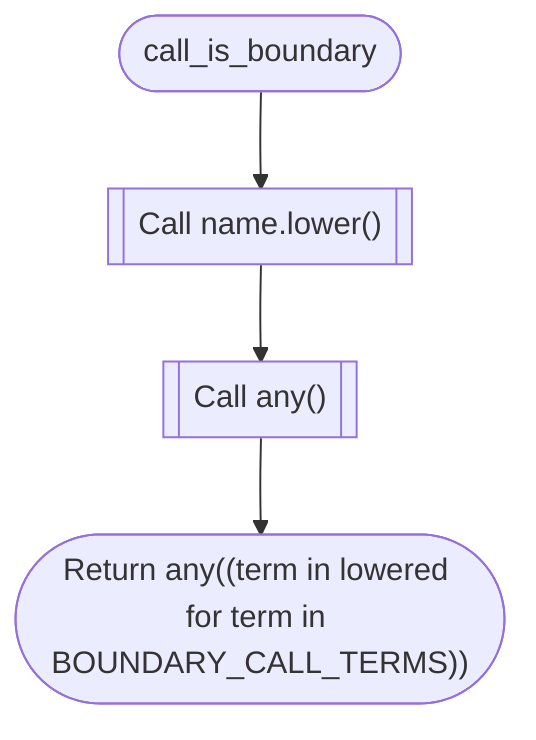

### decision\_identity

`function` · `python` · `generic` · [`src/codedebrief/analysis/common.py:226`](../src/codedebrief/analysis/common.py#L226)

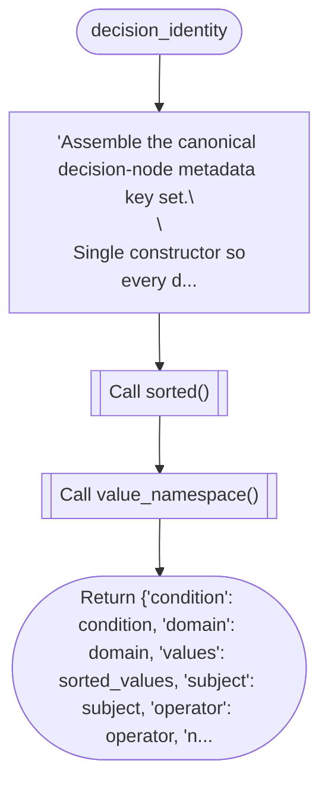

### decision\_metadata

`function` · `python` · `generic` · [`src/codedebrief/analysis/common.py:262`](../src/codedebrief/analysis/common.py#L262)


### dependency\_paths\_from\_import\_map

`function` · `python` · `generic` · [`src/codedebrief/analysis/common.py:366`](../src/codedebrief/analysis/common.py#L366)


### domain\_from\_subject

`function` · `python` · `generic` · [`src/codedebrief/analysis/common.py:214`](../src/codedebrief/analysis/common.py#L214)

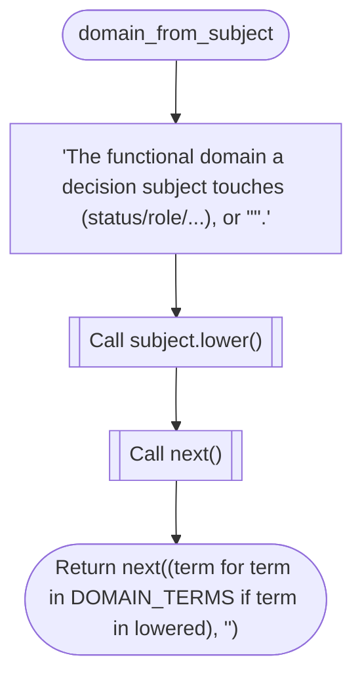

### effect\_tags

`function` · `python` · `generic` · [`src/codedebrief/analysis/common.py:503`](../src/codedebrief/analysis/common.py#L503)

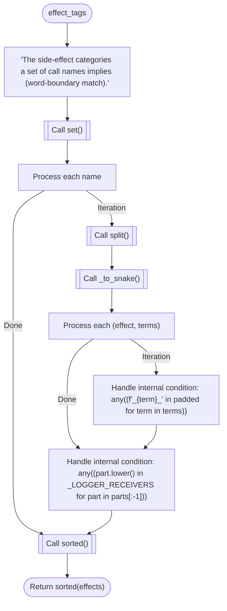

### is\_functional\_condition

`function` · `python` · `generic` · [`src/codedebrief/analysis/common.py:168`](../src/codedebrief/analysis/common.py#L168)


### parse\_subject\_operator

`function` · `python` · `generic` · [`src/codedebrief/analysis/common.py:284`](../src/codedebrief/analysis/common.py#L284)

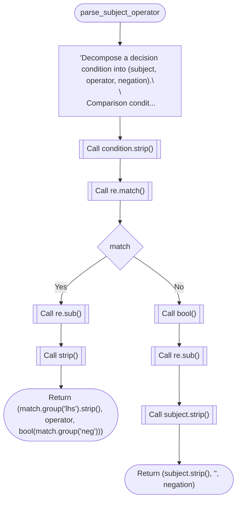

### require\_tree\_sitter\_parse\_ok

`function` · `python` · `generic` · [`src/codedebrief/analysis/common.py:128`](../src/codedebrief/analysis/common.py#L128)


### resolve\_qualified

`function` · `python` · `generic` · [`src/codedebrief/analysis/common.py:327`](../src/codedebrief/analysis/common.py#L327)

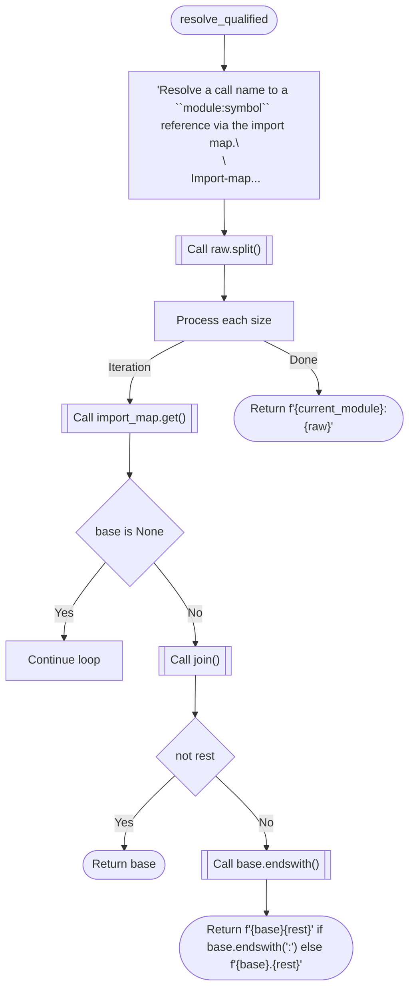

### tag\_call\_effects

`function` · `python` · `generic` · [`src/codedebrief/analysis/common.py:517`](../src/codedebrief/analysis/common.py#L517)


### tree\_sitter\_parse\_error

`function` · `python` · `generic` · [`src/codedebrief/analysis/common.py:142`](../src/codedebrief/analysis/common.py#L142)

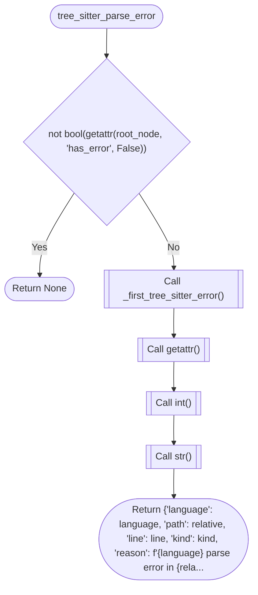

### value\_namespace

`function` · `python` · `generic` · [`src/codedebrief/analysis/common.py:305`](../src/codedebrief/analysis/common.py#L305)

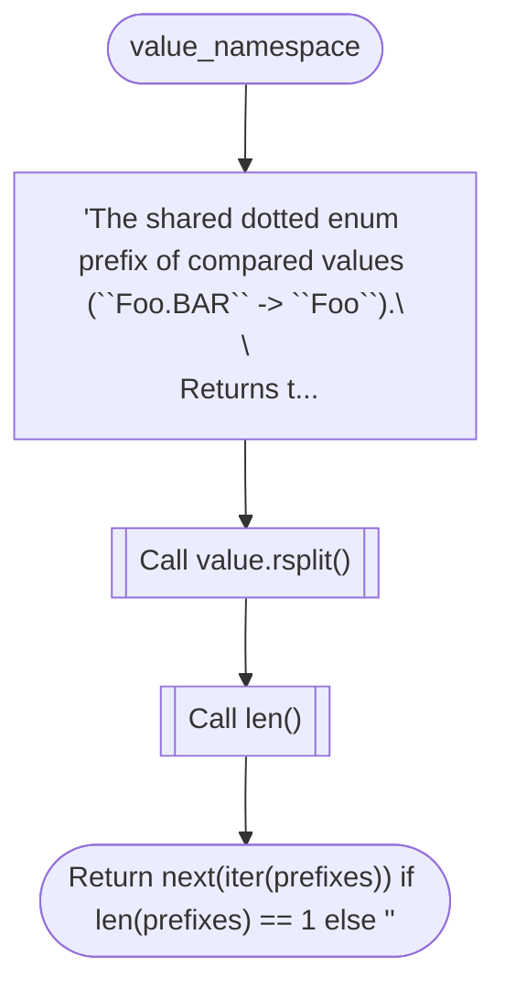

### discover\_source\_files

`function` · `python` · `generic` · [`src/codedebrief/analysis/discovery.py:15`](../src/codedebrief/analysis/discovery.py#L15)

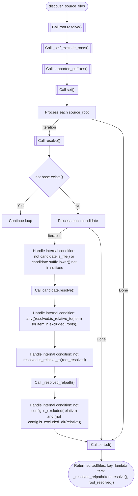

### container\_definitions

`function` · `python` · `generic` · [`src/codedebrief/analysis/languages/_common.py:32`](../src/codedebrief/analysis/languages/_common.py#L32)

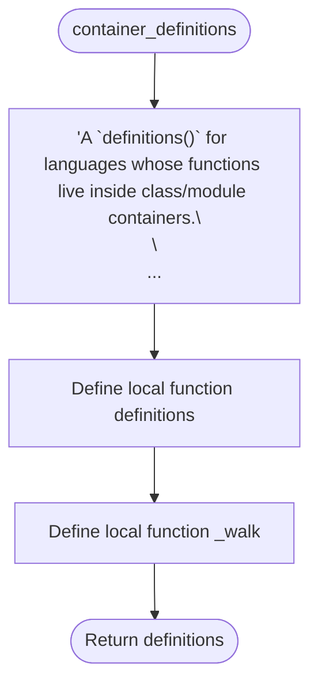

### module\_name

`function` · `python` · `generic` · [`src/codedebrief/analysis/languages/_common.py:27`](../src/codedebrief/analysis/languages/_common.py#L27)


### named

`function` · `python` · `generic` · [`src/codedebrief/analysis/languages/_common.py:23`](../src/codedebrief/analysis/languages/_common.py#L23)

```mermaid
flowchart TD
  mflow_55c99c11e3b00de2_n1(["named"])
  mflow_55c99c11e3b00de2_n2(["Return (child for child in node.children if child.is_named) if node is not None else ()"])
  mflow_55c99c11e3b00de2_n1 --> mflow_55c99c11e3b00de2_n2
```

### text

`function` · `python` · `generic` · [`src/codedebrief/analysis/languages/_common.py:17`](../src/codedebrief/analysis/languages/_common.py#L17)

```mermaid
flowchart TD
  mflow_bddba54a0bd0e8e3_n1(["text"])
  mflow_bddba54a0bd0e8e3_n2{"node is None"}
  mflow_bddba54a0bd0e8e3_n3(["Return ''"])
  mflow_bddba54a0bd0e8e3_n4[["Call decode()"]]
  mflow_bddba54a0bd0e8e3_n5(["Return source[node.start_byte:node.end_byte].decode('utf-8', 'replace')"])
  mflow_bddba54a0bd0e8e3_n1 --> mflow_bddba54a0bd0e8e3_n2
  mflow_bddba54a0bd0e8e3_n2 -->|"Yes"| mflow_bddba54a0bd0e8e3_n3
  mflow_bddba54a0bd0e8e3_n2 -->|"No"| mflow_bddba54a0bd0e8e3_n4
  mflow_bddba54a0bd0e8e3_n4 --> mflow_bddba54a0bd0e8e3_n5
```

### build\_analyzer

`function` · `python` · `generic` · [`src/codedebrief/analysis/languages/c.py:95`](../src/codedebrief/analysis/languages/c.py#L95)

```mermaid
flowchart TD
  mflow_51a471d96c0a366a_n1(["build_analyzer"])
  mflow_51a471d96c0a366a_n2[["Call TreeSitterAnalyzer()"]]
  mflow_51a471d96c0a366a_n3(["Return TreeSitterAnalyzer(root, config, C_PROFILE)"])
  mflow_51a471d96c0a366a_n1 --> mflow_51a471d96c0a366a_n2
  mflow_51a471d96c0a366a_n2 --> mflow_51a471d96c0a366a_n3
```

### build\_analyzer

`function` · `python` · `generic` · [`src/codedebrief/analysis/languages/cpp.py:145`](../src/codedebrief/analysis/languages/cpp.py#L145)

```mermaid
flowchart TD
  mflow_1e1a30b0272b3a62_n1(["build_analyzer"])
  mflow_1e1a30b0272b3a62_n2[["Call TreeSitterAnalyzer()"]]
  mflow_1e1a30b0272b3a62_n3(["Return TreeSitterAnalyzer(root, config, CPP_PROFILE)"])
  mflow_1e1a30b0272b3a62_n1 --> mflow_1e1a30b0272b3a62_n2
  mflow_1e1a30b0272b3a62_n2 --> mflow_1e1a30b0272b3a62_n3
```

### build\_analyzer

`function` · `python` · `generic` · [`src/codedebrief/analysis/languages/csharp.py:136`](../src/codedebrief/analysis/languages/csharp.py#L136)

```mermaid
flowchart TD
  mflow_b488f945011401ba_n1(["build_analyzer"])
  mflow_b488f945011401ba_n2[["Call TreeSitterAnalyzer()"]]
  mflow_b488f945011401ba_n3(["Return TreeSitterAnalyzer(root, config, CSHARP_PROFILE)"])
  mflow_b488f945011401ba_n1 --> mflow_b488f945011401ba_n2
  mflow_b488f945011401ba_n2 --> mflow_b488f945011401ba_n3
```

### build\_analyzer

`function` · `python` · `generic` · [`src/codedebrief/analysis/languages/go.py:156`](../src/codedebrief/analysis/languages/go.py#L156)

```mermaid
flowchart TD
  mflow_caefe91b63c4c911_n1(["build_analyzer"])
  mflow_caefe91b63c4c911_n2[["Call TreeSitterAnalyzer()"]]
  mflow_caefe91b63c4c911_n3(["Return TreeSitterAnalyzer(root, config, GO_PROFILE)"])
  mflow_caefe91b63c4c911_n1 --> mflow_caefe91b63c4c911_n2
  mflow_caefe91b63c4c911_n2 --> mflow_caefe91b63c4c911_n3
```

### build\_analyzer

`function` · `python` · `generic` · [`src/codedebrief/analysis/languages/java.py:157`](../src/codedebrief/analysis/languages/java.py#L157)

```mermaid
flowchart TD
  mflow_1799ef39fd2881dd_n1(["build_analyzer"])
  mflow_1799ef39fd2881dd_n2[["Call TreeSitterAnalyzer()"]]
  mflow_1799ef39fd2881dd_n3(["Return TreeSitterAnalyzer(root, config, JAVA_PROFILE)"])
  mflow_1799ef39fd2881dd_n1 --> mflow_1799ef39fd2881dd_n2
  mflow_1799ef39fd2881dd_n2 --> mflow_1799ef39fd2881dd_n3
```

### build\_analyzer

`function` · `python` · `generic` · [`src/codedebrief/analysis/languages/php.py:82`](../src/codedebrief/analysis/languages/php.py#L82)

```mermaid
flowchart TD
  mflow_9f1dc0fd76dcbd1c_n1(["build_analyzer"])
  mflow_9f1dc0fd76dcbd1c_n2[["Call TreeSitterAnalyzer()"]]
  mflow_9f1dc0fd76dcbd1c_n3(["Return TreeSitterAnalyzer(root, config, PHP_PROFILE)"])
  mflow_9f1dc0fd76dcbd1c_n1 --> mflow_9f1dc0fd76dcbd1c_n2
  mflow_9f1dc0fd76dcbd1c_n2 --> mflow_9f1dc0fd76dcbd1c_n3
```

### build\_analyzer

`function` · `python` · `generic` · [`src/codedebrief/analysis/languages/ruby.py:74`](../src/codedebrief/analysis/languages/ruby.py#L74)

```mermaid
flowchart TD
  mflow_7c734a4d207716a9_n1(["build_analyzer"])
  mflow_7c734a4d207716a9_n2[["Call TreeSitterAnalyzer()"]]
  mflow_7c734a4d207716a9_n3(["Return TreeSitterAnalyzer(root, config, RUBY_PROFILE)"])
  mflow_7c734a4d207716a9_n1 --> mflow_7c734a4d207716a9_n2
  mflow_7c734a4d207716a9_n2 --> mflow_7c734a4d207716a9_n3
```

### build\_analyzer

`function` · `python` · `generic` · [`src/codedebrief/analysis/languages/rust.py:95`](../src/codedebrief/analysis/languages/rust.py#L95)

```mermaid
flowchart TD
  mflow_67d35c04fbb5db76_n1(["build_analyzer"])
  mflow_67d35c04fbb5db76_n2[["Call TreeSitterAnalyzer()"]]
  mflow_67d35c04fbb5db76_n3(["Return TreeSitterAnalyzer(root, config, RUST_PROFILE)"])
  mflow_67d35c04fbb5db76_n1 --> mflow_67d35c04fbb5db76_n2
  mflow_67d35c04fbb5db76_n2 --> mflow_67d35c04fbb5db76_n3
```

### language\_capability\_matrix

`function` · `python` · `generic` · [`src/codedebrief/analysis/registry.py:271`](../src/codedebrief/analysis/registry.py#L271)

```mermaid
flowchart TD
  mflow_eefe5b3ad61fd370_n1(["language_capability_matrix"])
  mflow_eefe5b3ad61fd370_n2["'Return a coarse, deterministic analyzer support matrix for agents and UI.'"]
  mflow_eefe5b3ad61fd370_n3["Set matrix"]
  mflow_eefe5b3ad61fd370_n4["Process each language"]
  mflow_eefe5b3ad61fd370_n5[["Call dict()"]]
  mflow_eefe5b3ad61fd370_n6[["Call features.update()"]]
  mflow_eefe5b3ad61fd370_n7[["Call list()"]]
  mflow_eefe5b3ad61fd370_n8(["Return matrix"])
  mflow_eefe5b3ad61fd370_n1 --> mflow_eefe5b3ad61fd370_n2
  mflow_eefe5b3ad61fd370_n2 --> mflow_eefe5b3ad61fd370_n3
  mflow_eefe5b3ad61fd370_n3 --> mflow_eefe5b3ad61fd370_n4
  mflow_eefe5b3ad61fd370_n4 -->|"Iteration"| mflow_eefe5b3ad61fd370_n5
  mflow_eefe5b3ad61fd370_n5 --> mflow_eefe5b3ad61fd370_n6
  mflow_eefe5b3ad61fd370_n6 --> mflow_eefe5b3ad61fd370_n7
  mflow_eefe5b3ad61fd370_n4 -->|"Done"| mflow_eefe5b3ad61fd370_n8
  mflow_eefe5b3ad61fd370_n7 --> mflow_eefe5b3ad61fd370_n8
```

### language\_for

`function` · `python` · `generic` · [`src/codedebrief/analysis/registry.py:301`](../src/codedebrief/analysis/registry.py#L301)

```mermaid
flowchart TD
  mflow_4cda4da54add37a4_n1(["language_for"])
  mflow_4cda4da54add37a4_n2[["Call spec_for_path()"]]
  mflow_4cda4da54add37a4_n3{"spec is None"}
  mflow_4cda4da54add37a4_n4{{"Raise ValueError(f'Unsupported source file: {path}')"}}
  mflow_4cda4da54add37a4_n5(["Return spec.id"])
  mflow_4cda4da54add37a4_n1 --> mflow_4cda4da54add37a4_n2
  mflow_4cda4da54add37a4_n2 --> mflow_4cda4da54add37a4_n3
  mflow_4cda4da54add37a4_n3 -->|"Yes"| mflow_4cda4da54add37a4_n4
  mflow_4cda4da54add37a4_n3 -->|"No"| mflow_4cda4da54add37a4_n5
```

### spec\_for\_language

`function` · `python` · `generic` · [`src/codedebrief/analysis/registry.py:316`](../src/codedebrief/analysis/registry.py#L316)

```mermaid
flowchart TD
  mflow_90116d716276b40b_n1(["spec_for_language"])
  mflow_90116d716276b40b_n2[["Call _BY_ID.get()"]]
  mflow_90116d716276b40b_n3{"spec is None"}
  mflow_90116d716276b40b_n4{{"Raise ValueError(f'Unknown language: {language}')"}}
  mflow_90116d716276b40b_n5(["Return spec"])
  mflow_90116d716276b40b_n1 --> mflow_90116d716276b40b_n2
  mflow_90116d716276b40b_n2 --> mflow_90116d716276b40b_n3
  mflow_90116d716276b40b_n3 -->|"Yes"| mflow_90116d716276b40b_n4
  mflow_90116d716276b40b_n3 -->|"No"| mflow_90116d716276b40b_n5
```

### spec\_for\_path

`function` · `python` · `generic` · [`src/codedebrief/analysis/registry.py:297`](../src/codedebrief/analysis/registry.py#L297)

```mermaid
flowchart TD
  mflow_2f599ed46ede62b6_n1(["spec_for_path"])
  mflow_2f599ed46ede62b6_n2[["Call _BY_SUFFIX.get()"]]
  mflow_2f599ed46ede62b6_n3(["Return _BY_SUFFIX.get(path.suffix.lower())"])
  mflow_2f599ed46ede62b6_n1 --> mflow_2f599ed46ede62b6_n2
  mflow_2f599ed46ede62b6_n2 --> mflow_2f599ed46ede62b6_n3
```

### supported\_language\_ids

`function` · `python` · `generic` · [`src/codedebrief/analysis/registry.py:260`](../src/codedebrief/analysis/registry.py#L260)

```mermaid
flowchart TD
  mflow_54d5b78789eff3d4_n1(["supported_language_ids"])
  mflow_54d5b78789eff3d4_n2["Set ids"]
  mflow_54d5b78789eff3d4_n3["Process each spec"]
  mflow_54d5b78789eff3d4_n4[["Call ids.append()"]]
  mflow_54d5b78789eff3d4_n5["Handle internal condition: spec.id == 'typescript'"]
  mflow_54d5b78789eff3d4_n6[["Call tuple()"]]
  mflow_54d5b78789eff3d4_n7(["Return tuple(ids)"])
  mflow_54d5b78789eff3d4_n1 --> mflow_54d5b78789eff3d4_n2
  mflow_54d5b78789eff3d4_n2 --> mflow_54d5b78789eff3d4_n3
  mflow_54d5b78789eff3d4_n3 -->|"Iteration"| mflow_54d5b78789eff3d4_n4
  mflow_54d5b78789eff3d4_n4 --> mflow_54d5b78789eff3d4_n5
  mflow_54d5b78789eff3d4_n3 -->|"Done"| mflow_54d5b78789eff3d4_n6
  mflow_54d5b78789eff3d4_n5 --> mflow_54d5b78789eff3d4_n6
  mflow_54d5b78789eff3d4_n6 --> mflow_54d5b78789eff3d4_n7
```

### supported\_suffixes

`function` · `python` · `generic` · [`src/codedebrief/analysis/registry.py:256`](../src/codedebrief/analysis/registry.py#L256)

```mermaid
flowchart TD
  mflow_6f03fa6c1740379b_n1(["supported_suffixes"])
  mflow_6f03fa6c1740379b_n2[["Call frozenset()"]]
  mflow_6f03fa6c1740379b_n3(["Return frozenset(_BY_SUFFIX)"])
  mflow_6f03fa6c1740379b_n1 --> mflow_6f03fa6c1740379b_n2
  mflow_6f03fa6c1740379b_n2 --> mflow_6f03fa6c1740379b_n3
```

### load\_model

`function` · `python` · `generic` · [`src/codedebrief/artifacts.py:43`](../src/codedebrief/artifacts.py#L43)

```mermaid
flowchart TD
  mflow_e54d5bf7e8f9431c_n1(["load_model"])
  mflow_e54d5bf7e8f9431c_n2[["Call output_paths()"]]
  mflow_e54d5bf7e8f9431c_n3{"not json_path.exists()"}
  mflow_e54d5bf7e8f9431c_n4{{"Raise FileNotFoundError(f'No CodeDebrief model found at {json_path}. Run `codedebrief update` first.')"}}
  mflow_e54d5bf7e8f9431c_n5[["Call ProjectModel.from_dict()"]]
  mflow_e54d5bf7e8f9431c_n6(["Return ProjectModel.from_dict(read_json(json_path))"])
  mflow_e54d5bf7e8f9431c_n1 --> mflow_e54d5bf7e8f9431c_n2
  mflow_e54d5bf7e8f9431c_n2 --> mflow_e54d5bf7e8f9431c_n3
  mflow_e54d5bf7e8f9431c_n3 -->|"Yes"| mflow_e54d5bf7e8f9431c_n4
  mflow_e54d5bf7e8f9431c_n3 -->|"No"| mflow_e54d5bf7e8f9431c_n5
  mflow_e54d5bf7e8f9431c_n5 --> mflow_e54d5bf7e8f9431c_n6
```

### output\_paths

`function` · `python` · `generic` · [`src/codedebrief/artifacts.py:12`](../src/codedebrief/artifacts.py#L12)

```mermaid
flowchart TD
  mflow_ea178bb69574e1cf_n1(["output_paths"])
  mflow_ea178bb69574e1cf_n2[["Call CodeDebriefConfig.load()"]]
  mflow_ea178bb69574e1cf_n3[["Call root.resolve()"]]
  mflow_ea178bb69574e1cf_n4[["Call resolve()"]]
  mflow_ea178bb69574e1cf_n5{"Operation succeeds?"}
  mflow_ea178bb69574e1cf_n6[["Call output.relative_to()"]]
  mflow_ea178bb69574e1cf_n7{{"Raise ValueError('CodeDebrief output_dir must stay inside the analyzed project')"}}
  mflow_ea178bb69574e1cf_n8(["Return (output / 'codedebrief.json', output / 'codedebrief.md', output / 'codedebrief.html')"])
  mflow_ea178bb69574e1cf_n1 --> mflow_ea178bb69574e1cf_n2
  mflow_ea178bb69574e1cf_n2 --> mflow_ea178bb69574e1cf_n3
  mflow_ea178bb69574e1cf_n3 --> mflow_ea178bb69574e1cf_n4
  mflow_ea178bb69574e1cf_n4 --> mflow_ea178bb69574e1cf_n5
  mflow_ea178bb69574e1cf_n5 -->|"Success"| mflow_ea178bb69574e1cf_n6
  mflow_ea178bb69574e1cf_n5 -->|"ValueError"| mflow_ea178bb69574e1cf_n7
  mflow_ea178bb69574e1cf_n6 --> mflow_ea178bb69574e1cf_n8
```

### write\_artifacts

`function` · `python` · `generic` · [`src/codedebrief/artifacts.py:27`](../src/codedebrief/artifacts.py#L27)

```mermaid
flowchart TD
  mflow_60369a6990d8c14b_n1(["write_artifacts"])
  mflow_60369a6990d8c14b_n2[["Call output_paths()"]]
  mflow_60369a6990d8c14b_n3[["Call write_json()"]]
  mflow_60369a6990d8c14b_n4[["Call markdown_path.write_text()"]]
  mflow_60369a6990d8c14b_n5{"include_html"}
  mflow_60369a6990d8c14b_n6[["Call html_path.write_text()"]]
  mflow_60369a6990d8c14b_n7(["Return (json_path, markdown_path, html_path)"])
  mflow_60369a6990d8c14b_n8(["Return (json_path, markdown_path, None)"])
  mflow_60369a6990d8c14b_n1 --> mflow_60369a6990d8c14b_n2
  mflow_60369a6990d8c14b_n2 --> mflow_60369a6990d8c14b_n3
  mflow_60369a6990d8c14b_n3 --> mflow_60369a6990d8c14b_n4
  mflow_60369a6990d8c14b_n4 --> mflow_60369a6990d8c14b_n5
  mflow_60369a6990d8c14b_n5 -->|"Yes"| mflow_60369a6990d8c14b_n6
  mflow_60369a6990d8c14b_n6 --> mflow_60369a6990d8c14b_n7
  mflow_60369a6990d8c14b_n5 -->|"No"| mflow_60369a6990d8c14b_n8
```

### build\_parser

`function` · `python` · `generic` · [`src/codedebrief/cli.py:40`](../src/codedebrief/cli.py#L40)

```mermaid
flowchart TD
  mflow_d6452309de1ab682_n1(["build_parser"])
  mflow_d6452309de1ab682_n2[["Call CodeDebriefArgumentParser()"]]
  mflow_d6452309de1ab682_n3[["Call parser.add_argument()"]]
  mflow_d6452309de1ab682_n4[["Call parser.add_subparsers()"]]
  mflow_d6452309de1ab682_n5[["Call subparsers.add_parser()"]]
  mflow_d6452309de1ab682_n6[["Call setup.add_argument()"]]
  mflow_d6452309de1ab682_n7[["Call setup.add_argument()"]]
  mflow_d6452309de1ab682_n8[["Call setup.add_argument()"]]
  mflow_d6452309de1ab682_n9[["Call setup.add_argument()"]]
  mflow_d6452309de1ab682_n10[["Call _add_profile_argument()"]]
  mflow_d6452309de1ab682_n11[["Call subparsers.add_parser()"]]
  mflow_d6452309de1ab682_n12[["Call update.add_argument()"]]
  mflow_d6452309de1ab682_n13[["Call update.add_argument()"]]
  mflow_d6452309de1ab682_n14[["Call update.add_argument()"]]
  mflow_d6452309de1ab682_n15[["Call _add_profile_argument()"]]
  mflow_d6452309de1ab682_n16[["Call subparsers.add_parser()"]]
  mflow_d6452309de1ab682_n17[["Call view.add_argument()"]]
  mflow_d6452309de1ab682_n18[["Call view.add_argument()"]]
  mflow_d6452309de1ab682_n19[["Call view.add_argument()"]]
  mflow_d6452309de1ab682_n20[["Call view.add_argument()"]]
  mflow_d6452309de1ab682_n21[["Call _add_profile_argument()"]]
  mflow_d6452309de1ab682_n22[["Call subparsers.add_parser()"]]
  mflow_d6452309de1ab682_n23[["Call validate.add_argument()"]]
  mflow_d6452309de1ab682_n24[["Call validate.add_argument()"]]
  mflow_d6452309de1ab682_n25[["Call validate.add_argument()"]]
  mflow_d6452309de1ab682_n26[["Call validate.add_argument()"]]
  mflow_d6452309de1ab682_n27[["Call validate.add_argument()"]]
  mflow_d6452309de1ab682_n28[["Call validate.add_argument()"]]
  mflow_d6452309de1ab682_n29[["Call validate.add_argument()"]]
  mflow_d6452309de1ab682_n30[["Call validate.add_argument()"]]
  mflow_d6452309de1ab682_n31[["Call _add_profile_argument()"]]
  mflow_d6452309de1ab682_n32[["Call subparsers.add_parser()"]]
  mflow_d6452309de1ab682_n33[["Call doctor.add_argument()"]]
  mflow_d6452309de1ab682_n34[["Call doctor.add_argument()"]]
  mflow_d6452309de1ab682_n35[["Call subparsers.add_parser()"]]
  mflow_d6452309de1ab682_n36[["Call mcp.add_argument()"]]
  mflow_d6452309de1ab682_n37[["Call _add_profile_argument()"]]
  mflow_d6452309de1ab682_n38(["Return parser"])
  mflow_d6452309de1ab682_n1 --> mflow_d6452309de1ab682_n2
  mflow_d6452309de1ab682_n2 --> mflow_d6452309de1ab682_n3
  mflow_d6452309de1ab682_n3 --> mflow_d6452309de1ab682_n4
  mflow_d6452309de1ab682_n4 --> mflow_d6452309de1ab682_n5
  mflow_d6452309de1ab682_n5 --> mflow_d6452309de1ab682_n6
  mflow_d6452309de1ab682_n6 --> mflow_d6452309de1ab682_n7
  mflow_d6452309de1ab682_n7 --> mflow_d6452309de1ab682_n8
  mflow_d6452309de1ab682_n8 --> mflow_d6452309de1ab682_n9
  mflow_d6452309de1ab682_n9 --> mflow_d6452309de1ab682_n10
  mflow_d6452309de1ab682_n10 --> mflow_d6452309de1ab682_n11
  mflow_d6452309de1ab682_n11 --> mflow_d6452309de1ab682_n12
  mflow_d6452309de1ab682_n12 --> mflow_d6452309de1ab682_n13
  mflow_d6452309de1ab682_n13 --> mflow_d6452309de1ab682_n14
  mflow_d6452309de1ab682_n14 --> mflow_d6452309de1ab682_n15
  mflow_d6452309de1ab682_n15 --> mflow_d6452309de1ab682_n16
  mflow_d6452309de1ab682_n16 --> mflow_d6452309de1ab682_n17
  mflow_d6452309de1ab682_n17 --> mflow_d6452309de1ab682_n18
  mflow_d6452309de1ab682_n18 --> mflow_d6452309de1ab682_n19
  mflow_d6452309de1ab682_n19 --> mflow_d6452309de1ab682_n20
  mflow_d6452309de1ab682_n20 --> mflow_d6452309de1ab682_n21
  mflow_d6452309de1ab682_n21 --> mflow_d6452309de1ab682_n22
  mflow_d6452309de1ab682_n22 --> mflow_d6452309de1ab682_n23
  mflow_d6452309de1ab682_n23 --> mflow_d6452309de1ab682_n24
  mflow_d6452309de1ab682_n24 --> mflow_d6452309de1ab682_n25
  mflow_d6452309de1ab682_n25 --> mflow_d6452309de1ab682_n26
  mflow_d6452309de1ab682_n26 --> mflow_d6452309de1ab682_n27
  mflow_d6452309de1ab682_n27 --> mflow_d6452309de1ab682_n28
  mflow_d6452309de1ab682_n28 --> mflow_d6452309de1ab682_n29
  mflow_d6452309de1ab682_n29 --> mflow_d6452309de1ab682_n30
  mflow_d6452309de1ab682_n30 --> mflow_d6452309de1ab682_n31
  mflow_d6452309de1ab682_n31 --> mflow_d6452309de1ab682_n32
  mflow_d6452309de1ab682_n32 --> mflow_d6452309de1ab682_n33
  mflow_d6452309de1ab682_n33 --> mflow_d6452309de1ab682_n34
  mflow_d6452309de1ab682_n34 --> mflow_d6452309de1ab682_n35
  mflow_d6452309de1ab682_n35 --> mflow_d6452309de1ab682_n36
  mflow_d6452309de1ab682_n36 --> mflow_d6452309de1ab682_n37
  mflow_d6452309de1ab682_n37 --> mflow_d6452309de1ab682_n38
```

### main

`function` · `python` · `generic` · [`src/codedebrief/cli.py:227`](../src/codedebrief/cli.py#L227)

```mermaid
flowchart TD
  mflow_1792b68cca289a2d_n1(["main"])
  mflow_1792b68cca289a2d_n2[["Call parse_args()"]]
  mflow_1792b68cca289a2d_n3{"Operation succeeds?"}
  mflow_1792b68cca289a2d_n4{"args.command == 'setup-agent'"}
  mflow_1792b68cca289a2d_n5[["Call _setup_agent()"]]
  mflow_1792b68cca289a2d_n6(["Return _setup_agent(Path(args.path), args.agent, full=args.full, include_html=not args.no_html, profile=args.profile)"])
  mflow_1792b68cca289a2d_n7{"args.command == 'update'"}
  mflow_1792b68cca289a2d_n8[["Call _analyze()"]]
  mflow_1792b68cca289a2d_n9(["Return _analyze(Path(args.path), full=args.full, include_html=not args.no_html, profile=args.profile)"])
  mflow_1792b68cca289a2d_n10{"args.command == 'view'"}
  mflow_1792b68cca289a2d_n11[["Call _view()"]]
  mflow_1792b68cca289a2d_n12(["Return _view(Path(args.path), args.port, not args.no_open, args.render_only, args.profile)"])
  mflow_1792b68cca289a2d_n13{"args.command == 'validate'"}
  mflow_1792b68cca289a2d_n14[["Call _validate()"]]
  mflow_1792b68cca289a2d_n15(["Return _validate(Path(args.path), args.check_sync, args.json_output, args.quality, _quality_thresholds(args), args.prof..."])
  mflow_1792b68cca289a2d_n16{"args.command == 'doctor'"}
  mflow_1792b68cca289a2d_n17[["Call _doctor()"]]
  mflow_1792b68cca289a2d_n18(["Return _doctor(Path(args.path), args.json_output)"])
  mflow_1792b68cca289a2d_n19{"args.command == 'mcp'"}
  mflow_1792b68cca289a2d_n20["Load dependencies"]
  mflow_1792b68cca289a2d_n21[["Call CodeDebriefConfig.load()"]]
  mflow_1792b68cca289a2d_n22[["Call run_mcp()"]]
  mflow_1792b68cca289a2d_n23(["Return 0"])
  mflow_1792b68cca289a2d_n24[["Call print()"]]
  mflow_1792b68cca289a2d_n25[["Call print()"]]
  mflow_1792b68cca289a2d_n26[["Call print()"]]
  mflow_1792b68cca289a2d_n27[["Call print()"]]
  mflow_1792b68cca289a2d_n28[["Call print()"]]
  mflow_1792b68cca289a2d_n29(["Return 1"])
  mflow_1792b68cca289a2d_n30(["Return 0"])
  mflow_1792b68cca289a2d_n1 --> mflow_1792b68cca289a2d_n2
  mflow_1792b68cca289a2d_n2 --> mflow_1792b68cca289a2d_n3
  mflow_1792b68cca289a2d_n3 -->|"Success"| mflow_1792b68cca289a2d_n4
  mflow_1792b68cca289a2d_n4 -->|"Yes"| mflow_1792b68cca289a2d_n5
  mflow_1792b68cca289a2d_n5 --> mflow_1792b68cca289a2d_n6
  mflow_1792b68cca289a2d_n4 -->|"No"| mflow_1792b68cca289a2d_n7
  mflow_1792b68cca289a2d_n7 -->|"Yes"| mflow_1792b68cca289a2d_n8
  mflow_1792b68cca289a2d_n8 --> mflow_1792b68cca289a2d_n9
  mflow_1792b68cca289a2d_n7 -->|"No"| mflow_1792b68cca289a2d_n10
  mflow_1792b68cca289a2d_n10 -->|"Yes"| mflow_1792b68cca289a2d_n11
  mflow_1792b68cca289a2d_n11 --> mflow_1792b68cca289a2d_n12
  mflow_1792b68cca289a2d_n10 -->|"No"| mflow_1792b68cca289a2d_n13
  mflow_1792b68cca289a2d_n13 -->|"Yes"| mflow_1792b68cca289a2d_n14
  mflow_1792b68cca289a2d_n14 --> mflow_1792b68cca289a2d_n15
  mflow_1792b68cca289a2d_n13 -->|"No"| mflow_1792b68cca289a2d_n16
  mflow_1792b68cca289a2d_n16 -->|"Yes"| mflow_1792b68cca289a2d_n17
  mflow_1792b68cca289a2d_n17 --> mflow_1792b68cca289a2d_n18
  mflow_1792b68cca289a2d_n16 -->|"No"| mflow_1792b68cca289a2d_n19
  mflow_1792b68cca289a2d_n19 -->|"Yes"| mflow_1792b68cca289a2d_n20
  mflow_1792b68cca289a2d_n20 --> mflow_1792b68cca289a2d_n21
  mflow_1792b68cca289a2d_n21 --> mflow_1792b68cca289a2d_n22
  mflow_1792b68cca289a2d_n22 --> mflow_1792b68cca289a2d_n23
  mflow_1792b68cca289a2d_n3 -->|"(OSError, RuntimeError, ValueError, SyntaxError)"| mflow_1792b68cca289a2d_n24
  mflow_1792b68cca289a2d_n24 --> mflow_1792b68cca289a2d_n25
  mflow_1792b68cca289a2d_n25 --> mflow_1792b68cca289a2d_n26
  mflow_1792b68cca289a2d_n26 --> mflow_1792b68cca289a2d_n27
  mflow_1792b68cca289a2d_n27 --> mflow_1792b68cca289a2d_n28
  mflow_1792b68cca289a2d_n28 --> mflow_1792b68cca289a2d_n29
  mflow_1792b68cca289a2d_n19 -->|"No"| mflow_1792b68cca289a2d_n30
```

### doctor\_report

`function` · `python` · `generic` · [`src/codedebrief/doctor.py:65`](../src/codedebrief/doctor.py#L65)

```mermaid
flowchart TD
  mflow_36092a2ab749d529_n1(["doctor_report"])
  mflow_36092a2ab749d529_n2[["Call MissingDependency()"]]
  mflow_36092a2ab749d529_n3[["Call DoctorReport()"]]
  mflow_36092a2ab749d529_n4(["Return DoctorReport(ok=not missing, executable=sys.executable, package_version=_package_version(), package_location=_pa..."])
  mflow_36092a2ab749d529_n1 --> mflow_36092a2ab749d529_n2
  mflow_36092a2ab749d529_n2 --> mflow_36092a2ab749d529_n3
  mflow_36092a2ab749d529_n3 --> mflow_36092a2ab749d529_n4
```

### render\_doctor

`function` · `python` · `generic` · [`src/codedebrief/doctor.py:82`](../src/codedebrief/doctor.py#L82)

```mermaid
flowchart TD
  mflow_d691287530df41c7_n1(["render_doctor"])
  mflow_d691287530df41c7_n2["Set capabilities"]
  mflow_d691287530df41c7_n3["Set lines"]
  mflow_d691287530df41c7_n4["Handle internal condition: report.package_location"]
  mflow_d691287530df41c7_n5[["Call lines.append()"]]
  mflow_d691287530df41c7_n6[["Call lines.append()"]]
  mflow_d691287530df41c7_n7{"report.missing_dependencies"}
  mflow_d691287530df41c7_n8[["Call lines.append()"]]
  mflow_d691287530df41c7_n9[["Call lines.append()"]]
  mflow_d691287530df41c7_n10[["Call lines.extend()"]]
  mflow_d691287530df41c7_n11[["Call lines.append()"]]
  mflow_d691287530df41c7_n12[["Call lines.append()"]]
  mflow_d691287530df41c7_n13[["Call lines.append()"]]
  mflow_d691287530df41c7_n14[["Call lines.append()"]]
  mflow_d691287530df41c7_n15[["Call join()"]]
  mflow_d691287530df41c7_n16(["Return '\\n'.join(lines)"])
  mflow_d691287530df41c7_n1 --> mflow_d691287530df41c7_n2
  mflow_d691287530df41c7_n2 --> mflow_d691287530df41c7_n3
  mflow_d691287530df41c7_n3 --> mflow_d691287530df41c7_n4
  mflow_d691287530df41c7_n4 --> mflow_d691287530df41c7_n5
  mflow_d691287530df41c7_n5 --> mflow_d691287530df41c7_n6
  mflow_d691287530df41c7_n6 --> mflow_d691287530df41c7_n7
  mflow_d691287530df41c7_n7 -->|"Yes"| mflow_d691287530df41c7_n8
  mflow_d691287530df41c7_n8 --> mflow_d691287530df41c7_n9
  mflow_d691287530df41c7_n9 --> mflow_d691287530df41c7_n10
  mflow_d691287530df41c7_n10 --> mflow_d691287530df41c7_n11
  mflow_d691287530df41c7_n11 --> mflow_d691287530df41c7_n12
  mflow_d691287530df41c7_n12 --> mflow_d691287530df41c7_n13
  mflow_d691287530df41c7_n7 -->|"No"| mflow_d691287530df41c7_n14
  mflow_d691287530df41c7_n13 --> mflow_d691287530df41c7_n15
  mflow_d691287530df41c7_n14 --> mflow_d691287530df41c7_n15
  mflow_d691287530df41c7_n15 --> mflow_d691287530df41c7_n16
```

### render\_doctor\_json

`function` · `python` · `generic` · [`src/codedebrief/doctor.py:113`](../src/codedebrief/doctor.py#L113)

```mermaid
flowchart TD
  mflow_5c933b42f79a0549_n1(["render_doctor_json"])
  mflow_5c933b42f79a0549_n2[["Call json.dumps()"]]
  mflow_5c933b42f79a0549_n3(["Return json.dumps(report.to_dict(), indent=2)"])
  mflow_5c933b42f79a0549_n1 --> mflow_5c933b42f79a0549_n2
  mflow_5c933b42f79a0549_n2 --> mflow_5c933b42f79a0549_n3
```

### install\_agent\_instructions

`function` · `python` · `generic` · [`src/codedebrief/install.py:230`](../src/codedebrief/install.py#L230)

```mermaid
flowchart TD
  mflow_9c6b73e81123f77a_n1(["install_agent_instructions"])
  mflow_9c6b73e81123f77a_n2[["Call tuple()"]]
  mflow_9c6b73e81123f77a_n3[["Call set()"]]
  mflow_9c6b73e81123f77a_n4{"unknown"}
  mflow_9c6b73e81123f77a_n5[["Call join()"]]
  mflow_9c6b73e81123f77a_n6{{"Raise ValueError(f'unknown agent instruction target {platform!r}; known targets: {known}')"}}
  mflow_9c6b73e81123f77a_n7["Set targets"]
  mflow_9c6b73e81123f77a_n8["Set changed"]
  mflow_9c6b73e81123f77a_n9["Process each target"]
  mflow_9c6b73e81123f77a_n10[["Call target.parent.mkdir()"]]
  mflow_9c6b73e81123f77a_n11[["Call target.exists()"]]
  mflow_9c6b73e81123f77a_n12[["Call _upsert()"]]
  mflow_9c6b73e81123f77a_n13{"target.suffix == '.mdc' and (not updated.startswith('---'))"}
  mflow_9c6b73e81123f77a_n14["Set frontmatter"]
  mflow_9c6b73e81123f77a_n15["Set updated"]
  mflow_9c6b73e81123f77a_n16{"updated != existing"}
  mflow_9c6b73e81123f77a_n17[["Call target.write_text()"]]
  mflow_9c6b73e81123f77a_n18[["Call changed.append()"]]
  mflow_9c6b73e81123f77a_n19(["Return changed"])
  mflow_9c6b73e81123f77a_n1 --> mflow_9c6b73e81123f77a_n2
  mflow_9c6b73e81123f77a_n2 --> mflow_9c6b73e81123f77a_n3
  mflow_9c6b73e81123f77a_n3 --> mflow_9c6b73e81123f77a_n4
  mflow_9c6b73e81123f77a_n4 -->|"Yes"| mflow_9c6b73e81123f77a_n5
  mflow_9c6b73e81123f77a_n5 --> mflow_9c6b73e81123f77a_n6
  mflow_9c6b73e81123f77a_n4 -->|"No"| mflow_9c6b73e81123f77a_n7
  mflow_9c6b73e81123f77a_n7 --> mflow_9c6b73e81123f77a_n8
  mflow_9c6b73e81123f77a_n8 --> mflow_9c6b73e81123f77a_n9
  mflow_9c6b73e81123f77a_n9 -->|"Iteration"| mflow_9c6b73e81123f77a_n10
  mflow_9c6b73e81123f77a_n10 --> mflow_9c6b73e81123f77a_n11
  mflow_9c6b73e81123f77a_n11 --> mflow_9c6b73e81123f77a_n12
  mflow_9c6b73e81123f77a_n12 --> mflow_9c6b73e81123f77a_n13
  mflow_9c6b73e81123f77a_n13 -->|"Yes"| mflow_9c6b73e81123f77a_n14
  mflow_9c6b73e81123f77a_n14 --> mflow_9c6b73e81123f77a_n15
  mflow_9c6b73e81123f77a_n15 --> mflow_9c6b73e81123f77a_n16
  mflow_9c6b73e81123f77a_n13 -->|"No"| mflow_9c6b73e81123f77a_n16
  mflow_9c6b73e81123f77a_n16 -->|"Yes"| mflow_9c6b73e81123f77a_n17
  mflow_9c6b73e81123f77a_n17 --> mflow_9c6b73e81123f77a_n18
  mflow_9c6b73e81123f77a_n9 -->|"Done"| mflow_9c6b73e81123f77a_n19
  mflow_9c6b73e81123f77a_n18 --> mflow_9c6b73e81123f77a_n19
  mflow_9c6b73e81123f77a_n16 -->|"No"| mflow_9c6b73e81123f77a_n19
```

### install\_agent\_skill

`function` · `python` · `generic` · [`src/codedebrief/install.py:254`](../src/codedebrief/install.py#L254)

```mermaid
flowchart TD
  mflow_97b1d566532a3dc3_n1(["install_agent_skill"])
  mflow_97b1d566532a3dc3_n2[["Call tuple()"]]
  mflow_97b1d566532a3dc3_n3[["Call set()"]]
  mflow_97b1d566532a3dc3_n4{"unknown"}
  mflow_97b1d566532a3dc3_n5[["Call join()"]]
  mflow_97b1d566532a3dc3_n6{{"Raise ValueError(f'unknown agent skill target {platform!r}; known targets: {known}')"}}
  mflow_97b1d566532a3dc3_n7["Set changed"]
  mflow_97b1d566532a3dc3_n8["Process each name"]
  mflow_97b1d566532a3dc3_n9[["Call AGENT_SKILL_TARGETS.get()"]]
  mflow_97b1d566532a3dc3_n10{"target_path is None"}
  mflow_97b1d566532a3dc3_n11["Continue loop"]
  mflow_97b1d566532a3dc3_n12["Set target"]
  mflow_97b1d566532a3dc3_n13[["Call target.parent.mkdir()"]]
  mflow_97b1d566532a3dc3_n14[["Call target.exists()"]]
  mflow_97b1d566532a3dc3_n15{"existing != SKILL_TEMPLATE"}
  mflow_97b1d566532a3dc3_n16[["Call target.write_text()"]]
  mflow_97b1d566532a3dc3_n17[["Call changed.append()"]]
  mflow_97b1d566532a3dc3_n18(["Return changed"])
  mflow_97b1d566532a3dc3_n1 --> mflow_97b1d566532a3dc3_n2
  mflow_97b1d566532a3dc3_n2 --> mflow_97b1d566532a3dc3_n3
  mflow_97b1d566532a3dc3_n3 --> mflow_97b1d566532a3dc3_n4
  mflow_97b1d566532a3dc3_n4 -->|"Yes"| mflow_97b1d566532a3dc3_n5
  mflow_97b1d566532a3dc3_n5 --> mflow_97b1d566532a3dc3_n6
  mflow_97b1d566532a3dc3_n4 -->|"No"| mflow_97b1d566532a3dc3_n7
  mflow_97b1d566532a3dc3_n7 --> mflow_97b1d566532a3dc3_n8
  mflow_97b1d566532a3dc3_n8 -->|"Iteration"| mflow_97b1d566532a3dc3_n9
  mflow_97b1d566532a3dc3_n9 --> mflow_97b1d566532a3dc3_n10
  mflow_97b1d566532a3dc3_n10 -->|"Yes"| mflow_97b1d566532a3dc3_n11
  mflow_97b1d566532a3dc3_n10 -->|"No"| mflow_97b1d566532a3dc3_n12
  mflow_97b1d566532a3dc3_n12 --> mflow_97b1d566532a3dc3_n13
  mflow_97b1d566532a3dc3_n13 --> mflow_97b1d566532a3dc3_n14
  mflow_97b1d566532a3dc3_n14 --> mflow_97b1d566532a3dc3_n15
  mflow_97b1d566532a3dc3_n15 -->|"Yes"| mflow_97b1d566532a3dc3_n16
  mflow_97b1d566532a3dc3_n16 --> mflow_97b1d566532a3dc3_n17
  mflow_97b1d566532a3dc3_n8 -->|"Done"| mflow_97b1d566532a3dc3_n18
  mflow_97b1d566532a3dc3_n17 --> mflow_97b1d566532a3dc3_n18
  mflow_97b1d566532a3dc3_n15 -->|"No"| mflow_97b1d566532a3dc3_n18
```

### install\_all

`function` · `python` · `generic` · [`src/codedebrief/install.py:222`](../src/codedebrief/install.py#L222)

```mermaid
flowchart TD
  mflow_44dc5c734dd784e6_n1(["install_all"])
  mflow_44dc5c734dd784e6_n2[["Call install_agent_instructions()"]]
  mflow_44dc5c734dd784e6_n3[["Call changed.extend()"]]
  mflow_44dc5c734dd784e6_n4{"mcp_config != 'none'"}
  mflow_44dc5c734dd784e6_n5[["Call changed.extend()"]]
  mflow_44dc5c734dd784e6_n6(["Return changed"])
  mflow_44dc5c734dd784e6_n1 --> mflow_44dc5c734dd784e6_n2
  mflow_44dc5c734dd784e6_n2 --> mflow_44dc5c734dd784e6_n3
  mflow_44dc5c734dd784e6_n3 --> mflow_44dc5c734dd784e6_n4
  mflow_44dc5c734dd784e6_n4 -->|"Yes"| mflow_44dc5c734dd784e6_n5
  mflow_44dc5c734dd784e6_n5 --> mflow_44dc5c734dd784e6_n6
  mflow_44dc5c734dd784e6_n4 -->|"No"| mflow_44dc5c734dd784e6_n6
```

### install\_mcp\_config

`function` · `python` · `generic` · [`src/codedebrief/install.py:275`](../src/codedebrief/install.py#L275)

```mermaid
flowchart TD
  mflow_bdde402d2caf86a0_n1(["install_mcp_config"])
  mflow_bdde402d2caf86a0_n2[["Call root.resolve()"]]
  mflow_bdde402d2caf86a0_n3["Set targets"]
  mflow_bdde402d2caf86a0_n4[["Call set()"]]
  mflow_bdde402d2caf86a0_n5{"unknown"}
  mflow_bdde402d2caf86a0_n6[["Call join()"]]
  mflow_bdde402d2caf86a0_n7{{"Raise ValueError(f'unknown MCP config target {target!r}; known targets: {known}')"}}
  mflow_bdde402d2caf86a0_n8["Set changed"]
  mflow_bdde402d2caf86a0_n9["Process each item"]
  mflow_bdde402d2caf86a0_n10["Handle internal condition: item == 'codex'"]
  mflow_bdde402d2caf86a0_n11{"path is not None"}
  mflow_bdde402d2caf86a0_n12[["Call changed.append()"]]
  mflow_bdde402d2caf86a0_n13(["Return changed"])
  mflow_bdde402d2caf86a0_n1 --> mflow_bdde402d2caf86a0_n2
  mflow_bdde402d2caf86a0_n2 --> mflow_bdde402d2caf86a0_n3
  mflow_bdde402d2caf86a0_n3 --> mflow_bdde402d2caf86a0_n4
  mflow_bdde402d2caf86a0_n4 --> mflow_bdde402d2caf86a0_n5
  mflow_bdde402d2caf86a0_n5 -->|"Yes"| mflow_bdde402d2caf86a0_n6
  mflow_bdde402d2caf86a0_n6 --> mflow_bdde402d2caf86a0_n7
  mflow_bdde402d2caf86a0_n5 -->|"No"| mflow_bdde402d2caf86a0_n8
  mflow_bdde402d2caf86a0_n8 --> mflow_bdde402d2caf86a0_n9
  mflow_bdde402d2caf86a0_n9 -->|"Iteration"| mflow_bdde402d2caf86a0_n10
  mflow_bdde402d2caf86a0_n10 --> mflow_bdde402d2caf86a0_n11
  mflow_bdde402d2caf86a0_n11 -->|"Yes"| mflow_bdde402d2caf86a0_n12
  mflow_bdde402d2caf86a0_n9 -->|"Done"| mflow_bdde402d2caf86a0_n13
  mflow_bdde402d2caf86a0_n12 --> mflow_bdde402d2caf86a0_n13
  mflow_bdde402d2caf86a0_n11 -->|"No"| mflow_bdde402d2caf86a0_n13
```

### flow\_in\_agent\_scope

`function` · `python` · `generic` · [`src/codedebrief/mcp_server.py:2719`](../src/codedebrief/mcp_server.py#L2719)

```mermaid
flowchart TD
  mflow_e0d0c0d1be37564f_n1(["flow_in_agent_scope"])
  mflow_e0d0c0d1be37564f_n2[["Call metadata_scope_names()"]]
  mflow_e0d0c0d1be37564f_n3(["Return scope is None or scope in metadata_scope_names(flow.metadata)"])
  mflow_e0d0c0d1be37564f_n1 --> mflow_e0d0c0d1be37564f_n2
  mflow_e0d0c0d1be37564f_n2 --> mflow_e0d0c0d1be37564f_n3
```

### model\_hash

`function` · `python` · `generic` · [`src/codedebrief/mcp_server.py:59`](../src/codedebrief/mcp_server.py#L59)

```mermaid
flowchart TD
  mflow_1636f828012f92a5_n1(["model_hash"])
  mflow_1636f828012f92a5_n2[["Call model.to_dict()"]]
  mflow_1636f828012f92a5_n3[["Call payload.pop()"]]
  mflow_1636f828012f92a5_n4[["Call json.dumps()"]]
  mflow_1636f828012f92a5_n5[["Call hexdigest()"]]
  mflow_1636f828012f92a5_n6(["Return hashlib.sha256(raw.encode('utf-8')).hexdigest()"])
  mflow_1636f828012f92a5_n1 --> mflow_1636f828012f92a5_n2
  mflow_1636f828012f92a5_n2 --> mflow_1636f828012f92a5_n3
  mflow_1636f828012f92a5_n3 --> mflow_1636f828012f92a5_n4
  mflow_1636f828012f92a5_n4 --> mflow_1636f828012f92a5_n5
  mflow_1636f828012f92a5_n5 --> mflow_1636f828012f92a5_n6
```

### run\_mcp

`function` · `python` · `generic` · [`src/codedebrief/mcp_server.py:91`](../src/codedebrief/mcp_server.py#L91)

```mermaid
flowchart TD
  mflow_66a9c0f0a5f9ccdf_n1(["run_mcp"])
  mflow_66a9c0f0a5f9ccdf_n2{"Operation succeeds?"}
  mflow_66a9c0f0a5f9ccdf_n3["Load dependencies"]
  mflow_66a9c0f0a5f9ccdf_n4{{"Raise RuntimeError('MCP support is not importable. Reinstall CodeDebrief with `uv tool install .` or run `uv sync --ext..."}}
  mflow_66a9c0f0a5f9ccdf_n5[["Call root.resolve()"]]
  mflow_66a9c0f0a5f9ccdf_n6[["Call CodeDebriefConfig.load()"]]
  mflow_66a9c0f0a5f9ccdf_n7[["Call FastMCP()"]]
  mflow_66a9c0f0a5f9ccdf_n8["Define local function agent_context"]
  mflow_66a9c0f0a5f9ccdf_n9["Define local function expand_slice"]
  mflow_66a9c0f0a5f9ccdf_n10["Define local function workflow_path"]
  mflow_66a9c0f0a5f9ccdf_n11["Define local function snapshot_slice"]
  mflow_66a9c0f0a5f9ccdf_n12["Define local function explain_flow"]
  mflow_66a9c0f0a5f9ccdf_n13["Define local function explain_node"]
  mflow_66a9c0f0a5f9ccdf_n14["Define local function explain_edge"]
  mflow_66a9c0f0a5f9ccdf_n15["Define local function validate_artifacts"]
  mflow_66a9c0f0a5f9ccdf_n16["Define local function update_codedebrief"]
  mflow_66a9c0f0a5f9ccdf_n17[["Call server.run()"]]
  mflow_66a9c0f0a5f9ccdf_n18(["Complete"])
  mflow_66a9c0f0a5f9ccdf_n1 --> mflow_66a9c0f0a5f9ccdf_n2
  mflow_66a9c0f0a5f9ccdf_n2 -->|"Success"| mflow_66a9c0f0a5f9ccdf_n3
  mflow_66a9c0f0a5f9ccdf_n2 -->|"ImportError"| mflow_66a9c0f0a5f9ccdf_n4
  mflow_66a9c0f0a5f9ccdf_n3 --> mflow_66a9c0f0a5f9ccdf_n5
  mflow_66a9c0f0a5f9ccdf_n5 --> mflow_66a9c0f0a5f9ccdf_n6
  mflow_66a9c0f0a5f9ccdf_n6 --> mflow_66a9c0f0a5f9ccdf_n7
  mflow_66a9c0f0a5f9ccdf_n7 --> mflow_66a9c0f0a5f9ccdf_n8
  mflow_66a9c0f0a5f9ccdf_n8 --> mflow_66a9c0f0a5f9ccdf_n9
  mflow_66a9c0f0a5f9ccdf_n9 --> mflow_66a9c0f0a5f9ccdf_n10
  mflow_66a9c0f0a5f9ccdf_n10 --> mflow_66a9c0f0a5f9ccdf_n11
  mflow_66a9c0f0a5f9ccdf_n11 --> mflow_66a9c0f0a5f9ccdf_n12
  mflow_66a9c0f0a5f9ccdf_n12 --> mflow_66a9c0f0a5f9ccdf_n13
  mflow_66a9c0f0a5f9ccdf_n13 --> mflow_66a9c0f0a5f9ccdf_n14
  mflow_66a9c0f0a5f9ccdf_n14 --> mflow_66a9c0f0a5f9ccdf_n15
  mflow_66a9c0f0a5f9ccdf_n15 --> mflow_66a9c0f0a5f9ccdf_n16
  mflow_66a9c0f0a5f9ccdf_n16 --> mflow_66a9c0f0a5f9ccdf_n17
  mflow_66a9c0f0a5f9ccdf_n17 --> mflow_66a9c0f0a5f9ccdf_n18
```

### model\_quality

`function` · `python` · `generic` · [`src/codedebrief/quality.py:22`](../src/codedebrief/quality.py#L22)

```mermaid
flowchart TD
  mflow_dc395fad87adcb30_n1(["model_quality"])
  mflow_dc395fad87adcb30_n2["'Deterministic analyzer-quality metrics derived from one persisted model.'"]
  mflow_dc395fad87adcb30_n3[["Call flow.metadata.get()"]]
  mflow_dc395fad87adcb30_n4["Set call_nodes"]
  mflow_dc395fad87adcb30_n5[["Call node.metadata.get()"]]
  mflow_dc395fad87adcb30_n6[["Call len()"]]
  mflow_dc395fad87adcb30_n7[["Call node.metadata.get()"]]
  mflow_dc395fad87adcb30_n8[["Call lower()"]]
  mflow_dc395fad87adcb30_n9[["Call sum()"]]
  mflow_dc395fad87adcb30_n10[["Call sum()"]]
  mflow_dc395fad87adcb30_n11[["Call _generic_label_nodes()"]]
  mflow_dc395fad87adcb30_n12[["Call _source_location_nodes()"]]
  mflow_dc395fad87adcb30_n13[["Call _skipped_files()"]]
  mflow_dc395fad87adcb30_n14[["Call _parse_error_files()"]]
  mflow_dc395fad87adcb30_n15[["Call len()"]]
  mflow_dc395fad87adcb30_n16[["Call round()"]]
  mflow_dc395fad87adcb30_n17[["Call len()"]]
  mflow_dc395fad87adcb30_n18(["Return {'files': {'total': len(model.files), 'by_language': dict(Counter((record.language for record in model.files))),..."])
  mflow_dc395fad87adcb30_n1 --> mflow_dc395fad87adcb30_n2
  mflow_dc395fad87adcb30_n2 --> mflow_dc395fad87adcb30_n3
  mflow_dc395fad87adcb30_n3 --> mflow_dc395fad87adcb30_n4
  mflow_dc395fad87adcb30_n4 --> mflow_dc395fad87adcb30_n5
  mflow_dc395fad87adcb30_n5 --> mflow_dc395fad87adcb30_n6
  mflow_dc395fad87adcb30_n6 --> mflow_dc395fad87adcb30_n7
  mflow_dc395fad87adcb30_n7 --> mflow_dc395fad87adcb30_n8
  mflow_dc395fad87adcb30_n8 --> mflow_dc395fad87adcb30_n9
  mflow_dc395fad87adcb30_n9 --> mflow_dc395fad87adcb30_n10
  mflow_dc395fad87adcb30_n10 --> mflow_dc395fad87adcb30_n11
  mflow_dc395fad87adcb30_n11 --> mflow_dc395fad87adcb30_n12
  mflow_dc395fad87adcb30_n12 --> mflow_dc395fad87adcb30_n13
  mflow_dc395fad87adcb30_n13 --> mflow_dc395fad87adcb30_n14
  mflow_dc395fad87adcb30_n14 --> mflow_dc395fad87adcb30_n15
  mflow_dc395fad87adcb30_n15 --> mflow_dc395fad87adcb30_n16
  mflow_dc395fad87adcb30_n16 --> mflow_dc395fad87adcb30_n17
  mflow_dc395fad87adcb30_n17 --> mflow_dc395fad87adcb30_n18
```

### render\_quality

`function` · `python` · `generic` · [`src/codedebrief/quality.py:115`](../src/codedebrief/quality.py#L115)

```mermaid
flowchart TD
  mflow_3b2e9d5a4dc70470_n1(["render_quality"])
  mflow_3b2e9d5a4dc70470_n2["Set files"]
  mflow_3b2e9d5a4dc70470_n3["Set flows"]
  mflow_3b2e9d5a4dc70470_n4["Set calls"]
  mflow_3b2e9d5a4dc70470_n5["Set labels"]
  mflow_3b2e9d5a4dc70470_n6["Set source"]
  mflow_3b2e9d5a4dc70470_n7["Set graph"]
  mflow_3b2e9d5a4dc70470_n8[["Call quality.get()"]]
  mflow_3b2e9d5a4dc70470_n9[["Call isinstance()"]]
  mflow_3b2e9d5a4dc70470_n10[["Call isinstance()"]]
  mflow_3b2e9d5a4dc70470_n11[["Call _format_counts()"]]
  mflow_3b2e9d5a4dc70470_n12["Handle internal condition: language_depth"]
  mflow_3b2e9d5a4dc70470_n13["Handle internal condition: attention"]
  mflow_3b2e9d5a4dc70470_n14["Handle internal condition: flows['huge']"]
  mflow_3b2e9d5a4dc70470_n15["Handle internal condition: files['skipped']['sample']"]
  mflow_3b2e9d5a4dc70470_n16[["Call files.get()"]]
  mflow_3b2e9d5a4dc70470_n17["Handle internal condition: isinstance(parse_errors, dict) and parse_errors.get('sample')"]
  mflow_3b2e9d5a4dc70470_n18["Handle internal condition: labels['sample']"]
  mflow_3b2e9d5a4dc70470_n19["Handle internal condition: graph['dense_graph_warning']"]
  mflow_3b2e9d5a4dc70470_n20[["Call join()"]]
  mflow_3b2e9d5a4dc70470_n21(["Return '\\n'.join(lines)"])
  mflow_3b2e9d5a4dc70470_n1 --> mflow_3b2e9d5a4dc70470_n2
  mflow_3b2e9d5a4dc70470_n2 --> mflow_3b2e9d5a4dc70470_n3
  mflow_3b2e9d5a4dc70470_n3 --> mflow_3b2e9d5a4dc70470_n4
  mflow_3b2e9d5a4dc70470_n4 --> mflow_3b2e9d5a4dc70470_n5
  mflow_3b2e9d5a4dc70470_n5 --> mflow_3b2e9d5a4dc70470_n6
  mflow_3b2e9d5a4dc70470_n6 --> mflow_3b2e9d5a4dc70470_n7
  mflow_3b2e9d5a4dc70470_n7 --> mflow_3b2e9d5a4dc70470_n8
  mflow_3b2e9d5a4dc70470_n8 --> mflow_3b2e9d5a4dc70470_n9
  mflow_3b2e9d5a4dc70470_n9 --> mflow_3b2e9d5a4dc70470_n10
  mflow_3b2e9d5a4dc70470_n10 --> mflow_3b2e9d5a4dc70470_n11
  mflow_3b2e9d5a4dc70470_n11 --> mflow_3b2e9d5a4dc70470_n12
  mflow_3b2e9d5a4dc70470_n12 --> mflow_3b2e9d5a4dc70470_n13
  mflow_3b2e9d5a4dc70470_n13 --> mflow_3b2e9d5a4dc70470_n14
  mflow_3b2e9d5a4dc70470_n14 --> mflow_3b2e9d5a4dc70470_n15
  mflow_3b2e9d5a4dc70470_n15 --> mflow_3b2e9d5a4dc70470_n16
  mflow_3b2e9d5a4dc70470_n16 --> mflow_3b2e9d5a4dc70470_n17
  mflow_3b2e9d5a4dc70470_n17 --> mflow_3b2e9d5a4dc70470_n18
  mflow_3b2e9d5a4dc70470_n18 --> mflow_3b2e9d5a4dc70470_n19
  mflow_3b2e9d5a4dc70470_n19 --> mflow_3b2e9d5a4dc70470_n20
  mflow_3b2e9d5a4dc70470_n20 --> mflow_3b2e9d5a4dc70470_n21
```

### flow\_in\_scope

`function` · `python` · `generic` · [`src/codedebrief/query.py:465`](../src/codedebrief/query.py#L465)

```mermaid
flowchart TD
  mflow_ee8b848518ad09c1_n1(["flow_in_scope"])
  mflow_ee8b848518ad09c1_n2["'Whether a flow belongs to the requested macro-part (None = no filter).'"]
  mflow_ee8b848518ad09c1_n3[["Call metadata_scope_names()"]]
  mflow_ee8b848518ad09c1_n4(["Return scope is None or scope in metadata_scope_names(flow.metadata)"])
  mflow_ee8b848518ad09c1_n1 --> mflow_ee8b848518ad09c1_n2
  mflow_ee8b848518ad09c1_n2 --> mflow_ee8b848518ad09c1_n3
  mflow_ee8b848518ad09c1_n3 --> mflow_ee8b848518ad09c1_n4
```

### flow\_navigation

`function` · `python` · `generic` · [`src/codedebrief/query.py:314`](../src/codedebrief/query.py#L314)

```mermaid
flowchart TD
  mflow_f0e9f1febb371f27_n1(["flow_navigation"])
  mflow_f0e9f1febb371f27_n2["'A bounded navigation pack for one flow, shared by CLI and MCP.'"]
  mflow_f0e9f1febb371f27_n3[["Call _resolve_flow_target()"]]
  mflow_f0e9f1febb371f27_n4{"error is not None"}
  mflow_f0e9f1febb371f27_n5(["Return error"])
  mflow_f0e9f1febb371f27_n6["Assert flow is not None"]
  mflow_f0e9f1febb371f27_n7["Set by_id"]
  mflow_f0e9f1febb371f27_n8[["Call metadata_scope_names()"]]
  mflow_f0e9f1febb371f27_n9["Set primary_scope"]
  mflow_f0e9f1febb371f27_n10[["Call flow_summary()"]]
  mflow_f0e9f1febb371f27_n11(["Return {'flow': {**flow_summary(flow), 'symbol': flow.symbol, 'is_entrypoint': flow.is_entrypoint, 'nodes': len(flow.no..."])
  mflow_f0e9f1febb371f27_n1 --> mflow_f0e9f1febb371f27_n2
  mflow_f0e9f1febb371f27_n2 --> mflow_f0e9f1febb371f27_n3
  mflow_f0e9f1febb371f27_n3 --> mflow_f0e9f1febb371f27_n4
  mflow_f0e9f1febb371f27_n4 -->|"Yes"| mflow_f0e9f1febb371f27_n5
  mflow_f0e9f1febb371f27_n4 -->|"No"| mflow_f0e9f1febb371f27_n6
  mflow_f0e9f1febb371f27_n6 --> mflow_f0e9f1febb371f27_n7
  mflow_f0e9f1febb371f27_n7 --> mflow_f0e9f1febb371f27_n8
  mflow_f0e9f1febb371f27_n8 --> mflow_f0e9f1febb371f27_n9
  mflow_f0e9f1febb371f27_n9 --> mflow_f0e9f1febb371f27_n10
  mflow_f0e9f1febb371f27_n10 --> mflow_f0e9f1febb371f27_n11
```

### flow\_summary

`function` · `python` · `generic` · [`src/codedebrief/query.py:433`](../src/codedebrief/query.py#L433)

```mermaid
flowchart TD
  mflow_0abd6e704506391c_n1(["flow_summary"])
  mflow_0abd6e704506391c_n2[["Call metadata_scope_names()"]]
  mflow_0abd6e704506391c_n3(["Return {'id': flow.id, 'name': flow.name, 'source': f'{flow.location.path}:{flow.location.start_line}', 'entry_kind': f..."])
  mflow_0abd6e704506391c_n1 --> mflow_0abd6e704506391c_n2
  mflow_0abd6e704506391c_n2 --> mflow_0abd6e704506391c_n3
```

### git\_changed\_files

`function` · `python` · `generic` · [`src/codedebrief/query.py:530`](../src/codedebrief/query.py#L530)

```mermaid
flowchart TD
  mflow_55f5f0d5392b7280_n1(["git_changed_files"])
  mflow_55f5f0d5392b7280_n2["Load dependencies"]
  mflow_55f5f0d5392b7280_n3["Set commands"]
  mflow_55f5f0d5392b7280_n4[["Call set()"]]
  mflow_55f5f0d5392b7280_n5["Process each command"]
  mflow_55f5f0d5392b7280_n6[["Call subprocess.run()"]]
  mflow_55f5f0d5392b7280_n7{"result.returncode == 0"}
  mflow_55f5f0d5392b7280_n8[["Call files.update()"]]
  mflow_55f5f0d5392b7280_n9[["Call sorted()"]]
  mflow_55f5f0d5392b7280_n10(["Return sorted(files)"])
  mflow_55f5f0d5392b7280_n1 --> mflow_55f5f0d5392b7280_n2
  mflow_55f5f0d5392b7280_n2 --> mflow_55f5f0d5392b7280_n3
  mflow_55f5f0d5392b7280_n3 --> mflow_55f5f0d5392b7280_n4
  mflow_55f5f0d5392b7280_n4 --> mflow_55f5f0d5392b7280_n5
  mflow_55f5f0d5392b7280_n5 -->|"Iteration"| mflow_55f5f0d5392b7280_n6
  mflow_55f5f0d5392b7280_n6 --> mflow_55f5f0d5392b7280_n7
  mflow_55f5f0d5392b7280_n7 -->|"Yes"| mflow_55f5f0d5392b7280_n8
  mflow_55f5f0d5392b7280_n5 -->|"Done"| mflow_55f5f0d5392b7280_n9
  mflow_55f5f0d5392b7280_n8 --> mflow_55f5f0d5392b7280_n9
  mflow_55f5f0d5392b7280_n7 -->|"No"| mflow_55f5f0d5392b7280_n9
  mflow_55f5f0d5392b7280_n9 --> mflow_55f5f0d5392b7280_n10
```

### impact\_model

`function` · `python` · `generic` · [`src/codedebrief/query.py:182`](../src/codedebrief/query.py#L182)

```mermaid
flowchart TD
  mflow_5e1e3176d3fe33cf_n1(["impact_model"])
  mflow_5e1e3176d3fe33cf_n2[["Call _normalize_path()"]]
  mflow_5e1e3176d3fe33cf_n3[["Call flow_in_scope()"]]
  mflow_5e1e3176d3fe33cf_n4[["Call _normalize_path()"]]
  mflow_5e1e3176d3fe33cf_n5["Set by_id"]
  mflow_5e1e3176d3fe33cf_n6["Set scoped_ids"]
  mflow_5e1e3176d3fe33cf_n7[["Call _unique()"]]
  mflow_5e1e3176d3fe33cf_n8[["Call _unique()"]]
  mflow_5e1e3176d3fe33cf_n9[["Call _unique()"]]
  mflow_5e1e3176d3fe33cf_n10["Set unresolved_targets"]
  mflow_5e1e3176d3fe33cf_n11["Set direct_by_id"]
  mflow_5e1e3176d3fe33cf_n12["Set impact_reasons"]
  mflow_5e1e3176d3fe33cf_n13["Define local function add_reason"]
  mflow_5e1e3176d3fe33cf_n14["Process each flow"]
  mflow_5e1e3176d3fe33cf_n15["Set direct_by_id[flow.id]"]
  mflow_5e1e3176d3fe33cf_n16[["Call add_reason()"]]
  mflow_5e1e3176d3fe33cf_n17["Process each file_record"]
  mflow_5e1e3176d3fe33cf_n18[["Call sorted()"]]
  mflow_5e1e3176d3fe33cf_n19["Handle internal condition: not dependency_matches"]
  mflow_5e1e3176d3fe33cf_n20["Process each flow_id"]
  mflow_5e1e3176d3fe33cf_n21[["Call by_id.get()"]]
  mflow_5e1e3176d3fe33cf_n22{"dependent_flow is None or dependent_flow.id not in scoped_ids"}
  mflow_5e1e3176d3fe33cf_n23["Continue loop"]
  mflow_5e1e3176d3fe33cf_n24["Set direct_by_id[dependent_flow.id]"]
  mflow_5e1e3176d3fe33cf_n25["Process each dependency"]
  mflow_5e1e3176d3fe33cf_n26[["Call add_reason()"]]
  mflow_5e1e3176d3fe33cf_n27["Define local function add_flow"]
  mflow_5e1e3176d3fe33cf_n28["Process each flow_id"]
  mflow_5e1e3176d3fe33cf_n29[["Call by_id.get()"]]
  mflow_5e1e3176d3fe33cf_n30{"target_flow is None"}
  mflow_5e1e3176d3fe33cf_n31[["Call unresolved_targets.append()"]]
  mflow_5e1e3176d3fe33cf_n32["Continue loop"]
  mflow_5e1e3176d3fe33cf_n33[["Call add_flow()"]]
  mflow_5e1e3176d3fe33cf_n34["Process each symbol"]
  mflow_5e1e3176d3fe33cf_n35["Set matches"]
  mflow_5e1e3176d3fe33cf_n36{"not matches"}
  mflow_5e1e3176d3fe33cf_n37[["Call unresolved_targets.append()"]]
  mflow_5e1e3176d3fe33cf_n38["Continue loop"]
  mflow_5e1e3176d3fe33cf_n39["Process each flow"]
  mflow_5e1e3176d3fe33cf_n40[["Call add_flow()"]]
  mflow_5e1e3176d3fe33cf_n41["Process each dependency_path"]
  mflow_5e1e3176d3fe33cf_n42[["Call _path_matches_dependency()"]]
  mflow_5e1e3176d3fe33cf_n43{"not matches"}
  mflow_5e1e3176d3fe33cf_n44[["Call unresolved_targets.append()"]]
  mflow_5e1e3176d3fe33cf_n45["Continue loop"]
  mflow_5e1e3176d3fe33cf_n46["Set scoped_matches"]
  mflow_5e1e3176d3fe33cf_n47{"not scoped_matches"}
  mflow_5e1e3176d3fe33cf_n48[["Call unresolved_targets.append()"]]
  mflow_5e1e3176d3fe33cf_n49["Continue loop"]
  mflow_5e1e3176d3fe33cf_n50["Process each flow"]
  mflow_5e1e3176d3fe33cf_n51["Set direct_by_id[flow.id]"]
  mflow_5e1e3176d3fe33cf_n52[["Call add_reason()"]]
  mflow_5e1e3176d3fe33cf_n53[["Call list()"]]
  mflow_5e1e3176d3fe33cf_n54[["Call set()"]]
  mflow_5e1e3176d3fe33cf_n55[["Call deque()"]]
  mflow_5e1e3176d3fe33cf_n56["Set transitive"]
  mflow_5e1e3176d3fe33cf_n57["Repeat while queue"]
  mflow_5e1e3176d3fe33cf_n58[["Call by_id.get()"]]
  mflow_5e1e3176d3fe33cf_n59{"current is None"}
  mflow_5e1e3176d3fe33cf_n60["Continue loop"]
  mflow_5e1e3176d3fe33cf_n61["Process each caller_id"]
  mflow_5e1e3176d3fe33cf_n62["Handle internal condition: caller_id in impacted_ids"]
  mflow_5e1e3176d3fe33cf_n63[["Call impacted_ids.add()"]]
  mflow_5e1e3176d3fe33cf_n64[["Call queue.append()"]]
  mflow_5e1e3176d3fe33cf_n65[["Call by_id.get()"]]
  mflow_5e1e3176d3fe33cf_n66["Handle internal condition: caller"]
  mflow_5e1e3176d3fe33cf_n67[["Call flow_in_scope()"]]
  mflow_5e1e3176d3fe33cf_n68["Set impacted_ids"]
  mflow_5e1e3176d3fe33cf_n69[["Call sorted()"]]
  mflow_5e1e3176d3fe33cf_n70[["Call ImpactResult()"]]
  mflow_5e1e3176d3fe33cf_n71(["Return ImpactResult(changed_files=sorted(normalized), directly_impacted=sorted(direct, key=lambda item: item.name), tra..."])
  mflow_5e1e3176d3fe33cf_n1 --> mflow_5e1e3176d3fe33cf_n2
  mflow_5e1e3176d3fe33cf_n2 --> mflow_5e1e3176d3fe33cf_n3
  mflow_5e1e3176d3fe33cf_n3 --> mflow_5e1e3176d3fe33cf_n4
  mflow_5e1e3176d3fe33cf_n4 --> mflow_5e1e3176d3fe33cf_n5
  mflow_5e1e3176d3fe33cf_n5 --> mflow_5e1e3176d3fe33cf_n6
  mflow_5e1e3176d3fe33cf_n6 --> mflow_5e1e3176d3fe33cf_n7
  mflow_5e1e3176d3fe33cf_n7 --> mflow_5e1e3176d3fe33cf_n8
  mflow_5e1e3176d3fe33cf_n8 --> mflow_5e1e3176d3fe33cf_n9
  mflow_5e1e3176d3fe33cf_n9 --> mflow_5e1e3176d3fe33cf_n10
  mflow_5e1e3176d3fe33cf_n10 --> mflow_5e1e3176d3fe33cf_n11
  mflow_5e1e3176d3fe33cf_n11 --> mflow_5e1e3176d3fe33cf_n12
  mflow_5e1e3176d3fe33cf_n12 --> mflow_5e1e3176d3fe33cf_n13
  mflow_5e1e3176d3fe33cf_n13 --> mflow_5e1e3176d3fe33cf_n14
  mflow_5e1e3176d3fe33cf_n14 -->|"Iteration"| mflow_5e1e3176d3fe33cf_n15
  mflow_5e1e3176d3fe33cf_n15 --> mflow_5e1e3176d3fe33cf_n16
  mflow_5e1e3176d3fe33cf_n14 -->|"Done"| mflow_5e1e3176d3fe33cf_n17
  mflow_5e1e3176d3fe33cf_n16 --> mflow_5e1e3176d3fe33cf_n17
  mflow_5e1e3176d3fe33cf_n17 -->|"Iteration"| mflow_5e1e3176d3fe33cf_n18
  mflow_5e1e3176d3fe33cf_n18 --> mflow_5e1e3176d3fe33cf_n19
  mflow_5e1e3176d3fe33cf_n19 --> mflow_5e1e3176d3fe33cf_n20
  mflow_5e1e3176d3fe33cf_n20 -->|"Iteration"| mflow_5e1e3176d3fe33cf_n21
  mflow_5e1e3176d3fe33cf_n21 --> mflow_5e1e3176d3fe33cf_n22
  mflow_5e1e3176d3fe33cf_n22 -->|"Yes"| mflow_5e1e3176d3fe33cf_n23
  mflow_5e1e3176d3fe33cf_n22 -->|"No"| mflow_5e1e3176d3fe33cf_n24
  mflow_5e1e3176d3fe33cf_n24 --> mflow_5e1e3176d3fe33cf_n25
  mflow_5e1e3176d3fe33cf_n25 -->|"Iteration"| mflow_5e1e3176d3fe33cf_n26
  mflow_5e1e3176d3fe33cf_n17 -->|"Done"| mflow_5e1e3176d3fe33cf_n27
  mflow_5e1e3176d3fe33cf_n20 -->|"Done"| mflow_5e1e3176d3fe33cf_n27
  mflow_5e1e3176d3fe33cf_n25 -->|"Done"| mflow_5e1e3176d3fe33cf_n27
  mflow_5e1e3176d3fe33cf_n26 --> mflow_5e1e3176d3fe33cf_n27
  mflow_5e1e3176d3fe33cf_n27 --> mflow_5e1e3176d3fe33cf_n28
  mflow_5e1e3176d3fe33cf_n28 -->|"Iteration"| mflow_5e1e3176d3fe33cf_n29
  mflow_5e1e3176d3fe33cf_n29 --> mflow_5e1e3176d3fe33cf_n30
  mflow_5e1e3176d3fe33cf_n30 -->|"Yes"| mflow_5e1e3176d3fe33cf_n31
  mflow_5e1e3176d3fe33cf_n31 --> mflow_5e1e3176d3fe33cf_n32
  mflow_5e1e3176d3fe33cf_n30 -->|"No"| mflow_5e1e3176d3fe33cf_n33
  mflow_5e1e3176d3fe33cf_n28 -->|"Done"| mflow_5e1e3176d3fe33cf_n34
  mflow_5e1e3176d3fe33cf_n33 --> mflow_5e1e3176d3fe33cf_n34
  mflow_5e1e3176d3fe33cf_n34 -->|"Iteration"| mflow_5e1e3176d3fe33cf_n35
  mflow_5e1e3176d3fe33cf_n35 --> mflow_5e1e3176d3fe33cf_n36
  mflow_5e1e3176d3fe33cf_n36 -->|"Yes"| mflow_5e1e3176d3fe33cf_n37
  mflow_5e1e3176d3fe33cf_n37 --> mflow_5e1e3176d3fe33cf_n38
  mflow_5e1e3176d3fe33cf_n36 -->|"No"| mflow_5e1e3176d3fe33cf_n39
  mflow_5e1e3176d3fe33cf_n39 -->|"Iteration"| mflow_5e1e3176d3fe33cf_n40
  mflow_5e1e3176d3fe33cf_n34 -->|"Done"| mflow_5e1e3176d3fe33cf_n41
  mflow_5e1e3176d3fe33cf_n39 -->|"Done"| mflow_5e1e3176d3fe33cf_n41
  mflow_5e1e3176d3fe33cf_n40 --> mflow_5e1e3176d3fe33cf_n41
  mflow_5e1e3176d3fe33cf_n41 -->|"Iteration"| mflow_5e1e3176d3fe33cf_n42
  mflow_5e1e3176d3fe33cf_n42 --> mflow_5e1e3176d3fe33cf_n43
  mflow_5e1e3176d3fe33cf_n43 -->|"Yes"| mflow_5e1e3176d3fe33cf_n44
  mflow_5e1e3176d3fe33cf_n44 --> mflow_5e1e3176d3fe33cf_n45
  mflow_5e1e3176d3fe33cf_n43 -->|"No"| mflow_5e1e3176d3fe33cf_n46
  mflow_5e1e3176d3fe33cf_n46 --> mflow_5e1e3176d3fe33cf_n47
  mflow_5e1e3176d3fe33cf_n47 -->|"Yes"| mflow_5e1e3176d3fe33cf_n48
  mflow_5e1e3176d3fe33cf_n48 --> mflow_5e1e3176d3fe33cf_n49
  mflow_5e1e3176d3fe33cf_n47 -->|"No"| mflow_5e1e3176d3fe33cf_n50
  mflow_5e1e3176d3fe33cf_n50 -->|"Iteration"| mflow_5e1e3176d3fe33cf_n51
  mflow_5e1e3176d3fe33cf_n51 --> mflow_5e1e3176d3fe33cf_n52
  mflow_5e1e3176d3fe33cf_n41 -->|"Done"| mflow_5e1e3176d3fe33cf_n53
  mflow_5e1e3176d3fe33cf_n50 -->|"Done"| mflow_5e1e3176d3fe33cf_n53
  mflow_5e1e3176d3fe33cf_n52 --> mflow_5e1e3176d3fe33cf_n53
  mflow_5e1e3176d3fe33cf_n53 --> mflow_5e1e3176d3fe33cf_n54
  mflow_5e1e3176d3fe33cf_n54 --> mflow_5e1e3176d3fe33cf_n55
  mflow_5e1e3176d3fe33cf_n55 --> mflow_5e1e3176d3fe33cf_n56
  mflow_5e1e3176d3fe33cf_n56 --> mflow_5e1e3176d3fe33cf_n57
  mflow_5e1e3176d3fe33cf_n57 -->|"Iteration"| mflow_5e1e3176d3fe33cf_n58
  mflow_5e1e3176d3fe33cf_n58 --> mflow_5e1e3176d3fe33cf_n59
  mflow_5e1e3176d3fe33cf_n59 -->|"Yes"| mflow_5e1e3176d3fe33cf_n60
  mflow_5e1e3176d3fe33cf_n59 -->|"No"| mflow_5e1e3176d3fe33cf_n61
  mflow_5e1e3176d3fe33cf_n61 -->|"Iteration"| mflow_5e1e3176d3fe33cf_n62
  mflow_5e1e3176d3fe33cf_n62 --> mflow_5e1e3176d3fe33cf_n63
  mflow_5e1e3176d3fe33cf_n63 --> mflow_5e1e3176d3fe33cf_n64
  mflow_5e1e3176d3fe33cf_n64 --> mflow_5e1e3176d3fe33cf_n65
  mflow_5e1e3176d3fe33cf_n65 --> mflow_5e1e3176d3fe33cf_n66
  mflow_5e1e3176d3fe33cf_n57 -->|"Done"| mflow_5e1e3176d3fe33cf_n67
  mflow_5e1e3176d3fe33cf_n61 -->|"Done"| mflow_5e1e3176d3fe33cf_n67
  mflow_5e1e3176d3fe33cf_n66 --> mflow_5e1e3176d3fe33cf_n67
  mflow_5e1e3176d3fe33cf_n67 --> mflow_5e1e3176d3fe33cf_n68
  mflow_5e1e3176d3fe33cf_n68 --> mflow_5e1e3176d3fe33cf_n69
  mflow_5e1e3176d3fe33cf_n69 --> mflow_5e1e3176d3fe33cf_n70
  mflow_5e1e3176d3fe33cf_n70 --> mflow_5e1e3176d3fe33cf_n71
```

### query\_model

`function` · `python` · `generic` · [`src/codedebrief/query.py:90`](../src/codedebrief/query.py#L90)

```mermaid
flowchart TD
  mflow_f4c2517abe35c26f_n1(["query_model"])
  mflow_f4c2517abe35c26f_n2[["Call _terms()"]]
  mflow_f4c2517abe35c26f_n3[["Call any()"]]
  mflow_f4c2517abe35c26f_n4{"not terms and (not has_structured_filter)"}
  mflow_f4c2517abe35c26f_n5(["Return []"])
  mflow_f4c2517abe35c26f_n6[["Call list()"]]
  mflow_f4c2517abe35c26f_n7["Set matches"]
  mflow_f4c2517abe35c26f_n8["Process each flow"]
  mflow_f4c2517abe35c26f_n9["Handle internal condition: not flow_in_scope(flow, scope)"]
  mflow_f4c2517abe35c26f_n10{"language is not None and flow.language != language"}
  mflow_f4c2517abe35c26f_n11["Continue loop"]
  mflow_f4c2517abe35c26f_n12[["Call _structured_query_filter_reasons()"]]
  mflow_f4c2517abe35c26f_n13{"filter_reasons is None"}
  mflow_f4c2517abe35c26f_n14["Continue loop"]
  mflow_f4c2517abe35c26f_n15[["Call _tokenize()"]]
  mflow_f4c2517abe35c26f_n16[["Call _tokenize()"]]
  mflow_f4c2517abe35c26f_n17[["Call _tokenize()"]]
  mflow_f4c2517abe35c26f_n18[["Call _flow_metadata_tokens()"]]
  mflow_f4c2517abe35c26f_n19["Set score"]
  mflow_f4c2517abe35c26f_n20["Set reasons"]
  mflow_f4c2517abe35c26f_n21["Process each term"]
  mflow_f4c2517abe35c26f_n22["Handle internal condition: _term_matches(term, name_tokens)"]
  mflow_f4c2517abe35c26f_n23["Handle internal condition: _term_matches(term, node_tokens)"]
  mflow_f4c2517abe35c26f_n24["Handle internal condition: _term_matches(term, structure_tokens)"]
  mflow_f4c2517abe35c26f_n25["Handle internal condition: _term_matches(term, metadata_tokens)"]
  mflow_f4c2517abe35c26f_n26["Handle internal condition: filter_reasons"]
  mflow_f4c2517abe35c26f_n27["Handle internal condition: score"]
  mflow_f4c2517abe35c26f_n28[["Call matches.sort()"]]
  mflow_f4c2517abe35c26f_n29["Handle internal condition: limit and limit &gt; 0"]
  mflow_f4c2517abe35c26f_n30(["Return matches"])
  mflow_f4c2517abe35c26f_n1 --> mflow_f4c2517abe35c26f_n2
  mflow_f4c2517abe35c26f_n2 --> mflow_f4c2517abe35c26f_n3
  mflow_f4c2517abe35c26f_n3 --> mflow_f4c2517abe35c26f_n4
  mflow_f4c2517abe35c26f_n4 -->|"Yes"| mflow_f4c2517abe35c26f_n5
  mflow_f4c2517abe35c26f_n4 -->|"No"| mflow_f4c2517abe35c26f_n6
  mflow_f4c2517abe35c26f_n6 --> mflow_f4c2517abe35c26f_n7
  mflow_f4c2517abe35c26f_n7 --> mflow_f4c2517abe35c26f_n8
  mflow_f4c2517abe35c26f_n8 -->|"Iteration"| mflow_f4c2517abe35c26f_n9
  mflow_f4c2517abe35c26f_n9 --> mflow_f4c2517abe35c26f_n10
  mflow_f4c2517abe35c26f_n10 -->|"Yes"| mflow_f4c2517abe35c26f_n11
  mflow_f4c2517abe35c26f_n10 -->|"No"| mflow_f4c2517abe35c26f_n12
  mflow_f4c2517abe35c26f_n12 --> mflow_f4c2517abe35c26f_n13
  mflow_f4c2517abe35c26f_n13 -->|"Yes"| mflow_f4c2517abe35c26f_n14
  mflow_f4c2517abe35c26f_n13 -->|"No"| mflow_f4c2517abe35c26f_n15
  mflow_f4c2517abe35c26f_n15 --> mflow_f4c2517abe35c26f_n16
  mflow_f4c2517abe35c26f_n16 --> mflow_f4c2517abe35c26f_n17
  mflow_f4c2517abe35c26f_n17 --> mflow_f4c2517abe35c26f_n18
  mflow_f4c2517abe35c26f_n18 --> mflow_f4c2517abe35c26f_n19
  mflow_f4c2517abe35c26f_n19 --> mflow_f4c2517abe35c26f_n20
  mflow_f4c2517abe35c26f_n20 --> mflow_f4c2517abe35c26f_n21
  mflow_f4c2517abe35c26f_n21 -->|"Iteration"| mflow_f4c2517abe35c26f_n22
  mflow_f4c2517abe35c26f_n22 --> mflow_f4c2517abe35c26f_n23
  mflow_f4c2517abe35c26f_n23 --> mflow_f4c2517abe35c26f_n24
  mflow_f4c2517abe35c26f_n24 --> mflow_f4c2517abe35c26f_n25
  mflow_f4c2517abe35c26f_n21 -->|"Done"| mflow_f4c2517abe35c26f_n26
  mflow_f4c2517abe35c26f_n25 --> mflow_f4c2517abe35c26f_n26
  mflow_f4c2517abe35c26f_n26 --> mflow_f4c2517abe35c26f_n27
  mflow_f4c2517abe35c26f_n8 -->|"Done"| mflow_f4c2517abe35c26f_n28
  mflow_f4c2517abe35c26f_n27 --> mflow_f4c2517abe35c26f_n28
  mflow_f4c2517abe35c26f_n28 --> mflow_f4c2517abe35c26f_n29
  mflow_f4c2517abe35c26f_n29 --> mflow_f4c2517abe35c26f_n30
```

### onSelection

`event_handler` · `javascript` · `react` · [`src/codedebrief/render/assets/panels.js:359`](../src/codedebrief/render/assets/panels.js#L359)

```mermaid
flowchart TD
  mflow_8d5c3cd9b979b878_n1(["Event: onSelection"])
  mflow_8d5c3cd9b979b878_n2[["Call renderSource()"]]
  mflow_8d5c3cd9b979b878_n3[["Call flushAnnounce()"]]
  mflow_8d5c3cd9b979b878_n4["Handle internal condition: pendingFocus"]
  mflow_8d5c3cd9b979b878_n5(["Complete"])
  mflow_8d5c3cd9b979b878_n1 --> mflow_8d5c3cd9b979b878_n2
  mflow_8d5c3cd9b979b878_n2 --> mflow_8d5c3cd9b979b878_n3
  mflow_8d5c3cd9b979b878_n3 --> mflow_8d5c3cd9b979b878_n4
  mflow_8d5c3cd9b979b878_n4 --> mflow_8d5c3cd9b979b878_n5
```

### onKeydown

`event_handler` · `javascript` · `react` · [`src/codedebrief/render/assets/tree.js:442`](../src/codedebrief/render/assets/tree.js#L442)

```mermaid
flowchart TD
  mflow_b159a9342157d3ee_n1(["Event: onKeydown"])
  mflow_b159a9342157d3ee_n2[["Call event.target.closest()"]]
  mflow_b159a9342157d3ee_n3{"!row || !treeEl.contains(row)"}
  mflow_b159a9342157d3ee_n4(["Return"])
  mflow_b159a9342157d3ee_n5{"Switch on event.key"}
  mflow_b159a9342157d3ee_n6[["Call event.preventDefault()"]]
  mflow_b159a9342157d3ee_n7[["Call moveFocus()"]]
  mflow_b159a9342157d3ee_n8["Break loop"]
  mflow_b159a9342157d3ee_n9[["Call event.preventDefault()"]]
  mflow_b159a9342157d3ee_n10[["Call moveFocus()"]]
  mflow_b159a9342157d3ee_n11["Break loop"]
  mflow_b159a9342157d3ee_n12[["Call event.preventDefault()"]]
  mflow_b159a9342157d3ee_n13[["Call event.preventDefault()"]]
  mflow_b159a9342157d3ee_n14[["Call event.preventDefault()"]]
  mflow_b159a9342157d3ee_n15[["Call event.preventDefault()"]]
  mflow_b159a9342157d3ee_n16[["Call event.preventDefault()"]]
  mflow_b159a9342157d3ee_n17[["Call row.click()"]]
  mflow_b159a9342157d3ee_n18["Break loop"]
  mflow_b159a9342157d3ee_n19(["Return"])
  mflow_b159a9342157d3ee_n20(["Complete"])
  mflow_b159a9342157d3ee_n1 --> mflow_b159a9342157d3ee_n2
  mflow_b159a9342157d3ee_n2 --> mflow_b159a9342157d3ee_n3
  mflow_b159a9342157d3ee_n3 -->|"Yes"| mflow_b159a9342157d3ee_n4
  mflow_b159a9342157d3ee_n3 -->|"No"| mflow_b159a9342157d3ee_n5
  mflow_b159a9342157d3ee_n5 -->|"&quot;ArrowDown&quot;"| mflow_b159a9342157d3ee_n6
  mflow_b159a9342157d3ee_n6 --> mflow_b159a9342157d3ee_n7
  mflow_b159a9342157d3ee_n7 --> mflow_b159a9342157d3ee_n8
  mflow_b159a9342157d3ee_n5 -->|"&quot;ArrowUp&quot;"| mflow_b159a9342157d3ee_n9
  mflow_b159a9342157d3ee_n9 --> mflow_b159a9342157d3ee_n10
  mflow_b159a9342157d3ee_n10 --> mflow_b159a9342157d3ee_n11
  mflow_b159a9342157d3ee_n5 -->|"&quot;ArrowRight&quot;"| mflow_b159a9342157d3ee_n12
  mflow_b159a9342157d3ee_n5 -->|"&quot;ArrowLeft&quot;"| mflow_b159a9342157d3ee_n13
  mflow_b159a9342157d3ee_n12 --> mflow_b159a9342157d3ee_n13
  mflow_b159a9342157d3ee_n5 -->|"&quot;Home&quot;"| mflow_b159a9342157d3ee_n14
  mflow_b159a9342157d3ee_n13 --> mflow_b159a9342157d3ee_n14
  mflow_b159a9342157d3ee_n5 -->|"&quot;End&quot;"| mflow_b159a9342157d3ee_n15
  mflow_b159a9342157d3ee_n14 --> mflow_b159a9342157d3ee_n15
  mflow_b159a9342157d3ee_n5 -->|"&quot; &quot;"| mflow_b159a9342157d3ee_n16
  mflow_b159a9342157d3ee_n5 -->|"&quot;Enter&quot;"| mflow_b159a9342157d3ee_n16
  mflow_b159a9342157d3ee_n15 --> mflow_b159a9342157d3ee_n16
  mflow_b159a9342157d3ee_n16 --> mflow_b159a9342157d3ee_n17
  mflow_b159a9342157d3ee_n17 --> mflow_b159a9342157d3ee_n18
  mflow_b159a9342157d3ee_n5 -->|"default"| mflow_b159a9342157d3ee_n19
  mflow_b159a9342157d3ee_n8 --> mflow_b159a9342157d3ee_n20
  mflow_b159a9342157d3ee_n11 --> mflow_b159a9342157d3ee_n20
  mflow_b159a9342157d3ee_n18 --> mflow_b159a9342157d3ee_n20
```

### render\_html

`function` · `python` · `generic` · [`src/codedebrief/render/html.py:33`](../src/codedebrief/render/html.py#L33)

```mermaid
flowchart TD
  mflow_14e5847056f575cd_n1(["render_html"])
  mflow_14e5847056f575cd_n2[["Call build_payload()"]]
  mflow_14e5847056f575cd_n3[["Call replace()"]]
  mflow_14e5847056f575cd_n4[["Call _asset()"]]
  mflow_14e5847056f575cd_n5[["Call _inline_js()"]]
  mflow_14e5847056f575cd_n6[["Call _inline_js()"]]
  mflow_14e5847056f575cd_n7[["Call _inline_js()"]]
  mflow_14e5847056f575cd_n8[["Call _optional_inline_js()"]]
  mflow_14e5847056f575cd_n9[["Call replace()"]]
  mflow_14e5847056f575cd_n10(["Return _HTML_TEMPLATE.replace('__STYLES__', css).replace('__SHELL_JS__', js).replace('__TREE_JS__', tree_js).replace('_..."])
  mflow_14e5847056f575cd_n1 --> mflow_14e5847056f575cd_n2
  mflow_14e5847056f575cd_n2 --> mflow_14e5847056f575cd_n3
  mflow_14e5847056f575cd_n3 --> mflow_14e5847056f575cd_n4
  mflow_14e5847056f575cd_n4 --> mflow_14e5847056f575cd_n5
  mflow_14e5847056f575cd_n5 --> mflow_14e5847056f575cd_n6
  mflow_14e5847056f575cd_n6 --> mflow_14e5847056f575cd_n7
  mflow_14e5847056f575cd_n7 --> mflow_14e5847056f575cd_n8
  mflow_14e5847056f575cd_n8 --> mflow_14e5847056f575cd_n9
  mflow_14e5847056f575cd_n9 --> mflow_14e5847056f575cd_n10
```

### render\_markdown

`function` · `python` · `generic` · [`src/codedebrief/render/markdown.py:10`](../src/codedebrief/render/markdown.py#L10)

```mermaid
flowchart TD
  mflow_e6e3d9b87ded95cd_n1(["render_markdown"])
  mflow_e6e3d9b87ded95cd_n2["Set entrypoints"]
  mflow_e6e3d9b87ded95cd_n3[["Call _code_span()"]]
  mflow_e6e3d9b87ded95cd_n4[["Call model.metadata.get()"]]
  mflow_e6e3d9b87ded95cd_n5["Handle internal condition: scopes"]
  mflow_e6e3d9b87ded95cd_n6[["Call lines.extend()"]]
  mflow_e6e3d9b87ded95cd_n7[["Call lines.extend()"]]
  mflow_e6e3d9b87ded95cd_n8[["Call lines.extend()"]]
  mflow_e6e3d9b87ded95cd_n9["Process each flow"]
  mflow_e6e3d9b87ded95cd_n10[["Call lines.extend()"]]
  mflow_e6e3d9b87ded95cd_n11[["Call flow.metadata.get()"]]
  mflow_e6e3d9b87ded95cd_n12["Handle internal condition: subflows"]
  mflow_e6e3d9b87ded95cd_n13[["Call rstrip()"]]
  mflow_e6e3d9b87ded95cd_n14(["Return '\\n'.join(lines).rstrip() + '\\n'"])
  mflow_e6e3d9b87ded95cd_n1 --> mflow_e6e3d9b87ded95cd_n2
  mflow_e6e3d9b87ded95cd_n2 --> mflow_e6e3d9b87ded95cd_n3
  mflow_e6e3d9b87ded95cd_n3 --> mflow_e6e3d9b87ded95cd_n4
  mflow_e6e3d9b87ded95cd_n4 --> mflow_e6e3d9b87ded95cd_n5
  mflow_e6e3d9b87ded95cd_n5 --> mflow_e6e3d9b87ded95cd_n6
  mflow_e6e3d9b87ded95cd_n6 --> mflow_e6e3d9b87ded95cd_n7
  mflow_e6e3d9b87ded95cd_n7 --> mflow_e6e3d9b87ded95cd_n8
  mflow_e6e3d9b87ded95cd_n8 --> mflow_e6e3d9b87ded95cd_n9
  mflow_e6e3d9b87ded95cd_n9 -->|"Iteration"| mflow_e6e3d9b87ded95cd_n10
  mflow_e6e3d9b87ded95cd_n9 -->|"Done"| mflow_e6e3d9b87ded95cd_n11
  mflow_e6e3d9b87ded95cd_n10 --> mflow_e6e3d9b87ded95cd_n11
  mflow_e6e3d9b87ded95cd_n11 --> mflow_e6e3d9b87ded95cd_n12
  mflow_e6e3d9b87ded95cd_n12 --> mflow_e6e3d9b87ded95cd_n13
  mflow_e6e3d9b87ded95cd_n13 --> mflow_e6e3d9b87ded95cd_n14
```

### attach\_source\_snippets

`function` · `python` · `generic` · [`src/codedebrief/render/payload.py:33`](../src/codedebrief/render/payload.py#L33)

```mermaid
flowchart TD
  mflow_078b00e177fdc299_n1(["attach_source_snippets"])
  mflow_078b00e177fdc299_n2["'Attach a lightweight source reference to each flow and return the shared file store.\\n\\n..."]
  mflow_078b00e177fdc299_n3{"source_root is None"}
  mflow_078b00e177fdc299_n4["Process each flow"]
  mflow_078b00e177fdc299_n5["Set flow['source']"]
  mflow_078b00e177fdc299_n6(["Return {}"])
  mflow_078b00e177fdc299_n7["Set root"]
  mflow_078b00e177fdc299_n8[["Call root.resolve()"]]
  mflow_078b00e177fdc299_n9["Set file_cache"]
  mflow_078b00e177fdc299_n10["Define local function lines_for"]
  mflow_078b00e177fdc299_n11["Set needed"]
  mflow_078b00e177fdc299_n12["Process each flow"]
  mflow_078b00e177fdc299_n13[["Call flow.get()"]]
  mflow_078b00e177fdc299_n14[["Call location.get()"]]
  mflow_078b00e177fdc299_n15[["Call location.get()"]]
  mflow_078b00e177fdc299_n16[["Call location.get()"]]
  mflow_078b00e177fdc299_n17{"not path or not isinstance(start, int) or (not isinstance(end, int))"}
  mflow_078b00e177fdc299_n18["Set flow['source']"]
  mflow_078b00e177fdc299_n19["Continue loop"]
  mflow_078b00e177fdc299_n20[["Call lines_for()"]]
  mflow_078b00e177fdc299_n21{"file_lines is None"}
  mflow_078b00e177fdc299_n22["Set flow['source']"]
  mflow_078b00e177fdc299_n23["Continue loop"]
  mflow_078b00e177fdc299_n24[["Call max()"]]
  mflow_078b00e177fdc299_n25[["Call min()"]]
  mflow_078b00e177fdc299_n26{"hi &lt; lo"}
  mflow_078b00e177fdc299_n27["Set flow['source']"]
  mflow_078b00e177fdc299_n28["Continue loop"]
  mflow_078b00e177fdc299_n29[["Call min()"]]
  mflow_078b00e177fdc299_n30["Set elided"]
  mflow_078b00e177fdc299_n31["Set ref"]
  mflow_078b00e177fdc299_n32["Handle internal condition: elided"]
  mflow_078b00e177fdc299_n33["Set flow['source']"]
  mflow_078b00e177fdc299_n34[["Call needed.get()"]]
  mflow_078b00e177fdc299_n35{"prev is None"}
  mflow_078b00e177fdc299_n36["Set needed[path]"]
  mflow_078b00e177fdc299_n37[["Call min()"]]
  mflow_078b00e177fdc299_n38["Set source_files"]
  mflow_078b00e177fdc299_n39["Process each (path, (lo, hi))"]
  mflow_078b00e177fdc299_n40[["Call lines_for()"]]
  mflow_078b00e177fdc299_n41{"file_lines is None"}
  mflow_078b00e177fdc299_n42["Continue loop"]
  mflow_078b00e177fdc299_n43["Set source_files[path]"]
  mflow_078b00e177fdc299_n44(["Return source_files"])
  mflow_078b00e177fdc299_n1 --> mflow_078b00e177fdc299_n2
  mflow_078b00e177fdc299_n2 --> mflow_078b00e177fdc299_n3
  mflow_078b00e177fdc299_n3 -->|"Yes"| mflow_078b00e177fdc299_n4
  mflow_078b00e177fdc299_n4 -->|"Iteration"| mflow_078b00e177fdc299_n5
  mflow_078b00e177fdc299_n4 -->|"Done"| mflow_078b00e177fdc299_n6
  mflow_078b00e177fdc299_n5 --> mflow_078b00e177fdc299_n6
  mflow_078b00e177fdc299_n3 -->|"No"| mflow_078b00e177fdc299_n7
  mflow_078b00e177fdc299_n7 --> mflow_078b00e177fdc299_n8
  mflow_078b00e177fdc299_n8 --> mflow_078b00e177fdc299_n9
  mflow_078b00e177fdc299_n9 --> mflow_078b00e177fdc299_n10
  mflow_078b00e177fdc299_n10 --> mflow_078b00e177fdc299_n11
  mflow_078b00e177fdc299_n11 --> mflow_078b00e177fdc299_n12
  mflow_078b00e177fdc299_n12 -->|"Iteration"| mflow_078b00e177fdc299_n13
  mflow_078b00e177fdc299_n13 --> mflow_078b00e177fdc299_n14
  mflow_078b00e177fdc299_n14 --> mflow_078b00e177fdc299_n15
  mflow_078b00e177fdc299_n15 --> mflow_078b00e177fdc299_n16
  mflow_078b00e177fdc299_n16 --> mflow_078b00e177fdc299_n17
  mflow_078b00e177fdc299_n17 -->|"Yes"| mflow_078b00e177fdc299_n18
  mflow_078b00e177fdc299_n18 --> mflow_078b00e177fdc299_n19
  mflow_078b00e177fdc299_n17 -->|"No"| mflow_078b00e177fdc299_n20
  mflow_078b00e177fdc299_n20 --> mflow_078b00e177fdc299_n21
  mflow_078b00e177fdc299_n21 -->|"Yes"| mflow_078b00e177fdc299_n22
  mflow_078b00e177fdc299_n22 --> mflow_078b00e177fdc299_n23
  mflow_078b00e177fdc299_n21 -->|"No"| mflow_078b00e177fdc299_n24
  mflow_078b00e177fdc299_n24 --> mflow_078b00e177fdc299_n25
  mflow_078b00e177fdc299_n25 --> mflow_078b00e177fdc299_n26
  mflow_078b00e177fdc299_n26 -->|"Yes"| mflow_078b00e177fdc299_n27
  mflow_078b00e177fdc299_n27 --> mflow_078b00e177fdc299_n28
  mflow_078b00e177fdc299_n26 -->|"No"| mflow_078b00e177fdc299_n29
  mflow_078b00e177fdc299_n29 --> mflow_078b00e177fdc299_n30
  mflow_078b00e177fdc299_n30 --> mflow_078b00e177fdc299_n31
  mflow_078b00e177fdc299_n31 --> mflow_078b00e177fdc299_n32
  mflow_078b00e177fdc299_n32 --> mflow_078b00e177fdc299_n33
  mflow_078b00e177fdc299_n33 --> mflow_078b00e177fdc299_n34
  mflow_078b00e177fdc299_n34 --> mflow_078b00e177fdc299_n35
  mflow_078b00e177fdc299_n35 -->|"Yes"| mflow_078b00e177fdc299_n36
  mflow_078b00e177fdc299_n35 -->|"No"| mflow_078b00e177fdc299_n37
  mflow_078b00e177fdc299_n12 -->|"Done"| mflow_078b00e177fdc299_n38
  mflow_078b00e177fdc299_n36 --> mflow_078b00e177fdc299_n38
  mflow_078b00e177fdc299_n37 --> mflow_078b00e177fdc299_n38
  mflow_078b00e177fdc299_n38 --> mflow_078b00e177fdc299_n39
  mflow_078b00e177fdc299_n39 -->|"Iteration"| mflow_078b00e177fdc299_n40
  mflow_078b00e177fdc299_n40 --> mflow_078b00e177fdc299_n41
  mflow_078b00e177fdc299_n41 -->|"Yes"| mflow_078b00e177fdc299_n42
  mflow_078b00e177fdc299_n41 -->|"No"| mflow_078b00e177fdc299_n43
  mflow_078b00e177fdc299_n39 -->|"Done"| mflow_078b00e177fdc299_n44
  mflow_078b00e177fdc299_n43 --> mflow_078b00e177fdc299_n44
```

### build\_language\_index

`function` · `python` · `generic` · [`src/codedebrief/render/payload.py:187`](../src/codedebrief/render/payload.py#L187)

```mermaid
flowchart TD
  mflow_b7bf469fe28139f6_n1(["build_language_index"])
  mflow_b7bf469fe28139f6_n2["&quot;Sorted list of distinct ``flow.language`` across non-test flows.\\n\\n Powers the viewer's..."]
  mflow_b7bf469fe28139f6_n3[["Call _is_test_flow()"]]
  mflow_b7bf469fe28139f6_n4[["Call sorted()"]]
  mflow_b7bf469fe28139f6_n5(["Return sorted(languages)"])
  mflow_b7bf469fe28139f6_n1 --> mflow_b7bf469fe28139f6_n2
  mflow_b7bf469fe28139f6_n2 --> mflow_b7bf469fe28139f6_n3
  mflow_b7bf469fe28139f6_n3 --> mflow_b7bf469fe28139f6_n4
  mflow_b7bf469fe28139f6_n4 --> mflow_b7bf469fe28139f6_n5
```

### build\_payload

`function` · `python` · `generic` · [`src/codedebrief/render/payload.py:10`](../src/codedebrief/render/payload.py#L10)

```mermaid
flowchart TD
  mflow_e2ea868e1d43beb1_n1(["build_payload"])
  mflow_e2ea868e1d43beb1_n2[["Call model.to_dict()"]]
  mflow_e2ea868e1d43beb1_n3{"source_root is not None"}
  mflow_e2ea868e1d43beb1_n4[["Call str()"]]
  mflow_e2ea868e1d43beb1_n5[["Call build_tree()"]]
  mflow_e2ea868e1d43beb1_n6[["Call build_scope_index()"]]
  mflow_e2ea868e1d43beb1_n7["Set data['scopes']"]
  mflow_e2ea868e1d43beb1_n8[["Call build_language_index()"]]
  mflow_e2ea868e1d43beb1_n9[["Call build_scope_edges()"]]
  mflow_e2ea868e1d43beb1_n10[["Call attach_source_snippets()"]]
  mflow_e2ea868e1d43beb1_n11(["Return data"])
  mflow_e2ea868e1d43beb1_n1 --> mflow_e2ea868e1d43beb1_n2
  mflow_e2ea868e1d43beb1_n2 --> mflow_e2ea868e1d43beb1_n3
  mflow_e2ea868e1d43beb1_n3 -->|"Yes"| mflow_e2ea868e1d43beb1_n4
  mflow_e2ea868e1d43beb1_n4 --> mflow_e2ea868e1d43beb1_n5
  mflow_e2ea868e1d43beb1_n3 -->|"No"| mflow_e2ea868e1d43beb1_n5
  mflow_e2ea868e1d43beb1_n5 --> mflow_e2ea868e1d43beb1_n6
  mflow_e2ea868e1d43beb1_n6 --> mflow_e2ea868e1d43beb1_n7
  mflow_e2ea868e1d43beb1_n7 --> mflow_e2ea868e1d43beb1_n8
  mflow_e2ea868e1d43beb1_n8 --> mflow_e2ea868e1d43beb1_n9
  mflow_e2ea868e1d43beb1_n9 --> mflow_e2ea868e1d43beb1_n10
  mflow_e2ea868e1d43beb1_n10 --> mflow_e2ea868e1d43beb1_n11
```

### build\_scope\_edges

`function` · `python` · `generic` · [`src/codedebrief/render/payload.py:222`](../src/codedebrief/render/payload.py#L222)

```mermaid
flowchart TD
  mflow_ba9e5c682aa3df05_n1(["build_scope_edges"])
  mflow_ba9e5c682aa3df05_n2["'Aggregate cross-scope calls into ``[{from, to, count}]`` edges.\\n\\n For each non-test fl..."]
  mflow_ba9e5c682aa3df05_n3["Set by_id"]
  mflow_ba9e5c682aa3df05_n4["Set flow_scopes"]
  mflow_ba9e5c682aa3df05_n5["Process each (scope, ids)"]
  mflow_ba9e5c682aa3df05_n6["Process each flow_id"]
  mflow_ba9e5c682aa3df05_n7[["Call append()"]]
  mflow_ba9e5c682aa3df05_n8["Set counts"]
  mflow_ba9e5c682aa3df05_n9["Process each flow"]
  mflow_ba9e5c682aa3df05_n10["Handle internal condition: _is_test_flow(flow)"]
  mflow_ba9e5c682aa3df05_n11[["Call flow_scopes.get()"]]
  mflow_ba9e5c682aa3df05_n12["Handle internal condition: not src_scopes"]
  mflow_ba9e5c682aa3df05_n13["Process each target"]
  mflow_ba9e5c682aa3df05_n14[["Call by_id.get()"]]
  mflow_ba9e5c682aa3df05_n15{"target_flow is None or _is_test_flow(target_flow)"}
  mflow_ba9e5c682aa3df05_n16["Continue loop"]
  mflow_ba9e5c682aa3df05_n17[["Call flow_scopes.get()"]]
  mflow_ba9e5c682aa3df05_n18["Process each src"]
  mflow_ba9e5c682aa3df05_n19["Process each dst"]
  mflow_ba9e5c682aa3df05_n20["Handle internal condition: src != dst"]
  mflow_ba9e5c682aa3df05_n21[["Call sorted()"]]
  mflow_ba9e5c682aa3df05_n22(["Return [{'from': src, 'to': dst, 'count': count} for (src, dst), count in sorted(counts.items())]"])
  mflow_ba9e5c682aa3df05_n1 --> mflow_ba9e5c682aa3df05_n2
  mflow_ba9e5c682aa3df05_n2 --> mflow_ba9e5c682aa3df05_n3
  mflow_ba9e5c682aa3df05_n3 --> mflow_ba9e5c682aa3df05_n4
  mflow_ba9e5c682aa3df05_n4 --> mflow_ba9e5c682aa3df05_n5
  mflow_ba9e5c682aa3df05_n5 -->|"Iteration"| mflow_ba9e5c682aa3df05_n6
  mflow_ba9e5c682aa3df05_n6 -->|"Iteration"| mflow_ba9e5c682aa3df05_n7
  mflow_ba9e5c682aa3df05_n5 -->|"Done"| mflow_ba9e5c682aa3df05_n8
  mflow_ba9e5c682aa3df05_n6 -->|"Done"| mflow_ba9e5c682aa3df05_n8
  mflow_ba9e5c682aa3df05_n7 --> mflow_ba9e5c682aa3df05_n8
  mflow_ba9e5c682aa3df05_n8 --> mflow_ba9e5c682aa3df05_n9
  mflow_ba9e5c682aa3df05_n9 -->|"Iteration"| mflow_ba9e5c682aa3df05_n10
  mflow_ba9e5c682aa3df05_n10 --> mflow_ba9e5c682aa3df05_n11
  mflow_ba9e5c682aa3df05_n11 --> mflow_ba9e5c682aa3df05_n12
  mflow_ba9e5c682aa3df05_n12 --> mflow_ba9e5c682aa3df05_n13
  mflow_ba9e5c682aa3df05_n13 -->|"Iteration"| mflow_ba9e5c682aa3df05_n14
  mflow_ba9e5c682aa3df05_n14 --> mflow_ba9e5c682aa3df05_n15
  mflow_ba9e5c682aa3df05_n15 -->|"Yes"| mflow_ba9e5c682aa3df05_n16
  mflow_ba9e5c682aa3df05_n15 -->|"No"| mflow_ba9e5c682aa3df05_n17
  mflow_ba9e5c682aa3df05_n17 --> mflow_ba9e5c682aa3df05_n18
  mflow_ba9e5c682aa3df05_n18 -->|"Iteration"| mflow_ba9e5c682aa3df05_n19
  mflow_ba9e5c682aa3df05_n19 -->|"Iteration"| mflow_ba9e5c682aa3df05_n20
  mflow_ba9e5c682aa3df05_n9 -->|"Done"| mflow_ba9e5c682aa3df05_n21
  mflow_ba9e5c682aa3df05_n13 -->|"Done"| mflow_ba9e5c682aa3df05_n21
  mflow_ba9e5c682aa3df05_n18 -->|"Done"| mflow_ba9e5c682aa3df05_n21
  mflow_ba9e5c682aa3df05_n19 -->|"Done"| mflow_ba9e5c682aa3df05_n21
  mflow_ba9e5c682aa3df05_n20 --> mflow_ba9e5c682aa3df05_n21
  mflow_ba9e5c682aa3df05_n21 --> mflow_ba9e5c682aa3df05_n22
```

### build\_scope\_index

`function` · `python` · `generic` · [`src/codedebrief/render/payload.py:197`](../src/codedebrief/render/payload.py#L197)

```mermaid
flowchart TD
  mflow_bfc0d6ca78fa769d_n1(["build_scope_index"])
  mflow_bfc0d6ca78fa769d_n2["'Group flow ids by scope.\\n\\n Uses ``flow.metadata[&quot;scope&quot;]`` (a list) when present; othe..."]
  mflow_bfc0d6ca78fa769d_n3["Set index"]
  mflow_bfc0d6ca78fa769d_n4["Process each flow"]
  mflow_bfc0d6ca78fa769d_n5["Handle internal condition: _is_test_flow(flow)"]
  mflow_bfc0d6ca78fa769d_n6[["Call metadata_scope_names()"]]
  mflow_bfc0d6ca78fa769d_n7["Handle internal condition: not scopes"]
  mflow_bfc0d6ca78fa769d_n8["Process each scope"]
  mflow_bfc0d6ca78fa769d_n9[["Call append()"]]
  mflow_bfc0d6ca78fa769d_n10(["Return index"])
  mflow_bfc0d6ca78fa769d_n1 --> mflow_bfc0d6ca78fa769d_n2
  mflow_bfc0d6ca78fa769d_n2 --> mflow_bfc0d6ca78fa769d_n3
  mflow_bfc0d6ca78fa769d_n3 --> mflow_bfc0d6ca78fa769d_n4
  mflow_bfc0d6ca78fa769d_n4 -->|"Iteration"| mflow_bfc0d6ca78fa769d_n5
  mflow_bfc0d6ca78fa769d_n5 --> mflow_bfc0d6ca78fa769d_n6
  mflow_bfc0d6ca78fa769d_n6 --> mflow_bfc0d6ca78fa769d_n7
  mflow_bfc0d6ca78fa769d_n7 --> mflow_bfc0d6ca78fa769d_n8
  mflow_bfc0d6ca78fa769d_n8 -->|"Iteration"| mflow_bfc0d6ca78fa769d_n9
  mflow_bfc0d6ca78fa769d_n4 -->|"Done"| mflow_bfc0d6ca78fa769d_n10
  mflow_bfc0d6ca78fa769d_n8 -->|"Done"| mflow_bfc0d6ca78fa769d_n10
  mflow_bfc0d6ca78fa769d_n9 --> mflow_bfc0d6ca78fa769d_n10
```

### build\_tree

`function` · `python` · `generic` · [`src/codedebrief/render/payload.py:141`](../src/codedebrief/render/payload.py#L141)

```mermaid
flowchart TD
  mflow_80875cd0d9b3e393_n1(["build_tree"])
  mflow_80875cd0d9b3e393_n2["'Fold file paths into a nested dir/file tree.\\n\\n Each node has the shape ``{name, path,..."]
  mflow_80875cd0d9b3e393_n3[["Call _is_test_flow()"]]
  mflow_80875cd0d9b3e393_n4["Set by_id"]
  mflow_80875cd0d9b3e393_n5["Set flows_for_path"]
  mflow_80875cd0d9b3e393_n6["Set seen_for_path"]
  mflow_80875cd0d9b3e393_n7["Process each record"]
  mflow_80875cd0d9b3e393_n8[["Call seen_for_path.setdefault()"]]
  mflow_80875cd0d9b3e393_n9["Set kept"]
  mflow_80875cd0d9b3e393_n10["Process each flow_id"]
  mflow_80875cd0d9b3e393_n11["Handle internal condition: flow_id in by_id and flow_id not in seen"]
  mflow_80875cd0d9b3e393_n12["Handle internal condition: kept"]
  mflow_80875cd0d9b3e393_n13["Process each flow"]
  mflow_80875cd0d9b3e393_n14["Set path"]
  mflow_80875cd0d9b3e393_n15[["Call flows_for_path.setdefault()"]]
  mflow_80875cd0d9b3e393_n16[["Call seen_for_path.setdefault()"]]
  mflow_80875cd0d9b3e393_n17["Handle internal condition: flow.id not in seen"]
  mflow_80875cd0d9b3e393_n18[["Call _new_node()"]]
  mflow_80875cd0d9b3e393_n19["Set children_index"]
  mflow_80875cd0d9b3e393_n20["Process each path"]
  mflow_80875cd0d9b3e393_n21[["Call _insert_path()"]]
  mflow_80875cd0d9b3e393_n22[["Call _prune_empty()"]]
  mflow_80875cd0d9b3e393_n23[["Call _sort_children()"]]
  mflow_80875cd0d9b3e393_n24(["Return root"])
  mflow_80875cd0d9b3e393_n1 --> mflow_80875cd0d9b3e393_n2
  mflow_80875cd0d9b3e393_n2 --> mflow_80875cd0d9b3e393_n3
  mflow_80875cd0d9b3e393_n3 --> mflow_80875cd0d9b3e393_n4
  mflow_80875cd0d9b3e393_n4 --> mflow_80875cd0d9b3e393_n5
  mflow_80875cd0d9b3e393_n5 --> mflow_80875cd0d9b3e393_n6
  mflow_80875cd0d9b3e393_n6 --> mflow_80875cd0d9b3e393_n7
  mflow_80875cd0d9b3e393_n7 -->|"Iteration"| mflow_80875cd0d9b3e393_n8
  mflow_80875cd0d9b3e393_n8 --> mflow_80875cd0d9b3e393_n9
  mflow_80875cd0d9b3e393_n9 --> mflow_80875cd0d9b3e393_n10
  mflow_80875cd0d9b3e393_n10 -->|"Iteration"| mflow_80875cd0d9b3e393_n11
  mflow_80875cd0d9b3e393_n10 -->|"Done"| mflow_80875cd0d9b3e393_n12
  mflow_80875cd0d9b3e393_n11 --> mflow_80875cd0d9b3e393_n12
  mflow_80875cd0d9b3e393_n7 -->|"Done"| mflow_80875cd0d9b3e393_n13
  mflow_80875cd0d9b3e393_n12 --> mflow_80875cd0d9b3e393_n13
  mflow_80875cd0d9b3e393_n13 -->|"Iteration"| mflow_80875cd0d9b3e393_n14
  mflow_80875cd0d9b3e393_n14 --> mflow_80875cd0d9b3e393_n15
  mflow_80875cd0d9b3e393_n15 --> mflow_80875cd0d9b3e393_n16
  mflow_80875cd0d9b3e393_n16 --> mflow_80875cd0d9b3e393_n17
  mflow_80875cd0d9b3e393_n13 -->|"Done"| mflow_80875cd0d9b3e393_n18
  mflow_80875cd0d9b3e393_n17 --> mflow_80875cd0d9b3e393_n18
  mflow_80875cd0d9b3e393_n18 --> mflow_80875cd0d9b3e393_n19
  mflow_80875cd0d9b3e393_n19 --> mflow_80875cd0d9b3e393_n20
  mflow_80875cd0d9b3e393_n20 -->|"Iteration"| mflow_80875cd0d9b3e393_n21
  mflow_80875cd0d9b3e393_n20 -->|"Done"| mflow_80875cd0d9b3e393_n22
  mflow_80875cd0d9b3e393_n21 --> mflow_80875cd0d9b3e393_n22
  mflow_80875cd0d9b3e393_n22 --> mflow_80875cd0d9b3e393_n23
  mflow_80875cd0d9b3e393_n23 --> mflow_80875cd0d9b3e393_n24
```

### render\_subgraph\_snapshot

`function` · `python` · `generic` · [`src/codedebrief/render/snapshot.py:85`](../src/codedebrief/render/snapshot.py#L85)

```mermaid
flowchart TD
  mflow_4afaa7d9f48f292f_n1(["render_subgraph_snapshot"])
  mflow_4afaa7d9f48f292f_n2["'Render a deterministic SVG for an explicit flow subgraph.'"]
  mflow_4afaa7d9f48f292f_n3[["Call _unique()"]]
  mflow_4afaa7d9f48f292f_n4{"not requested_flow_ids"}
  mflow_4afaa7d9f48f292f_n5[["Call _subgraph_empty_error()"]]
  mflow_4afaa7d9f48f292f_n6(["Return _subgraph_empty_error()"])
  mflow_4afaa7d9f48f292f_n7["Set flows_by_id"]
  mflow_4afaa7d9f48f292f_n8["Set unresolved_targets"]
  mflow_4afaa7d9f48f292f_n9["Set selected_flow_ids"]
  mflow_4afaa7d9f48f292f_n10[["Call set()"]]
  mflow_4afaa7d9f48f292f_n11["Process each flow_id"]
  mflow_4afaa7d9f48f292f_n12["Handle internal condition: flow_id in flows_by_id"]
  mflow_4afaa7d9f48f292f_n13["Set selected_flows"]
  mflow_4afaa7d9f48f292f_n14[["Call _effective_limit()"]]
  mflow_4afaa7d9f48f292f_n15["Set rendered_flows"]
  mflow_4afaa7d9f48f292f_n16["Set rendered"]
  mflow_4afaa7d9f48f292f_n17["Process each flow"]
  mflow_4afaa7d9f48f292f_n18[["Call rendered.append()"]]
  mflow_4afaa7d9f48f292f_n19[["Call _subgraph_layout()"]]
  mflow_4afaa7d9f48f292f_n20[["Call _subgraph_svg()"]]
  mflow_4afaa7d9f48f292f_n21[["Call sum()"]]
  mflow_4afaa7d9f48f292f_n22[["Call sum()"]]
  mflow_4afaa7d9f48f292f_n23[["Call max()"]]
  mflow_4afaa7d9f48f292f_n24(["Return {'format': 'svg', 'title': 'Subgraph snapshot', 'requested_flow_ids': requested_flow_ids, 'unresolved_targets':..."])
  mflow_4afaa7d9f48f292f_n1 --> mflow_4afaa7d9f48f292f_n2
  mflow_4afaa7d9f48f292f_n2 --> mflow_4afaa7d9f48f292f_n3
  mflow_4afaa7d9f48f292f_n3 --> mflow_4afaa7d9f48f292f_n4
  mflow_4afaa7d9f48f292f_n4 -->|"Yes"| mflow_4afaa7d9f48f292f_n5
  mflow_4afaa7d9f48f292f_n5 --> mflow_4afaa7d9f48f292f_n6
  mflow_4afaa7d9f48f292f_n4 -->|"No"| mflow_4afaa7d9f48f292f_n7
  mflow_4afaa7d9f48f292f_n7 --> mflow_4afaa7d9f48f292f_n8
  mflow_4afaa7d9f48f292f_n8 --> mflow_4afaa7d9f48f292f_n9
  mflow_4afaa7d9f48f292f_n9 --> mflow_4afaa7d9f48f292f_n10
  mflow_4afaa7d9f48f292f_n10 --> mflow_4afaa7d9f48f292f_n11
  mflow_4afaa7d9f48f292f_n11 -->|"Iteration"| mflow_4afaa7d9f48f292f_n12
  mflow_4afaa7d9f48f292f_n11 -->|"Done"| mflow_4afaa7d9f48f292f_n13
  mflow_4afaa7d9f48f292f_n12 --> mflow_4afaa7d9f48f292f_n13
  mflow_4afaa7d9f48f292f_n13 --> mflow_4afaa7d9f48f292f_n14
  mflow_4afaa7d9f48f292f_n14 --> mflow_4afaa7d9f48f292f_n15
  mflow_4afaa7d9f48f292f_n15 --> mflow_4afaa7d9f48f292f_n16
  mflow_4afaa7d9f48f292f_n16 --> mflow_4afaa7d9f48f292f_n17
  mflow_4afaa7d9f48f292f_n17 -->|"Iteration"| mflow_4afaa7d9f48f292f_n18
  mflow_4afaa7d9f48f292f_n17 -->|"Done"| mflow_4afaa7d9f48f292f_n19
  mflow_4afaa7d9f48f292f_n18 --> mflow_4afaa7d9f48f292f_n19
  mflow_4afaa7d9f48f292f_n19 --> mflow_4afaa7d9f48f292f_n20
  mflow_4afaa7d9f48f292f_n20 --> mflow_4afaa7d9f48f292f_n21
  mflow_4afaa7d9f48f292f_n21 --> mflow_4afaa7d9f48f292f_n22
  mflow_4afaa7d9f48f292f_n22 --> mflow_4afaa7d9f48f292f_n23
  mflow_4afaa7d9f48f292f_n23 --> mflow_4afaa7d9f48f292f_n24
```

### unsupported\_snapshot\_format

`function` · `python` · `generic` · [`src/codedebrief/render/snapshot.py:51`](../src/codedebrief/render/snapshot.py#L51)

```mermaid
flowchart TD
  mflow_eeaa662f08f655f3_n1(["unsupported_snapshot_format"])
  mflow_eeaa662f08f655f3_n2[["Call list()"]]
  mflow_eeaa662f08f655f3_n3(["Return {'error': f'Unsupported snapshot format: {requested}', 'error_code': 'unsupported_snapshot_format', 'requested_f..."])
  mflow_eeaa662f08f655f3_n1 --> mflow_eeaa662f08f655f3_n2
  mflow_eeaa662f08f655f3_n2 --> mflow_eeaa662f08f655f3_n3
```

### compact\_text

`function` · `python` · `generic` · [`src/codedebrief/util.py:41`](../src/codedebrief/util.py#L41)

```mermaid
flowchart TD
  mflow_d0a808add4efb9a6_n1(["compact_text"])
  mflow_d0a808add4efb9a6_n2[["Call strip()"]]
  mflow_d0a808add4efb9a6_n3{"len(value) &lt;= limit"}
  mflow_d0a808add4efb9a6_n4(["Return value"])
  mflow_d0a808add4efb9a6_n5[["Call rstrip()"]]
  mflow_d0a808add4efb9a6_n6(["Return value[:limit - 1].rstrip() + '...'"])
  mflow_d0a808add4efb9a6_n1 --> mflow_d0a808add4efb9a6_n2
  mflow_d0a808add4efb9a6_n2 --> mflow_d0a808add4efb9a6_n3
  mflow_d0a808add4efb9a6_n3 -->|"Yes"| mflow_d0a808add4efb9a6_n4
  mflow_d0a808add4efb9a6_n3 -->|"No"| mflow_d0a808add4efb9a6_n5
  mflow_d0a808add4efb9a6_n5 --> mflow_d0a808add4efb9a6_n6
```

### file\_sha256

`function` · `python` · `generic` · [`src/codedebrief/util.py:15`](../src/codedebrief/util.py#L15)

```mermaid
flowchart TD
  mflow_86b5b892f6dc3f19_n1(["file_sha256"])
  mflow_86b5b892f6dc3f19_n2[["Call hashlib.sha256()"]]
  mflow_86b5b892f6dc3f19_n3[["Call digest.update()"]]
  mflow_86b5b892f6dc3f19_n4[["Call digest.hexdigest()"]]
  mflow_86b5b892f6dc3f19_n5(["Return digest.hexdigest()"])
  mflow_86b5b892f6dc3f19_n1 --> mflow_86b5b892f6dc3f19_n2
  mflow_86b5b892f6dc3f19_n2 --> mflow_86b5b892f6dc3f19_n3
  mflow_86b5b892f6dc3f19_n3 --> mflow_86b5b892f6dc3f19_n4
  mflow_86b5b892f6dc3f19_n4 --> mflow_86b5b892f6dc3f19_n5
```

### metadata\_scope\_names

`function` · `python` · `generic` · [`src/codedebrief/util.py:48`](../src/codedebrief/util.py#L48)

```mermaid
flowchart TD
  mflow_0fa92d39b4af0c14_n1(["metadata_scope_names"])
  mflow_0fa92d39b4af0c14_n2[["Call metadata.get()"]]
  mflow_0fa92d39b4af0c14_n3{"isinstance(scopes, str)"}
  mflow_0fa92d39b4af0c14_n4(["Return [scopes] if scopes else []"])
  mflow_0fa92d39b4af0c14_n5{"not isinstance(scopes, (list, tuple, set))"}
  mflow_0fa92d39b4af0c14_n6(["Return []"])
  mflow_0fa92d39b4af0c14_n7["Set names"]
  mflow_0fa92d39b4af0c14_n8["Process each scope"]
  mflow_0fa92d39b4af0c14_n9{"scope is None"}
  mflow_0fa92d39b4af0c14_n10["Continue loop"]
  mflow_0fa92d39b4af0c14_n11[["Call isinstance()"]]
  mflow_0fa92d39b4af0c14_n12["Handle internal condition: name"]
  mflow_0fa92d39b4af0c14_n13(["Return names"])
  mflow_0fa92d39b4af0c14_n1 --> mflow_0fa92d39b4af0c14_n2
  mflow_0fa92d39b4af0c14_n2 --> mflow_0fa92d39b4af0c14_n3
  mflow_0fa92d39b4af0c14_n3 -->|"Yes"| mflow_0fa92d39b4af0c14_n4
  mflow_0fa92d39b4af0c14_n3 -->|"No"| mflow_0fa92d39b4af0c14_n5
  mflow_0fa92d39b4af0c14_n5 -->|"Yes"| mflow_0fa92d39b4af0c14_n6
  mflow_0fa92d39b4af0c14_n5 -->|"No"| mflow_0fa92d39b4af0c14_n7
  mflow_0fa92d39b4af0c14_n7 --> mflow_0fa92d39b4af0c14_n8
  mflow_0fa92d39b4af0c14_n8 -->|"Iteration"| mflow_0fa92d39b4af0c14_n9
  mflow_0fa92d39b4af0c14_n9 -->|"Yes"| mflow_0fa92d39b4af0c14_n10
  mflow_0fa92d39b4af0c14_n9 -->|"No"| mflow_0fa92d39b4af0c14_n11
  mflow_0fa92d39b4af0c14_n11 --> mflow_0fa92d39b4af0c14_n12
  mflow_0fa92d39b4af0c14_n8 -->|"Done"| mflow_0fa92d39b4af0c14_n13
  mflow_0fa92d39b4af0c14_n12 --> mflow_0fa92d39b4af0c14_n13
```

### read\_json

`function` · `python` · `generic` · [`src/codedebrief/util.py:23`](../src/codedebrief/util.py#L23)

```mermaid
flowchart TD
  mflow_b9a15cd083dca324_n1(["read_json"])
  mflow_b9a15cd083dca324_n2[["Call path.read_text()"]]
  mflow_b9a15cd083dca324_n3{"Operation succeeds?"}
  mflow_b9a15cd083dca324_n4[["Call cast()"]]
  mflow_b9a15cd083dca324_n5(["Return cast(dict[str, Any], json.loads(text))"])
  mflow_b9a15cd083dca324_n6{{"Raise ValueError(f'invalid JSON in {path}: {error}')"}}
  mflow_b9a15cd083dca324_n1 --> mflow_b9a15cd083dca324_n2
  mflow_b9a15cd083dca324_n2 --> mflow_b9a15cd083dca324_n3
  mflow_b9a15cd083dca324_n3 -->|"Success"| mflow_b9a15cd083dca324_n4
  mflow_b9a15cd083dca324_n4 --> mflow_b9a15cd083dca324_n5
  mflow_b9a15cd083dca324_n3 -->|"json.JSONDecodeError"| mflow_b9a15cd083dca324_n6
```

### relpath

`function` · `python` · `generic` · [`src/codedebrief/util.py:64`](../src/codedebrief/util.py#L64)

```mermaid
flowchart TD
  mflow_415458e3baa7c9d5_n1(["relpath"])
  mflow_415458e3baa7c9d5_n2[["Call as_posix()"]]
  mflow_415458e3baa7c9d5_n3(["Return path.resolve().relative_to(root.resolve()).as_posix()"])
  mflow_415458e3baa7c9d5_n1 --> mflow_415458e3baa7c9d5_n2
  mflow_415458e3baa7c9d5_n2 --> mflow_415458e3baa7c9d5_n3
```

### stable\_id

`function` · `python` · `generic` · [`src/codedebrief/util.py:10`](../src/codedebrief/util.py#L10)

```mermaid
flowchart TD
  mflow_99cd1813fa5a7162_n1(["stable_id"])
  mflow_99cd1813fa5a7162_n2[["Call encode()"]]
  mflow_99cd1813fa5a7162_n3[["Call hexdigest()"]]
  mflow_99cd1813fa5a7162_n4(["Return hashlib.sha256(payload).hexdigest()[:length]"])
  mflow_99cd1813fa5a7162_n1 --> mflow_99cd1813fa5a7162_n2
  mflow_99cd1813fa5a7162_n2 --> mflow_99cd1813fa5a7162_n3
  mflow_99cd1813fa5a7162_n3 --> mflow_99cd1813fa5a7162_n4
```

### write\_json

`function` · `python` · `generic` · [`src/codedebrief/util.py:33`](../src/codedebrief/util.py#L33)

```mermaid
flowchart TD
  mflow_d7d07c3a9ba0ab57_n1(["write_json"])
  mflow_d7d07c3a9ba0ab57_n2[["Call path.parent.mkdir()"]]
  mflow_d7d07c3a9ba0ab57_n3[["Call path.write_text()"]]
  mflow_d7d07c3a9ba0ab57_n4(["Complete"])
  mflow_d7d07c3a9ba0ab57_n1 --> mflow_d7d07c3a9ba0ab57_n2
  mflow_d7d07c3a9ba0ab57_n2 --> mflow_d7d07c3a9ba0ab57_n3
  mflow_d7d07c3a9ba0ab57_n3 --> mflow_d7d07c3a9ba0ab57_n4
```

### schema\_file\_language\_ids

`function` · `python` · `generic` · [`src/codedebrief/validation.py:102`](../src/codedebrief/validation.py#L102)

```mermaid
flowchart TD
  mflow_27c538869a2abf8e_n1(["schema_file_language_ids"])
  mflow_27c538869a2abf8e_n2[["Call _schema_language_ids()"]]
  mflow_27c538869a2abf8e_n3(["Return _schema_language_ids(schema, 'file')"])
  mflow_27c538869a2abf8e_n1 --> mflow_27c538869a2abf8e_n2
  mflow_27c538869a2abf8e_n2 --> mflow_27c538869a2abf8e_n3
```

### schema\_language\_ids

`function` · `python` · `generic` · [`src/codedebrief/validation.py:98`](../src/codedebrief/validation.py#L98)

```mermaid
flowchart TD
  mflow_537e9f294eb47c5e_n1(["schema_language_ids"])
  mflow_537e9f294eb47c5e_n2[["Call _schema_language_ids()"]]
  mflow_537e9f294eb47c5e_n3(["Return _schema_language_ids(schema, 'flow')"])
  mflow_537e9f294eb47c5e_n1 --> mflow_537e9f294eb47c5e_n2
  mflow_537e9f294eb47c5e_n2 --> mflow_537e9f294eb47c5e_n3
```

### validate\_codedebrief

`function` · `python` · `generic` · [`src/codedebrief/validation.py:42`](../src/codedebrief/validation.py#L42)

```mermaid
flowchart TD
  mflow_5fc813f14bd7cf2c_n1(["validate_codedebrief"])
  mflow_5fc813f14bd7cf2c_n2["'Validate the persisted CodeDebrief artifact and optional source sync.\\n\\n The baseline v..."]
  mflow_5fc813f14bd7cf2c_n3[["Call CodeDebriefConfig.load()"]]
  mflow_5fc813f14bd7cf2c_n4[["Call output_paths()"]]
  mflow_5fc813f14bd7cf2c_n5[["Call ValidationReport()"]]
  mflow_5fc813f14bd7cf2c_n6{"Operation succeeds?"}
  mflow_5fc813f14bd7cf2c_n7[["Call read_json()"]]
  mflow_5fc813f14bd7cf2c_n8[["Call report.add_error()"]]
  mflow_5fc813f14bd7cf2c_n9(["Return report"])
  mflow_5fc813f14bd7cf2c_n10[["Call report.add_error()"]]
  mflow_5fc813f14bd7cf2c_n11(["Return report"])
  mflow_5fc813f14bd7cf2c_n12{"Operation succeeds?"}
  mflow_5fc813f14bd7cf2c_n13[["Call ProjectModel.from_dict()"]]
  mflow_5fc813f14bd7cf2c_n14[["Call report.add_error()"]]
  mflow_5fc813f14bd7cf2c_n15(["Return report"])
  mflow_5fc813f14bd7cf2c_n16[["Call _validate_languages()"]]
  mflow_5fc813f14bd7cf2c_n17[["Call _validate_json_schema()"]]
  mflow_5fc813f14bd7cf2c_n18["Set active_thresholds"]
  mflow_5fc813f14bd7cf2c_n19["Handle internal condition: include_quality or active_thresholds"]
  mflow_5fc813f14bd7cf2c_n20{"active_thresholds and report.quality is not None"}
  mflow_5fc813f14bd7cf2c_n21[["Call _validate_quality_thresholds()"]]
  mflow_5fc813f14bd7cf2c_n22{"check_sync"}
  mflow_5fc813f14bd7cf2c_n23{"Operation succeeds?"}
  mflow_5fc813f14bd7cf2c_n24[["Call analyze()"]]
  mflow_5fc813f14bd7cf2c_n25{"_without_generated_at(fresh.to_dict()) != _without_generated_at(model.to_dict())"}
  mflow_5fc813f14bd7cf2c_n26[["Call report.add_error()"]]
  mflow_5fc813f14bd7cf2c_n27[["Call report.add_error()"]]
  mflow_5fc813f14bd7cf2c_n28(["Return report"])
  mflow_5fc813f14bd7cf2c_n1 --> mflow_5fc813f14bd7cf2c_n2
  mflow_5fc813f14bd7cf2c_n2 --> mflow_5fc813f14bd7cf2c_n3
  mflow_5fc813f14bd7cf2c_n3 --> mflow_5fc813f14bd7cf2c_n4
  mflow_5fc813f14bd7cf2c_n4 --> mflow_5fc813f14bd7cf2c_n5
  mflow_5fc813f14bd7cf2c_n5 --> mflow_5fc813f14bd7cf2c_n6
  mflow_5fc813f14bd7cf2c_n6 -->|"Success"| mflow_5fc813f14bd7cf2c_n7
  mflow_5fc813f14bd7cf2c_n6 -->|"OSError"| mflow_5fc813f14bd7cf2c_n8
  mflow_5fc813f14bd7cf2c_n8 --> mflow_5fc813f14bd7cf2c_n9
  mflow_5fc813f14bd7cf2c_n6 -->|"ValueError"| mflow_5fc813f14bd7cf2c_n10
  mflow_5fc813f14bd7cf2c_n10 --> mflow_5fc813f14bd7cf2c_n11
  mflow_5fc813f14bd7cf2c_n7 --> mflow_5fc813f14bd7cf2c_n12
  mflow_5fc813f14bd7cf2c_n12 -->|"Success"| mflow_5fc813f14bd7cf2c_n13
  mflow_5fc813f14bd7cf2c_n12 -->|"ValueError"| mflow_5fc813f14bd7cf2c_n14
  mflow_5fc813f14bd7cf2c_n14 --> mflow_5fc813f14bd7cf2c_n15
  mflow_5fc813f14bd7cf2c_n13 --> mflow_5fc813f14bd7cf2c_n16
  mflow_5fc813f14bd7cf2c_n16 --> mflow_5fc813f14bd7cf2c_n17
  mflow_5fc813f14bd7cf2c_n17 --> mflow_5fc813f14bd7cf2c_n18
  mflow_5fc813f14bd7cf2c_n18 --> mflow_5fc813f14bd7cf2c_n19
  mflow_5fc813f14bd7cf2c_n19 --> mflow_5fc813f14bd7cf2c_n20
  mflow_5fc813f14bd7cf2c_n20 -->|"Yes"| mflow_5fc813f14bd7cf2c_n21
  mflow_5fc813f14bd7cf2c_n21 --> mflow_5fc813f14bd7cf2c_n22
  mflow_5fc813f14bd7cf2c_n20 -->|"No"| mflow_5fc813f14bd7cf2c_n22
  mflow_5fc813f14bd7cf2c_n22 -->|"Yes"| mflow_5fc813f14bd7cf2c_n23
  mflow_5fc813f14bd7cf2c_n23 -->|"Success"| mflow_5fc813f14bd7cf2c_n24
  mflow_5fc813f14bd7cf2c_n24 --> mflow_5fc813f14bd7cf2c_n25
  mflow_5fc813f14bd7cf2c_n25 -->|"Yes"| mflow_5fc813f14bd7cf2c_n26
  mflow_5fc813f14bd7cf2c_n23 -->|"(OSError, ValueError, SyntaxError)"| mflow_5fc813f14bd7cf2c_n27
  mflow_5fc813f14bd7cf2c_n26 --> mflow_5fc813f14bd7cf2c_n28
  mflow_5fc813f14bd7cf2c_n25 -->|"No"| mflow_5fc813f14bd7cf2c_n28
  mflow_5fc813f14bd7cf2c_n27 --> mflow_5fc813f14bd7cf2c_n28
  mflow_5fc813f14bd7cf2c_n22 -->|"No"| mflow_5fc813f14bd7cf2c_n28
```


## Referenced Subflows

### FlowBuilder.add\_edge

`method` · `python` · `generic` · [`src/codedebrief/analysis/common.py:109`](../src/codedebrief/analysis/common.py#L109)

```mermaid
flowchart TD
  mflow_e260272ef5189ae1_n1(["FlowBuilder.add_edge"])
  mflow_e260272ef5189ae1_n2["Set self._edge_number"]
  mflow_e260272ef5189ae1_n3[["Call FlowEdge()"]]
  mflow_e260272ef5189ae1_n4[["Call self.flow.edges.append()"]]
  mflow_e260272ef5189ae1_n5(["Return edge"])
  mflow_e260272ef5189ae1_n1 --> mflow_e260272ef5189ae1_n2
  mflow_e260272ef5189ae1_n2 --> mflow_e260272ef5189ae1_n3
  mflow_e260272ef5189ae1_n3 --> mflow_e260272ef5189ae1_n4
  mflow_e260272ef5189ae1_n4 --> mflow_e260272ef5189ae1_n5
```

### FlowBuilder.add\_node

`method` · `python` · `generic` · [`src/codedebrief/analysis/common.py:83`](../src/codedebrief/analysis/common.py#L83)

```mermaid
flowchart TD
  mflow_6c981ea234ff2d22_n1(["FlowBuilder.add_node"])
  mflow_6c981ea234ff2d22_n2["Set self._node_number"]
  mflow_6c981ea234ff2d22_n3[["Call FlowNode()"]]
  mflow_6c981ea234ff2d22_n4[["Call self.flow.nodes.append()"]]
  mflow_6c981ea234ff2d22_n5["Process each endpoint"]
  mflow_6c981ea234ff2d22_n6[["Call self.add_edge()"]]
  mflow_6c981ea234ff2d22_n7(["Return node"])
  mflow_6c981ea234ff2d22_n1 --> mflow_6c981ea234ff2d22_n2
  mflow_6c981ea234ff2d22_n2 --> mflow_6c981ea234ff2d22_n3
  mflow_6c981ea234ff2d22_n3 --> mflow_6c981ea234ff2d22_n4
  mflow_6c981ea234ff2d22_n4 --> mflow_6c981ea234ff2d22_n5
  mflow_6c981ea234ff2d22_n5 -->|"Iteration"| mflow_6c981ea234ff2d22_n6
  mflow_6c981ea234ff2d22_n5 -->|"Done"| mflow_6c981ea234ff2d22_n7
  mflow_6c981ea234ff2d22_n6 --> mflow_6c981ea234ff2d22_n7
```

### \_first\_tree\_sitter\_error

`function` · `python` · `generic` · [`src/codedebrief/analysis/common.py:158`](../src/codedebrief/analysis/common.py#L158)

```mermaid
flowchart TD
  mflow_a6357d533c01ecae_n1(["_first_tree_sitter_error"])
  mflow_a6357d533c01ecae_n2{"str(getattr(node, 'type', '')) == 'ERROR'"}
  mflow_a6357d533c01ecae_n3(["Return node"])
  mflow_a6357d533c01ecae_n4["Process each child"]
  mflow_a6357d533c01ecae_n5{"bool(getattr(child, 'has_error', False))"}
  mflow_a6357d533c01ecae_n6[["Call _first_tree_sitter_error()"]]
  mflow_a6357d533c01ecae_n7(["Return found or child"])
  mflow_a6357d533c01ecae_n8(["Return None"])
  mflow_a6357d533c01ecae_n1 --> mflow_a6357d533c01ecae_n2
  mflow_a6357d533c01ecae_n2 -->|"Yes"| mflow_a6357d533c01ecae_n3
  mflow_a6357d533c01ecae_n2 -->|"No"| mflow_a6357d533c01ecae_n4
  mflow_a6357d533c01ecae_n4 -->|"Iteration"| mflow_a6357d533c01ecae_n5
  mflow_a6357d533c01ecae_n5 -->|"Yes"| mflow_a6357d533c01ecae_n6
  mflow_a6357d533c01ecae_n6 --> mflow_a6357d533c01ecae_n7
  mflow_a6357d533c01ecae_n4 -->|"Done"| mflow_a6357d533c01ecae_n8
  mflow_a6357d533c01ecae_n5 -->|"No"| mflow_a6357d533c01ecae_n8
```

### \_reach

`function` · `python` · `generic` · [`src/codedebrief/analysis/common.py:453`](../src/codedebrief/analysis/common.py#L453)

```mermaid
flowchart TD
  mflow_08538b215f1413f0_n1(["_reach"])
  mflow_08538b215f1413f0_n2[["Call set()"]]
  mflow_08538b215f1413f0_n3[["Call list()"]]
  mflow_08538b215f1413f0_n4["Repeat while stack"]
  mflow_08538b215f1413f0_n5[["Call stack.pop()"]]
  mflow_08538b215f1413f0_n6["Process each neighbor"]
  mflow_08538b215f1413f0_n7["Handle internal condition: neighbor not in seen"]
  mflow_08538b215f1413f0_n8(["Return seen"])
  mflow_08538b215f1413f0_n1 --> mflow_08538b215f1413f0_n2
  mflow_08538b215f1413f0_n2 --> mflow_08538b215f1413f0_n3
  mflow_08538b215f1413f0_n3 --> mflow_08538b215f1413f0_n4
  mflow_08538b215f1413f0_n4 -->|"Iteration"| mflow_08538b215f1413f0_n5
  mflow_08538b215f1413f0_n5 --> mflow_08538b215f1413f0_n6
  mflow_08538b215f1413f0_n6 -->|"Iteration"| mflow_08538b215f1413f0_n7
  mflow_08538b215f1413f0_n4 -->|"Done"| mflow_08538b215f1413f0_n8
  mflow_08538b215f1413f0_n6 -->|"Done"| mflow_08538b215f1413f0_n8
  mflow_08538b215f1413f0_n7 --> mflow_08538b215f1413f0_n8
```

### \_to\_snake

`function` · `python` · `generic` · [`src/codedebrief/analysis/common.py:499`](../src/codedebrief/analysis/common.py#L499)

```mermaid
flowchart TD
  mflow_edc80874a9f77860_n1(["_to_snake"])
  mflow_edc80874a9f77860_n2[["Call lower()"]]
  mflow_edc80874a9f77860_n3(["Return re.sub('(?&lt;!^)(?=[A-Z])', '_', name).lower()"])
  mflow_edc80874a9f77860_n1 --> mflow_edc80874a9f77860_n2
  mflow_edc80874a9f77860_n2 --> mflow_edc80874a9f77860_n3
```

### \_resolved\_relpath

`function` · `python` · `generic` · [`src/codedebrief/analysis/discovery.py:85`](../src/codedebrief/analysis/discovery.py#L85)

```mermaid
flowchart TD
  mflow_adcefdc1fae2c19e_n1(["_resolved_relpath"])
  mflow_adcefdc1fae2c19e_n2[["Call as_posix()"]]
  mflow_adcefdc1fae2c19e_n3(["Return path.relative_to(root_resolved).as_posix()"])
  mflow_adcefdc1fae2c19e_n1 --> mflow_adcefdc1fae2c19e_n2
  mflow_adcefdc1fae2c19e_n2 --> mflow_adcefdc1fae2c19e_n3
```

### \_self\_exclude\_roots

`function` · `python` · `generic` · [`src/codedebrief/analysis/discovery.py:89`](../src/codedebrief/analysis/discovery.py#L89)

```mermaid
flowchart TD
  mflow_9dc3100fee7e00c6_n1(["_self_exclude_roots"])
  mflow_9dc3100fee7e00c6_n2["&quot;Return CodeDebrief's own directories, to keep the tool's parser internals out\\n of the p..."]
  mflow_9dc3100fee7e00c6_n3["Set roots"]
  mflow_9dc3100fee7e00c6_n4["Handle internal condition: (root / 'src' / 'codedebrief').resolve() == _SELF_PACKAGE_DIR"]
  mflow_9dc3100fee7e00c6_n5(["Return roots"])
  mflow_9dc3100fee7e00c6_n1 --> mflow_9dc3100fee7e00c6_n2
  mflow_9dc3100fee7e00c6_n2 --> mflow_9dc3100fee7e00c6_n3
  mflow_9dc3100fee7e00c6_n3 --> mflow_9dc3100fee7e00c6_n4
  mflow_9dc3100fee7e00c6_n4 --> mflow_9dc3100fee7e00c6_n5
```

### \_function\_name

`function` · `python` · `generic` · [`src/codedebrief/analysis/languages/c.py:32`](../src/codedebrief/analysis/languages/c.py#L32)

```mermaid
flowchart TD
  mflow_deaf334f7c12b767_n1(["_function_name"])
  mflow_deaf334f7c12b767_n2["'The identifier inside a (possibly pointer-wrapped) function_declarator.'"]
  mflow_deaf334f7c12b767_n3["Set node"]
  mflow_deaf334f7c12b767_n4["Repeat while node is not None"]
  mflow_deaf334f7c12b767_n5{"node.type == 'identifier'"}
  mflow_deaf334f7c12b767_n6[["Call text()"]]
  mflow_deaf334f7c12b767_n7(["Return text(node, source)"])
  mflow_deaf334f7c12b767_n8[["Call node.child_by_field_name()"]]
  mflow_deaf334f7c12b767_n9{"inner is None"}
  mflow_deaf334f7c12b767_n10["Break loop"]
  mflow_deaf334f7c12b767_n11["Set node"]
  mflow_deaf334f7c12b767_n12{"node is not None"}
  mflow_deaf334f7c12b767_n13[["Call next()"]]
  mflow_deaf334f7c12b767_n14[["Call text()"]]
  mflow_deaf334f7c12b767_n15(["Return text(ident, source)"])
  mflow_deaf334f7c12b767_n16(["Return ''"])
  mflow_deaf334f7c12b767_n1 --> mflow_deaf334f7c12b767_n2
  mflow_deaf334f7c12b767_n2 --> mflow_deaf334f7c12b767_n3
  mflow_deaf334f7c12b767_n3 --> mflow_deaf334f7c12b767_n4
  mflow_deaf334f7c12b767_n4 -->|"Iteration"| mflow_deaf334f7c12b767_n5
  mflow_deaf334f7c12b767_n5 -->|"Yes"| mflow_deaf334f7c12b767_n6
  mflow_deaf334f7c12b767_n6 --> mflow_deaf334f7c12b767_n7
  mflow_deaf334f7c12b767_n5 -->|"No"| mflow_deaf334f7c12b767_n8
  mflow_deaf334f7c12b767_n8 --> mflow_deaf334f7c12b767_n9
  mflow_deaf334f7c12b767_n9 -->|"Yes"| mflow_deaf334f7c12b767_n10
  mflow_deaf334f7c12b767_n10 --> mflow_deaf334f7c12b767_n11
  mflow_deaf334f7c12b767_n9 -->|"No"| mflow_deaf334f7c12b767_n11
  mflow_deaf334f7c12b767_n4 -->|"Done"| mflow_deaf334f7c12b767_n12
  mflow_deaf334f7c12b767_n11 --> mflow_deaf334f7c12b767_n12
  mflow_deaf334f7c12b767_n12 -->|"Yes"| mflow_deaf334f7c12b767_n13
  mflow_deaf334f7c12b767_n13 --> mflow_deaf334f7c12b767_n14
  mflow_deaf334f7c12b767_n14 --> mflow_deaf334f7c12b767_n15
  mflow_deaf334f7c12b767_n12 -->|"No"| mflow_deaf334f7c12b767_n16
```

### \_has\_static\_storage

`function` · `python` · `generic` · [`src/codedebrief/analysis/languages/cpp.py:93`](../src/codedebrief/analysis/languages/cpp.py#L93)

```mermaid
flowchart TD
  mflow_67ab35c0aae63bf3_n1(["_has_static_storage"])
  mflow_67ab35c0aae63bf3_n2[["Call any()"]]
  mflow_67ab35c0aae63bf3_n3(["Return any((child.type == 'storage_class_specifier' and child.text.decode() == 'static' for child in node.children))"])
  mflow_67ab35c0aae63bf3_n1 --> mflow_67ab35c0aae63bf3_n2
  mflow_67ab35c0aae63bf3_n2 --> mflow_67ab35c0aae63bf3_n3
```

### \_identifier\_texts

`function` · `python` · `generic` · [`src/codedebrief/analysis/languages/cpp.py:64`](../src/codedebrief/analysis/languages/cpp.py#L64)

```mermaid
flowchart TD
  mflow_b38aacefdc673cb1_n1(["_identifier_texts"])
  mflow_b38aacefdc673cb1_n2{"node is None"}
  mflow_b38aacefdc673cb1_n3(["Return []"])
  mflow_b38aacefdc673cb1_n4["Set values"]
  mflow_b38aacefdc673cb1_n5["Set stack"]
  mflow_b38aacefdc673cb1_n6["Repeat while stack"]
  mflow_b38aacefdc673cb1_n7[["Call stack.pop()"]]
  mflow_b38aacefdc673cb1_n8{"current.type in {'identifier', 'field_identifier', 'type_identifier', 'destructor_name'}"}
  mflow_b38aacefdc673cb1_n9[["Call values.append()"]]
  mflow_b38aacefdc673cb1_n10["Continue loop"]
  mflow_b38aacefdc673cb1_n11[["Call stack.extend()"]]
  mflow_b38aacefdc673cb1_n12(["Return [value for value in values if value]"])
  mflow_b38aacefdc673cb1_n1 --> mflow_b38aacefdc673cb1_n2
  mflow_b38aacefdc673cb1_n2 -->|"Yes"| mflow_b38aacefdc673cb1_n3
  mflow_b38aacefdc673cb1_n2 -->|"No"| mflow_b38aacefdc673cb1_n4
  mflow_b38aacefdc673cb1_n4 --> mflow_b38aacefdc673cb1_n5
  mflow_b38aacefdc673cb1_n5 --> mflow_b38aacefdc673cb1_n6
  mflow_b38aacefdc673cb1_n6 -->|"Iteration"| mflow_b38aacefdc673cb1_n7
  mflow_b38aacefdc673cb1_n7 --> mflow_b38aacefdc673cb1_n8
  mflow_b38aacefdc673cb1_n8 -->|"Yes"| mflow_b38aacefdc673cb1_n9
  mflow_b38aacefdc673cb1_n9 --> mflow_b38aacefdc673cb1_n10
  mflow_b38aacefdc673cb1_n8 -->|"No"| mflow_b38aacefdc673cb1_n11
  mflow_b38aacefdc673cb1_n6 -->|"Done"| mflow_b38aacefdc673cb1_n12
  mflow_b38aacefdc673cb1_n11 --> mflow_b38aacefdc673cb1_n12
```

### \_qualified\_function\_name

`function` · `python` · `generic` · [`src/codedebrief/analysis/languages/cpp.py:48`](../src/codedebrief/analysis/languages/cpp.py#L48)

```mermaid
flowchart TD
  mflow_74e98fbc0c5ccf56_n1(["_qualified_function_name"])
  mflow_74e98fbc0c5ccf56_n2["'Return (name, owner) from a possibly nested/qualified function declarator.'"]
  mflow_74e98fbc0c5ccf56_n3["Set target"]
  mflow_74e98fbc0c5ccf56_n4["Repeat while target is not None"]
  mflow_74e98fbc0c5ccf56_n5[["Call target.child_by_field_name()"]]
  mflow_74e98fbc0c5ccf56_n6{"inner is None"}
  mflow_74e98fbc0c5ccf56_n7["Break loop"]
  mflow_74e98fbc0c5ccf56_n8["Set target"]
  mflow_74e98fbc0c5ccf56_n9[["Call _identifier_texts()"]]
  mflow_74e98fbc0c5ccf56_n10["Handle internal condition: not identifiers"]
  mflow_74e98fbc0c5ccf56_n11{"not identifiers"}
  mflow_74e98fbc0c5ccf56_n12(["Return ('', '')"])
  mflow_74e98fbc0c5ccf56_n13[["Call join()"]]
  mflow_74e98fbc0c5ccf56_n14(["Return (identifiers[-1], '.'.join(identifiers[:-1]))"])
  mflow_74e98fbc0c5ccf56_n1 --> mflow_74e98fbc0c5ccf56_n2
  mflow_74e98fbc0c5ccf56_n2 --> mflow_74e98fbc0c5ccf56_n3
  mflow_74e98fbc0c5ccf56_n3 --> mflow_74e98fbc0c5ccf56_n4
  mflow_74e98fbc0c5ccf56_n4 -->|"Iteration"| mflow_74e98fbc0c5ccf56_n5
  mflow_74e98fbc0c5ccf56_n5 --> mflow_74e98fbc0c5ccf56_n6
  mflow_74e98fbc0c5ccf56_n6 -->|"Yes"| mflow_74e98fbc0c5ccf56_n7
  mflow_74e98fbc0c5ccf56_n7 --> mflow_74e98fbc0c5ccf56_n8
  mflow_74e98fbc0c5ccf56_n6 -->|"No"| mflow_74e98fbc0c5ccf56_n8
  mflow_74e98fbc0c5ccf56_n4 -->|"Done"| mflow_74e98fbc0c5ccf56_n9
  mflow_74e98fbc0c5ccf56_n8 --> mflow_74e98fbc0c5ccf56_n9
  mflow_74e98fbc0c5ccf56_n9 --> mflow_74e98fbc0c5ccf56_n10
  mflow_74e98fbc0c5ccf56_n10 --> mflow_74e98fbc0c5ccf56_n11
  mflow_74e98fbc0c5ccf56_n11 -->|"Yes"| mflow_74e98fbc0c5ccf56_n12
  mflow_74e98fbc0c5ccf56_n11 -->|"No"| mflow_74e98fbc0c5ccf56_n13
  mflow_74e98fbc0c5ccf56_n13 --> mflow_74e98fbc0c5ccf56_n14
```

### \_walk

`function` · `python` · `generic` · [`src/codedebrief/analysis/languages/cpp.py:26`](../src/codedebrief/analysis/languages/cpp.py#L26)

```mermaid
flowchart TD
  mflow_c8a179f2c92b2e18_n1(["_walk"])
  mflow_c8a179f2c92b2e18_n2{"node.type in {'class_specifier', 'struct_specifier', 'namespace_definition'}"}
  mflow_c8a179f2c92b2e18_n3[["Call text()"]]
  mflow_c8a179f2c92b2e18_n4[["Call join()"]]
  mflow_c8a179f2c92b2e18_n5[["Call node.child_by_field_name()"]]
  mflow_c8a179f2c92b2e18_n6["Process each child"]
  mflow_c8a179f2c92b2e18_n7["Handle internal condition: child.is_named"]
  mflow_c8a179f2c92b2e18_n8(["Return"])
  mflow_c8a179f2c92b2e18_n9{"node.type == 'function_definition'"}
  mflow_c8a179f2c92b2e18_n10[["Call _qualified_function_name()"]]
  mflow_c8a179f2c92b2e18_n11[["Call node.child_by_field_name()"]]
  mflow_c8a179f2c92b2e18_n12{"name and body is not None"}
  mflow_c8a179f2c92b2e18_n13[["Call TSDefinition()"]]
  mflow_c8a179f2c92b2e18_n14(["Return"])
  mflow_c8a179f2c92b2e18_n15["Process each child"]
  mflow_c8a179f2c92b2e18_n16{"child.is_named"}
  mflow_c8a179f2c92b2e18_n17[["Call _walk()"]]
  mflow_c8a179f2c92b2e18_n18(["Complete"])
  mflow_c8a179f2c92b2e18_n1 --> mflow_c8a179f2c92b2e18_n2
  mflow_c8a179f2c92b2e18_n2 -->|"Yes"| mflow_c8a179f2c92b2e18_n3
  mflow_c8a179f2c92b2e18_n3 --> mflow_c8a179f2c92b2e18_n4
  mflow_c8a179f2c92b2e18_n4 --> mflow_c8a179f2c92b2e18_n5
  mflow_c8a179f2c92b2e18_n5 --> mflow_c8a179f2c92b2e18_n6
  mflow_c8a179f2c92b2e18_n6 -->|"Iteration"| mflow_c8a179f2c92b2e18_n7
  mflow_c8a179f2c92b2e18_n6 -->|"Done"| mflow_c8a179f2c92b2e18_n8
  mflow_c8a179f2c92b2e18_n7 --> mflow_c8a179f2c92b2e18_n8
  mflow_c8a179f2c92b2e18_n2 -->|"No"| mflow_c8a179f2c92b2e18_n9
  mflow_c8a179f2c92b2e18_n9 -->|"Yes"| mflow_c8a179f2c92b2e18_n10
  mflow_c8a179f2c92b2e18_n10 --> mflow_c8a179f2c92b2e18_n11
  mflow_c8a179f2c92b2e18_n11 --> mflow_c8a179f2c92b2e18_n12
  mflow_c8a179f2c92b2e18_n12 -->|"Yes"| mflow_c8a179f2c92b2e18_n13
  mflow_c8a179f2c92b2e18_n13 --> mflow_c8a179f2c92b2e18_n14
  mflow_c8a179f2c92b2e18_n12 -->|"No"| mflow_c8a179f2c92b2e18_n14
  mflow_c8a179f2c92b2e18_n9 -->|"No"| mflow_c8a179f2c92b2e18_n15
  mflow_c8a179f2c92b2e18_n15 -->|"Iteration"| mflow_c8a179f2c92b2e18_n16
  mflow_c8a179f2c92b2e18_n16 -->|"Yes"| mflow_c8a179f2c92b2e18_n17
  mflow_c8a179f2c92b2e18_n15 -->|"Done"| mflow_c8a179f2c92b2e18_n18
  mflow_c8a179f2c92b2e18_n17 --> mflow_c8a179f2c92b2e18_n18
  mflow_c8a179f2c92b2e18_n16 -->|"No"| mflow_c8a179f2c92b2e18_n18
```

### \_modifiers

`function` · `python` · `generic` · [`src/codedebrief/analysis/languages/csharp.py:34`](../src/codedebrief/analysis/languages/csharp.py#L34)

```mermaid
flowchart TD
  mflow_e392e48aa900868d_n1(["_modifiers"])
  mflow_e392e48aa900868d_n2["Set kinds"]
  mflow_e392e48aa900868d_n3[["Call join()"]]
  mflow_e392e48aa900868d_n4(["Return ' '.join((text(c, source) for c in node.children if c.type in kinds))"])
  mflow_e392e48aa900868d_n1 --> mflow_e392e48aa900868d_n2
  mflow_e392e48aa900868d_n2 --> mflow_e392e48aa900868d_n3
  mflow_e392e48aa900868d_n3 --> mflow_e392e48aa900868d_n4
```

### \_using\_specifier

`function` · `python` · `generic` · [`src/codedebrief/analysis/languages/csharp.py:82`](../src/codedebrief/analysis/languages/csharp.py#L82)

```mermaid
flowchart TD
  mflow_77646518da679d8f_n1(["_using_specifier"])
  mflow_77646518da679d8f_n2["Process each child"]
  mflow_77646518da679d8f_n3{"child.type in {'qualified_name', 'alias_qualified_name'}"}
  mflow_77646518da679d8f_n4[["Call text()"]]
  mflow_77646518da679d8f_n5(["Return text(child, source)"])
  mflow_77646518da679d8f_n6[["Call directive.child_by_field_name()"]]
  mflow_77646518da679d8f_n7["Process each child"]
  mflow_77646518da679d8f_n8{"child.type == 'identifier' and child is not alias"}
  mflow_77646518da679d8f_n9[["Call text()"]]
  mflow_77646518da679d8f_n10{"value != 'static'"}
  mflow_77646518da679d8f_n11(["Return value"])
  mflow_77646518da679d8f_n12(["Return ''"])
  mflow_77646518da679d8f_n1 --> mflow_77646518da679d8f_n2
  mflow_77646518da679d8f_n2 -->|"Iteration"| mflow_77646518da679d8f_n3
  mflow_77646518da679d8f_n3 -->|"Yes"| mflow_77646518da679d8f_n4
  mflow_77646518da679d8f_n4 --> mflow_77646518da679d8f_n5
  mflow_77646518da679d8f_n2 -->|"Done"| mflow_77646518da679d8f_n6
  mflow_77646518da679d8f_n3 -->|"No"| mflow_77646518da679d8f_n6
  mflow_77646518da679d8f_n6 --> mflow_77646518da679d8f_n7
  mflow_77646518da679d8f_n7 -->|"Iteration"| mflow_77646518da679d8f_n8
  mflow_77646518da679d8f_n8 -->|"Yes"| mflow_77646518da679d8f_n9
  mflow_77646518da679d8f_n9 --> mflow_77646518da679d8f_n10
  mflow_77646518da679d8f_n10 -->|"Yes"| mflow_77646518da679d8f_n11
  mflow_77646518da679d8f_n7 -->|"Done"| mflow_77646518da679d8f_n12
  mflow_77646518da679d8f_n10 -->|"No"| mflow_77646518da679d8f_n12
  mflow_77646518da679d8f_n8 -->|"No"| mflow_77646518da679d8f_n12
```

### \_import\_alias

`function` · `python` · `generic` · [`src/codedebrief/analysis/languages/go.py:97`](../src/codedebrief/analysis/languages/go.py#L97)

```mermaid
flowchart TD
  mflow_c8670e0f75f1bd98_n1(["_import_alias"])
  mflow_c8670e0f75f1bd98_n2["Process each child"]
  mflow_c8670e0f75f1bd98_n3{"child.type in {'package_identifier', 'blank_identifier', 'dot'}"}
  mflow_c8670e0f75f1bd98_n4[["Call text()"]]
  mflow_c8670e0f75f1bd98_n5(["Return text(child, source)"])
  mflow_c8670e0f75f1bd98_n6(["Return ''"])
  mflow_c8670e0f75f1bd98_n1 --> mflow_c8670e0f75f1bd98_n2
  mflow_c8670e0f75f1bd98_n2 -->|"Iteration"| mflow_c8670e0f75f1bd98_n3
  mflow_c8670e0f75f1bd98_n3 -->|"Yes"| mflow_c8670e0f75f1bd98_n4
  mflow_c8670e0f75f1bd98_n4 --> mflow_c8670e0f75f1bd98_n5
  mflow_c8670e0f75f1bd98_n2 -->|"Done"| mflow_c8670e0f75f1bd98_n6
  mflow_c8670e0f75f1bd98_n3 -->|"No"| mflow_c8670e0f75f1bd98_n6
```

### \_import\_path

`function` · `python` · `generic` · [`src/codedebrief/analysis/languages/go.py:85`](../src/codedebrief/analysis/languages/go.py#L85)

```mermaid
flowchart TD
  mflow_6858b784b24f53ca_n1(["_import_path"])
  mflow_6858b784b24f53ca_n2[["Call next()"]]
  mflow_6858b784b24f53ca_n3[["Call strip()"]]
  mflow_6858b784b24f53ca_n4(["Return text(literal, source).strip('&quot;`')"])
  mflow_6858b784b24f53ca_n1 --> mflow_6858b784b24f53ca_n2
  mflow_6858b784b24f53ca_n2 --> mflow_6858b784b24f53ca_n3
  mflow_6858b784b24f53ca_n3 --> mflow_6858b784b24f53ca_n4
```

### \_receiver\_type

`function` · `python` · `generic` · [`src/codedebrief/analysis/languages/go.py:41`](../src/codedebrief/analysis/languages/go.py#L41)

```mermaid
flowchart TD
  mflow_a9eabf534b21a3d6_n1(["_receiver_type"])
  mflow_a9eabf534b21a3d6_n2{"receiver is None"}
  mflow_a9eabf534b21a3d6_n3(["Return ''"])
  mflow_a9eabf534b21a3d6_n4["Set stack"]
  mflow_a9eabf534b21a3d6_n5["Repeat while stack"]
  mflow_a9eabf534b21a3d6_n6[["Call stack.pop()"]]
  mflow_a9eabf534b21a3d6_n7{"current.type == 'type_identifier'"}
  mflow_a9eabf534b21a3d6_n8[["Call text()"]]
  mflow_a9eabf534b21a3d6_n9(["Return text(current, source)"])
  mflow_a9eabf534b21a3d6_n10[["Call stack.extend()"]]
  mflow_a9eabf534b21a3d6_n11(["Return ''"])
  mflow_a9eabf534b21a3d6_n1 --> mflow_a9eabf534b21a3d6_n2
  mflow_a9eabf534b21a3d6_n2 -->|"Yes"| mflow_a9eabf534b21a3d6_n3
  mflow_a9eabf534b21a3d6_n2 -->|"No"| mflow_a9eabf534b21a3d6_n4
  mflow_a9eabf534b21a3d6_n4 --> mflow_a9eabf534b21a3d6_n5
  mflow_a9eabf534b21a3d6_n5 -->|"Iteration"| mflow_a9eabf534b21a3d6_n6
  mflow_a9eabf534b21a3d6_n6 --> mflow_a9eabf534b21a3d6_n7
  mflow_a9eabf534b21a3d6_n7 -->|"Yes"| mflow_a9eabf534b21a3d6_n8
  mflow_a9eabf534b21a3d6_n8 --> mflow_a9eabf534b21a3d6_n9
  mflow_a9eabf534b21a3d6_n7 -->|"No"| mflow_a9eabf534b21a3d6_n10
  mflow_a9eabf534b21a3d6_n5 -->|"Done"| mflow_a9eabf534b21a3d6_n11
  mflow_a9eabf534b21a3d6_n10 --> mflow_a9eabf534b21a3d6_n11
```

### \_import\_specifier

`function` · `python` · `generic` · [`src/codedebrief/analysis/languages/java.py:91`](../src/codedebrief/analysis/languages/java.py#L91)

```mermaid
flowchart TD
  mflow_4b3fafb7d27ee03e_n1(["_import_specifier"])
  mflow_4b3fafb7d27ee03e_n2["Process each child"]
  mflow_4b3fafb7d27ee03e_n3{"child.type in {'scoped_identifier', 'identifier'}"}
  mflow_4b3fafb7d27ee03e_n4[["Call text()"]]
  mflow_4b3fafb7d27ee03e_n5(["Return text(child, source)"])
  mflow_4b3fafb7d27ee03e_n6(["Return ''"])
  mflow_4b3fafb7d27ee03e_n1 --> mflow_4b3fafb7d27ee03e_n2
  mflow_4b3fafb7d27ee03e_n2 -->|"Iteration"| mflow_4b3fafb7d27ee03e_n3
  mflow_4b3fafb7d27ee03e_n3 -->|"Yes"| mflow_4b3fafb7d27ee03e_n4
  mflow_4b3fafb7d27ee03e_n4 --> mflow_4b3fafb7d27ee03e_n5
  mflow_4b3fafb7d27ee03e_n2 -->|"Done"| mflow_4b3fafb7d27ee03e_n6
  mflow_4b3fafb7d27ee03e_n3 -->|"No"| mflow_4b3fafb7d27ee03e_n6
```

### \_modifiers

`function` · `python` · `generic` · [`src/codedebrief/analysis/languages/java.py:34`](../src/codedebrief/analysis/languages/java.py#L34)

```mermaid
flowchart TD
  mflow_25a7577441c6d064_n1(["_modifiers"])
  mflow_25a7577441c6d064_n2["Process each child"]
  mflow_25a7577441c6d064_n3{"child.type == 'modifiers'"}
  mflow_25a7577441c6d064_n4[["Call text()"]]
  mflow_25a7577441c6d064_n5(["Return text(child, source)"])
  mflow_25a7577441c6d064_n6(["Return ''"])
  mflow_25a7577441c6d064_n1 --> mflow_25a7577441c6d064_n2
  mflow_25a7577441c6d064_n2 -->|"Iteration"| mflow_25a7577441c6d064_n3
  mflow_25a7577441c6d064_n3 -->|"Yes"| mflow_25a7577441c6d064_n4
  mflow_25a7577441c6d064_n4 --> mflow_25a7577441c6d064_n5
  mflow_25a7577441c6d064_n2 -->|"Done"| mflow_25a7577441c6d064_n6
  mflow_25a7577441c6d064_n3 -->|"No"| mflow_25a7577441c6d064_n6
```

### \_walk

`function` · `python` · `generic` · [`src/codedebrief/analysis/languages/rust.py:26`](../src/codedebrief/analysis/languages/rust.py#L26)

```mermaid
flowchart TD
  mflow_57947092cfa7fc42_n1(["_walk"])
  mflow_57947092cfa7fc42_n2{"node.type == 'impl_item'"}
  mflow_57947092cfa7fc42_n3[["Call text()"]]
  mflow_57947092cfa7fc42_n4["Process each child"]
  mflow_57947092cfa7fc42_n5[["Call _walk()"]]
  mflow_57947092cfa7fc42_n6(["Return"])
  mflow_57947092cfa7fc42_n7{"node.type in {'mod_item', 'trait_item'}"}
  mflow_57947092cfa7fc42_n8[["Call node.child_by_field_name()"]]
  mflow_57947092cfa7fc42_n9["Process each child"]
  mflow_57947092cfa7fc42_n10[["Call _walk()"]]
  mflow_57947092cfa7fc42_n11(["Return"])
  mflow_57947092cfa7fc42_n12{"node.type == 'function_item'"}
  mflow_57947092cfa7fc42_n13[["Call text()"]]
  mflow_57947092cfa7fc42_n14[["Call node.child_by_field_name()"]]
  mflow_57947092cfa7fc42_n15{"name and body is not None"}
  mflow_57947092cfa7fc42_n16[["Call TSDefinition()"]]
  mflow_57947092cfa7fc42_n17(["Return"])
  mflow_57947092cfa7fc42_n18["Process each child"]
  mflow_57947092cfa7fc42_n19[["Call _walk()"]]
  mflow_57947092cfa7fc42_n20(["Complete"])
  mflow_57947092cfa7fc42_n1 --> mflow_57947092cfa7fc42_n2
  mflow_57947092cfa7fc42_n2 -->|"Yes"| mflow_57947092cfa7fc42_n3
  mflow_57947092cfa7fc42_n3 --> mflow_57947092cfa7fc42_n4
  mflow_57947092cfa7fc42_n4 -->|"Iteration"| mflow_57947092cfa7fc42_n5
  mflow_57947092cfa7fc42_n4 -->|"Done"| mflow_57947092cfa7fc42_n6
  mflow_57947092cfa7fc42_n5 --> mflow_57947092cfa7fc42_n6
  mflow_57947092cfa7fc42_n2 -->|"No"| mflow_57947092cfa7fc42_n7
  mflow_57947092cfa7fc42_n7 -->|"Yes"| mflow_57947092cfa7fc42_n8
  mflow_57947092cfa7fc42_n8 --> mflow_57947092cfa7fc42_n9
  mflow_57947092cfa7fc42_n9 -->|"Iteration"| mflow_57947092cfa7fc42_n10
  mflow_57947092cfa7fc42_n9 -->|"Done"| mflow_57947092cfa7fc42_n11
  mflow_57947092cfa7fc42_n10 --> mflow_57947092cfa7fc42_n11
  mflow_57947092cfa7fc42_n7 -->|"No"| mflow_57947092cfa7fc42_n12
  mflow_57947092cfa7fc42_n12 -->|"Yes"| mflow_57947092cfa7fc42_n13
  mflow_57947092cfa7fc42_n13 --> mflow_57947092cfa7fc42_n14
  mflow_57947092cfa7fc42_n14 --> mflow_57947092cfa7fc42_n15
  mflow_57947092cfa7fc42_n15 -->|"Yes"| mflow_57947092cfa7fc42_n16
  mflow_57947092cfa7fc42_n16 --> mflow_57947092cfa7fc42_n17
  mflow_57947092cfa7fc42_n15 -->|"No"| mflow_57947092cfa7fc42_n17
  mflow_57947092cfa7fc42_n12 -->|"No"| mflow_57947092cfa7fc42_n18
  mflow_57947092cfa7fc42_n18 -->|"Iteration"| mflow_57947092cfa7fc42_n19
  mflow_57947092cfa7fc42_n18 -->|"Done"| mflow_57947092cfa7fc42_n20
  mflow_57947092cfa7fc42_n19 --> mflow_57947092cfa7fc42_n20
```

### ProjectAnalyzer.\_analyze\_file

`method` · `python` · `generic` · [`src/codedebrief/analysis/project.py:141`](../src/codedebrief/analysis/project.py#L141)

```mermaid
flowchart TD
  mflow_be7070f01c40204b_n1(["ProjectAnalyzer._analyze_file"])
  mflow_be7070f01c40204b_n2[["Call analyze()"]]
  mflow_be7070f01c40204b_n3(["Return self._analyzer_for(language_for(path)).analyze(path)"])
  mflow_be7070f01c40204b_n1 --> mflow_be7070f01c40204b_n2
  mflow_be7070f01c40204b_n2 --> mflow_be7070f01c40204b_n3
```

### ProjectAnalyzer.\_combine

`method` · `python` · `generic` · [`src/codedebrief/analysis/project.py:216`](../src/codedebrief/analysis/project.py#L216)

```mermaid
flowchart TD
  mflow_ee280d27158925d7_n1(["ProjectAnalyzer._combine"])
  mflow_ee280d27158925d7_n2["Set flows"]
  mflow_ee280d27158925d7_n3[["Call self._link_calls()"]]
  mflow_ee280d27158925d7_n4[["Call self._link_tests()"]]
  mflow_ee280d27158925d7_n5["Set enums"]
  mflow_ee280d27158925d7_n6["Process each analysis"]
  mflow_ee280d27158925d7_n7[["Call enums.setdefault()"]]
  mflow_ee280d27158925d7_n8["Process each (name, members)"]
  mflow_ee280d27158925d7_n9[["Call language_enums.setdefault()"]]
  mflow_ee280d27158925d7_n10[["Call known.extend()"]]
  mflow_ee280d27158925d7_n11[["Call Counter()"]]
  mflow_ee280d27158925d7_n12["Process each flow"]
  mflow_ee280d27158925d7_n13[["Call self.config.scopes_for()"]]
  mflow_ee280d27158925d7_n14["Set flow.metadata['scope']"]
  mflow_ee280d27158925d7_n15[["Call scope_counts.update()"]]
  mflow_ee280d27158925d7_n16[["Call FileRecord()"]]
  mflow_ee280d27158925d7_n17[["Call ProjectModel()"]]
  mflow_ee280d27158925d7_n18[["Call model_quality()"]]
  mflow_ee280d27158925d7_n19(["Return model"])
  mflow_ee280d27158925d7_n1 --> mflow_ee280d27158925d7_n2
  mflow_ee280d27158925d7_n2 --> mflow_ee280d27158925d7_n3
  mflow_ee280d27158925d7_n3 --> mflow_ee280d27158925d7_n4
  mflow_ee280d27158925d7_n4 --> mflow_ee280d27158925d7_n5
  mflow_ee280d27158925d7_n5 --> mflow_ee280d27158925d7_n6
  mflow_ee280d27158925d7_n6 -->|"Iteration"| mflow_ee280d27158925d7_n7
  mflow_ee280d27158925d7_n7 --> mflow_ee280d27158925d7_n8
  mflow_ee280d27158925d7_n8 -->|"Iteration"| mflow_ee280d27158925d7_n9
  mflow_ee280d27158925d7_n9 --> mflow_ee280d27158925d7_n10
  mflow_ee280d27158925d7_n6 -->|"Done"| mflow_ee280d27158925d7_n11
  mflow_ee280d27158925d7_n8 -->|"Done"| mflow_ee280d27158925d7_n11
  mflow_ee280d27158925d7_n10 --> mflow_ee280d27158925d7_n11
  mflow_ee280d27158925d7_n11 --> mflow_ee280d27158925d7_n12
  mflow_ee280d27158925d7_n12 -->|"Iteration"| mflow_ee280d27158925d7_n13
  mflow_ee280d27158925d7_n13 --> mflow_ee280d27158925d7_n14
  mflow_ee280d27158925d7_n14 --> mflow_ee280d27158925d7_n15
  mflow_ee280d27158925d7_n12 -->|"Done"| mflow_ee280d27158925d7_n16
  mflow_ee280d27158925d7_n15 --> mflow_ee280d27158925d7_n16
  mflow_ee280d27158925d7_n16 --> mflow_ee280d27158925d7_n17
  mflow_ee280d27158925d7_n17 --> mflow_ee280d27158925d7_n18
  mflow_ee280d27158925d7_n18 --> mflow_ee280d27158925d7_n19
```

### ProjectAnalyzer.\_degraded\_file

`method` · `python` · `generic` · [`src/codedebrief/analysis/project.py:178`](../src/codedebrief/analysis/project.py#L178)

```mermaid
flowchart TD
  mflow_9e2b5266603ed2b5_n1(["ProjectAnalyzer._degraded_file"])
  mflow_9e2b5266603ed2b5_n2[["Call FileAnalysis()"]]
  mflow_9e2b5266603ed2b5_n3(["Return FileAnalysis(path=relative, language=language_for(path), sha256=digest)"])
  mflow_9e2b5266603ed2b5_n1 --> mflow_9e2b5266603ed2b5_n2
  mflow_9e2b5266603ed2b5_n2 --> mflow_9e2b5266603ed2b5_n3
```

### ProjectAnalyzer.\_link\_calls

`method` · `python` · `generic` · [`src/codedebrief/analysis/project.py:266`](../src/codedebrief/analysis/project.py#L266)

```mermaid
flowchart TD
  mflow_95b780801d810104_n1(["ProjectAnalyzer._link_calls"])
  mflow_95b780801d810104_n2["Set by_qualified"]
  mflow_95b780801d810104_n3["Set by_name"]
  mflow_95b780801d810104_n4["Process each flow"]
  mflow_95b780801d810104_n5[["Call by_qualified.setdefault()"]]
  mflow_95b780801d810104_n6[["Call by_name.setdefault()"]]
  mflow_95b780801d810104_n7[["Call append()"]]
  mflow_95b780801d810104_n8["Handle internal condition: flow.metadata.get('default_export')"]
  mflow_95b780801d810104_n9[["Call split()"]]
  mflow_95b780801d810104_n10[["Call append()"]]
  mflow_95b780801d810104_n11[["Call set()"]]
  mflow_95b780801d810104_n12[["Call set()"]]
  mflow_95b780801d810104_n13["Process each flow"]
  mflow_95b780801d810104_n14[["Call by_qualified.get()"]]
  mflow_95b780801d810104_n15[["Call by_name.get()"]]
  mflow_95b780801d810104_n16["Process each node"]
  mflow_95b780801d810104_n17["Handle internal condition: node.kind is not NodeKind.CALL"]
  mflow_95b780801d810104_n18[["Call self._resolve_call()"]]
  mflow_95b780801d810104_n19["Handle internal condition: not candidates"]
  mflow_95b780801d810104_n20["Set node.metadata['link_confidence']"]
  mflow_95b780801d810104_n21[["Call sorted()"]]
  mflow_95b780801d810104_n22["Handle internal condition: len(candidates) == 1"]
  mflow_95b780801d810104_n23(["Complete"])
  mflow_95b780801d810104_n1 --> mflow_95b780801d810104_n2
  mflow_95b780801d810104_n2 --> mflow_95b780801d810104_n3
  mflow_95b780801d810104_n3 --> mflow_95b780801d810104_n4
  mflow_95b780801d810104_n4 -->|"Iteration"| mflow_95b780801d810104_n5
  mflow_95b780801d810104_n5 --> mflow_95b780801d810104_n6
  mflow_95b780801d810104_n6 --> mflow_95b780801d810104_n7
  mflow_95b780801d810104_n7 --> mflow_95b780801d810104_n8
  mflow_95b780801d810104_n8 --> mflow_95b780801d810104_n9
  mflow_95b780801d810104_n9 --> mflow_95b780801d810104_n10
  mflow_95b780801d810104_n4 -->|"Done"| mflow_95b780801d810104_n11
  mflow_95b780801d810104_n10 --> mflow_95b780801d810104_n11
  mflow_95b780801d810104_n11 --> mflow_95b780801d810104_n12
  mflow_95b780801d810104_n12 --> mflow_95b780801d810104_n13
  mflow_95b780801d810104_n13 -->|"Iteration"| mflow_95b780801d810104_n14
  mflow_95b780801d810104_n14 --> mflow_95b780801d810104_n15
  mflow_95b780801d810104_n15 --> mflow_95b780801d810104_n16
  mflow_95b780801d810104_n16 -->|"Iteration"| mflow_95b780801d810104_n17
  mflow_95b780801d810104_n17 --> mflow_95b780801d810104_n18
  mflow_95b780801d810104_n18 --> mflow_95b780801d810104_n19
  mflow_95b780801d810104_n19 --> mflow_95b780801d810104_n20
  mflow_95b780801d810104_n20 --> mflow_95b780801d810104_n21
  mflow_95b780801d810104_n21 --> mflow_95b780801d810104_n22
  mflow_95b780801d810104_n13 -->|"Done"| mflow_95b780801d810104_n23
  mflow_95b780801d810104_n16 -->|"Done"| mflow_95b780801d810104_n23
  mflow_95b780801d810104_n22 --> mflow_95b780801d810104_n23
```

### ProjectAnalyzer.\_link\_tests

`method` · `python` · `generic` · [`src/codedebrief/analysis/project.py:341`](../src/codedebrief/analysis/project.py#L341)

```mermaid
flowchart TD
  mflow_fde66515fa176c92_n1(["ProjectAnalyzer._link_tests"])
  mflow_fde66515fa176c92_n2["Set by_id"]
  mflow_fde66515fa176c92_n3["Process each flow"]
  mflow_fde66515fa176c92_n4["Handle internal condition: not flow.metadata.get('test')"]
  mflow_fde66515fa176c92_n5["Process each target_id"]
  mflow_fde66515fa176c92_n6[["Call by_id.get()"]]
  mflow_fde66515fa176c92_n7["Handle internal condition: target and flow.symbol not in target.tests"]
  mflow_fde66515fa176c92_n8(["Complete"])
  mflow_fde66515fa176c92_n1 --> mflow_fde66515fa176c92_n2
  mflow_fde66515fa176c92_n2 --> mflow_fde66515fa176c92_n3
  mflow_fde66515fa176c92_n3 -->|"Iteration"| mflow_fde66515fa176c92_n4
  mflow_fde66515fa176c92_n4 --> mflow_fde66515fa176c92_n5
  mflow_fde66515fa176c92_n5 -->|"Iteration"| mflow_fde66515fa176c92_n6
  mflow_fde66515fa176c92_n6 --> mflow_fde66515fa176c92_n7
  mflow_fde66515fa176c92_n3 -->|"Done"| mflow_fde66515fa176c92_n8
  mflow_fde66515fa176c92_n5 -->|"Done"| mflow_fde66515fa176c92_n8
  mflow_fde66515fa176c92_n7 --> mflow_fde66515fa176c92_n8
```

### ProjectAnalyzer.\_load\_cached\_analysis

`method` · `python` · `generic` · [`src/codedebrief/analysis/project.py:181`](../src/codedebrief/analysis/project.py#L181)

```mermaid
flowchart TD
  mflow_41d322447f8afa05_n1(["ProjectAnalyzer._load_cached_analysis"])
  mflow_41d322447f8afa05_n2{"not cache_file.exists()"}
  mflow_41d322447f8afa05_n3(["Return None"])
  mflow_41d322447f8afa05_n4{"Operation succeeds?"}
  mflow_41d322447f8afa05_n5[["Call FileAnalysis.from_dict()"]]
  mflow_41d322447f8afa05_n6(["Return FileAnalysis.from_dict(read_json(cache_file))"])
  mflow_41d322447f8afa05_n7(["Return None"])
  mflow_41d322447f8afa05_n1 --> mflow_41d322447f8afa05_n2
  mflow_41d322447f8afa05_n2 -->|"Yes"| mflow_41d322447f8afa05_n3
  mflow_41d322447f8afa05_n2 -->|"No"| mflow_41d322447f8afa05_n4
  mflow_41d322447f8afa05_n4 -->|"Success"| mflow_41d322447f8afa05_n5
  mflow_41d322447f8afa05_n5 --> mflow_41d322447f8afa05_n6
  mflow_41d322447f8afa05_n4 -->|"(ValueError, KeyError, TypeError, OSError)"| mflow_41d322447f8afa05_n7
```

### ProjectAnalyzer.\_load\_index

`method` · `python` · `generic` · [`src/codedebrief/analysis/project.py:190`](../src/codedebrief/analysis/project.py#L190)

```mermaid
flowchart TD
  mflow_840e9ca93728f216_n1(["ProjectAnalyzer._load_index"])
  mflow_840e9ca93728f216_n2{"not self.index_path.exists()"}
  mflow_840e9ca93728f216_n3(["Return {}"])
  mflow_840e9ca93728f216_n4{"Operation succeeds?"}
  mflow_840e9ca93728f216_n5[["Call read_json()"]]
  mflow_840e9ca93728f216_n6{"data.get('cache_version') != CACHE_VERSION"}
  mflow_840e9ca93728f216_n7(["Return {}"])
  mflow_840e9ca93728f216_n8[["Call data.get()"]]
  mflow_840e9ca93728f216_n9[["Call str()"]]
  mflow_840e9ca93728f216_n10[["Call data.get()"]]
  mflow_840e9ca93728f216_n11[["Call str()"]]
  mflow_840e9ca93728f216_n12(["Return {str(path): {'sha256': str(item['sha256']), 'cache': str(item['cache']), **({'skip_reason': str(item['skip_reaso..."])
  mflow_840e9ca93728f216_n13["Set self.previous_generated_at"]
  mflow_840e9ca93728f216_n14(["Return {}"])
  mflow_840e9ca93728f216_n1 --> mflow_840e9ca93728f216_n2
  mflow_840e9ca93728f216_n2 -->|"Yes"| mflow_840e9ca93728f216_n3
  mflow_840e9ca93728f216_n2 -->|"No"| mflow_840e9ca93728f216_n4
  mflow_840e9ca93728f216_n4 -->|"Success"| mflow_840e9ca93728f216_n5
  mflow_840e9ca93728f216_n5 --> mflow_840e9ca93728f216_n6
  mflow_840e9ca93728f216_n6 -->|"Yes"| mflow_840e9ca93728f216_n7
  mflow_840e9ca93728f216_n6 -->|"No"| mflow_840e9ca93728f216_n8
  mflow_840e9ca93728f216_n8 --> mflow_840e9ca93728f216_n9
  mflow_840e9ca93728f216_n9 --> mflow_840e9ca93728f216_n10
  mflow_840e9ca93728f216_n10 --> mflow_840e9ca93728f216_n11
  mflow_840e9ca93728f216_n11 --> mflow_840e9ca93728f216_n12
  mflow_840e9ca93728f216_n4 -->|"(ValueError, KeyError, TypeError, OSError)"| mflow_840e9ca93728f216_n13
  mflow_840e9ca93728f216_n13 --> mflow_840e9ca93728f216_n14
```

### ProjectAnalyzer.\_resolve\_call

`method` · `python` · `generic` · [`src/codedebrief/analysis/project.py:315`](../src/codedebrief/analysis/project.py#L315)

```mermaid
flowchart TD
  mflow_40b7b97cd372749c_n1(["ProjectAnalyzer._resolve_call"])
  mflow_40b7b97cd372749c_n2["Set qualified"]
  mflow_40b7b97cd372749c_n3["Process each name"]
  mflow_40b7b97cd372749c_n4["Process each candidate"]
  mflow_40b7b97cd372749c_n5["Handle internal condition: candidate.id != flow.id"]
  mflow_40b7b97cd372749c_n6{"qualified"}
  mflow_40b7b97cd372749c_n7[["Call len()"]]
  mflow_40b7b97cd372749c_n8(["Return (qualified, CONFIDENCE_HIGH if len(qualified) == 1 else CONFIDENCE_LOW)"])
  mflow_40b7b97cd372749c_n9["Set short_name"]
  mflow_40b7b97cd372749c_n10["Process each raw"]
  mflow_40b7b97cd372749c_n11["Process each candidate"]
  mflow_40b7b97cd372749c_n12["Handle internal condition: candidate.id != flow.id"]
  mflow_40b7b97cd372749c_n13{"short_name"}
  mflow_40b7b97cd372749c_n14[["Call len()"]]
  mflow_40b7b97cd372749c_n15(["Return (short_name, CONFIDENCE_MEDIUM if len(short_name) == 1 else CONFIDENCE_LOW)"])
  mflow_40b7b97cd372749c_n16(["Return ({}, CONFIDENCE_NONE)"])
  mflow_40b7b97cd372749c_n1 --> mflow_40b7b97cd372749c_n2
  mflow_40b7b97cd372749c_n2 --> mflow_40b7b97cd372749c_n3
  mflow_40b7b97cd372749c_n3 -->|"Iteration"| mflow_40b7b97cd372749c_n4
  mflow_40b7b97cd372749c_n4 -->|"Iteration"| mflow_40b7b97cd372749c_n5
  mflow_40b7b97cd372749c_n3 -->|"Done"| mflow_40b7b97cd372749c_n6
  mflow_40b7b97cd372749c_n4 -->|"Done"| mflow_40b7b97cd372749c_n6
  mflow_40b7b97cd372749c_n5 --> mflow_40b7b97cd372749c_n6
  mflow_40b7b97cd372749c_n6 -->|"Yes"| mflow_40b7b97cd372749c_n7
  mflow_40b7b97cd372749c_n7 --> mflow_40b7b97cd372749c_n8
  mflow_40b7b97cd372749c_n6 -->|"No"| mflow_40b7b97cd372749c_n9
  mflow_40b7b97cd372749c_n9 --> mflow_40b7b97cd372749c_n10
  mflow_40b7b97cd372749c_n10 -->|"Iteration"| mflow_40b7b97cd372749c_n11
  mflow_40b7b97cd372749c_n11 -->|"Iteration"| mflow_40b7b97cd372749c_n12
  mflow_40b7b97cd372749c_n10 -->|"Done"| mflow_40b7b97cd372749c_n13
  mflow_40b7b97cd372749c_n11 -->|"Done"| mflow_40b7b97cd372749c_n13
  mflow_40b7b97cd372749c_n12 --> mflow_40b7b97cd372749c_n13
  mflow_40b7b97cd372749c_n13 -->|"Yes"| mflow_40b7b97cd372749c_n14
  mflow_40b7b97cd372749c_n14 --> mflow_40b7b97cd372749c_n15
  mflow_40b7b97cd372749c_n13 -->|"No"| mflow_40b7b97cd372749c_n16
```

### ProjectAnalyzer.\_safe\_digest

`method` · `python` · `generic` · [`src/codedebrief/analysis/project.py:151`](../src/codedebrief/analysis/project.py#L151)

```mermaid
flowchart TD
  mflow_7ce760fad925a23b_n1(["ProjectAnalyzer._safe_digest"])
  mflow_7ce760fad925a23b_n2["'Hash one file, degrading to a sentinel digest instead of aborting the run.\\n\\n A file de..."]
  mflow_7ce760fad925a23b_n3{"Operation succeeds?"}
  mflow_7ce760fad925a23b_n4[["Call file_sha256()"]]
  mflow_7ce760fad925a23b_n5(["Return (file_sha256(path), None)"])
  mflow_7ce760fad925a23b_n6[["Call stable_id()"]]
  mflow_7ce760fad925a23b_n7(["Return (f'unreadable:{stable_id(str(path), length=24)}', _skip_reason(error))"])
  mflow_7ce760fad925a23b_n1 --> mflow_7ce760fad925a23b_n2
  mflow_7ce760fad925a23b_n2 --> mflow_7ce760fad925a23b_n3
  mflow_7ce760fad925a23b_n3 -->|"Success"| mflow_7ce760fad925a23b_n4
  mflow_7ce760fad925a23b_n4 --> mflow_7ce760fad925a23b_n5
  mflow_7ce760fad925a23b_n3 -->|"OSError"| mflow_7ce760fad925a23b_n6
  mflow_7ce760fad925a23b_n6 --> mflow_7ce760fad925a23b_n7
```

### \_index\_entry

`function` · `python` · `generic` · [`src/codedebrief/analysis/project.py:358`](../src/codedebrief/analysis/project.py#L358)

```mermaid
flowchart TD
  mflow_4325a46649cd1998_n1(["_index_entry"])
  mflow_4325a46649cd1998_n2["Set entry"]
  mflow_4325a46649cd1998_n3["Handle internal condition: reason"]
  mflow_4325a46649cd1998_n4(["Return entry"])
  mflow_4325a46649cd1998_n1 --> mflow_4325a46649cd1998_n2
  mflow_4325a46649cd1998_n2 --> mflow_4325a46649cd1998_n3
  mflow_4325a46649cd1998_n3 --> mflow_4325a46649cd1998_n4
```

### \_skip\_reason

`function` · `python` · `generic` · [`src/codedebrief/analysis/project.py:352`](../src/codedebrief/analysis/project.py#L352)

```mermaid
flowchart TD
  mflow_3a39c1d4cbd508c5_n1(["_skip_reason"])
  mflow_3a39c1d4cbd508c5_n2["'A one-line, human-readable reason a file was skipped.'"]
  mflow_3a39c1d4cbd508c5_n3[["Call strip()"]]
  mflow_3a39c1d4cbd508c5_n4[["Call compact_text()"]]
  mflow_3a39c1d4cbd508c5_n5(["Return compact_text(text, 200)"])
  mflow_3a39c1d4cbd508c5_n1 --> mflow_3a39c1d4cbd508c5_n2
  mflow_3a39c1d4cbd508c5_n2 --> mflow_3a39c1d4cbd508c5_n3
  mflow_3a39c1d4cbd508c5_n3 --> mflow_3a39c1d4cbd508c5_n4
  mflow_3a39c1d4cbd508c5_n4 --> mflow_3a39c1d4cbd508c5_n5
```

### \_skipped\_file\_records

`function` · `python` · `generic` · [`src/codedebrief/analysis/project.py:365`](../src/codedebrief/analysis/project.py#L365)

```mermaid
flowchart TD
  mflow_a9426785fdd219e7_n1(["_skipped_file_records"])
  mflow_a9426785fdd219e7_n2[["Call language_for()"]]
  mflow_a9426785fdd219e7_n3(["Return [{'path': path, 'language': language_for(Path(path)), 'reason': reason} for path, reason in sorted(skipped_files..."])
  mflow_a9426785fdd219e7_n1 --> mflow_a9426785fdd219e7_n2
  mflow_a9426785fdd219e7_n2 --> mflow_a9426785fdd219e7_n3
```

### PythonAnalyzer.\_python\_module\_paths

`method` · `python` · `generic` · [`src/codedebrief/analysis/python.py:140`](../src/codedebrief/analysis/python.py#L140)

```mermaid
flowchart TD
  mflow_78407a0cab8a1447_n1(["PythonAnalyzer._python_module_paths"])
  mflow_78407a0cab8a1447_n2{"self._module_paths is not None"}
  mflow_78407a0cab8a1447_n3(["Return self._module_paths"])
  mflow_78407a0cab8a1447_n4["Set module_paths"]
  mflow_78407a0cab8a1447_n5["Process each path"]
  mflow_78407a0cab8a1447_n6["Handle internal condition: path.suffix.lower() != '.py'"]
  mflow_78407a0cab8a1447_n7[["Call relpath()"]]
  mflow_78407a0cab8a1447_n8[["Call module_paths.setdefault()"]]
  mflow_78407a0cab8a1447_n9["Set self._module_paths"]
  mflow_78407a0cab8a1447_n10(["Return module_paths"])
  mflow_78407a0cab8a1447_n1 --> mflow_78407a0cab8a1447_n2
  mflow_78407a0cab8a1447_n2 -->|"Yes"| mflow_78407a0cab8a1447_n3
  mflow_78407a0cab8a1447_n2 -->|"No"| mflow_78407a0cab8a1447_n4
  mflow_78407a0cab8a1447_n4 --> mflow_78407a0cab8a1447_n5
  mflow_78407a0cab8a1447_n5 -->|"Iteration"| mflow_78407a0cab8a1447_n6
  mflow_78407a0cab8a1447_n6 --> mflow_78407a0cab8a1447_n7
  mflow_78407a0cab8a1447_n7 --> mflow_78407a0cab8a1447_n8
  mflow_78407a0cab8a1447_n5 -->|"Done"| mflow_78407a0cab8a1447_n9
  mflow_78407a0cab8a1447_n8 --> mflow_78407a0cab8a1447_n9
  mflow_78407a0cab8a1447_n9 --> mflow_78407a0cab8a1447_n10
```

### \_argument\_names

`function` · `python` · `generic` · [`src/codedebrief/analysis/python.py:705`](../src/codedebrief/analysis/python.py#L705)

```mermaid
flowchart TD
  mflow_b0e304b817cd6a1e_n1(["_argument_names"])
  mflow_b0e304b817cd6a1e_n2[["Call set()"]]
  mflow_b0e304b817cd6a1e_n3["Process each arg"]
  mflow_b0e304b817cd6a1e_n4[["Call names.add()"]]
  mflow_b0e304b817cd6a1e_n5(["Return names"])
  mflow_b0e304b817cd6a1e_n1 --> mflow_b0e304b817cd6a1e_n2
  mflow_b0e304b817cd6a1e_n2 --> mflow_b0e304b817cd6a1e_n3
  mflow_b0e304b817cd6a1e_n3 -->|"Iteration"| mflow_b0e304b817cd6a1e_n4
  mflow_b0e304b817cd6a1e_n3 -->|"Done"| mflow_b0e304b817cd6a1e_n5
  mflow_b0e304b817cd6a1e_n4 --> mflow_b0e304b817cd6a1e_n5
```

### \_assigned\_names

`function` · `python` · `generic` · [`src/codedebrief/analysis/python.py:524`](../src/codedebrief/analysis/python.py#L524)

```mermaid
flowchart TD
  mflow_6b7df7c0a506c9fe_n1(["_assigned_names"])
  mflow_6b7df7c0a506c9fe_n2["'Names bound inside a function: assignment targets, loop/with vars, and params.\\n\\n A nam..."]
  mflow_6b7df7c0a506c9fe_n3[["Call _AssignedNameVisitor()"]]
  mflow_6b7df7c0a506c9fe_n4[["Call visitor.names.update()"]]
  mflow_6b7df7c0a506c9fe_n5["Process each statement"]
  mflow_6b7df7c0a506c9fe_n6[["Call visitor.visit()"]]
  mflow_6b7df7c0a506c9fe_n7(["Return visitor.names"])
  mflow_6b7df7c0a506c9fe_n1 --> mflow_6b7df7c0a506c9fe_n2
  mflow_6b7df7c0a506c9fe_n2 --> mflow_6b7df7c0a506c9fe_n3
  mflow_6b7df7c0a506c9fe_n3 --> mflow_6b7df7c0a506c9fe_n4
  mflow_6b7df7c0a506c9fe_n4 --> mflow_6b7df7c0a506c9fe_n5
  mflow_6b7df7c0a506c9fe_n5 -->|"Iteration"| mflow_6b7df7c0a506c9fe_n6
  mflow_6b7df7c0a506c9fe_n5 -->|"Done"| mflow_6b7df7c0a506c9fe_n7
  mflow_6b7df7c0a506c9fe_n6 --> mflow_6b7df7c0a506c9fe_n7
```

### \_branch\_behavior\_source

`function` · `python` · `generic` · [`src/codedebrief/analysis/python.py:718`](../src/codedebrief/analysis/python.py#L718)

```mermaid
flowchart TD
  mflow_c691a498fdfafd57_n1(["_branch_behavior_source"])
  mflow_c691a498fdfafd57_n2[["Call join()"]]
  mflow_c691a498fdfafd57_n3(["Return ' '.join((_safe_unparse(_strip_nested_callable_bodies(statement)) for statement in stmts if not isinstance(state..."])
  mflow_c691a498fdfafd57_n1 --> mflow_c691a498fdfafd57_n2
  mflow_c691a498fdfafd57_n2 --> mflow_c691a498fdfafd57_n3
```

### \_branch\_outcome

`function` · `python` · `generic` · [`src/codedebrief/analysis/python.py:882`](../src/codedebrief/analysis/python.py#L882)

```mermaid
flowchart TD
  mflow_2463c2e749bef651_n1(["_branch_outcome"])
  mflow_2463c2e749bef651_n2["'Classify how control leaves a branch body: one of common.BRANCH_OUTCOMES.'"]
  mflow_2463c2e749bef651_n3[["Call _is_noop()"]]
  mflow_2463c2e749bef651_n4{"not meaningful"}
  mflow_2463c2e749bef651_n5(["Return EMPTY"])
  mflow_2463c2e749bef651_n6["Process each stmt"]
  mflow_2463c2e749bef651_n7{"isinstance(stmt, ast.Return)"}
  mflow_2463c2e749bef651_n8(["Return RETURNS"])
  mflow_2463c2e749bef651_n9{"isinstance(stmt, ast.Raise)"}
  mflow_2463c2e749bef651_n10(["Return RAISES"])
  mflow_2463c2e749bef651_n11{"isinstance(stmt, ast.Continue)"}
  mflow_2463c2e749bef651_n12(["Return CONTINUES"])
  mflow_2463c2e749bef651_n13{"isinstance(stmt, ast.Break)"}
  mflow_2463c2e749bef651_n14(["Return FALLS_THROUGH"])
  mflow_2463c2e749bef651_n15{"isinstance(stmt, ast.Try)"}
  mflow_2463c2e749bef651_n16[["Call _try_statement_outcome()"]]
  mflow_2463c2e749bef651_n17{"_terminates(try_outcome)"}
  mflow_2463c2e749bef651_n18(["Return try_outcome"])
  mflow_2463c2e749bef651_n19{"isinstance(stmt, ast.If) and stmt.orelse"}
  mflow_2463c2e749bef651_n20[["Call _branch_outcome()"]]
  mflow_2463c2e749bef651_n21[["Call _branch_outcome()"]]
  mflow_2463c2e749bef651_n22{"_terminates(then_outcome) and _terminates(else_outcome)"}
  mflow_2463c2e749bef651_n23(["Return then_outcome if then_outcome == else_outcome else RETURNS"])
  mflow_2463c2e749bef651_n24(["Return FALLS_THROUGH"])
  mflow_2463c2e749bef651_n1 --> mflow_2463c2e749bef651_n2
  mflow_2463c2e749bef651_n2 --> mflow_2463c2e749bef651_n3
  mflow_2463c2e749bef651_n3 --> mflow_2463c2e749bef651_n4
  mflow_2463c2e749bef651_n4 -->|"Yes"| mflow_2463c2e749bef651_n5
  mflow_2463c2e749bef651_n4 -->|"No"| mflow_2463c2e749bef651_n6
  mflow_2463c2e749bef651_n6 -->|"Iteration"| mflow_2463c2e749bef651_n7
  mflow_2463c2e749bef651_n7 -->|"Yes"| mflow_2463c2e749bef651_n8
  mflow_2463c2e749bef651_n7 -->|"No"| mflow_2463c2e749bef651_n9
  mflow_2463c2e749bef651_n9 -->|"Yes"| mflow_2463c2e749bef651_n10
  mflow_2463c2e749bef651_n9 -->|"No"| mflow_2463c2e749bef651_n11
  mflow_2463c2e749bef651_n11 -->|"Yes"| mflow_2463c2e749bef651_n12
  mflow_2463c2e749bef651_n11 -->|"No"| mflow_2463c2e749bef651_n13
  mflow_2463c2e749bef651_n13 -->|"Yes"| mflow_2463c2e749bef651_n14
  mflow_2463c2e749bef651_n13 -->|"No"| mflow_2463c2e749bef651_n15
  mflow_2463c2e749bef651_n15 -->|"Yes"| mflow_2463c2e749bef651_n16
  mflow_2463c2e749bef651_n16 --> mflow_2463c2e749bef651_n17
  mflow_2463c2e749bef651_n17 -->|"Yes"| mflow_2463c2e749bef651_n18
  mflow_2463c2e749bef651_n17 -->|"No"| mflow_2463c2e749bef651_n19
  mflow_2463c2e749bef651_n15 -->|"No"| mflow_2463c2e749bef651_n19
  mflow_2463c2e749bef651_n19 -->|"Yes"| mflow_2463c2e749bef651_n20
  mflow_2463c2e749bef651_n20 --> mflow_2463c2e749bef651_n21
  mflow_2463c2e749bef651_n21 --> mflow_2463c2e749bef651_n22
  mflow_2463c2e749bef651_n22 -->|"Yes"| mflow_2463c2e749bef651_n23
  mflow_2463c2e749bef651_n6 -->|"Done"| mflow_2463c2e749bef651_n24
  mflow_2463c2e749bef651_n22 -->|"No"| mflow_2463c2e749bef651_n24
  mflow_2463c2e749bef651_n19 -->|"No"| mflow_2463c2e749bef651_n24
```

### \_call\_name

`function` · `python` · `generic` · [`src/codedebrief/analysis/python.py:646`](../src/codedebrief/analysis/python.py#L646)

```mermaid
flowchart TD
  mflow_bca2e123065c7cd0_n1(["_call_name"])
  mflow_bca2e123065c7cd0_n2{"isinstance(node, ast.Name)"}
  mflow_bca2e123065c7cd0_n3(["Return node.id"])
  mflow_bca2e123065c7cd0_n4{"isinstance(node, ast.Attribute)"}
  mflow_bca2e123065c7cd0_n5[["Call _call_name()"]]
  mflow_bca2e123065c7cd0_n6(["Return f'{prefix}.{node.attr}' if prefix else node.attr"])
  mflow_bca2e123065c7cd0_n7(["Return ''"])
  mflow_bca2e123065c7cd0_n1 --> mflow_bca2e123065c7cd0_n2
  mflow_bca2e123065c7cd0_n2 -->|"Yes"| mflow_bca2e123065c7cd0_n3
  mflow_bca2e123065c7cd0_n2 -->|"No"| mflow_bca2e123065c7cd0_n4
  mflow_bca2e123065c7cd0_n4 -->|"Yes"| mflow_bca2e123065c7cd0_n5
  mflow_bca2e123065c7cd0_n5 --> mflow_bca2e123065c7cd0_n6
  mflow_bca2e123065c7cd0_n4 -->|"No"| mflow_bca2e123065c7cd0_n7
```

### \_call\_names

`function` · `python` · `generic` · [`src/codedebrief/analysis/python.py:655`](../src/codedebrief/analysis/python.py#L655)

```mermaid
flowchart TD
  mflow_125f882cd130172f_n1(["_call_names"])
  mflow_125f882cd130172f_n2[["Call _CallNameVisitor()"]]
  mflow_125f882cd130172f_n3[["Call visitor.visit()"]]
  mflow_125f882cd130172f_n4(["Return visitor.calls"])
  mflow_125f882cd130172f_n1 --> mflow_125f882cd130172f_n2
  mflow_125f882cd130172f_n2 --> mflow_125f882cd130172f_n3
  mflow_125f882cd130172f_n3 --> mflow_125f882cd130172f_n4
```

### \_classify\_entrypoint

`function` · `python` · `generic` · [`src/codedebrief/analysis/python.py:559`](../src/codedebrief/analysis/python.py#L559)

```mermaid
flowchart TD
  mflow_e7271e085e10f695_n1(["_classify_entrypoint"])
  mflow_e7271e085e10f695_n2[["Call _safe_unparse()"]]
  mflow_e7271e085e10f695_n3["Set symbol_hint"]
  mflow_e7271e085e10f695_n4[["Call config.entrypoint_override()"]]
  mflow_e7271e085e10f695_n5["Process each decorator"]
  mflow_e7271e085e10f695_n6[["Call split()"]]
  mflow_e7271e085e10f695_n7["Set method"]
  mflow_e7271e085e10f695_n8{"method in FASTAPI_METHODS"}
  mflow_e7271e085e10f695_n9(["Return ('fastapi', 'route', override if override is not None else True)"])
  mflow_e7271e085e10f695_n10{"method in CLI_DECORATORS"}
  mflow_e7271e085e10f695_n11(["Return ('python-cli', 'command', override if override is not None else True)"])
  mflow_e7271e085e10f695_n12{"definition.name.startswith(HANDLER_PREFIXES)"}
  mflow_e7271e085e10f695_n13(["Return ('generic', 'event_handler', override if override is not None else True)"])
  mflow_e7271e085e10f695_n14{"owner"}
  mflow_e7271e085e10f695_n15(["Return ('generic', 'method', override if override is not None else False)"])
  mflow_e7271e085e10f695_n16[["Call definition.name.startswith()"]]
  mflow_e7271e085e10f695_n17(["Return ('generic', 'function', override if override is not None else public)"])
  mflow_e7271e085e10f695_n1 --> mflow_e7271e085e10f695_n2
  mflow_e7271e085e10f695_n2 --> mflow_e7271e085e10f695_n3
  mflow_e7271e085e10f695_n3 --> mflow_e7271e085e10f695_n4
  mflow_e7271e085e10f695_n4 --> mflow_e7271e085e10f695_n5
  mflow_e7271e085e10f695_n5 -->|"Iteration"| mflow_e7271e085e10f695_n6
  mflow_e7271e085e10f695_n6 --> mflow_e7271e085e10f695_n7
  mflow_e7271e085e10f695_n7 --> mflow_e7271e085e10f695_n8
  mflow_e7271e085e10f695_n8 -->|"Yes"| mflow_e7271e085e10f695_n9
  mflow_e7271e085e10f695_n8 -->|"No"| mflow_e7271e085e10f695_n10
  mflow_e7271e085e10f695_n10 -->|"Yes"| mflow_e7271e085e10f695_n11
  mflow_e7271e085e10f695_n5 -->|"Done"| mflow_e7271e085e10f695_n12
  mflow_e7271e085e10f695_n10 -->|"No"| mflow_e7271e085e10f695_n12
  mflow_e7271e085e10f695_n12 -->|"Yes"| mflow_e7271e085e10f695_n13
  mflow_e7271e085e10f695_n12 -->|"No"| mflow_e7271e085e10f695_n14
  mflow_e7271e085e10f695_n14 -->|"Yes"| mflow_e7271e085e10f695_n15
  mflow_e7271e085e10f695_n14 -->|"No"| mflow_e7271e085e10f695_n16
  mflow_e7271e085e10f695_n16 --> mflow_e7271e085e10f695_n17
```

### \_dependency\_paths\_from\_modules

`function` · `python` · `generic` · [`src/codedebrief/analysis/python.py:849`](../src/codedebrief/analysis/python.py#L849)

```mermaid
flowchart TD
  mflow_f0f284af991d1660_n1(["_dependency_paths_from_modules"])
  mflow_f0f284af991d1660_n2["Set dependencies"]
  mflow_f0f284af991d1660_n3[["Call set()"]]
  mflow_f0f284af991d1660_n4["Process each binding"]
  mflow_f0f284af991d1660_n5[["Call binding.partition()"]]
  mflow_f0f284af991d1660_n6[["Call module_paths.get()"]]
  mflow_f0f284af991d1660_n7{"relative is None or relative in seen"}
  mflow_f0f284af991d1660_n8["Continue loop"]
  mflow_f0f284af991d1660_n9[["Call dependencies.append()"]]
  mflow_f0f284af991d1660_n10[["Call seen.add()"]]
  mflow_f0f284af991d1660_n11(["Return dependencies"])
  mflow_f0f284af991d1660_n1 --> mflow_f0f284af991d1660_n2
  mflow_f0f284af991d1660_n2 --> mflow_f0f284af991d1660_n3
  mflow_f0f284af991d1660_n3 --> mflow_f0f284af991d1660_n4
  mflow_f0f284af991d1660_n4 -->|"Iteration"| mflow_f0f284af991d1660_n5
  mflow_f0f284af991d1660_n5 --> mflow_f0f284af991d1660_n6
  mflow_f0f284af991d1660_n6 --> mflow_f0f284af991d1660_n7
  mflow_f0f284af991d1660_n7 -->|"Yes"| mflow_f0f284af991d1660_n8
  mflow_f0f284af991d1660_n7 -->|"No"| mflow_f0f284af991d1660_n9
  mflow_f0f284af991d1660_n9 --> mflow_f0f284af991d1660_n10
  mflow_f0f284af991d1660_n4 -->|"Done"| mflow_f0f284af991d1660_n11
  mflow_f0f284af991d1660_n10 --> mflow_f0f284af991d1660_n11
```

### \_entry\_label

`function` · `python` · `generic` · [`src/codedebrief/analysis/python.py:610`](../src/codedebrief/analysis/python.py#L610)

```mermaid
flowchart TD
  mflow_04ae3cac840afc33_n1(["_entry_label"])
  mflow_04ae3cac840afc33_n2{"flow.entry_kind == 'route'"}
  mflow_04ae3cac840afc33_n3(["Return f'Route: {flow.name}'"])
  mflow_04ae3cac840afc33_n4{"flow.entry_kind == 'command'"}
  mflow_04ae3cac840afc33_n5(["Return f'Command: {flow.name}'"])
  mflow_04ae3cac840afc33_n6{"flow.entry_kind == 'test'"}
  mflow_04ae3cac840afc33_n7(["Return f'Test: {flow.name}'"])
  mflow_04ae3cac840afc33_n8(["Return flow.name"])
  mflow_04ae3cac840afc33_n1 --> mflow_04ae3cac840afc33_n2
  mflow_04ae3cac840afc33_n2 -->|"Yes"| mflow_04ae3cac840afc33_n3
  mflow_04ae3cac840afc33_n2 -->|"No"| mflow_04ae3cac840afc33_n4
  mflow_04ae3cac840afc33_n4 -->|"Yes"| mflow_04ae3cac840afc33_n5
  mflow_04ae3cac840afc33_n4 -->|"No"| mflow_04ae3cac840afc33_n6
  mflow_04ae3cac840afc33_n6 -->|"Yes"| mflow_04ae3cac840afc33_n7
  mflow_04ae3cac840afc33_n6 -->|"No"| mflow_04ae3cac840afc33_n8
```

### \_harvest\_constants

`function` · `python` · `generic` · [`src/codedebrief/analysis/python.py:782`](../src/codedebrief/analysis/python.py#L782)

```mermaid
flowchart TD
  mflow_a12967b8a54fc394_n1(["_harvest_constants"])
  mflow_a12967b8a54fc394_n2["&quot;Module-level boolean constants (``FLAG = False``) - the data-flow fact a guard's\\n alway..."]
  mflow_a12967b8a54fc394_n3["Set constants"]
  mflow_a12967b8a54fc394_n4["Process each node"]
  mflow_a12967b8a54fc394_n5["Set target"]
  mflow_a12967b8a54fc394_n6["Set value"]
  mflow_a12967b8a54fc394_n7["Handle internal condition: isinstance(node, ast.Assign) and len(node.targets) == 1"]
  mflow_a12967b8a54fc394_n8["Handle internal condition: isinstance(target, ast.Name) and isinstance(value, ast.Constant) and isinstance(value.value,..."]
  mflow_a12967b8a54fc394_n9(["Return constants"])
  mflow_a12967b8a54fc394_n1 --> mflow_a12967b8a54fc394_n2
  mflow_a12967b8a54fc394_n2 --> mflow_a12967b8a54fc394_n3
  mflow_a12967b8a54fc394_n3 --> mflow_a12967b8a54fc394_n4
  mflow_a12967b8a54fc394_n4 -->|"Iteration"| mflow_a12967b8a54fc394_n5
  mflow_a12967b8a54fc394_n5 --> mflow_a12967b8a54fc394_n6
  mflow_a12967b8a54fc394_n6 --> mflow_a12967b8a54fc394_n7
  mflow_a12967b8a54fc394_n7 --> mflow_a12967b8a54fc394_n8
  mflow_a12967b8a54fc394_n4 -->|"Done"| mflow_a12967b8a54fc394_n9
  mflow_a12967b8a54fc394_n8 --> mflow_a12967b8a54fc394_n9
```

### \_harvest\_enums

`function` · `python` · `generic` · [`src/codedebrief/analysis/python.py:744`](../src/codedebrief/analysis/python.py#L744)

```mermaid
flowchart TD
  mflow_1953c6bc3442005b_n1(["_harvest_enums"])
  mflow_1953c6bc3442005b_n2["'Map each Enum class to its members (``X.MEMBER``) - the value universe.'"]
  mflow_1953c6bc3442005b_n3["Set enums"]
  mflow_1953c6bc3442005b_n4["Process each node"]
  mflow_1953c6bc3442005b_n5["Handle internal condition: not isinstance(node, ast.ClassDef) or not _is_enum_class(node)"]
  mflow_1953c6bc3442005b_n6["Set members"]
  mflow_1953c6bc3442005b_n7["Process each statement"]
  mflow_1953c6bc3442005b_n8["Handle internal condition: isinstance(statement, ast.Assign)"]
  mflow_1953c6bc3442005b_n9["Handle internal condition: members"]
  mflow_1953c6bc3442005b_n10(["Return enums"])
  mflow_1953c6bc3442005b_n1 --> mflow_1953c6bc3442005b_n2
  mflow_1953c6bc3442005b_n2 --> mflow_1953c6bc3442005b_n3
  mflow_1953c6bc3442005b_n3 --> mflow_1953c6bc3442005b_n4
  mflow_1953c6bc3442005b_n4 -->|"Iteration"| mflow_1953c6bc3442005b_n5
  mflow_1953c6bc3442005b_n5 --> mflow_1953c6bc3442005b_n6
  mflow_1953c6bc3442005b_n6 --> mflow_1953c6bc3442005b_n7
  mflow_1953c6bc3442005b_n7 -->|"Iteration"| mflow_1953c6bc3442005b_n8
  mflow_1953c6bc3442005b_n7 -->|"Done"| mflow_1953c6bc3442005b_n9
  mflow_1953c6bc3442005b_n8 --> mflow_1953c6bc3442005b_n9
  mflow_1953c6bc3442005b_n4 -->|"Done"| mflow_1953c6bc3442005b_n10
  mflow_1953c6bc3442005b_n9 --> mflow_1953c6bc3442005b_n10
```

### \_import\_map

`function` · `python` · `generic` · [`src/codedebrief/analysis/python.py:807`](../src/codedebrief/analysis/python.py#L807)

```mermaid
flowchart TD
  mflow_d2ce6dc7b66c76b5_n1(["_import_map"])
  mflow_d2ce6dc7b66c76b5_n2["&quot;Map each imported alias to a ``module:symbol`` (or ``module:``) binding.\\n\\n ``from m im..."]
  mflow_d2ce6dc7b66c76b5_n3["Set mapping"]
  mflow_d2ce6dc7b66c76b5_n4["Process each node"]
  mflow_d2ce6dc7b66c76b5_n5["Handle internal condition: isinstance(node, ast.Import)"]
  mflow_d2ce6dc7b66c76b5_n6(["Return mapping"])
  mflow_d2ce6dc7b66c76b5_n1 --> mflow_d2ce6dc7b66c76b5_n2
  mflow_d2ce6dc7b66c76b5_n2 --> mflow_d2ce6dc7b66c76b5_n3
  mflow_d2ce6dc7b66c76b5_n3 --> mflow_d2ce6dc7b66c76b5_n4
  mflow_d2ce6dc7b66c76b5_n4 -->|"Iteration"| mflow_d2ce6dc7b66c76b5_n5
  mflow_d2ce6dc7b66c76b5_n4 -->|"Done"| mflow_d2ce6dc7b66c76b5_n6
  mflow_d2ce6dc7b66c76b5_n5 --> mflow_d2ce6dc7b66c76b5_n6
```

### \_is\_noop

`function` · `python` · `generic` · [`src/codedebrief/analysis/python.py:935`](../src/codedebrief/analysis/python.py#L935)

```mermaid
flowchart TD
  mflow_807094bfb7efc352_n1(["_is_noop"])
  mflow_807094bfb7efc352_n2{"isinstance(stmt, ast.Pass)"}
  mflow_807094bfb7efc352_n3(["Return True"])
  mflow_807094bfb7efc352_n4[["Call isinstance()"]]
  mflow_807094bfb7efc352_n5(["Return isinstance(stmt, ast.Expr) and isinstance(stmt.value, ast.Constant)"])
  mflow_807094bfb7efc352_n1 --> mflow_807094bfb7efc352_n2
  mflow_807094bfb7efc352_n2 -->|"Yes"| mflow_807094bfb7efc352_n3
  mflow_807094bfb7efc352_n2 -->|"No"| mflow_807094bfb7efc352_n4
  mflow_807094bfb7efc352_n4 --> mflow_807094bfb7efc352_n5
```

### \_is\_test

`function` · `python` · `generic` · [`src/codedebrief/analysis/python.py:877`](../src/codedebrief/analysis/python.py#L877)

```mermaid
flowchart TD
  mflow_19014449979a9847_n1(["_is_test"])
  mflow_19014449979a9847_n2[["Call Path()"]]
  mflow_19014449979a9847_n3[["Call name.startswith()"]]
  mflow_19014449979a9847_n4(["Return name.startswith('test_') or 'tests' in parts or Path(relative).name.startswith('test_')"])
  mflow_19014449979a9847_n1 --> mflow_19014449979a9847_n2
  mflow_19014449979a9847_n2 --> mflow_19014449979a9847_n3
  mflow_19014449979a9847_n3 --> mflow_19014449979a9847_n4
```

### \_location

`function` · `python` · `generic` · [`src/codedebrief/analysis/python.py:620`](../src/codedebrief/analysis/python.py#L620)

```mermaid
flowchart TD
  mflow_62235e83ffb576be_n1(["_location"])
  mflow_62235e83ffb576be_n2[["Call int()"]]
  mflow_62235e83ffb576be_n3[["Call int()"]]
  mflow_62235e83ffb576be_n4[["Call SourceLocation()"]]
  mflow_62235e83ffb576be_n5(["Return SourceLocation(relative, start, end)"])
  mflow_62235e83ffb576be_n1 --> mflow_62235e83ffb576be_n2
  mflow_62235e83ffb576be_n2 --> mflow_62235e83ffb576be_n3
  mflow_62235e83ffb576be_n3 --> mflow_62235e83ffb576be_n4
  mflow_62235e83ffb576be_n4 --> mflow_62235e83ffb576be_n5
```

### \_module\_name

`function` · `python` · `generic` · [`src/codedebrief/analysis/python.py:802`](../src/codedebrief/analysis/python.py#L802)

```mermaid
flowchart TD
  mflow_aa53350b2431847c_n1(["_module_name"])
  mflow_aa53350b2431847c_n2[["Call replace()"]]
  mflow_aa53350b2431847c_n3[["Call path.removesuffix()"]]
  mflow_aa53350b2431847c_n4(["Return path.removesuffix('.__init__')"])
  mflow_aa53350b2431847c_n1 --> mflow_aa53350b2431847c_n2
  mflow_aa53350b2431847c_n2 --> mflow_aa53350b2431847c_n3
  mflow_aa53350b2431847c_n3 --> mflow_aa53350b2431847c_n4
```

### \_safe\_unparse

`function` · `python` · `generic` · [`src/codedebrief/analysis/python.py:637`](../src/codedebrief/analysis/python.py#L637)

```mermaid
flowchart TD
  mflow_6568285712a109dc_n1(["_safe_unparse"])
  mflow_6568285712a109dc_n2{"node is None"}
  mflow_6568285712a109dc_n3(["Return ''"])
  mflow_6568285712a109dc_n4{"Operation succeeds?"}
  mflow_6568285712a109dc_n5[["Call ast.unparse()"]]
  mflow_6568285712a109dc_n6(["Return ast.unparse(node)"])
  mflow_6568285712a109dc_n7(["Return node.__class__.__name__"])
  mflow_6568285712a109dc_n1 --> mflow_6568285712a109dc_n2
  mflow_6568285712a109dc_n2 -->|"Yes"| mflow_6568285712a109dc_n3
  mflow_6568285712a109dc_n2 -->|"No"| mflow_6568285712a109dc_n4
  mflow_6568285712a109dc_n4 -->|"Success"| mflow_6568285712a109dc_n5
  mflow_6568285712a109dc_n5 --> mflow_6568285712a109dc_n6
  mflow_6568285712a109dc_n4 -->|"(ValueError, TypeError)"| mflow_6568285712a109dc_n7
```

### \_slice\_line\_utf8

`function` · `python` · `generic` · [`src/codedebrief/analysis/python.py:630`](../src/codedebrief/analysis/python.py#L630)

```mermaid
flowchart TD
  mflow_1cfef782a010a4b0_n1(["_slice_line_utf8"])
  mflow_1cfef782a010a4b0_n2[["Call line.encode()"]]
  mflow_1cfef782a010a4b0_n3[["Call max()"]]
  mflow_1cfef782a010a4b0_n4[["Call len()"]]
  mflow_1cfef782a010a4b0_n5[["Call decode()"]]
  mflow_1cfef782a010a4b0_n6(["Return data[safe_start:safe_end].decode('utf-8', 'replace')"])
  mflow_1cfef782a010a4b0_n1 --> mflow_1cfef782a010a4b0_n2
  mflow_1cfef782a010a4b0_n2 --> mflow_1cfef782a010a4b0_n3
  mflow_1cfef782a010a4b0_n3 --> mflow_1cfef782a010a4b0_n4
  mflow_1cfef782a010a4b0_n4 --> mflow_1cfef782a010a4b0_n5
  mflow_1cfef782a010a4b0_n5 --> mflow_1cfef782a010a4b0_n6
```

### \_try\_statement\_outcome

`function` · `python` · `generic` · [`src/codedebrief/analysis/python.py:909`](../src/codedebrief/analysis/python.py#L909)

```mermaid
flowchart TD
  mflow_45cc5ff88807ad8f_n1(["_try_statement_outcome"])
  mflow_45cc5ff88807ad8f_n2[["Call _branch_outcome()"]]
  mflow_45cc5ff88807ad8f_n3{"_terminates(final_outcome)"}
  mflow_45cc5ff88807ad8f_n4(["Return final_outcome"])
  mflow_45cc5ff88807ad8f_n5[["Call _branch_outcome()"]]
  mflow_45cc5ff88807ad8f_n6["Handle internal condition: success_outcome == FALLS_THROUGH and statement.orelse"]
  mflow_45cc5ff88807ad8f_n7[["Call _branch_outcome()"]]
  mflow_45cc5ff88807ad8f_n8{"branch_outcomes and all((_terminates(outcome) for outcome in branch_outcomes))"}
  mflow_45cc5ff88807ad8f_n9[["Call all()"]]
  mflow_45cc5ff88807ad8f_n10(["Return branch_outcomes[0] if all((outcome == branch_outcomes[0] for outcome in branch_outcomes)) else RETURNS"])
  mflow_45cc5ff88807ad8f_n11(["Return FALLS_THROUGH"])
  mflow_45cc5ff88807ad8f_n1 --> mflow_45cc5ff88807ad8f_n2
  mflow_45cc5ff88807ad8f_n2 --> mflow_45cc5ff88807ad8f_n3
  mflow_45cc5ff88807ad8f_n3 -->|"Yes"| mflow_45cc5ff88807ad8f_n4
  mflow_45cc5ff88807ad8f_n3 -->|"No"| mflow_45cc5ff88807ad8f_n5
  mflow_45cc5ff88807ad8f_n5 --> mflow_45cc5ff88807ad8f_n6
  mflow_45cc5ff88807ad8f_n6 --> mflow_45cc5ff88807ad8f_n7
  mflow_45cc5ff88807ad8f_n7 --> mflow_45cc5ff88807ad8f_n8
  mflow_45cc5ff88807ad8f_n8 -->|"Yes"| mflow_45cc5ff88807ad8f_n9
  mflow_45cc5ff88807ad8f_n9 --> mflow_45cc5ff88807ad8f_n10
  mflow_45cc5ff88807ad8f_n8 -->|"No"| mflow_45cc5ff88807ad8f_n11
```

### TreeSitterAnalyzer.\_calls\_in

`method` · `python` · `generic` · [`src/codedebrief/analysis/treesitter.py:756`](../src/codedebrief/analysis/treesitter.py#L756)

```mermaid
flowchart TD
  mflow_5fb867d3bd634b84_n1(["TreeSitterAnalyzer._calls_in"])
  mflow_5fb867d3bd634b84_n2["Set field_name"]
  mflow_5fb867d3bd634b84_n3["Set extract"]
  mflow_5fb867d3bd634b84_n4[["Call extract()"]]
  mflow_5fb867d3bd634b84_n5(["Return [name for name in names if name]"])
  mflow_5fb867d3bd634b84_n1 --> mflow_5fb867d3bd634b84_n2
  mflow_5fb867d3bd634b84_n2 --> mflow_5fb867d3bd634b84_n3
  mflow_5fb867d3bd634b84_n3 --> mflow_5fb867d3bd634b84_n4
  mflow_5fb867d3bd634b84_n4 --> mflow_5fb867d3bd634b84_n5
```

### TreeSitterAnalyzer.\_case\_body

`method` · `python` · `generic` · [`src/codedebrief/analysis/treesitter.py:548`](../src/codedebrief/analysis/treesitter.py#L548)

```mermaid
flowchart TD
  mflow_3f8f3f2a5781eadb_n1(["TreeSitterAnalyzer._case_body"])
  mflow_3f8f3f2a5781eadb_n2[["Call _named_children()"]]
  mflow_3f8f3f2a5781eadb_n3["Set flattened"]
  mflow_3f8f3f2a5781eadb_n4["Process each child"]
  mflow_3f8f3f2a5781eadb_n5{"child.type in self.profile.block_types"}
  mflow_3f8f3f2a5781eadb_n6[["Call flattened.extend()"]]
  mflow_3f8f3f2a5781eadb_n7[["Call flattened.append()"]]
  mflow_3f8f3f2a5781eadb_n8(["Return flattened"])
  mflow_3f8f3f2a5781eadb_n1 --> mflow_3f8f3f2a5781eadb_n2
  mflow_3f8f3f2a5781eadb_n2 --> mflow_3f8f3f2a5781eadb_n3
  mflow_3f8f3f2a5781eadb_n3 --> mflow_3f8f3f2a5781eadb_n4
  mflow_3f8f3f2a5781eadb_n4 -->|"Iteration"| mflow_3f8f3f2a5781eadb_n5
  mflow_3f8f3f2a5781eadb_n5 -->|"Yes"| mflow_3f8f3f2a5781eadb_n6
  mflow_3f8f3f2a5781eadb_n5 -->|"No"| mflow_3f8f3f2a5781eadb_n7
  mflow_3f8f3f2a5781eadb_n4 -->|"Done"| mflow_3f8f3f2a5781eadb_n8
  mflow_3f8f3f2a5781eadb_n6 --> mflow_3f8f3f2a5781eadb_n8
  mflow_3f8f3f2a5781eadb_n7 --> mflow_3f8f3f2a5781eadb_n8
```

### TreeSitterAnalyzer.\_default\_cases

`method` · `python` · `generic` · [`src/codedebrief/analysis/treesitter.py:522`](../src/codedebrief/analysis/treesitter.py#L522)

```mermaid
flowchart TD
  mflow_3289944db4e00753_n1(["TreeSitterAnalyzer._default_cases"])
  mflow_3289944db4e00753_n2["Set profile"]
  mflow_3289944db4e00753_n3[["Call statement.child_by_field_name()"]]
  mflow_3289944db4e00753_n4["Set cases"]
  mflow_3289944db4e00753_n5["Process each case"]
  mflow_3289944db4e00753_n6[["Call case.child_by_field_name()"]]
  mflow_3289944db4e00753_n7[["Call self._case_body()"]]
  mflow_3289944db4e00753_n8[["Call _text()"]]
  mflow_3289944db4e00753_n9["Set is_default"]
  mflow_3289944db4e00753_n10["Handle internal condition: is_default"]
  mflow_3289944db4e00753_n11(["Return cases"])
  mflow_3289944db4e00753_n1 --> mflow_3289944db4e00753_n2
  mflow_3289944db4e00753_n2 --> mflow_3289944db4e00753_n3
  mflow_3289944db4e00753_n3 --> mflow_3289944db4e00753_n4
  mflow_3289944db4e00753_n4 --> mflow_3289944db4e00753_n5
  mflow_3289944db4e00753_n5 -->|"Iteration"| mflow_3289944db4e00753_n6
  mflow_3289944db4e00753_n6 --> mflow_3289944db4e00753_n7
  mflow_3289944db4e00753_n7 --> mflow_3289944db4e00753_n8
  mflow_3289944db4e00753_n8 --> mflow_3289944db4e00753_n9
  mflow_3289944db4e00753_n9 --> mflow_3289944db4e00753_n10
  mflow_3289944db4e00753_n5 -->|"Done"| mflow_3289944db4e00753_n11
  mflow_3289944db4e00753_n10 --> mflow_3289944db4e00753_n11
```

### TreeSitterAnalyzer.\_statement\_children

`method` · `python` · `generic` · [`src/codedebrief/analysis/treesitter.py:776`](../src/codedebrief/analysis/treesitter.py#L776)

```mermaid
flowchart TD
  mflow_1c9a637220ec3cb6_n1(["TreeSitterAnalyzer._statement_children"])
  mflow_1c9a637220ec3cb6_n2{"node is None"}
  mflow_1c9a637220ec3cb6_n3(["Return []"])
  mflow_1c9a637220ec3cb6_n4["Set profile"]
  mflow_1c9a637220ec3cb6_n5{"node.type in profile.block_types"}
  mflow_1c9a637220ec3cb6_n6[["Call list()"]]
  mflow_1c9a637220ec3cb6_n7(["Return list(_named_children(node))"])
  mflow_1c9a637220ec3cb6_n8["Set dispatchable"]
  mflow_1c9a637220ec3cb6_n9{"profile.try_type is not None"}
  mflow_1c9a637220ec3cb6_n10[["Call dispatchable.add()"]]
  mflow_1c9a637220ec3cb6_n11{"node.type in dispatchable"}
  mflow_1c9a637220ec3cb6_n12(["Return [node]"])
  mflow_1c9a637220ec3cb6_n13[["Call _named_children()"]]
  mflow_1c9a637220ec3cb6_n14{"blocks"}
  mflow_1c9a637220ec3cb6_n15[["Call list()"]]
  mflow_1c9a637220ec3cb6_n16(["Return list(_named_children(blocks[-1]))"])
  mflow_1c9a637220ec3cb6_n17(["Return [node]"])
  mflow_1c9a637220ec3cb6_n1 --> mflow_1c9a637220ec3cb6_n2
  mflow_1c9a637220ec3cb6_n2 -->|"Yes"| mflow_1c9a637220ec3cb6_n3
  mflow_1c9a637220ec3cb6_n2 -->|"No"| mflow_1c9a637220ec3cb6_n4
  mflow_1c9a637220ec3cb6_n4 --> mflow_1c9a637220ec3cb6_n5
  mflow_1c9a637220ec3cb6_n5 -->|"Yes"| mflow_1c9a637220ec3cb6_n6
  mflow_1c9a637220ec3cb6_n6 --> mflow_1c9a637220ec3cb6_n7
  mflow_1c9a637220ec3cb6_n5 -->|"No"| mflow_1c9a637220ec3cb6_n8
  mflow_1c9a637220ec3cb6_n8 --> mflow_1c9a637220ec3cb6_n9
  mflow_1c9a637220ec3cb6_n9 -->|"Yes"| mflow_1c9a637220ec3cb6_n10
  mflow_1c9a637220ec3cb6_n10 --> mflow_1c9a637220ec3cb6_n11
  mflow_1c9a637220ec3cb6_n9 -->|"No"| mflow_1c9a637220ec3cb6_n11
  mflow_1c9a637220ec3cb6_n11 -->|"Yes"| mflow_1c9a637220ec3cb6_n12
  mflow_1c9a637220ec3cb6_n11 -->|"No"| mflow_1c9a637220ec3cb6_n13
  mflow_1c9a637220ec3cb6_n13 --> mflow_1c9a637220ec3cb6_n14
  mflow_1c9a637220ec3cb6_n14 -->|"Yes"| mflow_1c9a637220ec3cb6_n15
  mflow_1c9a637220ec3cb6_n15 --> mflow_1c9a637220ec3cb6_n16
  mflow_1c9a637220ec3cb6_n14 -->|"No"| mflow_1c9a637220ec3cb6_n17
```

### \_location

`function` · `python` · `generic` · [`src/codedebrief/analysis/treesitter.py:826`](../src/codedebrief/analysis/treesitter.py#L826)

```mermaid
flowchart TD
  mflow_702fdd4d3eb8ab07_n1(["_location"])
  mflow_702fdd4d3eb8ab07_n2[["Call SourceLocation()"]]
  mflow_702fdd4d3eb8ab07_n3(["Return SourceLocation(relative, int(node.start_point.row) + 1, int(node.end_point.row) + 1)"])
  mflow_702fdd4d3eb8ab07_n1 --> mflow_702fdd4d3eb8ab07_n2
  mflow_702fdd4d3eb8ab07_n2 --> mflow_702fdd4d3eb8ab07_n3
```

### \_named\_children

`function` · `python` · `generic` · [`src/codedebrief/analysis/treesitter.py:814`](../src/codedebrief/analysis/treesitter.py#L814)

```mermaid
flowchart TD
  mflow_74267a0abeff8dfe_n1(["_named_children"])
  mflow_74267a0abeff8dfe_n2{"node is None"}
  mflow_74267a0abeff8dfe_n3(["Return []"])
  mflow_74267a0abeff8dfe_n4(["Return (child for child in node.children if child.is_named)"])
  mflow_74267a0abeff8dfe_n1 --> mflow_74267a0abeff8dfe_n2
  mflow_74267a0abeff8dfe_n2 -->|"Yes"| mflow_74267a0abeff8dfe_n3
  mflow_74267a0abeff8dfe_n2 -->|"No"| mflow_74267a0abeff8dfe_n4
```

### \_split\_top\_level

`function` · `python` · `generic` · [`src/codedebrief/analysis/treesitter.py:864`](../src/codedebrief/analysis/treesitter.py#L864)

```mermaid
flowchart TD
  mflow_786bec9c6fe67b80_n1(["_split_top_level"])
  mflow_786bec9c6fe67b80_n2["'Split on top-level commas, ignoring commas nested in (), [], or {}.'"]
  mflow_786bec9c6fe67b80_n3["Set parts"]
  mflow_786bec9c6fe67b80_n4["Set depth"]
  mflow_786bec9c6fe67b80_n5["Set current"]
  mflow_786bec9c6fe67b80_n6["Process each char"]
  mflow_786bec9c6fe67b80_n7["Handle internal condition: char in '([{'"]
  mflow_786bec9c6fe67b80_n8["Handle internal condition: char == ',' and depth == 0"]
  mflow_786bec9c6fe67b80_n9[["Call parts.append()"]]
  mflow_786bec9c6fe67b80_n10(["Return parts"])
  mflow_786bec9c6fe67b80_n1 --> mflow_786bec9c6fe67b80_n2
  mflow_786bec9c6fe67b80_n2 --> mflow_786bec9c6fe67b80_n3
  mflow_786bec9c6fe67b80_n3 --> mflow_786bec9c6fe67b80_n4
  mflow_786bec9c6fe67b80_n4 --> mflow_786bec9c6fe67b80_n5
  mflow_786bec9c6fe67b80_n5 --> mflow_786bec9c6fe67b80_n6
  mflow_786bec9c6fe67b80_n6 -->|"Iteration"| mflow_786bec9c6fe67b80_n7
  mflow_786bec9c6fe67b80_n7 --> mflow_786bec9c6fe67b80_n8
  mflow_786bec9c6fe67b80_n6 -->|"Done"| mflow_786bec9c6fe67b80_n9
  mflow_786bec9c6fe67b80_n8 --> mflow_786bec9c6fe67b80_n9
  mflow_786bec9c6fe67b80_n9 --> mflow_786bec9c6fe67b80_n10
```

### \_text

`function` · `python` · `generic` · [`src/codedebrief/analysis/treesitter.py:820`](../src/codedebrief/analysis/treesitter.py#L820)

```mermaid
flowchart TD
  mflow_be6964a2acbf5614_n1(["_text"])
  mflow_be6964a2acbf5614_n2{"node is None"}
  mflow_be6964a2acbf5614_n3(["Return ''"])
  mflow_be6964a2acbf5614_n4[["Call compact_text()"]]
  mflow_be6964a2acbf5614_n5(["Return compact_text(source[node.start_byte:node.end_byte].decode('utf-8', 'replace'), 500)"])
  mflow_be6964a2acbf5614_n1 --> mflow_be6964a2acbf5614_n2
  mflow_be6964a2acbf5614_n2 -->|"Yes"| mflow_be6964a2acbf5614_n3
  mflow_be6964a2acbf5614_n2 -->|"No"| mflow_be6964a2acbf5614_n4
  mflow_be6964a2acbf5614_n4 --> mflow_be6964a2acbf5614_n5
```

### TypeScriptAnalyzer.\_walk\_expression\_body

`method` · `python` · `generic` · [`src/codedebrief/analysis/typescript.py:330`](../src/codedebrief/analysis/typescript.py#L330)

```mermaid
flowchart TD
  mflow_f0eb4dd73f88a90e_n1(["TypeScriptAnalyzer._walk_expression_body"])
  mflow_f0eb4dd73f88a90e_n2{"expression.type == 'ternary_expression'"}
  mflow_f0eb4dd73f88a90e_n3[["Call expression.child_by_field_name()"]]
  mflow_f0eb4dd73f88a90e_n4[["Call expression.child_by_field_name()"]]
  mflow_f0eb4dd73f88a90e_n5[["Call expression.child_by_field_name()"]]
  mflow_f0eb4dd73f88a90e_n6[["Call _strip_parentheses()"]]
  mflow_f0eb4dd73f88a90e_n7[["Call builder.add_node()"]]
  mflow_f0eb4dd73f88a90e_n8[["Call branch()"]]
  mflow_f0eb4dd73f88a90e_n9[["Call self._walk_expression_return()"]]
  mflow_f0eb4dd73f88a90e_n10[["Call self._walk_expression_return()"]]
  mflow_f0eb4dd73f88a90e_n11(["Return []"])
  mflow_f0eb4dd73f88a90e_n12[["Call self._walk_expression_return()"]]
  mflow_f0eb4dd73f88a90e_n13(["Return self._walk_expression_return(expression, incoming, builder, source, relative)"])
  mflow_f0eb4dd73f88a90e_n1 --> mflow_f0eb4dd73f88a90e_n2
  mflow_f0eb4dd73f88a90e_n2 -->|"Yes"| mflow_f0eb4dd73f88a90e_n3
  mflow_f0eb4dd73f88a90e_n3 --> mflow_f0eb4dd73f88a90e_n4
  mflow_f0eb4dd73f88a90e_n4 --> mflow_f0eb4dd73f88a90e_n5
  mflow_f0eb4dd73f88a90e_n5 --> mflow_f0eb4dd73f88a90e_n6
  mflow_f0eb4dd73f88a90e_n6 --> mflow_f0eb4dd73f88a90e_n7
  mflow_f0eb4dd73f88a90e_n7 --> mflow_f0eb4dd73f88a90e_n8
  mflow_f0eb4dd73f88a90e_n8 --> mflow_f0eb4dd73f88a90e_n9
  mflow_f0eb4dd73f88a90e_n9 --> mflow_f0eb4dd73f88a90e_n10
  mflow_f0eb4dd73f88a90e_n10 --> mflow_f0eb4dd73f88a90e_n11
  mflow_f0eb4dd73f88a90e_n2 -->|"No"| mflow_f0eb4dd73f88a90e_n12
  mflow_f0eb4dd73f88a90e_n12 --> mflow_f0eb4dd73f88a90e_n13
```

### TypeScriptAnalyzer.\_walk\_expression\_return

`method` · `python` · `generic` · [`src/codedebrief/analysis/typescript.py:372`](../src/codedebrief/analysis/typescript.py#L372)

```mermaid
flowchart TD
  mflow_02ccf30f032e5528_n1(["TypeScriptAnalyzer._walk_expression_return"])
  mflow_02ccf30f032e5528_n2{"expression is None"}
  mflow_02ccf30f032e5528_n3(["Return incoming"])
  mflow_02ccf30f032e5528_n4[["Call _call_name()"]]
  mflow_02ccf30f032e5528_n5["Set calls"]
  mflow_02ccf30f032e5528_n6["Set endpoints"]
  mflow_02ccf30f032e5528_n7["Handle internal condition: calls"]
  mflow_02ccf30f032e5528_n8[["Call builder.add_node()"]]
  mflow_02ccf30f032e5528_n9(["Return []"])
  mflow_02ccf30f032e5528_n1 --> mflow_02ccf30f032e5528_n2
  mflow_02ccf30f032e5528_n2 -->|"Yes"| mflow_02ccf30f032e5528_n3
  mflow_02ccf30f032e5528_n2 -->|"No"| mflow_02ccf30f032e5528_n4
  mflow_02ccf30f032e5528_n4 --> mflow_02ccf30f032e5528_n5
  mflow_02ccf30f032e5528_n5 --> mflow_02ccf30f032e5528_n6
  mflow_02ccf30f032e5528_n6 --> mflow_02ccf30f032e5528_n7
  mflow_02ccf30f032e5528_n7 --> mflow_02ccf30f032e5528_n8
  mflow_02ccf30f032e5528_n8 --> mflow_02ccf30f032e5528_n9
```

### \_branch\_outcome

`function` · `python` · `generic` · [`src/codedebrief/analysis/typescript.py:919`](../src/codedebrief/analysis/typescript.py#L919)

```mermaid
flowchart TD
  mflow_f0734267db046dc4_n1(["_branch_outcome"])
  mflow_f0734267db046dc4_n2["'Classify how control leaves a branch body: one of common.BRANCH_OUTCOMES.'"]
  mflow_f0734267db046dc4_n3["Set meaningful"]
  mflow_f0734267db046dc4_n4{"not meaningful"}
  mflow_f0734267db046dc4_n5(["Return EMPTY"])
  mflow_f0734267db046dc4_n6["Process each stmt"]
  mflow_f0734267db046dc4_n7{"stmt.type == 'return_statement'"}
  mflow_f0734267db046dc4_n8(["Return RETURNS"])
  mflow_f0734267db046dc4_n9{"stmt.type == 'throw_statement'"}
  mflow_f0734267db046dc4_n10(["Return RAISES"])
  mflow_f0734267db046dc4_n11{"stmt.type == 'continue_statement'"}
  mflow_f0734267db046dc4_n12(["Return CONTINUES"])
  mflow_f0734267db046dc4_n13{"stmt.type == 'break_statement'"}
  mflow_f0734267db046dc4_n14(["Return FALLS_THROUGH"])
  mflow_f0734267db046dc4_n15{"stmt.type == 'try_statement'"}
  mflow_f0734267db046dc4_n16[["Call _try_statement_outcome()"]]
  mflow_f0734267db046dc4_n17{"_terminates(try_outcome)"}
  mflow_f0734267db046dc4_n18(["Return try_outcome"])
  mflow_f0734267db046dc4_n19{"stmt.type == 'if_statement'"}
  mflow_f0734267db046dc4_n20[["Call stmt.child_by_field_name()"]]
  mflow_f0734267db046dc4_n21{"alternative is not None"}
  mflow_f0734267db046dc4_n22[["Call _branch_outcome()"]]
  mflow_f0734267db046dc4_n23[["Call _branch_outcome()"]]
  mflow_f0734267db046dc4_n24{"_terminates(then_outcome) and _terminates(else_outcome)"}
  mflow_f0734267db046dc4_n25(["Return then_outcome if then_outcome == else_outcome else RETURNS"])
  mflow_f0734267db046dc4_n26(["Return FALLS_THROUGH"])
  mflow_f0734267db046dc4_n1 --> mflow_f0734267db046dc4_n2
  mflow_f0734267db046dc4_n2 --> mflow_f0734267db046dc4_n3
  mflow_f0734267db046dc4_n3 --> mflow_f0734267db046dc4_n4
  mflow_f0734267db046dc4_n4 -->|"Yes"| mflow_f0734267db046dc4_n5
  mflow_f0734267db046dc4_n4 -->|"No"| mflow_f0734267db046dc4_n6
  mflow_f0734267db046dc4_n6 -->|"Iteration"| mflow_f0734267db046dc4_n7
  mflow_f0734267db046dc4_n7 -->|"Yes"| mflow_f0734267db046dc4_n8
  mflow_f0734267db046dc4_n7 -->|"No"| mflow_f0734267db046dc4_n9
  mflow_f0734267db046dc4_n9 -->|"Yes"| mflow_f0734267db046dc4_n10
  mflow_f0734267db046dc4_n9 -->|"No"| mflow_f0734267db046dc4_n11
  mflow_f0734267db046dc4_n11 -->|"Yes"| mflow_f0734267db046dc4_n12
  mflow_f0734267db046dc4_n11 -->|"No"| mflow_f0734267db046dc4_n13
  mflow_f0734267db046dc4_n13 -->|"Yes"| mflow_f0734267db046dc4_n14
  mflow_f0734267db046dc4_n13 -->|"No"| mflow_f0734267db046dc4_n15
  mflow_f0734267db046dc4_n15 -->|"Yes"| mflow_f0734267db046dc4_n16
  mflow_f0734267db046dc4_n16 --> mflow_f0734267db046dc4_n17
  mflow_f0734267db046dc4_n17 -->|"Yes"| mflow_f0734267db046dc4_n18
  mflow_f0734267db046dc4_n17 -->|"No"| mflow_f0734267db046dc4_n19
  mflow_f0734267db046dc4_n15 -->|"No"| mflow_f0734267db046dc4_n19
  mflow_f0734267db046dc4_n19 -->|"Yes"| mflow_f0734267db046dc4_n20
  mflow_f0734267db046dc4_n20 --> mflow_f0734267db046dc4_n21
  mflow_f0734267db046dc4_n21 -->|"Yes"| mflow_f0734267db046dc4_n22
  mflow_f0734267db046dc4_n22 --> mflow_f0734267db046dc4_n23
  mflow_f0734267db046dc4_n23 --> mflow_f0734267db046dc4_n24
  mflow_f0734267db046dc4_n24 -->|"Yes"| mflow_f0734267db046dc4_n25
  mflow_f0734267db046dc4_n6 -->|"Done"| mflow_f0734267db046dc4_n26
  mflow_f0734267db046dc4_n24 -->|"No"| mflow_f0734267db046dc4_n26
  mflow_f0734267db046dc4_n21 -->|"No"| mflow_f0734267db046dc4_n26
  mflow_f0734267db046dc4_n19 -->|"No"| mflow_f0734267db046dc4_n26
```

### \_classify\_entrypoint

`function` · `python` · `generic` · [`src/codedebrief/analysis/typescript.py:667`](../src/codedebrief/analysis/typescript.py#L667)

```mermaid
flowchart TD
  mflow_e2b9d619504ce624_n1(["_classify_entrypoint"])
  mflow_e2b9d619504ce624_n2["Set owner_prefix"]
  mflow_e2b9d619504ce624_n3["Set symbol_hint"]
  mflow_e2b9d619504ce624_n4[["Call config.entrypoint_override()"]]
  mflow_e2b9d619504ce624_n5[["Call relative.replace()"]]
  mflow_e2b9d619504ce624_n6{"definition.name in HTTP_METHODS and definition.exported and normalized.endswith(_ROUTE_FILES)"}
  mflow_e2b9d619504ce624_n7(["Return ('nextjs', 'route', override if override is not None else True)"])
  mflow_e2b9d619504ce624_n8{"definition.name == 'middleware' and definition.exported"}
  mflow_e2b9d619504ce624_n9(["Return ('nextjs', 'middleware', override if override is not None else True)"])
  mflow_e2b9d619504ce624_n10{"('&quot;use server&quot;' in source or &quot;'use server'&quot; in source) and definition.exported"}
  mflow_e2b9d619504ce624_n11(["Return ('nextjs', 'server_action', override if override is not None else True)"])
  mflow_e2b9d619504ce624_n12{"relative.endswith(_PAGE_FILES) and (definition.default_export or definition.exported)"}
  mflow_e2b9d619504ce624_n13(["Return ('nextjs', 'component', override if override is not None else True)"])
  mflow_e2b9d619504ce624_n14{"re.match('^(on|handle)[A-Z_]', definition.name)"}
  mflow_e2b9d619504ce624_n15(["Return ('react', 'event_handler', override if override is not None else True)"])
  mflow_e2b9d619504ce624_n16{"definition.name.startswith('use') and len(definition.name) &gt; 3"}
  mflow_e2b9d619504ce624_n17(["Return ('react', 'hook', override if override is not None else definition.exported)"])
  mflow_e2b9d619504ce624_n18{"relative.endswith(('.tsx', '.jsx')) and definition.name[:1].isupper()"}
  mflow_e2b9d619504ce624_n19(["Return ('react', 'component', override if override is not None else definition.exported)"])
  mflow_e2b9d619504ce624_n20{"definition.owner"}
  mflow_e2b9d619504ce624_n21(["Return ('generic', 'method', override if override is not None else False)"])
  mflow_e2b9d619504ce624_n22["Set public"]
  mflow_e2b9d619504ce624_n23(["Return ('generic', 'function', override if override is not None else public)"])
  mflow_e2b9d619504ce624_n1 --> mflow_e2b9d619504ce624_n2
  mflow_e2b9d619504ce624_n2 --> mflow_e2b9d619504ce624_n3
  mflow_e2b9d619504ce624_n3 --> mflow_e2b9d619504ce624_n4
  mflow_e2b9d619504ce624_n4 --> mflow_e2b9d619504ce624_n5
  mflow_e2b9d619504ce624_n5 --> mflow_e2b9d619504ce624_n6
  mflow_e2b9d619504ce624_n6 -->|"Yes"| mflow_e2b9d619504ce624_n7
  mflow_e2b9d619504ce624_n6 -->|"No"| mflow_e2b9d619504ce624_n8
  mflow_e2b9d619504ce624_n8 -->|"Yes"| mflow_e2b9d619504ce624_n9
  mflow_e2b9d619504ce624_n8 -->|"No"| mflow_e2b9d619504ce624_n10
  mflow_e2b9d619504ce624_n10 -->|"Yes"| mflow_e2b9d619504ce624_n11
  mflow_e2b9d619504ce624_n10 -->|"No"| mflow_e2b9d619504ce624_n12
  mflow_e2b9d619504ce624_n12 -->|"Yes"| mflow_e2b9d619504ce624_n13
  mflow_e2b9d619504ce624_n12 -->|"No"| mflow_e2b9d619504ce624_n14
  mflow_e2b9d619504ce624_n14 -->|"Yes"| mflow_e2b9d619504ce624_n15
  mflow_e2b9d619504ce624_n14 -->|"No"| mflow_e2b9d619504ce624_n16
  mflow_e2b9d619504ce624_n16 -->|"Yes"| mflow_e2b9d619504ce624_n17
  mflow_e2b9d619504ce624_n16 -->|"No"| mflow_e2b9d619504ce624_n18
  mflow_e2b9d619504ce624_n18 -->|"Yes"| mflow_e2b9d619504ce624_n19
  mflow_e2b9d619504ce624_n18 -->|"No"| mflow_e2b9d619504ce624_n20
  mflow_e2b9d619504ce624_n20 -->|"Yes"| mflow_e2b9d619504ce624_n21
  mflow_e2b9d619504ce624_n20 -->|"No"| mflow_e2b9d619504ce624_n22
  mflow_e2b9d619504ce624_n22 --> mflow_e2b9d619504ce624_n23
```

### \_definitions

`function` · `python` · `generic` · [`src/codedebrief/analysis/typescript.py:610`](../src/codedebrief/analysis/typescript.py#L610)

```mermaid
flowchart TD
  mflow_36ca5a323a32b87c_n1(["_definitions"])
  mflow_36ca5a323a32b87c_n2[["Call _walk_definitions()"]]
  mflow_36ca5a323a32b87c_n3(["Complete"])
  mflow_36ca5a323a32b87c_n1 --> mflow_36ca5a323a32b87c_n2
  mflow_36ca5a323a32b87c_n2 --> mflow_36ca5a323a32b87c_n3
```

### \_entry\_label

`function` · `python` · `generic` · [`src/codedebrief/analysis/typescript.py:795`](../src/codedebrief/analysis/typescript.py#L795)

```mermaid
flowchart TD
  mflow_8f921dc94e09c899_n1(["_entry_label"])
  mflow_8f921dc94e09c899_n2["Set labels"]
  mflow_8f921dc94e09c899_n3[["Call labels.get()"]]
  mflow_8f921dc94e09c899_n4(["Return f'{prefix}: {flow.name}' if prefix else flow.name"])
  mflow_8f921dc94e09c899_n1 --> mflow_8f921dc94e09c899_n2
  mflow_8f921dc94e09c899_n2 --> mflow_8f921dc94e09c899_n3
  mflow_8f921dc94e09c899_n3 --> mflow_8f921dc94e09c899_n4
```

### \_harvest\_enums

`function` · `python` · `generic` · [`src/codedebrief/analysis/typescript.py:869`](../src/codedebrief/analysis/typescript.py#L869)

```mermaid
flowchart TD
  mflow_df1f0f0600ae7915_n1(["_harvest_enums"])
  mflow_df1f0f0600ae7915_n2["'Map each TS enum / string-literal union to its members - the value universe.'"]
  mflow_df1f0f0600ae7915_n3["Set enums"]
  mflow_df1f0f0600ae7915_n4["Process each top"]
  mflow_df1f0f0600ae7915_n5[["Call list()"]]
  mflow_df1f0f0600ae7915_n6["Process each node"]
  mflow_df1f0f0600ae7915_n7{"node.type == 'enum_declaration'"}
  mflow_df1f0f0600ae7915_n8[["Call _text()"]]
  mflow_df1f0f0600ae7915_n9[["Call _text()"]]
  mflow_df1f0f0600ae7915_n10["Handle internal condition: name and members"]
  mflow_df1f0f0600ae7915_n11{"node.type == 'type_alias_declaration'"}
  mflow_df1f0f0600ae7915_n12[["Call _text()"]]
  mflow_df1f0f0600ae7915_n13[["Call _union_string_members()"]]
  mflow_df1f0f0600ae7915_n14["Handle internal condition: name and members"]
  mflow_df1f0f0600ae7915_n15(["Return enums"])
  mflow_df1f0f0600ae7915_n1 --> mflow_df1f0f0600ae7915_n2
  mflow_df1f0f0600ae7915_n2 --> mflow_df1f0f0600ae7915_n3
  mflow_df1f0f0600ae7915_n3 --> mflow_df1f0f0600ae7915_n4
  mflow_df1f0f0600ae7915_n4 -->|"Iteration"| mflow_df1f0f0600ae7915_n5
  mflow_df1f0f0600ae7915_n5 --> mflow_df1f0f0600ae7915_n6
  mflow_df1f0f0600ae7915_n6 -->|"Iteration"| mflow_df1f0f0600ae7915_n7
  mflow_df1f0f0600ae7915_n7 -->|"Yes"| mflow_df1f0f0600ae7915_n8
  mflow_df1f0f0600ae7915_n8 --> mflow_df1f0f0600ae7915_n9
  mflow_df1f0f0600ae7915_n9 --> mflow_df1f0f0600ae7915_n10
  mflow_df1f0f0600ae7915_n7 -->|"No"| mflow_df1f0f0600ae7915_n11
  mflow_df1f0f0600ae7915_n11 -->|"Yes"| mflow_df1f0f0600ae7915_n12
  mflow_df1f0f0600ae7915_n12 --> mflow_df1f0f0600ae7915_n13
  mflow_df1f0f0600ae7915_n13 --> mflow_df1f0f0600ae7915_n14
  mflow_df1f0f0600ae7915_n4 -->|"Done"| mflow_df1f0f0600ae7915_n15
  mflow_df1f0f0600ae7915_n6 -->|"Done"| mflow_df1f0f0600ae7915_n15
  mflow_df1f0f0600ae7915_n10 --> mflow_df1f0f0600ae7915_n15
  mflow_df1f0f0600ae7915_n14 --> mflow_df1f0f0600ae7915_n15
  mflow_df1f0f0600ae7915_n11 -->|"No"| mflow_df1f0f0600ae7915_n15
```

### \_import\_map

`function` · `python` · `generic` · [`src/codedebrief/analysis/typescript.py:822`](../src/codedebrief/analysis/typescript.py#L822)

```mermaid
flowchart TD
  mflow_320f202a12b2c9a7_n1(["_import_map"])
  mflow_320f202a12b2c9a7_n2["'Map each imported binding to a fully-qualified target module symbol.\\n\\n Relative specif..."]
  mflow_320f202a12b2c9a7_n3["Set mapping"]
  mflow_320f202a12b2c9a7_n4["Process each node"]
  mflow_320f202a12b2c9a7_n5{"node.type != 'import_statement'"}
  mflow_320f202a12b2c9a7_n6["Continue loop"]
  mflow_320f202a12b2c9a7_n7[["Call node.child_by_field_name()"]]
  mflow_320f202a12b2c9a7_n8{"source_node is None"}
  mflow_320f202a12b2c9a7_n9["Continue loop"]
  mflow_320f202a12b2c9a7_n10[["Call _resolve_module()"]]
  mflow_320f202a12b2c9a7_n11{"module is None"}
  mflow_320f202a12b2c9a7_n12["Continue loop"]
  mflow_320f202a12b2c9a7_n13[["Call next()"]]
  mflow_320f202a12b2c9a7_n14{"clause is None"}
  mflow_320f202a12b2c9a7_n15["Set mapping[f'__side_effect_import__:{module}']"]
  mflow_320f202a12b2c9a7_n16["Continue loop"]
  mflow_320f202a12b2c9a7_n17["Process each child"]
  mflow_320f202a12b2c9a7_n18{"child.type == 'identifier'"}
  mflow_320f202a12b2c9a7_n19[["Call _text()"]]
  mflow_320f202a12b2c9a7_n20{"child.type == 'namespace_import'"}
  mflow_320f202a12b2c9a7_n21[["Call next()"]]
  mflow_320f202a12b2c9a7_n22{"alias is not None"}
  mflow_320f202a12b2c9a7_n23[["Call _text()"]]
  mflow_320f202a12b2c9a7_n24{"child.type == 'named_imports'"}
  mflow_320f202a12b2c9a7_n25["Process each spec"]
  mflow_320f202a12b2c9a7_n26{"spec.type != 'import_specifier'"}
  mflow_320f202a12b2c9a7_n27["Continue loop"]
  mflow_320f202a12b2c9a7_n28[["Call _text()"]]
  mflow_320f202a12b2c9a7_n29[["Call spec.child_by_field_name()"]]
  mflow_320f202a12b2c9a7_n30[["Call _text()"]]
  mflow_320f202a12b2c9a7_n31["Handle internal condition: name"]
  mflow_320f202a12b2c9a7_n32(["Return mapping"])
  mflow_320f202a12b2c9a7_n1 --> mflow_320f202a12b2c9a7_n2
  mflow_320f202a12b2c9a7_n2 --> mflow_320f202a12b2c9a7_n3
  mflow_320f202a12b2c9a7_n3 --> mflow_320f202a12b2c9a7_n4
  mflow_320f202a12b2c9a7_n4 -->|"Iteration"| mflow_320f202a12b2c9a7_n5
  mflow_320f202a12b2c9a7_n5 -->|"Yes"| mflow_320f202a12b2c9a7_n6
  mflow_320f202a12b2c9a7_n5 -->|"No"| mflow_320f202a12b2c9a7_n7
  mflow_320f202a12b2c9a7_n7 --> mflow_320f202a12b2c9a7_n8
  mflow_320f202a12b2c9a7_n8 -->|"Yes"| mflow_320f202a12b2c9a7_n9
  mflow_320f202a12b2c9a7_n8 -->|"No"| mflow_320f202a12b2c9a7_n10
  mflow_320f202a12b2c9a7_n10 --> mflow_320f202a12b2c9a7_n11
  mflow_320f202a12b2c9a7_n11 -->|"Yes"| mflow_320f202a12b2c9a7_n12
  mflow_320f202a12b2c9a7_n11 -->|"No"| mflow_320f202a12b2c9a7_n13
  mflow_320f202a12b2c9a7_n13 --> mflow_320f202a12b2c9a7_n14
  mflow_320f202a12b2c9a7_n14 -->|"Yes"| mflow_320f202a12b2c9a7_n15
  mflow_320f202a12b2c9a7_n15 --> mflow_320f202a12b2c9a7_n16
  mflow_320f202a12b2c9a7_n14 -->|"No"| mflow_320f202a12b2c9a7_n17
  mflow_320f202a12b2c9a7_n17 -->|"Iteration"| mflow_320f202a12b2c9a7_n18
  mflow_320f202a12b2c9a7_n18 -->|"Yes"| mflow_320f202a12b2c9a7_n19
  mflow_320f202a12b2c9a7_n18 -->|"No"| mflow_320f202a12b2c9a7_n20
  mflow_320f202a12b2c9a7_n20 -->|"Yes"| mflow_320f202a12b2c9a7_n21
  mflow_320f202a12b2c9a7_n21 --> mflow_320f202a12b2c9a7_n22
  mflow_320f202a12b2c9a7_n22 -->|"Yes"| mflow_320f202a12b2c9a7_n23
  mflow_320f202a12b2c9a7_n20 -->|"No"| mflow_320f202a12b2c9a7_n24
  mflow_320f202a12b2c9a7_n24 -->|"Yes"| mflow_320f202a12b2c9a7_n25
  mflow_320f202a12b2c9a7_n25 -->|"Iteration"| mflow_320f202a12b2c9a7_n26
  mflow_320f202a12b2c9a7_n26 -->|"Yes"| mflow_320f202a12b2c9a7_n27
  mflow_320f202a12b2c9a7_n26 -->|"No"| mflow_320f202a12b2c9a7_n28
  mflow_320f202a12b2c9a7_n28 --> mflow_320f202a12b2c9a7_n29
  mflow_320f202a12b2c9a7_n29 --> mflow_320f202a12b2c9a7_n30
  mflow_320f202a12b2c9a7_n30 --> mflow_320f202a12b2c9a7_n31
  mflow_320f202a12b2c9a7_n4 -->|"Done"| mflow_320f202a12b2c9a7_n32
  mflow_320f202a12b2c9a7_n17 -->|"Done"| mflow_320f202a12b2c9a7_n32
  mflow_320f202a12b2c9a7_n19 --> mflow_320f202a12b2c9a7_n32
  mflow_320f202a12b2c9a7_n23 --> mflow_320f202a12b2c9a7_n32
  mflow_320f202a12b2c9a7_n22 -->|"No"| mflow_320f202a12b2c9a7_n32
  mflow_320f202a12b2c9a7_n25 -->|"Done"| mflow_320f202a12b2c9a7_n32
  mflow_320f202a12b2c9a7_n31 --> mflow_320f202a12b2c9a7_n32
  mflow_320f202a12b2c9a7_n24 -->|"No"| mflow_320f202a12b2c9a7_n32
```

### \_is\_test

`function` · `python` · `generic` · [`src/codedebrief/analysis/typescript.py:908`](../src/codedebrief/analysis/typescript.py#L908)

```mermaid
flowchart TD
  mflow_3b6339fc3e5a351f_n1(["_is_test"])
  mflow_3b6339fc3e5a351f_n2[["Call Path()"]]
  mflow_3b6339fc3e5a351f_n3(["Return '__tests__' in path.parts or '.test.' in path.name or '.spec.' in path.name"])
  mflow_3b6339fc3e5a351f_n1 --> mflow_3b6339fc3e5a351f_n2
  mflow_3b6339fc3e5a351f_n2 --> mflow_3b6339fc3e5a351f_n3
```

### \_location

`function` · `python` · `generic` · [`src/codedebrief/analysis/typescript.py:781`](../src/codedebrief/analysis/typescript.py#L781)

```mermaid
flowchart TD
  mflow_c12200ea7cd866b2_n1(["_location"])
  mflow_c12200ea7cd866b2_n2[["Call SourceLocation()"]]
  mflow_c12200ea7cd866b2_n3(["Return SourceLocation(relative, int(node.start_point.row) + 1, int(node.end_point.row) + 1)"])
  mflow_c12200ea7cd866b2_n1 --> mflow_c12200ea7cd866b2_n2
  mflow_c12200ea7cd866b2_n2 --> mflow_c12200ea7cd866b2_n3
```

### \_loop\_body

`function` · `python` · `generic` · [`src/codedebrief/analysis/typescript.py:748`](../src/codedebrief/analysis/typescript.py#L748)

```mermaid
flowchart TD
  mflow_140a19e1d8218c88_n1(["_loop_body"])
  mflow_140a19e1d8218c88_n2[["Call statement.child_by_field_name()"]]
  mflow_140a19e1d8218c88_n3{"body is not None"}
  mflow_140a19e1d8218c88_n4(["Return body"])
  mflow_140a19e1d8218c88_n5[["Call _named_children()"]]
  mflow_140a19e1d8218c88_n6{"blocks"}
  mflow_140a19e1d8218c88_n7(["Return blocks[-1]"])
  mflow_140a19e1d8218c88_n8[["Call list()"]]
  mflow_140a19e1d8218c88_n9(["Return named[-1] if named else None"])
  mflow_140a19e1d8218c88_n1 --> mflow_140a19e1d8218c88_n2
  mflow_140a19e1d8218c88_n2 --> mflow_140a19e1d8218c88_n3
  mflow_140a19e1d8218c88_n3 -->|"Yes"| mflow_140a19e1d8218c88_n4
  mflow_140a19e1d8218c88_n3 -->|"No"| mflow_140a19e1d8218c88_n5
  mflow_140a19e1d8218c88_n5 --> mflow_140a19e1d8218c88_n6
  mflow_140a19e1d8218c88_n6 -->|"Yes"| mflow_140a19e1d8218c88_n7
  mflow_140a19e1d8218c88_n6 -->|"No"| mflow_140a19e1d8218c88_n8
  mflow_140a19e1d8218c88_n8 --> mflow_140a19e1d8218c88_n9
```

### \_module\_name

`function` · `python` · `generic` · [`src/codedebrief/analysis/typescript.py:809`](../src/codedebrief/analysis/typescript.py#L809)

```mermaid
flowchart TD
  mflow_e0c116cc2f9a0629_n1(["_module_name"])
  mflow_e0c116cc2f9a0629_n2["Process each suffix"]
  mflow_e0c116cc2f9a0629_n3["Handle internal condition: relative.endswith(suffix)"]
  mflow_e0c116cc2f9a0629_n4[["Call relative.replace()"]]
  mflow_e0c116cc2f9a0629_n5(["Return relative.replace('/', '.')"])
  mflow_e0c116cc2f9a0629_n1 --> mflow_e0c116cc2f9a0629_n2
  mflow_e0c116cc2f9a0629_n2 -->|"Iteration"| mflow_e0c116cc2f9a0629_n3
  mflow_e0c116cc2f9a0629_n2 -->|"Done"| mflow_e0c116cc2f9a0629_n4
  mflow_e0c116cc2f9a0629_n3 --> mflow_e0c116cc2f9a0629_n4
  mflow_e0c116cc2f9a0629_n4 --> mflow_e0c116cc2f9a0629_n5
```

### \_named\_children

`function` · `python` · `generic` · [`src/codedebrief/analysis/typescript.py:759`](../src/codedebrief/analysis/typescript.py#L759)

```mermaid
flowchart TD
  mflow_f1f001044dca913d_n1(["_named_children"])
  mflow_f1f001044dca913d_n2{"node is None"}
  mflow_f1f001044dca913d_n3(["Return []"])
  mflow_f1f001044dca913d_n4(["Return (child for child in node.children if child.is_named)"])
  mflow_f1f001044dca913d_n1 --> mflow_f1f001044dca913d_n2
  mflow_f1f001044dca913d_n2 -->|"Yes"| mflow_f1f001044dca913d_n3
  mflow_f1f001044dca913d_n2 -->|"No"| mflow_f1f001044dca913d_n4
```

### \_statement\_children

`function` · `python` · `generic` · [`src/codedebrief/analysis/typescript.py:731`](../src/codedebrief/analysis/typescript.py#L731)

```mermaid
flowchart TD
  mflow_7646ada914447483_n1(["_statement_children"])
  mflow_7646ada914447483_n2{"node is None"}
  mflow_7646ada914447483_n3(["Return []"])
  mflow_7646ada914447483_n4{"node.type in {'statement_block', 'switch_body'}"}
  mflow_7646ada914447483_n5[["Call list()"]]
  mflow_7646ada914447483_n6(["Return list(_named_children(node))"])
  mflow_7646ada914447483_n7{"node.type == 'else_clause'"}
  mflow_7646ada914447483_n8[["Call list()"]]
  mflow_7646ada914447483_n9[["Call _statement_children()"]]
  mflow_7646ada914447483_n10(["Return _statement_children(children[-1]) if children else []"])
  mflow_7646ada914447483_n11{"node.type == 'catch_clause'"}
  mflow_7646ada914447483_n12[["Call node.child_by_field_name()"]]
  mflow_7646ada914447483_n13[["Call _statement_children()"]]
  mflow_7646ada914447483_n14(["Return _statement_children(body)"])
  mflow_7646ada914447483_n15{"node.type == 'finally_clause'"}
  mflow_7646ada914447483_n16[["Call list()"]]
  mflow_7646ada914447483_n17[["Call _statement_children()"]]
  mflow_7646ada914447483_n18(["Return _statement_children(children[-1]) if children else []"])
  mflow_7646ada914447483_n19(["Return [node]"])
  mflow_7646ada914447483_n1 --> mflow_7646ada914447483_n2
  mflow_7646ada914447483_n2 -->|"Yes"| mflow_7646ada914447483_n3
  mflow_7646ada914447483_n2 -->|"No"| mflow_7646ada914447483_n4
  mflow_7646ada914447483_n4 -->|"Yes"| mflow_7646ada914447483_n5
  mflow_7646ada914447483_n5 --> mflow_7646ada914447483_n6
  mflow_7646ada914447483_n4 -->|"No"| mflow_7646ada914447483_n7
  mflow_7646ada914447483_n7 -->|"Yes"| mflow_7646ada914447483_n8
  mflow_7646ada914447483_n8 --> mflow_7646ada914447483_n9
  mflow_7646ada914447483_n9 --> mflow_7646ada914447483_n10
  mflow_7646ada914447483_n7 -->|"No"| mflow_7646ada914447483_n11
  mflow_7646ada914447483_n11 -->|"Yes"| mflow_7646ada914447483_n12
  mflow_7646ada914447483_n12 --> mflow_7646ada914447483_n13
  mflow_7646ada914447483_n13 --> mflow_7646ada914447483_n14
  mflow_7646ada914447483_n11 -->|"No"| mflow_7646ada914447483_n15
  mflow_7646ada914447483_n15 -->|"Yes"| mflow_7646ada914447483_n16
  mflow_7646ada914447483_n16 --> mflow_7646ada914447483_n17
  mflow_7646ada914447483_n17 --> mflow_7646ada914447483_n18
  mflow_7646ada914447483_n15 -->|"No"| mflow_7646ada914447483_n19
```

### \_text

`function` · `python` · `generic` · [`src/codedebrief/analysis/typescript.py:775`](../src/codedebrief/analysis/typescript.py#L775)

```mermaid
flowchart TD
  mflow_a112640adf00c458_n1(["_text"])
  mflow_a112640adf00c458_n2{"node is None"}
  mflow_a112640adf00c458_n3(["Return ''"])
  mflow_a112640adf00c458_n4[["Call compact_text()"]]
  mflow_a112640adf00c458_n5(["Return compact_text(source[node.start_byte:node.end_byte].decode('utf-8'), 500)"])
  mflow_a112640adf00c458_n1 --> mflow_a112640adf00c458_n2
  mflow_a112640adf00c458_n2 -->|"Yes"| mflow_a112640adf00c458_n3
  mflow_a112640adf00c458_n2 -->|"No"| mflow_a112640adf00c458_n4
  mflow_a112640adf00c458_n4 --> mflow_a112640adf00c458_n5
```

### \_try\_statement\_outcome

`function` · `python` · `generic` · [`src/codedebrief/analysis/typescript.py:950`](../src/codedebrief/analysis/typescript.py#L950)

```mermaid
flowchart TD
  mflow_6dfa323243064c46_n1(["_try_statement_outcome"])
  mflow_6dfa323243064c46_n2[["Call statement.child_by_field_name()"]]
  mflow_6dfa323243064c46_n3[["Call _branch_outcome()"]]
  mflow_6dfa323243064c46_n4{"_terminates(final_outcome)"}
  mflow_6dfa323243064c46_n5(["Return final_outcome"])
  mflow_6dfa323243064c46_n6[["Call _branch_outcome()"]]
  mflow_6dfa323243064c46_n7[["Call statement.child_by_field_name()"]]
  mflow_6dfa323243064c46_n8{"handler is not None"}
  mflow_6dfa323243064c46_n9[["Call outcomes.append()"]]
  mflow_6dfa323243064c46_n10{"outcomes and all((_terminates(outcome) for outcome in outcomes))"}
  mflow_6dfa323243064c46_n11[["Call all()"]]
  mflow_6dfa323243064c46_n12(["Return outcomes[0] if all((outcome == outcomes[0] for outcome in outcomes)) else RETURNS"])
  mflow_6dfa323243064c46_n13(["Return FALLS_THROUGH"])
  mflow_6dfa323243064c46_n1 --> mflow_6dfa323243064c46_n2
  mflow_6dfa323243064c46_n2 --> mflow_6dfa323243064c46_n3
  mflow_6dfa323243064c46_n3 --> mflow_6dfa323243064c46_n4
  mflow_6dfa323243064c46_n4 -->|"Yes"| mflow_6dfa323243064c46_n5
  mflow_6dfa323243064c46_n4 -->|"No"| mflow_6dfa323243064c46_n6
  mflow_6dfa323243064c46_n6 --> mflow_6dfa323243064c46_n7
  mflow_6dfa323243064c46_n7 --> mflow_6dfa323243064c46_n8
  mflow_6dfa323243064c46_n8 -->|"Yes"| mflow_6dfa323243064c46_n9
  mflow_6dfa323243064c46_n9 --> mflow_6dfa323243064c46_n10
  mflow_6dfa323243064c46_n8 -->|"No"| mflow_6dfa323243064c46_n10
  mflow_6dfa323243064c46_n10 -->|"Yes"| mflow_6dfa323243064c46_n11
  mflow_6dfa323243064c46_n11 --> mflow_6dfa323243064c46_n12
  mflow_6dfa323243064c46_n10 -->|"No"| mflow_6dfa323243064c46_n13
```

### \_union\_string\_members

`function` · `python` · `generic` · [`src/codedebrief/analysis/typescript.py:892`](../src/codedebrief/analysis/typescript.py#L892)

```mermaid
flowchart TD
  mflow_6b1c1d6a266f7ea2_n1(["_union_string_members"])
  mflow_6b1c1d6a266f7ea2_n2["'String members of a union type, flattening nested and parenthesized unions.'"]
  mflow_6b1c1d6a266f7ea2_n3{"value is None"}
  mflow_6b1c1d6a266f7ea2_n4(["Return []"])
  mflow_6b1c1d6a266f7ea2_n5{"value.type in {'union_type', 'parenthesized_type'}"}
  mflow_6b1c1d6a266f7ea2_n6["Set members"]
  mflow_6b1c1d6a266f7ea2_n7["Process each child"]
  mflow_6b1c1d6a266f7ea2_n8[["Call members.extend()"]]
  mflow_6b1c1d6a266f7ea2_n9(["Return members"])
  mflow_6b1c1d6a266f7ea2_n10{"value.type == 'literal_type'"}
  mflow_6b1c1d6a266f7ea2_n11[["Call next()"]]
  mflow_6b1c1d6a266f7ea2_n12{"inner is not None and inner.type == 'string'"}
  mflow_6b1c1d6a266f7ea2_n13[["Call strip()"]]
  mflow_6b1c1d6a266f7ea2_n14(["Return [_text(inner, source).strip('\\'&quot;`')]"])
  mflow_6b1c1d6a266f7ea2_n15(["Return []"])
  mflow_6b1c1d6a266f7ea2_n1 --> mflow_6b1c1d6a266f7ea2_n2
  mflow_6b1c1d6a266f7ea2_n2 --> mflow_6b1c1d6a266f7ea2_n3
  mflow_6b1c1d6a266f7ea2_n3 -->|"Yes"| mflow_6b1c1d6a266f7ea2_n4
  mflow_6b1c1d6a266f7ea2_n3 -->|"No"| mflow_6b1c1d6a266f7ea2_n5
  mflow_6b1c1d6a266f7ea2_n5 -->|"Yes"| mflow_6b1c1d6a266f7ea2_n6
  mflow_6b1c1d6a266f7ea2_n6 --> mflow_6b1c1d6a266f7ea2_n7
  mflow_6b1c1d6a266f7ea2_n7 -->|"Iteration"| mflow_6b1c1d6a266f7ea2_n8
  mflow_6b1c1d6a266f7ea2_n7 -->|"Done"| mflow_6b1c1d6a266f7ea2_n9
  mflow_6b1c1d6a266f7ea2_n8 --> mflow_6b1c1d6a266f7ea2_n9
  mflow_6b1c1d6a266f7ea2_n5 -->|"No"| mflow_6b1c1d6a266f7ea2_n10
  mflow_6b1c1d6a266f7ea2_n10 -->|"Yes"| mflow_6b1c1d6a266f7ea2_n11
  mflow_6b1c1d6a266f7ea2_n11 --> mflow_6b1c1d6a266f7ea2_n12
  mflow_6b1c1d6a266f7ea2_n12 -->|"Yes"| mflow_6b1c1d6a266f7ea2_n13
  mflow_6b1c1d6a266f7ea2_n13 --> mflow_6b1c1d6a266f7ea2_n14
  mflow_6b1c1d6a266f7ea2_n12 -->|"No"| mflow_6b1c1d6a266f7ea2_n15
  mflow_6b1c1d6a266f7ea2_n10 -->|"No"| mflow_6b1c1d6a266f7ea2_n15
```

### \_walk\_definitions

`function` · `python` · `generic` · [`src/codedebrief/analysis/typescript.py:614`](../src/codedebrief/analysis/typescript.py#L614)

```mermaid
flowchart TD
  mflow_f8ffb97175df39e8_n1(["_walk_definitions"])
  mflow_f8ffb97175df39e8_n2[["Call _text()"]]
  mflow_f8ffb97175df39e8_n3{"node.type == 'export_statement'"}
  mflow_f8ffb97175df39e8_n4["Set exported"]
  mflow_f8ffb97175df39e8_n5[["Call bool()"]]
  mflow_f8ffb97175df39e8_n6{"node.type == 'class_declaration'"}
  mflow_f8ffb97175df39e8_n7[["Call node.child_by_field_name()"]]
  mflow_f8ffb97175df39e8_n8[["Call _text()"]]
  mflow_f8ffb97175df39e8_n9[["Call node.child_by_field_name()"]]
  mflow_f8ffb97175df39e8_n10["Process each child"]
  mflow_f8ffb97175df39e8_n11[["Call _walk_definitions()"]]
  mflow_f8ffb97175df39e8_n12(["Return"])
  mflow_f8ffb97175df39e8_n13{"node.type in FUNCTION_TYPES"}
  mflow_f8ffb97175df39e8_n14[["Call node.child_by_field_name()"]]
  mflow_f8ffb97175df39e8_n15[["Call _text()"]]
  mflow_f8ffb97175df39e8_n16["Handle internal condition: not name and default"]
  mflow_f8ffb97175df39e8_n17[["Call node.child_by_field_name()"]]
  mflow_f8ffb97175df39e8_n18{"name and body is not None"}
  mflow_f8ffb97175df39e8_n19[["Call TypeScriptDefinition()"]]
  mflow_f8ffb97175df39e8_n20(["Return"])
  mflow_f8ffb97175df39e8_n21{"node.type == 'method_definition'"}
  mflow_f8ffb97175df39e8_n22[["Call _text()"]]
  mflow_f8ffb97175df39e8_n23[["Call node.child_by_field_name()"]]
  mflow_f8ffb97175df39e8_n24{"name and body is not None"}
  mflow_f8ffb97175df39e8_n25[["Call TypeScriptDefinition()"]]
  mflow_f8ffb97175df39e8_n26(["Return"])
  mflow_f8ffb97175df39e8_n27{"node.type == 'variable_declarator'"}
  mflow_f8ffb97175df39e8_n28[["Call node.child_by_field_name()"]]
  mflow_f8ffb97175df39e8_n29[["Call _text()"]]
  mflow_f8ffb97175df39e8_n30{"value is not None and value.type in CALLABLE_VALUE_TYPES and name"}
  mflow_f8ffb97175df39e8_n31[["Call value.child_by_field_name()"]]
  mflow_f8ffb97175df39e8_n32{"body is not None"}
  mflow_f8ffb97175df39e8_n33[["Call TypeScriptDefinition()"]]
  mflow_f8ffb97175df39e8_n34(["Return"])
  mflow_f8ffb97175df39e8_n35["Process each child"]
  mflow_f8ffb97175df39e8_n36[["Call _walk_definitions()"]]
  mflow_f8ffb97175df39e8_n37(["Complete"])
  mflow_f8ffb97175df39e8_n1 --> mflow_f8ffb97175df39e8_n2
  mflow_f8ffb97175df39e8_n2 --> mflow_f8ffb97175df39e8_n3
  mflow_f8ffb97175df39e8_n3 -->|"Yes"| mflow_f8ffb97175df39e8_n4
  mflow_f8ffb97175df39e8_n4 --> mflow_f8ffb97175df39e8_n5
  mflow_f8ffb97175df39e8_n5 --> mflow_f8ffb97175df39e8_n6
  mflow_f8ffb97175df39e8_n3 -->|"No"| mflow_f8ffb97175df39e8_n6
  mflow_f8ffb97175df39e8_n6 -->|"Yes"| mflow_f8ffb97175df39e8_n7
  mflow_f8ffb97175df39e8_n7 --> mflow_f8ffb97175df39e8_n8
  mflow_f8ffb97175df39e8_n8 --> mflow_f8ffb97175df39e8_n9
  mflow_f8ffb97175df39e8_n9 --> mflow_f8ffb97175df39e8_n10
  mflow_f8ffb97175df39e8_n10 -->|"Iteration"| mflow_f8ffb97175df39e8_n11
  mflow_f8ffb97175df39e8_n10 -->|"Done"| mflow_f8ffb97175df39e8_n12
  mflow_f8ffb97175df39e8_n11 --> mflow_f8ffb97175df39e8_n12
  mflow_f8ffb97175df39e8_n6 -->|"No"| mflow_f8ffb97175df39e8_n13
  mflow_f8ffb97175df39e8_n13 -->|"Yes"| mflow_f8ffb97175df39e8_n14
  mflow_f8ffb97175df39e8_n14 --> mflow_f8ffb97175df39e8_n15
  mflow_f8ffb97175df39e8_n15 --> mflow_f8ffb97175df39e8_n16
  mflow_f8ffb97175df39e8_n16 --> mflow_f8ffb97175df39e8_n17
  mflow_f8ffb97175df39e8_n17 --> mflow_f8ffb97175df39e8_n18
  mflow_f8ffb97175df39e8_n18 -->|"Yes"| mflow_f8ffb97175df39e8_n19
  mflow_f8ffb97175df39e8_n19 --> mflow_f8ffb97175df39e8_n20
  mflow_f8ffb97175df39e8_n18 -->|"No"| mflow_f8ffb97175df39e8_n20
  mflow_f8ffb97175df39e8_n13 -->|"No"| mflow_f8ffb97175df39e8_n21
  mflow_f8ffb97175df39e8_n21 -->|"Yes"| mflow_f8ffb97175df39e8_n22
  mflow_f8ffb97175df39e8_n22 --> mflow_f8ffb97175df39e8_n23
  mflow_f8ffb97175df39e8_n23 --> mflow_f8ffb97175df39e8_n24
  mflow_f8ffb97175df39e8_n24 -->|"Yes"| mflow_f8ffb97175df39e8_n25
  mflow_f8ffb97175df39e8_n25 --> mflow_f8ffb97175df39e8_n26
  mflow_f8ffb97175df39e8_n24 -->|"No"| mflow_f8ffb97175df39e8_n26
  mflow_f8ffb97175df39e8_n21 -->|"No"| mflow_f8ffb97175df39e8_n27
  mflow_f8ffb97175df39e8_n27 -->|"Yes"| mflow_f8ffb97175df39e8_n28
  mflow_f8ffb97175df39e8_n28 --> mflow_f8ffb97175df39e8_n29
  mflow_f8ffb97175df39e8_n29 --> mflow_f8ffb97175df39e8_n30
  mflow_f8ffb97175df39e8_n30 -->|"Yes"| mflow_f8ffb97175df39e8_n31
  mflow_f8ffb97175df39e8_n31 --> mflow_f8ffb97175df39e8_n32
  mflow_f8ffb97175df39e8_n32 -->|"Yes"| mflow_f8ffb97175df39e8_n33
  mflow_f8ffb97175df39e8_n33 --> mflow_f8ffb97175df39e8_n34
  mflow_f8ffb97175df39e8_n32 -->|"No"| mflow_f8ffb97175df39e8_n34
  mflow_f8ffb97175df39e8_n30 -->|"No"| mflow_f8ffb97175df39e8_n34
  mflow_f8ffb97175df39e8_n27 -->|"No"| mflow_f8ffb97175df39e8_n35
  mflow_f8ffb97175df39e8_n35 -->|"Iteration"| mflow_f8ffb97175df39e8_n36
  mflow_f8ffb97175df39e8_n35 -->|"Done"| mflow_f8ffb97175df39e8_n37
  mflow_f8ffb97175df39e8_n36 --> mflow_f8ffb97175df39e8_n37
```

### \_add\_profile\_argument

`function` · `python` · `generic` · [`src/codedebrief/cli.py:215`](../src/codedebrief/cli.py#L215)

```mermaid
flowchart TD
  mflow_d8d818d78a502d90_n1(["_add_profile_argument"])
  mflow_d8d818d78a502d90_n2[["Call parser.add_argument()"]]
  mflow_d8d818d78a502d90_n3(["Complete"])
  mflow_d8d818d78a502d90_n1 --> mflow_d8d818d78a502d90_n2
  mflow_d8d818d78a502d90_n2 --> mflow_d8d818d78a502d90_n3
```

### \_analyze

`function` · `python` · `generic` · [`src/codedebrief/cli.py:370`](../src/codedebrief/cli.py#L370)

```mermaid
flowchart TD
  mflow_93b8ffd0932c7a23_n1(["_analyze"])
  mflow_93b8ffd0932c7a23_n2{"not root.exists()"}
  mflow_93b8ffd0932c7a23_n3{{"Raise FileNotFoundError(f'path does not exist: {root}')"}}
  mflow_93b8ffd0932c7a23_n4[["Call root.resolve()"]]
  mflow_93b8ffd0932c7a23_n5[["Call CodeDebriefConfig.load()"]]
  mflow_93b8ffd0932c7a23_n6[["Call analyze()"]]
  mflow_93b8ffd0932c7a23_n7[["Call write_artifacts()"]]
  mflow_93b8ffd0932c7a23_n8[["Call print()"]]
  mflow_93b8ffd0932c7a23_n9[["Call print()"]]
  mflow_93b8ffd0932c7a23_n10[["Call print()"]]
  mflow_93b8ffd0932c7a23_n11[["Call print()"]]
  mflow_93b8ffd0932c7a23_n12[["Call print()"]]
  mflow_93b8ffd0932c7a23_n13["Handle internal condition: result.skipped_files"]
  mflow_93b8ffd0932c7a23_n14[["Call print()"]]
  mflow_93b8ffd0932c7a23_n15[["Call print()"]]
  mflow_93b8ffd0932c7a23_n16[["Call print()"]]
  mflow_93b8ffd0932c7a23_n17["Handle internal condition: html_path"]
  mflow_93b8ffd0932c7a23_n18{"show_next_steps"}
  mflow_93b8ffd0932c7a23_n19["Set steps"]
  mflow_93b8ffd0932c7a23_n20["Handle internal condition: html_path"]
  mflow_93b8ffd0932c7a23_n21[["Call _print_next_steps()"]]
  mflow_93b8ffd0932c7a23_n22(["Return 0"])
  mflow_93b8ffd0932c7a23_n1 --> mflow_93b8ffd0932c7a23_n2
  mflow_93b8ffd0932c7a23_n2 -->|"Yes"| mflow_93b8ffd0932c7a23_n3
  mflow_93b8ffd0932c7a23_n2 -->|"No"| mflow_93b8ffd0932c7a23_n4
  mflow_93b8ffd0932c7a23_n4 --> mflow_93b8ffd0932c7a23_n5
  mflow_93b8ffd0932c7a23_n5 --> mflow_93b8ffd0932c7a23_n6
  mflow_93b8ffd0932c7a23_n6 --> mflow_93b8ffd0932c7a23_n7
  mflow_93b8ffd0932c7a23_n7 --> mflow_93b8ffd0932c7a23_n8
  mflow_93b8ffd0932c7a23_n8 --> mflow_93b8ffd0932c7a23_n9
  mflow_93b8ffd0932c7a23_n9 --> mflow_93b8ffd0932c7a23_n10
  mflow_93b8ffd0932c7a23_n10 --> mflow_93b8ffd0932c7a23_n11
  mflow_93b8ffd0932c7a23_n11 --> mflow_93b8ffd0932c7a23_n12
  mflow_93b8ffd0932c7a23_n12 --> mflow_93b8ffd0932c7a23_n13
  mflow_93b8ffd0932c7a23_n13 --> mflow_93b8ffd0932c7a23_n14
  mflow_93b8ffd0932c7a23_n14 --> mflow_93b8ffd0932c7a23_n15
  mflow_93b8ffd0932c7a23_n15 --> mflow_93b8ffd0932c7a23_n16
  mflow_93b8ffd0932c7a23_n16 --> mflow_93b8ffd0932c7a23_n17
  mflow_93b8ffd0932c7a23_n17 --> mflow_93b8ffd0932c7a23_n18
  mflow_93b8ffd0932c7a23_n18 -->|"Yes"| mflow_93b8ffd0932c7a23_n19
  mflow_93b8ffd0932c7a23_n19 --> mflow_93b8ffd0932c7a23_n20
  mflow_93b8ffd0932c7a23_n20 --> mflow_93b8ffd0932c7a23_n21
  mflow_93b8ffd0932c7a23_n21 --> mflow_93b8ffd0932c7a23_n22
  mflow_93b8ffd0932c7a23_n18 -->|"No"| mflow_93b8ffd0932c7a23_n22
```

### \_doctor

`function` · `python` · `generic` · [`src/codedebrief/cli.py:532`](../src/codedebrief/cli.py#L532)

```mermaid
flowchart TD
  mflow_b33f6fd787427aa4_n1(["_doctor"])
  mflow_b33f6fd787427aa4_n2[["Call doctor_report()"]]
  mflow_b33f6fd787427aa4_n3[["Call print()"]]
  mflow_b33f6fd787427aa4_n4{"not json_output and show_next_steps"}
  mflow_b33f6fd787427aa4_n5{"report.ok"}
  mflow_b33f6fd787427aa4_n6[["Call _print_next_steps()"]]
  mflow_b33f6fd787427aa4_n7[["Call _print_next_steps()"]]
  mflow_b33f6fd787427aa4_n8(["Return 0 if report.ok else 1"])
  mflow_b33f6fd787427aa4_n1 --> mflow_b33f6fd787427aa4_n2
  mflow_b33f6fd787427aa4_n2 --> mflow_b33f6fd787427aa4_n3
  mflow_b33f6fd787427aa4_n3 --> mflow_b33f6fd787427aa4_n4
  mflow_b33f6fd787427aa4_n4 -->|"Yes"| mflow_b33f6fd787427aa4_n5
  mflow_b33f6fd787427aa4_n5 -->|"Yes"| mflow_b33f6fd787427aa4_n6
  mflow_b33f6fd787427aa4_n5 -->|"No"| mflow_b33f6fd787427aa4_n7
  mflow_b33f6fd787427aa4_n6 --> mflow_b33f6fd787427aa4_n8
  mflow_b33f6fd787427aa4_n7 --> mflow_b33f6fd787427aa4_n8
  mflow_b33f6fd787427aa4_n4 -->|"No"| mflow_b33f6fd787427aa4_n8
```

### \_ensure\_config

`function` · `python` · `generic` · [`src/codedebrief/cli.py:362`](../src/codedebrief/cli.py#L362)

```mermaid
flowchart TD
  mflow_d45d311a19f64292_n1(["_ensure_config"])
  mflow_d45d311a19f64292_n2["Set config_path"]
  mflow_d45d311a19f64292_n3{"config_path.exists()"}
  mflow_d45d311a19f64292_n4(["Return (config_path, False)"])
  mflow_d45d311a19f64292_n5[["Call config_path.write_text()"]]
  mflow_d45d311a19f64292_n6(["Return (config_path, True)"])
  mflow_d45d311a19f64292_n1 --> mflow_d45d311a19f64292_n2
  mflow_d45d311a19f64292_n2 --> mflow_d45d311a19f64292_n3
  mflow_d45d311a19f64292_n3 -->|"Yes"| mflow_d45d311a19f64292_n4
  mflow_d45d311a19f64292_n3 -->|"No"| mflow_d45d311a19f64292_n5
  mflow_d45d311a19f64292_n5 --> mflow_d45d311a19f64292_n6
```

### \_print\_next\_steps

`function` · `python` · `generic` · [`src/codedebrief/cli.py:553`](../src/codedebrief/cli.py#L553)

```mermaid
flowchart TD
  mflow_f66759ab8fee80e2_n1(["_print_next_steps"])
  mflow_f66759ab8fee80e2_n2[["Call print()"]]
  mflow_f66759ab8fee80e2_n3["Process each step"]
  mflow_f66759ab8fee80e2_n4[["Call print()"]]
  mflow_f66759ab8fee80e2_n5(["Complete"])
  mflow_f66759ab8fee80e2_n1 --> mflow_f66759ab8fee80e2_n2
  mflow_f66759ab8fee80e2_n2 --> mflow_f66759ab8fee80e2_n3
  mflow_f66759ab8fee80e2_n3 -->|"Iteration"| mflow_f66759ab8fee80e2_n4
  mflow_f66759ab8fee80e2_n3 -->|"Done"| mflow_f66759ab8fee80e2_n5
  mflow_f66759ab8fee80e2_n4 --> mflow_f66759ab8fee80e2_n5
```

### \_setup\_agent

`function` · `python` · `generic` · [`src/codedebrief/cli.py:282`](../src/codedebrief/cli.py#L282)

```mermaid
flowchart TD
  mflow_d19c8d6812b63cee_n1(["_setup_agent"])
  mflow_d19c8d6812b63cee_n2{"not root.exists()"}
  mflow_d19c8d6812b63cee_n3{{"Raise FileNotFoundError(f'path does not exist: {root}')"}}
  mflow_d19c8d6812b63cee_n4[["Call root.resolve()"]]
  mflow_d19c8d6812b63cee_n5["Set display"]
  mflow_d19c8d6812b63cee_n6[["Call print()"]]
  mflow_d19c8d6812b63cee_n7[["Call print()"]]
  mflow_d19c8d6812b63cee_n8[["Call _ensure_config()"]]
  mflow_d19c8d6812b63cee_n9[["Call print()"]]
  mflow_d19c8d6812b63cee_n10[["Call print()"]]
  mflow_d19c8d6812b63cee_n11[["Call print()"]]
  mflow_d19c8d6812b63cee_n12[["Call install_agent_instructions()"]]
  mflow_d19c8d6812b63cee_n13[["Call changed.extend()"]]
  mflow_d19c8d6812b63cee_n14["Handle internal condition: agent in MCP_CONFIG_TARGETS"]
  mflow_d19c8d6812b63cee_n15{"changed"}
  mflow_d19c8d6812b63cee_n16[["Call print()"]]
  mflow_d19c8d6812b63cee_n17["Process each path"]
  mflow_d19c8d6812b63cee_n18[["Call print()"]]
  mflow_d19c8d6812b63cee_n19[["Call print()"]]
  mflow_d19c8d6812b63cee_n20[["Call print()"]]
  mflow_d19c8d6812b63cee_n21[["Call _analyze()"]]
  mflow_d19c8d6812b63cee_n22{"analyze_status != 0"}
  mflow_d19c8d6812b63cee_n23(["Return analyze_status"])
  mflow_d19c8d6812b63cee_n24[["Call print()"]]
  mflow_d19c8d6812b63cee_n25[["Call _doctor()"]]
  mflow_d19c8d6812b63cee_n26{"doctor_status != 0"}
  mflow_d19c8d6812b63cee_n27(["Return doctor_status"])
  mflow_d19c8d6812b63cee_n28[["Call print()"]]
  mflow_d19c8d6812b63cee_n29[["Call _validate()"]]
  mflow_d19c8d6812b63cee_n30{"validate_status != 0"}
  mflow_d19c8d6812b63cee_n31(["Return validate_status"])
  mflow_d19c8d6812b63cee_n32[["Call print()"]]
  mflow_d19c8d6812b63cee_n33[["Call print()"]]
  mflow_d19c8d6812b63cee_n34[["Call print()"]]
  mflow_d19c8d6812b63cee_n35[["Call _print_next_steps()"]]
  mflow_d19c8d6812b63cee_n36(["Return 0"])
  mflow_d19c8d6812b63cee_n1 --> mflow_d19c8d6812b63cee_n2
  mflow_d19c8d6812b63cee_n2 -->|"Yes"| mflow_d19c8d6812b63cee_n3
  mflow_d19c8d6812b63cee_n2 -->|"No"| mflow_d19c8d6812b63cee_n4
  mflow_d19c8d6812b63cee_n4 --> mflow_d19c8d6812b63cee_n5
  mflow_d19c8d6812b63cee_n5 --> mflow_d19c8d6812b63cee_n6
  mflow_d19c8d6812b63cee_n6 --> mflow_d19c8d6812b63cee_n7
  mflow_d19c8d6812b63cee_n7 --> mflow_d19c8d6812b63cee_n8
  mflow_d19c8d6812b63cee_n8 --> mflow_d19c8d6812b63cee_n9
  mflow_d19c8d6812b63cee_n9 --> mflow_d19c8d6812b63cee_n10
  mflow_d19c8d6812b63cee_n10 --> mflow_d19c8d6812b63cee_n11
  mflow_d19c8d6812b63cee_n11 --> mflow_d19c8d6812b63cee_n12
  mflow_d19c8d6812b63cee_n12 --> mflow_d19c8d6812b63cee_n13
  mflow_d19c8d6812b63cee_n13 --> mflow_d19c8d6812b63cee_n14
  mflow_d19c8d6812b63cee_n14 --> mflow_d19c8d6812b63cee_n15
  mflow_d19c8d6812b63cee_n15 -->|"Yes"| mflow_d19c8d6812b63cee_n16
  mflow_d19c8d6812b63cee_n16 --> mflow_d19c8d6812b63cee_n17
  mflow_d19c8d6812b63cee_n17 -->|"Iteration"| mflow_d19c8d6812b63cee_n18
  mflow_d19c8d6812b63cee_n15 -->|"No"| mflow_d19c8d6812b63cee_n19
  mflow_d19c8d6812b63cee_n17 -->|"Done"| mflow_d19c8d6812b63cee_n20
  mflow_d19c8d6812b63cee_n18 --> mflow_d19c8d6812b63cee_n20
  mflow_d19c8d6812b63cee_n19 --> mflow_d19c8d6812b63cee_n20
  mflow_d19c8d6812b63cee_n20 --> mflow_d19c8d6812b63cee_n21
  mflow_d19c8d6812b63cee_n21 --> mflow_d19c8d6812b63cee_n22
  mflow_d19c8d6812b63cee_n22 -->|"Yes"| mflow_d19c8d6812b63cee_n23
  mflow_d19c8d6812b63cee_n22 -->|"No"| mflow_d19c8d6812b63cee_n24
  mflow_d19c8d6812b63cee_n24 --> mflow_d19c8d6812b63cee_n25
  mflow_d19c8d6812b63cee_n25 --> mflow_d19c8d6812b63cee_n26
  mflow_d19c8d6812b63cee_n26 -->|"Yes"| mflow_d19c8d6812b63cee_n27
  mflow_d19c8d6812b63cee_n26 -->|"No"| mflow_d19c8d6812b63cee_n28
  mflow_d19c8d6812b63cee_n28 --> mflow_d19c8d6812b63cee_n29
  mflow_d19c8d6812b63cee_n29 --> mflow_d19c8d6812b63cee_n30
  mflow_d19c8d6812b63cee_n30 -->|"Yes"| mflow_d19c8d6812b63cee_n31
  mflow_d19c8d6812b63cee_n30 -->|"No"| mflow_d19c8d6812b63cee_n32
  mflow_d19c8d6812b63cee_n32 --> mflow_d19c8d6812b63cee_n33
  mflow_d19c8d6812b63cee_n33 --> mflow_d19c8d6812b63cee_n34
  mflow_d19c8d6812b63cee_n34 --> mflow_d19c8d6812b63cee_n35
  mflow_d19c8d6812b63cee_n35 --> mflow_d19c8d6812b63cee_n36
```

### \_starter\_config\_text

`function` · `python` · `generic` · [`src/codedebrief/cli.py:559`](../src/codedebrief/cli.py#L559)

```mermaid
flowchart TD
  mflow_459d9a33d427a3b9_n1(["_starter_config_text"])
  mflow_459d9a33d427a3b9_n2(["Return '[codedebrief]\\nsource_roots = [&quot;.&quot;]\\nexclude = []\\nexclude_dirs = []\\n# Defaults always prune dependency, VCS,..."])
  mflow_459d9a33d427a3b9_n1 --> mflow_459d9a33d427a3b9_n2
```

### \_validate

`function` · `python` · `generic` · [`src/codedebrief/cli.py:465`](../src/codedebrief/cli.py#L465)

```mermaid
flowchart TD
  mflow_0addea45cb59634b_n1(["_validate"])
  mflow_0addea45cb59634b_n2[["Call root.resolve()"]]
  mflow_0addea45cb59634b_n3[["Call CodeDebriefConfig.load()"]]
  mflow_0addea45cb59634b_n4[["Call validate_codedebrief()"]]
  mflow_0addea45cb59634b_n5["Handle internal condition: json_output"]
  mflow_0addea45cb59634b_n6(["Return 0 if report.ok else 1"])
  mflow_0addea45cb59634b_n1 --> mflow_0addea45cb59634b_n2
  mflow_0addea45cb59634b_n2 --> mflow_0addea45cb59634b_n3
  mflow_0addea45cb59634b_n3 --> mflow_0addea45cb59634b_n4
  mflow_0addea45cb59634b_n4 --> mflow_0addea45cb59634b_n5
  mflow_0addea45cb59634b_n5 --> mflow_0addea45cb59634b_n6
```

### \_view

`function` · `python` · `generic` · [`src/codedebrief/cli.py:423`](../src/codedebrief/cli.py#L423)

```mermaid
flowchart TD
  mflow_e13db08e33a1b491_n1(["_view"])
  mflow_e13db08e33a1b491_n2[["Call root.resolve()"]]
  mflow_e13db08e33a1b491_n3[["Call CodeDebriefConfig.load()"]]
  mflow_e13db08e33a1b491_n4[["Call output_paths()"]]
  mflow_e13db08e33a1b491_n5[["Call load_model()"]]
  mflow_e13db08e33a1b491_n6[["Call html_path.parent.mkdir()"]]
  mflow_e13db08e33a1b491_n7[["Call html_path.write_text()"]]
  mflow_e13db08e33a1b491_n8[["Call print()"]]
  mflow_e13db08e33a1b491_n9[["Call print()"]]
  mflow_e13db08e33a1b491_n10[["Call print()"]]
  mflow_e13db08e33a1b491_n11[["Call print()"]]
  mflow_e13db08e33a1b491_n12{"render_only"}
  mflow_e13db08e33a1b491_n13[["Call _print_next_steps()"]]
  mflow_e13db08e33a1b491_n14(["Return 0"])
  mflow_e13db08e33a1b491_n15[["Call partial()"]]
  mflow_e13db08e33a1b491_n16[["Call ThreadingHTTPServer()"]]
  mflow_e13db08e33a1b491_n17["Set url"]
  mflow_e13db08e33a1b491_n18[["Call print()"]]
  mflow_e13db08e33a1b491_n19[["Call _print_next_steps()"]]
  mflow_e13db08e33a1b491_n20["Handle internal condition: should_open"]
  mflow_e13db08e33a1b491_n21{"Operation succeeds?"}
  mflow_e13db08e33a1b491_n22[["Call server.serve_forever()"]]
  mflow_e13db08e33a1b491_n23["pass"]
  mflow_e13db08e33a1b491_n24[["Call server.server_close()"]]
  mflow_e13db08e33a1b491_n25(["Return 0"])
  mflow_e13db08e33a1b491_n1 --> mflow_e13db08e33a1b491_n2
  mflow_e13db08e33a1b491_n2 --> mflow_e13db08e33a1b491_n3
  mflow_e13db08e33a1b491_n3 --> mflow_e13db08e33a1b491_n4
  mflow_e13db08e33a1b491_n4 --> mflow_e13db08e33a1b491_n5
  mflow_e13db08e33a1b491_n5 --> mflow_e13db08e33a1b491_n6
  mflow_e13db08e33a1b491_n6 --> mflow_e13db08e33a1b491_n7
  mflow_e13db08e33a1b491_n7 --> mflow_e13db08e33a1b491_n8
  mflow_e13db08e33a1b491_n8 --> mflow_e13db08e33a1b491_n9
  mflow_e13db08e33a1b491_n9 --> mflow_e13db08e33a1b491_n10
  mflow_e13db08e33a1b491_n10 --> mflow_e13db08e33a1b491_n11
  mflow_e13db08e33a1b491_n11 --> mflow_e13db08e33a1b491_n12
  mflow_e13db08e33a1b491_n12 -->|"Yes"| mflow_e13db08e33a1b491_n13
  mflow_e13db08e33a1b491_n13 --> mflow_e13db08e33a1b491_n14
  mflow_e13db08e33a1b491_n12 -->|"No"| mflow_e13db08e33a1b491_n15
  mflow_e13db08e33a1b491_n15 --> mflow_e13db08e33a1b491_n16
  mflow_e13db08e33a1b491_n16 --> mflow_e13db08e33a1b491_n17
  mflow_e13db08e33a1b491_n17 --> mflow_e13db08e33a1b491_n18
  mflow_e13db08e33a1b491_n18 --> mflow_e13db08e33a1b491_n19
  mflow_e13db08e33a1b491_n19 --> mflow_e13db08e33a1b491_n20
  mflow_e13db08e33a1b491_n20 --> mflow_e13db08e33a1b491_n21
  mflow_e13db08e33a1b491_n21 -->|"Success"| mflow_e13db08e33a1b491_n22
  mflow_e13db08e33a1b491_n21 -->|"KeyboardInterrupt"| mflow_e13db08e33a1b491_n23
  mflow_e13db08e33a1b491_n22 --> mflow_e13db08e33a1b491_n24
  mflow_e13db08e33a1b491_n23 --> mflow_e13db08e33a1b491_n24
  mflow_e13db08e33a1b491_n24 --> mflow_e13db08e33a1b491_n25
```

### CodeDebriefConfig.entrypoint\_override

`method` · `python` · `generic` · [`src/codedebrief/config.py:148`](../src/codedebrief/config.py#L148)

```mermaid
flowchart TD
  mflow_0c386fcf6c01c442_n1(["CodeDebriefConfig.entrypoint_override"])
  mflow_0c386fcf6c01c442_n2{"any((fnmatch.fnmatch(symbol, item) for item in self.entrypoint_exclude))"}
  mflow_0c386fcf6c01c442_n3(["Return False"])
  mflow_0c386fcf6c01c442_n4{"any((fnmatch.fnmatch(symbol, item) for item in self.entrypoint_include))"}
  mflow_0c386fcf6c01c442_n5(["Return True"])
  mflow_0c386fcf6c01c442_n6(["Return None"])
  mflow_0c386fcf6c01c442_n1 --> mflow_0c386fcf6c01c442_n2
  mflow_0c386fcf6c01c442_n2 -->|"Yes"| mflow_0c386fcf6c01c442_n3
  mflow_0c386fcf6c01c442_n2 -->|"No"| mflow_0c386fcf6c01c442_n4
  mflow_0c386fcf6c01c442_n4 -->|"Yes"| mflow_0c386fcf6c01c442_n5
  mflow_0c386fcf6c01c442_n4 -->|"No"| mflow_0c386fcf6c01c442_n6
```

### CodeDebriefConfig.load

`method` · `python` · `generic` · [`src/codedebrief/config.py:95`](../src/codedebrief/config.py#L95)

```mermaid
flowchart TD
  mflow_a08d201d6385dacb_n1(["CodeDebriefConfig.load"])
  mflow_a08d201d6385dacb_n2[["Call cls()"]]
  mflow_a08d201d6385dacb_n3["Set config_path"]
  mflow_a08d201d6385dacb_n4{"config_path.exists()"}
  mflow_a08d201d6385dacb_n5[["Call tomllib.loads()"]]
  mflow_a08d201d6385dacb_n6[["Call payload.get()"]]
  mflow_a08d201d6385dacb_n7[["Call list()"]]
  mflow_a08d201d6385dacb_n8[["Call config.exclude.extend()"]]
  mflow_a08d201d6385dacb_n9[["Call config.exclude_dirs.extend()"]]
  mflow_a08d201d6385dacb_n10[["Call bool()"]]
  mflow_a08d201d6385dacb_n11[["Call int()"]]
  mflow_a08d201d6385dacb_n12[["Call str()"]]
  mflow_a08d201d6385dacb_n13[["Call bool()"]]
  mflow_a08d201d6385dacb_n14[["Call section.get()"]]
  mflow_a08d201d6385dacb_n15[["Call list()"]]
  mflow_a08d201d6385dacb_n16[["Call list()"]]
  mflow_a08d201d6385dacb_n17[["Call str()"]]
  mflow_a08d201d6385dacb_n18{"profile is not None"}
  mflow_a08d201d6385dacb_n19[["Call _apply_profile()"]]
  mflow_a08d201d6385dacb_n20["Set ignore_path"]
  mflow_a08d201d6385dacb_n21{"ignore_path.exists()"}
  mflow_a08d201d6385dacb_n22["Process each raw_line"]
  mflow_a08d201d6385dacb_n23[["Call raw_line.strip()"]]
  mflow_a08d201d6385dacb_n24["Handle internal condition: line and (not line.startswith('#'))"]
  mflow_a08d201d6385dacb_n25(["Return config"])
  mflow_a08d201d6385dacb_n1 --> mflow_a08d201d6385dacb_n2
  mflow_a08d201d6385dacb_n2 --> mflow_a08d201d6385dacb_n3
  mflow_a08d201d6385dacb_n3 --> mflow_a08d201d6385dacb_n4
  mflow_a08d201d6385dacb_n4 -->|"Yes"| mflow_a08d201d6385dacb_n5
  mflow_a08d201d6385dacb_n5 --> mflow_a08d201d6385dacb_n6
  mflow_a08d201d6385dacb_n6 --> mflow_a08d201d6385dacb_n7
  mflow_a08d201d6385dacb_n7 --> mflow_a08d201d6385dacb_n8
  mflow_a08d201d6385dacb_n8 --> mflow_a08d201d6385dacb_n9
  mflow_a08d201d6385dacb_n9 --> mflow_a08d201d6385dacb_n10
  mflow_a08d201d6385dacb_n10 --> mflow_a08d201d6385dacb_n11
  mflow_a08d201d6385dacb_n11 --> mflow_a08d201d6385dacb_n12
  mflow_a08d201d6385dacb_n12 --> mflow_a08d201d6385dacb_n13
  mflow_a08d201d6385dacb_n13 --> mflow_a08d201d6385dacb_n14
  mflow_a08d201d6385dacb_n14 --> mflow_a08d201d6385dacb_n15
  mflow_a08d201d6385dacb_n15 --> mflow_a08d201d6385dacb_n16
  mflow_a08d201d6385dacb_n16 --> mflow_a08d201d6385dacb_n17
  mflow_a08d201d6385dacb_n17 --> mflow_a08d201d6385dacb_n18
  mflow_a08d201d6385dacb_n4 -->|"No"| mflow_a08d201d6385dacb_n18
  mflow_a08d201d6385dacb_n18 -->|"Yes"| mflow_a08d201d6385dacb_n19
  mflow_a08d201d6385dacb_n19 --> mflow_a08d201d6385dacb_n20
  mflow_a08d201d6385dacb_n18 -->|"No"| mflow_a08d201d6385dacb_n20
  mflow_a08d201d6385dacb_n20 --> mflow_a08d201d6385dacb_n21
  mflow_a08d201d6385dacb_n21 -->|"Yes"| mflow_a08d201d6385dacb_n22
  mflow_a08d201d6385dacb_n22 -->|"Iteration"| mflow_a08d201d6385dacb_n23
  mflow_a08d201d6385dacb_n23 --> mflow_a08d201d6385dacb_n24
  mflow_a08d201d6385dacb_n22 -->|"Done"| mflow_a08d201d6385dacb_n25
  mflow_a08d201d6385dacb_n24 --> mflow_a08d201d6385dacb_n25
  mflow_a08d201d6385dacb_n21 -->|"No"| mflow_a08d201d6385dacb_n25
```

### CodeDebriefConfig.scopes\_for

`method` · `python` · `generic` · [`src/codedebrief/config.py:155`](../src/codedebrief/config.py#L155)

```mermaid
flowchart TD
  mflow_8ed73bab94dac209_n1(["CodeDebriefConfig.scopes_for"])
  mflow_8ed73bab94dac209_n2["'The macro-part(s) a file belongs to.\\n\\n With declared scopes, returns every named scope..."]
  mflow_8ed73bab94dac209_n3[["Call relative_path.replace()"]]
  mflow_8ed73bab94dac209_n4{"self.scopes"}
  mflow_8ed73bab94dac209_n5[["Call sorted()"]]
  mflow_8ed73bab94dac209_n6(["Return sorted((name for name, patterns in self.scopes.items() if any((_scope_match(normalized, pattern) for pattern in..."])
  mflow_8ed73bab94dac209_n7[["Call normalized.partition()"]]
  mflow_8ed73bab94dac209_n8(["Return [head] if sep else []"])
  mflow_8ed73bab94dac209_n1 --> mflow_8ed73bab94dac209_n2
  mflow_8ed73bab94dac209_n2 --> mflow_8ed73bab94dac209_n3
  mflow_8ed73bab94dac209_n3 --> mflow_8ed73bab94dac209_n4
  mflow_8ed73bab94dac209_n4 -->|"Yes"| mflow_8ed73bab94dac209_n5
  mflow_8ed73bab94dac209_n5 --> mflow_8ed73bab94dac209_n6
  mflow_8ed73bab94dac209_n4 -->|"No"| mflow_8ed73bab94dac209_n7
  mflow_8ed73bab94dac209_n7 --> mflow_8ed73bab94dac209_n8
```

### \_apply\_profile

`function` · `python` · `generic` · [`src/codedebrief/config.py:173`](../src/codedebrief/config.py#L173)

```mermaid
flowchart TD
  mflow_6b45343326426fba_n1(["_apply_profile"])
  mflow_6b45343326426fba_n2["'Apply one built-in analysis profile on top of the project config.\\n\\n Profiles keep the..."]
  mflow_6b45343326426fba_n3{"profile not in BUILTIN_PROFILES"}
  mflow_6b45343326426fba_n4[["Call join()"]]
  mflow_6b45343326426fba_n5{{"Raise ValueError(f'unknown CodeDebrief profile {profile!r}; known profiles: {known}')"}}
  mflow_6b45343326426fba_n6["Handle internal condition: profile == 'self'"]
  mflow_6b45343326426fba_n7(["Return config"])
  mflow_6b45343326426fba_n1 --> mflow_6b45343326426fba_n2
  mflow_6b45343326426fba_n2 --> mflow_6b45343326426fba_n3
  mflow_6b45343326426fba_n3 -->|"Yes"| mflow_6b45343326426fba_n4
  mflow_6b45343326426fba_n4 --> mflow_6b45343326426fba_n5
  mflow_6b45343326426fba_n3 -->|"No"| mflow_6b45343326426fba_n6
  mflow_6b45343326426fba_n6 --> mflow_6b45343326426fba_n7
```

### \_directory\_name\_or\_path\_matches

`function` · `python` · `generic` · [`src/codedebrief/config.py:202`](../src/codedebrief/config.py#L202)

```mermaid
flowchart TD
  mflow_739c659bd4e31a65_n1(["_directory_name_or_path_matches"])
  mflow_739c659bd4e31a65_n2[["Call strip()"]]
  mflow_739c659bd4e31a65_n3{"not normalized"}
  mflow_739c659bd4e31a65_n4(["Return False"])
  mflow_739c659bd4e31a65_n5{"'/' not in normalized"}
  mflow_739c659bd4e31a65_n6[["Call any()"]]
  mflow_739c659bd4e31a65_n7(["Return any((fnmatch.fnmatch(part, normalized) for part in path.split('/') if part))"])
  mflow_739c659bd4e31a65_n8[["Call fnmatch.fnmatch()"]]
  mflow_739c659bd4e31a65_n9(["Return fnmatch.fnmatch(path, normalized) or _directory_pattern_matches(path, normalized.rstrip('/') + '/**')"])
  mflow_739c659bd4e31a65_n1 --> mflow_739c659bd4e31a65_n2
  mflow_739c659bd4e31a65_n2 --> mflow_739c659bd4e31a65_n3
  mflow_739c659bd4e31a65_n3 -->|"Yes"| mflow_739c659bd4e31a65_n4
  mflow_739c659bd4e31a65_n3 -->|"No"| mflow_739c659bd4e31a65_n5
  mflow_739c659bd4e31a65_n5 -->|"Yes"| mflow_739c659bd4e31a65_n6
  mflow_739c659bd4e31a65_n6 --> mflow_739c659bd4e31a65_n7
  mflow_739c659bd4e31a65_n5 -->|"No"| mflow_739c659bd4e31a65_n8
  mflow_739c659bd4e31a65_n8 --> mflow_739c659bd4e31a65_n9
```

### \_directory\_pattern\_matches

`function` · `python` · `generic` · [`src/codedebrief/config.py:213`](../src/codedebrief/config.py#L213)

```mermaid
flowchart TD
  mflow_bf17080e47b38363_n1(["_directory_pattern_matches"])
  mflow_bf17080e47b38363_n2{"pattern.endswith('/**')"}
  mflow_bf17080e47b38363_n3[["Call rstrip()"]]
  mflow_bf17080e47b38363_n4[["Call path.startswith()"]]
  mflow_bf17080e47b38363_n5(["Return path == directory or path.startswith(directory + '/')"])
  mflow_bf17080e47b38363_n6(["Return False"])
  mflow_bf17080e47b38363_n1 --> mflow_bf17080e47b38363_n2
  mflow_bf17080e47b38363_n2 -->|"Yes"| mflow_bf17080e47b38363_n3
  mflow_bf17080e47b38363_n3 --> mflow_bf17080e47b38363_n4
  mflow_bf17080e47b38363_n4 --> mflow_bf17080e47b38363_n5
  mflow_bf17080e47b38363_n2 -->|"No"| mflow_bf17080e47b38363_n6
```

### \_scope\_match

`function` · `python` · `generic` · [`src/codedebrief/config.py:220`](../src/codedebrief/config.py#L220)

```mermaid
flowchart TD
  mflow_3b31dc6a9ab84b20_n1(["_scope_match"])
  mflow_3b31dc6a9ab84b20_n2[["Call pattern.replace()"]]
  mflow_3b31dc6a9ab84b20_n3[["Call fnmatch.fnmatch()"]]
  mflow_3b31dc6a9ab84b20_n4(["Return fnmatch.fnmatch(path, normalized) or fnmatch.fnmatch(path, normalized.rstrip('/') + '/**') or _directory_pattern..."])
  mflow_3b31dc6a9ab84b20_n1 --> mflow_3b31dc6a9ab84b20_n2
  mflow_3b31dc6a9ab84b20_n2 --> mflow_3b31dc6a9ab84b20_n3
  mflow_3b31dc6a9ab84b20_n3 --> mflow_3b31dc6a9ab84b20_n4
```

### \_extract\_legacy\_local\_notes

`function` · `python` · `generic` · [`src/codedebrief/install.py:324`](../src/codedebrief/install.py#L324)

```mermaid
flowchart TD
  mflow_6ba77d77d0242a51_n1(["_extract_legacy_local_notes"])
  mflow_6ba77d77d0242a51_n2["Set marker"]
  mflow_6ba77d77d0242a51_n3[["Call managed.find()"]]
  mflow_6ba77d77d0242a51_n4{"start == -1"}
  mflow_6ba77d77d0242a51_n5(["Return ''"])
  mflow_6ba77d77d0242a51_n6[["Call splitlines()"]]
  mflow_6ba77d77d0242a51_n7["Set collected"]
  mflow_6ba77d77d0242a51_n8["Set saw_list_item"]
  mflow_6ba77d77d0242a51_n9["Process each line"]
  mflow_6ba77d77d0242a51_n10[["Call line.strip()"]]
  mflow_6ba77d77d0242a51_n11["Handle internal condition: not stripped"]
  mflow_6ba77d77d0242a51_n12["Handle internal condition: not collected or stripped == marker"]
  mflow_6ba77d77d0242a51_n13["Handle internal condition: re.match('^(?:\\\\d+\\\\.|[-*])\\\\s+', stripped)"]
  mflow_6ba77d77d0242a51_n14["Handle internal condition: saw_list_item"]
  mflow_6ba77d77d0242a51_n15[["Call collected.append()"]]
  mflow_6ba77d77d0242a51_n16[["Call strip()"]]
  mflow_6ba77d77d0242a51_n17(["Return '\\n'.join(collected).strip()"])
  mflow_6ba77d77d0242a51_n1 --> mflow_6ba77d77d0242a51_n2
  mflow_6ba77d77d0242a51_n2 --> mflow_6ba77d77d0242a51_n3
  mflow_6ba77d77d0242a51_n3 --> mflow_6ba77d77d0242a51_n4
  mflow_6ba77d77d0242a51_n4 -->|"Yes"| mflow_6ba77d77d0242a51_n5
  mflow_6ba77d77d0242a51_n4 -->|"No"| mflow_6ba77d77d0242a51_n6
  mflow_6ba77d77d0242a51_n6 --> mflow_6ba77d77d0242a51_n7
  mflow_6ba77d77d0242a51_n7 --> mflow_6ba77d77d0242a51_n8
  mflow_6ba77d77d0242a51_n8 --> mflow_6ba77d77d0242a51_n9
  mflow_6ba77d77d0242a51_n9 -->|"Iteration"| mflow_6ba77d77d0242a51_n10
  mflow_6ba77d77d0242a51_n10 --> mflow_6ba77d77d0242a51_n11
  mflow_6ba77d77d0242a51_n11 --> mflow_6ba77d77d0242a51_n12
  mflow_6ba77d77d0242a51_n12 --> mflow_6ba77d77d0242a51_n13
  mflow_6ba77d77d0242a51_n13 --> mflow_6ba77d77d0242a51_n14
  mflow_6ba77d77d0242a51_n14 --> mflow_6ba77d77d0242a51_n15
  mflow_6ba77d77d0242a51_n9 -->|"Done"| mflow_6ba77d77d0242a51_n16
  mflow_6ba77d77d0242a51_n15 --> mflow_6ba77d77d0242a51_n16
  mflow_6ba77d77d0242a51_n16 --> mflow_6ba77d77d0242a51_n17
```

### \_toml\_array

`function` · `python` · `generic` · [`src/codedebrief/install.py:431`](../src/codedebrief/install.py#L431)

```mermaid
flowchart TD
  mflow_1f79483faf8000a7_n1(["_toml_array"])
  mflow_1f79483faf8000a7_n2[["Call join()"]]
  mflow_1f79483faf8000a7_n3(["Return '[' + ', '.join((json.dumps(value) for value in values)) + ']'"])
  mflow_1f79483faf8000a7_n1 --> mflow_1f79483faf8000a7_n2
  mflow_1f79483faf8000a7_n2 --> mflow_1f79483faf8000a7_n3
```

### \_upsert

`function` · `python` · `generic` · [`src/codedebrief/install.py:298`](../src/codedebrief/install.py#L298)

```mermaid
flowchart TD
  mflow_950fc78b52ebaf5a_n1(["_upsert"])
  mflow_950fc78b52ebaf5a_n2{"START in existing and END in existing"}
  mflow_950fc78b52ebaf5a_n3[["Call existing.split()"]]
  mflow_950fc78b52ebaf5a_n4[["Call remainder.split()"]]
  mflow_950fc78b52ebaf5a_n5[["Call _instruction_block()"]]
  mflow_950fc78b52ebaf5a_n6[["Call before.strip()"]]
  mflow_950fc78b52ebaf5a_n7[["Call block.rstrip()"]]
  mflow_950fc78b52ebaf5a_n8(["Return prefix + block.rstrip() + '\\n' + after.lstrip()"])
  mflow_950fc78b52ebaf5a_n9{"not existing.strip()"}
  mflow_950fc78b52ebaf5a_n10[["Call block.rstrip()"]]
  mflow_950fc78b52ebaf5a_n11(["Return block.rstrip() + '\\n'"])
  mflow_950fc78b52ebaf5a_n12[["Call existing.rstrip()"]]
  mflow_950fc78b52ebaf5a_n13(["Return existing.rstrip() + '\\n\\n' + block.rstrip() + '\\n'"])
  mflow_950fc78b52ebaf5a_n1 --> mflow_950fc78b52ebaf5a_n2
  mflow_950fc78b52ebaf5a_n2 -->|"Yes"| mflow_950fc78b52ebaf5a_n3
  mflow_950fc78b52ebaf5a_n3 --> mflow_950fc78b52ebaf5a_n4
  mflow_950fc78b52ebaf5a_n4 --> mflow_950fc78b52ebaf5a_n5
  mflow_950fc78b52ebaf5a_n5 --> mflow_950fc78b52ebaf5a_n6
  mflow_950fc78b52ebaf5a_n6 --> mflow_950fc78b52ebaf5a_n7
  mflow_950fc78b52ebaf5a_n7 --> mflow_950fc78b52ebaf5a_n8
  mflow_950fc78b52ebaf5a_n2 -->|"No"| mflow_950fc78b52ebaf5a_n9
  mflow_950fc78b52ebaf5a_n9 -->|"Yes"| mflow_950fc78b52ebaf5a_n10
  mflow_950fc78b52ebaf5a_n10 --> mflow_950fc78b52ebaf5a_n11
  mflow_950fc78b52ebaf5a_n9 -->|"No"| mflow_950fc78b52ebaf5a_n12
  mflow_950fc78b52ebaf5a_n12 --> mflow_950fc78b52ebaf5a_n13
```

### \_upsert\_managed\_block

`function` · `python` · `generic` · [`src/codedebrief/install.py:419`](../src/codedebrief/install.py#L419)

```mermaid
flowchart TD
  mflow_9492b692fe8152d4_n1(["_upsert_managed_block"])
  mflow_9492b692fe8152d4_n2{"start in existing and end in existing"}
  mflow_9492b692fe8152d4_n3[["Call existing.split()"]]
  mflow_9492b692fe8152d4_n4[["Call remainder.split()"]]
  mflow_9492b692fe8152d4_n5[["Call before.strip()"]]
  mflow_9492b692fe8152d4_n6[["Call after.strip()"]]
  mflow_9492b692fe8152d4_n7[["Call block.rstrip()"]]
  mflow_9492b692fe8152d4_n8(["Return prefix + block.rstrip() + '\\n' + suffix"])
  mflow_9492b692fe8152d4_n9{"not existing.strip()"}
  mflow_9492b692fe8152d4_n10[["Call block.rstrip()"]]
  mflow_9492b692fe8152d4_n11(["Return block.rstrip() + '\\n'"])
  mflow_9492b692fe8152d4_n12[["Call existing.rstrip()"]]
  mflow_9492b692fe8152d4_n13(["Return existing.rstrip() + '\\n\\n' + block.rstrip() + '\\n'"])
  mflow_9492b692fe8152d4_n1 --> mflow_9492b692fe8152d4_n2
  mflow_9492b692fe8152d4_n2 -->|"Yes"| mflow_9492b692fe8152d4_n3
  mflow_9492b692fe8152d4_n3 --> mflow_9492b692fe8152d4_n4
  mflow_9492b692fe8152d4_n4 --> mflow_9492b692fe8152d4_n5
  mflow_9492b692fe8152d4_n5 --> mflow_9492b692fe8152d4_n6
  mflow_9492b692fe8152d4_n6 --> mflow_9492b692fe8152d4_n7
  mflow_9492b692fe8152d4_n7 --> mflow_9492b692fe8152d4_n8
  mflow_9492b692fe8152d4_n2 -->|"No"| mflow_9492b692fe8152d4_n9
  mflow_9492b692fe8152d4_n9 -->|"Yes"| mflow_9492b692fe8152d4_n10
  mflow_9492b692fe8152d4_n10 --> mflow_9492b692fe8152d4_n11
  mflow_9492b692fe8152d4_n9 -->|"No"| mflow_9492b692fe8152d4_n12
  mflow_9492b692fe8152d4_n12 --> mflow_9492b692fe8152d4_n13
```

### \_without\_managed\_block

`function` · `python` · `generic` · [`src/codedebrief/install.py:411`](../src/codedebrief/install.py#L411)

```mermaid
flowchart TD
  mflow_48232fa3236e6c47_n1(["_without_managed_block"])
  mflow_48232fa3236e6c47_n2{"start not in existing or end not in existing"}
  mflow_48232fa3236e6c47_n3(["Return existing"])
  mflow_48232fa3236e6c47_n4[["Call existing.split()"]]
  mflow_48232fa3236e6c47_n5[["Call remainder.split()"]]
  mflow_48232fa3236e6c47_n6(["Return before + after"])
  mflow_48232fa3236e6c47_n1 --> mflow_48232fa3236e6c47_n2
  mflow_48232fa3236e6c47_n2 -->|"Yes"| mflow_48232fa3236e6c47_n3
  mflow_48232fa3236e6c47_n2 -->|"No"| mflow_48232fa3236e6c47_n4
  mflow_48232fa3236e6c47_n4 --> mflow_48232fa3236e6c47_n5
  mflow_48232fa3236e6c47_n5 --> mflow_48232fa3236e6c47_n6
```

### \_agent\_action\_terms

`function` · `python` · `generic` · [`src/codedebrief/mcp_server.py:2021`](../src/codedebrief/mcp_server.py#L2021)

```mermaid
flowchart TD
  mflow_013e9aa88792d3e2_n1(["_agent_action_terms"])
  mflow_013e9aa88792d3e2_n2{"not question"}
  mflow_013e9aa88792d3e2_n3[["Call set()"]]
  mflow_013e9aa88792d3e2_n4(["Return set()"])
  mflow_013e9aa88792d3e2_n5["Set action_vocab"]
  mflow_013e9aa88792d3e2_n6["Set aliases"]
  mflow_013e9aa88792d3e2_n7[["Call set()"]]
  mflow_013e9aa88792d3e2_n8["Process each token"]
  mflow_013e9aa88792d3e2_n9["Handle internal condition: token in action_vocab"]
  mflow_013e9aa88792d3e2_n10["Handle internal condition: token in aliases"]
  mflow_013e9aa88792d3e2_n11(["Return terms"])
  mflow_013e9aa88792d3e2_n1 --> mflow_013e9aa88792d3e2_n2
  mflow_013e9aa88792d3e2_n2 -->|"Yes"| mflow_013e9aa88792d3e2_n3
  mflow_013e9aa88792d3e2_n3 --> mflow_013e9aa88792d3e2_n4
  mflow_013e9aa88792d3e2_n2 -->|"No"| mflow_013e9aa88792d3e2_n5
  mflow_013e9aa88792d3e2_n5 --> mflow_013e9aa88792d3e2_n6
  mflow_013e9aa88792d3e2_n6 --> mflow_013e9aa88792d3e2_n7
  mflow_013e9aa88792d3e2_n7 --> mflow_013e9aa88792d3e2_n8
  mflow_013e9aa88792d3e2_n8 -->|"Iteration"| mflow_013e9aa88792d3e2_n9
  mflow_013e9aa88792d3e2_n9 --> mflow_013e9aa88792d3e2_n10
  mflow_013e9aa88792d3e2_n8 -->|"Done"| mflow_013e9aa88792d3e2_n11
  mflow_013e9aa88792d3e2_n10 --> mflow_013e9aa88792d3e2_n11
```

### \_agent\_order\_matches

`function` · `python` · `generic` · [`src/codedebrief/mcp_server.py:1995`](../src/codedebrief/mcp_server.py#L1995)

```mermaid
flowchart TD
  mflow_2d314dc4e386422c_n1(["_agent_order_matches"])
  mflow_2d314dc4e386422c_n2["'Prefer application flows before tests in agent packs.\\n\\n Tests are valuable evidence, b..."]
  mflow_2d314dc4e386422c_n3[["Call _agent_action_terms()"]]
  mflow_2d314dc4e386422c_n4[["Call sorted()"]]
  mflow_2d314dc4e386422c_n5(["Return sorted(matches, key=lambda match: (bool(match.flow.metadata.get('test')), -_agent_action_hits(match, action_term..."])
  mflow_2d314dc4e386422c_n1 --> mflow_2d314dc4e386422c_n2
  mflow_2d314dc4e386422c_n2 --> mflow_2d314dc4e386422c_n3
  mflow_2d314dc4e386422c_n3 --> mflow_2d314dc4e386422c_n4
  mflow_2d314dc4e386422c_n4 --> mflow_2d314dc4e386422c_n5
```

### \_agent\_scope\_filter

`function` · `python` · `generic` · [`src/codedebrief/mcp_server.py:2258`](../src/codedebrief/mcp_server.py#L2258)

```mermaid
flowchart TD
  mflow_a578d7be37626634_n1(["_agent_scope_filter"])
  mflow_a578d7be37626634_n2["'Resolve agent-provided scope into (strict_scope_filter, free_text_query_hint).\\n\\n Codin..."]
  mflow_a578d7be37626634_n3{"scope is None or not scope.strip()"}
  mflow_a578d7be37626634_n4(["Return (None, None)"])
  mflow_a578d7be37626634_n5[["Call scope.strip()"]]
  mflow_a578d7be37626634_n6{"normalized in _known_scope_names(model)"}
  mflow_a578d7be37626634_n7(["Return (normalized, None)"])
  mflow_a578d7be37626634_n8(["Return (None, normalized)"])
  mflow_a578d7be37626634_n1 --> mflow_a578d7be37626634_n2
  mflow_a578d7be37626634_n2 --> mflow_a578d7be37626634_n3
  mflow_a578d7be37626634_n3 -->|"Yes"| mflow_a578d7be37626634_n4
  mflow_a578d7be37626634_n3 -->|"No"| mflow_a578d7be37626634_n5
  mflow_a578d7be37626634_n5 --> mflow_a578d7be37626634_n6
  mflow_a578d7be37626634_n6 -->|"Yes"| mflow_a578d7be37626634_n7
  mflow_a578d7be37626634_n6 -->|"No"| mflow_a578d7be37626634_n8
```

### \_context\_item\_budget

`function` · `python` · `generic` · [`src/codedebrief/mcp_server.py:2556`](../src/codedebrief/mcp_server.py#L2556)

```mermaid
flowchart TD
  mflow_5af30ebceeb59eda_n1(["_context_item_budget"])
  mflow_5af30ebceeb59eda_n2{"token_budget &lt;= 0"}
  mflow_5af30ebceeb59eda_n3(["Return 2"])
  mflow_5af30ebceeb59eda_n4[["Call max()"]]
  mflow_5af30ebceeb59eda_n5(["Return max(1, min(3, token_budget // 300))"])
  mflow_5af30ebceeb59eda_n1 --> mflow_5af30ebceeb59eda_n2
  mflow_5af30ebceeb59eda_n2 -->|"Yes"| mflow_5af30ebceeb59eda_n3
  mflow_5af30ebceeb59eda_n2 -->|"No"| mflow_5af30ebceeb59eda_n4
  mflow_5af30ebceeb59eda_n4 --> mflow_5af30ebceeb59eda_n5
```

### \_context\_navigation\_item\_budget

`function` · `python` · `generic` · [`src/codedebrief/mcp_server.py:2542`](../src/codedebrief/mcp_server.py#L2542)

```mermaid
flowchart TD
  mflow_3c88f44985f06474_n1(["_context_navigation_item_budget"])
  mflow_3c88f44985f06474_n2[["Call _context_item_budget()"]]
  mflow_3c88f44985f06474_n3(["Return _context_item_budget(token_budget)"])
  mflow_3c88f44985f06474_n1 --> mflow_3c88f44985f06474_n2
  mflow_3c88f44985f06474_n2 --> mflow_3c88f44985f06474_n3
```

### \_context\_navigation\_token\_budget

`function` · `python` · `generic` · [`src/codedebrief/mcp_server.py:2546`](../src/codedebrief/mcp_server.py#L2546)

```mermaid
flowchart TD
  mflow_8142e7c9bc88c5bf_n1(["_context_navigation_token_budget"])
  mflow_8142e7c9bc88c5bf_n2{"token_budget &lt;= 0"}
  mflow_8142e7c9bc88c5bf_n3(["Return 0"])
  mflow_8142e7c9bc88c5bf_n4[["Call max()"]]
  mflow_8142e7c9bc88c5bf_n5(["Return max(60, token_budget // max(1, flow_limit))"])
  mflow_8142e7c9bc88c5bf_n1 --> mflow_8142e7c9bc88c5bf_n2
  mflow_8142e7c9bc88c5bf_n2 -->|"Yes"| mflow_8142e7c9bc88c5bf_n3
  mflow_8142e7c9bc88c5bf_n2 -->|"No"| mflow_8142e7c9bc88c5bf_n4
  mflow_8142e7c9bc88c5bf_n4 --> mflow_8142e7c9bc88c5bf_n5
```

### \_context\_visual\_flows

`function` · `python` · `generic` · [`src/codedebrief/mcp_server.py:1986`](../src/codedebrief/mcp_server.py#L1986)

```mermaid
flowchart TD
  mflow_21508fdef3439b38_n1(["_context_visual_flows"])
  mflow_21508fdef3439b38_n2["Set flows"]
  mflow_21508fdef3439b38_n3["Process each flow"]
  mflow_21508fdef3439b38_n4[["Call flows.setdefault()"]]
  mflow_21508fdef3439b38_n5["Process each match"]
  mflow_21508fdef3439b38_n6[["Call flows.setdefault()"]]
  mflow_21508fdef3439b38_n7[["Call list()"]]
  mflow_21508fdef3439b38_n8(["Return list(flows.values())"])
  mflow_21508fdef3439b38_n1 --> mflow_21508fdef3439b38_n2
  mflow_21508fdef3439b38_n2 --> mflow_21508fdef3439b38_n3
  mflow_21508fdef3439b38_n3 -->|"Iteration"| mflow_21508fdef3439b38_n4
  mflow_21508fdef3439b38_n3 -->|"Done"| mflow_21508fdef3439b38_n5
  mflow_21508fdef3439b38_n4 --> mflow_21508fdef3439b38_n5
  mflow_21508fdef3439b38_n5 -->|"Iteration"| mflow_21508fdef3439b38_n6
  mflow_21508fdef3439b38_n5 -->|"Done"| mflow_21508fdef3439b38_n7
  mflow_21508fdef3439b38_n6 --> mflow_21508fdef3439b38_n7
  mflow_21508fdef3439b38_n7 --> mflow_21508fdef3439b38_n8
```

### \_context\_visual\_item\_budget

`function` · `python` · `generic` · [`src/codedebrief/mcp_server.py:2552`](../src/codedebrief/mcp_server.py#L2552)

```mermaid
flowchart TD
  mflow_e423008d45acc15e_n1(["_context_visual_item_budget"])
  mflow_e423008d45acc15e_n2[["Call _context_item_budget()"]]
  mflow_e423008d45acc15e_n3(["Return _context_item_budget(token_budget)"])
  mflow_e423008d45acc15e_n1 --> mflow_e423008d45acc15e_n2
  mflow_e423008d45acc15e_n2 --> mflow_e423008d45acc15e_n3
```

### \_domain\_concept\_payload

`function` · `python` · `generic` · [`src/codedebrief/mcp_server.py:2444`](../src/codedebrief/mcp_server.py#L2444)

```mermaid
flowchart TD
  mflow_241d162ee67a4e53_n1(["_domain_concept_payload"])
  mflow_241d162ee67a4e53_n2[["Call max()"]]
  mflow_241d162ee67a4e53_n3[["Call sorted()"]]
  mflow_241d162ee67a4e53_n4["Set visible_flow_ids"]
  mflow_241d162ee67a4e53_n5[["Call sorted()"]]
  mflow_241d162ee67a4e53_n6(["Return {'domain': concept['domain'], 'subjects': sorted(concept['subjects']), 'value_namespaces': sorted(concept['value..."])
  mflow_241d162ee67a4e53_n1 --> mflow_241d162ee67a4e53_n2
  mflow_241d162ee67a4e53_n2 --> mflow_241d162ee67a4e53_n3
  mflow_241d162ee67a4e53_n3 --> mflow_241d162ee67a4e53_n4
  mflow_241d162ee67a4e53_n4 --> mflow_241d162ee67a4e53_n5
  mflow_241d162ee67a4e53_n5 --> mflow_241d162ee67a4e53_n6
```

### \_domain\_keys

`function` · `python` · `generic` · [`src/codedebrief/mcp_server.py:2476`](../src/codedebrief/mcp_server.py#L2476)

```mermaid
flowchart TD
  mflow_71c8f8b9e5f04454_n1(["_domain_keys"])
  mflow_71c8f8b9e5f04454_n2[["Call _metadata_string_values()"]]
  mflow_71c8f8b9e5f04454_n3[["Call list()"]]
  mflow_71c8f8b9e5f04454_n4(["Return list(dict.fromkeys((key for key in keys if key)))"])
  mflow_71c8f8b9e5f04454_n1 --> mflow_71c8f8b9e5f04454_n2
  mflow_71c8f8b9e5f04454_n2 --> mflow_71c8f8b9e5f04454_n3
  mflow_71c8f8b9e5f04454_n3 --> mflow_71c8f8b9e5f04454_n4
```

### \_empty\_domain\_concept

`function` · `python` · `generic` · [`src/codedebrief/mcp_server.py:2432`](../src/codedebrief/mcp_server.py#L2432)

```mermaid
flowchart TD
  mflow_6d0a00289b5f5281_n1(["_empty_domain_concept"])
  mflow_6d0a00289b5f5281_n2[["Call set()"]]
  mflow_6d0a00289b5f5281_n3(["Return {'domain': domain, 'subjects': set(), 'value_namespaces': set(), 'handled_values': set(), 'flow_ids': set(), 'no..."])
  mflow_6d0a00289b5f5281_n1 --> mflow_6d0a00289b5f5281_n2
  mflow_6d0a00289b5f5281_n2 --> mflow_6d0a00289b5f5281_n3
```

### \_enum\_value

`function` · `python` · `generic` · [`src/codedebrief/mcp_server.py:1888`](../src/codedebrief/mcp_server.py#L1888)

```mermaid
flowchart TD
  mflow_2d69c6b5ee232cbc_n1(["_enum_value"])
  mflow_2d69c6b5ee232cbc_n2[["Call str()"]]
  mflow_2d69c6b5ee232cbc_n3(["Return str(getattr(value, 'value', value))"])
  mflow_2d69c6b5ee232cbc_n1 --> mflow_2d69c6b5ee232cbc_n2
  mflow_2d69c6b5ee232cbc_n2 --> mflow_2d69c6b5ee232cbc_n3
```

### \_flow\_by\_id

`function` · `python` · `generic` · [`src/codedebrief/mcp_server.py:1788`](../src/codedebrief/mcp_server.py#L1788)

```mermaid
flowchart TD
  mflow_c991f3d89e24914e_n1(["_flow_by_id"])
  mflow_c991f3d89e24914e_n2[["Call next()"]]
  mflow_c991f3d89e24914e_n3(["Return next((flow for flow in model.flows if flow.id == flow_id), None)"])
  mflow_c991f3d89e24914e_n1 --> mflow_c991f3d89e24914e_n2
  mflow_c991f3d89e24914e_n2 --> mflow_c991f3d89e24914e_n3
```

### \_flows\_by\_ids

`function` · `python` · `generic` · [`src/codedebrief/mcp_server.py:1783`](../src/codedebrief/mcp_server.py#L1783)

```mermaid
flowchart TD
  mflow_e56acd26bd9a35e4_n1(["_flows_by_ids"])
  mflow_e56acd26bd9a35e4_n2["Set flows"]
  mflow_e56acd26bd9a35e4_n3(["Return [flows[flow_id] for flow_id in flow_ids if flow_id in flows]"])
  mflow_e56acd26bd9a35e4_n1 --> mflow_e56acd26bd9a35e4_n2
  mflow_e56acd26bd9a35e4_n2 --> mflow_e56acd26bd9a35e4_n3
```

### \_impact\_changed\_files

`function` · `python` · `generic` · [`src/codedebrief/mcp_server.py:78`](../src/codedebrief/mcp_server.py#L78)

```mermaid
flowchart TD
  mflow_79aa0447b71762f5_n1(["_impact_changed_files"])
  mflow_79aa0447b71762f5_n2[["Call bool()"]]
  mflow_79aa0447b71762f5_n3{"changed_files is not None"}
  mflow_79aa0447b71762f5_n4(["Return changed_files"])
  mflow_79aa0447b71762f5_n5[["Call git_changed_files()"]]
  mflow_79aa0447b71762f5_n6(["Return [] if has_targets else git_changed_files(project_root)"])
  mflow_79aa0447b71762f5_n1 --> mflow_79aa0447b71762f5_n2
  mflow_79aa0447b71762f5_n2 --> mflow_79aa0447b71762f5_n3
  mflow_79aa0447b71762f5_n3 -->|"Yes"| mflow_79aa0447b71762f5_n4
  mflow_79aa0447b71762f5_n3 -->|"No"| mflow_79aa0447b71762f5_n5
  mflow_79aa0447b71762f5_n5 --> mflow_79aa0447b71762f5_n6
```

### \_known\_flow\_ids

`function` · `python` · `generic` · [`src/codedebrief/mcp_server.py:1778`](../src/codedebrief/mcp_server.py#L1778)

```mermaid
flowchart TD
  mflow_1dd9b66d68080ae7_n1(["_known_flow_ids"])
  mflow_1dd9b66d68080ae7_n2["Set known"]
  mflow_1dd9b66d68080ae7_n3[["Call _unique_preserve_order()"]]
  mflow_1dd9b66d68080ae7_n4(["Return _unique_preserve_order((flow_id for flow_id in flow_ids or [] if flow_id in known))"])
  mflow_1dd9b66d68080ae7_n1 --> mflow_1dd9b66d68080ae7_n2
  mflow_1dd9b66d68080ae7_n2 --> mflow_1dd9b66d68080ae7_n3
  mflow_1dd9b66d68080ae7_n3 --> mflow_1dd9b66d68080ae7_n4
```

### \_list\_dicts

`function` · `python` · `generic` · [`src/codedebrief/mcp_server.py:2627`](../src/codedebrief/mcp_server.py#L2627)

```mermaid
flowchart TD
  mflow_892f2adf852a9267_n1(["_list_dicts"])
  mflow_892f2adf852a9267_n2{"not isinstance(value, list)"}
  mflow_892f2adf852a9267_n3(["Return []"])
  mflow_892f2adf852a9267_n4[["Call isinstance()"]]
  mflow_892f2adf852a9267_n5(["Return [item for item in value if isinstance(item, dict)]"])
  mflow_892f2adf852a9267_n1 --> mflow_892f2adf852a9267_n2
  mflow_892f2adf852a9267_n2 -->|"Yes"| mflow_892f2adf852a9267_n3
  mflow_892f2adf852a9267_n2 -->|"No"| mflow_892f2adf852a9267_n4
  mflow_892f2adf852a9267_n4 --> mflow_892f2adf852a9267_n5
```

### \_metadata\_string\_values

`function` · `python` · `generic` · [`src/codedebrief/mcp_server.py:2484`](../src/codedebrief/mcp_server.py#L2484)

```mermaid
flowchart TD
  mflow_d503d317ed1bddc1_n1(["_metadata_string_values"])
  mflow_d503d317ed1bddc1_n2{"value is None"}
  mflow_d503d317ed1bddc1_n3(["Return []"])
  mflow_d503d317ed1bddc1_n4{"isinstance(value, str)"}
  mflow_d503d317ed1bddc1_n5[["Call value.strip()"]]
  mflow_d503d317ed1bddc1_n6(["Return [stripped] if stripped else []"])
  mflow_d503d317ed1bddc1_n7{"isinstance(value, list | tuple | set)"}
  mflow_d503d317ed1bddc1_n8[["Call str()"]]
  mflow_d503d317ed1bddc1_n9(["Return [str(item) for item in value if str(item).strip()]"])
  mflow_d503d317ed1bddc1_n10[["Call str()"]]
  mflow_d503d317ed1bddc1_n11(["Return [str(value)]"])
  mflow_d503d317ed1bddc1_n1 --> mflow_d503d317ed1bddc1_n2
  mflow_d503d317ed1bddc1_n2 -->|"Yes"| mflow_d503d317ed1bddc1_n3
  mflow_d503d317ed1bddc1_n2 -->|"No"| mflow_d503d317ed1bddc1_n4
  mflow_d503d317ed1bddc1_n4 -->|"Yes"| mflow_d503d317ed1bddc1_n5
  mflow_d503d317ed1bddc1_n5 --> mflow_d503d317ed1bddc1_n6
  mflow_d503d317ed1bddc1_n4 -->|"No"| mflow_d503d317ed1bddc1_n7
  mflow_d503d317ed1bddc1_n7 -->|"Yes"| mflow_d503d317ed1bddc1_n8
  mflow_d503d317ed1bddc1_n8 --> mflow_d503d317ed1bddc1_n9
  mflow_d503d317ed1bddc1_n7 -->|"No"| mflow_d503d317ed1bddc1_n10
  mflow_d503d317ed1bddc1_n10 --> mflow_d503d317ed1bddc1_n11
```

### \_metadata\_value\_matches

`function` · `python` · `generic` · [`src/codedebrief/mcp_server.py:2495`](../src/codedebrief/mcp_server.py#L2495)

```mermaid
flowchart TD
  mflow_5984967949509c0e_n1(["_metadata_value_matches"])
  mflow_5984967949509c0e_n2[["Call _normalized_domain_value()"]]
  mflow_5984967949509c0e_n3["Process each value"]
  mflow_5984967949509c0e_n4[["Call _normalized_domain_value()"]]
  mflow_5984967949509c0e_n5{"normalized_value == normalized_target"}
  mflow_5984967949509c0e_n6(["Return True"])
  mflow_5984967949509c0e_n7[["Call rsplit()"]]
  mflow_5984967949509c0e_n8{"_normalized_domain_value(suffix) == normalized_target"}
  mflow_5984967949509c0e_n9(["Return True"])
  mflow_5984967949509c0e_n10(["Return False"])
  mflow_5984967949509c0e_n1 --> mflow_5984967949509c0e_n2
  mflow_5984967949509c0e_n2 --> mflow_5984967949509c0e_n3
  mflow_5984967949509c0e_n3 -->|"Iteration"| mflow_5984967949509c0e_n4
  mflow_5984967949509c0e_n4 --> mflow_5984967949509c0e_n5
  mflow_5984967949509c0e_n5 -->|"Yes"| mflow_5984967949509c0e_n6
  mflow_5984967949509c0e_n5 -->|"No"| mflow_5984967949509c0e_n7
  mflow_5984967949509c0e_n7 --> mflow_5984967949509c0e_n8
  mflow_5984967949509c0e_n8 -->|"Yes"| mflow_5984967949509c0e_n9
  mflow_5984967949509c0e_n3 -->|"Done"| mflow_5984967949509c0e_n10
  mflow_5984967949509c0e_n8 -->|"No"| mflow_5984967949509c0e_n10
```

### \_model\_load\_error

`function` · `python` · `generic` · [`src/codedebrief/mcp_server.py:2669`](../src/codedebrief/mcp_server.py#L2669)

```mermaid
flowchart TD
  mflow_1bc184e197230aeb_n1(["_model_load_error"])
  mflow_1bc184e197230aeb_n2[["Call output_paths()"]]
  mflow_1bc184e197230aeb_n3[["Call _model_load_error_code()"]]
  mflow_1bc184e197230aeb_n4(["Return {'error': 'Could not load the CodeDebrief model.', 'error_code': _model_load_error_code(error), 'detail': str(er..."])
  mflow_1bc184e197230aeb_n1 --> mflow_1bc184e197230aeb_n2
  mflow_1bc184e197230aeb_n2 --> mflow_1bc184e197230aeb_n3
  mflow_1bc184e197230aeb_n3 --> mflow_1bc184e197230aeb_n4
```

### \_model\_load\_error\_code

`function` · `python` · `generic` · [`src/codedebrief/mcp_server.py:2706`](../src/codedebrief/mcp_server.py#L2706)

```mermaid
flowchart TD
  mflow_16f2da8b3402e3fa_n1(["_model_load_error_code"])
  mflow_16f2da8b3402e3fa_n2{"isinstance(error, FileNotFoundError)"}
  mflow_16f2da8b3402e3fa_n3(["Return 'artifact_missing'"])
  mflow_16f2da8b3402e3fa_n4{"isinstance(error, PermissionError)"}
  mflow_16f2da8b3402e3fa_n5(["Return 'artifact_unreadable'"])
  mflow_16f2da8b3402e3fa_n6{"isinstance(error, OSError)"}
  mflow_16f2da8b3402e3fa_n7(["Return 'artifact_unreadable'"])
  mflow_16f2da8b3402e3fa_n8[["Call str()"]]
  mflow_16f2da8b3402e3fa_n9{"isinstance(error, ValueError) and 'invalid JSON' in detail"}
  mflow_16f2da8b3402e3fa_n10(["Return 'artifact_malformed_json'"])
  mflow_16f2da8b3402e3fa_n11(["Return 'artifact_invalid'"])
  mflow_16f2da8b3402e3fa_n1 --> mflow_16f2da8b3402e3fa_n2
  mflow_16f2da8b3402e3fa_n2 -->|"Yes"| mflow_16f2da8b3402e3fa_n3
  mflow_16f2da8b3402e3fa_n2 -->|"No"| mflow_16f2da8b3402e3fa_n4
  mflow_16f2da8b3402e3fa_n4 -->|"Yes"| mflow_16f2da8b3402e3fa_n5
  mflow_16f2da8b3402e3fa_n4 -->|"No"| mflow_16f2da8b3402e3fa_n6
  mflow_16f2da8b3402e3fa_n6 -->|"Yes"| mflow_16f2da8b3402e3fa_n7
  mflow_16f2da8b3402e3fa_n6 -->|"No"| mflow_16f2da8b3402e3fa_n8
  mflow_16f2da8b3402e3fa_n8 --> mflow_16f2da8b3402e3fa_n9
  mflow_16f2da8b3402e3fa_n9 -->|"Yes"| mflow_16f2da8b3402e3fa_n10
  mflow_16f2da8b3402e3fa_n9 -->|"No"| mflow_16f2da8b3402e3fa_n11
```

### \_normalized\_domain\_value

`function` · `python` · `generic` · [`src/codedebrief/mcp_server.py:2507`](../src/codedebrief/mcp_server.py#L2507)

```mermaid
flowchart TD
  mflow_67f8894e4049db4d_n1(["_normalized_domain_value"])
  mflow_67f8894e4049db4d_n2[["Call lower()"]]
  mflow_67f8894e4049db4d_n3(["Return value.strip().strip('&quot;\\'').lower()"])
  mflow_67f8894e4049db4d_n1 --> mflow_67f8894e4049db4d_n2
  mflow_67f8894e4049db4d_n2 --> mflow_67f8894e4049db4d_n3
```

### \_open\_file\_command

`function` · `python` · `generic` · [`src/codedebrief/mcp_server.py:2243`](../src/codedebrief/mcp_server.py#L2243)

```mermaid
flowchart TD
  mflow_844acb4a06e08a41_n1(["_open_file_command"])
  mflow_844acb4a06e08a41_n2[["Call shlex.quote()"]]
  mflow_844acb4a06e08a41_n3{"sys.platform == 'darwin'"}
  mflow_844acb4a06e08a41_n4(["Return f'open {quoted}'"])
  mflow_844acb4a06e08a41_n5{"sys.platform.startswith('win')"}
  mflow_844acb4a06e08a41_n6(["Return f'start {quoted}'"])
  mflow_844acb4a06e08a41_n7(["Return f'xdg-open {quoted}'"])
  mflow_844acb4a06e08a41_n1 --> mflow_844acb4a06e08a41_n2
  mflow_844acb4a06e08a41_n2 --> mflow_844acb4a06e08a41_n3
  mflow_844acb4a06e08a41_n3 -->|"Yes"| mflow_844acb4a06e08a41_n4
  mflow_844acb4a06e08a41_n3 -->|"No"| mflow_844acb4a06e08a41_n5
  mflow_844acb4a06e08a41_n5 -->|"Yes"| mflow_844acb4a06e08a41_n6
  mflow_844acb4a06e08a41_n5 -->|"No"| mflow_844acb4a06e08a41_n7
```

### \_order\_expanded\_flow\_ids

`function` · `python` · `generic` · [`src/codedebrief/mcp_server.py:1810`](../src/codedebrief/mcp_server.py#L1810)

```mermaid
flowchart TD
  mflow_ac45a140a2ce0576_n1(["_order_expanded_flow_ids"])
  mflow_ac45a140a2ce0576_n2[["Call _unique_preserve_order()"]]
  mflow_ac45a140a2ce0576_n3["Set by_id"]
  mflow_ac45a140a2ce0576_n4[["Call sorted()"]]
  mflow_ac45a140a2ce0576_n5(["Return [*seed, *rest]"])
  mflow_ac45a140a2ce0576_n1 --> mflow_ac45a140a2ce0576_n2
  mflow_ac45a140a2ce0576_n2 --> mflow_ac45a140a2ce0576_n3
  mflow_ac45a140a2ce0576_n3 --> mflow_ac45a140a2ce0576_n4
  mflow_ac45a140a2ce0576_n4 --> mflow_ac45a140a2ce0576_n5
```

### \_question\_with\_scope\_hint

`function` · `python` · `generic` · [`src/codedebrief/mcp_server.py:2283`](../src/codedebrief/mcp_server.py#L2283)

```mermaid
flowchart TD
  mflow_f3b5100f5bc07256_n1(["_question_with_scope_hint"])
  mflow_f3b5100f5bc07256_n2{"scope_query_hint is None"}
  mflow_f3b5100f5bc07256_n3(["Return question"])
  mflow_f3b5100f5bc07256_n4{"question and question.strip()"}
  mflow_f3b5100f5bc07256_n5[["Call question.strip()"]]
  mflow_f3b5100f5bc07256_n6(["Return f'{question.strip()} {scope_query_hint}'"])
  mflow_f3b5100f5bc07256_n7(["Return scope_query_hint"])
  mflow_f3b5100f5bc07256_n1 --> mflow_f3b5100f5bc07256_n2
  mflow_f3b5100f5bc07256_n2 -->|"Yes"| mflow_f3b5100f5bc07256_n3
  mflow_f3b5100f5bc07256_n2 -->|"No"| mflow_f3b5100f5bc07256_n4
  mflow_f3b5100f5bc07256_n4 -->|"Yes"| mflow_f3b5100f5bc07256_n5
  mflow_f3b5100f5bc07256_n5 --> mflow_f3b5100f5bc07256_n6
  mflow_f3b5100f5bc07256_n4 -->|"No"| mflow_f3b5100f5bc07256_n7
```

### \_selected\_code\_excerpt

`function` · `python` · `generic` · [`src/codedebrief/mcp_server.py:2291`](../src/codedebrief/mcp_server.py#L2291)

```mermaid
flowchart TD
  mflow_f3caae5a55300574_n1(["_selected_code_excerpt"])
  mflow_f3caae5a55300574_n2{"selected_code is None"}
  mflow_f3caae5a55300574_n3(["Return None"])
  mflow_f3caae5a55300574_n4[["Call selected_code.strip()"]]
  mflow_f3caae5a55300574_n5{"not stripped"}
  mflow_f3caae5a55300574_n6(["Return None"])
  mflow_f3caae5a55300574_n7{"len(stripped) &lt;= limit"}
  mflow_f3caae5a55300574_n8(["Return stripped"])
  mflow_f3caae5a55300574_n9[["Call rstrip()"]]
  mflow_f3caae5a55300574_n10(["Return stripped[:limit].rstrip() + '...'"])
  mflow_f3caae5a55300574_n1 --> mflow_f3caae5a55300574_n2
  mflow_f3caae5a55300574_n2 -->|"Yes"| mflow_f3caae5a55300574_n3
  mflow_f3caae5a55300574_n2 -->|"No"| mflow_f3caae5a55300574_n4
  mflow_f3caae5a55300574_n4 --> mflow_f3caae5a55300574_n5
  mflow_f3caae5a55300574_n5 -->|"Yes"| mflow_f3caae5a55300574_n6
  mflow_f3caae5a55300574_n5 -->|"No"| mflow_f3caae5a55300574_n7
  mflow_f3caae5a55300574_n7 -->|"Yes"| mflow_f3caae5a55300574_n8
  mflow_f3caae5a55300574_n7 -->|"No"| mflow_f3caae5a55300574_n9
  mflow_f3caae5a55300574_n9 --> mflow_f3caae5a55300574_n10
```

### \_slice\_expansion\_directions

`function` · `python` · `generic` · [`src/codedebrief/mcp_server.py:1481`](../src/codedebrief/mcp_server.py#L1481)

```mermaid
flowchart TD
  mflow_31a0d9d8be94a31b_n1(["_slice_expansion_directions"])
  mflow_31a0d9d8be94a31b_n2(["Return {'neighbors', 'callers', 'callees', 'tests', 'domain', 'all'}"])
  mflow_31a0d9d8be94a31b_n1 --> mflow_31a0d9d8be94a31b_n2
```

### \_slice\_flow\_budget

`function` · `python` · `generic` · [`src/codedebrief/mcp_server.py:1840`](../src/codedebrief/mcp_server.py#L1840)

```mermaid
flowchart TD
  mflow_818feae57333438d_n1(["_slice_flow_budget"])
  mflow_818feae57333438d_n2{"token_budget &lt;= 0"}
  mflow_818feae57333438d_n3(["Return 20"])
  mflow_818feae57333438d_n4[["Call max()"]]
  mflow_818feae57333438d_n5(["Return max(1, min(24, token_budget // 80))"])
  mflow_818feae57333438d_n1 --> mflow_818feae57333438d_n2
  mflow_818feae57333438d_n2 -->|"Yes"| mflow_818feae57333438d_n3
  mflow_818feae57333438d_n2 -->|"No"| mflow_818feae57333438d_n4
  mflow_818feae57333438d_n4 --> mflow_818feae57333438d_n5
```

### \_slice\_item\_budget

`function` · `python` · `generic` · [`src/codedebrief/mcp_server.py:1846`](../src/codedebrief/mcp_server.py#L1846)

```mermaid
flowchart TD
  mflow_4376f6d6450469ad_n1(["_slice_item_budget"])
  mflow_4376f6d6450469ad_n2{"token_budget &lt;= 0"}
  mflow_4376f6d6450469ad_n3(["Return 40"])
  mflow_4376f6d6450469ad_n4[["Call max()"]]
  mflow_4376f6d6450469ad_n5(["Return max(4, min(40, token_budget // 40))"])
  mflow_4376f6d6450469ad_n1 --> mflow_4376f6d6450469ad_n2
  mflow_4376f6d6450469ad_n2 -->|"Yes"| mflow_4376f6d6450469ad_n3
  mflow_4376f6d6450469ad_n2 -->|"No"| mflow_4376f6d6450469ad_n4
  mflow_4376f6d6450469ad_n4 --> mflow_4376f6d6450469ad_n5
```

### \_slice\_neighbor\_flow\_ids

`function` · `python` · `generic` · [`src/codedebrief/mcp_server.py:1452`](../src/codedebrief/mcp_server.py#L1452)

```mermaid
flowchart TD
  mflow_1bfac3ae9e640588_n1(["_slice_neighbor_flow_ids"])
  mflow_1bfac3ae9e640588_n2[["Call _flow_by_id()"]]
  mflow_1bfac3ae9e640588_n3{"flow is None"}
  mflow_1bfac3ae9e640588_n4[["Call set()"]]
  mflow_1bfac3ae9e640588_n5(["Return set()"])
  mflow_1bfac3ae9e640588_n6[["Call set()"]]
  mflow_1bfac3ae9e640588_n7{"direction in {'neighbors', 'callees', 'all'}"}
  mflow_1bfac3ae9e640588_n8[["Call neighbors.update()"]]
  mflow_1bfac3ae9e640588_n9{"direction in {'neighbors', 'callers', 'all'}"}
  mflow_1bfac3ae9e640588_n10[["Call neighbors.update()"]]
  mflow_1bfac3ae9e640588_n11{"direction in {'neighbors', 'tests', 'all'}"}
  mflow_1bfac3ae9e640588_n12[["Call neighbors.update()"]]
  mflow_1bfac3ae9e640588_n13["Handle internal condition: direction in {'domain', 'all'}"]
  mflow_1bfac3ae9e640588_n14["Set known"]
  mflow_1bfac3ae9e640588_n15(["Return {item for item in neighbors if item in known}"])
  mflow_1bfac3ae9e640588_n1 --> mflow_1bfac3ae9e640588_n2
  mflow_1bfac3ae9e640588_n2 --> mflow_1bfac3ae9e640588_n3
  mflow_1bfac3ae9e640588_n3 -->|"Yes"| mflow_1bfac3ae9e640588_n4
  mflow_1bfac3ae9e640588_n4 --> mflow_1bfac3ae9e640588_n5
  mflow_1bfac3ae9e640588_n3 -->|"No"| mflow_1bfac3ae9e640588_n6
  mflow_1bfac3ae9e640588_n6 --> mflow_1bfac3ae9e640588_n7
  mflow_1bfac3ae9e640588_n7 -->|"Yes"| mflow_1bfac3ae9e640588_n8
  mflow_1bfac3ae9e640588_n8 --> mflow_1bfac3ae9e640588_n9
  mflow_1bfac3ae9e640588_n7 -->|"No"| mflow_1bfac3ae9e640588_n9
  mflow_1bfac3ae9e640588_n9 -->|"Yes"| mflow_1bfac3ae9e640588_n10
  mflow_1bfac3ae9e640588_n10 --> mflow_1bfac3ae9e640588_n11
  mflow_1bfac3ae9e640588_n9 -->|"No"| mflow_1bfac3ae9e640588_n11
  mflow_1bfac3ae9e640588_n11 -->|"Yes"| mflow_1bfac3ae9e640588_n12
  mflow_1bfac3ae9e640588_n12 --> mflow_1bfac3ae9e640588_n13
  mflow_1bfac3ae9e640588_n11 -->|"No"| mflow_1bfac3ae9e640588_n13
  mflow_1bfac3ae9e640588_n13 --> mflow_1bfac3ae9e640588_n14
  mflow_1bfac3ae9e640588_n14 --> mflow_1bfac3ae9e640588_n15
```

### \_slice\_supporting\_budget

`function` · `python` · `generic` · [`src/codedebrief/mcp_server.py:1834`](../src/codedebrief/mcp_server.py#L1834)

```mermaid
flowchart TD
  mflow_8a99aec87f5feb31_n1(["_slice_supporting_budget"])
  mflow_8a99aec87f5feb31_n2{"token_budget &lt;= 0"}
  mflow_8a99aec87f5feb31_n3(["Return 6"])
  mflow_8a99aec87f5feb31_n4[["Call max()"]]
  mflow_8a99aec87f5feb31_n5(["Return max(1, min(8, token_budget // 180))"])
  mflow_8a99aec87f5feb31_n1 --> mflow_8a99aec87f5feb31_n2
  mflow_8a99aec87f5feb31_n2 -->|"Yes"| mflow_8a99aec87f5feb31_n3
  mflow_8a99aec87f5feb31_n2 -->|"No"| mflow_8a99aec87f5feb31_n4
  mflow_8a99aec87f5feb31_n4 --> mflow_8a99aec87f5feb31_n5
```

### \_snapshot\_artifact\_html

`function` · `python` · `generic` · [`src/codedebrief/mcp_server.py:2192`](../src/codedebrief/mcp_server.py#L2192)

```mermaid
flowchart TD
  mflow_80c200314d8fc26a_n1(["_snapshot_artifact_html"])
  mflow_80c200314d8fc26a_n2[["Call html.escape()"]]
  mflow_80c200314d8fc26a_n3[["Call join()"]]
  mflow_80c200314d8fc26a_n4(["Return '\\n'.join(['&lt;!doctype html&gt;', '&lt;html lang=&quot;en&quot;&gt;', '&lt;head&gt;', ' &lt;meta charset=&quot;utf-8&quot;&gt;', ' &lt;title&gt;CodeDebrief snap..."])
  mflow_80c200314d8fc26a_n1 --> mflow_80c200314d8fc26a_n2
  mflow_80c200314d8fc26a_n2 --> mflow_80c200314d8fc26a_n3
  mflow_80c200314d8fc26a_n3 --> mflow_80c200314d8fc26a_n4
```

### \_snapshot\_artifact\_stem

`function` · `python` · `generic` · [`src/codedebrief/mcp_server.py:2180`](../src/codedebrief/mcp_server.py#L2180)

```mermaid
flowchart TD
  mflow_607ecb3cc8483917_n1(["_snapshot_artifact_stem"])
  mflow_607ecb3cc8483917_n2[["Call join()"]]
  mflow_607ecb3cc8483917_n3[["Call strip()"]]
  mflow_607ecb3cc8483917_n4["Handle internal condition: not safe"]
  mflow_607ecb3cc8483917_n5(["Return f'snapshot-{safe[:64]}-{digest}'"])
  mflow_607ecb3cc8483917_n1 --> mflow_607ecb3cc8483917_n2
  mflow_607ecb3cc8483917_n2 --> mflow_607ecb3cc8483917_n3
  mflow_607ecb3cc8483917_n3 --> mflow_607ecb3cc8483917_n4
  mflow_607ecb3cc8483917_n4 --> mflow_607ecb3cc8483917_n5
```

### \_snapshot\_mermaid\_markdown

`function` · `python` · `generic` · [`src/codedebrief/mcp_server.py:2220`](../src/codedebrief/mcp_server.py#L2220)

```mermaid
flowchart TD
  mflow_1ae1e3bd54adefd8_n1(["_snapshot_mermaid_markdown"])
  mflow_1ae1e3bd54adefd8_n2["Set diagram_hash"]
  mflow_1ae1e3bd54adefd8_n3["Handle internal condition: isinstance(canonical_visual, dict)"]
  mflow_1ae1e3bd54adefd8_n4["Set header"]
  mflow_1ae1e3bd54adefd8_n5["Handle internal condition: diagram_hash"]
  mflow_1ae1e3bd54adefd8_n6[["Call join()"]]
  mflow_1ae1e3bd54adefd8_n7(["Return '\\n'.join([*header, '', '```mermaid', mermaid, '```', ''])"])
  mflow_1ae1e3bd54adefd8_n1 --> mflow_1ae1e3bd54adefd8_n2
  mflow_1ae1e3bd54adefd8_n2 --> mflow_1ae1e3bd54adefd8_n3
  mflow_1ae1e3bd54adefd8_n3 --> mflow_1ae1e3bd54adefd8_n4
  mflow_1ae1e3bd54adefd8_n4 --> mflow_1ae1e3bd54adefd8_n5
  mflow_1ae1e3bd54adefd8_n5 --> mflow_1ae1e3bd54adefd8_n6
  mflow_1ae1e3bd54adefd8_n6 --> mflow_1ae1e3bd54adefd8_n7
```

### \_source\_anchor

`function` · `python` · `generic` · [`src/codedebrief/mcp_server.py:1852`](../src/codedebrief/mcp_server.py#L1852)

```mermaid
flowchart TD
  mflow_b57613aceb459858_n1(["_source_anchor"])
  mflow_b57613aceb459858_n2(["Return {'path': location.path, 'start_line': location.start_line, 'end_line': location.end_line}"])
  mflow_b57613aceb459858_n1 --> mflow_b57613aceb459858_n2
```

### \_unique\_preserve\_order

`function` · `python` · `generic` · [`src/codedebrief/mcp_server.py:1899`](../src/codedebrief/mcp_server.py#L1899)

```mermaid
flowchart TD
  mflow_5e67c0b522bf613f_n1(["_unique_preserve_order"])
  mflow_5e67c0b522bf613f_n2[["Call set()"]]
  mflow_5e67c0b522bf613f_n3["Set result"]
  mflow_5e67c0b522bf613f_n4["Process each value"]
  mflow_5e67c0b522bf613f_n5{"value is None"}
  mflow_5e67c0b522bf613f_n6["Continue loop"]
  mflow_5e67c0b522bf613f_n7[["Call str()"]]
  mflow_5e67c0b522bf613f_n8["Handle internal condition: not item or item in seen"]
  mflow_5e67c0b522bf613f_n9[["Call seen.add()"]]
  mflow_5e67c0b522bf613f_n10[["Call result.append()"]]
  mflow_5e67c0b522bf613f_n11(["Return result"])
  mflow_5e67c0b522bf613f_n1 --> mflow_5e67c0b522bf613f_n2
  mflow_5e67c0b522bf613f_n2 --> mflow_5e67c0b522bf613f_n3
  mflow_5e67c0b522bf613f_n3 --> mflow_5e67c0b522bf613f_n4
  mflow_5e67c0b522bf613f_n4 -->|"Iteration"| mflow_5e67c0b522bf613f_n5
  mflow_5e67c0b522bf613f_n5 -->|"Yes"| mflow_5e67c0b522bf613f_n6
  mflow_5e67c0b522bf613f_n5 -->|"No"| mflow_5e67c0b522bf613f_n7
  mflow_5e67c0b522bf613f_n7 --> mflow_5e67c0b522bf613f_n8
  mflow_5e67c0b522bf613f_n8 --> mflow_5e67c0b522bf613f_n9
  mflow_5e67c0b522bf613f_n9 --> mflow_5e67c0b522bf613f_n10
  mflow_5e67c0b522bf613f_n4 -->|"Done"| mflow_5e67c0b522bf613f_n11
  mflow_5e67c0b522bf613f_n10 --> mflow_5e67c0b522bf613f_n11
```

### \_validation\_next\_cli

`function` · `python` · `generic` · [`src/codedebrief/mcp_server.py:2588`](../src/codedebrief/mcp_server.py#L2588)

```mermaid
flowchart TD
  mflow_2d9c965e87049baf_n1(["_validation_next_cli"])
  mflow_2d9c965e87049baf_n2{"ok"}
  mflow_2d9c965e87049baf_n3(["Return ['codedebrief validate --quality --json', 'codedebrief view']"])
  mflow_2d9c965e87049baf_n4(["Return ['codedebrief update --full', 'codedebrief validate --check-sync --json']"])
  mflow_2d9c965e87049baf_n1 --> mflow_2d9c965e87049baf_n2
  mflow_2d9c965e87049baf_n2 -->|"Yes"| mflow_2d9c965e87049baf_n3
  mflow_2d9c965e87049baf_n2 -->|"No"| mflow_2d9c965e87049baf_n4
```

### \_workflow\_call\_graph

`function` · `python` · `generic` · [`src/codedebrief/mcp_server.py:1563`](../src/codedebrief/mcp_server.py#L1563)

```mermaid
flowchart TD
  mflow_5898a9fd757bd87c_n1(["_workflow_call_graph"])
  mflow_5898a9fd757bd87c_n2[["Call set()"]]
  mflow_5898a9fd757bd87c_n3[["Call set()"]]
  mflow_5898a9fd757bd87c_n4["Process each flow"]
  mflow_5898a9fd757bd87c_n5["Process each target"]
  mflow_5898a9fd757bd87c_n6["Handle internal condition: target in known"]
  mflow_5898a9fd757bd87c_n7["Process each caller"]
  mflow_5898a9fd757bd87c_n8["Handle internal condition: caller in known"]
  mflow_5898a9fd757bd87c_n9[["Call sorted()"]]
  mflow_5898a9fd757bd87c_n10(["Return {key: sorted(value) for key, value in graph.items()}"])
  mflow_5898a9fd757bd87c_n1 --> mflow_5898a9fd757bd87c_n2
  mflow_5898a9fd757bd87c_n2 --> mflow_5898a9fd757bd87c_n3
  mflow_5898a9fd757bd87c_n3 --> mflow_5898a9fd757bd87c_n4
  mflow_5898a9fd757bd87c_n4 -->|"Iteration"| mflow_5898a9fd757bd87c_n5
  mflow_5898a9fd757bd87c_n5 -->|"Iteration"| mflow_5898a9fd757bd87c_n6
  mflow_5898a9fd757bd87c_n5 -->|"Done"| mflow_5898a9fd757bd87c_n7
  mflow_5898a9fd757bd87c_n6 --> mflow_5898a9fd757bd87c_n7
  mflow_5898a9fd757bd87c_n7 -->|"Iteration"| mflow_5898a9fd757bd87c_n8
  mflow_5898a9fd757bd87c_n4 -->|"Done"| mflow_5898a9fd757bd87c_n9
  mflow_5898a9fd757bd87c_n7 -->|"Done"| mflow_5898a9fd757bd87c_n9
  mflow_5898a9fd757bd87c_n8 --> mflow_5898a9fd757bd87c_n9
  mflow_5898a9fd757bd87c_n9 --> mflow_5898a9fd757bd87c_n10
```

### \_workflow\_canonical\_visual

`function` · `python` · `generic` · [`src/codedebrief/mcp_server.py:868`](../src/codedebrief/mcp_server.py#L868)

```mermaid
flowchart TD
  mflow_d56203a5c10be17f_n1(["_workflow_canonical_visual"])
  mflow_d56203a5c10be17f_n2[["Call cast()"]]
  mflow_d56203a5c10be17f_n3[["Call max()"]]
  mflow_d56203a5c10be17f_n4["Set lines"]
  mflow_d56203a5c10be17f_n5[["Call set()"]]
  mflow_d56203a5c10be17f_n6["Set flow_node_ids"]
  mflow_d56203a5c10be17f_n7["Set rendered_flow_ids"]
  mflow_d56203a5c10be17f_n8["Set omitted_nodes"]
  mflow_d56203a5c10be17f_n9["Set omitted_edges"]
  mflow_d56203a5c10be17f_n10["Set edge_count"]
  mflow_d56203a5c10be17f_n11["Set layout_constraint_count"]
  mflow_d56203a5c10be17f_n12["Handle internal condition: not flows"]
  mflow_d56203a5c10be17f_n13["Process each flow"]
  mflow_d56203a5c10be17f_n14["Set flow_node_ids[flow.id]"]
  mflow_d56203a5c10be17f_n15["Handle internal condition: len(rendered_nodes) &gt;= node_budget"]
  mflow_d56203a5c10be17f_n16[["Call rendered_flow_ids.append()"]]
  mflow_d56203a5c10be17f_n17[["Call lines.append()"]]
  mflow_d56203a5c10be17f_n18[["Call lines.append()"]]
  mflow_d56203a5c10be17f_n19["Handle internal condition: not flow.nodes"]
  mflow_d56203a5c10be17f_n20["Process each node"]
  mflow_d56203a5c10be17f_n21["Handle internal condition: len(rendered_nodes) &gt;= node_budget"]
  mflow_d56203a5c10be17f_n22[["Call _workflow_mermaid_id()"]]
  mflow_d56203a5c10be17f_n23[["Call lines.append()"]]
  mflow_d56203a5c10be17f_n24[["Call rendered_nodes.add()"]]
  mflow_d56203a5c10be17f_n25[["Call append()"]]
  mflow_d56203a5c10be17f_n26["Process each edge"]
  mflow_d56203a5c10be17f_n27["Handle internal condition: edge.source in rendered_nodes and edge.target in rendered_nodes"]
  mflow_d56203a5c10be17f_n28[["Call lines.append()"]]
  mflow_d56203a5c10be17f_n29["Set flows_by_id"]
  mflow_d56203a5c10be17f_n30["Process each flow"]
  mflow_d56203a5c10be17f_n31[["Call flow_node_ids.get()"]]
  mflow_d56203a5c10be17f_n32["Handle internal condition: not source_nodes"]
  mflow_d56203a5c10be17f_n33["Process each target_id"]
  mflow_d56203a5c10be17f_n34[["Call flows_by_id.get()"]]
  mflow_d56203a5c10be17f_n35[["Call flow_node_ids.get()"]]
  mflow_d56203a5c10be17f_n36{"target is None or not target_nodes"}
  mflow_d56203a5c10be17f_n37["Set omitted_edges"]
  mflow_d56203a5c10be17f_n38["Continue loop"]
  mflow_d56203a5c10be17f_n39[["Call lines.append()"]]
  mflow_d56203a5c10be17f_n40["Set edge_count"]
  mflow_d56203a5c10be17f_n41["Process each (previous_flow_id, next_flow_id)"]
  mflow_d56203a5c10be17f_n42[["Call flow_node_ids.get()"]]
  mflow_d56203a5c10be17f_n43[["Call flow_node_ids.get()"]]
  mflow_d56203a5c10be17f_n44["Handle internal condition: not previous_nodes or not next_nodes"]
  mflow_d56203a5c10be17f_n45[["Call lines.append()"]]
  mflow_d56203a5c10be17f_n46["Set layout_constraint_count"]
  mflow_d56203a5c10be17f_n47[["Call lines.append()"]]
  mflow_d56203a5c10be17f_n48[["Call join()"]]
  mflow_d56203a5c10be17f_n49[["Call hexdigest()"]]
  mflow_d56203a5c10be17f_n50(["Return {'schema_version': 'workflow_slice.canonical_visual.v1', 'format': 'mermaid', 'diagram': diagram, 'diagram_hash'..."])
  mflow_d56203a5c10be17f_n1 --> mflow_d56203a5c10be17f_n2
  mflow_d56203a5c10be17f_n2 --> mflow_d56203a5c10be17f_n3
  mflow_d56203a5c10be17f_n3 --> mflow_d56203a5c10be17f_n4
  mflow_d56203a5c10be17f_n4 --> mflow_d56203a5c10be17f_n5
  mflow_d56203a5c10be17f_n5 --> mflow_d56203a5c10be17f_n6
  mflow_d56203a5c10be17f_n6 --> mflow_d56203a5c10be17f_n7
  mflow_d56203a5c10be17f_n7 --> mflow_d56203a5c10be17f_n8
  mflow_d56203a5c10be17f_n8 --> mflow_d56203a5c10be17f_n9
  mflow_d56203a5c10be17f_n9 --> mflow_d56203a5c10be17f_n10
  mflow_d56203a5c10be17f_n10 --> mflow_d56203a5c10be17f_n11
  mflow_d56203a5c10be17f_n11 --> mflow_d56203a5c10be17f_n12
  mflow_d56203a5c10be17f_n12 --> mflow_d56203a5c10be17f_n13
  mflow_d56203a5c10be17f_n13 -->|"Iteration"| mflow_d56203a5c10be17f_n14
  mflow_d56203a5c10be17f_n14 --> mflow_d56203a5c10be17f_n15
  mflow_d56203a5c10be17f_n15 --> mflow_d56203a5c10be17f_n16
  mflow_d56203a5c10be17f_n16 --> mflow_d56203a5c10be17f_n17
  mflow_d56203a5c10be17f_n17 --> mflow_d56203a5c10be17f_n18
  mflow_d56203a5c10be17f_n18 --> mflow_d56203a5c10be17f_n19
  mflow_d56203a5c10be17f_n19 --> mflow_d56203a5c10be17f_n20
  mflow_d56203a5c10be17f_n20 -->|"Iteration"| mflow_d56203a5c10be17f_n21
  mflow_d56203a5c10be17f_n21 --> mflow_d56203a5c10be17f_n22
  mflow_d56203a5c10be17f_n22 --> mflow_d56203a5c10be17f_n23
  mflow_d56203a5c10be17f_n23 --> mflow_d56203a5c10be17f_n24
  mflow_d56203a5c10be17f_n24 --> mflow_d56203a5c10be17f_n25
  mflow_d56203a5c10be17f_n20 -->|"Done"| mflow_d56203a5c10be17f_n26
  mflow_d56203a5c10be17f_n25 --> mflow_d56203a5c10be17f_n26
  mflow_d56203a5c10be17f_n26 -->|"Iteration"| mflow_d56203a5c10be17f_n27
  mflow_d56203a5c10be17f_n26 -->|"Done"| mflow_d56203a5c10be17f_n28
  mflow_d56203a5c10be17f_n27 --> mflow_d56203a5c10be17f_n28
  mflow_d56203a5c10be17f_n13 -->|"Done"| mflow_d56203a5c10be17f_n29
  mflow_d56203a5c10be17f_n28 --> mflow_d56203a5c10be17f_n29
  mflow_d56203a5c10be17f_n29 --> mflow_d56203a5c10be17f_n30
  mflow_d56203a5c10be17f_n30 -->|"Iteration"| mflow_d56203a5c10be17f_n31
  mflow_d56203a5c10be17f_n31 --> mflow_d56203a5c10be17f_n32
  mflow_d56203a5c10be17f_n32 --> mflow_d56203a5c10be17f_n33
  mflow_d56203a5c10be17f_n33 -->|"Iteration"| mflow_d56203a5c10be17f_n34
  mflow_d56203a5c10be17f_n34 --> mflow_d56203a5c10be17f_n35
  mflow_d56203a5c10be17f_n35 --> mflow_d56203a5c10be17f_n36
  mflow_d56203a5c10be17f_n36 -->|"Yes"| mflow_d56203a5c10be17f_n37
  mflow_d56203a5c10be17f_n37 --> mflow_d56203a5c10be17f_n38
  mflow_d56203a5c10be17f_n36 -->|"No"| mflow_d56203a5c10be17f_n39
  mflow_d56203a5c10be17f_n39 --> mflow_d56203a5c10be17f_n40
  mflow_d56203a5c10be17f_n30 -->|"Done"| mflow_d56203a5c10be17f_n41
  mflow_d56203a5c10be17f_n33 -->|"Done"| mflow_d56203a5c10be17f_n41
  mflow_d56203a5c10be17f_n40 --> mflow_d56203a5c10be17f_n41
  mflow_d56203a5c10be17f_n41 -->|"Iteration"| mflow_d56203a5c10be17f_n42
  mflow_d56203a5c10be17f_n42 --> mflow_d56203a5c10be17f_n43
  mflow_d56203a5c10be17f_n43 --> mflow_d56203a5c10be17f_n44
  mflow_d56203a5c10be17f_n44 --> mflow_d56203a5c10be17f_n45
  mflow_d56203a5c10be17f_n45 --> mflow_d56203a5c10be17f_n46
  mflow_d56203a5c10be17f_n41 -->|"Done"| mflow_d56203a5c10be17f_n47
  mflow_d56203a5c10be17f_n46 --> mflow_d56203a5c10be17f_n47
  mflow_d56203a5c10be17f_n47 --> mflow_d56203a5c10be17f_n48
  mflow_d56203a5c10be17f_n48 --> mflow_d56203a5c10be17f_n49
  mflow_d56203a5c10be17f_n49 --> mflow_d56203a5c10be17f_n50
```

### \_workflow\_decisions

`function` · `python` · `generic` · [`src/codedebrief/mcp_server.py:1128`](../src/codedebrief/mcp_server.py#L1128)

```mermaid
flowchart TD
  mflow_fa9bce6790a78a99_n1(["_workflow_decisions"])
  mflow_fa9bce6790a78a99_n2["Set decisions"]
  mflow_fa9bce6790a78a99_n3["Process each flow"]
  mflow_fa9bce6790a78a99_n4["Process each node"]
  mflow_fa9bce6790a78a99_n5["Handle internal condition: node.kind is not NodeKind.DECISION"]
  mflow_fa9bce6790a78a99_n6[["Call decisions.append()"]]
  mflow_fa9bce6790a78a99_n7[["Call _slice_item_budget()"]]
  mflow_fa9bce6790a78a99_n8(["Return decisions[:_slice_item_budget(token_budget)]"])
  mflow_fa9bce6790a78a99_n1 --> mflow_fa9bce6790a78a99_n2
  mflow_fa9bce6790a78a99_n2 --> mflow_fa9bce6790a78a99_n3
  mflow_fa9bce6790a78a99_n3 -->|"Iteration"| mflow_fa9bce6790a78a99_n4
  mflow_fa9bce6790a78a99_n4 -->|"Iteration"| mflow_fa9bce6790a78a99_n5
  mflow_fa9bce6790a78a99_n5 --> mflow_fa9bce6790a78a99_n6
  mflow_fa9bce6790a78a99_n3 -->|"Done"| mflow_fa9bce6790a78a99_n7
  mflow_fa9bce6790a78a99_n4 -->|"Done"| mflow_fa9bce6790a78a99_n7
  mflow_fa9bce6790a78a99_n6 --> mflow_fa9bce6790a78a99_n7
  mflow_fa9bce6790a78a99_n7 --> mflow_fa9bce6790a78a99_n8
```

### \_workflow\_flow\_rows

`function` · `python` · `generic` · [`src/codedebrief/mcp_server.py:1078`](../src/codedebrief/mcp_server.py#L1078)

```mermaid
flowchart TD
  mflow_c7773f2ba9a7b9ec_n1(["_workflow_flow_rows"])
  mflow_c7773f2ba9a7b9ec_n2["Set flows"]
  mflow_c7773f2ba9a7b9ec_n3["Set rows"]
  mflow_c7773f2ba9a7b9ec_n4["Process each flow_id"]
  mflow_c7773f2ba9a7b9ec_n5[["Call flows.get()"]]
  mflow_c7773f2ba9a7b9ec_n6{"flow is None"}
  mflow_c7773f2ba9a7b9ec_n7["Continue loop"]
  mflow_c7773f2ba9a7b9ec_n8[["Call rows.append()"]]
  mflow_c7773f2ba9a7b9ec_n9(["Return rows"])
  mflow_c7773f2ba9a7b9ec_n1 --> mflow_c7773f2ba9a7b9ec_n2
  mflow_c7773f2ba9a7b9ec_n2 --> mflow_c7773f2ba9a7b9ec_n3
  mflow_c7773f2ba9a7b9ec_n3 --> mflow_c7773f2ba9a7b9ec_n4
  mflow_c7773f2ba9a7b9ec_n4 -->|"Iteration"| mflow_c7773f2ba9a7b9ec_n5
  mflow_c7773f2ba9a7b9ec_n5 --> mflow_c7773f2ba9a7b9ec_n6
  mflow_c7773f2ba9a7b9ec_n6 -->|"Yes"| mflow_c7773f2ba9a7b9ec_n7
  mflow_c7773f2ba9a7b9ec_n6 -->|"No"| mflow_c7773f2ba9a7b9ec_n8
  mflow_c7773f2ba9a7b9ec_n4 -->|"Done"| mflow_c7773f2ba9a7b9ec_n9
  mflow_c7773f2ba9a7b9ec_n8 --> mflow_c7773f2ba9a7b9ec_n9
```

### \_workflow\_mermaid\_id

`function` · `python` · `generic` · [`src/codedebrief/mcp_server.py:1004`](../src/codedebrief/mcp_server.py#L1004)

```mermaid
flowchart TD
  mflow_4e79d19e2e7420de_n1(["_workflow_mermaid_id"])
  mflow_4e79d19e2e7420de_n2[["Call join()"]]
  mflow_4e79d19e2e7420de_n3(["Return 'm' + ''.join((character if character.isalnum() else '_' for character in value))"])
  mflow_4e79d19e2e7420de_n1 --> mflow_4e79d19e2e7420de_n2
  mflow_4e79d19e2e7420de_n2 --> mflow_4e79d19e2e7420de_n3
```

### \_workflow\_mermaid\_label

`function` · `python` · `generic` · [`src/codedebrief/mcp_server.py:1008`](../src/codedebrief/mcp_server.py#L1008)

```mermaid
flowchart TD
  mflow_60156daaab505781_n1(["_workflow_mermaid_label"])
  mflow_60156daaab505781_n2[["Call strip()"]]
  mflow_60156daaab505781_n3["Handle internal condition: len(normalized) &gt; limit"]
  mflow_60156daaab505781_n4[["Call replace()"]]
  mflow_60156daaab505781_n5(["Return normalized.replace('&', '&amp;').replace('\\\\', '\\\\\\\\').replace('&quot;', '&quot;').replace('&lt;', '&lt;').replace('&gt;',..."])
  mflow_60156daaab505781_n1 --> mflow_60156daaab505781_n2
  mflow_60156daaab505781_n2 --> mflow_60156daaab505781_n3
  mflow_60156daaab505781_n3 --> mflow_60156daaab505781_n4
  mflow_60156daaab505781_n4 --> mflow_60156daaab505781_n5
```

### \_workflow\_mermaid\_node

`function` · `python` · `generic` · [`src/codedebrief/mcp_server.py:984`](../src/codedebrief/mcp_server.py#L984)

```mermaid
flowchart TD
  mflow_6d6d50e3e4071bb7_n1(["_workflow_mermaid_node"])
  mflow_6d6d50e3e4071bb7_n2[["Call _workflow_mermaid_label()"]]
  mflow_6d6d50e3e4071bb7_n3{"node.kind is NodeKind.DECISION"}
  mflow_6d6d50e3e4071bb7_n4(["Return f'{node_id}{{&quot;{label}&quot;}}'"])
  mflow_6d6d50e3e4071bb7_n5{"node.kind is NodeKind.CALL"}
  mflow_6d6d50e3e4071bb7_n6(["Return f'{node_id}[[&quot;{label}&quot;]]'"])
  mflow_6d6d50e3e4071bb7_n7{"node.kind is NodeKind.ERROR"}
  mflow_6d6d50e3e4071bb7_n8(["Return f'{node_id}{{{{&quot;{label}&quot;}}}}'"])
  mflow_6d6d50e3e4071bb7_n9{"node.kind in {NodeKind.ENTRY, NodeKind.TERMINAL}"}
  mflow_6d6d50e3e4071bb7_n10(["Return f'{node_id}([&quot;{label}&quot;])'"])
  mflow_6d6d50e3e4071bb7_n11(["Return f'{node_id}[&quot;{label}&quot;]'"])
  mflow_6d6d50e3e4071bb7_n1 --> mflow_6d6d50e3e4071bb7_n2
  mflow_6d6d50e3e4071bb7_n2 --> mflow_6d6d50e3e4071bb7_n3
  mflow_6d6d50e3e4071bb7_n3 -->|"Yes"| mflow_6d6d50e3e4071bb7_n4
  mflow_6d6d50e3e4071bb7_n3 -->|"No"| mflow_6d6d50e3e4071bb7_n5
  mflow_6d6d50e3e4071bb7_n5 -->|"Yes"| mflow_6d6d50e3e4071bb7_n6
  mflow_6d6d50e3e4071bb7_n5 -->|"No"| mflow_6d6d50e3e4071bb7_n7
  mflow_6d6d50e3e4071bb7_n7 -->|"Yes"| mflow_6d6d50e3e4071bb7_n8
  mflow_6d6d50e3e4071bb7_n7 -->|"No"| mflow_6d6d50e3e4071bb7_n9
  mflow_6d6d50e3e4071bb7_n9 -->|"Yes"| mflow_6d6d50e3e4071bb7_n10
  mflow_6d6d50e3e4071bb7_n9 -->|"No"| mflow_6d6d50e3e4071bb7_n11
```

### \_workflow\_ordered\_steps

`function` · `python` · `generic` · [`src/codedebrief/mcp_server.py:1101`](../src/codedebrief/mcp_server.py#L1101)

```mermaid
flowchart TD
  mflow_849c019a898dce8d_n1(["_workflow_ordered_steps"])
  mflow_849c019a898dce8d_n2[["Call _slice_item_budget()"]]
  mflow_849c019a898dce8d_n3["Set steps"]
  mflow_849c019a898dce8d_n4["Process each flow"]
  mflow_849c019a898dce8d_n5["Process each (index, node)"]
  mflow_849c019a898dce8d_n6[["Call steps.append()"]]
  mflow_849c019a898dce8d_n7{"len(steps) &gt;= limit"}
  mflow_849c019a898dce8d_n8(["Return steps"])
  mflow_849c019a898dce8d_n9(["Return steps"])
  mflow_849c019a898dce8d_n1 --> mflow_849c019a898dce8d_n2
  mflow_849c019a898dce8d_n2 --> mflow_849c019a898dce8d_n3
  mflow_849c019a898dce8d_n3 --> mflow_849c019a898dce8d_n4
  mflow_849c019a898dce8d_n4 -->|"Iteration"| mflow_849c019a898dce8d_n5
  mflow_849c019a898dce8d_n5 -->|"Iteration"| mflow_849c019a898dce8d_n6
  mflow_849c019a898dce8d_n6 --> mflow_849c019a898dce8d_n7
  mflow_849c019a898dce8d_n7 -->|"Yes"| mflow_849c019a898dce8d_n8
  mflow_849c019a898dce8d_n4 -->|"Done"| mflow_849c019a898dce8d_n9
  mflow_849c019a898dce8d_n5 -->|"Done"| mflow_849c019a898dce8d_n9
  mflow_849c019a898dce8d_n7 -->|"No"| mflow_849c019a898dce8d_n9
```

### \_workflow\_path\_edges

`function` · `python` · `generic` · [`src/codedebrief/mcp_server.py:1578`](../src/codedebrief/mcp_server.py#L1578)

```mermaid
flowchart TD
  mflow_608b1765e3e9a4e1_n1(["_workflow_path_edges"])
  mflow_608b1765e3e9a4e1_n2["Set flows"]
  mflow_608b1765e3e9a4e1_n3["Set edges"]
  mflow_608b1765e3e9a4e1_n4["Process each (source_id, target_id)"]
  mflow_608b1765e3e9a4e1_n5[["Call flows.get()"]]
  mflow_608b1765e3e9a4e1_n6[["Call flows.get()"]]
  mflow_608b1765e3e9a4e1_n7{"source is None or target is None"}
  mflow_608b1765e3e9a4e1_n8["Continue loop"]
  mflow_608b1765e3e9a4e1_n9["Set direction"]
  mflow_608b1765e3e9a4e1_n10[["Call edges.append()"]]
  mflow_608b1765e3e9a4e1_n11(["Return edges"])
  mflow_608b1765e3e9a4e1_n1 --> mflow_608b1765e3e9a4e1_n2
  mflow_608b1765e3e9a4e1_n2 --> mflow_608b1765e3e9a4e1_n3
  mflow_608b1765e3e9a4e1_n3 --> mflow_608b1765e3e9a4e1_n4
  mflow_608b1765e3e9a4e1_n4 -->|"Iteration"| mflow_608b1765e3e9a4e1_n5
  mflow_608b1765e3e9a4e1_n5 --> mflow_608b1765e3e9a4e1_n6
  mflow_608b1765e3e9a4e1_n6 --> mflow_608b1765e3e9a4e1_n7
  mflow_608b1765e3e9a4e1_n7 -->|"Yes"| mflow_608b1765e3e9a4e1_n8
  mflow_608b1765e3e9a4e1_n7 -->|"No"| mflow_608b1765e3e9a4e1_n9
  mflow_608b1765e3e9a4e1_n9 --> mflow_608b1765e3e9a4e1_n10
  mflow_608b1765e3e9a4e1_n4 -->|"Done"| mflow_608b1765e3e9a4e1_n11
  mflow_608b1765e3e9a4e1_n10 --> mflow_608b1765e3e9a4e1_n11
```

### \_workflow\_primary\_flow\_ids

`function` · `python` · `generic` · [`src/codedebrief/mcp_server.py:1022`](../src/codedebrief/mcp_server.py#L1022)

```mermaid
flowchart TD
  mflow_b69e4faff732edf3_n1(["_workflow_primary_flow_ids"])
  mflow_b69e4faff732edf3_n2[["Call pack.get()"]]
  mflow_b69e4faff732edf3_n3[["Call isinstance()"]]
  mflow_b69e4faff732edf3_n4{"direct"}
  mflow_b69e4faff732edf3_n5[["Call _unique_preserve_order()"]]
  mflow_b69e4faff732edf3_n6(["Return _unique_preserve_order((str(item['id']) for item in direct if item.get('id')))"])
  mflow_b69e4faff732edf3_n7[["Call _list_dicts()"]]
  mflow_b69e4faff732edf3_n8[["Call _unique_preserve_order()"]]
  mflow_b69e4faff732edf3_n9(["Return _unique_preserve_order((str(item['flow_id']) for item in query if item.get('flow_id')))[:1]"])
  mflow_b69e4faff732edf3_n1 --> mflow_b69e4faff732edf3_n2
  mflow_b69e4faff732edf3_n2 --> mflow_b69e4faff732edf3_n3
  mflow_b69e4faff732edf3_n3 --> mflow_b69e4faff732edf3_n4
  mflow_b69e4faff732edf3_n4 -->|"Yes"| mflow_b69e4faff732edf3_n5
  mflow_b69e4faff732edf3_n5 --> mflow_b69e4faff732edf3_n6
  mflow_b69e4faff732edf3_n4 -->|"No"| mflow_b69e4faff732edf3_n7
  mflow_b69e4faff732edf3_n7 --> mflow_b69e4faff732edf3_n8
  mflow_b69e4faff732edf3_n8 --> mflow_b69e4faff732edf3_n9
```

### \_workflow\_selected\_flow\_ids

`function` · `python` · `generic` · [`src/codedebrief/mcp_server.py:1031`](../src/codedebrief/mcp_server.py#L1031)

```mermaid
flowchart TD
  mflow_e5f0dfef62db8cfa_n1(["_workflow_selected_flow_ids"])
  mflow_e5f0dfef62db8cfa_n2["Set ids"]
  mflow_e5f0dfef62db8cfa_n3[["Call pack.get()"]]
  mflow_e5f0dfef62db8cfa_n4["Handle internal condition: isinstance(impact, dict)"]
  mflow_e5f0dfef62db8cfa_n5[["Call ids.extend()"]]
  mflow_e5f0dfef62db8cfa_n6[["Call pack.get()"]]
  mflow_e5f0dfef62db8cfa_n7["Handle internal condition: isinstance(navigation, dict)"]
  mflow_e5f0dfef62db8cfa_n8[["Call _unique_preserve_order()"]]
  mflow_e5f0dfef62db8cfa_n9(["Return _unique_preserve_order(ids)"])
  mflow_e5f0dfef62db8cfa_n1 --> mflow_e5f0dfef62db8cfa_n2
  mflow_e5f0dfef62db8cfa_n2 --> mflow_e5f0dfef62db8cfa_n3
  mflow_e5f0dfef62db8cfa_n3 --> mflow_e5f0dfef62db8cfa_n4
  mflow_e5f0dfef62db8cfa_n4 --> mflow_e5f0dfef62db8cfa_n5
  mflow_e5f0dfef62db8cfa_n5 --> mflow_e5f0dfef62db8cfa_n6
  mflow_e5f0dfef62db8cfa_n6 --> mflow_e5f0dfef62db8cfa_n7
  mflow_e5f0dfef62db8cfa_n7 --> mflow_e5f0dfef62db8cfa_n8
  mflow_e5f0dfef62db8cfa_n8 --> mflow_e5f0dfef62db8cfa_n9
```

### \_workflow\_slice\_id

`function` · `python` · `generic` · [`src/codedebrief/mcp_server.py:710`](../src/codedebrief/mcp_server.py#L710)

```mermaid
flowchart TD
  mflow_2250716bb601225c_n1(["_workflow_slice_id"])
  mflow_2250716bb601225c_n2[["Call model_hash()"]]
  mflow_2250716bb601225c_n3[["Call json.dumps()"]]
  mflow_2250716bb601225c_n4[["Call hexdigest()"]]
  mflow_2250716bb601225c_n5(["Return f&quot;slice-{hashlib.sha256(raw.encode('utf-8')).hexdigest()[:16]}&quot;"])
  mflow_2250716bb601225c_n1 --> mflow_2250716bb601225c_n2
  mflow_2250716bb601225c_n2 --> mflow_2250716bb601225c_n3
  mflow_2250716bb601225c_n3 --> mflow_2250716bb601225c_n4
  mflow_2250716bb601225c_n4 --> mflow_2250716bb601225c_n5
```

### \_workflow\_slice\_next\_tools

`function` · `python` · `generic` · [`src/codedebrief/mcp_server.py:1335`](../src/codedebrief/mcp_server.py#L1335)

```mermaid
flowchart TD
  mflow_65808e29fd601153_n1(["_workflow_slice_next_tools"])
  mflow_65808e29fd601153_n2[["Call _unique_preserve_order()"]]
  mflow_65808e29fd601153_n3["Set tools"]
  mflow_65808e29fd601153_n4["Handle internal condition: primary_flow_ids"]
  mflow_65808e29fd601153_n5["Handle internal condition: len(flow_ids) &gt;= 2"]
  mflow_65808e29fd601153_n6(["Return tools"])
  mflow_65808e29fd601153_n1 --> mflow_65808e29fd601153_n2
  mflow_65808e29fd601153_n2 --> mflow_65808e29fd601153_n3
  mflow_65808e29fd601153_n3 --> mflow_65808e29fd601153_n4
  mflow_65808e29fd601153_n4 --> mflow_65808e29fd601153_n5
  mflow_65808e29fd601153_n5 --> mflow_65808e29fd601153_n6
```

### \_workflow\_viewer\_targets

`function` · `python` · `generic` · [`src/codedebrief/mcp_server.py:1264`](../src/codedebrief/mcp_server.py#L1264)

```mermaid
flowchart TD
  mflow_f12d562128f01e46_n1(["_workflow_viewer_targets"])
  mflow_f12d562128f01e46_n2[["Call _viewer_flow_hash()"]]
  mflow_f12d562128f01e46_n3[["Call len()"]]
  mflow_f12d562128f01e46_n4(["Return {'command': 'codedebrief view', 'route': 'flow-hash', 'targets': flow_targets, 'target_count': len(flow_targets)..."])
  mflow_f12d562128f01e46_n1 --> mflow_f12d562128f01e46_n2
  mflow_f12d562128f01e46_n2 --> mflow_f12d562128f01e46_n3
  mflow_f12d562128f01e46_n3 --> mflow_f12d562128f01e46_n4
```

### \_flow\_from\_dict

`function` · `python` · `generic` · [`src/codedebrief/model.py:173`](../src/codedebrief/model.py#L173)

```mermaid
flowchart TD
  mflow_d88c1e8330a65249_n1(["_flow_from_dict"])
  mflow_d88c1e8330a65249_n2[["Call Flow()"]]
  mflow_d88c1e8330a65249_n3(["Return Flow(id=data['id'], name=data['name'], symbol=data['symbol'], language=data['language'], framework=data.get('fra..."])
  mflow_d88c1e8330a65249_n1 --> mflow_d88c1e8330a65249_n2
  mflow_d88c1e8330a65249_n2 --> mflow_d88c1e8330a65249_n3
```

### \_location\_from\_dict

`function` · `python` · `generic` · [`src/codedebrief/model.py:147`](../src/codedebrief/model.py#L147)

```mermaid
flowchart TD
  mflow_1ffc7f45b8eeaf5b_n1(["_location_from_dict"])
  mflow_1ffc7f45b8eeaf5b_n2[["Call SourceLocation()"]]
  mflow_1ffc7f45b8eeaf5b_n3(["Return SourceLocation(**data)"])
  mflow_1ffc7f45b8eeaf5b_n1 --> mflow_1ffc7f45b8eeaf5b_n2
  mflow_1ffc7f45b8eeaf5b_n2 --> mflow_1ffc7f45b8eeaf5b_n3
```

### \_format\_counts

`function` · `python` · `generic` · [`src/codedebrief/quality.py:389`](../src/codedebrief/quality.py#L389)

```mermaid
flowchart TD
  mflow_e37edd994cbfe62f_n1(["_format_counts"])
  mflow_e37edd994cbfe62f_n2{"not counts"}
  mflow_e37edd994cbfe62f_n3(["Return 'none'"])
  mflow_e37edd994cbfe62f_n4[["Call join()"]]
  mflow_e37edd994cbfe62f_n5(["Return ', '.join((f'{key}={value}' for key, value in sorted(counts.items())))"])
  mflow_e37edd994cbfe62f_n1 --> mflow_e37edd994cbfe62f_n2
  mflow_e37edd994cbfe62f_n2 -->|"Yes"| mflow_e37edd994cbfe62f_n3
  mflow_e37edd994cbfe62f_n2 -->|"No"| mflow_e37edd994cbfe62f_n4
  mflow_e37edd994cbfe62f_n4 --> mflow_e37edd994cbfe62f_n5
```

### \_generic\_label\_nodes

`function` · `python` · `generic` · [`src/codedebrief/quality.py:305`](../src/codedebrief/quality.py#L305)

```mermaid
flowchart TD
  mflow_c7fabf8f769ee295_n1(["_generic_label_nodes"])
  mflow_c7fabf8f769ee295_n2["Set rows"]
  mflow_c7fabf8f769ee295_n3["Process each flow"]
  mflow_c7fabf8f769ee295_n4["Process each node"]
  mflow_c7fabf8f769ee295_n5["Handle internal condition: not _generic_label(node)"]
  mflow_c7fabf8f769ee295_n6[["Call rows.append()"]]
  mflow_c7fabf8f769ee295_n7(["Return rows"])
  mflow_c7fabf8f769ee295_n1 --> mflow_c7fabf8f769ee295_n2
  mflow_c7fabf8f769ee295_n2 --> mflow_c7fabf8f769ee295_n3
  mflow_c7fabf8f769ee295_n3 -->|"Iteration"| mflow_c7fabf8f769ee295_n4
  mflow_c7fabf8f769ee295_n4 -->|"Iteration"| mflow_c7fabf8f769ee295_n5
  mflow_c7fabf8f769ee295_n5 --> mflow_c7fabf8f769ee295_n6
  mflow_c7fabf8f769ee295_n3 -->|"Done"| mflow_c7fabf8f769ee295_n7
  mflow_c7fabf8f769ee295_n4 -->|"Done"| mflow_c7fabf8f769ee295_n7
  mflow_c7fabf8f769ee295_n6 --> mflow_c7fabf8f769ee295_n7
```

### \_language\_attention\_signals

`function` · `python` · `generic` · [`src/codedebrief/quality.py:276`](../src/codedebrief/quality.py#L276)

```mermaid
flowchart TD
  mflow_0867ee127ba618af_n1(["_language_attention_signals"])
  mflow_0867ee127ba618af_n2["Set signals"]
  mflow_0867ee127ba618af_n3["Handle internal condition: metrics['skipped_files']"]
  mflow_0867ee127ba618af_n4["Handle internal condition: metrics.get('parse_error_files')"]
  mflow_0867ee127ba618af_n5["Handle internal condition: metrics['files'] and (not metrics['files_with_flows'])"]
  mflow_0867ee127ba618af_n6["Handle internal condition: metrics['calls'] and metrics['call_resolution_rate'] &lt; 0.5"]
  mflow_0867ee127ba618af_n7["Handle internal condition: metrics['generic_ratio'] &gt;= 0.2"]
  mflow_0867ee127ba618af_n8["Handle internal condition: metrics['flows'] and metrics['source_coverage'] &lt; 0.9"]
  mflow_0867ee127ba618af_n9(["Return signals"])
  mflow_0867ee127ba618af_n1 --> mflow_0867ee127ba618af_n2
  mflow_0867ee127ba618af_n2 --> mflow_0867ee127ba618af_n3
  mflow_0867ee127ba618af_n3 --> mflow_0867ee127ba618af_n4
  mflow_0867ee127ba618af_n4 --> mflow_0867ee127ba618af_n5
  mflow_0867ee127ba618af_n5 --> mflow_0867ee127ba618af_n6
  mflow_0867ee127ba618af_n6 --> mflow_0867ee127ba618af_n7
  mflow_0867ee127ba618af_n7 --> mflow_0867ee127ba618af_n8
  mflow_0867ee127ba618af_n8 --> mflow_0867ee127ba618af_n9
```

### \_parse\_error\_files

`function` · `python` · `generic` · [`src/codedebrief/quality.py:341`](../src/codedebrief/quality.py#L341)

```mermaid
flowchart TD
  mflow_31f3f33f28108f22_n1(["_parse_error_files"])
  mflow_31f3f33f28108f22_n2["Set by_path"]
  mflow_31f3f33f28108f22_n3["Process each flow"]
  mflow_31f3f33f28108f22_n4[["Call flow.metadata.get()"]]
  mflow_31f3f33f28108f22_n5["Handle internal condition: not isinstance(parse_error, dict)"]
  mflow_31f3f33f28108f22_n6[["Call str()"]]
  mflow_31f3f33f28108f22_n7["Handle internal condition: not path"]
  mflow_31f3f33f28108f22_n8[["Call by_path.setdefault()"]]
  mflow_31f3f33f28108f22_n9[["Call sorted()"]]
  mflow_31f3f33f28108f22_n10(["Return [by_path[path] for path in sorted(by_path)]"])
  mflow_31f3f33f28108f22_n1 --> mflow_31f3f33f28108f22_n2
  mflow_31f3f33f28108f22_n2 --> mflow_31f3f33f28108f22_n3
  mflow_31f3f33f28108f22_n3 -->|"Iteration"| mflow_31f3f33f28108f22_n4
  mflow_31f3f33f28108f22_n4 --> mflow_31f3f33f28108f22_n5
  mflow_31f3f33f28108f22_n5 --> mflow_31f3f33f28108f22_n6
  mflow_31f3f33f28108f22_n6 --> mflow_31f3f33f28108f22_n7
  mflow_31f3f33f28108f22_n7 --> mflow_31f3f33f28108f22_n8
  mflow_31f3f33f28108f22_n3 -->|"Done"| mflow_31f3f33f28108f22_n9
  mflow_31f3f33f28108f22_n8 --> mflow_31f3f33f28108f22_n9
  mflow_31f3f33f28108f22_n9 --> mflow_31f3f33f28108f22_n10
```

### \_ratio

`function` · `python` · `generic` · [`src/codedebrief/quality.py:385`](../src/codedebrief/quality.py#L385)

```mermaid
flowchart TD
  mflow_d6e53cde0159b500_n1(["_ratio"])
  mflow_d6e53cde0159b500_n2[["Call round()"]]
  mflow_d6e53cde0159b500_n3(["Return round(numerator / denominator, 4) if denominator else 0.0"])
  mflow_d6e53cde0159b500_n1 --> mflow_d6e53cde0159b500_n2
  mflow_d6e53cde0159b500_n2 --> mflow_d6e53cde0159b500_n3
```

### \_sample\_language

`function` · `python` · `generic` · [`src/codedebrief/quality.py:293`](../src/codedebrief/quality.py#L293)

```mermaid
flowchart TD
  mflow_794a39c3600cbe64_n1(["_sample_language"])
  mflow_794a39c3600cbe64_n2[["Call str()"]]
  mflow_794a39c3600cbe64_n3(["Return str(item.get('language', ''))"])
  mflow_794a39c3600cbe64_n1 --> mflow_794a39c3600cbe64_n2
  mflow_794a39c3600cbe64_n2 --> mflow_794a39c3600cbe64_n3
```

### \_skipped\_files

`function` · `python` · `generic` · [`src/codedebrief/quality.py:363`](../src/codedebrief/quality.py#L363)

```mermaid
flowchart TD
  mflow_736ef7565a081f4b_n1(["_skipped_files"])
  mflow_736ef7565a081f4b_n2[["Call model.metadata.get()"]]
  mflow_736ef7565a081f4b_n3{"not isinstance(rows, list)"}
  mflow_736ef7565a081f4b_n4(["Return []"])
  mflow_736ef7565a081f4b_n5["Set normalized"]
  mflow_736ef7565a081f4b_n6["Process each item"]
  mflow_736ef7565a081f4b_n7["Handle internal condition: not isinstance(item, dict)"]
  mflow_736ef7565a081f4b_n8[["Call item.get()"]]
  mflow_736ef7565a081f4b_n9[["Call item.get()"]]
  mflow_736ef7565a081f4b_n10[["Call item.get()"]]
  mflow_736ef7565a081f4b_n11["Handle internal condition: isinstance(path, str) and isinstance(reason, str)"]
  mflow_736ef7565a081f4b_n12(["Return normalized"])
  mflow_736ef7565a081f4b_n1 --> mflow_736ef7565a081f4b_n2
  mflow_736ef7565a081f4b_n2 --> mflow_736ef7565a081f4b_n3
  mflow_736ef7565a081f4b_n3 -->|"Yes"| mflow_736ef7565a081f4b_n4
  mflow_736ef7565a081f4b_n3 -->|"No"| mflow_736ef7565a081f4b_n5
  mflow_736ef7565a081f4b_n5 --> mflow_736ef7565a081f4b_n6
  mflow_736ef7565a081f4b_n6 -->|"Iteration"| mflow_736ef7565a081f4b_n7
  mflow_736ef7565a081f4b_n7 --> mflow_736ef7565a081f4b_n8
  mflow_736ef7565a081f4b_n8 --> mflow_736ef7565a081f4b_n9
  mflow_736ef7565a081f4b_n9 --> mflow_736ef7565a081f4b_n10
  mflow_736ef7565a081f4b_n10 --> mflow_736ef7565a081f4b_n11
  mflow_736ef7565a081f4b_n6 -->|"Done"| mflow_736ef7565a081f4b_n12
  mflow_736ef7565a081f4b_n11 --> mflow_736ef7565a081f4b_n12
```

### \_source\_location\_nodes

`function` · `python` · `generic` · [`src/codedebrief/quality.py:332`](../src/codedebrief/quality.py#L332)

```mermaid
flowchart TD
  mflow_6785e72fce02129e_n1(["_source_location_nodes"])
  mflow_6785e72fce02129e_n2(["Return [node for flow in flows for node in flow.nodes if node.location.path and node.location.start_line &gt; 0 and (node...."])
  mflow_6785e72fce02129e_n1 --> mflow_6785e72fce02129e_n2
```

### \_flow\_has\_decision\_filter

`function` · `python` · `generic` · [`src/codedebrief/query.py:500`](../src/codedebrief/query.py#L500)

```mermaid
flowchart TD
  mflow_1983f00e4fee674f_n1(["_flow_has_decision_filter"])
  mflow_1983f00e4fee674f_n2["Process each node"]
  mflow_1983f00e4fee674f_n3["Handle internal condition: node.kind is not NodeKind.DECISION"]
  mflow_1983f00e4fee674f_n4[["Call str()"]]
  mflow_1983f00e4fee674f_n5{"domain is not None and domain not in domains"}
  mflow_1983f00e4fee674f_n6["Continue loop"]
  mflow_1983f00e4fee674f_n7{"value is not None and value not in _decision_values(node)"}
  mflow_1983f00e4fee674f_n8["Continue loop"]
  mflow_1983f00e4fee674f_n9(["Return node"])
  mflow_1983f00e4fee674f_n10(["Return None"])
  mflow_1983f00e4fee674f_n1 --> mflow_1983f00e4fee674f_n2
  mflow_1983f00e4fee674f_n2 -->|"Iteration"| mflow_1983f00e4fee674f_n3
  mflow_1983f00e4fee674f_n3 --> mflow_1983f00e4fee674f_n4
  mflow_1983f00e4fee674f_n4 --> mflow_1983f00e4fee674f_n5
  mflow_1983f00e4fee674f_n5 -->|"Yes"| mflow_1983f00e4fee674f_n6
  mflow_1983f00e4fee674f_n5 -->|"No"| mflow_1983f00e4fee674f_n7
  mflow_1983f00e4fee674f_n7 -->|"Yes"| mflow_1983f00e4fee674f_n8
  mflow_1983f00e4fee674f_n7 -->|"No"| mflow_1983f00e4fee674f_n9
  mflow_1983f00e4fee674f_n2 -->|"Done"| mflow_1983f00e4fee674f_n10
```

### \_flow\_metadata\_tokens

`function` · `python` · `generic` · [`src/codedebrief/query.py:615`](../src/codedebrief/query.py#L615)

```mermaid
flowchart TD
  mflow_4131a9ecad35e659_n1(["_flow_metadata_tokens"])
  mflow_4131a9ecad35e659_n2["Set values"]
  mflow_4131a9ecad35e659_n3["Process each node"]
  mflow_4131a9ecad35e659_n4[["Call values.extend()"]]
  mflow_4131a9ecad35e659_n5[["Call values.extend()"]]
  mflow_4131a9ecad35e659_n6[["Call values.extend()"]]
  mflow_4131a9ecad35e659_n7["Process each branch"]
  mflow_4131a9ecad35e659_n8["Handle internal condition: isinstance(branch, dict)"]
  mflow_4131a9ecad35e659_n9[["Call _tokenize()"]]
  mflow_4131a9ecad35e659_n10(["Return _tokenize(' '.join(values))"])
  mflow_4131a9ecad35e659_n1 --> mflow_4131a9ecad35e659_n2
  mflow_4131a9ecad35e659_n2 --> mflow_4131a9ecad35e659_n3
  mflow_4131a9ecad35e659_n3 -->|"Iteration"| mflow_4131a9ecad35e659_n4
  mflow_4131a9ecad35e659_n4 --> mflow_4131a9ecad35e659_n5
  mflow_4131a9ecad35e659_n5 --> mflow_4131a9ecad35e659_n6
  mflow_4131a9ecad35e659_n6 --> mflow_4131a9ecad35e659_n7
  mflow_4131a9ecad35e659_n7 -->|"Iteration"| mflow_4131a9ecad35e659_n8
  mflow_4131a9ecad35e659_n3 -->|"Done"| mflow_4131a9ecad35e659_n9
  mflow_4131a9ecad35e659_n7 -->|"Done"| mflow_4131a9ecad35e659_n9
  mflow_4131a9ecad35e659_n8 --> mflow_4131a9ecad35e659_n9
  mflow_4131a9ecad35e659_n9 --> mflow_4131a9ecad35e659_n10
```

### \_flow\_target\_error

`function` · `python` · `generic` · [`src/codedebrief/query.py:399`](../src/codedebrief/query.py#L399)

```mermaid
flowchart TD
  mflow_6f9364263c6be3b2_n1(["_flow_target_error"])
  mflow_6f9364263c6be3b2_n2["Set payload"]
  mflow_6f9364263c6be3b2_n3{"matches is not None"}
  mflow_6f9364263c6be3b2_n4["Set payload['matches']"]
  mflow_6f9364263c6be3b2_n5(["Return payload"])
  mflow_6f9364263c6be3b2_n1 --> mflow_6f9364263c6be3b2_n2
  mflow_6f9364263c6be3b2_n2 --> mflow_6f9364263c6be3b2_n3
  mflow_6f9364263c6be3b2_n3 -->|"Yes"| mflow_6f9364263c6be3b2_n4
  mflow_6f9364263c6be3b2_n4 --> mflow_6f9364263c6be3b2_n5
  mflow_6f9364263c6be3b2_n3 -->|"No"| mflow_6f9364263c6be3b2_n5
```

### \_normalize\_path

`function` · `python` · `generic` · [`src/codedebrief/query.py:630`](../src/codedebrief/query.py#L630)

```mermaid
flowchart TD
  mflow_3d8fd8bcf1660e3f_n1(["_normalize_path"])
  mflow_3d8fd8bcf1660e3f_n2[["Call value.replace()"]]
  mflow_3d8fd8bcf1660e3f_n3[["Call value.startswith()"]]
  mflow_3d8fd8bcf1660e3f_n4(["Return value[2:] if value.startswith('./') else value"])
  mflow_3d8fd8bcf1660e3f_n1 --> mflow_3d8fd8bcf1660e3f_n2
  mflow_3d8fd8bcf1660e3f_n2 --> mflow_3d8fd8bcf1660e3f_n3
  mflow_3d8fd8bcf1660e3f_n3 --> mflow_3d8fd8bcf1660e3f_n4
```

### \_resolve\_flow\_target

`function` · `python` · `generic` · [`src/codedebrief/query.py:373`](../src/codedebrief/query.py#L373)

```mermaid
flowchart TD
  mflow_b7f147fd9ac406bf_n1(["_resolve_flow_target"])
  mflow_b7f147fd9ac406bf_n2["Set symbol_match"]
  mflow_b7f147fd9ac406bf_n3["Set name_matches"]
  mflow_b7f147fd9ac406bf_n4["Process each flow"]
  mflow_b7f147fd9ac406bf_n5{"flow.id == target"}
  mflow_b7f147fd9ac406bf_n6(["Return (flow, None)"])
  mflow_b7f147fd9ac406bf_n7{"symbol_match is None and flow.symbol == target"}
  mflow_b7f147fd9ac406bf_n8["Set symbol_match"]
  mflow_b7f147fd9ac406bf_n9["Handle internal condition: flow.name == target"]
  mflow_b7f147fd9ac406bf_n10{"symbol_match is not None"}
  mflow_b7f147fd9ac406bf_n11(["Return (symbol_match, None)"])
  mflow_b7f147fd9ac406bf_n12{"len(name_matches) == 1"}
  mflow_b7f147fd9ac406bf_n13(["Return (name_matches[0], None)"])
  mflow_b7f147fd9ac406bf_n14{"len(name_matches) &gt; 1"}
  mflow_b7f147fd9ac406bf_n15[["Call _flow_target_error()"]]
  mflow_b7f147fd9ac406bf_n16(["Return (None, _flow_target_error(f'ambiguous flow target: {target}', 'flow_target_ambiguous', target, matches=[flow_sum..."])
  mflow_b7f147fd9ac406bf_n17[["Call _flow_target_error()"]]
  mflow_b7f147fd9ac406bf_n18(["Return (None, _flow_target_error(f'flow not found: {target}', 'flow_not_found', target))"])
  mflow_b7f147fd9ac406bf_n1 --> mflow_b7f147fd9ac406bf_n2
  mflow_b7f147fd9ac406bf_n2 --> mflow_b7f147fd9ac406bf_n3
  mflow_b7f147fd9ac406bf_n3 --> mflow_b7f147fd9ac406bf_n4
  mflow_b7f147fd9ac406bf_n4 -->|"Iteration"| mflow_b7f147fd9ac406bf_n5
  mflow_b7f147fd9ac406bf_n5 -->|"Yes"| mflow_b7f147fd9ac406bf_n6
  mflow_b7f147fd9ac406bf_n5 -->|"No"| mflow_b7f147fd9ac406bf_n7
  mflow_b7f147fd9ac406bf_n7 -->|"Yes"| mflow_b7f147fd9ac406bf_n8
  mflow_b7f147fd9ac406bf_n8 --> mflow_b7f147fd9ac406bf_n9
  mflow_b7f147fd9ac406bf_n7 -->|"No"| mflow_b7f147fd9ac406bf_n9
  mflow_b7f147fd9ac406bf_n4 -->|"Done"| mflow_b7f147fd9ac406bf_n10
  mflow_b7f147fd9ac406bf_n9 --> mflow_b7f147fd9ac406bf_n10
  mflow_b7f147fd9ac406bf_n10 -->|"Yes"| mflow_b7f147fd9ac406bf_n11
  mflow_b7f147fd9ac406bf_n10 -->|"No"| mflow_b7f147fd9ac406bf_n12
  mflow_b7f147fd9ac406bf_n12 -->|"Yes"| mflow_b7f147fd9ac406bf_n13
  mflow_b7f147fd9ac406bf_n12 -->|"No"| mflow_b7f147fd9ac406bf_n14
  mflow_b7f147fd9ac406bf_n14 -->|"Yes"| mflow_b7f147fd9ac406bf_n15
  mflow_b7f147fd9ac406bf_n15 --> mflow_b7f147fd9ac406bf_n16
  mflow_b7f147fd9ac406bf_n14 -->|"No"| mflow_b7f147fd9ac406bf_n17
  mflow_b7f147fd9ac406bf_n17 --> mflow_b7f147fd9ac406bf_n18
```

### \_structured\_query\_filter\_reasons

`function` · `python` · `generic` · [`src/codedebrief/query.py:470`](../src/codedebrief/query.py#L470)

```mermaid
flowchart TD
  mflow_56ed0604b09c17fb_n1(["_structured_query_filter_reasons"])
  mflow_56ed0604b09c17fb_n2["Set reasons"]
  mflow_56ed0604b09c17fb_n3{"source_path is not None"}
  mflow_56ed0604b09c17fb_n4[["Call _normalize_path()"]]
  mflow_56ed0604b09c17fb_n5[["Call _normalize_path()"]]
  mflow_56ed0604b09c17fb_n6{"needle not in haystack"}
  mflow_56ed0604b09c17fb_n7(["Return None"])
  mflow_56ed0604b09c17fb_n8[["Call reasons.append()"]]
  mflow_56ed0604b09c17fb_n9{"symbol is not None"}
  mflow_56ed0604b09c17fb_n10{"symbol not in {flow.symbol, flow.name, flow.id}"}
  mflow_56ed0604b09c17fb_n11(["Return None"])
  mflow_56ed0604b09c17fb_n12[["Call reasons.append()"]]
  mflow_56ed0604b09c17fb_n13{"domain is not None or value is not None"}
  mflow_56ed0604b09c17fb_n14[["Call _flow_has_decision_filter()"]]
  mflow_56ed0604b09c17fb_n15{"decision is None"}
  mflow_56ed0604b09c17fb_n16(["Return None"])
  mflow_56ed0604b09c17fb_n17{"domain is not None"}
  mflow_56ed0604b09c17fb_n18[["Call reasons.append()"]]
  mflow_56ed0604b09c17fb_n19{"value is not None"}
  mflow_56ed0604b09c17fb_n20[["Call reasons.append()"]]
  mflow_56ed0604b09c17fb_n21(["Return reasons"])
  mflow_56ed0604b09c17fb_n1 --> mflow_56ed0604b09c17fb_n2
  mflow_56ed0604b09c17fb_n2 --> mflow_56ed0604b09c17fb_n3
  mflow_56ed0604b09c17fb_n3 -->|"Yes"| mflow_56ed0604b09c17fb_n4
  mflow_56ed0604b09c17fb_n4 --> mflow_56ed0604b09c17fb_n5
  mflow_56ed0604b09c17fb_n5 --> mflow_56ed0604b09c17fb_n6
  mflow_56ed0604b09c17fb_n6 -->|"Yes"| mflow_56ed0604b09c17fb_n7
  mflow_56ed0604b09c17fb_n6 -->|"No"| mflow_56ed0604b09c17fb_n8
  mflow_56ed0604b09c17fb_n8 --> mflow_56ed0604b09c17fb_n9
  mflow_56ed0604b09c17fb_n3 -->|"No"| mflow_56ed0604b09c17fb_n9
  mflow_56ed0604b09c17fb_n9 -->|"Yes"| mflow_56ed0604b09c17fb_n10
  mflow_56ed0604b09c17fb_n10 -->|"Yes"| mflow_56ed0604b09c17fb_n11
  mflow_56ed0604b09c17fb_n10 -->|"No"| mflow_56ed0604b09c17fb_n12
  mflow_56ed0604b09c17fb_n12 --> mflow_56ed0604b09c17fb_n13
  mflow_56ed0604b09c17fb_n9 -->|"No"| mflow_56ed0604b09c17fb_n13
  mflow_56ed0604b09c17fb_n13 -->|"Yes"| mflow_56ed0604b09c17fb_n14
  mflow_56ed0604b09c17fb_n14 --> mflow_56ed0604b09c17fb_n15
  mflow_56ed0604b09c17fb_n15 -->|"Yes"| mflow_56ed0604b09c17fb_n16
  mflow_56ed0604b09c17fb_n15 -->|"No"| mflow_56ed0604b09c17fb_n17
  mflow_56ed0604b09c17fb_n17 -->|"Yes"| mflow_56ed0604b09c17fb_n18
  mflow_56ed0604b09c17fb_n18 --> mflow_56ed0604b09c17fb_n19
  mflow_56ed0604b09c17fb_n17 -->|"No"| mflow_56ed0604b09c17fb_n19
  mflow_56ed0604b09c17fb_n19 -->|"Yes"| mflow_56ed0604b09c17fb_n20
  mflow_56ed0604b09c17fb_n20 --> mflow_56ed0604b09c17fb_n21
  mflow_56ed0604b09c17fb_n19 -->|"No"| mflow_56ed0604b09c17fb_n21
  mflow_56ed0604b09c17fb_n13 -->|"No"| mflow_56ed0604b09c17fb_n21
```

### \_term\_variants

`function` · `python` · `generic` · [`src/codedebrief/query.py:602`](../src/codedebrief/query.py#L602)

```mermaid
flowchart TD
  mflow_e3744c21a2df10af_n1(["_term_variants"])
  mflow_e3744c21a2df10af_n2["Set variants"]
  mflow_e3744c21a2df10af_n3["Handle internal condition: len(token) &gt; 5 and token.endswith('ies')"]
  mflow_e3744c21a2df10af_n4["Handle internal condition: len(token) &gt; 4 and token.endswith('es')"]
  mflow_e3744c21a2df10af_n5["Handle internal condition: len(token) &gt; 3 and token.endswith('s')"]
  mflow_e3744c21a2df10af_n6["Handle internal condition: len(token) &gt;= 6 and token[-1] in {'a', 'e', 'i', 'o'}"]
  mflow_e3744c21a2df10af_n7[["Call len()"]]
  mflow_e3744c21a2df10af_n8(["Return {variant for variant in variants if len(variant) &gt; 1}"])
  mflow_e3744c21a2df10af_n1 --> mflow_e3744c21a2df10af_n2
  mflow_e3744c21a2df10af_n2 --> mflow_e3744c21a2df10af_n3
  mflow_e3744c21a2df10af_n3 --> mflow_e3744c21a2df10af_n4
  mflow_e3744c21a2df10af_n4 --> mflow_e3744c21a2df10af_n5
  mflow_e3744c21a2df10af_n5 --> mflow_e3744c21a2df10af_n6
  mflow_e3744c21a2df10af_n6 --> mflow_e3744c21a2df10af_n7
  mflow_e3744c21a2df10af_n7 --> mflow_e3744c21a2df10af_n8
```

### \_terms

`function` · `python` · `generic` · [`src/codedebrief/query.py:555`](../src/codedebrief/query.py#L555)

```mermaid
flowchart TD
  mflow_f3359c49658140bd_n1(["_terms"])
  mflow_f3359c49658140bd_n2["Set stopwords"]
  mflow_f3359c49658140bd_n3[["Call _word_tokens()"]]
  mflow_f3359c49658140bd_n4(["Return [token for token in _word_tokens(question) if len(token) &gt; 1 and token not in stopwords]"])
  mflow_f3359c49658140bd_n1 --> mflow_f3359c49658140bd_n2
  mflow_f3359c49658140bd_n2 --> mflow_f3359c49658140bd_n3
  mflow_f3359c49658140bd_n3 --> mflow_f3359c49658140bd_n4
```

### \_tokenize

`function` · `python` · `generic` · [`src/codedebrief/query.py:578`](../src/codedebrief/query.py#L578)

```mermaid
flowchart TD
  mflow_bb826de19dff7161_n1(["_tokenize"])
  mflow_bb826de19dff7161_n2["'The field-side tokenizer that mirrors ``_terms`` (unicode \\\\w words, lowercased),\\n so q..."]
  mflow_bb826de19dff7161_n3[["Call set()"]]
  mflow_bb826de19dff7161_n4["Process each token"]
  mflow_bb826de19dff7161_n5[["Call tokens.update()"]]
  mflow_bb826de19dff7161_n6(["Return tokens"])
  mflow_bb826de19dff7161_n1 --> mflow_bb826de19dff7161_n2
  mflow_bb826de19dff7161_n2 --> mflow_bb826de19dff7161_n3
  mflow_bb826de19dff7161_n3 --> mflow_bb826de19dff7161_n4
  mflow_bb826de19dff7161_n4 -->|"Iteration"| mflow_bb826de19dff7161_n5
  mflow_bb826de19dff7161_n4 -->|"Done"| mflow_bb826de19dff7161_n6
  mflow_bb826de19dff7161_n5 --> mflow_bb826de19dff7161_n6
```

### \_unique

`function` · `python` · `generic` · [`src/codedebrief/query.py:551`](../src/codedebrief/query.py#L551)

```mermaid
flowchart TD
  mflow_bdebf4dc27930c21_n1(["_unique"])
  mflow_bdebf4dc27930c21_n2[["Call list()"]]
  mflow_bdebf4dc27930c21_n3(["Return list(dict.fromkeys((item for item in values if item)))"])
  mflow_bdebf4dc27930c21_n1 --> mflow_bdebf4dc27930c21_n2
  mflow_bdebf4dc27930c21_n2 --> mflow_bdebf4dc27930c21_n3
```

### \_word\_tokens

`function` · `python` · `generic` · [`src/codedebrief/query.py:587`](../src/codedebrief/query.py#L587)

```mermaid
flowchart TD
  mflow_5e5dc12e912e84b6_n1(["_word_tokens"])
  mflow_5e5dc12e912e84b6_n2[["Call re.sub()"]]
  mflow_5e5dc12e912e84b6_n3["Set tokens"]
  mflow_5e5dc12e912e84b6_n4["Process each token"]
  mflow_5e5dc12e912e84b6_n5[["Call tokens.extend()"]]
  mflow_5e5dc12e912e84b6_n6(["Return tokens"])
  mflow_5e5dc12e912e84b6_n1 --> mflow_5e5dc12e912e84b6_n2
  mflow_5e5dc12e912e84b6_n2 --> mflow_5e5dc12e912e84b6_n3
  mflow_5e5dc12e912e84b6_n3 --> mflow_5e5dc12e912e84b6_n4
  mflow_5e5dc12e912e84b6_n4 -->|"Iteration"| mflow_5e5dc12e912e84b6_n5
  mflow_5e5dc12e912e84b6_n4 -->|"Done"| mflow_5e5dc12e912e84b6_n6
  mflow_5e5dc12e912e84b6_n5 --> mflow_5e5dc12e912e84b6_n6
```

### afterCascade

`function` · `javascript` · `generic` · [`src/codedebrief/render/assets/panels.js:138`](../src/codedebrief/render/assets/panels.js#L138)

```mermaid
flowchart TD
  mflow_e2ed3aff7763d546_n1(["afterCascade"])
  mflow_e2ed3aff7763d546_n2["Handle internal condition: typeof queueMicrotask === &quot;function&quot;"]
  mflow_e2ed3aff7763d546_n3(["Complete"])
  mflow_e2ed3aff7763d546_n1 --> mflow_e2ed3aff7763d546_n2
  mflow_e2ed3aff7763d546_n2 --> mflow_e2ed3aff7763d546_n3
```

### buildLineToNode

`function` · `javascript` · `generic` · [`src/codedebrief/render/assets/panels.js:220`](../src/codedebrief/render/assets/panels.js#L220)

```mermaid
flowchart TD
  mflow_2e705345452a52f6_n1(["buildLineToNode"])
  mflow_2e705345452a52f6_n2["Set loc"]
  mflow_2e705345452a52f6_n3["Set flowSpan"]
  mflow_2e705345452a52f6_n4["Set lineToNode"]
  mflow_2e705345452a52f6_n5[["Call (flow.nodes || []).forEach()"]]
  mflow_2e705345452a52f6_n6(["Return lineToNode"])
  mflow_2e705345452a52f6_n1 --> mflow_2e705345452a52f6_n2
  mflow_2e705345452a52f6_n2 --> mflow_2e705345452a52f6_n3
  mflow_2e705345452a52f6_n3 --> mflow_2e705345452a52f6_n4
  mflow_2e705345452a52f6_n4 --> mflow_2e705345452a52f6_n5
  mflow_2e705345452a52f6_n5 --> mflow_2e705345452a52f6_n6
```

### clear

`function` · `javascript` · `generic` · [`src/codedebrief/render/assets/panels.js:35`](../src/codedebrief/render/assets/panels.js#L35)

```mermaid
flowchart TD
  mflow_5798a8d93249f156_n1(["clear"])
  mflow_5798a8d93249f156_n2["Handle internal condition: node"]
  mflow_5798a8d93249f156_n3(["Complete"])
  mflow_5798a8d93249f156_n1 --> mflow_5798a8d93249f156_n2
  mflow_5798a8d93249f156_n2 --> mflow_5798a8d93249f156_n3
```

### countPairs

`function` · `javascript` · `generic` · [`src/codedebrief/render/assets/panels.js:61`](../src/codedebrief/render/assets/panels.js#L61)

```mermaid
flowchart TD
  mflow_c4f0d1a3c27cee37_n1(["countPairs"])
  mflow_c4f0d1a3c27cee37_n2{"!counts || typeof counts !== &quot;object&quot;"}
  mflow_c4f0d1a3c27cee37_n3(["Return []"])
  mflow_c4f0d1a3c27cee37_n4[["Call Object.keys(counts) .map(key =&gt; [key, counts[key]]) .filter(([, value]) =&gt; Number(value) &gt; 0) .sort((a, b) =&gt; Numb..."]]
  mflow_c4f0d1a3c27cee37_n5(["Return Object.keys(counts) .map(key =&gt; [key, counts[key]]) .filter(([, value]) =&gt; Number(value) &gt; 0) .sort((a, b) =&gt; Nu..."])
  mflow_c4f0d1a3c27cee37_n1 --> mflow_c4f0d1a3c27cee37_n2
  mflow_c4f0d1a3c27cee37_n2 -->|"Yes"| mflow_c4f0d1a3c27cee37_n3
  mflow_c4f0d1a3c27cee37_n2 -->|"No"| mflow_c4f0d1a3c27cee37_n4
  mflow_c4f0d1a3c27cee37_n4 --> mflow_c4f0d1a3c27cee37_n5
```

### cssAttr

`function` · `javascript` · `generic` · [`src/codedebrief/render/assets/panels.js:151`](../src/codedebrief/render/assets/panels.js#L151)

```mermaid
flowchart TD
  mflow_263992864b86d738_n1(["cssAttr"])
  mflow_263992864b86d738_n2[["Call String(value).replace()"]]
  mflow_263992864b86d738_n3(["Return String(value).replace(/([&quot;\\\\])/g, &quot;\\\\$1&quot;)"])
  mflow_263992864b86d738_n1 --> mflow_263992864b86d738_n2
  mflow_263992864b86d738_n2 --> mflow_263992864b86d738_n3
```

### el

`function` · `javascript` · `generic` · [`src/codedebrief/render/assets/panels.js:28`](../src/codedebrief/render/assets/panels.js#L28)

```mermaid
flowchart TD
  mflow_82bca009fdf319a2_n1(["el"])
  mflow_82bca009fdf319a2_n2[["Call document.createElement()"]]
  mflow_82bca009fdf319a2_n3["Handle internal condition: className"]
  mflow_82bca009fdf319a2_n4["Handle internal condition: text != null"]
  mflow_82bca009fdf319a2_n5(["Return node"])
  mflow_82bca009fdf319a2_n1 --> mflow_82bca009fdf319a2_n2
  mflow_82bca009fdf319a2_n2 --> mflow_82bca009fdf319a2_n3
  mflow_82bca009fdf319a2_n3 --> mflow_82bca009fdf319a2_n4
  mflow_82bca009fdf319a2_n4 --> mflow_82bca009fdf319a2_n5
```

### flushAnnounce

`function` · `javascript` · `generic` · [`src/codedebrief/render/assets/panels.js:134`](../src/codedebrief/render/assets/panels.js#L134)

```mermaid
flowchart TD
  mflow_6285a59fc2648bd2_n1(["flushAnnounce"])
  mflow_6285a59fc2648bd2_n2["Handle internal condition: liveRegion"]
  mflow_6285a59fc2648bd2_n3(["Complete"])
  mflow_6285a59fc2648bd2_n1 --> mflow_6285a59fc2648bd2_n2
  mflow_6285a59fc2648bd2_n2 --> mflow_6285a59fc2648bd2_n3
```

### fsElement

`function` · `javascript` · `generic` · [`src/codedebrief/render/assets/panels.js:377`](../src/codedebrief/render/assets/panels.js#L377)

```mermaid
flowchart TD
  mflow_427160d00a78ba42_n1(["fsElement"])
  mflow_427160d00a78ba42_n2(["Return document.fullscreenElement || document.webkitFullscreenElement || null"])
  mflow_427160d00a78ba42_n1 --> mflow_427160d00a78ba42_n2
```

### isMaximized

`function` · `javascript` · `generic` · [`src/codedebrief/render/assets/panels.js:381`](../src/codedebrief/render/assets/panels.js#L381)

```mermaid
flowchart TD
  mflow_477fc5f7491a98b5_n1(["isMaximized"])
  mflow_477fc5f7491a98b5_n2[["Call fsElement()"]]
  mflow_477fc5f7491a98b5_n3(["Return fallbackActive || fsElement() === mainEl"])
  mflow_477fc5f7491a98b5_n1 --> mflow_477fc5f7491a98b5_n2
  mflow_477fc5f7491a98b5_n2 --> mflow_477fc5f7491a98b5_n3
```

### reflectFsState

`function` · `javascript` · `generic` · [`src/codedebrief/render/assets/panels.js:386`](../src/codedebrief/render/assets/panels.js#L386)

```mermaid
flowchart TD
  mflow_423cef242bb98dca_n1(["reflectFsState"])
  mflow_423cef242bb98dca_n2[["Call isMaximized()"]]
  mflow_423cef242bb98dca_n3["Handle internal condition: fsToggle"]
  mflow_423cef242bb98dca_n4["Handle internal condition: on"]
  mflow_423cef242bb98dca_n5{"codeDebrief.updateViewBox"}
  mflow_423cef242bb98dca_n6[["Call codeDebrief.updateViewBox()"]]
  mflow_423cef242bb98dca_n7(["Complete"])
  mflow_423cef242bb98dca_n1 --> mflow_423cef242bb98dca_n2
  mflow_423cef242bb98dca_n2 --> mflow_423cef242bb98dca_n3
  mflow_423cef242bb98dca_n3 --> mflow_423cef242bb98dca_n4
  mflow_423cef242bb98dca_n4 --> mflow_423cef242bb98dca_n5
  mflow_423cef242bb98dca_n5 -->|"Yes"| mflow_423cef242bb98dca_n6
  mflow_423cef242bb98dca_n6 --> mflow_423cef242bb98dca_n7
  mflow_423cef242bb98dca_n5 -->|"No"| mflow_423cef242bb98dca_n7
```

### relevantFlowIds

`function` · `javascript` · `generic` · [`src/codedebrief/render/assets/panels.js:162`](../src/codedebrief/render/assets/panels.js#L162)

```mermaid
flowchart TD
  mflow_f0c3c81cdc10a92e_n1(["relevantFlowIds"])
  mflow_f0c3c81cdc10a92e_n2{"sel.flowId && byId.has(sel.flowId)"}
  mflow_f0c3c81cdc10a92e_n3(["Return new Set([sel.flowId])"])
  mflow_f0c3c81cdc10a92e_n4{"sel.path"}
  mflow_f0c3c81cdc10a92e_n5["Set prefix"]
  mflow_f0c3c81cdc10a92e_n6["Set ids"]
  mflow_f0c3c81cdc10a92e_n7[["Call flows.forEach()"]]
  mflow_f0c3c81cdc10a92e_n8(["Return ids"])
  mflow_f0c3c81cdc10a92e_n9{"sel.scope && Object.prototype.hasOwnProperty.call(scopeFlows, sel.scope)"}
  mflow_f0c3c81cdc10a92e_n10(["Return new Set(scopeFlows[sel.scope] || [])"])
  mflow_f0c3c81cdc10a92e_n11(["Return null"])
  mflow_f0c3c81cdc10a92e_n1 --> mflow_f0c3c81cdc10a92e_n2
  mflow_f0c3c81cdc10a92e_n2 -->|"Yes"| mflow_f0c3c81cdc10a92e_n3
  mflow_f0c3c81cdc10a92e_n2 -->|"No"| mflow_f0c3c81cdc10a92e_n4
  mflow_f0c3c81cdc10a92e_n4 -->|"Yes"| mflow_f0c3c81cdc10a92e_n5
  mflow_f0c3c81cdc10a92e_n5 --> mflow_f0c3c81cdc10a92e_n6
  mflow_f0c3c81cdc10a92e_n6 --> mflow_f0c3c81cdc10a92e_n7
  mflow_f0c3c81cdc10a92e_n7 --> mflow_f0c3c81cdc10a92e_n8
  mflow_f0c3c81cdc10a92e_n4 -->|"No"| mflow_f0c3c81cdc10a92e_n9
  mflow_f0c3c81cdc10a92e_n9 -->|"Yes"| mflow_f0c3c81cdc10a92e_n10
  mflow_f0c3c81cdc10a92e_n9 -->|"No"| mflow_f0c3c81cdc10a92e_n11
```

### renderSource

`function` · `javascript` · `generic` · [`src/codedebrief/render/assets/panels.js:263`](../src/codedebrief/render/assets/panels.js#L263)

```mermaid
flowchart TD
  mflow_d6e1e9d19c257cb1_n1(["renderSource"])
  mflow_d6e1e9d19c257cb1_n2{"!sourceBody"}
  mflow_d6e1e9d19c257cb1_n3(["Return"])
  mflow_d6e1e9d19c257cb1_n4[["Call sourceFlowFor()"]]
  mflow_d6e1e9d19c257cb1_n5[["Call clear()"]]
  mflow_d6e1e9d19c257cb1_n6["Handle internal condition: sourceFileEl"]
  mflow_d6e1e9d19c257cb1_n7["Handle internal condition: sourcePanel"]
  mflow_d6e1e9d19c257cb1_n8["Handle internal condition: qualityPanel"]
  mflow_d6e1e9d19c257cb1_n9{"!flow"}
  mflow_d6e1e9d19c257cb1_n10[["Call sourceBody.appendChild()"]]
  mflow_d6e1e9d19c257cb1_n11["sourceStatus = &quot;no source selected&quot;"]
  mflow_d6e1e9d19c257cb1_n12(["Return"])
  mflow_d6e1e9d19c257cb1_n13[["Call resolveFlowSource()"]]
  mflow_d6e1e9d19c257cb1_n14["Set location"]
  mflow_d6e1e9d19c257cb1_n15["Set fileLabel"]
  mflow_d6e1e9d19c257cb1_n16["Handle internal condition: sourceFileEl"]
  mflow_d6e1e9d19c257cb1_n17{"!snippet"}
  mflow_d6e1e9d19c257cb1_n18[["Call sourceBody.appendChild()"]]
  mflow_d6e1e9d19c257cb1_n19["sourceStatus = &quot;source unavailable&quot;"]
  mflow_d6e1e9d19c257cb1_n20(["Return"])
  mflow_d6e1e9d19c257cb1_n21["sourceStatus = &quot;source &quot; + fileLabel"]
  mflow_d6e1e9d19c257cb1_n22[["Call el()"]]
  mflow_d6e1e9d19c257cb1_n23[["Call buildLineToNode()"]]
  mflow_d6e1e9d19c257cb1_n24[["Call selectedSourceRange()"]]
  mflow_d6e1e9d19c257cb1_n25["Set firstHighlight"]
  mflow_d6e1e9d19c257cb1_n26[["Call snippet.lines.forEach()"]]
  mflow_d6e1e9d19c257cb1_n27[["Call sourceBody.appendChild()"]]
  mflow_d6e1e9d19c257cb1_n28["Handle internal condition: snippet.elided"]
  mflow_d6e1e9d19c257cb1_n29["Handle internal condition: firstHighlight && typeof firstHighlight.scrollIntoView === &quot;function&quot;"]
  mflow_d6e1e9d19c257cb1_n30(["Complete"])
  mflow_d6e1e9d19c257cb1_n1 --> mflow_d6e1e9d19c257cb1_n2
  mflow_d6e1e9d19c257cb1_n2 -->|"Yes"| mflow_d6e1e9d19c257cb1_n3
  mflow_d6e1e9d19c257cb1_n2 -->|"No"| mflow_d6e1e9d19c257cb1_n4
  mflow_d6e1e9d19c257cb1_n4 --> mflow_d6e1e9d19c257cb1_n5
  mflow_d6e1e9d19c257cb1_n5 --> mflow_d6e1e9d19c257cb1_n6
  mflow_d6e1e9d19c257cb1_n6 --> mflow_d6e1e9d19c257cb1_n7
  mflow_d6e1e9d19c257cb1_n7 --> mflow_d6e1e9d19c257cb1_n8
  mflow_d6e1e9d19c257cb1_n8 --> mflow_d6e1e9d19c257cb1_n9
  mflow_d6e1e9d19c257cb1_n9 -->|"Yes"| mflow_d6e1e9d19c257cb1_n10
  mflow_d6e1e9d19c257cb1_n10 --> mflow_d6e1e9d19c257cb1_n11
  mflow_d6e1e9d19c257cb1_n11 --> mflow_d6e1e9d19c257cb1_n12
  mflow_d6e1e9d19c257cb1_n9 -->|"No"| mflow_d6e1e9d19c257cb1_n13
  mflow_d6e1e9d19c257cb1_n13 --> mflow_d6e1e9d19c257cb1_n14
  mflow_d6e1e9d19c257cb1_n14 --> mflow_d6e1e9d19c257cb1_n15
  mflow_d6e1e9d19c257cb1_n15 --> mflow_d6e1e9d19c257cb1_n16
  mflow_d6e1e9d19c257cb1_n16 --> mflow_d6e1e9d19c257cb1_n17
  mflow_d6e1e9d19c257cb1_n17 -->|"Yes"| mflow_d6e1e9d19c257cb1_n18
  mflow_d6e1e9d19c257cb1_n18 --> mflow_d6e1e9d19c257cb1_n19
  mflow_d6e1e9d19c257cb1_n19 --> mflow_d6e1e9d19c257cb1_n20
  mflow_d6e1e9d19c257cb1_n17 -->|"No"| mflow_d6e1e9d19c257cb1_n21
  mflow_d6e1e9d19c257cb1_n21 --> mflow_d6e1e9d19c257cb1_n22
  mflow_d6e1e9d19c257cb1_n22 --> mflow_d6e1e9d19c257cb1_n23
  mflow_d6e1e9d19c257cb1_n23 --> mflow_d6e1e9d19c257cb1_n24
  mflow_d6e1e9d19c257cb1_n24 --> mflow_d6e1e9d19c257cb1_n25
  mflow_d6e1e9d19c257cb1_n25 --> mflow_d6e1e9d19c257cb1_n26
  mflow_d6e1e9d19c257cb1_n26 --> mflow_d6e1e9d19c257cb1_n27
  mflow_d6e1e9d19c257cb1_n27 --> mflow_d6e1e9d19c257cb1_n28
  mflow_d6e1e9d19c257cb1_n28 --> mflow_d6e1e9d19c257cb1_n29
  mflow_d6e1e9d19c257cb1_n29 --> mflow_d6e1e9d19c257cb1_n30
```

### requestFs

`function` · `javascript` · `generic` · [`src/codedebrief/render/assets/panels.js:397`](../src/codedebrief/render/assets/panels.js#L397)

```mermaid
flowchart TD
  mflow_a31b70ab0a63e4c0_n1(["requestFs"])
  mflow_a31b70ab0a63e4c0_n2{"!mainEl"}
  mflow_a31b70ab0a63e4c0_n3[["Call Promise.resolve()"]]
  mflow_a31b70ab0a63e4c0_n4(["Return Promise.resolve()"])
  mflow_a31b70ab0a63e4c0_n5["Set req"]
  mflow_a31b70ab0a63e4c0_n6{"Operation succeeds?"}
  mflow_a31b70ab0a63e4c0_n7[["Call req.call()"]]
  mflow_a31b70ab0a63e4c0_n8[["Call Promise.resolve()"]]
  mflow_a31b70ab0a63e4c0_n9(["Return result && typeof result.then === &quot;function&quot; ? result : Promise.resolve()"])
  mflow_a31b70ab0a63e4c0_n10[["Call Promise.reject()"]]
  mflow_a31b70ab0a63e4c0_n11(["Return Promise.reject()"])
  mflow_a31b70ab0a63e4c0_n1 --> mflow_a31b70ab0a63e4c0_n2
  mflow_a31b70ab0a63e4c0_n2 -->|"Yes"| mflow_a31b70ab0a63e4c0_n3
  mflow_a31b70ab0a63e4c0_n3 --> mflow_a31b70ab0a63e4c0_n4
  mflow_a31b70ab0a63e4c0_n2 -->|"No"| mflow_a31b70ab0a63e4c0_n5
  mflow_a31b70ab0a63e4c0_n5 --> mflow_a31b70ab0a63e4c0_n6
  mflow_a31b70ab0a63e4c0_n6 -->|"Success"| mflow_a31b70ab0a63e4c0_n7
  mflow_a31b70ab0a63e4c0_n7 --> mflow_a31b70ab0a63e4c0_n8
  mflow_a31b70ab0a63e4c0_n8 --> mflow_a31b70ab0a63e4c0_n9
  mflow_a31b70ab0a63e4c0_n6 -->|"Error"| mflow_a31b70ab0a63e4c0_n10
  mflow_a31b70ab0a63e4c0_n10 --> mflow_a31b70ab0a63e4c0_n11
```

### resolveFlowSource

`function` · `javascript` · `generic` · [`src/codedebrief/render/assets/panels.js:200`](../src/codedebrief/render/assets/panels.js#L200)

```mermaid
flowchart TD
  mflow_15d271602993c972_n1(["resolveFlowSource"])
  mflow_15d271602993c972_n2["Set ref"]
  mflow_15d271602993c972_n3{"!ref || !ref.path"}
  mflow_15d271602993c972_n4(["Return null"])
  mflow_15d271602993c972_n5["Set file"]
  mflow_15d271602993c972_n6{"!file || !Array.isArray(file.lines)"}
  mflow_15d271602993c972_n7(["Return null"])
  mflow_15d271602993c972_n8["Set from"]
  mflow_15d271602993c972_n9{"from == null"}
  mflow_15d271602993c972_n10(["Return null"])
  mflow_15d271602993c972_n11["Set to"]
  mflow_15d271602993c972_n12["Set offset"]
  mflow_15d271602993c972_n13{"offset &lt; 0"}
  mflow_15d271602993c972_n14(["Return null"])
  mflow_15d271602993c972_n15[["Call file.lines.slice()"]]
  mflow_15d271602993c972_n16{"!lines.length"}
  mflow_15d271602993c972_n17(["Return null"])
  mflow_15d271602993c972_n18(["Return { elided: !!ref.elided, lines: lines, start_line: from, total: to - from + 1, }"])
  mflow_15d271602993c972_n1 --> mflow_15d271602993c972_n2
  mflow_15d271602993c972_n2 --> mflow_15d271602993c972_n3
  mflow_15d271602993c972_n3 -->|"Yes"| mflow_15d271602993c972_n4
  mflow_15d271602993c972_n3 -->|"No"| mflow_15d271602993c972_n5
  mflow_15d271602993c972_n5 --> mflow_15d271602993c972_n6
  mflow_15d271602993c972_n6 -->|"Yes"| mflow_15d271602993c972_n7
  mflow_15d271602993c972_n6 -->|"No"| mflow_15d271602993c972_n8
  mflow_15d271602993c972_n8 --> mflow_15d271602993c972_n9
  mflow_15d271602993c972_n9 -->|"Yes"| mflow_15d271602993c972_n10
  mflow_15d271602993c972_n9 -->|"No"| mflow_15d271602993c972_n11
  mflow_15d271602993c972_n11 --> mflow_15d271602993c972_n12
  mflow_15d271602993c972_n12 --> mflow_15d271602993c972_n13
  mflow_15d271602993c972_n13 -->|"Yes"| mflow_15d271602993c972_n14
  mflow_15d271602993c972_n13 -->|"No"| mflow_15d271602993c972_n15
  mflow_15d271602993c972_n15 --> mflow_15d271602993c972_n16
  mflow_15d271602993c972_n16 -->|"Yes"| mflow_15d271602993c972_n17
  mflow_15d271602993c972_n16 -->|"No"| mflow_15d271602993c972_n18
```

### selectedSourceRange

`function` · `javascript` · `generic` · [`src/codedebrief/render/assets/panels.js:242`](../src/codedebrief/render/assets/panels.js#L242)

```mermaid
flowchart TD
  mflow_0f52f05aae1513aa_n1(["selectedSourceRange"])
  mflow_0f52f05aae1513aa_n2{"sel.nodeId"}
  mflow_0f52f05aae1513aa_n3[["Call codeDebrief.nodeById()"]]
  mflow_0f52f05aae1513aa_n4{"node && node.location"}
  mflow_0f52f05aae1513aa_n5["Set from"]
  mflow_0f52f05aae1513aa_n6(["Return { from: from, to: node.location.end_line != null ? node.location.end_line : from }"])
  mflow_0f52f05aae1513aa_n7{"sel.line != null && (!sel.path || !flow.location || !flow.location.path || sel.path === flow.location.path)"}
  mflow_0f52f05aae1513aa_n8(["Return { from: sel.line, to: sel.endLine != null ? sel.endLine : sel.line }"])
  mflow_0f52f05aae1513aa_n9{"sel.flowId === flow.id && flow.location && flow.location.start_line != null"}
  mflow_0f52f05aae1513aa_n10["Set from"]
  mflow_0f52f05aae1513aa_n11(["Return { from: from, to: flow.location.end_line != null ? flow.location.end_line : from }"])
  mflow_0f52f05aae1513aa_n12(["Return null"])
  mflow_0f52f05aae1513aa_n1 --> mflow_0f52f05aae1513aa_n2
  mflow_0f52f05aae1513aa_n2 -->|"Yes"| mflow_0f52f05aae1513aa_n3
  mflow_0f52f05aae1513aa_n3 --> mflow_0f52f05aae1513aa_n4
  mflow_0f52f05aae1513aa_n4 -->|"Yes"| mflow_0f52f05aae1513aa_n5
  mflow_0f52f05aae1513aa_n5 --> mflow_0f52f05aae1513aa_n6
  mflow_0f52f05aae1513aa_n4 -->|"No"| mflow_0f52f05aae1513aa_n7
  mflow_0f52f05aae1513aa_n2 -->|"No"| mflow_0f52f05aae1513aa_n7
  mflow_0f52f05aae1513aa_n7 -->|"Yes"| mflow_0f52f05aae1513aa_n8
  mflow_0f52f05aae1513aa_n7 -->|"No"| mflow_0f52f05aae1513aa_n9
  mflow_0f52f05aae1513aa_n9 -->|"Yes"| mflow_0f52f05aae1513aa_n10
  mflow_0f52f05aae1513aa_n10 --> mflow_0f52f05aae1513aa_n11
  mflow_0f52f05aae1513aa_n9 -->|"No"| mflow_0f52f05aae1513aa_n12
```

### sourceFlowFor

`function` · `javascript` · `generic` · [`src/codedebrief/render/assets/panels.js:179`](../src/codedebrief/render/assets/panels.js#L179)

```mermaid
flowchart TD
  mflow_536c0a2ea57ead9b_n1(["sourceFlowFor"])
  mflow_536c0a2ea57ead9b_n2{"sel.flowId && byId.has(sel.flowId)"}
  mflow_536c0a2ea57ead9b_n3[["Call byId.get()"]]
  mflow_536c0a2ea57ead9b_n4(["Return byId.get(sel.flowId)"])
  mflow_536c0a2ea57ead9b_n5{"!sel.path"}
  mflow_536c0a2ea57ead9b_n6(["Return null"])
  mflow_536c0a2ea57ead9b_n7[["Call relevantFlowIds()"]]
  mflow_536c0a2ea57ead9b_n8{"!ids || !ids.size"}
  mflow_536c0a2ea57ead9b_n9(["Return null"])
  mflow_536c0a2ea57ead9b_n10["Set best"]
  mflow_536c0a2ea57ead9b_n11[["Call ids.forEach()"]]
  mflow_536c0a2ea57ead9b_n12(["Return best"])
  mflow_536c0a2ea57ead9b_n1 --> mflow_536c0a2ea57ead9b_n2
  mflow_536c0a2ea57ead9b_n2 -->|"Yes"| mflow_536c0a2ea57ead9b_n3
  mflow_536c0a2ea57ead9b_n3 --> mflow_536c0a2ea57ead9b_n4
  mflow_536c0a2ea57ead9b_n2 -->|"No"| mflow_536c0a2ea57ead9b_n5
  mflow_536c0a2ea57ead9b_n5 -->|"Yes"| mflow_536c0a2ea57ead9b_n6
  mflow_536c0a2ea57ead9b_n5 -->|"No"| mflow_536c0a2ea57ead9b_n7
  mflow_536c0a2ea57ead9b_n7 --> mflow_536c0a2ea57ead9b_n8
  mflow_536c0a2ea57ead9b_n8 -->|"Yes"| mflow_536c0a2ea57ead9b_n9
  mflow_536c0a2ea57ead9b_n8 -->|"No"| mflow_536c0a2ea57ead9b_n10
  mflow_536c0a2ea57ead9b_n10 --> mflow_536c0a2ea57ead9b_n11
  mflow_536c0a2ea57ead9b_n11 --> mflow_536c0a2ea57ead9b_n12
```

### activeTypedViewer

`function` · `javascript` · `generic` · [`src/codedebrief/render/assets/shell.js:1173`](../src/codedebrief/render/assets/shell.js#L1173)

```mermaid
flowchart TD
  mflow_46a0a2ad5125fc52_n1(["activeTypedViewer"])
  mflow_46a0a2ad5125fc52_n2{"document.body.dataset.runtime !== &quot;react&quot;"}
  mflow_46a0a2ad5125fc52_n3(["Return null"])
  mflow_46a0a2ad5125fc52_n4["Set viewer"]
  mflow_46a0a2ad5125fc52_n5(["Return viewer && typeof viewer === &quot;object&quot; ? viewer : null"])
  mflow_46a0a2ad5125fc52_n1 --> mflow_46a0a2ad5125fc52_n2
  mflow_46a0a2ad5125fc52_n2 -->|"Yes"| mflow_46a0a2ad5125fc52_n3
  mflow_46a0a2ad5125fc52_n2 -->|"No"| mflow_46a0a2ad5125fc52_n4
  mflow_46a0a2ad5125fc52_n4 --> mflow_46a0a2ad5125fc52_n5
```

### applyRailWidth

`function` · `javascript` · `generic` · [`src/codedebrief/render/assets/shell.js:189`](../src/codedebrief/render/assets/shell.js#L189)

```mermaid
flowchart TD
  mflow_18a5a78a4912bdd0_n1(["applyRailWidth"])
  mflow_18a5a78a4912bdd0_n2["Set cfg"]
  mflow_18a5a78a4912bdd0_n3{"!cfg"}
  mflow_18a5a78a4912bdd0_n4(["Return"])
  mflow_18a5a78a4912bdd0_n5[["Call clampRailWidth()"]]
  mflow_18a5a78a4912bdd0_n6["railWidths[side] = width"]
  mflow_18a5a78a4912bdd0_n7[["Call document.documentElement.style.setProperty()"]]
  mflow_18a5a78a4912bdd0_n8["Handle internal condition: cfg.handle"]
  mflow_18a5a78a4912bdd0_n9["Handle internal condition: persist"]
  mflow_18a5a78a4912bdd0_n10(["Complete"])
  mflow_18a5a78a4912bdd0_n1 --> mflow_18a5a78a4912bdd0_n2
  mflow_18a5a78a4912bdd0_n2 --> mflow_18a5a78a4912bdd0_n3
  mflow_18a5a78a4912bdd0_n3 -->|"Yes"| mflow_18a5a78a4912bdd0_n4
  mflow_18a5a78a4912bdd0_n3 -->|"No"| mflow_18a5a78a4912bdd0_n5
  mflow_18a5a78a4912bdd0_n5 --> mflow_18a5a78a4912bdd0_n6
  mflow_18a5a78a4912bdd0_n6 --> mflow_18a5a78a4912bdd0_n7
  mflow_18a5a78a4912bdd0_n7 --> mflow_18a5a78a4912bdd0_n8
  mflow_18a5a78a4912bdd0_n8 --> mflow_18a5a78a4912bdd0_n9
  mflow_18a5a78a4912bdd0_n9 --> mflow_18a5a78a4912bdd0_n10
```

### canvasContentBounds

`function` · `javascript` · `generic` · [`src/codedebrief/render/assets/shell.js:1184`](../src/codedebrief/render/assets/shell.js#L1184)

```mermaid
flowchart TD
  mflow_17639e221f68e3d9_n1(["canvasContentBounds"])
  mflow_17639e221f68e3d9_n2[["Call [...svg.children].filter()"]]
  mflow_17639e221f68e3d9_n3{"!nodes.length"}
  mflow_17639e221f68e3d9_n4(["Return { x: view.x, y: view.y, width: view.width, height: view.height }"])
  mflow_17639e221f68e3d9_n5[["Call svg.querySelectorAll()"]]
  mflow_17639e221f68e3d9_n6[["Call hitboxes.map()"]]
  mflow_17639e221f68e3d9_n7[["Call hitboxes.forEach()"]]
  mflow_17639e221f68e3d9_n8["Set minX"]
  mflow_17639e221f68e3d9_n9["Set minY"]
  mflow_17639e221f68e3d9_n10["Set maxX"]
  mflow_17639e221f68e3d9_n11["Set maxY"]
  mflow_17639e221f68e3d9_n12{"Operation succeeds?"}
  mflow_17639e221f68e3d9_n13[["Call nodes.forEach()"]]
  mflow_17639e221f68e3d9_n14[["Call hitboxes.forEach()"]]
  mflow_17639e221f68e3d9_n15{"!Number.isFinite(minX) || !Number.isFinite(minY)"}
  mflow_17639e221f68e3d9_n16(["Return { x: view.x, y: view.y, width: view.width, height: view.height }"])
  mflow_17639e221f68e3d9_n17["Set padding"]
  mflow_17639e221f68e3d9_n18[["Call Math.max()"]]
  mflow_17639e221f68e3d9_n19(["Return { x: minX - padding, y: minY - padding, width: Math.max(1, maxX - minX + padding * 2), height: Math.max(1, maxY..."])
  mflow_17639e221f68e3d9_n1 --> mflow_17639e221f68e3d9_n2
  mflow_17639e221f68e3d9_n2 --> mflow_17639e221f68e3d9_n3
  mflow_17639e221f68e3d9_n3 -->|"Yes"| mflow_17639e221f68e3d9_n4
  mflow_17639e221f68e3d9_n3 -->|"No"| mflow_17639e221f68e3d9_n5
  mflow_17639e221f68e3d9_n5 --> mflow_17639e221f68e3d9_n6
  mflow_17639e221f68e3d9_n6 --> mflow_17639e221f68e3d9_n7
  mflow_17639e221f68e3d9_n7 --> mflow_17639e221f68e3d9_n8
  mflow_17639e221f68e3d9_n8 --> mflow_17639e221f68e3d9_n9
  mflow_17639e221f68e3d9_n9 --> mflow_17639e221f68e3d9_n10
  mflow_17639e221f68e3d9_n10 --> mflow_17639e221f68e3d9_n11
  mflow_17639e221f68e3d9_n11 --> mflow_17639e221f68e3d9_n12
  mflow_17639e221f68e3d9_n12 -->|"Success"| mflow_17639e221f68e3d9_n13
  mflow_17639e221f68e3d9_n13 --> mflow_17639e221f68e3d9_n14
  mflow_17639e221f68e3d9_n14 --> mflow_17639e221f68e3d9_n15
  mflow_17639e221f68e3d9_n15 -->|"Yes"| mflow_17639e221f68e3d9_n16
  mflow_17639e221f68e3d9_n15 -->|"No"| mflow_17639e221f68e3d9_n17
  mflow_17639e221f68e3d9_n17 --> mflow_17639e221f68e3d9_n18
  mflow_17639e221f68e3d9_n18 --> mflow_17639e221f68e3d9_n19
```

### clampRailWidth

`function` · `javascript` · `generic` · [`src/codedebrief/render/assets/shell.js:182`](../src/codedebrief/render/assets/shell.js#L182)

```mermaid
flowchart TD
  mflow_eae01be822ba5408_n1(["clampRailWidth"])
  mflow_eae01be822ba5408_n2["Set cfg"]
  mflow_eae01be822ba5408_n3{"!cfg"}
  mflow_eae01be822ba5408_n4(["Return 0"])
  mflow_eae01be822ba5408_n5[["Call railViewportMax()"]]
  mflow_eae01be822ba5408_n6[["Call Math.min()"]]
  mflow_eae01be822ba5408_n7(["Return Math.min(max, Math.max(cfg.min, Math.round(value)))"])
  mflow_eae01be822ba5408_n1 --> mflow_eae01be822ba5408_n2
  mflow_eae01be822ba5408_n2 --> mflow_eae01be822ba5408_n3
  mflow_eae01be822ba5408_n3 -->|"Yes"| mflow_eae01be822ba5408_n4
  mflow_eae01be822ba5408_n3 -->|"No"| mflow_eae01be822ba5408_n5
  mflow_eae01be822ba5408_n5 --> mflow_eae01be822ba5408_n6
  mflow_eae01be822ba5408_n6 --> mflow_eae01be822ba5408_n7
```

### clearHighlight

`function` · `javascript` · `generic` · [`src/codedebrief/render/assets/shell.js:989`](../src/codedebrief/render/assets/shell.js#L989)

```mermaid
flowchart TD
  mflow_ed790e12e7fd98d0_n1(["clearHighlight"])
  mflow_ed790e12e7fd98d0_n2{"!currentRender"}
  mflow_ed790e12e7fd98d0_n3(["Return"])
  mflow_ed790e12e7fd98d0_n4[["Call currentRender.nodeGroups.forEach()"]]
  mflow_ed790e12e7fd98d0_n5[["Call currentRender.edgeRecords.forEach()"]]
  mflow_ed790e12e7fd98d0_n6(["Complete"])
  mflow_ed790e12e7fd98d0_n1 --> mflow_ed790e12e7fd98d0_n2
  mflow_ed790e12e7fd98d0_n2 -->|"Yes"| mflow_ed790e12e7fd98d0_n3
  mflow_ed790e12e7fd98d0_n2 -->|"No"| mflow_ed790e12e7fd98d0_n4
  mflow_ed790e12e7fd98d0_n4 --> mflow_ed790e12e7fd98d0_n5
  mflow_ed790e12e7fd98d0_n5 --> mflow_ed790e12e7fd98d0_n6
```

### cssVar

`function` · `javascript` · `generic` · [`src/codedebrief/render/assets/shell.js:1179`](../src/codedebrief/render/assets/shell.js#L1179)

```mermaid
flowchart TD
  mflow_60fde09a46bc2906_n1(["cssVar"])
  mflow_60fde09a46bc2906_n2[["Call getComputedStyle(document.documentElement).getPropertyValue(name).trim()"]]
  mflow_60fde09a46bc2906_n3(["Return value || fallback"])
  mflow_60fde09a46bc2906_n1 --> mflow_60fde09a46bc2906_n2
  mflow_60fde09a46bc2906_n2 --> mflow_60fde09a46bc2906_n3
```

### decisionEdgeRecordFromElement

`function` · `javascript` · `generic` · [`src/codedebrief/render/assets/shell.js:1056`](../src/codedebrief/render/assets/shell.js#L1056)

```mermaid
flowchart TD
  mflow_e4a37d4374857361_n1(["decisionEdgeRecordFromElement"])
  mflow_e4a37d4374857361_n2{"!currentRender || !element || !element.closest"}
  mflow_e4a37d4374857361_n3(["Return null"])
  mflow_e4a37d4374857361_n4{"element.closest(&quot;.progressive-call-hit, .progressive-call-edge, .progressive-call-label&quot;)"}
  mflow_e4a37d4374857361_n5(["Return null"])
  mflow_e4a37d4374857361_n6[["Call element.closest()"]]
  mflow_e4a37d4374857361_n7{"!target"}
  mflow_e4a37d4374857361_n8(["Return null"])
  mflow_e4a37d4374857361_n9[["Call target.getAttribute()"]]
  mflow_e4a37d4374857361_n10[["Call target.getAttribute()"]]
  mflow_e4a37d4374857361_n11[["Call target.getAttribute()"]]
  mflow_e4a37d4374857361_n12[["Call currentRender.edgeRecords.find()"]]
  mflow_e4a37d4374857361_n13(["Return currentRender.edgeRecords.find(item =&gt; { const recordId = item.edge.id || `${item.edge.source}-&gt;${item.edge.targ..."])
  mflow_e4a37d4374857361_n1 --> mflow_e4a37d4374857361_n2
  mflow_e4a37d4374857361_n2 -->|"Yes"| mflow_e4a37d4374857361_n3
  mflow_e4a37d4374857361_n2 -->|"No"| mflow_e4a37d4374857361_n4
  mflow_e4a37d4374857361_n4 -->|"Yes"| mflow_e4a37d4374857361_n5
  mflow_e4a37d4374857361_n4 -->|"No"| mflow_e4a37d4374857361_n6
  mflow_e4a37d4374857361_n6 --> mflow_e4a37d4374857361_n7
  mflow_e4a37d4374857361_n7 -->|"Yes"| mflow_e4a37d4374857361_n8
  mflow_e4a37d4374857361_n7 -->|"No"| mflow_e4a37d4374857361_n9
  mflow_e4a37d4374857361_n9 --> mflow_e4a37d4374857361_n10
  mflow_e4a37d4374857361_n10 --> mflow_e4a37d4374857361_n11
  mflow_e4a37d4374857361_n11 --> mflow_e4a37d4374857361_n12
  mflow_e4a37d4374857361_n12 --> mflow_e4a37d4374857361_n13
```

### drawFlowGraph

`function` · `javascript` · `generic` · [`src/codedebrief/render/assets/shell.js:705`](../src/codedebrief/render/assets/shell.js#L705)

```mermaid
flowchart TD
  mflow_673e87dd246e2d06_n1(["drawFlowGraph"])
  mflow_673e87dd246e2d06_n2["opts = opts || {}"]
  mflow_673e87dd246e2d06_n3["Set originX"]
  mflow_673e87dd246e2d06_n4["Set originY"]
  mflow_673e87dd246e2d06_n5[["Call layoutFlow()"]]
  mflow_673e87dd246e2d06_n6[["Call svgEl()"]]
  mflow_673e87dd246e2d06_n7["Handle internal condition: opts.layerClass"]
  mflow_673e87dd246e2d06_n8["Handle internal condition: opts.spine"]
  mflow_673e87dd246e2d06_n9["Set at"]
  mflow_673e87dd246e2d06_n10[["Call nodes.map()"]]
  mflow_673e87dd246e2d06_n11["Set edgeRecordId"]
  mflow_673e87dd246e2d06_n12["// Keep edge element references per node so dragging a block re-routes its edges live,"]
  mflow_673e87dd246e2d06_n13["// and a flat list so selecting a node can highlight its incident edges."]
  mflow_673e87dd246e2d06_n14[["Call nodes.map()"]]
  mflow_673e87dd246e2d06_n15["Set edgeRecords"]
  mflow_673e87dd246e2d06_n16[["Call svgEl()"]]
  mflow_673e87dd246e2d06_n17[["Call svgEl()"]]
  mflow_673e87dd246e2d06_n18[["Call svgEl()"]]
  mflow_673e87dd246e2d06_n19[["Call edges.forEach()"]]
  mflow_673e87dd246e2d06_n20[["Call edgeLayer.append()"]]
  mflow_673e87dd246e2d06_n21[["Call layer.appendChild()"]]
  mflow_673e87dd246e2d06_n22[["Call svgEl()"]]
  mflow_673e87dd246e2d06_n23["Set nodeGroups"]
  mflow_673e87dd246e2d06_n24["Set nodeDraggable"]
  mflow_673e87dd246e2d06_n25[["Call nodes.forEach()"]]
  mflow_673e87dd246e2d06_n26[["Call layer.appendChild()"]]
  mflow_673e87dd246e2d06_n27["// World-space bounds of the drawn sub-graph, so the caller can reserve room / fit."]
  mflow_673e87dd246e2d06_n28["Set worldBounds"]
  mflow_673e87dd246e2d06_n29(["Return { layer, nodeGroups, edgeRecords, bounds: worldBounds }"])
  mflow_673e87dd246e2d06_n1 --> mflow_673e87dd246e2d06_n2
  mflow_673e87dd246e2d06_n2 --> mflow_673e87dd246e2d06_n3
  mflow_673e87dd246e2d06_n3 --> mflow_673e87dd246e2d06_n4
  mflow_673e87dd246e2d06_n4 --> mflow_673e87dd246e2d06_n5
  mflow_673e87dd246e2d06_n5 --> mflow_673e87dd246e2d06_n6
  mflow_673e87dd246e2d06_n6 --> mflow_673e87dd246e2d06_n7
  mflow_673e87dd246e2d06_n7 --> mflow_673e87dd246e2d06_n8
  mflow_673e87dd246e2d06_n8 --> mflow_673e87dd246e2d06_n9
  mflow_673e87dd246e2d06_n9 --> mflow_673e87dd246e2d06_n10
  mflow_673e87dd246e2d06_n10 --> mflow_673e87dd246e2d06_n11
  mflow_673e87dd246e2d06_n11 --> mflow_673e87dd246e2d06_n12
  mflow_673e87dd246e2d06_n12 --> mflow_673e87dd246e2d06_n13
  mflow_673e87dd246e2d06_n13 --> mflow_673e87dd246e2d06_n14
  mflow_673e87dd246e2d06_n14 --> mflow_673e87dd246e2d06_n15
  mflow_673e87dd246e2d06_n15 --> mflow_673e87dd246e2d06_n16
  mflow_673e87dd246e2d06_n16 --> mflow_673e87dd246e2d06_n17
  mflow_673e87dd246e2d06_n17 --> mflow_673e87dd246e2d06_n18
  mflow_673e87dd246e2d06_n18 --> mflow_673e87dd246e2d06_n19
  mflow_673e87dd246e2d06_n19 --> mflow_673e87dd246e2d06_n20
  mflow_673e87dd246e2d06_n20 --> mflow_673e87dd246e2d06_n21
  mflow_673e87dd246e2d06_n21 --> mflow_673e87dd246e2d06_n22
  mflow_673e87dd246e2d06_n22 --> mflow_673e87dd246e2d06_n23
  mflow_673e87dd246e2d06_n23 --> mflow_673e87dd246e2d06_n24
  mflow_673e87dd246e2d06_n24 --> mflow_673e87dd246e2d06_n25
  mflow_673e87dd246e2d06_n25 --> mflow_673e87dd246e2d06_n26
  mflow_673e87dd246e2d06_n26 --> mflow_673e87dd246e2d06_n27
  mflow_673e87dd246e2d06_n27 --> mflow_673e87dd246e2d06_n28
  mflow_673e87dd246e2d06_n28 --> mflow_673e87dd246e2d06_n29
```

### flowDefs

`function` · `javascript` · `generic` · [`src/codedebrief/render/assets/shell.js:678`](../src/codedebrief/render/assets/shell.js#L678)

```mermaid
flowchart TD
  mflow_9e6bdc6d6ed5e5b6_n1(["flowDefs"])
  mflow_9e6bdc6d6ed5e5b6_n2[["Call svgEl()"]]
  mflow_9e6bdc6d6ed5e5b6_n3["defs.innerHTML = ` &lt;filter id=&quot;nodeShadow&quot; x=&quot;-30%&quot; y=&quot;-30%&quot; width=&quot;160%&quot; height=&quot;180%&quot;&gt;..."]
  mflow_9e6bdc6d6ed5e5b6_n4(["Return defs"])
  mflow_9e6bdc6d6ed5e5b6_n1 --> mflow_9e6bdc6d6ed5e5b6_n2
  mflow_9e6bdc6d6ed5e5b6_n2 --> mflow_9e6bdc6d6ed5e5b6_n3
  mflow_9e6bdc6d6ed5e5b6_n3 --> mflow_9e6bdc6d6ed5e5b6_n4
```

### flowLayers

`function` · `javascript` · `generic` · [`src/codedebrief/render/assets/shell.js:455`](../src/codedebrief/render/assets/shell.js#L455)

```mermaid
flowchart TD
  mflow_15b34ffb9aafdf0c_n1(["flowLayers"])
  mflow_15b34ffb9aafdf0c_n2[["Call nodes.map()"]]
  mflow_15b34ffb9aafdf0c_n3[["Call nodes.map()"]]
  mflow_15b34ffb9aafdf0c_n4[["Call nodes.map()"]]
  mflow_15b34ffb9aafdf0c_n5[["Call edges.forEach()"]]
  mflow_15b34ffb9aafdf0c_n6[["Call nodes .filter(node =&gt; (indegree.get(node.id) || 0) === 0) .sort()"]]
  mflow_15b34ffb9aafdf0c_n7["Set visited"]
  mflow_15b34ffb9aafdf0c_n8["Repeat: while (queue.length)"]
  mflow_15b34ffb9aafdf0c_n9[["Call queue.shift()"]]
  mflow_15b34ffb9aafdf0c_n10["Handle internal condition: !node || visited.has(node.id)"]
  mflow_15b34ffb9aafdf0c_n11[["Call visited.add()"]]
  mflow_15b34ffb9aafdf0c_n12[["Call (outgoing.get(node.id) || []).forEach()"]]
  mflow_15b34ffb9aafdf0c_n13[["Call queue.sort()"]]
  mflow_15b34ffb9aafdf0c_n14["// Cycles/backedges are valid in real control flow. Keep those nodes visible by"]
  mflow_15b34ffb9aafdf0c_n15["// assigning a stable fallback layer from any already-known parents instead of assuming"]
  mflow_15b34ffb9aafdf0c_n16["// the payload was topologically sorted."]
  mflow_15b34ffb9aafdf0c_n17[["Call nodes.forEach()"]]
  mflow_15b34ffb9aafdf0c_n18(["Return layerById"])
  mflow_15b34ffb9aafdf0c_n1 --> mflow_15b34ffb9aafdf0c_n2
  mflow_15b34ffb9aafdf0c_n2 --> mflow_15b34ffb9aafdf0c_n3
  mflow_15b34ffb9aafdf0c_n3 --> mflow_15b34ffb9aafdf0c_n4
  mflow_15b34ffb9aafdf0c_n4 --> mflow_15b34ffb9aafdf0c_n5
  mflow_15b34ffb9aafdf0c_n5 --> mflow_15b34ffb9aafdf0c_n6
  mflow_15b34ffb9aafdf0c_n6 --> mflow_15b34ffb9aafdf0c_n7
  mflow_15b34ffb9aafdf0c_n7 --> mflow_15b34ffb9aafdf0c_n8
  mflow_15b34ffb9aafdf0c_n8 -->|"Iteration"| mflow_15b34ffb9aafdf0c_n9
  mflow_15b34ffb9aafdf0c_n9 --> mflow_15b34ffb9aafdf0c_n10
  mflow_15b34ffb9aafdf0c_n10 --> mflow_15b34ffb9aafdf0c_n11
  mflow_15b34ffb9aafdf0c_n11 --> mflow_15b34ffb9aafdf0c_n12
  mflow_15b34ffb9aafdf0c_n12 --> mflow_15b34ffb9aafdf0c_n13
  mflow_15b34ffb9aafdf0c_n8 -->|"Done"| mflow_15b34ffb9aafdf0c_n14
  mflow_15b34ffb9aafdf0c_n13 --> mflow_15b34ffb9aafdf0c_n14
  mflow_15b34ffb9aafdf0c_n14 --> mflow_15b34ffb9aafdf0c_n15
  mflow_15b34ffb9aafdf0c_n15 --> mflow_15b34ffb9aafdf0c_n16
  mflow_15b34ffb9aafdf0c_n16 --> mflow_15b34ffb9aafdf0c_n17
  mflow_15b34ffb9aafdf0c_n17 --> mflow_15b34ffb9aafdf0c_n18
```

### flowLayoutNodes

`function` · `javascript` · `generic` · [`src/codedebrief/render/assets/shell.js:450`](../src/codedebrief/render/assets/shell.js#L450)

```mermaid
flowchart TD
  mflow_a6ac705e5127a748_n1(["flowLayoutNodes"])
  mflow_a6ac705e5127a748_n2["opts = opts || {}"]
  mflow_a6ac705e5127a748_n3[["Call (flow.nodes || []).filter()"]]
  mflow_a6ac705e5127a748_n4(["Return (flow.nodes || []).filter(node =&gt; !(opts.omitEntry && node.kind === &quot;entry&quot;))"])
  mflow_a6ac705e5127a748_n1 --> mflow_a6ac705e5127a748_n2
  mflow_a6ac705e5127a748_n2 --> mflow_a6ac705e5127a748_n3
  mflow_a6ac705e5127a748_n3 --> mflow_a6ac705e5127a748_n4
```

### headerFlowKind

`function` · `javascript` · `generic` · [`src/codedebrief/render/assets/shell.js:387`](../src/codedebrief/render/assets/shell.js#L387)

```mermaid
flowchart TD
  mflow_9e75baa366229502_n1(["headerFlowKind"])
  mflow_9e75baa366229502_n2(["Return `${flow.entry_kind} · ${flow.language} · ${flow.framework}`"])
  mflow_9e75baa366229502_n1 --> mflow_9e75baa366229502_n2
```

### horizontalLabelX

`function` · `javascript` · `generic` · [`src/codedebrief/render/assets/shell.js:574`](../src/codedebrief/render/assets/shell.js#L574)

```mermaid
flowchart TD
  mflow_cde8aa73bf8a3d6d_n1(["horizontalLabelX"])
  mflow_cde8aa73bf8a3d6d_n2["Set dx"]
  mflow_cde8aa73bf8a3d6d_n3{"Math.abs(dx) &lt; 24"}
  mflow_cde8aa73bf8a3d6d_n4(["Return startX + 7"])
  mflow_cde8aa73bf8a3d6d_n5(["Return startX + dx * 0.34"])
  mflow_cde8aa73bf8a3d6d_n1 --> mflow_cde8aa73bf8a3d6d_n2
  mflow_cde8aa73bf8a3d6d_n2 --> mflow_cde8aa73bf8a3d6d_n3
  mflow_cde8aa73bf8a3d6d_n3 -->|"Yes"| mflow_cde8aa73bf8a3d6d_n4
  mflow_cde8aa73bf8a3d6d_n3 -->|"No"| mflow_cde8aa73bf8a3d6d_n5
```

### layoutFlow

`function` · `javascript` · `generic` · [`src/codedebrief/render/assets/shell.js:501`](../src/codedebrief/render/assets/shell.js#L501)

```mermaid
flowchart TD
  mflow_e6aa752d760fa3fb_n1(["layoutFlow"])
  mflow_e6aa752d760fa3fb_n2["opts = opts || {}"]
  mflow_e6aa752d760fa3fb_n3[["Call flowLayoutNodes()"]]
  mflow_e6aa752d760fa3fb_n4[["Call nodes.map()"]]
  mflow_e6aa752d760fa3fb_n5[["Call nodes.map()"]]
  mflow_e6aa752d760fa3fb_n6[["Call nodes.map()"]]
  mflow_e6aa752d760fa3fb_n7[["Call nodes.map()"]]
  mflow_e6aa752d760fa3fb_n8[["Call (flow.edges || []).filter()"]]
  mflow_e6aa752d760fa3fb_n9[["Call edges.forEach()"]]
  mflow_e6aa752d760fa3fb_n10[["Call edges.forEach()"]]
  mflow_e6aa752d760fa3fb_n11[["Call flowLayers()"]]
  mflow_e6aa752d760fa3fb_n12["Set positions"]
  mflow_e6aa752d760fa3fb_n13["Set layerCounts"]
  mflow_e6aa752d760fa3fb_n14[["Call [...nodes] .sort((a, b) =&gt; (layerById.get(a.id) || 0) - (layerById.get(b.id) || 0) || order.get(a.id) - order.get(..."]]
  mflow_e6aa752d760fa3fb_n15["// Apply any hand-placed overrides for this flow before measuring bounds."]
  mflow_e6aa752d760fa3fb_n16[["Call manualPositions.get()"]]
  mflow_e6aa752d760fa3fb_n17["Handle internal condition: overrides"]
  mflow_e6aa752d760fa3fb_n18[["Call positions.values()"]]
  mflow_e6aa752d760fa3fb_n19{"!values.length"}
  mflow_e6aa752d760fa3fb_n20(["Return { positions, bounds: { minX: 0, maxX: 0, minY: 0, maxY: 0 }, nodes, edges }"])
  mflow_e6aa752d760fa3fb_n21[["Call Math.min()"]]
  mflow_e6aa752d760fa3fb_n22[["Call Math.max()"]]
  mflow_e6aa752d760fa3fb_n23[["Call Math.min()"]]
  mflow_e6aa752d760fa3fb_n24[["Call Math.max()"]]
  mflow_e6aa752d760fa3fb_n25(["Return { positions, bounds: { minX, maxX, minY, maxY }, nodes, edges }"])
  mflow_e6aa752d760fa3fb_n1 --> mflow_e6aa752d760fa3fb_n2
  mflow_e6aa752d760fa3fb_n2 --> mflow_e6aa752d760fa3fb_n3
  mflow_e6aa752d760fa3fb_n3 --> mflow_e6aa752d760fa3fb_n4
  mflow_e6aa752d760fa3fb_n4 --> mflow_e6aa752d760fa3fb_n5
  mflow_e6aa752d760fa3fb_n5 --> mflow_e6aa752d760fa3fb_n6
  mflow_e6aa752d760fa3fb_n6 --> mflow_e6aa752d760fa3fb_n7
  mflow_e6aa752d760fa3fb_n7 --> mflow_e6aa752d760fa3fb_n8
  mflow_e6aa752d760fa3fb_n8 --> mflow_e6aa752d760fa3fb_n9
  mflow_e6aa752d760fa3fb_n9 --> mflow_e6aa752d760fa3fb_n10
  mflow_e6aa752d760fa3fb_n10 --> mflow_e6aa752d760fa3fb_n11
  mflow_e6aa752d760fa3fb_n11 --> mflow_e6aa752d760fa3fb_n12
  mflow_e6aa752d760fa3fb_n12 --> mflow_e6aa752d760fa3fb_n13
  mflow_e6aa752d760fa3fb_n13 --> mflow_e6aa752d760fa3fb_n14
  mflow_e6aa752d760fa3fb_n14 --> mflow_e6aa752d760fa3fb_n15
  mflow_e6aa752d760fa3fb_n15 --> mflow_e6aa752d760fa3fb_n16
  mflow_e6aa752d760fa3fb_n16 --> mflow_e6aa752d760fa3fb_n17
  mflow_e6aa752d760fa3fb_n17 --> mflow_e6aa752d760fa3fb_n18
  mflow_e6aa752d760fa3fb_n18 --> mflow_e6aa752d760fa3fb_n19
  mflow_e6aa752d760fa3fb_n19 -->|"Yes"| mflow_e6aa752d760fa3fb_n20
  mflow_e6aa752d760fa3fb_n19 -->|"No"| mflow_e6aa752d760fa3fb_n21
  mflow_e6aa752d760fa3fb_n21 --> mflow_e6aa752d760fa3fb_n22
  mflow_e6aa752d760fa3fb_n22 --> mflow_e6aa752d760fa3fb_n23
  mflow_e6aa752d760fa3fb_n23 --> mflow_e6aa752d760fa3fb_n24
  mflow_e6aa752d760fa3fb_n24 --> mflow_e6aa752d760fa3fb_n25
```

### leftRailOpen

`function` · `javascript` · `generic` · [`src/codedebrief/render/assets/shell.js:145`](../src/codedebrief/render/assets/shell.js#L145)

```mermaid
flowchart TD
  mflow_b6ba8270d8f8875a_n1(["leftRailOpen"])
  mflow_b6ba8270d8f8875a_n2{"window.innerWidth &lt;= 700"}
  mflow_b6ba8270d8f8875a_n3[["Call leftRail.classList.contains()"]]
  mflow_b6ba8270d8f8875a_n4(["Return leftRail.classList.contains(&quot;open&quot;)"])
  mflow_b6ba8270d8f8875a_n5[["Call document.body.hasAttribute()"]]
  mflow_b6ba8270d8f8875a_n6(["Return !document.body.hasAttribute(&quot;data-nav-closed&quot;)"])
  mflow_b6ba8270d8f8875a_n1 --> mflow_b6ba8270d8f8875a_n2
  mflow_b6ba8270d8f8875a_n2 -->|"Yes"| mflow_b6ba8270d8f8875a_n3
  mflow_b6ba8270d8f8875a_n3 --> mflow_b6ba8270d8f8875a_n4
  mflow_b6ba8270d8f8875a_n2 -->|"No"| mflow_b6ba8270d8f8875a_n5
  mflow_b6ba8270d8f8875a_n5 --> mflow_b6ba8270d8f8875a_n6
```

### nodeHalfHeight

`function` · `javascript` · `generic` · [`src/codedebrief/render/assets/shell.js:570`](../src/codedebrief/render/assets/shell.js#L570)

```mermaid
flowchart TD
  mflow_3be0549effdb78fe_n1(["nodeHalfHeight"])
  mflow_3be0549effdb78fe_n2(["Return kind === &quot;decision&quot; ? FLOW_DECISION_HALF_H : FLOW_RECT_HALF_H"])
  mflow_3be0549effdb78fe_n1 --> mflow_3be0549effdb78fe_n2
```

### panelTitle

`function` · `javascript` · `generic` · [`src/codedebrief/render/assets/shell.js:293`](../src/codedebrief/render/assets/shell.js#L293)

```mermaid
flowchart TD
  mflow_f91385f0dbda35ff_n1(["panelTitle"])
  mflow_f91385f0dbda35ff_n2[["Call panel.querySelector()"]]
  mflow_f91385f0dbda35ff_n3[["Call title.textContent.trim()"]]
  mflow_f91385f0dbda35ff_n4(["Return (title && title.textContent ? title.textContent.trim() : &quot;section&quot;) || &quot;section&quot;"])
  mflow_f91385f0dbda35ff_n1 --> mflow_f91385f0dbda35ff_n2
  mflow_f91385f0dbda35ff_n2 --> mflow_f91385f0dbda35ff_n3
  mflow_f91385f0dbda35ff_n3 --> mflow_f91385f0dbda35ff_n4
```

### railViewportMax

`function` · `javascript` · `generic` · [`src/codedebrief/render/assets/shell.js:173`](../src/codedebrief/render/assets/shell.js#L173)

```mermaid
flowchart TD
  mflow_8a0a8c090fe116e4_n1(["railViewportMax"])
  mflow_8a0a8c090fe116e4_n2["Set cfg"]
  mflow_8a0a8c090fe116e4_n3{"!cfg"}
  mflow_8a0a8c090fe116e4_n4(["Return 0"])
  mflow_8a0a8c090fe116e4_n5{"window.innerWidth &lt;= 1050"}
  mflow_8a0a8c090fe116e4_n6(["Return cfg.max"])
  mflow_8a0a8c090fe116e4_n7["Set other"]
  mflow_8a0a8c090fe116e4_n8["Set maxFromViewport"]
  mflow_8a0a8c090fe116e4_n9[["Call Math.max()"]]
  mflow_8a0a8c090fe116e4_n10(["Return Math.max(cfg.min, Math.min(cfg.max, maxFromViewport))"])
  mflow_8a0a8c090fe116e4_n1 --> mflow_8a0a8c090fe116e4_n2
  mflow_8a0a8c090fe116e4_n2 --> mflow_8a0a8c090fe116e4_n3
  mflow_8a0a8c090fe116e4_n3 -->|"Yes"| mflow_8a0a8c090fe116e4_n4
  mflow_8a0a8c090fe116e4_n3 -->|"No"| mflow_8a0a8c090fe116e4_n5
  mflow_8a0a8c090fe116e4_n5 -->|"Yes"| mflow_8a0a8c090fe116e4_n6
  mflow_8a0a8c090fe116e4_n5 -->|"No"| mflow_8a0a8c090fe116e4_n7
  mflow_8a0a8c090fe116e4_n7 --> mflow_8a0a8c090fe116e4_n8
  mflow_8a0a8c090fe116e4_n8 --> mflow_8a0a8c090fe116e4_n9
  mflow_8a0a8c090fe116e4_n9 --> mflow_8a0a8c090fe116e4_n10
```

### rightRailOpen

`function` · `javascript` · `generic` · [`src/codedebrief/render/assets/shell.js:150`](../src/codedebrief/render/assets/shell.js#L150)

```mermaid
flowchart TD
  mflow_8d73135b7ac8e830_n1(["rightRailOpen"])
  mflow_8d73135b7ac8e830_n2{"window.innerWidth &lt;= 1050"}
  mflow_8d73135b7ac8e830_n3[["Call rightRail.classList.contains()"]]
  mflow_8d73135b7ac8e830_n4(["Return rightRail.classList.contains(&quot;open&quot;)"])
  mflow_8d73135b7ac8e830_n5[["Call document.body.hasAttribute()"]]
  mflow_8d73135b7ac8e830_n6(["Return !document.body.hasAttribute(&quot;data-detail-closed&quot;)"])
  mflow_8d73135b7ac8e830_n1 --> mflow_8d73135b7ac8e830_n2
  mflow_8d73135b7ac8e830_n2 -->|"Yes"| mflow_8d73135b7ac8e830_n3
  mflow_8d73135b7ac8e830_n3 --> mflow_8d73135b7ac8e830_n4
  mflow_8d73135b7ac8e830_n2 -->|"No"| mflow_8d73135b7ac8e830_n5
  mflow_8d73135b7ac8e830_n5 --> mflow_8d73135b7ac8e830_n6
```

### safeDecodeHashValue

`function` · `javascript` · `generic` · [`src/codedebrief/render/assets/shell.js:1149`](../src/codedebrief/render/assets/shell.js#L1149)

```mermaid
flowchart TD
  mflow_5ead1b55e5d5c68c_n1(["safeDecodeHashValue"])
  mflow_5ead1b55e5d5c68c_n2{"Operation succeeds?"}
  mflow_5ead1b55e5d5c68c_n3[["Call decodeURIComponent()"]]
  mflow_5ead1b55e5d5c68c_n4(["Return decodeURIComponent(value)"])
  mflow_5ead1b55e5d5c68c_n5(["Return null"])
  mflow_5ead1b55e5d5c68c_n1 --> mflow_5ead1b55e5d5c68c_n2
  mflow_5ead1b55e5d5c68c_n2 -->|"Success"| mflow_5ead1b55e5d5c68c_n3
  mflow_5ead1b55e5d5c68c_n3 --> mflow_5ead1b55e5d5c68c_n4
  mflow_5ead1b55e5d5c68c_n2 -->|"Error"| mflow_5ead1b55e5d5c68c_n5
```

### scheduleCanvasLayoutRefresh

`function` · `javascript` · `generic` · [`src/codedebrief/render/assets/shell.js:214`](../src/codedebrief/render/assets/shell.js#L214)

```mermaid
flowchart TD
  mflow_5d84cbd832b58f43_n1(["scheduleCanvasLayoutRefresh"])
  mflow_5d84cbd832b58f43_n2{"railRefreshFrame"}
  mflow_5d84cbd832b58f43_n3(["Return"])
  mflow_5d84cbd832b58f43_n4[["Call requestAnimationFrame()"]]
  mflow_5d84cbd832b58f43_n5(["Complete"])
  mflow_5d84cbd832b58f43_n1 --> mflow_5d84cbd832b58f43_n2
  mflow_5d84cbd832b58f43_n2 -->|"Yes"| mflow_5d84cbd832b58f43_n3
  mflow_5d84cbd832b58f43_n2 -->|"No"| mflow_5d84cbd832b58f43_n4
  mflow_5d84cbd832b58f43_n4 --> mflow_5d84cbd832b58f43_n5
```

### selectionForFlow

`function` · `javascript` · `generic` · [`src/codedebrief/render/assets/shell.js:410`](../src/codedebrief/render/assets/shell.js#L410)

```mermaid
flowchart TD
  mflow_127587eb6b643110_n1(["selectionForFlow"])
  mflow_127587eb6b643110_n2(["Return { edgeId: null, endLine: flow.location?.end_line ?? flow.location?.start_line ?? null, flowId: flow.id, line: fl..."])
  mflow_127587eb6b643110_n1 --> mflow_127587eb6b643110_n2
```

### setCanvasLevel

`function` · `javascript` · `generic` · [`src/codedebrief/render/assets/shell.js:119`](../src/codedebrief/render/assets/shell.js#L119)

```mermaid
flowchart TD
  mflow_390a4af81242f5e3_n1(["setCanvasLevel"])
  mflow_390a4af81242f5e3_n2[["Call String()"]]
  mflow_390a4af81242f5e3_n3[["Call svg.setAttribute()"]]
  mflow_390a4af81242f5e3_n4["document.body.dataset.canvasLevel = value"]
  mflow_390a4af81242f5e3_n5(["Complete"])
  mflow_390a4af81242f5e3_n1 --> mflow_390a4af81242f5e3_n2
  mflow_390a4af81242f5e3_n2 --> mflow_390a4af81242f5e3_n3
  mflow_390a4af81242f5e3_n3 --> mflow_390a4af81242f5e3_n4
  mflow_390a4af81242f5e3_n4 --> mflow_390a4af81242f5e3_n5
```

### setHeaderFlow

`function` · `javascript` · `generic` · [`src/codedebrief/render/assets/shell.js:391`](../src/codedebrief/render/assets/shell.js#L391)

```mermaid
flowchart TD
  mflow_bfdc08b01ede8ff8_n1(["setHeaderFlow"])
  mflow_bfdc08b01ede8ff8_n2["activeFlow = flow || null"]
  mflow_bfdc08b01ede8ff8_n3{"!flow"}
  mflow_bfdc08b01ede8ff8_n4(["Return"])
  mflow_bfdc08b01ede8ff8_n5[["Call document.getElementById()"]]
  mflow_bfdc08b01ede8ff8_n6[["Call document.getElementById()"]]
  mflow_bfdc08b01ede8ff8_n7(["Complete"])
  mflow_bfdc08b01ede8ff8_n1 --> mflow_bfdc08b01ede8ff8_n2
  mflow_bfdc08b01ede8ff8_n2 --> mflow_bfdc08b01ede8ff8_n3
  mflow_bfdc08b01ede8ff8_n3 -->|"Yes"| mflow_bfdc08b01ede8ff8_n4
  mflow_bfdc08b01ede8ff8_n3 -->|"No"| mflow_bfdc08b01ede8ff8_n5
  mflow_bfdc08b01ede8ff8_n5 --> mflow_bfdc08b01ede8ff8_n6
  mflow_bfdc08b01ede8ff8_n6 --> mflow_bfdc08b01ede8ff8_n7
```

### setHeaderRoot

`function` · `javascript` · `generic` · [`src/codedebrief/render/assets/shell.js:404`](../src/codedebrief/render/assets/shell.js#L404)

```mermaid
flowchart TD
  mflow_6b9286a1577de2ea_n1(["setHeaderRoot"])
  mflow_6b9286a1577de2ea_n2["activeFlow = null"]
  mflow_6b9286a1577de2ea_n3[["Call document.getElementById()"]]
  mflow_6b9286a1577de2ea_n4[["Call document.getElementById()"]]
  mflow_6b9286a1577de2ea_n5(["Complete"])
  mflow_6b9286a1577de2ea_n1 --> mflow_6b9286a1577de2ea_n2
  mflow_6b9286a1577de2ea_n2 --> mflow_6b9286a1577de2ea_n3
  mflow_6b9286a1577de2ea_n3 --> mflow_6b9286a1577de2ea_n4
  mflow_6b9286a1577de2ea_n4 --> mflow_6b9286a1577de2ea_n5
```

### setHeaderScope

`function` · `javascript` · `generic` · [`src/codedebrief/render/assets/shell.js:398`](../src/codedebrief/render/assets/shell.js#L398)

```mermaid
flowchart TD
  mflow_18faf71635b2cff9_n1(["setHeaderScope"])
  mflow_18faf71635b2cff9_n2["activeFlow = null"]
  mflow_18faf71635b2cff9_n3[["Call document.getElementById()"]]
  mflow_18faf71635b2cff9_n4[["Call document.getElementById()"]]
  mflow_18faf71635b2cff9_n5(["Complete"])
  mflow_18faf71635b2cff9_n1 --> mflow_18faf71635b2cff9_n2
  mflow_18faf71635b2cff9_n2 --> mflow_18faf71635b2cff9_n3
  mflow_18faf71635b2cff9_n3 --> mflow_18faf71635b2cff9_n4
  mflow_18faf71635b2cff9_n4 --> mflow_18faf71635b2cff9_n5
```

### setRightRailOpen

`function` · `javascript` · `generic` · [`src/codedebrief/render/assets/shell.js:133`](../src/codedebrief/render/assets/shell.js#L133)

```mermaid
flowchart TD
  mflow_24bfaaed55eb26d5_n1(["setRightRailOpen"])
  mflow_24bfaaed55eb26d5_n2[["Call rightRail.classList.toggle()"]]
  mflow_24bfaaed55eb26d5_n3[["Call document.body.toggleAttribute()"]]
  mflow_24bfaaed55eb26d5_n4[["Call document.body.toggleAttribute()"]]
  mflow_24bfaaed55eb26d5_n5["Handle internal condition: detailButton"]
  mflow_24bfaaed55eb26d5_n6[["Call syncRailControls()"]]
  mflow_24bfaaed55eb26d5_n7[["Call scheduleCanvasLayoutRefresh()"]]
  mflow_24bfaaed55eb26d5_n8(["Complete"])
  mflow_24bfaaed55eb26d5_n1 --> mflow_24bfaaed55eb26d5_n2
  mflow_24bfaaed55eb26d5_n2 --> mflow_24bfaaed55eb26d5_n3
  mflow_24bfaaed55eb26d5_n3 --> mflow_24bfaaed55eb26d5_n4
  mflow_24bfaaed55eb26d5_n4 --> mflow_24bfaaed55eb26d5_n5
  mflow_24bfaaed55eb26d5_n5 --> mflow_24bfaaed55eb26d5_n6
  mflow_24bfaaed55eb26d5_n6 --> mflow_24bfaaed55eb26d5_n7
  mflow_24bfaaed55eb26d5_n7 --> mflow_24bfaaed55eb26d5_n8
```

### svgEl

`function` · `javascript` · `generic` · [`src/codedebrief/render/assets/shell.js:1145`](../src/codedebrief/render/assets/shell.js#L1145)

```mermaid
flowchart TD
  mflow_7627c6c2bab52b96_n1(["svgEl"])
  mflow_7627c6c2bab52b96_n2[["Call document.createElementNS()"]]
  mflow_7627c6c2bab52b96_n3(["Return document.createElementNS(&quot;http://www.w3.org/2000/svg&quot;, tag)"])
  mflow_7627c6c2bab52b96_n1 --> mflow_7627c6c2bab52b96_n2
  mflow_7627c6c2bab52b96_n2 --> mflow_7627c6c2bab52b96_n3
```

### syncRailControls

`function` · `javascript` · `generic` · [`src/codedebrief/render/assets/shell.js:155`](../src/codedebrief/render/assets/shell.js#L155)

```mermaid
flowchart TD
  mflow_f5b5048cebd4e387_n1(["syncRailControls"])
  mflow_f5b5048cebd4e387_n2[["Call leftRailOpen()"]]
  mflow_f5b5048cebd4e387_n3[["Call rightRailOpen()"]]
  mflow_f5b5048cebd4e387_n4["Handle internal condition: menuButton"]
  mflow_f5b5048cebd4e387_n5["Handle internal condition: detailButton"]
  mflow_f5b5048cebd4e387_n6(["Complete"])
  mflow_f5b5048cebd4e387_n1 --> mflow_f5b5048cebd4e387_n2
  mflow_f5b5048cebd4e387_n2 --> mflow_f5b5048cebd4e387_n3
  mflow_f5b5048cebd4e387_n3 --> mflow_f5b5048cebd4e387_n4
  mflow_f5b5048cebd4e387_n4 --> mflow_f5b5048cebd4e387_n5
  mflow_f5b5048cebd4e387_n5 --> mflow_f5b5048cebd4e387_n6
```

### updateViewBox

`function` · `javascript` · `generic` · [`src/codedebrief/render/assets/shell.js:1169`](../src/codedebrief/render/assets/shell.js#L1169)

```mermaid
flowchart TD
  mflow_1d21ef8897d0660b_n1(["updateViewBox"])
  mflow_1d21ef8897d0660b_n2[["Call svg.setAttribute()"]]
  mflow_1d21ef8897d0660b_n3(["Complete"])
  mflow_1d21ef8897d0660b_n1 --> mflow_1d21ef8897d0660b_n2
  mflow_1d21ef8897d0660b_n2 --> mflow_1d21ef8897d0660b_n3
```

### cssEscape

`function` · `javascript` · `generic` · [`src/codedebrief/render/assets/tree.js:291`](../src/codedebrief/render/assets/tree.js#L291)

```mermaid
flowchart TD
  mflow_8d854da0b13c0013_n1(["cssEscape"])
  mflow_8d854da0b13c0013_n2[["Call CSS.escape()"]]
  mflow_8d854da0b13c0013_n3(["Return window.CSS && CSS.escape ? CSS.escape(value) : value.replace(/[&quot;\\\\]/g, &quot;\\\\$&&quot;)"])
  mflow_8d854da0b13c0013_n1 --> mflow_8d854da0b13c0013_n2
  mflow_8d854da0b13c0013_n2 --> mflow_8d854da0b13c0013_n3
```

### flowsForFile

`function` · `javascript` · `generic` · [`src/codedebrief/render/assets/tree.js:139`](../src/codedebrief/render/assets/tree.js#L139)

```mermaid
flowchart TD
  mflow_a858deec7a84264c_n1(["flowsForFile"])
  mflow_a858deec7a84264c_n2[["Call (file.flow_ids || []).map(id =&gt; byId.get(id)).filter()"]]
  mflow_a858deec7a84264c_n3[["Call flows.filter()"]]
  mflow_a858deec7a84264c_n4[["Call byLanguage.filter()"]]
  mflow_a858deec7a84264c_n5[["Call sortFlows()"]]
  mflow_a858deec7a84264c_n6(["Return sortFlows(visible)"])
  mflow_a858deec7a84264c_n1 --> mflow_a858deec7a84264c_n2
  mflow_a858deec7a84264c_n2 --> mflow_a858deec7a84264c_n3
  mflow_a858deec7a84264c_n3 --> mflow_a858deec7a84264c_n4
  mflow_a858deec7a84264c_n4 --> mflow_a858deec7a84264c_n5
  mflow_a858deec7a84264c_n5 --> mflow_a858deec7a84264c_n6
```

### highlightActive

`function` · `javascript` · `generic` · [`src/codedebrief/render/assets/tree.js:321`](../src/codedebrief/render/assets/tree.js#L321)

```mermaid
flowchart TD
  mflow_7c942d876c4f8a77_n1(["highlightActive"])
  mflow_7c942d876c4f8a77_n2[["Call flowRows.forEach()"]]
  mflow_7c942d876c4f8a77_n3[["Call dirRows.forEach()"]]
  mflow_7c942d876c4f8a77_n4[["Call fileRows.forEach()"]]
  mflow_7c942d876c4f8a77_n5[["Call byId.get()"]]
  mflow_7c942d876c4f8a77_n6{"flow"}
  mflow_7c942d876c4f8a77_n7[["Call fileRows.get()"]]
  mflow_7c942d876c4f8a77_n8{"fileRow"}
  mflow_7c942d876c4f8a77_n9[["Call fileRow.classList.add()"]]
  mflow_7c942d876c4f8a77_n10(["Complete"])
  mflow_7c942d876c4f8a77_n1 --> mflow_7c942d876c4f8a77_n2
  mflow_7c942d876c4f8a77_n2 --> mflow_7c942d876c4f8a77_n3
  mflow_7c942d876c4f8a77_n3 --> mflow_7c942d876c4f8a77_n4
  mflow_7c942d876c4f8a77_n4 --> mflow_7c942d876c4f8a77_n5
  mflow_7c942d876c4f8a77_n5 --> mflow_7c942d876c4f8a77_n6
  mflow_7c942d876c4f8a77_n6 -->|"Yes"| mflow_7c942d876c4f8a77_n7
  mflow_7c942d876c4f8a77_n7 --> mflow_7c942d876c4f8a77_n8
  mflow_7c942d876c4f8a77_n8 -->|"Yes"| mflow_7c942d876c4f8a77_n9
  mflow_7c942d876c4f8a77_n9 --> mflow_7c942d876c4f8a77_n10
  mflow_7c942d876c4f8a77_n8 -->|"No"| mflow_7c942d876c4f8a77_n10
  mflow_7c942d876c4f8a77_n6 -->|"No"| mflow_7c942d876c4f8a77_n10
```

### humanizeIdentifier

`function` · `javascript` · `generic` · [`src/codedebrief/render/assets/tree.js:101`](../src/codedebrief/render/assets/tree.js#L101)

```mermaid
flowchart TD
  mflow_82be2ff958d6cb16_n1(["humanizeIdentifier"])
  mflow_82be2ff958d6cb16_n2[["Call value .replace(/^[_$]+|[_$]+$/g, &quot;&quot;) .replace(/[_$]+/g, &quot; &quot;) .replace(/([a-z0-9])([A-Z])/g, &quot;$1 $2&quot;) .replace(/([A..."]]
  mflow_82be2ff958d6cb16_n3{"!words.length"}
  mflow_82be2ff958d6cb16_n4(["Return value"])
  mflow_82be2ff958d6cb16_n5[["Call words .map((word, index) =&gt; { if (/^[A-Z0-9]{2,}$/.test(word)) return word; const lower = word.toLowerCase(); retu..."]]
  mflow_82be2ff958d6cb16_n6(["Return words .map((word, index) =&gt; { if (/^[A-Z0-9]{2,}$/.test(word)) return word; const lower = word.toLowerCase(); re..."])
  mflow_82be2ff958d6cb16_n1 --> mflow_82be2ff958d6cb16_n2
  mflow_82be2ff958d6cb16_n2 --> mflow_82be2ff958d6cb16_n3
  mflow_82be2ff958d6cb16_n3 -->|"Yes"| mflow_82be2ff958d6cb16_n4
  mflow_82be2ff958d6cb16_n3 -->|"No"| mflow_82be2ff958d6cb16_n5
  mflow_82be2ff958d6cb16_n5 --> mflow_82be2ff958d6cb16_n6
```

### makeRow

`function` · `javascript` · `generic` · [`src/codedebrief/render/assets/tree.js:51`](../src/codedebrief/render/assets/tree.js#L51)

```mermaid
flowchart TD
  mflow_dd0a4130fd565f83_n1(["makeRow"])
  mflow_dd0a4130fd565f83_n2[["Call document.createElement()"]]
  mflow_dd0a4130fd565f83_n3["row.type = &quot;button&quot;"]
  mflow_dd0a4130fd565f83_n4["row.className = className"]
  mflow_dd0a4130fd565f83_n5[["Call row.style.setProperty()"]]
  mflow_dd0a4130fd565f83_n6[["Call row.setAttribute()"]]
  mflow_dd0a4130fd565f83_n7[["Call row.setAttribute()"]]
  mflow_dd0a4130fd565f83_n8["// Roving tabindex: every row starts untabbable; one is promoted after render."]
  mflow_dd0a4130fd565f83_n9["row.tabIndex = -1"]
  mflow_dd0a4130fd565f83_n10(["Return row"])
  mflow_dd0a4130fd565f83_n1 --> mflow_dd0a4130fd565f83_n2
  mflow_dd0a4130fd565f83_n2 --> mflow_dd0a4130fd565f83_n3
  mflow_dd0a4130fd565f83_n3 --> mflow_dd0a4130fd565f83_n4
  mflow_dd0a4130fd565f83_n4 --> mflow_dd0a4130fd565f83_n5
  mflow_dd0a4130fd565f83_n5 --> mflow_dd0a4130fd565f83_n6
  mflow_dd0a4130fd565f83_n6 --> mflow_dd0a4130fd565f83_n7
  mflow_dd0a4130fd565f83_n7 --> mflow_dd0a4130fd565f83_n8
  mflow_dd0a4130fd565f83_n8 --> mflow_dd0a4130fd565f83_n9
  mflow_dd0a4130fd565f83_n9 --> mflow_dd0a4130fd565f83_n10
```

### moveFocus

`function` · `javascript` · `generic` · [`src/codedebrief/render/assets/tree.js:434`](../src/codedebrief/render/assets/tree.js#L434)

```mermaid
flowchart TD
  mflow_a036f2851d64996b_n1(["moveFocus"])
  mflow_a036f2851d64996b_n2[["Call visibleRows()"]]
  mflow_a036f2851d64996b_n3[["Call rows.indexOf()"]]
  mflow_a036f2851d64996b_n4{"i === -1"}
  mflow_a036f2851d64996b_n5(["Return"])
  mflow_a036f2851d64996b_n6["Set next"]
  mflow_a036f2851d64996b_n7["Handle internal condition: next"]
  mflow_a036f2851d64996b_n8(["Complete"])
  mflow_a036f2851d64996b_n1 --> mflow_a036f2851d64996b_n2
  mflow_a036f2851d64996b_n2 --> mflow_a036f2851d64996b_n3
  mflow_a036f2851d64996b_n3 --> mflow_a036f2851d64996b_n4
  mflow_a036f2851d64996b_n4 -->|"Yes"| mflow_a036f2851d64996b_n5
  mflow_a036f2851d64996b_n4 -->|"No"| mflow_a036f2851d64996b_n6
  mflow_a036f2851d64996b_n6 --> mflow_a036f2851d64996b_n7
  mflow_a036f2851d64996b_n7 --> mflow_a036f2851d64996b_n8
```

### refreshRovingTarget

`function` · `javascript` · `generic` · [`src/codedebrief/render/assets/tree.js:394`](../src/codedebrief/render/assets/tree.js#L394)

```mermaid
flowchart TD
  mflow_1ee742bfdd042b63_n1(["refreshRovingTarget"])
  mflow_1ee742bfdd042b63_n2[["Call visibleRows()"]]
  mflow_1ee742bfdd042b63_n3{"!rows.length"}
  mflow_1ee742bfdd042b63_n4(["Return"])
  mflow_1ee742bfdd042b63_n5[["Call flowRows.get()"]]
  mflow_1ee742bfdd042b63_n6["Handle internal condition: !target || target.offsetParent === null"]
  mflow_1ee742bfdd042b63_n7[["Call setRovingTarget()"]]
  mflow_1ee742bfdd042b63_n8(["Complete"])
  mflow_1ee742bfdd042b63_n1 --> mflow_1ee742bfdd042b63_n2
  mflow_1ee742bfdd042b63_n2 --> mflow_1ee742bfdd042b63_n3
  mflow_1ee742bfdd042b63_n3 -->|"Yes"| mflow_1ee742bfdd042b63_n4
  mflow_1ee742bfdd042b63_n3 -->|"No"| mflow_1ee742bfdd042b63_n5
  mflow_1ee742bfdd042b63_n5 --> mflow_1ee742bfdd042b63_n6
  mflow_1ee742bfdd042b63_n6 --> mflow_1ee742bfdd042b63_n7
  mflow_1ee742bfdd042b63_n7 --> mflow_1ee742bfdd042b63_n8
```

### render

`function` · `javascript` · `generic` · [`src/codedebrief/render/assets/tree.js:514`](../src/codedebrief/render/assets/tree.js#L514)

```mermaid
flowchart TD
  mflow_b6ae0a2aab24ee5b_n1(["render"])
  mflow_b6ae0a2aab24ee5b_n2[["Call treeEl.replaceChildren()"]]
  mflow_b6ae0a2aab24ee5b_n3["dirRows = new Map()"]
  mflow_b6ae0a2aab24ee5b_n4["fileRows = new Map()"]
  mflow_b6ae0a2aab24ee5b_n5["flowRows = new Map()"]
  mflow_b6ae0a2aab24ee5b_n6["childContainers = new Map()"]
  mflow_b6ae0a2aab24ee5b_n7[["Call (fullTree.children || []).forEach()"]]
  mflow_b6ae0a2aab24ee5b_n8{"!treeEl.children.length"}
  mflow_b6ae0a2aab24ee5b_n9[["Call document.createElement()"]]
  mflow_b6ae0a2aab24ee5b_n10["empty.className = &quot;tree-empty-state&quot;"]
  mflow_b6ae0a2aab24ee5b_n11["empty.textContent = &quot;No matching flows&quot;"]
  mflow_b6ae0a2aab24ee5b_n12[["Call treeEl.appendChild()"]]
  mflow_b6ae0a2aab24ee5b_n13["// Re-reveal + re-highlight whatever flow is active so a language switch keeps the"]
  mflow_b6ae0a2aab24ee5b_n14["// canvas selection reflected when the active flow survives the filter."]
  mflow_b6ae0a2aab24ee5b_n15["Set activeId"]
  mflow_b6ae0a2aab24ee5b_n16["Handle internal condition: activeId"]
  mflow_b6ae0a2aab24ee5b_n17[["Call refreshRovingTarget()"]]
  mflow_b6ae0a2aab24ee5b_n18(["Complete"])
  mflow_b6ae0a2aab24ee5b_n1 --> mflow_b6ae0a2aab24ee5b_n2
  mflow_b6ae0a2aab24ee5b_n2 --> mflow_b6ae0a2aab24ee5b_n3
  mflow_b6ae0a2aab24ee5b_n3 --> mflow_b6ae0a2aab24ee5b_n4
  mflow_b6ae0a2aab24ee5b_n4 --> mflow_b6ae0a2aab24ee5b_n5
  mflow_b6ae0a2aab24ee5b_n5 --> mflow_b6ae0a2aab24ee5b_n6
  mflow_b6ae0a2aab24ee5b_n6 --> mflow_b6ae0a2aab24ee5b_n7
  mflow_b6ae0a2aab24ee5b_n7 --> mflow_b6ae0a2aab24ee5b_n8
  mflow_b6ae0a2aab24ee5b_n8 -->|"Yes"| mflow_b6ae0a2aab24ee5b_n9
  mflow_b6ae0a2aab24ee5b_n9 --> mflow_b6ae0a2aab24ee5b_n10
  mflow_b6ae0a2aab24ee5b_n10 --> mflow_b6ae0a2aab24ee5b_n11
  mflow_b6ae0a2aab24ee5b_n11 --> mflow_b6ae0a2aab24ee5b_n12
  mflow_b6ae0a2aab24ee5b_n12 --> mflow_b6ae0a2aab24ee5b_n13
  mflow_b6ae0a2aab24ee5b_n8 -->|"No"| mflow_b6ae0a2aab24ee5b_n13
  mflow_b6ae0a2aab24ee5b_n13 --> mflow_b6ae0a2aab24ee5b_n14
  mflow_b6ae0a2aab24ee5b_n14 --> mflow_b6ae0a2aab24ee5b_n15
  mflow_b6ae0a2aab24ee5b_n15 --> mflow_b6ae0a2aab24ee5b_n16
  mflow_b6ae0a2aab24ee5b_n16 --> mflow_b6ae0a2aab24ee5b_n17
  mflow_b6ae0a2aab24ee5b_n17 --> mflow_b6ae0a2aab24ee5b_n18
```

### renderFlows

`function` · `javascript` · `generic` · [`src/codedebrief/render/assets/tree.js:171`](../src/codedebrief/render/assets/tree.js#L171)

```mermaid
flowchart TD
  mflow_6a77a29ba6588340_n1(["renderFlows"])
  mflow_6a77a29ba6588340_n2[["Call flowsForFile()"]]
  mflow_6a77a29ba6588340_n3[["Call flows.forEach()"]]
  mflow_6a77a29ba6588340_n4{"!flows.length"}
  mflow_6a77a29ba6588340_n5[["Call makeRow()"]]
  mflow_6a77a29ba6588340_n6["empty.disabled = true"]
  mflow_6a77a29ba6588340_n7["empty.textContent = &quot;No flows&quot;"]
  mflow_6a77a29ba6588340_n8[["Call container.appendChild()"]]
  mflow_6a77a29ba6588340_n9(["Complete"])
  mflow_6a77a29ba6588340_n1 --> mflow_6a77a29ba6588340_n2
  mflow_6a77a29ba6588340_n2 --> mflow_6a77a29ba6588340_n3
  mflow_6a77a29ba6588340_n3 --> mflow_6a77a29ba6588340_n4
  mflow_6a77a29ba6588340_n4 -->|"Yes"| mflow_6a77a29ba6588340_n5
  mflow_6a77a29ba6588340_n5 --> mflow_6a77a29ba6588340_n6
  mflow_6a77a29ba6588340_n6 --> mflow_6a77a29ba6588340_n7
  mflow_6a77a29ba6588340_n7 --> mflow_6a77a29ba6588340_n8
  mflow_6a77a29ba6588340_n8 --> mflow_6a77a29ba6588340_n9
  mflow_6a77a29ba6588340_n4 -->|"No"| mflow_6a77a29ba6588340_n9
```

### revealPath

`function` · `javascript` · `generic` · [`src/codedebrief/render/assets/tree.js:303`](../src/codedebrief/render/assets/tree.js#L303)

```mermaid
flowchart TD
  mflow_6d99b476caa8d398_n1(["revealPath"])
  mflow_6d99b476caa8d398_n2[["Call path.split()"]]
  mflow_6d99b476caa8d398_n3["Set prefix"]
  mflow_6d99b476caa8d398_n4[["Call segments.forEach()"]]
  mflow_6d99b476caa8d398_n5(["Complete"])
  mflow_6d99b476caa8d398_n1 --> mflow_6d99b476caa8d398_n2
  mflow_6d99b476caa8d398_n2 --> mflow_6d99b476caa8d398_n3
  mflow_6d99b476caa8d398_n3 --> mflow_6d99b476caa8d398_n4
  mflow_6d99b476caa8d398_n4 --> mflow_6d99b476caa8d398_n5
```

### setRovingTarget

`function` · `javascript` · `generic` · [`src/codedebrief/render/assets/tree.js:386`](../src/codedebrief/render/assets/tree.js#L386)

```mermaid
flowchart TD
  mflow_e11c1a57c91b5b65_n1(["setRovingTarget"])
  mflow_e11c1a57c91b5b65_n2[["Call treeEl.querySelectorAll('[role=&quot;treeitem&quot;]').forEach()"]]
  mflow_e11c1a57c91b5b65_n3(["Complete"])
  mflow_e11c1a57c91b5b65_n1 --> mflow_e11c1a57c91b5b65_n2
  mflow_e11c1a57c91b5b65_n2 --> mflow_e11c1a57c91b5b65_n3
```

### structureRow

`function` · `javascript` · `generic` · [`src/codedebrief/render/assets/tree.js:296`](../src/codedebrief/render/assets/tree.js#L296)

```mermaid
flowchart TD
  mflow_57dc1e3a535cf408_n1(["structureRow"])
  mflow_57dc1e3a535cf408_n2[["Call treeEl.querySelector()"]]
  mflow_57dc1e3a535cf408_n3(["Return treeEl.querySelector( `.tree-dir[data-path=&quot;${cssEscape(path)}&quot;], .tree-file[data-path=&quot;${cssEscape(path)}&quot;]` )"])
  mflow_57dc1e3a535cf408_n1 --> mflow_57dc1e3a535cf408_n2
  mflow_57dc1e3a535cf408_n2 --> mflow_57dc1e3a535cf408_n3
```

### svgFolderIcon

`function` · `javascript` · `generic` · [`src/codedebrief/render/assets/tree.js:39`](../src/codedebrief/render/assets/tree.js#L39)

```mermaid
flowchart TD
  mflow_7a6c95e494da5203_n1(["svgFolderIcon"])
  mflow_7a6c95e494da5203_n2["Set ns"]
  mflow_7a6c95e494da5203_n3[["Call document.createElementNS()"]]
  mflow_7a6c95e494da5203_n4[["Call svg.setAttribute()"]]
  mflow_7a6c95e494da5203_n5[["Call svg.setAttribute()"]]
  mflow_7a6c95e494da5203_n6[["Call svg.setAttribute()"]]
  mflow_7a6c95e494da5203_n7[["Call document.createElementNS()"]]
  mflow_7a6c95e494da5203_n8[["Call path.setAttribute()"]]
  mflow_7a6c95e494da5203_n9[["Call svg.appendChild()"]]
  mflow_7a6c95e494da5203_n10(["Return svg"])
  mflow_7a6c95e494da5203_n1 --> mflow_7a6c95e494da5203_n2
  mflow_7a6c95e494da5203_n2 --> mflow_7a6c95e494da5203_n3
  mflow_7a6c95e494da5203_n3 --> mflow_7a6c95e494da5203_n4
  mflow_7a6c95e494da5203_n4 --> mflow_7a6c95e494da5203_n5
  mflow_7a6c95e494da5203_n5 --> mflow_7a6c95e494da5203_n6
  mflow_7a6c95e494da5203_n6 --> mflow_7a6c95e494da5203_n7
  mflow_7a6c95e494da5203_n7 --> mflow_7a6c95e494da5203_n8
  mflow_7a6c95e494da5203_n8 --> mflow_7a6c95e494da5203_n9
  mflow_7a6c95e494da5203_n9 --> mflow_7a6c95e494da5203_n10
```

### toggle

`function` · `javascript` · `generic` · [`src/codedebrief/render/assets/tree.js:265`](../src/codedebrief/render/assets/tree.js#L265)

```mermaid
flowchart TD
  mflow_25065e1034f0c1b1_n1(["toggle"])
  mflow_25065e1034f0c1b1_n2["Set open"]
  mflow_25065e1034f0c1b1_n3{"open && !children.dataset.built"}
  mflow_25065e1034f0c1b1_n4{"node.type === &quot;dir&quot;"}
  mflow_25065e1034f0c1b1_n5[["Call node.children.forEach()"]]
  mflow_25065e1034f0c1b1_n6[["Call renderFlows()"]]
  mflow_25065e1034f0c1b1_n7["children.dataset.built = &quot;1&quot;"]
  mflow_25065e1034f0c1b1_n8["children.hidden = !open"]
  mflow_25065e1034f0c1b1_n9[["Call row.setAttribute()"]]
  mflow_25065e1034f0c1b1_n10[["Call row.querySelector()"]]
  mflow_25065e1034f0c1b1_n11["Handle internal condition: caret"]
  mflow_25065e1034f0c1b1_n12["// Opening any tree path focuses the same area on the canvas. Top-level scopes use"]
  mflow_25065e1034f0c1b1_n13["// the scope route; nested folders/files use the path route so the canvas can"]
  mflow_25065e1034f0c1b1_n14["// highlight that sub-area while keeping the global map visible."]
  mflow_25065e1034f0c1b1_n15{"open && !suppressScopeFocus"}
  mflow_25065e1034f0c1b1_n16["Handle internal condition: codeDebrief.focusPath"]
  mflow_25065e1034f0c1b1_n17(["Complete"])
  mflow_25065e1034f0c1b1_n1 --> mflow_25065e1034f0c1b1_n2
  mflow_25065e1034f0c1b1_n2 --> mflow_25065e1034f0c1b1_n3
  mflow_25065e1034f0c1b1_n3 -->|"Yes"| mflow_25065e1034f0c1b1_n4
  mflow_25065e1034f0c1b1_n4 -->|"Yes"| mflow_25065e1034f0c1b1_n5
  mflow_25065e1034f0c1b1_n4 -->|"No"| mflow_25065e1034f0c1b1_n6
  mflow_25065e1034f0c1b1_n5 --> mflow_25065e1034f0c1b1_n7
  mflow_25065e1034f0c1b1_n6 --> mflow_25065e1034f0c1b1_n7
  mflow_25065e1034f0c1b1_n7 --> mflow_25065e1034f0c1b1_n8
  mflow_25065e1034f0c1b1_n3 -->|"No"| mflow_25065e1034f0c1b1_n8
  mflow_25065e1034f0c1b1_n8 --> mflow_25065e1034f0c1b1_n9
  mflow_25065e1034f0c1b1_n9 --> mflow_25065e1034f0c1b1_n10
  mflow_25065e1034f0c1b1_n10 --> mflow_25065e1034f0c1b1_n11
  mflow_25065e1034f0c1b1_n11 --> mflow_25065e1034f0c1b1_n12
  mflow_25065e1034f0c1b1_n12 --> mflow_25065e1034f0c1b1_n13
  mflow_25065e1034f0c1b1_n13 --> mflow_25065e1034f0c1b1_n14
  mflow_25065e1034f0c1b1_n14 --> mflow_25065e1034f0c1b1_n15
  mflow_25065e1034f0c1b1_n15 -->|"Yes"| mflow_25065e1034f0c1b1_n16
  mflow_25065e1034f0c1b1_n16 --> mflow_25065e1034f0c1b1_n17
  mflow_25065e1034f0c1b1_n15 -->|"No"| mflow_25065e1034f0c1b1_n17
```

### treePathLabel

`function` · `javascript` · `generic` · [`src/codedebrief/render/assets/tree.js:130`](../src/codedebrief/render/assets/tree.js#L130)

```mermaid
flowchart TD
  mflow_3573cdcd10eba51f_n1(["treePathLabel"])
  mflow_3573cdcd10eba51f_n2{"!node || node.type !== &quot;file&quot;"}
  mflow_3573cdcd10eba51f_n3(["Return node ? node.name : &quot;&quot;"])
  mflow_3573cdcd10eba51f_n4[["Call String(node.path || &quot;&quot;).split(&quot;/&quot;).filter()"]]
  mflow_3573cdcd10eba51f_n5{"segments.length &lt;= 2"}
  mflow_3573cdcd10eba51f_n6[["Call segments.join()"]]
  mflow_3573cdcd10eba51f_n7(["Return segments.join(&quot;/&quot;) || node.name"])
  mflow_3573cdcd10eba51f_n8[["Call /^(index|route|page|layout|handler|main)\\.[^.]+$/i.test()"]]
  mflow_3573cdcd10eba51f_n9[["Call segments.slice(-2).join()"]]
  mflow_3573cdcd10eba51f_n10(["Return generic ? segments.slice(-2).join(&quot;/&quot;) : node.name"])
  mflow_3573cdcd10eba51f_n1 --> mflow_3573cdcd10eba51f_n2
  mflow_3573cdcd10eba51f_n2 -->|"Yes"| mflow_3573cdcd10eba51f_n3
  mflow_3573cdcd10eba51f_n2 -->|"No"| mflow_3573cdcd10eba51f_n4
  mflow_3573cdcd10eba51f_n4 --> mflow_3573cdcd10eba51f_n5
  mflow_3573cdcd10eba51f_n5 -->|"Yes"| mflow_3573cdcd10eba51f_n6
  mflow_3573cdcd10eba51f_n6 --> mflow_3573cdcd10eba51f_n7
  mflow_3573cdcd10eba51f_n5 -->|"No"| mflow_3573cdcd10eba51f_n8
  mflow_3573cdcd10eba51f_n8 --> mflow_3573cdcd10eba51f_n9
  mflow_3573cdcd10eba51f_n9 --> mflow_3573cdcd10eba51f_n10
```

### visibleRows

`function` · `javascript` · `generic` · [`src/codedebrief/render/assets/tree.js:379`](../src/codedebrief/render/assets/tree.js#L379)

```mermaid
flowchart TD
  mflow_830c641f266d8db6_n1(["visibleRows"])
  mflow_830c641f266d8db6_n2[["Call [...treeEl.querySelectorAll(&quot;.tree-dir, .tree-file, .tree-flow&quot;)].filter()"]]
  mflow_830c641f266d8db6_n3(["Return [...treeEl.querySelectorAll(&quot;.tree-dir, .tree-file, .tree-flow&quot;)].filter( row =&gt; row.offsetParent !== null )"])
  mflow_830c641f266d8db6_n1 --> mflow_830c641f266d8db6_n2
  mflow_830c641f266d8db6_n2 --> mflow_830c641f266d8db6_n3
```

### \_asset

`function` · `python` · `generic` · [`src/codedebrief/render/html.py:18`](../src/codedebrief/render/html.py#L18)

```mermaid
flowchart TD
  mflow_580bd57a934b379b_n1(["_asset"])
  mflow_580bd57a934b379b_n2[["Call read_text()"]]
  mflow_580bd57a934b379b_n3(["Return (Path(__file__).parent / 'assets' / name).read_text(encoding='utf-8')"])
  mflow_580bd57a934b379b_n1 --> mflow_580bd57a934b379b_n2
  mflow_580bd57a934b379b_n2 --> mflow_580bd57a934b379b_n3
```

### \_inline\_js

`function` · `python` · `generic` · [`src/codedebrief/render/html.py:22`](../src/codedebrief/render/html.py#L22)

```mermaid
flowchart TD
  mflow_1a50887a69b79e8c_n1(["_inline_js"])
  mflow_1a50887a69b79e8c_n2[["Call _SCRIPT_CLOSE.sub()"]]
  mflow_1a50887a69b79e8c_n3(["Return _SCRIPT_CLOSE.sub('&lt;\\\\\\\\/\\\\1', _asset(name))"])
  mflow_1a50887a69b79e8c_n1 --> mflow_1a50887a69b79e8c_n2
  mflow_1a50887a69b79e8c_n2 --> mflow_1a50887a69b79e8c_n3
```

### \_optional\_inline\_js

`function` · `python` · `generic` · [`src/codedebrief/render/html.py:26`](../src/codedebrief/render/html.py#L26)

```mermaid
flowchart TD
  mflow_1baeca2bdf56712c_n1(["_optional_inline_js"])
  mflow_1baeca2bdf56712c_n2[["Call Path()"]]
  mflow_1baeca2bdf56712c_n3{"not path.exists()"}
  mflow_1baeca2bdf56712c_n4(["Return ''"])
  mflow_1baeca2bdf56712c_n5[["Call _SCRIPT_CLOSE.sub()"]]
  mflow_1baeca2bdf56712c_n6(["Return _SCRIPT_CLOSE.sub('&lt;\\\\\\\\/\\\\1', path.read_text(encoding='utf-8'))"])
  mflow_1baeca2bdf56712c_n1 --> mflow_1baeca2bdf56712c_n2
  mflow_1baeca2bdf56712c_n2 --> mflow_1baeca2bdf56712c_n3
  mflow_1baeca2bdf56712c_n3 -->|"Yes"| mflow_1baeca2bdf56712c_n4
  mflow_1baeca2bdf56712c_n3 -->|"No"| mflow_1baeca2bdf56712c_n5
  mflow_1baeca2bdf56712c_n5 --> mflow_1baeca2bdf56712c_n6
```

### \_code\_span

`function` · `python` · `generic` · [`src/codedebrief/render/markdown.py:142`](../src/codedebrief/render/markdown.py#L142)

```mermaid
flowchart TD
  mflow_3341e2b628e835e8_n1(["_code_span"])
  mflow_3341e2b628e835e8_n2["'Render a label as an inline code span, neutralizing backtick breakout.'"]
  mflow_3341e2b628e835e8_n3[["Call replace()"]]
  mflow_3341e2b628e835e8_n4(["Return '`' + value.replace('`', &quot;'&quot;).replace('\\n', ' ') + '`'"])
  mflow_3341e2b628e835e8_n1 --> mflow_3341e2b628e835e8_n2
  mflow_3341e2b628e835e8_n2 --> mflow_3341e2b628e835e8_n3
  mflow_3341e2b628e835e8_n3 --> mflow_3341e2b628e835e8_n4
```

### \_escape

`function` · `python` · `generic` · [`src/codedebrief/render/markdown.py:119`](../src/codedebrief/render/markdown.py#L119)

```mermaid
flowchart TD
  mflow_4606065d217dd41b_n1(["_escape"])
  mflow_4606065d217dd41b_n2[["Call replace()"]]
  mflow_4606065d217dd41b_n3(["Return value.replace('\\\\', '\\\\\\\\').replace('&quot;', '&quot;').replace('&lt;', '&lt;').replace('&gt;', '&gt;').replace('\\n', ' ')"])
  mflow_4606065d217dd41b_n1 --> mflow_4606065d217dd41b_n2
  mflow_4606065d217dd41b_n2 --> mflow_4606065d217dd41b_n3
```

### \_flow\_section

`function` · `python` · `generic` · [`src/codedebrief/render/markdown.py:74`](../src/codedebrief/render/markdown.py#L74)

```mermaid
flowchart TD
  mflow_6a1aa1267b2e6fae_n1(["_flow_section"])
  mflow_6a1aa1267b2e6fae_n2[["Call _source_reference()"]]
  mflow_6a1aa1267b2e6fae_n3[["Call _md_inline()"]]
  mflow_6a1aa1267b2e6fae_n4["Process each node"]
  mflow_6a1aa1267b2e6fae_n5[["Call lines.append()"]]
  mflow_6a1aa1267b2e6fae_n6["Process each edge"]
  mflow_6a1aa1267b2e6fae_n7[["Call _escape()"]]
  mflow_6a1aa1267b2e6fae_n8[["Call lines.append()"]]
  mflow_6a1aa1267b2e6fae_n9[["Call lines.append()"]]
  mflow_6a1aa1267b2e6fae_n10[["Call lines.append()"]]
  mflow_6a1aa1267b2e6fae_n11(["Return lines"])
  mflow_6a1aa1267b2e6fae_n1 --> mflow_6a1aa1267b2e6fae_n2
  mflow_6a1aa1267b2e6fae_n2 --> mflow_6a1aa1267b2e6fae_n3
  mflow_6a1aa1267b2e6fae_n3 --> mflow_6a1aa1267b2e6fae_n4
  mflow_6a1aa1267b2e6fae_n4 -->|"Iteration"| mflow_6a1aa1267b2e6fae_n5
  mflow_6a1aa1267b2e6fae_n4 -->|"Done"| mflow_6a1aa1267b2e6fae_n6
  mflow_6a1aa1267b2e6fae_n5 --> mflow_6a1aa1267b2e6fae_n6
  mflow_6a1aa1267b2e6fae_n6 -->|"Iteration"| mflow_6a1aa1267b2e6fae_n7
  mflow_6a1aa1267b2e6fae_n7 --> mflow_6a1aa1267b2e6fae_n8
  mflow_6a1aa1267b2e6fae_n6 -->|"Done"| mflow_6a1aa1267b2e6fae_n9
  mflow_6a1aa1267b2e6fae_n8 --> mflow_6a1aa1267b2e6fae_n9
  mflow_6a1aa1267b2e6fae_n9 --> mflow_6a1aa1267b2e6fae_n10
  mflow_6a1aa1267b2e6fae_n10 --> mflow_6a1aa1267b2e6fae_n11
```

### \_mermaid\_id

`function` · `python` · `generic` · [`src/codedebrief/render/markdown.py:115`](../src/codedebrief/render/markdown.py#L115)

```mermaid
flowchart TD
  mflow_5d97904df9a5f087_n1(["_mermaid_id"])
  mflow_5d97904df9a5f087_n2[["Call join()"]]
  mflow_5d97904df9a5f087_n3(["Return 'm' + ''.join((character if character.isalnum() else '_' for character in value))"])
  mflow_5d97904df9a5f087_n1 --> mflow_5d97904df9a5f087_n2
  mflow_5d97904df9a5f087_n2 --> mflow_5d97904df9a5f087_n3
```

### \_project\_map

`function` · `python` · `generic` · [`src/codedebrief/render/markdown.py:47`](../src/codedebrief/render/markdown.py#L47)

```mermaid
flowchart TD
  mflow_4e64fa247d7f1f23_n1(["_project_map"])
  mflow_4e64fa247d7f1f23_n2{"not entrypoints"}
  mflow_4e64fa247d7f1f23_n3(["Return ['No entry points were detected.']"])
  mflow_4e64fa247d7f1f23_n4["Set by_id"]
  mflow_4e64fa247d7f1f23_n5["Set lines"]
  mflow_4e64fa247d7f1f23_n6[["Call set()"]]
  mflow_4e64fa247d7f1f23_n7["Process each flow"]
  mflow_4e64fa247d7f1f23_n8[["Call lines.append()"]]
  mflow_4e64fa247d7f1f23_n9[["Call rendered_nodes.add()"]]
  mflow_4e64fa247d7f1f23_n10[["Call set()"]]
  mflow_4e64fa247d7f1f23_n11["Process each flow"]
  mflow_4e64fa247d7f1f23_n12["Process each target_id"]
  mflow_4e64fa247d7f1f23_n13[["Call by_id.get()"]]
  mflow_4e64fa247d7f1f23_n14{"target is None"}
  mflow_4e64fa247d7f1f23_n15["Continue loop"]
  mflow_4e64fa247d7f1f23_n16["Set pair"]
  mflow_4e64fa247d7f1f23_n17["Handle internal condition: pair in rendered"]
  mflow_4e64fa247d7f1f23_n18[["Call rendered.add()"]]
  mflow_4e64fa247d7f1f23_n19["Handle internal condition: target.id not in rendered_nodes"]
  mflow_4e64fa247d7f1f23_n20[["Call lines.append()"]]
  mflow_4e64fa247d7f1f23_n21[["Call lines.append()"]]
  mflow_4e64fa247d7f1f23_n22(["Return lines"])
  mflow_4e64fa247d7f1f23_n1 --> mflow_4e64fa247d7f1f23_n2
  mflow_4e64fa247d7f1f23_n2 -->|"Yes"| mflow_4e64fa247d7f1f23_n3
  mflow_4e64fa247d7f1f23_n2 -->|"No"| mflow_4e64fa247d7f1f23_n4
  mflow_4e64fa247d7f1f23_n4 --> mflow_4e64fa247d7f1f23_n5
  mflow_4e64fa247d7f1f23_n5 --> mflow_4e64fa247d7f1f23_n6
  mflow_4e64fa247d7f1f23_n6 --> mflow_4e64fa247d7f1f23_n7
  mflow_4e64fa247d7f1f23_n7 -->|"Iteration"| mflow_4e64fa247d7f1f23_n8
  mflow_4e64fa247d7f1f23_n8 --> mflow_4e64fa247d7f1f23_n9
  mflow_4e64fa247d7f1f23_n7 -->|"Done"| mflow_4e64fa247d7f1f23_n10
  mflow_4e64fa247d7f1f23_n9 --> mflow_4e64fa247d7f1f23_n10
  mflow_4e64fa247d7f1f23_n10 --> mflow_4e64fa247d7f1f23_n11
  mflow_4e64fa247d7f1f23_n11 -->|"Iteration"| mflow_4e64fa247d7f1f23_n12
  mflow_4e64fa247d7f1f23_n12 -->|"Iteration"| mflow_4e64fa247d7f1f23_n13
  mflow_4e64fa247d7f1f23_n13 --> mflow_4e64fa247d7f1f23_n14
  mflow_4e64fa247d7f1f23_n14 -->|"Yes"| mflow_4e64fa247d7f1f23_n15
  mflow_4e64fa247d7f1f23_n14 -->|"No"| mflow_4e64fa247d7f1f23_n16
  mflow_4e64fa247d7f1f23_n16 --> mflow_4e64fa247d7f1f23_n17
  mflow_4e64fa247d7f1f23_n17 --> mflow_4e64fa247d7f1f23_n18
  mflow_4e64fa247d7f1f23_n18 --> mflow_4e64fa247d7f1f23_n19
  mflow_4e64fa247d7f1f23_n19 --> mflow_4e64fa247d7f1f23_n20
  mflow_4e64fa247d7f1f23_n11 -->|"Done"| mflow_4e64fa247d7f1f23_n21
  mflow_4e64fa247d7f1f23_n12 -->|"Done"| mflow_4e64fa247d7f1f23_n21
  mflow_4e64fa247d7f1f23_n20 --> mflow_4e64fa247d7f1f23_n21
  mflow_4e64fa247d7f1f23_n21 --> mflow_4e64fa247d7f1f23_n22
```

### \_render\_node

`function` · `python` · `generic` · [`src/codedebrief/render/markdown.py:101`](../src/codedebrief/render/markdown.py#L101)

```mermaid
flowchart TD
  mflow_2719b03decfa7dfd_n1(["_render_node"])
  mflow_2719b03decfa7dfd_n2[["Call _mermaid_id()"]]
  mflow_2719b03decfa7dfd_n3[["Call _escape()"]]
  mflow_2719b03decfa7dfd_n4{"node.kind is NodeKind.DECISION"}
  mflow_2719b03decfa7dfd_n5(["Return f'{node_id}{{&quot;{label}&quot;}}'"])
  mflow_2719b03decfa7dfd_n6{"node.kind is NodeKind.CALL"}
  mflow_2719b03decfa7dfd_n7(["Return f'{node_id}[[&quot;{label}&quot;]]'"])
  mflow_2719b03decfa7dfd_n8{"node.kind is NodeKind.ERROR"}
  mflow_2719b03decfa7dfd_n9(["Return f'{node_id}{{{{&quot;{label}&quot;}}}}'"])
  mflow_2719b03decfa7dfd_n10{"node.kind in {NodeKind.ENTRY, NodeKind.TERMINAL}"}
  mflow_2719b03decfa7dfd_n11(["Return f'{node_id}([&quot;{label}&quot;])'"])
  mflow_2719b03decfa7dfd_n12(["Return f'{node_id}[&quot;{label}&quot;]'"])
  mflow_2719b03decfa7dfd_n1 --> mflow_2719b03decfa7dfd_n2
  mflow_2719b03decfa7dfd_n2 --> mflow_2719b03decfa7dfd_n3
  mflow_2719b03decfa7dfd_n3 --> mflow_2719b03decfa7dfd_n4
  mflow_2719b03decfa7dfd_n4 -->|"Yes"| mflow_2719b03decfa7dfd_n5
  mflow_2719b03decfa7dfd_n4 -->|"No"| mflow_2719b03decfa7dfd_n6
  mflow_2719b03decfa7dfd_n6 -->|"Yes"| mflow_2719b03decfa7dfd_n7
  mflow_2719b03decfa7dfd_n6 -->|"No"| mflow_2719b03decfa7dfd_n8
  mflow_2719b03decfa7dfd_n8 -->|"Yes"| mflow_2719b03decfa7dfd_n9
  mflow_2719b03decfa7dfd_n8 -->|"No"| mflow_2719b03decfa7dfd_n10
  mflow_2719b03decfa7dfd_n10 -->|"Yes"| mflow_2719b03decfa7dfd_n11
  mflow_2719b03decfa7dfd_n10 -->|"No"| mflow_2719b03decfa7dfd_n12
```

### \_source\_reference

`function` · `python` · `generic` · [`src/codedebrief/render/markdown.py:147`](../src/codedebrief/render/markdown.py#L147)

```mermaid
flowchart TD
  mflow_2f788a0af74f517e_n1(["_source_reference"])
  mflow_2f788a0af74f517e_n2[["Call _code_span()"]]
  mflow_2f788a0af74f517e_n3[["Call quote()"]]
  mflow_2f788a0af74f517e_n4(["Return f'[{label}]({destination}#L{line})'"])
  mflow_2f788a0af74f517e_n1 --> mflow_2f788a0af74f517e_n2
  mflow_2f788a0af74f517e_n2 --> mflow_2f788a0af74f517e_n3
  mflow_2f788a0af74f517e_n3 --> mflow_2f788a0af74f517e_n4
```

### \_insert\_path

`function` · `python` · `generic` · [`src/codedebrief/render/payload.py:276`](../src/codedebrief/render/payload.py#L276)

```mermaid
flowchart TD
  mflow_e1a5ef1efcdfba58_n1(["_insert_path"])
  mflow_e1a5ef1efcdfba58_n2[["Call path.split()"]]
  mflow_e1a5ef1efcdfba58_n3{"not segments"}
  mflow_e1a5ef1efcdfba58_n4(["Return"])
  mflow_e1a5ef1efcdfba58_n5["Set node"]
  mflow_e1a5ef1efcdfba58_n6["Set prefix"]
  mflow_e1a5ef1efcdfba58_n7["Set parent_path"]
  mflow_e1a5ef1efcdfba58_n8["Process each (index, segment)"]
  mflow_e1a5ef1efcdfba58_n9["Set prefix"]
  mflow_e1a5ef1efcdfba58_n10[["Call len()"]]
  mflow_e1a5ef1efcdfba58_n11[["Call children_index.setdefault()"]]
  mflow_e1a5ef1efcdfba58_n12[["Call siblings.get()"]]
  mflow_e1a5ef1efcdfba58_n13{"child is None"}
  mflow_e1a5ef1efcdfba58_n14[["Call _new_node()"]]
  mflow_e1a5ef1efcdfba58_n15[["Call append()"]]
  mflow_e1a5ef1efcdfba58_n16["Set siblings[segment]"]
  mflow_e1a5ef1efcdfba58_n17[["Call children_index.setdefault()"]]
  mflow_e1a5ef1efcdfba58_n18["Set node"]
  mflow_e1a5ef1efcdfba58_n19["Set parent_path"]
  mflow_e1a5ef1efcdfba58_n20["Process each flow_id"]
  mflow_e1a5ef1efcdfba58_n21["Handle internal condition: flow_id not in node['flow_ids']"]
  mflow_e1a5ef1efcdfba58_n22(["Complete"])
  mflow_e1a5ef1efcdfba58_n1 --> mflow_e1a5ef1efcdfba58_n2
  mflow_e1a5ef1efcdfba58_n2 --> mflow_e1a5ef1efcdfba58_n3
  mflow_e1a5ef1efcdfba58_n3 -->|"Yes"| mflow_e1a5ef1efcdfba58_n4
  mflow_e1a5ef1efcdfba58_n3 -->|"No"| mflow_e1a5ef1efcdfba58_n5
  mflow_e1a5ef1efcdfba58_n5 --> mflow_e1a5ef1efcdfba58_n6
  mflow_e1a5ef1efcdfba58_n6 --> mflow_e1a5ef1efcdfba58_n7
  mflow_e1a5ef1efcdfba58_n7 --> mflow_e1a5ef1efcdfba58_n8
  mflow_e1a5ef1efcdfba58_n8 -->|"Iteration"| mflow_e1a5ef1efcdfba58_n9
  mflow_e1a5ef1efcdfba58_n9 --> mflow_e1a5ef1efcdfba58_n10
  mflow_e1a5ef1efcdfba58_n10 --> mflow_e1a5ef1efcdfba58_n11
  mflow_e1a5ef1efcdfba58_n11 --> mflow_e1a5ef1efcdfba58_n12
  mflow_e1a5ef1efcdfba58_n12 --> mflow_e1a5ef1efcdfba58_n13
  mflow_e1a5ef1efcdfba58_n13 -->|"Yes"| mflow_e1a5ef1efcdfba58_n14
  mflow_e1a5ef1efcdfba58_n14 --> mflow_e1a5ef1efcdfba58_n15
  mflow_e1a5ef1efcdfba58_n15 --> mflow_e1a5ef1efcdfba58_n16
  mflow_e1a5ef1efcdfba58_n16 --> mflow_e1a5ef1efcdfba58_n17
  mflow_e1a5ef1efcdfba58_n17 --> mflow_e1a5ef1efcdfba58_n18
  mflow_e1a5ef1efcdfba58_n13 -->|"No"| mflow_e1a5ef1efcdfba58_n18
  mflow_e1a5ef1efcdfba58_n18 --> mflow_e1a5ef1efcdfba58_n19
  mflow_e1a5ef1efcdfba58_n8 -->|"Done"| mflow_e1a5ef1efcdfba58_n20
  mflow_e1a5ef1efcdfba58_n19 --> mflow_e1a5ef1efcdfba58_n20
  mflow_e1a5ef1efcdfba58_n20 -->|"Iteration"| mflow_e1a5ef1efcdfba58_n21
  mflow_e1a5ef1efcdfba58_n20 -->|"Done"| mflow_e1a5ef1efcdfba58_n22
  mflow_e1a5ef1efcdfba58_n21 --> mflow_e1a5ef1efcdfba58_n22
```

### \_is\_test\_flow

`function` · `python` · `generic` · [`src/codedebrief/render/payload.py:136`](../src/codedebrief/render/payload.py#L136)

```mermaid
flowchart TD
  mflow_8ba3bffac157644e_n1(["_is_test_flow"])
  mflow_8ba3bffac157644e_n2["&quot;Whether a flow is a test flow, mirroring the old left rail's ``!flow.metadata.test``.&quot;"]
  mflow_8ba3bffac157644e_n3[["Call bool()"]]
  mflow_8ba3bffac157644e_n4(["Return bool(flow.metadata.get('test'))"])
  mflow_8ba3bffac157644e_n1 --> mflow_8ba3bffac157644e_n2
  mflow_8ba3bffac157644e_n2 --> mflow_8ba3bffac157644e_n3
  mflow_8ba3bffac157644e_n3 --> mflow_8ba3bffac157644e_n4
```

### \_new\_node

`function` · `python` · `generic` · [`src/codedebrief/render/payload.py:272`](../src/codedebrief/render/payload.py#L272)

```mermaid
flowchart TD
  mflow_d346e32f531eea02_n1(["_new_node"])
  mflow_d346e32f531eea02_n2(["Return {'name': name, 'path': path, 'type': node_type, 'children': [], 'flow_ids': []}"])
  mflow_d346e32f531eea02_n1 --> mflow_d346e32f531eea02_n2
```

### \_prune\_empty

`function` · `python` · `generic` · [`src/codedebrief/render/payload.py:306`](../src/codedebrief/render/payload.py#L306)

```mermaid
flowchart TD
  mflow_3b30d23af3ce4032_n1(["_prune_empty"])
  mflow_3b30d23af3ce4032_n2["'Drop file leaves with no flow ids and directories with no surviving descendants.\\n\\n Rec..."]
  mflow_3b30d23af3ce4032_n3["Set kept"]
  mflow_3b30d23af3ce4032_n4["Process each child"]
  mflow_3b30d23af3ce4032_n5{"child['type'] == 'dir'"}
  mflow_3b30d23af3ce4032_n6[["Call _prune_empty()"]]
  mflow_3b30d23af3ce4032_n7["Handle internal condition: child['children']"]
  mflow_3b30d23af3ce4032_n8["Handle internal condition: child['flow_ids']"]
  mflow_3b30d23af3ce4032_n9["Set node['children']"]
  mflow_3b30d23af3ce4032_n10(["Complete"])
  mflow_3b30d23af3ce4032_n1 --> mflow_3b30d23af3ce4032_n2
  mflow_3b30d23af3ce4032_n2 --> mflow_3b30d23af3ce4032_n3
  mflow_3b30d23af3ce4032_n3 --> mflow_3b30d23af3ce4032_n4
  mflow_3b30d23af3ce4032_n4 -->|"Iteration"| mflow_3b30d23af3ce4032_n5
  mflow_3b30d23af3ce4032_n5 -->|"Yes"| mflow_3b30d23af3ce4032_n6
  mflow_3b30d23af3ce4032_n6 --> mflow_3b30d23af3ce4032_n7
  mflow_3b30d23af3ce4032_n5 -->|"No"| mflow_3b30d23af3ce4032_n8
  mflow_3b30d23af3ce4032_n4 -->|"Done"| mflow_3b30d23af3ce4032_n9
  mflow_3b30d23af3ce4032_n7 --> mflow_3b30d23af3ce4032_n9
  mflow_3b30d23af3ce4032_n8 --> mflow_3b30d23af3ce4032_n9
  mflow_3b30d23af3ce4032_n9 --> mflow_3b30d23af3ce4032_n10
```

### \_sort\_children

`function` · `python` · `generic` · [`src/codedebrief/render/payload.py:323`](../src/codedebrief/render/payload.py#L323)

```mermaid
flowchart TD
  mflow_a7ad82a8d0ae3774_n1(["_sort_children"])
  mflow_a7ad82a8d0ae3774_n2[["Call sort()"]]
  mflow_a7ad82a8d0ae3774_n3["Process each child"]
  mflow_a7ad82a8d0ae3774_n4[["Call _sort_children()"]]
  mflow_a7ad82a8d0ae3774_n5(["Complete"])
  mflow_a7ad82a8d0ae3774_n1 --> mflow_a7ad82a8d0ae3774_n2
  mflow_a7ad82a8d0ae3774_n2 --> mflow_a7ad82a8d0ae3774_n3
  mflow_a7ad82a8d0ae3774_n3 -->|"Iteration"| mflow_a7ad82a8d0ae3774_n4
  mflow_a7ad82a8d0ae3774_n3 -->|"Done"| mflow_a7ad82a8d0ae3774_n5
  mflow_a7ad82a8d0ae3774_n4 --> mflow_a7ad82a8d0ae3774_n5
```

### \_box\_gap

`function` · `python` · `generic` · [`src/codedebrief/render/snapshot.py:587`](../src/codedebrief/render/snapshot.py#L587)

```mermaid
flowchart TD
  mflow_0fb3771a2020645f_n1(["_box_gap"])
  mflow_0fb3771a2020645f_n2{"_boxes_overlap(left, right)"}
  mflow_0fb3771a2020645f_n3(["Return 0.0"])
  mflow_0fb3771a2020645f_n4[["Call max()"]]
  mflow_0fb3771a2020645f_n5[["Call max()"]]
  mflow_0fb3771a2020645f_n6[["Call math.sqrt()"]]
  mflow_0fb3771a2020645f_n7(["Return math.sqrt(dx * dx + dy * dy)"])
  mflow_0fb3771a2020645f_n1 --> mflow_0fb3771a2020645f_n2
  mflow_0fb3771a2020645f_n2 -->|"Yes"| mflow_0fb3771a2020645f_n3
  mflow_0fb3771a2020645f_n2 -->|"No"| mflow_0fb3771a2020645f_n4
  mflow_0fb3771a2020645f_n4 --> mflow_0fb3771a2020645f_n5
  mflow_0fb3771a2020645f_n5 --> mflow_0fb3771a2020645f_n6
  mflow_0fb3771a2020645f_n6 --> mflow_0fb3771a2020645f_n7
```

### \_box\_overlaps

`function` · `python` · `generic` · [`src/codedebrief/render/snapshot.py:504`](../src/codedebrief/render/snapshot.py#L504)

```mermaid
flowchart TD
  mflow_3e38119912e4e461_n1(["_box_overlaps"])
  mflow_3e38119912e4e461_n2["Set overlaps"]
  mflow_3e38119912e4e461_n3["Process each (left_index, left)"]
  mflow_3e38119912e4e461_n4["Process each right"]
  mflow_3e38119912e4e461_n5["Handle internal condition: _boxes_overlap(left, right)"]
  mflow_3e38119912e4e461_n6(["Return overlaps"])
  mflow_3e38119912e4e461_n1 --> mflow_3e38119912e4e461_n2
  mflow_3e38119912e4e461_n2 --> mflow_3e38119912e4e461_n3
  mflow_3e38119912e4e461_n3 -->|"Iteration"| mflow_3e38119912e4e461_n4
  mflow_3e38119912e4e461_n4 -->|"Iteration"| mflow_3e38119912e4e461_n5
  mflow_3e38119912e4e461_n3 -->|"Done"| mflow_3e38119912e4e461_n6
  mflow_3e38119912e4e461_n4 -->|"Done"| mflow_3e38119912e4e461_n6
  mflow_3e38119912e4e461_n5 --> mflow_3e38119912e4e461_n6
```

### \_canvas\_overflow\_boxes

`function` · `python` · `generic` · [`src/codedebrief/render/snapshot.py:555`](../src/codedebrief/render/snapshot.py#L555)

```mermaid
flowchart TD
  mflow_120f59e0f87874c9_n1(["_canvas_overflow_boxes"])
  mflow_120f59e0f87874c9_n2["Set result"]
  mflow_120f59e0f87874c9_n3["Process each box"]
  mflow_120f59e0f87874c9_n4["Set sides"]
  mflow_120f59e0f87874c9_n5["Handle internal condition: box.x &lt; 0"]
  mflow_120f59e0f87874c9_n6["Handle internal condition: box.y &lt; 0"]
  mflow_120f59e0f87874c9_n7["Handle internal condition: box.right &gt; canvas_width"]
  mflow_120f59e0f87874c9_n8["Handle internal condition: box.bottom &gt; canvas_height"]
  mflow_120f59e0f87874c9_n9["Handle internal condition: sides"]
  mflow_120f59e0f87874c9_n10(["Return result"])
  mflow_120f59e0f87874c9_n1 --> mflow_120f59e0f87874c9_n2
  mflow_120f59e0f87874c9_n2 --> mflow_120f59e0f87874c9_n3
  mflow_120f59e0f87874c9_n3 -->|"Iteration"| mflow_120f59e0f87874c9_n4
  mflow_120f59e0f87874c9_n4 --> mflow_120f59e0f87874c9_n5
  mflow_120f59e0f87874c9_n5 --> mflow_120f59e0f87874c9_n6
  mflow_120f59e0f87874c9_n6 --> mflow_120f59e0f87874c9_n7
  mflow_120f59e0f87874c9_n7 --> mflow_120f59e0f87874c9_n8
  mflow_120f59e0f87874c9_n8 --> mflow_120f59e0f87874c9_n9
  mflow_120f59e0f87874c9_n3 -->|"Done"| mflow_120f59e0f87874c9_n10
  mflow_120f59e0f87874c9_n9 --> mflow_120f59e0f87874c9_n10
```

### \_compact

`function` · `python` · `generic` · [`src/codedebrief/render/snapshot.py:767`](../src/codedebrief/render/snapshot.py#L767)

```mermaid
flowchart TD
  mflow_6bebc3cda4e76bc2_n1(["_compact"])
  mflow_6bebc3cda4e76bc2_n2[["Call join()"]]
  mflow_6bebc3cda4e76bc2_n3[["Call len()"]]
  mflow_6bebc3cda4e76bc2_n4(["Return collapsed if len(collapsed) &lt;= width else collapsed[:max(0, width - 3)] + '...'"])
  mflow_6bebc3cda4e76bc2_n1 --> mflow_6bebc3cda4e76bc2_n2
  mflow_6bebc3cda4e76bc2_n2 --> mflow_6bebc3cda4e76bc2_n3
  mflow_6bebc3cda4e76bc2_n3 --> mflow_6bebc3cda4e76bc2_n4
```

### \_edge

`function` · `python` · `generic` · [`src/codedebrief/render/snapshot.py:671`](../src/codedebrief/render/snapshot.py#L671)

```mermaid
flowchart TD
  mflow_554e08cfe8b7eabc_n1(["_edge"])
  mflow_554e08cfe8b7eabc_n2["Set (sx, sy)"]
  mflow_554e08cfe8b7eabc_n3["Set (tx, ty)"]
  mflow_554e08cfe8b7eabc_n4["Set x1"]
  mflow_554e08cfe8b7eabc_n5["Set y1"]
  mflow_554e08cfe8b7eabc_n6["Set x2"]
  mflow_554e08cfe8b7eabc_n7["Set y2"]
  mflow_554e08cfe8b7eabc_n8["Set mid_y"]
  mflow_554e08cfe8b7eabc_n9["Set path"]
  mflow_554e08cfe8b7eabc_n10{"not label"}
  mflow_554e08cfe8b7eabc_n11(["Return path"])
  mflow_554e08cfe8b7eabc_n12[["Call join()"]]
  mflow_554e08cfe8b7eabc_n13(["Return '\\n'.join([path, _text((x1 + x2) / 2 + 10, mid_y - 4, _compact(label, 28), 'edge-label')])"])
  mflow_554e08cfe8b7eabc_n1 --> mflow_554e08cfe8b7eabc_n2
  mflow_554e08cfe8b7eabc_n2 --> mflow_554e08cfe8b7eabc_n3
  mflow_554e08cfe8b7eabc_n3 --> mflow_554e08cfe8b7eabc_n4
  mflow_554e08cfe8b7eabc_n4 --> mflow_554e08cfe8b7eabc_n5
  mflow_554e08cfe8b7eabc_n5 --> mflow_554e08cfe8b7eabc_n6
  mflow_554e08cfe8b7eabc_n6 --> mflow_554e08cfe8b7eabc_n7
  mflow_554e08cfe8b7eabc_n7 --> mflow_554e08cfe8b7eabc_n8
  mflow_554e08cfe8b7eabc_n8 --> mflow_554e08cfe8b7eabc_n9
  mflow_554e08cfe8b7eabc_n9 --> mflow_554e08cfe8b7eabc_n10
  mflow_554e08cfe8b7eabc_n10 -->|"Yes"| mflow_554e08cfe8b7eabc_n11
  mflow_554e08cfe8b7eabc_n10 -->|"No"| mflow_554e08cfe8b7eabc_n12
  mflow_554e08cfe8b7eabc_n12 --> mflow_554e08cfe8b7eabc_n13
```

### \_edge\_corridor

`function` · `python` · `generic` · [`src/codedebrief/render/snapshot.py:538`](../src/codedebrief/render/snapshot.py#L538)

```mermaid
flowchart TD
  mflow_42ce86c0690d7d1f_n1(["_edge_corridor"])
  mflow_42ce86c0690d7d1f_n2["Set x1"]
  mflow_42ce86c0690d7d1f_n3["Set y1"]
  mflow_42ce86c0690d7d1f_n4["Set x2"]
  mflow_42ce86c0690d7d1f_n5["Set y2"]
  mflow_42ce86c0690d7d1f_n6[["Call min()"]]
  mflow_42ce86c0690d7d1f_n7[["Call min()"]]
  mflow_42ce86c0690d7d1f_n8[["Call _LayoutBox()"]]
  mflow_42ce86c0690d7d1f_n9(["Return _LayoutBox(id=f'{source.id}-&gt;{target.id}', x=left, y=top, width=abs(x2 - x1) + 12, height=abs(y2 - y1), kind='ed..."])
  mflow_42ce86c0690d7d1f_n1 --> mflow_42ce86c0690d7d1f_n2
  mflow_42ce86c0690d7d1f_n2 --> mflow_42ce86c0690d7d1f_n3
  mflow_42ce86c0690d7d1f_n3 --> mflow_42ce86c0690d7d1f_n4
  mflow_42ce86c0690d7d1f_n4 --> mflow_42ce86c0690d7d1f_n5
  mflow_42ce86c0690d7d1f_n5 --> mflow_42ce86c0690d7d1f_n6
  mflow_42ce86c0690d7d1f_n6 --> mflow_42ce86c0690d7d1f_n7
  mflow_42ce86c0690d7d1f_n7 --> mflow_42ce86c0690d7d1f_n8
  mflow_42ce86c0690d7d1f_n8 --> mflow_42ce86c0690d7d1f_n9
```

### \_edge\_obstacle\_hits

`function` · `python` · `generic` · [`src/codedebrief/render/snapshot.py:513`](../src/codedebrief/render/snapshot.py#L513)

```mermaid
flowchart TD
  mflow_4aa3de3be32cad93_n1(["_edge_obstacle_hits"])
  mflow_4aa3de3be32cad93_n2["Set boxes_by_id"]
  mflow_4aa3de3be32cad93_n3["Set hits"]
  mflow_4aa3de3be32cad93_n4["Process each edge"]
  mflow_4aa3de3be32cad93_n5[["Call boxes_by_id.get()"]]
  mflow_4aa3de3be32cad93_n6[["Call boxes_by_id.get()"]]
  mflow_4aa3de3be32cad93_n7{"source is None or target is None"}
  mflow_4aa3de3be32cad93_n8["Continue loop"]
  mflow_4aa3de3be32cad93_n9[["Call _edge_corridor()"]]
  mflow_4aa3de3be32cad93_n10["Process each box"]
  mflow_4aa3de3be32cad93_n11["Handle internal condition: box.id in {edge.source, edge.target}"]
  mflow_4aa3de3be32cad93_n12["Handle internal condition: _boxes_overlap(corridor, box)"]
  mflow_4aa3de3be32cad93_n13(["Return hits"])
  mflow_4aa3de3be32cad93_n1 --> mflow_4aa3de3be32cad93_n2
  mflow_4aa3de3be32cad93_n2 --> mflow_4aa3de3be32cad93_n3
  mflow_4aa3de3be32cad93_n3 --> mflow_4aa3de3be32cad93_n4
  mflow_4aa3de3be32cad93_n4 -->|"Iteration"| mflow_4aa3de3be32cad93_n5
  mflow_4aa3de3be32cad93_n5 --> mflow_4aa3de3be32cad93_n6
  mflow_4aa3de3be32cad93_n6 --> mflow_4aa3de3be32cad93_n7
  mflow_4aa3de3be32cad93_n7 -->|"Yes"| mflow_4aa3de3be32cad93_n8
  mflow_4aa3de3be32cad93_n7 -->|"No"| mflow_4aa3de3be32cad93_n9
  mflow_4aa3de3be32cad93_n9 --> mflow_4aa3de3be32cad93_n10
  mflow_4aa3de3be32cad93_n10 -->|"Iteration"| mflow_4aa3de3be32cad93_n11
  mflow_4aa3de3be32cad93_n11 --> mflow_4aa3de3be32cad93_n12
  mflow_4aa3de3be32cad93_n4 -->|"Done"| mflow_4aa3de3be32cad93_n13
  mflow_4aa3de3be32cad93_n10 -->|"Done"| mflow_4aa3de3be32cad93_n13
  mflow_4aa3de3be32cad93_n12 --> mflow_4aa3de3be32cad93_n13
```

### \_effective\_limit

`function` · `python` · `generic` · [`src/codedebrief/render/snapshot.py:623`](../src/codedebrief/render/snapshot.py#L623)

```mermaid
flowchart TD
  mflow_8f2bcd206e761c29_n1(["_effective_limit"])
  mflow_8f2bcd206e761c29_n2{"value is None"}
  mflow_8f2bcd206e761c29_n3(["Return default"])
  mflow_8f2bcd206e761c29_n4[["Call max()"]]
  mflow_8f2bcd206e761c29_n5(["Return max(1, min(default, value))"])
  mflow_8f2bcd206e761c29_n1 --> mflow_8f2bcd206e761c29_n2
  mflow_8f2bcd206e761c29_n2 -->|"Yes"| mflow_8f2bcd206e761c29_n3
  mflow_8f2bcd206e761c29_n2 -->|"No"| mflow_8f2bcd206e761c29_n4
  mflow_8f2bcd206e761c29_n4 --> mflow_8f2bcd206e761c29_n5
```

### \_flow\_node

`function` · `python` · `generic` · [`src/codedebrief/render/snapshot.py:629`](../src/codedebrief/render/snapshot.py#L629)

```mermaid
flowchart TD
  mflow_58683e3e966e8cf4_n1(["_flow_node"])
  mflow_58683e3e966e8cf4_n2["Set (x, y)"]
  mflow_58683e3e966e8cf4_n3["Set classes"]
  mflow_58683e3e966e8cf4_n4["Handle internal condition: highlighted"]
  mflow_58683e3e966e8cf4_n5[["Call _node_shape()"]]
  mflow_58683e3e966e8cf4_n6[["Call _wrap()"]]
  mflow_58683e3e966e8cf4_n7["Set meta"]
  mflow_58683e3e966e8cf4_n8[["Call _text()"]]
  mflow_58683e3e966e8cf4_n9[["Call text_lines.append()"]]
  mflow_58683e3e966e8cf4_n10[["Call join()"]]
  mflow_58683e3e966e8cf4_n11(["Return '\\n'.join([shape, *text_lines])"])
  mflow_58683e3e966e8cf4_n1 --> mflow_58683e3e966e8cf4_n2
  mflow_58683e3e966e8cf4_n2 --> mflow_58683e3e966e8cf4_n3
  mflow_58683e3e966e8cf4_n3 --> mflow_58683e3e966e8cf4_n4
  mflow_58683e3e966e8cf4_n4 --> mflow_58683e3e966e8cf4_n5
  mflow_58683e3e966e8cf4_n5 --> mflow_58683e3e966e8cf4_n6
  mflow_58683e3e966e8cf4_n6 --> mflow_58683e3e966e8cf4_n7
  mflow_58683e3e966e8cf4_n7 --> mflow_58683e3e966e8cf4_n8
  mflow_58683e3e966e8cf4_n8 --> mflow_58683e3e966e8cf4_n9
  mflow_58683e3e966e8cf4_n9 --> mflow_58683e3e966e8cf4_n10
  mflow_58683e3e966e8cf4_n10 --> mflow_58683e3e966e8cf4_n11
```

### \_minimum\_box\_gap

`function` · `python` · `generic` · [`src/codedebrief/render/snapshot.py:576`](../src/codedebrief/render/snapshot.py#L576)

```mermaid
flowchart TD
  mflow_3a97c555521bf263_n1(["_minimum_box_gap"])
  mflow_3a97c555521bf263_n2{"len(boxes) &lt; 2"}
  mflow_3a97c555521bf263_n3(["Return None"])
  mflow_3a97c555521bf263_n4["Set gap"]
  mflow_3a97c555521bf263_n5["Process each (left_index, left)"]
  mflow_3a97c555521bf263_n6["Process each right"]
  mflow_3a97c555521bf263_n7[["Call _box_gap()"]]
  mflow_3a97c555521bf263_n8[["Call min()"]]
  mflow_3a97c555521bf263_n9[["Call round()"]]
  mflow_3a97c555521bf263_n10(["Return round(gap, 2) if gap is not None else None"])
  mflow_3a97c555521bf263_n1 --> mflow_3a97c555521bf263_n2
  mflow_3a97c555521bf263_n2 -->|"Yes"| mflow_3a97c555521bf263_n3
  mflow_3a97c555521bf263_n2 -->|"No"| mflow_3a97c555521bf263_n4
  mflow_3a97c555521bf263_n4 --> mflow_3a97c555521bf263_n5
  mflow_3a97c555521bf263_n5 -->|"Iteration"| mflow_3a97c555521bf263_n6
  mflow_3a97c555521bf263_n6 -->|"Iteration"| mflow_3a97c555521bf263_n7
  mflow_3a97c555521bf263_n7 --> mflow_3a97c555521bf263_n8
  mflow_3a97c555521bf263_n5 -->|"Done"| mflow_3a97c555521bf263_n9
  mflow_3a97c555521bf263_n6 -->|"Done"| mflow_3a97c555521bf263_n9
  mflow_3a97c555521bf263_n8 --> mflow_3a97c555521bf263_n9
  mflow_3a97c555521bf263_n9 --> mflow_3a97c555521bf263_n10
```

### \_node\_shape

`function` · `python` · `generic` · [`src/codedebrief/render/snapshot.py:651`](../src/codedebrief/render/snapshot.py#L651)

```mermaid
flowchart TD
  mflow_08e0d4278c896b91_n1(["_node_shape"])
  mflow_08e0d4278c896b91_n2{"kind is NodeKind.DECISION"}
  mflow_08e0d4278c896b91_n3["Set points"]
  mflow_08e0d4278c896b91_n4[["Call format()"]]
  mflow_08e0d4278c896b91_n5(["Return '&lt;polygon class=&quot;{}&quot; points=&quot;{}&quot; /&gt;'.format(classes, ' '.join((f'{px},{py}' for px, py in points)))"])
  mflow_08e0d4278c896b91_n6{"kind in {NodeKind.ENTRY, NodeKind.TERMINAL}"}
  mflow_08e0d4278c896b91_n7(["Return f'&lt;rect class=&quot;{classes}&quot; x=&quot;{x}&quot; y=&quot;{y}&quot; width=&quot;{width}&quot; height=&quot;{height}&quot; rx=&quot;{height / 2}&quot; /&gt;'"])
  mflow_08e0d4278c896b91_n8(["Return f'&lt;rect class=&quot;{classes}&quot; x=&quot;{x}&quot; y=&quot;{y}&quot; width=&quot;{width}&quot; height=&quot;{height}&quot; rx=&quot;10&quot; /&gt;'"])
  mflow_08e0d4278c896b91_n1 --> mflow_08e0d4278c896b91_n2
  mflow_08e0d4278c896b91_n2 -->|"Yes"| mflow_08e0d4278c896b91_n3
  mflow_08e0d4278c896b91_n3 --> mflow_08e0d4278c896b91_n4
  mflow_08e0d4278c896b91_n4 --> mflow_08e0d4278c896b91_n5
  mflow_08e0d4278c896b91_n2 -->|"No"| mflow_08e0d4278c896b91_n6
  mflow_08e0d4278c896b91_n6 -->|"Yes"| mflow_08e0d4278c896b91_n7
  mflow_08e0d4278c896b91_n6 -->|"No"| mflow_08e0d4278c896b91_n8
```

### \_select\_flow\_nodes

`function` · `python` · `generic` · [`src/codedebrief/render/snapshot.py:604`](../src/codedebrief/render/snapshot.py#L604)

```mermaid
flowchart TD
  mflow_e7610c4e39346838_n1(["_select_flow_nodes"])
  mflow_e7610c4e39346838_n2[["Call _effective_limit()"]]
  mflow_e7610c4e39346838_n3["Set selected"]
  mflow_e7610c4e39346838_n4["Set selected_ids"]
  mflow_e7610c4e39346838_n5["Process each node"]
  mflow_e7610c4e39346838_n6["Handle internal condition: node.id not in highlight_node_ids or node.id in selected_ids"]
  mflow_e7610c4e39346838_n7["Handle internal condition: len(selected) &lt; limit"]
  mflow_e7610c4e39346838_n8["Set selected_ids"]
  mflow_e7610c4e39346838_n9(["Return [node for node in flow.nodes if node.id in selected_ids]"])
  mflow_e7610c4e39346838_n1 --> mflow_e7610c4e39346838_n2
  mflow_e7610c4e39346838_n2 --> mflow_e7610c4e39346838_n3
  mflow_e7610c4e39346838_n3 --> mflow_e7610c4e39346838_n4
  mflow_e7610c4e39346838_n4 --> mflow_e7610c4e39346838_n5
  mflow_e7610c4e39346838_n5 -->|"Iteration"| mflow_e7610c4e39346838_n6
  mflow_e7610c4e39346838_n6 --> mflow_e7610c4e39346838_n7
  mflow_e7610c4e39346838_n7 --> mflow_e7610c4e39346838_n8
  mflow_e7610c4e39346838_n5 -->|"Done"| mflow_e7610c4e39346838_n9
  mflow_e7610c4e39346838_n8 --> mflow_e7610c4e39346838_n9
```

### \_snapshot\_layout\_quality

`function` · `python` · `generic` · [`src/codedebrief/render/snapshot.py:413`](../src/codedebrief/render/snapshot.py#L413)

```mermaid
flowchart TD
  mflow_edff9621d8abf7c3_n1(["_snapshot_layout_quality"])
  mflow_edff9621d8abf7c3_n2(["Return {'status': 'compact' if compact else 'complete', 'complete': not compact, 'counts': counts, 'clarity': clarity,..."])
  mflow_edff9621d8abf7c3_n1 --> mflow_edff9621d8abf7c3_n2
```

### \_subgraph\_empty\_error

`function` · `python` · `generic` · [`src/codedebrief/render/snapshot.py:64`](../src/codedebrief/render/snapshot.py#L64)

```mermaid
flowchart TD
  mflow_b28ad80d40ee21d0_n1(["_subgraph_empty_error"])
  mflow_b28ad80d40ee21d0_n2(["Return {'error': 'Subgraph snapshot requires at least one flow_id.', 'error_code': 'snapshot_subgraph_empty', 'target_t..."])
  mflow_b28ad80d40ee21d0_n1 --> mflow_b28ad80d40ee21d0_n2
```

### \_subgraph\_layout

`function` · `python` · `generic` · [`src/codedebrief/render/snapshot.py:255`](../src/codedebrief/render/snapshot.py#L255)

```mermaid
flowchart TD
  mflow_688478abbaa0fa0c_n1(["_subgraph_layout"])
  mflow_688478abbaa0fa0c_n2["Set width"]
  mflow_688478abbaa0fa0c_n3["Set header_height"]
  mflow_688478abbaa0fa0c_n4["Set section_gap"]
  mflow_688478abbaa0fa0c_n5["Set section_header_height"]
  mflow_688478abbaa0fa0c_n6["Set node_width"]
  mflow_688478abbaa0fa0c_n7["Set node_height"]
  mflow_688478abbaa0fa0c_n8["Set row_gap"]
  mflow_688478abbaa0fa0c_n9["Set x"]
  mflow_688478abbaa0fa0c_n10["Set y"]
  mflow_688478abbaa0fa0c_n11["Set sections"]
  mflow_688478abbaa0fa0c_n12["Set positions"]
  mflow_688478abbaa0fa0c_n13["Set rendered_edge_count"]
  mflow_688478abbaa0fa0c_n14["Set total_edge_count"]
  mflow_688478abbaa0fa0c_n15["Set selected_node_count"]
  mflow_688478abbaa0fa0c_n16["Set rendered_node_count"]
  mflow_688478abbaa0fa0c_n17["Process each item"]
  mflow_688478abbaa0fa0c_n18["Set flow"]
  mflow_688478abbaa0fa0c_n19["Set nodes"]
  mflow_688478abbaa0fa0c_n20[["Call max()"]]
  mflow_688478abbaa0fa0c_n21["Set section_height"]
  mflow_688478abbaa0fa0c_n22["Set node_start_y"]
  mflow_688478abbaa0fa0c_n23["Process each (index, node)"]
  mflow_688478abbaa0fa0c_n24["Set positions[node.id]"]
  mflow_688478abbaa0fa0c_n25[["Call sum()"]]
  mflow_688478abbaa0fa0c_n26[["Call sections.append()"]]
  mflow_688478abbaa0fa0c_n27[["Call len()"]]
  mflow_688478abbaa0fa0c_n28[["Call len()"]]
  mflow_688478abbaa0fa0c_n29[["Call len()"]]
  mflow_688478abbaa0fa0c_n30["Set rendered_edge_count"]
  mflow_688478abbaa0fa0c_n31["Set y"]
  mflow_688478abbaa0fa0c_n32["Handle internal condition: not rendered"]
  mflow_688478abbaa0fa0c_n33["Set height"]
  mflow_688478abbaa0fa0c_n34[["Call max()"]]
  mflow_688478abbaa0fa0c_n35(["Return {'engine': 'static-subgraph-snapshot-v1', 'direction': 'top_to_bottom_stacked_flows', 'width': width, 'height':..."])
  mflow_688478abbaa0fa0c_n1 --> mflow_688478abbaa0fa0c_n2
  mflow_688478abbaa0fa0c_n2 --> mflow_688478abbaa0fa0c_n3
  mflow_688478abbaa0fa0c_n3 --> mflow_688478abbaa0fa0c_n4
  mflow_688478abbaa0fa0c_n4 --> mflow_688478abbaa0fa0c_n5
  mflow_688478abbaa0fa0c_n5 --> mflow_688478abbaa0fa0c_n6
  mflow_688478abbaa0fa0c_n6 --> mflow_688478abbaa0fa0c_n7
  mflow_688478abbaa0fa0c_n7 --> mflow_688478abbaa0fa0c_n8
  mflow_688478abbaa0fa0c_n8 --> mflow_688478abbaa0fa0c_n9
  mflow_688478abbaa0fa0c_n9 --> mflow_688478abbaa0fa0c_n10
  mflow_688478abbaa0fa0c_n10 --> mflow_688478abbaa0fa0c_n11
  mflow_688478abbaa0fa0c_n11 --> mflow_688478abbaa0fa0c_n12
  mflow_688478abbaa0fa0c_n12 --> mflow_688478abbaa0fa0c_n13
  mflow_688478abbaa0fa0c_n13 --> mflow_688478abbaa0fa0c_n14
  mflow_688478abbaa0fa0c_n14 --> mflow_688478abbaa0fa0c_n15
  mflow_688478abbaa0fa0c_n15 --> mflow_688478abbaa0fa0c_n16
  mflow_688478abbaa0fa0c_n16 --> mflow_688478abbaa0fa0c_n17
  mflow_688478abbaa0fa0c_n17 -->|"Iteration"| mflow_688478abbaa0fa0c_n18
  mflow_688478abbaa0fa0c_n18 --> mflow_688478abbaa0fa0c_n19
  mflow_688478abbaa0fa0c_n19 --> mflow_688478abbaa0fa0c_n20
  mflow_688478abbaa0fa0c_n20 --> mflow_688478abbaa0fa0c_n21
  mflow_688478abbaa0fa0c_n21 --> mflow_688478abbaa0fa0c_n22
  mflow_688478abbaa0fa0c_n22 --> mflow_688478abbaa0fa0c_n23
  mflow_688478abbaa0fa0c_n23 -->|"Iteration"| mflow_688478abbaa0fa0c_n24
  mflow_688478abbaa0fa0c_n23 -->|"Done"| mflow_688478abbaa0fa0c_n25
  mflow_688478abbaa0fa0c_n24 --> mflow_688478abbaa0fa0c_n25
  mflow_688478abbaa0fa0c_n25 --> mflow_688478abbaa0fa0c_n26
  mflow_688478abbaa0fa0c_n26 --> mflow_688478abbaa0fa0c_n27
  mflow_688478abbaa0fa0c_n27 --> mflow_688478abbaa0fa0c_n28
  mflow_688478abbaa0fa0c_n28 --> mflow_688478abbaa0fa0c_n29
  mflow_688478abbaa0fa0c_n29 --> mflow_688478abbaa0fa0c_n30
  mflow_688478abbaa0fa0c_n30 --> mflow_688478abbaa0fa0c_n31
  mflow_688478abbaa0fa0c_n17 -->|"Done"| mflow_688478abbaa0fa0c_n32
  mflow_688478abbaa0fa0c_n31 --> mflow_688478abbaa0fa0c_n32
  mflow_688478abbaa0fa0c_n32 --> mflow_688478abbaa0fa0c_n33
  mflow_688478abbaa0fa0c_n33 --> mflow_688478abbaa0fa0c_n34
  mflow_688478abbaa0fa0c_n34 --> mflow_688478abbaa0fa0c_n35
```

### \_subgraph\_svg

`function` · `python` · `generic` · [`src/codedebrief/render/snapshot.py:154`](../src/codedebrief/render/snapshot.py#L154)

```mermaid
flowchart TD
  mflow_53d116f85e3c6302_n1(["_subgraph_svg"])
  mflow_53d116f85e3c6302_n2[["Call int()"]]
  mflow_53d116f85e3c6302_n3[["Call int()"]]
  mflow_53d116f85e3c6302_n4[["Call int()"]]
  mflow_53d116f85e3c6302_n5[["Call int()"]]
  mflow_53d116f85e3c6302_n6["Set positions"]
  mflow_53d116f85e3c6302_n7[["Call _svg_open()"]]
  mflow_53d116f85e3c6302_n8["Handle internal condition: unresolved_targets"]
  mflow_53d116f85e3c6302_n9{"not rendered"}
  mflow_53d116f85e3c6302_n10[["Call parts.append()"]]
  mflow_53d116f85e3c6302_n11[["Call parts.append()"]]
  mflow_53d116f85e3c6302_n12[["Call join()"]]
  mflow_53d116f85e3c6302_n13(["Return '\\n'.join(parts)"])
  mflow_53d116f85e3c6302_n14["Process each (section, item)"]
  mflow_53d116f85e3c6302_n15["Set flow"]
  mflow_53d116f85e3c6302_n16["Set nodes"]
  mflow_53d116f85e3c6302_n17["Set highlighted"]
  mflow_53d116f85e3c6302_n18[["Call int()"]]
  mflow_53d116f85e3c6302_n19[["Call parts.extend()"]]
  mflow_53d116f85e3c6302_n20["Set flow_positions"]
  mflow_53d116f85e3c6302_n21["Process each edge"]
  mflow_53d116f85e3c6302_n22["Handle internal condition: edge.source not in flow_positions or edge.target not in flow_positions"]
  mflow_53d116f85e3c6302_n23[["Call parts.append()"]]
  mflow_53d116f85e3c6302_n24["Process each node"]
  mflow_53d116f85e3c6302_n25[["Call parts.append()"]]
  mflow_53d116f85e3c6302_n26[["Call max()"]]
  mflow_53d116f85e3c6302_n27["Handle internal condition: omitted"]
  mflow_53d116f85e3c6302_n28[["Call max()"]]
  mflow_53d116f85e3c6302_n29["Handle internal condition: omitted_flows"]
  mflow_53d116f85e3c6302_n30[["Call parts.append()"]]
  mflow_53d116f85e3c6302_n31[["Call join()"]]
  mflow_53d116f85e3c6302_n32(["Return '\\n'.join(parts)"])
  mflow_53d116f85e3c6302_n1 --> mflow_53d116f85e3c6302_n2
  mflow_53d116f85e3c6302_n2 --> mflow_53d116f85e3c6302_n3
  mflow_53d116f85e3c6302_n3 --> mflow_53d116f85e3c6302_n4
  mflow_53d116f85e3c6302_n4 --> mflow_53d116f85e3c6302_n5
  mflow_53d116f85e3c6302_n5 --> mflow_53d116f85e3c6302_n6
  mflow_53d116f85e3c6302_n6 --> mflow_53d116f85e3c6302_n7
  mflow_53d116f85e3c6302_n7 --> mflow_53d116f85e3c6302_n8
  mflow_53d116f85e3c6302_n8 --> mflow_53d116f85e3c6302_n9
  mflow_53d116f85e3c6302_n9 -->|"Yes"| mflow_53d116f85e3c6302_n10
  mflow_53d116f85e3c6302_n10 --> mflow_53d116f85e3c6302_n11
  mflow_53d116f85e3c6302_n11 --> mflow_53d116f85e3c6302_n12
  mflow_53d116f85e3c6302_n12 --> mflow_53d116f85e3c6302_n13
  mflow_53d116f85e3c6302_n9 -->|"No"| mflow_53d116f85e3c6302_n14
  mflow_53d116f85e3c6302_n14 -->|"Iteration"| mflow_53d116f85e3c6302_n15
  mflow_53d116f85e3c6302_n15 --> mflow_53d116f85e3c6302_n16
  mflow_53d116f85e3c6302_n16 --> mflow_53d116f85e3c6302_n17
  mflow_53d116f85e3c6302_n17 --> mflow_53d116f85e3c6302_n18
  mflow_53d116f85e3c6302_n18 --> mflow_53d116f85e3c6302_n19
  mflow_53d116f85e3c6302_n19 --> mflow_53d116f85e3c6302_n20
  mflow_53d116f85e3c6302_n20 --> mflow_53d116f85e3c6302_n21
  mflow_53d116f85e3c6302_n21 -->|"Iteration"| mflow_53d116f85e3c6302_n22
  mflow_53d116f85e3c6302_n22 --> mflow_53d116f85e3c6302_n23
  mflow_53d116f85e3c6302_n21 -->|"Done"| mflow_53d116f85e3c6302_n24
  mflow_53d116f85e3c6302_n23 --> mflow_53d116f85e3c6302_n24
  mflow_53d116f85e3c6302_n24 -->|"Iteration"| mflow_53d116f85e3c6302_n25
  mflow_53d116f85e3c6302_n24 -->|"Done"| mflow_53d116f85e3c6302_n26
  mflow_53d116f85e3c6302_n25 --> mflow_53d116f85e3c6302_n26
  mflow_53d116f85e3c6302_n26 --> mflow_53d116f85e3c6302_n27
  mflow_53d116f85e3c6302_n14 -->|"Done"| mflow_53d116f85e3c6302_n28
  mflow_53d116f85e3c6302_n27 --> mflow_53d116f85e3c6302_n28
  mflow_53d116f85e3c6302_n28 --> mflow_53d116f85e3c6302_n29
  mflow_53d116f85e3c6302_n29 --> mflow_53d116f85e3c6302_n30
  mflow_53d116f85e3c6302_n30 --> mflow_53d116f85e3c6302_n31
  mflow_53d116f85e3c6302_n31 --> mflow_53d116f85e3c6302_n32
```

### \_text

`function` · `python` · `generic` · [`src/codedebrief/render/snapshot.py:731`](../src/codedebrief/render/snapshot.py#L731)

```mermaid
flowchart TD
  mflow_8a2a15ee1332439e_n1(["_text"])
  mflow_8a2a15ee1332439e_n2[["Call escape()"]]
  mflow_8a2a15ee1332439e_n3(["Return f'&lt;text class=&quot;{class_name}&quot; x=&quot;{x}&quot; y=&quot;{y}&quot; text-anchor=&quot;{anchor}&quot;&gt;{escape(value)}&lt;/text&gt;'"])
  mflow_8a2a15ee1332439e_n1 --> mflow_8a2a15ee1332439e_n2
  mflow_8a2a15ee1332439e_n2 --> mflow_8a2a15ee1332439e_n3
```

### \_unique

`function` · `python` · `generic` · [`src/codedebrief/render/snapshot.py:74`](../src/codedebrief/render/snapshot.py#L74)

```mermaid
flowchart TD
  mflow_da7b3468f1c29584_n1(["_unique"])
  mflow_da7b3468f1c29584_n2[["Call set()"]]
  mflow_da7b3468f1c29584_n3["Set result"]
  mflow_da7b3468f1c29584_n4["Process each item"]
  mflow_da7b3468f1c29584_n5["Handle internal condition: item in seen"]
  mflow_da7b3468f1c29584_n6[["Call result.append()"]]
  mflow_da7b3468f1c29584_n7[["Call seen.add()"]]
  mflow_da7b3468f1c29584_n8(["Return result"])
  mflow_da7b3468f1c29584_n1 --> mflow_da7b3468f1c29584_n2
  mflow_da7b3468f1c29584_n2 --> mflow_da7b3468f1c29584_n3
  mflow_da7b3468f1c29584_n3 --> mflow_da7b3468f1c29584_n4
  mflow_da7b3468f1c29584_n4 -->|"Iteration"| mflow_da7b3468f1c29584_n5
  mflow_da7b3468f1c29584_n5 --> mflow_da7b3468f1c29584_n6
  mflow_da7b3468f1c29584_n6 --> mflow_da7b3468f1c29584_n7
  mflow_da7b3468f1c29584_n4 -->|"Done"| mflow_da7b3468f1c29584_n8
  mflow_da7b3468f1c29584_n7 --> mflow_da7b3468f1c29584_n8
```

### \_wrap

`function` · `python` · `generic` · [`src/codedebrief/render/snapshot.py:744`](../src/codedebrief/render/snapshot.py#L744)

```mermaid
flowchart TD
  mflow_5a546115e7fa678c_n1(["_wrap"])
  mflow_5a546115e7fa678c_n2[["Call value.split()"]]
  mflow_5a546115e7fa678c_n3{"not words"}
  mflow_5a546115e7fa678c_n4(["Return ['']"])
  mflow_5a546115e7fa678c_n5["Set lines"]
  mflow_5a546115e7fa678c_n6["Set current"]
  mflow_5a546115e7fa678c_n7["Process each word"]
  mflow_5a546115e7fa678c_n8[["Call strip()"]]
  mflow_5a546115e7fa678c_n9["Handle internal condition: len(candidate) &lt;= width"]
  mflow_5a546115e7fa678c_n10["Handle internal condition: current"]
  mflow_5a546115e7fa678c_n11["Set current"]
  mflow_5a546115e7fa678c_n12["Handle internal condition: len(lines) == max_lines"]
  mflow_5a546115e7fa678c_n13["Handle internal condition: current and len(lines) &lt; max_lines"]
  mflow_5a546115e7fa678c_n14["Handle internal condition: len(lines) == max_lines and len(' '.join(words)) &gt; len(' '.join(lines))"]
  mflow_5a546115e7fa678c_n15(["Return lines"])
  mflow_5a546115e7fa678c_n1 --> mflow_5a546115e7fa678c_n2
  mflow_5a546115e7fa678c_n2 --> mflow_5a546115e7fa678c_n3
  mflow_5a546115e7fa678c_n3 -->|"Yes"| mflow_5a546115e7fa678c_n4
  mflow_5a546115e7fa678c_n3 -->|"No"| mflow_5a546115e7fa678c_n5
  mflow_5a546115e7fa678c_n5 --> mflow_5a546115e7fa678c_n6
  mflow_5a546115e7fa678c_n6 --> mflow_5a546115e7fa678c_n7
  mflow_5a546115e7fa678c_n7 -->|"Iteration"| mflow_5a546115e7fa678c_n8
  mflow_5a546115e7fa678c_n8 --> mflow_5a546115e7fa678c_n9
  mflow_5a546115e7fa678c_n9 --> mflow_5a546115e7fa678c_n10
  mflow_5a546115e7fa678c_n10 --> mflow_5a546115e7fa678c_n11
  mflow_5a546115e7fa678c_n11 --> mflow_5a546115e7fa678c_n12
  mflow_5a546115e7fa678c_n7 -->|"Done"| mflow_5a546115e7fa678c_n13
  mflow_5a546115e7fa678c_n12 --> mflow_5a546115e7fa678c_n13
  mflow_5a546115e7fa678c_n13 --> mflow_5a546115e7fa678c_n14
  mflow_5a546115e7fa678c_n14 --> mflow_5a546115e7fa678c_n15
```

### ValidationReport.add\_error

`method` · `python` · `generic` · [`src/codedebrief/validation.py:26`](../src/codedebrief/validation.py#L26)

```mermaid
flowchart TD
  mflow_923913d651abd41c_n1(["ValidationReport.add_error"])
  mflow_923913d651abd41c_n2["Set self.ok"]
  mflow_923913d651abd41c_n3[["Call self.errors.append()"]]
  mflow_923913d651abd41c_n4(["Complete"])
  mflow_923913d651abd41c_n1 --> mflow_923913d651abd41c_n2
  mflow_923913d651abd41c_n2 --> mflow_923913d651abd41c_n3
  mflow_923913d651abd41c_n3 --> mflow_923913d651abd41c_n4
```

### \_number

`function` · `python` · `generic` · [`src/codedebrief/validation.py:196`](../src/codedebrief/validation.py#L196)

```mermaid
flowchart TD
  mflow_6988cbb5a4406c30_n1(["_number"])
  mflow_6988cbb5a4406c30_n2[["Call isinstance()"]]
  mflow_6988cbb5a4406c30_n3(["Return float(value) if isinstance(value, (int, float)) else default"])
  mflow_6988cbb5a4406c30_n1 --> mflow_6988cbb5a4406c30_n2
  mflow_6988cbb5a4406c30_n2 --> mflow_6988cbb5a4406c30_n3
```

### \_read\_bundled\_schema

`function` · `python` · `generic` · [`src/codedebrief/validation.py:206`](../src/codedebrief/validation.py#L206)

```mermaid
flowchart TD
  mflow_dfe858053e2b5ed0_n1(["_read_bundled_schema"])
  mflow_dfe858053e2b5ed0_n2[["Call Path()"]]
  mflow_dfe858053e2b5ed0_n3{"checkout_schema.exists()"}
  mflow_dfe858053e2b5ed0_n4[["Call read_json()"]]
  mflow_dfe858053e2b5ed0_n5(["Return read_json(checkout_schema)"])
  mflow_dfe858053e2b5ed0_n6[["Call joinpath()"]]
  mflow_dfe858053e2b5ed0_n7[["Call cast()"]]
  mflow_dfe858053e2b5ed0_n8(["Return cast(dict[str, Any], json.loads(schema_resource.read_text(encoding='utf-8')))"])
  mflow_dfe858053e2b5ed0_n1 --> mflow_dfe858053e2b5ed0_n2
  mflow_dfe858053e2b5ed0_n2 --> mflow_dfe858053e2b5ed0_n3
  mflow_dfe858053e2b5ed0_n3 -->|"Yes"| mflow_dfe858053e2b5ed0_n4
  mflow_dfe858053e2b5ed0_n4 --> mflow_dfe858053e2b5ed0_n5
  mflow_dfe858053e2b5ed0_n3 -->|"No"| mflow_dfe858053e2b5ed0_n6
  mflow_dfe858053e2b5ed0_n6 --> mflow_dfe858053e2b5ed0_n7
  mflow_dfe858053e2b5ed0_n7 --> mflow_dfe858053e2b5ed0_n8
```

### \_schema\_language\_ids

`function` · `python` · `generic` · [`src/codedebrief/validation.py:106`](../src/codedebrief/validation.py#L106)

```mermaid
flowchart TD
  mflow_8cacf2d38696d03d_n1(["_schema_language_ids"])
  mflow_8cacf2d38696d03d_n2[["Call get()"]]
  mflow_8cacf2d38696d03d_n3[["Call tuple()"]]
  mflow_8cacf2d38696d03d_n4(["Return tuple((str(item) for item in flow_language))"])
  mflow_8cacf2d38696d03d_n1 --> mflow_8cacf2d38696d03d_n2
  mflow_8cacf2d38696d03d_n2 --> mflow_8cacf2d38696d03d_n3
  mflow_8cacf2d38696d03d_n3 --> mflow_8cacf2d38696d03d_n4
```

### \_validate\_json\_schema

`function` · `python` · `generic` · [`src/codedebrief/validation.py:125`](../src/codedebrief/validation.py#L125)

```mermaid
flowchart TD
  mflow_49817651e539bb25_n1(["_validate_json_schema"])
  mflow_49817651e539bb25_n2{"Operation succeeds?"}
  mflow_49817651e539bb25_n3[["Call _read_bundled_schema()"]]
  mflow_49817651e539bb25_n4[["Call report.add_error()"]]
  mflow_49817651e539bb25_n5(["Return"])
  mflow_49817651e539bb25_n6[["Call set()"]]
  mflow_49817651e539bb25_n7[["Call set()"]]
  mflow_49817651e539bb25_n8[["Call set()"]]
  mflow_49817651e539bb25_n9["Handle internal condition: schema_languages != supported or schema_file_languages != supported"]
  mflow_49817651e539bb25_n10{"Operation succeeds?"}
  mflow_49817651e539bb25_n11["Load dependencies"]
  mflow_49817651e539bb25_n12[["Call report.warnings.append()"]]
  mflow_49817651e539bb25_n13(["Return"])
  mflow_49817651e539bb25_n14[["Call Draft202012Validator()"]]
  mflow_49817651e539bb25_n15[["Call sorted()"]]
  mflow_49817651e539bb25_n16["Process each validation_error"]
  mflow_49817651e539bb25_n17[["Call join()"]]
  mflow_49817651e539bb25_n18[["Call report.add_error()"]]
  mflow_49817651e539bb25_n19(["Complete"])
  mflow_49817651e539bb25_n1 --> mflow_49817651e539bb25_n2
  mflow_49817651e539bb25_n2 -->|"Success"| mflow_49817651e539bb25_n3
  mflow_49817651e539bb25_n2 -->|"(OSError, ValueError)"| mflow_49817651e539bb25_n4
  mflow_49817651e539bb25_n4 --> mflow_49817651e539bb25_n5
  mflow_49817651e539bb25_n3 --> mflow_49817651e539bb25_n6
  mflow_49817651e539bb25_n6 --> mflow_49817651e539bb25_n7
  mflow_49817651e539bb25_n7 --> mflow_49817651e539bb25_n8
  mflow_49817651e539bb25_n8 --> mflow_49817651e539bb25_n9
  mflow_49817651e539bb25_n9 --> mflow_49817651e539bb25_n10
  mflow_49817651e539bb25_n10 -->|"Success"| mflow_49817651e539bb25_n11
  mflow_49817651e539bb25_n10 -->|"ImportError"| mflow_49817651e539bb25_n12
  mflow_49817651e539bb25_n12 --> mflow_49817651e539bb25_n13
  mflow_49817651e539bb25_n11 --> mflow_49817651e539bb25_n14
  mflow_49817651e539bb25_n14 --> mflow_49817651e539bb25_n15
  mflow_49817651e539bb25_n15 --> mflow_49817651e539bb25_n16
  mflow_49817651e539bb25_n16 -->|"Iteration"| mflow_49817651e539bb25_n17
  mflow_49817651e539bb25_n17 --> mflow_49817651e539bb25_n18
  mflow_49817651e539bb25_n16 -->|"Done"| mflow_49817651e539bb25_n19
  mflow_49817651e539bb25_n18 --> mflow_49817651e539bb25_n19
```

### \_validate\_languages

`function` · `python` · `generic` · [`src/codedebrief/validation.py:117`](../src/codedebrief/validation.py#L117)

```mermaid
flowchart TD
  mflow_8b163923ebaa56b3_n1(["_validate_languages"])
  mflow_8b163923ebaa56b3_n2[["Call set()"]]
  mflow_8b163923ebaa56b3_n3["Set found"]
  mflow_8b163923ebaa56b3_n4[["Call sorted()"]]
  mflow_8b163923ebaa56b3_n5["Handle internal condition: unknown"]
  mflow_8b163923ebaa56b3_n6(["Complete"])
  mflow_8b163923ebaa56b3_n1 --> mflow_8b163923ebaa56b3_n2
  mflow_8b163923ebaa56b3_n2 --> mflow_8b163923ebaa56b3_n3
  mflow_8b163923ebaa56b3_n3 --> mflow_8b163923ebaa56b3_n4
  mflow_8b163923ebaa56b3_n4 --> mflow_8b163923ebaa56b3_n5
  mflow_8b163923ebaa56b3_n5 --> mflow_8b163923ebaa56b3_n6
```

### \_validate\_quality\_thresholds

`function` · `python` · `generic` · [`src/codedebrief/validation.py:155`](../src/codedebrief/validation.py#L155)

```mermaid
flowchart TD
  mflow_c8bff39a679a25ff_n1(["_validate_quality_thresholds"])
  mflow_c8bff39a679a25ff_n2[["Call quality.get()"]]
  mflow_c8bff39a679a25ff_n3[["Call quality.get()"]]
  mflow_c8bff39a679a25ff_n4[["Call quality.get()"]]
  mflow_c8bff39a679a25ff_n5[["Call isinstance()"]]
  mflow_c8bff39a679a25ff_n6[["Call isinstance()"]]
  mflow_c8bff39a679a25ff_n7{"'max_skipped_files' in thresholds"}
  mflow_c8bff39a679a25ff_n8[["Call int()"]]
  mflow_c8bff39a679a25ff_n9[["Call int()"]]
  mflow_c8bff39a679a25ff_n10{"actual_skipped &gt; skipped_limit"}
  mflow_c8bff39a679a25ff_n11[["Call report.add_error()"]]
  mflow_c8bff39a679a25ff_n12{"'max_parse_warnings' in thresholds"}
  mflow_c8bff39a679a25ff_n13[["Call int()"]]
  mflow_c8bff39a679a25ff_n14[["Call int()"]]
  mflow_c8bff39a679a25ff_n15{"actual_parse_warnings &gt; parse_warning_limit"}
  mflow_c8bff39a679a25ff_n16[["Call report.add_error()"]]
  mflow_c8bff39a679a25ff_n17{"'min_call_resolution' in thresholds"}
  mflow_c8bff39a679a25ff_n18[["Call _number()"]]
  mflow_c8bff39a679a25ff_n19[["Call float()"]]
  mflow_c8bff39a679a25ff_n20{"actual_resolution &lt; resolution_limit"}
  mflow_c8bff39a679a25ff_n21[["Call report.add_error()"]]
  mflow_c8bff39a679a25ff_n22{"'max_generic_label_ratio' in thresholds"}
  mflow_c8bff39a679a25ff_n23[["Call _number()"]]
  mflow_c8bff39a679a25ff_n24[["Call float()"]]
  mflow_c8bff39a679a25ff_n25{"actual_generic &gt; generic_limit"}
  mflow_c8bff39a679a25ff_n26[["Call report.add_error()"]]
  mflow_c8bff39a679a25ff_n27(["Complete"])
  mflow_c8bff39a679a25ff_n1 --> mflow_c8bff39a679a25ff_n2
  mflow_c8bff39a679a25ff_n2 --> mflow_c8bff39a679a25ff_n3
  mflow_c8bff39a679a25ff_n3 --> mflow_c8bff39a679a25ff_n4
  mflow_c8bff39a679a25ff_n4 --> mflow_c8bff39a679a25ff_n5
  mflow_c8bff39a679a25ff_n5 --> mflow_c8bff39a679a25ff_n6
  mflow_c8bff39a679a25ff_n6 --> mflow_c8bff39a679a25ff_n7
  mflow_c8bff39a679a25ff_n7 -->|"Yes"| mflow_c8bff39a679a25ff_n8
  mflow_c8bff39a679a25ff_n8 --> mflow_c8bff39a679a25ff_n9
  mflow_c8bff39a679a25ff_n9 --> mflow_c8bff39a679a25ff_n10
  mflow_c8bff39a679a25ff_n10 -->|"Yes"| mflow_c8bff39a679a25ff_n11
  mflow_c8bff39a679a25ff_n11 --> mflow_c8bff39a679a25ff_n12
  mflow_c8bff39a679a25ff_n10 -->|"No"| mflow_c8bff39a679a25ff_n12
  mflow_c8bff39a679a25ff_n7 -->|"No"| mflow_c8bff39a679a25ff_n12
  mflow_c8bff39a679a25ff_n12 -->|"Yes"| mflow_c8bff39a679a25ff_n13
  mflow_c8bff39a679a25ff_n13 --> mflow_c8bff39a679a25ff_n14
  mflow_c8bff39a679a25ff_n14 --> mflow_c8bff39a679a25ff_n15
  mflow_c8bff39a679a25ff_n15 -->|"Yes"| mflow_c8bff39a679a25ff_n16
  mflow_c8bff39a679a25ff_n16 --> mflow_c8bff39a679a25ff_n17
  mflow_c8bff39a679a25ff_n15 -->|"No"| mflow_c8bff39a679a25ff_n17
  mflow_c8bff39a679a25ff_n12 -->|"No"| mflow_c8bff39a679a25ff_n17
  mflow_c8bff39a679a25ff_n17 -->|"Yes"| mflow_c8bff39a679a25ff_n18
  mflow_c8bff39a679a25ff_n18 --> mflow_c8bff39a679a25ff_n19
  mflow_c8bff39a679a25ff_n19 --> mflow_c8bff39a679a25ff_n20
  mflow_c8bff39a679a25ff_n20 -->|"Yes"| mflow_c8bff39a679a25ff_n21
  mflow_c8bff39a679a25ff_n21 --> mflow_c8bff39a679a25ff_n22
  mflow_c8bff39a679a25ff_n20 -->|"No"| mflow_c8bff39a679a25ff_n22
  mflow_c8bff39a679a25ff_n17 -->|"No"| mflow_c8bff39a679a25ff_n22
  mflow_c8bff39a679a25ff_n22 -->|"Yes"| mflow_c8bff39a679a25ff_n23
  mflow_c8bff39a679a25ff_n23 --> mflow_c8bff39a679a25ff_n24
  mflow_c8bff39a679a25ff_n24 --> mflow_c8bff39a679a25ff_n25
  mflow_c8bff39a679a25ff_n25 -->|"Yes"| mflow_c8bff39a679a25ff_n26
  mflow_c8bff39a679a25ff_n26 --> mflow_c8bff39a679a25ff_n27
  mflow_c8bff39a679a25ff_n25 -->|"No"| mflow_c8bff39a679a25ff_n27
  mflow_c8bff39a679a25ff_n22 -->|"No"| mflow_c8bff39a679a25ff_n27
```
