# LogicChart Decision Flows

> Generated from source code. Do not edit this file manually.

- **Generated:** `2026-06-20T15:38:50.975517+00:00`
- **Source root:** `.`
- **Flows:** 62
- **Entry points:** 37
- **Scopes:** backend (39) · frontend (23)

## Project Map

```mermaid
flowchart LR
  mflow_a63dd99ec7f8f223["AuthService.AuditDecision"]
  mflow_b226bde59bf18f8f["AuthService.CanAccess"]
  mflow_8bc4c3b8659a6e1e["BillingService.refund"]
  mflow_a089159bd40801b9["BillingService.settle"]
  mflow_6c2c59ca02d31e9c["evict_index"]
  mflow_4a87e1b69f29be73["Catalog.merchandisingAction"]
  mflow_b702de640dfbab12["Catalog.reorderQuantity"]
  mflow_7ad2306282b5a91d["NativePolicy.ttl"]
  mflow_6f7cced97788e7a5["backend.AdmissionControl.allow"]
  mflow_c5958f735188579d["backend.AdmissionControl.retry_budget"]
  mflow_a19fdd9d98bf31e5["backend.AdmissionControl.route"]
  mflow_361a56fe0ff06af0["Notifier.deliver"]
  mflow_a99dc0857019377b["Notifier.digest"]
  mflow_132416d127f7fc0d["Notifier.queue_for_review"]
  mflow_a6f2cf6897eab6f4["Notifier.send_email"]
  mflow_c093a998648019e9["Notifier.send_push"]
  mflow_15929a604b30aadf["Notifier.send_sms"]
  mflow_1aa86da72d405c4b["Notifier.urgent?"]
  mflow_8ace40cb5c8e36da["Notifier.write_inbox"]
  mflow_38ef9d2c42d7f7ea["Order.CanFulfill"]
  mflow_3f2a9575cfc0ac5b["Order.FulfillmentPlan"]
  mflow_7def16576d7663e7["Order.NextAction"]
  mflow_e6069541e2501d4d["Order.RefundPolicy"]
  mflow_b765a541f7f8eb87["dispatch"]
  mflow_3dab2ee0c15a4113["archive_user"]
  mflow_9006888be936bd6a["get_user"]
  mflow_c1c375870125b695["load_user"]
  mflow_34321c5626326f32["restore_user"]
  mflow_c252626f9d7bf123["update_user"]
  mflow_f9477f568b1277b5["user_action"]
  mflow_e59a7853839b21f0["GET"]
  mflow_0dfd417eb8827ef8["PATCH"]
  mflow_99799591abfba02a["GET"]
  mflow_3de3eacd67f96e64["POST"]
  mflow_3d6bdb52c57fafa8["UsersPage"]
  mflow_8a4924a1be17b42e["statusLabel"]
  mflow_817688253510da0d["statusTone"]
  mflow_a4e4a0d7d38cc4fa["BillingService.capture"]
  mflow_a089159bd40801b9 --> mflow_a4e4a0d7d38cc4fa
  mflow_f98e4c798beecd3f["Catalog.restockTarget"]
  mflow_b702de640dfbab12 --> mflow_f98e4c798beecd3f
  mflow_6f7cced97788e7a5 --> mflow_a19fdd9d98bf31e5
  mflow_361a56fe0ff06af0 --> mflow_15929a604b30aadf
  mflow_361a56fe0ff06af0 --> mflow_c093a998648019e9
  mflow_361a56fe0ff06af0 --> mflow_8ace40cb5c8e36da
  mflow_361a56fe0ff06af0 --> mflow_132416d127f7fc0d
  mflow_a99dc0857019377b --> mflow_132416d127f7fc0d
  mflow_a99dc0857019377b --> mflow_a6f2cf6897eab6f4
  mflow_a99dc0857019377b --> mflow_c093a998648019e9
  mflow_093a06d5a7e3d64c["Order.pendingAction"]
  mflow_7def16576d7663e7 --> mflow_093a06d5a7e3d64c
  mflow_8b7c74dc5a35af6c["Order.paidAction"]
  mflow_7def16576d7663e7 --> mflow_8b7c74dc5a35af6c
  mflow_9708c1b5edc0d9aa["degraded_status"]
  mflow_b765a541f7f8eb87 --> mflow_9708c1b5edc0d9aa
  mflow_751c332d5d49eb25["guard"]
  mflow_b765a541f7f8eb87 --> mflow_751c332d5d49eb25
  mflow_9006888be936bd6a --> mflow_c1c375870125b695
  mflow_eef1d33de2175dfc["Repository.fetch"]
  mflow_c1c375870125b695 --> mflow_eef1d33de2175dfc
  mflow_c252626f9d7bf123 --> mflow_c1c375870125b695
  mflow_c252626f9d7bf123 --> mflow_f9477f568b1277b5
  mflow_c252626f9d7bf123 --> mflow_3dab2ee0c15a4113
  mflow_c252626f9d7bf123 --> mflow_34321c5626326f32
  mflow_b702e4be67436003["loadOrder"]
  mflow_e59a7853839b21f0 --> mflow_b702e4be67436003
  mflow_83c3bd19d9eb0ebd["loadUser"]
  mflow_e59a7853839b21f0 --> mflow_83c3bd19d9eb0ebd
  mflow_084f5e9aaf9e0986["draftResponse"]
  mflow_e59a7853839b21f0 --> mflow_084f5e9aaf9e0986
  mflow_7aa0a169b7ced89b["openResponse"]
  mflow_e59a7853839b21f0 --> mflow_7aa0a169b7ced89b
  mflow_65312acbe13864a2["paidResponse"]
  mflow_e59a7853839b21f0 --> mflow_65312acbe13864a2
  mflow_0406cc1b06f5c944["reviewResponse"]
  mflow_e59a7853839b21f0 --> mflow_0406cc1b06f5c944
  mflow_0dfd417eb8827ef8 --> mflow_b702e4be67436003
  mflow_0dfd417eb8827ef8 --> mflow_83c3bd19d9eb0ebd
  mflow_b3f628a1fcd2ec98["decideOrderAction"]
  mflow_0dfd417eb8827ef8 --> mflow_b3f628a1fcd2ec98
  mflow_77cb6c9a44bf9c32["auditOrder"]
  mflow_0dfd417eb8827ef8 --> mflow_77cb6c9a44bf9c32
  mflow_db00988a6eb2e1dc["applyOrderAction"]
  mflow_0dfd417eb8827ef8 --> mflow_db00988a6eb2e1dc
  mflow_b79df7006d56acea["loadUser"]
  mflow_99799591abfba02a --> mflow_b79df7006d56acea
  mflow_eea90097ad037564["resolveUserAccess"]
  mflow_99799591abfba02a --> mflow_eea90097ad037564
  mflow_3de3eacd67f96e64 --> mflow_b79df7006d56acea
  mflow_c6931fa66b81eaf1["moderationAction"]
  mflow_3de3eacd67f96e64 --> mflow_c6931fa66b81eaf1
  mflow_a045b483f552e702["activateUser"]
  mflow_3de3eacd67f96e64 --> mflow_a045b483f552e702
  mflow_1c052b25bf121350["auditUser"]
  mflow_3de3eacd67f96e64 --> mflow_1c052b25bf121350
  mflow_3931dd0489271ef6["dashboardMode"]
  mflow_3d6bdb52c57fafa8 --> mflow_3931dd0489271ef6
```

## Entry Point Flows

### AuthService.AuditDecision

`method` · `csharp` · `generic` · [`backend/auth/AuthService.cs:27`](../backend/auth/AuthService.cs#L27)

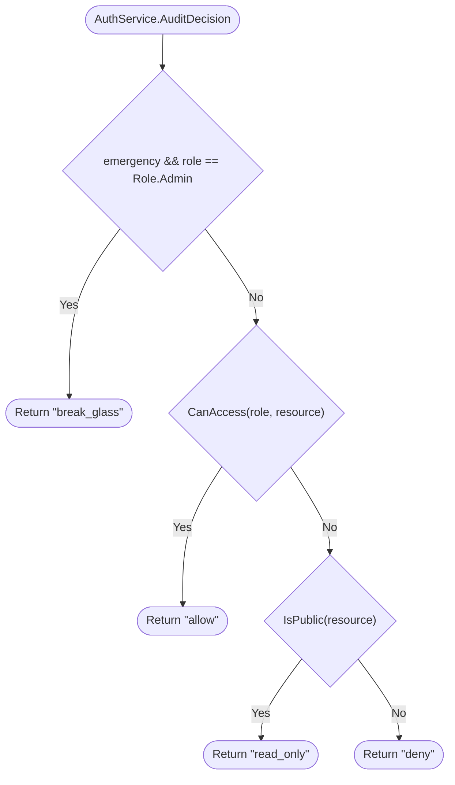

### AuthService.CanAccess

`method` · `csharp` · `generic` · [`backend/auth/AuthService.cs:12`](../backend/auth/AuthService.cs#L12)

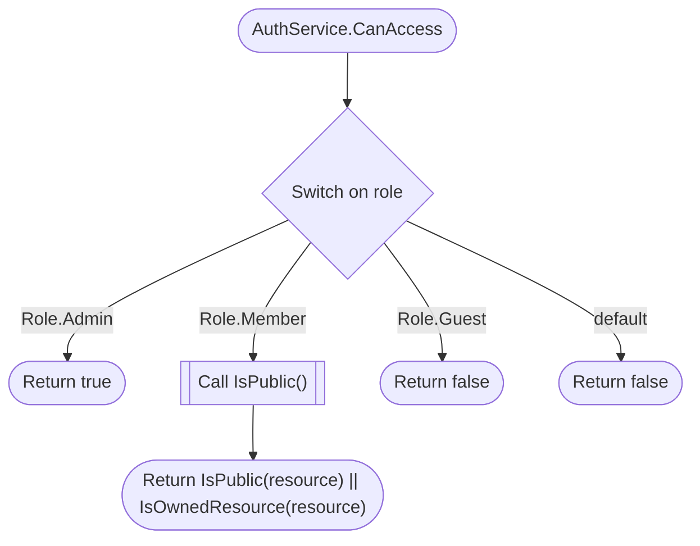

### BillingService.refund

`method` · `java` · `generic` · [`backend/billing/BillingService.java:28`](../backend/billing/BillingService.java#L28)

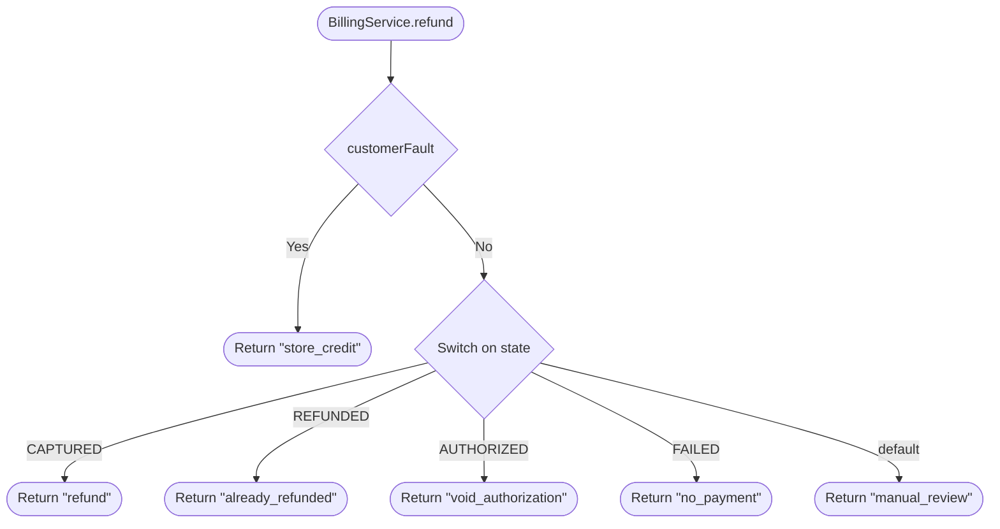

### BillingService.settle

`method` · `java` · `generic` · [`backend/billing/BillingService.java:13`](../backend/billing/BillingService.java#L13)

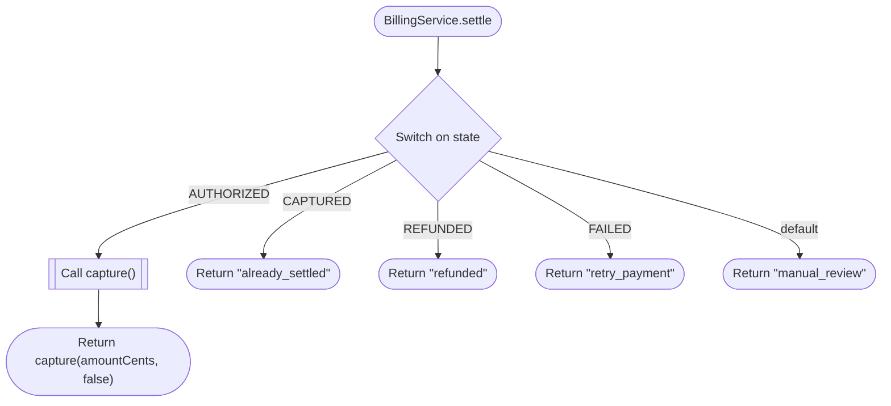

### evict\_index

`function` · `c` · `generic` · [`backend/cache/cache.c:11`](../backend/cache/cache.c#L11)

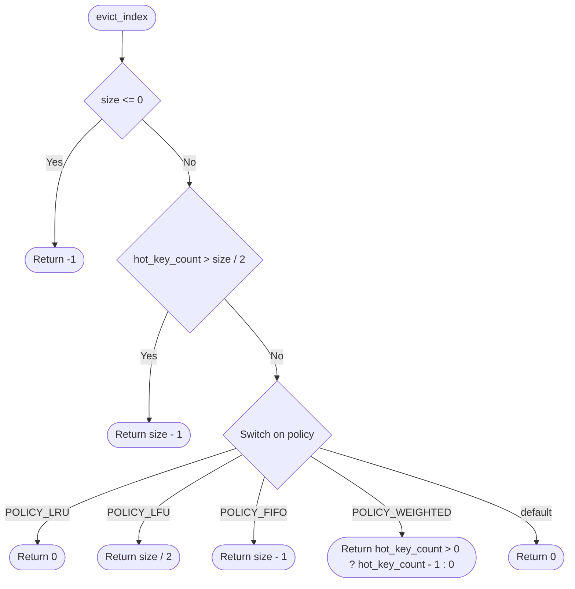

### Catalog.merchandisingAction

`method` · `php` · `generic` · [`backend/catalog/Catalog.php:23`](../backend/catalog/Catalog.php#L23)

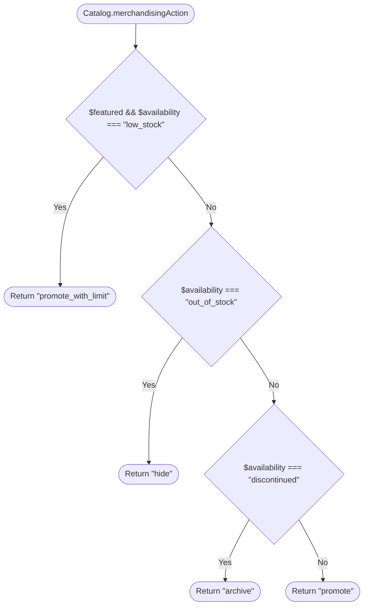

### Catalog.reorderQuantity

`method` · `php` · `generic` · [`backend/catalog/Catalog.php:7`](../backend/catalog/Catalog.php#L7)

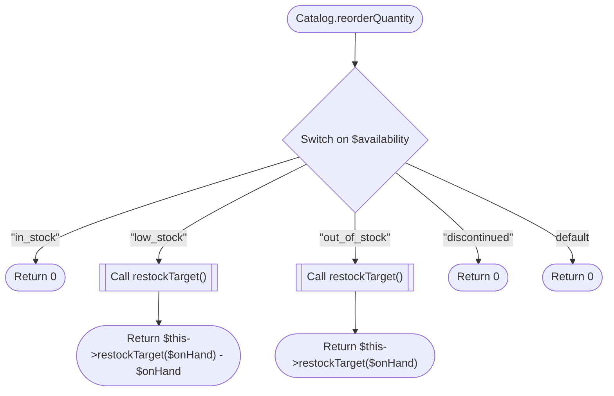

### NativePolicy.ttl

`method` · `cpp` · `generic` · [`backend/native/policy.cpp:11`](../backend/native/policy.cpp#L11)

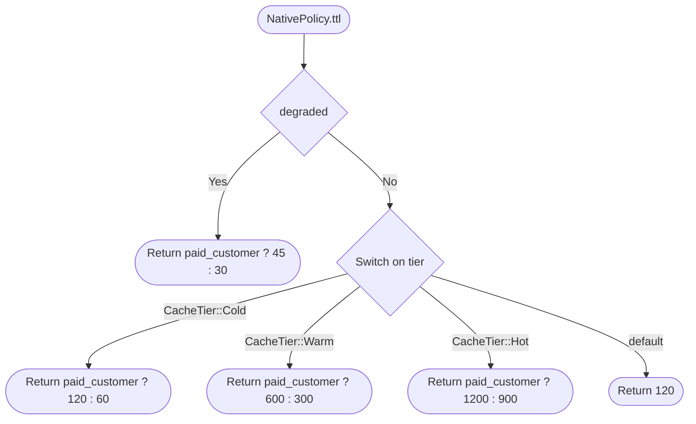

### backend.AdmissionControl.allow

`method` · `cpp` · `generic` · [`backend/native/admission.cpp:14`](../backend/native/admission.cpp#L14)

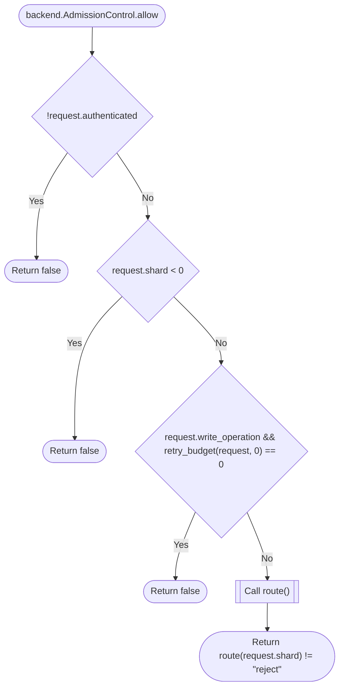

### backend.AdmissionControl.retry\_budget

`method` · `cpp` · `generic` · [`backend/native/admission.cpp:40`](../backend/native/admission.cpp#L40)

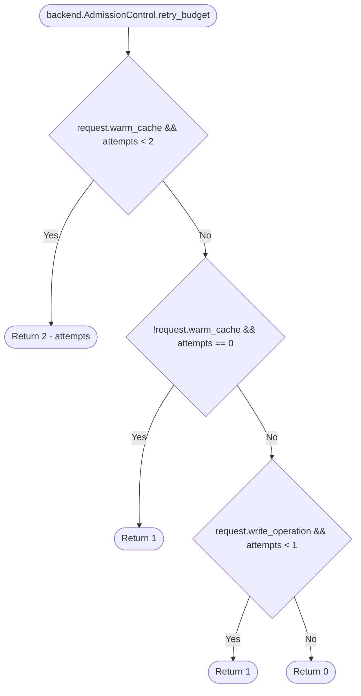

### backend.AdmissionControl.route

`method` · `cpp` · `generic` · [`backend/native/admission.cpp:27`](../backend/native/admission.cpp#L27)

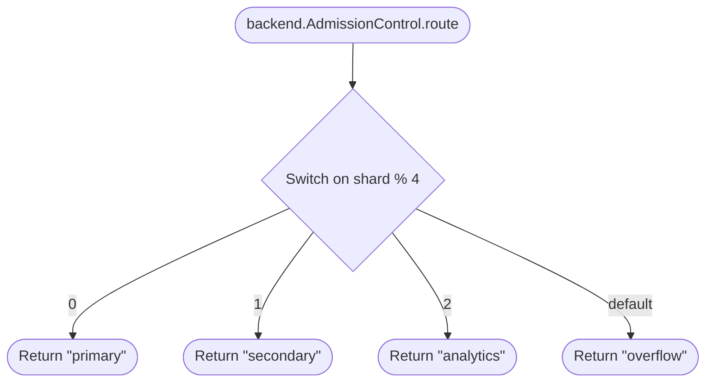

### Notifier.deliver

`method` · `ruby` · `generic` · [`backend/notifications/notifier.rb:4`](../backend/notifications/notifier.rb#L4)

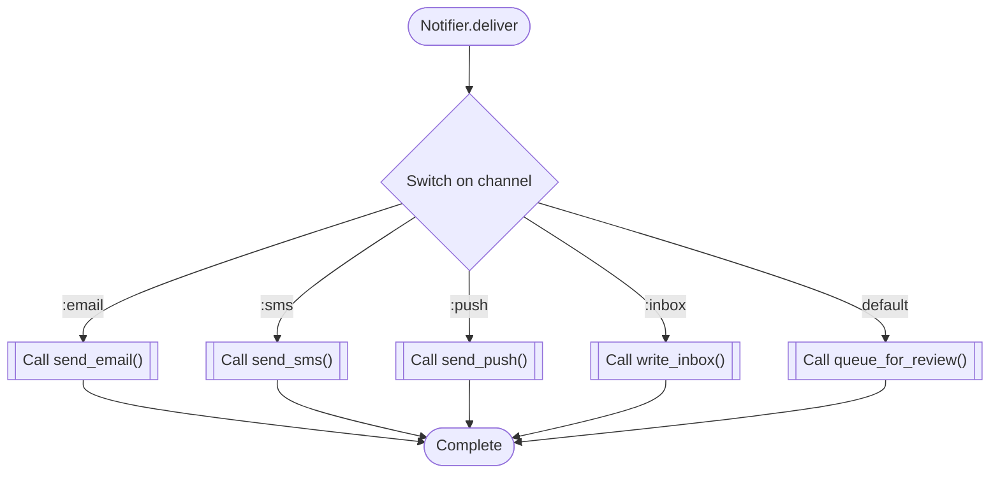

### Notifier.digest

`method` · `ruby` · `generic` · [`backend/notifications/notifier.rb:19`](../backend/notifications/notifier.rb#L19)

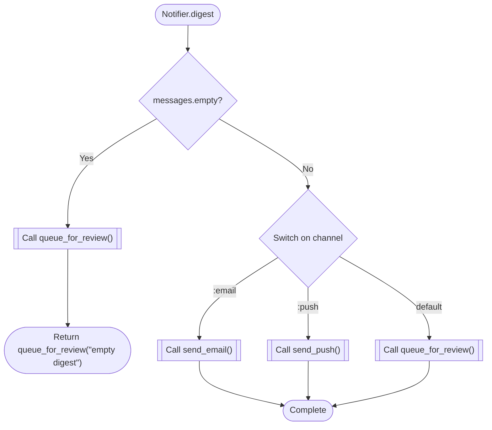

### Notifier.queue\_for\_review

`method` · `ruby` · `generic` · [`backend/notifications/notifier.rb:53`](../backend/notifications/notifier.rb#L53)

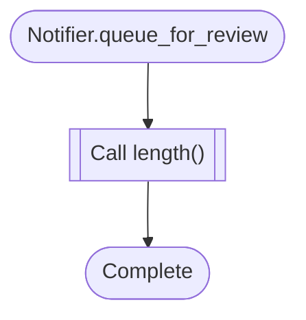

### Notifier.send\_email

`method` · `ruby` · `generic` · [`backend/notifications/notifier.rb:35`](../backend/notifications/notifier.rb#L35)

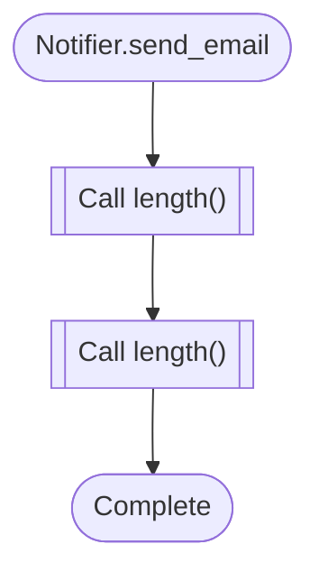

### Notifier.send\_push

`method` · `ruby` · `generic` · [`backend/notifications/notifier.rb:45`](../backend/notifications/notifier.rb#L45)

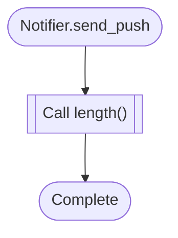

### Notifier.send\_sms

`method` · `ruby` · `generic` · [`backend/notifications/notifier.rb:41`](../backend/notifications/notifier.rb#L41)


### Notifier.urgent?

`method` · `ruby` · `generic` · [`backend/notifications/notifier.rb:57`](../backend/notifications/notifier.rb#L57)

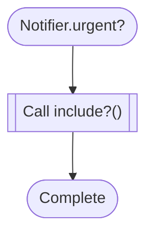

### Notifier.write\_inbox

`method` · `ruby` · `generic` · [`backend/notifications/notifier.rb:49`](../backend/notifications/notifier.rb#L49)

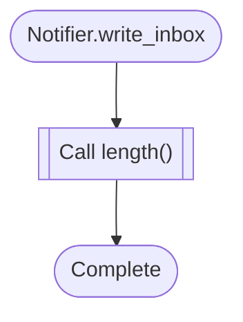

### Order.CanFulfill

`method` · `go` · `generic` · [`backend/orders/service.go:67`](../backend/orders/service.go#L67)

```mermaid
flowchart TD
  mflow_38ef9d2c42d7f7ea_n1(["Order.CanFulfill"])
  mflow_38ef9d2c42d7f7ea_n2{"o.Status != StatusPaid"}
  mflow_38ef9d2c42d7f7ea_n3(["Return false"])
  mflow_38ef9d2c42d7f7ea_n4{"!stockAvailable"}
  mflow_38ef9d2c42d7f7ea_n5(["Return false"])
  mflow_38ef9d2c42d7f7ea_n6(["Return true"])
  mflow_38ef9d2c42d7f7ea_n1 --> mflow_38ef9d2c42d7f7ea_n2
  mflow_38ef9d2c42d7f7ea_n2 -->|"Yes"| mflow_38ef9d2c42d7f7ea_n3
  mflow_38ef9d2c42d7f7ea_n2 -->|"No"| mflow_38ef9d2c42d7f7ea_n4
  mflow_38ef9d2c42d7f7ea_n4 -->|"Yes"| mflow_38ef9d2c42d7f7ea_n5
  mflow_38ef9d2c42d7f7ea_n4 -->|"No"| mflow_38ef9d2c42d7f7ea_n6
```

### Order.FulfillmentPlan

`method` · `go` · `generic` · [`backend/orders/service.go:40`](../backend/orders/service.go#L40)

```mermaid
flowchart TD
  mflow_3f2a9575cfc0ac5b_n1(["Order.FulfillmentPlan"])
  mflow_3f2a9575cfc0ac5b_n2{"!o.CanFulfill(stockAvailable)"}
  mflow_3f2a9575cfc0ac5b_n3(["Return &quot;hold&quot;"])
  mflow_3f2a9575cfc0ac5b_n4{"!carrierHealthy"}
  mflow_3f2a9575cfc0ac5b_n5(["Return &quot;queue_carrier_retry&quot;"])
  mflow_3f2a9575cfc0ac5b_n6{"o.Expedited"}
  mflow_3f2a9575cfc0ac5b_n7(["Return &quot;priority_pack&quot;"])
  mflow_3f2a9575cfc0ac5b_n8(["Return &quot;standard_pack&quot;"])
  mflow_3f2a9575cfc0ac5b_n1 --> mflow_3f2a9575cfc0ac5b_n2
  mflow_3f2a9575cfc0ac5b_n2 -->|"Yes"| mflow_3f2a9575cfc0ac5b_n3
  mflow_3f2a9575cfc0ac5b_n2 -->|"No"| mflow_3f2a9575cfc0ac5b_n4
  mflow_3f2a9575cfc0ac5b_n4 -->|"Yes"| mflow_3f2a9575cfc0ac5b_n5
  mflow_3f2a9575cfc0ac5b_n4 -->|"No"| mflow_3f2a9575cfc0ac5b_n6
  mflow_3f2a9575cfc0ac5b_n6 -->|"Yes"| mflow_3f2a9575cfc0ac5b_n7
  mflow_3f2a9575cfc0ac5b_n6 -->|"No"| mflow_3f2a9575cfc0ac5b_n8
```

### Order.NextAction

`method` · `go` · `generic` · [`backend/orders/service.go:23`](../backend/orders/service.go#L23)

```mermaid
flowchart TD
  mflow_7def16576d7663e7_n1(["Order.NextAction"])
  mflow_7def16576d7663e7_n2{"Switch on o.Status"}
  mflow_7def16576d7663e7_n3[["Call o.pendingAction()"]]
  mflow_7def16576d7663e7_n4(["Return o.pendingAction()"])
  mflow_7def16576d7663e7_n5[["Call o.paidAction()"]]
  mflow_7def16576d7663e7_n6(["Return o.paidAction()"])
  mflow_7def16576d7663e7_n7(["Return &quot;track_delivery&quot;"])
  mflow_7def16576d7663e7_n8(["Return &quot;request_review&quot;"])
  mflow_7def16576d7663e7_n9(["Return &quot;issue_refund&quot;"])
  mflow_7def16576d7663e7_n10(["Return &quot;manual_review&quot;"])
  mflow_7def16576d7663e7_n1 --> mflow_7def16576d7663e7_n2
  mflow_7def16576d7663e7_n2 -->|"StatusPending"| mflow_7def16576d7663e7_n3
  mflow_7def16576d7663e7_n3 --> mflow_7def16576d7663e7_n4
  mflow_7def16576d7663e7_n2 -->|"StatusPaid"| mflow_7def16576d7663e7_n5
  mflow_7def16576d7663e7_n5 --> mflow_7def16576d7663e7_n6
  mflow_7def16576d7663e7_n2 -->|"StatusShipped"| mflow_7def16576d7663e7_n7
  mflow_7def16576d7663e7_n2 -->|"StatusDelivered"| mflow_7def16576d7663e7_n8
  mflow_7def16576d7663e7_n2 -->|"StatusCancelled"| mflow_7def16576d7663e7_n9
  mflow_7def16576d7663e7_n2 -->|"default"| mflow_7def16576d7663e7_n10
```

### Order.RefundPolicy

`method` · `go` · `generic` · [`backend/orders/service.go:53`](../backend/orders/service.go#L53)

```mermaid
flowchart TD
  mflow_e6069541e2501d4d_n1(["Order.RefundPolicy"])
  mflow_e6069541e2501d4d_n2{"o.Status == StatusDelivered && reason == &quot;damaged&quot;"}
  mflow_e6069541e2501d4d_n3(["Return &quot;refund_and_replace&quot;"])
  mflow_e6069541e2501d4d_n4{"o.Status == StatusCancelled"}
  mflow_e6069541e2501d4d_n5(["Return &quot;refund&quot;"])
  mflow_e6069541e2501d4d_n6{"o.RiskScore &gt; 80"}
  mflow_e6069541e2501d4d_n7(["Return &quot;manual_review&quot;"])
  mflow_e6069541e2501d4d_n8(["Return &quot;store_credit&quot;"])
  mflow_e6069541e2501d4d_n1 --> mflow_e6069541e2501d4d_n2
  mflow_e6069541e2501d4d_n2 -->|"Yes"| mflow_e6069541e2501d4d_n3
  mflow_e6069541e2501d4d_n2 -->|"No"| mflow_e6069541e2501d4d_n4
  mflow_e6069541e2501d4d_n4 -->|"Yes"| mflow_e6069541e2501d4d_n5
  mflow_e6069541e2501d4d_n4 -->|"No"| mflow_e6069541e2501d4d_n6
  mflow_e6069541e2501d4d_n6 -->|"Yes"| mflow_e6069541e2501d4d_n7
  mflow_e6069541e2501d4d_n6 -->|"No"| mflow_e6069541e2501d4d_n8
```

### dispatch

`function` · `rust` · `generic` · [`backend/router/src/lib.rs:12`](../backend/router/src/lib.rs#L12)

```mermaid
flowchart TD
  mflow_b765a541f7f8eb87_n1(["dispatch"])
  mflow_b765a541f7f8eb87_n2{"degraded"}
  mflow_b765a541f7f8eb87_n3[["Call degraded_status()"]]
  mflow_b765a541f7f8eb87_n4(["Return degraded_status(route)"])
  mflow_b765a541f7f8eb87_n5{"Switch on route"}
  mflow_b765a541f7f8eb87_n6["200"]
  mflow_b765a541f7f8eb87_n7[["Call guard()"]]
  mflow_b765a541f7f8eb87_n8[["Call guard()"]]
  mflow_b765a541f7f8eb87_n9[["Call guard()"]]
  mflow_b765a541f7f8eb87_n10["200"]
  mflow_b765a541f7f8eb87_n11["404"]
  mflow_b765a541f7f8eb87_n12(["Complete"])
  mflow_b765a541f7f8eb87_n1 --> mflow_b765a541f7f8eb87_n2
  mflow_b765a541f7f8eb87_n2 -->|"Yes"| mflow_b765a541f7f8eb87_n3
  mflow_b765a541f7f8eb87_n3 --> mflow_b765a541f7f8eb87_n4
  mflow_b765a541f7f8eb87_n2 -->|"No"| mflow_b765a541f7f8eb87_n5
  mflow_b765a541f7f8eb87_n5 -->|"Route::Health"| mflow_b765a541f7f8eb87_n6
  mflow_b765a541f7f8eb87_n5 -->|"Route::Users"| mflow_b765a541f7f8eb87_n7
  mflow_b765a541f7f8eb87_n5 -->|"Route::Orders"| mflow_b765a541f7f8eb87_n8
  mflow_b765a541f7f8eb87_n5 -->|"Route::Billing"| mflow_b765a541f7f8eb87_n9
  mflow_b765a541f7f8eb87_n5 -->|"Route::Catalog"| mflow_b765a541f7f8eb87_n10
  mflow_b765a541f7f8eb87_n5 -->|"Route::Unknown"| mflow_b765a541f7f8eb87_n11
  mflow_b765a541f7f8eb87_n6 --> mflow_b765a541f7f8eb87_n12
  mflow_b765a541f7f8eb87_n7 --> mflow_b765a541f7f8eb87_n12
  mflow_b765a541f7f8eb87_n8 --> mflow_b765a541f7f8eb87_n12
  mflow_b765a541f7f8eb87_n9 --> mflow_b765a541f7f8eb87_n12
  mflow_b765a541f7f8eb87_n10 --> mflow_b765a541f7f8eb87_n12
  mflow_b765a541f7f8eb87_n11 --> mflow_b765a541f7f8eb87_n12
```

### archive\_user

`function` · `python` · `generic` · [`backend/users.py:63`](../backend/users.py#L63)

```mermaid
flowchart TD
  mflow_3dab2ee0c15a4113_n1(["archive_user"])
  mflow_3dab2ee0c15a4113_n2["Set user.status"]
  mflow_3dab2ee0c15a4113_n3(["Return user"])
  mflow_3dab2ee0c15a4113_n1 --> mflow_3dab2ee0c15a4113_n2
  mflow_3dab2ee0c15a4113_n2 --> mflow_3dab2ee0c15a4113_n3
```

### get\_user

`route` · `python` · `fastapi` · [`backend/users.py:23`](../backend/users.py#L23)

```mermaid
flowchart TD
  mflow_9006888be936bd6a_n1(["Route: get_user"])
  mflow_9006888be936bd6a_n2[["Call load_user()"]]
  mflow_9006888be936bd6a_n3{"user is None"}
  mflow_9006888be936bd6a_n4{{"Raise HTTPException(status_code=404)"}}
  mflow_9006888be936bd6a_n5{"user.status == UserStatus.SUSPENDED"}
  mflow_9006888be936bd6a_n6{{"Raise HTTPException(status_code=403)"}}
  mflow_9006888be936bd6a_n7(["Return user"])
  mflow_9006888be936bd6a_n1 --> mflow_9006888be936bd6a_n2
  mflow_9006888be936bd6a_n2 --> mflow_9006888be936bd6a_n3
  mflow_9006888be936bd6a_n3 -->|"Yes"| mflow_9006888be936bd6a_n4
  mflow_9006888be936bd6a_n3 -->|"No"| mflow_9006888be936bd6a_n5
  mflow_9006888be936bd6a_n5 -->|"Yes"| mflow_9006888be936bd6a_n6
  mflow_9006888be936bd6a_n5 -->|"No"| mflow_9006888be936bd6a_n7
```

### load\_user

`function` · `python` · `generic` · [`backend/users.py:47`](../backend/users.py#L47)

```mermaid
flowchart TD
  mflow_c1c375870125b695_n1(["load_user"])
  mflow_c1c375870125b695_n2[["Call repository.fetch()"]]
  mflow_c1c375870125b695_n3(["Return await repository.fetch(user_id)"])
  mflow_c1c375870125b695_n1 --> mflow_c1c375870125b695_n2
  mflow_c1c375870125b695_n2 --> mflow_c1c375870125b695_n3
```

### restore\_user

`function` · `python` · `generic` · [`backend/users.py:68`](../backend/users.py#L68)

```mermaid
flowchart TD
  mflow_34321c5626326f32_n1(["restore_user"])
  mflow_34321c5626326f32_n2["Set user.status"]
  mflow_34321c5626326f32_n3(["Return user"])
  mflow_34321c5626326f32_n1 --> mflow_34321c5626326f32_n2
  mflow_34321c5626326f32_n2 --> mflow_34321c5626326f32_n3
```

### update\_user

`route` · `python` · `fastapi` · [`backend/users.py:33`](../backend/users.py#L33)

```mermaid
flowchart TD
  mflow_c252626f9d7bf123_n1(["Route: update_user"])
  mflow_c252626f9d7bf123_n2[["Call load_user()"]]
  mflow_c252626f9d7bf123_n3{"user is None"}
  mflow_c252626f9d7bf123_n4{{"Raise HTTPException(status_code=404)"}}
  mflow_c252626f9d7bf123_n5[["Call user_action()"]]
  mflow_c252626f9d7bf123_n6{"action == 'deny'"}
  mflow_c252626f9d7bf123_n7{{"Raise HTTPException(status_code=403)"}}
  mflow_c252626f9d7bf123_n8{"action == 'archive'"}
  mflow_c252626f9d7bf123_n9[["Call archive_user()"]]
  mflow_c252626f9d7bf123_n10(["Return await archive_user(user)"])
  mflow_c252626f9d7bf123_n11{"action == 'restore'"}
  mflow_c252626f9d7bf123_n12[["Call restore_user()"]]
  mflow_c252626f9d7bf123_n13(["Return await restore_user(user)"])
  mflow_c252626f9d7bf123_n14(["Return user"])
  mflow_c252626f9d7bf123_n1 --> mflow_c252626f9d7bf123_n2
  mflow_c252626f9d7bf123_n2 --> mflow_c252626f9d7bf123_n3
  mflow_c252626f9d7bf123_n3 -->|"Yes"| mflow_c252626f9d7bf123_n4
  mflow_c252626f9d7bf123_n3 -->|"No"| mflow_c252626f9d7bf123_n5
  mflow_c252626f9d7bf123_n5 --> mflow_c252626f9d7bf123_n6
  mflow_c252626f9d7bf123_n6 -->|"Yes"| mflow_c252626f9d7bf123_n7
  mflow_c252626f9d7bf123_n6 -->|"No"| mflow_c252626f9d7bf123_n8
  mflow_c252626f9d7bf123_n8 -->|"Yes"| mflow_c252626f9d7bf123_n9
  mflow_c252626f9d7bf123_n9 --> mflow_c252626f9d7bf123_n10
  mflow_c252626f9d7bf123_n8 -->|"No"| mflow_c252626f9d7bf123_n11
  mflow_c252626f9d7bf123_n11 -->|"Yes"| mflow_c252626f9d7bf123_n12
  mflow_c252626f9d7bf123_n12 --> mflow_c252626f9d7bf123_n13
  mflow_c252626f9d7bf123_n11 -->|"No"| mflow_c252626f9d7bf123_n14
```

### user\_action

`function` · `python` · `generic` · [`backend/users.py:51`](../backend/users.py#L51)

```mermaid
flowchart TD
  mflow_f9477f568b1277b5_n1(["user_action"])
  mflow_f9477f568b1277b5_n2{"user.status == UserStatus.DELETED"}
  mflow_f9477f568b1277b5_n3(["Return 'deny'"])
  mflow_f9477f568b1277b5_n4{"command == 'archive' and user.status == UserStatus.ACTIVE"}
  mflow_f9477f568b1277b5_n5(["Return 'archive'"])
  mflow_f9477f568b1277b5_n6{"command == 'restore' and user.status == UserStatus.SUSPENDED"}
  mflow_f9477f568b1277b5_n7(["Return 'restore'"])
  mflow_f9477f568b1277b5_n8{"command == 'delete'"}
  mflow_f9477f568b1277b5_n9(["Return 'deny'"])
  mflow_f9477f568b1277b5_n10(["Return 'noop'"])
  mflow_f9477f568b1277b5_n1 --> mflow_f9477f568b1277b5_n2
  mflow_f9477f568b1277b5_n2 -->|"Yes"| mflow_f9477f568b1277b5_n3
  mflow_f9477f568b1277b5_n2 -->|"No"| mflow_f9477f568b1277b5_n4
  mflow_f9477f568b1277b5_n4 -->|"Yes"| mflow_f9477f568b1277b5_n5
  mflow_f9477f568b1277b5_n4 -->|"No"| mflow_f9477f568b1277b5_n6
  mflow_f9477f568b1277b5_n6 -->|"Yes"| mflow_f9477f568b1277b5_n7
  mflow_f9477f568b1277b5_n6 -->|"No"| mflow_f9477f568b1277b5_n8
  mflow_f9477f568b1277b5_n8 -->|"Yes"| mflow_f9477f568b1277b5_n9
  mflow_f9477f568b1277b5_n8 -->|"No"| mflow_f9477f568b1277b5_n10
```

### GET

`route` · `typescript` · `nextjs` · [`frontend/app/api/orders/route.ts:5`](../frontend/app/api/orders/route.ts#L5)

```mermaid
flowchart TD
  mflow_e59a7853839b21f0_n1(["Route: GET"])
  mflow_e59a7853839b21f0_n2[["Call loadOrder()"]]
  mflow_e59a7853839b21f0_n3[["Call loadUser()"]]
  mflow_e59a7853839b21f0_n4{"Switch on order.state"}
  mflow_e59a7853839b21f0_n5[["Call draftResponse()"]]
  mflow_e59a7853839b21f0_n6(["Return draftResponse(order, user)"])
  mflow_e59a7853839b21f0_n7[["Call openResponse()"]]
  mflow_e59a7853839b21f0_n8(["Return openResponse(order, user)"])
  mflow_e59a7853839b21f0_n9[["Call paidResponse()"]]
  mflow_e59a7853839b21f0_n10(["Return paidResponse(order, user)"])
  mflow_e59a7853839b21f0_n11[["Call reviewResponse()"]]
  mflow_e59a7853839b21f0_n12(["Return reviewResponse(order, user)"])
  mflow_e59a7853839b21f0_n13(["Return new Response(&quot;Closed&quot;, { status: 410 })"])
  mflow_e59a7853839b21f0_n14(["Return new Response(&quot;Cancelled&quot;, { status: 409 })"])
  mflow_e59a7853839b21f0_n15(["Complete"])
  mflow_e59a7853839b21f0_n1 --> mflow_e59a7853839b21f0_n2
  mflow_e59a7853839b21f0_n2 --> mflow_e59a7853839b21f0_n3
  mflow_e59a7853839b21f0_n3 --> mflow_e59a7853839b21f0_n4
  mflow_e59a7853839b21f0_n4 -->|"OrderState.DRAFT"| mflow_e59a7853839b21f0_n5
  mflow_e59a7853839b21f0_n5 --> mflow_e59a7853839b21f0_n6
  mflow_e59a7853839b21f0_n4 -->|"OrderState.OPEN"| mflow_e59a7853839b21f0_n7
  mflow_e59a7853839b21f0_n7 --> mflow_e59a7853839b21f0_n8
  mflow_e59a7853839b21f0_n4 -->|"OrderState.PAID"| mflow_e59a7853839b21f0_n9
  mflow_e59a7853839b21f0_n9 --> mflow_e59a7853839b21f0_n10
  mflow_e59a7853839b21f0_n4 -->|"OrderState.FRAUD_REVIEW"| mflow_e59a7853839b21f0_n11
  mflow_e59a7853839b21f0_n11 --> mflow_e59a7853839b21f0_n12
  mflow_e59a7853839b21f0_n4 -->|"OrderState.CLOSED"| mflow_e59a7853839b21f0_n13
  mflow_e59a7853839b21f0_n4 -->|"OrderState.CANCELLED"| mflow_e59a7853839b21f0_n14
  mflow_e59a7853839b21f0_n4 -->|"default"| mflow_e59a7853839b21f0_n15
```

### PATCH

`route` · `typescript` · `nextjs` · [`frontend/app/api/orders/route.ts:25`](../frontend/app/api/orders/route.ts#L25)

```mermaid
flowchart TD
  mflow_0dfd417eb8827ef8_n1(["Route: PATCH"])
  mflow_0dfd417eb8827ef8_n2[["Call loadOrder()"]]
  mflow_0dfd417eb8827ef8_n3[["Call loadUser()"]]
  mflow_0dfd417eb8827ef8_n4[["Call decideOrderAction()"]]
  mflow_0dfd417eb8827ef8_n5{"action === &quot;reject&quot;"}
  mflow_0dfd417eb8827ef8_n6[["Call auditOrder()"]]
  mflow_0dfd417eb8827ef8_n7(["Return new Response(&quot;Order blocked&quot;, { status: 403 })"])
  mflow_0dfd417eb8827ef8_n8{"action === &quot;review&quot;"}
  mflow_0dfd417eb8827ef8_n9[["Call auditOrder()"]]
  mflow_0dfd417eb8827ef8_n10(["Return new Response(&quot;Review required&quot;, { status: 202 })"])
  mflow_0dfd417eb8827ef8_n11[["Call applyOrderAction()"]]
  mflow_0dfd417eb8827ef8_n12[["Call auditOrder()"]]
  mflow_0dfd417eb8827ef8_n13[["Call Response.json()"]]
  mflow_0dfd417eb8827ef8_n14(["Return Response.json(saved)"])
  mflow_0dfd417eb8827ef8_n1 --> mflow_0dfd417eb8827ef8_n2
  mflow_0dfd417eb8827ef8_n2 --> mflow_0dfd417eb8827ef8_n3
  mflow_0dfd417eb8827ef8_n3 --> mflow_0dfd417eb8827ef8_n4
  mflow_0dfd417eb8827ef8_n4 --> mflow_0dfd417eb8827ef8_n5
  mflow_0dfd417eb8827ef8_n5 -->|"Yes"| mflow_0dfd417eb8827ef8_n6
  mflow_0dfd417eb8827ef8_n6 --> mflow_0dfd417eb8827ef8_n7
  mflow_0dfd417eb8827ef8_n5 -->|"No"| mflow_0dfd417eb8827ef8_n8
  mflow_0dfd417eb8827ef8_n8 -->|"Yes"| mflow_0dfd417eb8827ef8_n9
  mflow_0dfd417eb8827ef8_n9 --> mflow_0dfd417eb8827ef8_n10
  mflow_0dfd417eb8827ef8_n8 -->|"No"| mflow_0dfd417eb8827ef8_n11
  mflow_0dfd417eb8827ef8_n11 --> mflow_0dfd417eb8827ef8_n12
  mflow_0dfd417eb8827ef8_n12 --> mflow_0dfd417eb8827ef8_n13
  mflow_0dfd417eb8827ef8_n13 --> mflow_0dfd417eb8827ef8_n14
```

### GET

`route` · `typescript` · `nextjs` · [`frontend/app/api/users/route.ts:4`](../frontend/app/api/users/route.ts#L4)

```mermaid
flowchart TD
  mflow_99799591abfba02a_n1(["Route: GET"])
  mflow_99799591abfba02a_n2[["Call loadUser()"]]
  mflow_99799591abfba02a_n3[["Call resolveUserAccess()"]]
  mflow_99799591abfba02a_n4{"access === &quot;blocked&quot;"}
  mflow_99799591abfba02a_n5(["Return new Response(&quot;Blocked&quot;, { status: 403 })"])
  mflow_99799591abfba02a_n6{"access === &quot;gone&quot;"}
  mflow_99799591abfba02a_n7(["Return new Response(&quot;Deleted&quot;, { status: 410 })"])
  mflow_99799591abfba02a_n8[["Call Response.json()"]]
  mflow_99799591abfba02a_n9(["Return Response.json({ user, access })"])
  mflow_99799591abfba02a_n1 --> mflow_99799591abfba02a_n2
  mflow_99799591abfba02a_n2 --> mflow_99799591abfba02a_n3
  mflow_99799591abfba02a_n3 --> mflow_99799591abfba02a_n4
  mflow_99799591abfba02a_n4 -->|"Yes"| mflow_99799591abfba02a_n5
  mflow_99799591abfba02a_n4 -->|"No"| mflow_99799591abfba02a_n6
  mflow_99799591abfba02a_n6 -->|"Yes"| mflow_99799591abfba02a_n7
  mflow_99799591abfba02a_n6 -->|"No"| mflow_99799591abfba02a_n8
  mflow_99799591abfba02a_n8 --> mflow_99799591abfba02a_n9
```

### POST

`route` · `typescript` · `nextjs` · [`frontend/app/api/users/route.ts:17`](../frontend/app/api/users/route.ts#L17)

```mermaid
flowchart TD
  mflow_3de3eacd67f96e64_n1(["Route: POST"])
  mflow_3de3eacd67f96e64_n2[["Call loadUser()"]]
  mflow_3de3eacd67f96e64_n3[["Call moderationAction()"]]
  mflow_3de3eacd67f96e64_n4["Handle internal condition: moderation === &quot;review&quot;"]
  mflow_3de3eacd67f96e64_n5{"Switch on user.status"}
  mflow_3de3eacd67f96e64_n6[["Call Response.json()"]]
  mflow_3de3eacd67f96e64_n7(["Return Response.json(await activateUser(user))"])
  mflow_3de3eacd67f96e64_n8[["Call auditUser()"]]
  mflow_3de3eacd67f96e64_n9(["Return new Response(&quot;Blocked&quot;, { status: 403 })"])
  mflow_3de3eacd67f96e64_n10(["Complete"])
  mflow_3de3eacd67f96e64_n1 --> mflow_3de3eacd67f96e64_n2
  mflow_3de3eacd67f96e64_n2 --> mflow_3de3eacd67f96e64_n3
  mflow_3de3eacd67f96e64_n3 --> mflow_3de3eacd67f96e64_n4
  mflow_3de3eacd67f96e64_n4 --> mflow_3de3eacd67f96e64_n5
  mflow_3de3eacd67f96e64_n5 -->|"UserStatus.ACTIVE"| mflow_3de3eacd67f96e64_n6
  mflow_3de3eacd67f96e64_n6 --> mflow_3de3eacd67f96e64_n7
  mflow_3de3eacd67f96e64_n5 -->|"UserStatus.SUSPENDED"| mflow_3de3eacd67f96e64_n8
  mflow_3de3eacd67f96e64_n8 --> mflow_3de3eacd67f96e64_n9
  mflow_3de3eacd67f96e64_n5 -->|"default"| mflow_3de3eacd67f96e64_n10
```

### UsersPage

`component` · `typescript` · `nextjs` · [`frontend/app/users/page.tsx:1`](../frontend/app/users/page.tsx#L1)

```mermaid
flowchart TD
  mflow_3d6bdb52c57fafa8_n1(["Component: UsersPage"])
  mflow_3d6bdb52c57fafa8_n2{"user.isLoading"}
  mflow_3d6bdb52c57fafa8_n3(["Return &lt;LoadingSkeleton /&gt;"])
  mflow_3d6bdb52c57fafa8_n4{"user.error"}
  mflow_3d6bdb52c57fafa8_n5(["Return &lt;ErrorState error={user.error} /&gt;"])
  mflow_3d6bdb52c57fafa8_n6{"!user.isAuthorized"}
  mflow_3d6bdb52c57fafa8_n7(["Return &lt;LoginPrompt /&gt;"])
  mflow_3d6bdb52c57fafa8_n8{"user.status === &quot;deleted&quot;"}
  mflow_3d6bdb52c57fafa8_n9(["Return &lt;DeletedAccount /&gt;"])
  mflow_3d6bdb52c57fafa8_n10{"user.status === &quot;suspended&quot;"}
  mflow_3d6bdb52c57fafa8_n11(["Return &lt;SuspendedAccount user={user} /&gt;"])
  mflow_3d6bdb52c57fafa8_n12{"user.status === &quot;archived&quot;"}
  mflow_3d6bdb52c57fafa8_n13(["Return &lt;ArchivedAccount user={user} /&gt;"])
  mflow_3d6bdb52c57fafa8_n14{"user.status === &quot;locked&quot;"}
  mflow_3d6bdb52c57fafa8_n15(["Return &lt;LockedAccount user={user} /&gt;"])
  mflow_3d6bdb52c57fafa8_n16[["Call dashboardMode()"]]
  mflow_3d6bdb52c57fafa8_n17(["Return &lt;UserDashboard user={user} mode={dashboardMode(user)} /&gt;"])
  mflow_3d6bdb52c57fafa8_n1 --> mflow_3d6bdb52c57fafa8_n2
  mflow_3d6bdb52c57fafa8_n2 -->|"Yes"| mflow_3d6bdb52c57fafa8_n3
  mflow_3d6bdb52c57fafa8_n2 -->|"No"| mflow_3d6bdb52c57fafa8_n4
  mflow_3d6bdb52c57fafa8_n4 -->|"Yes"| mflow_3d6bdb52c57fafa8_n5
  mflow_3d6bdb52c57fafa8_n4 -->|"No"| mflow_3d6bdb52c57fafa8_n6
  mflow_3d6bdb52c57fafa8_n6 -->|"Yes"| mflow_3d6bdb52c57fafa8_n7
  mflow_3d6bdb52c57fafa8_n6 -->|"No"| mflow_3d6bdb52c57fafa8_n8
  mflow_3d6bdb52c57fafa8_n8 -->|"Yes"| mflow_3d6bdb52c57fafa8_n9
  mflow_3d6bdb52c57fafa8_n8 -->|"No"| mflow_3d6bdb52c57fafa8_n10
  mflow_3d6bdb52c57fafa8_n10 -->|"Yes"| mflow_3d6bdb52c57fafa8_n11
  mflow_3d6bdb52c57fafa8_n10 -->|"No"| mflow_3d6bdb52c57fafa8_n12
  mflow_3d6bdb52c57fafa8_n12 -->|"Yes"| mflow_3d6bdb52c57fafa8_n13
  mflow_3d6bdb52c57fafa8_n12 -->|"No"| mflow_3d6bdb52c57fafa8_n14
  mflow_3d6bdb52c57fafa8_n14 -->|"Yes"| mflow_3d6bdb52c57fafa8_n15
  mflow_3d6bdb52c57fafa8_n14 -->|"No"| mflow_3d6bdb52c57fafa8_n16
  mflow_3d6bdb52c57fafa8_n16 --> mflow_3d6bdb52c57fafa8_n17
```

### statusLabel

`function` · `javascript` · `generic` · [`frontend/lib/status.js:3`](../frontend/lib/status.js#L3)

```mermaid
flowchart TD
  mflow_8a4924a1be17b42e_n1(["statusLabel"])
  mflow_8a4924a1be17b42e_n2{"Switch on status"}
  mflow_8a4924a1be17b42e_n3(["Return &quot;Active&quot;"])
  mflow_8a4924a1be17b42e_n4(["Return &quot;Suspended&quot;"])
  mflow_8a4924a1be17b42e_n5(["Return &quot;Deleted&quot;"])
  mflow_8a4924a1be17b42e_n6(["Return &quot;Archived&quot;"])
  mflow_8a4924a1be17b42e_n7(["Return &quot;Locked&quot;"])
  mflow_8a4924a1be17b42e_n8(["Return &quot;Unknown&quot;"])
  mflow_8a4924a1be17b42e_n1 --> mflow_8a4924a1be17b42e_n2
  mflow_8a4924a1be17b42e_n2 -->|"&quot;active&quot;"| mflow_8a4924a1be17b42e_n3
  mflow_8a4924a1be17b42e_n2 -->|"&quot;suspended&quot;"| mflow_8a4924a1be17b42e_n4
  mflow_8a4924a1be17b42e_n2 -->|"&quot;deleted&quot;"| mflow_8a4924a1be17b42e_n5
  mflow_8a4924a1be17b42e_n2 -->|"&quot;archived&quot;"| mflow_8a4924a1be17b42e_n6
  mflow_8a4924a1be17b42e_n2 -->|"&quot;locked&quot;"| mflow_8a4924a1be17b42e_n7
  mflow_8a4924a1be17b42e_n2 -->|"default"| mflow_8a4924a1be17b42e_n8
```

### statusTone

`function` · `javascript` · `generic` · [`frontend/lib/status.js:20`](../frontend/lib/status.js#L20)

```mermaid
flowchart TD
  mflow_817688253510da0d_n1(["statusTone"])
  mflow_817688253510da0d_n2{"Switch on status"}
  mflow_817688253510da0d_n3(["Return &quot;success&quot;"])
  mflow_817688253510da0d_n4(["Return &quot;warning&quot;"])
  mflow_817688253510da0d_n5(["Return &quot;danger&quot;"])
  mflow_817688253510da0d_n6(["Return &quot;neutral&quot;"])
  mflow_817688253510da0d_n7(["Return &quot;danger&quot;"])
  mflow_817688253510da0d_n8(["Return &quot;neutral&quot;"])
  mflow_817688253510da0d_n1 --> mflow_817688253510da0d_n2
  mflow_817688253510da0d_n2 -->|"&quot;active&quot;"| mflow_817688253510da0d_n3
  mflow_817688253510da0d_n2 -->|"&quot;suspended&quot;"| mflow_817688253510da0d_n4
  mflow_817688253510da0d_n2 -->|"&quot;deleted&quot;"| mflow_817688253510da0d_n5
  mflow_817688253510da0d_n2 -->|"&quot;archived&quot;"| mflow_817688253510da0d_n6
  mflow_817688253510da0d_n2 -->|"&quot;locked&quot;"| mflow_817688253510da0d_n7
  mflow_817688253510da0d_n2 -->|"default"| mflow_817688253510da0d_n8
```


## Referenced Subflows

### BillingService.capture

`method` · `java` · `generic` · [`backend/billing/BillingService.java:46`](../backend/billing/BillingService.java#L46)

```mermaid
flowchart TD
  mflow_a4e4a0d7d38cc4fa_n1(["BillingService.capture"])
  mflow_a4e4a0d7d38cc4fa_n2{"amountCents &lt;= 0"}
  mflow_a4e4a0d7d38cc4fa_n3(["Return &quot;invalid_amount&quot;"])
  mflow_a4e4a0d7d38cc4fa_n4{"highRisk || amountCents &gt; 100000"}
  mflow_a4e4a0d7d38cc4fa_n5(["Return &quot;review_capture&quot;"])
  mflow_a4e4a0d7d38cc4fa_n6(["Return &quot;captured&quot;"])
  mflow_a4e4a0d7d38cc4fa_n1 --> mflow_a4e4a0d7d38cc4fa_n2
  mflow_a4e4a0d7d38cc4fa_n2 -->|"Yes"| mflow_a4e4a0d7d38cc4fa_n3
  mflow_a4e4a0d7d38cc4fa_n2 -->|"No"| mflow_a4e4a0d7d38cc4fa_n4
  mflow_a4e4a0d7d38cc4fa_n4 -->|"Yes"| mflow_a4e4a0d7d38cc4fa_n5
  mflow_a4e4a0d7d38cc4fa_n4 -->|"No"| mflow_a4e4a0d7d38cc4fa_n6
```

### Catalog.restockTarget

`method` · `php` · `generic` · [`backend/catalog/Catalog.php:37`](../backend/catalog/Catalog.php#L37)

```mermaid
flowchart TD
  mflow_f98e4c798beecd3f_n1(["Catalog.restockTarget"])
  mflow_f98e4c798beecd3f_n2{"$onHand &lt; 0"}
  mflow_f98e4c798beecd3f_n3(["Return 150"])
  mflow_f98e4c798beecd3f_n4(["Return 100"])
  mflow_f98e4c798beecd3f_n1 --> mflow_f98e4c798beecd3f_n2
  mflow_f98e4c798beecd3f_n2 -->|"Yes"| mflow_f98e4c798beecd3f_n3
  mflow_f98e4c798beecd3f_n2 -->|"No"| mflow_f98e4c798beecd3f_n4
```

### Order.paidAction

`method` · `go` · `generic` · [`backend/orders/service.go:84`](../backend/orders/service.go#L84)

```mermaid
flowchart TD
  mflow_8b7c74dc5a35af6c_n1(["Order.paidAction"])
  mflow_8b7c74dc5a35af6c_n2{"o.TotalCents &gt; 100000"}
  mflow_8b7c74dc5a35af6c_n3(["Return &quot;manager_approval&quot;"])
  mflow_8b7c74dc5a35af6c_n4{"o.Expedited"}
  mflow_8b7c74dc5a35af6c_n5(["Return &quot;schedule_priority_shipment&quot;"])
  mflow_8b7c74dc5a35af6c_n6(["Return &quot;schedule_shipment&quot;"])
  mflow_8b7c74dc5a35af6c_n1 --> mflow_8b7c74dc5a35af6c_n2
  mflow_8b7c74dc5a35af6c_n2 -->|"Yes"| mflow_8b7c74dc5a35af6c_n3
  mflow_8b7c74dc5a35af6c_n2 -->|"No"| mflow_8b7c74dc5a35af6c_n4
  mflow_8b7c74dc5a35af6c_n4 -->|"Yes"| mflow_8b7c74dc5a35af6c_n5
  mflow_8b7c74dc5a35af6c_n4 -->|"No"| mflow_8b7c74dc5a35af6c_n6
```

### Order.pendingAction

`method` · `go` · `generic` · [`backend/orders/service.go:77`](../backend/orders/service.go#L77)

```mermaid
flowchart TD
  mflow_093a06d5a7e3d64c_n1(["Order.pendingAction"])
  mflow_093a06d5a7e3d64c_n2{"o.RiskScore &gt; 70"}
  mflow_093a06d5a7e3d64c_n3(["Return &quot;manual_review&quot;"])
  mflow_093a06d5a7e3d64c_n4(["Return &quot;await_payment&quot;"])
  mflow_093a06d5a7e3d64c_n1 --> mflow_093a06d5a7e3d64c_n2
  mflow_093a06d5a7e3d64c_n2 -->|"Yes"| mflow_093a06d5a7e3d64c_n3
  mflow_093a06d5a7e3d64c_n2 -->|"No"| mflow_093a06d5a7e3d64c_n4
```

### degraded\_status

`function` · `rust` · `generic` · [`backend/router/src/lib.rs:34`](../backend/router/src/lib.rs#L34)

```mermaid
flowchart TD
  mflow_9708c1b5edc0d9aa_n1(["degraded_status"])
  mflow_9708c1b5edc0d9aa_n2{"Switch on route"}
  mflow_9708c1b5edc0d9aa_n3["200"]
  mflow_9708c1b5edc0d9aa_n4["206"]
  mflow_9708c1b5edc0d9aa_n5["503"]
  mflow_9708c1b5edc0d9aa_n6["404"]
  mflow_9708c1b5edc0d9aa_n7(["Complete"])
  mflow_9708c1b5edc0d9aa_n1 --> mflow_9708c1b5edc0d9aa_n2
  mflow_9708c1b5edc0d9aa_n2 -->|"Route::Health"| mflow_9708c1b5edc0d9aa_n3
  mflow_9708c1b5edc0d9aa_n2 -->|"Route::Catalog"| mflow_9708c1b5edc0d9aa_n4
  mflow_9708c1b5edc0d9aa_n2 -->|"Route::Users | Route::Orders | Route::Billing"| mflow_9708c1b5edc0d9aa_n5
  mflow_9708c1b5edc0d9aa_n2 -->|"Route::Unknown"| mflow_9708c1b5edc0d9aa_n6
  mflow_9708c1b5edc0d9aa_n3 --> mflow_9708c1b5edc0d9aa_n7
  mflow_9708c1b5edc0d9aa_n4 --> mflow_9708c1b5edc0d9aa_n7
  mflow_9708c1b5edc0d9aa_n5 --> mflow_9708c1b5edc0d9aa_n7
  mflow_9708c1b5edc0d9aa_n6 --> mflow_9708c1b5edc0d9aa_n7
```

### guard

`function` · `rust` · `generic` · [`backend/router/src/lib.rs:26`](../backend/router/src/lib.rs#L26)

```mermaid
flowchart TD
  mflow_751c332d5d49eb25_n1(["guard"])
  mflow_751c332d5d49eb25_n2["Handle internal condition: authenticated"]
  mflow_751c332d5d49eb25_n3(["Complete"])
  mflow_751c332d5d49eb25_n1 --> mflow_751c332d5d49eb25_n2
  mflow_751c332d5d49eb25_n2 --> mflow_751c332d5d49eb25_n3
```

### Repository.fetch

`method` · `python` · `generic` · [`backend/users.py:9`](../backend/users.py#L9)

```mermaid
flowchart TD
  mflow_eef1d33de2175dfc_n1(["Repository.fetch"])
  mflow_eef1d33de2175dfc_n2{{"Raise NotImplementedError"}}
  mflow_eef1d33de2175dfc_n1 --> mflow_eef1d33de2175dfc_n2
```

### applyOrderAction

`function` · `typescript` · `generic` · [`frontend/app/api/orders/route.ts:99`](../frontend/app/api/orders/route.ts#L99)

```mermaid
flowchart TD
  mflow_db00988a6eb2e1dc_n1(["applyOrderAction"])
  mflow_db00988a6eb2e1dc_n2{"action === &quot;review&quot;"}
  mflow_db00988a6eb2e1dc_n3[["Call database.orders.save()"]]
  mflow_db00988a6eb2e1dc_n4(["Return database.orders.save({ ...order, state: OrderState.FRAUD_REVIEW })"])
  mflow_db00988a6eb2e1dc_n5{"order.state === OrderState.DRAFT"}
  mflow_db00988a6eb2e1dc_n6[["Call database.orders.save()"]]
  mflow_db00988a6eb2e1dc_n7(["Return database.orders.save({ ...order, state: OrderState.OPEN })"])
  mflow_db00988a6eb2e1dc_n8[["Call database.orders.save()"]]
  mflow_db00988a6eb2e1dc_n9(["Return database.orders.save(order)"])
  mflow_db00988a6eb2e1dc_n1 --> mflow_db00988a6eb2e1dc_n2
  mflow_db00988a6eb2e1dc_n2 -->|"Yes"| mflow_db00988a6eb2e1dc_n3
  mflow_db00988a6eb2e1dc_n3 --> mflow_db00988a6eb2e1dc_n4
  mflow_db00988a6eb2e1dc_n2 -->|"No"| mflow_db00988a6eb2e1dc_n5
  mflow_db00988a6eb2e1dc_n5 -->|"Yes"| mflow_db00988a6eb2e1dc_n6
  mflow_db00988a6eb2e1dc_n6 --> mflow_db00988a6eb2e1dc_n7
  mflow_db00988a6eb2e1dc_n5 -->|"No"| mflow_db00988a6eb2e1dc_n8
  mflow_db00988a6eb2e1dc_n8 --> mflow_db00988a6eb2e1dc_n9
```

### auditOrder

`function` · `typescript` · `generic` · [`frontend/app/api/orders/route.ts:109`](../frontend/app/api/orders/route.ts#L109)

```mermaid
flowchart TD
  mflow_77cb6c9a44bf9c32_n1(["auditOrder"])
  mflow_77cb6c9a44bf9c32_n2[["Call database.audit.write()"]]
  mflow_77cb6c9a44bf9c32_n3(["Complete"])
  mflow_77cb6c9a44bf9c32_n1 --> mflow_77cb6c9a44bf9c32_n2
  mflow_77cb6c9a44bf9c32_n2 --> mflow_77cb6c9a44bf9c32_n3
```

### decideOrderAction

`function` · `typescript` · `generic` · [`frontend/app/api/orders/route.ts:86`](../frontend/app/api/orders/route.ts#L86)

```mermaid
flowchart TD
  mflow_b3f628a1fcd2ec98_n1(["decideOrderAction"])
  mflow_b3f628a1fcd2ec98_n2{"user.status === UserStatus.SUSPENDED"}
  mflow_b3f628a1fcd2ec98_n3(["Return &quot;reject&quot;"])
  mflow_b3f628a1fcd2ec98_n4{"order.state === OrderState.FRAUD_REVIEW"}
  mflow_b3f628a1fcd2ec98_n5(["Return &quot;review&quot;"])
  mflow_b3f628a1fcd2ec98_n6{"order.totalCents &gt; 100000 && user.role !== &quot;admin&quot;"}
  mflow_b3f628a1fcd2ec98_n7(["Return &quot;review&quot;"])
  mflow_b3f628a1fcd2ec98_n8(["Return &quot;approve&quot;"])
  mflow_b3f628a1fcd2ec98_n1 --> mflow_b3f628a1fcd2ec98_n2
  mflow_b3f628a1fcd2ec98_n2 -->|"Yes"| mflow_b3f628a1fcd2ec98_n3
  mflow_b3f628a1fcd2ec98_n2 -->|"No"| mflow_b3f628a1fcd2ec98_n4
  mflow_b3f628a1fcd2ec98_n4 -->|"Yes"| mflow_b3f628a1fcd2ec98_n5
  mflow_b3f628a1fcd2ec98_n4 -->|"No"| mflow_b3f628a1fcd2ec98_n6
  mflow_b3f628a1fcd2ec98_n6 -->|"Yes"| mflow_b3f628a1fcd2ec98_n7
  mflow_b3f628a1fcd2ec98_n6 -->|"No"| mflow_b3f628a1fcd2ec98_n8
```

### draftResponse

`function` · `typescript` · `generic` · [`frontend/app/api/orders/route.ts:52`](../frontend/app/api/orders/route.ts#L52)

```mermaid
flowchart TD
  mflow_084f5e9aaf9e0986_n1(["draftResponse"])
  mflow_084f5e9aaf9e0986_n2{"user.role === &quot;admin&quot;"}
  mflow_084f5e9aaf9e0986_n3[["Call Response.json()"]]
  mflow_084f5e9aaf9e0986_n4(["Return Response.json({ order, next: &quot;publish&quot; })"])
  mflow_084f5e9aaf9e0986_n5(["Return new Response(&quot;Draft&quot;, { status: 423 })"])
  mflow_084f5e9aaf9e0986_n1 --> mflow_084f5e9aaf9e0986_n2
  mflow_084f5e9aaf9e0986_n2 -->|"Yes"| mflow_084f5e9aaf9e0986_n3
  mflow_084f5e9aaf9e0986_n3 --> mflow_084f5e9aaf9e0986_n4
  mflow_084f5e9aaf9e0986_n2 -->|"No"| mflow_084f5e9aaf9e0986_n5
```

### loadOrder

`function` · `typescript` · `generic` · [`frontend/app/api/orders/route.ts:44`](../frontend/app/api/orders/route.ts#L44)

```mermaid
flowchart TD
  mflow_b702e4be67436003_n1(["loadOrder"])
  mflow_b702e4be67436003_n2[["Call database.orders.find()"]]
  mflow_b702e4be67436003_n3(["Return database.orders.find(request)"])
  mflow_b702e4be67436003_n1 --> mflow_b702e4be67436003_n2
  mflow_b702e4be67436003_n2 --> mflow_b702e4be67436003_n3
```

### loadUser

`function` · `typescript` · `generic` · [`frontend/app/api/orders/route.ts:48`](../frontend/app/api/orders/route.ts#L48)

```mermaid
flowchart TD
  mflow_83c3bd19d9eb0ebd_n1(["loadUser"])
  mflow_83c3bd19d9eb0ebd_n2[["Call database.users.find()"]]
  mflow_83c3bd19d9eb0ebd_n3(["Return database.users.find(request)"])
  mflow_83c3bd19d9eb0ebd_n1 --> mflow_83c3bd19d9eb0ebd_n2
  mflow_83c3bd19d9eb0ebd_n2 --> mflow_83c3bd19d9eb0ebd_n3
```

### openResponse

`function` · `typescript` · `generic` · [`frontend/app/api/orders/route.ts:59`](../frontend/app/api/orders/route.ts#L59)

```mermaid
flowchart TD
  mflow_7aa0a169b7ced89b_n1(["openResponse"])
  mflow_7aa0a169b7ced89b_n2{"user.riskScore &gt; 70"}
  mflow_7aa0a169b7ced89b_n3(["Return new Response(&quot;Risk review&quot;, { status: 202 })"])
  mflow_7aa0a169b7ced89b_n4{"order.totalCents &gt; 50000 && user.role !== &quot;admin&quot;"}
  mflow_7aa0a169b7ced89b_n5(["Return new Response(&quot;Approval required&quot;, { status: 202 })"])
  mflow_7aa0a169b7ced89b_n6[["Call Response.json()"]]
  mflow_7aa0a169b7ced89b_n7(["Return Response.json({ order, next: &quot;collect_payment&quot; })"])
  mflow_7aa0a169b7ced89b_n1 --> mflow_7aa0a169b7ced89b_n2
  mflow_7aa0a169b7ced89b_n2 -->|"Yes"| mflow_7aa0a169b7ced89b_n3
  mflow_7aa0a169b7ced89b_n2 -->|"No"| mflow_7aa0a169b7ced89b_n4
  mflow_7aa0a169b7ced89b_n4 -->|"Yes"| mflow_7aa0a169b7ced89b_n5
  mflow_7aa0a169b7ced89b_n4 -->|"No"| mflow_7aa0a169b7ced89b_n6
  mflow_7aa0a169b7ced89b_n6 --> mflow_7aa0a169b7ced89b_n7
```

### paidResponse

`function` · `typescript` · `generic` · [`frontend/app/api/orders/route.ts:69`](../frontend/app/api/orders/route.ts#L69)

```mermaid
flowchart TD
  mflow_65312acbe13864a2_n1(["paidResponse"])
  mflow_65312acbe13864a2_n2{"order.expedited && user.region === &quot;apac&quot;"}
  mflow_65312acbe13864a2_n3[["Call Response.json()"]]
  mflow_65312acbe13864a2_n4(["Return Response.json({ order, next: &quot;expedite_international&quot; })"])
  mflow_65312acbe13864a2_n5{"order.expedited"}
  mflow_65312acbe13864a2_n6[["Call Response.json()"]]
  mflow_65312acbe13864a2_n7(["Return Response.json({ order, next: &quot;expedite&quot; })"])
  mflow_65312acbe13864a2_n8[["Call Response.json()"]]
  mflow_65312acbe13864a2_n9(["Return Response.json({ order, next: &quot;ship&quot; })"])
  mflow_65312acbe13864a2_n1 --> mflow_65312acbe13864a2_n2
  mflow_65312acbe13864a2_n2 -->|"Yes"| mflow_65312acbe13864a2_n3
  mflow_65312acbe13864a2_n3 --> mflow_65312acbe13864a2_n4
  mflow_65312acbe13864a2_n2 -->|"No"| mflow_65312acbe13864a2_n5
  mflow_65312acbe13864a2_n5 -->|"Yes"| mflow_65312acbe13864a2_n6
  mflow_65312acbe13864a2_n6 --> mflow_65312acbe13864a2_n7
  mflow_65312acbe13864a2_n5 -->|"No"| mflow_65312acbe13864a2_n8
  mflow_65312acbe13864a2_n8 --> mflow_65312acbe13864a2_n9
```

### reviewResponse

`function` · `typescript` · `generic` · [`frontend/app/api/orders/route.ts:79`](../frontend/app/api/orders/route.ts#L79)

```mermaid
flowchart TD
  mflow_0406cc1b06f5c944_n1(["reviewResponse"])
  mflow_0406cc1b06f5c944_n2{"user.role === &quot;admin&quot;"}
  mflow_0406cc1b06f5c944_n3[["Call Response.json()"]]
  mflow_0406cc1b06f5c944_n4(["Return Response.json({ order, next: &quot;admin_review&quot; })"])
  mflow_0406cc1b06f5c944_n5(["Return new Response(&quot;Manual review&quot;, { status: 202 })"])
  mflow_0406cc1b06f5c944_n1 --> mflow_0406cc1b06f5c944_n2
  mflow_0406cc1b06f5c944_n2 -->|"Yes"| mflow_0406cc1b06f5c944_n3
  mflow_0406cc1b06f5c944_n3 --> mflow_0406cc1b06f5c944_n4
  mflow_0406cc1b06f5c944_n2 -->|"No"| mflow_0406cc1b06f5c944_n5
```

### activateUser

`function` · `typescript` · `generic` · [`frontend/app/api/users/route.ts:71`](../frontend/app/api/users/route.ts#L71)

```mermaid
flowchart TD
  mflow_a045b483f552e702_n1(["activateUser"])
  mflow_a045b483f552e702_n2{"user.riskScore &gt; 90"}
  mflow_a045b483f552e702_n3[["Call auditUser()"]]
  mflow_a045b483f552e702_n4[["Call database.users.save()"]]
  mflow_a045b483f552e702_n5(["Return database.users.save({ ...user, status: UserStatus.SUSPENDED })"])
  mflow_a045b483f552e702_n6[["Call database.users.save()"]]
  mflow_a045b483f552e702_n7(["Return database.users.save(user)"])
  mflow_a045b483f552e702_n1 --> mflow_a045b483f552e702_n2
  mflow_a045b483f552e702_n2 -->|"Yes"| mflow_a045b483f552e702_n3
  mflow_a045b483f552e702_n3 --> mflow_a045b483f552e702_n4
  mflow_a045b483f552e702_n4 --> mflow_a045b483f552e702_n5
  mflow_a045b483f552e702_n2 -->|"No"| mflow_a045b483f552e702_n6
  mflow_a045b483f552e702_n6 --> mflow_a045b483f552e702_n7
```

### auditUser

`function` · `typescript` · `generic` · [`frontend/app/api/users/route.ts:79`](../frontend/app/api/users/route.ts#L79)

```mermaid
flowchart TD
  mflow_1c052b25bf121350_n1(["auditUser"])
  mflow_1c052b25bf121350_n2[["Call database.audit.write()"]]
  mflow_1c052b25bf121350_n3(["Complete"])
  mflow_1c052b25bf121350_n1 --> mflow_1c052b25bf121350_n2
  mflow_1c052b25bf121350_n2 --> mflow_1c052b25bf121350_n3
```

### loadUser

`function` · `typescript` · `generic` · [`frontend/app/api/users/route.ts:34`](../frontend/app/api/users/route.ts#L34)

```mermaid
flowchart TD
  mflow_b79df7006d56acea_n1(["loadUser"])
  mflow_b79df7006d56acea_n2[["Call database.users.find()"]]
  mflow_b79df7006d56acea_n3(["Return database.users.find(request)"])
  mflow_b79df7006d56acea_n1 --> mflow_b79df7006d56acea_n2
  mflow_b79df7006d56acea_n2 --> mflow_b79df7006d56acea_n3
```

### moderationAction

`function` · `typescript` · `generic` · [`frontend/app/api/users/route.ts:55`](../frontend/app/api/users/route.ts#L55)

```mermaid
flowchart TD
  mflow_c6931fa66b81eaf1_n1(["moderationAction"])
  mflow_c6931fa66b81eaf1_n2{"user.status === UserStatus.SUSPENDED || user.status === UserStatus.LOCKED"}
  mflow_c6931fa66b81eaf1_n3(["Return &quot;lock&quot;"])
  mflow_c6931fa66b81eaf1_n4{"user.status === UserStatus.ARCHIVED"}
  mflow_c6931fa66b81eaf1_n5(["Return &quot;review&quot;"])
  mflow_c6931fa66b81eaf1_n6{"user.riskScore &gt; 70"}
  mflow_c6931fa66b81eaf1_n7(["Return &quot;review&quot;"])
  mflow_c6931fa66b81eaf1_n8{"user.region === &quot;eu&quot; && user.role === &quot;viewer&quot;"}
  mflow_c6931fa66b81eaf1_n9(["Return &quot;review&quot;"])
  mflow_c6931fa66b81eaf1_n10(["Return &quot;none&quot;"])
  mflow_c6931fa66b81eaf1_n1 --> mflow_c6931fa66b81eaf1_n2
  mflow_c6931fa66b81eaf1_n2 -->|"Yes"| mflow_c6931fa66b81eaf1_n3
  mflow_c6931fa66b81eaf1_n2 -->|"No"| mflow_c6931fa66b81eaf1_n4
  mflow_c6931fa66b81eaf1_n4 -->|"Yes"| mflow_c6931fa66b81eaf1_n5
  mflow_c6931fa66b81eaf1_n4 -->|"No"| mflow_c6931fa66b81eaf1_n6
  mflow_c6931fa66b81eaf1_n6 -->|"Yes"| mflow_c6931fa66b81eaf1_n7
  mflow_c6931fa66b81eaf1_n6 -->|"No"| mflow_c6931fa66b81eaf1_n8
  mflow_c6931fa66b81eaf1_n8 -->|"Yes"| mflow_c6931fa66b81eaf1_n9
  mflow_c6931fa66b81eaf1_n8 -->|"No"| mflow_c6931fa66b81eaf1_n10
```

### resolveUserAccess

`function` · `typescript` · `generic` · [`frontend/app/api/users/route.ts:38`](../frontend/app/api/users/route.ts#L38)

```mermaid
flowchart TD
  mflow_eea90097ad037564_n1(["resolveUserAccess"])
  mflow_eea90097ad037564_n2{"Switch on user.status"}
  mflow_eea90097ad037564_n3(["Return user.riskScore &gt; 80 ? &quot;limited&quot; : &quot;allowed&quot;"])
  mflow_eea90097ad037564_n4(["Return &quot;blocked&quot;"])
  mflow_eea90097ad037564_n5(["Return &quot;gone&quot;"])
  mflow_eea90097ad037564_n6(["Return &quot;limited&quot;"])
  mflow_eea90097ad037564_n7(["Return &quot;blocked&quot;"])
  mflow_eea90097ad037564_n8(["Return &quot;blocked&quot;"])
  mflow_eea90097ad037564_n1 --> mflow_eea90097ad037564_n2
  mflow_eea90097ad037564_n2 -->|"UserStatus.ACTIVE"| mflow_eea90097ad037564_n3
  mflow_eea90097ad037564_n2 -->|"UserStatus.SUSPENDED"| mflow_eea90097ad037564_n4
  mflow_eea90097ad037564_n2 -->|"UserStatus.DELETED"| mflow_eea90097ad037564_n5
  mflow_eea90097ad037564_n2 -->|"UserStatus.ARCHIVED"| mflow_eea90097ad037564_n6
  mflow_eea90097ad037564_n2 -->|"UserStatus.LOCKED"| mflow_eea90097ad037564_n7
  mflow_eea90097ad037564_n2 -->|"default"| mflow_eea90097ad037564_n8
```

### dashboardMode

`function` · `typescript` · `generic` · [`frontend/app/users/page.tsx:33`](../frontend/app/users/page.tsx#L33)

```mermaid
flowchart TD
  mflow_3931dd0489271ef6_n1(["dashboardMode"])
  mflow_3931dd0489271ef6_n2{"user.role === &quot;admin&quot;"}
  mflow_3931dd0489271ef6_n3(["Return &quot;admin&quot;"])
  mflow_3931dd0489271ef6_n4{"user.flags.includes(&quot;beta&quot;)"}
  mflow_3931dd0489271ef6_n5(["Return &quot;beta&quot;"])
  mflow_3931dd0489271ef6_n6(["Return &quot;standard&quot;"])
  mflow_3931dd0489271ef6_n1 --> mflow_3931dd0489271ef6_n2
  mflow_3931dd0489271ef6_n2 -->|"Yes"| mflow_3931dd0489271ef6_n3
  mflow_3931dd0489271ef6_n2 -->|"No"| mflow_3931dd0489271ef6_n4
  mflow_3931dd0489271ef6_n4 -->|"Yes"| mflow_3931dd0489271ef6_n5
  mflow_3931dd0489271ef6_n4 -->|"No"| mflow_3931dd0489271ef6_n6
```
