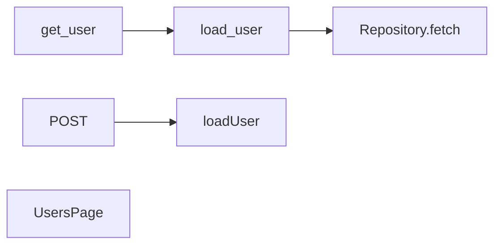
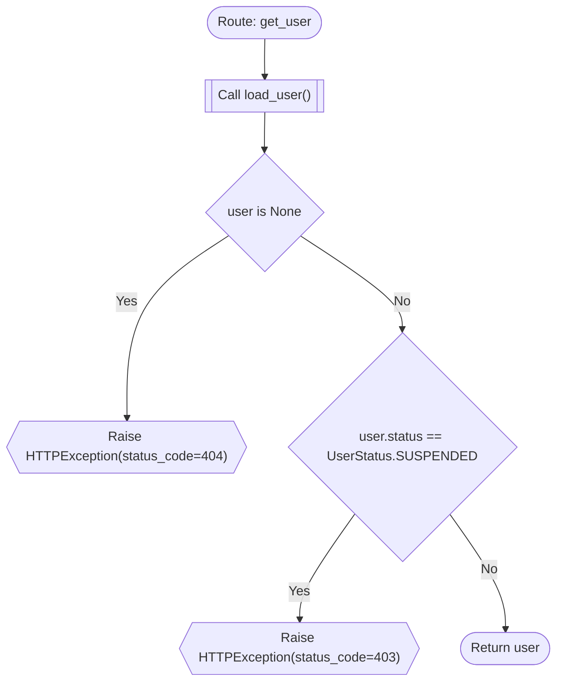
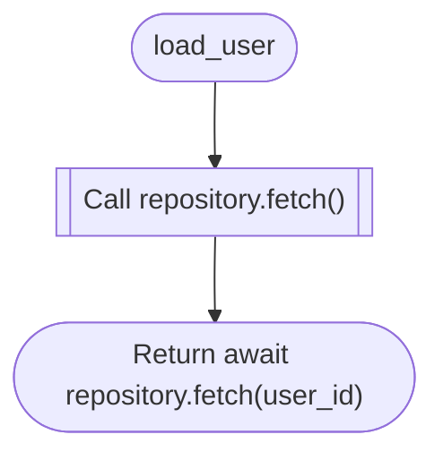
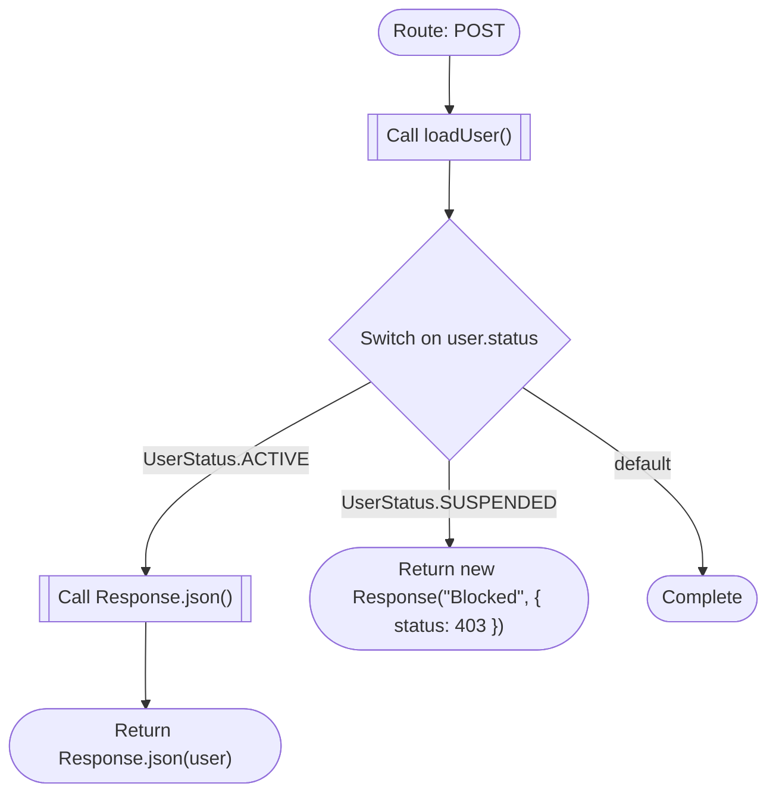
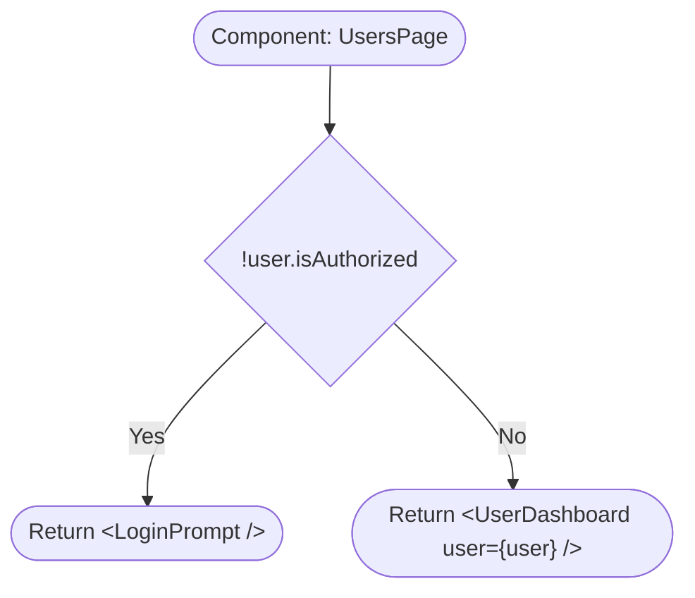
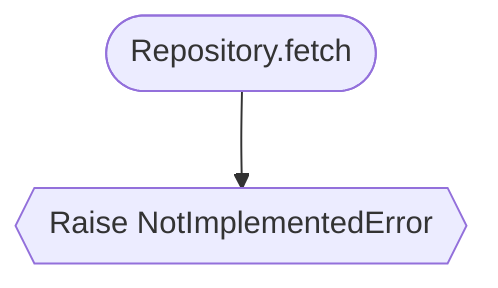
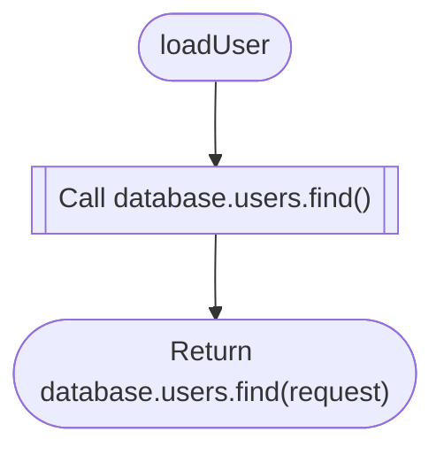

# LogicChart Decision Flows

> Generated from source code. Do not edit this file manually.

- **Generated:** `2026-06-15T21:35:04.553159+00:00`
- **Source root:** `.`
- **Flows:** 6
- **Entry points:** 4
- **Findings:** 0 verified/inferred · 1 review-only

## Project Map

## Findings

No verified or inferred findings were detected.

Review-only - 1 POTENTIAL_GAP (heuristic candidates, not confirmed)

- **WARNING · POTENTIAL_GAP · missing_branch** Decision has no explicit fallback: switch user.status ([`frontend/app/api/users/route.ts:4`](../frontend/app/api/users/route.ts#L4))

## Entry Point Flows

### get_user

`route` · `python` · `fastapi` · [`backend/users.py:23`](../backend/users.py#L23)

### load_user

`function` · `python` · `generic` · [`backend/users.py:32`](../backend/users.py#L32)

### POST

`route` · `typescript` · `nextjs` · [`frontend/app/api/users/route.ts:1`](../frontend/app/api/users/route.ts#L1)

**Review points:**
- `Switch on user.status`: Decision has no explicit fallback: switch user.status

### UsersPage

`component` · `typescript` · `nextjs` · [`frontend/app/users/page.tsx:1`](../frontend/app/users/page.tsx#L1)

## Referenced Subflows

### Repository.fetch

`method` · `python` · `generic` · [`backend/users.py:9`](../backend/users.py#L9)

### loadUser

`function` · `typescript` · `generic` · [`frontend/app/api/users/route.ts:12`](../frontend/app/api/users/route.ts#L12)

