# LogicChart Decision Flows

> Generated from source code. Do not edit this file manually.

- **Generated:** `2026-06-16T16:00:38.286920+00:00`
- **Source root:** `.`
- **Flows:** 29
- **Entry points:** 22
- **Findings:** 1 verified/inferred · 0 review-only
- **Scopes:** backend (16) · edge (7) · frontend (6)

## Project Map

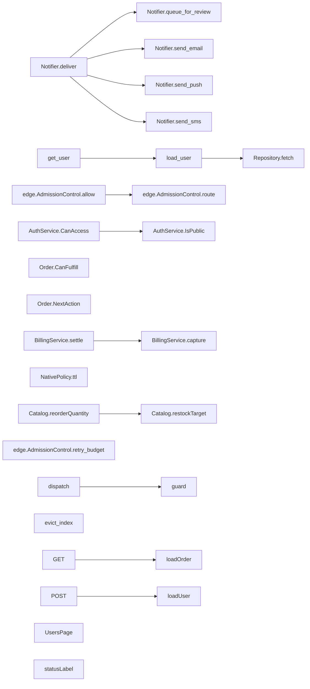

## Findings

- **WARNING · INFERRED · enum_exhaustiveness** Declared UserStatus members not handled for user.status: UserStatus.DELETED ([`frontend/app/api/users/route.ts:7`](../frontend/app/api/users/route.ts#L7))

## Entry Point Flows

### AuthService.CanAccess

`method` · `csharp` · `generic` · [`backend/auth/AuthService.cs:12`](../backend/auth/AuthService.cs#L12)

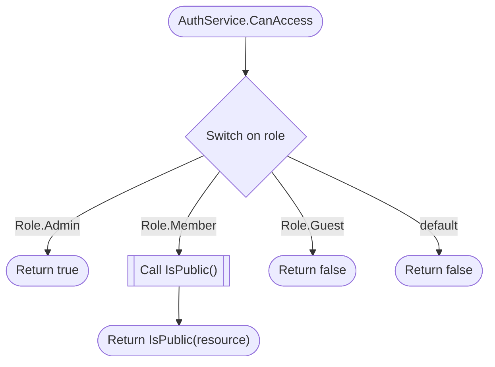

### BillingService.settle

`method` · `java` · `generic` · [`backend/billing/BillingService.java:13`](../backend/billing/BillingService.java#L13)

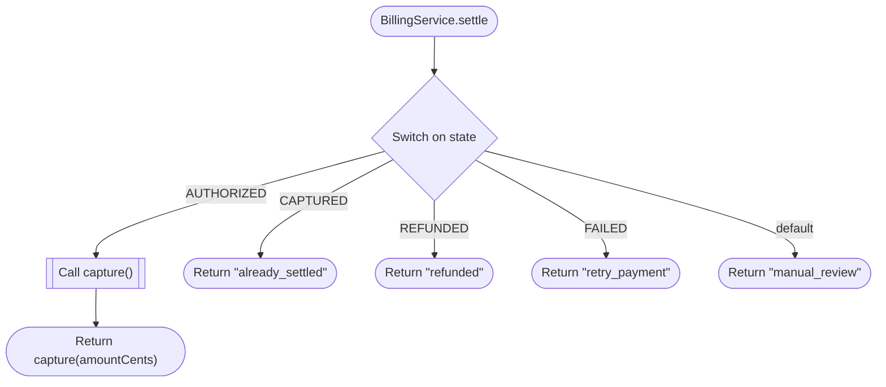

### Catalog.reorderQuantity

`method` · `php` · `generic` · [`backend/catalog/Catalog.php:7`](../backend/catalog/Catalog.php#L7)

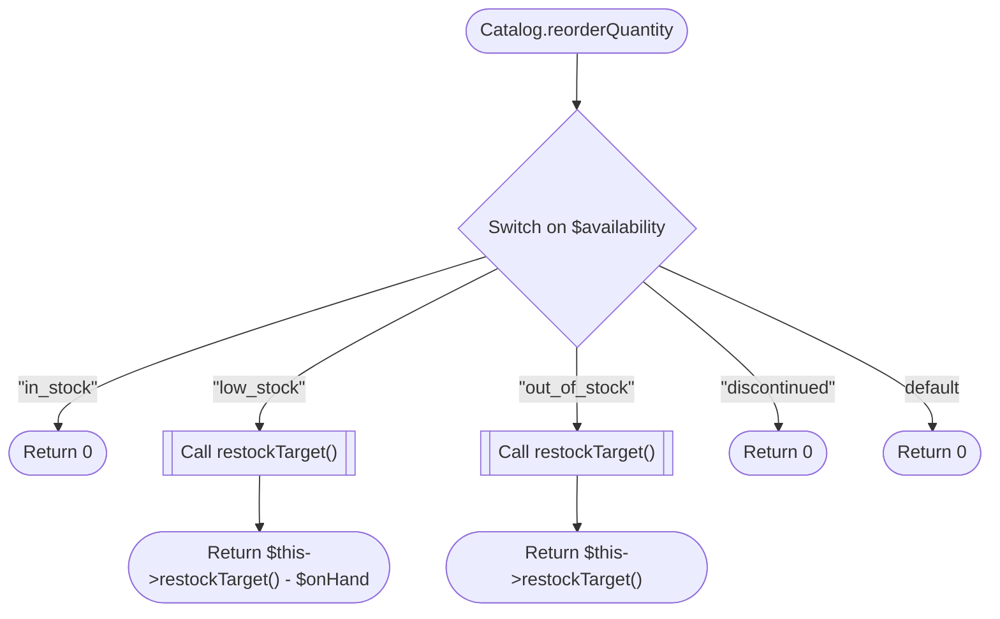

### Notifier.deliver

`method` · `ruby` · `generic` · [`backend/notifications/notifier.rb:4`](../backend/notifications/notifier.rb#L4)

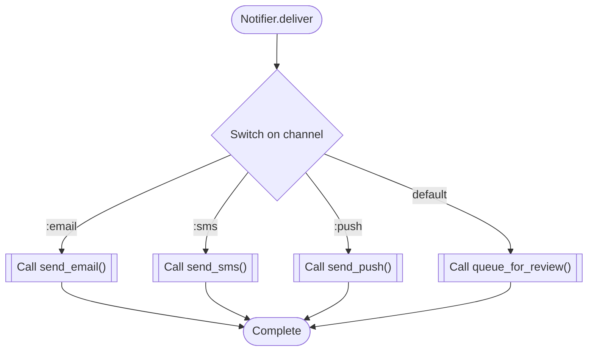

### Notifier.queue\_for\_review

`method` · `ruby` · `generic` · [`backend/notifications/notifier.rb:31`](../backend/notifications/notifier.rb#L31)


### Notifier.send\_email

`method` · `ruby` · `generic` · [`backend/notifications/notifier.rb:19`](../backend/notifications/notifier.rb#L19)

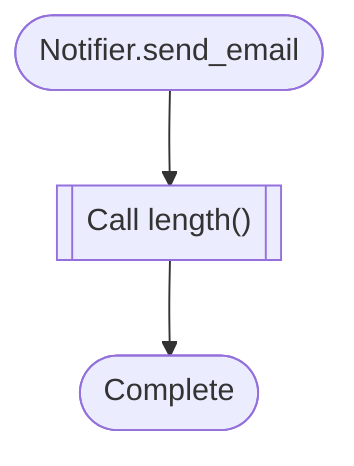

### Notifier.send\_push

`method` · `ruby` · `generic` · [`backend/notifications/notifier.rb:27`](../backend/notifications/notifier.rb#L27)


### Notifier.send\_sms

`method` · `ruby` · `generic` · [`backend/notifications/notifier.rb:23`](../backend/notifications/notifier.rb#L23)

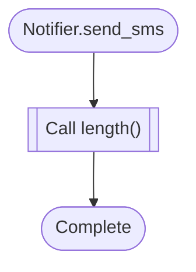

### Order.CanFulfill

`method` · `go` · `generic` · [`backend/orders/service.go:38`](../backend/orders/service.go#L38)

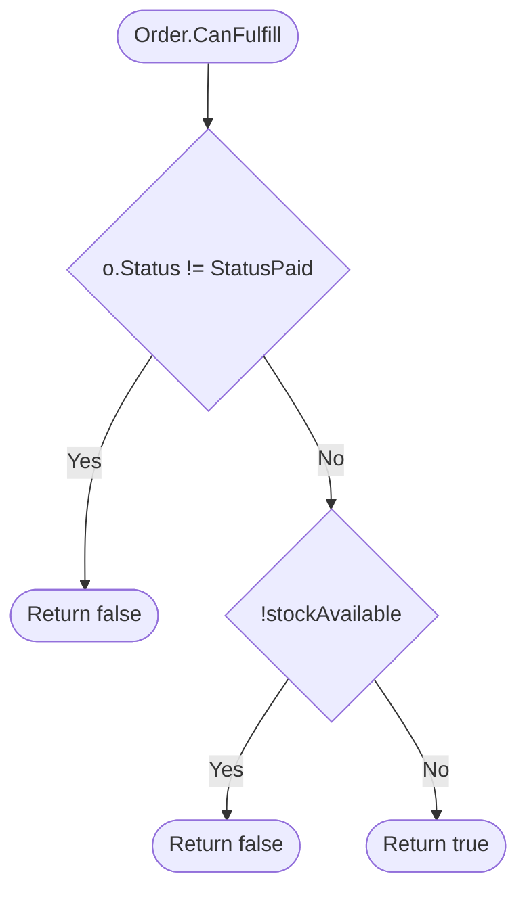

### Order.NextAction

`method` · `go` · `generic` · [`backend/orders/service.go:20`](../backend/orders/service.go#L20)

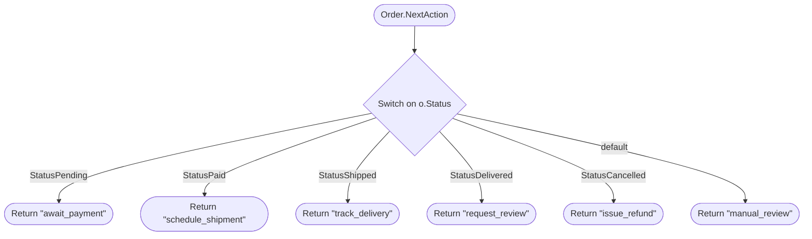

### get\_user

`route` · `python` · `fastapi` · [`backend/users.py:23`](../backend/users.py#L23)


### load\_user

`function` · `python` · `generic` · [`backend/users.py:32`](../backend/users.py#L32)


### NativePolicy.ttl

`method` · `cpp` · `generic` · [`edge/native/policy.cpp:11`](../edge/native/policy.cpp#L11)

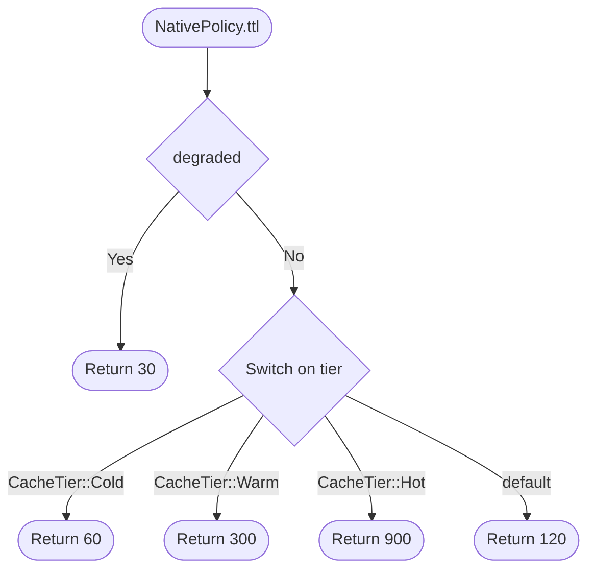

### edge.AdmissionControl.allow

`method` · `cpp` · `generic` · [`edge/native/admission.cpp:13`](../edge/native/admission.cpp#L13)

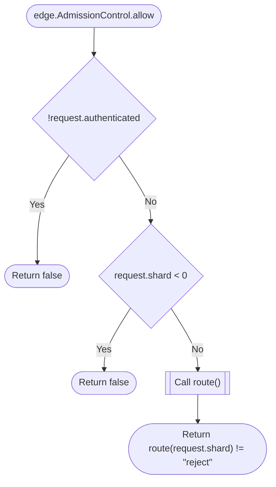

### edge.AdmissionControl.retry\_budget

`method` · `cpp` · `generic` · [`edge/native/admission.cpp:34`](../edge/native/admission.cpp#L34)

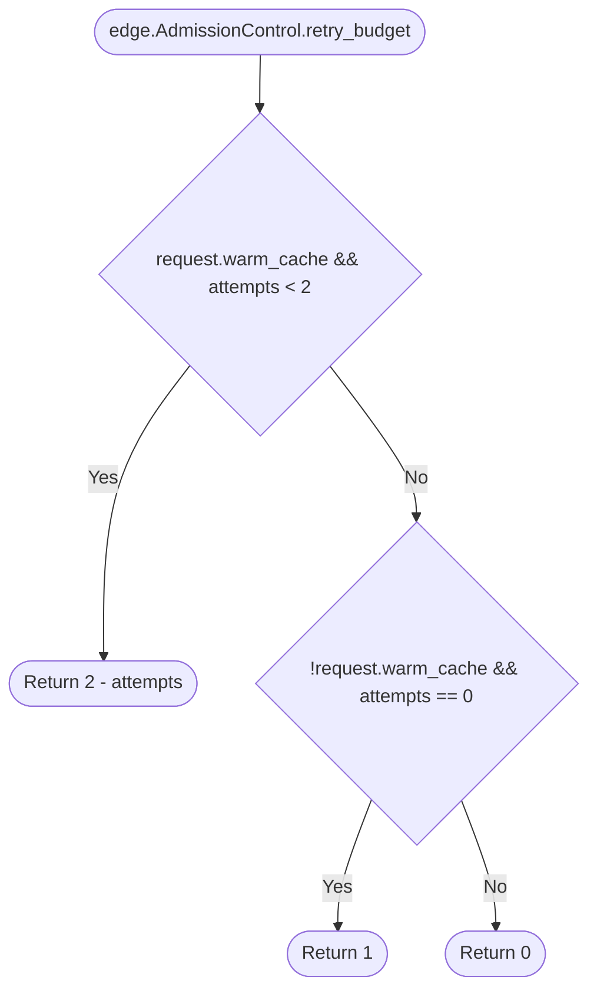

### edge.AdmissionControl.route

`method` · `cpp` · `generic` · [`edge/native/admission.cpp:23`](../edge/native/admission.cpp#L23)

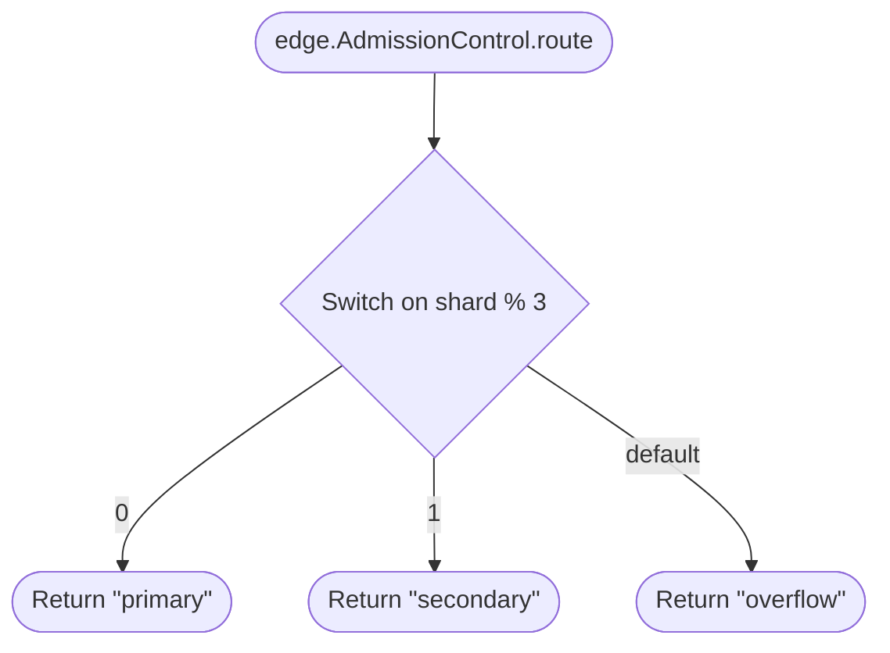

### dispatch

`function` · `rust` · `generic` · [`edge/router/src/lib.rs:10`](../edge/router/src/lib.rs#L10)

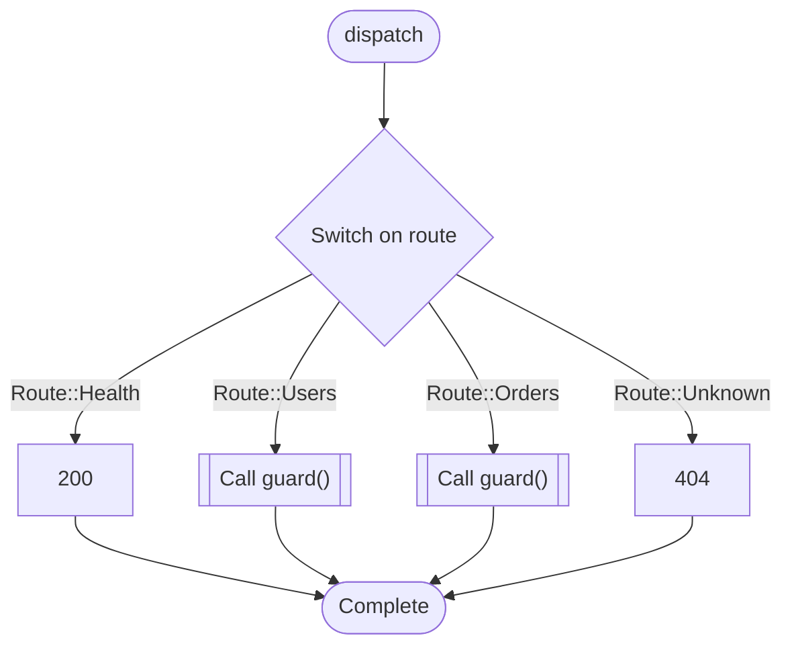

### evict\_index

`function` · `c` · `generic` · [`edge/cache.c:10`](../edge/cache.c#L10)

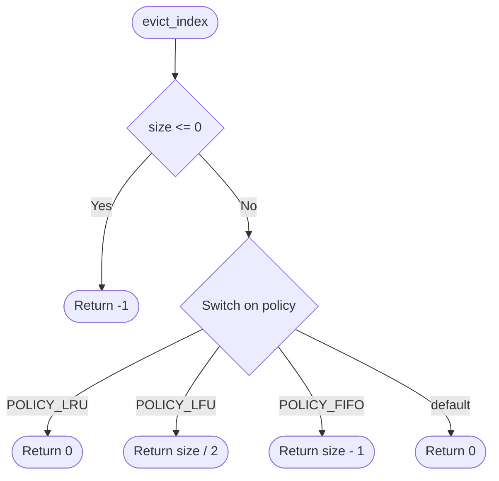

### GET

`route` · `typescript` · `nextjs` · [`frontend/app/api/orders/route.ts:3`](../frontend/app/api/orders/route.ts#L3)

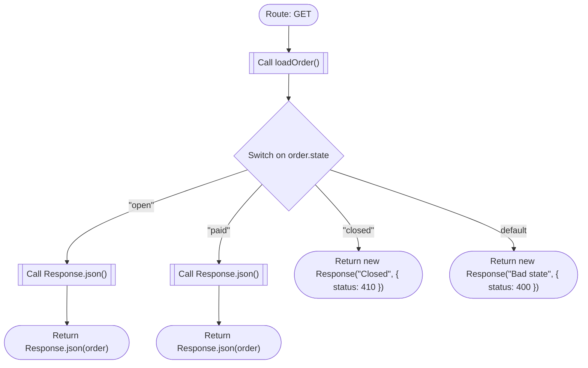

### POST

`route` · `typescript` · `nextjs` · [`frontend/app/api/users/route.ts:4`](../frontend/app/api/users/route.ts#L4)

```mermaid
flowchart TD
  mflow_3de3eacd67f96e64_n1(["Route: POST"])
  mflow_3de3eacd67f96e64_n2[["Call loadUser()"]]
  mflow_3de3eacd67f96e64_n3{"Switch on user.status"}
  mflow_3de3eacd67f96e64_n4[["Call Response.json()"]]
  mflow_3de3eacd67f96e64_n5(["Return Response.json(user)"])
  mflow_3de3eacd67f96e64_n6(["Return new Response(&quot;Blocked&quot;, { status: 403 })"])
  mflow_3de3eacd67f96e64_n7(["Complete"])
  mflow_3de3eacd67f96e64_n1 --> mflow_3de3eacd67f96e64_n2
  mflow_3de3eacd67f96e64_n2 --> mflow_3de3eacd67f96e64_n3
  mflow_3de3eacd67f96e64_n3 -->|"UserStatus.ACTIVE"| mflow_3de3eacd67f96e64_n4
  mflow_3de3eacd67f96e64_n4 --> mflow_3de3eacd67f96e64_n5
  mflow_3de3eacd67f96e64_n3 -->|"UserStatus.SUSPENDED"| mflow_3de3eacd67f96e64_n6
  mflow_3de3eacd67f96e64_n3 -->|"default"| mflow_3de3eacd67f96e64_n7
```

**Review points:**
- `Switch on user.status`: Declared UserStatus members not handled for user.status: UserStatus.DELETED

### UsersPage

`component` · `typescript` · `nextjs` · [`frontend/app/users/page.tsx:1`](../frontend/app/users/page.tsx#L1)

```mermaid
flowchart TD
  mflow_3d6bdb52c57fafa8_n1(["Component: UsersPage"])
  mflow_3d6bdb52c57fafa8_n2{"!user.isAuthorized"}
  mflow_3d6bdb52c57fafa8_n3(["Return &lt;LoginPrompt /&gt;"])
  mflow_3d6bdb52c57fafa8_n4(["Return &lt;UserDashboard user={user} /&gt;"])
  mflow_3d6bdb52c57fafa8_n1 --> mflow_3d6bdb52c57fafa8_n2
  mflow_3d6bdb52c57fafa8_n2 -->|"Yes"| mflow_3d6bdb52c57fafa8_n3
  mflow_3d6bdb52c57fafa8_n2 -->|"No"| mflow_3d6bdb52c57fafa8_n4
```

### statusLabel

`function` · `javascript` · `generic` · [`frontend/lib/status.js:3`](../frontend/lib/status.js#L3)

```mermaid
flowchart TD
  mflow_8a4924a1be17b42e_n1(["statusLabel"])
  mflow_8a4924a1be17b42e_n2{"Switch on status"}
  mflow_8a4924a1be17b42e_n3(["Return &quot;Active&quot;"])
  mflow_8a4924a1be17b42e_n4(["Return &quot;Suspended&quot;"])
  mflow_8a4924a1be17b42e_n5(["Return &quot;Deleted&quot;"])
  mflow_8a4924a1be17b42e_n6(["Return &quot;Unknown&quot;"])
  mflow_8a4924a1be17b42e_n1 --> mflow_8a4924a1be17b42e_n2
  mflow_8a4924a1be17b42e_n2 -->|"&quot;active&quot;"| mflow_8a4924a1be17b42e_n3
  mflow_8a4924a1be17b42e_n2 -->|"&quot;suspended&quot;"| mflow_8a4924a1be17b42e_n4
  mflow_8a4924a1be17b42e_n2 -->|"&quot;deleted&quot;"| mflow_8a4924a1be17b42e_n5
  mflow_8a4924a1be17b42e_n2 -->|"default"| mflow_8a4924a1be17b42e_n6
```


## Referenced Subflows

### AuthService.IsPublic

`method` · `csharp` · `generic` · [`backend/auth/AuthService.cs:27`](../backend/auth/AuthService.cs#L27)

```mermaid
flowchart TD
  mflow_11f1f62f87562179_n1(["AuthService.IsPublic"])
  mflow_11f1f62f87562179_n2[["Call resource.StartsWith()"]]
  mflow_11f1f62f87562179_n3(["Return resource.StartsWith(&quot;public/&quot;)"])
  mflow_11f1f62f87562179_n1 --> mflow_11f1f62f87562179_n2
  mflow_11f1f62f87562179_n2 --> mflow_11f1f62f87562179_n3
```

### BillingService.capture

`method` · `java` · `generic` · [`backend/billing/BillingService.java:28`](../backend/billing/BillingService.java#L28)

```mermaid
flowchart TD
  mflow_a4e4a0d7d38cc4fa_n1(["BillingService.capture"])
  mflow_a4e4a0d7d38cc4fa_n2{"amountCents &lt;= 0"}
  mflow_a4e4a0d7d38cc4fa_n3(["Return &quot;invalid_amount&quot;"])
  mflow_a4e4a0d7d38cc4fa_n4(["Return &quot;captured&quot;"])
  mflow_a4e4a0d7d38cc4fa_n1 --> mflow_a4e4a0d7d38cc4fa_n2
  mflow_a4e4a0d7d38cc4fa_n2 -->|"Yes"| mflow_a4e4a0d7d38cc4fa_n3
  mflow_a4e4a0d7d38cc4fa_n2 -->|"No"| mflow_a4e4a0d7d38cc4fa_n4
```

### Catalog.restockTarget

`method` · `php` · `generic` · [`backend/catalog/Catalog.php:23`](../backend/catalog/Catalog.php#L23)

```mermaid
flowchart TD
  mflow_f98e4c798beecd3f_n1(["Catalog.restockTarget"])
  mflow_f98e4c798beecd3f_n2(["Return 100"])
  mflow_f98e4c798beecd3f_n1 --> mflow_f98e4c798beecd3f_n2
```

### Repository.fetch

`method` · `python` · `generic` · [`backend/users.py:9`](../backend/users.py#L9)

```mermaid
flowchart TD
  mflow_eef1d33de2175dfc_n1(["Repository.fetch"])
  mflow_eef1d33de2175dfc_n2{{"Raise NotImplementedError"}}
  mflow_eef1d33de2175dfc_n1 --> mflow_eef1d33de2175dfc_n2
```

### guard

`function` · `rust` · `generic` · [`edge/router/src/lib.rs:19`](../edge/router/src/lib.rs#L19)

```mermaid
flowchart TD
  mflow_993bb9d5d0bf4b6e_n1(["guard"])
  mflow_993bb9d5d0bf4b6e_n2["Handle internal condition: authenticated"]
  mflow_993bb9d5d0bf4b6e_n3(["Complete"])
  mflow_993bb9d5d0bf4b6e_n1 --> mflow_993bb9d5d0bf4b6e_n2
  mflow_993bb9d5d0bf4b6e_n2 --> mflow_993bb9d5d0bf4b6e_n3
```

### loadOrder

`function` · `typescript` · `generic` · [`frontend/app/api/orders/route.ts:18`](../frontend/app/api/orders/route.ts#L18)

```mermaid
flowchart TD
  mflow_b702e4be67436003_n1(["loadOrder"])
  mflow_b702e4be67436003_n2[["Call database.orders.find()"]]
  mflow_b702e4be67436003_n3(["Return database.orders.find(request)"])
  mflow_b702e4be67436003_n1 --> mflow_b702e4be67436003_n2
  mflow_b702e4be67436003_n2 --> mflow_b702e4be67436003_n3
```

### loadUser

`function` · `typescript` · `generic` · [`frontend/app/api/users/route.ts:15`](../frontend/app/api/users/route.ts#L15)

```mermaid
flowchart TD
  mflow_b79df7006d56acea_n1(["loadUser"])
  mflow_b79df7006d56acea_n2[["Call database.users.find()"]]
  mflow_b79df7006d56acea_n3(["Return database.users.find(request)"])
  mflow_b79df7006d56acea_n1 --> mflow_b79df7006d56acea_n2
  mflow_b79df7006d56acea_n2 --> mflow_b79df7006d56acea_n3
```
