# LogicChart Decision Flows

> Generated from source code. Do not edit this file manually.

- **Generated:** `2026-06-15T21:35:04.676481+00:00`
- **Source root:** `.`
- **Flows:** 27
- **Entry points:** 25
- **Findings:** 9 verified/inferred · 4 review-only

## Project Map

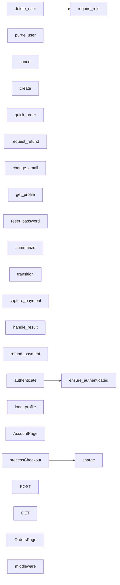
```mermaid
flowchart LR
  mflow_1c6b6f96cffc422d["delete_user"]
  mflow_10ef2d061b27b88c["purge_user"]
  mflow_cd39f6aa851ac8f1["cancel"]
  mflow_5a5d9103f9740b43["create"]
  mflow_9744434307d21144["quick_order"]
  mflow_663a7ab889d99781["request_refund"]
  mflow_3d1dd6694cc550e9["change_email"]
  mflow_379ecad6e175d201["get_profile"]
  mflow_0c047baf201f45c7["reset_password"]
  mflow_43f51fb107229278["ensure_authenticated"]
  mflow_e09895754a5d776e["require_role"]
  mflow_454eee0405381967["summarize"]
  mflow_9db0379ee88dd158["transition"]
  mflow_68d596474ebdd0a8["capture_payment"]
  mflow_50e684eafc6a8ce3["charge"]
  mflow_bf8811dbdd106592["handle_result"]
  mflow_22b5de4d1b748736["refund_payment"]
  mflow_1f9ab406cb373b90["authenticate"]
  mflow_4e86ebfbebb24a2c["load_profile"]
  mflow_0d2030fc4f935984["AccountPage"]
  mflow_77b21193aa0c1d4d["processCheckout"]
  mflow_adbd361ae9be144a["POST"]
  mflow_99799591abfba02a["GET"]
  mflow_a8e844538cf5c5b4["OrdersPage"]
  mflow_2153fa8dd4bc4919["middleware"]
  mflow_1c6b6f96cffc422d --> mflow_e09895754a5d776e
  mflow_1f9ab406cb373b90 --> mflow_43f51fb107229278
  mflow_77b21193aa0c1d4d --> mflow_50e684eafc6a8ce3
```

## Findings

- **INFO · INFERRED · no_op_branch** Branch 'Yes' has an empty body ([`backend/orders_service.py:22`](../backend/orders_service.py#L22))
- **INFO · INFERRED · logging_asymmetry** Guard 'order.total\_cents \<= 0' is logged in a sibling flow but silent here ([`backend/payments_service.py:41`](../backend/payments_service.py#L41))
- **WARNING · INFERRED · enum_exhaustiveness** Declared AccountStatus members not handled for account.status: AccountStatus.ACTIVE, AccountStatus.PENDING\_VERIFICATION ([`backend/api/users_routes.py:15`](../backend/api/users_routes.py#L15))
- **WARNING · INFERRED · enum_exhaustiveness** Declared OrderStatus members not handled for order.status: OrderStatus.CANCELLED, OrderStatus.DELIVERED, OrderStatus.REFUNDED ([`backend/orders_service.py:8`](../backend/orders_service.py#L8))
- **WARNING · INFERRED · enum_exhaustiveness** Declared PaymentResult members not handled for result: PaymentResult.FRAUD\_REVIEW ([`backend/payments_service.py:11`](../backend/payments_service.py#L11))
- **WARNING · INFERRED · broad_except_swallow** Exception handler 'Error' swallows the error ([`frontend/app/api/checkout/route.ts:5`](../frontend/app/api/checkout/route.ts#L5))
- **WARNING · INFERRED · broad_except_swallow** Exception handler 'Exception' swallows the error ([`backend/payments_service.py:23`](../backend/payments_service.py#L23))
- **WARNING · INFERRED · dead_guard** Guard on the constant ENABLE\_DOUBLE\_CHARGE\_GUARD is always False ([`backend/payments_service.py:21`](../backend/payments_service.py#L21))
- **WARNING · INFERRED · dead_code** Unreachable code after all paths return or raise \(line 30\) ([`backend/users_service.py:30`](../backend/users_service.py#L30))

Review-only - 4 POTENTIAL_GAP (heuristic candidates, not confirmed)

- **WARNING · POTENTIAL_GAP · missing_branch** Decision has no explicit fallback: if/elif on order.status ([`frontend/app/orders/page.tsx:3`](../frontend/app/orders/page.tsx#L3))
- **WARNING · POTENTIAL_GAP · missing_branch** Decision has no explicit fallback: switch order.status ([`frontend/app/api/orders/route.ts:6`](../frontend/app/api/orders/route.ts#L6))
- **WARNING · POTENTIAL_GAP · auth_divergence** load\_profile skips the authorization check its sibling entry points perform ([`backend/users_service.py:26`](../backend/users_service.py#L26))
- **WARNING · POTENTIAL_GAP · auth_divergence** purge\_user skips the authorization check its sibling entry points perform ([`backend/api/admin_routes.py:13`](../backend/api/admin_routes.py#L13))

## Entry Point Flows

### delete_user

`function` · `python` · `generic` · [`backend/api/admin_routes.py:7`](../backend/api/admin_routes.py#L7)

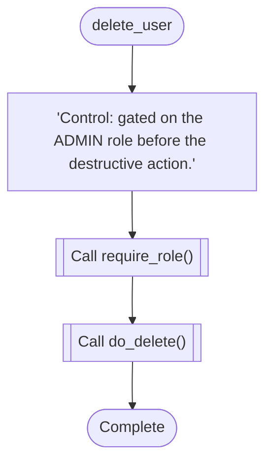
```mermaid
flowchart TD
  mflow_1c6b6f96cffc422d_n1(["delete_user"])
  mflow_1c6b6f96cffc422d_n2["'Control: gated on the ADMIN role before the destructive action.'"]
  mflow_1c6b6f96cffc422d_n3[["Call require_role()"]]
  mflow_1c6b6f96cffc422d_n4[["Call do_delete()"]]
  mflow_1c6b6f96cffc422d_n5(["Complete"])
  mflow_1c6b6f96cffc422d_n1 --> mflow_1c6b6f96cffc422d_n2
  mflow_1c6b6f96cffc422d_n2 --> mflow_1c6b6f96cffc422d_n3
  mflow_1c6b6f96cffc422d_n3 --> mflow_1c6b6f96cffc422d_n4
  mflow_1c6b6f96cffc422d_n4 --> mflow_1c6b6f96cffc422d_n5
```

### purge_user

`function` · `python` · `generic` · [`backend/api/admin_routes.py:13`](../backend/api/admin_routes.py#L13)

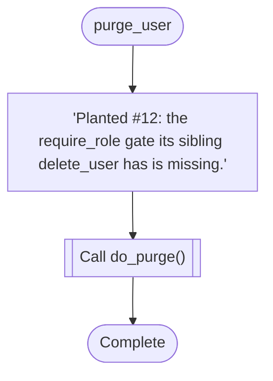
```mermaid
flowchart TD
  mflow_10ef2d061b27b88c_n1(["purge_user"])
  mflow_10ef2d061b27b88c_n2["'Planted #12: the require_role gate its sibling delete_user has is missing.'"]
  mflow_10ef2d061b27b88c_n3[["Call do_purge()"]]
  mflow_10ef2d061b27b88c_n4(["Complete"])
  mflow_10ef2d061b27b88c_n1 --> mflow_10ef2d061b27b88c_n2
  mflow_10ef2d061b27b88c_n2 --> mflow_10ef2d061b27b88c_n3
  mflow_10ef2d061b27b88c_n3 --> mflow_10ef2d061b27b88c_n4
```

**Review points:**
- `purge_user`: purge\_user skips the authorization check its sibling entry points perform

### cancel

`function` · `python` · `generic` · [`backend/api/orders_routes.py:6`](../backend/api/orders_routes.py#L6)

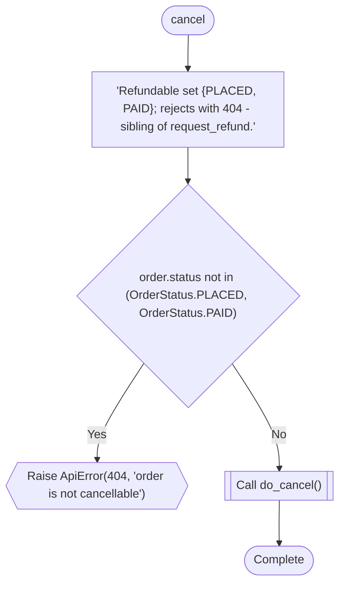
```mermaid
flowchart TD
  mflow_cd39f6aa851ac8f1_n1(["cancel"])
  mflow_cd39f6aa851ac8f1_n2["'Refundable set {PLACED, PAID}; rejects with 404 - sibling of request_refund.'"]
  mflow_cd39f6aa851ac8f1_n3{"order.status not in (OrderStatus.PLACED, OrderStatus.PAID)"}
  mflow_cd39f6aa851ac8f1_n4{{"Raise ApiError(404, 'order is not cancellable')"}}
  mflow_cd39f6aa851ac8f1_n5[["Call do_cancel()"]]
  mflow_cd39f6aa851ac8f1_n6(["Complete"])
  mflow_cd39f6aa851ac8f1_n1 --> mflow_cd39f6aa851ac8f1_n2
  mflow_cd39f6aa851ac8f1_n2 --> mflow_cd39f6aa851ac8f1_n3
  mflow_cd39f6aa851ac8f1_n3 -->|"Yes"| mflow_cd39f6aa851ac8f1_n4
  mflow_cd39f6aa851ac8f1_n3 -->|"No"| mflow_cd39f6aa851ac8f1_n5
  mflow_cd39f6aa851ac8f1_n5 --> mflow_cd39f6aa851ac8f1_n6
```

### create

`function` · `python` · `generic` · [`backend/api/orders_routes.py:21`](../backend/api/orders_routes.py#L21)

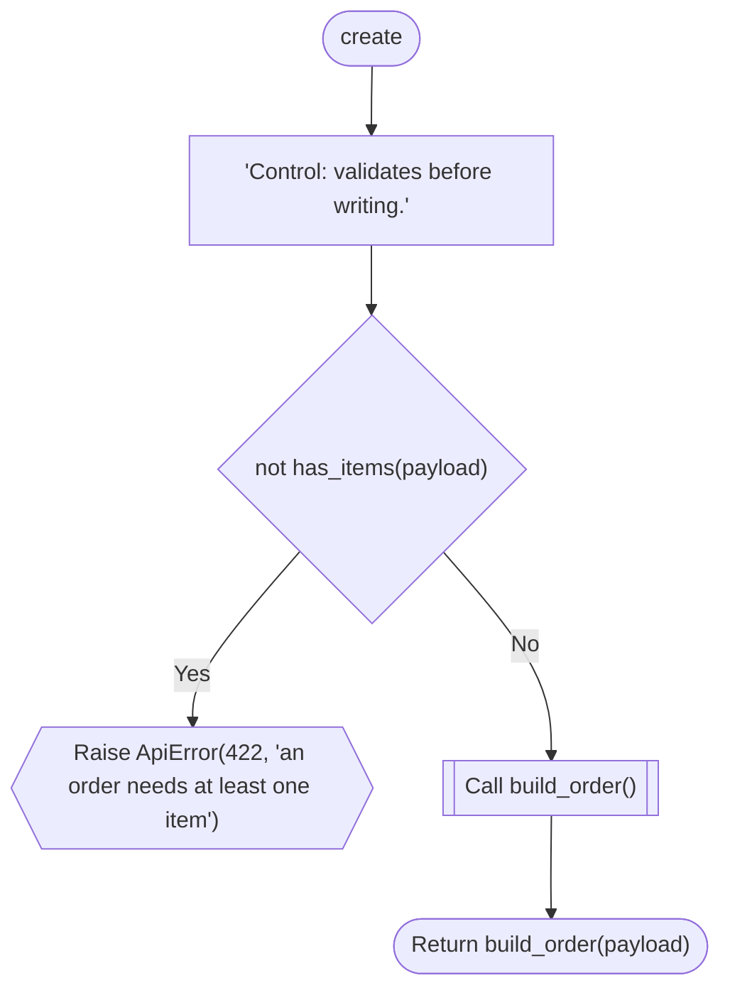
```mermaid
flowchart TD
  mflow_5a5d9103f9740b43_n1(["create"])
  mflow_5a5d9103f9740b43_n2["'Control: validates before writing.'"]
  mflow_5a5d9103f9740b43_n3{"not has_items(payload)"}
  mflow_5a5d9103f9740b43_n4{{"Raise ApiError(422, 'an order needs at least one item')"}}
  mflow_5a5d9103f9740b43_n5[["Call build_order()"]]
  mflow_5a5d9103f9740b43_n6(["Return build_order(payload)"])
  mflow_5a5d9103f9740b43_n1 --> mflow_5a5d9103f9740b43_n2
  mflow_5a5d9103f9740b43_n2 --> mflow_5a5d9103f9740b43_n3
  mflow_5a5d9103f9740b43_n3 -->|"Yes"| mflow_5a5d9103f9740b43_n4
  mflow_5a5d9103f9740b43_n3 -->|"No"| mflow_5a5d9103f9740b43_n5
  mflow_5a5d9103f9740b43_n5 --> mflow_5a5d9103f9740b43_n6
```

### quick_order

`function` · `python` · `generic` · [`backend/api/orders_routes.py:28`](../backend/api/orders_routes.py#L28)

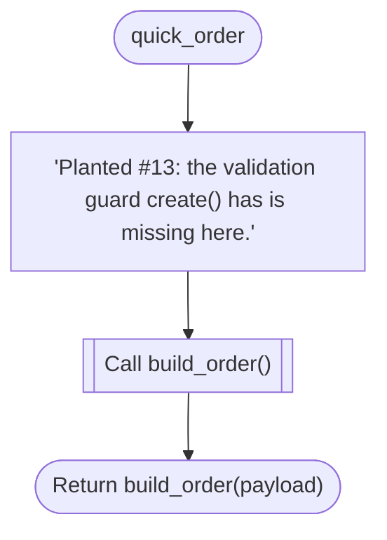
```mermaid
flowchart TD
  mflow_9744434307d21144_n1(["quick_order"])
  mflow_9744434307d21144_n2["'Planted #13: the validation guard create() has is missing here.'"]
  mflow_9744434307d21144_n3[["Call build_order()"]]
  mflow_9744434307d21144_n4(["Return build_order(payload)"])
  mflow_9744434307d21144_n1 --> mflow_9744434307d21144_n2
  mflow_9744434307d21144_n2 --> mflow_9744434307d21144_n3
  mflow_9744434307d21144_n3 --> mflow_9744434307d21144_n4
```

### request_refund

`function` · `python` · `generic` · [`backend/api/orders_routes.py:13`](../backend/api/orders_routes.py#L13)

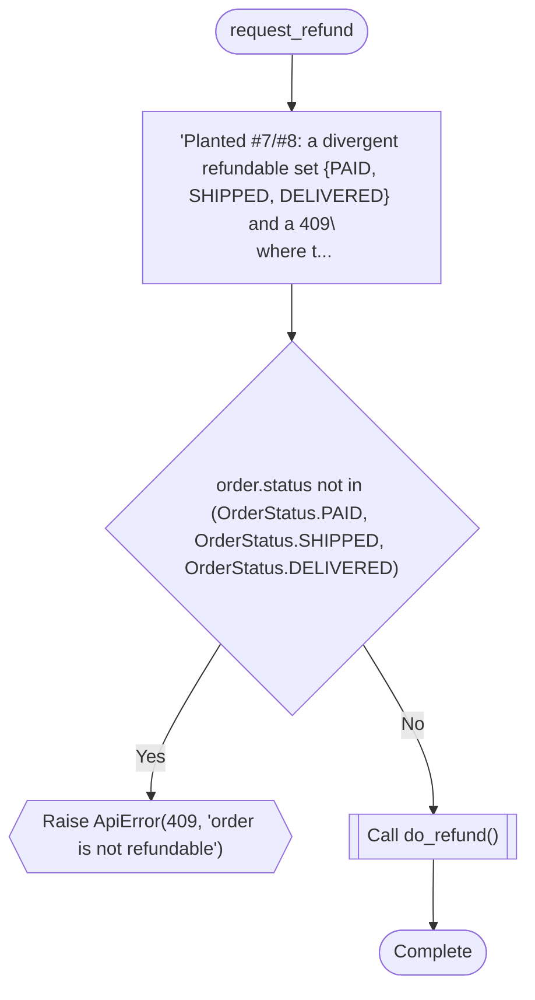
```mermaid
flowchart TD
  mflow_663a7ab889d99781_n1(["request_refund"])
  mflow_663a7ab889d99781_n2["'Planted #7/#8: a divergent refundable set {PAID, SHIPPED, DELIVERED} and a 409\\n where t..."]
  mflow_663a7ab889d99781_n3{"order.status not in (OrderStatus.PAID, OrderStatus.SHIPPED, OrderStatus.DELIVERED)"}
  mflow_663a7ab889d99781_n4{{"Raise ApiError(409, 'order is not refundable')"}}
  mflow_663a7ab889d99781_n5[["Call do_refund()"]]
  mflow_663a7ab889d99781_n6(["Complete"])
  mflow_663a7ab889d99781_n1 --> mflow_663a7ab889d99781_n2
  mflow_663a7ab889d99781_n2 --> mflow_663a7ab889d99781_n3
  mflow_663a7ab889d99781_n3 -->|"Yes"| mflow_663a7ab889d99781_n4
  mflow_663a7ab889d99781_n3 -->|"No"| mflow_663a7ab889d99781_n5
  mflow_663a7ab889d99781_n5 --> mflow_663a7ab889d99781_n6
```

### change_email

`function` · `python` · `generic` · [`backend/api/users_routes.py:13`](../backend/api/users_routes.py#L13)

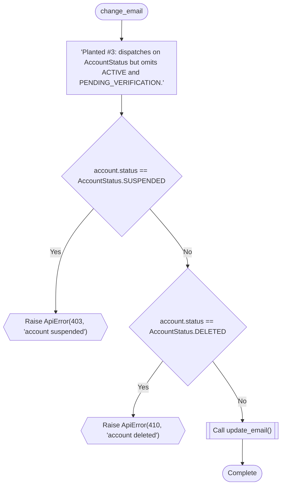
```mermaid
flowchart TD
  mflow_3d1dd6694cc550e9_n1(["change_email"])
  mflow_3d1dd6694cc550e9_n2["'Planted #3: dispatches on AccountStatus but omits ACTIVE and PENDING_VERIFICATION.'"]
  mflow_3d1dd6694cc550e9_n3{"account.status == AccountStatus.SUSPENDED"}
  mflow_3d1dd6694cc550e9_n4{{"Raise ApiError(403, 'account suspended')"}}
  mflow_3d1dd6694cc550e9_n5{"account.status == AccountStatus.DELETED"}
  mflow_3d1dd6694cc550e9_n6{{"Raise ApiError(410, 'account deleted')"}}
  mflow_3d1dd6694cc550e9_n7[["Call update_email()"]]
  mflow_3d1dd6694cc550e9_n8(["Complete"])
  mflow_3d1dd6694cc550e9_n1 --> mflow_3d1dd6694cc550e9_n2
  mflow_3d1dd6694cc550e9_n2 --> mflow_3d1dd6694cc550e9_n3
  mflow_3d1dd6694cc550e9_n3 -->|"Yes"| mflow_3d1dd6694cc550e9_n4
  mflow_3d1dd6694cc550e9_n3 -->|"No"| mflow_3d1dd6694cc550e9_n5
  mflow_3d1dd6694cc550e9_n5 -->|"Yes"| mflow_3d1dd6694cc550e9_n6
  mflow_3d1dd6694cc550e9_n5 -->|"No"| mflow_3d1dd6694cc550e9_n7
  mflow_3d1dd6694cc550e9_n7 --> mflow_3d1dd6694cc550e9_n8
```

**Review points:**
- `account.status == AccountStatus.SUSPENDED`: Declared AccountStatus members not handled for account.status: AccountStatus.ACTIVE, AccountStatus.PENDING\_VERIFICATION

### get_profile

`function` · `python` · `generic` · [`backend/api/users_routes.py:22`](../backend/api/users_routes.py#L22)

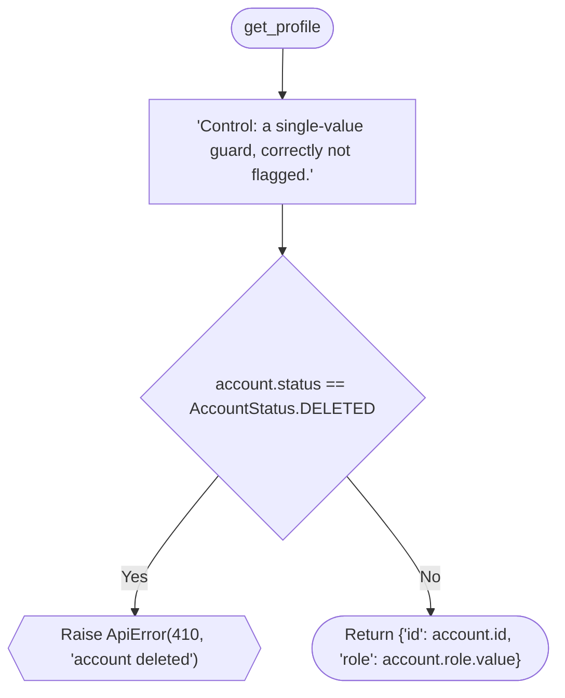
```mermaid
flowchart TD
  mflow_379ecad6e175d201_n1(["get_profile"])
  mflow_379ecad6e175d201_n2["'Control: a single-value guard, correctly not flagged.'"]
  mflow_379ecad6e175d201_n3{"account.status == AccountStatus.DELETED"}
  mflow_379ecad6e175d201_n4{{"Raise ApiError(410, 'account deleted')"}}
  mflow_379ecad6e175d201_n5(["Return {'id': account.id, 'role': account.role.value}"])
  mflow_379ecad6e175d201_n1 --> mflow_379ecad6e175d201_n2
  mflow_379ecad6e175d201_n2 --> mflow_379ecad6e175d201_n3
  mflow_379ecad6e175d201_n3 -->|"Yes"| mflow_379ecad6e175d201_n4
  mflow_379ecad6e175d201_n3 -->|"No"| mflow_379ecad6e175d201_n5
```

### reset_password

`function` · `python` · `generic` · [`backend/api/users_routes.py:6`](../backend/api/users_routes.py#L6)

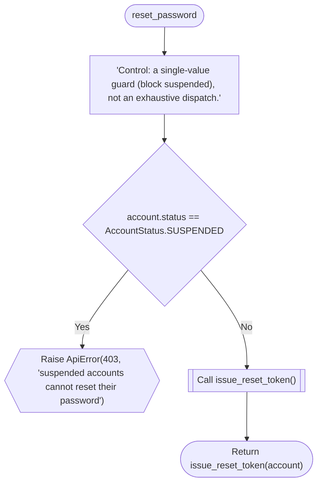
```mermaid
flowchart TD
  mflow_0c047baf201f45c7_n1(["reset_password"])
  mflow_0c047baf201f45c7_n2["'Control: a single-value guard (block suspended), not an exhaustive dispatch.'"]
  mflow_0c047baf201f45c7_n3{"account.status == AccountStatus.SUSPENDED"}
  mflow_0c047baf201f45c7_n4{{"Raise ApiError(403, 'suspended accounts cannot reset their password')"}}
  mflow_0c047baf201f45c7_n5[["Call issue_reset_token()"]]
  mflow_0c047baf201f45c7_n6(["Return issue_reset_token(account)"])
  mflow_0c047baf201f45c7_n1 --> mflow_0c047baf201f45c7_n2
  mflow_0c047baf201f45c7_n2 --> mflow_0c047baf201f45c7_n3
  mflow_0c047baf201f45c7_n3 -->|"Yes"| mflow_0c047baf201f45c7_n4
  mflow_0c047baf201f45c7_n3 -->|"No"| mflow_0c047baf201f45c7_n5
  mflow_0c047baf201f45c7_n5 --> mflow_0c047baf201f45c7_n6
```

### ensure_authenticated

`function` · `python` · `generic` · [`backend/auth.py:12`](../backend/auth.py#L12)

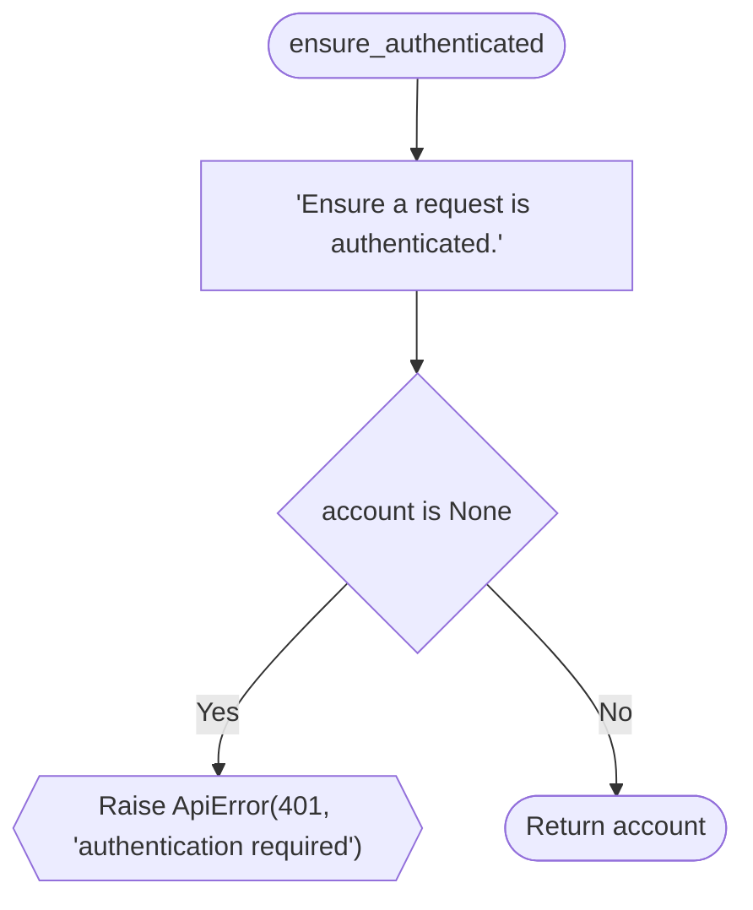
```mermaid
flowchart TD
  mflow_43f51fb107229278_n1(["ensure_authenticated"])
  mflow_43f51fb107229278_n2["'Ensure a request is authenticated.'"]
  mflow_43f51fb107229278_n3{"account is None"}
  mflow_43f51fb107229278_n4{{"Raise ApiError(401, 'authentication required')"}}
  mflow_43f51fb107229278_n5(["Return account"])
  mflow_43f51fb107229278_n1 --> mflow_43f51fb107229278_n2
  mflow_43f51fb107229278_n2 --> mflow_43f51fb107229278_n3
  mflow_43f51fb107229278_n3 -->|"Yes"| mflow_43f51fb107229278_n4
  mflow_43f51fb107229278_n3 -->|"No"| mflow_43f51fb107229278_n5
```

### require_role

`function` · `python` · `generic` · [`backend/auth.py:6`](../backend/auth.py#L6)

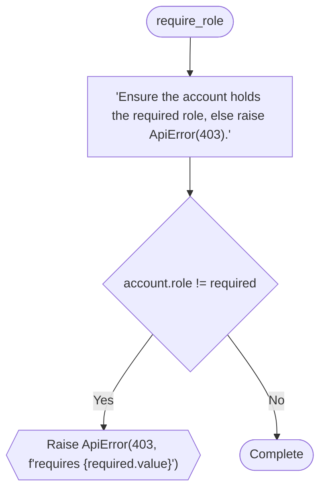
```mermaid
flowchart TD
  mflow_e09895754a5d776e_n1(["require_role"])
  mflow_e09895754a5d776e_n2["'Ensure the account holds the required role, else raise ApiError(403).'"]
  mflow_e09895754a5d776e_n3{"account.role != required"}
  mflow_e09895754a5d776e_n4{{"Raise ApiError(403, f'requires {required.value}')"}}
  mflow_e09895754a5d776e_n5(["Complete"])
  mflow_e09895754a5d776e_n1 --> mflow_e09895754a5d776e_n2
  mflow_e09895754a5d776e_n2 --> mflow_e09895754a5d776e_n3
  mflow_e09895754a5d776e_n3 -->|"Yes"| mflow_e09895754a5d776e_n4
  mflow_e09895754a5d776e_n3 -->|"No"| mflow_e09895754a5d776e_n5
```

### summarize

`function` · `python` · `generic` · [`backend/orders_service.py:19`](../backend/orders_service.py#L19)

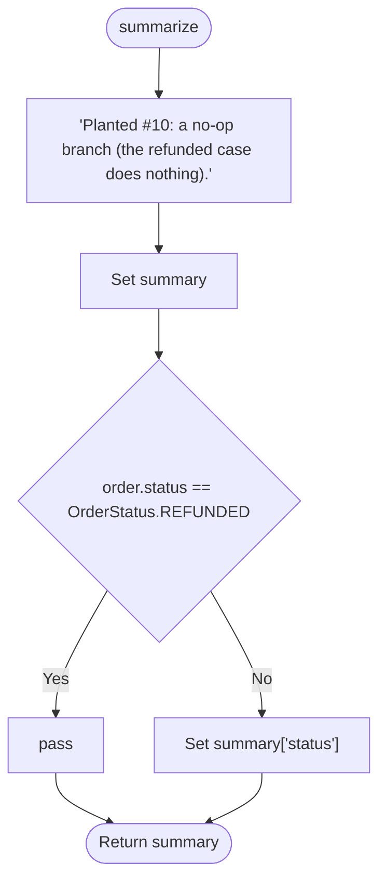
```mermaid
flowchart TD
  mflow_454eee0405381967_n1(["summarize"])
  mflow_454eee0405381967_n2["'Planted #10: a no-op branch (the refunded case does nothing).'"]
  mflow_454eee0405381967_n3["Set summary"]
  mflow_454eee0405381967_n4{"order.status == OrderStatus.REFUNDED"}
  mflow_454eee0405381967_n5["pass"]
  mflow_454eee0405381967_n6["Set summary['status']"]
  mflow_454eee0405381967_n7(["Return summary"])
  mflow_454eee0405381967_n1 --> mflow_454eee0405381967_n2
  mflow_454eee0405381967_n2 --> mflow_454eee0405381967_n3
  mflow_454eee0405381967_n3 --> mflow_454eee0405381967_n4
  mflow_454eee0405381967_n4 -->|"Yes"| mflow_454eee0405381967_n5
  mflow_454eee0405381967_n4 -->|"No"| mflow_454eee0405381967_n6
  mflow_454eee0405381967_n5 --> mflow_454eee0405381967_n7
  mflow_454eee0405381967_n6 --> mflow_454eee0405381967_n7
```

**Review points:**
- `order.status == OrderStatus.REFUNDED`: Branch 'Yes' has an empty body

### transition

`function` · `python` · `generic` · [`backend/orders_service.py:6`](../backend/orders_service.py#L6)

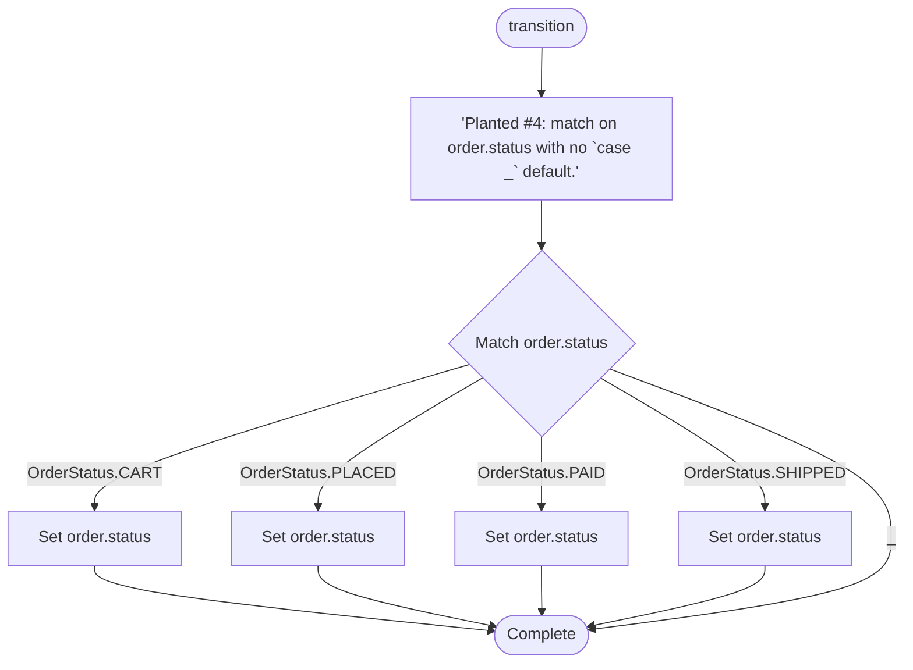
```mermaid
flowchart TD
  mflow_9db0379ee88dd158_n1(["transition"])
  mflow_9db0379ee88dd158_n2["'Planted #4: match on order.status with no `case _` default.'"]
  mflow_9db0379ee88dd158_n3{"Match order.status"}
  mflow_9db0379ee88dd158_n4["Set order.status"]
  mflow_9db0379ee88dd158_n5["Set order.status"]
  mflow_9db0379ee88dd158_n6["Set order.status"]
  mflow_9db0379ee88dd158_n7["Set order.status"]
  mflow_9db0379ee88dd158_n8(["Complete"])
  mflow_9db0379ee88dd158_n1 --> mflow_9db0379ee88dd158_n2
  mflow_9db0379ee88dd158_n2 --> mflow_9db0379ee88dd158_n3
  mflow_9db0379ee88dd158_n3 -->|"OrderStatus.CART"| mflow_9db0379ee88dd158_n4
  mflow_9db0379ee88dd158_n3 -->|"OrderStatus.PLACED"| mflow_9db0379ee88dd158_n5
  mflow_9db0379ee88dd158_n3 -->|"OrderStatus.PAID"| mflow_9db0379ee88dd158_n6
  mflow_9db0379ee88dd158_n3 -->|"OrderStatus.SHIPPED"| mflow_9db0379ee88dd158_n7
  mflow_9db0379ee88dd158_n4 --> mflow_9db0379ee88dd158_n8
  mflow_9db0379ee88dd158_n5 --> mflow_9db0379ee88dd158_n8
  mflow_9db0379ee88dd158_n6 --> mflow_9db0379ee88dd158_n8
  mflow_9db0379ee88dd158_n7 --> mflow_9db0379ee88dd158_n8
  mflow_9db0379ee88dd158_n3 -->|"_"| mflow_9db0379ee88dd158_n8
```

**Review points:**
- `Match order.status`: Declared OrderStatus members not handled for order.status: OrderStatus.CANCELLED, OrderStatus.DELIVERED, OrderStatus.REFUNDED

### capture_payment

`function` · `python` · `generic` · [`backend/payments_service.py:39`](../backend/payments_service.py#L39)

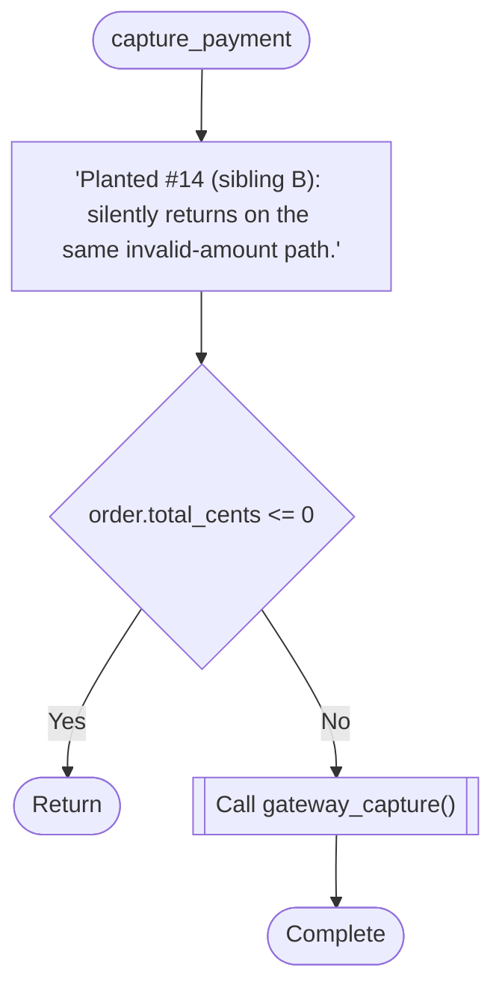
```mermaid
flowchart TD
  mflow_68d596474ebdd0a8_n1(["capture_payment"])
  mflow_68d596474ebdd0a8_n2["'Planted #14 (sibling B): silently returns on the same invalid-amount path.'"]
  mflow_68d596474ebdd0a8_n3{"order.total_cents &lt;= 0"}
  mflow_68d596474ebdd0a8_n4(["Return"])
  mflow_68d596474ebdd0a8_n5[["Call gateway_capture()"]]
  mflow_68d596474ebdd0a8_n6(["Complete"])
  mflow_68d596474ebdd0a8_n1 --> mflow_68d596474ebdd0a8_n2
  mflow_68d596474ebdd0a8_n2 --> mflow_68d596474ebdd0a8_n3
  mflow_68d596474ebdd0a8_n3 -->|"Yes"| mflow_68d596474ebdd0a8_n4
  mflow_68d596474ebdd0a8_n3 -->|"No"| mflow_68d596474ebdd0a8_n5
  mflow_68d596474ebdd0a8_n5 --> mflow_68d596474ebdd0a8_n6
```

**Review points:**
- `order.total_cents <= 0`: Guard 'order.total\_cents \<= 0' is logged in a sibling flow but silent here

### charge

`function` · `python` · `generic` · [`backend/payments_service.py:19`](../backend/payments_service.py#L19)

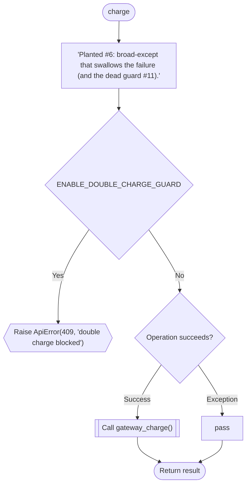
```mermaid
flowchart TD
  mflow_50e684eafc6a8ce3_n1(["charge"])
  mflow_50e684eafc6a8ce3_n2["'Planted #6: broad-except that swallows the failure (and the dead guard #11).'"]
  mflow_50e684eafc6a8ce3_n3{"ENABLE_DOUBLE_CHARGE_GUARD"}
  mflow_50e684eafc6a8ce3_n4{{"Raise ApiError(409, 'double charge blocked')"}}
  mflow_50e684eafc6a8ce3_n5{"Operation succeeds?"}
  mflow_50e684eafc6a8ce3_n6[["Call gateway_charge()"]]
  mflow_50e684eafc6a8ce3_n7["pass"]
  mflow_50e684eafc6a8ce3_n8(["Return result"])
  mflow_50e684eafc6a8ce3_n1 --> mflow_50e684eafc6a8ce3_n2
  mflow_50e684eafc6a8ce3_n2 --> mflow_50e684eafc6a8ce3_n3
  mflow_50e684eafc6a8ce3_n3 -->|"Yes"| mflow_50e684eafc6a8ce3_n4
  mflow_50e684eafc6a8ce3_n3 -->|"No"| mflow_50e684eafc6a8ce3_n5
  mflow_50e684eafc6a8ce3_n5 -->|"Success"| mflow_50e684eafc6a8ce3_n6
  mflow_50e684eafc6a8ce3_n5 -->|"Exception"| mflow_50e684eafc6a8ce3_n7
  mflow_50e684eafc6a8ce3_n6 --> mflow_50e684eafc6a8ce3_n8
  mflow_50e684eafc6a8ce3_n7 --> mflow_50e684eafc6a8ce3_n8
```

**Review points:**
- `Operation succeeds?`: Exception handler 'Exception' swallows the error
- `ENABLE_DOUBLE_CHARGE_GUARD`: Guard on the constant ENABLE\_DOUBLE\_CHARGE\_GUARD is always False

### handle_result

`event_handler` · `python` · `generic` · [`backend/payments_service.py:9`](../backend/payments_service.py#L9)

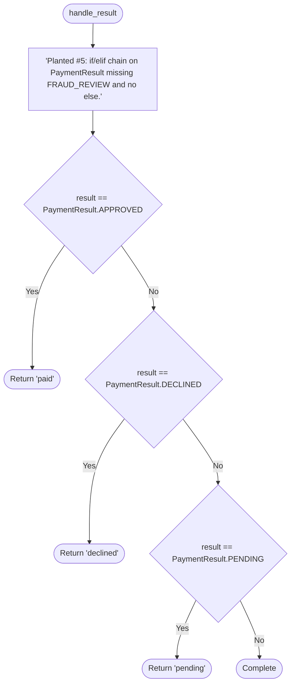
```mermaid
flowchart TD
  mflow_bf8811dbdd106592_n1(["handle_result"])
  mflow_bf8811dbdd106592_n2["'Planted #5: if/elif chain on PaymentResult missing FRAUD_REVIEW and no else.'"]
  mflow_bf8811dbdd106592_n3{"result == PaymentResult.APPROVED"}
  mflow_bf8811dbdd106592_n4(["Return 'paid'"])
  mflow_bf8811dbdd106592_n5{"result == PaymentResult.DECLINED"}
  mflow_bf8811dbdd106592_n6(["Return 'declined'"])
  mflow_bf8811dbdd106592_n7{"result == PaymentResult.PENDING"}
  mflow_bf8811dbdd106592_n8(["Return 'pending'"])
  mflow_bf8811dbdd106592_n9(["Complete"])
  mflow_bf8811dbdd106592_n1 --> mflow_bf8811dbdd106592_n2
  mflow_bf8811dbdd106592_n2 --> mflow_bf8811dbdd106592_n3
  mflow_bf8811dbdd106592_n3 -->|"Yes"| mflow_bf8811dbdd106592_n4
  mflow_bf8811dbdd106592_n3 -->|"No"| mflow_bf8811dbdd106592_n5
  mflow_bf8811dbdd106592_n5 -->|"Yes"| mflow_bf8811dbdd106592_n6
  mflow_bf8811dbdd106592_n5 -->|"No"| mflow_bf8811dbdd106592_n7
  mflow_bf8811dbdd106592_n7 -->|"Yes"| mflow_bf8811dbdd106592_n8
  mflow_bf8811dbdd106592_n7 -->|"No"| mflow_bf8811dbdd106592_n9
```

**Review points:**
- `result == PaymentResult.APPROVED`: Declared PaymentResult members not handled for result: PaymentResult.FRAUD\_REVIEW

### refund_payment

`function` · `python` · `generic` · [`backend/payments_service.py:30`](../backend/payments_service.py#L30)

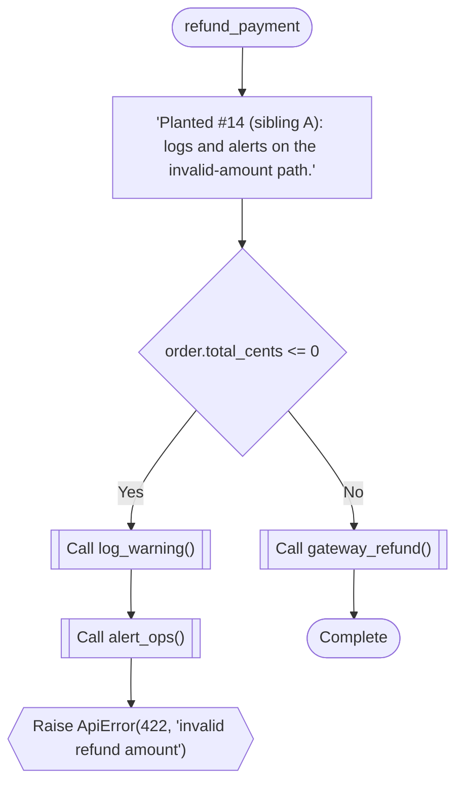
```mermaid
flowchart TD
  mflow_22b5de4d1b748736_n1(["refund_payment"])
  mflow_22b5de4d1b748736_n2["'Planted #14 (sibling A): logs and alerts on the invalid-amount path.'"]
  mflow_22b5de4d1b748736_n3{"order.total_cents &lt;= 0"}
  mflow_22b5de4d1b748736_n4[["Call log_warning()"]]
  mflow_22b5de4d1b748736_n5[["Call alert_ops()"]]
  mflow_22b5de4d1b748736_n6{{"Raise ApiError(422, 'invalid refund amount')"}}
  mflow_22b5de4d1b748736_n7[["Call gateway_refund()"]]
  mflow_22b5de4d1b748736_n8(["Complete"])
  mflow_22b5de4d1b748736_n1 --> mflow_22b5de4d1b748736_n2
  mflow_22b5de4d1b748736_n2 --> mflow_22b5de4d1b748736_n3
  mflow_22b5de4d1b748736_n3 -->|"Yes"| mflow_22b5de4d1b748736_n4
  mflow_22b5de4d1b748736_n4 --> mflow_22b5de4d1b748736_n5
  mflow_22b5de4d1b748736_n5 --> mflow_22b5de4d1b748736_n6
  mflow_22b5de4d1b748736_n3 -->|"No"| mflow_22b5de4d1b748736_n7
  mflow_22b5de4d1b748736_n7 --> mflow_22b5de4d1b748736_n8
```

### authenticate

`function` · `python` · `generic` · [`backend/users_service.py:7`](../backend/users_service.py#L7)

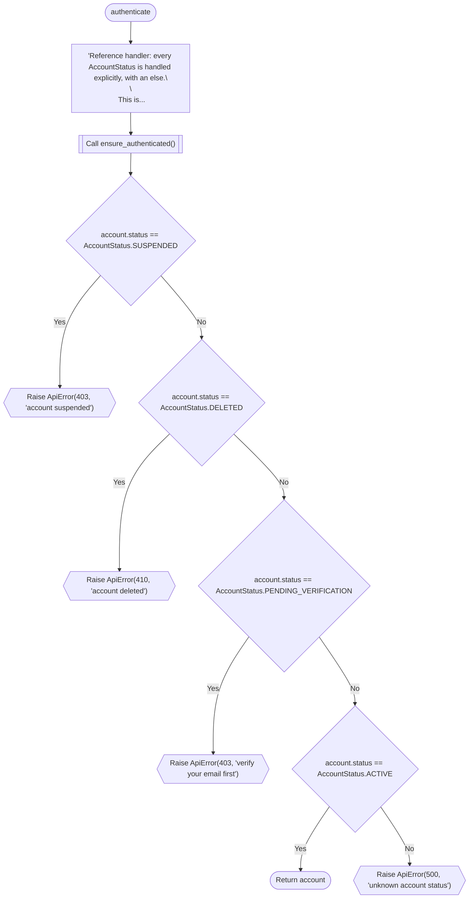
```mermaid
flowchart TD
  mflow_1f9ab406cb373b90_n1(["authenticate"])
  mflow_1f9ab406cb373b90_n2["'Reference handler: every AccountStatus is handled explicitly, with an else.\\n\\n This is..."]
  mflow_1f9ab406cb373b90_n3[["Call ensure_authenticated()"]]
  mflow_1f9ab406cb373b90_n4{"account.status == AccountStatus.SUSPENDED"}
  mflow_1f9ab406cb373b90_n5{{"Raise ApiError(403, 'account suspended')"}}
  mflow_1f9ab406cb373b90_n6{"account.status == AccountStatus.DELETED"}
  mflow_1f9ab406cb373b90_n7{{"Raise ApiError(410, 'account deleted')"}}
  mflow_1f9ab406cb373b90_n8{"account.status == AccountStatus.PENDING_VERIFICATION"}
  mflow_1f9ab406cb373b90_n9{{"Raise ApiError(403, 'verify your email first')"}}
  mflow_1f9ab406cb373b90_n10{"account.status == AccountStatus.ACTIVE"}
  mflow_1f9ab406cb373b90_n11(["Return account"])
  mflow_1f9ab406cb373b90_n12{{"Raise ApiError(500, 'unknown account status')"}}
  mflow_1f9ab406cb373b90_n1 --> mflow_1f9ab406cb373b90_n2
  mflow_1f9ab406cb373b90_n2 --> mflow_1f9ab406cb373b90_n3
  mflow_1f9ab406cb373b90_n3 --> mflow_1f9ab406cb373b90_n4
  mflow_1f9ab406cb373b90_n4 -->|"Yes"| mflow_1f9ab406cb373b90_n5
  mflow_1f9ab406cb373b90_n4 -->|"No"| mflow_1f9ab406cb373b90_n6
  mflow_1f9ab406cb373b90_n6 -->|"Yes"| mflow_1f9ab406cb373b90_n7
  mflow_1f9ab406cb373b90_n6 -->|"No"| mflow_1f9ab406cb373b90_n8
  mflow_1f9ab406cb373b90_n8 -->|"Yes"| mflow_1f9ab406cb373b90_n9
  mflow_1f9ab406cb373b90_n8 -->|"No"| mflow_1f9ab406cb373b90_n10
  mflow_1f9ab406cb373b90_n10 -->|"Yes"| mflow_1f9ab406cb373b90_n11
  mflow_1f9ab406cb373b90_n10 -->|"No"| mflow_1f9ab406cb373b90_n12
```

### load_profile

`function` · `python` · `generic` · [`backend/users_service.py:26`](../backend/users_service.py#L26)

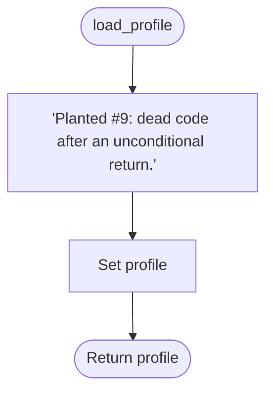
```mermaid
flowchart TD
  mflow_4e86ebfbebb24a2c_n1(["load_profile"])
  mflow_4e86ebfbebb24a2c_n2["'Planted #9: dead code after an unconditional return.'"]
  mflow_4e86ebfbebb24a2c_n3["Set profile"]
  mflow_4e86ebfbebb24a2c_n4(["Return profile"])
  mflow_4e86ebfbebb24a2c_n1 --> mflow_4e86ebfbebb24a2c_n2
  mflow_4e86ebfbebb24a2c_n2 --> mflow_4e86ebfbebb24a2c_n3
  mflow_4e86ebfbebb24a2c_n3 --> mflow_4e86ebfbebb24a2c_n4
```

**Review points:**
- `load_profile`: load\_profile skips the authorization check its sibling entry points perform

### AccountPage

`component` · `typescript` · `nextjs` · [`frontend/app/account/page.tsx:4`](../frontend/app/account/page.tsx#L4)

```mermaid
flowchart TD
  mflow_0d2030fc4f935984_n1(["Component: AccountPage"])
  mflow_0d2030fc4f935984_n2{"Switch on account.status"}
  mflow_0d2030fc4f935984_n3(["Return &lt;Dashboard /&gt;"])
  mflow_0d2030fc4f935984_n4(["Return &lt;SuspendedNotice /&gt;"])
  mflow_0d2030fc4f935984_n5(["Return &lt;LockedNotice /&gt;"])
  mflow_0d2030fc4f935984_n1 --> mflow_0d2030fc4f935984_n2
  mflow_0d2030fc4f935984_n2 -->|"&quot;active&quot;"| mflow_0d2030fc4f935984_n3
  mflow_0d2030fc4f935984_n2 -->|"&quot;suspended&quot;"| mflow_0d2030fc4f935984_n4
  mflow_0d2030fc4f935984_n2 -->|"default"| mflow_0d2030fc4f935984_n5
```

### processCheckout

`server_action` · `typescript` · `nextjs` · [`frontend/app/api/checkout/route.ts:4`](../frontend/app/api/checkout/route.ts#L4)

```mermaid
flowchart TD
  mflow_77b21193aa0c1d4d_n1(["Server action: processCheckout"])
  mflow_77b21193aa0c1d4d_n2{"Operation succeeds?"}
  mflow_77b21193aa0c1d4d_n3[["Call charge()"]]
  mflow_77b21193aa0c1d4d_n4(["Return await charge(request)"])
  mflow_77b21193aa0c1d4d_n5["// intentionally ignored"]
  mflow_77b21193aa0c1d4d_n6(["Return new Response(&quot;ok&quot;)"])
  mflow_77b21193aa0c1d4d_n1 --> mflow_77b21193aa0c1d4d_n2
  mflow_77b21193aa0c1d4d_n2 -->|"Success"| mflow_77b21193aa0c1d4d_n3
  mflow_77b21193aa0c1d4d_n3 --> mflow_77b21193aa0c1d4d_n4
  mflow_77b21193aa0c1d4d_n2 -->|"Error"| mflow_77b21193aa0c1d4d_n5
  mflow_77b21193aa0c1d4d_n5 --> mflow_77b21193aa0c1d4d_n6
```

**Review points:**
- `Operation succeeds?`: Exception handler 'Error' swallows the error

### POST

`route` · `typescript` · `nextjs` · [`frontend/app/api/orders/route.ts:4`](../frontend/app/api/orders/route.ts#L4)

```mermaid
flowchart TD
  mflow_adbd361ae9be144a_n1(["Route: POST"])
  mflow_adbd361ae9be144a_n2[["Call loadOrder()"]]
  mflow_adbd361ae9be144a_n3{"Switch on order.status"}
  mflow_adbd361ae9be144a_n4[["Call Response.json()"]]
  mflow_adbd361ae9be144a_n5(["Return Response.json({ stage: &quot;cart&quot; })"])
  mflow_adbd361ae9be144a_n6[["Call Response.json()"]]
  mflow_adbd361ae9be144a_n7(["Return Response.json({ stage: &quot;paid&quot; })"])
  mflow_adbd361ae9be144a_n8[["Call Response.json()"]]
  mflow_adbd361ae9be144a_n9(["Return Response.json({ stage: &quot;shipped&quot; })"])
  mflow_adbd361ae9be144a_n10(["Complete"])
  mflow_adbd361ae9be144a_n1 --> mflow_adbd361ae9be144a_n2
  mflow_adbd361ae9be144a_n2 --> mflow_adbd361ae9be144a_n3
  mflow_adbd361ae9be144a_n3 -->|"&quot;cart&quot;"| mflow_adbd361ae9be144a_n4
  mflow_adbd361ae9be144a_n4 --> mflow_adbd361ae9be144a_n5
  mflow_adbd361ae9be144a_n3 -->|"&quot;paid&quot;"| mflow_adbd361ae9be144a_n6
  mflow_adbd361ae9be144a_n6 --> mflow_adbd361ae9be144a_n7
  mflow_adbd361ae9be144a_n3 -->|"&quot;shipped&quot;"| mflow_adbd361ae9be144a_n8
  mflow_adbd361ae9be144a_n8 --> mflow_adbd361ae9be144a_n9
  mflow_adbd361ae9be144a_n3 -->|"default"| mflow_adbd361ae9be144a_n10
```

**Review points:**
- `Switch on order.status`: Decision has no explicit fallback: switch order.status

### GET

`route` · `typescript` · `nextjs` · [`frontend/app/api/users/route.ts:7`](../frontend/app/api/users/route.ts#L7)

```mermaid
flowchart TD
  mflow_99799591abfba02a_n1(["Route: GET"])
  mflow_99799591abfba02a_n2[["Call loadAccount()"]]
  mflow_99799591abfba02a_n3{"Switch on account.status"}
  mflow_99799591abfba02a_n4[["Call Response.json()"]]
  mflow_99799591abfba02a_n5(["Return Response.json(account)"])
  mflow_99799591abfba02a_n6(["Return new Response(&quot;blocked&quot;, { status: 403 })"])
  mflow_99799591abfba02a_n7(["Return new Response(&quot;gone&quot;, { status: 410 })"])
  mflow_99799591abfba02a_n8(["Return new Response(&quot;unknown&quot;, { status: 400 })"])
  mflow_99799591abfba02a_n1 --> mflow_99799591abfba02a_n2
  mflow_99799591abfba02a_n2 --> mflow_99799591abfba02a_n3
  mflow_99799591abfba02a_n3 -->|"&quot;active&quot;"| mflow_99799591abfba02a_n4
  mflow_99799591abfba02a_n4 --> mflow_99799591abfba02a_n5
  mflow_99799591abfba02a_n3 -->|"&quot;suspended&quot;"| mflow_99799591abfba02a_n6
  mflow_99799591abfba02a_n3 -->|"&quot;deleted&quot;"| mflow_99799591abfba02a_n7
  mflow_99799591abfba02a_n3 -->|"default"| mflow_99799591abfba02a_n8
```

### OrdersPage

`component` · `typescript` · `nextjs` · [`frontend/app/orders/page.tsx:2`](../frontend/app/orders/page.tsx#L2)

```mermaid
flowchart TD
  mflow_a8e844538cf5c5b4_n1(["Component: OrdersPage"])
  mflow_a8e844538cf5c5b4_n2{"order.status === &quot;cart&quot;"}
  mflow_a8e844538cf5c5b4_n3(["Return &lt;CartView /&gt;"])
  mflow_a8e844538cf5c5b4_n4{"order.status === &quot;paid&quot;"}
  mflow_a8e844538cf5c5b4_n5(["Return &lt;PaidView /&gt;"])
  mflow_a8e844538cf5c5b4_n6(["Complete"])
  mflow_a8e844538cf5c5b4_n1 --> mflow_a8e844538cf5c5b4_n2
  mflow_a8e844538cf5c5b4_n2 -->|"Yes"| mflow_a8e844538cf5c5b4_n3
  mflow_a8e844538cf5c5b4_n2 -->|"No"| mflow_a8e844538cf5c5b4_n4
  mflow_a8e844538cf5c5b4_n4 -->|"Yes"| mflow_a8e844538cf5c5b4_n5
  mflow_a8e844538cf5c5b4_n4 -->|"No"| mflow_a8e844538cf5c5b4_n6
```

**Review points:**
- `order.status === "cart"`: Decision has no explicit fallback: if/elif on order.status

### middleware

`middleware` · `typescript` · `nextjs` · [`frontend/middleware.ts:2`](../frontend/middleware.ts#L2)

```mermaid
flowchart TD
  mflow_2153fa8dd4bc4919_n1(["Middleware: middleware"])
  mflow_2153fa8dd4bc4919_n2[["Call request.headers.get()"]]
  mflow_2153fa8dd4bc4919_n3{"!token"}
  mflow_2153fa8dd4bc4919_n4(["Return new Response(&quot;unauthorized&quot;, { status: 401 })"])
  mflow_2153fa8dd4bc4919_n5[["Call forward()"]]
  mflow_2153fa8dd4bc4919_n6(["Return forward(request)"])
  mflow_2153fa8dd4bc4919_n1 --> mflow_2153fa8dd4bc4919_n2
  mflow_2153fa8dd4bc4919_n2 --> mflow_2153fa8dd4bc4919_n3
  mflow_2153fa8dd4bc4919_n3 -->|"Yes"| mflow_2153fa8dd4bc4919_n4
  mflow_2153fa8dd4bc4919_n3 -->|"No"| mflow_2153fa8dd4bc4919_n5
  mflow_2153fa8dd4bc4919_n5 --> mflow_2153fa8dd4bc4919_n6
```

## Referenced Subflows
