# LogicChart Decision Flows

> Generated from source code. Do not edit this file manually.

- **Generated:** `2026-06-15T18:46:59.671379+00:00`
- **Source root:** `.`
- **Flows:** 17
- **Entry points:** 14
- **Potential gaps:** 8

## Project Map

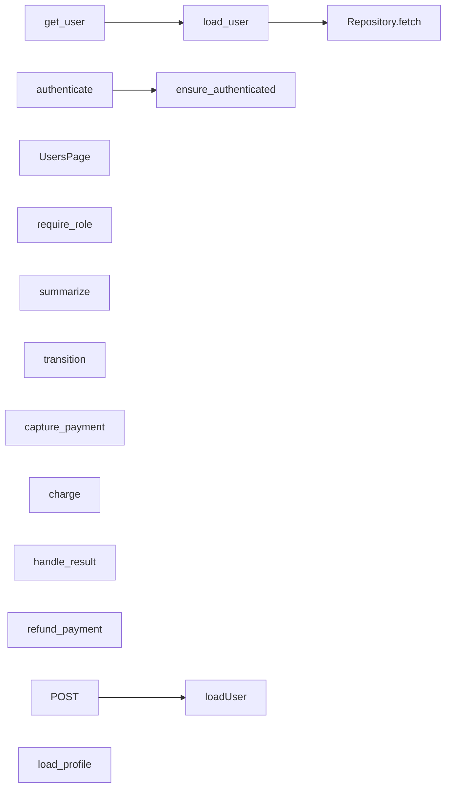

## Findings

- **INFO · no_op_branch** Branch 'Yes' has an empty body ([`examples/shop/backend/orders_service.py:22`](../examples/shop/backend/orders_service.py#L22))
- **WARNING · missing_branch** Decision has no explicit fallback: if/elif on result ([`examples/shop/backend/payments_service.py:11`](../examples/shop/backend/payments_service.py#L11))
- **WARNING · missing_branch** Decision has no explicit fallback: match order.status ([`examples/shop/backend/orders_service.py:8`](../examples/shop/backend/orders_service.py#L8))
- **WARNING · missing_branch** Decision has no explicit fallback: switch user.status ([`examples/demo/frontend/app/api/users/route.ts:4`](../examples/demo/frontend/app/api/users/route.ts#L4))
- **WARNING · enum_exhaustiveness** Declared OrderStatus members not handled for order.status: OrderStatus.CANCELLED, OrderStatus.DELIVERED, OrderStatus.REFUNDED ([`examples/shop/backend/orders_service.py:8`](../examples/shop/backend/orders_service.py#L8))
- **WARNING · enum_exhaustiveness** Declared PaymentResult members not handled for result: PaymentResult.FRAUD_REVIEW ([`examples/shop/backend/payments_service.py:11`](../examples/shop/backend/payments_service.py#L11))
- **WARNING · broad_except_swallow** Exception handler 'Exception' swallows the error ([`examples/shop/backend/payments_service.py:23`](../examples/shop/backend/payments_service.py#L23))
- **WARNING · dead_code** Unreachable code after all paths return or raise (line 30) ([`examples/shop/backend/users_service.py:30`](../examples/shop/backend/users_service.py#L30))

## Entry Point Flows

### get_user

`route` · `python` · `fastapi` · [`examples/demo/backend/users.py:23`](../examples/demo/backend/users.py#L23)

### load_user

`function` · `python` · `generic` · [`examples/demo/backend/users.py:32`](../examples/demo/backend/users.py#L32)

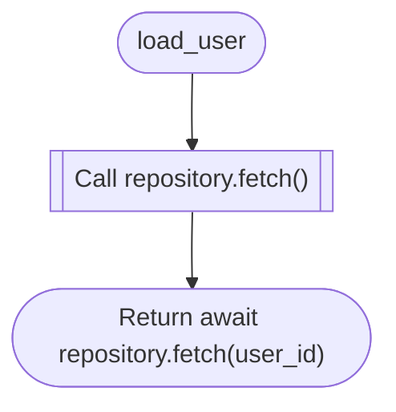

### POST

`route` · `typescript` · `nextjs` · [`examples/demo/frontend/app/api/users/route.ts:1`](../examples/demo/frontend/app/api/users/route.ts#L1)

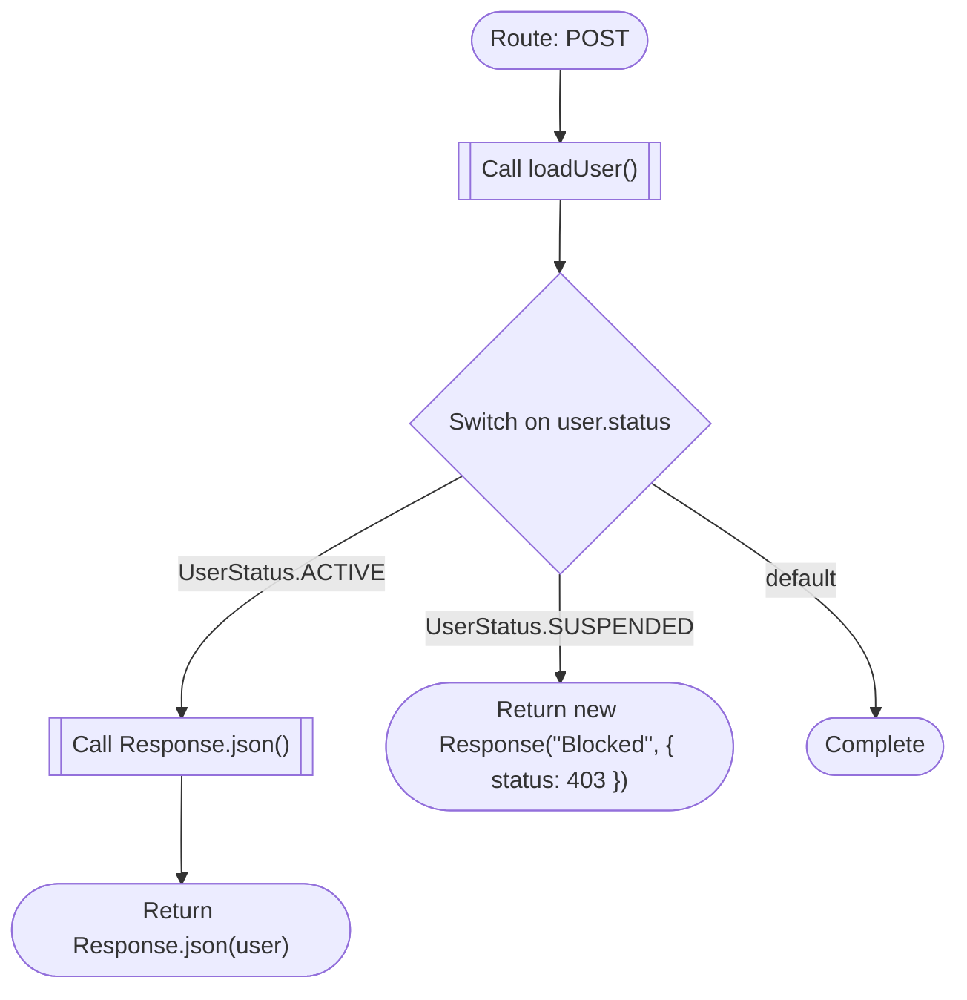

**Review points:**
- `Switch on user.status`: Decision has no explicit fallback: switch user.status

### UsersPage

`component` · `typescript` · `nextjs` · [`examples/demo/frontend/app/users/page.tsx:1`](../examples/demo/frontend/app/users/page.tsx#L1)

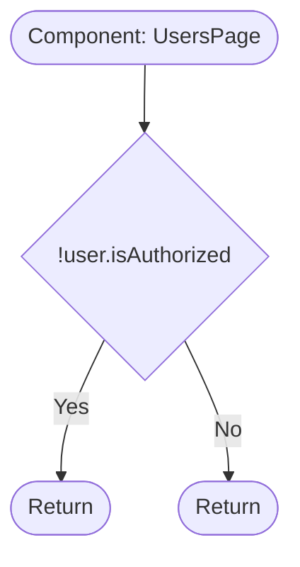

### ensure_authenticated

`function` · `python` · `generic` · [`examples/shop/backend/auth.py:12`](../examples/shop/backend/auth.py#L12)

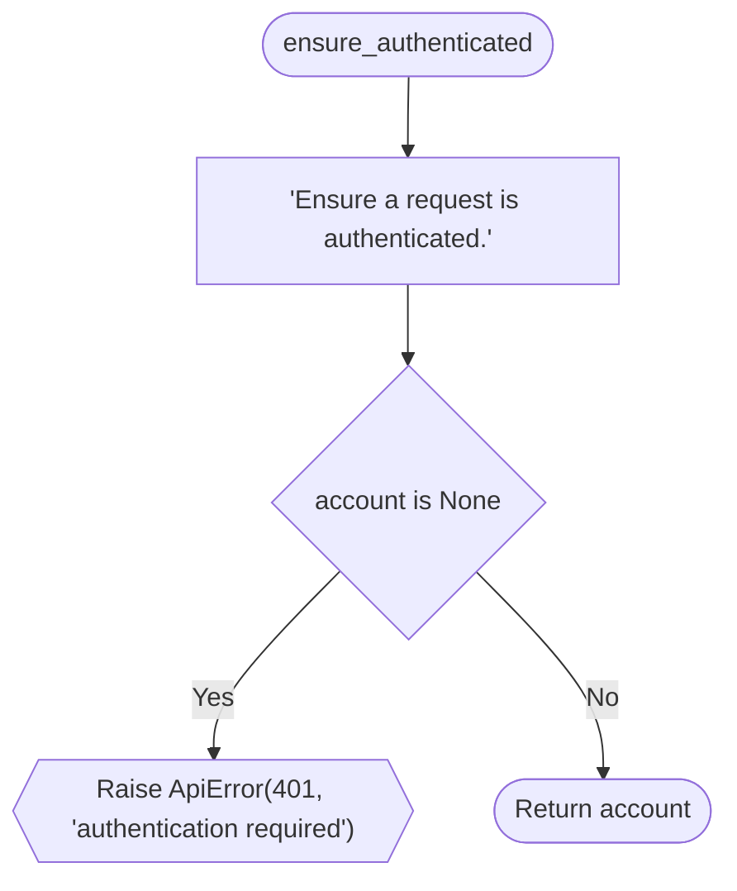

### require_role

`function` · `python` · `generic` · [`examples/shop/backend/auth.py:6`](../examples/shop/backend/auth.py#L6)

### summarize

`function` · `python` · `generic` · [`examples/shop/backend/orders_service.py:19`](../examples/shop/backend/orders_service.py#L19)

**Review points:**
- `order.status == OrderStatus.REFUNDED`: Branch 'Yes' has an empty body

### transition

`function` · `python` · `generic` · [`examples/shop/backend/orders_service.py:6`](../examples/shop/backend/orders_service.py#L6)

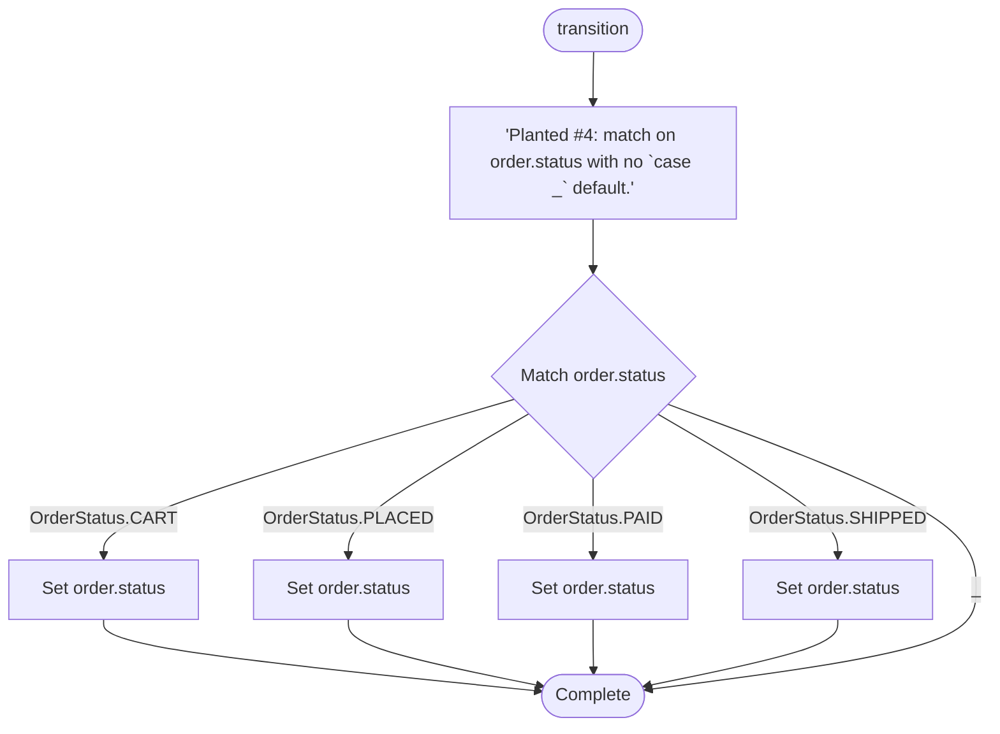

**Review points:**
- `Match order.status`: Decision has no explicit fallback: match order.status
- `Match order.status`: Declared OrderStatus members not handled for order.status: OrderStatus.CANCELLED, OrderStatus.DELIVERED, OrderStatus.REFUNDED

### capture_payment

`function` · `python` · `generic` · [`examples/shop/backend/payments_service.py:39`](../examples/shop/backend/payments_service.py#L39)

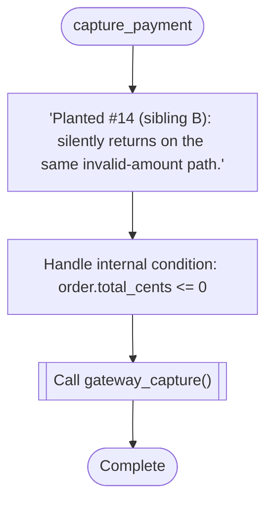

### charge

`function` · `python` · `generic` · [`examples/shop/backend/payments_service.py:19`](../examples/shop/backend/payments_service.py#L19)

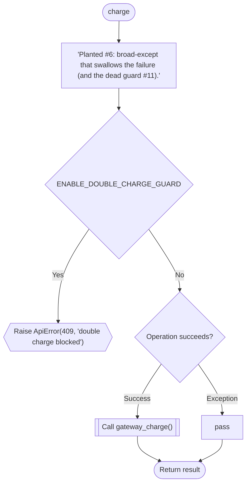

**Review points:**
- `Operation succeeds?`: Exception handler 'Exception' swallows the error

### handle_result

`event_handler` · `python` · `generic` · [`examples/shop/backend/payments_service.py:9`](../examples/shop/backend/payments_service.py#L9)

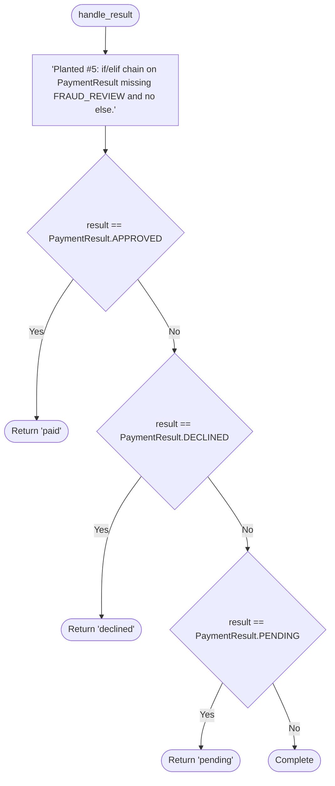

**Review points:**
- `result == PaymentResult.APPROVED`: Decision has no explicit fallback: if/elif on result
- `result == PaymentResult.APPROVED`: Declared PaymentResult members not handled for result: PaymentResult.FRAUD_REVIEW

### refund_payment

`function` · `python` · `generic` · [`examples/shop/backend/payments_service.py:30`](../examples/shop/backend/payments_service.py#L30)

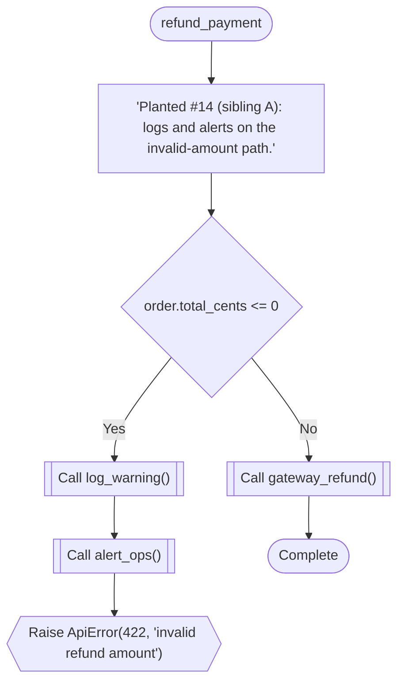

### authenticate

`function` · `python` · `generic` · [`examples/shop/backend/users_service.py:7`](../examples/shop/backend/users_service.py#L7)

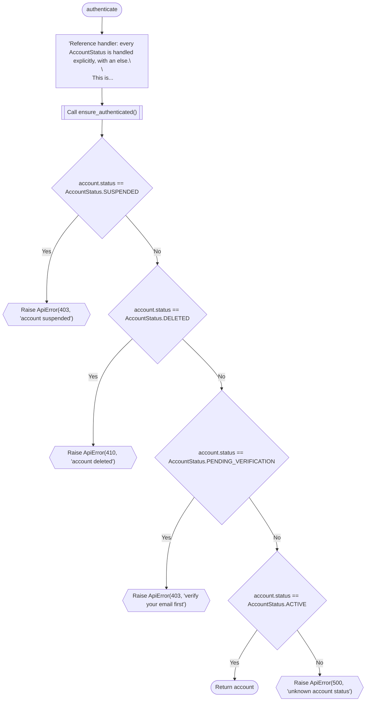

### load_profile

`function` · `python` · `generic` · [`examples/shop/backend/users_service.py:26`](../examples/shop/backend/users_service.py#L26)

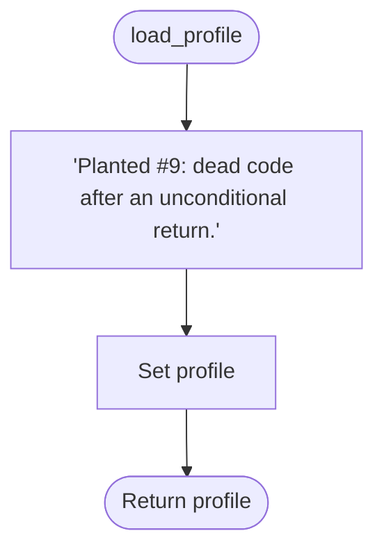

## Referenced Subflows

### Repository.fetch

`method` · `python` · `generic` · [`examples/demo/backend/users.py:9`](../examples/demo/backend/users.py#L9)

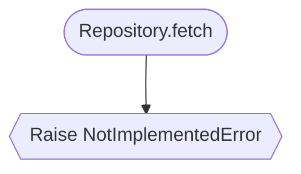

### loadUser

`function` · `typescript` · `generic` · [`examples/demo/frontend/app/api/users/route.ts:12`](../examples/demo/frontend/app/api/users/route.ts#L12)

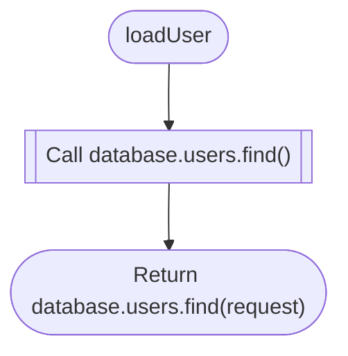
