# LogicChart Decision Flows

> Generated from source code. Do not edit this file manually.

- **Generated:** `2026-06-16T18:58:15.169745+00:00`
- **Source root:** `.`
- **Flows:** 56
- **Entry points:** 47
- **Findings:** 10 verified/inferred · 2 review-only
- **Scopes:** examples (56)

## Project Map

```mermaid
flowchart LR
  mflow_b25d2a1d236f82e9["AuthService.CanAccess"]
  mflow_b93c13042e022906["BillingService.settle"]
  mflow_8525290305d958ad["Catalog.reorderQuantity"]
  mflow_0f93659c9071bb28["Notifier.deliver"]
  mflow_856cb6768c88d69a["Notifier.queue_for_review"]
  mflow_559f316eb31f2a37["Notifier.send_email"]
  mflow_93f5681a653f0813["Notifier.send_push"]
  mflow_78196d7b3ea7c7fc["Notifier.send_sms"]
  mflow_99a2ebfc956e8b2c["Order.CanFulfill"]
  mflow_dc4e68214dc82497["Order.NextAction"]
  mflow_f6e3d6b7fe12b83f["get_user"]
  mflow_f35a3698106b0817["load_user"]
  mflow_87070415acedeac3["NativePolicy.ttl"]
  mflow_cec003912c47415e["edge.AdmissionControl.allow"]
  mflow_a660cd9b5ca2b50d["edge.AdmissionControl.retry_budget"]
  mflow_1dedc799025d3620["edge.AdmissionControl.route"]
  mflow_978d62b14f63de66["dispatch"]
  mflow_25d3313d33cbfef7["evict_index"]
  mflow_e18a3a55b37ae612["GET"]
  mflow_f74e7243a59c82e6["POST"]
  mflow_75546b2685371cc9["UsersPage"]
  mflow_b9ac3318caa675de["statusLabel"]
  mflow_22d844fbd2f31cd3["delete_user"]
  mflow_83e56dcea5b74bf9["purge_user"]
  mflow_1128bc0f809cd8d6["cancel"]
  mflow_f482b3026e3ea072["create"]
  mflow_4143ee18aecc0353["quick_order"]
  mflow_08a786dcbded8185["request_refund"]
  mflow_bf4bdbe9cee93085["change_email"]
  mflow_694730b8745d57de["get_profile"]
  mflow_836bfa1aef528de0["reset_password"]
  mflow_92971030a65d1410["ensure_authenticated"]
  mflow_93e6edefb10af9c5["require_role"]
  mflow_cfef4e8dba6238fd["summarize"]
  mflow_4e833d53a700855c["transition"]
  mflow_3b15514408bbb3ee["capture_payment"]
  mflow_3fb7f77aa3ec9fd5["charge"]
  mflow_d8c77f3ddc158387["handle_result"]
  mflow_7dfa5d0eac72e588["refund_payment"]
  mflow_c00fda52066729a3["authenticate"]
  mflow_68e9ed308389b179["load_profile"]
  mflow_aff7a7b992bc22b9["AccountPage"]
  mflow_f9ae842409a8d60d["processCheckout"]
  mflow_484f0b6804aa2ba6["POST"]
  mflow_082b27af25998831["GET"]
  mflow_a14422f6dd2875d3["OrdersPage"]
  mflow_288c098a2caf8a7a["middleware"]
  mflow_db1ea9fb5eca41b0["AuthService.IsPublic"]
  mflow_b25d2a1d236f82e9 --> mflow_db1ea9fb5eca41b0
  mflow_e04a1135f411a219["BillingService.capture"]
  mflow_b93c13042e022906 --> mflow_e04a1135f411a219
  mflow_05f47393e12ffed6["Catalog.restockTarget"]
  mflow_8525290305d958ad --> mflow_05f47393e12ffed6
  mflow_0f93659c9071bb28 --> mflow_559f316eb31f2a37
  mflow_0f93659c9071bb28 --> mflow_78196d7b3ea7c7fc
  mflow_0f93659c9071bb28 --> mflow_93f5681a653f0813
  mflow_0f93659c9071bb28 --> mflow_856cb6768c88d69a
  mflow_f6e3d6b7fe12b83f --> mflow_f35a3698106b0817
  mflow_6306314dcc318fc3["Repository.fetch"]
  mflow_f35a3698106b0817 --> mflow_6306314dcc318fc3
  mflow_cec003912c47415e --> mflow_1dedc799025d3620
  mflow_d290e937ff0a2ccc["guard"]
  mflow_978d62b14f63de66 --> mflow_d290e937ff0a2ccc
  mflow_7f73dcbb92742637["loadOrder"]
  mflow_e18a3a55b37ae612 --> mflow_7f73dcbb92742637
  mflow_5c518b0f2169bf38["loadUser"]
  mflow_f74e7243a59c82e6 --> mflow_5c518b0f2169bf38
  mflow_22d844fbd2f31cd3 --> mflow_93e6edefb10af9c5
  mflow_c00fda52066729a3 --> mflow_92971030a65d1410
  mflow_484f0b6804aa2ba6 --> mflow_7f73dcbb92742637
```

## Findings

- **INFO · INFERRED · no_op_branch** Branch 'Yes' has an empty body ([`examples/shop/backend/orders_service.py:22`](../examples/shop/backend/orders_service.py#L22))
- **INFO · INFERRED · logging_asymmetry** Guard 'order.total\_cents \<= 0' is logged in a sibling flow but silent here ([`examples/shop/backend/payments_service.py:41`](../examples/shop/backend/payments_service.py#L41))
- **WARNING · INFERRED · enum_exhaustiveness** Declared AccountStatus members not handled for account.status: AccountStatus.ACTIVE, AccountStatus.PENDING\_VERIFICATION ([`examples/shop/backend/api/users_routes.py:15`](../examples/shop/backend/api/users_routes.py#L15))
- **WARNING · INFERRED · enum_exhaustiveness** Declared OrderStatus members not handled for order.status: OrderStatus.CANCELLED, OrderStatus.DELIVERED, OrderStatus.REFUNDED ([`examples/shop/backend/orders_service.py:8`](../examples/shop/backend/orders_service.py#L8))
- **WARNING · INFERRED · enum_exhaustiveness** Declared PaymentResult members not handled for result: PaymentResult.FRAUD\_REVIEW ([`examples/shop/backend/payments_service.py:11`](../examples/shop/backend/payments_service.py#L11))
- **WARNING · INFERRED · enum_exhaustiveness** Declared UserStatus members not handled for user.status: UserStatus.DELETED ([`examples/demo/frontend/app/api/users/route.ts:7`](../examples/demo/frontend/app/api/users/route.ts#L7))
- **WARNING · INFERRED · broad_except_swallow** Exception handler 'Error' swallows the error ([`examples/shop/frontend/app/api/checkout/route.ts:5`](../examples/shop/frontend/app/api/checkout/route.ts#L5))
- **WARNING · INFERRED · broad_except_swallow** Exception handler 'Exception' swallows the error ([`examples/shop/backend/payments_service.py:23`](../examples/shop/backend/payments_service.py#L23))
- **WARNING · INFERRED · dead_guard** Guard on the constant ENABLE\_DOUBLE\_CHARGE\_GUARD is always False ([`examples/shop/backend/payments_service.py:21`](../examples/shop/backend/payments_service.py#L21))
- **WARNING · INFERRED · dead_code** Unreachable code after all paths return or raise \(line 30\) ([`examples/shop/backend/users_service.py:30`](../examples/shop/backend/users_service.py#L30))

<details>
<summary>Review-only - 2 POTENTIAL_GAP (heuristic candidates, not confirmed)</summary>

- **WARNING · POTENTIAL_GAP · missing_branch** Decision has no explicit fallback: if/elif on order.status ([`examples/shop/frontend/app/orders/page.tsx:3`](../examples/shop/frontend/app/orders/page.tsx#L3))
- **WARNING · POTENTIAL_GAP · missing_branch** Decision has no explicit fallback: switch order.status ([`examples/shop/frontend/app/api/orders/route.ts:6`](../examples/shop/frontend/app/api/orders/route.ts#L6))

</details>

## Entry Point Flows

### AuthService.CanAccess

`method` · `csharp` · `generic` · [`examples/demo/backend/auth/AuthService.cs:12`](../examples/demo/backend/auth/AuthService.cs#L12)

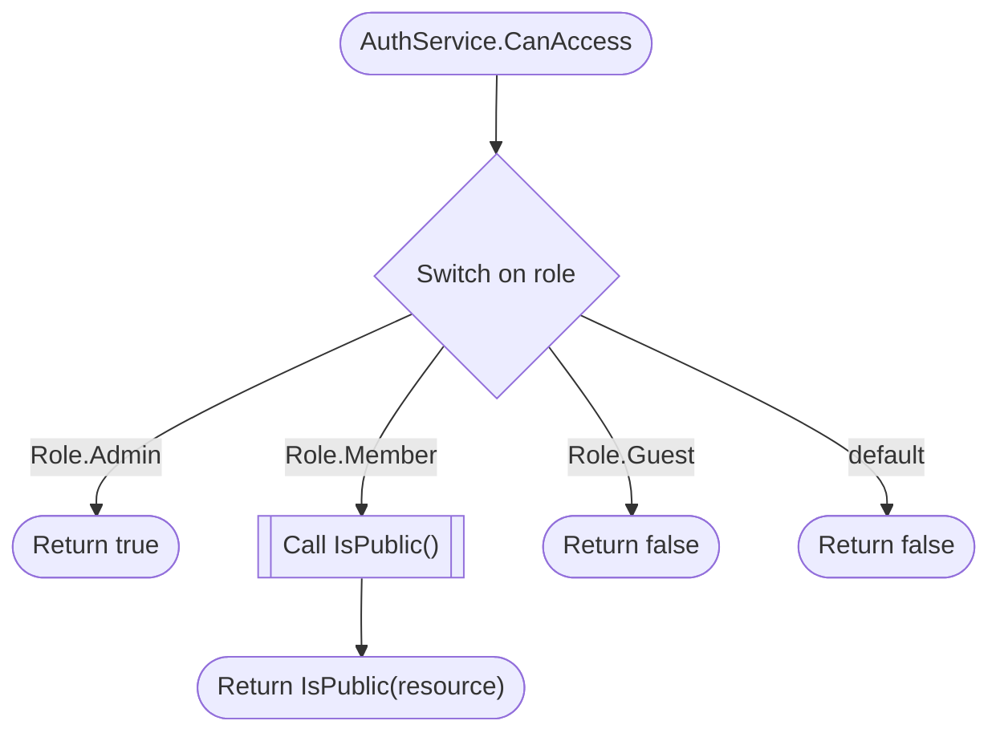

### BillingService.settle

`method` · `java` · `generic` · [`examples/demo/backend/billing/BillingService.java:13`](../examples/demo/backend/billing/BillingService.java#L13)

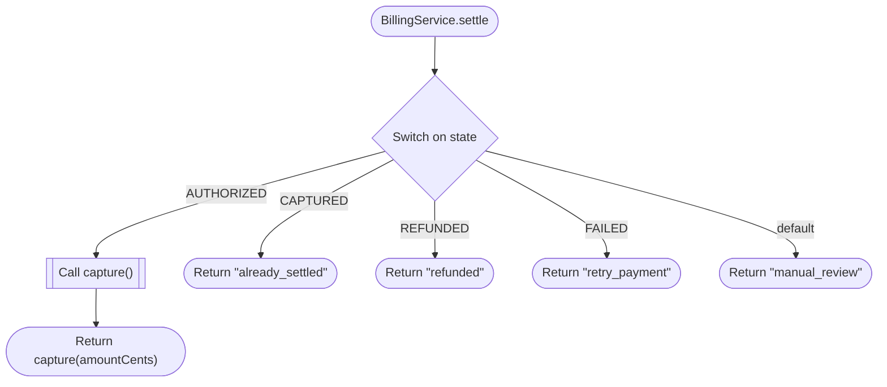

### Catalog.reorderQuantity

`method` · `php` · `generic` · [`examples/demo/backend/catalog/Catalog.php:7`](../examples/demo/backend/catalog/Catalog.php#L7)

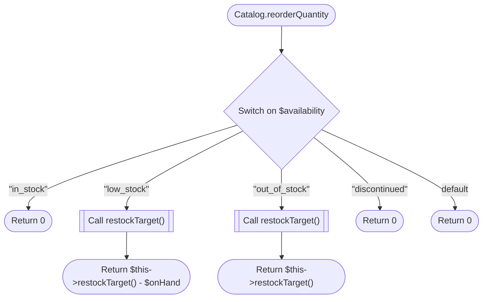

### Notifier.deliver

`method` · `ruby` · `generic` · [`examples/demo/backend/notifications/notifier.rb:4`](../examples/demo/backend/notifications/notifier.rb#L4)

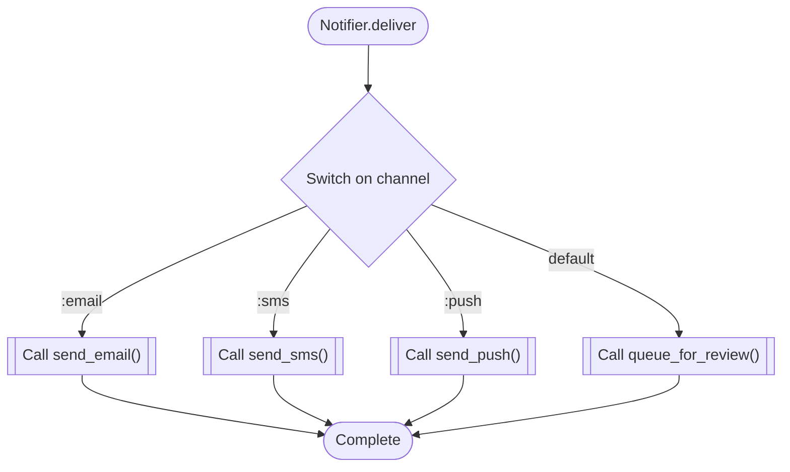

### Notifier.queue\_for\_review

`method` · `ruby` · `generic` · [`examples/demo/backend/notifications/notifier.rb:31`](../examples/demo/backend/notifications/notifier.rb#L31)


### Notifier.send\_email

`method` · `ruby` · `generic` · [`examples/demo/backend/notifications/notifier.rb:19`](../examples/demo/backend/notifications/notifier.rb#L19)

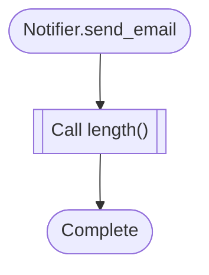

### Notifier.send\_push

`method` · `ruby` · `generic` · [`examples/demo/backend/notifications/notifier.rb:27`](../examples/demo/backend/notifications/notifier.rb#L27)


### Notifier.send\_sms

`method` · `ruby` · `generic` · [`examples/demo/backend/notifications/notifier.rb:23`](../examples/demo/backend/notifications/notifier.rb#L23)

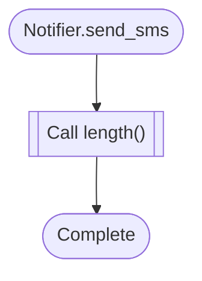

### Order.CanFulfill

`method` · `go` · `generic` · [`examples/demo/backend/orders/service.go:38`](../examples/demo/backend/orders/service.go#L38)

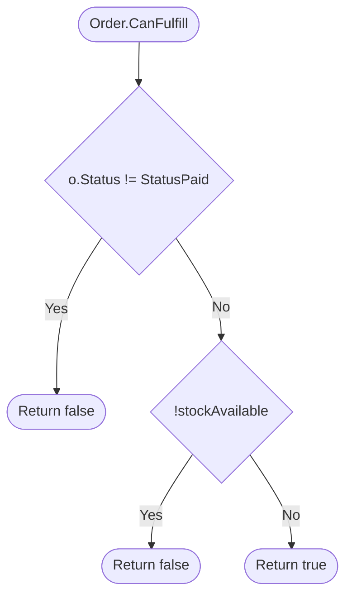

### Order.NextAction

`method` · `go` · `generic` · [`examples/demo/backend/orders/service.go:20`](../examples/demo/backend/orders/service.go#L20)

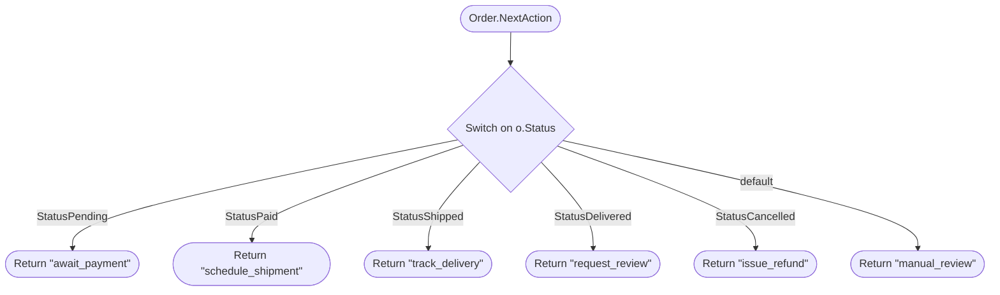

### get\_user

`route` · `python` · `fastapi` · [`examples/demo/backend/users.py:23`](../examples/demo/backend/users.py#L23)


### load\_user

`function` · `python` · `generic` · [`examples/demo/backend/users.py:32`](../examples/demo/backend/users.py#L32)


### NativePolicy.ttl

`method` · `cpp` · `generic` · [`examples/demo/edge/native/policy.cpp:11`](../examples/demo/edge/native/policy.cpp#L11)

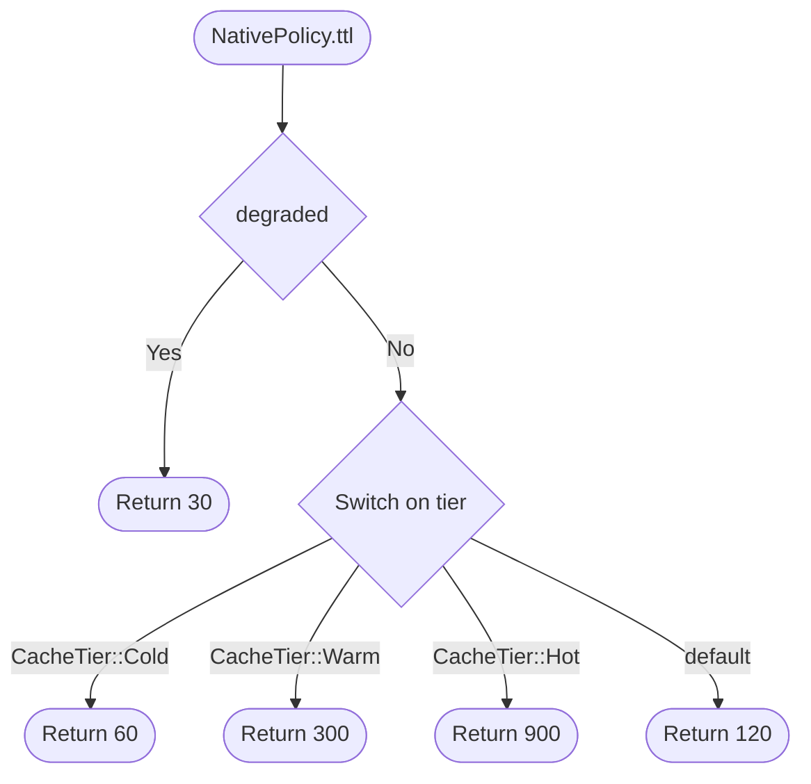

### edge.AdmissionControl.allow

`method` · `cpp` · `generic` · [`examples/demo/edge/native/admission.cpp:13`](../examples/demo/edge/native/admission.cpp#L13)

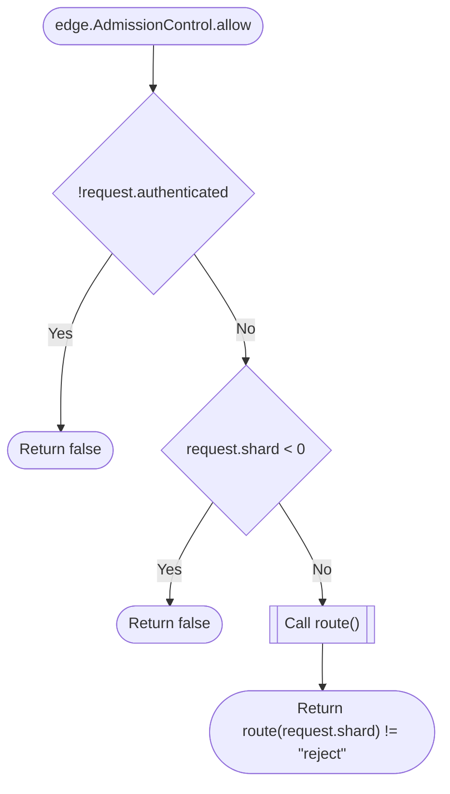

### edge.AdmissionControl.retry\_budget

`method` · `cpp` · `generic` · [`examples/demo/edge/native/admission.cpp:34`](../examples/demo/edge/native/admission.cpp#L34)

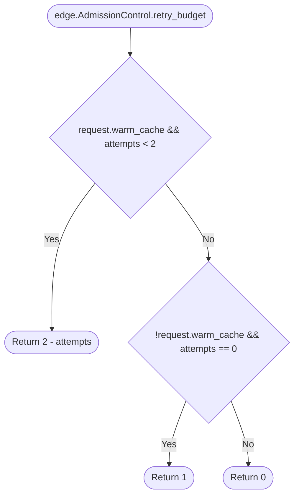

### edge.AdmissionControl.route

`method` · `cpp` · `generic` · [`examples/demo/edge/native/admission.cpp:23`](../examples/demo/edge/native/admission.cpp#L23)

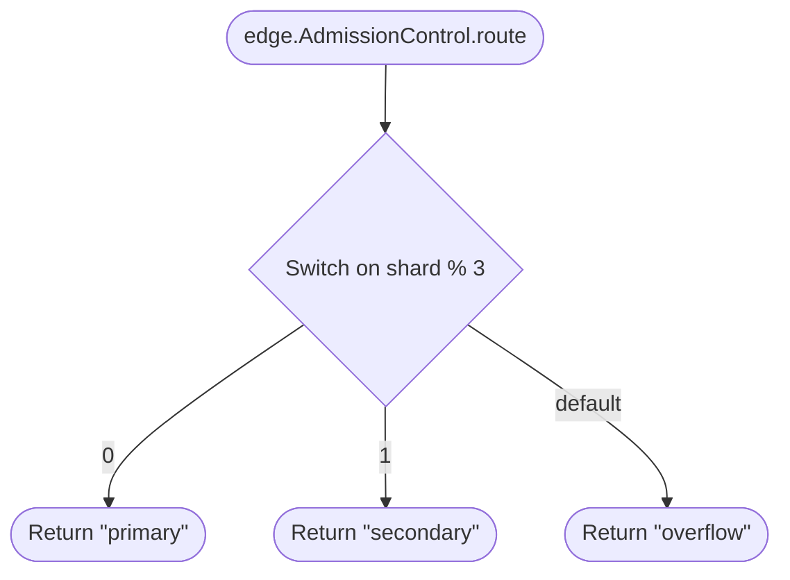

### dispatch

`function` · `rust` · `generic` · [`examples/demo/edge/router/src/lib.rs:10`](../examples/demo/edge/router/src/lib.rs#L10)

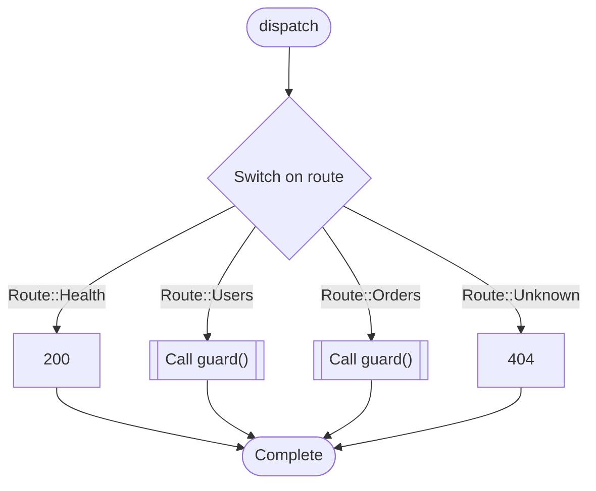

### evict\_index

`function` · `c` · `generic` · [`examples/demo/edge/cache.c:10`](../examples/demo/edge/cache.c#L10)

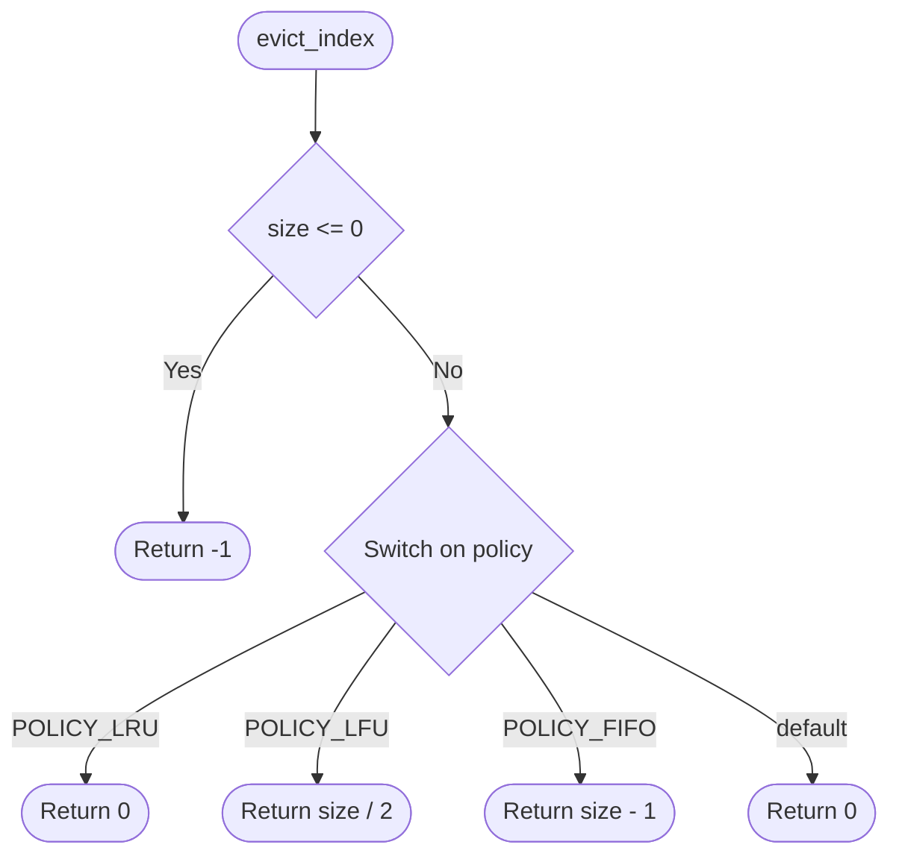

### GET

`route` · `typescript` · `nextjs` · [`examples/demo/frontend/app/api/orders/route.ts:3`](../examples/demo/frontend/app/api/orders/route.ts#L3)

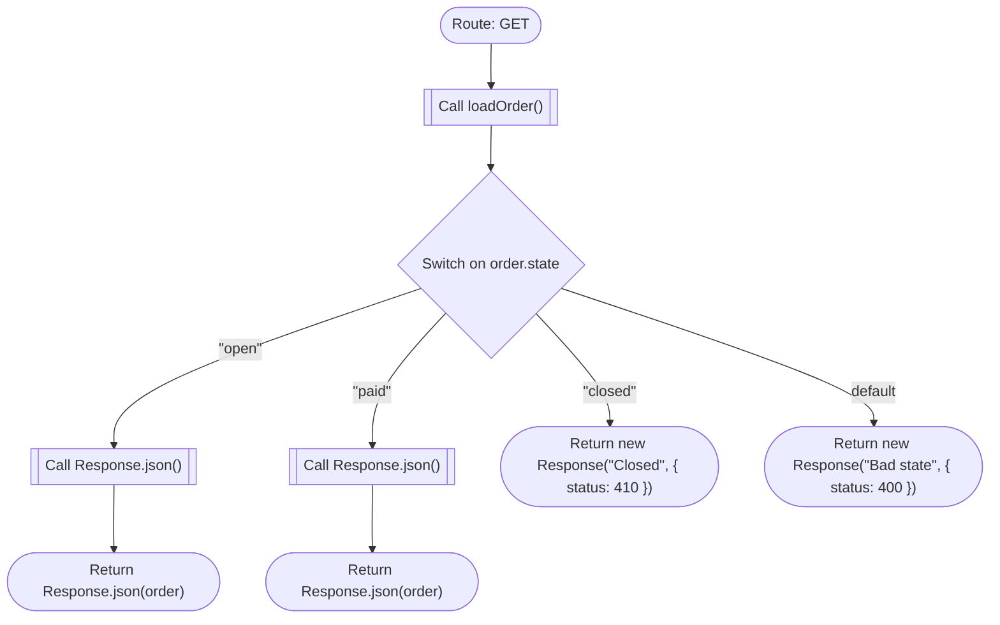

### POST

`route` · `typescript` · `nextjs` · [`examples/demo/frontend/app/api/users/route.ts:4`](../examples/demo/frontend/app/api/users/route.ts#L4)

```mermaid
flowchart TD
  mflow_f74e7243a59c82e6_n1(["Route: POST"])
  mflow_f74e7243a59c82e6_n2[["Call loadUser()"]]
  mflow_f74e7243a59c82e6_n3{"Switch on user.status"}
  mflow_f74e7243a59c82e6_n4[["Call Response.json()"]]
  mflow_f74e7243a59c82e6_n5(["Return Response.json(user)"])
  mflow_f74e7243a59c82e6_n6(["Return new Response(&quot;Blocked&quot;, { status: 403 })"])
  mflow_f74e7243a59c82e6_n7(["Complete"])
  mflow_f74e7243a59c82e6_n1 --> mflow_f74e7243a59c82e6_n2
  mflow_f74e7243a59c82e6_n2 --> mflow_f74e7243a59c82e6_n3
  mflow_f74e7243a59c82e6_n3 -->|"UserStatus.ACTIVE"| mflow_f74e7243a59c82e6_n4
  mflow_f74e7243a59c82e6_n4 --> mflow_f74e7243a59c82e6_n5
  mflow_f74e7243a59c82e6_n3 -->|"UserStatus.SUSPENDED"| mflow_f74e7243a59c82e6_n6
  mflow_f74e7243a59c82e6_n3 -->|"default"| mflow_f74e7243a59c82e6_n7
```

**Review points:**
- `Switch on user.status`: Declared UserStatus members not handled for user.status: UserStatus.DELETED

### UsersPage

`component` · `typescript` · `nextjs` · [`examples/demo/frontend/app/users/page.tsx:1`](../examples/demo/frontend/app/users/page.tsx#L1)

```mermaid
flowchart TD
  mflow_75546b2685371cc9_n1(["Component: UsersPage"])
  mflow_75546b2685371cc9_n2{"!user.isAuthorized"}
  mflow_75546b2685371cc9_n3(["Return &lt;LoginPrompt /&gt;"])
  mflow_75546b2685371cc9_n4(["Return &lt;UserDashboard user={user} /&gt;"])
  mflow_75546b2685371cc9_n1 --> mflow_75546b2685371cc9_n2
  mflow_75546b2685371cc9_n2 -->|"Yes"| mflow_75546b2685371cc9_n3
  mflow_75546b2685371cc9_n2 -->|"No"| mflow_75546b2685371cc9_n4
```

### statusLabel

`function` · `javascript` · `generic` · [`examples/demo/frontend/lib/status.js:3`](../examples/demo/frontend/lib/status.js#L3)

```mermaid
flowchart TD
  mflow_b9ac3318caa675de_n1(["statusLabel"])
  mflow_b9ac3318caa675de_n2{"Switch on status"}
  mflow_b9ac3318caa675de_n3(["Return &quot;Active&quot;"])
  mflow_b9ac3318caa675de_n4(["Return &quot;Suspended&quot;"])
  mflow_b9ac3318caa675de_n5(["Return &quot;Deleted&quot;"])
  mflow_b9ac3318caa675de_n6(["Return &quot;Unknown&quot;"])
  mflow_b9ac3318caa675de_n1 --> mflow_b9ac3318caa675de_n2
  mflow_b9ac3318caa675de_n2 -->|"&quot;active&quot;"| mflow_b9ac3318caa675de_n3
  mflow_b9ac3318caa675de_n2 -->|"&quot;suspended&quot;"| mflow_b9ac3318caa675de_n4
  mflow_b9ac3318caa675de_n2 -->|"&quot;deleted&quot;"| mflow_b9ac3318caa675de_n5
  mflow_b9ac3318caa675de_n2 -->|"default"| mflow_b9ac3318caa675de_n6
```

### delete\_user

`function` · `python` · `generic` · [`examples/shop/backend/api/admin_routes.py:7`](../examples/shop/backend/api/admin_routes.py#L7)

```mermaid
flowchart TD
  mflow_22d844fbd2f31cd3_n1(["delete_user"])
  mflow_22d844fbd2f31cd3_n2["'Control: gated on the ADMIN role before the destructive action.'"]
  mflow_22d844fbd2f31cd3_n3[["Call require_role()"]]
  mflow_22d844fbd2f31cd3_n4[["Call do_delete()"]]
  mflow_22d844fbd2f31cd3_n5(["Complete"])
  mflow_22d844fbd2f31cd3_n1 --> mflow_22d844fbd2f31cd3_n2
  mflow_22d844fbd2f31cd3_n2 --> mflow_22d844fbd2f31cd3_n3
  mflow_22d844fbd2f31cd3_n3 --> mflow_22d844fbd2f31cd3_n4
  mflow_22d844fbd2f31cd3_n4 --> mflow_22d844fbd2f31cd3_n5
```

### purge\_user

`function` · `python` · `generic` · [`examples/shop/backend/api/admin_routes.py:13`](../examples/shop/backend/api/admin_routes.py#L13)

```mermaid
flowchart TD
  mflow_83e56dcea5b74bf9_n1(["purge_user"])
  mflow_83e56dcea5b74bf9_n2["'Planted #12: the require_role gate its sibling delete_user has is missing.'"]
  mflow_83e56dcea5b74bf9_n3[["Call do_purge()"]]
  mflow_83e56dcea5b74bf9_n4(["Complete"])
  mflow_83e56dcea5b74bf9_n1 --> mflow_83e56dcea5b74bf9_n2
  mflow_83e56dcea5b74bf9_n2 --> mflow_83e56dcea5b74bf9_n3
  mflow_83e56dcea5b74bf9_n3 --> mflow_83e56dcea5b74bf9_n4
```

### cancel

`function` · `python` · `generic` · [`examples/shop/backend/api/orders_routes.py:6`](../examples/shop/backend/api/orders_routes.py#L6)

```mermaid
flowchart TD
  mflow_1128bc0f809cd8d6_n1(["cancel"])
  mflow_1128bc0f809cd8d6_n2["'Refundable set {PLACED, PAID}; rejects with 404 - sibling of request_refund.'"]
  mflow_1128bc0f809cd8d6_n3{"order.status not in (OrderStatus.PLACED, OrderStatus.PAID)"}
  mflow_1128bc0f809cd8d6_n4{{"Raise ApiError(404, 'order is not cancellable')"}}
  mflow_1128bc0f809cd8d6_n5[["Call do_cancel()"]]
  mflow_1128bc0f809cd8d6_n6(["Complete"])
  mflow_1128bc0f809cd8d6_n1 --> mflow_1128bc0f809cd8d6_n2
  mflow_1128bc0f809cd8d6_n2 --> mflow_1128bc0f809cd8d6_n3
  mflow_1128bc0f809cd8d6_n3 -->|"Yes"| mflow_1128bc0f809cd8d6_n4
  mflow_1128bc0f809cd8d6_n3 -->|"No"| mflow_1128bc0f809cd8d6_n5
  mflow_1128bc0f809cd8d6_n5 --> mflow_1128bc0f809cd8d6_n6
```

### create

`function` · `python` · `generic` · [`examples/shop/backend/api/orders_routes.py:21`](../examples/shop/backend/api/orders_routes.py#L21)

```mermaid
flowchart TD
  mflow_f482b3026e3ea072_n1(["create"])
  mflow_f482b3026e3ea072_n2["'Control: validates before writing.'"]
  mflow_f482b3026e3ea072_n3{"not has_items(payload)"}
  mflow_f482b3026e3ea072_n4{{"Raise ApiError(422, 'an order needs at least one item')"}}
  mflow_f482b3026e3ea072_n5[["Call build_order()"]]
  mflow_f482b3026e3ea072_n6(["Return build_order(payload)"])
  mflow_f482b3026e3ea072_n1 --> mflow_f482b3026e3ea072_n2
  mflow_f482b3026e3ea072_n2 --> mflow_f482b3026e3ea072_n3
  mflow_f482b3026e3ea072_n3 -->|"Yes"| mflow_f482b3026e3ea072_n4
  mflow_f482b3026e3ea072_n3 -->|"No"| mflow_f482b3026e3ea072_n5
  mflow_f482b3026e3ea072_n5 --> mflow_f482b3026e3ea072_n6
```

### quick\_order

`function` · `python` · `generic` · [`examples/shop/backend/api/orders_routes.py:28`](../examples/shop/backend/api/orders_routes.py#L28)

```mermaid
flowchart TD
  mflow_4143ee18aecc0353_n1(["quick_order"])
  mflow_4143ee18aecc0353_n2["'Planted #13: the validation guard create() has is missing here.'"]
  mflow_4143ee18aecc0353_n3[["Call build_order()"]]
  mflow_4143ee18aecc0353_n4(["Return build_order(payload)"])
  mflow_4143ee18aecc0353_n1 --> mflow_4143ee18aecc0353_n2
  mflow_4143ee18aecc0353_n2 --> mflow_4143ee18aecc0353_n3
  mflow_4143ee18aecc0353_n3 --> mflow_4143ee18aecc0353_n4
```

### request\_refund

`function` · `python` · `generic` · [`examples/shop/backend/api/orders_routes.py:13`](../examples/shop/backend/api/orders_routes.py#L13)

```mermaid
flowchart TD
  mflow_08a786dcbded8185_n1(["request_refund"])
  mflow_08a786dcbded8185_n2["'Planted #7/#8: a divergent refundable set {PAID, SHIPPED, DELIVERED} and a 409\\n where t..."]
  mflow_08a786dcbded8185_n3{"order.status not in (OrderStatus.PAID, OrderStatus.SHIPPED, OrderStatus.DELIVERED)"}
  mflow_08a786dcbded8185_n4{{"Raise ApiError(409, 'order is not refundable')"}}
  mflow_08a786dcbded8185_n5[["Call do_refund()"]]
  mflow_08a786dcbded8185_n6(["Complete"])
  mflow_08a786dcbded8185_n1 --> mflow_08a786dcbded8185_n2
  mflow_08a786dcbded8185_n2 --> mflow_08a786dcbded8185_n3
  mflow_08a786dcbded8185_n3 -->|"Yes"| mflow_08a786dcbded8185_n4
  mflow_08a786dcbded8185_n3 -->|"No"| mflow_08a786dcbded8185_n5
  mflow_08a786dcbded8185_n5 --> mflow_08a786dcbded8185_n6
```

### change\_email

`function` · `python` · `generic` · [`examples/shop/backend/api/users_routes.py:13`](../examples/shop/backend/api/users_routes.py#L13)

```mermaid
flowchart TD
  mflow_bf4bdbe9cee93085_n1(["change_email"])
  mflow_bf4bdbe9cee93085_n2["'Planted #3: dispatches on AccountStatus but omits ACTIVE and PENDING_VERIFICATION.'"]
  mflow_bf4bdbe9cee93085_n3{"account.status == AccountStatus.SUSPENDED"}
  mflow_bf4bdbe9cee93085_n4{{"Raise ApiError(403, 'account suspended')"}}
  mflow_bf4bdbe9cee93085_n5{"account.status == AccountStatus.DELETED"}
  mflow_bf4bdbe9cee93085_n6{{"Raise ApiError(410, 'account deleted')"}}
  mflow_bf4bdbe9cee93085_n7[["Call update_email()"]]
  mflow_bf4bdbe9cee93085_n8(["Complete"])
  mflow_bf4bdbe9cee93085_n1 --> mflow_bf4bdbe9cee93085_n2
  mflow_bf4bdbe9cee93085_n2 --> mflow_bf4bdbe9cee93085_n3
  mflow_bf4bdbe9cee93085_n3 -->|"Yes"| mflow_bf4bdbe9cee93085_n4
  mflow_bf4bdbe9cee93085_n3 -->|"No"| mflow_bf4bdbe9cee93085_n5
  mflow_bf4bdbe9cee93085_n5 -->|"Yes"| mflow_bf4bdbe9cee93085_n6
  mflow_bf4bdbe9cee93085_n5 -->|"No"| mflow_bf4bdbe9cee93085_n7
  mflow_bf4bdbe9cee93085_n7 --> mflow_bf4bdbe9cee93085_n8
```

**Review points:**
- `account.status == AccountStatus.SUSPENDED`: Declared AccountStatus members not handled for account.status: AccountStatus.ACTIVE, AccountStatus.PENDING\_VERIFICATION

### get\_profile

`function` · `python` · `generic` · [`examples/shop/backend/api/users_routes.py:22`](../examples/shop/backend/api/users_routes.py#L22)

```mermaid
flowchart TD
  mflow_694730b8745d57de_n1(["get_profile"])
  mflow_694730b8745d57de_n2["'Control: a single-value guard, correctly not flagged.'"]
  mflow_694730b8745d57de_n3{"account.status == AccountStatus.DELETED"}
  mflow_694730b8745d57de_n4{{"Raise ApiError(410, 'account deleted')"}}
  mflow_694730b8745d57de_n5(["Return {'id': account.id, 'role': account.role.value}"])
  mflow_694730b8745d57de_n1 --> mflow_694730b8745d57de_n2
  mflow_694730b8745d57de_n2 --> mflow_694730b8745d57de_n3
  mflow_694730b8745d57de_n3 -->|"Yes"| mflow_694730b8745d57de_n4
  mflow_694730b8745d57de_n3 -->|"No"| mflow_694730b8745d57de_n5
```

### reset\_password

`function` · `python` · `generic` · [`examples/shop/backend/api/users_routes.py:6`](../examples/shop/backend/api/users_routes.py#L6)

```mermaid
flowchart TD
  mflow_836bfa1aef528de0_n1(["reset_password"])
  mflow_836bfa1aef528de0_n2["'Control: a single-value guard (block suspended), not an exhaustive dispatch.'"]
  mflow_836bfa1aef528de0_n3{"account.status == AccountStatus.SUSPENDED"}
  mflow_836bfa1aef528de0_n4{{"Raise ApiError(403, 'suspended accounts cannot reset their password')"}}
  mflow_836bfa1aef528de0_n5[["Call issue_reset_token()"]]
  mflow_836bfa1aef528de0_n6(["Return issue_reset_token(account)"])
  mflow_836bfa1aef528de0_n1 --> mflow_836bfa1aef528de0_n2
  mflow_836bfa1aef528de0_n2 --> mflow_836bfa1aef528de0_n3
  mflow_836bfa1aef528de0_n3 -->|"Yes"| mflow_836bfa1aef528de0_n4
  mflow_836bfa1aef528de0_n3 -->|"No"| mflow_836bfa1aef528de0_n5
  mflow_836bfa1aef528de0_n5 --> mflow_836bfa1aef528de0_n6
```

### ensure\_authenticated

`function` · `python` · `generic` · [`examples/shop/backend/auth.py:12`](../examples/shop/backend/auth.py#L12)

```mermaid
flowchart TD
  mflow_92971030a65d1410_n1(["ensure_authenticated"])
  mflow_92971030a65d1410_n2["'Ensure a request is authenticated.'"]
  mflow_92971030a65d1410_n3{"account is None"}
  mflow_92971030a65d1410_n4{{"Raise ApiError(401, 'authentication required')"}}
  mflow_92971030a65d1410_n5(["Return account"])
  mflow_92971030a65d1410_n1 --> mflow_92971030a65d1410_n2
  mflow_92971030a65d1410_n2 --> mflow_92971030a65d1410_n3
  mflow_92971030a65d1410_n3 -->|"Yes"| mflow_92971030a65d1410_n4
  mflow_92971030a65d1410_n3 -->|"No"| mflow_92971030a65d1410_n5
```

### require\_role

`function` · `python` · `generic` · [`examples/shop/backend/auth.py:6`](../examples/shop/backend/auth.py#L6)

```mermaid
flowchart TD
  mflow_93e6edefb10af9c5_n1(["require_role"])
  mflow_93e6edefb10af9c5_n2["'Ensure the account holds the required role, else raise ApiError(403).'"]
  mflow_93e6edefb10af9c5_n3{"account.role != required"}
  mflow_93e6edefb10af9c5_n4{{"Raise ApiError(403, f'requires {required.value}')"}}
  mflow_93e6edefb10af9c5_n5(["Complete"])
  mflow_93e6edefb10af9c5_n1 --> mflow_93e6edefb10af9c5_n2
  mflow_93e6edefb10af9c5_n2 --> mflow_93e6edefb10af9c5_n3
  mflow_93e6edefb10af9c5_n3 -->|"Yes"| mflow_93e6edefb10af9c5_n4
  mflow_93e6edefb10af9c5_n3 -->|"No"| mflow_93e6edefb10af9c5_n5
```

### summarize

`function` · `python` · `generic` · [`examples/shop/backend/orders_service.py:19`](../examples/shop/backend/orders_service.py#L19)

```mermaid
flowchart TD
  mflow_cfef4e8dba6238fd_n1(["summarize"])
  mflow_cfef4e8dba6238fd_n2["'Planted #10: a no-op branch (the refunded case does nothing).'"]
  mflow_cfef4e8dba6238fd_n3["Set summary"]
  mflow_cfef4e8dba6238fd_n4{"order.status == OrderStatus.REFUNDED"}
  mflow_cfef4e8dba6238fd_n5["pass"]
  mflow_cfef4e8dba6238fd_n6["Set summary['status']"]
  mflow_cfef4e8dba6238fd_n7(["Return summary"])
  mflow_cfef4e8dba6238fd_n1 --> mflow_cfef4e8dba6238fd_n2
  mflow_cfef4e8dba6238fd_n2 --> mflow_cfef4e8dba6238fd_n3
  mflow_cfef4e8dba6238fd_n3 --> mflow_cfef4e8dba6238fd_n4
  mflow_cfef4e8dba6238fd_n4 -->|"Yes"| mflow_cfef4e8dba6238fd_n5
  mflow_cfef4e8dba6238fd_n4 -->|"No"| mflow_cfef4e8dba6238fd_n6
  mflow_cfef4e8dba6238fd_n5 --> mflow_cfef4e8dba6238fd_n7
  mflow_cfef4e8dba6238fd_n6 --> mflow_cfef4e8dba6238fd_n7
```

**Review points:**
- `order.status == OrderStatus.REFUNDED`: Branch 'Yes' has an empty body

### transition

`function` · `python` · `generic` · [`examples/shop/backend/orders_service.py:6`](../examples/shop/backend/orders_service.py#L6)

```mermaid
flowchart TD
  mflow_4e833d53a700855c_n1(["transition"])
  mflow_4e833d53a700855c_n2["'Planted #4: match on order.status with no `case _` default.'"]
  mflow_4e833d53a700855c_n3{"Match order.status"}
  mflow_4e833d53a700855c_n4["Set order.status"]
  mflow_4e833d53a700855c_n5["Set order.status"]
  mflow_4e833d53a700855c_n6["Set order.status"]
  mflow_4e833d53a700855c_n7["Set order.status"]
  mflow_4e833d53a700855c_n8(["Complete"])
  mflow_4e833d53a700855c_n1 --> mflow_4e833d53a700855c_n2
  mflow_4e833d53a700855c_n2 --> mflow_4e833d53a700855c_n3
  mflow_4e833d53a700855c_n3 -->|"OrderStatus.CART"| mflow_4e833d53a700855c_n4
  mflow_4e833d53a700855c_n3 -->|"OrderStatus.PLACED"| mflow_4e833d53a700855c_n5
  mflow_4e833d53a700855c_n3 -->|"OrderStatus.PAID"| mflow_4e833d53a700855c_n6
  mflow_4e833d53a700855c_n3 -->|"OrderStatus.SHIPPED"| mflow_4e833d53a700855c_n7
  mflow_4e833d53a700855c_n4 --> mflow_4e833d53a700855c_n8
  mflow_4e833d53a700855c_n5 --> mflow_4e833d53a700855c_n8
  mflow_4e833d53a700855c_n6 --> mflow_4e833d53a700855c_n8
  mflow_4e833d53a700855c_n7 --> mflow_4e833d53a700855c_n8
  mflow_4e833d53a700855c_n3 -->|"_"| mflow_4e833d53a700855c_n8
```

**Review points:**
- `Match order.status`: Declared OrderStatus members not handled for order.status: OrderStatus.CANCELLED, OrderStatus.DELIVERED, OrderStatus.REFUNDED

### capture\_payment

`function` · `python` · `generic` · [`examples/shop/backend/payments_service.py:39`](../examples/shop/backend/payments_service.py#L39)

```mermaid
flowchart TD
  mflow_3b15514408bbb3ee_n1(["capture_payment"])
  mflow_3b15514408bbb3ee_n2["'Planted #14 (sibling B): silently returns on the same invalid-amount path.'"]
  mflow_3b15514408bbb3ee_n3{"order.total_cents &lt;= 0"}
  mflow_3b15514408bbb3ee_n4(["Return"])
  mflow_3b15514408bbb3ee_n5[["Call gateway_capture()"]]
  mflow_3b15514408bbb3ee_n6(["Complete"])
  mflow_3b15514408bbb3ee_n1 --> mflow_3b15514408bbb3ee_n2
  mflow_3b15514408bbb3ee_n2 --> mflow_3b15514408bbb3ee_n3
  mflow_3b15514408bbb3ee_n3 -->|"Yes"| mflow_3b15514408bbb3ee_n4
  mflow_3b15514408bbb3ee_n3 -->|"No"| mflow_3b15514408bbb3ee_n5
  mflow_3b15514408bbb3ee_n5 --> mflow_3b15514408bbb3ee_n6
```

**Review points:**
- `order.total_cents <= 0`: Guard 'order.total\_cents \<= 0' is logged in a sibling flow but silent here

### charge

`function` · `python` · `generic` · [`examples/shop/backend/payments_service.py:19`](../examples/shop/backend/payments_service.py#L19)

```mermaid
flowchart TD
  mflow_3fb7f77aa3ec9fd5_n1(["charge"])
  mflow_3fb7f77aa3ec9fd5_n2["'Planted #6: broad-except that swallows the failure (and the dead guard #11).'"]
  mflow_3fb7f77aa3ec9fd5_n3{"ENABLE_DOUBLE_CHARGE_GUARD"}
  mflow_3fb7f77aa3ec9fd5_n4{{"Raise ApiError(409, 'double charge blocked')"}}
  mflow_3fb7f77aa3ec9fd5_n5{"Operation succeeds?"}
  mflow_3fb7f77aa3ec9fd5_n6[["Call gateway_charge()"]]
  mflow_3fb7f77aa3ec9fd5_n7["pass"]
  mflow_3fb7f77aa3ec9fd5_n8(["Return result"])
  mflow_3fb7f77aa3ec9fd5_n1 --> mflow_3fb7f77aa3ec9fd5_n2
  mflow_3fb7f77aa3ec9fd5_n2 --> mflow_3fb7f77aa3ec9fd5_n3
  mflow_3fb7f77aa3ec9fd5_n3 -->|"Yes"| mflow_3fb7f77aa3ec9fd5_n4
  mflow_3fb7f77aa3ec9fd5_n3 -->|"No"| mflow_3fb7f77aa3ec9fd5_n5
  mflow_3fb7f77aa3ec9fd5_n5 -->|"Success"| mflow_3fb7f77aa3ec9fd5_n6
  mflow_3fb7f77aa3ec9fd5_n5 -->|"Exception"| mflow_3fb7f77aa3ec9fd5_n7
  mflow_3fb7f77aa3ec9fd5_n6 --> mflow_3fb7f77aa3ec9fd5_n8
  mflow_3fb7f77aa3ec9fd5_n7 --> mflow_3fb7f77aa3ec9fd5_n8
```

**Review points:**
- `Operation succeeds?`: Exception handler 'Exception' swallows the error
- `ENABLE_DOUBLE_CHARGE_GUARD`: Guard on the constant ENABLE\_DOUBLE\_CHARGE\_GUARD is always False

### handle\_result

`event_handler` · `python` · `generic` · [`examples/shop/backend/payments_service.py:9`](../examples/shop/backend/payments_service.py#L9)

```mermaid
flowchart TD
  mflow_d8c77f3ddc158387_n1(["handle_result"])
  mflow_d8c77f3ddc158387_n2["'Planted #5: if/elif chain on PaymentResult missing FRAUD_REVIEW and no else.'"]
  mflow_d8c77f3ddc158387_n3{"result == PaymentResult.APPROVED"}
  mflow_d8c77f3ddc158387_n4(["Return 'paid'"])
  mflow_d8c77f3ddc158387_n5{"result == PaymentResult.DECLINED"}
  mflow_d8c77f3ddc158387_n6(["Return 'declined'"])
  mflow_d8c77f3ddc158387_n7{"result == PaymentResult.PENDING"}
  mflow_d8c77f3ddc158387_n8(["Return 'pending'"])
  mflow_d8c77f3ddc158387_n9(["Complete"])
  mflow_d8c77f3ddc158387_n1 --> mflow_d8c77f3ddc158387_n2
  mflow_d8c77f3ddc158387_n2 --> mflow_d8c77f3ddc158387_n3
  mflow_d8c77f3ddc158387_n3 -->|"Yes"| mflow_d8c77f3ddc158387_n4
  mflow_d8c77f3ddc158387_n3 -->|"No"| mflow_d8c77f3ddc158387_n5
  mflow_d8c77f3ddc158387_n5 -->|"Yes"| mflow_d8c77f3ddc158387_n6
  mflow_d8c77f3ddc158387_n5 -->|"No"| mflow_d8c77f3ddc158387_n7
  mflow_d8c77f3ddc158387_n7 -->|"Yes"| mflow_d8c77f3ddc158387_n8
  mflow_d8c77f3ddc158387_n7 -->|"No"| mflow_d8c77f3ddc158387_n9
```

**Review points:**
- `result == PaymentResult.APPROVED`: Declared PaymentResult members not handled for result: PaymentResult.FRAUD\_REVIEW

### refund\_payment

`function` · `python` · `generic` · [`examples/shop/backend/payments_service.py:30`](../examples/shop/backend/payments_service.py#L30)

```mermaid
flowchart TD
  mflow_7dfa5d0eac72e588_n1(["refund_payment"])
  mflow_7dfa5d0eac72e588_n2["'Planted #14 (sibling A): logs and alerts on the invalid-amount path.'"]
  mflow_7dfa5d0eac72e588_n3{"order.total_cents &lt;= 0"}
  mflow_7dfa5d0eac72e588_n4[["Call log_warning()"]]
  mflow_7dfa5d0eac72e588_n5[["Call alert_ops()"]]
  mflow_7dfa5d0eac72e588_n6{{"Raise ApiError(422, 'invalid refund amount')"}}
  mflow_7dfa5d0eac72e588_n7[["Call gateway_refund()"]]
  mflow_7dfa5d0eac72e588_n8(["Complete"])
  mflow_7dfa5d0eac72e588_n1 --> mflow_7dfa5d0eac72e588_n2
  mflow_7dfa5d0eac72e588_n2 --> mflow_7dfa5d0eac72e588_n3
  mflow_7dfa5d0eac72e588_n3 -->|"Yes"| mflow_7dfa5d0eac72e588_n4
  mflow_7dfa5d0eac72e588_n4 --> mflow_7dfa5d0eac72e588_n5
  mflow_7dfa5d0eac72e588_n5 --> mflow_7dfa5d0eac72e588_n6
  mflow_7dfa5d0eac72e588_n3 -->|"No"| mflow_7dfa5d0eac72e588_n7
  mflow_7dfa5d0eac72e588_n7 --> mflow_7dfa5d0eac72e588_n8
```

### authenticate

`function` · `python` · `generic` · [`examples/shop/backend/users_service.py:7`](../examples/shop/backend/users_service.py#L7)

```mermaid
flowchart TD
  mflow_c00fda52066729a3_n1(["authenticate"])
  mflow_c00fda52066729a3_n2["'Reference handler: every AccountStatus is handled explicitly, with an else.\\n\\n This is..."]
  mflow_c00fda52066729a3_n3[["Call ensure_authenticated()"]]
  mflow_c00fda52066729a3_n4{"account.status == AccountStatus.SUSPENDED"}
  mflow_c00fda52066729a3_n5{{"Raise ApiError(403, 'account suspended')"}}
  mflow_c00fda52066729a3_n6{"account.status == AccountStatus.DELETED"}
  mflow_c00fda52066729a3_n7{{"Raise ApiError(410, 'account deleted')"}}
  mflow_c00fda52066729a3_n8{"account.status == AccountStatus.PENDING_VERIFICATION"}
  mflow_c00fda52066729a3_n9{{"Raise ApiError(403, 'verify your email first')"}}
  mflow_c00fda52066729a3_n10{"account.status == AccountStatus.ACTIVE"}
  mflow_c00fda52066729a3_n11(["Return account"])
  mflow_c00fda52066729a3_n12{{"Raise ApiError(500, 'unknown account status')"}}
  mflow_c00fda52066729a3_n1 --> mflow_c00fda52066729a3_n2
  mflow_c00fda52066729a3_n2 --> mflow_c00fda52066729a3_n3
  mflow_c00fda52066729a3_n3 --> mflow_c00fda52066729a3_n4
  mflow_c00fda52066729a3_n4 -->|"Yes"| mflow_c00fda52066729a3_n5
  mflow_c00fda52066729a3_n4 -->|"No"| mflow_c00fda52066729a3_n6
  mflow_c00fda52066729a3_n6 -->|"Yes"| mflow_c00fda52066729a3_n7
  mflow_c00fda52066729a3_n6 -->|"No"| mflow_c00fda52066729a3_n8
  mflow_c00fda52066729a3_n8 -->|"Yes"| mflow_c00fda52066729a3_n9
  mflow_c00fda52066729a3_n8 -->|"No"| mflow_c00fda52066729a3_n10
  mflow_c00fda52066729a3_n10 -->|"Yes"| mflow_c00fda52066729a3_n11
  mflow_c00fda52066729a3_n10 -->|"No"| mflow_c00fda52066729a3_n12
```

### load\_profile

`function` · `python` · `generic` · [`examples/shop/backend/users_service.py:26`](../examples/shop/backend/users_service.py#L26)

```mermaid
flowchart TD
  mflow_68e9ed308389b179_n1(["load_profile"])
  mflow_68e9ed308389b179_n2["'Planted #9: dead code after an unconditional return.'"]
  mflow_68e9ed308389b179_n3["Set profile"]
  mflow_68e9ed308389b179_n4(["Return profile"])
  mflow_68e9ed308389b179_n1 --> mflow_68e9ed308389b179_n2
  mflow_68e9ed308389b179_n2 --> mflow_68e9ed308389b179_n3
  mflow_68e9ed308389b179_n3 --> mflow_68e9ed308389b179_n4
```

### AccountPage

`component` · `typescript` · `nextjs` · [`examples/shop/frontend/app/account/page.tsx:4`](../examples/shop/frontend/app/account/page.tsx#L4)

```mermaid
flowchart TD
  mflow_aff7a7b992bc22b9_n1(["Component: AccountPage"])
  mflow_aff7a7b992bc22b9_n2{"Switch on account.status"}
  mflow_aff7a7b992bc22b9_n3(["Return &lt;Dashboard /&gt;"])
  mflow_aff7a7b992bc22b9_n4(["Return &lt;SuspendedNotice /&gt;"])
  mflow_aff7a7b992bc22b9_n5(["Return &lt;LockedNotice /&gt;"])
  mflow_aff7a7b992bc22b9_n1 --> mflow_aff7a7b992bc22b9_n2
  mflow_aff7a7b992bc22b9_n2 -->|"&quot;active&quot;"| mflow_aff7a7b992bc22b9_n3
  mflow_aff7a7b992bc22b9_n2 -->|"&quot;suspended&quot;"| mflow_aff7a7b992bc22b9_n4
  mflow_aff7a7b992bc22b9_n2 -->|"default"| mflow_aff7a7b992bc22b9_n5
```

### processCheckout

`server_action` · `typescript` · `nextjs` · [`examples/shop/frontend/app/api/checkout/route.ts:4`](../examples/shop/frontend/app/api/checkout/route.ts#L4)

```mermaid
flowchart TD
  mflow_f9ae842409a8d60d_n1(["Server action: processCheckout"])
  mflow_f9ae842409a8d60d_n2{"Operation succeeds?"}
  mflow_f9ae842409a8d60d_n3[["Call charge()"]]
  mflow_f9ae842409a8d60d_n4(["Return await charge(request)"])
  mflow_f9ae842409a8d60d_n5["// intentionally ignored"]
  mflow_f9ae842409a8d60d_n6(["Return new Response(&quot;ok&quot;)"])
  mflow_f9ae842409a8d60d_n1 --> mflow_f9ae842409a8d60d_n2
  mflow_f9ae842409a8d60d_n2 -->|"Success"| mflow_f9ae842409a8d60d_n3
  mflow_f9ae842409a8d60d_n3 --> mflow_f9ae842409a8d60d_n4
  mflow_f9ae842409a8d60d_n2 -->|"Error"| mflow_f9ae842409a8d60d_n5
  mflow_f9ae842409a8d60d_n5 --> mflow_f9ae842409a8d60d_n6
```

**Review points:**
- `Operation succeeds?`: Exception handler 'Error' swallows the error

### POST

`route` · `typescript` · `nextjs` · [`examples/shop/frontend/app/api/orders/route.ts:4`](../examples/shop/frontend/app/api/orders/route.ts#L4)

```mermaid
flowchart TD
  mflow_484f0b6804aa2ba6_n1(["Route: POST"])
  mflow_484f0b6804aa2ba6_n2[["Call loadOrder()"]]
  mflow_484f0b6804aa2ba6_n3{"Switch on order.status"}
  mflow_484f0b6804aa2ba6_n4[["Call Response.json()"]]
  mflow_484f0b6804aa2ba6_n5(["Return Response.json({ stage: &quot;cart&quot; })"])
  mflow_484f0b6804aa2ba6_n6[["Call Response.json()"]]
  mflow_484f0b6804aa2ba6_n7(["Return Response.json({ stage: &quot;paid&quot; })"])
  mflow_484f0b6804aa2ba6_n8[["Call Response.json()"]]
  mflow_484f0b6804aa2ba6_n9(["Return Response.json({ stage: &quot;shipped&quot; })"])
  mflow_484f0b6804aa2ba6_n10(["Complete"])
  mflow_484f0b6804aa2ba6_n1 --> mflow_484f0b6804aa2ba6_n2
  mflow_484f0b6804aa2ba6_n2 --> mflow_484f0b6804aa2ba6_n3
  mflow_484f0b6804aa2ba6_n3 -->|"&quot;cart&quot;"| mflow_484f0b6804aa2ba6_n4
  mflow_484f0b6804aa2ba6_n4 --> mflow_484f0b6804aa2ba6_n5
  mflow_484f0b6804aa2ba6_n3 -->|"&quot;paid&quot;"| mflow_484f0b6804aa2ba6_n6
  mflow_484f0b6804aa2ba6_n6 --> mflow_484f0b6804aa2ba6_n7
  mflow_484f0b6804aa2ba6_n3 -->|"&quot;shipped&quot;"| mflow_484f0b6804aa2ba6_n8
  mflow_484f0b6804aa2ba6_n8 --> mflow_484f0b6804aa2ba6_n9
  mflow_484f0b6804aa2ba6_n3 -->|"default"| mflow_484f0b6804aa2ba6_n10
```

**Review points:**
- `Switch on order.status`: Decision has no explicit fallback: switch order.status

### GET

`route` · `typescript` · `nextjs` · [`examples/shop/frontend/app/api/users/route.ts:7`](../examples/shop/frontend/app/api/users/route.ts#L7)

```mermaid
flowchart TD
  mflow_082b27af25998831_n1(["Route: GET"])
  mflow_082b27af25998831_n2[["Call loadAccount()"]]
  mflow_082b27af25998831_n3{"Switch on account.status"}
  mflow_082b27af25998831_n4[["Call Response.json()"]]
  mflow_082b27af25998831_n5(["Return Response.json(account)"])
  mflow_082b27af25998831_n6(["Return new Response(&quot;blocked&quot;, { status: 403 })"])
  mflow_082b27af25998831_n7(["Return new Response(&quot;gone&quot;, { status: 410 })"])
  mflow_082b27af25998831_n8(["Return new Response(&quot;unknown&quot;, { status: 400 })"])
  mflow_082b27af25998831_n1 --> mflow_082b27af25998831_n2
  mflow_082b27af25998831_n2 --> mflow_082b27af25998831_n3
  mflow_082b27af25998831_n3 -->|"&quot;active&quot;"| mflow_082b27af25998831_n4
  mflow_082b27af25998831_n4 --> mflow_082b27af25998831_n5
  mflow_082b27af25998831_n3 -->|"&quot;suspended&quot;"| mflow_082b27af25998831_n6
  mflow_082b27af25998831_n3 -->|"&quot;deleted&quot;"| mflow_082b27af25998831_n7
  mflow_082b27af25998831_n3 -->|"default"| mflow_082b27af25998831_n8
```

### OrdersPage

`component` · `typescript` · `nextjs` · [`examples/shop/frontend/app/orders/page.tsx:2`](../examples/shop/frontend/app/orders/page.tsx#L2)

```mermaid
flowchart TD
  mflow_a14422f6dd2875d3_n1(["Component: OrdersPage"])
  mflow_a14422f6dd2875d3_n2{"order.status === &quot;cart&quot;"}
  mflow_a14422f6dd2875d3_n3(["Return &lt;CartView /&gt;"])
  mflow_a14422f6dd2875d3_n4{"order.status === &quot;paid&quot;"}
  mflow_a14422f6dd2875d3_n5(["Return &lt;PaidView /&gt;"])
  mflow_a14422f6dd2875d3_n6(["Complete"])
  mflow_a14422f6dd2875d3_n1 --> mflow_a14422f6dd2875d3_n2
  mflow_a14422f6dd2875d3_n2 -->|"Yes"| mflow_a14422f6dd2875d3_n3
  mflow_a14422f6dd2875d3_n2 -->|"No"| mflow_a14422f6dd2875d3_n4
  mflow_a14422f6dd2875d3_n4 -->|"Yes"| mflow_a14422f6dd2875d3_n5
  mflow_a14422f6dd2875d3_n4 -->|"No"| mflow_a14422f6dd2875d3_n6
```

**Review points:**
- `order.status === "cart"`: Decision has no explicit fallback: if/elif on order.status

### middleware

`middleware` · `typescript` · `nextjs` · [`examples/shop/frontend/middleware.ts:2`](../examples/shop/frontend/middleware.ts#L2)

```mermaid
flowchart TD
  mflow_288c098a2caf8a7a_n1(["Middleware: middleware"])
  mflow_288c098a2caf8a7a_n2[["Call request.headers.get()"]]
  mflow_288c098a2caf8a7a_n3{"!token"}
  mflow_288c098a2caf8a7a_n4(["Return new Response(&quot;unauthorized&quot;, { status: 401 })"])
  mflow_288c098a2caf8a7a_n5[["Call forward()"]]
  mflow_288c098a2caf8a7a_n6(["Return forward(request)"])
  mflow_288c098a2caf8a7a_n1 --> mflow_288c098a2caf8a7a_n2
  mflow_288c098a2caf8a7a_n2 --> mflow_288c098a2caf8a7a_n3
  mflow_288c098a2caf8a7a_n3 -->|"Yes"| mflow_288c098a2caf8a7a_n4
  mflow_288c098a2caf8a7a_n3 -->|"No"| mflow_288c098a2caf8a7a_n5
  mflow_288c098a2caf8a7a_n5 --> mflow_288c098a2caf8a7a_n6
```


## Referenced Subflows

### AuthService.IsPublic

`method` · `csharp` · `generic` · [`examples/demo/backend/auth/AuthService.cs:27`](../examples/demo/backend/auth/AuthService.cs#L27)

```mermaid
flowchart TD
  mflow_db1ea9fb5eca41b0_n1(["AuthService.IsPublic"])
  mflow_db1ea9fb5eca41b0_n2[["Call resource.StartsWith()"]]
  mflow_db1ea9fb5eca41b0_n3(["Return resource.StartsWith(&quot;public/&quot;)"])
  mflow_db1ea9fb5eca41b0_n1 --> mflow_db1ea9fb5eca41b0_n2
  mflow_db1ea9fb5eca41b0_n2 --> mflow_db1ea9fb5eca41b0_n3
```

### BillingService.capture

`method` · `java` · `generic` · [`examples/demo/backend/billing/BillingService.java:28`](../examples/demo/backend/billing/BillingService.java#L28)

```mermaid
flowchart TD
  mflow_e04a1135f411a219_n1(["BillingService.capture"])
  mflow_e04a1135f411a219_n2{"amountCents &lt;= 0"}
  mflow_e04a1135f411a219_n3(["Return &quot;invalid_amount&quot;"])
  mflow_e04a1135f411a219_n4(["Return &quot;captured&quot;"])
  mflow_e04a1135f411a219_n1 --> mflow_e04a1135f411a219_n2
  mflow_e04a1135f411a219_n2 -->|"Yes"| mflow_e04a1135f411a219_n3
  mflow_e04a1135f411a219_n2 -->|"No"| mflow_e04a1135f411a219_n4
```

### Catalog.restockTarget

`method` · `php` · `generic` · [`examples/demo/backend/catalog/Catalog.php:23`](../examples/demo/backend/catalog/Catalog.php#L23)

```mermaid
flowchart TD
  mflow_05f47393e12ffed6_n1(["Catalog.restockTarget"])
  mflow_05f47393e12ffed6_n2(["Return 100"])
  mflow_05f47393e12ffed6_n1 --> mflow_05f47393e12ffed6_n2
```

### Repository.fetch

`method` · `python` · `generic` · [`examples/demo/backend/users.py:9`](../examples/demo/backend/users.py#L9)

```mermaid
flowchart TD
  mflow_6306314dcc318fc3_n1(["Repository.fetch"])
  mflow_6306314dcc318fc3_n2{{"Raise NotImplementedError"}}
  mflow_6306314dcc318fc3_n1 --> mflow_6306314dcc318fc3_n2
```

### guard

`function` · `rust` · `generic` · [`examples/demo/edge/router/src/lib.rs:19`](../examples/demo/edge/router/src/lib.rs#L19)

```mermaid
flowchart TD
  mflow_d290e937ff0a2ccc_n1(["guard"])
  mflow_d290e937ff0a2ccc_n2["Handle internal condition: authenticated"]
  mflow_d290e937ff0a2ccc_n3(["Complete"])
  mflow_d290e937ff0a2ccc_n1 --> mflow_d290e937ff0a2ccc_n2
  mflow_d290e937ff0a2ccc_n2 --> mflow_d290e937ff0a2ccc_n3
```

### loadOrder

`function` · `typescript` · `generic` · [`examples/demo/frontend/app/api/orders/route.ts:18`](../examples/demo/frontend/app/api/orders/route.ts#L18)

```mermaid
flowchart TD
  mflow_7f73dcbb92742637_n1(["loadOrder"])
  mflow_7f73dcbb92742637_n2[["Call database.orders.find()"]]
  mflow_7f73dcbb92742637_n3(["Return database.orders.find(request)"])
  mflow_7f73dcbb92742637_n1 --> mflow_7f73dcbb92742637_n2
  mflow_7f73dcbb92742637_n2 --> mflow_7f73dcbb92742637_n3
```

### loadUser

`function` · `typescript` · `generic` · [`examples/demo/frontend/app/api/users/route.ts:15`](../examples/demo/frontend/app/api/users/route.ts#L15)

```mermaid
flowchart TD
  mflow_5c518b0f2169bf38_n1(["loadUser"])
  mflow_5c518b0f2169bf38_n2[["Call database.users.find()"]]
  mflow_5c518b0f2169bf38_n3(["Return database.users.find(request)"])
  mflow_5c518b0f2169bf38_n1 --> mflow_5c518b0f2169bf38_n2
  mflow_5c518b0f2169bf38_n2 --> mflow_5c518b0f2169bf38_n3
```
