# LogicChart Decision Flows

> Generated from source code. Do not edit this file manually.

- **Generated:** `2026-06-15T21:35:04.799251+00:00`
- **Source root:** `.`
- **Flows:** 33
- **Entry points:** 29
- **Findings:** 9 verified/inferred · 3 review-only

## Project Map

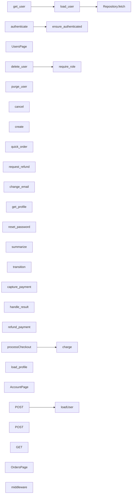

## Findings

- **INFO · INFERRED · no_op_branch** Branch 'Yes' has an empty body ([`examples/shop/backend/orders_service.py:22`](../examples/shop/backend/orders_service.py#L22))
- **INFO · INFERRED · logging_asymmetry** Guard 'order.total\_cents \<= 0' is logged in a sibling flow but silent here ([`examples/shop/backend/payments_service.py:41`](../examples/shop/backend/payments_service.py#L41))
- **WARNING · INFERRED · enum_exhaustiveness** Declared AccountStatus members not handled for account.status: AccountStatus.ACTIVE, AccountStatus.PENDING\_VERIFICATION ([`examples/shop/backend/api/users_routes.py:15`](../examples/shop/backend/api/users_routes.py#L15))
- **WARNING · INFERRED · enum_exhaustiveness** Declared OrderStatus members not handled for order.status: OrderStatus.CANCELLED, OrderStatus.DELIVERED, OrderStatus.REFUNDED ([`examples/shop/backend/orders_service.py:8`](../examples/shop/backend/orders_service.py#L8))
- **WARNING · INFERRED · enum_exhaustiveness** Declared PaymentResult members not handled for result: PaymentResult.FRAUD\_REVIEW ([`examples/shop/backend/payments_service.py:11`](../examples/shop/backend/payments_service.py#L11))
- **WARNING · INFERRED · broad_except_swallow** Exception handler 'Error' swallows the error ([`examples/shop/frontend/app/api/checkout/route.ts:5`](../examples/shop/frontend/app/api/checkout/route.ts#L5))
- **WARNING · INFERRED · broad_except_swallow** Exception handler 'Exception' swallows the error ([`examples/shop/backend/payments_service.py:23`](../examples/shop/backend/payments_service.py#L23))
- **WARNING · INFERRED · dead_guard** Guard on the constant ENABLE\_DOUBLE\_CHARGE\_GUARD is always False ([`examples/shop/backend/payments_service.py:21`](../examples/shop/backend/payments_service.py#L21))
- **WARNING · INFERRED · dead_code** Unreachable code after all paths return or raise \(line 30\) ([`examples/shop/backend/users_service.py:30`](../examples/shop/backend/users_service.py#L30))

<details>
<summary>Review-only - 3 POTENTIAL_GAP (heuristic candidates, not confirmed)</summary>

- **WARNING · POTENTIAL_GAP · missing_branch** Decision has no explicit fallback: if/elif on order.status ([`examples/shop/frontend/app/orders/page.tsx:3`](../examples/shop/frontend/app/orders/page.tsx#L3))
- **WARNING · POTENTIAL_GAP · missing_branch** Decision has no explicit fallback: switch order.status ([`examples/shop/frontend/app/api/orders/route.ts:6`](../examples/shop/frontend/app/api/orders/route.ts#L6))
- **WARNING · POTENTIAL_GAP · missing_branch** Decision has no explicit fallback: switch user.status ([`examples/demo/frontend/app/api/users/route.ts:4`](../examples/demo/frontend/app/api/users/route.ts#L4))

</details>

## Entry Point Flows

### get_user

`route` · `python` · `fastapi` · [`examples/demo/backend/users.py:23`](../examples/demo/backend/users.py#L23)

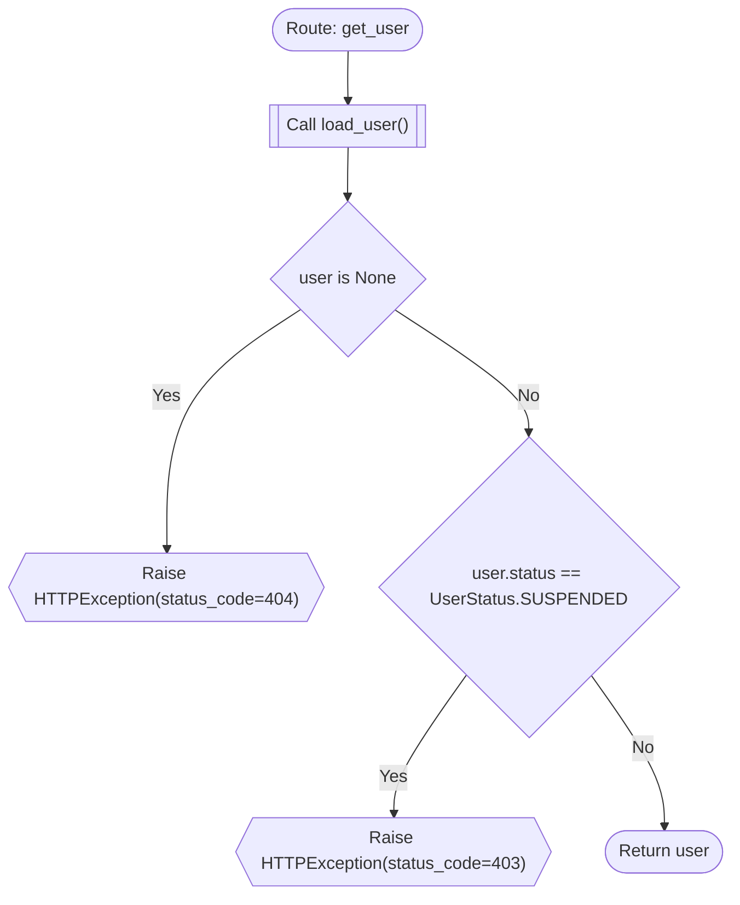

### load_user

`function` · `python` · `generic` · [`examples/demo/backend/users.py:32`](../examples/demo/backend/users.py#L32)


### POST

`route` · `typescript` · `nextjs` · [`examples/demo/frontend/app/api/users/route.ts:1`](../examples/demo/frontend/app/api/users/route.ts#L1)


**Review points:**
- `Switch on user.status`: Decision has no explicit fallback: switch user.status

### UsersPage

`component` · `typescript` · `nextjs` · [`examples/demo/frontend/app/users/page.tsx:1`](../examples/demo/frontend/app/users/page.tsx#L1)

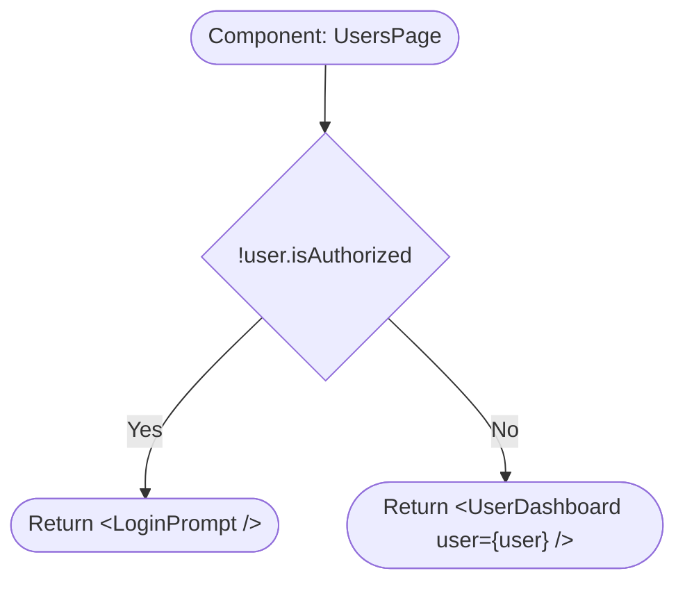

### delete_user

`function` · `python` · `generic` · [`examples/shop/backend/api/admin_routes.py:7`](../examples/shop/backend/api/admin_routes.py#L7)

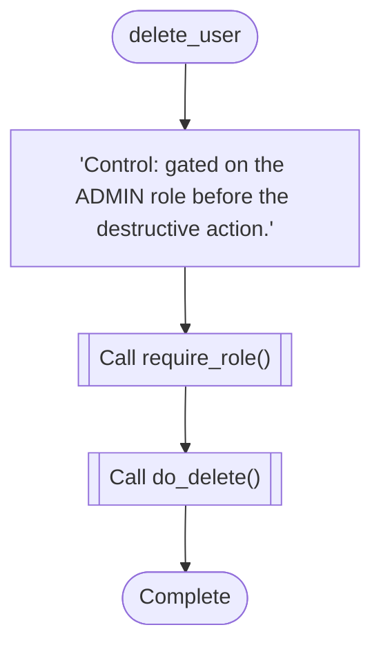

### purge_user

`function` · `python` · `generic` · [`examples/shop/backend/api/admin_routes.py:13`](../examples/shop/backend/api/admin_routes.py#L13)

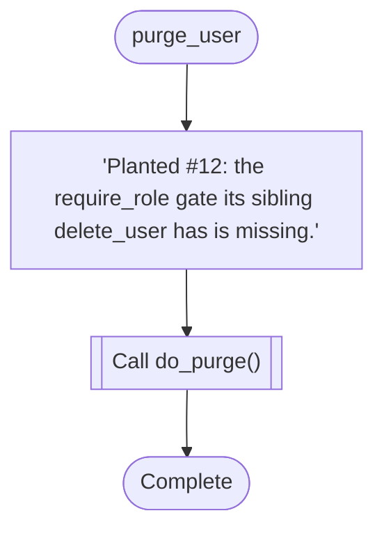

### cancel

`function` · `python` · `generic` · [`examples/shop/backend/api/orders_routes.py:6`](../examples/shop/backend/api/orders_routes.py#L6)

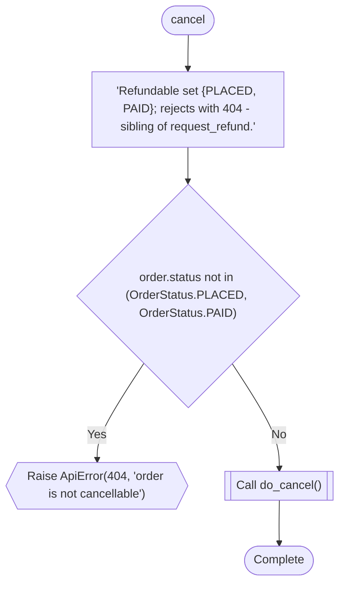

### create

`function` · `python` · `generic` · [`examples/shop/backend/api/orders_routes.py:21`](../examples/shop/backend/api/orders_routes.py#L21)

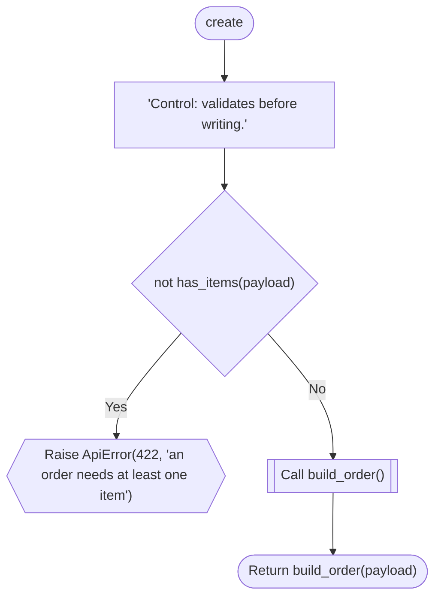

### quick_order

`function` · `python` · `generic` · [`examples/shop/backend/api/orders_routes.py:28`](../examples/shop/backend/api/orders_routes.py#L28)

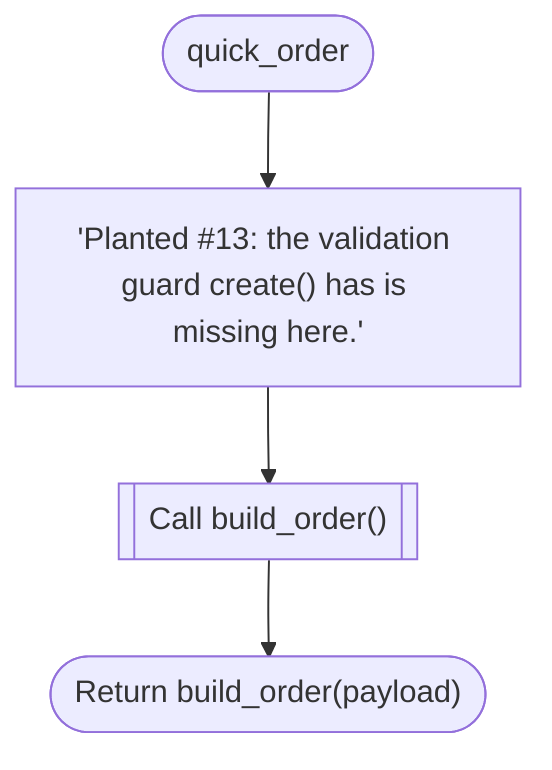

### request_refund

`function` · `python` · `generic` · [`examples/shop/backend/api/orders_routes.py:13`](../examples/shop/backend/api/orders_routes.py#L13)

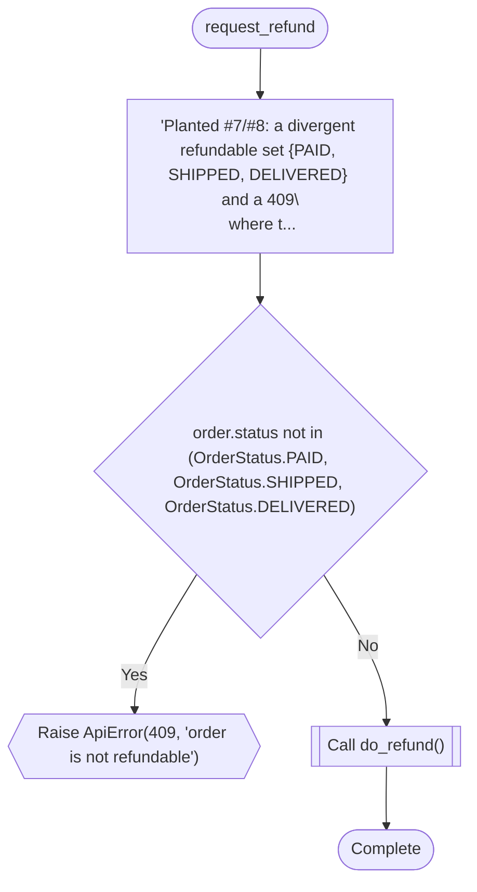

### change_email

`function` · `python` · `generic` · [`examples/shop/backend/api/users_routes.py:13`](../examples/shop/backend/api/users_routes.py#L13)

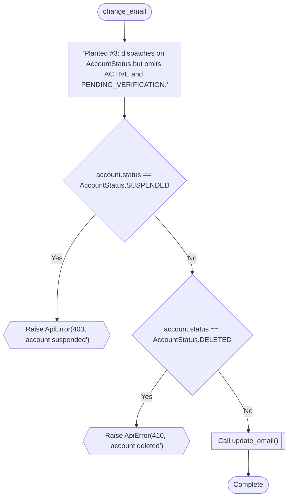

**Review points:**
- `account.status == AccountStatus.SUSPENDED`: Declared AccountStatus members not handled for account.status: AccountStatus.ACTIVE, AccountStatus.PENDING\_VERIFICATION

### get_profile

`function` · `python` · `generic` · [`examples/shop/backend/api/users_routes.py:22`](../examples/shop/backend/api/users_routes.py#L22)

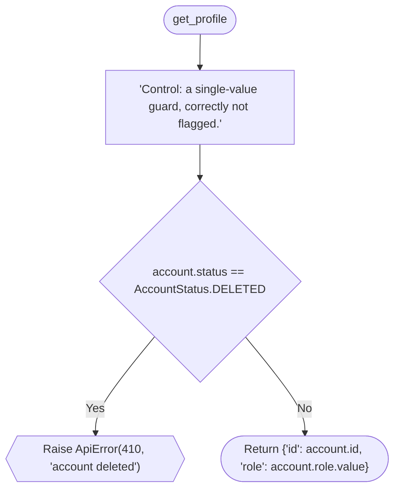

### reset_password

`function` · `python` · `generic` · [`examples/shop/backend/api/users_routes.py:6`](../examples/shop/backend/api/users_routes.py#L6)

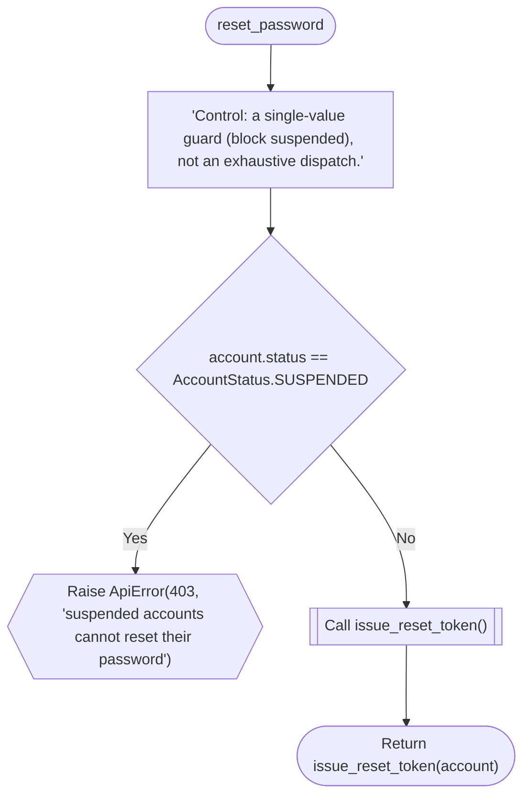

### ensure_authenticated

`function` · `python` · `generic` · [`examples/shop/backend/auth.py:12`](../examples/shop/backend/auth.py#L12)


### require_role

`function` · `python` · `generic` · [`examples/shop/backend/auth.py:6`](../examples/shop/backend/auth.py#L6)

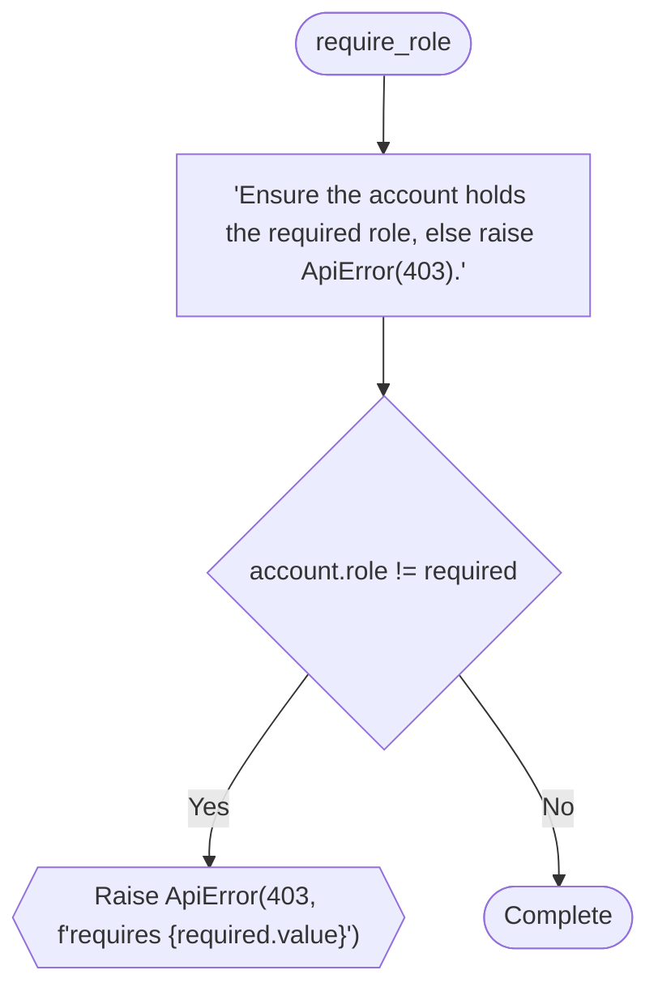

### summarize

`function` · `python` · `generic` · [`examples/shop/backend/orders_service.py:19`](../examples/shop/backend/orders_service.py#L19)

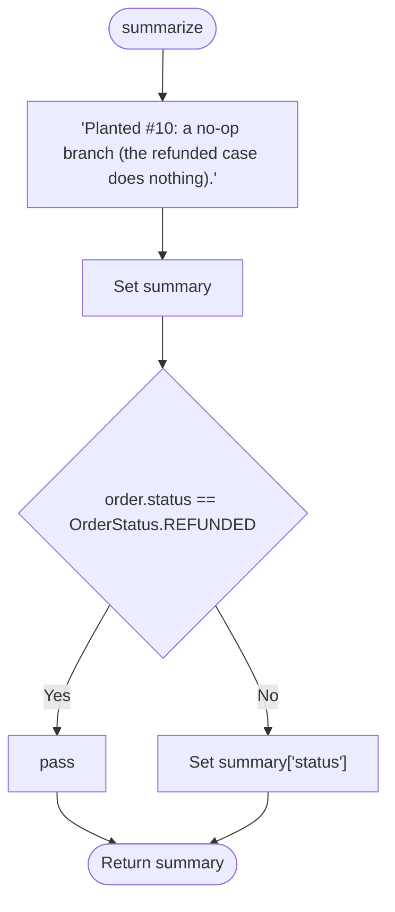

**Review points:**
- `order.status == OrderStatus.REFUNDED`: Branch 'Yes' has an empty body

### transition

`function` · `python` · `generic` · [`examples/shop/backend/orders_service.py:6`](../examples/shop/backend/orders_service.py#L6)


**Review points:**
- `Match order.status`: Declared OrderStatus members not handled for order.status: OrderStatus.CANCELLED, OrderStatus.DELIVERED, OrderStatus.REFUNDED

### capture_payment

`function` · `python` · `generic` · [`examples/shop/backend/payments_service.py:39`](../examples/shop/backend/payments_service.py#L39)

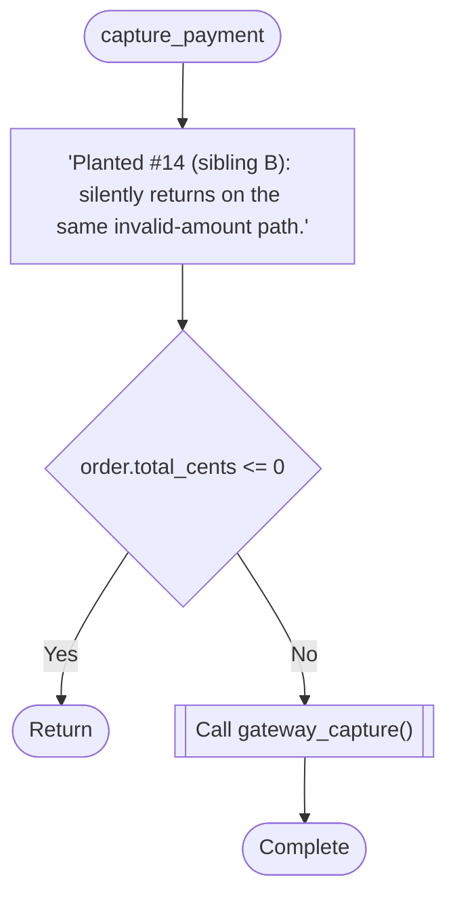

**Review points:**
- `order.total_cents <= 0`: Guard 'order.total\_cents \<= 0' is logged in a sibling flow but silent here

### charge

`function` · `python` · `generic` · [`examples/shop/backend/payments_service.py:19`](../examples/shop/backend/payments_service.py#L19)


**Review points:**
- `Operation succeeds?`: Exception handler 'Exception' swallows the error
- `ENABLE_DOUBLE_CHARGE_GUARD`: Guard on the constant ENABLE\_DOUBLE\_CHARGE\_GUARD is always False

### handle_result

`event_handler` · `python` · `generic` · [`examples/shop/backend/payments_service.py:9`](../examples/shop/backend/payments_service.py#L9)

```mermaid
flowchart TD
  mflow_d8c77f3ddc158387_n1(["handle_result"])
  mflow_d8c77f3ddc158387_n2["'Planted #5: if/elif chain on PaymentResult missing FRAUD_REVIEW and no else.'"]
  mflow_d8c77f3ddc158387_n3{"result == PaymentResult.APPROVED"}
  mflow_d8c77f3ddc158387_n4(["Return 'paid'"])
  mflow_d8c77f3ddc158387_n5{"result == PaymentResult.DECLINED"}
  mflow_d8c77f3ddc158387_n6(["Return 'declined'"])
  mflow_d8c77f3ddc158387_n7{"result == PaymentResult.PENDING"}
  mflow_d8c77f3ddc158387_n8(["Return 'pending'"])
  mflow_d8c77f3ddc158387_n9(["Complete"])
  mflow_d8c77f3ddc158387_n1 --> mflow_d8c77f3ddc158387_n2
  mflow_d8c77f3ddc158387_n2 --> mflow_d8c77f3ddc158387_n3
  mflow_d8c77f3ddc158387_n3 -->|"Yes"| mflow_d8c77f3ddc158387_n4
  mflow_d8c77f3ddc158387_n3 -->|"No"| mflow_d8c77f3ddc158387_n5
  mflow_d8c77f3ddc158387_n5 -->|"Yes"| mflow_d8c77f3ddc158387_n6
  mflow_d8c77f3ddc158387_n5 -->|"No"| mflow_d8c77f3ddc158387_n7
  mflow_d8c77f3ddc158387_n7 -->|"Yes"| mflow_d8c77f3ddc158387_n8
  mflow_d8c77f3ddc158387_n7 -->|"No"| mflow_d8c77f3ddc158387_n9
```

**Review points:**
- `result == PaymentResult.APPROVED`: Declared PaymentResult members not handled for result: PaymentResult.FRAUD\_REVIEW

### refund_payment

`function` · `python` · `generic` · [`examples/shop/backend/payments_service.py:30`](../examples/shop/backend/payments_service.py#L30)

```mermaid
flowchart TD
  mflow_7dfa5d0eac72e588_n1(["refund_payment"])
  mflow_7dfa5d0eac72e588_n2["'Planted #14 (sibling A): logs and alerts on the invalid-amount path.'"]
  mflow_7dfa5d0eac72e588_n3{"order.total_cents &lt;= 0"}
  mflow_7dfa5d0eac72e588_n4[["Call log_warning()"]]
  mflow_7dfa5d0eac72e588_n5[["Call alert_ops()"]]
  mflow_7dfa5d0eac72e588_n6{{"Raise ApiError(422, 'invalid refund amount')"}}
  mflow_7dfa5d0eac72e588_n7[["Call gateway_refund()"]]
  mflow_7dfa5d0eac72e588_n8(["Complete"])
  mflow_7dfa5d0eac72e588_n1 --> mflow_7dfa5d0eac72e588_n2
  mflow_7dfa5d0eac72e588_n2 --> mflow_7dfa5d0eac72e588_n3
  mflow_7dfa5d0eac72e588_n3 -->|"Yes"| mflow_7dfa5d0eac72e588_n4
  mflow_7dfa5d0eac72e588_n4 --> mflow_7dfa5d0eac72e588_n5
  mflow_7dfa5d0eac72e588_n5 --> mflow_7dfa5d0eac72e588_n6
  mflow_7dfa5d0eac72e588_n3 -->|"No"| mflow_7dfa5d0eac72e588_n7
  mflow_7dfa5d0eac72e588_n7 --> mflow_7dfa5d0eac72e588_n8
```

### authenticate

`function` · `python` · `generic` · [`examples/shop/backend/users_service.py:7`](../examples/shop/backend/users_service.py#L7)

```mermaid
flowchart TD
  mflow_c00fda52066729a3_n1(["authenticate"])
  mflow_c00fda52066729a3_n2["'Reference handler: every AccountStatus is handled explicitly, with an else.\\n\\n This is..."]
  mflow_c00fda52066729a3_n3[["Call ensure_authenticated()"]]
  mflow_c00fda52066729a3_n4{"account.status == AccountStatus.SUSPENDED"}
  mflow_c00fda52066729a3_n5{{"Raise ApiError(403, 'account suspended')"}}
  mflow_c00fda52066729a3_n6{"account.status == AccountStatus.DELETED"}
  mflow_c00fda52066729a3_n7{{"Raise ApiError(410, 'account deleted')"}}
  mflow_c00fda52066729a3_n8{"account.status == AccountStatus.PENDING_VERIFICATION"}
  mflow_c00fda52066729a3_n9{{"Raise ApiError(403, 'verify your email first')"}}
  mflow_c00fda52066729a3_n10{"account.status == AccountStatus.ACTIVE"}
  mflow_c00fda52066729a3_n11(["Return account"])
  mflow_c00fda52066729a3_n12{{"Raise ApiError(500, 'unknown account status')"}}
  mflow_c00fda52066729a3_n1 --> mflow_c00fda52066729a3_n2
  mflow_c00fda52066729a3_n2 --> mflow_c00fda52066729a3_n3
  mflow_c00fda52066729a3_n3 --> mflow_c00fda52066729a3_n4
  mflow_c00fda52066729a3_n4 -->|"Yes"| mflow_c00fda52066729a3_n5
  mflow_c00fda52066729a3_n4 -->|"No"| mflow_c00fda52066729a3_n6
  mflow_c00fda52066729a3_n6 -->|"Yes"| mflow_c00fda52066729a3_n7
  mflow_c00fda52066729a3_n6 -->|"No"| mflow_c00fda52066729a3_n8
  mflow_c00fda52066729a3_n8 -->|"Yes"| mflow_c00fda52066729a3_n9
  mflow_c00fda52066729a3_n8 -->|"No"| mflow_c00fda52066729a3_n10
  mflow_c00fda52066729a3_n10 -->|"Yes"| mflow_c00fda52066729a3_n11
  mflow_c00fda52066729a3_n10 -->|"No"| mflow_c00fda52066729a3_n12
```

### load_profile

`function` · `python` · `generic` · [`examples/shop/backend/users_service.py:26`](../examples/shop/backend/users_service.py#L26)

```mermaid
flowchart TD
  mflow_68e9ed308389b179_n1(["load_profile"])
  mflow_68e9ed308389b179_n2["'Planted #9: dead code after an unconditional return.'"]
  mflow_68e9ed308389b179_n3["Set profile"]
  mflow_68e9ed308389b179_n4(["Return profile"])
  mflow_68e9ed308389b179_n1 --> mflow_68e9ed308389b179_n2
  mflow_68e9ed308389b179_n2 --> mflow_68e9ed308389b179_n3
  mflow_68e9ed308389b179_n3 --> mflow_68e9ed308389b179_n4
```

### AccountPage

`component` · `typescript` · `nextjs` · [`examples/shop/frontend/app/account/page.tsx:4`](../examples/shop/frontend/app/account/page.tsx#L4)

```mermaid
flowchart TD
  mflow_aff7a7b992bc22b9_n1(["Component: AccountPage"])
  mflow_aff7a7b992bc22b9_n2{"Switch on account.status"}
  mflow_aff7a7b992bc22b9_n3(["Return &lt;Dashboard /&gt;"])
  mflow_aff7a7b992bc22b9_n4(["Return &lt;SuspendedNotice /&gt;"])
  mflow_aff7a7b992bc22b9_n5(["Return &lt;LockedNotice /&gt;"])
  mflow_aff7a7b992bc22b9_n1 --> mflow_aff7a7b992bc22b9_n2
  mflow_aff7a7b992bc22b9_n2 -->|"&quot;active&quot;"| mflow_aff7a7b992bc22b9_n3
  mflow_aff7a7b992bc22b9_n2 -->|"&quot;suspended&quot;"| mflow_aff7a7b992bc22b9_n4
  mflow_aff7a7b992bc22b9_n2 -->|"default"| mflow_aff7a7b992bc22b9_n5
```

### processCheckout

`server_action` · `typescript` · `nextjs` · [`examples/shop/frontend/app/api/checkout/route.ts:4`](../examples/shop/frontend/app/api/checkout/route.ts#L4)

```mermaid
flowchart TD
  mflow_f9ae842409a8d60d_n1(["Server action: processCheckout"])
  mflow_f9ae842409a8d60d_n2{"Operation succeeds?"}
  mflow_f9ae842409a8d60d_n3[["Call charge()"]]
  mflow_f9ae842409a8d60d_n4(["Return await charge(request)"])
  mflow_f9ae842409a8d60d_n5["// intentionally ignored"]
  mflow_f9ae842409a8d60d_n6(["Return new Response(&quot;ok&quot;)"])
  mflow_f9ae842409a8d60d_n1 --> mflow_f9ae842409a8d60d_n2
  mflow_f9ae842409a8d60d_n2 -->|"Success"| mflow_f9ae842409a8d60d_n3
  mflow_f9ae842409a8d60d_n3 --> mflow_f9ae842409a8d60d_n4
  mflow_f9ae842409a8d60d_n2 -->|"Error"| mflow_f9ae842409a8d60d_n5
  mflow_f9ae842409a8d60d_n5 --> mflow_f9ae842409a8d60d_n6
```

**Review points:**
- `Operation succeeds?`: Exception handler 'Error' swallows the error

### POST

`route` · `typescript` · `nextjs` · [`examples/shop/frontend/app/api/orders/route.ts:4`](../examples/shop/frontend/app/api/orders/route.ts#L4)

```mermaid
flowchart TD
  mflow_484f0b6804aa2ba6_n1(["Route: POST"])
  mflow_484f0b6804aa2ba6_n2[["Call loadOrder()"]]
  mflow_484f0b6804aa2ba6_n3{"Switch on order.status"}
  mflow_484f0b6804aa2ba6_n4[["Call Response.json()"]]
  mflow_484f0b6804aa2ba6_n5(["Return Response.json({ stage: &quot;cart&quot; })"])
  mflow_484f0b6804aa2ba6_n6[["Call Response.json()"]]
  mflow_484f0b6804aa2ba6_n7(["Return Response.json({ stage: &quot;paid&quot; })"])
  mflow_484f0b6804aa2ba6_n8[["Call Response.json()"]]
  mflow_484f0b6804aa2ba6_n9(["Return Response.json({ stage: &quot;shipped&quot; })"])
  mflow_484f0b6804aa2ba6_n10(["Complete"])
  mflow_484f0b6804aa2ba6_n1 --> mflow_484f0b6804aa2ba6_n2
  mflow_484f0b6804aa2ba6_n2 --> mflow_484f0b6804aa2ba6_n3
  mflow_484f0b6804aa2ba6_n3 -->|"&quot;cart&quot;"| mflow_484f0b6804aa2ba6_n4
  mflow_484f0b6804aa2ba6_n4 --> mflow_484f0b6804aa2ba6_n5
  mflow_484f0b6804aa2ba6_n3 -->|"&quot;paid&quot;"| mflow_484f0b6804aa2ba6_n6
  mflow_484f0b6804aa2ba6_n6 --> mflow_484f0b6804aa2ba6_n7
  mflow_484f0b6804aa2ba6_n3 -->|"&quot;shipped&quot;"| mflow_484f0b6804aa2ba6_n8
  mflow_484f0b6804aa2ba6_n8 --> mflow_484f0b6804aa2ba6_n9
  mflow_484f0b6804aa2ba6_n3 -->|"default"| mflow_484f0b6804aa2ba6_n10
```

**Review points:**
- `Switch on order.status`: Decision has no explicit fallback: switch order.status

### GET

`route` · `typescript` · `nextjs` · [`examples/shop/frontend/app/api/users/route.ts:7`](../examples/shop/frontend/app/api/users/route.ts#L7)

```mermaid
flowchart TD
  mflow_082b27af25998831_n1(["Route: GET"])
  mflow_082b27af25998831_n2[["Call loadAccount()"]]
  mflow_082b27af25998831_n3{"Switch on account.status"}
  mflow_082b27af25998831_n4[["Call Response.json()"]]
  mflow_082b27af25998831_n5(["Return Response.json(account)"])
  mflow_082b27af25998831_n6(["Return new Response(&quot;blocked&quot;, { status: 403 })"])
  mflow_082b27af25998831_n7(["Return new Response(&quot;gone&quot;, { status: 410 })"])
  mflow_082b27af25998831_n8(["Return new Response(&quot;unknown&quot;, { status: 400 })"])
  mflow_082b27af25998831_n1 --> mflow_082b27af25998831_n2
  mflow_082b27af25998831_n2 --> mflow_082b27af25998831_n3
  mflow_082b27af25998831_n3 -->|"&quot;active&quot;"| mflow_082b27af25998831_n4
  mflow_082b27af25998831_n4 --> mflow_082b27af25998831_n5
  mflow_082b27af25998831_n3 -->|"&quot;suspended&quot;"| mflow_082b27af25998831_n6
  mflow_082b27af25998831_n3 -->|"&quot;deleted&quot;"| mflow_082b27af25998831_n7
  mflow_082b27af25998831_n3 -->|"default"| mflow_082b27af25998831_n8
```

### OrdersPage

`component` · `typescript` · `nextjs` · [`examples/shop/frontend/app/orders/page.tsx:2`](../examples/shop/frontend/app/orders/page.tsx#L2)

```mermaid
flowchart TD
  mflow_a14422f6dd2875d3_n1(["Component: OrdersPage"])
  mflow_a14422f6dd2875d3_n2{"order.status === &quot;cart&quot;"}
  mflow_a14422f6dd2875d3_n3(["Return &lt;CartView /&gt;"])
  mflow_a14422f6dd2875d3_n4{"order.status === &quot;paid&quot;"}
  mflow_a14422f6dd2875d3_n5(["Return &lt;PaidView /&gt;"])
  mflow_a14422f6dd2875d3_n6(["Complete"])
  mflow_a14422f6dd2875d3_n1 --> mflow_a14422f6dd2875d3_n2
  mflow_a14422f6dd2875d3_n2 -->|"Yes"| mflow_a14422f6dd2875d3_n3
  mflow_a14422f6dd2875d3_n2 -->|"No"| mflow_a14422f6dd2875d3_n4
  mflow_a14422f6dd2875d3_n4 -->|"Yes"| mflow_a14422f6dd2875d3_n5
  mflow_a14422f6dd2875d3_n4 -->|"No"| mflow_a14422f6dd2875d3_n6
```

**Review points:**
- `order.status === "cart"`: Decision has no explicit fallback: if/elif on order.status

### middleware

`middleware` · `typescript` · `nextjs` · [`examples/shop/frontend/middleware.ts:2`](../examples/shop/frontend/middleware.ts#L2)

```mermaid
flowchart TD
  mflow_288c098a2caf8a7a_n1(["Middleware: middleware"])
  mflow_288c098a2caf8a7a_n2[["Call request.headers.get()"]]
  mflow_288c098a2caf8a7a_n3{"!token"}
  mflow_288c098a2caf8a7a_n4(["Return new Response(&quot;unauthorized&quot;, { status: 401 })"])
  mflow_288c098a2caf8a7a_n5[["Call forward()"]]
  mflow_288c098a2caf8a7a_n6(["Return forward(request)"])
  mflow_288c098a2caf8a7a_n1 --> mflow_288c098a2caf8a7a_n2
  mflow_288c098a2caf8a7a_n2 --> mflow_288c098a2caf8a7a_n3
  mflow_288c098a2caf8a7a_n3 -->|"Yes"| mflow_288c098a2caf8a7a_n4
  mflow_288c098a2caf8a7a_n3 -->|"No"| mflow_288c098a2caf8a7a_n5
  mflow_288c098a2caf8a7a_n5 --> mflow_288c098a2caf8a7a_n6
```


## Referenced Subflows

### Repository.fetch

`method` · `python` · `generic` · [`examples/demo/backend/users.py:9`](../examples/demo/backend/users.py#L9)

```mermaid
flowchart TD
  mflow_6306314dcc318fc3_n1(["Repository.fetch"])
  mflow_6306314dcc318fc3_n2{{"Raise NotImplementedError"}}
  mflow_6306314dcc318fc3_n1 --> mflow_6306314dcc318fc3_n2
```

### loadUser

`function` · `typescript` · `generic` · [`examples/demo/frontend/app/api/users/route.ts:12`](../examples/demo/frontend/app/api/users/route.ts#L12)

```mermaid
flowchart TD
  mflow_5c518b0f2169bf38_n1(["loadUser"])
  mflow_5c518b0f2169bf38_n2[["Call database.users.find()"]]
  mflow_5c518b0f2169bf38_n3(["Return database.users.find(request)"])
  mflow_5c518b0f2169bf38_n1 --> mflow_5c518b0f2169bf38_n2
  mflow_5c518b0f2169bf38_n2 --> mflow_5c518b0f2169bf38_n3
```
