# LogicChart Decision Flows

> Generated from source code. Do not edit this file manually.

- **Generated:** `2026-06-20T10:43:28.839450+00:00`
- **Source root:** `.`
- **Flows:** 89
- **Entry points:** 62
- **Review signals:** 11 verified/inferred · 2 review-only
- **Scopes:** examples (89)

## Project Map

```mermaid
flowchart LR
  mflow_30a90e08f492f570["AuthService.AuditDecision"]
  mflow_b25d2a1d236f82e9["AuthService.CanAccess"]
  mflow_f20ccc2fbafb5db2["BillingService.refund"]
  mflow_b93c13042e022906["BillingService.settle"]
  mflow_e82e8b5bab62025d["evict_index"]
  mflow_544b153768a89b2c["Catalog.merchandisingAction"]
  mflow_8525290305d958ad["Catalog.reorderQuantity"]
  mflow_a0f8661012b6ffb8["NativePolicy.ttl"]
  mflow_76b19f502b7630fd["backend.AdmissionControl.allow"]
  mflow_d80fbb571da2c2b2["backend.AdmissionControl.retry_budget"]
  mflow_9552dc25a351bdd5["backend.AdmissionControl.route"]
  mflow_0f93659c9071bb28["Notifier.deliver"]
  mflow_5fda5bdf81c4442c["Notifier.digest"]
  mflow_856cb6768c88d69a["Notifier.queue_for_review"]
  mflow_559f316eb31f2a37["Notifier.send_email"]
  mflow_93f5681a653f0813["Notifier.send_push"]
  mflow_78196d7b3ea7c7fc["Notifier.send_sms"]
  mflow_48c8d4b20e3f4457["Notifier.urgent?"]
  mflow_34aaa6b9bc39e3cd["Notifier.write_inbox"]
  mflow_99a2ebfc956e8b2c["Order.CanFulfill"]
  mflow_3d07442ab2fe8ec4["Order.FulfillmentPlan"]
  mflow_dc4e68214dc82497["Order.NextAction"]
  mflow_887ea25e7969f319["Order.RefundPolicy"]
  mflow_9259780255b6b463["dispatch"]
  mflow_7c701820993d7fff["archive_user"]
  mflow_f6e3d6b7fe12b83f["get_user"]
  mflow_f35a3698106b0817["load_user"]
  mflow_ace5dd36ca3d7521["restore_user"]
  mflow_bcc7862495a399b1["update_user"]
  mflow_764cb8abc18ad0eb["user_action"]
  mflow_e18a3a55b37ae612["GET"]
  mflow_956287b0dd1c16fc["PATCH"]
  mflow_f64ac14e1834df93["GET"]
  mflow_f74e7243a59c82e6["POST"]
  mflow_75546b2685371cc9["UsersPage"]
  mflow_b9ac3318caa675de["statusLabel"]
  mflow_d18ad051649c1dc1["statusTone"]
  mflow_22d844fbd2f31cd3["delete_user"]
  mflow_83e56dcea5b74bf9["purge_user"]
  mflow_1128bc0f809cd8d6["cancel"]
  mflow_f482b3026e3ea072["create"]
  mflow_4143ee18aecc0353["quick_order"]
  mflow_08a786dcbded8185["request_refund"]
  mflow_bf4bdbe9cee93085["change_email"]
  mflow_694730b8745d57de["get_profile"]
  mflow_836bfa1aef528de0["reset_password"]
  mflow_92971030a65d1410["ensure_authenticated"]
  mflow_93e6edefb10af9c5["require_role"]
  mflow_cfef4e8dba6238fd["summarize"]
  mflow_4e833d53a700855c["transition"]
  mflow_3b15514408bbb3ee["capture_payment"]
  mflow_3fb7f77aa3ec9fd5["charge"]
  mflow_d8c77f3ddc158387["handle_result"]
  mflow_7dfa5d0eac72e588["refund_payment"]
  mflow_c00fda52066729a3["authenticate"]
  mflow_68e9ed308389b179["load_profile"]
  mflow_aff7a7b992bc22b9["AccountPage"]
  mflow_f9ae842409a8d60d["processCheckout"]
  mflow_484f0b6804aa2ba6["POST"]
  mflow_082b27af25998831["GET"]
  mflow_a14422f6dd2875d3["OrdersPage"]
  mflow_288c098a2caf8a7a["middleware"]
  mflow_e04a1135f411a219["BillingService.capture"]
  mflow_b93c13042e022906 --> mflow_e04a1135f411a219
  mflow_05f47393e12ffed6["Catalog.restockTarget"]
  mflow_8525290305d958ad --> mflow_05f47393e12ffed6
  mflow_76b19f502b7630fd --> mflow_9552dc25a351bdd5
  mflow_0f93659c9071bb28 --> mflow_78196d7b3ea7c7fc
  mflow_0f93659c9071bb28 --> mflow_93f5681a653f0813
  mflow_0f93659c9071bb28 --> mflow_34aaa6b9bc39e3cd
  mflow_0f93659c9071bb28 --> mflow_856cb6768c88d69a
  mflow_5fda5bdf81c4442c --> mflow_856cb6768c88d69a
  mflow_5fda5bdf81c4442c --> mflow_559f316eb31f2a37
  mflow_5fda5bdf81c4442c --> mflow_93f5681a653f0813
  mflow_656ecac16fb68465["Order.pendingAction"]
  mflow_dc4e68214dc82497 --> mflow_656ecac16fb68465
  mflow_3d400c9162e93c46["Order.paidAction"]
  mflow_dc4e68214dc82497 --> mflow_3d400c9162e93c46
  mflow_a2561c50cfc4a119["degraded_status"]
  mflow_9259780255b6b463 --> mflow_a2561c50cfc4a119
  mflow_c371c524183f5665["guard"]
  mflow_9259780255b6b463 --> mflow_c371c524183f5665
  mflow_f6e3d6b7fe12b83f --> mflow_f35a3698106b0817
  mflow_6306314dcc318fc3["Repository.fetch"]
  mflow_f35a3698106b0817 --> mflow_6306314dcc318fc3
  mflow_bcc7862495a399b1 --> mflow_f35a3698106b0817
  mflow_bcc7862495a399b1 --> mflow_764cb8abc18ad0eb
  mflow_bcc7862495a399b1 --> mflow_7c701820993d7fff
  mflow_bcc7862495a399b1 --> mflow_ace5dd36ca3d7521
  mflow_7f73dcbb92742637["loadOrder"]
  mflow_e18a3a55b37ae612 --> mflow_7f73dcbb92742637
  mflow_e6cca8ffc732c1ee["loadUser"]
  mflow_e18a3a55b37ae612 --> mflow_e6cca8ffc732c1ee
  mflow_0627ca77f0acdd05["draftResponse"]
  mflow_e18a3a55b37ae612 --> mflow_0627ca77f0acdd05
  mflow_364315477dc5d210["openResponse"]
  mflow_e18a3a55b37ae612 --> mflow_364315477dc5d210
  mflow_4032755380dd4852["paidResponse"]
  mflow_e18a3a55b37ae612 --> mflow_4032755380dd4852
  mflow_3408e4f4130a456b["reviewResponse"]
  mflow_e18a3a55b37ae612 --> mflow_3408e4f4130a456b
  mflow_956287b0dd1c16fc --> mflow_7f73dcbb92742637
  mflow_956287b0dd1c16fc --> mflow_e6cca8ffc732c1ee
  mflow_b0e24f566e5e2350["decideOrderAction"]
  mflow_956287b0dd1c16fc --> mflow_b0e24f566e5e2350
  mflow_837a697e4814e15c["auditOrder"]
  mflow_956287b0dd1c16fc --> mflow_837a697e4814e15c
  mflow_99b872ff61adb8e0["applyOrderAction"]
  mflow_956287b0dd1c16fc --> mflow_99b872ff61adb8e0
  mflow_5c518b0f2169bf38["loadUser"]
  mflow_f64ac14e1834df93 --> mflow_5c518b0f2169bf38
  mflow_90d927fdd439f656["resolveUserAccess"]
  mflow_f64ac14e1834df93 --> mflow_90d927fdd439f656
  mflow_f74e7243a59c82e6 --> mflow_5c518b0f2169bf38
  mflow_0018c3465f63c7a0["moderationAction"]
  mflow_f74e7243a59c82e6 --> mflow_0018c3465f63c7a0
  mflow_d7be38055f408fcf["activateUser"]
  mflow_f74e7243a59c82e6 --> mflow_d7be38055f408fcf
  mflow_af7d9917429499f4["auditUser"]
  mflow_f74e7243a59c82e6 --> mflow_af7d9917429499f4
  mflow_a9d844052f74bb91["dashboardMode"]
  mflow_75546b2685371cc9 --> mflow_a9d844052f74bb91
  mflow_22d844fbd2f31cd3 --> mflow_93e6edefb10af9c5
  mflow_c00fda52066729a3 --> mflow_92971030a65d1410
  mflow_484f0b6804aa2ba6 --> mflow_7f73dcbb92742637
```

## Review Signals

- **INFO · INFERRED · no_op_branch** Branch 'Yes' has an empty body ([`examples/shop/backend/orders_service.py:22`](../examples/shop/backend/orders_service.py#L22)) · finding id `2150419da3741ab0` Review: Is this branch intentionally empty, or is it missing behavior?
- **INFO · INFERRED · logging_asymmetry** Guard 'order.total\_cents \<= 0' is logged in a sibling flow but silent here ([`examples/shop/backend/payments_service.py:41`](../examples/shop/backend/payments_service.py#L41)) · finding id `2d9cd792976631eb` Review: Should this guard log or alert like its sibling error path?
- **WARNING · INFERRED · enum_exhaustiveness** Declared AccountStatus members not handled for account.status: AccountStatus.ACTIVE, AccountStatus.PENDING\_VERIFICATION ([`examples/shop/backend/api/users_routes.py:15`](../examples/shop/backend/api/users_routes.py#L15)) · finding id `52579c8f864156ca` Review: Should this dispatch handle every declared member or add an explicit default?
- **WARNING · INFERRED · enum_exhaustiveness** Declared OrderState members not handled for order.state: OrderState.BACKORDERED, OrderState.CHARGEBACK, OrderState.RETURNED ([`examples/demo/frontend/app/api/orders/route.ts:9`](../examples/demo/frontend/app/api/orders/route.ts#L9)) · finding id `f49714593bec01c7` Review: Should this dispatch handle every declared member or add an explicit default?
- **WARNING · INFERRED · enum_exhaustiveness** Declared OrderStatus members not handled for order.status: OrderStatus.CANCELLED, OrderStatus.DELIVERED, OrderStatus.REFUNDED ([`examples/shop/backend/orders_service.py:8`](../examples/shop/backend/orders_service.py#L8)) · finding id `a461a64fc5c6ab34` Review: Should this dispatch handle every declared member or add an explicit default?
- **WARNING · INFERRED · enum_exhaustiveness** Declared PaymentResult members not handled for result: PaymentResult.FRAUD\_REVIEW ([`examples/shop/backend/payments_service.py:11`](../examples/shop/backend/payments_service.py#L11)) · finding id `a0c7d93350b38d96` Review: Should this dispatch handle every declared member or add an explicit default?
- **WARNING · INFERRED · enum_exhaustiveness** Declared UserStatus members not handled for user.status: UserStatus.ARCHIVED, UserStatus.DELETED, UserStatus.LOCKED ([`examples/demo/frontend/app/api/users/route.ts:25`](../examples/demo/frontend/app/api/users/route.ts#L25)) · finding id `fbd4b74d209dc2c6` Review: Should this dispatch handle every declared member or add an explicit default?
- **WARNING · INFERRED · broad_except_swallow** Exception handler 'Error' swallows the error ([`examples/shop/frontend/app/api/checkout/route.ts:5`](../examples/shop/frontend/app/api/checkout/route.ts#L5)) · finding id `5834384ae7bfc208` Review: Should this handler re-raise, return an error result, or explicitly document suppression?
- **WARNING · INFERRED · broad_except_swallow** Exception handler 'Exception' swallows the error ([`examples/shop/backend/payments_service.py:23`](../examples/shop/backend/payments_service.py#L23)) · finding id `59fd4827af2add96` Review: Should this handler re-raise, return an error result, or explicitly document suppression?
- **WARNING · INFERRED · dead_guard** Guard on the constant ENABLE\_DOUBLE\_CHARGE\_GUARD is always False ([`examples/shop/backend/payments_service.py:21`](../examples/shop/backend/payments_service.py#L21)) · finding id `8fc720508c09144c` Review: Is this constant guard still needed, or should the dead branch be removed?
- **WARNING · INFERRED · dead_code** Unreachable code after all paths return or raise \(line 30\) ([`examples/shop/backend/users_service.py:30`](../examples/shop/backend/users_service.py#L30)) · finding id `9c21bdd1fbd3f70c` Review: Can the unreachable statement be removed, or should an earlier branch stop exiting?

<details>
<summary>Review-only - 2 POTENTIAL_GAP (heuristic candidates, not confirmed)</summary>

- **WARNING · POTENTIAL_GAP · missing_branch** Decision has no explicit fallback: if/elif on order.status ([`examples/shop/frontend/app/orders/page.tsx:3`](../examples/shop/frontend/app/orders/page.tsx#L3)) · finding id `c1271ffbcb35cd3c` Review: Should this decision define an explicit else/default for unhandled states?
- **WARNING · POTENTIAL_GAP · missing_branch** Decision has no explicit fallback: switch order.status ([`examples/shop/frontend/app/api/orders/route.ts:6`](../examples/shop/frontend/app/api/orders/route.ts#L6)) · finding id `eab63c83f19823c4` Review: Should this decision define an explicit else/default for unhandled states?

</details>

## Entry Point Flows

### AuthService.AuditDecision

`method` · `csharp` · `generic` · [`examples/demo/backend/auth/AuthService.cs:27`](../examples/demo/backend/auth/AuthService.cs#L27)

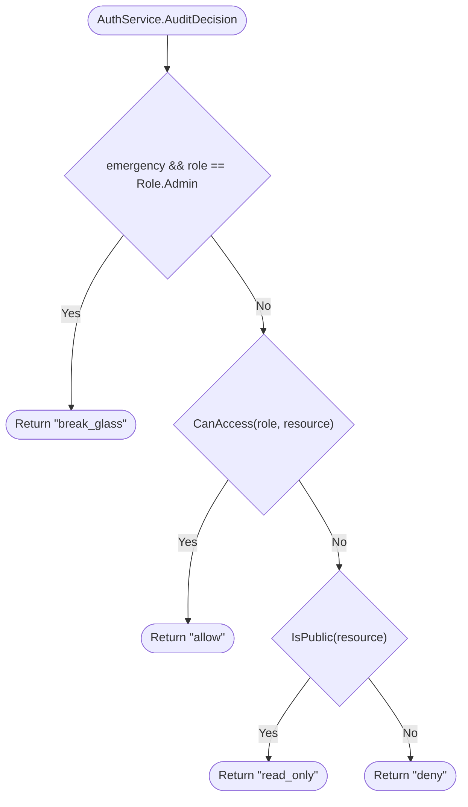

### AuthService.CanAccess

`method` · `csharp` · `generic` · [`examples/demo/backend/auth/AuthService.cs:12`](../examples/demo/backend/auth/AuthService.cs#L12)

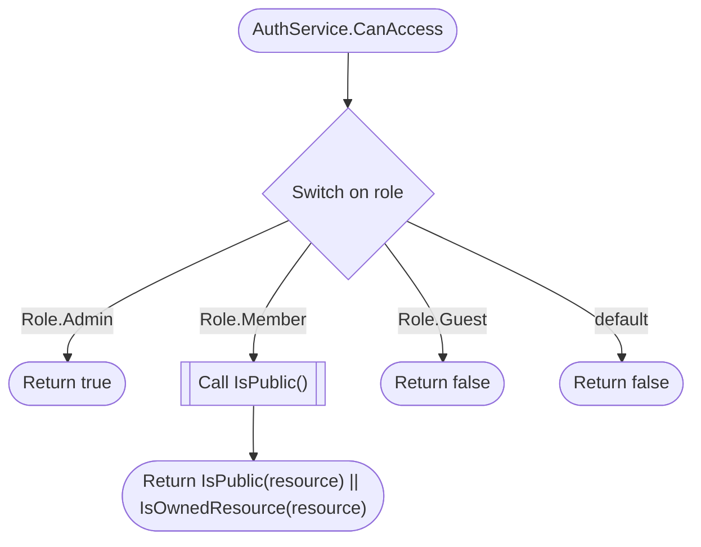

### BillingService.refund

`method` · `java` · `generic` · [`examples/demo/backend/billing/BillingService.java:28`](../examples/demo/backend/billing/BillingService.java#L28)

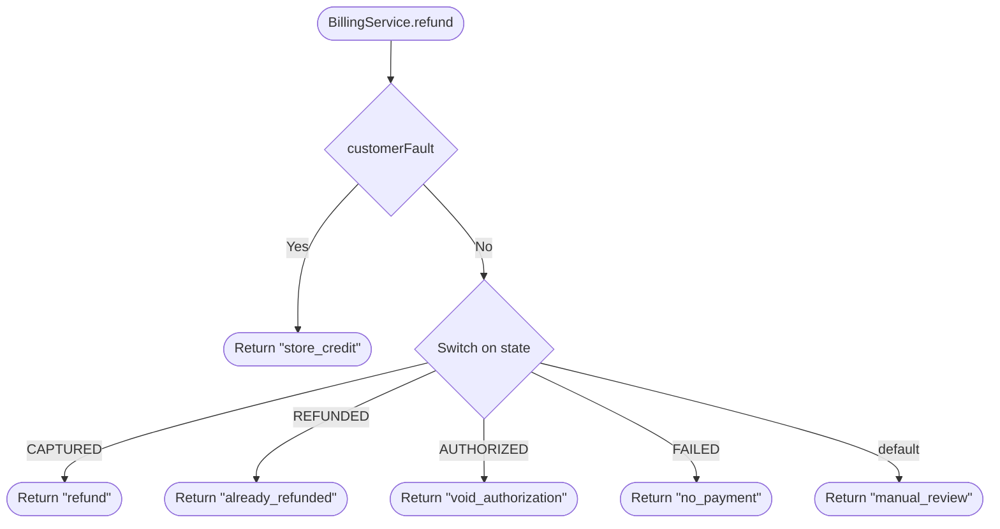

### BillingService.settle

`method` · `java` · `generic` · [`examples/demo/backend/billing/BillingService.java:13`](../examples/demo/backend/billing/BillingService.java#L13)

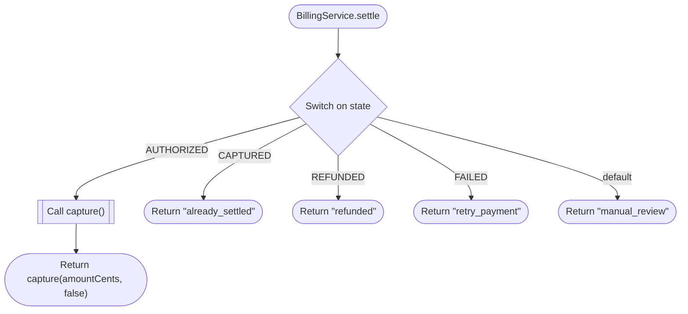

### evict\_index

`function` · `c` · `generic` · [`examples/demo/backend/cache/cache.c:11`](../examples/demo/backend/cache/cache.c#L11)

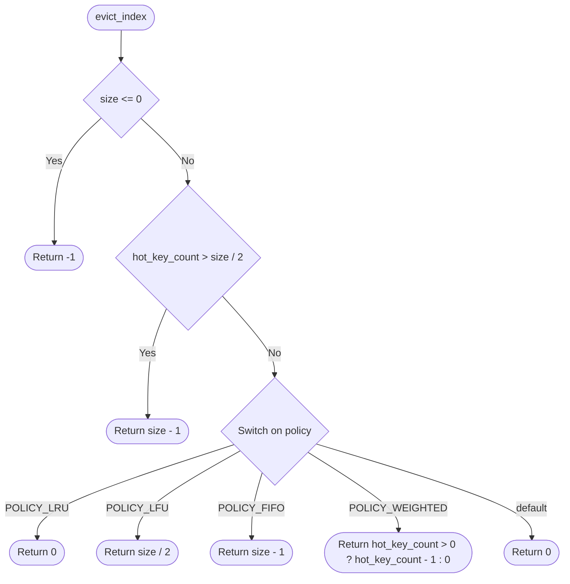

### Catalog.merchandisingAction

`method` · `php` · `generic` · [`examples/demo/backend/catalog/Catalog.php:23`](../examples/demo/backend/catalog/Catalog.php#L23)

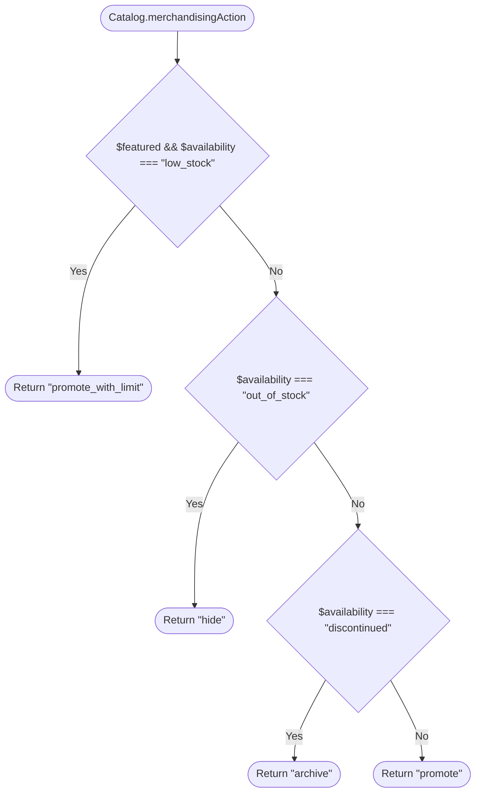

### Catalog.reorderQuantity

`method` · `php` · `generic` · [`examples/demo/backend/catalog/Catalog.php:7`](../examples/demo/backend/catalog/Catalog.php#L7)

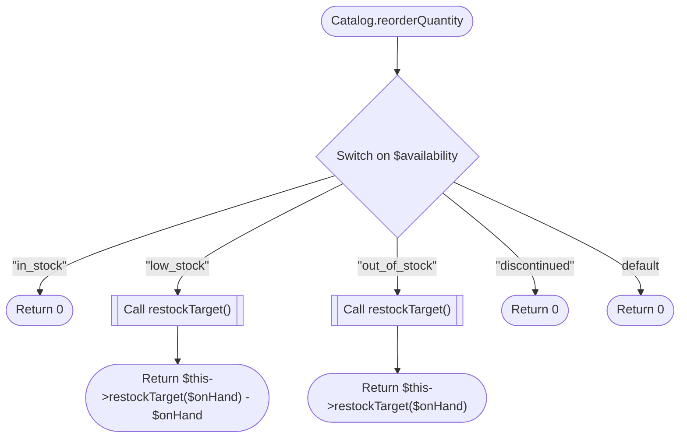

### NativePolicy.ttl

`method` · `cpp` · `generic` · [`examples/demo/backend/native/policy.cpp:11`](../examples/demo/backend/native/policy.cpp#L11)

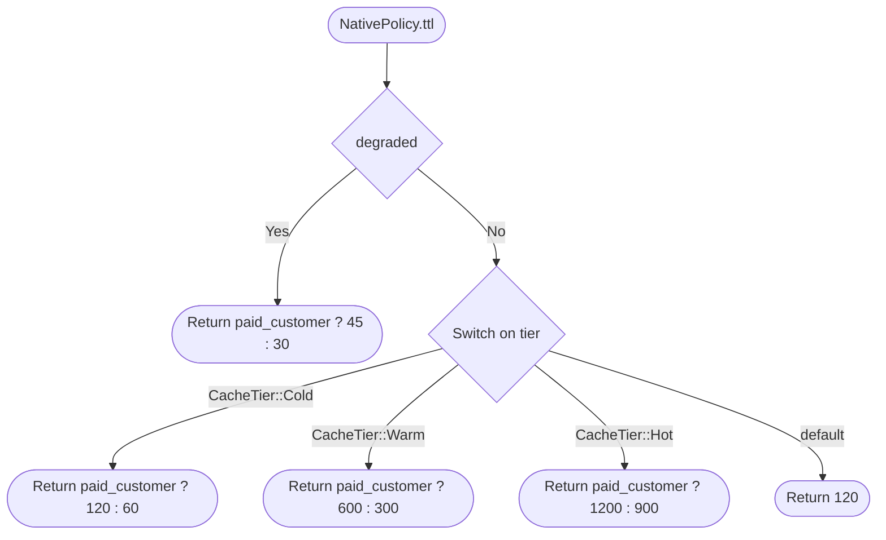

### backend.AdmissionControl.allow

`method` · `cpp` · `generic` · [`examples/demo/backend/native/admission.cpp:14`](../examples/demo/backend/native/admission.cpp#L14)

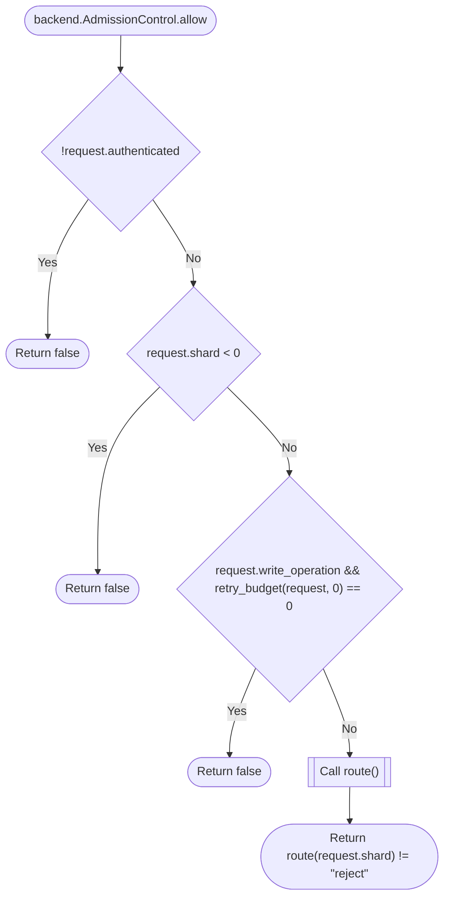

### backend.AdmissionControl.retry\_budget

`method` · `cpp` · `generic` · [`examples/demo/backend/native/admission.cpp:40`](../examples/demo/backend/native/admission.cpp#L40)

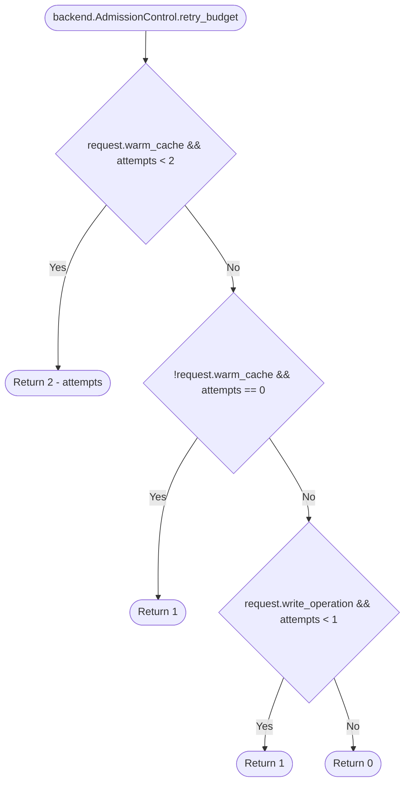

### backend.AdmissionControl.route

`method` · `cpp` · `generic` · [`examples/demo/backend/native/admission.cpp:27`](../examples/demo/backend/native/admission.cpp#L27)

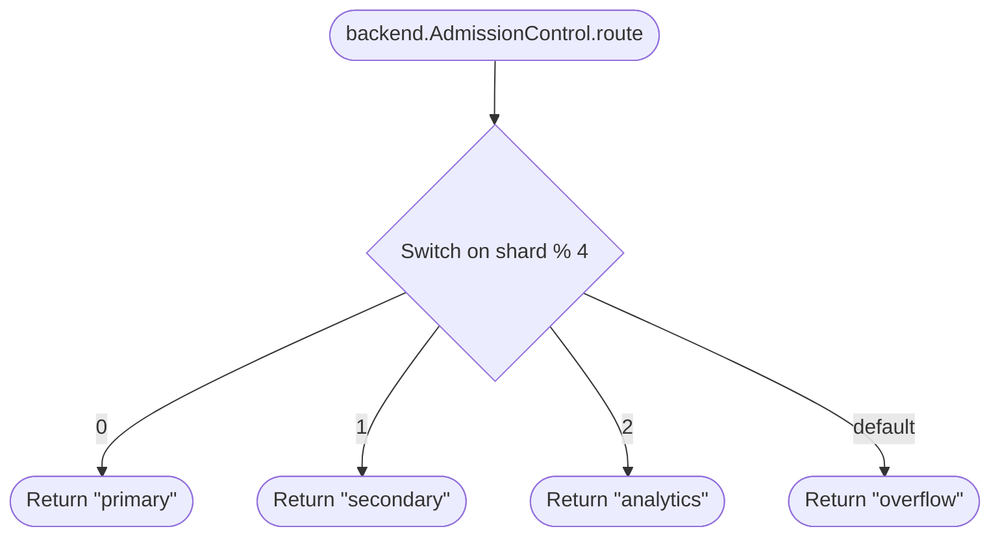

### Notifier.deliver

`method` · `ruby` · `generic` · [`examples/demo/backend/notifications/notifier.rb:4`](../examples/demo/backend/notifications/notifier.rb#L4)

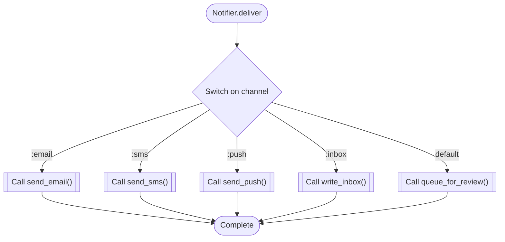

### Notifier.digest

`method` · `ruby` · `generic` · [`examples/demo/backend/notifications/notifier.rb:19`](../examples/demo/backend/notifications/notifier.rb#L19)

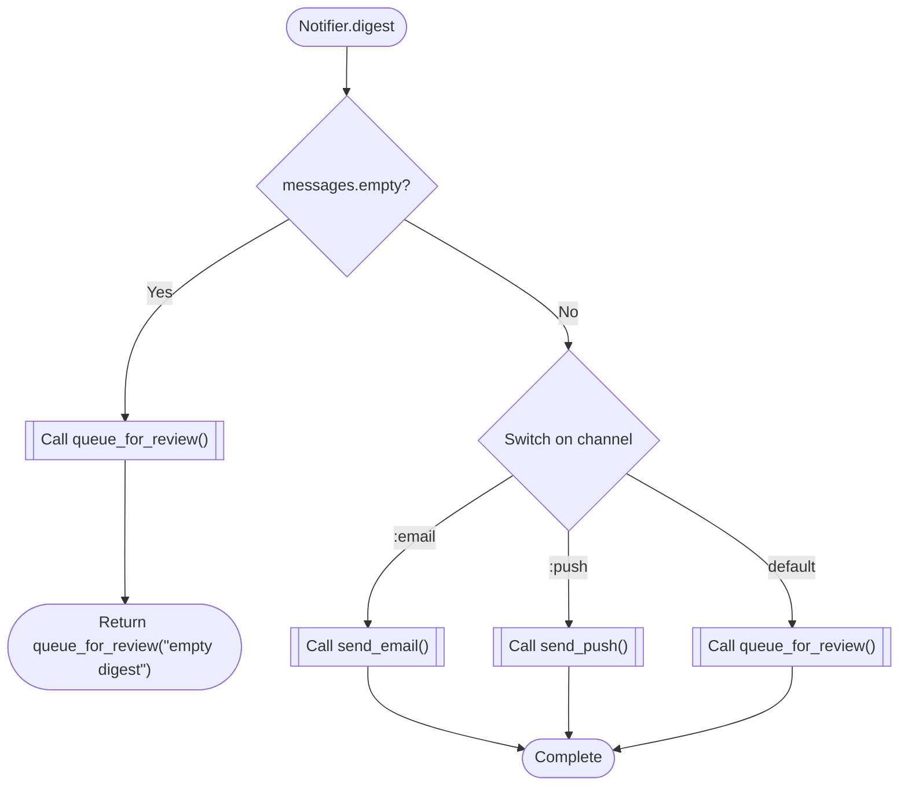

### Notifier.queue\_for\_review

`method` · `ruby` · `generic` · [`examples/demo/backend/notifications/notifier.rb:53`](../examples/demo/backend/notifications/notifier.rb#L53)

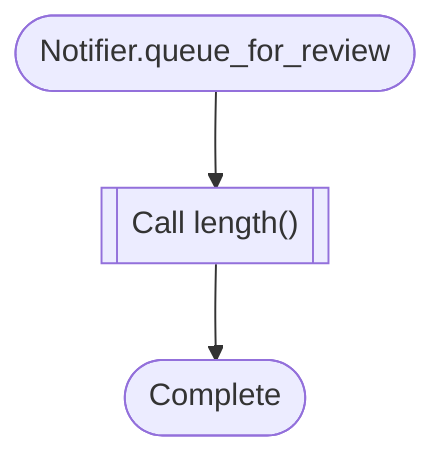

### Notifier.send\_email

`method` · `ruby` · `generic` · [`examples/demo/backend/notifications/notifier.rb:35`](../examples/demo/backend/notifications/notifier.rb#L35)

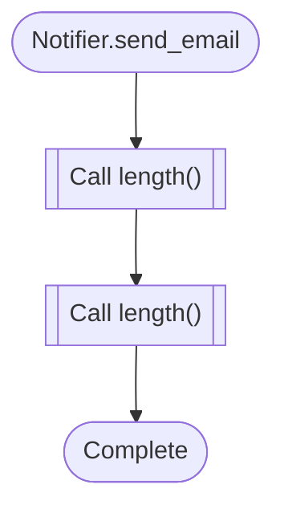

### Notifier.send\_push

`method` · `ruby` · `generic` · [`examples/demo/backend/notifications/notifier.rb:45`](../examples/demo/backend/notifications/notifier.rb#L45)

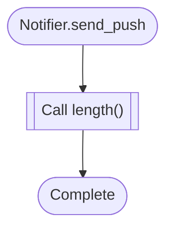

### Notifier.send\_sms

`method` · `ruby` · `generic` · [`examples/demo/backend/notifications/notifier.rb:41`](../examples/demo/backend/notifications/notifier.rb#L41)


### Notifier.urgent?

`method` · `ruby` · `generic` · [`examples/demo/backend/notifications/notifier.rb:57`](../examples/demo/backend/notifications/notifier.rb#L57)

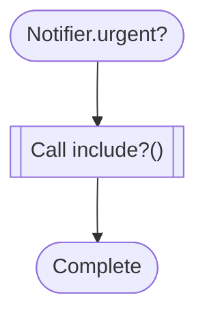

### Notifier.write\_inbox

`method` · `ruby` · `generic` · [`examples/demo/backend/notifications/notifier.rb:49`](../examples/demo/backend/notifications/notifier.rb#L49)

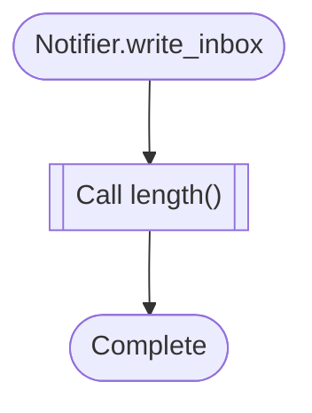

### Order.CanFulfill

`method` · `go` · `generic` · [`examples/demo/backend/orders/service.go:67`](../examples/demo/backend/orders/service.go#L67)

```mermaid
flowchart TD
  mflow_99a2ebfc956e8b2c_n1(["Order.CanFulfill"])
  mflow_99a2ebfc956e8b2c_n2{"o.Status != StatusPaid"}
  mflow_99a2ebfc956e8b2c_n3(["Return false"])
  mflow_99a2ebfc956e8b2c_n4{"!stockAvailable"}
  mflow_99a2ebfc956e8b2c_n5(["Return false"])
  mflow_99a2ebfc956e8b2c_n6(["Return true"])
  mflow_99a2ebfc956e8b2c_n1 --> mflow_99a2ebfc956e8b2c_n2
  mflow_99a2ebfc956e8b2c_n2 -->|"Yes"| mflow_99a2ebfc956e8b2c_n3
  mflow_99a2ebfc956e8b2c_n2 -->|"No"| mflow_99a2ebfc956e8b2c_n4
  mflow_99a2ebfc956e8b2c_n4 -->|"Yes"| mflow_99a2ebfc956e8b2c_n5
  mflow_99a2ebfc956e8b2c_n4 -->|"No"| mflow_99a2ebfc956e8b2c_n6
```

### Order.FulfillmentPlan

`method` · `go` · `generic` · [`examples/demo/backend/orders/service.go:40`](../examples/demo/backend/orders/service.go#L40)

```mermaid
flowchart TD
  mflow_3d07442ab2fe8ec4_n1(["Order.FulfillmentPlan"])
  mflow_3d07442ab2fe8ec4_n2{"!o.CanFulfill(stockAvailable)"}
  mflow_3d07442ab2fe8ec4_n3(["Return &quot;hold&quot;"])
  mflow_3d07442ab2fe8ec4_n4{"!carrierHealthy"}
  mflow_3d07442ab2fe8ec4_n5(["Return &quot;queue_carrier_retry&quot;"])
  mflow_3d07442ab2fe8ec4_n6{"o.Expedited"}
  mflow_3d07442ab2fe8ec4_n7(["Return &quot;priority_pack&quot;"])
  mflow_3d07442ab2fe8ec4_n8(["Return &quot;standard_pack&quot;"])
  mflow_3d07442ab2fe8ec4_n1 --> mflow_3d07442ab2fe8ec4_n2
  mflow_3d07442ab2fe8ec4_n2 -->|"Yes"| mflow_3d07442ab2fe8ec4_n3
  mflow_3d07442ab2fe8ec4_n2 -->|"No"| mflow_3d07442ab2fe8ec4_n4
  mflow_3d07442ab2fe8ec4_n4 -->|"Yes"| mflow_3d07442ab2fe8ec4_n5
  mflow_3d07442ab2fe8ec4_n4 -->|"No"| mflow_3d07442ab2fe8ec4_n6
  mflow_3d07442ab2fe8ec4_n6 -->|"Yes"| mflow_3d07442ab2fe8ec4_n7
  mflow_3d07442ab2fe8ec4_n6 -->|"No"| mflow_3d07442ab2fe8ec4_n8
```

### Order.NextAction

`method` · `go` · `generic` · [`examples/demo/backend/orders/service.go:23`](../examples/demo/backend/orders/service.go#L23)

```mermaid
flowchart TD
  mflow_dc4e68214dc82497_n1(["Order.NextAction"])
  mflow_dc4e68214dc82497_n2{"Switch on o.Status"}
  mflow_dc4e68214dc82497_n3[["Call o.pendingAction()"]]
  mflow_dc4e68214dc82497_n4(["Return o.pendingAction()"])
  mflow_dc4e68214dc82497_n5[["Call o.paidAction()"]]
  mflow_dc4e68214dc82497_n6(["Return o.paidAction()"])
  mflow_dc4e68214dc82497_n7(["Return &quot;track_delivery&quot;"])
  mflow_dc4e68214dc82497_n8(["Return &quot;request_review&quot;"])
  mflow_dc4e68214dc82497_n9(["Return &quot;issue_refund&quot;"])
  mflow_dc4e68214dc82497_n10(["Return &quot;manual_review&quot;"])
  mflow_dc4e68214dc82497_n1 --> mflow_dc4e68214dc82497_n2
  mflow_dc4e68214dc82497_n2 -->|"StatusPending"| mflow_dc4e68214dc82497_n3
  mflow_dc4e68214dc82497_n3 --> mflow_dc4e68214dc82497_n4
  mflow_dc4e68214dc82497_n2 -->|"StatusPaid"| mflow_dc4e68214dc82497_n5
  mflow_dc4e68214dc82497_n5 --> mflow_dc4e68214dc82497_n6
  mflow_dc4e68214dc82497_n2 -->|"StatusShipped"| mflow_dc4e68214dc82497_n7
  mflow_dc4e68214dc82497_n2 -->|"StatusDelivered"| mflow_dc4e68214dc82497_n8
  mflow_dc4e68214dc82497_n2 -->|"StatusCancelled"| mflow_dc4e68214dc82497_n9
  mflow_dc4e68214dc82497_n2 -->|"default"| mflow_dc4e68214dc82497_n10
```

### Order.RefundPolicy

`method` · `go` · `generic` · [`examples/demo/backend/orders/service.go:53`](../examples/demo/backend/orders/service.go#L53)

```mermaid
flowchart TD
  mflow_887ea25e7969f319_n1(["Order.RefundPolicy"])
  mflow_887ea25e7969f319_n2{"o.Status == StatusDelivered && reason == &quot;damaged&quot;"}
  mflow_887ea25e7969f319_n3(["Return &quot;refund_and_replace&quot;"])
  mflow_887ea25e7969f319_n4{"o.Status == StatusCancelled"}
  mflow_887ea25e7969f319_n5(["Return &quot;refund&quot;"])
  mflow_887ea25e7969f319_n6{"o.RiskScore &gt; 80"}
  mflow_887ea25e7969f319_n7(["Return &quot;manual_review&quot;"])
  mflow_887ea25e7969f319_n8(["Return &quot;store_credit&quot;"])
  mflow_887ea25e7969f319_n1 --> mflow_887ea25e7969f319_n2
  mflow_887ea25e7969f319_n2 -->|"Yes"| mflow_887ea25e7969f319_n3
  mflow_887ea25e7969f319_n2 -->|"No"| mflow_887ea25e7969f319_n4
  mflow_887ea25e7969f319_n4 -->|"Yes"| mflow_887ea25e7969f319_n5
  mflow_887ea25e7969f319_n4 -->|"No"| mflow_887ea25e7969f319_n6
  mflow_887ea25e7969f319_n6 -->|"Yes"| mflow_887ea25e7969f319_n7
  mflow_887ea25e7969f319_n6 -->|"No"| mflow_887ea25e7969f319_n8
```

### dispatch

`function` · `rust` · `generic` · [`examples/demo/backend/router/src/lib.rs:12`](../examples/demo/backend/router/src/lib.rs#L12)

```mermaid
flowchart TD
  mflow_9259780255b6b463_n1(["dispatch"])
  mflow_9259780255b6b463_n2{"degraded"}
  mflow_9259780255b6b463_n3[["Call degraded_status()"]]
  mflow_9259780255b6b463_n4(["Return degraded_status(route)"])
  mflow_9259780255b6b463_n5{"Switch on route"}
  mflow_9259780255b6b463_n6["200"]
  mflow_9259780255b6b463_n7[["Call guard()"]]
  mflow_9259780255b6b463_n8[["Call guard()"]]
  mflow_9259780255b6b463_n9[["Call guard()"]]
  mflow_9259780255b6b463_n10["200"]
  mflow_9259780255b6b463_n11["404"]
  mflow_9259780255b6b463_n12(["Complete"])
  mflow_9259780255b6b463_n1 --> mflow_9259780255b6b463_n2
  mflow_9259780255b6b463_n2 -->|"Yes"| mflow_9259780255b6b463_n3
  mflow_9259780255b6b463_n3 --> mflow_9259780255b6b463_n4
  mflow_9259780255b6b463_n2 -->|"No"| mflow_9259780255b6b463_n5
  mflow_9259780255b6b463_n5 -->|"Route::Health"| mflow_9259780255b6b463_n6
  mflow_9259780255b6b463_n5 -->|"Route::Users"| mflow_9259780255b6b463_n7
  mflow_9259780255b6b463_n5 -->|"Route::Orders"| mflow_9259780255b6b463_n8
  mflow_9259780255b6b463_n5 -->|"Route::Billing"| mflow_9259780255b6b463_n9
  mflow_9259780255b6b463_n5 -->|"Route::Catalog"| mflow_9259780255b6b463_n10
  mflow_9259780255b6b463_n5 -->|"Route::Unknown"| mflow_9259780255b6b463_n11
  mflow_9259780255b6b463_n6 --> mflow_9259780255b6b463_n12
  mflow_9259780255b6b463_n7 --> mflow_9259780255b6b463_n12
  mflow_9259780255b6b463_n8 --> mflow_9259780255b6b463_n12
  mflow_9259780255b6b463_n9 --> mflow_9259780255b6b463_n12
  mflow_9259780255b6b463_n10 --> mflow_9259780255b6b463_n12
  mflow_9259780255b6b463_n11 --> mflow_9259780255b6b463_n12
```

### archive\_user

`function` · `python` · `generic` · [`examples/demo/backend/users.py:63`](../examples/demo/backend/users.py#L63)

```mermaid
flowchart TD
  mflow_7c701820993d7fff_n1(["archive_user"])
  mflow_7c701820993d7fff_n2["Set user.status"]
  mflow_7c701820993d7fff_n3(["Return user"])
  mflow_7c701820993d7fff_n1 --> mflow_7c701820993d7fff_n2
  mflow_7c701820993d7fff_n2 --> mflow_7c701820993d7fff_n3
```

### get\_user

`route` · `python` · `fastapi` · [`examples/demo/backend/users.py:23`](../examples/demo/backend/users.py#L23)

```mermaid
flowchart TD
  mflow_f6e3d6b7fe12b83f_n1(["Route: get_user"])
  mflow_f6e3d6b7fe12b83f_n2[["Call load_user()"]]
  mflow_f6e3d6b7fe12b83f_n3{"user is None"}
  mflow_f6e3d6b7fe12b83f_n4{{"Raise HTTPException(status_code=404)"}}
  mflow_f6e3d6b7fe12b83f_n5{"user.status == UserStatus.SUSPENDED"}
  mflow_f6e3d6b7fe12b83f_n6{{"Raise HTTPException(status_code=403)"}}
  mflow_f6e3d6b7fe12b83f_n7(["Return user"])
  mflow_f6e3d6b7fe12b83f_n1 --> mflow_f6e3d6b7fe12b83f_n2
  mflow_f6e3d6b7fe12b83f_n2 --> mflow_f6e3d6b7fe12b83f_n3
  mflow_f6e3d6b7fe12b83f_n3 -->|"Yes"| mflow_f6e3d6b7fe12b83f_n4
  mflow_f6e3d6b7fe12b83f_n3 -->|"No"| mflow_f6e3d6b7fe12b83f_n5
  mflow_f6e3d6b7fe12b83f_n5 -->|"Yes"| mflow_f6e3d6b7fe12b83f_n6
  mflow_f6e3d6b7fe12b83f_n5 -->|"No"| mflow_f6e3d6b7fe12b83f_n7
```

### load\_user

`function` · `python` · `generic` · [`examples/demo/backend/users.py:47`](../examples/demo/backend/users.py#L47)

```mermaid
flowchart TD
  mflow_f35a3698106b0817_n1(["load_user"])
  mflow_f35a3698106b0817_n2[["Call repository.fetch()"]]
  mflow_f35a3698106b0817_n3(["Return await repository.fetch(user_id)"])
  mflow_f35a3698106b0817_n1 --> mflow_f35a3698106b0817_n2
  mflow_f35a3698106b0817_n2 --> mflow_f35a3698106b0817_n3
```

### restore\_user

`function` · `python` · `generic` · [`examples/demo/backend/users.py:68`](../examples/demo/backend/users.py#L68)

```mermaid
flowchart TD
  mflow_ace5dd36ca3d7521_n1(["restore_user"])
  mflow_ace5dd36ca3d7521_n2["Set user.status"]
  mflow_ace5dd36ca3d7521_n3(["Return user"])
  mflow_ace5dd36ca3d7521_n1 --> mflow_ace5dd36ca3d7521_n2
  mflow_ace5dd36ca3d7521_n2 --> mflow_ace5dd36ca3d7521_n3
```

### update\_user

`route` · `python` · `fastapi` · [`examples/demo/backend/users.py:33`](../examples/demo/backend/users.py#L33)

```mermaid
flowchart TD
  mflow_bcc7862495a399b1_n1(["Route: update_user"])
  mflow_bcc7862495a399b1_n2[["Call load_user()"]]
  mflow_bcc7862495a399b1_n3{"user is None"}
  mflow_bcc7862495a399b1_n4{{"Raise HTTPException(status_code=404)"}}
  mflow_bcc7862495a399b1_n5[["Call user_action()"]]
  mflow_bcc7862495a399b1_n6{"action == 'deny'"}
  mflow_bcc7862495a399b1_n7{{"Raise HTTPException(status_code=403)"}}
  mflow_bcc7862495a399b1_n8{"action == 'archive'"}
  mflow_bcc7862495a399b1_n9[["Call archive_user()"]]
  mflow_bcc7862495a399b1_n10(["Return await archive_user(user)"])
  mflow_bcc7862495a399b1_n11{"action == 'restore'"}
  mflow_bcc7862495a399b1_n12[["Call restore_user()"]]
  mflow_bcc7862495a399b1_n13(["Return await restore_user(user)"])
  mflow_bcc7862495a399b1_n14(["Return user"])
  mflow_bcc7862495a399b1_n1 --> mflow_bcc7862495a399b1_n2
  mflow_bcc7862495a399b1_n2 --> mflow_bcc7862495a399b1_n3
  mflow_bcc7862495a399b1_n3 -->|"Yes"| mflow_bcc7862495a399b1_n4
  mflow_bcc7862495a399b1_n3 -->|"No"| mflow_bcc7862495a399b1_n5
  mflow_bcc7862495a399b1_n5 --> mflow_bcc7862495a399b1_n6
  mflow_bcc7862495a399b1_n6 -->|"Yes"| mflow_bcc7862495a399b1_n7
  mflow_bcc7862495a399b1_n6 -->|"No"| mflow_bcc7862495a399b1_n8
  mflow_bcc7862495a399b1_n8 -->|"Yes"| mflow_bcc7862495a399b1_n9
  mflow_bcc7862495a399b1_n9 --> mflow_bcc7862495a399b1_n10
  mflow_bcc7862495a399b1_n8 -->|"No"| mflow_bcc7862495a399b1_n11
  mflow_bcc7862495a399b1_n11 -->|"Yes"| mflow_bcc7862495a399b1_n12
  mflow_bcc7862495a399b1_n12 --> mflow_bcc7862495a399b1_n13
  mflow_bcc7862495a399b1_n11 -->|"No"| mflow_bcc7862495a399b1_n14
```

### user\_action

`function` · `python` · `generic` · [`examples/demo/backend/users.py:51`](../examples/demo/backend/users.py#L51)

```mermaid
flowchart TD
  mflow_764cb8abc18ad0eb_n1(["user_action"])
  mflow_764cb8abc18ad0eb_n2{"user.status == UserStatus.DELETED"}
  mflow_764cb8abc18ad0eb_n3(["Return 'deny'"])
  mflow_764cb8abc18ad0eb_n4{"command == 'archive' and user.status == UserStatus.ACTIVE"}
  mflow_764cb8abc18ad0eb_n5(["Return 'archive'"])
  mflow_764cb8abc18ad0eb_n6{"command == 'restore' and user.status == UserStatus.SUSPENDED"}
  mflow_764cb8abc18ad0eb_n7(["Return 'restore'"])
  mflow_764cb8abc18ad0eb_n8{"command == 'delete'"}
  mflow_764cb8abc18ad0eb_n9(["Return 'deny'"])
  mflow_764cb8abc18ad0eb_n10(["Return 'noop'"])
  mflow_764cb8abc18ad0eb_n1 --> mflow_764cb8abc18ad0eb_n2
  mflow_764cb8abc18ad0eb_n2 -->|"Yes"| mflow_764cb8abc18ad0eb_n3
  mflow_764cb8abc18ad0eb_n2 -->|"No"| mflow_764cb8abc18ad0eb_n4
  mflow_764cb8abc18ad0eb_n4 -->|"Yes"| mflow_764cb8abc18ad0eb_n5
  mflow_764cb8abc18ad0eb_n4 -->|"No"| mflow_764cb8abc18ad0eb_n6
  mflow_764cb8abc18ad0eb_n6 -->|"Yes"| mflow_764cb8abc18ad0eb_n7
  mflow_764cb8abc18ad0eb_n6 -->|"No"| mflow_764cb8abc18ad0eb_n8
  mflow_764cb8abc18ad0eb_n8 -->|"Yes"| mflow_764cb8abc18ad0eb_n9
  mflow_764cb8abc18ad0eb_n8 -->|"No"| mflow_764cb8abc18ad0eb_n10
```

### GET

`route` · `typescript` · `nextjs` · [`examples/demo/frontend/app/api/orders/route.ts:5`](../examples/demo/frontend/app/api/orders/route.ts#L5)

```mermaid
flowchart TD
  mflow_e18a3a55b37ae612_n1(["Route: GET"])
  mflow_e18a3a55b37ae612_n2[["Call loadOrder()"]]
  mflow_e18a3a55b37ae612_n3[["Call loadUser()"]]
  mflow_e18a3a55b37ae612_n4{"Switch on order.state"}
  mflow_e18a3a55b37ae612_n5[["Call draftResponse()"]]
  mflow_e18a3a55b37ae612_n6(["Return draftResponse(order, user)"])
  mflow_e18a3a55b37ae612_n7[["Call openResponse()"]]
  mflow_e18a3a55b37ae612_n8(["Return openResponse(order, user)"])
  mflow_e18a3a55b37ae612_n9[["Call paidResponse()"]]
  mflow_e18a3a55b37ae612_n10(["Return paidResponse(order, user)"])
  mflow_e18a3a55b37ae612_n11[["Call reviewResponse()"]]
  mflow_e18a3a55b37ae612_n12(["Return reviewResponse(order, user)"])
  mflow_e18a3a55b37ae612_n13(["Return new Response(&quot;Closed&quot;, { status: 410 })"])
  mflow_e18a3a55b37ae612_n14(["Return new Response(&quot;Cancelled&quot;, { status: 409 })"])
  mflow_e18a3a55b37ae612_n15(["Complete"])
  mflow_e18a3a55b37ae612_n1 --> mflow_e18a3a55b37ae612_n2
  mflow_e18a3a55b37ae612_n2 --> mflow_e18a3a55b37ae612_n3
  mflow_e18a3a55b37ae612_n3 --> mflow_e18a3a55b37ae612_n4
  mflow_e18a3a55b37ae612_n4 -->|"OrderState.DRAFT"| mflow_e18a3a55b37ae612_n5
  mflow_e18a3a55b37ae612_n5 --> mflow_e18a3a55b37ae612_n6
  mflow_e18a3a55b37ae612_n4 -->|"OrderState.OPEN"| mflow_e18a3a55b37ae612_n7
  mflow_e18a3a55b37ae612_n7 --> mflow_e18a3a55b37ae612_n8
  mflow_e18a3a55b37ae612_n4 -->|"OrderState.PAID"| mflow_e18a3a55b37ae612_n9
  mflow_e18a3a55b37ae612_n9 --> mflow_e18a3a55b37ae612_n10
  mflow_e18a3a55b37ae612_n4 -->|"OrderState.FRAUD_REVIEW"| mflow_e18a3a55b37ae612_n11
  mflow_e18a3a55b37ae612_n11 --> mflow_e18a3a55b37ae612_n12
  mflow_e18a3a55b37ae612_n4 -->|"OrderState.CLOSED"| mflow_e18a3a55b37ae612_n13
  mflow_e18a3a55b37ae612_n4 -->|"OrderState.CANCELLED"| mflow_e18a3a55b37ae612_n14
  mflow_e18a3a55b37ae612_n4 -->|"default"| mflow_e18a3a55b37ae612_n15
```

**Review points:**
- `Switch on order.state`: Declared OrderState members not handled for order.state: OrderState.BACKORDERED, OrderState.CHARGEBACK, OrderState.RETURNED

### PATCH

`route` · `typescript` · `nextjs` · [`examples/demo/frontend/app/api/orders/route.ts:25`](../examples/demo/frontend/app/api/orders/route.ts#L25)

```mermaid
flowchart TD
  mflow_956287b0dd1c16fc_n1(["Route: PATCH"])
  mflow_956287b0dd1c16fc_n2[["Call loadOrder()"]]
  mflow_956287b0dd1c16fc_n3[["Call loadUser()"]]
  mflow_956287b0dd1c16fc_n4[["Call decideOrderAction()"]]
  mflow_956287b0dd1c16fc_n5{"action === &quot;reject&quot;"}
  mflow_956287b0dd1c16fc_n6[["Call auditOrder()"]]
  mflow_956287b0dd1c16fc_n7(["Return new Response(&quot;Order blocked&quot;, { status: 403 })"])
  mflow_956287b0dd1c16fc_n8{"action === &quot;review&quot;"}
  mflow_956287b0dd1c16fc_n9[["Call auditOrder()"]]
  mflow_956287b0dd1c16fc_n10(["Return new Response(&quot;Review required&quot;, { status: 202 })"])
  mflow_956287b0dd1c16fc_n11[["Call applyOrderAction()"]]
  mflow_956287b0dd1c16fc_n12[["Call auditOrder()"]]
  mflow_956287b0dd1c16fc_n13[["Call Response.json()"]]
  mflow_956287b0dd1c16fc_n14(["Return Response.json(saved)"])
  mflow_956287b0dd1c16fc_n1 --> mflow_956287b0dd1c16fc_n2
  mflow_956287b0dd1c16fc_n2 --> mflow_956287b0dd1c16fc_n3
  mflow_956287b0dd1c16fc_n3 --> mflow_956287b0dd1c16fc_n4
  mflow_956287b0dd1c16fc_n4 --> mflow_956287b0dd1c16fc_n5
  mflow_956287b0dd1c16fc_n5 -->|"Yes"| mflow_956287b0dd1c16fc_n6
  mflow_956287b0dd1c16fc_n6 --> mflow_956287b0dd1c16fc_n7
  mflow_956287b0dd1c16fc_n5 -->|"No"| mflow_956287b0dd1c16fc_n8
  mflow_956287b0dd1c16fc_n8 -->|"Yes"| mflow_956287b0dd1c16fc_n9
  mflow_956287b0dd1c16fc_n9 --> mflow_956287b0dd1c16fc_n10
  mflow_956287b0dd1c16fc_n8 -->|"No"| mflow_956287b0dd1c16fc_n11
  mflow_956287b0dd1c16fc_n11 --> mflow_956287b0dd1c16fc_n12
  mflow_956287b0dd1c16fc_n12 --> mflow_956287b0dd1c16fc_n13
  mflow_956287b0dd1c16fc_n13 --> mflow_956287b0dd1c16fc_n14
```

### GET

`route` · `typescript` · `nextjs` · [`examples/demo/frontend/app/api/users/route.ts:4`](../examples/demo/frontend/app/api/users/route.ts#L4)

```mermaid
flowchart TD
  mflow_f64ac14e1834df93_n1(["Route: GET"])
  mflow_f64ac14e1834df93_n2[["Call loadUser()"]]
  mflow_f64ac14e1834df93_n3[["Call resolveUserAccess()"]]
  mflow_f64ac14e1834df93_n4{"access === &quot;blocked&quot;"}
  mflow_f64ac14e1834df93_n5(["Return new Response(&quot;Blocked&quot;, { status: 403 })"])
  mflow_f64ac14e1834df93_n6{"access === &quot;gone&quot;"}
  mflow_f64ac14e1834df93_n7(["Return new Response(&quot;Deleted&quot;, { status: 410 })"])
  mflow_f64ac14e1834df93_n8[["Call Response.json()"]]
  mflow_f64ac14e1834df93_n9(["Return Response.json({ user, access })"])
  mflow_f64ac14e1834df93_n1 --> mflow_f64ac14e1834df93_n2
  mflow_f64ac14e1834df93_n2 --> mflow_f64ac14e1834df93_n3
  mflow_f64ac14e1834df93_n3 --> mflow_f64ac14e1834df93_n4
  mflow_f64ac14e1834df93_n4 -->|"Yes"| mflow_f64ac14e1834df93_n5
  mflow_f64ac14e1834df93_n4 -->|"No"| mflow_f64ac14e1834df93_n6
  mflow_f64ac14e1834df93_n6 -->|"Yes"| mflow_f64ac14e1834df93_n7
  mflow_f64ac14e1834df93_n6 -->|"No"| mflow_f64ac14e1834df93_n8
  mflow_f64ac14e1834df93_n8 --> mflow_f64ac14e1834df93_n9
```

### POST

`route` · `typescript` · `nextjs` · [`examples/demo/frontend/app/api/users/route.ts:17`](../examples/demo/frontend/app/api/users/route.ts#L17)

```mermaid
flowchart TD
  mflow_f74e7243a59c82e6_n1(["Route: POST"])
  mflow_f74e7243a59c82e6_n2[["Call loadUser()"]]
  mflow_f74e7243a59c82e6_n3[["Call moderationAction()"]]
  mflow_f74e7243a59c82e6_n4["Handle internal condition: moderation === &quot;review&quot;"]
  mflow_f74e7243a59c82e6_n5{"Switch on user.status"}
  mflow_f74e7243a59c82e6_n6[["Call Response.json()"]]
  mflow_f74e7243a59c82e6_n7(["Return Response.json(await activateUser(user))"])
  mflow_f74e7243a59c82e6_n8[["Call auditUser()"]]
  mflow_f74e7243a59c82e6_n9(["Return new Response(&quot;Blocked&quot;, { status: 403 })"])
  mflow_f74e7243a59c82e6_n10(["Complete"])
  mflow_f74e7243a59c82e6_n1 --> mflow_f74e7243a59c82e6_n2
  mflow_f74e7243a59c82e6_n2 --> mflow_f74e7243a59c82e6_n3
  mflow_f74e7243a59c82e6_n3 --> mflow_f74e7243a59c82e6_n4
  mflow_f74e7243a59c82e6_n4 --> mflow_f74e7243a59c82e6_n5
  mflow_f74e7243a59c82e6_n5 -->|"UserStatus.ACTIVE"| mflow_f74e7243a59c82e6_n6
  mflow_f74e7243a59c82e6_n6 --> mflow_f74e7243a59c82e6_n7
  mflow_f74e7243a59c82e6_n5 -->|"UserStatus.SUSPENDED"| mflow_f74e7243a59c82e6_n8
  mflow_f74e7243a59c82e6_n8 --> mflow_f74e7243a59c82e6_n9
  mflow_f74e7243a59c82e6_n5 -->|"default"| mflow_f74e7243a59c82e6_n10
```

**Review points:**
- `Switch on user.status`: Declared UserStatus members not handled for user.status: UserStatus.ARCHIVED, UserStatus.DELETED, UserStatus.LOCKED

### UsersPage

`component` · `typescript` · `nextjs` · [`examples/demo/frontend/app/users/page.tsx:1`](../examples/demo/frontend/app/users/page.tsx#L1)

```mermaid
flowchart TD
  mflow_75546b2685371cc9_n1(["Component: UsersPage"])
  mflow_75546b2685371cc9_n2{"user.isLoading"}
  mflow_75546b2685371cc9_n3(["Return &lt;LoadingSkeleton /&gt;"])
  mflow_75546b2685371cc9_n4{"user.error"}
  mflow_75546b2685371cc9_n5(["Return &lt;ErrorState error={user.error} /&gt;"])
  mflow_75546b2685371cc9_n6{"!user.isAuthorized"}
  mflow_75546b2685371cc9_n7(["Return &lt;LoginPrompt /&gt;"])
  mflow_75546b2685371cc9_n8{"user.status === &quot;deleted&quot;"}
  mflow_75546b2685371cc9_n9(["Return &lt;DeletedAccount /&gt;"])
  mflow_75546b2685371cc9_n10{"user.status === &quot;suspended&quot;"}
  mflow_75546b2685371cc9_n11(["Return &lt;SuspendedAccount user={user} /&gt;"])
  mflow_75546b2685371cc9_n12{"user.status === &quot;archived&quot;"}
  mflow_75546b2685371cc9_n13(["Return &lt;ArchivedAccount user={user} /&gt;"])
  mflow_75546b2685371cc9_n14{"user.status === &quot;locked&quot;"}
  mflow_75546b2685371cc9_n15(["Return &lt;LockedAccount user={user} /&gt;"])
  mflow_75546b2685371cc9_n16[["Call dashboardMode()"]]
  mflow_75546b2685371cc9_n17(["Return &lt;UserDashboard user={user} mode={dashboardMode(user)} /&gt;"])
  mflow_75546b2685371cc9_n1 --> mflow_75546b2685371cc9_n2
  mflow_75546b2685371cc9_n2 -->|"Yes"| mflow_75546b2685371cc9_n3
  mflow_75546b2685371cc9_n2 -->|"No"| mflow_75546b2685371cc9_n4
  mflow_75546b2685371cc9_n4 -->|"Yes"| mflow_75546b2685371cc9_n5
  mflow_75546b2685371cc9_n4 -->|"No"| mflow_75546b2685371cc9_n6
  mflow_75546b2685371cc9_n6 -->|"Yes"| mflow_75546b2685371cc9_n7
  mflow_75546b2685371cc9_n6 -->|"No"| mflow_75546b2685371cc9_n8
  mflow_75546b2685371cc9_n8 -->|"Yes"| mflow_75546b2685371cc9_n9
  mflow_75546b2685371cc9_n8 -->|"No"| mflow_75546b2685371cc9_n10
  mflow_75546b2685371cc9_n10 -->|"Yes"| mflow_75546b2685371cc9_n11
  mflow_75546b2685371cc9_n10 -->|"No"| mflow_75546b2685371cc9_n12
  mflow_75546b2685371cc9_n12 -->|"Yes"| mflow_75546b2685371cc9_n13
  mflow_75546b2685371cc9_n12 -->|"No"| mflow_75546b2685371cc9_n14
  mflow_75546b2685371cc9_n14 -->|"Yes"| mflow_75546b2685371cc9_n15
  mflow_75546b2685371cc9_n14 -->|"No"| mflow_75546b2685371cc9_n16
  mflow_75546b2685371cc9_n16 --> mflow_75546b2685371cc9_n17
```

### statusLabel

`function` · `javascript` · `generic` · [`examples/demo/frontend/lib/status.js:3`](../examples/demo/frontend/lib/status.js#L3)

```mermaid
flowchart TD
  mflow_b9ac3318caa675de_n1(["statusLabel"])
  mflow_b9ac3318caa675de_n2{"Switch on status"}
  mflow_b9ac3318caa675de_n3(["Return &quot;Active&quot;"])
  mflow_b9ac3318caa675de_n4(["Return &quot;Suspended&quot;"])
  mflow_b9ac3318caa675de_n5(["Return &quot;Deleted&quot;"])
  mflow_b9ac3318caa675de_n6(["Return &quot;Archived&quot;"])
  mflow_b9ac3318caa675de_n7(["Return &quot;Locked&quot;"])
  mflow_b9ac3318caa675de_n8(["Return &quot;Unknown&quot;"])
  mflow_b9ac3318caa675de_n1 --> mflow_b9ac3318caa675de_n2
  mflow_b9ac3318caa675de_n2 -->|"&quot;active&quot;"| mflow_b9ac3318caa675de_n3
  mflow_b9ac3318caa675de_n2 -->|"&quot;suspended&quot;"| mflow_b9ac3318caa675de_n4
  mflow_b9ac3318caa675de_n2 -->|"&quot;deleted&quot;"| mflow_b9ac3318caa675de_n5
  mflow_b9ac3318caa675de_n2 -->|"&quot;archived&quot;"| mflow_b9ac3318caa675de_n6
  mflow_b9ac3318caa675de_n2 -->|"&quot;locked&quot;"| mflow_b9ac3318caa675de_n7
  mflow_b9ac3318caa675de_n2 -->|"default"| mflow_b9ac3318caa675de_n8
```

### statusTone

`function` · `javascript` · `generic` · [`examples/demo/frontend/lib/status.js:20`](../examples/demo/frontend/lib/status.js#L20)

```mermaid
flowchart TD
  mflow_d18ad051649c1dc1_n1(["statusTone"])
  mflow_d18ad051649c1dc1_n2{"Switch on status"}
  mflow_d18ad051649c1dc1_n3(["Return &quot;success&quot;"])
  mflow_d18ad051649c1dc1_n4(["Return &quot;warning&quot;"])
  mflow_d18ad051649c1dc1_n5(["Return &quot;danger&quot;"])
  mflow_d18ad051649c1dc1_n6(["Return &quot;neutral&quot;"])
  mflow_d18ad051649c1dc1_n7(["Return &quot;danger&quot;"])
  mflow_d18ad051649c1dc1_n8(["Return &quot;neutral&quot;"])
  mflow_d18ad051649c1dc1_n1 --> mflow_d18ad051649c1dc1_n2
  mflow_d18ad051649c1dc1_n2 -->|"&quot;active&quot;"| mflow_d18ad051649c1dc1_n3
  mflow_d18ad051649c1dc1_n2 -->|"&quot;suspended&quot;"| mflow_d18ad051649c1dc1_n4
  mflow_d18ad051649c1dc1_n2 -->|"&quot;deleted&quot;"| mflow_d18ad051649c1dc1_n5
  mflow_d18ad051649c1dc1_n2 -->|"&quot;archived&quot;"| mflow_d18ad051649c1dc1_n6
  mflow_d18ad051649c1dc1_n2 -->|"&quot;locked&quot;"| mflow_d18ad051649c1dc1_n7
  mflow_d18ad051649c1dc1_n2 -->|"default"| mflow_d18ad051649c1dc1_n8
```

### delete\_user

`function` · `python` · `generic` · [`examples/shop/backend/api/admin_routes.py:7`](../examples/shop/backend/api/admin_routes.py#L7)

```mermaid
flowchart TD
  mflow_22d844fbd2f31cd3_n1(["delete_user"])
  mflow_22d844fbd2f31cd3_n2["'Control: gated on the ADMIN role before the destructive action.'"]
  mflow_22d844fbd2f31cd3_n3[["Call require_role()"]]
  mflow_22d844fbd2f31cd3_n4[["Call do_delete()"]]
  mflow_22d844fbd2f31cd3_n5(["Complete"])
  mflow_22d844fbd2f31cd3_n1 --> mflow_22d844fbd2f31cd3_n2
  mflow_22d844fbd2f31cd3_n2 --> mflow_22d844fbd2f31cd3_n3
  mflow_22d844fbd2f31cd3_n3 --> mflow_22d844fbd2f31cd3_n4
  mflow_22d844fbd2f31cd3_n4 --> mflow_22d844fbd2f31cd3_n5
```

### purge\_user

`function` · `python` · `generic` · [`examples/shop/backend/api/admin_routes.py:13`](../examples/shop/backend/api/admin_routes.py#L13)

```mermaid
flowchart TD
  mflow_83e56dcea5b74bf9_n1(["purge_user"])
  mflow_83e56dcea5b74bf9_n2["'Planted #12: the require_role gate its sibling delete_user has is missing.'"]
  mflow_83e56dcea5b74bf9_n3[["Call do_purge()"]]
  mflow_83e56dcea5b74bf9_n4(["Complete"])
  mflow_83e56dcea5b74bf9_n1 --> mflow_83e56dcea5b74bf9_n2
  mflow_83e56dcea5b74bf9_n2 --> mflow_83e56dcea5b74bf9_n3
  mflow_83e56dcea5b74bf9_n3 --> mflow_83e56dcea5b74bf9_n4
```

### cancel

`function` · `python` · `generic` · [`examples/shop/backend/api/orders_routes.py:6`](../examples/shop/backend/api/orders_routes.py#L6)

```mermaid
flowchart TD
  mflow_1128bc0f809cd8d6_n1(["cancel"])
  mflow_1128bc0f809cd8d6_n2["'Refundable set {PLACED, PAID}; rejects with 404 - sibling of request_refund.'"]
  mflow_1128bc0f809cd8d6_n3{"order.status not in (OrderStatus.PLACED, OrderStatus.PAID)"}
  mflow_1128bc0f809cd8d6_n4{{"Raise ApiError(404, 'order is not cancellable')"}}
  mflow_1128bc0f809cd8d6_n5[["Call do_cancel()"]]
  mflow_1128bc0f809cd8d6_n6(["Complete"])
  mflow_1128bc0f809cd8d6_n1 --> mflow_1128bc0f809cd8d6_n2
  mflow_1128bc0f809cd8d6_n2 --> mflow_1128bc0f809cd8d6_n3
  mflow_1128bc0f809cd8d6_n3 -->|"Yes"| mflow_1128bc0f809cd8d6_n4
  mflow_1128bc0f809cd8d6_n3 -->|"No"| mflow_1128bc0f809cd8d6_n5
  mflow_1128bc0f809cd8d6_n5 --> mflow_1128bc0f809cd8d6_n6
```

### create

`function` · `python` · `generic` · [`examples/shop/backend/api/orders_routes.py:21`](../examples/shop/backend/api/orders_routes.py#L21)

```mermaid
flowchart TD
  mflow_f482b3026e3ea072_n1(["create"])
  mflow_f482b3026e3ea072_n2["'Control: validates before writing.'"]
  mflow_f482b3026e3ea072_n3{"not has_items(payload)"}
  mflow_f482b3026e3ea072_n4{{"Raise ApiError(422, 'an order needs at least one item')"}}
  mflow_f482b3026e3ea072_n5[["Call build_order()"]]
  mflow_f482b3026e3ea072_n6(["Return build_order(payload)"])
  mflow_f482b3026e3ea072_n1 --> mflow_f482b3026e3ea072_n2
  mflow_f482b3026e3ea072_n2 --> mflow_f482b3026e3ea072_n3
  mflow_f482b3026e3ea072_n3 -->|"Yes"| mflow_f482b3026e3ea072_n4
  mflow_f482b3026e3ea072_n3 -->|"No"| mflow_f482b3026e3ea072_n5
  mflow_f482b3026e3ea072_n5 --> mflow_f482b3026e3ea072_n6
```

### quick\_order

`function` · `python` · `generic` · [`examples/shop/backend/api/orders_routes.py:28`](../examples/shop/backend/api/orders_routes.py#L28)

```mermaid
flowchart TD
  mflow_4143ee18aecc0353_n1(["quick_order"])
  mflow_4143ee18aecc0353_n2["'Planted #13: the validation guard create() has is missing here.'"]
  mflow_4143ee18aecc0353_n3[["Call build_order()"]]
  mflow_4143ee18aecc0353_n4(["Return build_order(payload)"])
  mflow_4143ee18aecc0353_n1 --> mflow_4143ee18aecc0353_n2
  mflow_4143ee18aecc0353_n2 --> mflow_4143ee18aecc0353_n3
  mflow_4143ee18aecc0353_n3 --> mflow_4143ee18aecc0353_n4
```

### request\_refund

`function` · `python` · `generic` · [`examples/shop/backend/api/orders_routes.py:13`](../examples/shop/backend/api/orders_routes.py#L13)

```mermaid
flowchart TD
  mflow_08a786dcbded8185_n1(["request_refund"])
  mflow_08a786dcbded8185_n2["'Planted #7/#8: a divergent refundable set {PAID, SHIPPED, DELIVERED} and a 409\\n where t..."]
  mflow_08a786dcbded8185_n3{"order.status not in (OrderStatus.PAID, OrderStatus.SHIPPED, OrderStatus.DELIVERED)"}
  mflow_08a786dcbded8185_n4{{"Raise ApiError(409, 'order is not refundable')"}}
  mflow_08a786dcbded8185_n5[["Call do_refund()"]]
  mflow_08a786dcbded8185_n6(["Complete"])
  mflow_08a786dcbded8185_n1 --> mflow_08a786dcbded8185_n2
  mflow_08a786dcbded8185_n2 --> mflow_08a786dcbded8185_n3
  mflow_08a786dcbded8185_n3 -->|"Yes"| mflow_08a786dcbded8185_n4
  mflow_08a786dcbded8185_n3 -->|"No"| mflow_08a786dcbded8185_n5
  mflow_08a786dcbded8185_n5 --> mflow_08a786dcbded8185_n6
```

### change\_email

`function` · `python` · `generic` · [`examples/shop/backend/api/users_routes.py:13`](../examples/shop/backend/api/users_routes.py#L13)

```mermaid
flowchart TD
  mflow_bf4bdbe9cee93085_n1(["change_email"])
  mflow_bf4bdbe9cee93085_n2["'Planted #3: dispatches on AccountStatus but omits ACTIVE and PENDING_VERIFICATION.'"]
  mflow_bf4bdbe9cee93085_n3{"account.status == AccountStatus.SUSPENDED"}
  mflow_bf4bdbe9cee93085_n4{{"Raise ApiError(403, 'account suspended')"}}
  mflow_bf4bdbe9cee93085_n5{"account.status == AccountStatus.DELETED"}
  mflow_bf4bdbe9cee93085_n6{{"Raise ApiError(410, 'account deleted')"}}
  mflow_bf4bdbe9cee93085_n7[["Call update_email()"]]
  mflow_bf4bdbe9cee93085_n8(["Complete"])
  mflow_bf4bdbe9cee93085_n1 --> mflow_bf4bdbe9cee93085_n2
  mflow_bf4bdbe9cee93085_n2 --> mflow_bf4bdbe9cee93085_n3
  mflow_bf4bdbe9cee93085_n3 -->|"Yes"| mflow_bf4bdbe9cee93085_n4
  mflow_bf4bdbe9cee93085_n3 -->|"No"| mflow_bf4bdbe9cee93085_n5
  mflow_bf4bdbe9cee93085_n5 -->|"Yes"| mflow_bf4bdbe9cee93085_n6
  mflow_bf4bdbe9cee93085_n5 -->|"No"| mflow_bf4bdbe9cee93085_n7
  mflow_bf4bdbe9cee93085_n7 --> mflow_bf4bdbe9cee93085_n8
```

**Review points:**
- `account.status == AccountStatus.SUSPENDED`: Declared AccountStatus members not handled for account.status: AccountStatus.ACTIVE, AccountStatus.PENDING\_VERIFICATION

### get\_profile

`function` · `python` · `generic` · [`examples/shop/backend/api/users_routes.py:22`](../examples/shop/backend/api/users_routes.py#L22)

```mermaid
flowchart TD
  mflow_694730b8745d57de_n1(["get_profile"])
  mflow_694730b8745d57de_n2["'Control: a single-value guard, correctly not flagged.'"]
  mflow_694730b8745d57de_n3{"account.status == AccountStatus.DELETED"}
  mflow_694730b8745d57de_n4{{"Raise ApiError(410, 'account deleted')"}}
  mflow_694730b8745d57de_n5(["Return {'id': account.id, 'role': account.role.value}"])
  mflow_694730b8745d57de_n1 --> mflow_694730b8745d57de_n2
  mflow_694730b8745d57de_n2 --> mflow_694730b8745d57de_n3
  mflow_694730b8745d57de_n3 -->|"Yes"| mflow_694730b8745d57de_n4
  mflow_694730b8745d57de_n3 -->|"No"| mflow_694730b8745d57de_n5
```

### reset\_password

`function` · `python` · `generic` · [`examples/shop/backend/api/users_routes.py:6`](../examples/shop/backend/api/users_routes.py#L6)

```mermaid
flowchart TD
  mflow_836bfa1aef528de0_n1(["reset_password"])
  mflow_836bfa1aef528de0_n2["'Control: a single-value guard (block suspended), not an exhaustive dispatch.'"]
  mflow_836bfa1aef528de0_n3{"account.status == AccountStatus.SUSPENDED"}
  mflow_836bfa1aef528de0_n4{{"Raise ApiError(403, 'suspended accounts cannot reset their password')"}}
  mflow_836bfa1aef528de0_n5[["Call issue_reset_token()"]]
  mflow_836bfa1aef528de0_n6(["Return issue_reset_token(account)"])
  mflow_836bfa1aef528de0_n1 --> mflow_836bfa1aef528de0_n2
  mflow_836bfa1aef528de0_n2 --> mflow_836bfa1aef528de0_n3
  mflow_836bfa1aef528de0_n3 -->|"Yes"| mflow_836bfa1aef528de0_n4
  mflow_836bfa1aef528de0_n3 -->|"No"| mflow_836bfa1aef528de0_n5
  mflow_836bfa1aef528de0_n5 --> mflow_836bfa1aef528de0_n6
```

### ensure\_authenticated

`function` · `python` · `generic` · [`examples/shop/backend/auth.py:12`](../examples/shop/backend/auth.py#L12)

```mermaid
flowchart TD
  mflow_92971030a65d1410_n1(["ensure_authenticated"])
  mflow_92971030a65d1410_n2["'Ensure a request is authenticated.'"]
  mflow_92971030a65d1410_n3{"account is None"}
  mflow_92971030a65d1410_n4{{"Raise ApiError(401, 'authentication required')"}}
  mflow_92971030a65d1410_n5(["Return account"])
  mflow_92971030a65d1410_n1 --> mflow_92971030a65d1410_n2
  mflow_92971030a65d1410_n2 --> mflow_92971030a65d1410_n3
  mflow_92971030a65d1410_n3 -->|"Yes"| mflow_92971030a65d1410_n4
  mflow_92971030a65d1410_n3 -->|"No"| mflow_92971030a65d1410_n5
```

### require\_role

`function` · `python` · `generic` · [`examples/shop/backend/auth.py:6`](../examples/shop/backend/auth.py#L6)

```mermaid
flowchart TD
  mflow_93e6edefb10af9c5_n1(["require_role"])
  mflow_93e6edefb10af9c5_n2["'Ensure the account holds the required role, else raise ApiError(403).'"]
  mflow_93e6edefb10af9c5_n3{"account.role != required"}
  mflow_93e6edefb10af9c5_n4{{"Raise ApiError(403, f'requires {required.value}')"}}
  mflow_93e6edefb10af9c5_n5(["Complete"])
  mflow_93e6edefb10af9c5_n1 --> mflow_93e6edefb10af9c5_n2
  mflow_93e6edefb10af9c5_n2 --> mflow_93e6edefb10af9c5_n3
  mflow_93e6edefb10af9c5_n3 -->|"Yes"| mflow_93e6edefb10af9c5_n4
  mflow_93e6edefb10af9c5_n3 -->|"No"| mflow_93e6edefb10af9c5_n5
```

### summarize

`function` · `python` · `generic` · [`examples/shop/backend/orders_service.py:19`](../examples/shop/backend/orders_service.py#L19)

```mermaid
flowchart TD
  mflow_cfef4e8dba6238fd_n1(["summarize"])
  mflow_cfef4e8dba6238fd_n2["'Planted #10: a no-op branch (the refunded case does nothing).'"]
  mflow_cfef4e8dba6238fd_n3["Set summary"]
  mflow_cfef4e8dba6238fd_n4{"order.status == OrderStatus.REFUNDED"}
  mflow_cfef4e8dba6238fd_n5["pass"]
  mflow_cfef4e8dba6238fd_n6["Set summary['status']"]
  mflow_cfef4e8dba6238fd_n7(["Return summary"])
  mflow_cfef4e8dba6238fd_n1 --> mflow_cfef4e8dba6238fd_n2
  mflow_cfef4e8dba6238fd_n2 --> mflow_cfef4e8dba6238fd_n3
  mflow_cfef4e8dba6238fd_n3 --> mflow_cfef4e8dba6238fd_n4
  mflow_cfef4e8dba6238fd_n4 -->|"Yes"| mflow_cfef4e8dba6238fd_n5
  mflow_cfef4e8dba6238fd_n4 -->|"No"| mflow_cfef4e8dba6238fd_n6
  mflow_cfef4e8dba6238fd_n5 --> mflow_cfef4e8dba6238fd_n7
  mflow_cfef4e8dba6238fd_n6 --> mflow_cfef4e8dba6238fd_n7
```

**Review points:**
- `order.status == OrderStatus.REFUNDED`: Branch 'Yes' has an empty body

### transition

`function` · `python` · `generic` · [`examples/shop/backend/orders_service.py:6`](../examples/shop/backend/orders_service.py#L6)

```mermaid
flowchart TD
  mflow_4e833d53a700855c_n1(["transition"])
  mflow_4e833d53a700855c_n2["'Planted #4: match on order.status with no `case _` default.'"]
  mflow_4e833d53a700855c_n3{"Match order.status"}
  mflow_4e833d53a700855c_n4["Set order.status"]
  mflow_4e833d53a700855c_n5["Set order.status"]
  mflow_4e833d53a700855c_n6["Set order.status"]
  mflow_4e833d53a700855c_n7["Set order.status"]
  mflow_4e833d53a700855c_n8(["Complete"])
  mflow_4e833d53a700855c_n1 --> mflow_4e833d53a700855c_n2
  mflow_4e833d53a700855c_n2 --> mflow_4e833d53a700855c_n3
  mflow_4e833d53a700855c_n3 -->|"OrderStatus.CART"| mflow_4e833d53a700855c_n4
  mflow_4e833d53a700855c_n3 -->|"OrderStatus.PLACED"| mflow_4e833d53a700855c_n5
  mflow_4e833d53a700855c_n3 -->|"OrderStatus.PAID"| mflow_4e833d53a700855c_n6
  mflow_4e833d53a700855c_n3 -->|"OrderStatus.SHIPPED"| mflow_4e833d53a700855c_n7
  mflow_4e833d53a700855c_n4 --> mflow_4e833d53a700855c_n8
  mflow_4e833d53a700855c_n5 --> mflow_4e833d53a700855c_n8
  mflow_4e833d53a700855c_n6 --> mflow_4e833d53a700855c_n8
  mflow_4e833d53a700855c_n7 --> mflow_4e833d53a700855c_n8
  mflow_4e833d53a700855c_n3 -->|"_"| mflow_4e833d53a700855c_n8
```

**Review points:**
- `Match order.status`: Declared OrderStatus members not handled for order.status: OrderStatus.CANCELLED, OrderStatus.DELIVERED, OrderStatus.REFUNDED

### capture\_payment

`function` · `python` · `generic` · [`examples/shop/backend/payments_service.py:39`](../examples/shop/backend/payments_service.py#L39)

```mermaid
flowchart TD
  mflow_3b15514408bbb3ee_n1(["capture_payment"])
  mflow_3b15514408bbb3ee_n2["'Planted #14 (sibling B): silently returns on the same invalid-amount path.'"]
  mflow_3b15514408bbb3ee_n3{"order.total_cents &lt;= 0"}
  mflow_3b15514408bbb3ee_n4(["Return"])
  mflow_3b15514408bbb3ee_n5[["Call gateway_capture()"]]
  mflow_3b15514408bbb3ee_n6(["Complete"])
  mflow_3b15514408bbb3ee_n1 --> mflow_3b15514408bbb3ee_n2
  mflow_3b15514408bbb3ee_n2 --> mflow_3b15514408bbb3ee_n3
  mflow_3b15514408bbb3ee_n3 -->|"Yes"| mflow_3b15514408bbb3ee_n4
  mflow_3b15514408bbb3ee_n3 -->|"No"| mflow_3b15514408bbb3ee_n5
  mflow_3b15514408bbb3ee_n5 --> mflow_3b15514408bbb3ee_n6
```

**Review points:**
- `order.total_cents <= 0`: Guard 'order.total\_cents \<= 0' is logged in a sibling flow but silent here

### charge

`function` · `python` · `generic` · [`examples/shop/backend/payments_service.py:19`](../examples/shop/backend/payments_service.py#L19)

```mermaid
flowchart TD
  mflow_3fb7f77aa3ec9fd5_n1(["charge"])
  mflow_3fb7f77aa3ec9fd5_n2["'Planted #6: broad-except that swallows the failure (and the dead guard #11).'"]
  mflow_3fb7f77aa3ec9fd5_n3{"ENABLE_DOUBLE_CHARGE_GUARD"}
  mflow_3fb7f77aa3ec9fd5_n4{{"Raise ApiError(409, 'double charge blocked')"}}
  mflow_3fb7f77aa3ec9fd5_n5{"Operation succeeds?"}
  mflow_3fb7f77aa3ec9fd5_n6[["Call gateway_charge()"]]
  mflow_3fb7f77aa3ec9fd5_n7["pass"]
  mflow_3fb7f77aa3ec9fd5_n8(["Return result"])
  mflow_3fb7f77aa3ec9fd5_n1 --> mflow_3fb7f77aa3ec9fd5_n2
  mflow_3fb7f77aa3ec9fd5_n2 --> mflow_3fb7f77aa3ec9fd5_n3
  mflow_3fb7f77aa3ec9fd5_n3 -->|"Yes"| mflow_3fb7f77aa3ec9fd5_n4
  mflow_3fb7f77aa3ec9fd5_n3 -->|"No"| mflow_3fb7f77aa3ec9fd5_n5
  mflow_3fb7f77aa3ec9fd5_n5 -->|"Success"| mflow_3fb7f77aa3ec9fd5_n6
  mflow_3fb7f77aa3ec9fd5_n5 -->|"Exception"| mflow_3fb7f77aa3ec9fd5_n7
  mflow_3fb7f77aa3ec9fd5_n6 --> mflow_3fb7f77aa3ec9fd5_n8
  mflow_3fb7f77aa3ec9fd5_n7 --> mflow_3fb7f77aa3ec9fd5_n8
```

**Review points:**
- `Operation succeeds?`: Exception handler 'Exception' swallows the error
- `ENABLE_DOUBLE_CHARGE_GUARD`: Guard on the constant ENABLE\_DOUBLE\_CHARGE\_GUARD is always False

### handle\_result

`event_handler` · `python` · `generic` · [`examples/shop/backend/payments_service.py:9`](../examples/shop/backend/payments_service.py#L9)

```mermaid
flowchart TD
  mflow_d8c77f3ddc158387_n1(["handle_result"])
  mflow_d8c77f3ddc158387_n2["'Planted #5: if/elif chain on PaymentResult missing FRAUD_REVIEW and no else.'"]
  mflow_d8c77f3ddc158387_n3{"result == PaymentResult.APPROVED"}
  mflow_d8c77f3ddc158387_n4(["Return 'paid'"])
  mflow_d8c77f3ddc158387_n5{"result == PaymentResult.DECLINED"}
  mflow_d8c77f3ddc158387_n6(["Return 'declined'"])
  mflow_d8c77f3ddc158387_n7{"result == PaymentResult.PENDING"}
  mflow_d8c77f3ddc158387_n8(["Return 'pending'"])
  mflow_d8c77f3ddc158387_n9(["Complete"])
  mflow_d8c77f3ddc158387_n1 --> mflow_d8c77f3ddc158387_n2
  mflow_d8c77f3ddc158387_n2 --> mflow_d8c77f3ddc158387_n3
  mflow_d8c77f3ddc158387_n3 -->|"Yes"| mflow_d8c77f3ddc158387_n4
  mflow_d8c77f3ddc158387_n3 -->|"No"| mflow_d8c77f3ddc158387_n5
  mflow_d8c77f3ddc158387_n5 -->|"Yes"| mflow_d8c77f3ddc158387_n6
  mflow_d8c77f3ddc158387_n5 -->|"No"| mflow_d8c77f3ddc158387_n7
  mflow_d8c77f3ddc158387_n7 -->|"Yes"| mflow_d8c77f3ddc158387_n8
  mflow_d8c77f3ddc158387_n7 -->|"No"| mflow_d8c77f3ddc158387_n9
```

**Review points:**
- `result == PaymentResult.APPROVED`: Declared PaymentResult members not handled for result: PaymentResult.FRAUD\_REVIEW

### refund\_payment

`function` · `python` · `generic` · [`examples/shop/backend/payments_service.py:30`](../examples/shop/backend/payments_service.py#L30)

```mermaid
flowchart TD
  mflow_7dfa5d0eac72e588_n1(["refund_payment"])
  mflow_7dfa5d0eac72e588_n2["'Planted #14 (sibling A): logs and alerts on the invalid-amount path.'"]
  mflow_7dfa5d0eac72e588_n3{"order.total_cents &lt;= 0"}
  mflow_7dfa5d0eac72e588_n4[["Call log_warning()"]]
  mflow_7dfa5d0eac72e588_n5[["Call alert_ops()"]]
  mflow_7dfa5d0eac72e588_n6{{"Raise ApiError(422, 'invalid refund amount')"}}
  mflow_7dfa5d0eac72e588_n7[["Call gateway_refund()"]]
  mflow_7dfa5d0eac72e588_n8(["Complete"])
  mflow_7dfa5d0eac72e588_n1 --> mflow_7dfa5d0eac72e588_n2
  mflow_7dfa5d0eac72e588_n2 --> mflow_7dfa5d0eac72e588_n3
  mflow_7dfa5d0eac72e588_n3 -->|"Yes"| mflow_7dfa5d0eac72e588_n4
  mflow_7dfa5d0eac72e588_n4 --> mflow_7dfa5d0eac72e588_n5
  mflow_7dfa5d0eac72e588_n5 --> mflow_7dfa5d0eac72e588_n6
  mflow_7dfa5d0eac72e588_n3 -->|"No"| mflow_7dfa5d0eac72e588_n7
  mflow_7dfa5d0eac72e588_n7 --> mflow_7dfa5d0eac72e588_n8
```

### authenticate

`function` · `python` · `generic` · [`examples/shop/backend/users_service.py:7`](../examples/shop/backend/users_service.py#L7)

```mermaid
flowchart TD
  mflow_c00fda52066729a3_n1(["authenticate"])
  mflow_c00fda52066729a3_n2["'Reference handler: every AccountStatus is handled explicitly, with an else.\\n\\n This is..."]
  mflow_c00fda52066729a3_n3[["Call ensure_authenticated()"]]
  mflow_c00fda52066729a3_n4{"account.status == AccountStatus.SUSPENDED"}
  mflow_c00fda52066729a3_n5{{"Raise ApiError(403, 'account suspended')"}}
  mflow_c00fda52066729a3_n6{"account.status == AccountStatus.DELETED"}
  mflow_c00fda52066729a3_n7{{"Raise ApiError(410, 'account deleted')"}}
  mflow_c00fda52066729a3_n8{"account.status == AccountStatus.PENDING_VERIFICATION"}
  mflow_c00fda52066729a3_n9{{"Raise ApiError(403, 'verify your email first')"}}
  mflow_c00fda52066729a3_n10{"account.status == AccountStatus.ACTIVE"}
  mflow_c00fda52066729a3_n11(["Return account"])
  mflow_c00fda52066729a3_n12{{"Raise ApiError(500, 'unknown account status')"}}
  mflow_c00fda52066729a3_n1 --> mflow_c00fda52066729a3_n2
  mflow_c00fda52066729a3_n2 --> mflow_c00fda52066729a3_n3
  mflow_c00fda52066729a3_n3 --> mflow_c00fda52066729a3_n4
  mflow_c00fda52066729a3_n4 -->|"Yes"| mflow_c00fda52066729a3_n5
  mflow_c00fda52066729a3_n4 -->|"No"| mflow_c00fda52066729a3_n6
  mflow_c00fda52066729a3_n6 -->|"Yes"| mflow_c00fda52066729a3_n7
  mflow_c00fda52066729a3_n6 -->|"No"| mflow_c00fda52066729a3_n8
  mflow_c00fda52066729a3_n8 -->|"Yes"| mflow_c00fda52066729a3_n9
  mflow_c00fda52066729a3_n8 -->|"No"| mflow_c00fda52066729a3_n10
  mflow_c00fda52066729a3_n10 -->|"Yes"| mflow_c00fda52066729a3_n11
  mflow_c00fda52066729a3_n10 -->|"No"| mflow_c00fda52066729a3_n12
```

### load\_profile

`function` · `python` · `generic` · [`examples/shop/backend/users_service.py:26`](../examples/shop/backend/users_service.py#L26)

```mermaid
flowchart TD
  mflow_68e9ed308389b179_n1(["load_profile"])
  mflow_68e9ed308389b179_n2["'Planted #9: dead code after an unconditional return.'"]
  mflow_68e9ed308389b179_n3["Set profile"]
  mflow_68e9ed308389b179_n4(["Return profile"])
  mflow_68e9ed308389b179_n1 --> mflow_68e9ed308389b179_n2
  mflow_68e9ed308389b179_n2 --> mflow_68e9ed308389b179_n3
  mflow_68e9ed308389b179_n3 --> mflow_68e9ed308389b179_n4
```

### AccountPage

`component` · `typescript` · `nextjs` · [`examples/shop/frontend/app/account/page.tsx:4`](../examples/shop/frontend/app/account/page.tsx#L4)

```mermaid
flowchart TD
  mflow_aff7a7b992bc22b9_n1(["Component: AccountPage"])
  mflow_aff7a7b992bc22b9_n2{"Switch on account.status"}
  mflow_aff7a7b992bc22b9_n3(["Return &lt;Dashboard /&gt;"])
  mflow_aff7a7b992bc22b9_n4(["Return &lt;SuspendedNotice /&gt;"])
  mflow_aff7a7b992bc22b9_n5(["Return &lt;LockedNotice /&gt;"])
  mflow_aff7a7b992bc22b9_n1 --> mflow_aff7a7b992bc22b9_n2
  mflow_aff7a7b992bc22b9_n2 -->|"&quot;active&quot;"| mflow_aff7a7b992bc22b9_n3
  mflow_aff7a7b992bc22b9_n2 -->|"&quot;suspended&quot;"| mflow_aff7a7b992bc22b9_n4
  mflow_aff7a7b992bc22b9_n2 -->|"default"| mflow_aff7a7b992bc22b9_n5
```

### processCheckout

`server_action` · `typescript` · `nextjs` · [`examples/shop/frontend/app/api/checkout/route.ts:4`](../examples/shop/frontend/app/api/checkout/route.ts#L4)

```mermaid
flowchart TD
  mflow_f9ae842409a8d60d_n1(["Server action: processCheckout"])
  mflow_f9ae842409a8d60d_n2{"Operation succeeds?"}
  mflow_f9ae842409a8d60d_n3[["Call charge()"]]
  mflow_f9ae842409a8d60d_n4(["Return await charge(request)"])
  mflow_f9ae842409a8d60d_n5["// intentionally ignored"]
  mflow_f9ae842409a8d60d_n6(["Return new Response(&quot;ok&quot;)"])
  mflow_f9ae842409a8d60d_n1 --> mflow_f9ae842409a8d60d_n2
  mflow_f9ae842409a8d60d_n2 -->|"Success"| mflow_f9ae842409a8d60d_n3
  mflow_f9ae842409a8d60d_n3 --> mflow_f9ae842409a8d60d_n4
  mflow_f9ae842409a8d60d_n2 -->|"Error"| mflow_f9ae842409a8d60d_n5
  mflow_f9ae842409a8d60d_n5 --> mflow_f9ae842409a8d60d_n6
```

**Review points:**
- `Operation succeeds?`: Exception handler 'Error' swallows the error

### POST

`route` · `typescript` · `nextjs` · [`examples/shop/frontend/app/api/orders/route.ts:4`](../examples/shop/frontend/app/api/orders/route.ts#L4)

```mermaid
flowchart TD
  mflow_484f0b6804aa2ba6_n1(["Route: POST"])
  mflow_484f0b6804aa2ba6_n2[["Call loadOrder()"]]
  mflow_484f0b6804aa2ba6_n3{"Switch on order.status"}
  mflow_484f0b6804aa2ba6_n4[["Call Response.json()"]]
  mflow_484f0b6804aa2ba6_n5(["Return Response.json({ stage: &quot;cart&quot; })"])
  mflow_484f0b6804aa2ba6_n6[["Call Response.json()"]]
  mflow_484f0b6804aa2ba6_n7(["Return Response.json({ stage: &quot;paid&quot; })"])
  mflow_484f0b6804aa2ba6_n8[["Call Response.json()"]]
  mflow_484f0b6804aa2ba6_n9(["Return Response.json({ stage: &quot;shipped&quot; })"])
  mflow_484f0b6804aa2ba6_n10(["Complete"])
  mflow_484f0b6804aa2ba6_n1 --> mflow_484f0b6804aa2ba6_n2
  mflow_484f0b6804aa2ba6_n2 --> mflow_484f0b6804aa2ba6_n3
  mflow_484f0b6804aa2ba6_n3 -->|"&quot;cart&quot;"| mflow_484f0b6804aa2ba6_n4
  mflow_484f0b6804aa2ba6_n4 --> mflow_484f0b6804aa2ba6_n5
  mflow_484f0b6804aa2ba6_n3 -->|"&quot;paid&quot;"| mflow_484f0b6804aa2ba6_n6
  mflow_484f0b6804aa2ba6_n6 --> mflow_484f0b6804aa2ba6_n7
  mflow_484f0b6804aa2ba6_n3 -->|"&quot;shipped&quot;"| mflow_484f0b6804aa2ba6_n8
  mflow_484f0b6804aa2ba6_n8 --> mflow_484f0b6804aa2ba6_n9
  mflow_484f0b6804aa2ba6_n3 -->|"default"| mflow_484f0b6804aa2ba6_n10
```

**Review points:**
- `Switch on order.status`: Decision has no explicit fallback: switch order.status

### GET

`route` · `typescript` · `nextjs` · [`examples/shop/frontend/app/api/users/route.ts:7`](../examples/shop/frontend/app/api/users/route.ts#L7)

```mermaid
flowchart TD
  mflow_082b27af25998831_n1(["Route: GET"])
  mflow_082b27af25998831_n2[["Call loadAccount()"]]
  mflow_082b27af25998831_n3{"Switch on account.status"}
  mflow_082b27af25998831_n4[["Call Response.json()"]]
  mflow_082b27af25998831_n5(["Return Response.json(account)"])
  mflow_082b27af25998831_n6(["Return new Response(&quot;blocked&quot;, { status: 403 })"])
  mflow_082b27af25998831_n7(["Return new Response(&quot;gone&quot;, { status: 410 })"])
  mflow_082b27af25998831_n8(["Return new Response(&quot;unknown&quot;, { status: 400 })"])
  mflow_082b27af25998831_n1 --> mflow_082b27af25998831_n2
  mflow_082b27af25998831_n2 --> mflow_082b27af25998831_n3
  mflow_082b27af25998831_n3 -->|"&quot;active&quot;"| mflow_082b27af25998831_n4
  mflow_082b27af25998831_n4 --> mflow_082b27af25998831_n5
  mflow_082b27af25998831_n3 -->|"&quot;suspended&quot;"| mflow_082b27af25998831_n6
  mflow_082b27af25998831_n3 -->|"&quot;deleted&quot;"| mflow_082b27af25998831_n7
  mflow_082b27af25998831_n3 -->|"default"| mflow_082b27af25998831_n8
```

### OrdersPage

`component` · `typescript` · `nextjs` · [`examples/shop/frontend/app/orders/page.tsx:2`](../examples/shop/frontend/app/orders/page.tsx#L2)

```mermaid
flowchart TD
  mflow_a14422f6dd2875d3_n1(["Component: OrdersPage"])
  mflow_a14422f6dd2875d3_n2{"order.status === &quot;cart&quot;"}
  mflow_a14422f6dd2875d3_n3(["Return &lt;CartView /&gt;"])
  mflow_a14422f6dd2875d3_n4{"order.status === &quot;paid&quot;"}
  mflow_a14422f6dd2875d3_n5(["Return &lt;PaidView /&gt;"])
  mflow_a14422f6dd2875d3_n6(["Complete"])
  mflow_a14422f6dd2875d3_n1 --> mflow_a14422f6dd2875d3_n2
  mflow_a14422f6dd2875d3_n2 -->|"Yes"| mflow_a14422f6dd2875d3_n3
  mflow_a14422f6dd2875d3_n2 -->|"No"| mflow_a14422f6dd2875d3_n4
  mflow_a14422f6dd2875d3_n4 -->|"Yes"| mflow_a14422f6dd2875d3_n5
  mflow_a14422f6dd2875d3_n4 -->|"No"| mflow_a14422f6dd2875d3_n6
```

**Review points:**
- `order.status === "cart"`: Decision has no explicit fallback: if/elif on order.status

### middleware

`middleware` · `typescript` · `nextjs` · [`examples/shop/frontend/middleware.ts:2`](../examples/shop/frontend/middleware.ts#L2)

```mermaid
flowchart TD
  mflow_288c098a2caf8a7a_n1(["Middleware: middleware"])
  mflow_288c098a2caf8a7a_n2[["Call request.headers.get()"]]
  mflow_288c098a2caf8a7a_n3{"!token"}
  mflow_288c098a2caf8a7a_n4(["Return new Response(&quot;unauthorized&quot;, { status: 401 })"])
  mflow_288c098a2caf8a7a_n5[["Call forward()"]]
  mflow_288c098a2caf8a7a_n6(["Return forward(request)"])
  mflow_288c098a2caf8a7a_n1 --> mflow_288c098a2caf8a7a_n2
  mflow_288c098a2caf8a7a_n2 --> mflow_288c098a2caf8a7a_n3
  mflow_288c098a2caf8a7a_n3 -->|"Yes"| mflow_288c098a2caf8a7a_n4
  mflow_288c098a2caf8a7a_n3 -->|"No"| mflow_288c098a2caf8a7a_n5
  mflow_288c098a2caf8a7a_n5 --> mflow_288c098a2caf8a7a_n6
```


## Referenced Subflows

### BillingService.capture

`method` · `java` · `generic` · [`examples/demo/backend/billing/BillingService.java:46`](../examples/demo/backend/billing/BillingService.java#L46)

```mermaid
flowchart TD
  mflow_e04a1135f411a219_n1(["BillingService.capture"])
  mflow_e04a1135f411a219_n2{"amountCents &lt;= 0"}
  mflow_e04a1135f411a219_n3(["Return &quot;invalid_amount&quot;"])
  mflow_e04a1135f411a219_n4{"highRisk || amountCents &gt; 100000"}
  mflow_e04a1135f411a219_n5(["Return &quot;review_capture&quot;"])
  mflow_e04a1135f411a219_n6(["Return &quot;captured&quot;"])
  mflow_e04a1135f411a219_n1 --> mflow_e04a1135f411a219_n2
  mflow_e04a1135f411a219_n2 -->|"Yes"| mflow_e04a1135f411a219_n3
  mflow_e04a1135f411a219_n2 -->|"No"| mflow_e04a1135f411a219_n4
  mflow_e04a1135f411a219_n4 -->|"Yes"| mflow_e04a1135f411a219_n5
  mflow_e04a1135f411a219_n4 -->|"No"| mflow_e04a1135f411a219_n6
```

### Catalog.restockTarget

`method` · `php` · `generic` · [`examples/demo/backend/catalog/Catalog.php:37`](../examples/demo/backend/catalog/Catalog.php#L37)

```mermaid
flowchart TD
  mflow_05f47393e12ffed6_n1(["Catalog.restockTarget"])
  mflow_05f47393e12ffed6_n2{"$onHand &lt; 0"}
  mflow_05f47393e12ffed6_n3(["Return 150"])
  mflow_05f47393e12ffed6_n4(["Return 100"])
  mflow_05f47393e12ffed6_n1 --> mflow_05f47393e12ffed6_n2
  mflow_05f47393e12ffed6_n2 -->|"Yes"| mflow_05f47393e12ffed6_n3
  mflow_05f47393e12ffed6_n2 -->|"No"| mflow_05f47393e12ffed6_n4
```

### Order.paidAction

`method` · `go` · `generic` · [`examples/demo/backend/orders/service.go:84`](../examples/demo/backend/orders/service.go#L84)

```mermaid
flowchart TD
  mflow_3d400c9162e93c46_n1(["Order.paidAction"])
  mflow_3d400c9162e93c46_n2{"o.TotalCents &gt; 100000"}
  mflow_3d400c9162e93c46_n3(["Return &quot;manager_approval&quot;"])
  mflow_3d400c9162e93c46_n4{"o.Expedited"}
  mflow_3d400c9162e93c46_n5(["Return &quot;schedule_priority_shipment&quot;"])
  mflow_3d400c9162e93c46_n6(["Return &quot;schedule_shipment&quot;"])
  mflow_3d400c9162e93c46_n1 --> mflow_3d400c9162e93c46_n2
  mflow_3d400c9162e93c46_n2 -->|"Yes"| mflow_3d400c9162e93c46_n3
  mflow_3d400c9162e93c46_n2 -->|"No"| mflow_3d400c9162e93c46_n4
  mflow_3d400c9162e93c46_n4 -->|"Yes"| mflow_3d400c9162e93c46_n5
  mflow_3d400c9162e93c46_n4 -->|"No"| mflow_3d400c9162e93c46_n6
```

### Order.pendingAction

`method` · `go` · `generic` · [`examples/demo/backend/orders/service.go:77`](../examples/demo/backend/orders/service.go#L77)

```mermaid
flowchart TD
  mflow_656ecac16fb68465_n1(["Order.pendingAction"])
  mflow_656ecac16fb68465_n2{"o.RiskScore &gt; 70"}
  mflow_656ecac16fb68465_n3(["Return &quot;manual_review&quot;"])
  mflow_656ecac16fb68465_n4(["Return &quot;await_payment&quot;"])
  mflow_656ecac16fb68465_n1 --> mflow_656ecac16fb68465_n2
  mflow_656ecac16fb68465_n2 -->|"Yes"| mflow_656ecac16fb68465_n3
  mflow_656ecac16fb68465_n2 -->|"No"| mflow_656ecac16fb68465_n4
```

### degraded\_status

`function` · `rust` · `generic` · [`examples/demo/backend/router/src/lib.rs:34`](../examples/demo/backend/router/src/lib.rs#L34)

```mermaid
flowchart TD
  mflow_a2561c50cfc4a119_n1(["degraded_status"])
  mflow_a2561c50cfc4a119_n2{"Switch on route"}
  mflow_a2561c50cfc4a119_n3["200"]
  mflow_a2561c50cfc4a119_n4["206"]
  mflow_a2561c50cfc4a119_n5["503"]
  mflow_a2561c50cfc4a119_n6["404"]
  mflow_a2561c50cfc4a119_n7(["Complete"])
  mflow_a2561c50cfc4a119_n1 --> mflow_a2561c50cfc4a119_n2
  mflow_a2561c50cfc4a119_n2 -->|"Route::Health"| mflow_a2561c50cfc4a119_n3
  mflow_a2561c50cfc4a119_n2 -->|"Route::Catalog"| mflow_a2561c50cfc4a119_n4
  mflow_a2561c50cfc4a119_n2 -->|"Route::Users | Route::Orders | Route::Billing"| mflow_a2561c50cfc4a119_n5
  mflow_a2561c50cfc4a119_n2 -->|"Route::Unknown"| mflow_a2561c50cfc4a119_n6
  mflow_a2561c50cfc4a119_n3 --> mflow_a2561c50cfc4a119_n7
  mflow_a2561c50cfc4a119_n4 --> mflow_a2561c50cfc4a119_n7
  mflow_a2561c50cfc4a119_n5 --> mflow_a2561c50cfc4a119_n7
  mflow_a2561c50cfc4a119_n6 --> mflow_a2561c50cfc4a119_n7
```

### guard

`function` · `rust` · `generic` · [`examples/demo/backend/router/src/lib.rs:26`](../examples/demo/backend/router/src/lib.rs#L26)

```mermaid
flowchart TD
  mflow_c371c524183f5665_n1(["guard"])
  mflow_c371c524183f5665_n2["Handle internal condition: authenticated"]
  mflow_c371c524183f5665_n3(["Complete"])
  mflow_c371c524183f5665_n1 --> mflow_c371c524183f5665_n2
  mflow_c371c524183f5665_n2 --> mflow_c371c524183f5665_n3
```

### Repository.fetch

`method` · `python` · `generic` · [`examples/demo/backend/users.py:9`](../examples/demo/backend/users.py#L9)

```mermaid
flowchart TD
  mflow_6306314dcc318fc3_n1(["Repository.fetch"])
  mflow_6306314dcc318fc3_n2{{"Raise NotImplementedError"}}
  mflow_6306314dcc318fc3_n1 --> mflow_6306314dcc318fc3_n2
```

### applyOrderAction

`function` · `typescript` · `generic` · [`examples/demo/frontend/app/api/orders/route.ts:99`](../examples/demo/frontend/app/api/orders/route.ts#L99)

```mermaid
flowchart TD
  mflow_99b872ff61adb8e0_n1(["applyOrderAction"])
  mflow_99b872ff61adb8e0_n2{"action === &quot;review&quot;"}
  mflow_99b872ff61adb8e0_n3[["Call database.orders.save()"]]
  mflow_99b872ff61adb8e0_n4(["Return database.orders.save({ ...order, state: OrderState.FRAUD_REVIEW })"])
  mflow_99b872ff61adb8e0_n5{"order.state === OrderState.DRAFT"}
  mflow_99b872ff61adb8e0_n6[["Call database.orders.save()"]]
  mflow_99b872ff61adb8e0_n7(["Return database.orders.save({ ...order, state: OrderState.OPEN })"])
  mflow_99b872ff61adb8e0_n8[["Call database.orders.save()"]]
  mflow_99b872ff61adb8e0_n9(["Return database.orders.save(order)"])
  mflow_99b872ff61adb8e0_n1 --> mflow_99b872ff61adb8e0_n2
  mflow_99b872ff61adb8e0_n2 -->|"Yes"| mflow_99b872ff61adb8e0_n3
  mflow_99b872ff61adb8e0_n3 --> mflow_99b872ff61adb8e0_n4
  mflow_99b872ff61adb8e0_n2 -->|"No"| mflow_99b872ff61adb8e0_n5
  mflow_99b872ff61adb8e0_n5 -->|"Yes"| mflow_99b872ff61adb8e0_n6
  mflow_99b872ff61adb8e0_n6 --> mflow_99b872ff61adb8e0_n7
  mflow_99b872ff61adb8e0_n5 -->|"No"| mflow_99b872ff61adb8e0_n8
  mflow_99b872ff61adb8e0_n8 --> mflow_99b872ff61adb8e0_n9
```

### auditOrder

`function` · `typescript` · `generic` · [`examples/demo/frontend/app/api/orders/route.ts:109`](../examples/demo/frontend/app/api/orders/route.ts#L109)

```mermaid
flowchart TD
  mflow_837a697e4814e15c_n1(["auditOrder"])
  mflow_837a697e4814e15c_n2[["Call database.audit.write()"]]
  mflow_837a697e4814e15c_n3(["Complete"])
  mflow_837a697e4814e15c_n1 --> mflow_837a697e4814e15c_n2
  mflow_837a697e4814e15c_n2 --> mflow_837a697e4814e15c_n3
```

### decideOrderAction

`function` · `typescript` · `generic` · [`examples/demo/frontend/app/api/orders/route.ts:86`](../examples/demo/frontend/app/api/orders/route.ts#L86)

```mermaid
flowchart TD
  mflow_b0e24f566e5e2350_n1(["decideOrderAction"])
  mflow_b0e24f566e5e2350_n2{"user.status === UserStatus.SUSPENDED"}
  mflow_b0e24f566e5e2350_n3(["Return &quot;reject&quot;"])
  mflow_b0e24f566e5e2350_n4{"order.state === OrderState.FRAUD_REVIEW"}
  mflow_b0e24f566e5e2350_n5(["Return &quot;review&quot;"])
  mflow_b0e24f566e5e2350_n6{"order.totalCents &gt; 100000 && user.role !== &quot;admin&quot;"}
  mflow_b0e24f566e5e2350_n7(["Return &quot;review&quot;"])
  mflow_b0e24f566e5e2350_n8(["Return &quot;approve&quot;"])
  mflow_b0e24f566e5e2350_n1 --> mflow_b0e24f566e5e2350_n2
  mflow_b0e24f566e5e2350_n2 -->|"Yes"| mflow_b0e24f566e5e2350_n3
  mflow_b0e24f566e5e2350_n2 -->|"No"| mflow_b0e24f566e5e2350_n4
  mflow_b0e24f566e5e2350_n4 -->|"Yes"| mflow_b0e24f566e5e2350_n5
  mflow_b0e24f566e5e2350_n4 -->|"No"| mflow_b0e24f566e5e2350_n6
  mflow_b0e24f566e5e2350_n6 -->|"Yes"| mflow_b0e24f566e5e2350_n7
  mflow_b0e24f566e5e2350_n6 -->|"No"| mflow_b0e24f566e5e2350_n8
```

### draftResponse

`function` · `typescript` · `generic` · [`examples/demo/frontend/app/api/orders/route.ts:52`](../examples/demo/frontend/app/api/orders/route.ts#L52)

```mermaid
flowchart TD
  mflow_0627ca77f0acdd05_n1(["draftResponse"])
  mflow_0627ca77f0acdd05_n2{"user.role === &quot;admin&quot;"}
  mflow_0627ca77f0acdd05_n3[["Call Response.json()"]]
  mflow_0627ca77f0acdd05_n4(["Return Response.json({ order, next: &quot;publish&quot; })"])
  mflow_0627ca77f0acdd05_n5(["Return new Response(&quot;Draft&quot;, { status: 423 })"])
  mflow_0627ca77f0acdd05_n1 --> mflow_0627ca77f0acdd05_n2
  mflow_0627ca77f0acdd05_n2 -->|"Yes"| mflow_0627ca77f0acdd05_n3
  mflow_0627ca77f0acdd05_n3 --> mflow_0627ca77f0acdd05_n4
  mflow_0627ca77f0acdd05_n2 -->|"No"| mflow_0627ca77f0acdd05_n5
```

### loadOrder

`function` · `typescript` · `generic` · [`examples/demo/frontend/app/api/orders/route.ts:44`](../examples/demo/frontend/app/api/orders/route.ts#L44)

```mermaid
flowchart TD
  mflow_7f73dcbb92742637_n1(["loadOrder"])
  mflow_7f73dcbb92742637_n2[["Call database.orders.find()"]]
  mflow_7f73dcbb92742637_n3(["Return database.orders.find(request)"])
  mflow_7f73dcbb92742637_n1 --> mflow_7f73dcbb92742637_n2
  mflow_7f73dcbb92742637_n2 --> mflow_7f73dcbb92742637_n3
```

### loadUser

`function` · `typescript` · `generic` · [`examples/demo/frontend/app/api/orders/route.ts:48`](../examples/demo/frontend/app/api/orders/route.ts#L48)

```mermaid
flowchart TD
  mflow_e6cca8ffc732c1ee_n1(["loadUser"])
  mflow_e6cca8ffc732c1ee_n2[["Call database.users.find()"]]
  mflow_e6cca8ffc732c1ee_n3(["Return database.users.find(request)"])
  mflow_e6cca8ffc732c1ee_n1 --> mflow_e6cca8ffc732c1ee_n2
  mflow_e6cca8ffc732c1ee_n2 --> mflow_e6cca8ffc732c1ee_n3
```

### openResponse

`function` · `typescript` · `generic` · [`examples/demo/frontend/app/api/orders/route.ts:59`](../examples/demo/frontend/app/api/orders/route.ts#L59)

```mermaid
flowchart TD
  mflow_364315477dc5d210_n1(["openResponse"])
  mflow_364315477dc5d210_n2{"user.riskScore &gt; 70"}
  mflow_364315477dc5d210_n3(["Return new Response(&quot;Risk review&quot;, { status: 202 })"])
  mflow_364315477dc5d210_n4{"order.totalCents &gt; 50000 && user.role !== &quot;admin&quot;"}
  mflow_364315477dc5d210_n5(["Return new Response(&quot;Approval required&quot;, { status: 202 })"])
  mflow_364315477dc5d210_n6[["Call Response.json()"]]
  mflow_364315477dc5d210_n7(["Return Response.json({ order, next: &quot;collect_payment&quot; })"])
  mflow_364315477dc5d210_n1 --> mflow_364315477dc5d210_n2
  mflow_364315477dc5d210_n2 -->|"Yes"| mflow_364315477dc5d210_n3
  mflow_364315477dc5d210_n2 -->|"No"| mflow_364315477dc5d210_n4
  mflow_364315477dc5d210_n4 -->|"Yes"| mflow_364315477dc5d210_n5
  mflow_364315477dc5d210_n4 -->|"No"| mflow_364315477dc5d210_n6
  mflow_364315477dc5d210_n6 --> mflow_364315477dc5d210_n7
```

### paidResponse

`function` · `typescript` · `generic` · [`examples/demo/frontend/app/api/orders/route.ts:69`](../examples/demo/frontend/app/api/orders/route.ts#L69)

```mermaid
flowchart TD
  mflow_4032755380dd4852_n1(["paidResponse"])
  mflow_4032755380dd4852_n2{"order.expedited && user.region === &quot;apac&quot;"}
  mflow_4032755380dd4852_n3[["Call Response.json()"]]
  mflow_4032755380dd4852_n4(["Return Response.json({ order, next: &quot;expedite_international&quot; })"])
  mflow_4032755380dd4852_n5{"order.expedited"}
  mflow_4032755380dd4852_n6[["Call Response.json()"]]
  mflow_4032755380dd4852_n7(["Return Response.json({ order, next: &quot;expedite&quot; })"])
  mflow_4032755380dd4852_n8[["Call Response.json()"]]
  mflow_4032755380dd4852_n9(["Return Response.json({ order, next: &quot;ship&quot; })"])
  mflow_4032755380dd4852_n1 --> mflow_4032755380dd4852_n2
  mflow_4032755380dd4852_n2 -->|"Yes"| mflow_4032755380dd4852_n3
  mflow_4032755380dd4852_n3 --> mflow_4032755380dd4852_n4
  mflow_4032755380dd4852_n2 -->|"No"| mflow_4032755380dd4852_n5
  mflow_4032755380dd4852_n5 -->|"Yes"| mflow_4032755380dd4852_n6
  mflow_4032755380dd4852_n6 --> mflow_4032755380dd4852_n7
  mflow_4032755380dd4852_n5 -->|"No"| mflow_4032755380dd4852_n8
  mflow_4032755380dd4852_n8 --> mflow_4032755380dd4852_n9
```

### reviewResponse

`function` · `typescript` · `generic` · [`examples/demo/frontend/app/api/orders/route.ts:79`](../examples/demo/frontend/app/api/orders/route.ts#L79)

```mermaid
flowchart TD
  mflow_3408e4f4130a456b_n1(["reviewResponse"])
  mflow_3408e4f4130a456b_n2{"user.role === &quot;admin&quot;"}
  mflow_3408e4f4130a456b_n3[["Call Response.json()"]]
  mflow_3408e4f4130a456b_n4(["Return Response.json({ order, next: &quot;admin_review&quot; })"])
  mflow_3408e4f4130a456b_n5(["Return new Response(&quot;Manual review&quot;, { status: 202 })"])
  mflow_3408e4f4130a456b_n1 --> mflow_3408e4f4130a456b_n2
  mflow_3408e4f4130a456b_n2 -->|"Yes"| mflow_3408e4f4130a456b_n3
  mflow_3408e4f4130a456b_n3 --> mflow_3408e4f4130a456b_n4
  mflow_3408e4f4130a456b_n2 -->|"No"| mflow_3408e4f4130a456b_n5
```

### activateUser

`function` · `typescript` · `generic` · [`examples/demo/frontend/app/api/users/route.ts:71`](../examples/demo/frontend/app/api/users/route.ts#L71)

```mermaid
flowchart TD
  mflow_d7be38055f408fcf_n1(["activateUser"])
  mflow_d7be38055f408fcf_n2{"user.riskScore &gt; 90"}
  mflow_d7be38055f408fcf_n3[["Call auditUser()"]]
  mflow_d7be38055f408fcf_n4[["Call database.users.save()"]]
  mflow_d7be38055f408fcf_n5(["Return database.users.save({ ...user, status: UserStatus.SUSPENDED })"])
  mflow_d7be38055f408fcf_n6[["Call database.users.save()"]]
  mflow_d7be38055f408fcf_n7(["Return database.users.save(user)"])
  mflow_d7be38055f408fcf_n1 --> mflow_d7be38055f408fcf_n2
  mflow_d7be38055f408fcf_n2 -->|"Yes"| mflow_d7be38055f408fcf_n3
  mflow_d7be38055f408fcf_n3 --> mflow_d7be38055f408fcf_n4
  mflow_d7be38055f408fcf_n4 --> mflow_d7be38055f408fcf_n5
  mflow_d7be38055f408fcf_n2 -->|"No"| mflow_d7be38055f408fcf_n6
  mflow_d7be38055f408fcf_n6 --> mflow_d7be38055f408fcf_n7
```

### auditUser

`function` · `typescript` · `generic` · [`examples/demo/frontend/app/api/users/route.ts:79`](../examples/demo/frontend/app/api/users/route.ts#L79)

```mermaid
flowchart TD
  mflow_af7d9917429499f4_n1(["auditUser"])
  mflow_af7d9917429499f4_n2[["Call database.audit.write()"]]
  mflow_af7d9917429499f4_n3(["Complete"])
  mflow_af7d9917429499f4_n1 --> mflow_af7d9917429499f4_n2
  mflow_af7d9917429499f4_n2 --> mflow_af7d9917429499f4_n3
```

### loadUser

`function` · `typescript` · `generic` · [`examples/demo/frontend/app/api/users/route.ts:34`](../examples/demo/frontend/app/api/users/route.ts#L34)

```mermaid
flowchart TD
  mflow_5c518b0f2169bf38_n1(["loadUser"])
  mflow_5c518b0f2169bf38_n2[["Call database.users.find()"]]
  mflow_5c518b0f2169bf38_n3(["Return database.users.find(request)"])
  mflow_5c518b0f2169bf38_n1 --> mflow_5c518b0f2169bf38_n2
  mflow_5c518b0f2169bf38_n2 --> mflow_5c518b0f2169bf38_n3
```

### moderationAction

`function` · `typescript` · `generic` · [`examples/demo/frontend/app/api/users/route.ts:55`](../examples/demo/frontend/app/api/users/route.ts#L55)

```mermaid
flowchart TD
  mflow_0018c3465f63c7a0_n1(["moderationAction"])
  mflow_0018c3465f63c7a0_n2{"user.status === UserStatus.SUSPENDED || user.status === UserStatus.LOCKED"}
  mflow_0018c3465f63c7a0_n3(["Return &quot;lock&quot;"])
  mflow_0018c3465f63c7a0_n4{"user.status === UserStatus.ARCHIVED"}
  mflow_0018c3465f63c7a0_n5(["Return &quot;review&quot;"])
  mflow_0018c3465f63c7a0_n6{"user.riskScore &gt; 70"}
  mflow_0018c3465f63c7a0_n7(["Return &quot;review&quot;"])
  mflow_0018c3465f63c7a0_n8{"user.region === &quot;eu&quot; && user.role === &quot;viewer&quot;"}
  mflow_0018c3465f63c7a0_n9(["Return &quot;review&quot;"])
  mflow_0018c3465f63c7a0_n10(["Return &quot;none&quot;"])
  mflow_0018c3465f63c7a0_n1 --> mflow_0018c3465f63c7a0_n2
  mflow_0018c3465f63c7a0_n2 -->|"Yes"| mflow_0018c3465f63c7a0_n3
  mflow_0018c3465f63c7a0_n2 -->|"No"| mflow_0018c3465f63c7a0_n4
  mflow_0018c3465f63c7a0_n4 -->|"Yes"| mflow_0018c3465f63c7a0_n5
  mflow_0018c3465f63c7a0_n4 -->|"No"| mflow_0018c3465f63c7a0_n6
  mflow_0018c3465f63c7a0_n6 -->|"Yes"| mflow_0018c3465f63c7a0_n7
  mflow_0018c3465f63c7a0_n6 -->|"No"| mflow_0018c3465f63c7a0_n8
  mflow_0018c3465f63c7a0_n8 -->|"Yes"| mflow_0018c3465f63c7a0_n9
  mflow_0018c3465f63c7a0_n8 -->|"No"| mflow_0018c3465f63c7a0_n10
```

### resolveUserAccess

`function` · `typescript` · `generic` · [`examples/demo/frontend/app/api/users/route.ts:38`](../examples/demo/frontend/app/api/users/route.ts#L38)

```mermaid
flowchart TD
  mflow_90d927fdd439f656_n1(["resolveUserAccess"])
  mflow_90d927fdd439f656_n2{"Switch on user.status"}
  mflow_90d927fdd439f656_n3(["Return user.riskScore &gt; 80 ? &quot;limited&quot; : &quot;allowed&quot;"])
  mflow_90d927fdd439f656_n4(["Return &quot;blocked&quot;"])
  mflow_90d927fdd439f656_n5(["Return &quot;gone&quot;"])
  mflow_90d927fdd439f656_n6(["Return &quot;limited&quot;"])
  mflow_90d927fdd439f656_n7(["Return &quot;blocked&quot;"])
  mflow_90d927fdd439f656_n8(["Return &quot;blocked&quot;"])
  mflow_90d927fdd439f656_n1 --> mflow_90d927fdd439f656_n2
  mflow_90d927fdd439f656_n2 -->|"UserStatus.ACTIVE"| mflow_90d927fdd439f656_n3
  mflow_90d927fdd439f656_n2 -->|"UserStatus.SUSPENDED"| mflow_90d927fdd439f656_n4
  mflow_90d927fdd439f656_n2 -->|"UserStatus.DELETED"| mflow_90d927fdd439f656_n5
  mflow_90d927fdd439f656_n2 -->|"UserStatus.ARCHIVED"| mflow_90d927fdd439f656_n6
  mflow_90d927fdd439f656_n2 -->|"UserStatus.LOCKED"| mflow_90d927fdd439f656_n7
  mflow_90d927fdd439f656_n2 -->|"default"| mflow_90d927fdd439f656_n8
```

### dashboardMode

`function` · `typescript` · `generic` · [`examples/demo/frontend/app/users/page.tsx:33`](../examples/demo/frontend/app/users/page.tsx#L33)

```mermaid
flowchart TD
  mflow_a9d844052f74bb91_n1(["dashboardMode"])
  mflow_a9d844052f74bb91_n2{"user.role === &quot;admin&quot;"}
  mflow_a9d844052f74bb91_n3(["Return &quot;admin&quot;"])
  mflow_a9d844052f74bb91_n4{"user.flags.includes(&quot;beta&quot;)"}
  mflow_a9d844052f74bb91_n5(["Return &quot;beta&quot;"])
  mflow_a9d844052f74bb91_n6(["Return &quot;standard&quot;"])
  mflow_a9d844052f74bb91_n1 --> mflow_a9d844052f74bb91_n2
  mflow_a9d844052f74bb91_n2 -->|"Yes"| mflow_a9d844052f74bb91_n3
  mflow_a9d844052f74bb91_n2 -->|"No"| mflow_a9d844052f74bb91_n4
  mflow_a9d844052f74bb91_n4 -->|"Yes"| mflow_a9d844052f74bb91_n5
  mflow_a9d844052f74bb91_n4 -->|"No"| mflow_a9d844052f74bb91_n6
```
